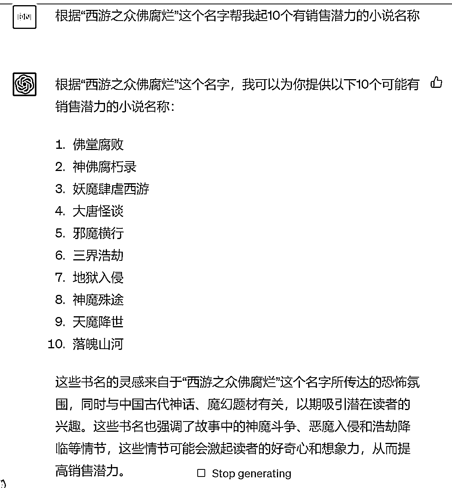
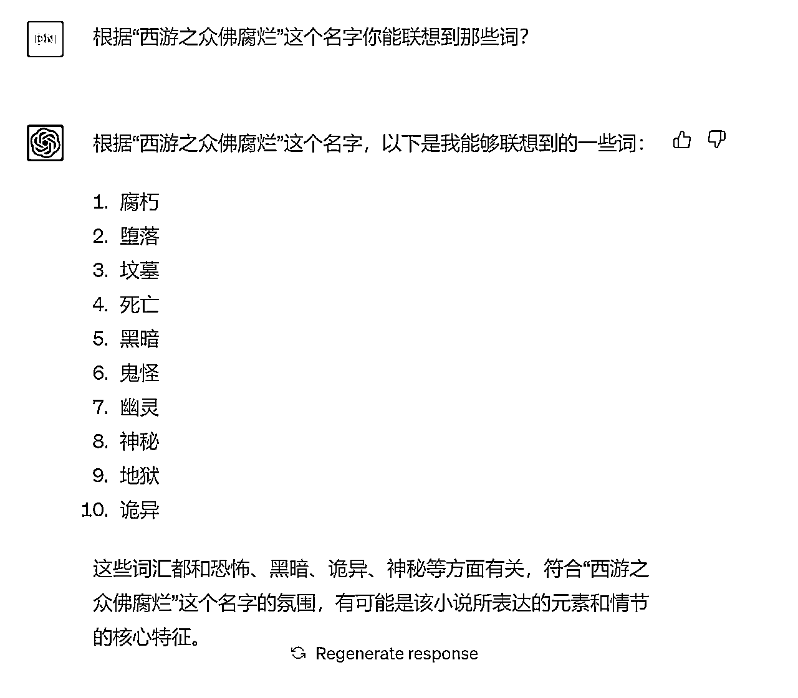
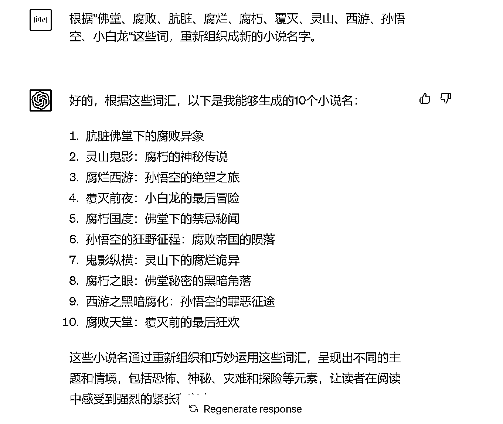
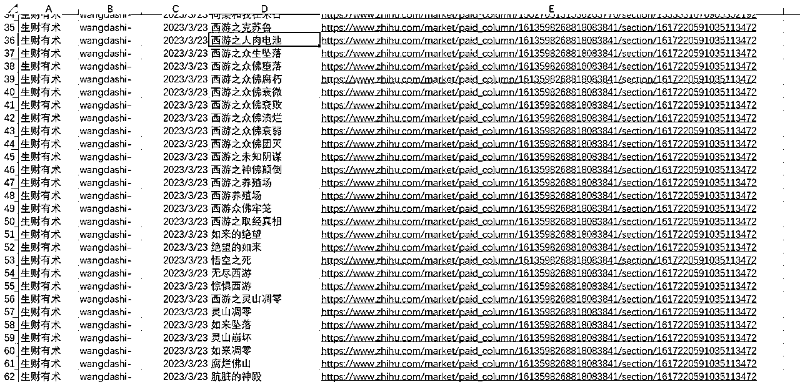

# 4.2 获取关键词 @鲸鱼 @某人周 @王大诗

某种程度上来说，关键词好比文章的“脸面”，对于配音号来说，关键词一般放在视频上、下方醒目位置，或者在发布时添加一个显眼的封面，让观众点进主页的时候能够一眼看到。

1）组词简单，通俗易懂

关键词不用复杂拼音、不含生僻字、不含需要多次输入的单字。观众输入关键词是为了找书的，从抖音到其他 app 已经有些繁琐了，不要再给观众添麻烦了。

比如 “宸宸星愁” “氤氲难眠” “流萤渐沉” 等，乍一看蛮文艺，但种词只适合作者给文章起名字，不适合我们用来当关键词。关键词是拿到后切换到另一个 app 键入搜索的，越简单越容易输入越好，一眼就能记下来最好。

实在没有思路就去晋江文学城看一看，如下图，看看人家职业作者是怎么起名的，或者从里面挑几个关键词拼接一下都可以，挑简单的来。

2）与文章情节有关

关键词最好能够明示、暗含文章核心剧情，如“分手” “千金”，或者包含文中某个重要的道具，比如“信封” “房本” “首饰” 等。

举个例子，今年高考后许多爽文喜欢用重生回到高中的套路：

比如重生后考了高分就叫 “重生高分” “重生状元” “重生第一” 等；重生后打脸看不起自己的人就可以叫 “重生打脸” “重生反杀” “重生翻盘” 等；重生后的狗血感情戏可以叫 “重生情缘” “重生前任” “重生复合” 等；

再进一步，还可以用三个字的词组概括文中剧情，拿穿越举例子：

穿越后和渣男分手的，可以叫 “穿越要分手” “穿越不和好” “穿越没缘分” 等；穿越后经商炒股赚大钱的爽文，可以叫 “穿越当土豪” “穿越不差钱” “穿越当股神” 等；穿越后脱离原生家庭悲剧的，可以叫 “穿越不回家” “穿越要脱身” “穿越不领情” 等。

中华文化的博大精深不是盖的，关键词的组合千变万化，多组词多看别人关键词找灵感。还可以确定一个前缀（如高中、重生、眼泪）或后缀，专心为它找搭配，减少了组词时间还能做到关键词/标题整齐划一。

3）避免出现人名、地名、职务等敏感词

有些名称、代号、隐喻是绝对不能碰的底线。如：公众人员名称、明星名称、地区名称、公职人员职务等。

4）使用 ChatGPT 提取关键词

第一步：通读选择好的小说

此处以知乎故事[《西游之众佛腐烂》](https://www.zhihu.com/market/paid_column/1613598268818083841/section/1617220591035113472)为例，点击蓝字可直达故事。

第二步：使用 ChatGPT 来生成关键词

1\. 直接根据原名生成

直接将生成的名字，提交关键词申请。

参考话术：根据「小说原名」这个名字帮我起「数量 X」「形容词」的名称。

此处「形容词」一般参照小说标签，例如“爽文、克苏鲁、穿越、系统、种田”等。

2\. 直接根据原名联想

利用联想的词，直接做替换就可以去提交审核了。

参考话术：根据「小说原名」这个名字，你能联想到那些词？

例如：西游之众佛+「替换词」，可以得出 西游之众佛腐朽、西游之众佛堕落 等小说名字。

3\. 根据提炼词组词

通过上面几个操作，我们会收集到不同的关键词，结合自己对小说故事的理解，可以把一些有“开幕雷击”属性的词进行拼装。

参考话术：根据「n 个关键词」这些词，重新组织成新的小说名字。

通过组词，我们得到了一种新的小说名字格式 《孙悟空的绝望之旅》。

4\. 根据以上灵感造词

如果你熟悉这种口味的小说，那么你通过以上操作，会有自己的灵感。

例如：西游养殖场、西游之人肉电池、西游之众佛团灭养殖场：是根据故事情节联想出来的；人肉电池：是根据克苏鲁风格联想出来的；众佛团灭：是根据网络热词联想出来的。

小经验

•提审：不需要去知乎再查询关键词是否被抢占，直接一次把一本书的标题穷尽即可，知乎一般是合集 50-90 集，基本上一个故事，1 分钟起五个名字。

•书名：去各大平台收集一点书名格式，例如，从 XX 开始变强、我穿成了 XX、开局激活 XX，这是积累经验是手感。

•操作：电脑操作把页面都打开复制插件都装好，没有插件的可以用微信截图或 QQ 截图文本提取，效率都差不多。

内容来源：《知乎小说推文项目保姆级实战教程》《小说推文进阶玩法，精细化运营所带来的稳定出单》ChatGpt 辅助小说关键词申请

