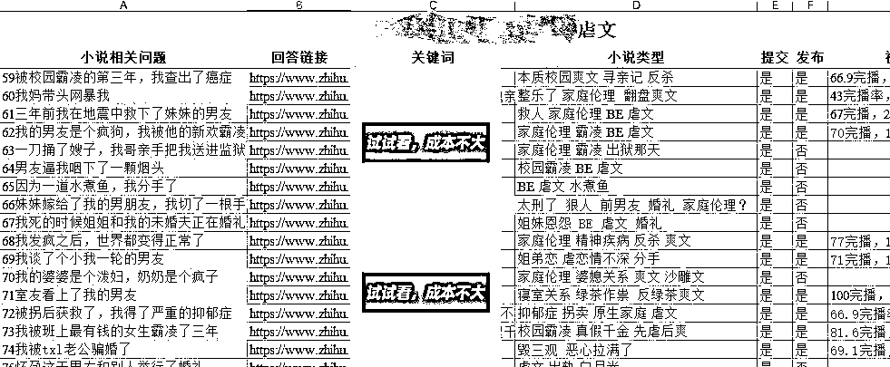
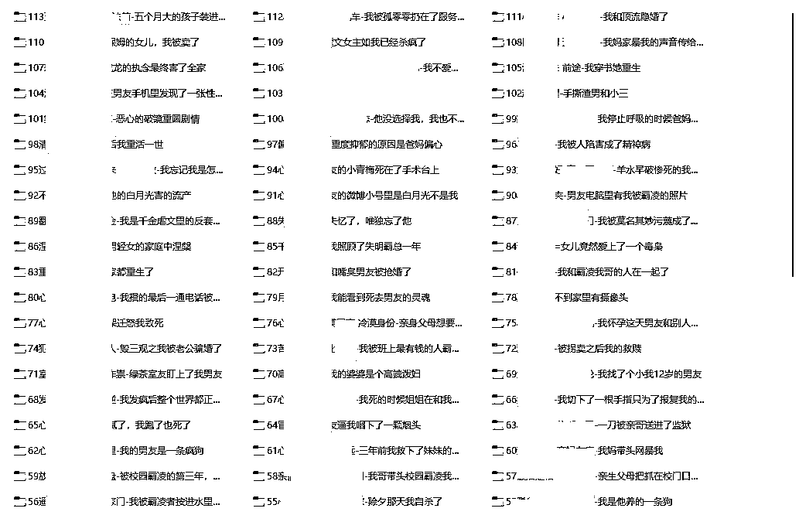

# 4.4 制作选文表 @某人周 @seven

在选文的同时，可以为账号制作选文表，便于对账号的数据分析和复盘。

以下面一个虐文号的选文表格为例，从左到右依次是剧情概括、专栏链接、关键词、小说标签、是否提交和发布。

对于每一篇入选的文章，创建单独文件夹，并用编号+关键词+一句话概括命名。这样做一是能构建直观清晰的备选文库，二是加深我们对选文改文的印象和理解。

内容来源：《起底小说推文整体逻辑，一个月实操分享》《小说推文进阶玩法，精细化运营所带来的稳定出单》

