# 5.1 确定图文类型

在制作图文之前，我们需要先确定适合自己的账号类型。

每个方向都有优秀的案例，如果你是新手，建议优先选择自己感兴趣的内容类型。如果没有感兴趣的，可以选择「黑底白字类」或「事件改编类」的内容形式，该形式操作简单，爆款概率更高，对新手比较友好。

从批量化来看，图文也是非常适合适合团队操作的内容形式。

本节介绍的图文类型，以图文内容为主，部分呈现形式可能为图片组合成的视频，需要移步「六、创作并发布视频」，学习制作流程。

1）图片轮播

内容形式：节选小说简介页面、书籍内容页面、评论区页面各一张截屏，最多两张。

类型特点：形式简单，适合个人操作，一天可以操作几十个账号，常见在番茄小说推广上。

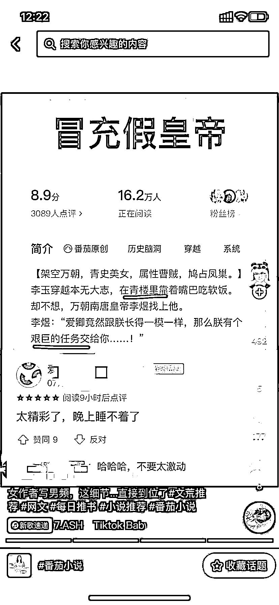

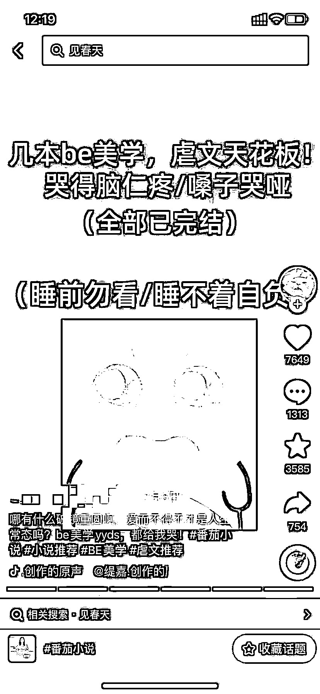

2）事件改编类

内容形式：此为图片轮播类的进阶版。在原有书籍简介的基础上，新增有冲击力的图片，配文根据真实案件改编，吸引人点进来。图片不能用真实案件、真人照片，推荐使用相关剧照，注意不要选到明星、名人等照片，可能会引发争议或涉及侵权问题。

类型特点：形式简单，但比普通推文作品更有冲击力，爆率更高，目前以推理小说为主。

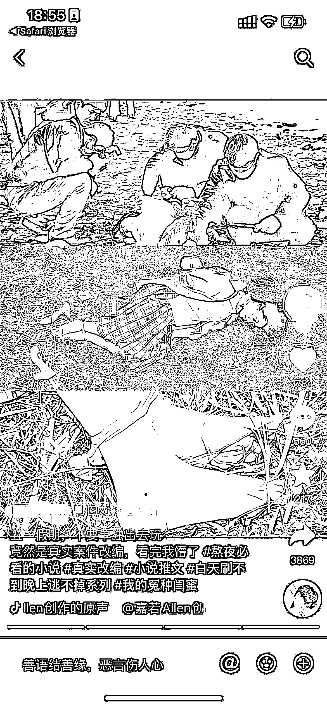

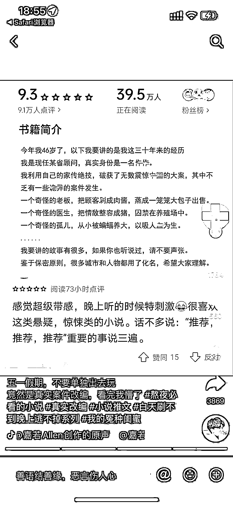

3）长截图

内容形式：多张截图合并成一张长图，通过添加关键帧滚动播放，做成录屏效果。制作流程上需要参照「六、创作并发布视频」。

类型特点：受众人群和图片轮播类的相似，常见在知乎小说推广上。

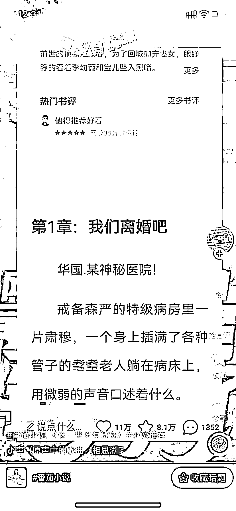

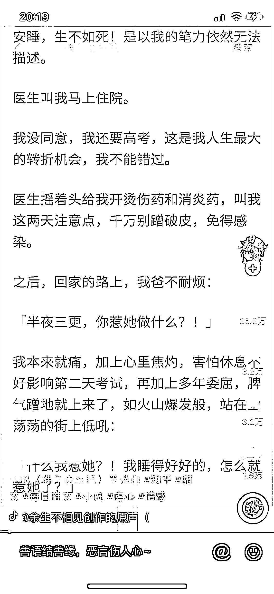

4）风景文案

内容形式：节选小说精彩部分粘贴在描述中，并搭配相似风景图片，长篇描述也可以提高完播率。

类型特点：容易出爆款，需要深度理解小说内容，具备原创文案的能力，常见在晋江、起点小说推广上。

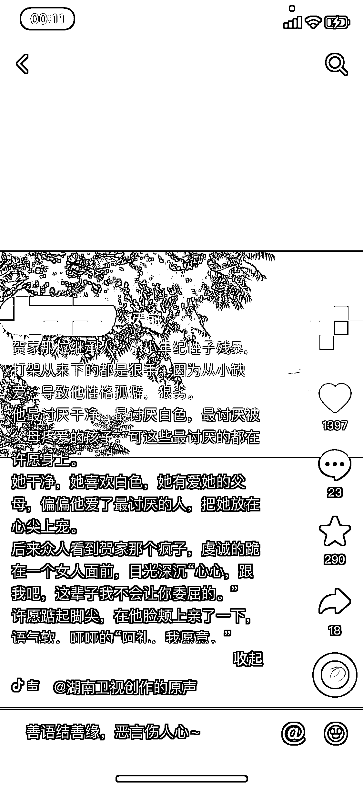

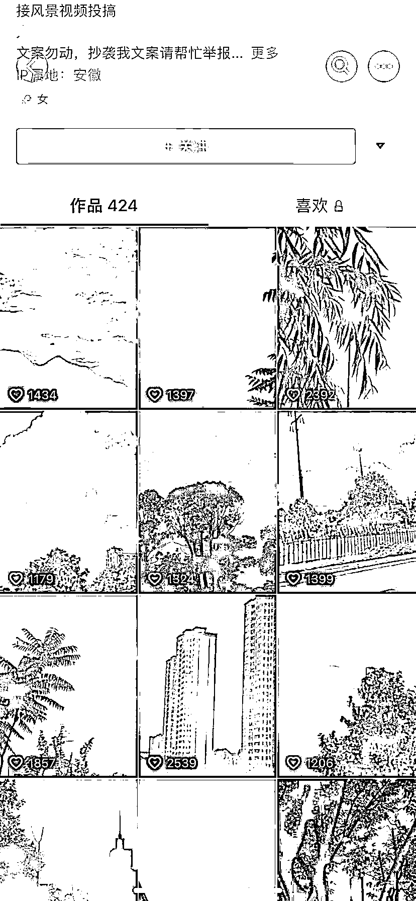

5）聊天记录类

内容形式：以聊天对话的形式，讲述小说的精彩部分。在抖音上，通常是做成滚屏效果。在小红书上，基本都是截图形式。

类型特点：原创度相对较高，以第一人称视角讲述故事，用户更容易被代入其中。

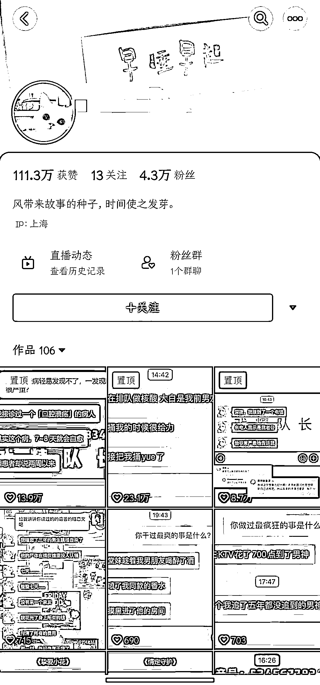

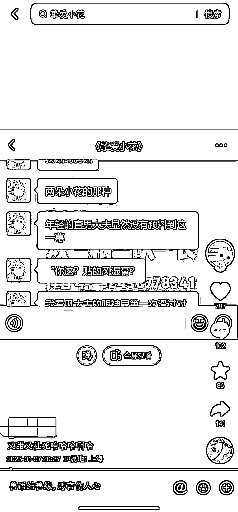

6）黑底白字类型

内容形式：节选小说精彩部分，以黑底白字的形式呈现，通常 10 张以上。

类型特点：形式简单，在一众推文笔记中较为显眼，受众人群和图片轮播类的相似。

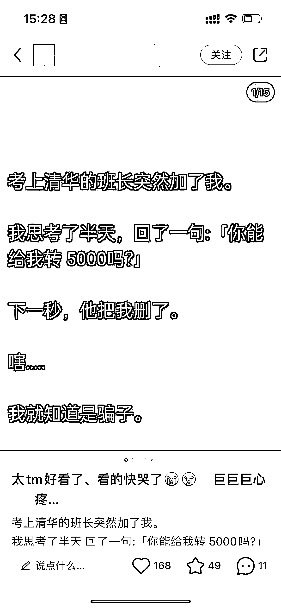

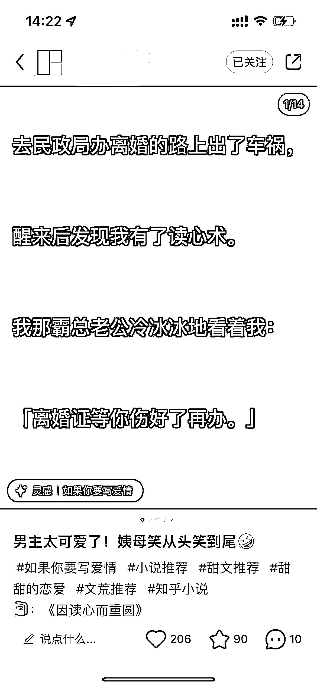