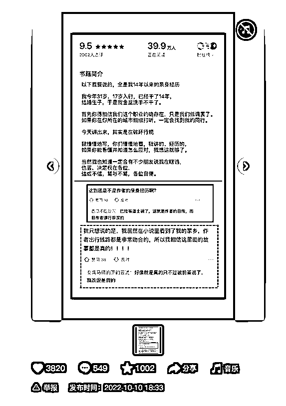
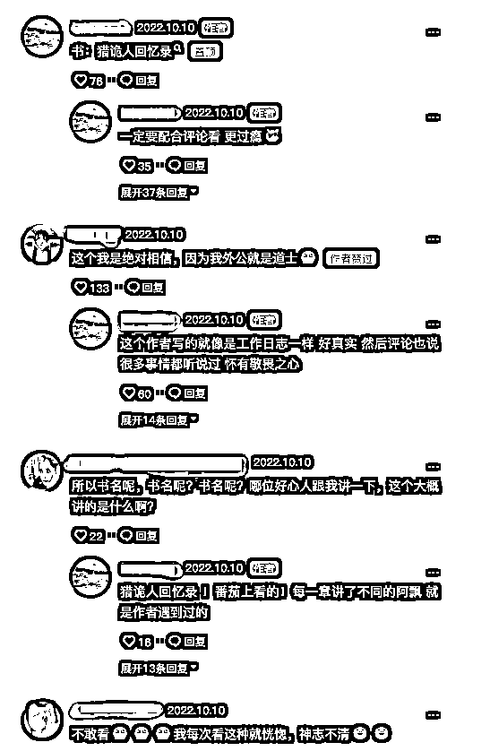
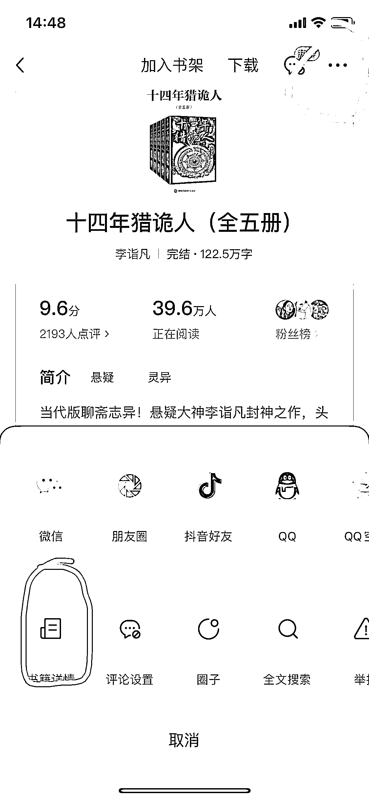
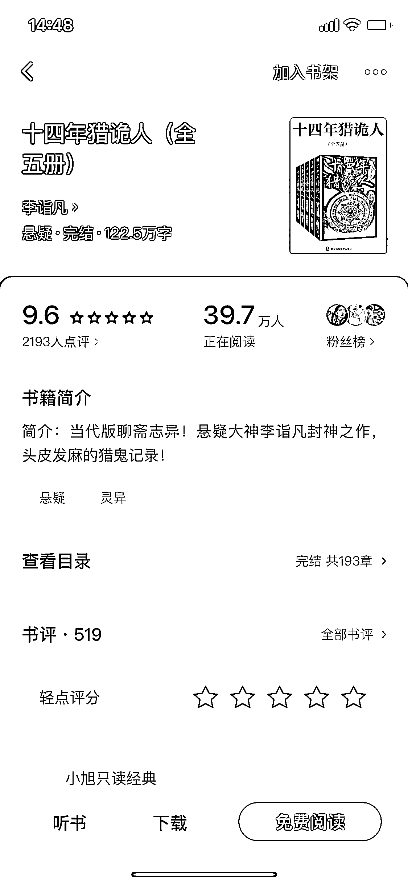
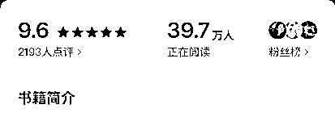
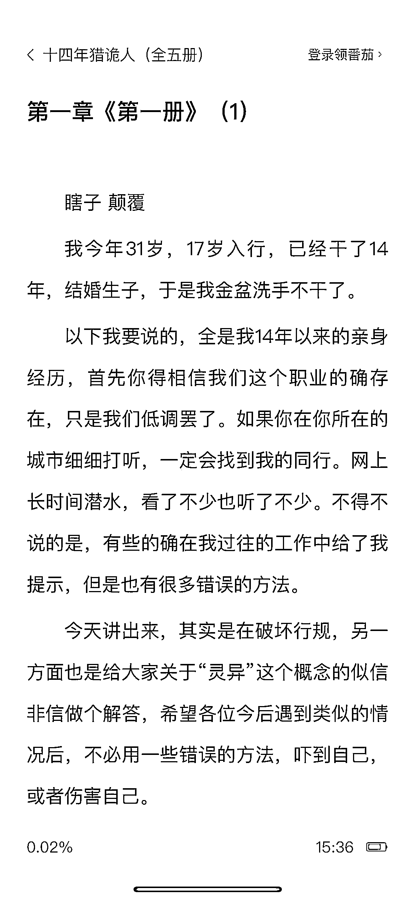
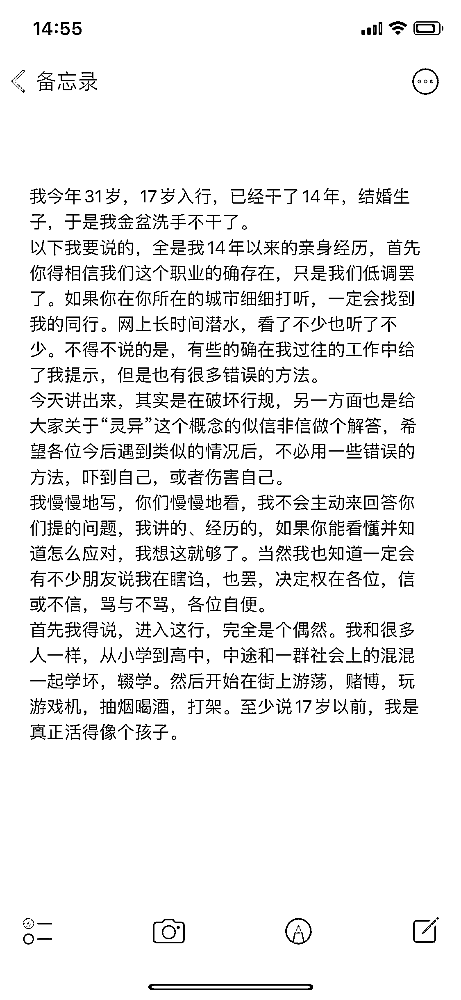
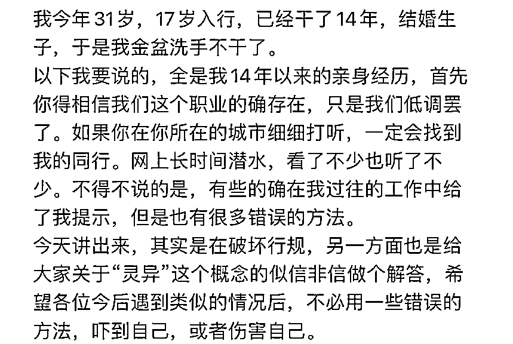
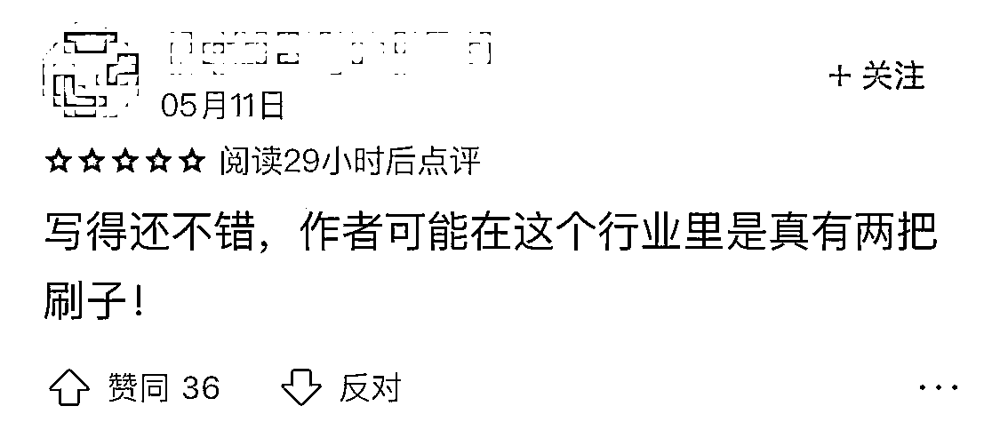
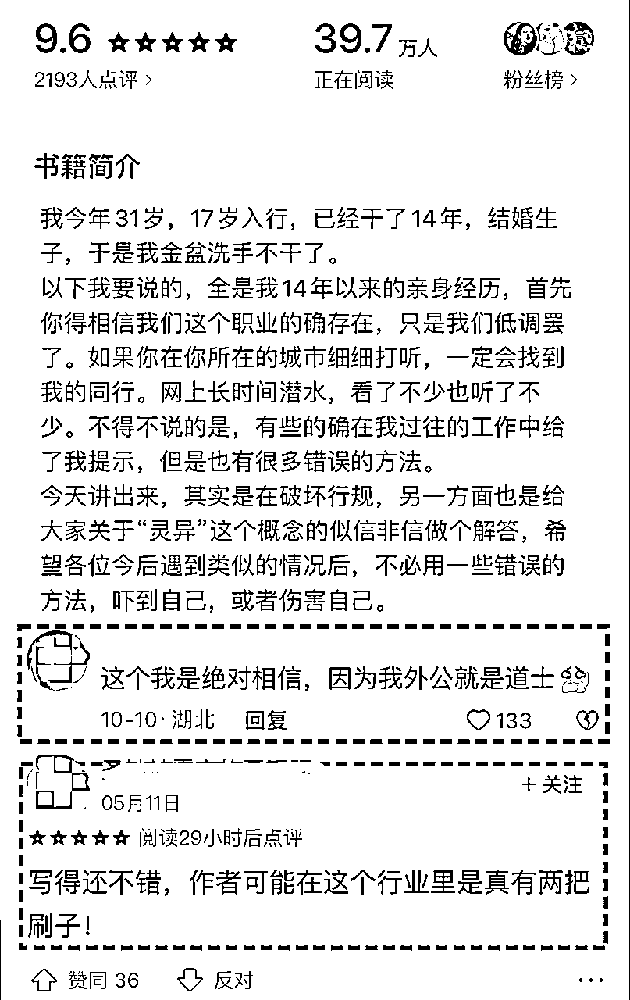

# 5.2.1 图片轮播型

在制作图文作品前，我们先来看一张经典案例。

可以看到这张图片在制作上并不精美，还有很多瑕疵，然而评论区却无人在意，大家都在讨论小说内容。这就是评论区的维护技巧，在后文「7.1 评论区维护」中会讲到，本节主要讲解如何制作此类作品。

第一步：寻找图文素材

拆解这张示例图片后，我们可以看到，该图片由评分、书籍简介、评论拼接而成。下面我们将具体说明，如何找到这些素材。

1）评分

首先我们确定好小说，并找到其评分页。

以示例小说为例，原书名为《十四年猎诡人（全五册）》，可以在番茄小说上找到，如下：

点击右上角三个点，打开【书籍详情】，此时我们就得到第一个和示例作品中相同的地方——书籍评分。

2）书籍简介

示例作品的第二部分是书籍简介，需要注意的是，内容不是直接复制简介，而是选取小说中的精彩内容片段。如示例作品中复制的为第一章的内容。 至于如何找的文章的精彩内容片段，参见「4.3 套路化改文」。

复制下来后，粘贴到自己的手机备忘录然后截图，如下：

3）评论

第三部分评论，我们可以在小说的评论区截取，也可以在小红书或者抖音，任意一些小说推文的作品下面截图，只要是合适的都可以。例如以下两张：

第二步：完成作品拼接

在获得上述三种素材后，我们就可以将图片进行拼接了。

任何图片拼接工具都可以使用，这里提供美图秀秀使用方法。打开电脑，用美图秀秀将所有素材拖进去组合拼接。

具体可以参考以下视频：

[2022-10-15 18-34-25.mkv](https://search01.shengcaiyoushu.com/upload/doc/IASDdPTG3oPX6ixNb32cM39LnFg/OQSibaw8qoYP4ixqTpScfW2VnYd)

成品如下：

