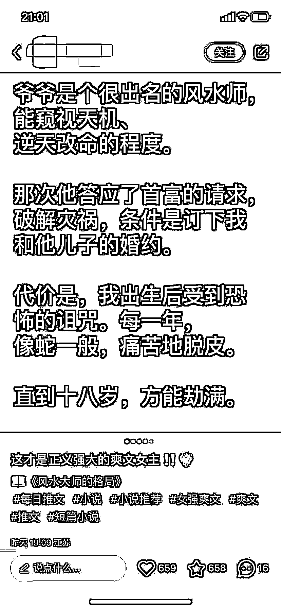
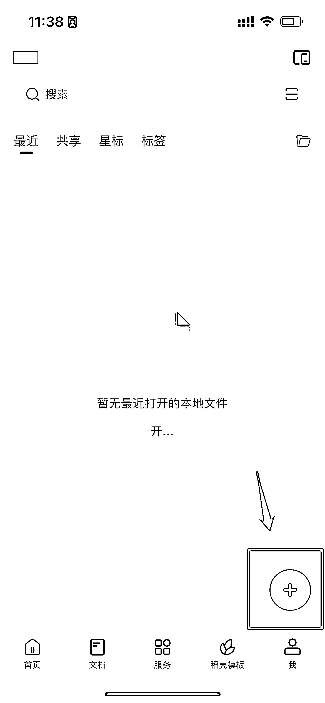
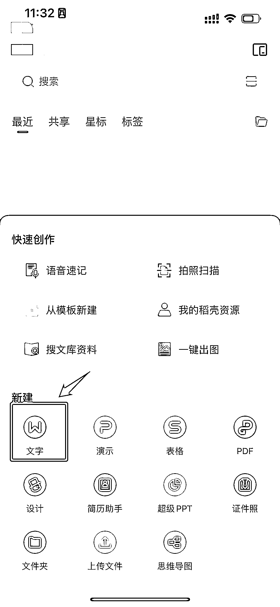
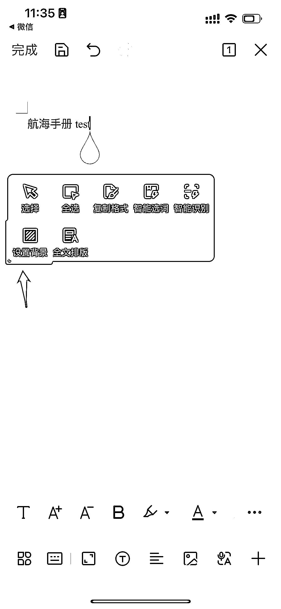
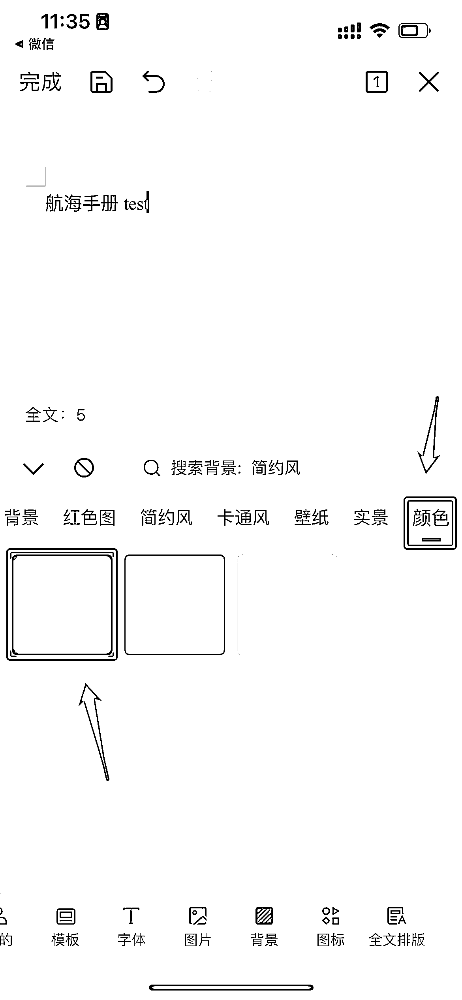
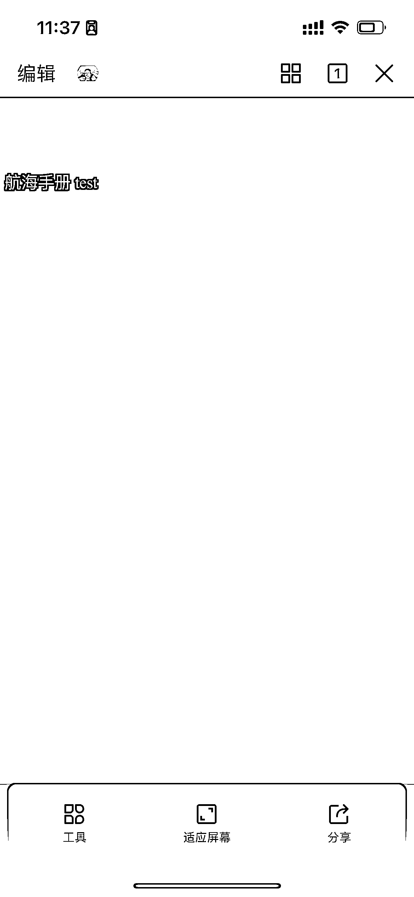

# 5.2.3 黑底白字型

首图最好是自己提炼的，最精彩的内容片段，最好不要超过 5 句话。

后面就可以放小说正文，一般是小说第一章的内容。图片数量不限，但要注意顺序放置，否则会影响阅读体验。

上述这种黑底白字的图片，推荐使用 WPS 制作，或者手机开夜间模式，在小说平台直接截图。

这里我们以手机端为例，说明如何使用 WPS 来制作黑白图片。

第一步：打开 APP，选择右下角「+」。

第二步：新建「文字」，打开空白文档，粘贴我们需要的文字内容。

第三步：点击光标，会出现一个简易任务栏。选择「设置背景」，会进入背景页面。选择「颜色」-「黑色」，会出现黑底白字界面。截图后，就能获得黑底白字的图片。

