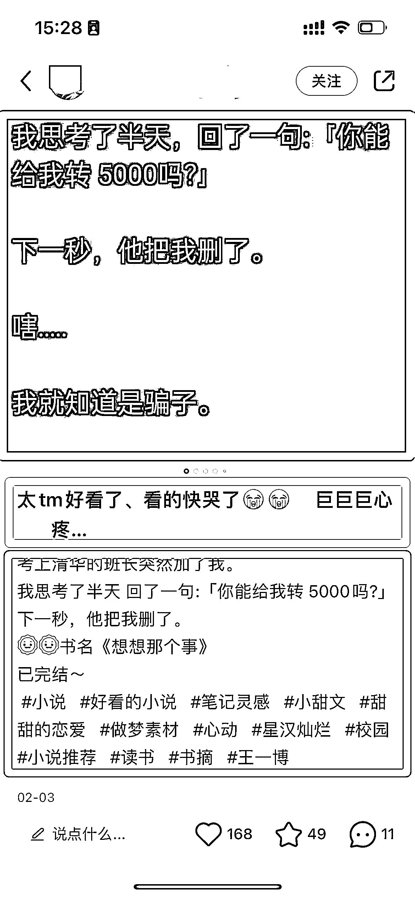
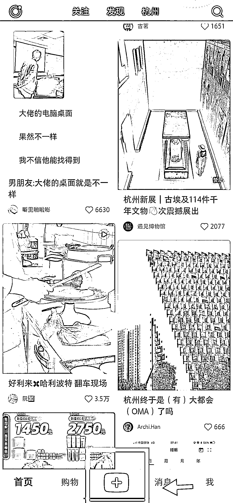
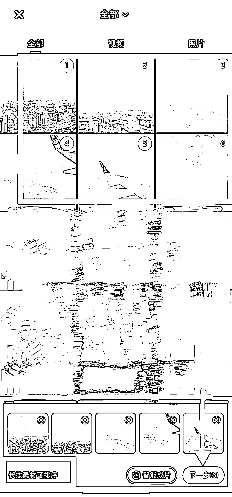
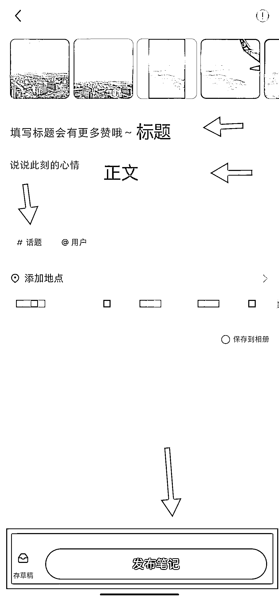

# 5.3.2 小红书发布流程

一篇小红书笔记，主要由以下 3 大内容构成：封面图、文字标题、正文。

如图所示，红色框是封面，黄色框是文字标题，蓝色框是正文。

如何实现这样的发布呢？

•第一步：

•第二步：

•第三步：

结合上述三张图片，来看三个发布步骤。

•第一步：打开小红书，点击主页中间正下方的「+」；

•第二步：进入相册，按顺序点击我们要发布的图片，第一张图片即为我们的笔记封面；

•第三步：在标题、内容处分别填入内容对应内容，并选择自己的笔记#话题，发布笔记。

这里有两个小技巧：

一是可以提前复制好笔记内容，直接粘贴-调整格式-添加表情即可；

二是提前想好自己的笔记标签，可以参考同类爆款笔记的标签选择，需要特别注意的是，标签不要直接复制，必须手打。因为经过实际测试，复制标签的流量不好。

