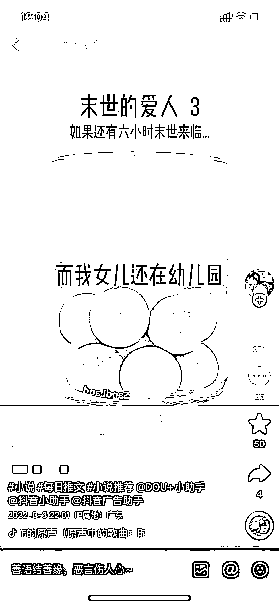
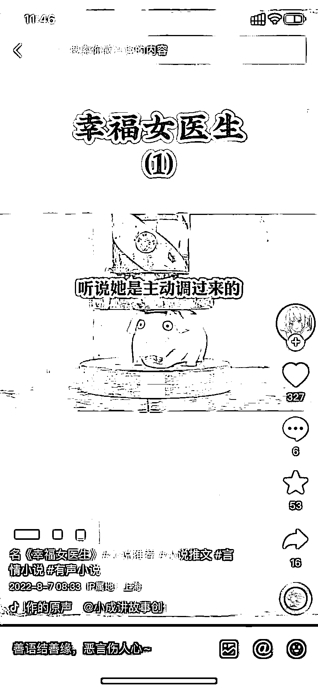
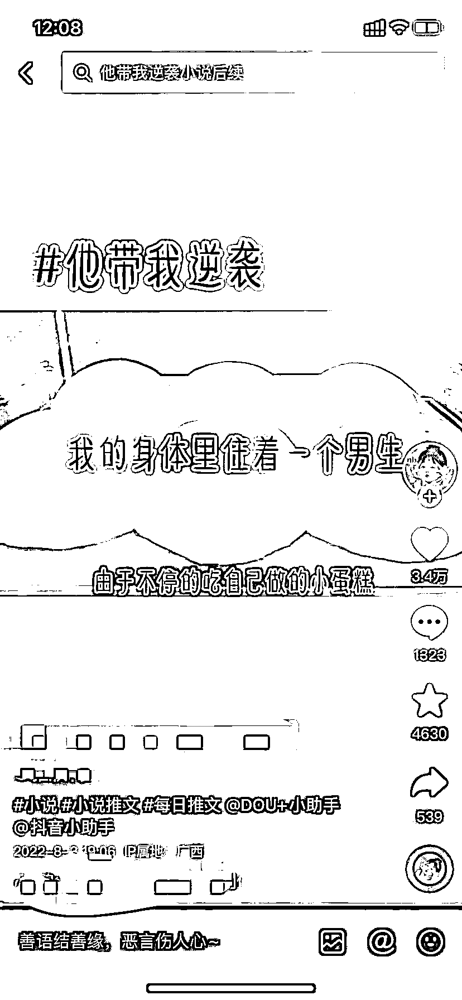
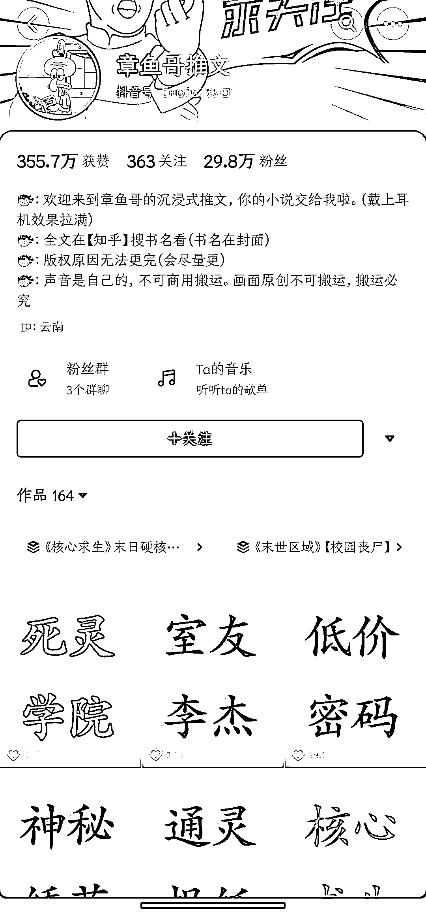
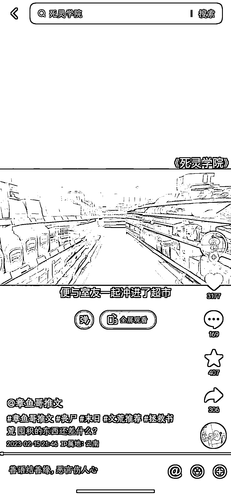
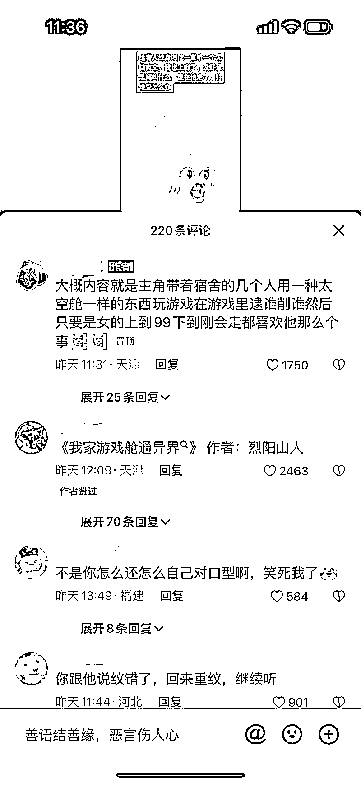

# 6.1 确定视频类型 @seven@张柯 Ker

在做视频之前，我们需要先确定适合自己的账号类型，每个方向都有优秀的案例，如果你是新手，建议优先选择自己感兴趣的内容类型。如果没有感兴趣的，可以选择游戏类视频的内容形式，该形式原创度高，对新手比较友好。

如果你时间不足，追求赚钱速度的性价比，推荐的展现形式是：

图文类 > 真人出镜 > 游戏 AI 配音 = 混剪 AI 配音

如果你时间充足，想学习技能，沉淀经验，赚多少钱无所谓，推荐的展现形式是：

AI 绘画+真人配音 > AI 绘画 + AI 配音 > 混剪 + AI 配音 > 游戏 + AI 配音

值得注意的是，AI 绘画这种纯原创账号是没有违规风险的，但是相对来说制作流程非常长，而且也不一定能拿到好看的数据，任何玩法都存在做不起来的概率性，投入产出比的预期要自己把握。

1）游戏视频

适应人群：男女用户比例相差不多，可作为普适性素材。

素材来源：目前比较流行的为地铁跑酷或王者荣耀/QQ 飞车手游，可以自己录制也可以在网上随意下载素材。

2）解压视频

适应人群：喜欢悬疑故事的人群。

素材来源：搜索「液压机」、「解压」等关键词查找。

3）美食/绘画视频

适应人群：喜欢甜文的人群，女性占比比较大。

素材来源：视频类型比较杂，蛋糕、轻食等，可搜索「烘焙」、「油漆画」等关键词查找。

4）AI 绘画类

类型特点：原创度高，模式发展更为长久。但制作相对耗时，且需要有一定 AI 绘画基础。

案例账号：章鱼哥推文

5）真人出镜

类型特点：模式发展更为长久，前期可以推文或者推小说，后期可以推广实体书。但制作难度相对较大。

案例账号：帅帅的牙签云、烽火聊网文等。

此外，结合真人出镜和 AI 特效，能在一定程度上降低真人出镜视频的门槛，减少尴尬程度。同时视频效果会比单纯的 AI 配音好很多。

内容来源：《起底小说推文整体逻辑，一个月实操分享》

