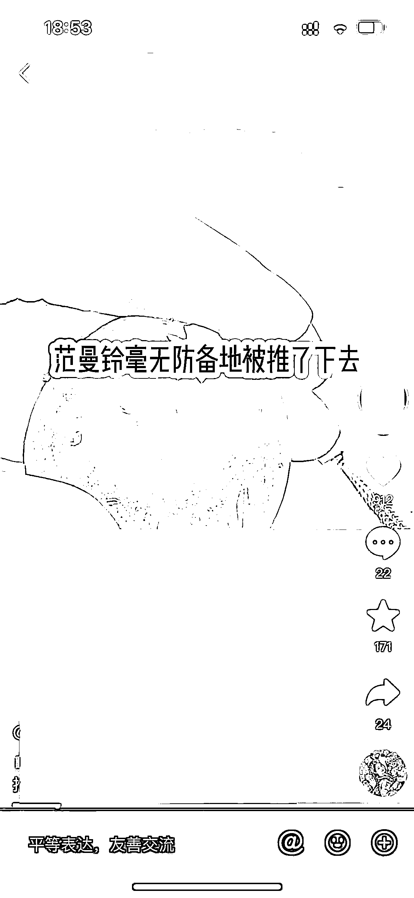
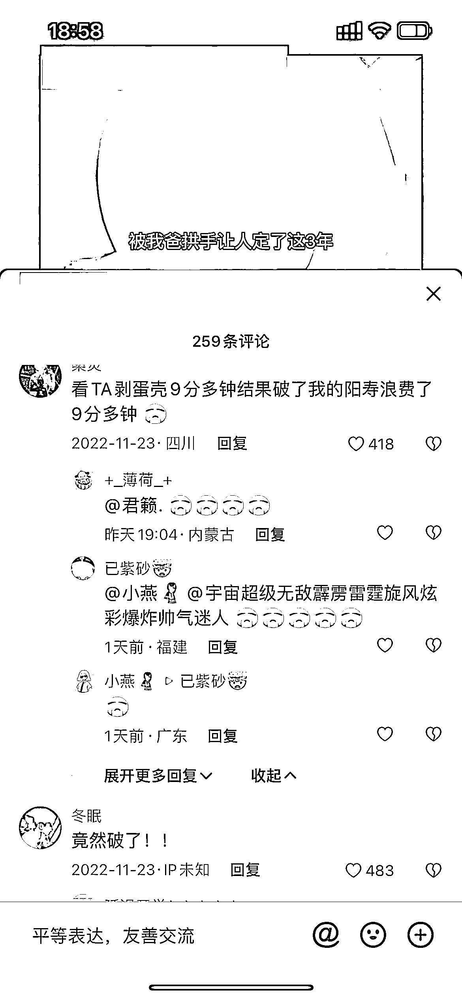
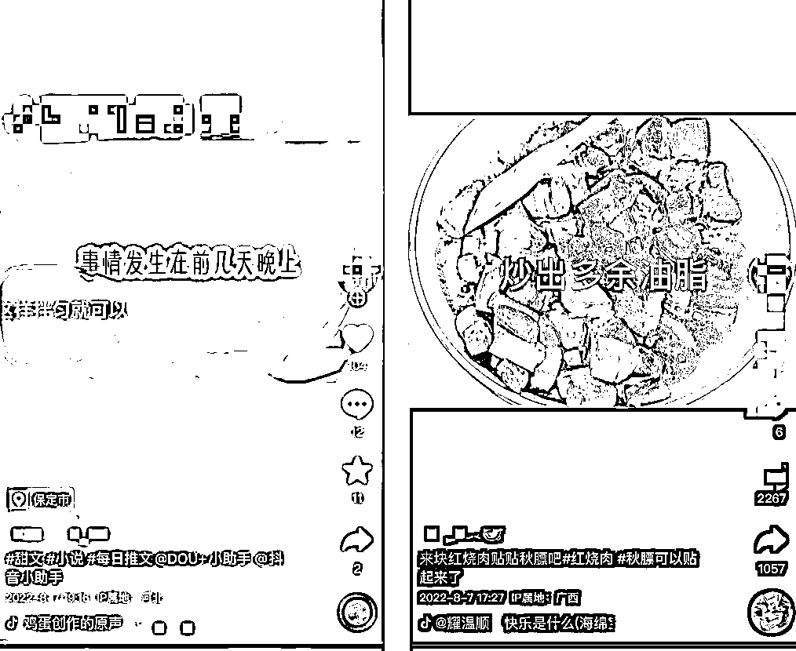

# 6.2.1 抖音平台

比如最近热度较高的美食类视频，很多都是在抖音上找到的。这些经过平台验证过的素材，我们剪辑拼接发到抖音上，火的概率会比其他素材要高。

但抖音上的视频千千万，甚至每时每刻都有视频在上热点，个人建议，先去看看同行在用什么素材，美食甜点？手工制作？解压放松？

确定大类之后，再去搜索比较细分的素材，比如美食甜点下可以有马卡龙、泡芙、巧克力蛋糕；手工制作下可以有木雕、木工、砌房子、陶艺等等。

此外，最好选择“自带梗”的素材，选择那些有趣的、新奇的、能引发争议的素材，这里举个例子：剥鸡蛋。

剥鸡蛋就是比较冷门小众的素材，谁能想到用工具剥鸡蛋壳都有人爱看呢？而且点开评论区，观众对素材本身的讨论热情甚至还盖过了小说，这类冷门并能拉高互动率的素材是重点考虑对象。

但这类素材的重复度相对较高，需要经过深度剪辑处理。剪辑操作步骤可以参考[《如何剪辑视频和制作视频模板》](https://shengcaiyoushu01.feishu.cn/docx/doxcnA72uVU4Aq4TYuApGrPLaxb)

优点：素材经过验证；

缺点：重复度高。

