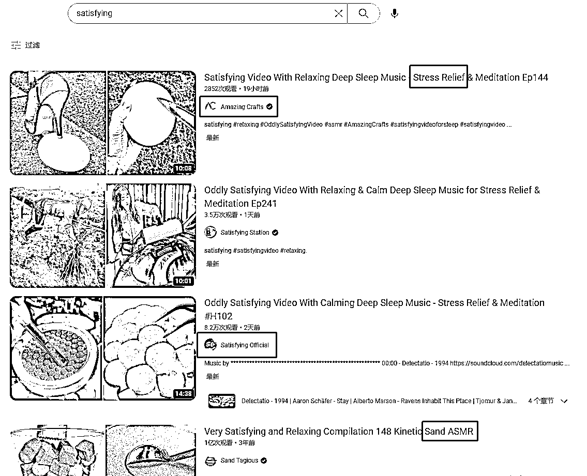
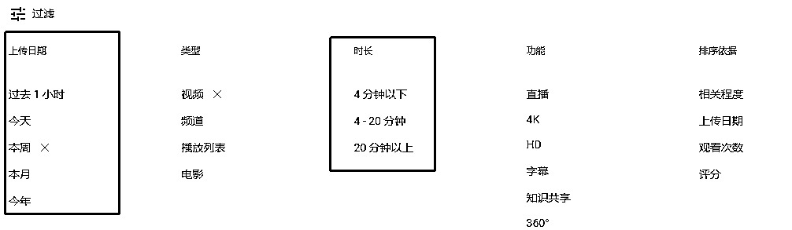
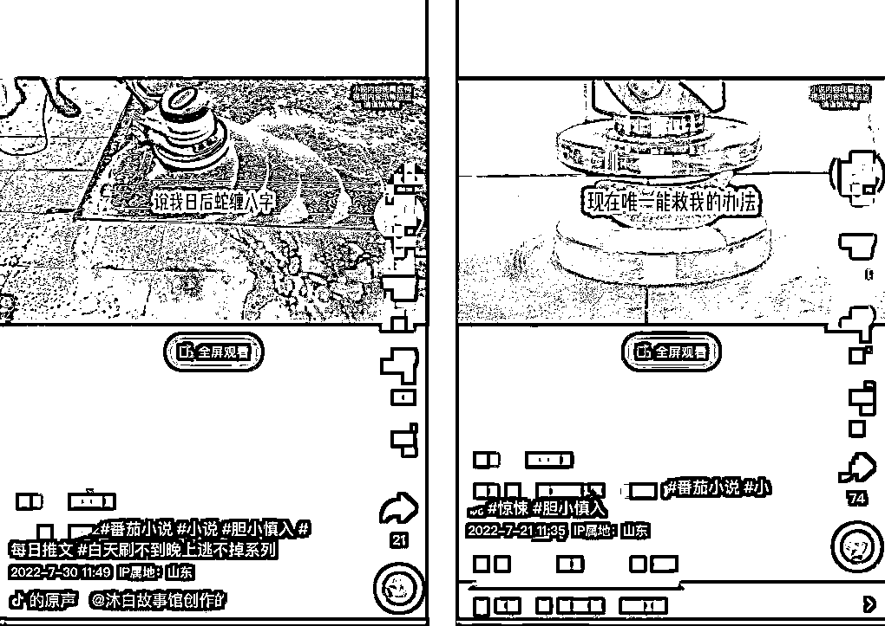

# 6.2.2 国外平台

比如解压类的视频，抖音上也有相应的素材，但国外平台相对较多。可以在国外平台（例如 YouTube、Tik Tok、推特等）使用不同语言去搜索。关键词如：清洗地毯、汽车修复、液压机等。

最常用的国外视频素材网站：YouTube，素材更新奇，画质更优，数量更庞大。而且你稍微刷一刷油管就会发现，抖音上很多博主也是搬运的有关素材，如果你用过他的素材，恭喜你现在找到“老祖宗”了。

搜索外网素材需要注意的是，在油管等国外平台搜索素材得关键词必须是英文，且是符合老外使用习惯的英文，如果你还是直截了当搜索“美食甜品” “做饭”等等，搜出来的很可能是同一批博主发在油管的同一批视频 。

比如你想要一些解压视频，如果你直接输入“解压”，得到的大都是挤痘痘、清黑头、清粉刺的“解压视频”，这类属于猎奇素材，有博主测试过效果，互动高但转化率很低。

换个词，搜索“satisfying”，这个词直译是“令人高兴、愉悦的”，这样得到的才是老外的“解压” “舒适”视频。看他们的标题中，也大多包含 stress relief、satisfying、ASMR、Meditation 等等解压相关的形容词。

其次，在油管搜索时要注意筛选，重点关注上传日期和时长。我们要通过这两个指标找到更新稳定、时长适中、内容优质的素材来源。

优点：重复度低；

缺点：素材未经验证。

