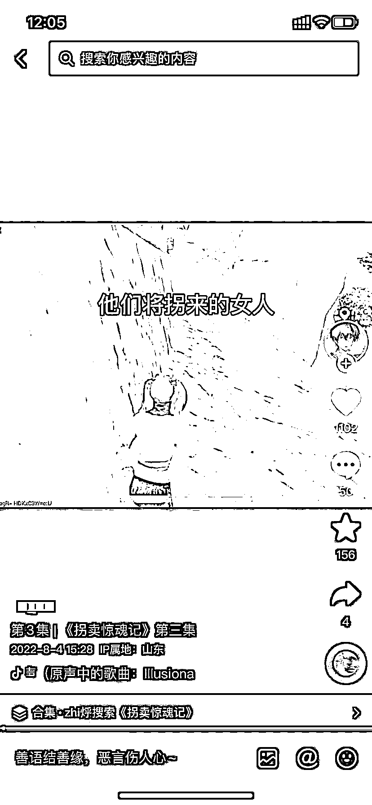
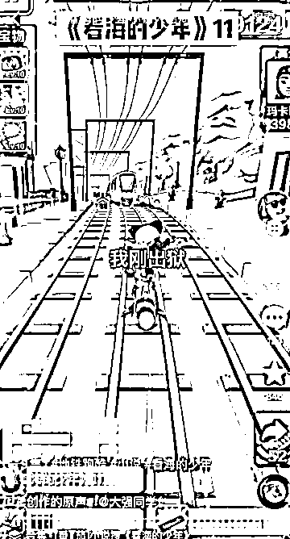
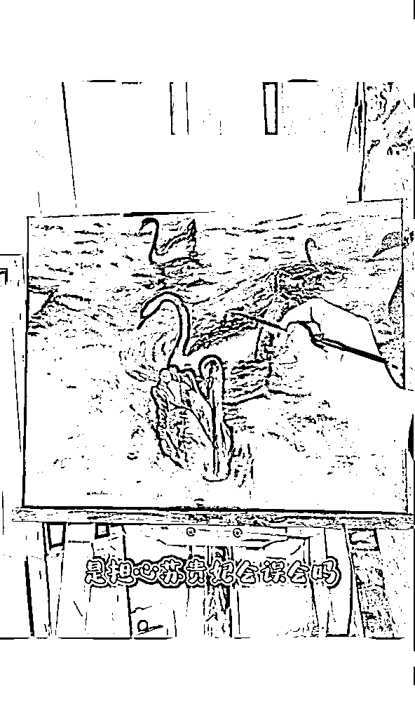
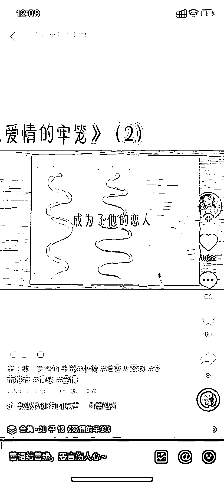

# 第三步：智能字幕

1）字幕样式

字幕样式包括字体、颜色、描边、大小等。不要搞花里胡哨的样式和字体，比如什么草书、行楷，比如什么艺术字、阴影，越想搞特色和差异越容易适得其反。

显眼、清晰就可以了。黑字白边和黄字黑边是最常见的两种字体，足够在背景素材中突出，字体用喵魂体或者新青年体足够，字体样式朴素简单有利于观众观看、理解视频内容。如果比较纠结采用什么字体，可以选择剪映预设的前 3 种。

2）字幕位置

把位置单独拎出来讲，是因为字幕位置需要结合背景素材综合考虑。

比如在使用跑酷素材中，字幕一般被放在靠上方的位置，一是因为该位置不会遮挡住游戏角色；二是这个位置可以引导观众视线落在游戏内的跑道上，拉长大家观看时间：

图为：字幕处于人物上方，不影响游戏人物

图为：字幕处于中间位置，遮挡了游戏人物

换个例子，使用画画素材的时候，字幕最好放在画面下方，因为放在正中央会遮挡很大一部分作画内容，非常影响观感。总结一下，字幕的位置选择需要根据视频内容和观众观看习惯综合考虑。

图为：字幕处于画面下方，不影响作画内容

图为：字幕处于中间位置，遮挡了作画内容

3）内容是否违规

匹配好字幕后，我们一定要对字幕的内容进行处理，删除敏感内容或者用同音字和 emoji 代替。善用字幕的查找替换功能，一次性修改所有相同敏感词。

如何判断敏感内容呢？这一点咱们前文「4.3 套路化改文」中有提到，大家可以看看。

字幕匹配完成后，拉动进度条，将字幕对齐开头和结尾画面，拖动进度条检查一遍，尽量做到字幕紧挨连贯，没有明显空档。

