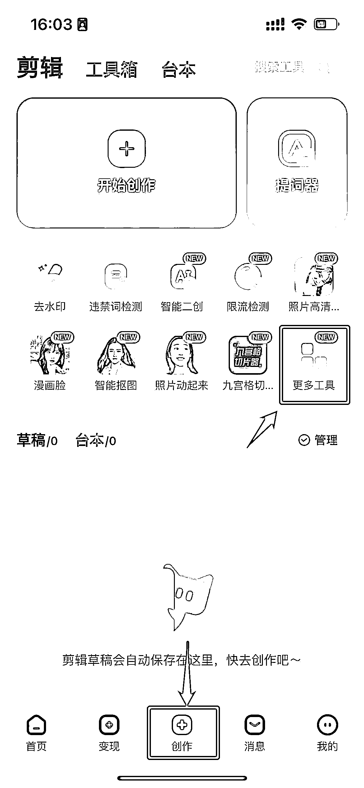
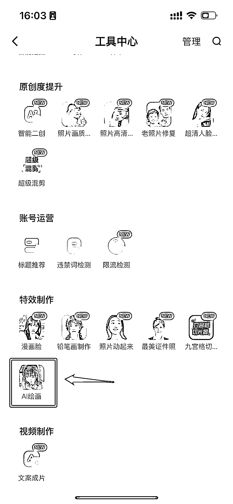
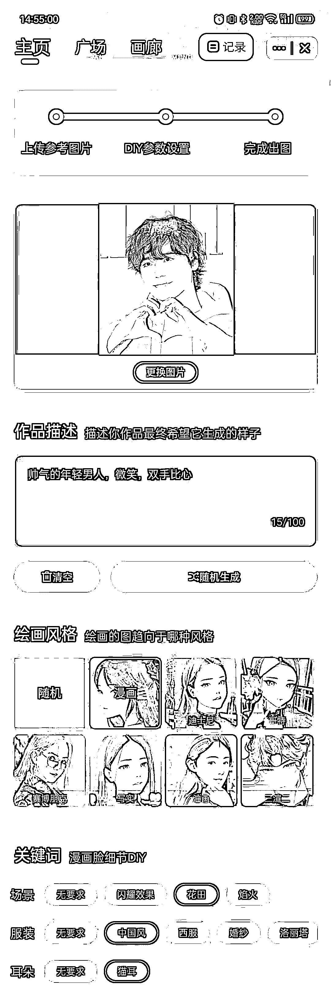
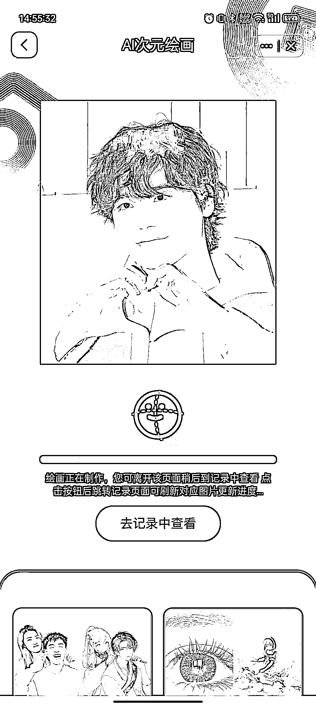
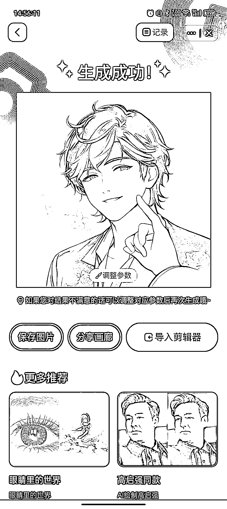
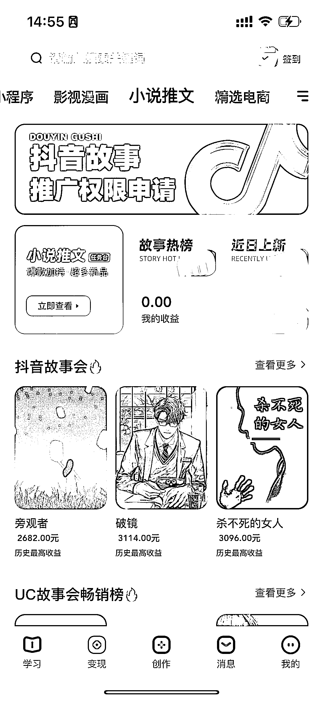

# 拓展工具：创作猫 APP

想快速上手小说推文，视频创作方面，除了剪映，还有创作猫 APP 可以提供一站式服务。

创作猫 APP 的视频剪辑功能与剪映基本相同，但增加了很多 AI 工具，可以辅助创作。这里我们主要介绍 AI 绘画功能。

打开创作猫 APP，进入「创作」页面，点击「更多工具」，进入工具中心。下拉页面即可看到「AI 绘画」功能。

要想完成一张 AI 绘画的作品，我们需要：

•上传参考图片（AI 将在此基础上进行转绘）

•完成作品描述（描述希望生成的作品）

•选择绘画风格和关键词

具体参考下图：

该 APP 内有小说推文变现入口，但和前面服务商不同，注意区分。由于变现逻辑基本相同，在这里不展开讲述，有需要的可以自行前往 APP 查看。

