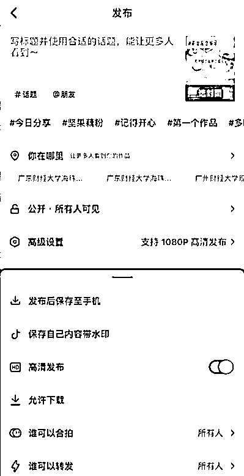
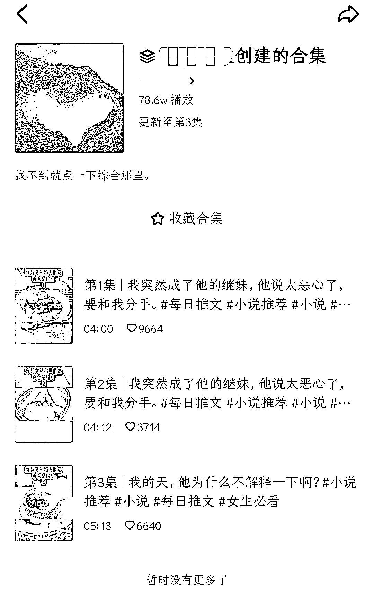
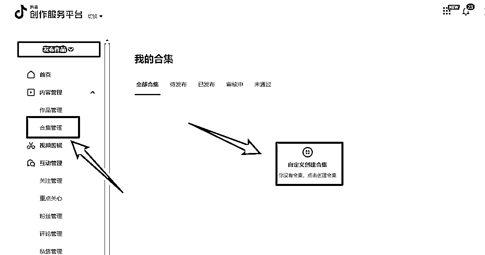
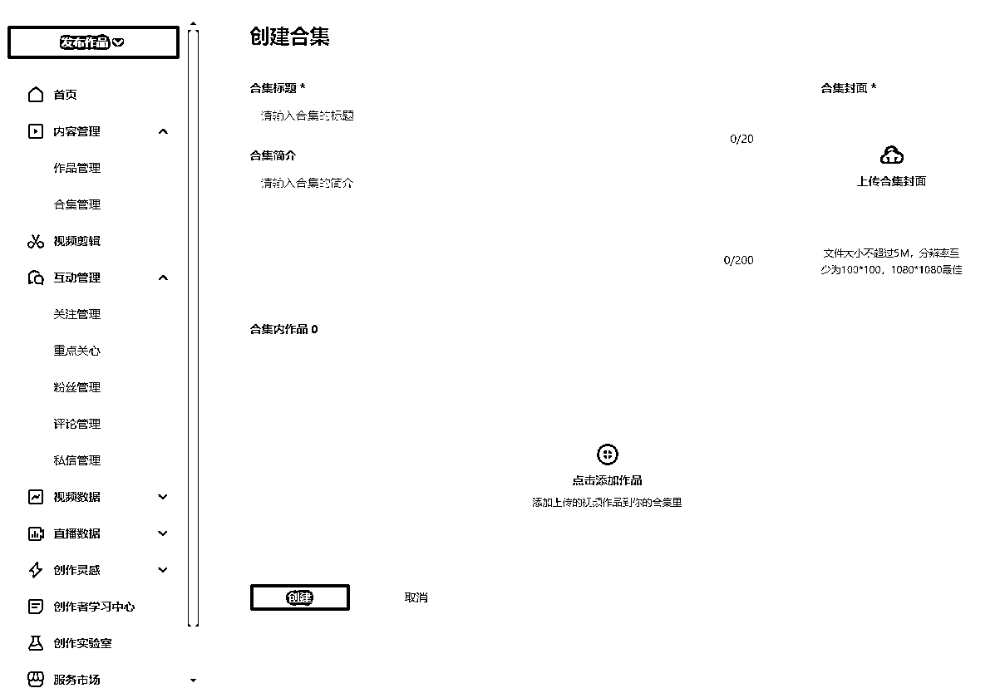

# 6.4.1 抖音 发布流程 @鲸鱼 @seven @某人周

抖音并不只是发布视频的工具，发布每一条视频前的 5-15 分钟就该上线了，开始刷一刷同行视频，给视频点点赞，在同行评论区留言，关注一下同行的引导方式和评论区优质发言。

看一眼热点宝，在热点宝-视频页面搜索推文，尤其关注一下近三天有哪些爆款文章，思考该文章能否进入自己的选文库；点开看看评论区，学习借鉴一下互动率高的热门评论，便于以后自己造互动。

发布前需要再次检查视频是否完整，是否包含违禁词，画面内容是否符合要求。在上传作品后添加「话题」，话题主要分为常用话题和垂直话题，这里根据所推账号类型添加即可。

常用话题：#小说、#番茄小说、#小说推荐、#小说推文、#文荒推荐等；

垂直话题：#悬疑小说、#言情小说、#都市爽文、#言情、#女频等。

同时关闭作品同步，在高级设置中关闭「保存本地」「允许下载」。发布完成之后，不要立即关闭抖音，等待上传完成，自己点赞评论转发一下，再活跃 15 分钟账号，保持活跃度。

内容来源：《知乎小说推文项目保姆级实战教程》《起底小说推文整体逻辑，一个月实操分享》《小说推文进阶玩法，精细化运营所带来的稳定出单》

2）视频爆发时长

明确一个认知，一条视频从开始到上热门到小爆，一共需要 15 天到 30 天左右也是正常的，不必过度焦虑。建议每天更新，保持账号热度。

3）作品合集

单作品达到 15W 播放量后，可以创建合集。同类型的合集作品，可以吸引用户长时间停留。

如果是分集的作品，即使用户刷到了其中某个视频，也可以引导用户观看后续，提高视频播放量。

合集在电脑版的抖音创作者服务中心即可设置：[`creator.douyin.com/creator-micro/home`](https://creator.douyin.com/creator-micro/home)

4）作品违规相关问题

如果作品审核不通过，可进行相关申诉，申诉理由参考抖音内容公约。若申诉失败，等彻底没流量的时候，隐藏作品。

内容来源：《知乎小说推文项目保姆级实战教程》