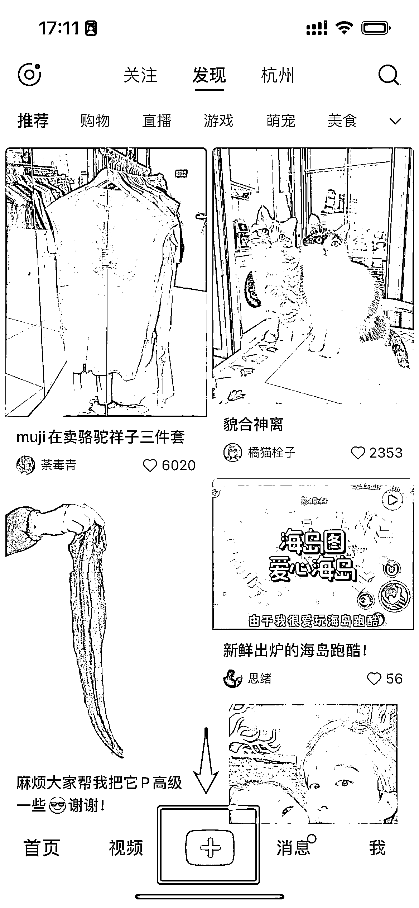
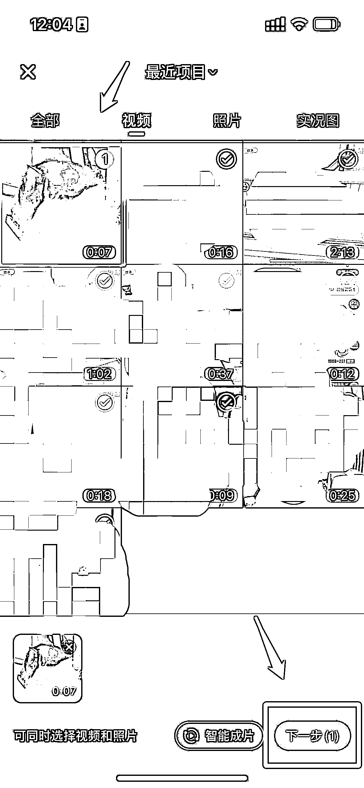
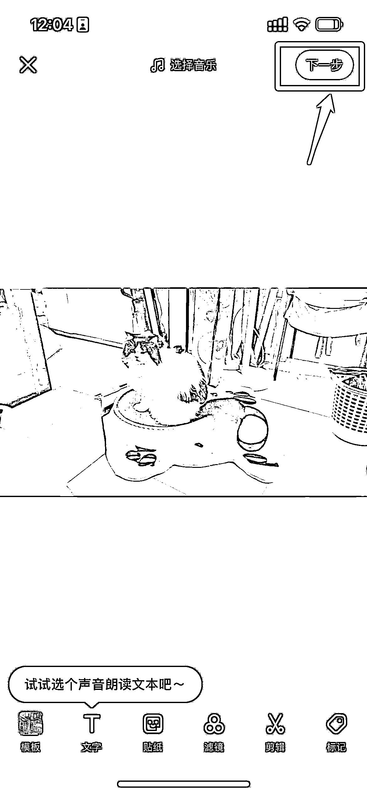
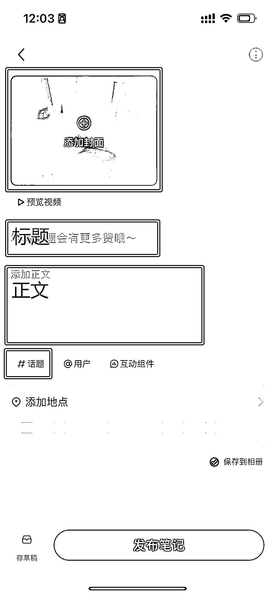
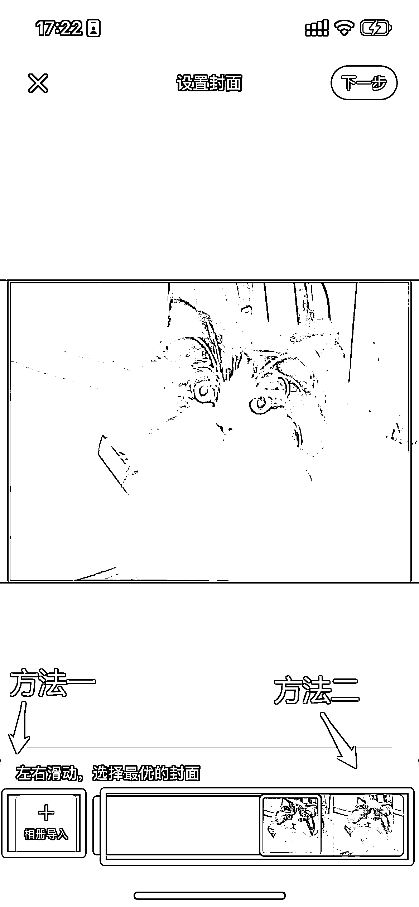

# 6.4.2 小红书 发布流程

•第一步：打开小红书，点击主页中间正下方的「+」；

•第二步：进入相册，点击我们要发布的视频；

•第三步：进入编辑页面，通常不需要操作，直接点击「下一步」即可；

•第四步：添加封面，在标题、正文处分别填入内容对应内容，并选择#话题，发布笔记。

•添加封面有两种方式：

方法一：直接从相册导入方法二：拖动下方进度条，选择合适的封面小说推文封面通常都是首帧，不需要额外制作。

再次提醒，发布前需要再次检查视频是否完整，是否包含违禁词，画面内容是否符合要求。标签不要直接复制，必须手打。因为经过实际测试，复制标签的流量不好。

