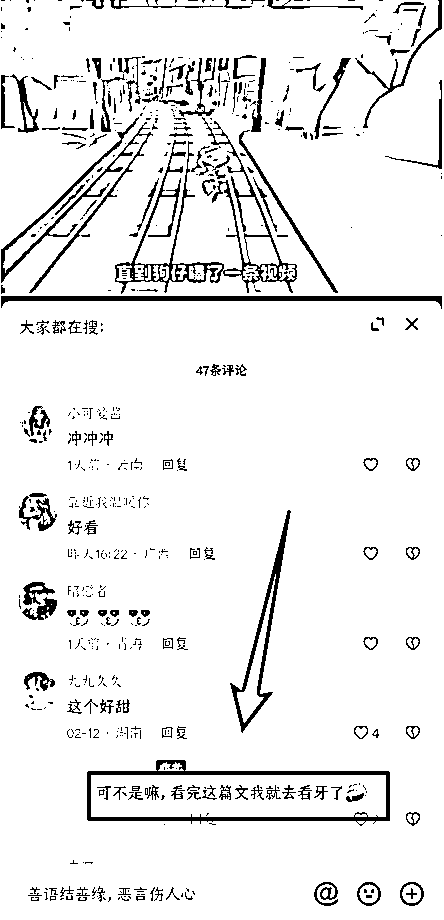

# 7.1.1 方法一：回复评论，增加互动

好数据需要良好的评论区互动支持，及时点赞、回复观众评论，让观众感受到博主的关心和支持；讨论剧情的说两句，吐槽文章角色的表个态，只发表情的咱也回个表情。

对于 “室友临死前想看下一集” 等类似的评论，回复一定要灵性，甚至可以多说两句拉扯一下，比如“让生产队的驴休息一会儿” “让你室友撑一会儿，实在不行我烧给他” 等，就像朋友聊天打趣一样，不要回复个“马上” “尽快” “好的” 就完事了。

