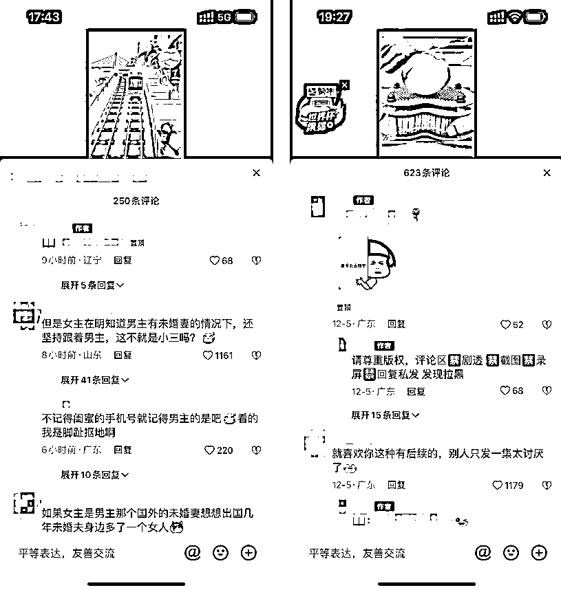

# 7.2.1 方法一：主动评论引导

抖音播放量过 5k 就可以主动引导了，等有一条视频过 15w 播放量后就可以置顶引导了。小红书发完就可以直接引导。不要因为没人问出处就不引导了，评论区空空荡荡是一种病。

有观众看完了觉得文章不错，但发现没人评论，可能他最多点个赞就划掉了，直接流失一个潜在付费用户；除非文章足够对胃口，他会主动开 “金口” 询问后续。

如果我们开一两个小号在评论区互动一下，再加上置顶一个关键词引导，他就很有可能点开评论区瞄一眼，看看有没有读完和他有同感的评论，之后看到我们发的引导去看后续了。