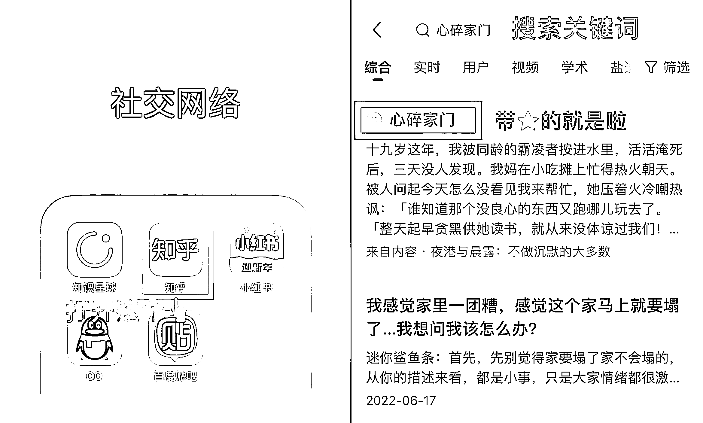

# 7.2.3 方法三：私信引导

如果有观众一直反馈找不到，可以考虑私信引导，但要注意对面是不是来钓鱼的同行，私信引导很容易被举报限流，去他人主页看一看是不是正常的抖音号，再决定是否私信引导。

严格来说，非必要不私信引导，因为来钓鱼的同行和小号实在太多了，被举报引流其他平台一封一个准。

但也有特殊情况，比如部分观众实在不会用关键词、原关键词失效、甚至是因为搜不到而在评论区疯狂留言，这个时候可以尝试私信引导，尽量不要打字，用图片引导。

在引导前，点开该私信观众的主页，看是不是默认头像和乱码 id，看看有多少个关注，如果有大几千上万个关注的话就别理了。

还可以看他主页有没有发布过作品？发的是自己的日常还是同类的推文作品，由此判断他是真的想看推文还是同行。

最坏的情况，上面讲的几种甄别方式都能伪造出来，其实并没有百分百靠谱的方法判断屏幕对面到底是真心想看小说的观众，还是钓鱼举报的同行，所以能不私信引导就别私信引导。

