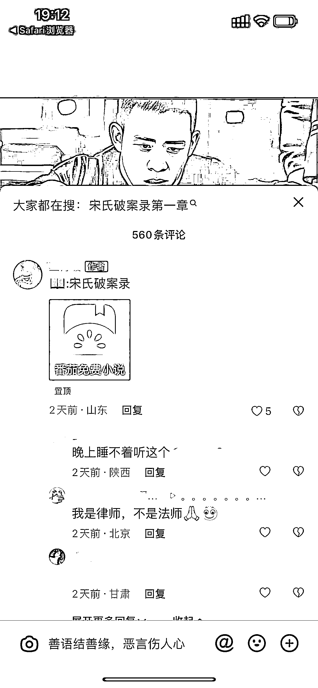
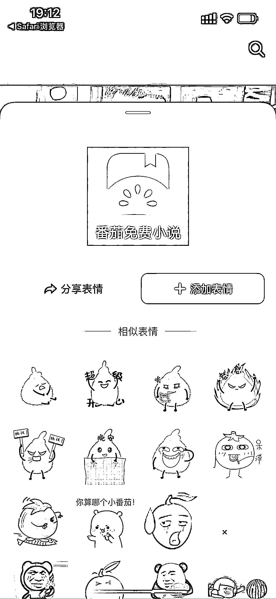
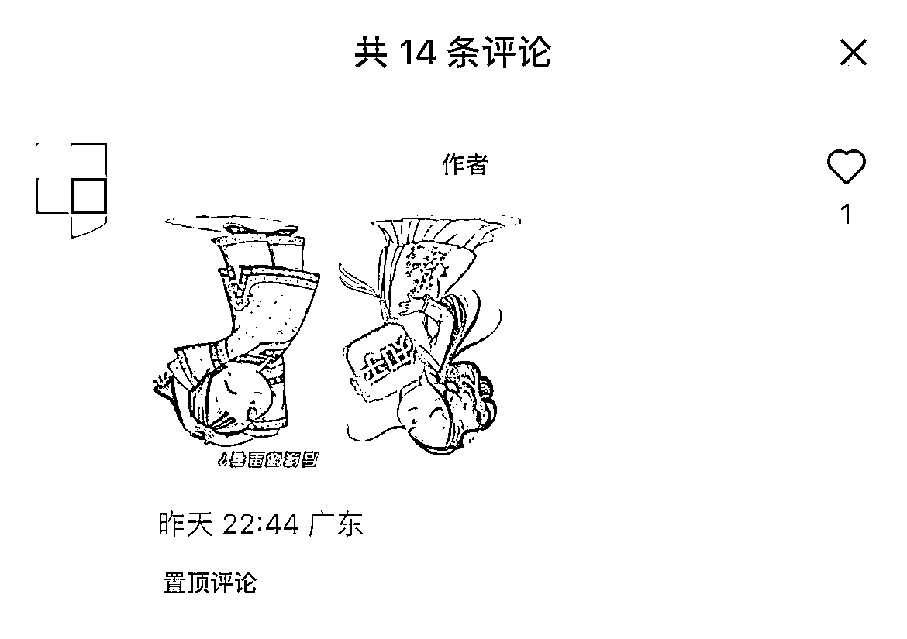

# 7.3.2 安全引流话术@seven

各个平台对于站外引流的情况，一直比较避讳，抖音和小红书也是一样。尤其小红书近期对站外引流的审查非常严格，被查到以后，可能会被直接封号。

针对这种情况，我们提供以下几种常见的方法：

方法一：使用小号当托问去哪看，使用主号回复。或者置顶关键词后，使用小号回复：刚在知乎看完这篇，回来小红书刷到了。

方法二：抖音评论区可以发布自定义表情，我们可以将小说平台图标，做成自定义表情，规避平台审查机制。

小红书评论区目前支持发布图片，与上述方法同理。

此外，小红书引流还有更多小技巧，大家可以👉 查看「5 月航海 | 小红书运营 | 实战手册」具体内容。

