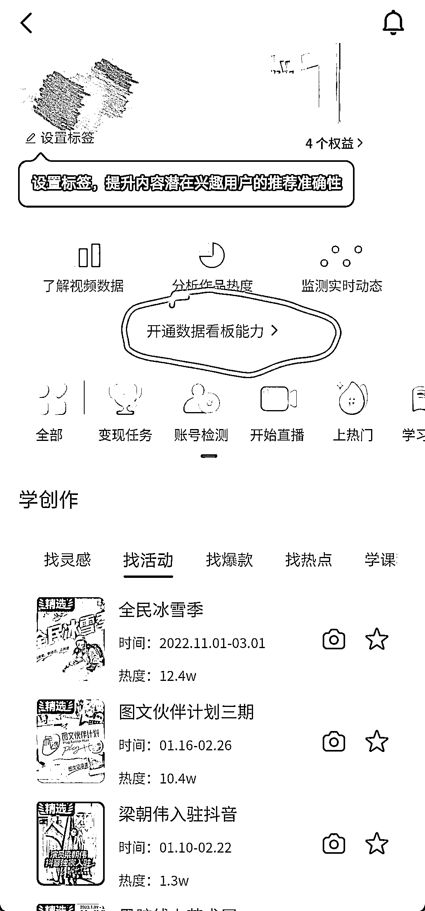
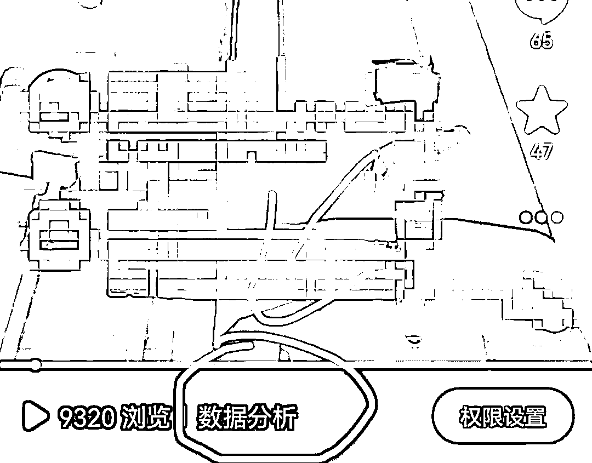
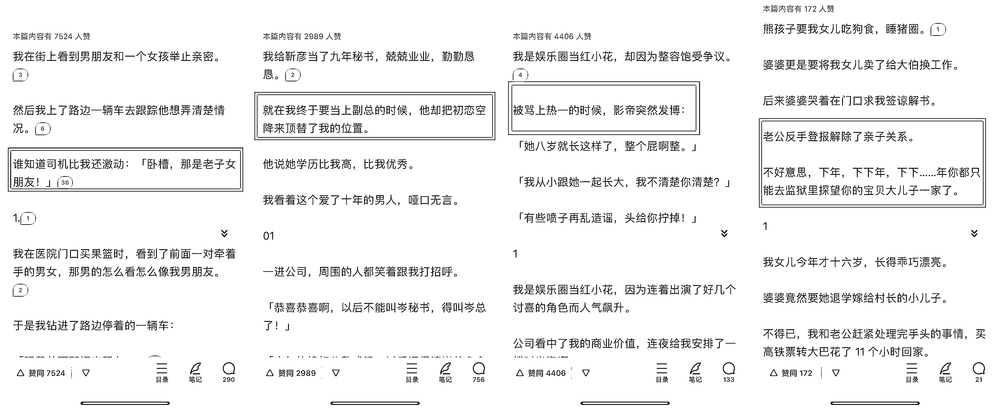

# 8.1.1 抖音运营 @某人周

如果你不知道该怎么复盘，可以从以下几个点来拆解：

1）内容数据分析

很多新手常有这种问题：为什么我的作品流量总卡在 200-500？为什么过会儿播放量就不涨了？是不是被系统限流了？

这涉及到抖音平台的推流机制，流量池赛马制。

初始流量只有 200～500，而后 5k、1w、10w、30w 等，能否进入下一级流量池，取决于作品在每一级流量池里的表现。

主要参考 4 个维度的数据：点赞量，评论量，转发量，完播率。500 播放量，说明作品正常，仅此而已。

流量过会儿不动了，说明作品没能突破到下一级流量池，后劲不足。好比参加竞赛，先从班里考试选拔，然后参加年级、校级、市级比赛，就算你在班里能拿个第一，放到年级呢？放到市里甚至省里呢？

所以不要太纠结播放量，把注意力放在完播、点赞、评论、转发四个数据上，放在持续更新、不断优化上。

具体在哪里看到内容数据呢？

我们可以在个人主页右上方的【三】——三道杠里看到【抖音创作者中心】：

点进去以后，我们就可以看到，这里有一个【开通数据看板能力】：

我们点击进入数据看板之后，下滑到底部，点【立即开通】：

然后系统会提示，我们大约在次日 10 点，就能看到自己已发布作品的数据分析了。次日我们点开自己已经发布的视频，左下角会出现【数据分析】字样，点进去就能看到本作品的详细数据：

其中包括播放量、完播率、平均播放时长、2s 跳出率和 5 秒完播率等数据，还有【互动分析】，及【观众分析】等数据，大家可自行浏览查看：

其中需要着重关注的数据为 5s 完播率和完播率，一般情况下，这两个数据基本能判断作品的质量，以及大爆的可能性。

在我看来，推文作品 5s 完播率的及格线是 50%，而想要突破到下一流量池，至少要 60%的 5s 完播率、15%左右的整体完播率（个人标准仅供参考）。

5s 完播率反映作品的开头质量，开头足够吸引人才能让观众留下，不划到下一条视频。如果 5s 完播低，说明你应该考虑改文了，把吸引人的核心剧情提前，激发好奇、愤怒、喜悦等情绪，留下观众。

如果看知乎的小说多了，你会发现其实作者们已经在这么做了，把结局/高潮/套路部分提前，让你不自觉地想看后续，明知道剧情走向，但还是会心痒痒。

再举些改文的例子，比如上图第一篇文章，

核心剧情是“我男友劈腿司机的女友”，四名当事人交叉分为两组，同时置于一个时空，让人不自觉期待后续的人冲突，我可能会这么改：“我一把抓住了我男友的女朋友...”，这句话从逻辑角度需要观众慢思考一会儿，顺带用小号回复“你这开头给我 cpu 干烧了...”，还能拉高一下互动。

整体完播率反映小说质量，决定了观众会不会去搜原文看后续，这是整个推文项目的核心。

如果整体完播低，首先检查素材和配音有没有明显问题，然后仔细检查选文。

新文还是老文？剧情太老套？情节流水账？先读全文，了解它的框架套路，了解它的起承转合，去评论区看大家在讨论什么，最能引发互动的是哪个点，为什么？思考这些问题，最终形成自己的选文方法论，或者说“文感”。

前面提到过，互动率和抖音的赛马推流机制挂钩，有时候文章的完播率很高，但卡在几千一万播放量上不去了，很可能是因为互动率低了——大家就静静地看，看过点个赞就划走，然后没后续了。

从选文的角度来说，要选能够激发情绪、引发争议的文章，而不是“优秀的流水账”。从账号运营的角度来说，可以主动在评论区“带节奏”，去同行的评论区取取经，搜集一些热评神评；还可以去同一篇文章的爆款视频（如果有）的评论区，把热评直接“搬”到自己这儿来。

上文中选文部分「4.4 制作选文表」有提到，可以制作一张表格记录选文的多项数据，如文章特色（分手虐渣、重男轻女等）、文章核心剧情（妹妹抢了我男友等）、发布一段时间后的完播率，结合内容分析一起使用。

2）粉丝分析

每天进数据中心看一看粉丝画像，尤其是粉丝男女占比和年龄分布。从起号的时候我们就要想好，作品是发给谁看的？男观众还是女观众？年龄区间是多少？

在检查过程中，可以适当移除一些不符合账号定位的粉丝，比如大龄男粉。

根据不同视频的涨粉效果、粉丝画像反馈，我们可以进一步优化选文、改文的过程。优化选文改文和坚持发视频涨粉是一个动态的、相互影响的过程。

如果粉丝画像歪了，一定要尽快做出调整。

先看哪几条作品涨粉异常，考虑隐藏作品；

其次可以适当移除一些不符合账号定位的粉丝，重点关注：

•几千上万个关注的账号。

•40 岁以上的“大龄粉丝”。

•默认头像、乱码 id、空白主页的“三无”账号。

•作品质量低、更新时断时续的同行。

一般来说，第一条爆款视频对账号粉丝的影响最大，所以有了第一条爆款后，无论之前作品类型，后续最好都跟第一条爆款保持一致。

3）策略分析

能够影响完播率、播放量、评论量这几个指标的，还有每天的作品发布策略，包括：

•发布时间：观众活跃时间、平台推流时间都会影响到作品流量。是早中晚各发一集？还是下午晚上两集？或者晚上到凌晨更新？每个时间段的活跃人群、系统推流快慢都不一样，不同文章的受众也不一样，需要通过记录和对比不断优化，不断发作品测试，最终调整到精准用户最活跃的时间发布；

•发布标签：话题标签影响到作品的曝光度和观众主动搜索结果，先添加领域标签“#小说 #推文”等，然后添加内容标签如“#虐文 #甜文 #爽文 #追妻火葬场”等，再添加一些热度标签如#女生必看 #内容过于真实等等，通过改变标签的排列组合，最终测试得出最适合账号的标签组合。;

•发布定位：选择人流量多的地点，作品曝光量会更多。个人经验来说，地点这块比较“玄学”，发布的时候带上就可以了，不要强求。

内容来源：《知乎小说推文项目保姆级实战教程》《小说推文进阶玩法，精细化运营所带来的稳定出单》

