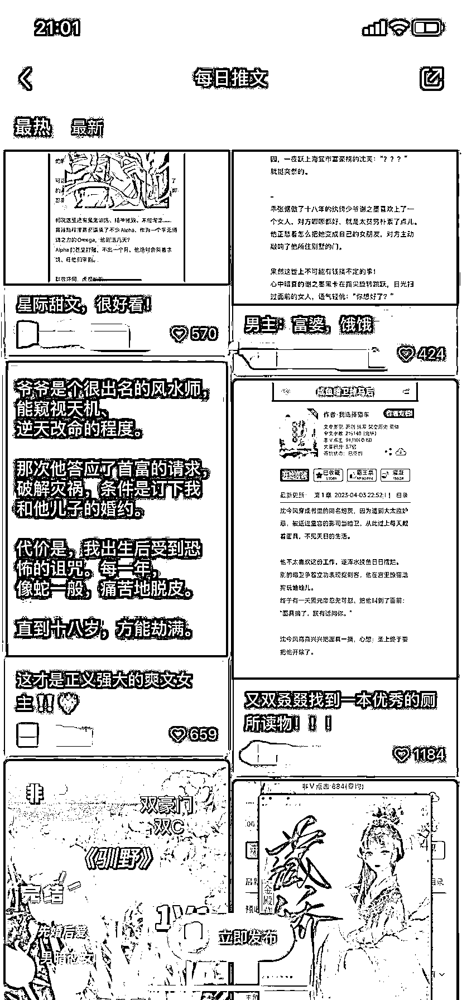
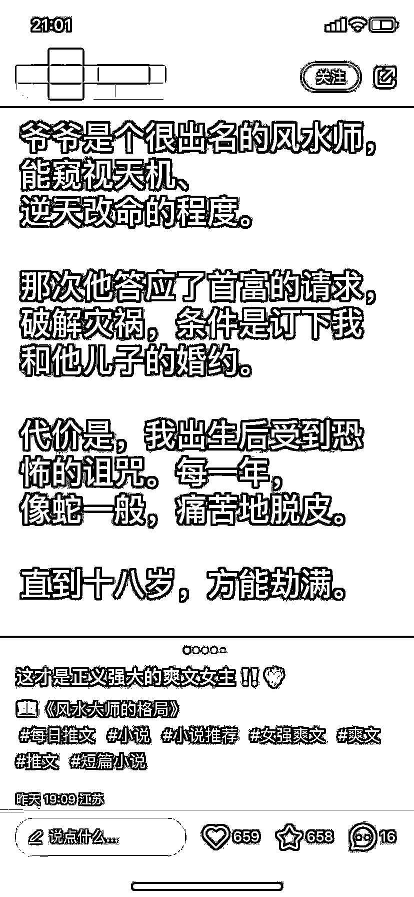
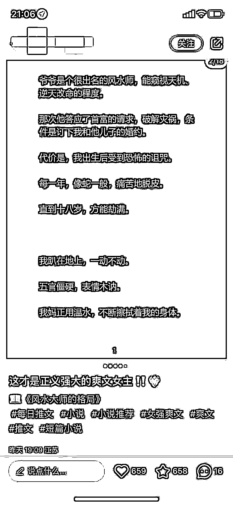
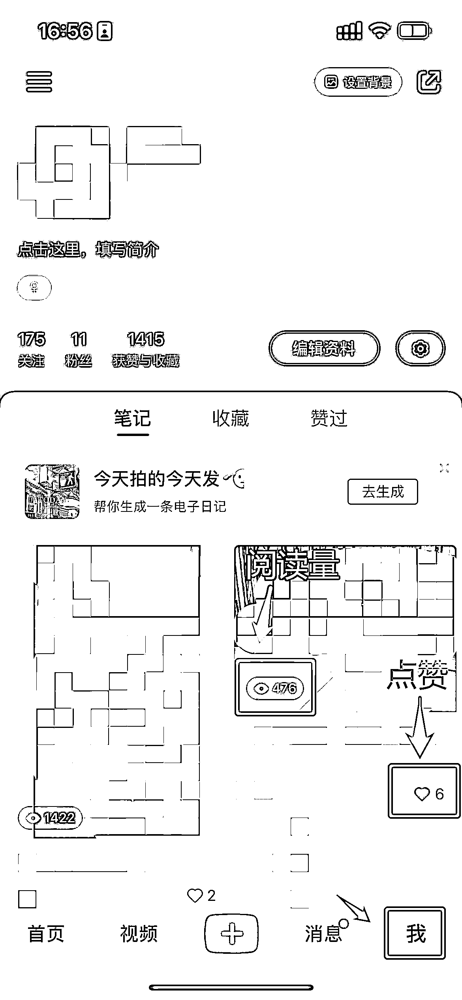
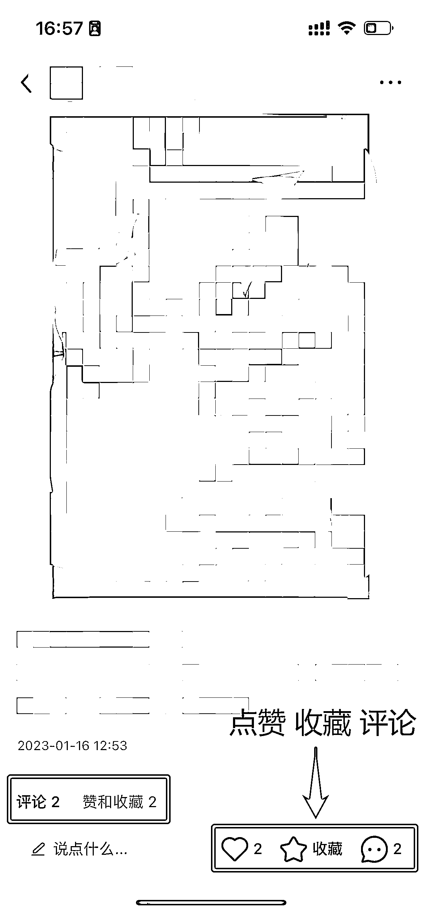

# 8.1.2 小红书运营@seven

相较抖音，小红书的运营重点在于首图+标题。

首图：有关注点，有疑问，有冲突标题：补充首图没有表达完的意思

一个好的笔记一定是首图+标题的组合。

下面这个例子，左边这个黑底白字的笔记，比信息流中的其他文章更吸引人。第二张图片是首图，第三张图片是正文，可以看出来首图的字体比正文要大的多，是单独设计过的。

在首图和标题都完善的情况下，如果数据依然不好，我们可以通过以下维度进行分析复盘。

小红书有 4 个数据维度，分别是：阅读量、点赞、评论、收藏。

我们进入小红书 App 后，在底部菜单栏点击「我」，就可以看到我们发布的笔记数据。其中，小眼睛是阅读量，爱心是点赞量。点进笔记后，则可以在底部看到评论、点赞和收藏三种数据。

拿到数据以后，我们需要判断自己的笔记数据是否正常。

如果大家一篇笔记的浏览量不低于 50 ，在 50 到 500 这样一个区间，这是正常的。

我们在做数据对比的时候，可以先和自己正常的内容数据进行对比，然后再去和自己同等级的博主进行内容数据上的对比。

这里的同等级，是指粉丝数量相近。比如你有 500 粉丝，就跟 500 粉的博主对比，不要参考 10000 粉博主，这样往往是没有意义的。

我们可以去研究，为什么别人的笔记里会有比较多的评论，或者说别人的笔记收藏会比较多？你可以看看他们的内容，然后看他引导互动的一些方式，尽可能地去模仿和学习，同行是最好的老师。

如果确认数据不佳，我们可以从以下几个方面去反思和优化：

1）小眼睛（阅读量）不佳

一般发布后 2 - 3 小时内阅读量差，或者阅读量长期只有 100 - 200 甚至低于 100，可对照以下问题检查：

•运营初期的正常现象，账号权重还太低；•笔记违规、触及敏感词、或者发布了平台本身就不会大力推荐的内容；•选题、标题文案或者首图不吸引，尤其要重点检查选题角度和首图。

2）点赞、收藏、评论等互动数据不佳

•用户会收藏这篇笔记，说明笔记内容有实用价值，现在或未来可以用上；

•用户点赞或评论这篇笔记，说明笔记内容获得用户认可、引起情绪共鸣；

•用户会因为笔记转粉，说明不仅认可你的笔记，还认可你本人，期待你未来产出更多优质内容。

互动数据不好的，排除违规和玄学问题，十有八九还是因为笔记内容质量不够好。

可对照以下问题检查：

•完全文不对题，选题标题吸引，但点击来内容完全与主题无关•内容文字营销感太强，全部都是硬广、打广告（备注：企业号可适当硬广）•内容提供给用户的收获感不强，对用户来说实用性不够强•内容很像无意义的朋友圈，没提供情绪价值也没有提供实用价值•内容全是干巴巴的学术句子或者百度科普，难以引起阅读欲望•视频拍摄质量或者信息图片质感太差，用户阅读体验感差

3）发布后修改笔记的注意事项

发布笔记后，最好不要修改。克制住，别动笔记，可以在置顶评论补充。

•图文笔记全部都可以替换修改；视频笔记只能修改文本和首图，视频本身无法替换。

•修改提交后平台审核系统会进行二次审核，没违规的都会照常通过。

•若已经是爆款笔记，且热度仍在持续上升的阶段，不建议轻易修改，可能影响数据增长。

•不要短时间内频繁改或者修改次数太多，否则笔记数据可能会不如之前。一般修改 2-3 次是 ok 的。

4）其他运营策略

关于发布时间，经过多次测试，目前发现的最佳发布时间是在晚上 9 点～ 9 点 40 分之间。容易出千赞的爆款比较多。

关于发布频率，最好能日更，如果做不到日更就每周 3～5 篇。

关于选文，小红书的主要人群还是高知女性，方向毋庸置疑就是女频文。建议选择有槽点的文，虐文甜文为主。

内容来源：《5 月航海 | 小红书运营 | 实战手册》

