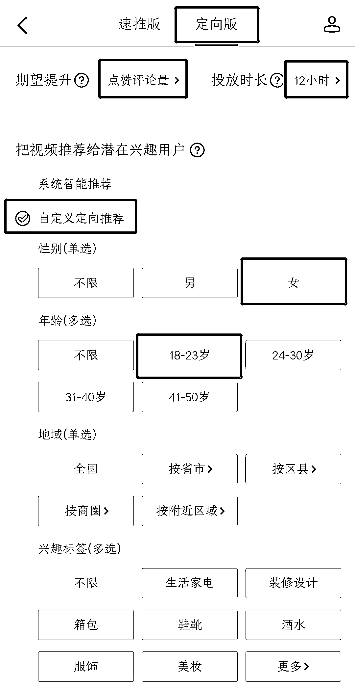
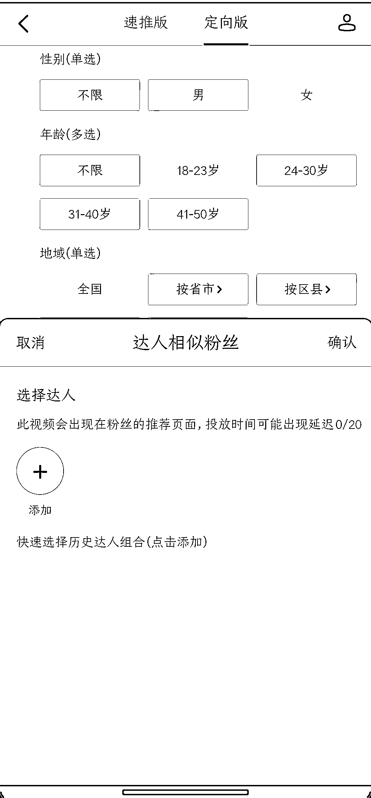

# 8.3.1 如何投放 DOU+

抖音的推荐算法是以数据标签为基础，在前期标签不稳定的时候，我们也可以通过 DOU+来给账号打标签。通过付费投放 DOU+的形式，刺激新号，获取一定流量。

在下午发布完作品后，直接投放 DOU+。点击视频右下角三个点——上热门——定向版——点赞评论量——投放 12 小时——自定义推荐。根据选文类型选择年龄和性别，如甜文，选择 18-23 岁，女性。

其中，达人相似粉丝，可选可不选。如需投放，可选择 10 个低粉爆款的新号作为对标，进行投放。

