# 离开职场后的新出路

看看圈友离开职场后，都做了哪些事情

整理日期：**230720**

懒人专属群的群友大家好。小懒继续给大家带来一份离开职场后的新出路

本文档为懒人专属群内部分享，懒人手动整理。

生财风向标系列单独用在线文档分享，地址见专属群q群消息。

往期的生财周报合集（含在线版和离线版），见专属群Q群文件和群公告。

希望大家有收获~

标题加了(精华)的表示精华贴，前面为截至今日的点赞数。

以下是目录，内容有些多。大家可以挑兴趣的内容阅读。

懒人专属群更新记录（点此跳转）

 

 

# **# **目录

离开职场后的新出路

目录

【思维认知】**9**篇

(精华帖)(365赞)程序员可以在生财有术干什么？

(精华帖)(264赞)为什么创业需要理想主义

(精华帖)(191赞)37 岁裸辞创业变现 15W，我应用的 7 个思考模型(精华帖)(187赞)圈友准备从阿里离职出来全职创业，我给了他几条建议(精华帖)(152赞)非典型成长的年轻人，把自己打造为超级个体

(精华帖)(142赞)身边真实案例，从月入 3000 到收入千万需要经历的选择(精华帖)(133赞)我见到的那些95后年轻人都是怎么赚钱的？

(精华帖)(100赞)35岁的设计师都在做什么？

(精华帖)(87赞)一个设计师创业者，在 8 月份的 100 条复盘

【生财心态】**4**篇

(精华帖)(178赞)体制内从 0-1 突破舒适圈，副业年赚 20W+ 的心得(精华帖)(145赞)在赚钱上从各个角度迷茫了11个月，终于在最后一个月见到生机(精华帖)(132赞)普通女生单枪匹马的 3 年搞钱岁月

(22赞)写给最近经历裁员、被领导骂、又或职场迷茫打工人朋友的一段话

【职业规划】**3**篇

(精华帖)(305赞)4个工具帮助普通人副业定位

个体商业铁三角

追求长期价值，品牌造壁垒

为什么追求长期价值，一定是品牌

IP铁三角

趣味实用

美学

三观

IP坐标轴

把握短期现金流，保持副业活性

为什么要把握短期现金流

从兴趣出发

从前景出发

 

 

期望值计算器

副业的方向是动态变化的

先完成，后完美，快速试错

一米宽，一千米深

笃学好古，别重复造轮子

做有门槛的事，敢为天下后

躬身入局者赢

(79赞)根据自己面试十几天的时间，简单的说说一些感想

(46赞)毕业3年薪酬翻6倍，并且匀出时间斜杠  职业规划分享

【创业经历】**11**篇

(精华帖)(365赞)沉浸于生财 2 年 3 个月，分享我的破圈成长之路(精华帖)(309赞)我的十年自媒体之路

(精华帖)(270赞)血与泪，我的十年创业故事

(精华帖)(200赞)加入生财半年多，从负债 30W 到实战变现 30W+(精华帖)(197赞)98年专科生，裸辞后做抖音项目+社群赚到人生的第一桶金(精华帖)(171赞)93 年女孩做线上美业，不到 2W 成本到变现过百万(精华帖)(158赞)亦仁：如果要卖自己，你会怎么卖？

(精华帖)(148赞)作为一个普通人，我是如何通过4步成为年入百万的行业专家(精华帖)(144赞)30岁那年转做企业培训师，第一年的收入接近100万(精华帖)(136赞)短短一年，收获2000万美食、评测类短视频粉丝，是怎么做到的？

(精华帖)(121赞)十年回首传统媒体变现记：  我凭创业赚的百万又是如何凭实力亏掉的

【项目分享**-**自媒体】**7**篇

(精华帖)(323赞)主业三甲医生，副业小红书护肤博主，普通人如何通过小红书年入几十万

(精华帖)(267赞)我做小红书半年收入 20W+ 的秘诀：切入品牌视角做流量实现爆商单

(精华帖)(237赞)专注仪器细分领域，2 年公众号完成73 万专业领域用户的积累欢迎  进行他的分享。

(精华帖)(159赞)靠流量变现三年挣了 500W 的心得思考

(精华帖)(152赞)美食菜谱短视频，2 年收获全网 500 万粉丝，累计变现 250万+(精华帖)(124赞)技术人转型程序员漫画自媒体的完整经验分享

(精华帖)(112赞)职场小白裸辞做小红书宠物博主，一个月收入顶一年工资 

 

【项目分享**-IP**打造】**1**篇

(精华帖)(450赞)大厂裸辞跑通职场个人IP，千人私域半月被动收入近六位数的历程分享

【项目分享**-**小红书电商】**1**篇

(精华帖)(1093赞)从小红书电商小白到两周单店变现 78W GMV，付费流打法实战单周投放 Roi 10+

【项目分享**-**闲鱼卖货】**3**篇

(精华帖)(338赞)深耕行业 2 年后，分享咸鱼二手书无货源、绝版二手书等5种项目玩法

(精华帖)(300赞)从设计师到闲鱼卖货，2年副业赚30万+，我经历了哪些？

(精华帖)(148赞)闲鱼卖露营装备一整年，月入1-2W的小蓝海项目分享【项目分享**-**拼多多电商】**1**篇

(精华帖)(123赞)拼多多无货源模式如何做到月入过万？

【项目分享**-**得物电商】**1**篇

(精华帖)(253赞)新人入局得物单账号变现破万的教程

【项目分享**-**本地生活】**3**篇

(精华帖)(464赞)我一年开了 180 家互联网洗衣店，赚了 200 万(精华帖)(168赞)我是如何通过家政电商做到月入过万

(精华帖)(119赞)大厂离职做鲜花创业，从小区团购到小程序盈利每月 7 位数的经验分享

【项目分享**-**社区团购】**1**篇

(精华帖)(210赞)作为职场宝妈兼团长，我是如何从卖包浆豆腐到营业额超100w的？

【项目分享**-**线下实体】**1**篇

(精华帖)(58赞)关于租房行业的一丢丢思考

【项目分享**-**海外掘金】**1**篇

(精华帖)(152赞)我是如何通过 TikTok 广告 3 个月赚到第一个 100W 的？

【项目分享**-**技能变现】**2**篇

(精华帖)(134赞)案例复盘：视频号第一次直播卖课，单场净利 16000+(精华帖)(119赞)摄影零基础起步，如何通过打造航拍摄影 IP 实现职场副业双丰收

 

 

# 【思维认知】**9**篇

# **# ****(**精华帖**)(365**赞**)**程序员可以在生财有术干什

# 么？

作者：  刘小排

日期：2022-04-11

不知道大家有没有这样的朋友，明明是互联网大厂的程序员、产品经理，拿着百万的年薪，却热衷于在生财有术里找一些低杠杆、拼体力的副业做，每个月挣一两千块辛苦钱。

每次看到这种现象，我都感觉痛心疾首。

你能写程序、能近乎零成本地指挥机器千军万马做你想干的事，你就拥有了这个世界上最厉害的杠杆之一。何必去和别人拼体力——这个世界上最不厉害的杠杆呢？

不能充分发挥自己的天赋，是对自己生命最大的浪费。

我也是程序员出身。希望能够给程序员朋友们一些建议。

程序员朋友可以在生财有术干什么，才不至于浪费自己的天赋呢？

至少有四件事可以做：

 

 

**1. ** 低端劳动自动化

**2. ** 做IP卖课

**3. ** 卖工具

**4. ** 关注Enabling Technologies，改造现有产业

我们先从最简单的说起。

一、低端劳动自动化

我多次在生财有术里推荐盗坤兄弟的电商思想。

本文再多说一个，盗坤有一个很了不起的电商思想 —— 财务逻辑，把账算清楚。

举个例子，如果你想做抖音号，你雇佣一个人，给他开6000元的月薪，他一个月能出多少视频、多少流量呢？

盗坤兄弟的想法是—— 我就招一个6000元月薪的普通人，他不用懂什么视频制作的专业技术，他只帮我二次剪辑就好，别瞎创新。这样的话，每条视频的制作过程只需要20分钟，他每天可以产出20个视频，每个月可以产出600个视频。

我们简单算一算。

考虑到他的月薪是6000元，也就是说，我们每个视频的成本是10元。

 

 

抖音的流量推荐逻辑是，只要账号过了风控期，一个视频能够带来至少500的播放。偶尔有一些爆款视频，并且随着账号标签的积累，出爆款的可能性可以变大。实际测试，编辑视频的时候精心一些，在大约一个月后，平均每个视频可以带来2000的播放量。

那么，我们10元成本，就保底买到了2000的精准流量。

由于我们的账号一直在开直播，对于这2000的精准用户来说，直播间就是我们的收银台。大约会带来200超精准的用户，进入到直播间。

也就是说，只花了10元，买到了200的精准用户进入直播间！更何况，抖音还会根据你的粉丝，推荐直播流量到你的直播间呢？

这个投入产出比，不比用千川投放，要香好几十倍吗？

作为普通人，看到这里，你会感觉很兴奋，跃跃欲试。

但你不是普通人，你是程序员啊。

你会发现，单条视频的成本是10元，似乎也有点高。你完全可以写个程序，自动做视频的二次剪辑，把它的成本再降低一到两个数量级。

嗯，这不是我的想象，其实已经有很多圈友这么做了。

比如，这一篇《抖音视频带货复盘总结》。

https://t.zsxq.com/zBub6un

 

 

圈友@代码君  ，仅仅通过视频带货，就已经取得了不错的成绩。更何况直播呢？

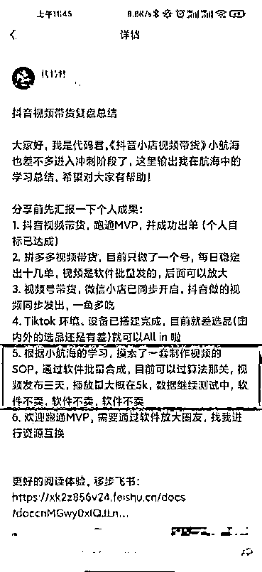

这就叫“低端劳动自动化”。

对于一个合格的程序员来说，写这个代码一点也不难。

我用MoviePy（一个Python的视频编辑类库）试了一下，也就一晚上的事。

这样的例子在生财有术还有很多，再比如

 

 

《程序化自动生成视频实现Youtube掘金》 https://t.zsxq.com/vnyZn6I《 20天累计付费群人数500+，公众号吸粉4000+，收入5000+》https://t.zsxq.com/U3NRNne

请程序员朋友们注意：不仅仅是抖音、也不仅仅是视频编辑喔。

在生财有术的信息宝库里，像这样依赖低端重复劳动的工作还有很多，希望大家自己去发现。

换个思路想，凡是普通人可以拼低端劳动力去赚钱的事，都是你的机会。  比如，抢茅台、通过一些指标寻找电商蓝海、孤寡青蛙、老照片修复…… 不说了，太多了。

二、做**IP**卖课

很多程序员有一个误区，以为自己要技术很牛才能做IP。

其实不是这样的。

如果你是阿里的P8级以上程序员，请问你在技术大拿的圈子听过  圈友@突围一只鹰  吗？

恐怕没有吧？

他的技术到底牛不牛，我不知道。但是我知道，他这个人很牛。

通过做录播课，突围一只鹰每月躺赚5万。详见帖子  https://t.zsxq.com/3FeeQZJ 

 

三、卖工具软件

通观生财有术精华帖和项目库，尤其是电商类的项目，你会发现大家在频繁使用软件。

比如，看抖音数据的蝉妈妈、上架淘宝商品的初妆、做抖音直播的直播加加App ……我大概听说过超过50种常用的电商辅助软件。

仅仅是“拼多多”相关的，就超过10种。如下图所示。

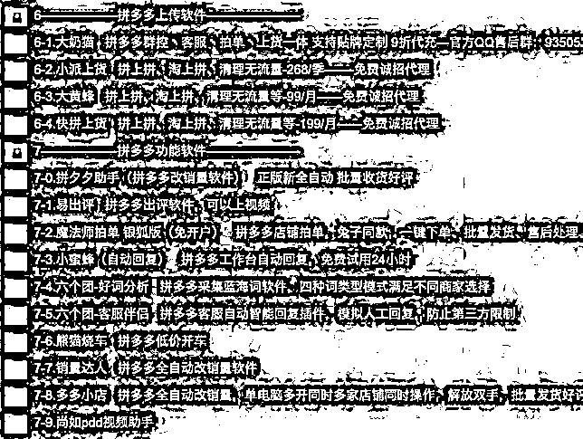

如果你去使用的话，你会惊讶地发现，它们的界面都非常简陋。

 

 

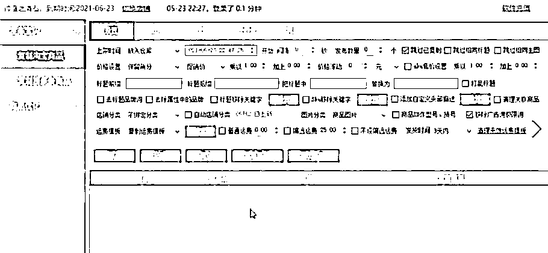

看见了吗？俨然是一副来自于上个世纪的感觉……

如果你是在互联网大厂工作过的程序员、产品经理，这样的界面、这样的使用体验，你能忍？

而它的用户量，是万级的。这一款，是淘宝无货源电商领域非常著名的一个软件。

一个做得很low的软件，却能赚到很多钱，这是什么？这就是蓝海啊，兄弟！

对于大厂程序员来说，这些软件可一点不难做。

既然开发软件不难，那么这门生意，最难的部分是什么呢？

是寻找需求。

而这个最难的部分，生财有术也已经帮你解决了。

 

 

你就只需从别人的帖子里，看看别人有什么需要就可以了。

比如，昨天我在龙珠群，看到有人问起最近抖音比较火的“云蹦迪”。已经有聪明的程序员，开始卖这套软件了。

在短短两三天的时间内，变现一万多元。

四、关注**Enabling Technologies**

最后讲讲难度最大，也是想象空间最大的部分 —— 关注**Enabling Technologies**。

 

 

这也是我自己喜欢干的事。我每天都会花很多时间泡在Hacker News、Github上，关注新技术，思考它们或许会带来的可能性。

中文世界对Enabling Technologies的翻译大概是“使能技术”。

我尝试解释一下。

“enable”在字典里意思是“使能够；使成为可能”。

"Enabling Technologies"的意思是，某项新技术，它的存在可以让以前的某件事，从不可能，变成可能。

比如，4G + GPS 定位，让Uber打车成为了可能。在没有出现4G + GPS的十年前，是没有办法做出滴滴打车或者Uber的。

我们的操作方式是：

1.对新技术保持日常紧密关注

2.对生财有术的帖子保持紧密关注，了解别人在做什么事。

3.结合1和2，从而哪些新技术属于Enabling Technologies，然后去改变旧的做法。

我们举个例子，

例如，你可以关注到，

 

 

1.新技术。从2021年开始，直播换脸技术走向成熟。（再早几年时间，可以视频换脸，但换脸的直播相对困难一些）

2.旧产业。你从生财有术了解到，差不多也是从2020年、2021开始，中国人开始在TikTok上直播，出国卷老外。有相当多关于如何做TikTok的训练营，开始日趋火爆。

那么，直播换脸技术，就是一项enabling technology，它让“中国人把自己的脸变成外国人，在TikTok上直播” 变为可能。以前必须雇一名同时懂中文和英文外国人才能直播，现在可以招点英语专业的中国大学生就行，节省了不少成本。

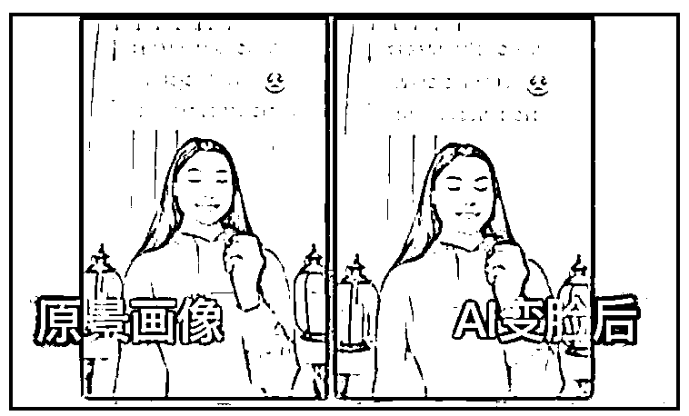

有了这个洞见以后，作为程序员的你，可以干很多事情。

比如：

提供换脸直播教程，针对在中国做TikTok生意的公司定向销售。

降低换脸直播的使用门槛。用户是技术小白，能换脸直播吗？用户只有一台手机，没有拥有强大显卡电脑能啊，能换脸直播吗？能啊 —— 你想办法把它做成云端方案，就可以让这项新技术走进千家万户了。

做直播换脸的垂类社区。

打造直播换脸技术的IP。（挺蓝海的，据我所知，目前国内还没有）

 

 

生财有术，帮你寻找需求。

新技术，尤其是Enabling Technologies，帮你解决技术问题。

而你，负责连接两端，解决产品和变现。

总结

**1. ** 不能充分发挥自己的天赋，是对自己生命最大的浪费。程序员就别和小白拼体力了，多想想怎么用好自己的天赋。

**2. ** 程序员在生财有术，至少有四类事情可以做：低端劳动自动化、卖工具软件、做IP卖课、关注Enabling Technologies，把它们用到各行各业。

**3. ** 三和四有点难，如果缺乏经验的话，可以从一和二干起 。

评论区：

张集慧 : 记得20年，生财一位程序员，一位引流，两人合作，一周卖邀请码码（clubhouse）赚了60万，我自己引流，自己手工找码，赚了200[偷笑]，这就是差距啊  刘小排 : 有圈友问：现在开始学编程晚不晚？

[机智] 大家可以参加美团王兴的答案——

抉择 : 只能看一半

liao : 不晚，学编程的最佳时机就是现在[调皮]

船长 : 图片完整版的故事，哪里可以找到

静水流深 : 哈哈哈哈，我说一句啊，如果程序员懂商业，还来这里干什么？这里是培训老板去找到程序员帮你完成你的商业价值。为什么一群人非要这么放大技术生产力呢？

[呲牙]

刘小排 : 划线部分已经是全部故事了。后面是本书作者的一些评价，书是《拆掉思维的墙》

 

 

刘小排 : 此言差矣。正是因为一部分程序员意识到自己不懂商业，他们才来生财有术学习。

# **# ****(**精华帖**)(264**赞**)**为什么创业需要理想主义

作者：  光合

日期：2020-11-14

为什么创业需要理想主义？

这篇文章是在私董会内部分享的，微调了下，也同步给大家。以下为正文：

龙珠见面会结束了，睡了好几个晚上才缓过来……嘴上说年轻，身体却很诚实，感触也很多。

这篇文章断断续续写了挺久，一直有在思考。写这种话题，容易被人喷，装逼，扯淡，太虚。主要也是想给自己找个答案，内心逻辑自洽，不然跟咸鱼有什么区别。

最好的创业状态，是子曰的那样：“仁者不忧，知者不惑，勇者不惧。”有仁、有知、有勇，就没有忧虑、没有疑惑、也没有恐惧。

但是商业环境复杂多变，创业历经九九八十一难，也未必能求得真经，大多数时候我们总是处在忧虑、疑惑和恐惧当中。

以前有个段子，说创业上市的概率，约等于连续被雷劈两次。创业之难，难于上青天，一将功成万骨枯。既然我们已经选择了这条难于上青天的路，怎样才能做到不忧虑、不疑惑、不恐惧？

华杉老师有句话，可为总纲：始终服务于最终目的，随时回到原理思考。结合我自己的体会，分享给大家。

知道做任何事的最终目的是什么，也知道所做事情的原点原理是什么。围绕最终目的，这头是最终目的，那头是原点原理，中间是一条直线，然后脚踏实地，就能滴水穿石。

创业也是如此。

一、创业，最终创的是什么业？

 

 

我理解是事业。

中国人讲成家立业，立的业，创的业，当是事业，又称基业。比如先帝创业未半，而……后半句不吉利就不说了。

在现代商业社会中，事业的载体是企业。所谓的创业，基本上等同于创建出一个企业，也就有了事业。衡量事业大不大的标准，往往是企业的规模和市值，所谓事业有成。

再往下问一句，什么是企业？弄清楚这个问题，就弄清楚了企业的第一性原理，了解创业的终极意义所在。

德鲁克说，企业是社会的器官，企业存在的最终目的是为社会解决问题，一个巨大的社会问题就是一个巨大的商业机会。

你对这个社会问题解决的好，就能基业长青。解决的而不好，就会被淘汰。还有就是马老师说的，你解决的问题越大，企业市值越高。

如果不好理解，就把社会问题当成社会痛点，找到一个痛点然后解决它。

扎克伯格在中美创业论坛上也分享过：“不要问我怎么创办了Facebook，要问我为什么要创办Facebook。很多人在没想清楚解决什么问题之前，就开了公司，在我看来这很疯狂。”

那做企业跟解决社会问题有什么联系？

在德鲁克看来，企业战略的源头就是找到社会问题，把解决这个社会问题定义为自己的经营使命。企业的产品和服务，就是这个社会问题的解决方案，最好是比别人更好的解决方案。

所以如果要创业，起点是找到一个社会问题，并想办法做出牛逼的产品和服务去解决它，提供更好的价值。人们愿意为此而买单来解决问题，你就能因此赚到钱。

创业的原点和初心，就是利他的，先天下之忧而忧。这不是在务虚扯淡，而是最终目的。

你要先帮其他人，帮社会解决一个问题，这是你的企业经营使命。赚钱，只是是顺便的，是对你解决问题的正反馈。

当你在解决一个社会问题的时候，只要这个社会问题长期存在，你的赛道就不会有大问题。复利、长期主义，才有蓬勃生长的土壤。

 

 

所以创业，最终创的业，是创建解决某一社会问题的企业。如果再加个期限，就是比别人更高效、更低成本的解决某一社会问题的企业。

这样咱们才能更好的活下来，活得更好。

二、到底什么是理想主义？

和前面一样，聊理想主义，先弄清楚什么是理想主义。你所理解的理想主义，和我所理解的理想主义，是不是一样的意思？

维特根斯坦说：“词语的游戏规则在语言游戏中建立，也在语言游戏中修改。我经常感觉到需要把词语从我们的交流当中抽里出去，送去清洗，洗干净之后再送回到我们的交流当中。”

这段话的意思是，我们沟通交流时，嘴里说的是一样的词，但大脑里想的却不一定是同一个意思。所以我们经常是语言相通，但是词语不通，说来说去说不出个所以然。

理想主义，首先是理想，什么是理想？

字典里是这么定义的：对未来事物的想像或希望（多指有根据的、合理的，跟空想、幻想不同）。你看，字典里讲的其实蛮清楚的。

小时候老师问你的理想是什么，要么当老师，要么当科学家。为什么当老师，教书育人，长大后我就成了你。为什么当科学家，为国家做贡献，改变人类命运。

那时候，老师反复教育我们，一定要做个对社会有用的人。然后我们不懂，不屑，不做。

为什么要做个对社会有用的人？就是前面讲的，企业的本质是解决社会问题。对于个体来说，也是一样的，你对社会有用才能混碗饭吃。这不就是我们一直说的利他主义、长期主义吗，原来小时候的老师们很早就悟透了。

所谓，愿你出走半生，归来仍是少年，大抵如此。半生之后，仍然像小时候那样，心存理想，做个对社会有用的人。

但大多数人理解的理想，可能不是眼前的苟且，而是诗和远方。郝云的《活着  》，我原来很喜欢听，但慢慢开始不认同这种挣扎的情绪。

 

 

慌慌张张  匆匆忙忙

为何生活总是这样

难道说  我的理想

就是这样渡过一生的时光

不卑不亢  不慌不忙

也许生活应该这样

难道说 60岁以后

再去寻找我想要的自由

我不想这样活着

年轻人总想着诗和远方，中年人开始找寻意义所在。

我的理想不是闲云野鹤、诗和远方，恰是眼前的苟且。我也不认为这是苟且，而是我的诗和远方，也是我想要的自由，自由的选择我想践行的长期利他。

我所理解和认同的理想主义，等于长期利他主义，永远做个对社会有用的人，做个好人，并且乐在其中，开心生活。

听起来有点虚是吧？以前我也觉得虚，真正感受到了之后就觉得很切实际。理想主义，不是假大空，而是最高级的接地气，脚踏实地的与世界、他人密切相连。

至于结果，因上努力，果上随缘，只问耕耘，不问收获。剧作家哈维尔这样说：理想不是乐观。它不是坚信某事会成功，而是确信某事有意义，不管结果如何。

并不是装逼装清高，不在意结果和收获。而是如果你盯着结果和收获去行动，往往事与愿违。盯着过程和耕耘，收获会自己向你走来，你也不知道会是什么收获、在什么时刻发生。

这让我想起来，成甲老师一开始去研究思考力的时候，并不知道未来能做些什么，只是觉得这事儿非常有价值，就这么做了。现在的收获，没有哪个是在意料之中的。

三十而立，大多理解为在三十岁的时候有所成就。这句话出自《论语  》：吾十有五而志于学，三十而立。原意是指人在三十岁前后建立自己人生的价值观，就此立住。

立在理想主义，长期利他。

三、为什么创业需要理想主义？

华杉老师说：基业长青的企业必然是理想主义的，实用主义的企业是一定走不远的。下面的部分内容摘自《华与华方法  》一书，有兴趣的也可以去翻下。

 

 

企业是社会的器官，为社会解决问题。企业经营，是一种志向，一种抱负，一种使命感、一种对社会，对人类，对用户的感情。这种感情，也是我们联系五个市场——顾客市场、人才市场、资本市场、政策市场、公民社会——的纽带，获得他们在感情上的关注和共鸣，和行动上的支持与推动。

我们的成功，都是因为别人在推动我们，会不断的遇到贵人。不是我们去争取了他们，而是我们的理想和事业，吸引了他们的认同，他们愿意以帮助我们为快乐。大事业都是大家帮出来的。最后你是被大家推着走，而不是你率领着大家走。

就像亦仁说曹大是他的贵人。曹大说在恰当的时机，我看到了他们，挖掘了他们，其实是我的幸运。

2016年6月，《财经  》杂志做了一个《百度的冬天》的封面报道。在谈及百度与谷歌的区别时，李彦宏说：“我们是实用主义者，不是理想主义者。”

《财经  》问：“这是否导致了百度在某些决策上的保守呢？”李彦宏说：“我最近对我过去这么多年的理念多多少少产生了一点点怀疑，我们也许不应该那么实用主义，也许应该加入一些理想主义的色彩，这样大家会更喜欢你。”

华杉老师认为，李彦宏的反思是对的，不过，理想主义并不是为了让大家更喜欢我，也远远不仅是得到“被喜欢”这一点点“好处”。

理想，是一种感情，对社会的感情，对用户的感情，对员工的感情，对历史和未来的感情。熊彼特说，企业家都有一种情怀，就是创造一个自己的理想王国，照顾好自己的国民。这就是理想，就是情怀。

企业家情怀，不是有点小资情调就叫情怀。企业家情怀，是对社会，对用户，对员工的感情和胸怀，是为大家奉献，发挥领导力，为社会解决问题，开创未来，这才叫情怀。

华杉老师说现在大家把企业家会写诗就当情怀，就把“情怀”这个词用烂了。

当你的心里装着理想主义，而不是实用主义，你的眼界就放开。实用主义是看着眼前，趋利避害；理想主义是放眼世界，解决问题。天壤之别。

我所理解的理想主义，等于长期利他，做个对社会有用的人。而创业，是创建解决某一社会问题的企业。那么创业的原点就是理想主义，这是底层逻辑。

龙珠会上，亦仁讲到生财有术的使命是让普通人赚钱不难。亦仁说，在年富力强的时候找到使命，是一件幸运的事，他感受到了那种feel。黄亮说，我也被亦仁点燃了。确实，我第一次见亦仁的时候，讨论的不是别的，是生财有术的使命。

 

 

企业的战略，不是企业自身的战略，而是企业为了解决某一社会问题，而为社会制定的战略。生财有术的战略，也不是生财有术自身的战略，而是让普通人赚钱不难的战略，就是生财有术的使命。

生财有术的业务、产品和服务，最终目的是解决让普通人赚钱不难的问题。不是我们想做哪块业务，而是需要为用户做哪些业务，能真正帮到大家赚到钱、有成长。和用户一起生财有术，活在他人想象之外。

那么，我们会赚到钱养活公司和自己吗，一定的，我对此毫不怀疑。但赚钱不是最终目的。

如同《基业长青  》里所说：最为高瞻远瞩公司的理念本质，就是务实的理想主义。利润是生存的必要条件，而且是达成更重要目的的手段，但利润不是目的。利润就像人体需要的氧气、食物、水和血液一样，这些东西不是生命的目的。当一群人结合在一起，以我们称之为公司的机构存在，是为了能够合力完成一己之力无法做到的事情——对社会做出贡献。

有这样的初心和使命，这样长期利他的理想主义，做个对社会有用的人和企业，就不会盲目的追逐风口，不会失去创业、工作乃至人生的意义，并且乐在其中。

心有猛虎，细嗅蔷薇。

四、创业的理想就是个人的理想

其实，个人的力量是非常渺小的，怎么做个对社会有用的人？怎么放大自己的价值？

前面《基业长青  》已经讲了，就是把个人放到企业里，通过企业汇聚、放大个人的力量，以企业为载体，参与到解决社会问题的洪流中去。

所以企业的使命，就是团队的使命，也是个人的使命。企业的理想主义，也是个人的理想主义。和优秀的伙伴一起，将理想进行到底。

说到底，其实也不是创业需要理想主义，活着就需要理想主义，活得有意义点，也活得开心点。这样的创业，就是一种享受生活的方式，一种度过人生的方式，而不是一份工作。

当初我从华与华裸辞出来，很多朋友问我想选什么行业。我说如果碰到好的机会，我想选择教育或者医疗。

 

 

不是因为这两个行业赚钱多，事实上这俩行业并没那么赚钱。只是因为这俩行业里的弯路多，我在这里面走过很多弯路、踩过很多坑，深有感触。

而这两个行业里的弯路，每一个的影响都不会小，可能都会改变一个人的命运。如果我用自己踩的坑，能帮助别人少走一些弯路，可能会改变他的命运，是多么有成就感的一件事。

这个想法在我读大学的时候就有了。我本科加研究生读了七年，靠着自己的懒惰和无知，荒废了宝贵的青春，走了太多的弯路。一度想去考博，就是想毕业后回校当老师，让后面的学弟学妹，少走一些弯路。

然后毕业之后，一直在自己的信息茧房里，按部就班的上班、存钱，继续走弯路，一直到加入生财有术开始发生变化。其实早些年，我没有这些感悟，是生财和圈友们唤醒了我，把我推到这个阶段。

如果能帮大家在赚钱上、事业上少走一些弯路，由此改变一个人的命运，帮他收获喜悦的人生，是一件多么令人愉悦且有成就感的事。然后顺带着我们也能赚到钱，夫复何求。

对于内部团队，也是如此。帮助他们成长，让他们赚到钱，持续为用户创造更多价值。

成就团队里的每一个小伙伴，也让他们拥有喜悦的人生。己所欲，施于人。

每天的工作动力皆源于此，如滔滔江水，延绵不绝。不会随着赚到多少钱、什么风口来了、发展到什么阶段而变化。听起来很像在装逼，但自己感觉特别脚踏实地。

就是王阳明在传习录中讲的：持志如心痛。一心在痛，安有工夫说闲语，管闲事。保持自己的志向，就如同心脏在疼痛，注意力都被这种疼痛吸引了，哪里有空闲说无意义的话和管无意义的事，从众追逐所谓的风口。

毕竟务虚这种事，悟到了才知道所言非虚，悟不到就觉得是在装逼。不鼓吹，不引导，只是平平淡淡、真真切切的分享下自己的感受。

以上。

写这篇文章，是系统的梳理下自己的思考，确信心中的答案，顺便分享给大家。一个人选择一种价值观，是因为他本来就是这样的人，每个人的世界不同，不必强求一样。

开心就好。

 

 

我理解的理想主义，就是长期利他主义，把它看做最高级的接地气，既是创业的初心原点，也是创业的最终目的，把创业换成人生也无妨。

知晓终局后，再抬头看天，低头赶路，走的每一步都算数，行走在世界，贡献于人间。

不忧，不惑，不惧，做个务实的理想主义者。

让普通人赚钱不难，虽千万人，吾往矣。

如果你也想和亦仁站在一起，可以考虑加入我们 or 参与线上团队。当然，也可以通过持续分享优质内容帮助所有圈友。龙珠俱乐部欢迎你。

所以，这是个招聘贴？不是的，私董会二期即将启动，来撩我吧。个人微信号：

sh_erlock，加满它。

一起生财有术。

评论区：

无双 : 太理想主义活不长，太现实走不远。需要两者兼顾

光合 : 务实的理想主义[呲牙]

茅矛 : 最难的就是坚持自我，找到对的一帮人，走长久的路。这也是理想主义的一个表现。

光合 : 是，坚持自我难，找到对的人也难，碰到了就是幸运

叶晓 : 今晚想到年初的时候朋友圈刷屏的一句话：每一场危机都是一场机遇。在今晚之前我把这个认为是赚钱的机遇。可是今晚我和客户聊过之后，我认为这是初创企业坚持初心建立企业长久信任的机遇。所以今年我选择继续做自己，坚持初心[呲牙] 茅矛 : 偶遇看缘分，遇到就去把握它，你是幸运的[呲牙]

光合 : 遇到茅老师和大家也是幸运[呲牙]我也被大家所改变

六六娘娘 : 在年富力强的时候找到使命，是一件幸福的事。看着太感动了

# **# ****(**精华帖**)(191**赞**)37 **岁裸辞创业变现** 15W**，我

# 应用的** 7 **个思考模型

作者：  张亚萨

 

 

日期：2022-02-24

大家好，可以叫我亚萨，一个37岁才觉醒，裸辞创业的人。

稍作自我介绍。之前在北京在互联网做产品8年，而后去传统金融公司做了5年的创新营销。主要从事从**0**到**1**的商业产品规划与设计（**0-10w**用户量级），数仓系统设计工作。

从2020年10月开始筹划，在2021年7月裸辞离职，卖房离京，移居到昆明，自己创业做知识付费自媒体。

这篇文章，是以一个35+职业经理人的视角，分享我看到的风险和机会，以及复盘自己是如何分析决策，完成赛道切换的。

其实生财的小伙伴很多都比我年轻，我的视角能提供的价值，或许在于某些环节的方法论可以帮助到你，也可能是步入中年的真实处境对你有一些感触。比起方法来说，有所感触是我觉得更珍贵的。

对我而言，当下最真实的人生体悟是：焦虑被挑旺了，平静才能莅临；恐惧被惊动了，希望才会出场。但愿文章能帮助各位产生新的思考。

我在文章中，将整个决策过程应用到的思维模型和方法都做了总结，供各位参考。希望对大家能有所帮助。

目录

一、现状简介

二、转型前，35+职业危机的分析与破局

1、职业发展的风险不是所见即所得，要定期评估；

2、多重人生角色，除了紧急的，也要重视长效的；

 

 

3、重大决策后，自身的资源会被激活，要关注它的流向和产出；

三、转型中，当想做一款产品时，8年产品人的三个建议

1、定位，自己擅长什么和热爱什么，穷举做备选；

2、算账，测算清楚每个方案的财务模型，这是赚到钱的前提；

3、验证，做最小可行性产品（MVP），验证业务可行性，测试简易的业务流程；

4、产品设计过程中，我自己踩的坑；

四、转型后，从专职岗位到全流程负责，遇到不擅长的事怎么办？

1、初阶自学快速入门；

2、高阶信任代理模型，帮自己找到合适的杠杆；

五、总结

一、现状简介

创业半年多，目前已经跑通的业务，有两个方向：

1、C端：做家庭教育知识付费；

2、B端：针对和我一样做自媒体的小B，做产品设计咨询。

这半年时间的主要成果：

1、C端，自主开发了一门家庭教育训练营课程——亲子冲突管理课，招收学员60人+，变现5w左右。

目前的情况是流量获取有些困难，这个部分是我的短板，正在想办法突破，文中也会提到一些一开始遇到的坑，和现在的应对的举措。

2、小B，协同开发了一门寿险线上获客训练营课程，一门收纳管理课程，一门儿童作家亲子写作课程。累计收入10w左右。计划下一阶段把服务流程的SOP做优化和分工。

 

 

半年整体营收15w，比起之前收入低一些，但算是完成冷启动了。

二、转型前，**35+**职业危机的分析与破局

**1**、职业发展的风险不是所见即所得，要定期评估

我在准备离职之前，其实工作的环境还不错。在世界500强的传统金融公司，做中后台的中层管理岗，在北京能朝九晚五。岗位上呆了5年，拿过几个全国范围的年度奖项，表现中规中矩。

但就像我小标题说的，风险不是所见即所得。这些表象经不起分析。而当我深度分析之后，是比较焦虑的。

首先，是内部机会的分析：

1）岗位维持：公司是传统金融企业，继续待下去，3-5年维持现状不会有问题。

2）内部晋升：传统企业的晋升模式，对于我这种互联网跨界的人，不太友好，比如：不是原生金融体系干起来的，没有足够的关系沉淀，在基于一个信任导向的体系中，想要在职级和岗位上有所突破的概率不大；同时传统金融行业晋升的速度都较慢。综合分析下来，我的判断是**5**年之内晋升概率接近于**0**。

其次是外部机会的情况：

沟通了一些互联网大厂的金融领域岗位，能够拿到offer的有2个机会，岗位稀少，匹配的机会数量也明显下降。

所以，发展路径就是：要么待着继续熬，要么返厂重新拼。前者要求的是长线时间投入，且不能保证有结果；后者则是短期的全时间梭哈，而且大环境下金融创新的口已经很窄，业务的稳定性很差，风险高企。并且，2选1的岗位机会，其实几乎等同于没有选择。

是的，还可以找到工作，但隐性的风险是，将变得逐渐没得选。

这种情况下，意味着去大平台做职业经理人这条路径，我的发展潜力即将耗尽。虽然整体收益不差，但被替换的风险也极高。

俗称：天花板到了，楼梯也快垮了。

 

 

熬着，生活还能过得去，但未来保障不了。有人可能会问，朝九晚五为啥不考虑发展副业呢？不行，岗位环境不允许。另外还有一个变量，会在第二个点叙述。

分析完之后，焦虑了一阵，我决定要主动面对和解决问题。首先要寻找一个可以有持续沉淀且适合我的赛道，其次则是处理好切换前后的风险。

所以，我选择放弃大船，捞起细软（这里我选择卖房，去除债务，避免因为收入不稳定导致动作变形）。将之前积累的资源重新梳理整合，准备从自主创业（小船）的方向破局。

这个过程，我认为最重要的是对**“**风险不可见**”**的认识以及对风险的分析和排查，能够帮助我更长期的看待问题，而不是把人生放在一个不自主的环境中，等待命运的裁决。

**2**、多重人生角色，除了紧急的，也要重视长效的

在这个过程中，也有另外一个重要的因素，决定性的让我下决心离职。

促使我做这个切换的被动原因，是职业和家庭的角色产生我认为不可调和的冲突。

职业角色方面，在市场化的企业做职业经理人，公司基于业绩的诉求，对你的期许是逐步上升的包括成绩和态度。你拿钱多，就要多创造价值。同时因为岗位稀缺，内部竞争压力也很大，这就促成了一个内卷的局面。

并且更重要的是，在企业内部的竞争优势是不可积累的。因为，每次的努力和成果，绝大部分都会通过绩效和奖金的兑现来清零。本质上，你挣的是一份杠杆恒定的辛苦钱。

家庭方面，和企业一样，家庭对我时间和精力的需求也在增强。我们家有两个孩子，我们家庭非常看重教育的品质，采用的是Homeschool（在家教育）英文全学科的方式给他们进行教育。老大已经10岁，即将进入前青春期。我非常清楚的知道这个阶段的孩子，特别是男孩，对父亲的角色，有进一步的需求，包括相处的时间，沟通频次与质量，对 

 

父亲的观察、模仿与批判等，这些需求都会在接下来的几年逐步的提高。

对于亲子关系时间的投入，是刚性投入，不可能有取巧的路径。但是在北京这所通勤成本排全国第一的城市。即使朝九晚五，我也几乎没有时间留给孩子。

要破局，只能做取舍。我选择的是留下不可替代的那个部分——父亲的角色。

至于职业发展，放弃的已经是潜能耗尽的机会，切换之后，未必就没有更好的可能。

事实上，我因为动了破局的念头，才打开视野开始接触新的可能，仅仅是寻求新可能的动机，就给我带来很多的收获，包括：

1）加入生财，和一些其他付费社群，极大的拓展了自己的视野；

2）从就业的态度，换成做事业的立场，看到太多的需求，也看到自己更长效的价值，自我价值的认可提升一大截。

某种意义上，在我的处境中做这个决定，我赢了两次：不论实际收益是否增长，人生的格局真的跃迁了。同时，家庭中那种很难看见，孩子也说不出的需求，被很好的满足，不愧于心，也为孩子提供了这个时代稀缺的陪伴。

我想，这一切都是勇气换来的嘉奖。如同开篇提到的：恐惧被惊动了，希望才会出场。

**3**、重大决策后，自身的资源会被激活，要关注它的流向和产出

在做重大决策的过程，也是自身各类资本梳理和重新分配的过程。这也是我想分享的第三个点，如何在重大决策过程中，去关注资源的流向和产出。

重大决策的定义，是需要耗费大量资源，以及会产生巨大变化的决策。等同于是用我现在拥有的资本，选择性的做一些激活，确保决策能够顺利落地，之后是否会后悔，取决于决策前考虑是否充分。

 

 

当我们想启动一个项目的时候，可能会有资金的损耗，也可能会求助于某些人脉，或者必须放弃当前的一些机会，同时也可能是变现其他人对自己的信任。这些方面都属于资源的激活。所以，每一项大资源的激活，收益是什么？确定性有多少？上限与下限在哪里？这些分析都非常重要。

举个我项目的例子，我做亲子冲突课程的时候，课程品质和交付难度都偏中上，但我因为线下做了5年的父母课堂，有一批非常信任我们的种子用户，所以，在一开始的定价上，就卡位在1500元左右，流量有限，但信任度高，所以成交了大概50人。这其实就是评估清楚后，对之前的信任关系资源的置换。

当然，实际情况中，业务模式不一样，资源的激活方式、成本、收益也不一样，需要具体问题具体分析。同时还有可能会造成交叉、或者负面的影响，比如：短期利润高的产品，可能会严重损害自己和用户的信任关系；或者创业初期，在工作中时间和精力都梭哈，家庭的其他成员是需要背负一定压力来支持你的，等例子。

如何能在决策前充分评估？

我的方式是，按照内外两条线去穷举，决策可能带来的影响，这两条线是：

外线：功能向评估，决策带来的外在收益。比如：财富、社会地位、声望的增长。

内线：情感向评估，决策带来的内在收益。比如：家庭、情感、精神等层面的提升和满足。

两者之间的关系不是简单的对立，而是以一种动态平衡的方式协同存在。通盘考虑的目的，是为了不进入某一条线的极端，导致另外一条线严重缺失，让我们人生失衡。这也是许多大咖在不同场合都经常提及的，我们需要平衡事业与家庭的重要原因。

内线部分，或许更偏形而上，但在如今这个信息、生产效率都极其高效的时代，业务对一个人的要求，已经从单一的技能，变成综合的状态了。只有虚实相济才能让我们稳住且获胜。为什么？

 

 

我稍微提一个自己对当代生产力的观点——情绪稳定是当代个体的第一生产力。

在当今这个重脑力劳动时代，个体的效能往往依靠专注、冷静、深度思考、灵感等因素。但在工作的场景中，我们不是独立于环境之外工作的，其中有大量的外部变量发生，包括：跨部门沟通、谈判与说服、工作内外的突发事件、各种立场的冲突……如果想要保持高效能，我们必须具备能够协调各种变化，让自己的状态不容易受到外界干扰，也就是有能力保持情绪稳定。

能够有效的调节自己的情绪的人，在任何场合都会被认为更可靠。面对大发雷霆的BOSS或客户，能够冷静分析，平和回应，肯定比陷入惊吓或暴怒硬刚好很多，不仅维系了人际关系，也在关键时刻，佐证自己能够持续产出个人价值。这就是一种可以被信赖的表现。

而上述谈到内线的投入，直观的收益就是：饱满的幸福感及高位的稳定情绪。

基于这个分析框架，一个上升空间不大的职业经理人角色，继续坚持会损害内线，但外线收益已经没什么大的增量，这是我决定离职切换的第三个原因。

三、转型中，当想做一款产品时，**8**年产品人的三个建议

当做了切换赛道，脱离职业经理人这条路径的时候，我要面对的问题就变成寻找创业定位的问题。在这个过程中，我认为关键的决策有三个部分：1、自我认知与定位；2、可盈利的财务模型；3、最小可行性产品测试（MVP）。同时也会分享我遇到的一些困难以及如何应对。

**1**、分析自己擅长什么和热爱什么，总结出备选方案

当我们开始自主启动项目的时候，短期要注重的是提高项目的成功率，长期要考虑的则是是否有坚持项目的内在动力。分析自己擅长什么，解决的是第一个问题；热爱什么，顾及的是第二个问题。

 

 

拿我自己举例：自己在互联网呆了8年，主要是做从0到1的产品设计项目，也有一部分内容运营的经验。对产品的商业模式设计、业务流程设计都比较擅长，因此可以自主开发产品，也可以将设计能力作为产品，对外出售。

创业之后的路径，基本上也是围绕这两个方向前进的。

如何确定的呢？

这个方面，除了依靠履历、圈层、信息源等因素总结分析确定，同时要关注的，其实是你本来很擅长，但自己并未发觉的，比如我自己其实很擅长对知识的总结和宣讲，但之前不自知。后来通过盖洛普测试（推荐大家可以测试一下，官网或者找身边做教练的都可以，我知道生财的醒醒是专家），佐证了自己擅长的部分，才觉醒过来。而且盖洛普也非常有效的帮助我避开自己的短板——说服，我不擅长说服别人，所以创业本身会去掉这部分对我的困扰。

找到自己能做什么，喜欢做什么，成功概率高的事项的交集，这里可能会有多个选项，没关系，都纳入备案的范畴，进入下一个步骤，继续验证。

**2**、测算清楚每个方案的财务模型

明确自己大概可能做什么之后，接下来就需要坐下来算清楚每一个备选项目的财务模型。简单来说，明确几件事：

1）拟定一个业务的盈利方式；

2）分析成本结构，和资源投入的体量及阶段；

3）大略估算初创阶段的周期和营收能力，并核算一下利润（=营收-成本）；

4）针对项目风险，设置好止损的条件；

这样假设你选择其中一个实施，那么这个项目第一阶段的指标，基本上就清楚了，不一定符合真实情况，但可以作为参照，帮助自己更好的分析问题、纠偏和控制风险。

**3**、做最小可行性产品（**MVP**），验证业务可行性，测试简易的业务流程

 

 

MVP这个概念，是《精益创业》中提出的，其实在生财小航海和大航海之中一直强调的定位模型也是MVP的一种表达：你面向谁？——目标用户；提供什么内容？——产品；

解决他们的什么问题？——需求。

它代表了你业务最核心的逻辑，所有的环节都基于这个核心逐步生长和扩散出来。

而在初创阶段，我们首先要考虑的是，如何低成本的验证某一个业务核心是否真正符合市场的需求。

这是产品设计最重要的一步。

测试项目的MVP，大概可以分成四个环节：

1）设计：包括需求的调研、用户群体的确认、商业模式的设计、产品的设计和反馈验证点的设计，这个部分，我常用的工具是《精益创业实战》提供的商业画布。完成分析之后，制作一个不需要大规模、不需要自动化的产品模型。如下图：

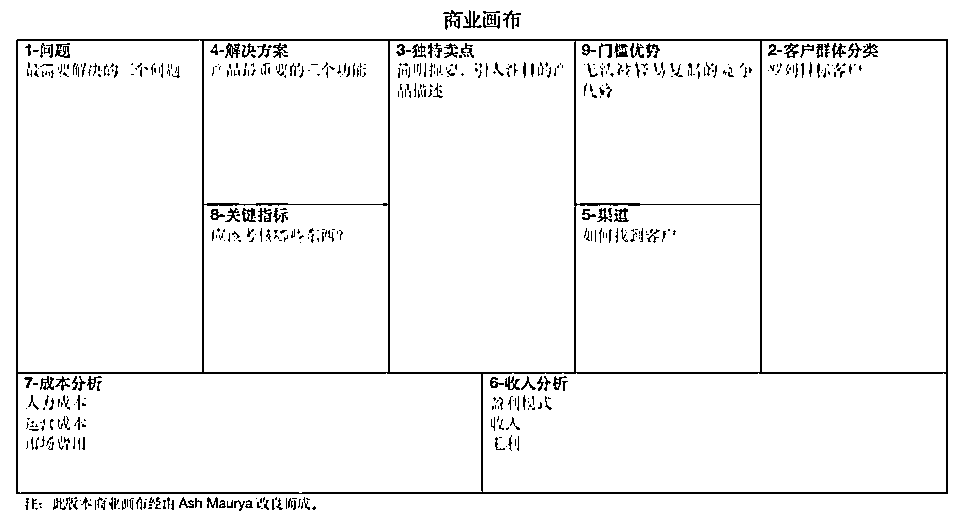

比如知识付费课程，可以是课程的教学目标、大纲、内容主体、课程作业等部分。具体的话术，都可以先不用确定。

 

 

2）测试投放：根据定位选取部分种子用户进行产品投放，也可以借此过程促成部分环节的生产，比如话术、运营方式等。

3）反馈收集：面向用户收集反馈，对照设计好的验证点，对业务进行定量或定性的判断；这个阶段获得的反馈，往往有三种，正向反馈、负向反馈和超预期反馈。根据不同类型的反馈，重新考量解决方案。

4）优化迭代：按照反馈，对产品需要调整的部分，进行新的需求分析、并完成产品优化。

通过以上业务定位、财务模型核算、产品测试三个环节，可以快速验证出，这个项目是否具备向市场提供价值交换到足够的资源的能力。同时因为有验证模型，在业务持续推进的过程中，也很容易继续使用模型，查缺补漏的找到不足的地方，加以改进。

当产品验证逐渐稳定下来之后，一个符合市场规律的产品，也算是堪堪成型，之后可以根据业务规划，再在细节层面逐步完善。当然，每一次的资源投入都要记得算账，哪怕是个主观的投产比预估，也比拍脑门下决定强。

**4**、产品设计过程中，我自己踩的坑

对于做产品这件事，我其实蛮自信的。直到家庭教育的项目产品上线后，踩了坑。我才意识到自己又犯了经验主义的错误，对新的市场不够敬畏。踩的什么坑？

首先是“大手大脚”。虽然我在创业之初，就一直强调控成本控成本，但实际操作过程中，还是会延续之前在职业岗位的习惯，先设计产品规划中最核心的部分，以至于我的第一个知识付费产品，选择的是训练营。这就导致前期时间投入过高，上线之后，因为客单价的问题，只有之前私域沉淀的少量高信任的用户购买，对拉新毫无帮助。而且它还要占用我一部分时间用以交付，所以导致业务节奏不稳定。

踩这个坑，让我意识到的是，哪怕做相同的事，在不同的场景中，前提条件发生变化了，就必须要从0开始推演和定计划。

 

 

同时在设计过程中，之前职业经理人角色的惯性也延续下来，在产品面对市场测试验证之前，我按照自己的判断，填充了一些功能。比如：增加了微信群的互动，和知识星球的提问。结果不如人意，用户觉得收益不大，我则增加了交付成本，到现在还需要按照承诺继续填坑。其实是把一些之前适用的想法，当做当下场景的需求。

产品设计可以依靠经验吗？可以。前提是对口的行业和业务经验。这种情况，可以依赖经验快速做判断，测试时在略微调整即可。

但如果是跨界到一个之前并未深度参与的行业，那么设计的方法，必须从依靠“设计经验”转变成依靠“数据反馈”。也就是我强调的第三条MVP设计策略，要用“最小”去快速验证。成本低，效率高，帮助自己快速完成对行业的体认和理解。

产品经过市场初步验证之后，接下来会进入对整体业务的运营管理。在这个阶段，我遇到的问题是，必须要开始操盘很多自己不擅长，甚至没接触过的事。

四、转型后，从专职岗位到全流程负责，遇到不擅长的事怎么办？

之前说过，我的个人履历上是产品设计为主。对于业务的运营和获客这些部分实际上是我的短板。我非常清楚，每个领域都有自己的认知壁垒，特别是实践上想要精通，短时间是很难做到。所以我不太可能通过自主学习，去精通相关环节，时间和现状也不允许。

因此，在那些我需要系统应用，但又不擅长的领域，我采用的模型是：初阶自学+高阶信任代理的模型。

什么是初阶自学？业务涉及到的所有环节，其实全网都有非常多的通识课程，找一个靠谱的品牌或个人，就可以快速学一遍，把基本概念了解清楚，然后就可以边学边操作一遍了。

是的，不论你是否有团队，我都建议自主创业的伙伴，自己把全流程走一遍。

 

 

这个操作能够有效的帮助你，了解业务流程中所有要点，以及这些要点之间的逻辑关系。这种要点及之间的关系，体现在成熟企业中就是岗位**KPI**，如果业务发展起来，需要搭建团队进行管理的时候，这些经验将会给你提供极其宝贵的支持。

初创阶段，则有另外的意义，当你操作完全流程，其实可以把事务分成四类：

自己必须做的；

自己可以做的；

自己不想做的；

自己做不了的；

区分完之后，怎么决策呢？根据你对财务的测算结果来评估，如果不差钱，可以将除了自己必须做的事项，都通过引入人力资源解决。当然，这个决策也伴随着管理事务的增加，需要新增到业务流程中评估。

而我自己的情况是，我认为控成本是我创业非常需要注意的事，所以在业务和营收稳定之前，不准备起团队。一个人先**solo**。基于这样的考虑，也拒绝掉了一些线下机会的诱惑。

对我而言，创业的机会成本极高。我必须控成本，活下来，才有足够多的犯错机会，直到业务稳定。在那之后，才考虑增加团队来承担部分任务。

但这样的决策依然解决不了，那些“自己做不了的”，或者说做得达不到业务标准的部分。这个部分的事项，必须找到快速有效的解决方案。

这部分就是要分享的“信任代理”模型。

什么是信任代理？在文章中的定义有别于克里斯·布洛根《信任代理》书中提及的概念——指信任是互联网时代的新货币。

我提到的信任代理，是指一种协作的策略：就是在你需要专业支持的部分，找到精通该领域的专家且善于合作的人，明确你需要他为你把关的那些环节，按照合作的方式让专家给你形成专业支持，快速突破。

 

 

这里提到的**“**信任**”**，更偏向于共识性的客观评价，而非主观的判断。比如：行业公认的要优先于自我标榜的；有社会共识的优先于创新崛起的；有学术成果的优先于野生的。如果一个领域还处于极其早期的阶段，比如元宇宙，请谨慎的对待任何“权威”，当你的业务涉及到这个部分的时候，自己下场会比任何代理都更稳妥。

**“**代理**”**则是指委托和合作的一种形式，也可以理解为外脑或购买服务。

举例子说明一下，比如大家选择生财，就是一种信任代理的逻辑。生财本身就是用专家的认知给他人提供信息杠杆的地方。借助生财的力量，我们可以快速获取各类业务核心信息，比起自己做调研省力不知多少倍。

而且生财的成果和用户口碑，就是“信任”的客观评价。

类似我在给一些客户做产品咨询的时候，需要快速了解一个行业的情况，这种情形下，生财就是我首选的信息源。

同时还在生财链接到了像花爷、芷蓝、梁靠谱等不同领域的专家，在他们的课程学习，以及和他们的沟通和咨询，对我的业务形成了非常直接和及时的帮助。

比如：我做获客和营销的计划时，一头雾水，是通过他们的建议设定了不同梯队工作流程，根据这些思路，我就可以非常明确的去做功能产品的测试，少走了非常多的弯路。

信息时代对人与人的联结提供了太多可能，我们可以用新的协作形式，更高效、低成本的搭建自己更多元的团队。而信任代理，就是搭建这种团队的一个基本的筛选模型。作为一个受益者，也向各位生财的小伙伴强烈案例这个模型。

五、总结

风险并不总是所见即所得的，能被看见的风险，总有方法规避或者对冲。而对看不见之风险的审视和评估，是我们能稳步前行很必要的行动。我想，这对任何人生阶段和际遇，都是个好建议。

 

 

充分评估之后，做决策时更需要的是勇气。并不是倡导大家如同我一样裸辞，而是希望当某一时刻，各位需要面对抉择的时候，可以相信自己。在人生中各样的关键时刻，勇气会带来命运的奖励。

人生角色是多元的，不同的角色之间会互相影响、赋能，做好平衡的调整。各个角色之间的权重排序，来源于价值观，不用刻意追求某一个模板，去做让自己自豪的选择就好。

重大决策的时刻，也是大量资源需要被激活的时刻。做好内外线的评估，可以避免上头和掉坑里，更重要的是，能够对每项资源的损耗和产出有概念进而可以做有效的调控，让自己的资源有形成复利的可能。

信任代理是当代已经有充分共识且性价比极高的协作方式，某种意义上，它就是我们拉开竞争优势的杠杆，一定要学会搭建自己的虚拟团队，获得支持的同时，也可以输出价值。

产品设计领域，是有专业门槛的，在应用过程中，结合具体的业务情况，需要专业的分析和指导，尽量要找专家评估，能少走弯路。我推荐两本书，帮助大家迅速了解产品设计的重要内核。

市面上产品经理的书目很多，但毕竟大家并不需要掌握系统的产品设计方法论，我就推荐对于商业设计核心概念有帮助的两本书籍：

1、《交互设计精髓》，重点学习的内容：需求分析部分，和用户调研部分。

 

 

2、《精益创业实战》，重点学习的内容：商业模式设计部分、需求分析部分。

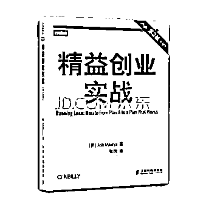

以上就是我这段经历的分享，希望能够对大家有所帮助。谢谢阅读。

评论区：

梁靠谱 : 萨哥牛逼，太燃了！

张亚萨 : 向先进份子梁靠谱学习！

宋大刀 : 亚萨老师🉑太优秀了  ！！

张亚萨 : 谢谢大刀！[愉快]

倪大胖 : 前进前进前进进

晨阳牙牙 : 焦虑被挑旺了，平静才能莅临。

恐惧被惊动了，希望才会出场。

谢谢萨哥分享呀！

张亚萨 : y有帮助就好

清扬 : 很有感触，感谢分享！

 

 

# **# ****(**精华帖**)(187**赞**)**圈友准备从阿里离职出来全

# 职创业，我给了他几条建议

作者：  亦仁

日期：2018-11-30

今天生财有术有个成员过来找我聊天，带了他的两个创业方案，说准备从阿里离职出来全职创业，我听了他的分析后，给了他几条建议

**1. ** 先兼职完成探索的闭环，赚到第一块钱，兼职完不成赚一块钱的目标，全职也很难。  只有当闭环走完，明显的瓶颈出现在时间投入上时，全职才有意义，我当年出来创业时，兼职收入是我工资收入的10倍以上；

**2. ** 做好至少半年以上没有收入的准备，特别是做产品，没有几个月潜心的打磨产品，基本是不可用状态，现金压力太大，动作会变形，动作变形，产品做不好，进入恶性循环；

**3. ** 先复制别人的模式，很多看起来轻松简单赚钱的事情，自己动手去试试，就发现没那么简单，但也不要被吓到，专注的扎进去一段时间，会发现也没那么难；

**4. ** 所谓的人脉、资源，没那么靠谱，不要太相信说给你很多资源的人，只有当你真正的给他们提供不可或缺的价值，他们才会长期的依赖你，本质上都是利益交换；

**5. ** 不要迷恋裂变、流量玩法、增长黑客这些概念，从0到1打造一个产品或商业模式，并把他从0推到1，从1推到100的能力，这个才是壁垒，光会玩流量是给别人做嫁衣，正如资本会往收益率高的地方流动，流量也是；

**6. ** 不要一上来就做平台，先搞定某一个细分市场的某一边，甚至是只要跟某边的关键人建立起关系，再逐步长大、放大，成为某边资源的代表，进而去拓展另一边，最后发展成平台，平台是长出来的，不是规划出来的。

评论区：

⭐  伟哥 : 听一席话胜读十年书

猫先生 : 说的太对了！！！

三林 : 实在

Light微光 : 字字珠玑

 

 

鱼丸|亦仁助理 : 每一条都非常实在，学习了[嘿哈]

不许变懒的猫 : 牛逼！！

阿彪 : 可惜看到这个帖子的时候已经晚了。相见恨晚啊！好帖！

宁 : 可谈，向你学习

# **# ****(**精华帖**)(152**赞**)**非典型成长的年轻人，把自

# 己打造为超级个体

作者：  蒋大头

日期：2022-02-11

Hello，大家好，我是蒋大头，作为一个多次获得了自己想要的工作，也有从自由职业转向大厂工作经验的人，希望通过我个人经历的复盘和大家分享以下几点：

1、作为在投机赚快钱上踩过一个不大不小坑的人，我对「人如何确定自己是否适合赚快钱」的一些简单的思考。

2、作为一个简历不完整甚至可以说是缺失的人，我是如何一次又一次获得想要的工作机会。这些机会给我埋下了哪些「connecting dots」，以及这些机会背后又有哪些外人看不到的「坑」和反思。

3、关于「打破自由职业和打工人之间的边界」的一些思考。认识 @白一喵  之后，我复盘自己过去几年的那些折腾，意识到我其实一直都在尝试践行「一人公司」，具体什么意思我会在下文详细展开。

希望这篇文章对和我有类似经历，或者像我一样也是一个非典型/非线性成长的年轻人能有一点点帮助和参考～

 

 

目录

**1. **我是谁？为什么要写这篇文章？

**2. **我的个人经历反思

**3. **最后总结

**—01—**

我是谁？

为什么要写这篇文章？

简单介绍我的过往经历如下：

2016 年，从夏威夷一所教会大学毕业后回国没有进入职场。中间简短炒过外汇，炒过币（赚过钱但是导致负债，后面会细讲）；自己写过泛经济学的课程，所以讲过课，做过讲师。

2017 年，机缘巧合成为头部创投内容公司【硅发布】创始人 Lynn 的助理，这里简单介绍一句硅发布：硅发布是中国企业家和投资者了解美国科技和投资发展趋势的重要信息枢纽，创始人 Lynn 是业内顶级专家，如果你对未来的科技趋势、投资机会感兴趣，可以关注 Lynn 的内容。

 

 

给 Lynn 做助理让我了解到了一个好的老板是什么样的，她会给你很好的反馈（正负都有），给负反馈会给到 why 和 how，让你成长而不是批评你，如果你有能力，她也会给到你自由发挥的空间，会从你的角度来帮助你成长。由于我自己的原因，虽然没能学到  Lynn 的本事，但是在给她做助理的阶段还是培养一点信息和科技趋势（创投方向）的审美和概念。

2019 年，为了还之前炒垃圾币产生的负债去到了一家区块链公司，来到了上海，从这个时候开始重新思考自由职业和打工之间的关系。

2020 年，为了更好地打开事业，但是又希望工作的地方是一个有潜力的行业，且有趣又是头部的创业公司，并且希望这个公司能让我获得一些内容制作的能力，所以去到了那时候还没啥员工的播客头部公司 JustPod，从剪辑实习生开始干，离职的是运营，离职后还合作 co-host 过几期节目。

因为从 JustPod 获得了播客制作能力，也是在 2020 年，兼职给【有知有行】旗下的播客节目《知行小酒馆》做后期，这也是我第一档参与的在小宇宙粉丝从 0 做到现在  28000+ 粉丝的节目。

同样因为播客制作，2021 年结识了《空无一物》的三位主播 @范米索 @白一喵 @唐海程，成为《空无一物》的后期小伙伴，并且得到了他们三位非常多的在事业上和一些私人情感上的支持。

也因为给《知行小酒馆》做了一期关于 lululemon 的播客，当时做节目的同时觉得  lululemon 是一家非常有意思的公司，顺手投了个简历，年底的时候顺利入职了，所以我现在也是一个「卖裤子」的人。

 

 

**—02—**

个人经历反思

一、风险和风险控制

我的经历里面有非常高风险和幸运的部分。这里直接分享一下我炒垃圾币的前因后果，这段经历算是投机赚快钱，赚到过但最终失败的典型。

当时入场的垃圾币其实就是一个传销项目原本的套路不赚钱了，为了继续割 JC，就蹭区块链热点，发行了很多数字货币继续圈钱。我当时会了解到也是因为家里人投了这个传销项目，那会儿我也没有想太多，因为当时那个资金盘已经存活了很多年了，出于侥幸心理和一夜暴富的心态，就觉得也许我也可以趁机赌一把？

所以和很多投机的人的想法差不多，抱着「赌一把，赚了就赚了，赚到 xxx 就撤」的想法我就入场了。当时最夸张的时候是三天 10 倍，我那会儿入场的成本差不多也有 50 万，这 50 万里面一半是我妈妈的，另外一半是我杠杆出来的。

我那会儿的想法也很简单，觉得我可以赚 20 倍左右后就离场。

可能是太想赚快钱，可能是那会儿那个浮躁的圈子的氛围给了我一种错觉，那就是这个币肯定还能涨，特别是身边的人都觉得 20 倍算什么，至少要 30 倍 50 倍甚至 100 倍，毕竟区块链嘛，100 倍是常态，后来才知道，所谓区块链 100 倍是常态早就是过去式了，因为那时候已经是 2018 年了，币圈最狂欢的时候早已过去。

 

 

所以说来好笑，我当时甚至还觉得自己挺「保守」的，也不贪心，就是到 1000 万就开始撤。但是资金盘是不会给你机会的，特别是我入场的时候其实已经是尾声了，前面赚钱的人已经先跑了，镰刀已经决定收手了，所以我以为自己能够跑得快，最终还是接盘。

但是人在赌徒心态的时候很容易陷入怪圈：明明利润已经在回撤了，该收手对不对？明明已经腰斩了，该至少把本金撤出来对不对？明明本金已经亏损了 10% 了，该赶紧抛售把剩下本金保住，对不对？

这些都是很基础的常识，但是我都没有做，我那会儿就是很菜鸟的想着只有止盈（1000 万，不过我高度怀疑我即便那时候赚到 1000 万也不会收手），完全没有止损线，甚至忘记了我的资金是有成本的，是有很高利息的，我满脑子只有「再扛一下，可能过两天就涨回去」这种赌徒想法，最后的结果就是导致了将近 40 万负债（本金 + 利息）。

还债的过程就不多赘述，从 2018 年底到 2020 年初我都过得很郁闷，压力很大，几度崩溃，也会很迷茫自己的未来到底在哪儿。40 万负债不多，但是精神压力会很摧毁人。

但我比较幸运的是，我那时候得到了一个机会到上海，加入一家区块链公司，薪水还不错，加上后期兼职了别的工作，所以用了差不多 2 年时间，还清了债务。

这段经历我自己的总结就是：

**1**、投机或者说「赌博」不是不可以，但是也是有基本法的。

第一，基本的调研和风险控制至少是要有的，比如那时候我连区块链这个圈子都没有研究过，完全是把这件事当老虎机在操作了，不亏钱都难；

 

 

第二，无论如何，不伤及本金是投机/投资的底线，我没有遵守这点，为后来负债直接挖了个大坑；

第三，超出个人承受范围的杠杆是绝对不可取的，我那时候并没有一个高薪稳定的收入，但是却通过套信用卡和平台借贷借钱炒币，所以我后来负债的很大一部分其实是利息，而不是本金，也是这时候我才彻底理解为什么巴菲特说不要加杠杆。

问题不在于「杠杆」，而是我没有能力去承受那个杠杆。所有如果有小伙伴也想着要杠杆操作，仔细评估一下自己的还款能力以及潜在的风险，比如项目就是垮了，是否能还清所有本金和利息？这些可能出现的负债会对自己的生活和精神造成什么样的影响？同时要注意，物质生活影响也许是可控的，但是精神上面的影响极大可能比之前预期的只高不低。

2、虽然我的债务都是自己还的，但是中间家人和朋友会在我现金流特别紧张的时候帮助我，让我不至于产生信用污点之类的，所以总的来说，我的运气是很好的。

而很多没有我这样运气的朋友，很可能就崩溃了，导致再也没机会有所谓的后续发展了。所以要赚快钱的朋友可以考虑一下，如果一旦你搞出了大坑，自己能否有能力扛？

自己扛不起，是否有足够的家底或者亲人朋友来帮你度过难关？

3、我认为大部分人都是想赚快钱的，你问我现在想不想，我也还是挺想的，但是我可能不会再像之前那样干了。

原因也很简单，虽然我认可，人只要努力，机会一定会有，但是很现实的一个点是，随着年龄的增加，一旦投机搞出极大风险，再想翻盘，比起 20 岁出头的时候，对心态、精力、以及精神力都会有更大的挑战。

 

 

「人生其实是需要赌技的，因为有赌技才能大概率实现跨越（阶级**/**财富），

但是这个赌不是瞎赌，赌技是很需要打磨且很难的一个技能」。

前段时间参加生财的线下活动，唐梦律师当时提到关于「赌技」的观点，具体原话我不太记得了，大概意思就是：

所以小伙伴们如果想赚快钱，一个要研究一下赌技，找身边那些「赌」成功的人学习可复制的技术，另一个就是要看看自己是否有这个「赌运」，比如我现在就认为我没有，我已经用真金白银试验过了，我可能就是那种必须要脚踏实地认认真真工作实现财务自由的人。

这个真金白银不仅仅是负债这一个结果，更是我看到了负债背后我个人的一些特质，比如我性格和思维偏跳脱，对于我来说，得到好的工作机遇、做项目或者创业才是更适合我的财务自由之路。

而不管是二级市场的那些投资也好，投机也好，甚至是打德扑赚钱之类的，至少我见过的真正能够长年稳定在这相关领域赚钱的人，都是能耐得住寂寞吃苦做研究且坚守自己投资**/**投机策略的人，这个特质我自评现阶段至少是没有的，所以我阶段性的放弃了赚快钱。

我的确也有见过一无所知的菜鸟通过投机发财，但是同样的，我没有这个偏财运，所以放弃，如果你认为自己有偏财运，也请控制好本金尝试。

上面那部分是关于赚快钱的反思。而我的个人职业和事业选择，也是充满了风险和缺乏风控。

 

 

基本上，可以定义我在进入 lululemon 之前，都是属于完全没有事业规划的一个状态，简单来说，就是我挖了很多坑，但是都没有挖深。由于从小有点小聪明，所以最容易聪明反被聪明误，具体体现就在于，很多人刚接触我可能会觉得「诶，这人好像啥都懂一点」，但是碰到专家，立马就会露馅。

自由职业最大的问题在于，当能力点很单一的时候，又没有刻意练习去提升自己的能力深度和广度，就很难获得更好的机会，创造更高的价值。最浅显且直接的体现就是，收入会不稳定。

而收入不稳定，不仅仅是有经济风险，还有精神风险。经济风险很简单，如果家里没有一定家底，自己又没有足够稳定可负担自己一切开销的收入，那就很成问题了。

精神风险是几个方面：

1、很多人自由职业，是期待比上班更多收入，更自由。

但实际情况是，自由职业，特别是在业内还没有名气的自由职业者，不管是工作时间还是项目挑选上，都是不自由的。

与之相伴的就是收入也难以稳定或者达到预期，那就会带来心理落差。这种心理落差会随着年龄增大而加剧，因为会有各方面的压力，不管是 peer pressure 也好，还是家庭压力也好，都很消耗人。

2、如果你在亲密关系之中，伴随第 1 点，就很容易影响第 2 点。

 

 

比如我的前任一直对我非常好，甚至表示我不需要考虑收入问题，我只需要干我想干的事情就好，但是我因为自己的精神压力导致有一段时间情绪极为不稳定，这种不稳定就会让身边的人无形中承受很大的压力，很可能当你觉知到想要改变的时候，已经来不及了。

最后就是前任成了前任，这一点对很多自由职业者来说可能会加重心理和精神的压力。

这些压力一旦控制不好，人可能轻则抑郁情绪，重则抑郁，那事业肯定是搞不好的。

至于我是如何获得那些外人看来还不错的工作机会的，我可以简单分享两点我认为可以复制的地方：

第一，要有勇气。

这个勇气一方面指的是要勇气去做一些挑战，如果你想要去某个地方，那就去尝试，不要犹豫。另一方面就是要有勇气去找到一些关键人物去展现自己的能力和渴望，这样会更直接高效的获得机会。

我其实从大学做兼职开始，就属于一旦我想要获得某个机会，只要能找到一把手（能拍板的人）聊，就找一把手的那种人。不要担心关键人物或者大佬不理自己，人家愿意理你且给你机会就珍惜，没有搭理你也很正常，总之找一找也没有什么损失，尝试肯定比不尝试好，要注意的就是不要烦人就行。

好的勇气，是给自己埋** connecting dots **的基石。

 

 

第二，fake it until you make it（正好前两天看到增长黑客作者范冰说最好的翻译也许是：借假修真）。

简单来说，假如某个团队或者公司，你很想加入，但是你觉得自己能力或者技能不够，不要担心，你可以想办法加入进去，边学边提升，入局肯定是学的最快的方式，有时候即使结果不够好，也能带走一些之后对你很关键的东西。

比如当初我为了加入 JustPod，高龄进去做剪辑实习生，尽管后来意识到我是想做制作人或者品牌相关的工作，但是我的个人经验来说不是很匹配，创业公司也很难说要花时间去培训你，所以我离职了。

但是没关系，至少我带走了后期制作这个技能，这就是我在 JustPod 埋下的 connecting dot，让我有机会和【有知有行】、【空无一物】合作。

但是尽管如此，我的工作经验里面其实更多是遗憾，我会在第二部分【机会的把握】里面更多展开。

二、机会的把握

之前和 @白一喵  聊我会写这篇文章，小白问我，加入我可以穿越，我会想要回到什么时间节点，给那时候的我什么样的建议？

我的答案是 2016 年。

 

 

其实在 2016 年之前，也就是我大学毕业前，我家里也出了一些事，让我没办法继续留在美国升学。我自然也有很多想要篡改历史的地方，但是我怕引起蝴蝶效应，所以不想穿越到更早的时候了。以及，我一直都认为，在 30 岁之前，吃一些钱上面的苦，踩一些若干年后回头来看不算太大的坑是有必要的（比如经历负债这种事情就是不错的历练）。

所以我选择回到 2016 年。

总之我会给自己这些建议：

第一，尽早理解什么是「价值交换」。

我觉得不管是给公司工作也好，还是作为一个个体去协作也好，要非常清楚自己能给对方带出什么样的价值，而不是一上来就期待着别人能给自己什么。这点其实是对别人的时间和价值的尊重，也是对自己的尊重。并且，如果想要和厉害的人一起共事，就要整理清楚自己的目标在哪里？厉害的人想要什么样的协作？

应该填自己哪些能力，哪些长板要足够长，哪些短板可以在加深长板的时候补一补，而有些短板则不必补。

第二，意识到「价值交换」，才能更好地把握机会。

如果我能更早的意识到，只有自己先创造更多的价值，成为一个高价值的人，有些机会才不至于到手边都溜掉。

 

 

举个例子，去年 4 月的时候，我其实去【有知有行】面试了一次。当时我是获得很好的机会的，因为我的面试跟别人不一样，我在面试之前会先在他们内部做一场

presentation，按理说我一向自诩演讲能力不错，这个机会应该是要展露我自己，但是最后的结果更像是暴露了弱点，也就是我之前提到的我挖了很多坑，但是都不深的问题。

结果就是我因为我的勇敢获得了机会，但是也创造了坑，因为我没有展现我可以给这个组织带来更多的价值的能力。

所以具体能力上，我会建议 2016 年的我做这几件事：

1、打磨内容能力。

而且要具象一点，比如说我自己感兴趣写商业故事、经济学之类的故事，那就是要打磨相关领域讲故事的一个能力，通过讲故事去让更多人了解原来经济学和投资是可以有更有趣的方式去了解的。

所以我会建议 2016 年的我：

第一，学习剧本写作以及叙事写作；

第二，要下意识地去给自己开一些更好的书单，然后逼着过去的我去把那东西给读下来。而不是去网上比较碎地看了一些观点，然后就拿过来用。对某一个领域感兴趣的话，那就系统地把领域相关的书好好读一遍。

 

 

第三，更早地去掌握一些读书的技巧和方法。因为既然涉及到大量的阅读，会有精力分配的问题，需要更有技巧地去挑书和读书，以及不能读完就完了，要及时形成一些输出，去获得一些反馈。

形成输出还有一点很重要，就是留下了自己的作品，这个作品与点击量、阅读量、粉丝量之类的无关。这个作品是个人内容能力和审美的体现，在自媒体时代就意味着更多更好的机会的钥匙，是非常重要的一个 connecting dot。

2、回到 2016 年，那个时候我也不小了，我当时已经 25 岁了。所以我觉得那个时候我可以开始尝试去抓一些高中生和刚进大学的学生做类似于 coaching 的练习。

因为当时我住在川大旁边，我是可以去跟他们聊天去沟通的，coaching 是一个很好的相互学习的一个过程，同时也会锻炼我的沟通技巧。

我会想要做这件事，是因为结合我的性格和能力特质，我去年明白了我事业的一个主线就是通过跟人产生链接而迸发出更多有价值的事，那类似于 coaching 这样的有策略有规划的和人之间的对话练习，就应该越早开展越好。

3、注意培养自己的信息素养。

比如在给【硅发布】的 Lynn 做助理的时候，如果我能够更有意识地培养我的信息素养，Lynn 也就能够给到我更多辅导，因为只有自己知道自己要什么，高阶的人才知道怎么才能更好的帮到你。

 

 

Lynn 是一个信息品位很高的人，常年研究的又是未来大趋势，所以如果 2017 年我能够更有意识地培养我的信息素养，我的一二级市场的投资能力也许会非常的不一样，或者至少我觉得可能看问题的视角会到一个更高的认知水平。那么也许我在 2018 年踩投机失败的那个坑的时候，风险上会更可控。再有就是，好的信息素养会极大的帮助我的内容输出能力。

4、尽早借用一些工具来了解自己，比如 MBTI、盖洛普测试、STRONG 之类的工具。

用工具测试完之后，最好找信得过且有足够经验的人做一次深度解读，以免对一些细节概念产生误读。这些工具是了解自己的一个坐标，帮助自己更快找到自己的源动力，明白在工作中自己为什么某些方面会做得好，某些地方会做的不好，怎么做更适合自己等等。

三、自由职业和打工人的边界

由于我是先做的自由职业，到三十岁才开始进大企业工作，所以某种程度来说，也许更理解所谓的自由职业和打工人的边界。

我也是在认识【空无一物】的三位主播之后，才更意识到，我过往的种种折腾，都是因为我是想实践「一人公司」这个概念。我希望自己一个人就是一个强大的公司，和别的公司、组织、或者个人发生高价值的交换。

所以如果要定义自由职业和打工人的「边界」，我认为主要是视角和心态的转变。我的心态就是，既然我在践行一人公司，那么对我来说，最重要的就是要知道我要去哪儿，我需要哪些能力，我需要做什么事情从 A 走到 B？我的长短板分别是什么，该如何更好的扬长避短？

 

 

至于到底是在企业上班，还是自己出来干项目，这本身不重要，都是可以动态调整的。

即便我在大公司上班，我也不认为我是在打工，我只是在用我的能力和企业/组织做价值交换，我现阶段的能力可以为组织带去一些东西，所以组织用了我，但是心态上，我就是自己的 CEO，我只为自己打工。

当企业和我一方或者双方都觉得彼此阶段性不能给到对方更多之后，可以友好地暂时结束合作。

而不管是上班还是自由职业，最重要的都是把自己打造为超级个体，根据自己的特质培养 2 个以上最够强的能力，这个就是我现在正在做的事情。

**—03—**

总结

我个人认为，不管是想要投机搞钱，还是干事业，最重要的是了解自己到底想要什么，要过什么样的生活，比如很多人说自己爱钱，但是其实爱的是背后的服务和产品，以为自己需要很多的钱，结果活得很累很焦虑很卷，仔细分析之后，发现自己并不需要那么多的钱。

搞钱特别是投机搞钱，要充分意识到风险和控制风险，有机遇的话，最好能找到高手调教一下自己。

 

 

搞事业，尽早借用工具了解自己，不断灵魂拷问自己到底要什么，要做什么，物质生活满足后需要的是什么？战略上定好一些大的规划，战术上边干边调整。

对于想要的机会，就放开心态去争取，即便从杂活开始干也没关系，最重要的是明白干的事情会给自己埋下哪些 connecting dots，有些经历看上去没有什么价值，比如剪辑某种程度来说是很重复机械的劳动，但是我会认为一方面锻炼了我一向不怎么样的耐性，更重要的是让我有机会可以借此和更厉害的人有个链接。

我个人理解就是那句很俗的老话，没有哪段经历会白费，但是需要更细颗粒度的去分析经历，提取精华，避免重复踩坑，提升未来做事的效率和质量。

最后祝大家生财有术～有意愿更多交流的朋友，可以添加我的vx：alohaxj评论区：

森林 : 感谢分享～

南柯 : 感谢分享

半藏 : 感谢分享

风vs枫 : 感谢分享

大咪 : 感谢分享，非常有收获！

【不管是想要投机搞钱，还是干事业，最重要的是了解自己到底想要什么，要过什么样的生活，比如很多人说自己爱钱，但是其实爱的是背后的服务和产品，以为自己需要很多的钱，结果活得很累很焦虑很卷，仔细分析之后，发现自己并不需要那么多的钱。】这段话让我想起了一个抖音博主的采访，专心做自己喜欢的专业内容，赚钱就顺带赚了[偷笑]

亦仁 : 感谢分享，已加精华。

海洋 : 看到很多优秀的人，大都是这么思考的，赚钱不是目的，只是一种必然的结果。

蒋大头 : 感恩生财！

 

 

# **# ****(**精华帖**)(142**赞**)**身边真实案例，从月入** 3000 **

# 到收入千万需要经历的选择

作者：  牟长青

日期：2021-11-03

这篇文章是昨天花了3小时写的原创分享，先在自己的私域流量里分享了下，公众号都还没来得及发。因为是和赚钱相关的，所以觉得也可以分享给生财有术的朋友，看能否正在创业的年轻人一点启发。

因为我本人从2012年就开始做新媒体创业，加上做新媒体培训，线下峰会，新媒体社群，所以接触的新媒体创业者特别多，知道很多月入3000到收入千万的新媒体创业者的故事。但我今天分享的是身边发生的真实案例，因此不会有任何水分，如果有朋友觉得不信，可以在圈子里打听下，或者加我微信当面沟通都可以。毕竟我也是这么经历过来的，唯一的区别是，我才做新媒体时候的起点，比我身边的这些人高一点，他们那时候都是月入3000，我因为在大厂工作，已经月入过万了。

在互联网从业的这16年里，见过了太多的人和事，也见到过太多人从月入3000，到收入1000万以上，可以说互联网给了很多年轻人逆袭成功的机会。但这些人为何能从月入3000，到收入1000万？

在互联网上的这样案例很多，但今天主要跟大家分享下在我身边的真实案例。11年前的28推创始团队成员大部分都是才参加工作，或者大学没毕业，80%的人都是月入2-3千。

而不到10年的时间，有差不多1半的人都累积收入了过千万，其中甚至有8个人收入过亿。今天的文章，就给大家解析下，这群人在这过程中做了哪些正确的选择，才一步一步走到今天的。

 

 

本文一共写了5点，也就是5次正确的选择，其中最关键的是第四点和第五点，起了决定性的因素，因为前3个选择很多人都能做到，所有大家一定要耐心看完全文。

一：女怕嫁错郎，男怕入错行

这个标题是个俗语，说明选对行业的重要性，拿现在的话来说，就是选择比努力更重用。

首先要选择一个对的行业，而在11年前选择互联网行业的，那就走对了人生的第一步。

相对别的行业，互联网行业给了年轻人更多机会，有更多一夜致富的可能和机遇，中国最近10几年福布斯排行榜，突然排名很高的老板，基本都是互联网企业的创始人。比如滴滴的程维，公司创业几年就上市了，曾经也成为了中国首富，后面不想太高调，稀释了自己的股份。

在2007年的时候，我工资也是3000，在北京也认识了一群工资只有3000的互联网行业的小伙伴。在10年后，我大概了解了这些人的现状，发现如果还在打工的，基本年薪没有低于20万的，而少数去创业成功的，收入就更高了。比如我重庆老乡杜均，就是在那个时候认识的，记得当时他才19岁，是北京康盛创想的一名基层员工。在进入互联网行业前，杜均在北京网吧打过工，在餐厅当过服务员。

杜均早在做域名投资的就已经身家过亿，后面成为火币网联合创始人，金色财经创始人，听说在区块链行业挣了几十亿，当然这个只是道听途说，没跟杜均本人证实过，但几个亿肯定是有的。

 

 

同样也是在2007年的时候，我身边在老家的同学朋友，也是拿着2-3千的待遇，但他们没在互联网行业，10年过去了，我看了下他们收入，大部分年薪在10万左右。而我做互联网的那群朋友，平均收入肯定是30万以上。这就是行业不同的差别。相对别的行业，互联网行业更有积累，同时也讲资质，能坚持在这个行业干10年的人，月薪低于30万的都是少数人。因为这一路上的机遇太多了，随便抓住一波机遇，就能实现逆袭。

如果我今天这篇文章最终是有5个对的选择，最终实现千万的目标，那选择进入互联网行业，那离千万收入就已经前进了1/5的距离。

二：进入了一个行业，是否有主动学习的习惯

我从2006年开始写博客，到2009年的时候算是我独立博客的高峰期，每篇文章的阅读量在2W以上，也就是我博客有最少1万的忠实粉丝，在我看来这都是一群愿意学习的人。

当然有的人只是无意中看到这篇文章，而有的人是定期会打开我博客，看有没有新的文章。在当时我就听到很多粉丝说，他们入职网络推广工作的第一天，他们的老板就指定他们来我博客学习，甚至有没有看过我博客，成为能否入职的一个标准。

曾经有很多人给我留言或线下见面打招呼说，说因为看我的博客，给了他启发，然后对他的工作和事业有所帮助。在新媒体行业初期，我和很多未来的大佬，第一次加微信的时候，对方都是说以前经常看我博客。比如猫老大，十点读书林少都这么说过。

记得有次28推和微盟谈线下活动赞助，当初双方工作人员在一个群里，微盟的创始人孙涛勇直接在群里说，我的文章给他做个人站长的时候很多启发，愿意连续赞助我们两场活动。

 

 

 

 

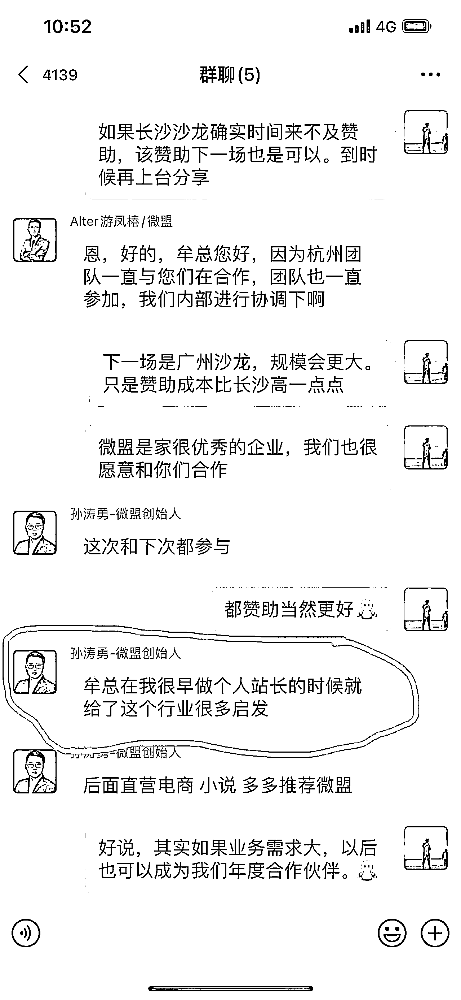

后面接触很多80后，90初的老板，只要是互联网行业创业几年以上的，都有说看我的博客或听过我的分享。选对行业的人很多，但能否再进一步，成为行业里相对更优秀的人，有主动学习的习惯也很重用。

三：面对一个实践学习的机会，是否有报名的勇气

在2010年的时候  ，还是网络推广，SEO比较盛行的时代，也有各种培训班。比如夫唯的SEOWHY的SEO培训，还有各种网络推广培训。那时还在北京工作，坚持写了4年网络推广分享博客，在业内有点小名气。因为比较闲，就随意写了篇文章说招募10个徒弟，做网络推广实战培训，结果收到了400封报名简历。

当时我每篇文章有2万多的阅读，相信我那篇招徒的文章，在那期间至少有1万人看到过。觉得有400封报名邮件挺多的，但现在回过头想，如果我有1万个忠实的读者，为何只有400人有写报名邮件的勇气？

 

 

如图：当时写的报名门槛

可能是当初写的报名门槛，让很多人没有报名的勇气，比如年龄要求27岁以下，就拦住了很多人报名的欲望。我的想法很单纯，我不希望有年龄比我大的徒弟，怕不好管理。

当然也怕年龄大的，体力不行，不能按我的要求，去狠狠的执行。

但也有人没有因为这样的硬性条件而退缩，比如28推创始团队的大师兄，也就是现在禾葡兰的董事长黄志雄，当时已经42岁，还是鼓起勇气给我投递了报名邮件，而我最终也破格录取了他，而也是因为这个缘分，后面黄志雄带领一些师兄弟做了禾葡兰和有点牛这两家在圈子里知名企业。

如图：当初黄志雄写的报名邮件，因为态度很诚恳，把我打动了。

 

 

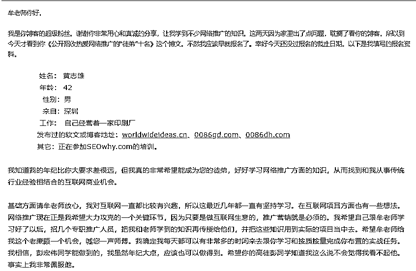

当时黄志雄在深圳开了一家印刷厂，其实收入已经不错，也是28推创始团队里少数才初期就已经创业的人。只是做互联网项目一直没成功过，前前后后亏了几百万进去，直到加入28推，才开始走了上坡路，在互联网赚到了钱。后面2017年做28推公司初期，黄志雄也给了我非常多的帮助，我现在也还是禾葡兰公司的高级荣誉顾问，签了100年的合同，每年还给我分红。

四：在实战培训过程中，能否去狠狠执行，而不被淘汰

最开始我本来只打算招募10个徒弟，但报名的人太多，符合条件的也多，因此最后想就招募30个徒弟。但选到第28个人的时候，就选不下去了，觉得剩下的人好像都差不多，就不勉强自己选到30个，从而有了28推的由来。

 

 

在这期间也有个小插曲，有两个人其实在报名邮件里，我并没打算录取，但这两个人主动在腾讯微博询问我他的报名情况，希望我给他机会。我觉得对方能2次来询问，说明是真心想学习，所以还是给招募了进来。而这两个也是至今还留在28推创始团队的班魁和何秋辉。

那时外面有很多风言风语，哪怕没有收一分钱，网上还是有很多对我的恶意攻击。说我年纪轻轻，有什么资格教徒弟，说我招徒弟就是割韭菜，弄一批免费的劳动力。

对于这些流言蜚语，我不想去解释太多，因为我觉得时间自然能证明一切。对这一批徒弟的培训我也非常认真，当时每周一个实战任务，每个任务我都会打分和点评。记得前两个任务就是微博和数据分析，这两个任务也延续到了后面的公益培训里。

虽然这28个人，从400个竞争者里脱颖而出，但并不是每个人都能够真正做到他报名的时候的承若。在培训1个月后，我就淘汰了6个人，被淘汰的我不觉得是他们能力不行，主要是没认真去对待每一个实战任务。

如图：当时第五个实战任务的排名，在做这个任务前已经淘汰了6个人，后面这22人里面，又淘汰了7个人。

 

 

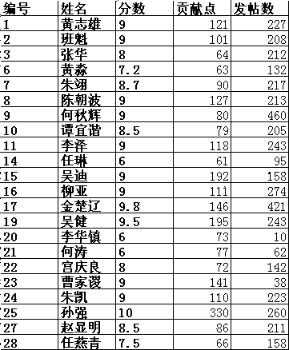

因为淘汰了6个人，所以才有了28推论坛初期的徒弟补招任务，现在还在创始团队的黎一中，易小歪，胡选燕，罗登，朱文健都是通过徒弟补招任务进入28推创始团队的。而最初报名我徒弟没成功的，后面也抓住了28推公益培训的机会，拿到了新媒体的船票，比如彭勇俊，王强，储海洋等人。

从2010年底招募徒弟，到2012年底做微信公众平台的2年时间，最初招募的28个徒弟，我最终是淘汰了13人。因为脱离了28推这个圈子，这13人最终都没抓住新媒体的机会，基本没有谁最后收入达到1000万。而没被淘汰留下来的人，有一半的人收入都过了1000万。

可以说第四步的选择，是最为关键的，决定你能否长期留在一个好的圈子里，一步扶摇直上，一步平平淡淡。

 

 

五：行业机遇来的时候，能否有勇气去尝试

在2012年8月份的时候，微信公众平台正式上线，在微信公众号平台正式推出的第三天，我就发现了其中的价值，然后就去注册了自己的第一个微信公众号“吃喝玩乐在重庆”，现在这个账号还存在着，也是重庆区域自媒体的头部账号之一，有100多万粉丝，目前兄弟公司重庆有点牛负责运营着。

当时我发现微信公众号平台有着非常大的机会，因此就号召28推团队成员和学员们都来尝试。记得我还在28推团队的QQ群发了个群公告，号召大家一起来做，我可以帮他们解决初始粉丝的问题，找人带号。

但并不是所有人都响应了我的号召，其中胡选燕，吴迪，郝明霞，易小歪，黎一中等团队成员是第一批就加入的，后面都做到了千万粉丝的规模，赚到了自己的第一桶金。而谢匡华，彭勇俊，莎莉，王彬彬，储海洋等人当时作为28推优秀学员也是第一时间也进入了公众号领域，后面因为表现优异，也加入了28推创始团队。

在机遇来的时候，能有勇气去尝试，从而才抓住了机会，而有的团队成员一直观望迟迟不敢入局，在多年以后跟我说，比较后悔，当年没有响应我的号召。而当时大师兄黄志雄带领陈朝波，沈海波，百度姐，罗登，李泽等团队成员在深圳成立了欣所罗门公司，专注微博营销，做了5000万的腾讯微博粉丝，1000多万的QQ空间粉丝，也赚到了第一桶金，只是进入公众号领域晚了一点，后面转型用私域电商的模式，做了禾葡兰这家公司。

六：历史是否会有轮回？

通过上面的案例，大家可以看到这群人，从月入3000到收入千万，主要是做对了5个选择。

 

 

1：进入一个有前景，有上升空间的行业。

2：进入行业后，不只是埋头工作，并主动在网上学习行业相关知识

3：发现靠谱的培训，有勇气去报名

4：报名培训后，能狠狠的去执行和实践，而不是像现在很多人，买了一个培训课程，都不去听，就觉得自己已经学习到了。或者光听不实践。

5：当通过实践有一定基础的时候，碰到好的项目，能勇于去尝试

其实今天的生财有术跟我当年的28推论坛很像，也是一群人在里面交流分享，然后还可以参加实战培训，只是生财有术的门槛更高，先要缴纳2000多成为会员才有参与的资格，当然这样来的人群质量也更高。其实能进社区来学习的人，其实已经算走了前两步。但实际上从第四步才是分水岭，比如我看之前生财的大航海活动，好像有1000多人报名，看着其实也挺多的，但生财有3万会员，为何还有那么多人报名的勇气都没了，大部分人第三步都没能跨进去。

报名培训后，然后到了第四步，因为没什么成本的报名进来后，你能否狠狠的去执行。

我当初招募28个徒弟，也是没收一分钱，但最终有13个人并没珍惜机会，被淘汰出去。

被淘汰的人真的不是能力不行，就是单纯没有执行力或者长期坚持。个别被淘汰的其实在初期的任务做得也不错。

至于第五步，就是可遇而不可求了，但没有前面4步的积累，当第五步来临的时候，你也抓不住这个机遇。俗话说机遇都是留给有准备的人。

 

 

最后放上一张，28推创始团队成员在桂林的周年聚会合影，我们已经一起走过了第一个10年，现在一起携手第二个10年。为何28推创始团队成员11年了，还能保持这样好的感情，就是因为我们曾经一起同甘共苦过，现在生活好了，也能一起共富贵。做得好的师兄弟，也不忘拉一把做得还不够好的。

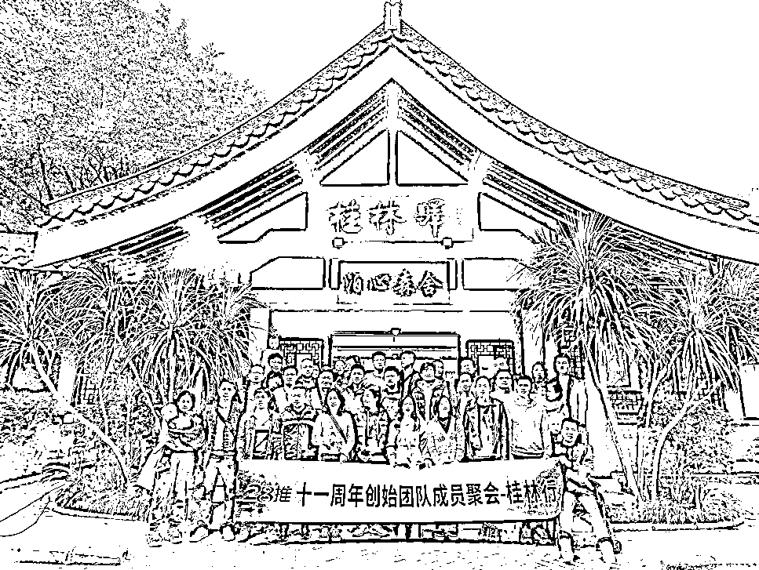

评论区：

骏马 : 亦仁加精吧？还等什么[呲牙]

牟长青 : 感谢认可哈，每次来生财分享我还是挺认真的，都是专门做过修改，去掉广告嫌疑的，让分享的干货更纯粹。如果能被加精，确实让我以后来分享的动力会更足点，但没有也没什么了[呲牙]

词宝嘟嘟 : 哎，其实我这个人灵敏度也挺高的，当时公众号我也知道是机会，seo我也了解一点，可是当时没找到靠谱的圈子，靠谱的人。自己的能力悟性又实现不了闭环，实 

 

现不了突破，白白错失了这么多机会

词宝嘟嘟 : 如果早点跟着牟大佬做，或者有生财这样的圈子，凭当时的精力和干劲一定可以做的很好

牟长青 : 所以圈子重要，很多人都有成功的潜力，只是缺个机会。

Clark : 虽然很认真的分享，文章里好像还有一个错误，就是你写到在这个行业刚10年以上的人，月薪低于30万的是少数，我想你这里想要说是年薪吧？

牟长青 : 这个确实是笔误，应该是年薪30万以上，谢谢指出

Clark : 还好，我以为我草率了，吓到了

# **# ****(**精华帖**)(133**赞**)**我见到的那些**95**后年轻人都

# 是怎么赚钱的？

作者：  丁鑫

日期：2020-05-29

我见到的那些95后年轻人都是怎么赚钱的？

独自来深圳5年，非名校毕业，身无技术家庭亦无背景。没有梦想也没有情怀，单纯是东北呆腻了，港片看得多，觉得南方人讲普通话都蛮好听蛮文明的，于是就想来南方看看。

2015年，在家人的反对下，我偷偷做起微商卖玉石饰品，几天里清洗了一些高中大学同学，赚了几千块钱，乘坐由东北发往深圳的绿皮火车，赶赴深圳。由此，一个未经世事的男孩，颠覆了原生家庭的思维认知，他的梦想也变得越来越大！

1、你跟别人不一样，不能别人有什么，你就跟我要什么。

没上学前，作为男孩子我很喜欢汽车还有手枪，看到别人家的小朋友拥有这些玩具，我很是羡慕。有一次我攒了很多家里给的零花钱就为了买一把手枪，买完之后被我妈痛打一番，还被逼着去退货，搞得自己很没面子，从此再也不敢去玩具店面对老板。

 

 

小学时候，我们那个时代学校不要求穿校服，有些同学穿真维斯佐丹奴，我也想有一件，但我从来没跟我父母要过。一次我妈买大了一件，是女款宽领露肩膀那种，因为退不了，我妈就给我穿了，我兴高采烈地穿去学校，结果被同学嘲笑男孩子穿女款衣服。

之后就变得很孤僻，总感觉在班级里抬不起头。

初中时，我起了青春痘，我的认知只知道要把脸洗干净，不能用有皂基的香皂洗脸，因为会更加干燥容易爆痘。于是，我就偷偷用我妈的洗面奶，经常被发现，没少被我妈骂，我姥姥还为此特意教育我说男孩子不用太在意这些。因为我总偷着用，我妈妈答应给我买一管，直到我上高中也没实现这个愿望。

从小到大，我想拥有的我都没有拥有过，原因是，我妈经常跟我说：“咱家条件不好，你跟别人家的小孩不一样，不能别人有什么，你就跟我要什么。你要听话！你要懂事！”20多年过去了，我好像也没觉得这句话有什么不妥，直到我来到了深圳。

2、你不就是个二本么？出去嘚瑟什么？心比天高，不知道自己有几把刷子，我看你早晚还得回来。

来深出发前，家里动员了最有权势的亲属-我舅舅，来教育我这个大学生。以上是他的原话，他说的没错，都是实情。但是，后来我发现个道理，赚钱主要靠执行力和胆识，跟学历关系不大。

3、也许你在社会上已经混了几年，你可能对于上面两个小标题逐渐认同了。

无法突破原生家庭带来的局限性。

学历是个圈子，它是成功的基础，很重要。

我不知道怎么反驳你，我说几个身边的例子吧。

01靠二手手机起家的陆丰小涛的故事

小涛，86年，同一些潮汕仔一样，没有读完高中就来到了深圳。

起初，小涛在华强北飞扬学习修手机。学成之后，小涛没有做一名维修师傅。他瞄准了当时华强北的二手手机市场，模式很简单，低价售后翻新维修后通过淘宝二次销售。

赚了一点小钱之后，小涛觉得利润率不高，开始了第二次职业技能培训。这一次，他选择了医美，专门给人扎玻尿酸。

去年，小涛在罗湖和陆丰碧桂园，各自买了一套房。

 

 

02 揭阳嘉伟的淘宝故事

嘉伟，也是一个潮汕仔，没什么学历，也在混华强做淘宝。他刚开始的时候跟小涛做二手手机，后来主营耳机，兼营手机壳。今年开了新品类的店铺，做电池。

运营刷单自己搞定，姐姐在帮忙打包发货，朋友帮忙做客服。

嘉伟的几家淘宝店，现在每个月稳定净利润在3-5万，收入相当于一个互联网创业公司的运营总监。

收入差不多，不同的是，今年疫情来了，很多总监失业，嘉伟则完全不受影响。没人可以裁掉他，他的命运他自己把控。

今年华强北电子势头不太好，明通开始做护肤品了。嘉伟和表弟开始折腾护肤品，日流水5000-10000，利润率30%，规模不断扩大中。

03莆田鞋阿东，年初的时候开着新买的宝马来找我吃饭的故事

2016年我在某个上市公司做新媒体运营经理，有个同事是个大学应届毕业生，分到我部门给总监当助理。

那个时候他就搞起了莆田鞋，直接卖还招募微商做分销，一年里招募了200多个微商，每个人都需要支付600元才能成为他的下线参与分销。我们没人在意，以为小孩子弄点外快交房租，没必要管，也不可能持续下去，应该没几天就黄了。

2017年中旬我们所在的上市公司有了危机，总监、我、他以及大部分同事都离职了。那个小朋友，兴高采烈辞了职，买了一台宝马请我们吃了一顿饭，席间他问到，要不要一起搞点事，满桌子的经理总监都变成了陪笑的。

04 靠开发小程序，94年的他变成了平安大额储户，还成了深圳蛇口豪宅区半岛城邦的业主

朋友今年出国了，我帮忙处理一些他的个人账务。24张银行卡，单张存款500万。一次性全款购买1400万的半岛城邦海景大宅。

他是怎么赚钱的呢？

其实就是copy。战略就是，坚持小而美，没有创业情怀，只是做点小生意。

排行榜上谁赚钱就抄谁，配合aso刷刷排名，名字、原型、ui、商业模式，80%一样。注册多家公司，同时上线多个马甲包，封了就换。

 

 

5.27日赌王何鸿燊离世，老前辈说自己一生不信一个no字，从不服输，要做就一定做到yes，鼓励年轻人也不要轻易服输。

我没有具体的方法和项目指导，唯独可以跟大家分享的就是，不要相信一命二运三风水四积阴德五读书这一类的鬼话，也不要觉得什么原生家庭思维认知无法突破。

大家要做的就是走出去多做多看多尝试多和正能量的人在一起，踏踏实实做事好好做人，不要轻易服输。

做到这些，也许你仍旧会失败，但是，只要你踏实努力会做人，别人成功了一样找到你。你不会太差，跟几个千万富翁在一起，随便什么机会一年赚个几十万很容易。

文末，大家如果有带货需求，或者品牌广告需要投放可以私信我。我们的团队目前有十几个微商工具类工具，十几个有趣好玩的小工具，个别微商工具产品都达到了数百万用户。此外，有趣好玩的针对年轻用户的产品，用户数也有400多万，87%女性，18-25岁为主。没什么大的理想，大家有资源互相接入，一起赚点钱就好。

最后，打打鸡血。

长期努力是必须的，不要自卑，做个好人讲义气懂感恩，遇到困难不要轻易服输。好运一定找到你！希望我们在深圳一起变得更好！

晚安！加油[月亮]

评论区：

旺小哥 : 深夜打鸡血，睡不着了[难过]

无双 : 说明经历不够啊，什么时候天上掉下一个亿的小数目，你也淡定如斯，那说明你已经成熟了。

看到一个信息，先别着急激动，先去质疑它，去假证它

旺小哥 : [强]收到

陈先森 : 嘿嘿，睡前看完~加油

瓜藤 : 很好，加个油

阡墨 : 看到半岛城邦，眼前一亮，睡意全无。

韦宜君3573134 : 钦佩你！能跳出舒适圈又见到了各种牛人，也成就了自己！谢谢分享，我想我不能老是对孩子说不了，谢谢你！得不到真的很痛苦，会念念不忘的，大人想要什么很快就会满足自己了，但是小孩子总得提好多次😂才能被满足一次，我现在也是孩子想要什么礼物，多说几次就给买了，但家里人和身边的人都是说玩一会就不希罕 

 

了，我的做法似乎与身边人多数不同。

大胡子 : 最后一个案例我咋就没想到，我也技术出身，不过反过来想一想，他一个人能做出高仿的产品，技术也肯定厉害的

# **# ****(**精华帖**)(100**赞**)35**岁的设计师都在做什么？

作者：  咏舍

日期：2020-05-22

第一次在这里发文，希望能认识更多优秀的朋友。在发帖前，我还是蛮忐忑的，担心发的内容不符合星主的定位。加入生财有术的星球有一个多月了，还记得我刚加入时候，我如获至宝，尤其是看到v先生的文章看到凌晨2点，收获不少。以及平时看到很多人的赚钱的思路真是让我大开眼界。

我呢，是一个比较传统的人，父母都是教师，从小家里就是一直教育好好学习，好好工作，所以我的学习和工作经历一直也是按部就班，好好学习，好好工作。

我现在是一名工作10年经验的设计师，是一家上市金融公司设计团队的负责人，也是一个1岁男宝的妈妈，在我35岁这个年龄生完孩子后再重返职场时遭遇了很多不甘的待遇，今年我又重新接管团队后，我开始更多思考我的下一个开始的机会，以及如何个人增值。这也是我加入生财有术圈子的初衷。

下面是我对过去几年工作经历的一些反思：

35岁的设计师都在做什么？

昨天看到一位我respect的设计师的公众号里说失业了，在找工作中被以年龄偏大拒绝了。看到这里我先是震惊，然后心里是五味杂陈。震惊的是，他是站酷百万人气的设计师，这么厉害的人怎么可能会失业？找工作被拒呢？五味杂陈的是：我和他年龄相仿，其实在疫情期我就开始焦虑了，我担心自己也会失业不再好找工作。我也很清楚自己处在一个什么位置。我试着做过了一些尝试：副业、咨询、创业……我发现最终都要回到自己主业上来，所谓副业、咨询、创业都是必须要以主业积累才能慢慢开始的，而且一旦离开主业，做副业更辛苦、更艰辛、更累！

1、年龄和能力的匹配度

 

 

上周，猎头找到我说有家即将上市的韩资公司特别不错，年薪百万，要招一个擅长管理、方法论的设计总监，她认为我比较匹配，我听完后是十分欣喜。其实以我现阶段的能力，我觉得自己还不够做到设计总监的level，我在过去3年的设计管理过程中，更多还处于执行+管理的角色，对于复杂的职场、跨部门战略等这方面都欠缺经验。但我还是抱着试试看的态度发给了猎头我的履历，当然最后结果是不适合！因为我的互联网金融公司的设计经历和他们韩资公司的风格匹配度不高。

虽然这是一个说词，但这件事也让我开始在反思：年龄和能力的匹配度。

为什么有的人在工作5-8年就能hold住高阶职位，而我如今已是工作第十年，还处于一个基层管理岗。我自认为自己还算努力，善于学习，但我最终也绕不掉年龄这个坎。

在3年前，当我发现随着年龄增长提升的空间越来越小后，便开始有意识的往管理上发展。职级也从p序列调整到m序列。但却很难在管理上再往上进一步提升，尤其是看看市面上可选择的、可匹配的管理岗更是少之又少。

而设计执行类的高级体验设计师、ui设计师岗的机会就比较多了，可是再看看自己，执行上已不占优势，年龄还被嫌弃太大，跟90后比起来更是显得自己不像可以融为一个团队的人。

我反思到年龄和能力匹配不高原因之一是：工作初期定位不清，缺少持续专注

我在工作的前4年里几乎没有怎么提升，浪费了很多时间。因为刚毕业，对自己的定位和方向不清晰，处于边走边看的状态。这个边走边看一下子就跌跌撞撞搭进去了4年时间，直到 2014年才算正式踏入正确的轨迹。

我反思到年龄和能力匹配不高原因之二：思维和心智上的差距。

从2014年到2017年，3年内晋升高级设计，2017年-2020年， 3年内2次接管设计团队。

在这 6 年时间我应该算是在不断利于工作之外时间提升自己，  专注持续在一个领域里不断积累。现在呢，也有一些公司的设计负责人问我考不考虑换个团队做他的小组的leader，也有了现在出版第一本体验的书的进程，这对我来说都已经算是不小的进步。

但和我同龄的人想比，他们现在很多都已处于一线、二线公司设计总监的 level了，有的已经成功跳出设计的圈，成为cto，我和他们的差距还是十分明显。对比他们过往经历，我发现在工作刚起步阶段，在职业方向上、持续投入、行动上、思考模式等体现了较大的差距，我想这应该是拉开的差距的最大原因吧。

比如我，其实算是一个比较循规蹈矩的人吧，我从初级ui一步一个台阶走过来，其实算是走一点，提高一点的状态。而我身边的一位90后总监，其实在工作初期就在规划总监 

 

这一步，而且每一步都提前达到。当然，困难和挑战是不可避免的，但他提升和进步幅度更大，现在的思维和眼界和之前完全不一样了。

我反思到年龄和能力匹配不高原因之三：缺乏连接优秀的人和资源。

因为年轻，有性格，做事考虑欠周全，错过了一些好的机会，纯粹属于自己一个人摸着石头过河走到今天。我在2013年的时候有机会给用户体验的林老师出书的设计，但自己一些偏执性格失去了未来更多接触学习的机会。其实细细盘下来，因为年轻，心智不够成熟，错过很多跟优秀的人学习的机会，花了一些时间自己走了很多的弯路。

比如2013 年我就认识了《好好学习》《好好思考》，混沌大学的成甲老师。我记忆特别深的是我们一起上木子老师的课，他坐在我后排，长的很帅，声音特别好听。我当时知道他擅长分享演讲，做知识管理，后来我听了他的一次分享，我受益匪浅，却在那时候没有那个眼光知道思维模型的重要性，直到最近组织的读书计划，我才发现喜欢做的事，我要深入做的内容是构建自己的知识体系和思维体系。

最近这几年，我意识到自己需要打开思维，学习更多，连接更多资源，接触更多优秀的人。比如我花了一千买了生财有术的知识星球，还花钱买了刘津的咨询还有她的天赋课，进入了她的知识星球，一步一步开启我的快速成长之路，我深深明白当我和这些厉害的人靠的更近了，自己变得更有行动力，更有影响力，受她们的影响，我也开始思考怎么更利他，怎么持续学习……

现在，的确是一个很好的时代。回想过去我的父辈那代人，他们因为一个领域的知识，通过一些人找到厉害师傅学一门精通的手艺就成为了某个行业内的高手。而今天呢，知识已经不再是门槛了，他随处可见，优质资源的门槛也不再那么高深，当你留心去联结到他们就可以让自己的思维和眼界有了新的见识，比如现在很多行业的厉害的人开设了咨询服务、培训课程、开设了知识星球（当然也不乏有割韭菜的，需要是慧眼识别）。

而这个现象，在过去我的父辈，和我十年前我刚参加工作的情况很不一样。

2、一个的矛盾环境

放眼国内整体环境来看，一边喊着要专注又嫌综合能力不行！一边喊着要资历，又嫌年龄大！

我们群里的坡姐说她一路跟着她老大，到最后干的是：裁掉年龄大的老员工，招性价比高的年轻设计师干活。仿佛35岁还在做设计执行就会被人看低。

在2年前公司招聘时候，我在简历中看到过比我还大的设计执行的设计师，我当时是很认 

 

真的看了看作品集，但很遗憾的是并没有看到特别突出的能力。其实说实话，我身边也有很多和我年龄相仿的中年设计师，他们在公司做着设计执行。但却很难再跳走换到更好的地方了，一方面设计水平不算太突出了，但其实也不差，另一方面，年龄偏大成为最大的阻力。

前几天，有位36岁设计师，他说想继续做产品设计师，他很喜欢，但是我特别心疼的告诉了他一句，需要正视年龄这个问题。做设计执行没有问题，但是国内现在这个现象很现实，一般基层的管理岗都已经是90 后，到底是90后管你？还是你管 90 后小leader？

我告诉了他一句，需要换个方向思考：如何让自己的优势覆盖住年龄大这个短板，是他现在需要做的。

我的好朋友和我同岁，之前创业公司做设计管理，能力挺不错的，公司解散后，她以设计执行岗进入了今日头条，她的leader93年，不久前离职了，离职前说要好好思考下自己的未来方向，希望自己不要像我的朋友这样30多岁了还做设计执行，每天加班到 9、10 点。

我朋友感叹了一句说怎么办，年龄已经成了现实，跳走去小公司做设计管理？小公司能撑几年？几年后呢去哪看机会？

在现在公司继续往上晋升？公司越大，关系复杂，进来时这条产品线好好的，不久就合并了业务线，调来调去，说好进来踏实做设计，结果现在给核心产品线的设计师打下手，出交互线框图，她也很郁闷！

这就是我们现在这一波中年设计师的现状！当我们不知不觉经历了一些年轻的棱角，经历了仿徨，在某一天却发现已经到了中年！现实无奈又尴尬！

所以，如果正在看这篇文章的你，如果你还很年轻，还不到 35 岁，希望你能认真看完下面的几点建议：

1、找到你能认识最优秀的人，去靠近他们，向他们学习（即使付费也值得）。

2、  有了一些想法，一定要立即去做，在行动中升级自己的认知。

3、  按部就班虽然稳妥，但尽量让自己跳出舒适圈，去接受更多挑战，另外，眼界和格局也很重要。

4、养成定期阶段复盘的好习惯，养成阅读、思考、输出分享的习惯。这是一个人成长的最好的方式。

6、  如果能用钱解决的事请不要浪费更多时间来解决，年轻和时间是资本。

7、  当你遇到犹豫不决时候，不妨问问自己1年后会喜欢么，10 年后呢？

评论区：

 

 

小树 : 现在我在做的也就是第一条和第六条，剩余的五条，在继续努力中。

潘多拉的书单 : 自我剖析和建议都很透彻，优秀的小姐姐，跟你一起加油，走出舒适圈，不断成长[玫瑰]

蓝圈圈蓝 : 如果做设计的确会面临35后的转型，我也是设计师出身，很早时在4A公司，但是也在2013年转型做了别的行业。一起的同学，做设计的也越来越少，然后35后从公司离职后到现在都找不到合适的工作，也是新机会吧，现在自己创业做自己的文创品牌。  目前自己从事别的行业，设计基本变成了爱好，设计师也要看看自己的未来走向吧。

Luchenghao : 每个行业都会有这个问题吧，越往上走，岗位本来就越少的。一个公司也就一个CEO，要想做到这个位置，必然个人努力要付出比常人多得多得多。

咏舍 : 谢谢你的经历分享，的确是随着年龄增长选择机会越来越少，可犯错的机会越来越少。未来需要谋划更加清晰。谢谢你

咏舍 : 加油！很棒

咏舍 : 加油💪

咏舍 : 嗯是的。

# **# ****(**精华帖**)(87**赞**)**一个设计师创业者，在** 8 **月份

# 的** 100 **条复盘

作者： Sky🏹（表哥）

日期：2021-09-09

各位生财圈友好，上月在生财分享一篇作为一个设计师创业者，关于设计，生活，品牌，成长，创业相关的思考  ，亦仁鼓励我坚持每个月复盘，8月的来了，也希望生财的每个圈友，再忙也记得迭代自己，多思考复盘。随手点赞，手留余香。

1、关于设计的反思

2、关于品牌的反思

3、关于成长的反思

 

 

4、关于生活的反思

5、关于产品的反思

6、关于运营的反思

7、关于创业的反思

8、关于乱七八糟的反思

关于设计的反思** **

1、很多新人设计师很多都不要具备原创设计能力，必须要不断去提升审美力眼界。做设计前找到一个好的参考方向，把这个优秀的设计精华（图形，色彩，字体，构图，质感）提炼出来尤其必要，有参考方向和无参考方向盲目做原创，特做出来设计是天然之别。

 

 

2、自律是非常难的事情，分享一个10分钟小方法，如果要做设计练习1小时，对很多人很难，可是如何只看10分钟，是不是容易很多。虽然10分钟很短，但是至少好过努力几分钟就放弃要好。一般来说，努力了10分钟后，我们很可能会继续坚持下去，结果练习了15，20分钟，如果中间不想坚持了，也没事。至少努力了10分钟，休息一下，再继续10分钟，我最近写作也是运用这个方法的。最后，如果你真的很难自律，可以去下一个app：forest，简单来说就是番茄时间，只不过加了游戏玩法，可以把消失的时间种树，当你想放弃时候，树就会死掉。这样我们更有仪式感去运用番茄工作法。

3、一个设计师是否还有创造力？就是看他是否还有强烈的好奇心？我们是否还愿意每天去尝试新鲜事物，对于新的技术，新的趋势会去研究。比如最近比较流行的设计工具figma。

4、记得之前阿里入职第一月，领导让我把全球电商所有的交互框架，视觉框架都默写出来，然后再做需求，当时不理解。后来特别感谢这段痛苦的经历，因为只有这样你才能真正的站在巨人肩膀上去思考问题。

5、设计驱动商业一直觉得是设计行业伪命题，资源，信息的不对等，很多公司对于设计师定位就是一个资源方，就是产品一只手。驱动难上加难，但是设计师又不得不去“抢”业务的活，因为你不主动去做一些设计师，在晋升面试时候，面试官一句“这个项目成功，你觉得哪些是因为你而不同的？”。很多人晋升就卡在这里，在国内之前有一家设计驱动的公司有一家，叫锤子。

6、设计看灵感，现在看dribbble和behance比较少了，现在更喜欢这个网站https://mobbin.design/  不仅仅可以看见全部截图，而且如果喜欢，直接可以下载下来体验，这里面的设计更多都是落地的，更值得大家参考学习。

7、最近发现了一个韩国鲁班，比国内哪些搞定设计好用多了，最主要模版质量高，效果牛逼。国内哪些花花绿绿多实在看的很累。https://www.miricanvas.com/design   

 

8、最近突然NFT就火了起来，相信未来对于艺术创作会有很大的推动作业。今天原阿里设计总监善牧老师和我说的一句话非常认同：设计师真的的创作保护，未来的启发性不是来自组织，而是社群。

9、不要去崇拜一些设计大神，而是要去研究哪些事情让这个人变的厉害。抓住他成长的关键路径和本质，去模范去学习，按照这个路径走，你也可以成为高手，而不是高手的粉丝。

10、专业上一定要有长板，并且长板是与时俱进的。当我们在讨论金属质感和玻璃质感，哪个风格效果更好时候。却不知道他们已经被扫进了历史垃圾堆。所以，当身边的人都在关注讨论一些趋势和技术时候，你听不懂了。很危险

11、马云讲课也被挑战，也没有人听，被老板们挑战“你不在一线，我在一线。”创造终身学习，学习很重要，如何学习才是最重要。以伴为师，以身边真正伙伴去学习。向你身边真正优秀的设计师去学习。

12、设计师要改变学习方法，之前听得到训练课时候，罗胖就说过，传统案例学习方法过时了，而是结合实际场景，从用户问题出发给解决方案，因为时代发生太快了，每个设计师都要随时保持警醒，从后视镜到前视镜头，包括创业也是如此，随时想着公司明天会挂，今天怎么做？

13、努力让自己变成U盘人生，  钉耙形人才，一精多专。怎么样培养我们多元综合性能力，是非常重要的。设计师要多了解新的趋势的技术，技不压身。

14、很多人都觉得技多不压身，，屯了一堆没有用的免费的课程。从来不看，于是慢慢变成了收藏家，要知道今天互联网所有知识内容都已经变成了检索，你输入什么样的关键词就能快速找到答案。最核心如何去学习，却没有几个人真正做到。应了那句话：当你开始做的时候，已经跑赢90%的人。

 

 

15、不要玻璃心，我们经常做了一个作品，发到网上或者给到业务方，得到负反馈时候，就很容易反弹。完全没有必要，把时间花在让自己变牛逼的行动上，不断用行动用结果为自己说话。当然如果你做的就是正确，该捍卫的还是要捍卫。

16、设计师都有个毛病，什么事情追求完美。很多时候大可不必，当你房子都没有盖起来去纠结地板铺什么瓷砖没有什么意义。完成比完美重要，宫崎骏说过一句話：「遇见的一切都是天意，拥有的都是幸运，不完美又何妨，万物皆有裂痕，那是光照进来的地方」

关于品牌的反思** **

 

 

17、没有一夜成名的品牌，背后都是长时间付出和积累，只有风口来了才能等到。做个人IP也好社群也是如此，珍惜自己身上的羽毛。

18、最近一直在思考，品牌是什么？品牌本质是让我们获得用户更简单。设计日记品牌是什么？用户记住的是什么？颜色LOGO只是很少一部分，用户最终记住的还是价值。帮助用户解决他某个领域的价值，才是品牌内核。产品也分几个阶段，第一个阶段像我们这样不断曝光，让更多人知道，目标是获得用户。但是对于品牌终极，比如可口可乐，他们品牌已经不是为了曝光，而是社会价值，用户好感度。再比如劳斯莱斯的品牌，我们普通人很少看见，那是因为他们的广告在私人飞机，高端会所上所出现，真正的精细化投放。

19、现在大家提到品牌都是图形，视觉，色彩。其实有两个点被忽略了，一个是文案，一个是音效。比如苹果的文字仔细看，都有苹果味。再比如淘宝早期的''亲，你好。''，支付宝肯定就不能用亲，而是你好，所以不同的品牌，文案都是不一样的。音效也是如此，我们最熟悉的QQ的滴滴，微博下拉那个声音，你在地铁上听见就知道是什么品牌，再比如早期的hellomoto，诺基亚开机铃声。但是目前这两点是越来越被一些企业糊了。

20、之前在支付宝时候做过一个高端理财项目，目标用户支付宝存款100万以上，想当然觉得这些人喜欢一些奢侈风格，于是设计师深色，玫瑰金都怼上去了。结果被总裁一堆批，他讲了一个故事，他和朋友去迪拜那边游玩，迪拜那边女孩都带着黑色面纱，那么如何判断哪些是有钱的哪些是没钱的？其中遇见一个女孩，也是蒙着黑纱，但是黑纱旁边一根非常飘逸的红线，整体气质和感觉就完全不一样，而且总裁的财务自由的朋友，平时穿的衣服都是没有LOGO，注重裁剪的设计。所以其实品牌表达，不一定大LOGO，大色块，很多时候一个小小的细节都是品牌表达。

21、目前很多时候，我们体验好的品牌还不够多，说几个百元就能提升生活品质的，有品牌的产品。比如音乐软件我一直在用的Spotify，无论从设计还是体验，还是歌曲版权，特别无损音乐，用完后你会发现之前音乐都的白听的。另外一个就是Netflix奈飞，能看很多优质电影资源。能提升生活品质很多。

 

 

22、用户能记住的每个领域品牌为数不多，应该说只能记住第一第二，比如碳酸饮料，就记得可乐雪碧，时尚衣服品牌无印良品和优衣库，超市家乐福和沃尔玛，手机联通和移动。虽然有第三第四，但是人潜在是很懒的，所以在做产品时候，特别我们创业，并不是产品线越多越好，越聚焦越好，能不能磨尖很重要。

23、如果一个品牌有很多子品牌，如何保证所有子品牌和母品牌一致性，同时又有自己个性。这点可以参考下谷歌，阿里还有腾讯，举例腾讯，旗下有QQ，QQ音乐，腾讯视频，腾讯游戏，微信，浏览器，安全浏览器等等。他们是如何统一：1、色彩：腾讯产品，基本都是蓝色，绿色，黄色搭配。当然色相有些区别。2、图形Q：QQ浏览器，腾讯地图，全民K歌，图形部分都有Q的轮廓；3、企鹅运用。当然我觉得做的最好的还是Google，一致性极强。一眼看出谷歌家族，阿里的做的一般，基本就是字体。

 

 

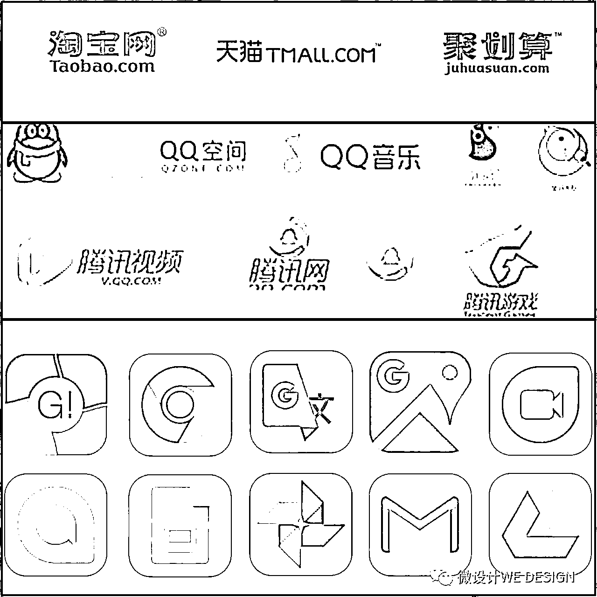

24、如何快速打造一个新品牌？只要产品不差，设计做的洋气点，抖音，小红书找些达人推一推，最好上几次李佳琦，薇娅，老罗直播间。ROI跑正后，全网投放。

25、苹果的产品生态做的真的好，拿我每天用的最多的Airpods，比如我现在电脑上听一个歌，这时候打开手机刷抖音，耳机也自动链接过来了。它会围绕你苹果设备声音场景去设计，非常贴心。但是苹果产品也有体验差的，前几天买了一个苹果新款电池Magsafe，一个移动电源700多，虽然使用携带方便，但是和手机充电基本充不满，最重要慢冲，边充边用可以直接把手机干没电，鸡肋。

 

 

26、百度的品牌是越来越难用了，前两天想下载一个苹果字体，前3页基本都是广告，能理解广告位为了维持技术更新，公司盈利，但是什么事情都有个度，否则用户习惯转移很可怕。

27、竹子用了4年才长了3厘米，第五年开始每年以30厘米速度快速增长，用六周长到15米，今天很多产品你看到的一夜出名，其实背后是摸摸的付出，以我熟悉的生财有术开始，用户爆发也是第四年，前3年，亦仁一直默默无闻打磨内容做好服务。所以真的没有什么速成，该走的坑一个少不了。产品如此，品牌也是，在市场没有任何你之前，你没有品牌，你唯一竞争力就是你服务和内容产品。

关于成长的反思

 

 

28、每个月一定要定好规划，无论个人成长还是公司，总是感觉自己很年轻，时间还很多，觉得很多事情都可以慢慢做，减肥啊，见重要的朋友啊，下个月吧，明年吧，把自己弄的很忙，其实浪费了很多时间，其实就是没有规划好。时间用错了，顺序用错了都是损失。

29、今天去一个朋友公司分享，一个同学问我，创业这么苦，离开阿里后悔么？其实一点不后悔，因为我不想我每天努力目标就是成为我主管那样的人，没有生活，只有工作，一个被资本蒙蔽的人，每天如履薄冰的生活，当然有人有人喜欢那样的工作，能有体面工作，很高的工资。公司没办法去改变，但是我可以改变我自己的选择。试想一下，如果全世界的工作都是一个工资，你会选择什么，有时候当你没法选择的时候，follow you heart

30、怎么提升格局？认同猫叔说的敢花钱，会花钱，现在很多优质的大佬都是圈子，付费加入就能快速链接到，如果有机会进他的群，大方发几个红包大家就记住你了。但前提是你有价值，你有你值得别人学习地方，很多人我说我看见大佬说话会怂，有句话叫什么来着田忌赛马。大佬也有不懂的地方，你完全可以用长处去弥补。比如我微信上有很多大公司设计总监，我专业能力肯定不如他们，他们运营能力，个人品牌能力肯定不如我，所以一些适当契机，我帮他们解决一些运营，团队影响力问题。彼此互相帮助，互相成就。早期我看见亦仁也会很怂，后来亦仁找我当设计顾问，慢慢的就熟悉了。所以要学会主动利他。

31、抱怨当下很爽，长远不爽。漫威电影中的角色们，他们最后能解决问题，依靠的绝对不是抱怨，对吧？而是不断去采取行动，慢慢的事情才得到了解决。

32、一定要把“及时止损”列入人生信条。辞去不合适的工作，退出不合群的圈子，告别不合适的感情，离开不合适的人，如此种种，不要过度怀念沉没成本。坐错车并不可怕，不能因为已投了币上车，就舍不得下去。生活中，学会凡事都不做毫无寓意的内耗是一种大智慧。身处沼泽，待得越久，陷得越深。一些小事，越是纠结，输得越多。

 

 

33、最近教育裁员，包括字节在内，其实哪有什么大厂关怀，在快速资本变化过程中，如果你没有很稀缺的能力，也会被淘汰。如何让自己掌握稀缺的能力，并且不断中某个领域叠加增长才是竞争力。

34、之前看过一句话，什么是竞争力，“人无我有，人有我优，人优我全，人全无不要命”虽然有些段子，但其实还是有很多值得启发的地方？的确，每个人都要给自己构建自己的护城河，工作如此，生活也是如此。还好在工作期间，我找到了写作这个点，逐步把它构建成我的护城河，因为设计师不擅长写作，比较排斥写作，刚好这个点我把他放大了，逐步变成了我的优势。

35、职场里面做自媒体，一定要低调，这个世界上除了父母，没有几个人真正希望你过的比他好，当时我在阿里时候做自媒体时候，和做贼一样。天天怕同事看见我写文章，企业永远是企业，只考虑公司利益第一，如果同样两个人，一个每天只公司工作，一个经常写文章，你是老板你会重用哪个？所以，大家如果想做点副业，或者写作，记住，一定屏蔽你的哪些傻x同事。

36、今天和几个朋友吃饭，大家聊到一个话题，现在这个时代，有哪些能力是非常重要但是大多数人没有？最后大家总结了几点：

让别人舒服的能力，当你和某人相处非常舒服，什么耿对方都能接住，无话不

谈，你觉得你遇见了知己，其实不是，是他情商非常高，对你在向下兼容。

读懂一个人能力，这个读懂不是看你说了什么，而是看你的行为，去判断这个

人。

坚持做一件事情的能力，没背景没资源的人，坚持做一件事情能让你超越**90%**的同龄人。这句话非常认同，当时就是坚持写作，才有了现在做的事情。

坚持早睡早起的人，大佬说清晨的白粥，比深夜的酒好喝。

执行力强的人，其实未来大家接受知识能力都差不多，核心执行力，对于商业

敏感程度，和长期执行力是拉开差距和关键。

接受自己的平庸，接受无法改变的现实，我们很大痛苦其实就来源于预期和现

实差太多，其实遇见这些痛苦事情，接受就好了。无论企业家还是明星，其实

大家追求的就是那么几样东西，赚钱追求想要的生活，明星赚钱也是买大房子

 

 

啊，和我们普通人都一样。我们都是一个有灵魂猴子罢了，没有必要觉得自己

不如别人。

37、陆奇当年在百度时候，是如何激励百度人：我们现在在做智能驾驶的同学，你们要选择前进路上，选择一个跑的快的高速路。在跑的快的赛道上，选一个好的交通方式。

我们现在做的业务就是一个高速路上，一个跑的快的赛道。

38、人生几个阶段：1）第一阶段：靠的是你的聪明才智 2）拼的关系网络和赛道，你的关系网络决定你走多高多远。3）过程中创造价值，不在乎年纪高低。

39、设计师到了30岁，如何提升竞争力？首先要建立自己的网状体系，不断打破自己舒适圈，了解新的技能，当别人用技术和你竞争时候，你有设计思维；当别人用设计思维和你竞争时候，你有数据思维；当别人用数据思维和你竞争时候，你有商业思维。你脑子里有一张网，别人只有一根线，哪个会赢？

40、稻盛和夫:人是怎么废掉的，假装式努力，持续性幻想、做梦言语上的巨人，行动上的矮子，睡前给自己打鸡血，醒来还是老样子。总感觉自己还年轻，时间还很多，每天总是找各种理由拖延晚点再做吧、明天再做吧、下个月吧、明年吧。每天把自己弄的很忙，告诉自已没有虚度光阴，其实，很少分析自己做的工作是否值得，很少做职业规划。时间80%都用错了，改掉浪费时间的习惯，获取正向反馈，明确做事的顺序等等，这些才能让你离成功越来越近。

41、延迟享乐能力  一直在锻炼，要想做成某些事情，就必须学会延迟享乐，先追求目标再享受成果。我们身边有不少引诱，但你该有能力拒绝它们，并保持自律专注目标，直到自己实现理想为止。就像你在写作时期，考试前该专心读书，先拒绝身边朋友的约会，等考完了再去跟朋友一起享乐。凡事要以长远利益为重，只有做别人不愿做的，才能有他们没有的成就。

 

 

42、什么是活的真实？不再害怕别人评价，好的也是你，坏的也是你，你比你自己更了解你自己优缺点。也没有必要为了不太证明片面评价否定自己。只要你心中有光，觉得那个方向正确，坚持就对了。时间加长来说，所有人都只有30000天而已，我们在宇宙面前只是一粒灰尘。做好自己很重要。

关于生活的反思** **

43、束缚大家的不是认知不足，决定认知的是我们的心力不足。需要对身体能量管理，心力衰竭，为什么左晖会那么悲惨，看起来很繁忙压力大。这是表象。如果我们学习之余我们去锻炼身体，给自己充能，保证续航。很多事情不会发生。

 

 

44、在这个政策下，很多人都感觉艰难，上班觉得上班不稳定辛苦，创业觉得政策变化快，都能难，其实随便走在街上看看外面，看看你身边每个人，谁不难，学习觉得难不想吃苦，那只能吃生活苦。创业如果不想吃苦，那么只能吃失败的苦。总之，这就是一场修行。建议大家去看看之前俞敏洪之前一个采访，他是如何看人数大起大落的。

45、改变自己是很难的，那可以不可以每个月改掉一个坏习惯。比如熬夜，刷抖音，懒散饮食不控制，肥肉乱飞，周末死宅，关上了世界的一扇门。这些改掉了就能收获，早睡早起，热爱读书，健康身体，热爱生活。只可惜，难度有点大，下月复盘来看看。

46、珍惜身边的人，人很容易对朋友特别好，但是对父母爱人脾气缺很差，因为内心觉得他们不会离开你，其实是自私的行为。

47、这几年喝水时间特别少，天天喝咖啡对身体很不好，前几天老罗直播间，买了一个超大水壶，上面还有刻度，有水位线，几点应该喝到什么地方。然后喝水频率就高很多，人性都是懒的，很多成功产品就是充分把握住了这些需求，获得了成功：小罐茶，三顿半，小仙炖。

48、爱商是我们这代人最需要的学习的一堂课。

49、要学会和自己心灵对话，复盘，最近在复旦读书，老师分享的这个《灵魂11问》复盘方法，很受用。找一张纸，把下面几个问题写下来。

在过去几天里？你发生了哪些变化？

在你人生旅途中，谁是你源源不断给你力量的人？

在你当前工作中，你感觉自己的未来在哪里？

在你工作和生活当中，什么事情让你最纠结，最消耗你的能量。

在你目前工作中，你最佳快乐源泉是什么？

我们一起坐上时光机，回到**10**岁，**18**岁的自己对现在的自己会说什么？

我们继续穿越，即将离开这个世界。在此刻，你想给当下的自己有什么建议。

 

 

我们回到当下，未来当下**3-5**年，你的愿景目标是什么？如果是一幅画，画面会有哪些元素，越具象越好。

为了实现这个愿景，哪些需要放下？哪些需要继续保持？哪些需要立即开始。

在把愿景变成现实过程中，谁是你最佳核心助力着，谁是把愿景变成现实的那

群人？

如果要立马行动，在未来**3**天，你会做什么？

50、哈佛有一个幸福课：人生每过7年，当你有一个高质量的朋友圈。幸福才会非常好，需要有高质量朋友圈，才不会孤独。很庆幸身边有几个这样的朋友，这里要和亦仁表白，之前我的朋友圈都是设计师，是他带我朋友圈进行了升级。

51、生活中有时候也需要一些浪漫，之前一个朋友女朋友过生日，让他准备礼物，出了难题，礼物不能超过10块钱，同时要有创意。于是我朋友去711买了一个三文鱼寿司，一朵向日葵，一双筷子，一瓶生日快乐。很多时候，对着手机时间久了，都没有去真正发现生活中的美。

52、最近微信很卡，在清理的时候，发现和我聊的最多的朋友，竟然是文件传输助手，看来是一个刚需需求，为什么没有一款产品出现，可以比官方这个更好用呢？

53、短信这个产品会不会在未来消失，每天早上醒来打开收集，发现除了APP通知推送以外，几乎没有任何人给你发消息，记得上学时候每月500条短信都不够用，总觉得现在我们科技发达了，但是人和人之间少了很多温度。包括坐在工位对面的同事，可能交流工作也都在微信上。

54、什么时候发现工作快被淘汰了？身边的人讨论的东西听不懂了。什么时候发现自己老了？爸妈已经放弃催生孩子了。

 

 

55、我读过最有力量的一段文字：每当遇到我自己不敢直视的困难时，我就会闭上眼睛，想象自己是一个80岁的老人，为人生中曾放弃和逃避过的无数困难而懊悔不已，我会对自己说，能再年轻一次该有多好，然后我睁开眼睛。砰！我又年轻一次了

56、感觉年纪大了后，再也不敢发一些负能量朋友圈了。怕把不好的信息传递给别人，快乐的也只有自己熟悉的圈子里面去分享，不知道大家是不是也一样。

57、减肥和熬夜中年男人两大伤，不知道为什么年轻时候身体吸收差，怎么吃不胖，现在年纪大了，每顿饭身体都吸收特别好。减肥和熬夜哪个戒掉更难？感觉都挺难，最难还是减肥，吃了一个月的蛋白棒，断断续续，真的难熬。

关于产品的反思** **

 

 

58、为什么B站比大哥爱奇艺值钱？根据市场占用率，客户黏性占比高，也要看增长数。爱奇艺用户增长下滑，10亿互联网用户不可再增，互联网已经从增量到博弈就变成了价格战。所以爱奇艺发展不如B站，可惜没有持有它的股票。

59、人变的越来越像机器，因为算法的推荐会原来越智能，但是我们社群运营还是靠CRM系统去私聊，对用户的服务还有很大的提升空间。

60、要学会经营自己，我们每个人本身就是一个产品，你的优势是什么？现在做什么事情能让自己不断增值和福利，比如我离开阿里后，我花了很多钱去读书，去报更高端的课程，目标就是投资自己让自己成长。

61、一个创业的朋友叫大黄，他们公司有一个企业文化叫迭代，非常认可，人也是一样需要不断迭代自己，给自己设定成长路径，每个月都不一样，每月完成一个小目标，另外完成时候要讲究学透，切忌学一个东西半瓢水，反复学，这样浪费时间。

62、最近去了杭州两个出名的餐厅，一个是A，点餐时候会让你选一个很好看的茶杯子（杯子都特别小，最多装一口茶），然后会给你来一杯他们店里最新茶叶的茶，仪式感非常足。然后你觉得茶不错，想要续杯不好意思茶128一袋，然后那好吧，换成水，不好意思，我们水是泉水18一杯。非常套路，虽然后面的服务不错，但是前面这些“精心”设计过的转化过程，非常让人觉得不爽。另外一家餐厅，是一家牛肉馆，一个典型的苍蝇馆，没有啥服务，简单粗暴。进去后直接点餐，上菜速度快，味道好吃，虽然环境差点，但是味道好，服务响应也快。所以两个不同产品策略，一个想办法用一些巧妙免费套路让用户买单，一个是用原材食料让用户买单。就像我们做产品，注意力是放在用一些套路去让用户转化，还是用心做好内容去吸引用户。值得思考。

63、最近教育行业地震，明白一个道理。做事情时机很重要，哪怕事情正确，如果时机不对也难。选好赛道，选对时机，以及一个强大的内心，相信能成的信心。因为没有这个，当你遇见挑战时候就会去怀疑自己。

 

 

64、社群经常有同学提问我，如何快速了解产品，了解移动互联网。其实很简单，去把苹果商店20几个分类的前3名下载下来，然后逐个体验，找出三个优点和三个缺点，尝试按自己理解能不能给出解决方案，或者比他做的好。当你研究完一遍，你自然而然对行业有了解。设计如此，其他行业也是如此，掌握拆解能力非常重要。

65、前两天，看见曹大一篇旧文章，现在互联网所有信息内容都已经被设计成检索次条了。以前的才华可能是博览全书，现在的才华可能就是你网感，你搜索能力，你输入什么样词语获得什么样的信息？为什么亦仁和涛哥能通过一篇文章，甚至一个截图，能抽丝剥茧的找到项目全貌，而我们很多人不可以，就是检索能力不够，没有办法获得一手信息。

66、这几年好像都没有出来眼前一亮的产品了，包括那些昙花一现的产品也很少出现，是大环境真的变化了，还是说现在大家创新力少了。在经济寒冬里，大家都聚焦去做利国利民的好事没错。但是企业的创新也是发展很重要的环节。百花齐放才能百家争鸣。

67、今天在使用某个输入法时候，打了一个花，结果跳出来一个陌生手机号码，而且是在我imac电脑上，并没有通讯录。不知道是之前输入法记忆功能，还是现在的厂商真的无接触到底线，用户输入场景都植入广告。个人隐私在大数据下，都是裸奔。

68、最近在社群组织了一个打卡，去留意身边好的产品细节，一个好的产品，一定是点滴细节组成的，一定不是某个大招决定的，就像我们去海底捞吃火锅，从排队有人递毛巾，安排女生做指甲油男生擦皮鞋，到上餐时候主动送饮料热毛巾，生日时候生日个，拉面的仪式感，正是这些细节让你觉得服务好体验号。产品也是如此，试想你去到一个特别高大上商场，一楼都是LV，奔驰宝马这些大牌，然后走到厕所里面，没有办法下脚。你还会觉得商场高大上吗？

关于运营的反思** **

 

 

69、亦仁前几天群里发了一条干货，训练营游戏化运营，非常认同。学习是很枯燥的过程，非常反人性，如何保证学习效果，很好的完成目标，及时正反馈很重要。

70、最近在社群开发了很多新的打卡，以为会有很多人报名，其实并没有。有时候我们觉得很好，未必用户想要的。你永远没办法用一个产品去满足不同人的需求，购物，理财都可以做到千人千面。哪社群运营是否能做到千人千面，同时能体现个性化？这个局如何破？需要好好的思考

71、为什么我们喜欢玩游戏，因为游戏给我们爽感，在游戏里面碾压对手那种感觉很爽。怎么让用户使用你产品，学习有爽感？如何运营爽感。特别是训练营过程中，因为无论训练什么，都很容易遇见挫折就放弃。但是公开给予正反馈，公开夸奖是很有效一个方式。最近在尝试让私塾班训练营小伙伴在万人社群去复盘，完全不一样。因为他的文章被很多人看见，有很多人收藏和分享，会得到很多的爽感，成就感。有了这些，也就有了动力继续学习，去练习。

72、做社群运营，真的挺难的，每天很多事情处理，感觉永远处理不完。遇见难题时候，虽然可以随时请教亦仁，但是还是想自己解决。最近在尝试遇见问题，反问自己，尝试寻找答案。1、如果这个问题，亦仁遇见，他会如何看待这件事情，他会如何应对？

这样能让自己做事情跳出感性，用理性方式解决它。

 

 

73、文字能力在做运营非常重要，“唯有爱与美食，不可辜负”“我们不生产水，我们只是大自然的搬运工”怎么两三句话抓住用户的痛点，痒点，卖点，让人感同身受。和做设计一样，好的文案能让人耳目一新，真诚。所以一定要进行训练，一定要去系统提示这方面能力。最近在补奥美首席文案那本书，收获还是蛮大。

74、社群运营，一定要把用户所有可能出现的场景，突发情况，都应该提前写出来。团队穷举出来，然后想好对应措施，这样才能做到遇见事不慌，哪有什么精细化运营，都是一个一个话术，一个场景梳理出来给出解决方案罢了。

75、做社群真的蛮难，每个月都要推翻自己，可能前一个月用户很喜欢的内容模板，一个月后可能就疲惫了，就需要不断有新的活动去刺激自己。这月开始，部门周会增加了一个栏目，就是大家每周分享一个这周你觉得业内做的比较好的营销案例，只有我们看到足够多，才能跨界结合，去运用到工作中。

76、运营微信群很难，因为大家群太多，如何让这个群有活跃度。话题非常重要，群难的不是大咖放进来，而是你的内容，每天讨论的话题对大家有没有诉求。所以群主话题和审美能力尤其重要，这块生财龙珠群做的非常好，新人加入后的欢迎仪式，亦仁和秀儿每天话题推荐，另外就是圈友问题解答都是很棒的点。当然最重要的点，就是退出机智，拒绝小透明。

77、个人IP和小助理角色如何互补？这些年做IP一直打造SKY的人设，但是太高了太冷了，用户会感觉沟通有压力，因此有了叮当猫，但是叮当猫不能只是一个服务角色，需要有自己特点，需要输出干货，和IP互补，怎么打造？如何让她有血有肉，成为用户真正的好朋友，这一点要好好的反思和思考。

关于创业的反思** **

 

 

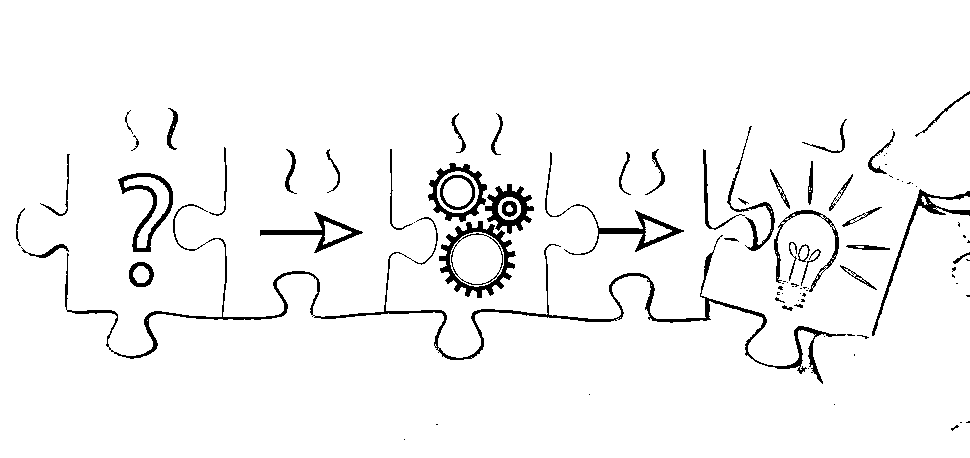

78、这月去复旦上课时候，在解决某个同学企业经营问题时候，老师用到了一个七步法，有用。这里记录一下。

a、躬问：完整了解你的情况，你企业问题？

b、探究：用开放性提问，帮找到问题实质

c、澄明：最真实问题是什么？打破砂锅问到底

d、定见：帮忙确定问题，明确一个真问题

e、解析：这个背后的影响因素是什么，罗列出来，找到核心因素，帮助我们系统思考，找到核心杠杆因素问题

f、精思：给出真正建议

g、心得：下一步的方向是什么

79、如何判断一家企业？了解创始人背景，人背后因素指导了企业走向。

 

 

80、新能源，大家对于能源获取一定水涨船高。市场在增加，替代也会增加。另外一个行业是生物医药。原来健康安全觉得不重要，现在变的很重要。生物技术未来发展是一个非常重要的里程碑。

81、推荐一本书《终极智慧》机器在引进，人也会慢慢往机器迭代，变成机器人，把人变成超人。机器变的越来越像人，不停迭代更加智能化。人越来越像机器，迭代少。这个过程中，人和机器未来会是什么关系？有三个阶段：1）帮助人类做的更好，变的更好。2）共生阶段，和平和谐共生，当机器可以完成大部分生产，人类可能慢慢变成无用阶层。工作变成对人最重要的奖赏。3）机器的发展很快超越碳级生命，人的存在会变成一个能源，有点像黑客帝国。

82、最近教育的变革，不得不让人反思，符合大势的企业一年可以十倍二十倍，行业限制的，疲态的会跌70%或者腰斩，背后是国家的政策，要看天要趁大势，要看到行业巨变。

83、企业原来从创始到IPO越来越短，比如拼多多18个月。互联网每天都充满了未知数的变化。

84、做社群需要不断革命自己，推崇出新，很多套路，专业知识就只有几个月。不能学那些会衰变的知识，我们要去学千古不变的逻辑，基本那个法则，再去延展新的知识。

85、人在一个大的环境下，要做布局，深度布局。把远见和你热爱做布局，伟大企业能兴衰不久，比如阿里巴巴希望可以活到120岁，其实是企业家人生背后思考。海尔创始人说过：没有夕阳的行业，只有夕阳的企业。

 

 

86、以前总是觉得不上班的人真的在混日子，但是最近了解到一些身边上班朋友情况，真的上班才是混日子。因为没得选择，你只能当一颗螺丝刀，问我有没有建议?我只能说赚钱和自律，才能慢慢延缓焦虑吧，创业也难，从领工资到发工资，心态是完全不一样的。

87、生活从来都不容易，当你上学生活很容易时候，一定是你父母在后面承担不容易。

上班时候，当你觉得工作轻松无压力，一定是老板在背后承担不容易。创业后深有感触。

88、创业过程中，贵人很重要，真正贵人并不是直接把钱给你，而是给你机会和资源，开拓你眼界，纠正你格局。给你雪中送炭，有困难时候对你伸出援手。那个为你提供力量，让你少走弯路，还愿意花时间和精力去帮你的，这就是贵人，如果你看到这里，身边有这样的朋友，一定要珍惜。这里我要表白亦仁了。

89、创业为了什么？核心还是生活，不能因为创业忙失去了看世界机会。最近感觉一直忙有点失去目标，尝试周末去挖掘一顿美食，看一场电影，让自己完全换  一个环境去看看。有时候会发现不一样，不能因为创业这扇窗口打开了，而忽略了发现生活之美的窗户。

90、要学会控制自己的阈值，之前上班时候觉得月薪一万就可以躺平，当月薪一万被生活摩擦后觉得月薪三万就可以躺平，当月薪三万后觉得年薪百万是不是可以躺平。然后当你达到时候，你发现身边那些赚几千万的大佬，每天都还是在工作。最后发现，我们要提升的不是自己赚钱能力，而是你对生活预期的阈值，为什么我们在刚工作，一月5，6千时候容易满足开心，现在反而会没那么容易开心，就是预期阈值提高了。如何去平衡，需要去好好反思。

91、创业后才发现，什么时候都要全力以赴，另外要学会消化自己的情绪，无论好的还是坏的。另外不要把别人对的好，当做理所当然，要学会感恩，感恩社会，感恩政策，感恩身边对你有帮助的朋友。特别那些和你说真话的朋友。

 

 

关于乱七八糟的反思

92、最近看了一部老电影《进击的巨人》，如果你没有看可以去看看。透过电影可以看待主角是如何去应对人生的黑暗时期，如何去面对很痛苦的事情，如何带着力量去应对，去解决这些事情。在这个电影快结束时候，能感受到巨人的威力正想被科技崛起削弱，在过去，人类根本无法和巨人对抗。但是科技发展，有很多厉害的武器基本能秒杀巨人。所以每一个技能，能力都是有红利的。虽然现在没有巨人，但我们每天都生存在弱肉强食，适者生存的环境。红利还没有消失之前，我们要学会创新，迭代自己。

93、怎么提升学习能力，有几个小方法：1、可以把学到的知识，教给别人；2、能力提升后再去学新的；2、思考如何去实践这个知识。

 

 

94、最近在黑珍珠群里有个话题很有意思，分享一个你认为很棒的应对烦劳的方法？收到一些讨论很有意思：

我喜欢写下来，用文字和自己沟通，再看一看是不是我想多了。很多时候真的

是自己想多了。

用旁观者角度看待这个问题。

马上解决，要不然就忘掉这件事情。

当烦恼来的时候，就让自己冷静下来以后，开始慢慢审视自己的问题，再看看

有没有改善错设，如何再避免同样情况反复发送。总结后开始反向思考，再花

一两天把自己心情平复。

骚扰好朋友，运动，读老子道家的树，以及回想以往的困难后来都得到解决，

便觉得无需为当前困难过分钻牛角尖，因为只会消耗自己的精力。尽人事安天

命。

95、今天和一个北京认识十年朋友聊天，目前大厂一个经理角色，说压力很大。马上奔着40了，感觉互联网的不稳定，如履薄冰，问我未来想出来做IP，可以吗？他专业足够支撑几年输出。我说，要做就是现在，而不是等离职后。互联网变化很快，现在你看好的事情，说不定明年后社群IP就不那么好做了，这个行业最大的不变就是持续变化。如果当初我没有在职时候就有意识，输出写作，在很大阻碍下坚持，也不会顺利转型。所以做任何事情，时机很重要。正确的时机错误的时间也不成。

96、要学会拒绝，创业后，经常很多人找我，有的都一面之缘。但有时候碍于情面都见了，很浪费时间，一天什么时候做不了。后来请教了亦仁，亦仁说，如果你目标你一年后赚100万，那么你现在每个小时就是2000块钱，这个人一个小时觉得值不值2000块钱，如果值就见，听完后恍然大悟。成年人要学会拒绝。

97、最近无意看了一个电视剧，里面有个片段，儿女陪老人少。老人被骗子盯上，然后天天生活上虚寒嘘暖，最后老人花钱买了很多保健品和玉床，让我不经想起我母亲之前一模一样的骗局，我性格不善于表达，这些年习惯一个人在外面，很少在家，都是妹妹在陪伴。很惭愧，天秤座就是这样对爱自己的人关心自己的人会很苛刻，对其它人就会 

 

很大方。所以有空回家看看，你给多少钱对他们来说意义不大，想一想，我们一年在家10天，假如他们还可以活30年，其实就300天一年不到，珍惜身边人。

98、我喜欢把经典的电影看两边，《泰坦尼克号》看了不下10遍，每次看都会看一些之前没有关注到的细节，歌曲也是，现在听的也是老歌，不同阶段听心态感受都不一样。

大家平时看剧也好，看书也好，一定要看经典的，书也不用读那么多，读透几本，真正有用的很重要。

99、人真的不能太闲，闲下来就会想太多，矫情，然后看什么事情都不顺眼。忙碌会让你精力充沛，一方面忙起来就没有时间想那么多，之前的一些烦恼困惑，忙着忙着就解决了。

100、最后用之前帅张卫衣上的一句话：“愿你历遍山河，仍觉得人间值得。”来结束8月份的复盘，愿各位朋友历遍山河，仍觉得人间值得。

评论区：

蒸包包 : 写得很好  感觉有许多的业务思考和人生思考

Sky🏹（表哥） : 笔芯笔芯

维意手作|手工导师 : 谢谢分享

老黄牛 : 一字一句看完，喜欢看这种实战经验分享。创业，生活，习惯，都仿佛看到自己的对照，再细读，思考，找到答案，一步步改变，迭代。

例哥 : 点赞

勒布朗·詹姆斯 : 盖哥  看了分享很受益，太棒了[强]

Sky🏹（表哥） : [爱心]一起共勉，一起生财有术

Gary : 写得很细致，引起了很多思考，触达的点很多，已经收藏起来，偶尔拿出来阅读【生财心态】**4**篇

 

 

# **# ****(**精华帖**)(178**赞**)**体制内从** 0-1 **突破舒适圈，

# 副业年赚** 20W+ **的心得

作者：  爱折腾的土豆妈

日期：2023-03-22

时不时会看到一些朋友在搞副业、赚钱的时候，总有很大的焦虑、犹豫，比如朋友圈不敢发，怕领导同事发现；微商不敢做，卖货不合适；视频不敢拍，露脸不太好……体制内、公务员、一些特殊工作岗位，总有这些那些的顾虑，这些包袱越背越沉，甩不开严重阻碍了前进的步伐。如果你也有这种困惑，不妨看看这篇，土豆妈用自己的实战经验分享，帮你开拓一下思路。

# **# **【个人介绍】

我是爱折腾的土豆妈，一个爱折腾房子的专业幼教，上海公办幼儿园体制内的幼教，工作14年，中层岗位分管招生等工作。5年内买卖房子6次，装修改造3套。

职场宝妈5年6次房屋买卖赚百万的血泪经验  万字长文复盘，有兴趣的可以看看https://t.zsxq.com/0cE7ISGkM

 

 

# **# **【副业介绍】

**1**、进口母婴海淘

2012年孕期的时候开始尝试的项目，纯粹是从自己想囤货，朋友圈找人一起拼单，口碑相传，自己从国外网站海淘采购、国内销售，边买边卖赚了第一桶金，养娃的一切开支都是靠海淘赚来的，具体赚了多少也没细细算过账。由于一些原因，大概在18年左右就慢慢停了所有业务，现在想想当时解散了一个超高复购率的300+精准客户微信群是多么愚蠢的事情。

**2**、民宿个人房东

斜杠的民宿房东，手上最多的时候也就4套房在运营，目前2套在运营中，个人小房东。

盘活了一下自己家的郊区房和40平学区房，房租收入实现翻倍。

过去的三年非常艰难，民宿圈里也淘汰了相当多，尤其是过去一年日子确实不好过，好在都熬过来了，从2022年12月慢慢恢复。2023年3月最近的20天单一个平台的房租收入已经7000+。

 

 

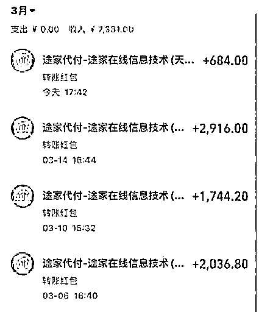

**3**、家居社群创始人

2021年6月开工装修自住二手房，同步开通了装修围观群，2023年2月把群从免费群升级成付费社群，有了第一笔社群付费收入。一周拉新了30+，目前社群成员120+，199限时优惠中。

**4**、一对一咨询

2022年年底开始尝试私人咨询服务，主要是房产购买、学区规划、装修建议等方面，从一开始不收费，到红包随意，再到199/h，最近涨价到单次999/3h。把自己的时间和精力越卖越贵。

就在前几天接到了  紫菜  大神圈友关于房产、装修方面的咨询，体制内怕啥，跨领域的知识付费真的可以！

 

 

# **# **【破圈逻辑】

从表面看，副业赚钱的领域基本跟主业是分离的，但好像又有些关联性。聊聊破圈自洽赚钱的底层逻辑。

**1**、接纳本职工作限制

首先一点，不要尝试在底线摩擦，比如在事业单位有明文规定，不要做直播带货、跟学校相关的产业相关的资金交易，那么这些避开就好了。

**2**、给自己定底线标准

 

 

我给自己定的标准就是不做工作范围内同事、家长的生意，尤其是家长，哪怕是孩子都已经毕业了，家长资源不利用。虽然手上每一年经手上百家庭的详细资料，但我并不想利用。

包括我自己工作范围内的学区咨询，购房建议等相关的内容，全部不收费，免费解答。

这是我给自己定的底线。

**3**、挖掘自身兴趣爱好

想破圈，兴趣爱好是个很好的出发点，其实我曾经还尝试过利用手工制作变现，折纸手工都能制作成礼盒出售。现在则是依靠对家的热爱，装修家居的喜好，输出自己的内容来进行变现。生活类的领域，是每个普通人都离不开的，体制内想要破圈，完全可以从生活入手，比如警察可以分享每日健身，老师可以分享每日育娃妙招，医生可以分享营养减脂餐，把下班后的生活分享出来，没那么多包袱了，每个人都有下班后的8小时。

我自己靠什么来赚钱，就是下班后倒腾自己家房子，我赚点房租跟我做什么工作有关系吗？领导会来干涉吗？那就大大方方折腾就对了！

**4**、技术不够行动来凑

想要形成副业赚钱，光靠为爱发电还不够，还需要一些基础技能，直播不能干，可以拍视频；视频不能露脸，可以做图文；图文不方便，起个笔名只写文，鲁迅、巴金、冰心取名随便取，不要再喊我不行！关键还是那句话，你得行动起来，先把0-1跑通。

比如星球里各种训练营、陪跑营，紧跟步伐试一试，说不定就跑通了呢，先赚到一块钱！

 

 

从2020年入生财有术，再到22年加入玩赚星球，尝试过TIKTOK，知乎好物、小红书等等，虽然变现不多，但都算跑通了，积累的网感、图文编辑能力、视频剪辑能力、写作能力都是提升自己的核心竞争力的，每一秒、每一天的努力都不会白费。

**5**、做好孤独心理准备

尝试突破舒适圈，有个逃不开的困扰，体制内的一成不变的思想会腐化一个人的心智，桎梏你行动的脚步。曾经我一度怀疑自己的人生观、世界观、价值观怎么如此格格不入。

在体制内的单位里，不需要多努力，每天固定时间上班下班。基本一眼可以望到退休。

耳边同事聊天的内容，无非就是家长里短、油盐酱醋，老公、婆婆、孩子，衣服包包化妆品……经常有人问我又买房了？又装修了？花20W租房住？你太折腾了吧。

在工作中，同事在聊的话题我不想参与，比如某同事明明名下很多拆迁房，一套也不想卖，把全家老小困在一套可怜巴巴的小户型里，还要吐槽公婆这不好那不好，我想帮她一把，但人家不愿意折腾……而我感兴趣的话题，房屋买卖置换，装修提升租售比，社群运营，chaGPT、社群运营、知识付费，她们一个名词都听不懂，就不开口就好了。

现在的我工作中就只聊工作，不再内耗，甚至尽量减少午餐、午休时间与同事接触唠嗑的时间，避开人群找个角落看看社群消息，学点自己想看的课程，写点自己的副业心得，一个人挺好的。

 

 

# **# **【破圈技巧】

**1**、坚持做别人坚持不了的事，一定会引发关注

不管是哪一种形式的，坚持是破圈赚钱的核心，坚持写作、坚持发朋友圈、坚持健身，坚持输出图文笔记，坚持拍vlog等等，没方向的时候就选一个简单的行动，就坚持做就对了。

比如土豆妈是如何破圈让@梁靠谱  关注到我？让靠谱大神多次在群里、直播中，甚至还写了一条朋友圈单独来介绍我？其实我就做了一件小事，写每日复盘，少则20字，多则2000字，坚持了600多天，二胎生娃当天也没断更。靠谱就是一路围观我这600多天，如何买卖房子、装修房子、顺便生了个二胎。

 

 

# **2**、乐于分享，流量在哪里，影响力在哪里，财富就在哪里

想要扩大收入，或者说扩大影响力，把自己的点滴收获分享出来，告诉别人。多输出才有收获。

 

 

比如我写的一篇五年买卖6次学区房赚百万的经验，帮我引流了好几个付费的私人咨询。

紫菜大神也来加好友做房产买卖、装修相关的个人咨询。

前几天，我发现亦仁老大家里也在装修，毛遂自荐了自己，分享了一下我的社群思路，也是获得了亦仁的肯定。最近一个月社群运营就特别有干劲，方向对了，跑得更顺畅了！

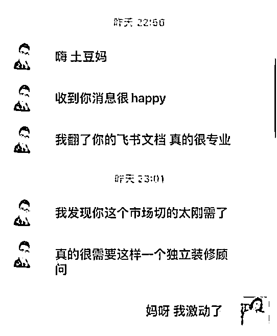

# **3**、别把自己当回事，大大方方搞钱

体制内的朋友，大部分都有这些那些的思想包袱，今天这篇复盘也是想鼓励更多的体制内的朋友，别对自己太在意了，赚钱这件事不羞耻，大大方方干就对了。

朋友圈不敢发？把所有人一个个拉出来做备注标签，只分两类，【看广告】和【不看广告】，就跟物品断舍离的时候一样，但凡犹豫的都暂时归纳到【不看广告】，这样分类清楚之后，你还有什么不敢发朋友圈的呢？

 

 

# **4**、边学边做，边做边改

体制内的朋友经常说，我啥也不会啊，我也不知道能干什么？进了生财你还怕没项目吗？每月都都各类大大小小的航海活动，先挑自己感兴趣的，跟着学起来。慢慢就有赚钱的感觉了。

芷蓝一再提醒我，自媒体赚钱终究是要有自己的IP定位和后端变现的产品，而最基础的产品是什么？付费社群就是一个很不错的基础入门产品。

于是在今年一月底过年期间，马不停蹄得把搞了一年半的免费社群，转换成了付费社群，一开始定价99/年的时候我是怀疑的，不确定的，一步步地优化、完善后，甚至觉得这么有内容、有价值的社群值得有更高的定价。

这种从0-1的尝试，失败了无非也就是浪费了点自己刷手机、刷剧、买买买的时间，损失成本接近于零，大胆去尝试就对了！

无论你是体制内还是体制外，在职还是裸辞，先放下自己过多的包袱和顾虑，行动一下吧。

以上，今天你折腾了吗？

评论区：

 

 

终身锻炼者—老杜 : 折腾——这个词是加入生财的精髓。

我老是去想结果，有时候就折腾不起来

还有刚开始做一个项目觉得费劲，半路就歇菜了。

以至于一直没啥结果[流泪]

大西 CC : 土豆妈厉害

xing : 先动手再完善

爱折腾的土豆妈 : 先不论结果行动起来，

潇晨 : 谢谢你，被鼓励了，同为体制内，被周围环境内耗到快抑郁，又是在异地，现在就开始不断付费链接各种大佬学习破圈，小红书已经做到3天引流1000左右，准备副业成功时脱离这个圈子，去过更好人生

爱折腾的土豆妈 : 有时候不一定是脱离体制内，而是给自己更多一个选项，让8小时后的生活更丰富多彩，让工作就单纯的工作，而不是生存必须。

爱折腾的土豆妈 : 这是一个很好的开始，坚持下去一定有所收获

尺子白 : 厉害的女性。[强]

# **# ****(**精华帖**)(145**赞**)**在赚钱上从各个角度迷茫了

# **11**个月，终于在最后一个月见到生机

作者：  小鸟

日期：2019-12-28

2019将尽。从检察院裸辞三年，钱快花完了。

这一年，在赚钱上从各个角度迷茫了11个月，终于在最后一个月见到一点生机。

2019年2月。纠结半个月，我选择与阿里文学解约。

18年初，和阿里文学旗下一个app签约当写手，做拆书稿。我看书码字还不错，拿到独家合同，给了单篇稿子6000-9000的报价，是平台顶薪。

可拿着这么好的报价，我的几篇稿子从18年一直拖到19年，只赚了几万。

因为心里不认同。

 

 

签独家合同之前的投稿期，和平台谈过一个大单，一个月时间，交给他们25篇稿，单篇4000。25篇这个数字，是我特意挑的，为了凑10万。31天扛下来，看完25本书，写了25篇稿，一笔赚到10万。

10万拿到手的同时，我心里就不愿再做这件事了。

旁人惊呼月入十万，许多人因此想象我年入百万。可那一个月怎么过的，只有我自己知道。写稿一个月，后面病了半个月。那种高强度输出只能是巅峰表现，不可能持续的。

可怕之处在于，我发现，即便我能这样巅峰一整年，扣税后，收入也不过百万出头。代价是随时可能死在电脑前。

这一点似乎不太被理解，有人说我心大，一百万都看不上。其实假设的极限值，跟现实不是一回事。以及，如果假设极限都行不通，那么此路不通。

那时候心里坚定了一个很明确的念头，当工蚁没前途。

拿一份时间换一份钱，不值当。那些稿子，换不来名气，换不来大幅技能增长，纯卖钱。关键是，看书写稿会锁定我整个时段的注意力，我没什么心力再去关注外界信息、做让自己增值的事情。

当然，话是这么说，人毕竟没见过钱。还是拖着尝试了大半年，实在找不出让自己不拖稿的法子，才决定解约。

19年2月终于清醒的认识到，如果只是为了钱，没有别的驱动力，那这件事我做不了。

这个道理，6月份还要再认识一遍。

2019年4月，加入生财有术。

3月迷茫极了，压力特别大。扔掉一个赚钱的工作，又找不到很好的收益途径。许多人劝我找工作，我觉得，那就应该再生扛一下。用存款换时间空间，用时间空间换方向。

人的现在源于认知指导的过去。这许多人正是在自己的思维下，把过去走成现在。如果他们的现在，并不是我想要的，那我就不该听他们的建议。

可能我短期内还不知道怎么做是对的，但听从他们的建议，大概率是错的。

一定有一条路可以走出来，只是我现在还没找到。

 

 

怀着这样的心态，4月18号，迫不及待加入生财有术。一进去就先把精华帖努力翻了一遍，大开眼界。

说实话，挺后悔。17年在曹大星球，就看到过生财有术，心动了一下，舍不得几百块钱，没加。18年又看到，价格更高，又没舍得加。

19年被逼到没什么后路，才花出这笔钱。可这里面有许多东西，正是我自己苦苦琢磨许久而不得其法的。如果早加入，应该早赚回几百倍入圈费了。舍不得孩子套不着狼，花钱买高质量信息是收益最高的。这个道理，11月份还要再认识一遍。

2019年6月，我妈查出癌症，需要大量治疗费用。

5月底参加生财线下聚会，进了个大群，大家自我介绍，加了很多圈友。其中一位大神夜息，跟我聊了一下，说我们似乎可以合作，邀请我去南京面谈。

那时候我妈已经在家乡查出疑似癌症，正在同济复查，等待诊断结果。

突然就好像资金开了一个巨大的口子外流，我很需要钱，非常需要。阿里的编辑回来找我继续写稿，我接了。夜息邀请我去南京，我也马上买了票。

好像有一线赚钱的希望，都想抓在手里。

跟夜息谈得不错。他很擅长做视频，擅长批量，擅长SEO，缺内容。我主要做内容，其他不太会。夜息原本希望我从法律领域切入，思路碰了半天，逐渐调整为学习考试领域。

我考试不错。有自己一套考试方法，从前做过几年公益辅导，帮助别人应对过高考、考研、司法考试、公务员考试等各种大考，战绩还可以。

夜息很大度，对我信任度也足，给的条件挺好。很高兴的当场谈妥，等我给个大纲，他们看了没问题，就可以开始分条写内容录制。

可回去写大纲时，遇到问题了。我04年高考，08年考研，09年司法考试，11年公务员考试，最近的离现在也有8年之久。

 

 

这么多年，这些考试已经从形式到内容都发生很大变化，我们也从PC时代变成智能手机时代。命题思路、备考逻辑、实操工具都更新了很多。让我自己去考是没问题，可以调整。但是要教别人，就不得不说很多没有实战检验过的东西。我觉得这算骗人。

纠结了几天，我妈检查结果出来，我跟夜息打了个招呼，先回武汉陪我妈看病，跟医生定方案。

回来后，又是对大纲的无尽拖延，其实心里是不愿做的，但又想抓住这个赚钱的机会吧。

大概一个月后，夜息来问我。我还是不想放掉机会，决定再试一次。我讲了我的顾忌，夜息说就踏踏实实的做那些能做的。于是我承诺期限交大纲。

可是再去查一遍各种考试题目，我还是没法下手。那个问题，我绕不过去。新考试我没有实战过，不知道我的方法是否足够好。旧方法思路上没问题，但是铺开讲，一定会涉及很多细节，一定会涉及新内容。我手头有把握的内容，可以撑起一个2小时的视频，但填充不了几百个小视频。

想了许久，硬着头皮去跟夜息道歉，说这个事情我做不了，讲了原因。夜息没有再回我。合作自然不了了之。

心里愧疚了好久，觉得自己这件事做得非常不好。因为太想赚钱，太急于抓住机会，前面匆忙的拍板合作，后面也没有舍得及时放手。可如果只为了钱，没有别的驱动力，我做不了内心不够认同的东西。

终于痛下决心，看清自己。再不做这样的选择。以后答应的事情，要做到。如果发现情况有变，要及时应对，绝不允许再拖延合作方。

如果不能做一个靠谱的人，就什么事情都做不长久。

2019年11月，终于看到赚钱的机会。

6月到10月近半年，都很迷茫。

做了几个月公众号，没做起来，人反而变得浮躁。幸好及时被大黄哥和马哥提点，稳了回来。

 

 

考虑过今日头条、B站、抖音，也不得要领。

我觉得，我还是不怎么会赚钱。

加入生财看了许多精华帖，学了许多新东西，对赚钱这回事，比之前明白了很多，但还欠缺得更多。

逐渐感觉到赚钱有一种思维、一种体系、一种步骤和细节在里面。缺乏这些的人，路过机会也视而不见。即便别人把机会点出来，也因为不知如何操作而无法继续。就算手把手的教，教会了一个问题，还有更多问题。

从不会到会，其中要填补的，是一整套东西，而不是案例中拿出来说事的那几个点。

我要做的，只能是一再学习、实践、改变，往自己要的方向靠近，期待哪一天，打通任督二脉。

到了11月，手头钱所剩不多，再找不到出路，就不得不老老实实去打工，停止我自己的尝试和探索。

这时候，终于看到转机。

先是股市终于赚到钱了。在股市几年，老是亏损。现在渐渐明白以前有多蠢。其实就是自己毫无选股和择时的能力，也不要指望自己有。我擅长的从来不是选股，而是识人。

选中一个强大又可靠的投资人，是好友的好友，过往战绩优秀，投资观念我很认可。完全信任他的判断，买入他看好的股，稳稳拿住。不贪心，不恐惧，盈亏自负。

不是每件事都要靠自己的脑力去判断。专业的人见识高过我百倍，如果品格可信，对方肯对我说真话，抄作业就比自己琢磨的成功率高得多。承认自己是个傻逼，有时候事情会变得更简单。

靠这个，最后两个月，吃到一笔80%涨幅，又吃到一笔25%涨幅。

但这么做，还是不那么靠谱。等攒起入场费，就直接交给专业人士打理吧。A股不是我的战场，我要去做自己擅长的事情。

 

 

11月下旬，又加入另一个付费社群，看到新的赚钱路径，实操性很强。涉及到一些不合规操作，具体是什么不公开讲了。有机会就伸手抓住吧。毫不犹豫借钱上了杠杆。整个12月忙到飞起在做这些。

11月底的生财有术曹大闭门会，我去了。7个小时下来，听到许多很有价值的东西。其中大黄哥讲的快手，还有半佛讲的地区税收政策，我直接能用上，可以作为盈利方向发展。

迷茫了一整年，找不到靠谱的项目，有力没处使。突然之间怎么就井喷，抓了一把可以做的事情，只恨时间排不开。那感觉太幸福。

2020年，打算先把能直接赚钱的项目铺开做熟，努力赚30-50万。如果能腾出手来，尽早切入快手。税收政策的事情，或许要等到21年才有时间做了。只要知道了世上有这样的事情，总能找到机会。没有这个，也有另一个。

但以上这些，都是赚钱的方法。我并不希望它们占据我的所有时间精力，只是想用这些方式赚到钱，来养我真正想做，又暂时不赚钱的事情。

我喜欢的，始终还是读书、码字。个人成长与影响他人，都让我由衷快乐。只是目前这一块能力还不够，既没有摸索出机智变现的模式，也没有积累出自然变现的实力。两者都需要时间，而我努力赚钱给自己时间。

有时候也相信是有天意吧。像是上天支持我的探索，每次手头没钱的时候，就送一次续命的机会。

未来还将继续探索，等待着哪天踩出一条适合自己的路，能高高兴兴把钱挣了，以自己喜欢的方式生活。

感谢生财有术。在这里遇到许多良师益友，学到大量宝贵的信息与经验。

新的一年，我会努力。

虽慢必至，虽远必达。

评论区：

 

 

芥末绿 : 小鸟加油呀

白杨SEO : 加油

wooste : 加油💪

明白（晚9点半睡觉） : 小鸟老师很棒，一起加油！

Danny : 我也是自由职业今年焦虑迷茫了十一个月  赚钱信息太多了  最后一个月才找到方向 2020一起加油哈哈

小鸟 : 嗷～

小鸟 : 好哒

小鸟 : 嗯！

# **# ****(**精华帖**)(132**赞**)**普通女生单枪匹马的** 3 **年搞

# 钱岁月

作者：  周周

日期：2021-03-30

分享我的一段搞钱经历。普通女生1个人单枪匹马3年的搞钱岁月。

最重要的一段搞钱岁月，就是2017年到2019年。

因为这个是赚钱认知提升关键的时间段，对我后来影响最大。

虽然也有1个月完成100万挑战的经历。

不过我相信最初的从小白尝试的阶段，也是更多普通人遇到过或正在经历的过程。

讲述这个过程或许对更多人有实质性的帮助。

从17年裸辞，5个月没有一分钱收入；而到19年，一个人一天几乎啥事不干，躺赚6000、8000是常有的事。

从拮据崩溃，到后来躺赚。

我会分享过程中做的事情，以及自己的思考。

有图有真相。

这篇文章分为这么几个部分：

 

 

1、躺着赚钱

1个人1天几乎啥事不干，躺赚6000、8000是常有的事。

2、黑暗时光

丢掉了女人所有的爱好，在女人最好的年纪，我基本放弃了做一个女人。

一门心思尝试各种方法搞钱。

死磕自己。

3、研究各种搞钱

那段时间，可以说是千奇百怪，黑的，白的，灰的，市面上常见的赚钱模式，琢磨了个遍。（所以对生财有术中的各种赚钱方式也非常熟悉）

4、走过弯路，赚过钱

做过的事情，举几个例子。

有赚多有赚少，也有白费力气几乎一分不赚的。

5、一切都是认知

虽然走了一段又一段弯路，但这个疯狂尝试的阶段，确实是我在赚钱上认知提升最快阶段，慢慢从小白实现了蜕变。

6、做培训

自己赚钱嘛，当然是要赚的。

而且，真的能帮别人也赚到钱呀！

详细的文章，图片放不下，我附上pdf 原文。

评论区：

星河 : 感觉又是一篇龙珠帖[呲牙]

周周 : 希望是[微笑][微笑]

周周 : 哈哈，求支持，后续持续分享以前的各种经历，各种搞钱的笔记，至少积累了几十万字了[偷笑]

李春辉 : 等一个系列

周周 : 嗯嗯，好，监督我[偷笑]

江流儿 : 做了那么多事情  哪一个产品成为你0到1的关键呢

anago : 👍

南风 : 写的很好，好多经历都好像

 

 

# **# ****(22**赞**)**写给最近经历裁员、被领导骂、又或职

# 场迷茫打工人朋友的一段话

作者：  剪刀刀

日期：2023-06-30

这是一篇写给生财里，最近经历裁员、被领导骂、又或职场迷茫打工人朋友的一段话背景是：最近我偶然听到有一些前同事有的突然被裁员，有的痛定思定决定裸辞，大家很惶恐对未来世界不安和怀疑。其实这个月也是我被开除的1周年之际，一年之前我曾怀疑自己一年后是不是会被饿死，但今天来看我活的更好了，因此我想用我的话来给普通打工人朋友们一双看的更透彻的眼睛，和一些为未来改变的勇气~刚发在朋友圈，引起了特别多人共鸣，是我一气呵成的文字，再在生财发布一下

以下是正文：

坦白说，我对这个世界上的“公司”信任感都很差，所以也从没听进去过任何人的任何一句大饼，以及所谓热血的承诺

哪怕即便我以后自己万一有幸成立一个这样的组织，我也做不到承诺你跟我是一辈子打仗的兄弟，能做的是在合作期做到对事先约定的履约

所以我一直对于出现在“公司”这种体制和组织形态下的悲欢离合和承诺看的很淡，我会在offer前明确要求，但offer之后的事、比如涉及“如果....就.....”格式的承诺就视为不存在因此我在情感上也很难动容or感动or跟随组织热血，除非遇到让我从人格上佩服的老板除外....

因为在我眼里，本质上是个体和企业签订的合作合约，那么就会天然存在服务到期了，合同解约了，甲方乙方好聚好散，

又或者是为了甲方利益最大化，甲方对乙方进行新的安排

这些都是合理的发展结果，符合最基本的理性商业合作规则，

但普遍的教育，或者习惯的意识，导致员工多少从入职起，除了一边知道自己跟公司本质上就是履约关系，但又会不自觉的自带一种“组织归属感”的期待，

一旦有了这个感受，作为员工就会不自觉敏感组织中的情感，敏感自己在组织中的地位，期待组织给予你更多的情感价值、物质价值

 

 

但试想一下，如果回到本质上是甲乙方的履约关系上来看，

举个例子现实生活中，比如你找一个中介公司给你找房子，中介那哥们会对你提出你除了给他钱，还要给他高度认可、赞扬，夸奖吗....

又或者，你给他承诺画饼，告诉他给我优惠，我以后给你推荐客户，他会轻易相信吗你看放在甲乙方履约关系中，履约就是履约而已，乙方根本不会相信甲方的承诺，当然也不会要求甲方除了合同外的其他价值

但同样是签署劳动合同的公司和个体，你会发现明明也是甲方乙方，但双方似乎就在各自期待合同之外的东西，于是关系开始变得复杂，可不大概率让人失落吗

我自己觉得，不要把公司当成公司，也不要把自己当成员工，这俩词天然地位就不对等，我们每个人，每家公司都更适合把自己当成供给方和需求方，因为价值互换，所以才签订契约，达成一定时间内的合作关系

所以，如果你不把自己当被动的“员工”，而是当这个社会的价值提供者，你就自然知道终身学习的意义

因为你交换来的金钱、不过是对你价值/时间的买单，你想获得源源不断的金钱，就要提供源源不断更好的价值，

每段公司都是你的有限客户之一，有限的履约期之一，仅此而已，好聚好散，别期待那么多虚无缥缈的东西，但如果你遇到了，是幸运

所以出现失落，悲伤不要大惊小怪，因为你本身就不该认真期待除了offer契约之外的其他东西

还是那句话，所有的金钱不过是世界对你时间和价值的付费，你要做的就是终身学习，提高自己时间的单价，创造价值，那么钱就会自己找上你，事业也不止上班这一种模式其实这个世界上很多让人纠缠爱恨交加的关系，一旦看清本质，真没那么多纠缠，理性谈判，互利互惠，好聚好散

时间多投给自己，不要考验/期待人性，

把赚钱的能力掌握在自己手里，安全感永远是自己给自己

还有，不要因为虚假的表面忙碌而停止真正的底层能力学习

清醒一点

 

 

——

我是剪刀刀，因为沉迷创业终日职场浑水摸鱼而被公司裁员，开启了另一种模式的事业。一个人，第一个项目变现7位数。

励志在生财做一个先不分享怎么赚钱，先让你头脑觉醒，变得可以更深刻看到事物本质的人

毕竟认知觉醒才是赚到大钱的第一步

评论区：

书情小跟班 : 说得有道理，学习了[抱拳]

剪刀刀 : [机智][机智][机智]😝

木木🍣 : 写的很好，再多写一点

剪刀刀 : 哈哈哈哈哈下次继续！😂

胖大魔 : 写的很好，多写几个龙珠贴[呲牙]

大雨 : 说的很有道理，给我的启发是，不要对公司或领导有太多的期待。就算是画饼，也不要往心里去。

朱奕铮 : 因为沉迷创业终日职场浑水摸鱼而被公司裁员+1 哈哈哈  我是6月21号走的  这是我开始事业的第二周  起码看到了方向和希望  加油  哈哈哈哈

剪刀刀 : hhhh[爱心][爱心]

# 【职业规划】**3**篇

# **# ****(**精华帖**)(305**赞**)4**个工具帮助普通人副业定位

作者： Junday

日期：2020-08-19

大家好，我是陈俊达，[呲牙]今天是我在生财的第一次分享。

本次分享的主题是：4个工具帮助普通人副业定位。

 

 

我先自我介绍下，我叫陈俊达，以前网名凉皮。

一直潜水，我很不好意思。但我一直挺敬佩亦仁哥的，能组织这么一群谈钱不伤感情、厉害的小伙伴在一起交流。

所以今天我也为生财社群献丑一把，希望各位同学看完觉得不错了话点个赞，谢谢各位同学。

而本次分享内容主要是我今年和吴晓波890商学院合作的课程中的直播精华，而我应该是吴晓波890商学院最年轻的讲师了。

我曾经创业过，是某手游的金团团长，也是某网校的西安分校长，开过20多人的小公司，赚过一些小钱，但也失败过，赔过一些钱。

在工作之余，也干过不少副业，淘宝开过店、抖音带过货、做过美食博主，还当过up主，同时我给多个公司干过数字营销顾问。

在做副业这件事，因为我享受0-1，所以我尝试够多，做过不少项目，经过很多项目从零到一的全过程。

今天把我的小小的副业经验分享给大家，希望能帮助大家在科学副业这条路上，少走弯路。

#定位方向不同，选择不同

不过我首先想向大家分享的并不是一个工具，而是想让大家清楚自己做副业的原因，或者是做副业的目标。

大家做副业的原因一般是两种：

第一个是通过副业，去达到自己的职业生涯的第二增长曲线。

通常是自己的副业是和主业密切相关的，比如做跟自己行业相关的自媒体，通过内容来扩大自己在行业的影响力，从而提高职场竞争力。

第二个是通过副业，建立自己的plan B。

这种情况的同学可能更多一些，一般是到了30岁左右，会存在一定的职场危机，建立副业也就是在职业风险侧来控制，当主业出现危机，现金流不会断裂。选择这种副业的同学重点就是围绕着自己的爱好或者业余擅长的事情来做副业发展。

当我们确定了副业的大的目标后，我们再去思考副业的定位就会更清晰些。

# **# **个体商业铁三角

 

 

图1

好的，大的目标清晰后，那我想向你分享的第一个工具是商业铁三角。

这个是我理解商业模式的一个小杀器，可以很快的让我们捋清我们副业方向的闭环逻辑。

这个商业铁三角由流量、产品、变现围绕细分领域共同组成，流量、产品、变现形成一套循环自增长体系，也就是闭环。

先说说流量，这个流量换句话说，也就是向我们细分领域里哪个人群会向我们买单。

也就是我们基本盘服务于谁。

大家可以围绕自己的圈层来分析，可以看看自己身边什么样的人群最多，或者是你最喜欢跟什么样的人群去打交道来做分析。

而这个圈子里，他们的人群特征是什么？

比如说有的同学喜欢宠物，那么宠物圈子，尤其是猫圈，可能最多的是年轻24岁到30岁的女性居多，喜欢宠物，这也就是我们互联网常说的用户画像。

然后呢，你可以把围绕着你的细分领域，所在圈子他们的人群特征，填在这个流量这个三角形里。

填写到这个三角形后，我们就不妨根据这个三角形的这部分人群特征去找到他们最聚集的地方。比如说刚刚的爱宠人群，我可以在宠物社区、知乎上做关于宠物的回答，抖音上做宠物视频等等，关于宠物的内容营销都可以去触达到爱宠人群。

接着你可以通过用户调研，竞品调研，来分析该人群的需求。

说一个简单可实操的方法。

我们可以打开内容平台关于你所想针对的人群的头部kol，来分析。还是举刚刚的例子，爱宠人群怎么分析？可以通过关键词搜索找到抖音、知乎、公众号上头部的爱宠kol，首先分析他们的内容，内容即需求，看看他们内容是满足爱宠人群的什么需求？

是宠物护理教程？是萌宠分享？还是其他的？

紧接着，可以通过分析他们内容粉丝的评论，也就是粉丝的需求，最后再把经常评论的粉丝或者热评的粉丝页打开，看看他们点赞喜欢什么样的内容，这就能抓住需求。

抓住需求后怎么办？

将这些需求填写到变现这个三角形里，可以采用的形式是  场景+痛点的形式。

比如：

场景：宠物在家掉毛满地都是，太难打扫了！

 

 

痛点：宠物飞毛严重，难清理。

再去从变现反过来，思考产品这件事情。

首先看我们的对手盘是否满足了这个需求，如果满足了需求，是否完全满足了需求？

大部分爱宠抖音KOL满足的都是大家云吸猫、云养宠的需求。

而对于真正养宠的人群，推荐好的实用性强的内容就有一定的空间，这就是个不错的定位。

也许粉丝量级没那么大，  但是解决了痛点，满足了需求，能卖出去产品。

这里的产品我一般指两样：服务型产品和电商型产品。

电商型产品大家都懂什么意思，我说说服务型产品，比如说培训、课程、咨询、甚至是资源、信息的中介都是属于这种服务型产品。

这里注意，服务型产品和电商型产品不是相互对立的关系，可以结合在一起去做的。比如你可以通过9元社群筛选和吸引爱宠人群，再社群内推荐宠物好物。

然后将你能提供的产品名称放在产品这个三角形里，再整体看看，产品是不是符合流量的特征，产品是不是符合变现的需求。

这里再补充下，变现不止可以通过电商和服务来做，还有很多方式，比如广告、直播都是很好的变现方式，这也就是所谓的内容即产品，产品即变现。

但是无论如何都要套在这个三角形里，看一看，自己的定位到底是什么，有没有跑偏。

总结一下：商业铁三角，先定人群，再定需求，再定产品，最后形成品牌，围绕定位的品牌部分我们稍后来讲。

好，那我们不妨现在来举一个案例，我的一个好朋友程序员阿正的副业故事。

我的好朋友阿正是一个程序员，今年28，快到程序员的那个分水岭，所以他就想做个副业防止出现职业危机后现金流断裂。

他刚开始也不知道做什么副业，他没什么爱好和擅长，但是他有个很大的优点，就是他很喜欢研究和学习，于是他经常进入一些学习社群，慢慢的他发现大家都喜欢研究一些学习方法呀或者知识管理的内容。

于是2018年底，阿正也跟着这帮爱学习的人开始了长达2个月的学习和研究这个知识管理的方向。

 

 

“知识管理”这个方向也是那两年在一些小圈子火的，可能现在很多同学还是不知道这件事是干嘛的，其实就是对知识进行收集整理和输出的一套方法论，是不是特别小众？

但是一说一个软件，大家肯定都知道，印象笔记。

通常大家知识管理用什么软件呢？印象笔记。

刚开始他也不会知识管理，于是就在买课，在在行上请教这方面的人。

后来他发现知识管理这件事在外做内容和讲课的人并没有把知识管理和印象笔记很好的结合在一起。

也就是工具和方法没有很好的结合在一起。

于是他就又去研究印象笔记这个软件，看看官方文档，很快的他对知识管理和印象笔记这个软件的钻研就很深入了。

那么既然已经有自己深入的方向了，该怎么找到这些流量呢？

后来他发现喜欢知识管理的人，都是喜欢学习的人，知识工作者，综合素质偏高，而这群人，最符合互联网平台里知乎的调性，于是他就去知乎上去写跟知识管理、印象笔记的回答。

很快的积累粉丝多了，他发现了这些人真的不太懂到底如何使用印象笔记进行知识管理。

于是他就做了一个关于如何利用印象笔记来进行知识管理的课程。

现在每个月光靠卖这个课程都能轻松的月入过万。

那我们根据阿正的案例，来做一次商业铁三角定位。

先定人群，爱学习的人，再定需求，学习方法和知识管理，再定产品，以咨询和教程的方式来。

流量是  喜欢学习的人、知识工作者居多，和国内知乎平台最符合。

产品是  利用印象笔记来进行知识管理的课程。

变现是  想要有效的组织信息和知识，但却不会使用工具来进行知识管理。

这样就通过细分的定位，达成了商业的闭环，他也很容易的现在轻松副业收入过万。

好，这个案例过完，想必大家对商业铁三角有个初步的了解了。

那么我们进行下一个工具的使用。

 

 

# 追求长期价值，品牌造壁垒

# **# **为什么追求长期价值，一定是品牌

作为一个长期主义者，想要建议可持续稳定的被动收入，那么一定要在某一个品类成为品牌。

只有在一个品类做一个品牌，占领了某个人群的心智，获取了固定人群的信任，这样才能获得足够的溢价和变现。

定位理论认为，品牌是品类及其特性的代表。

而对于个人副业建立，就是找到一个细分品类，一个细分领域，扎下去，无论是做电商产品还是服务产品，都可以持续的通过品牌进行被动变现。

例如只有你成为爱宠人群的KOL，你有你的个人品牌，你说的话才足以让人相信，你出售的电商产品那些爱宠人群才会向你下单，你写的教程他们才会购买。

我曾经写过一句话：流量效率最高的方式是广告、变现效率最高的方式是电商、而留存效率最高的方式是品牌。

个人品牌是最适合个人副业去做，长期价值最高的方式。

而个人品牌，最容易的方式就是做内容。

# **# ****IP**铁三角

图2

那么如何做内容呢？我向你推荐今天的第二个工具，叫做IP铁三角。

就是以自己在上一步选择出的大方向（细分领域）的内容为中心，以某种主形式例如视频、文字为表达形式，传递内容背后的三观、美学、趣味（实用）。

内容是IP最主要的呈现因素，而这个IP铁三角就是帮助我们定位个人品牌的内容的。

接下来我给大家一一解释一下这IP铁三角的每一个元素，可能内容理解比较难，我尽可能把里面晦涩的内容具象化，建议大家在这块保持注意力，这是我学习研究出来的内容心法。

 

 

# 趣味实用

趣味性是有趣，是让内容灵动起来的元素，比如说有趣故事、梗、段子、押韵、表情包、双关语、新奇特的观点和现象等；

实用性是知识，对受众的生活等方面起到作用的内容。比如说硬核分析、锐利观点、详实数据、工具教程、方法论、思维模式、好物推荐等，像我今天的内容就是实用性偏多，趣味性偏少；

# 美学

美学是审美，是美感。包括BGM的搭配、素材的选择、展示的舞蹈、优美的词藻和诗句、戏剧性的内容处理、电影感的画面、先天的颜值、身材、声音等，后天的品味、气质等、电影感叙事风格、颜色、形象、音乐、IP的选择（例如网红音乐等）

# 三观

很隐性，包括世界观、价值观、人生观，会影响对事物、世界、人生、金钱的看法。利用三观输出内容是最容易调动用户的情绪的方式。

而对于定位来说，比如我们要切入一个大的领域，例如PS培训，做PS培训的不少吧，做相关内容的更不少。

按照蓝海战略来说，PS这个大的领域就很难切入。

那怎么办？用这趣味实用、美学、三观，这三方面来找切入点，来找定位。

比如ps培训大部分人都打的是实用性强一些，那么我们可不可以打趣味性+实用性结合在一起呢？

这不就差异化定位了。

抖音就有个小姐姐，叫做赵琪琪爱PS。

大家都在教一步步ps该怎么做的时候，她就换了个思路，趣味性的rap+实用性的教程，一下子就做到了近800万粉丝，广告费六位数。

咱们再说个创业品牌的案例，实用性跟实用性结合的，元气森林是我最近经常喝的一个品牌，听说过的同学可以点个赞共鸣一下。

他就是选择饮料赛道，然后“减肥”+“好喝”=估值140亿。

 

 

所以大家在副业定位时，尤其是内容和品牌的定位时，不妨以趣味实用、美学、三观，这三方面结合来找切入点，来找定位。

同时呢，我们在商业铁三角那块想清楚了闭环，就可以围绕赛道去选竞品了。

观察竞品的，趣味实用、美学、三观，这三方面。

趣味和实用性是浅显易观测的，在大的类目下可以关注他们的趣味（有趣故事、梗、段子、押韵、表情包、新奇特的观点和现象等）、实用性（硬核分析、锐利观点、详实数据、工具教程、方法论、思维模式、好物推荐）密度来确定应该在本类目下应重点发展趣味性还是实用性。

这里要注意一点，趣味是可以低成本产生的，更多的是灵感和创意。

而实用性是需要大量的调研和数据支撑的，如果非业内资深人士，可以考虑在实用性上稍弱一些，或者购买相对应的课程、书籍，查阅相关资料，进行补充。

所以实用性较强的内容延续性和更新速度会相对较差，可以做精品路线。

趣味走的广，实用走的深。

简单来说就是趣味性更容易吸引粉丝，扩大影响力。实用性更容易让专业人士买账，塑造信任背书，容易塑造品牌，这是需要平衡的。

在美学上，重点可以以竞品内容的选择，排版处理，音乐的搭配，画面的处理，真人的颜值、气质、表现力，声音的效果、画面的流畅感、音乐的匹配度、文案的节奏感、舞蹈的专业度等方面来进行观测，一句话，感性的来看有没有美感。

三观是内容的隐性基底，是风险和机会并存的，这个很难说通过某个元素来看出来，更多的是人导致内容的呈现的情绪不同。

最后一句话总结一下，趣味和实用性是内容的核心，美学会让内容达到第二增长曲线，三观是风险和机会。

# **# ****IP**坐标轴

图2

好，我们进入第三个工具，IP坐标轴，这个是刚刚IP铁三角的一个延展，我今天由于内容长度问题，不展开讲，只简单聊两句，同时也可以作为我今天内容的思考题，我认为一场有用的帖子一定是能引起大家思考的。

 

 

在这个IP坐标轴x轴、y轴、z轴的坐标，所代表的是我们的内容定位，大家可以通过IP坐标轴找到自己的个人品牌应该所处的位置，以及找到市场上定位的空隙。

大家在选择自己内容定位时，重点可以思考下这张坐标轴，将对手盘带入进去，思考他们的坐标，以及我们IP在哪个坐标上能打的过他们。

# 把握短期现金流，保持副业活性

# **# **为什么要把握短期现金流

很多同学刚刚听完了长期价值、个人品牌那一部分可能云里雾里，跃跃欲试，那么在本次直播分享的这个部分我就开始揭雾、浇水。

相信我，绝大部分人做副业这件事，3个月没有现金流，基本都会非常沮丧，而绝大部分人半年没有现金流都会放弃，不过这部分放弃的人，要么是方法不对，目标定的太大，要么是不持之以恒。

大处着眼，小处着手。做副业，我建议大部分同学都着手一些，看一看短期的现金流。

在这个部分，我会分享一个我的副业案例，一个我的朋友的副业案例，以及分享我认为几个有前景的方向。

# **# **从兴趣出发

首先想分享一下我的第一个副业，也是我现在还在做的副业，数字营销咨询。

我的这份副业是起源于我的兴趣，2018年，刚第二次创业失败赔了几十万一身沮丧的我，没有绝望，想重新开始。

因为上一次创业失败我总结是我营销能力不足，于是我就去学习营销，没想到我却对营销有了非常浓烈的兴趣，但为自己制定的首要目标不是再搞一番大事，而是日复一日的用知识疯狂的洗涤大脑，买书、听网课、我记得我家那本科特勒的市场营销都被我翻卷 

 

了，然后还看了什么抖音的、微信的、淘宝的上千个营销案例。

还有市面上知名的落地的营销网课都被我扫了一遍，花了五个多月时间。

五个月后，我的营销能力大精进，足以让上次创业失败，市场的问题不会重现。

后来又去创业了，但是同时我也想找个副业。

因为学习了一大段时间营销策划和数字营销，自己手头资源不足，很多想法没法实现，但是又想验证自己能力，实操起来。

那么我的客户是谁呢？是需要互联网营销策划的人。

于是我每天在各种互联网营销群晃荡着，像找猎物一样，找到需要互联网营销策划的人，想着法秀自己肌肉，给他们表示：我是专业的，我给你些建议吧！

提供什么的产品呢？就是我的策划。

刚开始我是免费帮别人做策划的。

只给关系不错的线上熟人或者线下熟人做，嘿，还别说真管用，第一个月我就找到了15个愿意咨询我的人，虽然咨询是免费的，但是人情是无价的。

这15个人中间，有10个人应用了我的建议，当时刚开始的营销策划都是一些落地细节的策划，很好去执行，后来这10个人有给我几万块谢金的，也有其他方式表示感谢的。

利他真的很重要。

后来做付费咨询，定价线上一小时几百，没多少钱，但是有一个筛选作用，同时我还做了另外的一件事，付费咨询觉得我的咨询内容价值小于价格的，全额退款。这是第二阶段的杀器，其实还是利他思维起作用。效果很好，一个月也十来个人来咨询，至今还没遇到退款的，慢慢的就建立稳定副业收入了。

那我这是数字营销服务靠什么变现呢？靠我的服务、策划、咨询、培训等等。

后来通过我的咨询的一些案例背书，加上我创业做的一些小项目，我开始给一些企业开始做咨询和策划，服务过知名连锁餐饮店、抖音某头部MCN、知名教育公司等等。

也去过百度这样级别的大厂做过分享和培训。

虽然现在创业如狗，很少接咨询的case了，但是通过我这个副业积累了大量实操的经验，为现在包括未来做项目做了很好的积累。

其实就是想通了流量产品变现这个闭环，想通了谁需要我的服务这件事。

# **# **从前景出发

 

 

对于前景这件事，我不能说我准确的预判，因为针对每个人的副业前景是不同的。

但是前景这件事，核心看供需关系，不能逆着趋势来。

我在前阵子在我的公众号上分享了我创业观察的几个赛道，消费品新品牌、跨境电商和跨境游戏、tik tok，我目前重点观察观察的是女性消费品、食品新品牌这块。

而对于大家副业来说，我更建议大家重点观察几个副业领域：

第一是B站。掌握年轻人就是掌握未来，大家如果想要做视频自媒体我建议可以重点观望下b站。

第二是快手。快手虽然量级不如抖音，但是竞争要比抖音小很多，如果你刚开始做视频，我建议先试试快手，短视频和直播的形式是不错的，而后再入局抖音也是个很好的选择。

第三是从短期现金流出发可以重点看看国外的兼职平台，比如upwork，如果英语还不错了话，相对于国内人才竞争比较大，甚至有些恶劣的环境，国外绝对要友善非常多。无论是策划、中国市场的调研，还是剪辑、文案这种基础的活，甚至中文教学，都要比国内环境ok很多。

这样先通过做第二职业雇员的形式来磨练自己技能，拿到一定案例，还能有现金流，也是一个不错的选择。

那么以上就是对于短期现金流的部分，可能我讲完后，你有了长期的打算，也有短期的想法，那么怎么去抉择呢？我就要引出我的第四个工具——期望值计算器。

# **# **期望值计算器

图3

这个期望值计算器就是通过一个简单的数值来排列我们心中的项目优先级的。

首先将我们选好的几个项目名称填写至项目那一列，然后分别填写兴奋度、所需时间、所需金钱、短期的投产比、长期的投产比，最后我写了个函数，会得出两个值，短期的期望值和长期的期望值。

这时候就可以针对我们个人的性格和条件进行选择副业了，偏重于短期现金流的同学可以选择短期期望值高的，偏重于长期价值主义的可以选择长期期望值更高的。

这个表格文末有获取方式。

大家可以将这个表格对比的数值进行定位决策。

 

 

那么我分享的第二部分4个工具助定位就结束了，在我分享的第三部分，我给大家分享一下我定位的六句心得。

# **# **副业的方向是动态变化的

第一句是，副业的方向是动态变化的。

首先，因为我们刚开始做定位实际是了解市场，和了解自己的过程。

更重要的是了解自己，尤其是自己的爱好，擅长。

想要找到一个一下子能让自己从床上蹦下来的事并不是个容易的事。

而随着我们对用户了解越来越清楚，对商业的闭环理解越来越深入，也会不断的调整定位，甚至会选择另外一个方向，这都是非常常见的。

还有一种可能性是我们的副业需要再定位，升级定位。

比如以前是做火锅店室内设计的，随着副业业务的发展，慢慢就可以升级成餐饮室内设计。

所以，副业的方向一定是动态变化的，一定是随着业务的发展和对自己的探索，不断调整的。

# **# **先完成，后完美，快速试错

第二句是，先完成，后完美，快速试错。

刚刚我说，副业一定是快速调整的，尤其是探索自己，一定是先做成商业闭环，先完成，这件事情最重要。

而在做副业这件事，最大的难点一定是做产品，无论是做课程、做咨询，那都是需要相当大的积累。所以怎么快速验证这个商业闭环是否成立，怎么快速验证这个商业闭环是否符合你自己就是个非常重要的事情。

对于产品来说，电商产品我建议大家刚开始可以选择像1688这样可以一件代发的平台，像服务型产品，我建议大家刚开始不要去制作，直接去用市面上成熟的，比如说我们生财一些朋友做的课程，亦仁哥组织的训练营，就很不错，如果你也想做这样的副业，你 

 

就可以向朋友推荐，你在赚取佣金的同时，也能验证了这件先验证自己能不能通过内容吸引到一定的粉丝，能否跑成商业的闭环。

先完成，后再进行优化，比如说做产品，优化转化率。快速的去验证商业闭环，快速的去试错。

# **# **一米宽，一千米深

第三句，一米宽，一千米深。

意思是指我们再上一步找到了自己的商业闭环，发现了自己愿意做、并且能做，能带来稳定收入的的副业方向，快速的打井。

选择一个垂直类目的赛道，对手盘没那么强，基本盘在自己承受范围之内，向下挖井，挖一千米深。

你经常可以看到一些在某个行业深扎5年以上的同学，可能他的文案水平很差，他的专业水平也没有那么强，但是就是依靠着自己挖井的功夫，挖了一千米深，就能给他带来源源不断的现金流。

# **# **笃学好古，别重复造轮子

第四句话，笃学好古，别重复造轮子。

笃学好古的意思是指，专心致志地学习古代典籍

而造轮子，直播间做IT相关的同学肯定知道，就是说业界已经有公认的软件或者库了，你明知道自己摸索不可能比它做得更好，却还坚持要做。

这两句加一起是什么意思呢？就是相信我，永远有人把你做过的事，做了一遍。去学习他们就好了。

这里我引进个概念，叫做跨领域学习。

比如最近爆火的直播电商，在前两年刚开始火的时候，谁知道怎么做呀？难道全靠自己摸索吗？并不是，去思考前人怎么做的。

跟直播电商有共性的是什么？电视购物，找到最优秀的电视购物节目，去拆解他们的模式，然后复用在自己身上，最多再做一些变型，比如直播间引导弹幕，让大家扣“1”。

 

 

所以千万不要重复造轮子，研究竞品、研究历史非常重要，会对你定位和方法非常有帮助。

# **# **做有门槛的事，敢为天下后

第五句话，做有门槛的事，敢为天下后。

我前阵子在我的朋友圈分享了这么一句话：

很多相对比较聪明的人都会做高杠杆、低成本的事情，导致这个事情竞争就很大，因为聪明人都进去干了。

其实只要事情稍微麻烦一点，竞争立马就会小很多。

所以比较聪明有时侯不是好事。

稍微门槛高一点，立马海阔天空。比如微商，就是一个很没门槛的事情，大家都能做，那我们凭什么能pk过别人呢？如果换个思路，我去1688找厂家，拿一样的货，我可能麻烦些，需要一件代发，甚至联系厂家。

但是立马利润高了，变现空间有了，未来也大了。

而敢为天下后，是对一些不太自信的同学说的，他们的优势、擅长可能很多人都在做，导致他们忐忑不安，要自信些，相信自己能力，相信市场足够大，相信自己能找到差异化的定位，如果市场足够大，即使不是第一，第十也要比别的小赛道第一可能要赚钱。

# **# **躬身入局者赢

最后一句话，躬身入局者赢。

相信参加生财的都是非常聪明非常勤奋的小伙伴，但是我知道，真正能开始副业的，并且能坚持下去跑成闭环的，可能比例不会太大。

不过我还是希望大家都能科学的开启自己的副业之路，正式开始自己的人生B计划，也祝各位老板发大财～

 

 

那么我本次分享就结束了，如果想要交流欢迎加我vx:592146145。

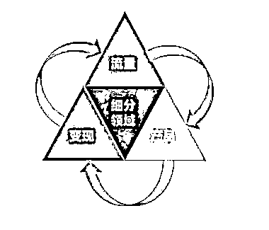 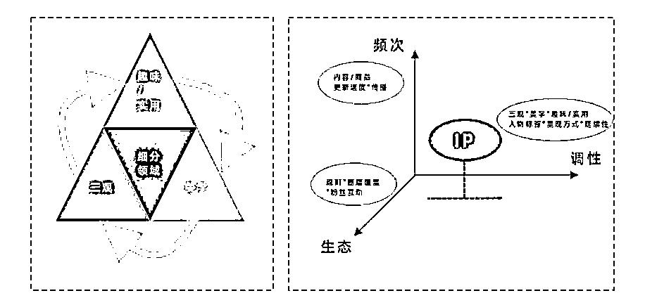 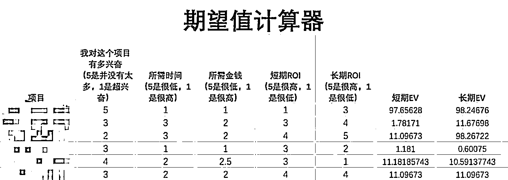

 

 

评论区：

初心 : 支持！

Junday : 谢谢老板的点赞[转圈]

Charles : 干货满满，谢谢大佬分享

Junday : 谢谢老板的点赞评论支持[转圈]

Lissa Tam : 超赞，躬身入局者赢

Junday : 谢谢老板的点赞

宋大刀 : 看完收货满满  谢谢大佬的分享

Junday : 谢谢大佬的点赞和赞赏[转圈]

# **# ****(79**赞**)**根据自己面试十几天的时间，简单的说

# 说一些感想

作者：  大祝leo

日期：2019-05-31

简单讲讲离职找工作以来的一些感想，以及之前工作中的一些感触。希望对大家有所帮助。

之前做过一阵子猎头，所以对互联网公司有大致的认识，也知道最近一直裁员的情况下，找工作确实不容易。

面了两周，大公司现在机会比较少，比如阿里年前社招只要P6以上，现在已经严峻到P7了，阿里系的公司也大多是这样。腾讯百度头条等厂也类似。现在P6以下基本都是外包的情况。

下面根据自己面试十几天的时间，简单的说说一些感想。希望对大家能有所帮助，面试的厂有有小，主要是产品运营这块，有一定通用性，可以参考。

1，关于学历：

 

 

学历当然是越高越好，985,211，海归等学历在竞争中占据的优势是很明显的，在未来晋升，择业的时候也有更大选择性。举个例子来说，同样工作经验的人，985,211工作两三年还能进BAT或者是旗下的一些不错的公司，但是非985，211的同学难度就要大上不少，我有朋友就是这样。所以有机会读书就好好读，这个蛮重要的。

之前听说过一个事例，有大型国企想要提拔一个大专的同学，HR的审批要交到一路交到副总裁，试想这样的事情有多少人愿意去做呢？成了没好处，万一领导不爽就被批了。

2，关于年龄：

在同样要求的岗位上，年龄越小优势越大。有的岗位明确要求多少年工作经验的，那就另当别论，因为HR会看你工作经历，然后判断你有没有胜任该岗位的能力，这时候年龄可能会成为限制。

年龄大的话坏处会更多一些，比如大厂和独角兽公司，他们对人的要求都是越来越高的，30岁左右的人是最吃香的，但是35岁以上的人他们就会考虑很久了。

听说过一个大厂判断一个人是否优秀的标准，30岁以前的P7,35岁以前的P8，这样的人是很有潜力的，其他就说不准了。

你可能会说会有弯道超车的人，也会有，但是工作久了，这样的概率还是很小的，因为大部分人会成为什么样，其实还是能有一些模糊的判断的。

年纪大了也无需担心，重要的是你的经历跟你的能力是相匹配的，这个是关键。

3，关于背景：

大厂看背景，这是大家都知道的事情。但是换个角度想一想，公司既然花了钱招人，当然要找同等价位的最好的人，无可厚非。毕竟HR也不愿意花太多时间在不可能的人身上，业务部门也希望能有一个强大的人来帮助业务的发展。职场如战场，谁都不愿意背锅，这也是情理之中。

4，什么样的人有机会进大厂？

我觉得可以从几个角度来看：

学历+对标的背景（做相关业务的大小厂都可以）+相对应专业的能力+行业影响力学历很重要但不是必须，很多人工作很多年，但是因为是某一领域的专家，还是可以进到大厂的，只是说在能力范围内，学历能好就尽量好吧。

 

 

有自己能力的人，比如运营产品懂数据。技术懂业务和算法。

5，我们应该怎么准备？

选择很重要。你在选择一份工作的时候，也要想想它能给你带来什么，你以后的路应该怎么走。

选择一份工作的时候，仔细看看自己有没有相应的能力，针对性的去准备。

比方说有的岗位要求数据能力的，就多去看看数据相应的能力。

你一定要有一个目标，可能你一下子进不了大厂，但是你可以找一个相对不错的公司的岗位，这个岗位应该是有一个比较厉害的人带你，这个团队的学习氛围也很重要。

6，简历应该怎么写？

要学会读JD，如果在对应公司有熟人那就最好，可以了解一下该岗位的具体情况。

针对性的去写，你有什么优势是适合这个岗位的，你做过什么事情是跟这个岗位要做的事情相关的，你有什么资源，都可以写上去。

你不要理解为这是阿谀奉承，我们相信，为一个岗位认真准备的人总是比毫无准备的人要容易打动人。

7，个人成长，我们应该做什么？

1）多想多做，多总结，多输出。

每做完一件事情，都总结一下这件事情是怎么做的，有哪些优点要保持，有哪些不足要改进，然后整理成相应的文档。这样对你下次再遇到这样的事情就不会手足无措，面试的时候也有话可说。

2）如果能写文章，就大胆的去写吧，哪怕写的不好。

写文章，出去演讲，都是对个人影响力有很大帮助的。别觉得文采不好你就不写了，很多大佬刚开始写的时候都是很水的，可那又怎么样呢？你愿意去做这件事情，你就超越了大多数人了。

再举几个例子，写文章或者出去演讲对个人帮助还是很大的。

我朋友圈里有很多大佬，光靠写文章就可以保证生活过的很不错了。你可能会说，那是赶上了互联网红利，现在哪有那么好。

 

 

上周我听了一个演讲，96年的一个同学，写公众号1年，生活费就可以打平了，这样也挺好的。重要的是用心，并且坚持去做，再加上一些运营，总有人会看见的。

还有一个朋友之前一直出来演讲，后面晋升的时候要求行业影响力，这关就顺理成章的过了。

让这个世界知道你，好的工作也会自己找上来。

3）不断的去学习新的知识

年纪大的人很容易被淘汰的一个原因是他们已经没有那么多的精力去学习最新的东西。

互联网时代知识的更新换代很快，跟不上时代就意味着很容易被淘汰。甲骨文裁员那么多人会哭，大概就是这个原因吧，温水煮过的青蛙是没有竞争力的。

我这段时间聊下来，很多岗位对数据的要求越来越高了，比如产品，运营，这方面的同学可以去留意一下，甚至我面试的一家公司运营的岗位，对去语言也有要求，所以好好学习，没错的〜

4）放心大胆的去认识牛人，关系是麻烦出来的

有时候参加活动，你会觉得在台上演讲的人很牛，你觉得自己配不上他。

其实没什么的，勇敢的去要联系方式，有问题多去问，一回生二回熟，当然你问人的时候基本礼貌也是要的，发个红包请个咖啡之类的，不要去做伸手党。

我老板跟我说过一句话：只有跟最优秀的5％在一起，你才能成为那优秀的20％的我觉得很有道理，在这里也送给你。

5）逻辑很重要

做很多事情，你要想清楚为什么做，怎么把这个事情去做的更好。

6）不要不懂装懂

遇到问题不懂的就勇敢的说出来，大家都会热心的帮你，不要不懂装懂，这样既浪费自己的时间，也浪费大家的时间，得不偿失。

8）还有很多，重要的是要多思考。

8，最后，说些什么

1）关于裸辞

 

 

不建议裸辞，裸辞意味着更大的压力和经济负担。

如果你是在一个岗位停步很久了，你又对自己的未来有清楚的规划，心态很好的话，可以考虑裸辞。但是希望想清楚。

2）关于焦虑

总的来说，目前虽然裁员多，但是真正有能力的人所有公司都缺，所以大家要好好修炼内功，才能在未来更有优势。不管你之前是做什么的，现在学习都不晚，罗振宇有一句话我觉得说的挺对的，”种一棵树最好是十年前，其次是现在“，只要努力，什么时候都不晚。

焦虑我觉得挺好的，人生总有低谷的时候，这时候就应该静下来想想自己未来应该怎么去做了。提前做好准备，积累实力。风雨过后就是彩虹。

3）关于猎头

猎头其实蛮有用的，不要对他们有偏见，但是这个行业参差不齐，认识好的猎头我觉得对职业生涯帮助会很大，当然我承认自己应该算是一个不错的朋友，但不是一个很好的猎头。有机会的话可以多去聊聊，他们接触的广，可能对你的工作有所帮助。当然你要跟我聊也是OK的，哈哈。

4）关于外包公司

如果不是实在没有选择，不要去外包公司。

5）关于转行

转行其实并不可怕，关键在于你要想清楚，为什么要转行，要去了解新的行业的运作模式，去接触这个行业的人，然后再做决断。盲目的做决断是不可取的，当然，你也要想清楚转行的后果，并且能有良好的心态去接受这个后果（可能是降薪，不适应等）。

最后的最后，希望大家都能在各自的位置做的很好。

我是大祝，目前在上海，之前做过运营和猎头，现在离职往产品方向努力，欢迎各位指教～微信:Z616842977

评论区：

 

 

白猫队长 : 说到心坎里了，我做一线开发7年了，感觉还是屌丝一个。未来不太想做一线开发了，我不想做什么技术管理，正在思考如何转型。

鱼丸|亦仁助理 : 看完很受益，谢谢分享[强]

大祝leo : 哈哈，多向星球的大佬们学习[机智]

大祝leo : [呲牙][呲牙]

钟大本 : 感谢分享。另外微信号搜不到用户呢。

大祝leo : 😂留错了，Z616843977

挺婷Tina : 谢谢分享，受教了

# **# ****(46**赞**)**毕业**3**年薪酬翻**6**倍，并且匀出时间斜杠** **

# 职业规划分享

作者：  丫丫

日期：2021-03-31

全文指路 

对于大多数非二代朋友，在毕业后大概率是会选择步入职场的，因为相比于创业，这是一个收益最大化的选择：获取相对稳定的现金流，同时可以学习基础的职场技能。能让工资涨一大截，也算是赚钱的一种方式。

今天想跟大家分享一下，我是如何通过职业规划和逐步的执行，实现了毕业3年薪酬翻6倍，并且从最初的007模式逐渐过渡到如今，可以在主业之外匀出时间斜杠副业的状态。相当于，时薪翻的倍数还不止6倍。

这篇文章适合以下朋友阅读：

（1）处于毕业初入职场阶段，工作经验1-3年，想涨薪但对将来的发展感到迷茫，或是对职场环境感到煎熬，不知道应该做点什么来改善；

（2）在校生，希望早一些思考职业发展相关问题，尽早开启职业规划，少走弯路；

（3）好奇毕业工作3年薪酬翻6倍故事本身的朋友；

（4）对互联网商业分析/数据分析相关领域感兴趣的朋友。

 

 

先大致介绍一下我的背景：本科是人大商学院，研究生拿到offer后签证被卡求学终止，于是在错过了秋招和春招之后，以0工作经验直接参加社招求职。你的学历背景和能力模型可能跟我不太一样，所以这个求职路径不能生搬硬套地复制，但是这个方法论是可以迁移的，希望你能通过我的这个求职路径中用到的各种技巧，来提升自己的主业性价比，从而更加得心应手地去赚更多路径的钱。

目录

1、求职心态：看长期利益，不要被焦虑裹挟

2、职业规划：与自己的能力模型结合，扬长避短，缺啥补啥

3、求职技巧：关注匹配度，善用人际关系

4、谈薪技巧：打造稀缺性，利用锚定效应

5、保持开放：与市场保持链接，快速自我迭代

全文请移步：  《毕业3年薪酬翻6倍，并且匀出时间斜杠|职业规划分享》，可复制链接后用石墨文档 App 或小程序打开

全文约5300字，请预留充足时间阅读。

https://shimo.im/docs/tcPPjY8Wq6VXcD3J/ https://shimo.im/docs/tcPPjY8Wq6VXcD3J/

评论区：

大嘴师迪 : 你俩有点意思哈

Im绮寒 : 好干  正好需要  收藏了吖[太阳]  

光光 : 有个疑问哈~

能力模型中的软技能、硬技能很形象，很好理解。但底层能力，我是不是可以理解为抽象能力，而不是天赋？

我看生财很多牛逼的人，抽象能力都很强，他们靠的肯定不是天赋。即使有应该也占比很小

抽象=底层能力=底层逻辑  不知道可不可用这样理解？

魔音 morin : 我来做个答疑，你可以把这个理解为底层的优势能力，更像是盖洛普优势里面的优势项，每一人都是非常不同，就像我的第一优势就是理念。这种优势是由先天和后天共同组成，但是我个人倾向于是先天优势，及出厂设置

魔音 morin : 魔音 morin 回复  光光: 你说的抽象能力就是盖洛普优势里“理念”这一项，而 

 

据我所知生财里大部分很牛的人“理念”都是至少排在自己性格优势的前十项里，或者可以理解为MBTI里的NT类型的人格特征

丫丫 : 感谢魔音，我就是想表达这个意思

光光 : 嘿嘿  感谢魔音小姐姐~

我好像理解了些。

就是一个包含关系，底层能力(底层的优势能力)包含了很多能力/优势项(先天+后天)，其中就是包含了抽象能力，可能还包含执行力、想象力……

而我之前把抽象能力的级别搞混了，误以为抽象就是底层逻辑

这样理解对么 (^▽^)

丫丫 : 对，抽象能力我理解就是从具象事件中提取可迁移共性的能力，这种后天是可以练习的，个人认为偏软技能而不是底层能力

# 【创业经历】**11**篇

# **# ****(**精华帖**)(365**赞**)**沉浸于生财** 2 **年** 3 **个月，分

# 享我的破圈成长之路

作者：  郑小焦

日期：2021-10-27

你好，我是小焦。

这篇文章，（是为生财带盐的）是一年前那篇“一名小透明的逆袭之路”文章的续集，也可名为《一名小焦虑的聚焦之旅》(嘿嘿终于来啦~~) 欢迎追更！

 

 

全文8000字，阅读仅需5分钟。主要讲述这一年来从“焦虑转为聚焦”的成长、月收入翻10倍的收获和总结，同在生财滋养，与诸位共勉。

文章分几个部分展开：

一、空白期：小透明初入生财

二、成长期：从迷茫焦虑到聚焦

三、进阶期：在新项目中逐渐开悟

四、破圈期：感谢生财，共同成长

————————

一、空白期：小透明初入生财

2019年7月22日，在经过一番咨询了解和斟酌之后，在原价1650元的时候加入生财有术，编号6048，是第三期的“老”会员。之所以没在418第一时间加入，有两个原因：

一来，2019年之前，我都没怎么参加过知识付费，一直处于自己的封闭圈。两三百元的星球和训练营都很少参与，更别提上千元的社群了；

二来，门票的费用，对于当时的我来说，不是一个小数目。那时候，在酒店当一名销售经理的我，月收入不过八千元。

加入生财一年时，工作月收入依旧；开始副业并赚到工资外的第1000元；

加入生财15个月，还在原岗位工作，涨了一点工资；但因生财获得的其他收入，早已赚回了百倍门票；

**ps. 20**年写：** **一名小透明的逆袭之路

 

 

（https://t.zsxq.com/6EAMbyf  可点击链接直达）加入生财两年多，也就是现在，已经离职满一年，成为了自由职业者。因为在生财结识到了人生贵人，获得的全方位帮扶，使我在亚马逊的新手赛道上获得了不错的收入，目前月盈利是去年月薪的8-12倍。

看过我之前文章的朋友可能知道，去年此时，我得到了一个改变人生的宝贵机会，所以这一整年，我只做了一件事：把握住这个机会，全力以赴。

当然，如你所见，我的运气依然远超实力，一直以来都是这样。

实话说，这结果是我没敢想的，简称超预期。毕竟，半年前深陷谷底之时，我也做好了心理准备：再撑一段时间，为期半年。时间一到，若依然没有起色（没有盈利势头、潜力），计划在十月份终止亚马逊的进修之旅，回去上班。

所幸，一年时间到了，结果还算满意。每月的净利润数值还在不断攀升，特别是在9月份找到一位圈友成为合伙人之后，对之后的发展更有信心了。目前在向年底旺季冲刺，以期获得2~3倍利润。

前几个月，发生了一件很开心的事情，令我彻夜激动——爸妈愿意尝试过来广州住，我“赚钱之后的梦想”（移动办公，跟爸妈多待一起）提前实现，租了一间很大的房子，是一个家的感觉。现在，每日三餐能吃到妈妈做的饭；仓库里忙的时候爸爸主动过来帮忙；周末兄弟姐妹们休息过来聚餐，每周末都像春节过年一样，我成为了最幸福的人。

 

 

回顾这一年，低头赶路、投入在自己的亚马逊小生意上；现在，适合抬头看看天空，简单写一下这一年的历程。

二、成长期：从迷茫焦虑到聚焦

说来很奇妙，现在我身边所接触到的人，线上所有常联系的朋友，都是生财圈友，加入这个圈子后，我的人生也被慢慢打开。

**1. **躬身入局：一个项目

从传统酒店行业跨越到电商项目——亚马逊。从不知道如何注册一个店铺到现在手里有十余个盈利数额不一的产品，两个店铺。深知，我还是一名入学不久的学生，还有很多要摸索学习。

 

 

对于新领域的一无所知，令我感到恐惧，我意识到自己实在有很多知识需要填补，于是开始主动创造专注的环境，拒绝一心多用。

这期间舍弃了很多事情，包括很喜欢的社交等。每个人能够同时关注和专注的事，其实很难超过三件，对很多人来说，只有专注做一件事才能做好。我曾经也非常羡慕可以同时做很多事的人，但现在发现，同时做很多事的人，其实效率非常有限。

「慢慢地用心做一件正事，要胜过毛毛躁躁做一堆傻事。」

沉下心来后，开始做每周复盘，某天我想到：干脆写到公众号公开好了，也许能对其他新手也有启发。（没想到这个举动，给我带了很多意外惊喜，包括看着我进步的朋友持续提供的协助；现在的合伙人，也是因为常看我的文章而对我有了初步的了解和欣赏）

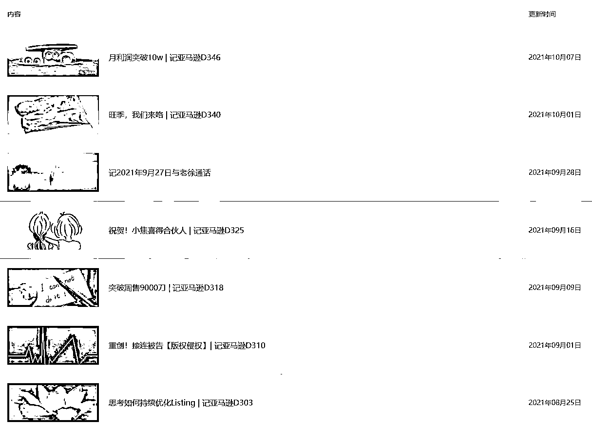

 

 

**2. **朝夕相处：一帮同伴

在决定躬身入局亚马逊后，我和几个朋友合租了一个办公室，简称“众创空间”，大家聚在一起办公，各自独立，分摊租金。你可能想不到的是，整个办公室的小伙伴都是生财的，曾有一个不是，也在我的推荐下加入了。到此，我们408就变成了一个神奇的（生财）组织，嘿嘿~~

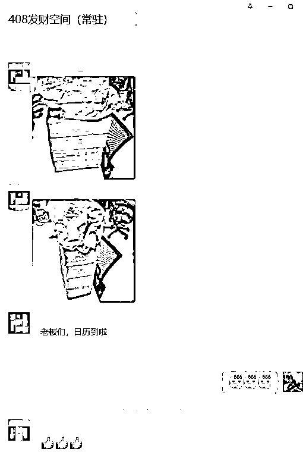

（前几天生财给一些创作者发抢先版生财日历，好几个都寄到了办公室哈哈哈）

时不时会有一些来408游学的小伙伴，也无一不是生财圈友。我们也会提前相约去线下见面会，一起蹲生财的重大活动。

 

 

在这个因生财发现项目并躬身入局的过程中，我发现，人脉在互联网时代，不再局限于自己身边所接触到的人。

以前，每个人的生活圈已经相对固定，同学、朋友、同事的人脉都相对有限。加入生财之后，就会打破这个固定圈层，各行各业的朋友，因为同在一个凝聚力强的社群而产生信任，更因为某种相似的价值观而走到一起。

就像我们生财408办公室，本来有的人在广州不同的区，有的在北京，有的在成都，后来，都因在生财有术的缘分，聚在了我们的408这个一百来平方的空间。

经常因为seven和古辛的日常对话笑得人仰马翻，两位挚友不谈怎么赚钱，反而天天讨论中午几点吃饭，下午茶要点什么，买什么水果，谁去洗，周六几点爬白云山。跟志同道合的人待在一块，何止快乐。同在一个工作环境里，不是同事，而是朋友。这种感觉，以前没有体会过，竟是这番别致。

**3. **惺惺相惜：一个合伙人

上文提到，因为有生财的背书，同是生财人，我跟合伙人迅速合拍，从素未谋面的陌生人，成为深度信任、紧密联系的合作关系。

起初，ta是我公众号的读者，这一年来的文章，ta说有的会拿出来反复阅读，获得一些新知。能给读者提供一点点帮助，这也是我写文的初衷。想不到的是，在我文中提出的一些问题后，ta主动来加我微信提供解决方法和协助。在这种互相帮助的长期陪伴中，我们渐渐走得更近，直到成为合作伙伴。

合伙人来了之后，我的店铺营业额上升到了一个新的高度。作为一名资深运营，ta用下班时间帮我运营店铺，每天晚上蹲点调整广告出价等。

 

 

我们刚合作那时，我交给ta一个链接，告诉ta：这个产品很想做起来，但是一直推不动。

没过两天，ta将产品从一天1、2单推上为一天20单，我瞬间惊呆了。本以为不知道要卖到猴年马月的三百多个库存，没过几天濒临断货。我跟ta说的最多的话是：太牛了！你太牛了！怎么做到的？

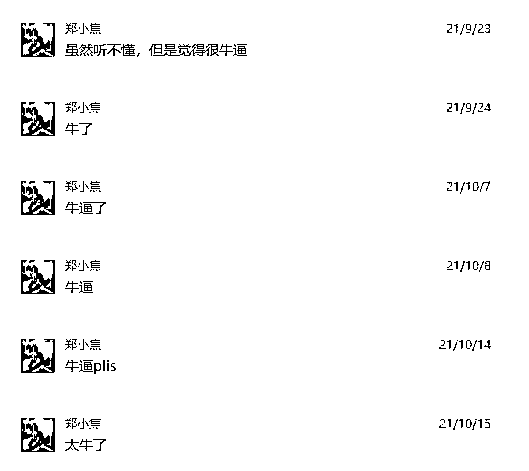

很感动，合伙人有天跟我说，ta一直关注我的公众号，知道我是怎么一步步走过来的，他们几位一起追更我文章的朋友私下都说：无关任何，很希望我能做起来。

 

 

在找这位合伙人之前，我曾经试过招聘，面试过几个，不合适。要么是有经验的，不愿意来到确定性不高的创业初期小公司；要么是没经验不嫌弃的，我却不知道如何传授连自己都不精通的运营知识。最后，还是在生财这个共同的社群，找到惺惺相惜的人，不愧是一个宝藏资源圈。

**4. **环境养分：一群朋友和前辈

虽然基本没有时间精力外出社交，但线上常联系的几个好友，一一细数竟都是生财圈友：

**albert**，君子。经常过来游学，总会给我们买哇哈哈的奶茶，顺利实现奶茶自由。这个超级优秀的大男孩，常常愿意分出宝贵的时间帮助两方朋友，在他身上看到“君子成人之美”的优良品德。

良辰美，善良。以前常看到他在圈友的文章评论区发表长文回馈，没见过面有些陌生，后来逐渐熟悉。他是我见过的特别特别善良的、奉献型帮助他人的稀有品种，我也十分珍惜有这样一位朋友。

小蚁，高人。有次我们走过珠江边，有人在钓鱼，他问我有没有现金，然后去跟钓鱼的人买了钓上来的几条鱼。我们提着鱼往前走了几步，他把鱼放生了。是他，提升我对生命的理解和尊重，他的使命感：让身边的人都幸福，人生不仅是为了赚钱，还有生活、家庭等很重要的事情。

蕣，好学。常在我的朋友圈评论区发表自己的“调研报告”，聪明又好学，年纪很小，主业比我所知的同龄人高出两三倍，副业宏鼠标基本垄断了市场，（据半年前了解的信息）是主业收入的五倍以上，也在亚马逊的新领域埋头奋进。

 

 

**CC**，美学。跟CC的交流不多，常态是默默跟她学习，她有毒辣的眼光和洞见，今年在沟通上有一个很大的进步来源于她的教授——适当示弱。她对我的鼓励很多，还说，希望我需要投资的时候联系她。

张哥，从容。年初粉上的年轻男神，在看他的直播时深受震撼，用自己的实力影响、鼓舞、帮助很多年轻人。上个月邀请我到他的线下见面会当嘉宾，给予我跟偶像近距离接触、学习的机会。

**Lissa**，奋斗。见过一次面，在深圳线下见面会地点旁边的早餐店，隔了一张桌子，没来得及聊天。我们见证彼此的创业（艰难）之路，而她的链接能力，也值得我学习。

强哥，亲和。一个我当初战战兢兢加上微信的牛人，在我公众号发表文章后，主动私信我鼓励我：三年不轻易换赛道。我也注意到，他很愿意跟“小辈们”们互动，这就是我理解的亲和。

还有很多圈友，近期断了联系，心里记挂彼此（这么说有点肉麻，但事实如此）。不仅有一个个鲜活的人陪伴，还有一篇篇精彩的精华文，在最近稍微能喘口气的空隙里，被我打印出来细细品读。

三、进阶期：在新项目中开悟

**1. **找到愿意带你的人

这个很重要，也很难。我非常幸运，有一个手把手带我的资深老师。这也是我在一年前辞职后，对比几个就业机会时的重要参考因素。

 

 

初入任何行业，离不开一个底层逻辑：守、破、离。在此贴上刘小排老师的文章  如何真正用好别人的经验和认知？  （https://t.zsxq.com/nQBuvZv  ←可点击链接直达）我拜读了很多遍。前期最重要的是“守”，听话照做。

愿意带你的人，会站在他的过来人视角，帮你找到适合新手的赛道，在亚马逊这个项目里，我的老师帮我找到适合的赛道是：”红海中的蓝海“——细分人群。

举个例子（理解概念就行，不一定有这个产品），卖筷子的人很多，卖给小孩用的筷子也不少，但卖给盲人（特定，小众人群）用的筷子，就不多。

目前我做的产品里，带来月利润5w+的单款产品，很容易做，竞争不大，单价利润相对偏高，就是给一个特别细分的人群提供的。不过，对应来说，壁垒也不高，很多新手都能做，明年会开始寻找第二阶段“破”的可能。

**2. **学习点亮整颗技能树

个人小卖家做亚马逊，需要身兼多职。选得了品，做得来调研，聊得了供应链，会一点沟通，时不时当打包工，定做外箱要头脑清晰用一点数学，有点审美基础，告知摄影和美工你的产品呈现需求，写得了令人心动的文案，最好还要会一点运营，打打回报率高的广告，等等。

实在没办法三头六臂，至少要每一项都及格吧，这一整条链路下来，构成了一个产品，每个技能环环相扣。

不会怎么办，没有别的办法，在还没能力调动资源之前，只有学。

不过，学习有多种方法。相比于闷头自学，我更喜欢向前辈请教。在这一年里，帮助我供应链、运营常识、拍摄等的各有代表。也是在这一来一回中，建立了更坚固的关系。

 

 

在求助方面，脱不花老师在《沟通的方法》里面讲到，沟通是一场无限游戏。对此我深有同感，为什么我向别人请教、提问、求助，会有“一来一回”的说法呢，不是（答案、解决方法）“来了”之后就没了吗？

我学习到的回是“反馈和回馈”，这个问题解决之后：

①类似的问题出现后能自主解决的案例，有没有主动跟前辈说一声：“谢谢教会了我某某技能，这类问题都能迎刃而解，真是太感谢了”；

②有没有阶段性的主动报告，即便没有问题了，也告知对方现在走到哪一步了，谢谢ta曾经的帮助；

③有没有关注对方是否遇到其他问题，刚好你能帮得上的。

不知大家是否听过这么一个有趣的说法：为什么人更倾向于帮助帮过的人？欢迎后续（或者评论区）探讨。

**3. **及时止损与不下牌桌

初期，行业标杆就是最好的老师。产品所在品类的最强卖家称为标杆，我把“标杆级别”的强劲对手收藏并标记为“学习对象”，最开始我们什么都不懂，怎么做好一个链接，就去像素级模仿、学习优秀对手，看他们图片怎么呈现、链接怎么写，A+怎么编排，视频怎么拍的，这些都值得沉浸式学习（不说话的，旁若无人的，悄悄地，耐心的理解、转化为自己的理解）。

中期，学习到一定程度后，要动手了。难免会有失误，这很正常，应该允许自己有一个试错期。不过，最好设置试错额度，在不断跌倒和爬起之间迭代。在今年四月底，我听从老师的建议，选择走容易一点的产品方向。我把当时的全部资金压在这批货上，心里也没有底，当货代来拉走第一批新品时，我瘫坐在这堆产品之间，默默的看着它们。

 

 

回到家后，我开始淌眼泪，我知道这一批如果测试不成功，我就要下牌桌了，因为没有更多资金了。其实，资金不是问题，能力才是。如果不行，再多的钱拿过来，只会沦为：宝马变摩托，摩托变单车。

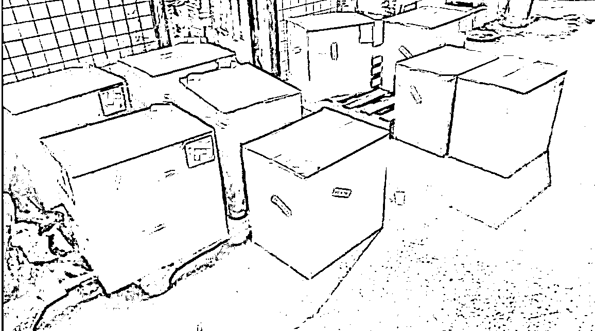

只要坚持不下牌桌，开始做好第一条链接，就能总结出规律做出第二条、第三条。龙珠群之前出现过一句话我印象很深刻：退出者会补贴坚持者。

**4. **扩充资金不足怎么办

到后期，产品做起来了，扩大规模（做多个产品，加大补货量）需要更多资金。7月底，开始筹备年底旺季的补货计划，我甚至开始准备借钱，大概50万。现在回过头看，其实不需要那么多钱。

亚马逊生意，赚的钱都压在库存上边，虽说赚了多少钱，但如果还要继续赚，就得把钱继续投进去用来买货。手里是没有流动资金的，正因为这样，投入的钱越多，产品也压得更多，风险也会更大。

 

 

当时有位朋友跟我说，ta用房产做抵押，能贷出几十万借我。我很感激，不过婉拒了。

但我更加坚定了，一定要好好做这个生意，不辜负大家的好意。

当时的周更文章  想尽办法筹钱等待机会 | 记亚马逊D267

（https://mp.weixin.qq.com/s/1GqJGWXaTFHPJvwDwmc5eg  ←可点击链接直达）发出来之后，一个素未谋面的读者给我留言，令我动容。以下是留言原文：

偶然关注，看得出来你很乐观。

福兮祸所依，要谨慎。看得出来50万对你来说不是小数目。

第一个问题，这50万如果打水漂，承担的起吗？

第二个问题，如果承担的起，风险点在哪，你能否控制？

第三个问题，有后备方案吗？

一句话就是，做好风险控制，不要去赌自己不能承担的风险。

句句在理，我认真思考了ta的话，加上老师让我千万不要去乱贷款，我停止了这个借钱计划。

没过两天，问题竟然轻松解决了。

 

 

是这样的，愁眉的某个晚上我突然想到：能不能跟供应商沟通账期呢？相当于让他们给我免息贷款，拿货不付钱，一个月结一次。只不过不用一次好几万那么多，供应商很多个，分摊出来，看对方产品的单价，有的几千有的上万。

后来联系了几位，有的愿意有的不太愿意；针对高客单价的供应商再沟通第二轮之后，基本都达成了口头协议，愿意相信我，让我一个月结一次帐，有的还同意让我到1688上给付赊账，相当于借我两个月的款项。

 

 

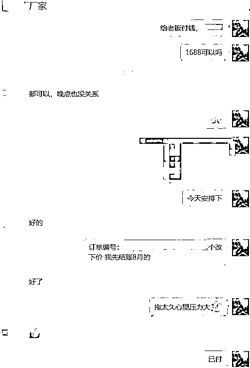

两三个月磨合的时间里，我每个月准时给供应商们付款，有的供应商老板很忙我还会追着还款，信任值在这些交易中稳步提升。这个月开始，补货数量翻倍，基本都要欠每个厂家好几万，不过都不是问题了。

 

 

又过了几天，几个看到文章的朋友主动借钱给我。为了以防万一，我还是收下了，珍惜这份好意——有十来万。其中，就有生财的圈友。同时自觉承诺大家，半年内如数奉还+10%利息作为感谢。

四、破圈期：感谢生财，共同成长

有幸加入生财，在这两年多时间的浸润下，我自己发生了天翻地覆的变化。不知不觉中，已经成功告别了过去好几年感到焦虑不安的环境。

于我而言，生财就是那个我曾极力想向上融入的圈层。关于破圈，曹大一篇文章  聊聊关于“破圈”的话题  （https://mp.weixin.qq.com/s/NeR3B1Tg_9X2jxDuXcIgpw  ←可点击链接直达）说到：

什么人适合去破圈？

首先是对现状不满意的人，这是破圈追求的动力。

其次是对其他领域充满好奇心的人。只有好奇心才会驱动你不断摸索前进，主动寻求信息，知识和认知提升，完全靠人手把手带，我觉得都没戏。说自己啥都不会，也没概念，有没有老师从头教，这种除了被收割没有其他的可能。

第三是有足够的信心和勇气面对挑战的人。

破圈不容易，无论是面对新的知识，新的技术，新的语言，还是面对新的人际，新的社交网络，都需要足够强大的信心和勇气来应对。

 

 

无法满足以上三点的人，我不建议去做破圈挑战。

回顾自己这两年多来的历程，正是如此，可以说：啊！终于破圈了。

刚加入生财时，只会刷帖，不敢说话；过了大半年准备发表第一篇文章时，怕不符合发帖要求被删除，没准还会留下不好的印象。感谢生财的包容，现在，找到了自己的位置，还有一帮志气相投的朋友，其乐融融了。

**1. **成员之间交流、启发和进步

从20年10月，第一次参加线下活动——龙珠见面会后，我更加感受到这种能量流动率高的社群氛围，除了线上互动，线下见面大家也不眠不休地积极交流、相互启发，见面会的那两天，我每天只睡四个多小时，却比任何时候的状态都好。

诚然，我本人在身边的圈友身上学到很多宝贵知识和应用实践，也看到这社群里，不同行业之间的圈友相互启发和陪伴成长。

去年某一天，家蒙哥给我发的一句话，我很受触动，一直记得。虽然我知道是这样，但那时候从来没有人这样对我说出来。在这句话里知道他对圈友的真正关心，他怕我飘着，不落地。很感动，默默记在心里。

 

 

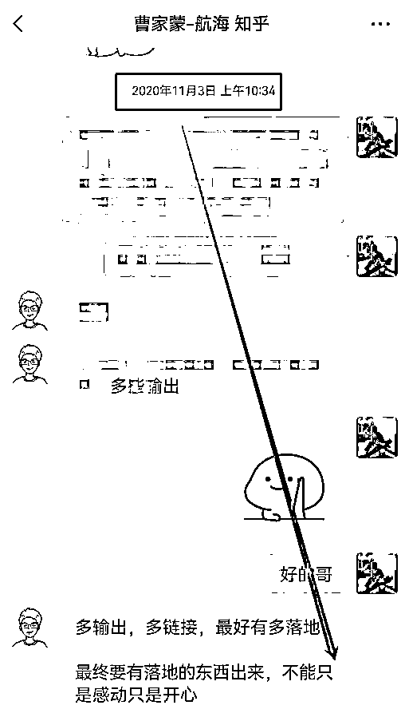

（聊天截图已获得昵称本人授权）

再者，这一年来的宝贵机会和事业起步，来自于圈友（我的老师）的毫无保留教授和悉心提携。在这过程中，我公开了每周的学习心得作为复盘，也遇到不少圈友问我关于亚马逊的大小问题：很开心有机会力所能及帮助大家，能传递这份能量。

上周某天深夜，跟供应商沟通一向行云流水的我，遇到了一个极其不能接受的意外，情绪很难平静下来。第一时间想到生财一个圈友，他在之前的精华文中关于“与供应商的沟通”给我带来极大的帮助和指导。平时我们也比较少联系，去年杭州的龙珠见面会之后不仅没再见过，聊天都没几次，不过好在线下见面会那次建立了足够坚实的关系。

 

 

我给他发了一句：我有个事想请教你。

他马上回复。后来，我们聊了很久，直到我不再因为供应商的问题生气，直到开始说一些今年各自的生活，直到各自的趣事哈哈大笑，直到...我的手机没电自动关机。

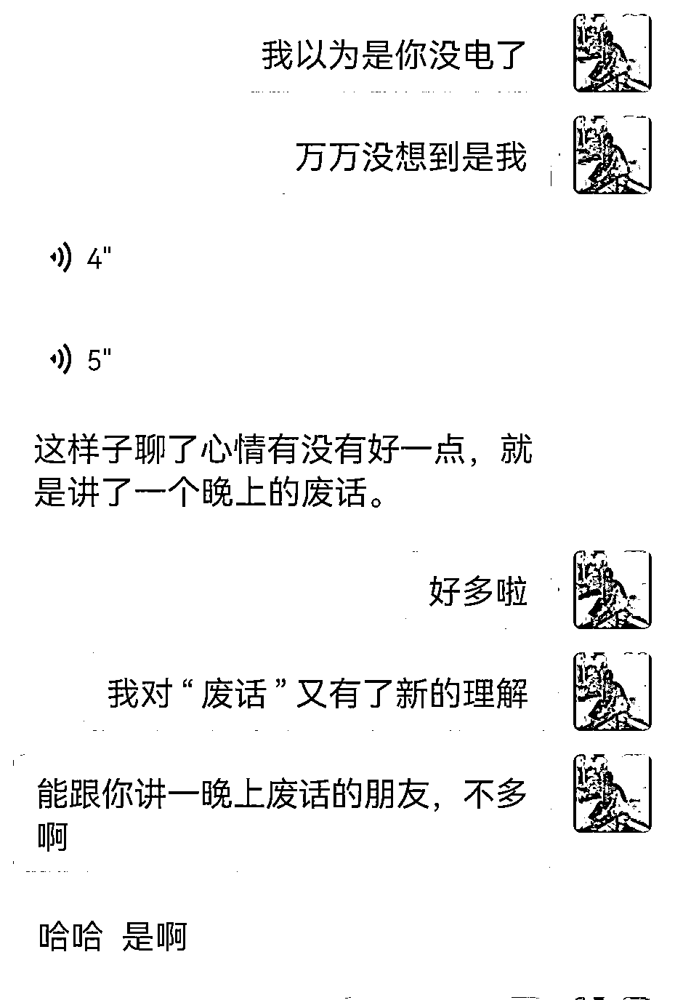

 

 

小蚁老师有篇精华文，标题写得特别好，叫做“高成交率的销售，本质是能量传递”（文章内容也写得很好，还有幽默生动的例子），在这里我也想说：高质量的社交，本质上是能量传递。

**2. **论持续优化个人的所处环境

我的职业生涯里，曾前后在两个公司就职。由于我在不同阶段有不同的目标，一直在“找出路”。

第一份工作的状态是：

工作时间太长，忙到没有任何时间学习, 周围的同事常常满脸疲惫，无精打采。我们每天早晨七点出门，没有任何情绪地洗漱、换上西装、化妆，下楼坐上员工班车，把我们托运到公司, 开始不停地工作, 直到晚上十一点回到宿舍，这样的工作日复一日。

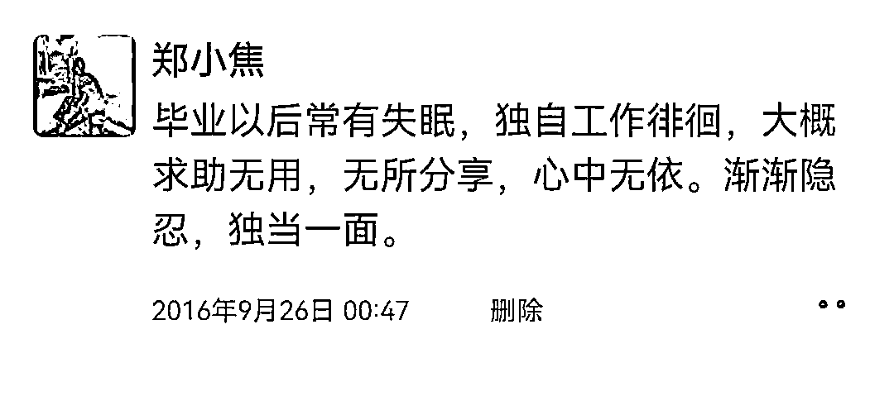

我们都是普通人, 在那种忙碌环境中, 一个人很难独自摆脱影响, 越是这样越要不断主动地优化成长的环境。有机会逃离这个环境，我来到第二家公司：

 

 

公司编制合理，分工明确，基本能在下午7点左右处理完工作, 在食堂吃完晚餐，8点回到公司安排的“珠江边豪华公寓”。有充足的时间休息、健身、阅读、学习.......而且我发现公司销售高手比比皆是, 我默默地从同事身上学习更多的销售话术，比如如何婉转拒绝客户无理要求。

同时我感觉大家都很安逸，很享受当下的工作状态，很多打算就这样做到退休。但我不想，我看到顶头上司、上司的上司他们的样子，就是我在职场五年后十年后的样子...

在第二份工作期间，有幸了解到生财，我发现了一片完全不同的天地。曾无处安放的“模糊又坚定的雄心壮志”找到了一点共鸣；迷茫又不知从何寻求答案的状态渐渐有了变化。

以前在的环境里，常被问：“那么努力干什么”？觉得身边的人都不是同路人，转头却在生财遇见一大堆“知音”。

 

 

去年，我又有机会离开第二个环境，开始自由职业，融入生财圈友周围的环境，直到现在。我感觉，终于来到了我该在的地方。

**3. **成为生财里的一道独特激光

这个概念第一回清晰地植入我的脑袋时，是来自于光合老师在线下见面会所说，同时他也在文章  普通人如何破圈成长  （https://t.zsxq.com/nmUFYNb  ←可点击链接直达）说到：

“成功是一种时间积累现象，成长也是缓慢的。选择一个自己擅长的领域，压倒性的时间投入，日拱一卒，成为一道激光，就能穿透所有圈层，一往无前。

一般来说，人们往往会高估一年的变化，也往往会低估十年的变化。一道坚持十年的激光，力量不可想象。 ”

当时听完，我的理解是：沉住气聚焦一件事，像一道激光一样穿透领域，成为最亮的仔。如今，我再读这篇文章，又有了新的理解：

选择自己擅长的领域，这是第一步，也是非常难的。有的人，一辈子也未必找得到。比如我，至今还在找。

虽说亚马逊是我在生财发现的第N个项目，也是一个极其重要的转折点，因为这个项目我才得以真正积累人生的第一桶金（有幸的话应该一两百万）。不过，这个领域并不一定是我所擅长。

相比之下，老师简直就是天选之子，他在几年内靠自己的摸索打造“蓝海方法”，带领团队冲向千万年利润；当看着他讲产品时，你简直就像进了电影画面一样，能看到一向内向少言的他浑身发光，旁若无人，仿佛变了一个人。

 

 

而我，基本上没有什么电商嗅觉，拼尽全力再加上超多的运气（风口），惊险换得这点小成就。

很多圈友、老师早已成为生财里的一道独特激光，当我们说到某个领域有哪个专家时，都会不约而同地指向同一个人。这就是激光的威力，找到所擅长的事情，一边开心的钻研，一边轻松的超越，也是我们可以向往的方向。

最后，如果你也跟我曾经一样感到焦虑，送给你一段我珍藏的话，是老师很久以前发给我的（来自圈友@李晨），一直很受用，共勉：

努力不一定会成功，但是人们更愿意帮助努力的人，这是线性成长转变成跳跃性成长的门槛。你的努力被别人欣赏，有人愿意拉你一把，那就是跳跃性成长。

个人努力是安身立命的后盾，也是值得别人的信任和帮助的标签。

其次，要尽早打造属于自己的成功案例。成功的经历能帮助你更好的成功，让自己有做成事的自信，也给别人一个相信你能成事的理由，这是做事的基础。

人只要不断往高处走，登上山顶见到的也是山顶上的人，视野角度，思考方式都会不一样，这是做事的格局。最后，无论我们制造的“成功案例”是大是小，靠实力还是好运气，其实都特别有用，真的。

人若无名，专心练剑。

 

 

谢谢你耐心读到这里，希望我在生财的故事，对你有一点触动或启发。

评论区：

林小姐很Happy : 写的真好

王平 : 走心

未完成 : “一个人的势能上去了，赚钱会很容易”，看了以后很受鼓励，感谢小焦的分享[玫瑰][玫瑰][玫瑰]

易九川 : 看完文章，内心十分感动，很受激励。字里行间透露出了一个活灵活现的小焦，这种感觉真的很美妙。读完文章，看到了你对家人，朋友，合作伙伴，贵人的态度，心里更是希望小焦的亚马逊生意能越来越好，早日寻找到自己眼里放光的领域。

晓冬 : 看完好想跟小焦做朋友[微笑]

十三 : 很受鼓舞[强]

老黄牛 : 小焦的成长之路一直鼓舞着大家💪

张晴天 : 小焦很棒，之前在粥左罗老师写作训练营跟小焦同期过，那时候看到的小焦就已经是一个活力满满，而且通过自己不断努力，练出了很强的写作能力，是大家都很佩服的一个人。没想到后来在生财看到小焦也在，而且通过在生财的历练，现在做跨境电商做成了自由职业，真的很佩服小焦[强]

# **# ****(**精华帖**)(309**赞**)**我的十年自媒体之路

作者： Crossin

日期：2023-06-15

各位星友大家好。

本文是应小灰老师的邀请，写的一篇关于自媒体运营的经验分享。

 

 

算了下我做自媒体也有十年了，确实也想做个总结，但原本并不打算在现在这个时间点做。因为从结果上来说，目前我的公众号流量大不如前两年，加上一些个人原因，几乎处于半躺平式运营的状态；另外我正在向视频方向尝试，但目前尚处在起步阶段，还没形成有效的流程或方法论。所以客观来看，此时既谈不上是一个成功案例的分享，也不能说是失败案例的总结。

但择日不如撞日，来都来了，那就随便聊聊吧。讲讲我个人在自媒体方面的一些经历和由此得出的经验教训。

分以下几部分谈谈：

一、我的自媒体经历

二、爆款内容复盘

三、收入水平

四、我做对了哪些

五、我做错了哪些

六、对新入局者的建议

对了，先介绍下我自己的号：**Crossin**的编程教室。以Python编程相关的内容为主，包括教程、案例等。

先讲讲我个人在这个过程中的一些重要时间节点和复盘。但其中很多情况跟当下已经不一样了，同样的操作现在恐怕很难复制。对这部分不感兴趣的朋友可以直接跳过看后面的建议。

 

 

# 一、我的自媒体经历

粗略地理一下时间线：

**2013**年** - **注册公众号，开始连载**Python**入门教程；注册知乎，回答**Python**、编程相关问题。

此时公众号刚诞生不久，算是偏小众，更谈不上什么商业模式，甚至“自媒体”这个词都还没有。但小众有小众的好处，只要你的内容确实不错且持续更新，很容易联系上一些大号帮你推荐。不少号主也会主动搜罗一些优质号进行推荐。

而知乎在那个时候也是处在初创上升期，用户群体以大学生、刚毕业的职场人为主，内容氛围也不错，主要都是知识技能向。且早期对作者引流几乎没有限制，可以随意在回答里放公众号二维码。另外还有一点，当时百度对知乎的答案收录权重很高。所以综合下来，当时在知乎做技能向的内容分享，再引流到公众号，真的是一个非常大的红利时间窗口。

接下来的几年，我本职是做游戏行业，公众号一直当兼职在做，更新频率很低，但用户却在一直增长。期间接过两家广告合作，费用不高，差不多1k/次（甚至有家最后还有一期没给我结清），但也算是零的突破。

**2016**年** - **开始全职做自媒体，年中推出付费服务，下半年开始注册公司、组团队、参与创业孵化。

 

 

这个时候正是知识付费刚刚兴起的时候，移动支付普及，大众在网上付费的意愿大大增强，而机构还没有来及大规模介入这个赛道。当时还没有太多甲方投放公众号广告，所以只能想办法自己搞变现服务，一般是做课程或者训练营。知识星球（当时还叫小密圈）和生财有术都是这个时期出现的，我是最早期的用户之一。我的付费服务前后经过很多版调整，这其中也从生财有术里学到不少。

我最早一版的付费会员推出时，甚至没有任何自己的课程，就是提供QQ群答疑服务。但当时放出的几十个名额直接被秒杀。这给了我坚持做下去的信心。

后来感觉有希望，就开始着手开公司、组团队。直到2017年一直在尝试团队化运营，想搭建一个从内容引流到培训服务的闭环。但个人经验不足，一直无法将团队作用充分发挥出来，反倒我个人的内容输出受到影响，两边都没做好。虽然总体来说没怎么亏，用户也在增长，但始终很拧巴，不管是对团队的小伙伴还是对我个人来说，感觉都不是一个好的状态，最终选择在2018年初解散了团队。

**2018**年** - **尝试视频创作。

此时抖音兴起，于是也尝试了一下短视频，竟然在一周后就做出了一个爆款，千万播放。但这个视频跟编程无关，且我在短期内也没找到可以跟编程很好结合的内容方向。

与此同时，公众号的甲方投放开始井喷，于是重心依然保持在了公众号图文上，抖音就这么搁置了。

**2019**年** - **有意识向视频转，但不够重视。

这段时间，公众号的广告市场也很繁荣，甲方商单不断。这段时间可以算是做公众号非常舒服的一个时期。所以这时候又找到了几个小伙伴来辅助，其中大部分是远程兼职。

 

 

继抖音之后，B站也由二次元逐渐出圈，我本人其实是B站老用户（准确来说应该是A站），但之前没想过在B站上也可以发编程内容，于是同抖音一样，起个大早赶个晚集。

虽然也有过几期播放量不错的视频，但始终没当做主要渠道来重视。

**2020**年** - **正式转为**“**自媒体**”**

这一年发生了什么我们都清楚。但2020年其实对公众号主来说影响并不大，甚至还有些促进，因为很多原本线下的事做不了，反倒增加了线上的流量，比如我就多卖了不少网课。而且我阴差阳错地在一月初退掉了办公室，彻底转回到一个单打独斗的自由职业者，反倒是躲过一波损失。

但随着时间越来越久，培训机构类的金主日子也不好过，到2021年下半年的时候，广告量已经大不如前了。另外，加上视频取代图文，知乎转型“故事会”，我这个公众号的数据直接跌到没法看。然后那阵子干脆就有点躺平了，过起了半退休的生活（去学了指弹吉他、打鼓、攀岩，有时还会去公园里跟大爷大妈一起抖空竹……）。

**2022**年** - **尝试短视频

年中下定决心转型，尝试做编程教学短视频，主战场是抖音和B站，顺便同步视频号和小红书。到目前为止，数据虽然不算爆，但至少在稳步上升。暂时打算以内容创作为主先继续做下去。

# 二、爆款内容复盘

 

 

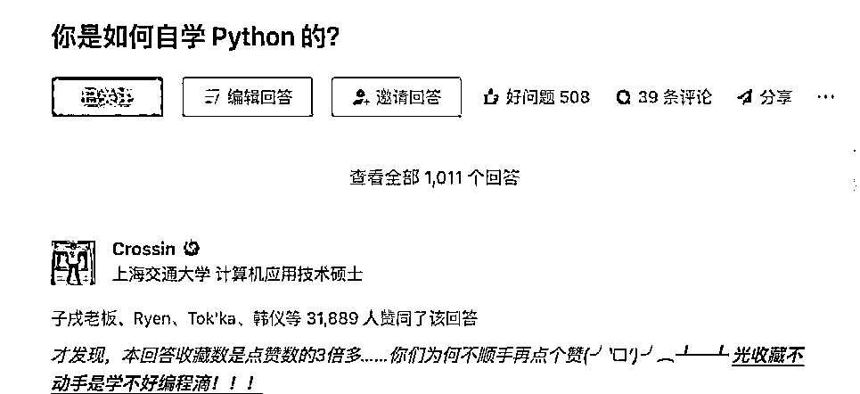

这是知乎上一个3w多赞的回答。这个回答不仅仅是曝光量大，更在于早期在百度搜索“自学 Python”的第一条结果就是这个问题，而我的回答排在第一，同时回答里又放了资源链接和公众号二维码。

在早几年，可以不夸张地说，我有80%的关注都来源于这一个问题。之前有机构想花几千块在我这个回答里加广告，我说你们太小看这个回答的价值了。

编程教室最早的一位合作伙伴是资深虎扑用户，早期去虎扑引流，导了不少用户过来。

所以编程教室最初的用户里面有相当比例的jrs。不得不说虎扑的流量真的是惊人，但在这种社区属性极强的平台引流决定是技术活，必须得是“自己人”才玩得转。我后来也去发过一些结合体育和编程的内容，比如这篇。

 

 

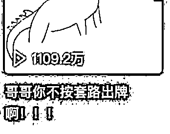

这是我前面提到的，刚刚接触抖音时做出的爆款，结合当时的两个爆款模式做了个结合的反转。但现在回头想，这个视频可能反而让我陷入了一个追求爆款的误区，以至于后来没能在编程相关的内容上踏踏实实地深耕，直接放弃了这块阵地。

这是一个结合冬奥会热点的视频（可能有不少人看过），当时属于无心插柳，结果成了全网爆款。不过可惜的是，这爆款并不属于我，而是我的代码被全网营销号给搬运了，总体播放量我估计几亿是有的。我个人这边，公众号一天涨粉了4k，B站后来发了一个吐槽抄袭营销号的视频涨粉也差不多3k吧。

 

 

这是去年转型视频后的一个小爆款。虽然数据跟早几年的抖音已经无法比了，但我觉得这个内容与热点结合的路子是对的。

公众号方面反倒一直没有特别的爆款出现，“10w+”是从来没有体会过，比较好的也就在2、3w这个水平，比如这两篇：

 

这一方面是公众号的机制所决定，另一方面也是我的内容还是偏“干”，不是走情绪那一挂的，很难产生二次传播。

 

 

# 三、收入水平

这可能是很多人会关心的问题。但其实这个问题的参考价值真心不大，因为自媒体的收益水平真的是千差万别，而且并不和流量完全正相关。

就我个人来说，最初几年是几乎没有收益的。后来在最顶峰的时候可以做到年入百万。

但这个百万其实是营收，其中还要算上课程研发和运营的成本。并且后来也没能持续。

如果把 2013~2022 看做一整个项目周期的话，整体收入大约是两百万。但从 2023 年往后看，我觉得我短期可能还恢复不到这个收入水平。

单从绝对值来看的话，这也差不多相当于一个打工人的薪资了。但如果我老老实实去大厂做程序员，显然是可以更高的。不过以我的性格，不喜欢领导别人也不喜欢被人领导。做自媒体最起码给了我这样一个机会，至于是不是能比找个厂上班赚更多，我只能说看缘分了。

# 四、我做对了哪些

能靠一个自媒体账号做到不上班，我觉得这中间还是做了一些正确的事情。

**1. **踩上了公众号和知乎的风口，包括知识付费的风口。这有很大的运气成分，但运气偏爱有准备的人，如果当时没有积极去尝试，风口也只会从面前吹过而已。

 

 

**2. **持续输出。虽说是风口，也还是等了好几年才算是起飞。这期间不管频率高低，始终也还是在更新输出，这点也是后来能随风口吃到红利的重要保证。另外，出爆款内容其实是一个概率事件，你只有不停更不停更，基数够大，才更有机会出爆款。说实话，我的公众号运营算不上激进，内容也不是多独特，主要还是靠写得久。

**3. **冷启动寻求外部助力。很多人尝试自媒体，都停在了最初的冷启动阶段，因为每次辛辛苦苦写完文章发出去，只有个位数的阅读，这样想继续坚持是很难的。前面说到，早期的大V推荐，还有虎扑上的引流，让我很快就跳过了这个阶段，我基本上算是直接从500粉丝起步的，这样创作体验就好多了。

**4. **从用户的角度思考创作内容。写公众号也好，做视频也好，是要给别人看的，跟我们自己平常发个朋友圈不一样。我会比较注意不同内容的数据情况，以及做一些问卷，调整内容方向。最终我是把内容定位在偏初级、短篇幅，要么得有趣、要么得实用这个方向之上。

**5. **专业内容结合热点。现在“蹭热点”几乎是自媒体的基本功，但在早年其实并没有太多人意识到这个概念，至少我一开始是不知道的。但在运营的过程中，我自己也慢慢摸到了这个门道，做出了几篇还不错的内容。

**6. **完整的变现闭环。我因为自带开发能力，所以在最开始就自己搭了教程网站，后来在其上做了付费课程和学员系统。所以从内容中的钩子导流，到公众号里的文章转换，再到后续的课程服务，整个过程我是可以自己掌握的。即使在市场大环境不好的情况下，一样可以有靠谱的变现途径。

# 五、我做错了哪些

 

 

讲了做对的事情，再来谈谈做错的或者说错过的事情。当然，所谓做错也只是一种假设，也并非那样做了就一定会更好。

**1. **流量**(**内容**)**、变现**(**服务**)**都想做。前面做对的事里面提到完整的闭环，但反过来看，这个闭环也在一定程度上阻碍了我的增长。个人做自媒体精力有限，什么都想自己来，相当于牺牲了一定的增速来换取稳健。如果把这部分时间省下来都投入在内容创作上，可能性价比会更高，说不定可以再上一个流量台阶。

**2. **过早谋求团队化。团队化运作不是不行，只是对于我的情况来说不适合。同上一点一样，在这方面牵扯了大量的精力，最后效果却不及预期。也许是缺一个互补的合伙人吧。

**3. **没有尽早转型视频。很早意识到视频对于图文的替代，但却没有像当初积极尝试公众号、知乎时候那样去积极转型视频。不过必须承认，视频的门槛确实是要大于图文的，尤其对于我们这种习惯文字写作的人来说，面对镜头是非常需要勇气克服的一件事。

# 六、对新入局者的建议

前面都是在啰嗦个人经历，如果听建议直接看这里就好。但因为我的建议都是基于自己的经验，所以看了上面那部分你会理解我为什么这样建议。

我先帮各位理一下我认为做自媒体的一些选择：

 

 

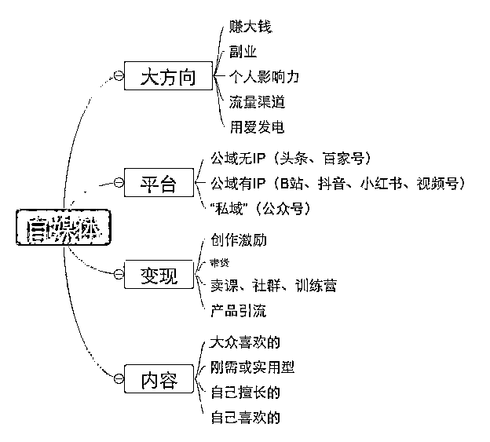

一部分建议是围绕上面这些选择的。

**1. **首先想清楚为什么要做自媒体，大方向的不同决定了你策略上的不同。做自媒体是一件门槛很低，同时天花板又很高的事情。听上去不错，但另一方面，通往天花板的路非常拥挤，且越来越挤。

如果你是本职工作干得不爽，想裸辞全职做自媒体赚大钱，那我要泼你盆冷水。目前来说，好做的时间窗口已经过去了，如果你不是有过人天分，是很难出头的。

 

 

但如果你是想开拓副业，多一种尝试，那我是强烈推荐的。我这两年就间接帮助了一位朋友成功转型自媒体。但请记住：不要辞职！不要辞职！不要辞职！想做就先做起来再说，立刻就做，今天就去做。如果你说不辞职就没时间做，那相信我，你辞职了很可能也更不了几期。等你做到稳定更新之后，再考虑是不是要全职做。

就算不能做成一个能赚钱的副业，只是通过自媒体来输出个人的专业知识和独家观点，对于你的职业发展也是很有帮助的，往往会给你带来意想不到的机会。

另外一种很适合做自媒体的情况就是，有现成的生意，通过自媒体来宣传和获客。在当下这个阶段，我觉得做纯网红大V是很难了，但是把自媒体作为一个专业性展示渠道是很有机会的。现在很多平台的流量机制也在往这方面倾斜。举个例子，你开了家饭店，然后你再做个自媒体，你想纯靠自媒体养家可能不容易，但认真做点美食相关内容，把你店的销量翻一倍并不是难事。如果你的业务可以线上进行，比如培训、咨询、卖保险之类，那效果就更好了。

当然不排除有人做自媒体是出于兴趣，为爱发电，那这个也就不需要我给建议了，做得开心就行。

**2. **发布视频肯定是几个平台都同步更新，但风格上需要有所侧重。新手建议优先从** B**站、抖音、小红书** **中选择最适合自己风格的。这几个平台都会有用户推荐机制，即使冷启动，坚持更新一段时间，通常都会得到反馈。并且这几个平台是有IP这种概念的，你做得好，别人会关注你，追更，慢慢积累粉丝，良性循环。

头条这种重内容轻IP的平台，适合批量做营销号。公众号我把它归到“私域”，这个说法不严谨，但我是想表达，它是没有公共推荐流量的。不过目前似乎公众号机制有些改变，也开始重推荐了。但毕竟图文是过去式了，除非你文字功底真的很强，或者实在无法做视频，才考虑公众号。现在的公众号，因为平台规则相对宽松，更多是作为最终变现的渠道。

 

 

**3. **你的内容要和你的大方向、你的变现模式相一致。如果你是拍搞笑短剧，虽然受众广，可以流量做很大，但多半只能靠内容激励或者直播带货变现。如果你做专业内容，比如像我一样的编程教学，那注定流量不会很大，但来的都是垂直细分用户，给他们提供需要的服务，可以做到更高的客单价。

还有就是前面说到的，你有自己的生意，那就容易多了，只要吸引到潜在客户就OK了，他们会主动联系你的。

如果你想在抖音卖课，但天天跟风拍一些搞笑段子，那即使出了爆款也没有价值。做垂直内容的不用羡慕别人的爆款，他的十万播放可能只带来几十块钱收入，你的十个播放说不定就给你带来一个高价值的客户。

4\. 前面也说了，做内容是要从观众角度来选择内容。但我还是要反过来说下，如果自己都不喜欢自己做的内容，也是很难做下去的，至少你得不讨厌吧。所以一个理想的方向，是用户需求（可能是爱看也可能是实用）、自己擅长、自己喜欢这三者的综合。如果不能兼顾，至少取一个可接受的平衡。

**5. **最后，在做自媒体的心态上，尤其是新手的心态，要做到：先做起来再说，然后坚持、不要脸、坚持不要脸。

做自媒体不需要什么准备，你今天想做就可以立刻去做。如果你不放心，就先拿个小号去做，边做边想边调整。如果你觉得我要怎样怎样之后再开始，那要么你的想法有问题，要么你就是在给自己找借口拖延。很多事情，预先设想的和实际情况会有很大不同，不亲自动手做一做你不会切身体会到其中的细节。有人会完美主义，觉得我这个视频做得不够好，我不想发，我得继续改，甚至重新拍、换选题。对此我送一句话：永远在下一条视频里改进。一条视频，做好了就发，发出去就是最大的成功。

 

 

坚持不必多说，大家都懂。但很多人会在潜意识上忽略坚持的作用，更多的归因到能力、环境、运气等上面。但在自媒体这条路上，坚持是第一位的，是其他各种因素的先决条件。如果你没有做够一定的量，其他的方法论都没有展现的机会。而另一方面又会低估坚持的难度。殊不知在初期缺少正向反馈的阶段，放弃实在是太容易了，可能今天加个班，明天朋友喊你吃个饭，你就彻底断更了。

我之前跟一位想要尝试自媒体的朋友说你得不要脸的时候，她不出意料地想歪了。确实现在网上有大量“不要脸”的内容，但我不是说要做那种，而是即便你正常地去写文章表达观点，拍视频做节目效果，都难免会面临镜头恐惧，感到尴尬。这种尴尬再配合上寥寥无几的播放数据，对新手的打击几乎是毁灭性的。这时候你就得硬着头皮上，别管那么多，继续更。

我们过去接受的教育给我们一种凡事只有一次机会的错觉，觉得一旦出错了就可能带来很大的问题。但在自媒体上，我觉得不存在，至少对于新手不存在。只要你别做什么违法违规的内容，尽管放手去试吧，不停地更新，你会在更新中不断找到感觉，而不是在纸面的学习和思考中。

评论区：

伟业 : 一直在关注老哥的公众号和知乎，好多年了

Crossin : [抱拳]

书豪 : 和crossin老哥也合作很多次了，2019年就在一起搞公众号  爱飞的鱼 : 谢谢分享，收获不少！

亦仁 : 编号33的元老级圈友了

小新 : 正准备起号，非常有收获，感谢！

米斯特 LIu : 感觉是位有能力的佛系老哥😂

Crossin : 豪哥现在矩阵号风生水起[强]

# **# ****(**精华帖**)(270**赞**)**血与泪，我的十年创业故事

 

 

作者：  老胡

日期：2021-09-01

圈友们，大家好，我好久没在生财有术分享了，主要还是我今年事情多，内容产出太少，这段时间我花费了半个月的时间写了一篇10年创业血泪史总结，发出来和大家一起分享下我花费了几千个W总结出来的一些血泪教训和经验，希望对大家有帮助。

一、前言

实话说从去年开始我都想写一写这些年的创业总结回顾，不过那个时候创业才9年，我想等到创业10年的时候再来总结下我那些年关于创业的血泪史。一方面是给自己10年创业小结复盘一下，另一方面也可以给大家一些参考借鉴。

到今年的7月1日我算正式从返利网离职创业10年了，原计划这篇文章应该是在6月底写完，然后准备7月1日那天发出来的。可是那段事情心情烦躁，具体是什么事情这里也就不说了，反正就是无法安下心来静静的写点东西。

于是一拖再拖，然后就拖到了现在，一转眼这都9月了，如果再不抽时间写出来，估计这篇文章很大概率会流产，因为这个选题在我的日程表里一而再、再而三被延期。

前段时间我看到曹大(caoz)写的一篇关于创业的10万+爆文，感慨良多，估计不少朋友都看过。

曹大在文章的开头写到“十年前，我一直在鼓动别人创业。5年前，我会注意区分什么人适合创业，什么人不适合。而现在，基本上，我会试图劝退每个想要创业的人。为什么？因为时代的机会窗口，越来越小，而创业的机会成本，越来越高。没看过的建议看看曹大的 ”还在做创业梦？醒醒！“ 这篇文章。

 

 

我自己也走了10年的创业路，也算的上是个老油条了,做了这么多年创业狗，前前后后干了不少项目，砸进去了几千个W。所以身边经常也有很多老朋友和年轻的朋友咨询我，说他们想出来创业，让我给一些建议。

绝大部分情况下我都是劝退，只有极少数我认为他真的很强，有资源、有积累且时机等各方面都合适的那种我才会去鼓励。有时候去劝退那些人可能还会导致他们还不理解，以为我不希望让他们“暴富”。

直到他们自己真的投身创业被毒打后，就会经常找我来聊天“老胡你当时给我的建议很好，但当时听不进去啊，有点后悔了”。

我说很多事情你没有身受是无法感同的，把这段经历当做人生的修炼也挺好。其实创业这2个字听起来很高大上，但是等到你真正的投入进去以后，才发现这2个字代表着什么含义。

创业不是什么高大上，不是一路非常顺利的从天使到A B C轮融资，然后IPO上市，接着买上大别墅，迎娶白富美，走上所谓人生巅峰。

不管以前你的职场履历多牛逼，自从你开始创业开始的那一刻就进入了一个茫茫的未知领域，需要你趴在地上匍匐前进。还可能随时遇到雷区导致你直接挂掉，所以战战兢兢、如临深渊、如履薄冰、时常焦虑、彻夜失眠都将是你的生活常态。而且大概率将会是创业不成一场空，输掉了你的全部（包括自信心），严重的甚至还会妻离子散。

我相信以上这些话但凡真正独立创业过的，尤其创业5年以上，真正亲自操盘从0到1做出过一点点成绩的创业者更加深有体会。

 

 

所以我这篇文章没有华丽的辞藻，也没有需要增加转发量而去写煽动你创业的激情文字，更不会去吹牛逼和装逼。而是真正把我这10年的一些个人创业血泪史和小经验总结和大家分享下，都是实打实的个人经历和心路历程。

因为本文内容比较多，所以我分成6个模块来展开，分别为：

1、前言；

2、我和电商的结缘及3次小型创业经历；

3、创业干“返利邦”时期；

4、创业干短视频导购“玩好货”时期；

5、创业干社交代理淘客“兔子优选”时期；

6、后记；

废话不多说，下面正式开始写。

二、我和电商的结缘及**3**次小型创业经历

 

 

在正式写我的10年创业经历之前，还是先讲讲我和电子商务的结缘以及我的三次小型创业经历，因为这几次创业对我的认知提升也有非常大的帮助。

我和电子商务的结缘起始于2004年我在北京工作的时候，那时候我刚从学校出来，去了北京在一家卖牧羊犬的老板家里帮他做网站，是个私人小企业。

我至今记得他家位于朝阳区的楼梓庄，家里养了200多条牧羊犬，最贵的一条名字叫“威士忌”，是从德国进口的，当年花了300万。

2004年的300万对我来说真的是一个天文数字啊，而这条尊贵的“威士忌“就住在我们老板家的别墅车库里，每天24小时有专门的人来伺候。

可能你会问，为什么一条狗要这么贵，因为这条“威士忌”的爷爷、奶奶、外祖父、外祖母都是获得过国际大奖，我也是那时候才知道狗也是要讲究血缘关系的。

我在他家负责网站的运营和维护，说简单点就是每次他们请摄影师帮这些牧羊犬拍摄好了照片以后，由我来处理这些照片并发布到网站上去。然后在维护下网站的论坛，因为大量的买家和需要配种的人都是通过网站了解情况和通过论坛进行留言交流的。

平时事情真的很少，甚至有点无聊，不过日子过的还挺舒服的。

舒服到什么地步呢？我的办公室在老板家的大别墅里面，衣服有保姆给我顺便洗了，吃饭和老板一起每天有专门的厨师来做，最大的缺点就是极度的无聊，每天就我一个人在他家办公，缺少交流和学习的氛围。

 

 

（牧羊犬老板家的大别墅）

所以我没事就上网看新闻学习，我至今记得在2004年的12月底，我看到了马云荣获“中国经济年度人物”的称号，我当时看到马老师讲的那些话，真是热血沸腾啊，我摘几条金句出来一起回忆下。

他说“如果马云可以成功，那么80%的年轻人都可以成功“、“蚂蚁雄兵可以战胜大象”、“男人的长相和他的才华往往成反比”、“今天你不电子商务，未来你将无商可务”、“平凡人也可以干非凡事”、“今天很残酷，明天更残酷，但是后天很美好。只要永不放弃，过了明天，我们也许就能见到后天的太阳”。

当我看完马老师的这些讲话以后，整个人仿佛都被点燃了，当时心想我一定要加入这家公司，只不过当时远在北京，身上也没什么钱，我一个人突然跑到杭州来，那也不现实，所以就没行动。

 

 

因为在北京待的太孤独（跟我一起去的同学大部分都陆续回家了），外加我也不适应那个干燥的气候，所以2004年底我就离职了。

回家过完年后，我就去了上海，本来我是想一个人去深圳闯荡的（那时候有点天不怕地不怕的感觉），但是家里人还是坚持让我去上海发展，因为我家好多亲戚都在上海，包括我姨和舅舅他们，那么去上海找工作就会方便很多，因为刚开始就住在他们家里，我都不需要考虑房子和生活的问题。

我去上海后找的第一份工作是在一个培训学校里当计算机老师，第二份工作是广告设计制作。虽然做的不是电商，但是我一直对电商保持着学习和关注，那段时间我每天都通过“电子商务世界”、“艾瑞网”等网站了解互联网和电商行业的动态。

然后在2005年10月份我就入职了一家垂直B2B网站做网站设计，后面转岗做了运营，同时我利用业余时间还兼职开了一个淘宝店，卖的是高仿大牌运动鞋，从阿里巴巴B2B网站上进货（今天的1688），然后在淘宝上卖，也就是今天大家熟悉的一件代发、无货源店铺模式。

刚开店第三天我就通过网络赚到了人生的第一财富，这笔财富是多少钱呢，是20块钱。

我至今仍然记得这个下单的客户是湖南怀化的，当时他在旺旺上咨询我以后，因为没有支付宝，还是通过邮政银行给我打的钱，当这笔交易结束以后，我兴奋了一周。

原来通过网络真的可以空手套白狼，赚到真金白银啊，正是由于赚到了这20块钱，让我对电子商务产生了浓厚的兴趣，从而改变了我后来的人生命运。

 

 

在2005年-2008年我都一直在淘宝兼职开店，其中2008年之前只卖运动鞋，2008又开了女装店（也是一件代发的模式），每个月通过这两个淘宝店能帮助我赚到几千块，在加上我上班的工资收入，日子还算过的去，农村贫苦家庭出身的我，还是蛮节省的，所以平时我也不怎么乱花钱。

在开女装店的时候，我发现了一个需求，就是大量的女性用户每天通过旺旺咨询我，问她们买了这件衣服以后应该怎么搭配。其实我一个钢铁直男啥也不懂呀，于是我都是复制过去问我的供应商，她们回答以后，我再复制发给客户，基本上就是Ctrl+C和Ctrl+V两个操作。

但是随着问的人越来越多，我发现如果做一个教女性穿衣搭配的网站应该很有前景，毕竟我一个小小的女装店每天都这么多人咨询。

后面就和一个干技术开发的朋友一起做了个女性咨询和购物的网站，当时我们那个网站的名字叫“女性部落”(ladybolo)，网站的内容都是我们从各大门户搬过来的，只不过我们会在网站的右侧配上文章中介绍的相似服饰鞋包进行售卖，而这些服装供应链的来源就是阿里巴巴B2B网站和淘宝上的一些大卖家。

 

 

（我们当时的女性部落网站截图）

当时我们两个也没多少钱，所以付费推广都没弄，那时候也不知道SEO这些免费获取流量的方法，唯一的推广方法就是去各个论坛发帖子。还有自己上传视频到优酷上去，然后在视频内加入我们网站的广告，流量来的也有，但是非常的少，始终没有起色，所以干了半年我们就给关掉了，这就是第一次创业做平台的经历。

虽然给关掉了，但是在2008年初我们这个网站还获得了上海互联网站长大会给我们颁发的“最佳草根创业之星”奖。

 

 

评委是原新浪网创始人王志东、大众点评CEO张涛、艾瑞网CEO杨伟庆、百姓网创始人王建硕等一众大佬，当时评选的理由是我们很好的把资讯和购物进行了结合，是一个很好的创业方向，也算是虽败犹荣吧。

后面一直到蘑菇街和美丽说诞生以后，这个时候我才觉得我们当时不应该选择图文的内容导购，而是应该直接采用读图的导购模式。

不过那个时候淘宝上卖家的图片都拍摄的很一般，没有什么模特出镜和专业摄影来拍，所以观赏感不佳，如果当时通过读图导购模式的话应该也做不好，但是这样会比较轻。

而蘑菇街和美丽说诞生的时候，淘宝上的商品图很多都已经非常的精美了，大量的店家也都采用了模特和专业摄影师来拍摄，所以这个时候采用图片导购的模式是非常好的。

一个商业模式如果大方向没问题，而产品的落地解决方案和当时的天时地利与人和也非常的关键，这个做过产品的人都应该身有体会。

当我们那个“女性部落”导购网站停止运营以后，2008年初我就和一个朋友去了广州。

干的是啥项目呢，就是通过淘宝网开店卖二手笔记本电脑业务，当时广州这块的产业链非常的丰富和发达，基本都是从国外弄进来的淘汰笔记本电脑，经过一番的硬件更换和修复后能变成一台看起来有7-8成新的二手笔记本电脑。

我们当时判定中国的网民伴随着互联网的发展一定会大幅度的增加，绝大部分人之前都在网吧上网，而后面一定是要自己买电脑在家上网的，所以电脑硬件的需求尤其是笔记本电脑的需求会非常大，我们要抓住这一波机会赚到钱。

 

 

正如我们所想的那样，生意每天都还不错，一天可以发几十台笔记本电脑出去。

但是面临的问题也很突出，那个时候淘宝上的竞争也很激烈，也没有任何的付费推广手段，我们只能靠把价格压低，然后依靠消费者在淘宝内通过价格筛选这样来做到搜索排名靠前，基本一台电脑的平均利润在200-300块钱。

看似有点利润，但是我们每次给用户发货的时候都要选择保价，又要额外增加几十块的成本。且大量的客户收到货以后，都来找我们询问，为什么说好的硬盘100G，他们那里显示只有80多个G，内存说好的512M，为什么显示只有475M等一堆问题，其实懂的人都知道这些都是正常的。

但是客户不懂啊，他们就是纠缠不休，我们只能又答应补偿几十上百块给他进行安抚。

这样算下来，一单利润差不多只有100块左右了。这还不是最严重的，最严重的是啥呢，经常有客户要求退货，当我们收到退回来的货以后，要不电脑就被摔坏了，要不就是一个空包，里面的电脑丢失了，这样的损失就太大了。

再加上各种库存压力，我们一次拿货的多，供应商就给我们价格更低，所以库存占比也不少，很多时候拿进来的货堆在那里又卖不掉，变成了成本。所以这样整体一算账，这个生意模型不成立啊，根本赚不到钱，结果我们干了半年多又给停止了。

最后我们就都返回了上海，我是7月份回来的，重新回到上海的那一段时间，我是真的感受到了什么叫创业不成一场空。

当时身上的全部现金也只有几千块，租完房子以后我身上就剩了几百块钱充当生活费，连一件像样的衣服都不敢买，后面还是找同学借了几千块才挺过来那段艰难岁月。

 

 

我那个朋友后面也回到了上海，不过他转型去卖女鞋去了，这个事情他一直做的也很不错，一年赚个几百万。

而我没有再去选择开店卖货，去了朋友公司干了半年多，2009年初又经过另外一个朋友介绍认识了返利网创始人Gary，加盟了返利网一起创业，继续在职场发展。

经过这三次的小型创业，可以总结的点还是蛮多的，其实我最早做的淘宝店生意模式就很不错，回过头来看这个事情是完全可以规模化复制放大的，而且还比较轻。

比如搞店群，在淘宝开几百家卖运动鞋的店，开几百家卖女装的店啥的，伴随着中国电商和淘宝的快速发展，一年能赚几千万、上亿都是可以实现的，后面天猫做起来了，如果再注册个品牌搞天猫店也是个不错的路子。

这些年很多赚到大钱的人都是在淘宝选择做无货源店群和大卖家呀，而我却TMD选择了搞平台去（这是九死一生的事情），错过了一次伴随着淘宝发展壮大的机会，至今我都认为这是我错过的最赚钱机会之一，不过那时候认知太局限了。

虽然嗅觉灵敏入局早，但是根本都没想到过这个事情可以这样放大干，我只是帮它当做一个副业玩着，说到底当时还是小农思维，没有什么认知。

还有选择卖笔记本电脑这种产品，遇到的各种问题，让我这么多年始终对直接卖货一直有恐惧心理，不敢去碰货，只是选择做比较轻的流量型项目。其实有时候是品类选择的问题，比如最近认识的一些朋友，他们在抖音上做卖货，就没什么售后问题，而且毛利润有50%以上。

三、创业干**“**返利邦**”**时期

 

 

经历过上面那三次小型的创业后，我就停止了三年，老老实实在职场好好发展，积累经验。大家可以通过我之前的那篇讲几个返利网上市背后的小故事，详细了解我那几年。

2011年的6月30日我结束了在返利网的最后一个工作日，7月1日就开始搬到上海宝山顾村那边的海宝创业园区开始了这次创业，创业项目是一个专注于做淘宝返利的网站，叫“返利邦”。

这次创业的初心很简单，主要是看好淘宝返利这个大市场，觉得这里面可以产生赚大钱的机会。

因为我在返利网工作那几年，我们主要都是围绕京东、凡客、唯品会、当当、亚马逊等众多B2C进行的返利导购，而当时占据电商90%市场的淘宝并没有开放相关数据接口，所以做淘宝返利没办法实现。

但是我深知如果淘宝能够未来有一天开放了相关数据接口，那将会是非常大的一个市场，我自己也一直在持续关注着。

为了验证我这个想法的靠谱性，期间我还做了一次小型的试验，那就是我自己创建了一个网站，直接调用淘宝联盟的相关频道，然后告诉用户通过这个网站去淘宝购物，购物成功后在网站后台提交相关订单编号即可拿到返利，其实这背后都是我人工来进行返利操作的。

最早的冷启动方式就是我在百度的贴吧里发了个帖子，告诉大家淘宝购物居然还可以有返利拿，发了几张返利到账的截图，然后简单介绍下网站。

 

 

通过百度贴吧的帖子，第一次发展了几百个种子用户，然后每一个注册的用户我都单独人肉发送了邮件，每次返利订单到账后我也都人工发送了相关邮件，那个时候并没有使用系统化的邮件模板，我都是人工在操作，精心维护。

后面我还开通了邀请好友也有奖励的功能，就这样踏踏实实的干，功夫不负有心人，也就才2个多月吧，轻轻松松就做到月佣金破5万了。

这个模式被验证后，一开始也没想过马上融资去干，还想着在继续测试一段时间看看，主要想有没有低成本、规模化放大的可能和增长方法。

但是在2011年某一个周末的下午，当时我还在办公室加班，一个认识多年的朋友QQ上问我“老胡，你要不要出来创业，我给你介绍投资人呀”。

就这样2周后我们在上海中山公园附近和那个投资人一起吃了饭，天使投资人基于对我的信任，一周后就签署了一份2张纸的简单投资协议，接着就有一笔投资款直接打入我的个人银行卡。

实话说当时出来创业内心还是蛮纠结的，因为返利网这边刚刚完成了A轮千万美金的融资，不管是薪酬还是相关福利待遇也都有很大的增长。

不过我当时纠结了2天，经过思考还是果断的选择出来了，当时想的是就算我创业没成功，大不了在回去上班好了，也许那个时候经过创业磨练过的我能力会更强。

就这样我带着投资人给的69万现金，外加我自己投了5万块，一共74万的启动资金，带着一个技术和客服，一共三个人就开始了草根的创业之路。

 

 

（返利邦早期的三人小团队）

当时为什么把办公室设置在宝山顾村那么偏远的地方呢，因为我那个技术开发住在那边。所以我就为了他方便，直接在那边附近的创业园区找了小小的办公室，办公室很小只能坐四个人，当然房租也比较便宜，每月1200元。

在那个小小的办公室里我们干了3个月，然后就换到了一个可以坐8个人的办公室，我们当时的目标是一年后可以进城，至少搬到地铁站附近，这样方便未来的同事上下班。

我们用一周的时间开发好了新的网站，把之前的种子用户信息导入，接着就开始了推广，刚开始我们只是增强了邀请好友的功能，通过这个实现了前期的裂变增长。

 

 

后续经过一个朋友的介绍，我当时找到了一个微博的草根大V合作微博推广，本以为只是尝试下，没想到那天中午那个博主把我们的广告一发出来，流量太大直接把我们的服务器搞崩掉了，简直太吓人。

后面访问量变小了以后，我们看了下数据，一个注册用户的成本才2毛钱，一周后我们看到购买数据，一个产生购买的用户成本才2块钱，基本一周内都能回本，真是太划算了。

这一次推广直接刷新了我的三观，原来一个微博草根大V都有这么大的能力。

后续我就调整了投放策略，所有其他付费推广的渠道全部暂停，集中全部精力到微博推广当中来，但这个时候我们有个最大的技术问题一直无法解决。

那就是每次做微博推广时带来的高并发我们的服务器都扛不住，每次都会被瞬间涌入的大流量给搞崩掉。

而我们的技术在应对高并发这个问题上始终找不到解决方案，以至于我们每次投放都不敢大力的去推广，可以说技术的瓶颈直接影响着我们网站的发展。

这就给我带来了新的困扰，我们已经找到了规模化、低成本的增长方法。但是受制于技术的瓶颈，无法规模化推进。所以我就一直在想还是需要先解决技术问题，但是在技术问题解决之前，还是需要维持适当的投放，这样增长还会继续。

但是找到合适的技术实在是太难了，我陆陆续续的找了好几个PHP技术人员，始终没有找到一个特别不错的技术负责人，技术团队的整体实力还是非常薄弱的，后续的一年内都没找到合适的技术负责人来替我扛起这个重任。

 

 

于是我们就这样慢慢的发展着，我们这个项目的初期一年内也只是投入了15万，就获得了1000万+年佣金的收入。

一直到2013年我才找到合适的产品负责人和技术负责人，来帮我们网站做了一次全新的重构，这个时候我们可以扛住大流量的高并发了。但此时外部的推广成本又上去了，一个注册用户的成本从2011年的几毛几块飙升到20-30块左右，实在没办法像2011年底那样的低成本规模化了。

所以我们此时把运营的重心放在了产品的迭代和优化上，希望通过产品的改进，加强用户的体验，实现新流量引入后的转化率提升，这样也能够降低我们的单个购买用户成本，这样做确实有效果，但是对整体的增长并没有很大的帮助，提升的只是一小部分。

后续我们网站在产品和用户体验的迭代上，包括各种数据分析上确实都做的很不错（这块就不在展开细说了），可以说基本做到了行业的前几名的体验。

不过这只是练内功，我们在更重要的用户增长上确没有很大的提升，期间我们也尝试了很多的渠道，但都是测试下来成本太高，没有敢规模化放大。

在此期间我们靠产品的驱动确实找到了一个还不错的增长方向，那就是我们在行业内第二家上线了单品高佣金的返利导购形式（网站频道叫超级返），通过建设BD团队，直接跟淘宝商家洽谈高佣金返利合作，说白了就是以高额返利模式做商品特卖导购，这个项目一上线数据就特别好，一个月就能干到佣金200万+。

 

 

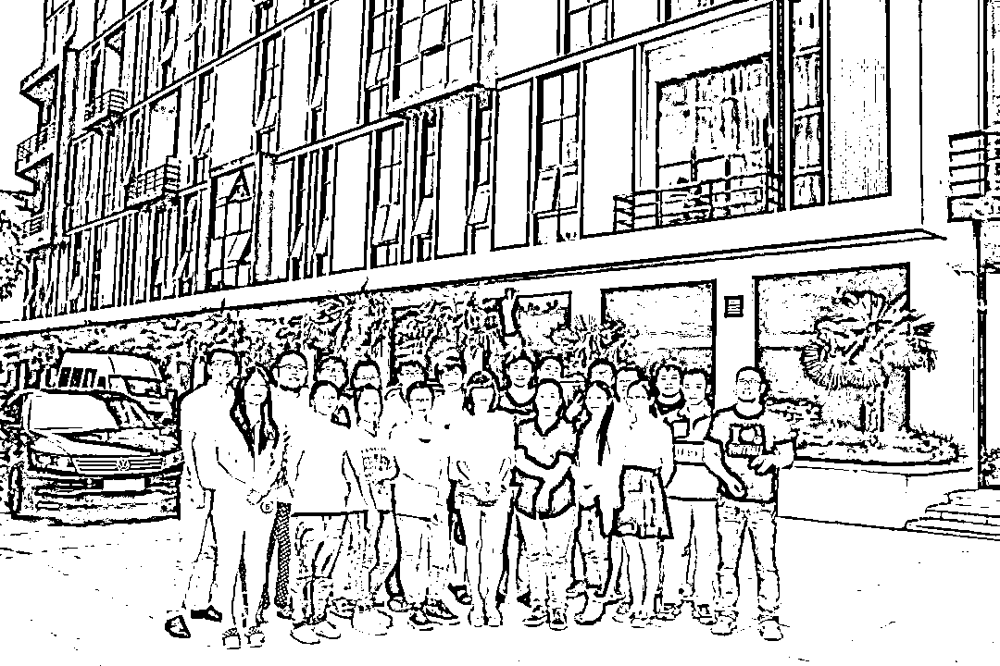

（返利邦当时的团队合影）

但是“超级返”频道上线后对我们的常规搜索拿返利产生了一定的影响，因为一些老用户看到这个频道的返利比较高，就通过这个频道进行购物，而降低了对我们搜索拿返利的使用。

因为那个时候我们普通搜索拿返利的毛利润可以达到60%，而超级返的利润只有10%，所以也一直没有去大规模做“超级返”这个频道，只是常规的当成提升用户粘性的产品在做着。

另外因为从2013年、2014年、2015年这几年淘宝联盟每年都会对返利网站做出了很大的政策调整，每一次调整都对我们来说是致命的打击，让我不敢大规模的在返利业务上投入，非常害怕投入的太多。

 

 

未来政策一改直接归零，当时做返利业务真的是很煎熬，能赚钱但是未来充满着巨大的风险和不确定性，犹如一把随时可以掉下来的剑，天天悬在我们的头顶上。

关于那段历史，大家有兴趣的可以读一下我之前写的那篇“老胡：白话版解读淘宝联盟506社交淘客新政”，在那篇文章中我有对那几年的淘宝联盟的淘宝客政策变化详细的描述过。

在2013-2015这几年在我们明显感觉到返利淘客业务的局限性和瓶颈，我们内部就开始尝试做了一些其他方向的项目，寻找转型之路，能拿出讲一讲的一共有三个小项目。

第一个就是2014年初，我们搞了个积分墙产品，这个了解过的朋友都知道，这个模式前些年也是大行其道很赚钱，这个产品是我们公司第一次从PC互联网开始往移动互联网转型，在此之前我们整个团队对移动互联网都没什么认识，纯粹的门外汉。

当时我们的返利用户本身都是比较喜欢贪小便宜的，而我们看到了在移动应用推广领域，积分墙产品还是蛮火的，也知道这个模式比较赚钱，本质上就是下载APP给用户返利的意思，业务模式差不多。

所以我们也就招了一些做移动应用开发的人来干这个产品，当产品开发出来以后，苹果市场居然出了个政策，那就是禁止积分墙类产品上线，真是个晴天霹雳。

对于我们第一次接触移动互联网的团队来说，当时都是懵逼的，我们无法在应用市场上架，那就代表着没办法去推广啊。尽管我们在上架的时候对应用的很多地方做了隐藏处理，但还是被苹果发现了，每一次上架后都需要等1-2周的审核，结果还是审核失败，整个团队都非常沮丧和迷茫。

 

 

如果不上架苹果市场，通过利用企业分发来下载吧，用户体验非常的不好，而且每个企业证书的下载次数也有限制。

如果只做安卓市场呢，利润率那又比较低的，我们当时啥都不懂，纯粹移动互联网小白，也不知道如何突破，各种突发的情况，我们也解决不了，其实是不知道如何去解决，所以3个月后我们就放弃掉了这个项目，只保留了安卓应用在那里维护着。

我也是后面才知道，当时其他公司也在干这种产品，有的是通过公众号在干，有的是通过企业证书在干，但是需要大量的去购买企业证书，总的来说还是很赚钱的。

虽然我们积分墙产品没有做起来，但是在做这个产品的过程中我认识了一个朋友，他们就是干这个产品做到了国内头部，因为这次结缘，后面我们之间还发生了一些故事，这个后面我会写到。

第二个就是2014年中旬O2O比较火，我们也跟风做了“趣健身”，希望把健身房那个年卡的模式改为次卡，但是这个模式除非只有自建健身房，否则真的运转不下去，我们也只是投入了少量的资金，后面就停止了这个项目，关于这块在我去年写的那篇减肥的文章中有过详细的阐述，有兴趣的可以去我的公众号“老胡地盘"读一下"不运动一月减肥15斤，我是如何做到的？"

第三个是2015年初，我们看到微信朋友圈的巨大价值，我们做了个公众号，叫“蚂蚁差事”，给用户提供兼职转发广告赚钱的服务，也就是只要你转发了我们对应的广告文章，你的朋友圈只要有人浏览了，你就可以根据浏览次数赚取对应的奖金，这个模式其实有点类似于后来的“趣头条”。

只不过我们当时把每一篇广告都包装的具有一定可读性的文章，来帮助客户进行推广，这个产品一推出来效果也非常好，用户量增长非常快。

 

 

随之而来最大的问题出现了，那就是狼多肉少，用户每天大量的涌入，而我们的广告主却非常的少，当没有广告主的时候用户就没广告可以转发，没钱赚，这个非常的蛋疼。

当时我们自己也没有专门的广告销售团队，为了解决这个问题，我还专门去找到了好多广告公司，包括一些大的4A公司。希望从他们手中接一些客户，来提供这种朋友圈广告的转发服务，但是广告公司们对这个没什么感觉，当时他们主要是做品牌广告的投放为主，对这种CPM的业务接的少。

后来这个项目我们又是干了3个多月，广告主的供应跟不上，导致用户也慢慢的流失了，这个项目也随之在内部停止了。

后面一直到我看到“趣头条”发展起来的时候，2016年我和趣头条的董事长谭思亮聊过以后才恍然大悟。

同样是做信息分发，同样是让用户看广告赚钱，但是“趣头条”就比较聪明，直接选择做一个独立的APP，然后提供新闻服务，通过在新闻中间嫁接相关的各种广告，接着再把这些广告收入当做资金池来对阅读者进行对应的阅读激励分配，最终做到了在美股IPO上市。

这样做的好处就是不会出现我们当时的那样狼多肉少，因为新闻是每天都永不枯竭的，用户每次都可以通过浏览新闻赚钱，而这个钱也来源于广告收入的资金池，同时接了包括各大营销联盟在内的CPM广告，也自建了广告联盟对接其他有CPM需求广告主，这样就比较靠谱了。

讲到这里我在穿插个话题，前两年我也跟很多模仿趣头条模式的新闻类APP创始人聊过，他们当时也是做给用户看新闻赚钱，不过没有对接广告主，就是直接跟百度联盟合作，从百度联盟的每日分佣里拿出一些给用户做激励。

 

 

我当时说百度联盟不是佣金比较低么，那么给用户的分成也很低啊，他们怎么会使用？

我记得他给了一个能够让我信服的答案，说2015年之前确实是这样，因为那个时候上网的都是白领和年轻人，如果给的激励太少，他们就没有兴趣。

但是2015年以后大量的下沉市场人群和中老年都通过智能手机上网了，这部分人还是在意的，看个新闻每月赚个几十块、上百块还是有吸引力的，所以他们能做起来并且赚到钱的原因就是获取了大量的下沉市场用户和中老年用户群体。

就这样跌跌宕宕，在2015年7月份左右，我就和上面做积分墙时期认识的那个朋友聊天，当时他们发展比较快，每月的营收可以达到5000万+，而我们这边始终没有找到好的方向，来来回回搞了几个产品也没成功。于是我们就聊着要不要两家一起合并掉发展，就这样我们两家从合并最后谈成了全资收购。

在决定公司到底卖不卖那几天，我超级的纠结，如果卖了就会觉得不甘心自己这几年的付出，有一个做大平台的梦想，如果不卖呢独立发展也很艰难，挑战非常大。

那几天真的是茶不思、饭不想，我们创业过的都知道，一个平台或者一个公司从小做到大，都是跟咱们养育孩子一样，真是非常的舍不得，创始人对于项目的情感都是非常深厚的，而我本来又是个重感情的人。

经过几天的纠结后，我回归想了下自己创业的初心，当时出来创业为了什么？一方面是想做个大平台，能做到10亿美金级别，未来可以融资上市啥的；另外一方面主要还是为了赚点钱，让自己可以变得富有一些么，我也不是那种非要追求大富大贵的人，只要过的是中产小康的生活就行了。

 

 

所以这么想了以后，就果断做了一个决定，签署了协议，同意把公司卖掉了，拿到一笔当时看起来还算不错的钱吧。

后面的事情就比较简单了，在2015年9月初，他们完成了对我们的全资收购，我和团队也都从宝山搬到上海外滩那边一起办公,不过我们也是独立的办公室。

（收购后我们位于外滩旁的独立办公室）

今天回过头来看，当初做了那个决定也是没有错的，因为在2016年淘宝联盟针对返利淘客又出了一个更具打击性的政策。这个政策在我们业内叫619新政，因为是2016年6月19日推出的，我在之前写过的文章也有描述过，感兴趣的可以自己我的公众号“老胡地盘”翻翻看“老胡：白话版解读淘宝联盟506社交淘客新政”这篇文章。

 

 

至此我在返利邦时期的创业故事算是基本讲完了，那几年应该是我个人成长比较快的几年，今天回过头来看，很多都是可以一眼看穿的常识型东西，只不过当时的认知有限，身在其中不知道而已，这里也可以简单总结下。

一共有6个可以总结的点或者坑吧，分别是：

**1**、对流量红利和窗口期完全没概念；

比如在2011年我们微博推广的时候，一个注册用户的成本只有2毛钱，一个购买用户的成本只有2块钱，我居然当时对窗口期和流量红利期的感知不明显，对每次推广的ROI卡的比较严格，追求极致的性价比，在做市场推广决策的过程中还想着红利期可以很长，我们还能够细水长流，今天来看简直是笑话。

**2**、做平台技术团队要足够成熟，能够支撑；

这点也非常的关键，我们当时处在流量红利期和窗口期，每次推广的时候居然因为流量太大，次次都把服务器搞崩溃了，而短期内也没有找到合适的人员来解决这个问题，以至于我们在微博流量红利期推广中非常的掣肘，错过了低价规模化发展用户的好时机。

在比如我们2012年双11的时候，整个服务器奔溃了近1个多小时，大量的用户无法下单购买，在应对高并发的过程中，我们的技术团队非常的不给力。

所以总结是做平台呀，不管你是面向C端还是B端，尤其是有大流量高并发的业务，一定要有足够强的产品和技术团队来支撑。

 

 

**3**、敢于打破行业规则，极致的优化用户体验；

这点体验也很深刻，2012年初，一个用户跟我们反馈，说某同行1块钱就能提现了，而我们还需要满10元才能提现，希望我们能够也优化到1块钱起提现，但当时我深知，这种做1块钱就可以提现对资金的占用和消耗是巨大的。

当时其他的同行都是50元或者100元才给提现的，所以我们设定为10元起提现已经是相对低的标准了，但是这个新的网站，居然敢搞1元起提。

因为我们这些返利网站都是给用户在确认收货后就可以提现，其实这个提现的钱都是我们平台方自己提前垫付的，淘宝联盟给我们结算的话需要到次月的20号以后，如果全部给用户1块钱就能提现，那么在伴随着平台的快速扩张，这对现金流的消耗是很恐怖的。

但是某同行就这么干了，由于大量的用户对这个平台是否能真正返利一直存在怀疑，所以他们解决了这个问题，让用户收到货以后，马上就能提现，这种体验非常好，以至于后来变成了行业头部的网站。

直到几年后我和他们的创始人共同参加个活动，一起吃饭的时候聊到这个事情，他说当时他们的资金垫付压力很大，他个人找朋友借款了千万现金来支撑，听到他这么说以后，我还是竖起了大拇指，深深的佩服啊。

他们网站当时非常的简单，基本就是一个搜索框，核心就是做到了给用户的返利金额足够高，用户提现门槛足够低。然后在配合强大的市场推广能力，就可以快速起量，所以找准核心关键点，用户体验做到极致，同时敢于打破行业规则，对我们面向C端的平台来说无比重要。

 

 

这点希望大家以后在做平台的时候一定要记住哇，找到影响产品增长和转化的核心关键点，进行极致化的优化迭代，让用户爽到爆炸，你就可以脱颖而出。

**4**、找到靠谱的合伙人，哪怕只能做到你的**70**分；

这个点也是至关重要的，我从返利网离职的时候没有带走一个人，都是我从外面找的2个小伙伴，但是没有找到一个靠谱的技术合伙人，以至于我们前期技术是阻碍我们发展的关键点。

同时做市场工作，都是我自己在亲自操盘，非常看重每一次投放的ROI等，后面也面试过一些人，总体感觉都很一般，达不到我满意的程度，所以这个活一直都是我在干，导致了我个人因为精力有限影响了整体业务的发展。

总结创业还是要找到价值观一致，能力足够互补的合伙人或者负责人，哪怕他只能做到你的70分，你也需要把某一个块的工作让他负责并顶起来，我们作为CEO的才有时间出去学习碰撞，提升自己的认知和思维，这样才能回到公司反哺业务，否则创始人的认知就会阻碍企业的发展。

**5**、做平台不能只看净利润，关键还是看现金流；

这个点也是我后面总结的，当时我们做“超级返”频道时，佣金增长非常快，但是毛利润相对低，甚至影响到一部分我们的自然搜索返利，从而降低了我们的利润，所以一直没有去大搞。

但是反过头来看返利网那几年依靠做这种超高返利导购，一年能干到20亿+的佣金收入，且也不是所有的用户都会来提现，这种情况下虽然看起来利润率比较低，但是现金流非常好，现金流一旦多起来我们在经营当中的操作就会有很多可以调节的地方。

 

 

因为只要现金流好，哪怕利润率很低都能支撑我们干很多其他的事情，这点在京东的发展过程中体现的非常明显，京东早些年快速发展的时候，虽然一直没有盈利，但是由于和供应商之间的结算账期，手上的现金流非常充沛，可以利用这些现金流做很多事情，后面京东还把这些现金流反过来做供应链金融给商家提供贷款服务。

**6**、业务瓶颈期，转型也要围绕核心方向探索；

大家通过我前面的描述就看出来了，我们从2014年开始到2015年期间，内部陆陆续续做了好几个创业项目，但是都没有做成功，最大的问题除了我们的认知以外，我觉得还是在转型期没有围绕核心方向来探索转型，而是去搞了积分墙下载、O2O健身、看新闻赚钱等项目去了。

别的团队之所有能够在这些方向上能做成功，那是因为他们团队本身之前有一些相关的积累，而我们对那些行业都是单纯的从表面上看懂了，但是遇到一些实际问题的时候都不知道怎么去解决，甚至无法解决，所以我们就做不下去。

如果当时我们围绕淘客相关的业务来转型，比如做基于QQ群的社群淘客，或者继续恢复和发展“超级返”，甚至在招商淘客上深入去做，都可能做的还不错。我们当年是淘宝联盟第一批开放了“鹊桥”权限的合作伙伴，也就是后来招商团长的早期产品，因为在核心方向上我们都会比较懂和熟悉，但是跨界了我们就是小学生。

四、创业干**“**玩好货**”**时期

 

 

2016年的元宵节过后，因为我还是想独立创业，所以在年前就和收购方谈好了，等全部交割完成后我会离开，但是我不会带走一个人，原有团队全部保留以保持项目可以继续推进发展。

在相关收购工作全部交割完成后，我一个人从办公室出来，在电梯间等电梯的那一刻，内心中并没有任何的窃喜，也没有什么完全放松的感觉，而是充满了很多的失落。

创业4年多，所有过往的画面如同电影片段一样在脑海里不断的闪过，回想这几年创业到底得到了什么？

只不过到头来我只是拿到了一些现金而已，其他好像也一无所获，而这些现金也还不能够让我实现所谓财务自由，还是要重新创业，又要从0开始了，那种感觉非常的不好，内心中还是充满着大量焦虑和失落的。

可能很多人不理解，以为我太凡尔赛，创业项目顺利被收购，你拿到了还不错的现金，这时候就是应该吃吃喝喝，出去旅游啥的，应该过的很爽才对嘛？

其实真的不是，我是那种不想也不能让自己停止下来的人，我需要一直在路上奔跑着，尽管这样还是会让自己陷入到创业的无尽痛苦当中去。不过在我内心来看，真正的成长和修炼不应该天天花天酒地、夜夜笙歌，而是应该过的苦一些才是对，正所谓人间正道是沧桑，这样才有安全感和归属感（也许我就这苦逼的命吧）。

我还年轻，暂时不想过那种退休的生活，一旦停止下来我就感觉自己和主流社会脱节，会和朋友们慢慢没有共同语言，自己也会对很多东西变得没有体感，同时我认为自己还有无限可能，所以必须要继续折腾。

 

 

那段时间具体做什么东西，我也没想好。所以我离开后的那段日子，每天都是看看书，跑跑步，顺便减减肥，本来还计划去报名学个英语啥的，因为我想未来去美国自驾游，那么学好英语那也是必须的，所以我并没有急着找寻项目马上开始下一段创业，只是让自己先阶段性的调整调整，然后同时也在关注者外界的一些新机会。

2016年3月1日我在家看到了天猫举行了商家大会，在会上阿里集团的CEO逍遥子说随着4G的普及和通信资费的降低，未来的机会属于短视频，阿里会持续推进短视频在电商领域的应用。

这个短视频是未来的说法我超级认同的，看完这个大会以后我非常的兴奋。

我们以前做返利导购，做了那么多年都是围绕着图文进行，消费者的感知很有限，纯粹靠价格优惠的刺激去吸引用户下单。而现在如果我们能够通过短视频带货，那么不仅可以360度对商品进行展示，还有专门的人员出镜，通过短视频对货品全方位介绍，让消费对产品的感知能力更强，在短视频这种场景中带货的转化能力一定会超越我们过往图文的。

说干就干，马上和一个在宁波创业的朋友聊起了这个项目，他也非常的兴奋，于是他就把他自己在宁波的公司关掉了，直接搬到上海我们一起创业干短视频。他来负责整个产品，加上我们还有个合伙人也辞职加入，负责整个技术，这样算下来三个人的核心团队很快就建立了。

接着找投资人，聊了我们这个创业方向，我们当时啥都没有，只有3个人和这一个大概的方向，按照2000万人民币的估值融资了200万（出让10%），加上我们自己投入的一些钱，总共有接近300多万的启动资金。

 

 

这次创业我们并没有一开始马上租独立的办公室，而是选择了在选择了联合办公空间，用的是杨浦区长阳路的优客工场，办公室找好后我们马上投入到产品的规划和开发当中去，产品名字叫“玩好货”。

本来我们想叫“好货”的但是相关域名被人注册了，所以我们只能改名叫“玩好货”，为此还专门花了5000块购买了wanhaohuo.com的域名（至今还躺在我的阿里云账户里），前期都是我们三个人在干，没有招聘员工。

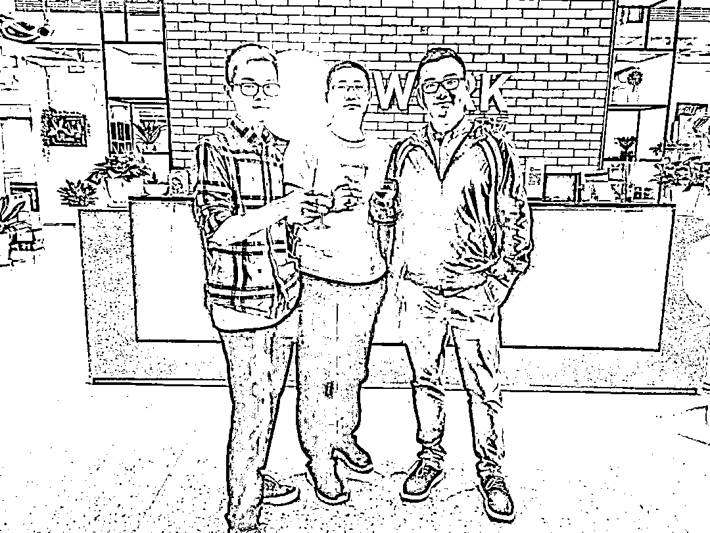

（我们三个创业合伙人）

等产品底层和后台开发的差不多后，我们就开始正式组建团队，最先招聘的分别是财务和人事。

 

 

这次创业我们准备要大干，当时规划的是半年直接融A轮，一年后融B轮，同时也总结了前面创业的经验教训，在我看来财务和人事这两个岗位无比重要，所以我们一开始就招聘了这2个非常重要的岗位。

大概在第三个月开始，我们的小团队就组建的差不多了，除了财务和人事以外，前期主要还是产品和技术团队为主，也有部分商务团队。

在这个产品模式当中商务部分的工作是非常重的，因为我们做的是独立APP的短视频导购，简单来说就是消费者打开我们APP看到的都是和购物相关的各种短视频导购内容。

然后看到合适的产品就可以直接在APP内成交购买，成交后我们在把相关订单信息通过接口传递给淘宝，由淘宝商家发货。这样我们就可以获得导购佣金，具体实现方案用的就是淘宝客的百川接口，如果懂产品和技术资深淘客应该能明白这套逻辑，太专业这里就不在赘述过多。

既然用的是淘宝客百川接口，我们就需要和商家单独去洽谈渠道专享价，让商家给我们的设置最低的隐藏折扣，这个和淘客渠道隐藏优惠券的模式很像，只不过这个不是优惠券，而是一个立减的渠道专享价而已，如果没有独家专享价的支持，消费者会觉得我们的产品价格和淘内相比没有竞争力，这就需要用到大量的商务人员。

还有一个需要用的商务人员的地方就是短视频内容建设，今天我们看到和购物相关的短视频全网到处都是，但是在2016年真的很少很少，那个时候淘宝的商家都还是图文为主，并没有商家使用短视频作为头图和详情页。所以我们招聘商务人员就是来对接达人和商家，找到淘宝上的商家洽谈帮他们拍摄短视频，但是不收他们的费用，他们需要寄送相关样品给我们的达人，由达人拍摄好以后在上传到我们APP内就行商品的关联，最后靠淘宝客佣金收入分成。

 

 

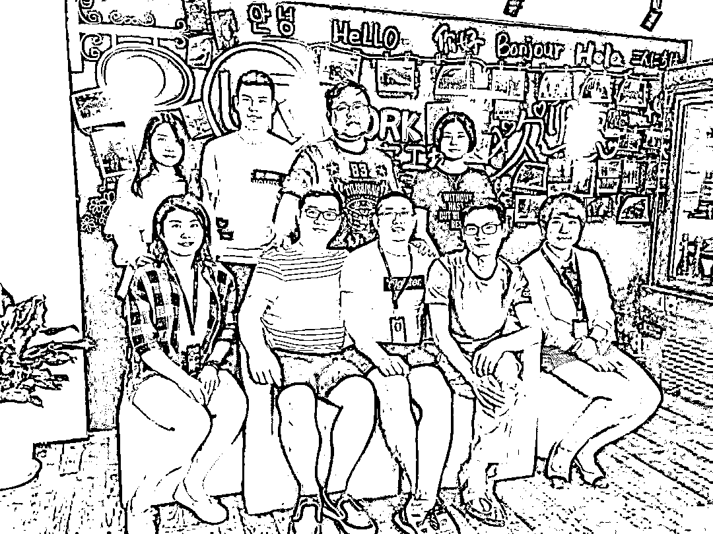

（玩好货早期小团队）

关于更多的过程我就不详细说太多了，直接说结果，然后说总结吧。

在2016年的年底，我们把这个项目给停掉了，项目结束以后，那段时间我自己开始有点轻度抑郁了，这种状态当时持续了2个多月，就是天天不想说话，对什么东西都提不起兴趣，对生活没有热情，每天都在深深的自责当中。

为什么会抑郁并不是因为亏钱，而是因为我们这次信心满满的创业居然不到一年就草草结束了。年初的时候身边所有的朋友都恭喜我成功套现后再次踏上创业征程，我们在做项目的过程中，一堆一堆的投资人找到我们洽谈投资合作（其实大部分都是打着投资的幌子来学习和请教的），让我们感觉这个短视频项目非常有未来。

 

 

同时我也对自己产生了深深的怀疑，觉得自己一无是处，为什么我们从理论上分析和认定，短视频电商是有未来的，而我们却做不成功，是不是我们自己的判断不对？为此2017年我写短视频创业总结的时候，也说过我并不认为短视频电商这条路不行，而是我们没有找到对的路。

后面为了让自己从那种轻度抑郁的状态中摆脱出来，我还专门去看了心理医生，其实她也没有给我解决掉这个问题。最后还是我自己去解决的，解决的办法就是我跑到海南去环岛骑行10几天，回来后整个人都变好了很多，有兴趣的可以看下我之前写的老胡的2017总结：我总算混过去了!

重点说说这次“玩好货”项目的经验总结吧。

**1**、看到的趋势是对的，但是我们入场的时机不对。

今天来看，短视频和直播带货都已经是全民参与了，是一个无比正确的方向。

但在2016年的时候这是一个大大的未知数，很多人都怀疑这个方向，虽然当时国内同期围绕电商搞短视频的APP也有10来个，而且很多都融资了不少钱，但是绝大部分都没搞起来，基本都转型了，我觉得不是我们看到的机会和趋势不对，而是当时的环境还不成熟。

那个时候连抖音都没诞生，淘宝商家都没有配置上短视频，而我们却来搞短视频导购，有点过于超前了。

 

 

就跟早期美丽说和蘑菇街一样，他们如果诞生在2008年也不一定能做起来，因为那个时候淘宝卖家的图片都不好看，也没有专门的模特和摄影师来拍摄，如果这个时候他们入场去做图片导购，那么也会出现没有好的图片素材，用户观赏感不佳，从而导致留存率和转化率不行。

由于整个时机不成熟，如果我们要去把做这个事情做起来，太多东西都需要我们自己去解决，这对我们来说实在太重了。

比如我们建设独立的短视频导购APP都已经很重了，我们还需要去解决短视频拍摄问题，还需要去寻找达人参与进来帮助拍摄，而这些达人的拍摄我们都是要付出成本的（当时给的200块/ 条）。

另外还需要解决选品的问题，找到商家洽谈，由商家提供样品发货给达人，达人在进行拍摄，同时还需要和卖家洽谈给我们的渠道专享价问题，最关键的去市场上推广APP做增长都是需要我们去解决的。

需要解决的环节如此的多，而我们是一个创业小团队，启动资金也只有区区几百万，根本不可能把这个事情做好。

所以在2016年底停掉这个项目在今天来看都是无比正确的决定，因为天时地利人和都不具备，创业真的不能只是看到趋势，还是要看到客观的市场环境是否成熟，相关的上下游产业链支持是否到位，否则我们只能当先烈、当炮灰。

**2**、独立做**APP**还不如嫁接到大平台上去做内容。

 

 

上面我已经讲到我们需要解决的环节非常多，当时如果想切入这个赛道，我觉得应该改变思维，不应该去建设独立的APP，根本都不需要去组建相关的产品技术团队，而是应该入驻相关平台去做内容，当时虽然抖音没有诞生，但是快手已经在下沉市场很火了。

如果我们当时转换思路，建设内容团队，然后入驻快手去做一些电商导购或者内容相关的矩阵号，这对我们来说就会比较轻。

首先不用建设独立APP，也就不需要大量的产品和技术人员。其次我们也不需要大量的BD去对接淘宝商家，而是招聘或者合作一些能做内容达人就行，最后我们也不需要去推广独立APP，而是在快手上直接推广相关账号获取关注就行，这样获取流量就比较方便。

这样后面2017年抖音诞生以后，我们就可以同步在抖音里面来进行这套操作，而且都是最早期的内容入驻者，可能会踩中这波短视频快速发展的红利，那么今天也许就是另外一个样子了，可惜凡事没有如果。

这个点能总结的非常多，今天做生意创业绝大部分情况下就不要去做一个独立的平台了，这种成功率真的很低，而是应该围绕大平台做相关的生态业务。

比如我们淘宝客这些人都是围绕阿里来做相关的电商导购业务，是伴随着阿里的大生态在发展。公众号、微商、社交电商、私域卖货包括各种微信内的工具和服务，都是围绕微信的大生态在发展，伴随微信的增长而增长，短视频和直播都是围绕抖音和快手的生态在发展。

所以只要我们认准了一个方向后，就直接入驻这些平台里面内去做就好了，伴随着他们一起壮大，我们事情做起来也会很简单和轻很多，因为我们不需要去解决那么多问题，而是专注于解决一个或者几个小问题就行，平台的大船在快速前进，我们就跟着乘风破浪就好。

 

 

这点真的是无比重要、无比重要、无比重要，重要的事情说三遍不为过。

**3**、纯粹的短视频电商导购是很难做起来的。

这个总结其实也挺有用的，因为我去年就想写一篇关于淘宝短视频相关的一些看法。

我当时和几个朋友交流，其实阿里如果当初看到了短视频和直播的趋势，不应该仅仅在淘内去做这个事情，而是应该弄一个独立的APP来做这个，而这个独立的APP不应该只是购物相关的短视频。

我们来假设下，如果阿里的战略部门在2016年看到短视频和直播的趋势，同时启动两条腿走路，一条就是围绕电商业务开展短视频和直播，另外一条就是单纯的围绕短视频内容这个战略方向来做，比如看到抖音这个APP，马上就让优酷团队也来做个事情，采用腾讯那种多个产品赛马机制，说不定也有机会做起来。

因为当一个用户进入一个短视频APP以后，里面全是购物和卖货的，其实没什么太多的浏览性，如果不是PGC专门制作的精良内容，用户是会很反感的。

我们“玩好货”APP当时的短视频基本都是UGC带货短视频，一条短视频的时长在3分钟左右，用户对着手机看三分钟一个人讲解某个产品的短视频，确实有点枯燥和乏味的，所以我们推广后看到的留存数据和转化率都不太行。

另外从浏览效率上来说，虽然短视频可以多维度看到产品的展示讲解，甚至也有人物出镜，但是浏览效率还是和图文没办法比，单纯的刷图文3分钟，用户可以浏览几十件商品。

 

 

从这个角度来看，今天的淘宝短视频和直播就没办法和抖音、快手对比，淘宝之所以能把短视频和直播做到这个体量，最大的原因还是因为手淘本身的流量比较大，且都是精准购物的人群，是这些本身有购物需求的人群在淘内浏览短视频和直播，短视频和直播是用来做转化提效的，你看淘宝之前也出了几个短视频和直播相关的独立APP就没做起来，本质上也是这个原因。

而抖音和快手本身就是泛娱乐类的短视频，用户进去看到的都是生动、活泼、有趣、长知识的内容，通过这些内容让用户产生依赖和沉浸，然后在切入一些购物类的流量对用户来说影响不大，反而觉得有趣。因为他们平时都喜欢看某个达人的短视频，对这个达人产生了信任，所以达人带货他们愿意购买。

但是从整体流量的分配来看，购物类的短视频和直播在抖音和快手上的占比还不是太高，我想他们两家都会对这块的内容展示都有相关的流量分配控制，否则会挤压常规内容的展现，对用户浏览体验造成巨大的影响，从这个角度来说抖音未来做独立的APP也是必须的。

不知道快手会不会做独立的电商APP，目前这个问题还是蛮突出的，因为快手的日活比抖音少一倍，但是在电商GMV上快手是希望能够和抖音持平甚至超过的，那么这种情况下快手就必须把更多的流量分配给电商相关的短视频和直播，长期来看对其常规内容的流量挤压会比较大，从而产生对用户的浏览会有影响。

**4**、** **创业团队不能给自己设限太多。

我们在决定停止掉“玩好货”这个项目的时候，我们内容有讨论过一些其他的方向，比如当时我是想做给公众号作者提供卖货的供应链服务。

 

 

找到一些好的货，然后上架到比如有赞等平台，接着去BD公众号作者来带货变现，后端的发货、客服什么的由我们来承接，这些年确实有团队这样做，他们也赚到过不少钱。

但是我们团队另外2个合伙人负责的是产品和技术，他们的专长在这块，对做供应链这块我们都不是太懂，信心不足、兴趣也不是太大，所以内部讨论转型方向的时候我们很难达成一致，最后也没选择其他转型方向。

这个在今天来看，还是我们当时给自己设限了，虽然我们短视频项目亏钱了，但是我们公司账上还是有百万以上的现金流的，转型做其他方向还是有一些可能，但是我们放弃了。

这个点虽然不重要，但也是可以总结下，创业团队不要给自己设限太多，本来我们都是光脚不怕穿鞋的，只要干不死，就往死里干就行。什么方向不知道，相关经验没有可以学，人没有可以招，只要公司账户上有钱，我们都可以去尝试，也许新的路就在我们这种坚持尝试中找到了，如果没找到，现金流耗光了，那就死了嘛，也没啥，创业本来就是九死一生，胜败乃兵家常事。

梁宁不是说过麽**“**战争以一方失去战斗意志为结束”我觉得这个定义，非常准确。

创业过程中遇到巨大困难不是问题，跨越周期很难也不是最关键的问题，最关键的问题是主导者的战斗意志。企业的死亡，来自企业主导者战斗意志的破产。主导者只要战斗意志不息，其实他总能再募到资源，再找机会，再干一把。

当年史玉柱的珠海巨人破产，他找遍所有认识的人，拿到50万元的投资，做出了脑白金，然后东山再起。这就是一个企业主导者，战斗意志和作战技巧的典范。

 

 

五、创业干**“**兔子优选**”**时期

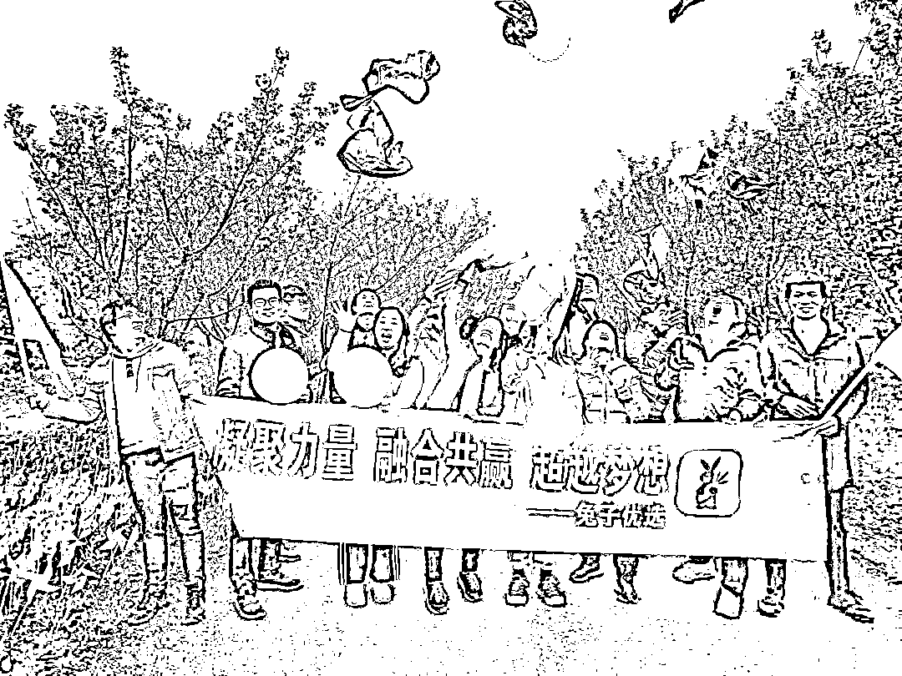

（兔子优选期间创业团队）

短视频那个时期停止以后，2017上我基本上没干啥事情，主要是休息调整状态为主，这一年我过的其实蛮轻松自在的，也去了一些地方进行游玩。春天的时候每天早上起来跑步3-5公里，然后回家坐在阳台的躺椅上泡一杯茶，然后晒晒太阳看看书，还给自己制定了几个要完成的小目标，之前也写过总结，有兴趣的可以看老胡的2017总结：我总算混过去了!

 

 

3月份我去了一次香港旅游+办事，我并没有选择坐飞机，而是选择了高铁，因为我一路要去一些地方旅游走一走，首先从上海做高铁到厦门，见了2个朋友，他们当时刚刚结束掉上一个做家装分期贷款的项目，正在处于寻找新的方向阶段，我们一起畅聊了新的一些机会可能性，其中谈到了做现金贷超市（以下简称贷超）这个方向。

虽然我之前一直做的是电商淘宝客，但总归做的是基于流量变现的事情，而且我身边已经有朋友在做贷超，可以说非常的赚钱，这个商业模式本质上和我们做淘宝客一样的逻辑。

理解起来非常简单，只不过我们以前是给淘宝导流购物赚取佣金，而贷超们是给各家现金贷APP导流，通过CPA进行结算而已，一个用户可以重复卖几十上百次给各个贷款APP，利润极高。

聊完这个方向以后，我那2个朋友力邀我一起加盟创业做这个方向，只不过我年初给自己制定了2017年主要是休息，不想再次投入到创业中去，所以就没答应，只是会经常保持沟通和交流。

可这两个家伙为了拉我入伙，基本上每个月都给我发业绩报告，我真的是亲眼看着他们从每个月几十万利润变成几百万利润，接着做到上千万利润。

一直到2017年9月份，我也觉得休息的差不多了，还是要干点事情，但是我要从上海厦门实在太远了，很不方便，所以我就来到了杭州准备和另外一个朋友咱们合作启动贷超的项目，基本上10月-11月都在学习和筹备当中，本来要准备启动了，结果2017年12月1日，央行发布了一个公告，开始管理现金贷这个方向的事情。

那个公告中明确提出小额贷款的年利率不得超过36%，不得进行暴力催收。

 

 

当我看到这两条规定以后，就知道现金贷和贷超这个方向不好玩了，有很大的风险，利率的规定限制了现金贷们的利润，不得暴力催收限制了回款的问题，因为当时大量的现金贷APP是没有什么太多风控的，最有效的风控就是靠后续的人工催收来保证回款。

今天回看，幸好当时没干现金贷和贷超这个方向，因为前两年身边不少做这块的朋友都进去了，还是电商卖货和导购这个方向更稳妥一些。

当不搞贷超那个方向以后，那段时间我也不知道要干啥，因为我人已经从上海到杭州来了，所以必须还是要在杭州继续干项目，我就看了一些其他方向，后面发现了社交代理淘客这个方向。

经过一翻的调查了解，我知道这个模式当时刚刚兴起，有一些APP的增长速度极快，因为我自己之前做过很多年的淘客，一看就懂，也知道这里面的逻辑是淘客+社交代理裂变来组成，所以我就找到一个朋友让他们给我开发一个独立的产品demo，上架到苹果市场然后先小范围测试看看。

当时我给那个产品取名叫“小群助手”，希望这个助手可以帮助有微信群流量的人能够利用淘宝客进行变现。我进行了简单的冷启动，这个在我之前的文章中多次描述过，这里我再讲一下吧。

因为我身边很多朋友都知道我干了很多年的淘宝客，但是她们想学习不知道怎么入门，传统的淘宝联盟的模式过于复杂，一般人想入门还是有很多的门槛的，但是通过社交淘客代理APP就比较简单，只需要简单的下载注册就可以分享商品赚钱了。

于是我就发了一条朋友圈，说免费教大家做淘宝客赚钱，但是需要每人付款99元的押金，一个月内赚到99元我退还相关押金，赚不到则不推，感兴趣的点赞。

 

 

就这样一条朋友圈又50多人点赞，最后我挑选出符合条件的30个宝妈用户，然后15人为一组，分成2次用微信群进行培训，前后用了2周的时间来教会他们，慢慢的就有一些人开始赚到钱了，培训过后差不多就过年了，那段时间在老家过年，我都没怎么去看相关的后台数据。

结果年后回来我看到后台数据，给我吓了一跳，短短的半个多月时间，我最开始的30个宝妈用户居然给我带来了2000多的APP全部用户，然后我的淘宝联盟后台收入数据从开始的几千块变成了20万，这着实给我震惊了，因为在我们传统的流量投放逻辑下，要想做到2000个用户和20万的佣金收益，那必须要投入10万以上的营销费用才有可能实现呀。

当我看到这个数据以后，我才深深的明白，晚上市场上其他几家社交代理淘客APP会在短时间内迎来那么大的增量爆发了，于是2018年3月我就正式决定干这个方向，然后找我的朋友谈了下，他就是之前和我在上海一起干短视频的合伙人，本来我们两个商量一起到杭州发展，他从宁波过来，我从上海过来，刚开始并没有想着一起合伙人干，只是各自发展摸索。

但是当我决定投入干这个方向的时候，我和他深入的聊了聊，他也非常认同社交代理淘客这个方向，然后就停止了他自己创业项目的探索，我们两个决定一起合伙干这个，然后找投资人谈了下，也是和短视频那次一样，按照2000万的估值出让10%。

还是一样，我们刚开始没有招聘任何员工，就是我们两个在干，他负责产品和技术的开发，我负责其他一切事物，我们从杭州西溪湿地旁边的腾讯众创空间暂时搬到了华星现代产业园，和好省一起联合办公。因为我最早的那个“小群助手”APP的Demo就是在好省的基础上开发出来的，所以这次我们需要从好省的底层架构上面剥离出来。

 

 

用了1个多月吧，我们基本就剥离完毕，在此期间我们只招聘了一个财务来负责客服和给用户打款提现的事情。在2018年5月份我们就从华星现代产业园搬回到了腾讯众创，开始了新一轮的招兵买马，很快我们组建了一个10来人的产品和技术团队，对APP进行全新的重构，在2018年8月8日我们正式上线，把之前的“小群助手”APP更名为“兔子优选”。

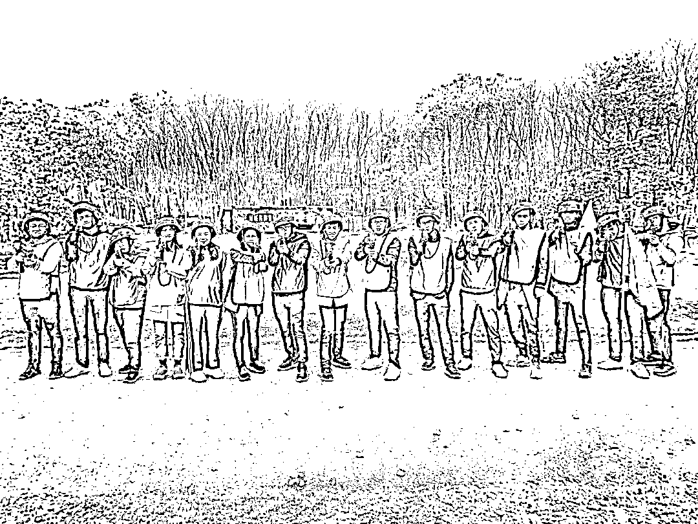

（兔子优选期间我们团建打真人CS）

改名并全新重构后的“兔子优选”APP，界面和用户体验基本上和市面上的主流社交代理淘客APP差不多了，那段时间我们发展很块，佣金从几十万变成了上百万只用了2个多月，旗下代理用户也快速到了10万+。

 

 

但是很快我们面临的问题也出现了，那就是我们的增长开始出现瓶颈，因为我们最早只是依靠普通的宝妈用户裂变发展起来的，并没有大的KOL和微商团队长加入，同时我们自己刚刚从纯流量玩法切换到这种代理制玩法当中来，对这块的认知还很缺乏。

当时我犯了一个重大的判断错误，那就是认为通过普通人的裂变也可以让用户快速增长起来，因为拼多多就是在微信生态这样干起来的，我们也通过这些普通人的裂变做到了百万佣金和10万+的用户，这些数据也证明了普通人也是可以的。

其实我错了，我把“社交电商”和“社群电商”混为一体了。

拼多多是属于社交电商的玩法，通过拼团+砍价，让C端用户发起裂变推广，但是“社群电商”本质上更加偏重对KOL的运营培训和管理，依靠这些KOL小B在去裂变发展团队，是两个完全不同的运营策略。

前者商业模式简单只需要重视C端裂变即可，而后者商业模式相对复杂些，必须要结合微信群的培训和管理，是微商的那套小B运营逻辑。

那个时候我们虽然搞了很多年电商导购，但是对微商和社群电商这块的认知真的是很少很少，而我还在处于那种原来流量运营的思路里面，希望通过产品上的打磨优化，让C端用户去帮助我们裂变发展，真的是大错特错，这种思路不是不可以，但这应该是小菜，不应该当成主菜。

到了2019年的年中，我们的用户量虽然也做到了50万+，日活也做到了10万+，月佣金破了300万+，但这些增长靠的仍然是之前的那些用户自然裂变的。一直没有找到大的微商团队加入，甚至我也不知道去哪里找到他们，经过朋友的介绍谈了一些微商，但基本上都没有谈成功，她们要不就是没兴趣，要不就是他们不会放弃本身的微商项目，对淘客这个事情基本上觉得赚的太少没意思。

 

 

所以我们的发展一直非常缓慢，不知道如何去突破，加上本身我们产品和代理层级设置上慢慢的和市场上的其他家拉开了一些差距，当这些普通用户的资源耗尽后，自然的裂变增长速度也开始慢下来了，同时每个月的各种运营开支不断加大，但是收入却开始不增长了，让我们非常的焦虑。

我们当时和其他社交代理淘客APP的慢慢有了差距，主要表现以下2点：

**1**、** **首先在代理层级设置上，我们当时只有2级，分别是初级用户叫合伙人，高级用户叫团长，但是由于只有2级，我们的代理之间的利益脱节很快就会发生，这点在后续其他的社交电商平台上也经常发生，很多平台也因为这个问题直接搞不下去了。

这个点真的是值得好好说一下，社交电商的代理抽成机制最好在一开始就设置好，否则到后面在来更改会出现很大的不稳定性，会导致大量的代理出走，从而对整个平台形成毁灭性打击。

我们当时已经有了一定的体量，如果这个时候重新设置代理层级关系，势必会对现有代理的收入产生巨大的影响，会导致大量的军心不稳。我们当时因为只有2级，所以给团长的佣金抽成非常高，大量的中小团长在我们平台是可以赚到一月几千块的收入的，但是别的平台因为层级设置的多一些，给普通团长的收入会比较低，但是一些头部的大团队长如果升到了最高级，就会收入非常多，高的可以达到几十万甚至是百万级每月，这对下面的其他团长会形成很大的吸引力，所谓明星效应。

所以我们当时就处在这种历史包袱的情况下，不管是重新设计利益分配机制，还是增加代理层级关系，都会导致现有的团长们非常不满意，因为她们是既得利益者，这样会减少他们的收入。

不去增加代理层级和更改利益分配机制，一些头部的团长就会慢慢的不满意，因为她们看到别的平台上的头部团队长收入就比较高，她们在我们这里就收入上不去。

 

 

真的是进退两难，我们当时也没有特别好的办法来解决这个问题，就这样导致了一些头部团队长的出走，对我们的增长和发展带来了一些影响，新的牛逼的团队长也没有引入更多，所以增长就越来越慢。

我也是后面才看到其他平台的解决办法，有的是选择直接更改，不需要关注太多小B的感受，她们如果流失了就随便他们流失，只需要让这些头部的大团队长满意就好，这些头部的收入上来了，他们自然会去搞定下面的那些小B。

而有的公司是选择重新做一个平台，新的平台在一开始就重新设计好利益分配机制和代理体系，然后把原有的平台用户按照以往的代理层级关系重新迁移到新的平台里面去。

**2**、** **多个购物平台的支持上，这个我们做的也不够好，我们始终围绕着淘宝来展开，没有接入其他更多的平台。因为我知道我们这类APP本质上还是以淘宝导购为核心，其他的平台都是配角，不论从用户的选择上还是订单数和佣金体量上都非常的小，花太多心思在那些事情上面没必要。

这个时候如果去接入其他更多的第三方平台，不仅可能会让淘宝联盟不满意，同时还会加重我们的运营负担，需要增加商务、客服和财务等相关人员，对整体大盘增长并没有太大的帮助。

当时淘宝联盟也不希望我们这些淘客代理APP接入其他电商平台的，但是有一些同行还是照样接入，如果淘宝联盟有意见就安排下线，不过后面淘宝联盟也没怎么管这块了，就随着大家自己发展。

干了那么多年的返利导购，我太清楚这些B2C平台的问题了，比如结算问题，丢单问题等等都会让我们增加很多的负担，当时我们的人力和财务资源都有限，所以就没有选择去接入这些平台，主要还是以淘宝为主。

 

 

这里我又犯了一个错误，那就是虽然这些独立B2C的订单数和佣金数在我们平台上占比很小，包括在每家独立的社交淘客代理APP上都占比比较小，但还是有一部分用户有其他平台购物拿佣金和查询优惠券的需求的，这个需求不是重要的，最重要的是接入的平台越多，不管这些平台对用户来说有没有用，主要是代理们觉得是一个很好的噱头，他们在发展代理的时候就会和下级说，咱们平台接入了多少家，基本主流的平台都有返利拿，衣食住行、吃喝玩乐都有，本质上说接入越多的平台，对于代理们来说是一种推广上的赋能。

所以基本上以上两个问题对我们形成了比较大的挑战，我们在增长上面越来越慢，加上原有代理的流失，我们的收入也开始入不敷出了，这个时候我们就在思考，独立的平台还是太难做了，所以我们就考虑把兔子优选这个项目给卖掉。

当时洽谈了一些公司，包括在导购领域非常头部的大公司和港股上市的公司，也经过了几次谈判，最后也没有达成一致。后面我才考虑要不和同行合并掉，这样我们就不用在管这个平台了，经过多家的接触后我们选择了和好省进行了合并，合并的原因很简单，我们两家互相持有对方的股份，同时我们的产品逻辑和代理体系非常的接近。

于是在2019年的9月份我们两家成功的进行了合并，合并后我们不需要管理平台部分的产品和技术开发了，只需要对团队长和发放佣金那块进行管理运营即可，模式相对比较轻很多，成本也没多少，就把这个业务当做公司的现金流业务在运营。

 

 

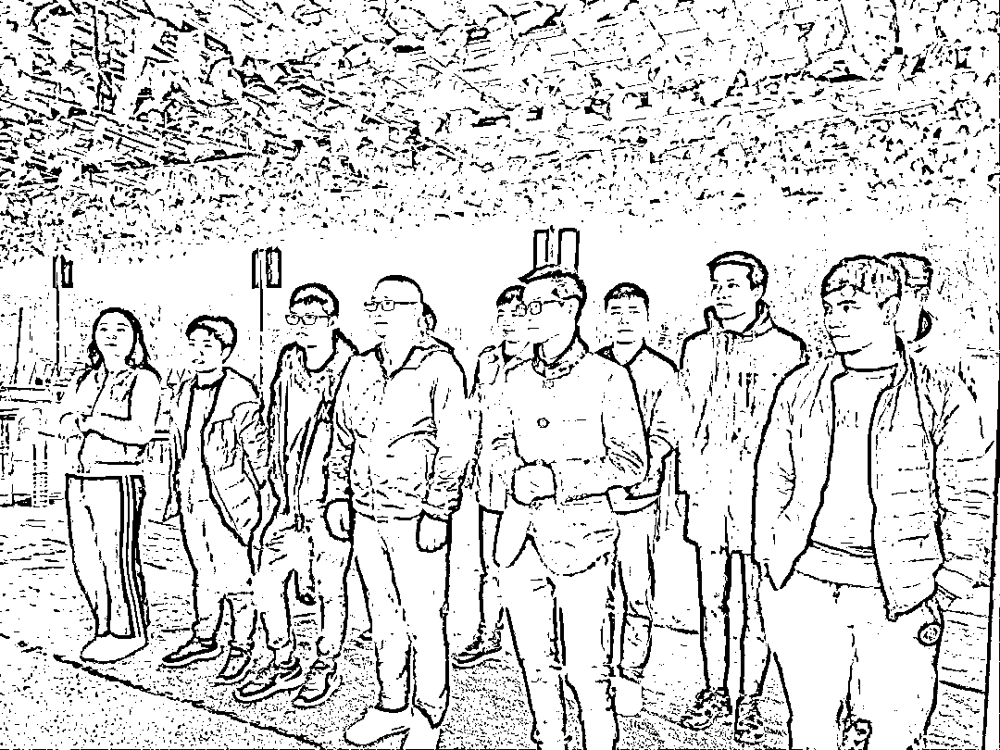

兔子优选这段创业总的来说不能算成功，但是也算不上失败，这段创业能总结有以下几点：

1、社交代理淘客的本质是对KOL和大B进行有效运营管理，而不能把普通的小C当做小B去运营，更加不能想着纯粹依靠小C的裂变推广推动整体的增长，这些只是长尾流量，不是主力增长发动机，这点在上面我已经写到，这里不再重复。

2、代理的抽成机制一开始就要明确的设计好，否则后面在改动起来就非常的困难，会对平台产生致命性打击，这点我上面也写到了。

当然如果到了必须要改革的时候，就应该痛下决心去坚决执行，不要顾及部分团队的流失，因为平台运营必须从自身的宏观大局出发，否则不仅对平台不好，从长远角度来看对团队长们也不好。

 

 

3、自己还是要身先士卒去参与代理的运营管理当中去，找到真实的体感，我们做兔子优选的时候，因为模式本身是基于微商代理体系，而我们自己之前都是纯互联网人出身，不太好意思发朋友圈，更不想去和那些代理们打成一片，觉得这样有点太LOW了，拉低了自己身段。

这个问题其实蛮严重的，我们传统的互联网从业者一直都觉得自己干的是高大上的工作，平时比较喜欢那种低调、神秘的范儿，就连发朋友圈都要做到逼格十足。

而代理团队长们的性格恰恰和我们相反，他们就是天天发朋友圈高调晒收入，高调把自己做的事情宣扬出去，天天在微信群里和旗下的代理们打成一片，这样他们在一线才能找到真实的体感，才知道如何管理和运营团队。

4、  做平台是九死一生的事情，它不像咱们做生意，前期千万不能太考虑盈利。之前我们的利润还可以，基本上每个月的收入是可以覆盖掉开支的，心态还算好，但是后面开始逐渐入不敷出甚至出现亏损的时候，新的增长点也没找到，心态就开始很不稳定了，觉得这样下去我们会把投资人的钱亏光了，对不住他们。

其实不应该太关心这个问题，投资人投资就是让我们去亏损的，是希望我们用这个钱把事情做大的，不然我们要投资人的钱干啥？这个道理我也不是不明白，主要当时我们拿的是朋友的钱，而不是专业投资机构的钱，所以在这块有心理压力。回过头今天来看应该不管是谁的钱，只要你是投资人身份，那么这个钱我们就算亏光了也不要有什么心理压力才对，当然这个问题的责任主要还是在我自身了。

5、创业千万不要轻易做平台，这条路99%的人不适合走。我前后一共干了近10年的平台，累计投入的资金几千万是有的，基本上每年赚的利润都投入到公司里面去了，最后发现远远不如那些不搞平台，纯粹做生意的朋友。

 

 

今天的用户红利都消失了，创业者们也不要去做那种平台创业梦了，最好的窗口期都已经过去了，今天创业首先不应该轻易去创业，就算你投身创业，也应该用做生意的思维去干，说白了就是公司业务应该以先赚钱养活团队为主，不要想着去烧钱扩大规模，未来再盈利，这种路子绝大部分人都不适合。

我在这些年的创业过程中，不是没有发现那些做生意的机会，而是觉得如果去做了那些事情，可能公司的重心就会发生偏移，这样平台就可能做不起来，不能为了去赚那些现金流放弃了做平台的梦，现在来看这都是笑话。

好了，关于兔子优选这段时期的创业就写这么多吧，其实还有很多可以写的地方，我担心越写越多，全文3万字都不够，如果未来有机会和各位见面的话，我可以给大家分享更多细节性的东西。

六、后记

经过前些年付出的大量学费和血泪教训以后，从2020年开始我就给自己定了个铁律，短期内不再轻易去开发产品做平台了，也不要去想什么必须要做10亿美金的平台公司梦了。

至少在短期内不会去做这些事情，还是做点自己力所能及的事情，要习惯接受自己是一个普通人，不再去好高骛远，先从小生意开始做，有机会再去慢慢放大。在2020年我也把做兔子优选事情的亏损的投资款全部还给投资人了，另外还给了他们一些额外的回报，也算是有一个圆满的结束。

所以我这两年，公司的业务基本上就是围绕着做生意的思路在进行，原来的代理淘客业务继续运营。有空的时候写写公众号，把我的一些所思所想和过去的一些经验可以告诉更多人，一方面是给大家提供一个参考，另外一方面也能帮助到更多人少走弯路。

 

 

我经常接到很多陌生的人来加我微信，他们都非常感谢我，说是通过我的文章了解到了淘宝客这个行业，少走了很多弯路。有些人他们进来做了，也赚到钱了，生活变得越来越好，每当看到这些话时候，我就感觉到特别的欣慰，甚至眼睛里有点泪水在打转，这种感觉比我赚到1000万还有成就感和自豪感。

另外我们公司也在做其他相关的一些淘客变现业务，比如在今年我们帮助淘宝特价版进行市场推广，带动了整个淘客圈都进入了淘宝特价版的推广，大量的淘客通过这个业务赚到了真金白银，找到了2021年的业务增长点。

我们还联合了返利网开发了“满天星”外卖CPS系统，帮助更多淘客轻松的入门外卖淘客业务，这个产品不论是从产品的易用性和靠谱程度来说都是在行业内靠前的，现在已经有上千位淘客在使用了，覆盖了千万以上的外卖用户群。

同时在今年的7月我们又和拼多多达成了合作，正式接入“群买买”项目的推广合作，短短的2个月时间，我们就发展了超过15万的店主，实现了月GMV破千万，帮助了很多的大V、KOL、微商团队长们通过群买买项目成功变现。

也帮助了大量的普通用户通过这个项目赚到了还不错的副业收入，当下这个项目的增速非常之快，我们也在设计体系化的运营策略，我很有信心在不远的将来能够做到每月1亿GMV的小目标。

总之就是先围绕做生意的思路去做，踏踏实实的去经营，帮助公司不断的积累现金流，帮助团队小伙伴不断的提升业务能力和增加收入，找到更多有能力、价值观趋同且志同道合的人加入团队，一起去乘风破浪。

其实在当下这个环境中，这个担子也不轻，但是我会尽全力去扛起来，不断的修炼自己，因为人生就是一场修行。

 

 

如果，这里说的是如果未来哪一天我们公司有足够稳定的现金利润了，我还是可能会去考虑开发一个自己的产品出来，因为从根上来说我还是一个有产品情怀的人，相信好的产品是改变行业提升效率，也可以帮助到更多的人。

至于这个产品是什么，我现在也不知道，具体还是要看市场的需求，只不过我个人有这样一种产品情怀而已，如果用一个数字来表达这种情怀的话，那就是如果我们一年能赚1000万，我愿意投入500万进来。

好了，到这里我这篇10年创业总结算是基本写完了，全文超过2.6万字，感谢各位花时间来阅读。

 

 

虽然还有很多很多的东西没有写进来（包括项目判断、市场投放、管理、招人用人等等一大堆的血泪），但是我觉得主要的一些复盘和总结都写出来了，其他的一些未来有机会再和大家分享。

在创业这路上，不管你的经历和经验总结再多，我们都还是会继续不断的犯错，都还会继续不断的失败。

失败跌倒了不可怕，只要我们还愿意再爬起来，只要我们的战斗意志没有消亡，一切都可以重来。所以我们时刻都需要不断的去学习，去试错、去交学费，不断的提升认知，这是所有创业者最重要的功课，甚至没有之一。

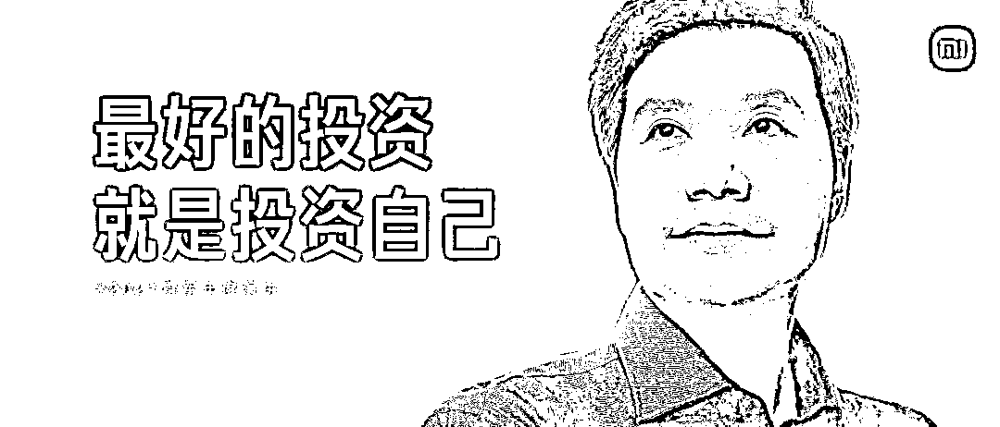

人生路上大家的终点都一样，只不过每个人在这几十年的路程中看到的风景不一样，还是要尽情的去享受这个痛苦又煎熬的过程。这样当我们老的时候再回过头来看今天，现在的一切挑战和困难都不是事情，反而觉得会我们的人生很精彩、很有意思、没有白活。

 

 

最后用一句话送给自己，也送给大家“生如蝼蚁，当立鸿鹄之志；命如纸薄，应有不屈之心”，让我们一起生财有术，共同致富。

评论区：

纵横领域 : 生如蝼蚁，当立鸿鹄之志；

命如纸薄，应有不屈之心！

老胡 : [抱拳]

正在兴旺家族的星佳 : 直到三十岁才知道，迎娶白富美，住上大别墅，成为人生赢家除了创业还有很多办法。

可悲的是，年轻的时候以为创业是所有问题的唯一答案。

老胡 : 是啊，创业不是唯一的路，比如你的选择就很不错。

贾飞 : 收获太多了

正在兴旺家族的星佳 : 确实是选择大于努力呀，以前觉得创业要改变世界之类的，有了孩子后，觉得能把家人照顾好，确实已经很牛逼了。

不过，创业会上瘾，胡总加油呀，带更多人致富，过上更好的生活[呲牙]

老胡 : 你看的好快呀

老胡 : 好，带领更多人一起生财有术，共同致富[愉快]

# **# ****(**精华帖**)(200**赞**)**加入生财半年多，从负债** **

# **30W **到实战变现** 30W+**

作者：  鲸鱼🐳

日期：2023-02-06

加入生财半年多，从负债30W到实战变现30W+

大家好，我是鲸鱼，一个前大厂算法产品经理，现专注抖音搜索流量。

这是我2022年加入生财半年后的复盘总结。加入生财有术实战半年后，我实战了5个商业项目，不敢说多厉害，但都有取到了一些成果，也完成了负债30w到实战变现30w+的阶段:

 

 

1.小说推文项目跑出了3个百万级别播放，上过抖音热点榜，单视频变现上万，并赋能了数位学员跑出百万播放；

2.实战抖音本地团购，14天  变现gmv 22w，并把方案思路分享给我本地朋友，建议他跑本地服务商，并协助放大130w GMV；

3.经营线下自习室1年半，扭亏为盈，并通过各平台搜索优化流量，盈收增长50%，成功登上报羊城晚报；

4.抖音seo实战带货，单日带货gmv 14w，累计成交 gmv 100w；

5.抖音seo实战红包封面项目，每一小时自动化成交1000元左右；

还有，参与生财有术抖音seo训练营担任实战导师，今年也开始尝试研究直播流量策略等。

借助这篇复盘文章，我分享一下:

1.这半年里的经历，

2.实战项目基本拆解

3.实战感悟

4.我所看到的23年11个赚钱机会

希望能给圈友们的成长和赚钱路上带来更多的帮助。

为方便排版和阅读，请移步飞书:

https://c6rqsbk2f3.feishu.cn/docx/YgztdSawloxke4xyYG4cnfmwngh

 

 

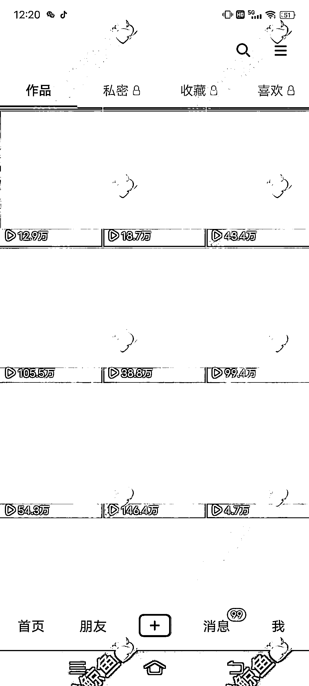

 

 

 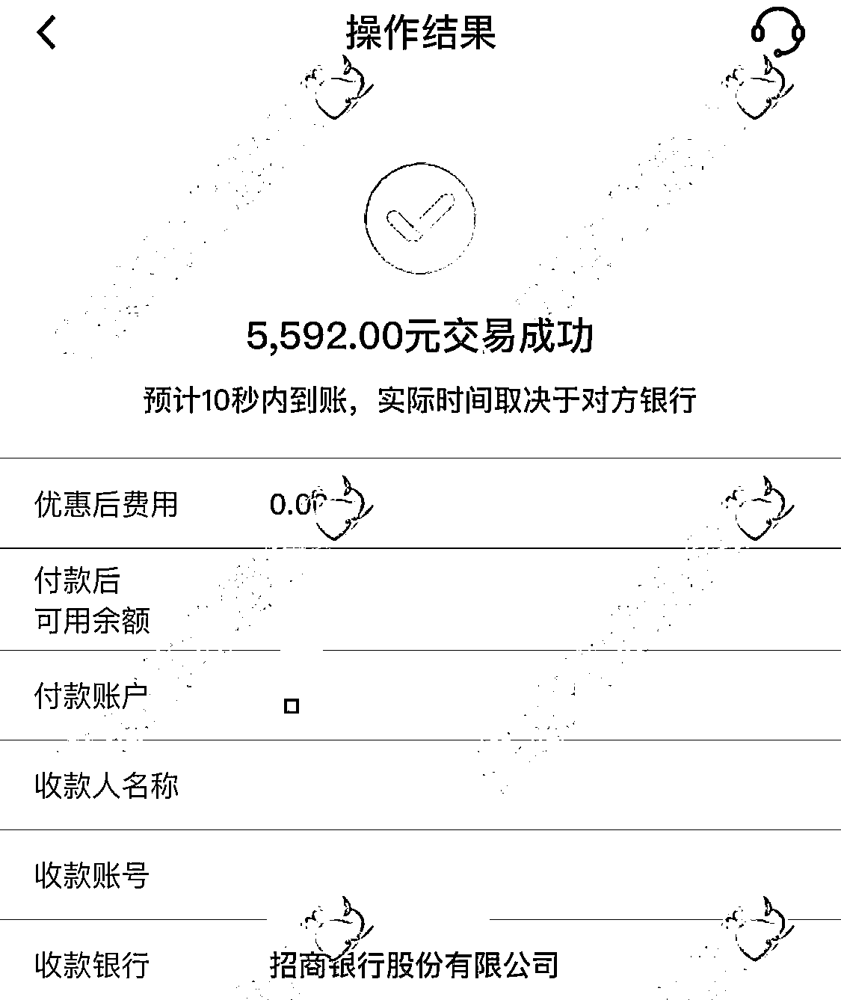

 

 

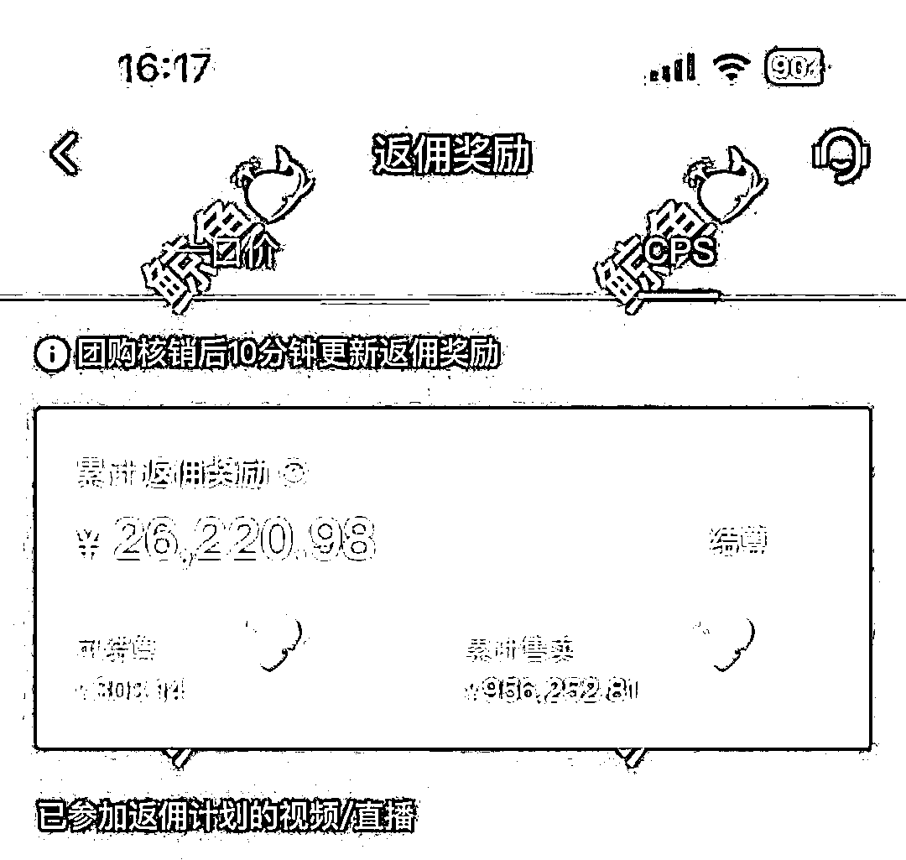

 

 

 

 

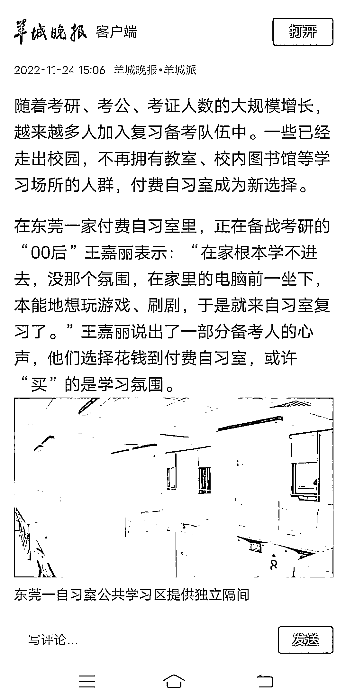 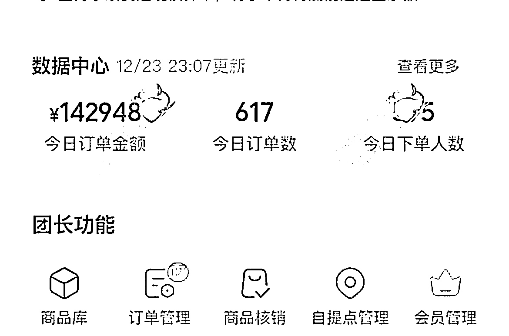

 

 

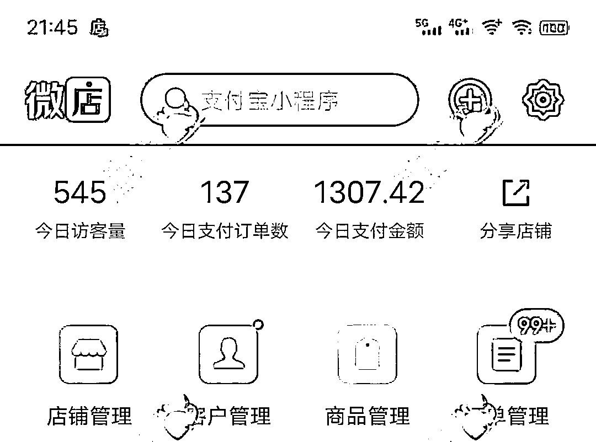

评论区：

亦仁 : 干啥成啥，你觉得最核心的三个原因是啥？

剪刀刀 : 你这是各项事业百花齐放哈哈哈  恭喜恭喜

鲸鱼🐳 : 亦仁大大好，抱歉刚在研究直播回复晚了，我这边觉得最核心原因是这三个:第一个，处在优质的认知环境。

每天都在生财里不断刷精华帖和风向标，碰到项目基本会把生财里相关的帖子看遍，处在这样的环境下，很多项目高手的认知，会极大开阔了我的眼界，还有对项目的理解。

长期下来，这些会对我了解拆解项目的时候，帮助巨大。

第二个，生财里的贵人相助。

基本上每一个项目，都或多或少受到贵人的相助，小说推文项目受过张柯的指点，线下自习室受过燕楠姐的指点，本地团购项目受到生财小航海的教练的分享，抖音seo带货受到过令狐和hawli姐姐的协助，微信红包封面项目有看过晓文老师的文章，还有，日常困惑，靠谱和醒醒也经常指点我。

 

 

第三个，快速下场实战执行。

我经常在晚上留意有没有商业的异常值，还有刷风向标和精华帖的时候，如果对这个项目新的理解思路，我就会立刻写下来，进行拆解，甚至有时凌晨拆解完了，还是会依然进行测试验证。在实战的过程中，我会记录我的实战数据，研究里面的流量逻辑。

我还记得有次同时报名了3个小航海，基本拿到小航海资料那刻，就马上研究资料拆解几个项目，迅速开始实战，最后都跑通了，还有一个项目就是在小航海中跑通并逐步放大的。

我始终相信，做项目是需要深入研究的，是需要快速执行落地的，没有实战，就没有第一块钱，就更别说放大。不去实战，只观望，我们是没法拿到正反馈的。

有时候我们都觉得不少项目会卷，可能就会选择不执行而选择观望，我也深刻体会保持学习和做项目执行可能会有点反人性。但也只有踏出这一步，我们才能有积累，才能持续成长，不断拿到正反馈，慢慢积累的能力将会成为我们的壁垒。

等到深入研究实战项目的时候，也会慢慢发现，项目只是表面看起来很卷，但实际上深入研究实战项目的人并没有那么多的。

鲸鱼🐳 : [呲牙]一起生财有术

王燕楠Nancy : 苦尽甘来，一起生财有术

鲸鱼🐳 : [偷笑]跟着楠姐一起生财

M_Alex : 鲸鱼是在东莞吗？

散人 : 实战最重要，一起生财有术。

# **# ****(**精华帖**)(197**赞**)98**年专科生，裸辞后做抖音

# 项目**+**社群赚到人生的第一桶金

作者：  钱南

日期：2020-11-02

 

 

大家好，我是钱南。98年的我是一名刚毕业一年的互联网创业者，本篇将会给大家分享我是如何通过一年时间，裸辞后利用抖音项目+社群赚到人生的第一桶金。希望把自己赚到第一个100万的经验和方法分享给之后的新人...点击链接查看剩余内容https://articles.zsxq.com/id_q89zszuu27tt.html评论区：

kihyo : 优秀

夏夏🦁 : 👍

一俊 : 通过短期项目赚快钱，解决眼下难题。还是得有长期一点的项目，不然很累的老是换项目

钱南 : 所以社群+个人IP打造是一个长期项目了[嘿哈]

房先生 : 后生可畏，优秀[强]

小鹿 : 南哥牛批[强]

钱南 : 这都看到了？？

钱南 : [抱拳][抱拳]

# **# ****(**精华帖**)(171**赞**)93 **年女孩做线上美业，不到** **

# **2W **成本到变现过百万

作者：  夕子

日期：2022-11-07

我是夕子，93年女孩，白手起家，不到2万成本变现过百万

对比很多大佬的成绩，这只是小儿科，但我只跟自己比，跟昨天的自己比，有没有更聪明些，认知有没有更宽阔些，有没有更沉稳些，有没有更有钱------

毕竟属于大学毕业后第一次做生意，没有亏，反而挣了，是条稳稳的现金流。我把相关的重要经验分享给有缘人，希望能给到大家一些启发。

 

 

分享目录如下：

一：我是个皮肤病患者，所以选择从医

一：毕业后，放弃不喜欢的工作

二：做生意，从一单2块开始

三：店铺被封，差点放弃

四：1万到5万的利润，我做了这件事

五：从5万到10万+的利润，我做了这件事

六：未来展望

全文链接

https://ancab4z106.feishu.cn/docx/E1WGd70YLoaHGfxAYJTc4WoFnsd https://ancab4z106.feishu.cn/docx/E1WGd70YLoaHGfxAYJTc4WoFnsd

评论区：

夕子 : 创业路上感恩遇见优秀的你们  感恩生财的朋友们  感恩天使顾客们  梁靠谱 : 太棒啦！

夕子 : 谱子  你好速度呀 [偷笑][偷笑]

七哥个人品牌 : 行动赚到钱，健康不忘记，持续挖需求，提供高价值，学习了✔  雅俊 : 牛🐮

陈远清 : 6

夕子 : 七哥言简意赅  总结到位[强][强]

夕子 : [愉快][愉快]

# **# ****(**精华帖**)(158**赞**)**亦仁：如果要卖自己，你会

# 怎么卖？

 

 

作者：  亦仁

日期：2020-07-22

请你思考一个问题：如果要卖自己，你会怎么卖？

之前星球里面分享过一个成功的案例，  设计师日记公众号主理人，面向互联网设计师这个垂直细分领域，提供信息、服务、培训、社群等服务，目前他的星球有已有 8000+ 活跃付费会员，可以说，卖的一手好“自己”。

今天的  ，再给你介绍一位产品领域的圈友  ，面向产品经理用户群体，他是如何定位自己并设计“卖自己”这个商业模式的？结果怎么样？

来，一起看  今天的分享。

欢迎  👏

———

Hello，大家好，我是唐韧，前非著名程序员，先不知名产品人，一个自由职业兼创业者。

感谢亦仁大佬邀请，能有机会在生财有术跟大家分享我的一些经历。

我是自己同名公众号「唐韧」的作者，主要面向互联网产品经理和设计师，还包括技术、运营和泛互联网人群。

今天，主要跟大家分享我是如何通过一个只有 5 万用户的公众号获得百万营收的，以及我是如何运营垂直领域社群的。

先介绍下自己。

我曾经是一名程序员，2008 年开始做 Web 开发，2011 年接触移动开发，能同时开发  Android 和 iOS App。

2012 开始写作，并成为微信公众号的第一批注册用户，至今已坚持写作 8 年。

2014 年参与互联网医疗创业，作为创始团队核心成员，从零到一经历了团队和业务的从零到一，期间从技术转型产品，成为了一个产品经理。

2018 年初，离开创业团队加入京东，负责京东健康旗下京东大药房的产品工作，年交易额近 80 亿。

 

 

2019 年 7 月，我从职场离开，成为了一名自由职业者。

到现在，正好是我裸辞一周年。

过去这一年，我没闲着，开始做了很多新的事情，自己也注册了公司，逐渐从一个自由职业者往一个创业者转变。

因为持续写作，从技术类文章写到产品类文章，现在我的写作领域比之前要宽了不少。

因此也积累了一批读者。

我的公众号「唐韧」现在有 5 万多读者，作为一个从 2012 年就开始写作的人，这点读者量其实不算什么。

但持续输出以及主攻垂直领域，从 2019 年开始，我陆续获得了收入上的回报。

去年离职当天，我公众号「唐韧」读者数是 23291 位。到今天，这个数字是 50588 位，增长率 117%。

过去 365 天，我在公众号累计写作文章 276 篇在文章打开率上，文章平均值在  10%~12% 之间。

此外，我也建立了自己的知识星球，星球建立至今也快 3 年了。知识星球用户数从去年离职时的 628 增长到今天的 1989，增长率 212%。

同时，面向垂直人群，我也推出了自己的在线课程《产品经理的技术必修课》，学员从  3000 人增长到 5000 人，增长率 67%。

这门已经上线快三年的课到今年也正式下线，进入新的迭代期。另外，我也在准备我的第二本书。

截至到现在的过去一年，累计输出文字 150 多万字，平均每天输出 4000 多字。

这些事情都给我带来了收入，另外还有公众号的广告收入。

我公众号广告排期现在需要提前两个月预定，因为比较垂直，且在这个领域用户还算是人比较多的，另外加上我严格控制发广告的频率（每周不超过2篇），所以不提前两个月以上很难约到。

我的星球用户基本来自于公众号的忠实读者，所以跟他们的关系会更进一步成朋友。

我不把公众号读者当粉丝，而是当成用户和朋友，所以写作风格上更倾向于聊天体，而不是媒体化写作。

 

 

我是做产品的，所以我一直把自己做的事情当做一款产品去打磨，从定位、到设计、到运营、到数据反馈和持续迭代，每一次调整都像一次产品升级。

为此，我也给自己定义了一套增长模式。

图片:

实际上，我也是在做个人品牌和服务。

因此，我也给自己设计了一套产品模式，包括我要做什么、为谁服务、怎么赚钱。

图片:

这两套机制是我一年前定义的，到现在持续执行已经一年多了，效果还可以，也验证了当初的战略没有失误。

但是，执行过程中也发现了很多问题，所以持续优化和迭代，遇到问题解决问题，享受这个过程的同时能带来收益，是我比较看重的。

在上面这些事情里，运营知识星球是我投入时间和精力比较多的，我也把它看成是一款产品。

接下来，我会跟大家分享我是如何从零开始建立并把星球运营到 2000 人的，以及如何通过一个5万人的公众号创造百万营收。

01 创建

2017 年 9 月 12 日下午，我注册了知识星球 App，并创建了属于自己的星球。

当时的名字叫「唐韧的读者朋友们」。

内容主题是对我公众号内容的延伸，或者说升级。

因为公众号一天只能推送一次，且基本都是长文，所以对于一些短而有价值的内容就无法触达读者。

于是我就想，如果结合知识星球的工具属性，我创建一个付费社群并由我提供内容，是否有人愿意付费？

内容主题是围绕产品经理学习、工作和行业交流的，面向的是产品经理以及对产品感兴趣的人群。

 

 

作为一款付费产品，交易的东西就是我的时间、精力和知识。

读者付出的就是星球门票费，有效期一年。

所以，我邀请了一些读者进行单独沟通，跟他们讲我准备做什么。

其中有一部分人表示愿意相信我，觉得我在公众号的内容还不错，付费社群的内容应该也不会差。

基于这种信任，最初 10 位同学成了我知识星球的第一批成员。

3 年过去，到现在仍然有 7 位在我星球里，这一信任和陪伴整整持续了 3 年。

同时，还有一部分人是不相信的。

他们认为现在还看不到任何有价值的内容，且一年的时间很难坚持，如果中途你跑路，那就算是被割韭菜了。

我非常能理解这种想法，因为类似的情况确实很多。

但 3 年过去，1000 天的时间里，这种情况并没有在我这发生。

可以说，让那些以为我要割韭菜的人失望了。

02 设计

有了基本的产品定位，作为一款内容型社区产品，接下来就该设计信息架构了。

实际上，就是星球的内容体系。

因为读者加入后需要快速对星球能提供的价值建立认知，此时就需要有清晰的信息架构。

从内容结构上，最初的版本其实是非常松散的，并没有形成结构化的内容体系。

大部分内容都是我在工作中的一些思考和实践分享，所以内容比较随机且分散。

后来意识到这种方式其实不利于大家系统性的、有主题性的获取，于是我准备对内容进行结构化。

结构化的方式也很简单，就是开辟不同的内容板块。

我给第一个内容板块起了个名字，叫做「PM_Insight」，寓意产品经理的日常思考和洞察。

 

 

在这个内容板块下，分享的都是我对于产品的思考，直到现在，我已经把它单独做成了一个专栏。

每周一的早上 9 点，都会由我或者星球里的其他同学来分享一篇长文，主题就是用产品视角观察世界，用产品思维解决难题。

有了固定的主题内容，读者就会形成期待，有了期待就会形成固定认知，这样能提升星球的活跃度。

但是，一个内容板块显然不够。

后来又推出了「主题分享」。

在这个内容板块下，我会围绕一些特定领域的主题进行分享，形式包括PPT资料、直播等。

到现在，这个板块已经固定成了星球内每周四晚上 9 点的直播分享，每周举行，从未间断。

分享人都是来自星球内的优秀成员，我也会从外部邀请一些嘉宾过来分享。

前面提到的两个主题，其实还是从内容输出和知识分享的层面提供价值，但接下来就会出现一个问题。

那就是成员还是独立作战，群体关系并没有形成。

说白了，大家在这里都是自学，并没有交流。

为了解决这个问题，我又引入了「好书推荐」的板块，支撑它的实际上是星球读书会。

而且，我们的读书会有一个特殊的规则，那就是加入需要交纳 49 元读书基金，但这个钱并不是花掉，而是暂存在基金池。

坚持共读 21 天，结束后完成挑战的可以平分读书基金。

为了增加挑战和趣味性，还增加了漏打卡补交 9.9 元的策略。

也就是说，21 天结束后，读书基金的金额是会超过预存金额的。能完成挑战的，就能获得超过之前的投入，同时还收获了阅读。

在这个机制下，星球内原本独立的个体中有越来越多的人开始认识彼此，产生了交流。

大家会分享读书笔记，会相互推荐好书，结束后还会分享读书心得。

 

 

到现在，读书会已经持续了 10 期，累计输出了 11000 多条读书笔记。

单兵作战、集体共创的模式都有了，接下来就是持续加强它们。

后来，又陆续开辟了很多内容板块。

有关于产品的、关于读书的、关于写作的、关于职场成长的等。

这些内容看似独立，实际上相互之间都起着很好的协作作用。说白了，社群内容体系的建设，就是要给用户持续建立稳定性。

不断更、不跳跃、不出格，这跟运营公众号是一样的。

03 运营

产品的基本结构有了，除了持续丰富和创新外，还需要主动干预和经营，那就属于运营的范畴了。

前面有提到，在内容板块上从零到一的过程实际上都是基于问题解决问题的过程。

问题驱动运营，用在星球第一阶段是比较贴切的。

有人会觉得我在公众号发广告影响阅读体验，实际上这也是一个成本问题。

如果在公众号我持续输出但没有收入，这件事在生意上就不成立。

更何况，我全职在干这件事，所以需要有收入。而广告就是公众号目前最合适的商业模式。

相比之下，星球内是没有广告的，因为星球门票就相当于会员费，就跟订阅视频网站会员看视频无广告一样。

任何商业模式的成立，其实都是一场彼此相当的交易。

在持续运营的过程中我又逐渐发现一个问题，那就是 80% 以上的内容都是我在创造，大部分人都是读者。

虽然这符合一般规律，但想让社群更有活力，需要动员更多的人一起参与到内容创作中来。

持续如此，就形成了一个局面，每天星球内的内容都是我在提供，大家都只能等。

因为我的时间精力以及内容创作的频率可能跟不上星球人数的增长，这会形成一种矛盾。

 

 

为了解决这个问题，我想了一个办法。

那就是推出星球内的「成长进阶日记」，让每个人都能输出，内容包括对产品的思考、时间以及成长复盘。

如果只是吆喝，显然没用。

为了鼓励大家输出，我制定了一个策略，连续输出成长进阶日记 365 天，可以获得门票双倍返还，还能获得第二年的免费门票。

在这个机制刺激下，星球的内容一下子就丰富了起来，在数据上是直线上扬。

为此，我们的星球到现在基本每周都会登录全网付费活跃榜，且多次都是在前三的位置。

在这个策略的影响下，内容供给的问题解决了，星球各项指标数据也都上去了。

接下来，又遇到了新的问题，那就是有了数量后，如何保证质量？

因为这个过程其实也是一个筛选的过程，真正能创作优质内容的人会浮现出来。

去发现那些既能创作优质内容，又乐于分享且有行动力的人，我会邀请他们加入我的团队。

到现在，我们有一个专门的 5 人小组就是负责筛选星球内每天产生的内容，挑选出来并设为精华。

只设置精华还不够，因为激励不足。

所以，接下来的问题就是如何在一定的激励措施下鼓励优质创作者提供更优质的内容。

于是，我推出了「糖球计划」。这也是从亦仁大佬的「龙珠」得到的启发，在此也专门感谢一下。

简单说，糖球就是一种价值货币，发行的方式就是通过创作优质内容来获取，能被评选为精华的就能获得一颗。

有了生产，还需要消费。

所以我们制定了一系列的更高端权益去满足糖球持有者的消费，包括加入糖球俱乐部、获取额外福利、以及兑换星球门票等。

包括后来推出的星球会员日，我们会把每月 30 号定位星球的会员日。

 

 

在这一天里，我会面向星球成员发放一些福利，比如上次就送了CHERRY键盘、猫叔的签名书、我朋友Sky的星球设计日记星球门票、星巴克储值卡等多种礼品。

在上面这两个策略的综合影响下，星球的内容数量和质量都得到了提高。

更重要的是，涌现出了一批优秀的人。

这些人是未来我要发展过来一起做事的，只有团队合作，才能把这款产品继续做大做好。

而我们，实际上就是为近 2000 位星球成员服务的团队。

后来，为了能更加垂直，我把名字从「唐韧的知识星球」升级成「唐韧的产品星球」。

目的就是一目了然。

名字反映了品牌，也突出了品类，我认为比之前的更好。

04 团队

现在星球成员已经快 2000 人了，他们大部分是产品经理，还有来自各行各业各个岗位上的人。

每天都有很多人在这里分享内容，有很多人在这里认识新朋友或者合作伙伴甚至人生伴侣。

据我所知，在星球里是有同学找到了自己的男女朋友的，也有在星球里找到工作的。

当然，我更看重的是，有同学在星球学习一年后，获得了升职加薪的机会，而且薪资涨幅还不小。

这些都是让我非常欣慰的地方。

我们的星球不算大，但很温暖，这里的人很友善，内容也都很优质。

为了更好的服务大家，我一个人显然不够。

所以从年初开始，我就有意识的建立团队，成员都来自星球内的活跃分子，且大家都有很强的创造力和行动力。

我们分布在全国各地，全部线上协作，到目前为止已经有二十多位同学分别负责星球内容建设、读书会、写作营和我们的成长赋能计划。

 

 

所有的同学都是在本职工作之外兼职一起做事，我们划分了小组、确立了机制、明确了目标。

其实对我或者对其他人来说，这就是一个有产品、有用户的真实操盘项目，运营得如何，全看我们怎么做。

一个人做可以做的很好，但很慢、也走不远。

一群人做可以做的很大，也能走得更远。

相信团队，相信每一个人，我们一直在践行一起见证彼此成长的初衷。

未来，我们还会吸纳更优秀的同学一起进来做事。

写在最后

以上，是我做星球的一些经历和方法，其实做公众号也是同理，不能凭感觉，要有策略、有方法、有执行，而且重在坚持。

从创建、产品设计、产品运营、团队建设等方面，确实投入了很多时间精力。

好在现在看到了初步成效，我也相信未来它会成长得越来越好。

我们的目标也很简单，团结一群人，用产品视角观察世界、用产品思维解决难题，和大家一起见证彼此成长。

做一件事，不难。

做好一件事，很难。

坚持做好一件事，难上加难！

只有真正做过，才知道打磨一款产品有多不容易。

好在，我没有放弃。而且有越来越多的人一起参与进来，不得不说这是一种幸运。

希望在未来的日子里，我们能继续保持思考、保持行动、保持向上！

感谢大家的耐心阅读，也感谢亦仁大佬给这个机会能在生财有术进行分享。

欢迎大家和我沟通，我的公众号是「唐韧」，私人微信号 ryantangv，添加备注「生财有术」。

 

 

谢谢各位！

https://uploader.shimo.im/f/yDdqWEjxkhbKiAmy.png https://uploader.shimo.im/f/m2VihsQyTBpt562B.png

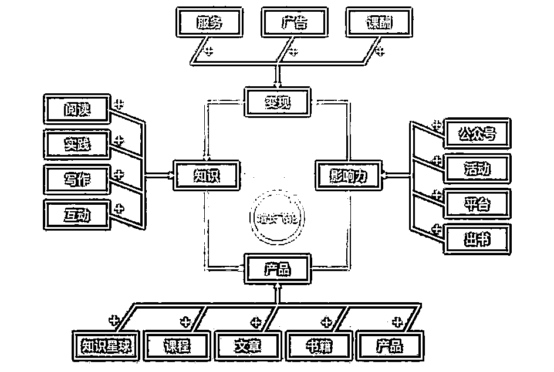 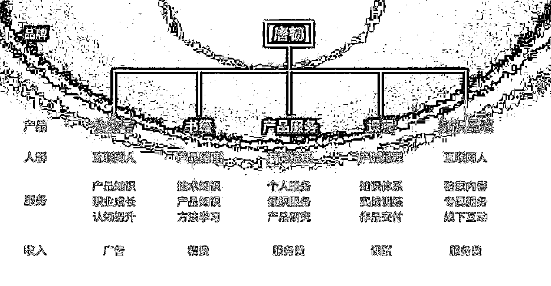

评论区：

 

 

亦仁 : 审核的时间有点久，过了推送时间。

阿狸 : 星主辛苦了[玫瑰][玫瑰][玫瑰]

阿狸 : 谢谢球友的分享[玫瑰][玫瑰]

商家岛旭教练 : 深夜福利，两张图好棒，感谢分享

夏畠 : 像大佬学习[悠闲][悠闲][悠闲]

F先生 : 看了星球里的分享，离职的冲动是越来越强，只是副业营收途径还没建立起来。

王一的爸爸 : 感谢分享

W福禄云 : 谢谢分享❤，也感谢亦仁

# **# ****(**精华帖**)(148**赞**)**作为一个普通人，我是如何

# 通过**4**步成为年入百万的行业专家

作者：  亦仁

日期：2019-06-26

每周三，带你认识一位厉害的生财合伙人。

只要投广告，一定绕不过一个关键问题：转化率如何提升？

而转化率的提升是一个看起来简单，执行起来却又有无数细节的点，我稍微想想就有这么些问题：

视觉/操作重点优化

素材优化

文案优化

互动优化

加载速度优化

AB test

cloak

用户交互优化

信任感优化

。。。

我相信，实际上，转化率的优化可能比这还要复杂很多。

 

 

正好有一位圈友，给自己打造了一个“转化率特种兵”的IP，而且靠转化率优化服务，年入百万，有点服气。

今天，我就把  邀请到星球来做一个分享，看看他是如何成长起来的，他对于职场的看法是什么，以及对于转化率这件事，他是怎么考虑的？

以下是今天的  的分享，enjoy！

大家好，我是转化率特种兵陈勇，感谢亦仁邀请在生财有术做个分享，我今天分享的主题是 “作为一个普通人，我是如何通过4步成为年入百万的行业专家”。

很多人被标题吸引，并带有疑问：“这人之前有多普通呢？他的方式方法用在我身上有没有用？”

如果你有以上疑问，请听我慢慢说来。

小时候：1988年生于安徽省安庆市望江县高士镇下辖的一个农村，家里条件差。

现在：自由职业者，多家公司咨询顾问，转化率特种兵，一年陪伴家人至少10次，年税后收入过百万的行业专家。

下面是我从普通人通过4步成为年入百万的行业专家的线路，这四步分别是：

**1. ** 明确目标

**2. ** 用心打工

**3. ** 持续输出

**4. ** 不断迭代

一、明确目标

小时候家里穷，高中的时候，姐姐在浙江打工，带回来一个收音机，从此通过收音机接触到外面的世界，被外面的世界吸引着，高考因为成绩一般只考上了省内的大学，但是大学期间带家教、搞家教工作室、参加社会实践，当然计算机专业的课程还不能落下。

大学里面有两门课对我影响很大，《》和《》，《》本质上是教人怎么进行资源整合以及考虑极端边界环境发生时应该怎么办，《》本质是教人如何寻找最优路径达到目标，《》这门课程在我后来研究百度和淘宝的自然排序算法帮助很大。

 

 

大四一毕业就义无反顾的去了北京，好在后来在北京几年一直勤勤勉勉，也走了不少弯路，前3年发展很缓慢，到了第四年在教育公司负责网络营销部，在老板的培养下，把专业技能锻炼的更扎实，后来去了金融公司。

从小到大学快毕业的时候经历了太多的事，没有宏大的目标，只有一个简单明确的目标：掌握一门本领赚钱养家糊口，把家人照顾好。

二、用心打工

很多人认为老板给多少钱，自己干多少活，但打工本质上是老板出钱让你做实验。老板付你工资，给你费用，让你去执行、去试错，最后获得的经验是你的。所以一定要用心打工，打工时偷的懒都会变成创业时的绊脚石。

毕业的第一个五年，经历过高不成低不就，以为自己在大公司干过，代表公司谈过上十亿的房地产收购案（11-12年初我在地产公司投资发展部工作），应该还OK，但是找工作的时候发现人家根本不care，开的工资不高，我就不太想去，后来实在扛不住了，就想找个工作干起来再说，正因为有了第一段工作裸辞后高不成低不就的经历，今后的工作就很用心。

经历过工作中连续加班3天3夜没合眼的赶项目进度，经历过每天从家到公司要花小三个小时，路上拿手机打字写文档总结项目经验，还经历过一个营销页改了20多版都没能满意，迟迟无法上线的煎熬，也经历过集团大老板1个电话，我们就要赶飞机过去开会，要是坐高铁过去，他会觉得你在浪费他时间，耽误他挣钱。

一路走过来，吃过苦，得过奖，有过笑，也有过泪。但是从未放弃过，无论生活中遇到什么困难，无论工作中会遇到多大的阻碍，我都是努力工作，努力生活。

工作中发现一切可以优化的点，立即就去优化。

比如在2014年在教育公司负责整个市场部的时候，公司的获客路径是通过线下或线上获取有给孩子报围棋培训班的家长号码，但是号码到预约试听的转化率只有33%，我当时看到这个数据后经验判断这个转化率偏低，于是开始着手优化，发现预约率的主要原因是价值传递不够，于是开始优化售前话术。

从历史的沟通记录中发现多家长喜欢问价格，于是专门设计了一套话术。

当一个客户问价格时，特别是价格远高于同行情况下，该怎么回答？以我操盘的儿童围棋培训项目举例。

客户打电话来，问你价格多少的时候，你想想当你的价格远超同行，你怎么说？

 

 

如果直接说价格，基本就不会有下一步了，因为：

**1. ** 如果只看价格不看价值的话，我们价格远高于同行。

**2. ** 直接问价格的客户是询价的客户，这个时候正确的做法不是说价格。而是：

第一步：提供多种选择，避开主要问题。

家长：在你们那学围棋需要多少钱？

售前客服：家长您好！我们这有初级班、中级班、高级班，分3个月、半年、1年、3年的课程，要看孩子适合读哪种班，才知道最终学费。

第二步：用容易回答的问题来筛选目标用户

售前客服：孩子几岁了？

家长：X岁（如果孩子符合4-6岁的年龄，继续后面的问题，不符合就说不合适在我们这学，低于4岁，记下孩子年龄和家长号码，在系统中记录下来，到了适学年龄的前2周再联系家长，超过6岁，就说不适合我们这种班了，委婉拒绝掉。

之所以第二步问年龄是为了快速判断是否属于目标客户，不属于目标客户的迅速解决，挂掉接另外一个电话，售前客服人数有限，需要把时间留给目标客户。

第三步：把所有可能的情况都遍历一遍+对应的痛点刺激

售前客服：是男孩还是女孩

情况1

家长：男孩

售前客服：性格是活泼好动还是成熟稳重

情况2

家长：女孩

售前咨询问：性格是活泼好动还是文静

情况1.1、

家长：男孩子性格活泼好动

售前客服：家长您好！我们北京有13所校区，最大的校区是望京的六佰本校区，有小1000个孩子，绝大部分家长把孩子送过来学围棋就是因为孩子活泼好动，太闹了，注意力不集中。我们都知道，注意力不集中，学什么都不行，孩子将来可能是个废才，听孩子的幼儿园老师或一些教育专家和朋友说学围棋能提高注意力，所以把孩子送过来学围棋，锻炼孩子的注意力。

 

 

情况2.2、

家长：女孩性格偏文静

售前客服：您还记得您读高中的时候，学空间立体几何和排列组合是不是班里的男生成绩普遍比女生好？

这是个事实，大部分女生的空间想象能力和逻辑推理能力比男生要差，现在生了个女儿，将来读高中也要学排列组合和空间立体几何，你说家长是现在花钱送孩子去学习围棋解决问个问题，还是等将来孩子读高中的时候，孩子痛苦，家长也跟着一起痛苦（辅导孩子数学题也是很痛苦的事）

所以你通过把所有客户的情况都模拟一遍，无论他问什么，你都能回答，并且能刺激痛点+传递产品/服务的价值，你的预约率一定会高很多。

这就是为什么儿童围棋培训项目网络营销团队经过话术优化之后，预约率能从33%提高到74%。

细节里面不仅有魔鬼，还有很多钱。

讲这个案例是想让大家知道，作为管理层平常不能只关注ROI和最终的转化率，要拆解成交的过程中曝光到成交都经过了哪几个步骤？颗粒度要足够细，然后逐步去优化，并且对各个节点的数据要敏感，这样才能把项目做好。作为执行层，要把活干细，细处见真功夫！

三、持续输出

由于之前在工作中专业水平得到了很好的训练，也经常总结，成长的比一般人快，也比较出色，周围有不少朋友请我帮忙指点一下SEO、SEM、页面策划、网站策划等营销有关问题。

我那时候还不是非常忙，我都免费帮忙或者收点费用，那个时候副业收入已经超过主业收入半年多了（这一点特别重要，很多人私下接了一两个项目，赚了一些钱，并且这些钱比工资还要高的时候，觉得这样赚钱更轻松，于是就立马辞职，表面上自由职业了，但是这种所谓的自由还没持续2-3个月就开始找工作，回到正常的上班族序列了，原因很简单，习惯了每个月有工资收入，但是猛然辞职后，项目来源不稳定，无法接受2-3个月都没有收入，但是一直花钱的状态，自己心慌，于是只好回到工作中，辞职做自由职业的前提是:副业收入超过工资收入连续半年及以上，达到这一点就说明你的项目来源趋于稳定，收入大于支出，可以开始职业自由了。）

 

 

在2016年初开始辞职做独立营销顾问，朋友们知道后就开始给我介绍网络营销咨询的项目，2016年做了几个成功案例，其中不乏南孚电池这种知名公司，也有清华紫荆教育、花点时间这种行业翘楚，还被邀请去鸟巢峰会、正和岛等地方讲课。

摸索出一个完善的营销咨询流程，先培训，然后做调研写营销方案，再交付讲解方案，后面就是方案实施指导，最后根据数据反馈不断调整优化直到达到一个很高的转化率。

当然这期间也很累，最长的一次为了写营销方案，连续20多天闭关写方案不出家门，写累了就睡，睡醒继续写，平均每天工作16小时以上，最后诞生了一套200多页word形式的营销方案，有的地方详细到页面上每个按钮的颜色，按钮上应该放什么文字更能吸引客户去点击，有部分版块前端要放到最底部但是后端代码要放在页面最上面，方便Spider（搜索引擎的爬虫程序）爬取，后来做总结的时候发现整个2016年为几家公司一共写了42.7万字的营销方案。

四、不断优化迭代

2016年给自己买了随身的wif发射器，随身带电脑，方便随时查看项目数据和联网进行远程指导，有时候在车上也在打开电脑办公，总之就是要努力向前，做项目的过程中不断的分析和总结，最后有了自己完善又系统的方法论：陈勇转化系统，做独立营销顾问的3年多时间,利用计算机建模、消费心理学、流程管控帮助南孚电池、创维电视、花点时间、清华紫荆教育、无忧保姆、猫王收音机、编程猫等公司提高各类广告转化率30.1%-1750%。

很多人好奇我是怎么将不同行业转化率提高的，其实不同行业都要做好的两个必要条件是：

**1. ** 掌握做成这件事最核心的方法论

**2. ** 坚定不移的执行

两句话合并成一句话是：只有精细化的过程控制，成功才能复制。

也就是你知道怎么做，这件事才能成，然后坚定不移的去执行就好，执行过程中，动作不要走形，很多公司或个人最后都败在执行上。

提高转化率是所有商业企业一直追求的目标，但是他们都跑偏了，忘了，只有顺应消费者购买习惯，才能让客户下单，才能提高转化率，但是他们很少研究人的购买习惯。

我自己总结了一下，我们平常买东西分为三大步骤：

 

 

先激发消费者对该产品/服务的兴趣，然后逐步让让消费者建立对该产品/服务的信任，最后再刺激消费者立刻下单。

但是说明能激发兴趣？说明能建立信任？说明能立刻下单？

这就需要思考我们平常购物过程中，为什么在A店买了，没在B店买？

我们买东西的时候，在A店买，不在B店买，原因不外乎以上这些，你会想到按照每个理由的多少去排序，但是你会发现，统计排序后，没有哪一理由是有绝对优势的。

如果你勤于思考的话，应该讲上诉这些理由进行合并同类型，这时候你就会发现销量高、选品牌、评价不错，朋友推荐、经常在这件买是同一个类型，它们都代表着消费者开始慢慢相信卖家了，也就是整个消费决策中，最重要的是让消费者去相信卖家说的是真的，更近一步思考，信任感会几步？如果让消费者一步一步走向更高级的信任？通过不断的学习（特别推荐罗伯特.西奥迪尼的《影响力》》和项目实践，总结出了陈勇转化系统，这套系统中最重要的就是陈勇转化六要素。

很庆幸自己在30岁之前找到了自己喜欢做的事，这件事还能给自己带来一些钱以及时间上的相对自由，让我有时间可以陪家人，其实：人生就像转化率，是个不断优化的过程。就看你优化的频率和优化的幅度。

希望我的经历能给大家带来一些启发，谢谢！

有兴趣的朋友也欢迎关注我的公众号  陈勇营销专栏  进一步交流。

https://wx.zsxq.com/mweb/views/weread/search.html?keyword=操作系统https://wx.zsxq.com/mweb/views/weread/search.html?keyword=算法分析与设计https://wx.zsxq.com/mweb/views/weread/search.html?keyword=操作系统https://wx.zsxq.com/mweb/views/weread/search.html?keyword=算法分析与设计https://wx.zsxq.com/mweb/views/weread/search.html?keyword=算法分析与设计 

 

https://wx.zsxq.com/mweb/views/weread/search.html?keyword=

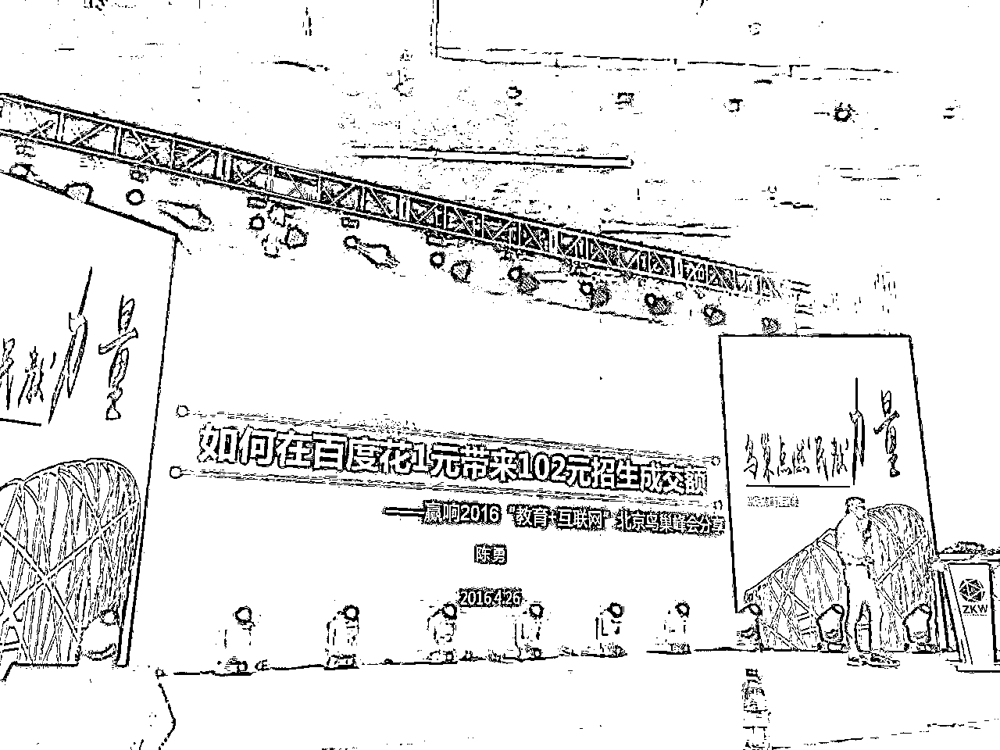 

 

 

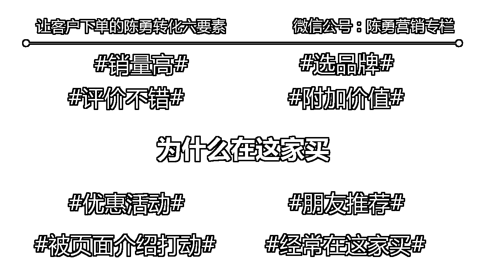 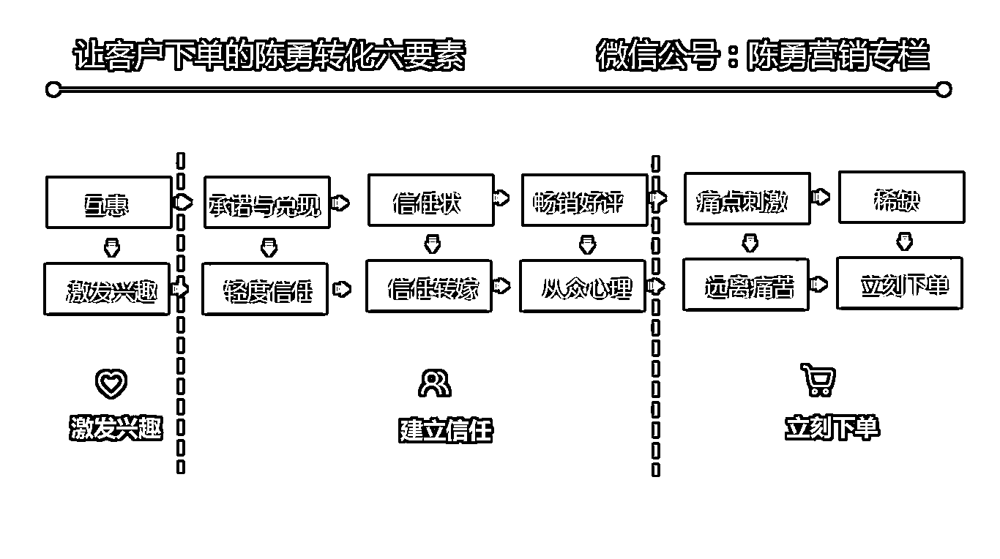

 

 

 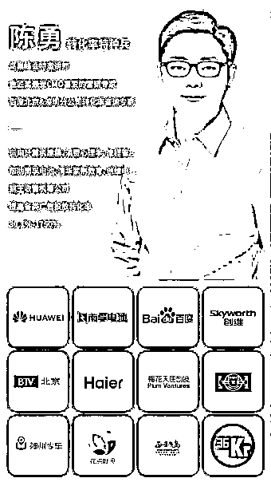

 

 

评论区：

Auroraaa : Cool

BlockD : 听过陈勇老师线下分享，很给力[强]

徐十胖 : 勇哥牛逼[强]

毕强 : 勇哥大神，勇哥牛逼，破音中[偷笑][偷笑][偷笑]

阿哲🍋 : 真的厉害 

叶叶_优势教练 : 陈勇大佬也来我们公司分享过，我领导说他的讲座她都能背下来  阿may : 人生就像转化率，是个不断优化的过程，勇哥这话说得太好了。

小白- 厦门 : 牛逼，在生财圈看到的第二个安庆老乡

# **# ****(**精华帖**)(144**赞**)30**岁那年转做企业培训师，

# 第一年的收入接近**100**万

作者：  胡哲Hugo

日期：2020-08-10

轻享  龙珠  第一桶金  案例分享  思路分享

普通人《一年顶十年》落地案例实操流程

——日入过万的企业培训师是如何炼成的

大家好，我是水月。不久前我发过一篇社群淘客的文章，被老大@亦仁  加精了很高兴。

趁着有空继续回馈球友再写一些干货。

对淘客项目有兴趣的朋友看这里：

今天要分享的不是淘客项目，而是我的主业：企业培训师这个职业。

为什么要分享这个跟网络不搭边的项目？

因为很赚钱！很自由！很长期！很有前途！

这几个理由应该足够支撑看下去了吧？

 

 

30岁那年我转做企业培训师，第一年的收入接近100万。虽然年入百万对大佬来说不算什么，但培训师的收益可不止钱，还有：

1、对学历资历宽容度高可复制

2、课酬自然每年持续增长

3、可以稳稳的做到退休后

4、优秀老师年入千万很正常

5、仅需要自己1个人即可操作

6、自由职业工作强度自己安排

7、人脉广泛高端还持续增长

8、社会公认的高知分子金领光环

9、可发展开来的副业数不胜数

10、进可做咨询退可做高管

就现在的商业环境，符合条件的项目大概在梦里。所以我要开始解梦了：）

前几天偶然看到了@剽悍一只猫  老师新书《一年顶十年》的拆书知识地图。发现跟自己几乎就是书里的落地案例。

所以趁着有时间，就把项目怎么做写出来。算是《一年顶十年》这本书落地案例的一个补充，也给自己做个复盘吧。

全文大纲：

一、我是谁？为什么会做这个项目？

二、选对比努力更重要，告诉你为什么？

三、企业培训师是干什么的？

四、企业培训的收入模式是怎样的？

五、什么人可以做企业培训师？

六、如何找到我的客户？

七、如何开发一门课程？

八、如何讲好一门课程？

九、发展前景是怎样的？

十、如果想开始需要准备什么？

正文开始：

一、我是谁？为什么会做这个项目？

 

 

我是西部一个小山城的IT大专毕业生。从286开始就自己DIY电脑，第一份工作是卖电脑300元一个月，后来陆续做过设计、网管、渠道、销售、市场，最后才是培训师。

现在是广东众多国字头500强的特聘培训师，广东最硬的几个培训机构特聘讲师，主要讲思维、沟通、效率，课酬1.2w一天。

学员就是这些企业的中高管，从试用期到快退休，从中专到博士后都有。

在培训咨询行业做了7年后，我才开始转做培训师，到现在做了8年没换过工作，以后也不会换，自由职业其实也不存在换不换。

毕竟培训师越老越值钱，只要保质保量，每年按行规涨价30%企业都能欣然接受。

而且教育的核心框架更新换代非常慢，每年只需更新案例就可以，基本不费劲。

发展和收入方面，在我认识的老师里，2-5w一天的老师并不少，知名老师的课酬更是普通人难以想象。

这还只是企业内训，如果自己招生自己讲，开一次课赚别人一年的钱并不是天荒夜谈。

想要多赚就多推广多做项目，觉得够了就带家人到处去玩玩享受生活。

到这你应该发现了，这是一个超级长期，而且还会越滚越大还轻松的项目。

所以无论你是处在什么状态，只要你关注收入、人脉、声誉、自由这几点。

那么这篇文章建议你一字不落的看完，毕竟很多企业老板也都在讲课累积人脉和声誉。

那么凭什么是我来写这篇，不是其他人呢？

在培训咨询行业的几年里，我在第一个只有4个人的团队做了下面的事。

我们策划了董明珠和罗振宇的全国巡回论坛，做了14场。

董总当时还是三把手正在发力上位，罗振宇是在央视实习遇到瓶颈想要出走的年轻人。

后面的发展大家都看到，我就不多讲了。

我们策划了唐俊和张伟俊的全国巡回论坛，做了12场。

唐俊当时在盛大准备寻觅下家，在我们其中一场福建论坛遇到了新华都的老板。

张伟俊是当时国内第一位老板教练，也就是现在很热门的老板教练和私董会的鼻祖。

我们创立了国内第一个中国培训联盟，连续做了几年联盟大会。

 

 

全国几百家知名培训机构，几千位老师都是我们的朋友，我几乎给大部分老师改过推广文案和课纲。

现在国内出名的培训经纪公司或者工作坊，用的都是我们当初的部分框架和玩法。

也许这些名人的崛起，跟我们的推广没有关系，但是聪明人绝对不会做浪费时间的事。

刻苦努力跟放大成功比起来，哪个更重要他们比我们更清楚。

其实当时我们只是在努力做事，后来才知道我们做的事，不过是他们突围的踏脚石。

现在4个人的团队只剩我还在培训这一行。

后来我又经历了培训初创公司、专业咨询公司、从0搭建市场销售体系的洗礼。

最后还有从0把自己推出市场成为培训师，稳稳做了8年，拥有上万学员认可的背书。

所以能以我的角度，写企业培训怎么做的其他人，可能是不存在的。

二、选对比努力更重要，告诉你为什么？

有个经典的问题“选择和努力那个更重要？”

打工时我会说都重要而且以领导说的为准。

做培训师后我会说：努力很重要，但是选择更重要，并且拒绝反驳。

从月薪300到月薪1万，我换了无数公司无数岗位，只靠自己整整花了12年才做到，现在回看都觉得这人努力得不像自己。

从裸辞到日薪1w+，我刷完了所有信用卡吃饭，宅了大半年开发课程就做到了，在这过程中依然很努力，但跟之前相比不值一提。

刚开始我认为是7年的行业经验成就了我，后来跟很多老师聊起来才发现并不是这样。

举三个例子说明一下：

1、当初找我们团队推广的张玲老师，开始只是一个比我年轻很多，刚从北京电影学院毕业没有进剧组，讲课生涩的小姑娘，现在已经是业内有名的老师。

2、后来认识的王佩丰老师，也是大学毕业就做培训师，自己公司请了几个销售开发客户，除了上课就是钓鱼带娃，优哉游哉。

 

 

3、就算是40多岁才被我们发掘出来的李伟老师，15年前在TCL培训部做负责人，刚出来是8k一天课酬，现在是6万一天课酬，如果还在企业根本就不可想象。

这样的例子还有很多很多，虽然我也是努力才能看到问题根源，但是如果开始就有人告诉我怎么走，那之前辛苦的12年就是积累，而不是原地踏步了。

所以奉劝大家干得很累的时候，不妨停下来问一问自己，是否有更好的选择在身边，还是说被自己忽略掉了？

三、企业培训师是干什么的？

培训师这个称呼比较笼统，所涵盖的人群和性质甚至客户都不一样，我简单做一下介绍：

大部分人以为的培训师

销售培训师：2c，保健品、直销产品、保险等等卖货的老师都属于这类。这些老师都归属公司，领固定工资加提成，说到底就是销售薪酬不高也不稳。

鸡血培训师：2c/2b，以陈安之为首的成功学徒子徒孙，加上各种被妖化的nlp和教练技术课程老师，特殊年代的产物，曾经很赚钱现在没有那么疯狂了。

企业培训行业的培训师

企业内训师：只服务自己企业，管理人员兼职为主。有些企业把授课算在绩效里，有些会有少量课时费，课程以公司业务和专有知识为主，市场化的可能性为0。

在职培训师：正职是公司管理人员，有机构或者公司邀请讲课才出去讲，属于兼职性质。公司不一定允许，对外课量很少半市场化。

企业培训师：2b，以跳出来的大型企业中高管为主，也有部分专业技术人士，通用管理类课程为主，完全市场化。

我正在做的就是最后一种企业培训师，我没有大型企业背景，所以是属于专业技术人士。

四、企业培训的收入模式是怎样的？

企业培训笼统的可以分为内训和外训。内训就是把老师请到企业内部授课，外训则是把员工派出去学习。

 

 

内训的学员是同一个公司的员工，主办方是公司。外训的学员是各个公司的员工都有，主办方是培训机构，外训也称为公开课。

一个培训通常有三个主体，甲方公司，乙方培训机构，还有受机构聘请的老师。

大部分的老师都是专业人士，没有市场推广的能力和经验，也不想操心课程前后的麻烦事，所以就有了中间培训机构的存在。

内训的分成比例是这样，老师课酬占了4-5成，培训机构大概占3-4成，剩下是税费。

如果开公开课就不一样，成本是老师课酬加会场费用和杂费。如果自己就是老师，就只需要会场费用和杂费就可以开课了。

从我的经验来看，2800一个人的课程，3个学员能平本，5个学员能盈利，30人课室坐满，收入相当于老师做10次内训甚至更高。

如果觉得2800的课程很贵，那有8k两天就学个思维导图的课程，恐怕有人想骂人。

不过大家智商其实都差不多，能收这么贵还有人去，课程就必然有过人之处。

五、什么人可以做企业培训师？

关于人群类别：

1、大型企业中高管辞职做培训师，也许有人会想到在行，企业培训师做在行是分分钟的事，反过来让在行的人讲课就不容易了。

2、专业技术人士转做培训师，要注意sap这类老师是没办法市场化的，顶多只能去甲方工作，所以这里指的是通用管理类的专业。

关于年龄问题：

我30岁做培训师经常被说很年轻，但是我上面举过两个例子，都是刚毕业就直接做培训师的，所以年龄不是问题，有料才是王道。

关于形象发音：

这个真没有太大问题，大部分老师都是普通人，有口音的老师比比皆是，包括我也是，能让客户听懂就足够了。

关于培训师认证：

 

 

这个认证只是给内训师，或者企业管理人员升职用的门面，对于市场化培训师没有必要，而且最近国家也取消这个认证了。

关于TTT培训师认证：

TTT认证是几个外国老师自己弄出来收钱的，没啥效力，包括国内的改良版STT也是同样的情况，这知道的人就没几个了吧。

所以普通人要做企业培训师就一句话“无限提高专业能力！”

六、如何找到我的客户？

3年前，我发现网络运营的知识，在大型企业里面是个空缺。

就找了广州做裂变挺出名的团队聊聊，希望能帮他们把知识体系引入大型企业。虽然各种因素的影响，到目前还没有太多进展。

但是可以明确的是，大型企业这种客户大家都是欢迎的，以前不做只不过是不会做而已，跟很多新入行的培训师问题一样。

他们最大的问题是看起来所有企业都有需求，但是又觉得不太对摸不着门道，也不知道要做什么。

培训机构和课程也分行业和专业，在这里我就不一一展开讲了，只讲最常见的通用管理课程的客户应该怎么找。

1、对于想开公司的朋友：

既然是tob的业务客户必然是企业，管理类课程必然要求企业需要管理，而不是小猫两三个的公司，或者几十人的公司。

我们的习惯是看公司总人数，按照一个人管10个人算，100人的企业只有10个管理者。

这种公司一年派一两个人，上一两次公开课就顶天了，做内训成本根本扛不住，这类公司基本不用管。

500人的企业可以开始研究销售额和利润是多少，培训经费是利润的2个点左右，分析能做的份额，再决定是否要花时间。

公司类型也要分，互联网公司通常不看，大部分员工几个月就跳槽，试问哪个老板喜欢帮别人做嫁衣？

 

 

总的来说大型企业500强以内，行业前5的企业基本就是我们的目标客户。

目标客户有了就要找到关键人物，培训负责人、hr、老板都有可能是，找到他们把肌肉秀出来吸引他们，这事就算有谱了。

2、对于只想做老师的朋友：

如果是不想自己找客户，只想专心做老师就更简单。

找到当地的培训机构要求合作，上门给培训销售试讲，让他们知道你讲得怎么样，教会他们怎么介绍你的卖点就可以了。

也可以自己注册公司，请几个销售用上面的方法，让销售去帮自己开发客户。

大城市一天内训课酬，可以支付一个销售的月薪，只要课程质量保证，有几个客户就够优哉游哉的生活了。

3、小结一下：

市场销售其实没有这么简单，但是上面写的就已经是核心逻辑了。这行销售只要不离上面的道就会有结果，区别只有快慢而已。

七、如何开发一门课程？

开发课程是一门很成熟的技术，百度或者买一本相关的书就可以。流程无外乎确定课题、搜集资料、提取框架、回填内容。

要注意的是开发课程的核心虽然都一样，但是实现的方法却有很多种。针对不一样的用户群体和基础，可以选择不同的方法。

在这我提供一个最快的方法：抄作业

1、找到自己课题对标的老师课件

2、选出最完整的一份课件资料

3、把这份课件的点完善成小短文

4、参考其他课件调整结构并完善

5、跟不同人的试讲持续调整完善

按照上面的流程走，如果是专职每天6小时做这个工作，课题不复杂的话，两周就能出来一门课程。

 

 

如果是下班后每天抽2个小时做，一个月内也应该能出来一个可以用的课程了，可以后续多讲多完善。

不要完美主义50分就可以上战场，新人不知道什么叫完美，经过市场验证的就是好产品，新人不必要大动干戈创作和修改。

八、如何讲好一门课程？

讲课这个话题就非常复杂了，虽然现在网络教育平台老师满天飞，但是如果以企业培训的标准来评价的话，网络老师能打的不到10%。

意思就是现在网络教育平台的老师，要是直接去企业讲课，被赶出课室或者不给课酬甚至当场被学员呛的可能性非常大。

除了水分太多之外，就是很多所谓老师都只是在读稿，甚至是请人来念课件，比如某知名PPT老师几乎就占了我说的全部问题。

讲课真要研究起来，也是有很多现成资料和书可以作为指导的。

限于篇幅我提供一个如何开始的方法：

1、找齐所有同类课程视频

2、删除连目录都写不好的课程

3、用2倍速把剩下的课程各看两节

4、删除自己都听不下去的课程

5、精选出2门课程2倍速听完

6、根据以上经验调整自己的课件

7、开始录制自己的视频课件

8、精益求精多次推倒重来练习录制

9、视频放到教育平台看学员反应

10、开始着手线下练习面对面授课

按照以上的流程练习，只要次数足够，授课技能就已经可以打败90%的网络老师，也可以打败60%的企业培训师。

后面的继续精进也有方法有技巧，但是后话了，做好上面的就可以出去行走江湖了。

九、发展前景是怎样的？

 

 

开头的时候提到了@剽悍一只猫  老师的《一年顶十年》，在咨询行业也有类似的说法，做咨询师所获得的经验1年顶打工3年。

虽然只有三分之一的功力，但是对于普通人来说也是够夸张的了。究其原因是因为角色不一样，打工来来去去就是公司内小圈子，咨询和培训是服务各个大型公司。

一年面对的大型公司，做项目少的也有四五个，做培训多的有几十上百个。不同公司的管理问题和解决方法我们都看在眼里，经验几乎是被推着做积累。

所以正如我一开始讲的，企业培训师做了一段时间后，进可以自己做咨询或者做公司，退可以轻松回到企业做高管，不进不退也可以优哉游哉讲课投项目。

十、如果想开始需要准备什么？

最后的问题，到这里大家都应该明白，做企业培训师最大的投资就是资料和时间。以前网络教育平台不发达，我开发课程除了自己买书，还把家搬到了图书馆旁边。

现在满网络都是课程，虽然质量参差不齐，但是作为开发课程的资料库却是如虎添翼，自己再买一些课题内的精品书就可以了。

关于耗费的时间第七节有提到过时间估算，这是以我自己的工作效率作为标准的，各人可能会有加减。

把每天的时间用来做产品和练习，输出一个有机会快速突破自己的产品，这个产品还会让自己终身受益，何乐而不为呢。

你唯一需要准备的就是马上开始。

总结：

给一个信息大家，自己开发出来的精品课，就算不做培训师，把课放到网上也是可以持续赚钱的。

我做第一门课程的时候，国内教育平台连半个都没有，课程放到了国外的udemy售卖，到现在8年了还在为我创造收益。

后来网易云课堂从抄袭udemy开始，我再把课程放到云课堂去，开创了他们1元做销量的策略，同样现在还在为我创造收益。

短期与长期、风口与稳定、数量和质量、焦虑与安定，永远都是相对的，我们只能选择其一而不能兼得。

 

 

不要埋怨为什么没有好的项目可以做，要问就问自己的心在哪里。

最后附上一些老照片给大家，看看年轻的董总和罗振宇(罗振宇貌似样子没变过啊[偷笑])。

倒数第二张照片是9年前，我第一次开课拍的，最后一张是前几天的课堂现场。

好啦，分享就到这里，很长很长，希望大家都有收益，谢谢大家。

https://t.zsxq.com/mQVbIYn

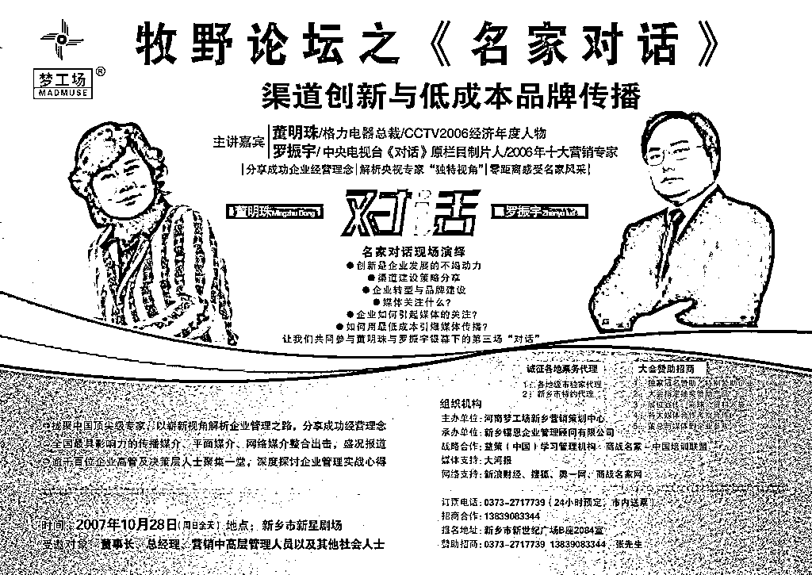

 

 

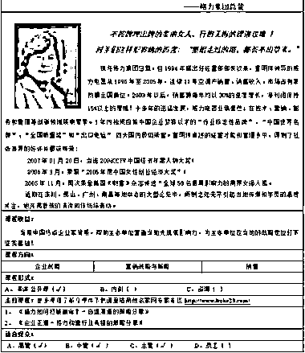 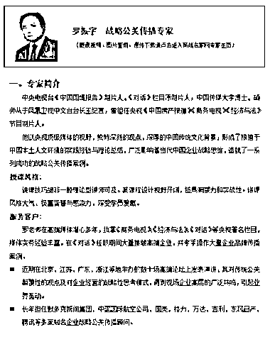

 

 

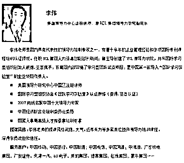 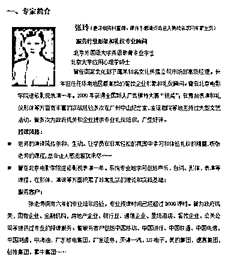

 

 

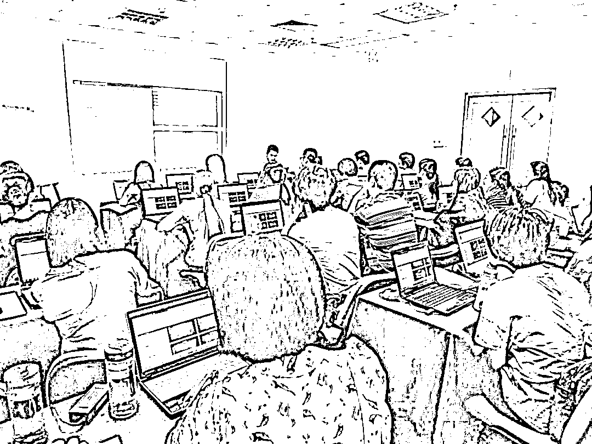 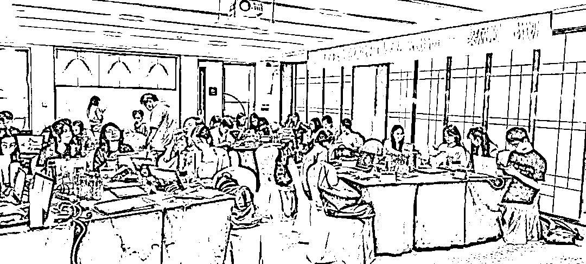

评论区：

 

 

李春辉 : 龙珠预订[呲牙]

胡哲Hugo : [抱拳]

韩俊杰 : 太牛了！核心逻辑非常清晰，操作起来！有点结果了再找大佬请教[强] 九京 : 太赞了👍必须加老师微信学习。

胡哲Hugo : 希望能帮到你[抱拳]

胡哲Hugo : 互相学习[抱拳]

李宏 : 简直了，拜读

胡哲Hugo : [抱拳]

# **# ****(**精华帖**)(136**赞**)**短短一年，收获**2000**万美

# 食、评测类短视频粉丝，是怎么做到的？

作者：  亦仁

日期：2019-03-06

66赞达成，如约放分享。

每周三，带你认识一位厉害的生财合伙人。

今天这位是大家的老朋友  ，在第一期的时候就给大家做过分享，然而老树开新花，短短一年时间，他和团队成员又在短视频IP领域走出一条路：2000万美食、评测类短视频粉丝，随着抖音产品更新导致的涨粉难度增加，这波红利，  算是吃到了。

一次成功可能是运气，多次成功一定是有方法论的，所以今天我又邀请老戴来给老圈友、新圈友做一个分享，创业多次成功的秘籍是什么？

以下是分享原文，enjoy！

Hi，大家好！我是戴宏民，很高兴受亦仁之邀来分享，我是2010年开始创业，到今年是第9年，期间主要有几段经历，第一次是做工艺品电商，产品是龙泉宝剑，现在是宝剑行业全网比较领先的电商公司，年销售大概几千万；第二次是做区域自媒体矩阵，200万南京本地公众号粉丝，千万规模的年营收；第三次比较波折，之前做过一个小程序西瓜足迹，现在也在孵化短视频IP，主要是测评、美食类，目前全网大概2000万粉丝。下面 

 

分享几次创业过程中的经历和心得，希望能对大家有启发，欢迎圈内的朋友加微信交流：daihongmin。

1

我学了7年计算机，由于研究生期间在百度实习，2009年毕业后就加入百度，工作一年多之后脑袋一热就创业了。很多人第一次创业都类似吧，可能看了某大佬的视频演讲，一腔热血一上头，下定决心辞职创业，然后给自己定了个目标，XX岁前财务自由。梦想很丰满，现实很骨感，如果大家都了解创业过程的苦逼，以及大多数的XX岁前财务自由都不会实现，可能很多人都不会选择创业吧。我回想自己第一次创业，当时入职的是百度上海研发中心，一开始是做百度的日文业务，后来由于跟北京同事配合做广告系统长期在北京出差，应该是在出差过程中萌生了脑袋一热的想法。当时离职时其实并没有考虑清楚创业做什么，也没有做太多的准备，这也反映出当时的自己是一个很不成熟的创业小白，所以后来能活下来也有不少运气成分。

决定创业后做的第一件事是找了一个合伙人，原本一位老同事L计划着一起干，后来权衡各种风险后L没下定决心。正好高中时的一个好友当时也有换环境的想法，我们勾搭了下，一拍即合，于是我们第一次创业的初创团队就算组建完了，到现在我们已经合伙了9年。经常看很多讲创业的文章说合伙团队很重要的是技能互补，我的体会是人靠谱三观兼容更重要，这样才更有可能走的远。

当时做的第二个选择是搬到义乌，我们定的是做电商，觉得义乌产品多，能更接近货源。于是我们去义乌租了办公室和住的地方，其实就是江东那种五六层高的小楼中的一间，一居室，卧室睡觉客厅办公。我们一开始想做的是玩具电商，基本跑遍了义乌小商品城做玩具批发的店面，后来批发了一些货，我记得有不少是魔术道具。搬回当时租的地方，一玩傻眼了，产品质量参差不齐，可能有一半都很差。于是继续选产品，某天在义乌小商品城看到龙泉宝剑，莫名的就感觉这个产品很好，回来在网上了解了这是非物质文化遗产，之后找到了类似龙泉企业黄页的资料，电话联系了几十家做大宝剑的工厂，其中有一些有兴趣，接着去龙泉面谈了下，由于当时我们初创没有积累也没有资本谈条件，合作条款很简单：先干活、不收费、产生销售后分润，所以基本面谈后对方都有合作意向，最终我们选择了与当地最大的工厂深入合作。也正是因为这样的合作条款，让我们一直处在要逼自己一把的环境里，必须要做出效果。

由于之前在百度工作，所以我们一开始选择做独立网站。网站是用当时开源的ECSHOP改的，推广边学边干，报名了当时一个论坛办的网络推广的公益培训（在这里认识了现在团队中另两位合伙人，也因为这个培训才有了第二次创业的机缘），产品拍摄、文案、客服、售后全部是我们两人完成，大概是2010年11月中旬签了合作协议，12月初网站上 

 

线正式开卖。当然，我们做独立网站前分析过百度指数，对当时网络推广的一些方法也做了梳理，通过搜索引擎做了竞品的详细分析，整理了产品相关的核心关键词，推广的目标很简单，搜索这些关键词出来的前几十个结果，不管是网站、论坛、还是问答平台，做到全覆盖。很多方法的效果后来慢慢体现，前6个月业务逐步开展起来，后端与工厂的配合也在磨合，后来开始做竞价推广后业务开始每月翻倍增长。伴随业务快速增长，组建了运营推广、客服团队，入驻淘宝、天猫、京东等平台到全网覆盖，基本从2011年底开始就一直保持这个细分行业领先的位置，对于小白创业者而言，在这个实操过程中补了不少课，也因为业务开展过程中的合作，团队加入了新的合伙人，有原来北大的同学、南大的校友，也有在别的社群中认识的创业朋友，为后面几次创业打好了基础。

其实创业往往都不像外表看起来的那么光鲜，过程充满了琐碎的细节，举个例子，跟工厂对接发货，早期其实我们是手动制作excel表格，对于传统的非标品生产工厂而言，可能连库存管理系统都没有，后来订单多了网站后台每天自动导出一份订单列表，再根据工厂发货所需要的格式写一个excel公式，自动转化成发货人员能看明白的格式，这是当时能让业务顺利开展的最简单的方案。现在来看自己第一次创业的过程，能活下来确实也是运气不错，如果一定要总结什么经验的话，就是把活做好把事办成。

2

2015年7月，参加培训时认识的一位老大哥联系过来说有一个好项目，那个时间我们电商业务也面临增长瓶颈，团队也在寻找新的增长点，于是基于双方的信任，经过一小段的考察和磨合就决定一起合作孵化这个业务。现在各地的生活类自媒体已经很成熟，当时这个市场还处于发展期，虽然我们是新进入这个市场，但这个业务比较巧妙的是早期通过微信打印机来获客，极大的降低了获客成本。简单来说，用户在各个商场餐厅门口会看到微信打印机，等位时扫码关注公众号后就可以免费打印照片，吸引粉丝后我们在公众号中提供高质量的本地生活资讯内容，进而通过广告和电商等方式进行商业变现。

对于我们而言这是跟之前做电商完全不同的领域，线下地推部署打印机对于我们是陌生的一项工作，在合作方之前试点的经验指引下，早期我们所有合伙人都参与线下拓点部署工作，由于当时线下打印机市场还相对空白，很快我们在南京主要商圈部署了300台微信打印机，以很低的成本快速积累了大量粉丝，给我们打造内容团队提升内容质量创造了比较好的环境。红利总是短暂的，我们启动半年后微信打印机的模式就开始泛滥，获客成本也逐步提升起来。当然，对于市场中已经有积累的团队，门槛提升往往不一定是坏事。

 

 

每次创业都有血泪史，由于创始团队成员都没有专业的内容背景，我们经历过内容团队的不稳定，直到一位既有传统媒体又有新媒体经验的内容大牛加入，我们的内容能力才有了比较大的提升。创业路上该踩的坑可能一个都不会少。

3

第三次创业我们刚开始不久，人的欲望是很可怕的东西，你有了一些就想拥有更多，每次都想做出更大的成绩。看到很多大佬的状态，逐渐能够理解创业很可能是一辈子的游戏，也习惯了创业的生活方式。我们被很多人知道是去年做了一个叫西瓜足迹的小程序，一直没有公开分享过当时的数据，大概5000万UV，两亿PV，这算是创业过程中既美好又痛苦的经历。其实我们现在更多的是在孵化短视频IP，主要是测评、美食等领域，大概半年前开始启动，现在全网大概2000万粉丝，感兴趣的朋友可以抖音或快手搜索下信口开饭。我们最早接触短视频也是因为电商业务要低成本获取流量，直到投入专门的团队探索这个方向才发现其中的巨大潜力，套用一位大佬的经典句式，图文时代的内容和业务都可以用短视频重新做一遍。决定了创业但不知道从哪入手的小伙伴可以关注一下，也许这会是一个好的切入点。

大家可能会发现这个分享越往后业务细节越来越少，因为很多业务是比我更专业的合伙人和团队在负责，现在自己更多的精力在找人、磨合团队、看方向。对短视频方向感兴趣或是刚起步的创业者欢迎来勾搭，我们的经验也许能让你少走点弯路。各位同行异业也欢迎来交流，冬天来了，要抱团取暖。

最后分享三点这几年创业最重要的收获，也是我经常喝的三碗鸡汤。

1、人要靠谱活要细

这是成功的必要条件，但不是充分条件。其实创业没什么神秘的，就是做人做事。做人靠谱是基本原则，是你的就是你的，不是你的不要拿，对员工负责，对投资人负责，对合作伙伴负责，该你负责的就要负责。做事活要细，人和人的能力能有多大区别呢，往往区别在有的人60分就满足了，有的人总想追求120分。

2、多找几个合伙人

经常听到一句话，一个人走的快，一群人走的远。创业初期很懵懂的找到了合伙人，几次创业过程中也因为各种机缘在不同阶段融入了新的合伙人。吴军老师有门课叫科技史纲60讲，里面第一个观点就是“一切都是能量和信息”，用这个角度来解释合伙团队的壮大就是能量总量的放大，能量超过正在做的事的需求就会形成正反馈，你能升级老业务孵化新业务，能伴随环境的变化而进化。

 

 

3、顺势而为

我们经常需要权衡是应该把握红利还是应该坚持专注，是应该不给自己设限还是应该了解自己的能力边界，其实也不用奢望逮住所有红利，抓住一两个小势应该就能活的很好了，把握住一个大势可能就飞起来了，我们其实也一直在等待属于我们的大势。

最后再次感谢亦仁，请大家忽略文中看起来像装逼的部分，我们只是个创业路上不断探索的小团队，欢迎大家加微信交流：daihongmin。

评论区：

TikTok Gia* : 沙发

小八 : 很精彩

杨涛 : 一路向北

戴宏民 : 分享了一些创业过程中的真实经历和个人感悟，希望能对大家有启发，我们还在路上，一起加油[愉快]

黑少爷 : 感谢戴老板，精彩[强]

Aladdin : 戴总威武

某个张三 : 厉害

明白（晚9点半睡觉） : 谢谢大佬，学习了

# **# ****(**精华帖**)(121**赞**)**十年回首传统媒体变现记：** **

# 我凭创业赚的百万又是如何凭实力亏掉的

作者：  何靖

日期：2020-05-01

十年回首  传统媒体变现记  生财复盘——我凭创业赚的百万又是如何凭实力亏掉的！

418加入的生财，看了两周的精华帖，收获很大，很早就知道生财，后悔没早点加入！

五月的第一天（应该也是生财有术五月的第一篇长文），谨以此长文来补上近两周的主题作业  自我介绍  分享我关于传统媒体的工作及创业经历，过程中赚到过百万，也因为种种原因，凭实力又亏掉了大几十万，虽然是十年前的经历复盘，但相信总会让有心的人有所收获，闲话不多说，开始分享！

 

 

一、初出茅庐  成长历练

来自江西的我，目前坐标北京，02年来北京上大学，大学期间跟朋友小打小闹做彩铃项目，有了相关的基础积累，通过老师介绍了实习的机会，开启了音频录音及广播节目内容制作工作。

实习工作过程中由于比较上心而且做的东西不错，被合作伙伴，一家只有5个人的创业公司挖过去负责节目开发，算上我，当时公司6个人，也是在这个过程中认识了对我影响很大的Y老大（Y老大之前是一家国内教育公司的高管），手把手教我怎么带人，怎么组建团队，怎么处理事情，加速了我的成长（现在想想那时候真是苦，由于公司就我一个人会做节目，所以这块基本上没人能帮忙，只能自己想办法解决问题，然后招人，带人，熬过了1年多每周都通宵做节目的日子）

经过2年多的发展，公司从6个人扩大到150多人，节目覆盖全国300多家广播电台及800多个频段，我当时负责整个节目内容开发团队及市场团队，开发了9档不同类型的全国电台日播的广播节目（当年的节目品质绝对是全国数一数二的，合作的主持人有各大广播电台主持人以及现在的配音界大V-阿杰、刘校予等，北京奥运会之前还跟韩乔生老师合作了一档奥运类的体育广播节目，也是当时比较有特色的节

目），通过提供高品质的录播节目，向全国各地的广播电台换取贴片广告时间，然后我们再以节目中的广告时间来进行变现（一开始主要的变现手段是去接一些品牌广告，但是持续性比较差，而且周期比较长，后续通过SP的彩铃下载、短信签名等业务找到了更高效的变现方式，也为后续的业务爆发提供了基础）

由于之前跟TOM、空中网、华友、A8等SP的合作，逐步了解到互动答题类型的IVR业务发展迅猛，后来又经过在中国电信的朋友验证，说有人开始做类似的节目了，于是利用2年多的广播媒体及节目资源开始了业务的广告投放测试，发现效果非常不错，07年开发出最早的广播电视互动答题类节目，类似于前两年比较火的冲顶大会，迅速做到了行业前三，通过SP的IVR业务变现，业务做到月千万收入，70%以上纯利！

了解SP行业的都应该知道，好景不长，几个月时间，最赚钱的业务受SP行业影响开始下滑，公司由于后续加入股东过多，意见不统一，逐步要放弃下滑的业务（当时想赚惯了快钱确实看不上其他的了），中间也尝试了很多业务，比如音频的播客网站、电子杂志、广播购物等，最后老板们开始想往传统餐饮行业转型，后来我离开后，果然开了一家湘菜馆（这个决定其实跟之前就比较矛盾了，近几年也跟之前的老大也聊过，他说当时一下赚到钱了，几个股东就想收缩，找点稳当的业务做，最后选择了开餐馆，后续没开多久也关门了，之后转型做自主品牌的电商去了）

 

 

当年的我年轻气盛，觉得公司在赚了这么多钱的情况下，不坚守本来的业务找方向，有点难以接受，决定辞职，重新寻找方向！

08年中旬离职后不久，之前带我的Y老大也由于跟其他股东意见不合，选择了离开，跟着之前的Y老大做了几个月的教育类网站产品！

到08年底，发现广播及电视上又听到和看到了之前做的类似节目，翻来覆去想了好久，觉得之前的业务放弃了实在可惜，如果坚持下去，觉得肯定还是能有所发展的，Y老大给了我一笔50万的天使投资，从此开启了三年的创业之旅！

二、首度创业  喜忧参半

不服输，不信邪是年轻人的天性！是的，我当年也是如此！

09年初开始组建团队（我+1个合伙人+2个制作+1个产品策划+1市场+2个兼职主持人）注册公司，开启了丰富多彩，喜忧参半的三年创业之旅！

初步想法很简单，公司要有收入来源，要赚钱！通过之前合作过的SP了解到当时还有几家公司有通道（跟现在类似，有的业务你感觉不行的业务，但是还有人在持续投放，说明肯定是有利润的），还可以做之前的互动节目，于是在还没有完整节目的情况下，先跟华动飞天（A8音乐）、广东新媒、广州海岩（37游戏的前身）、天盈九州（凤凰网）等几家SP建立起了合作关系，拿到了合作产品号段资源（说明一下：SP分全网SP和地区SP，简单的理解就是全网的号段可以在全国都可以使用，地区的只能在当地省份使用；按IVR语音按拨打时长付费，一般在2.5-3元/分钟，跟SP合作的分成谈的好的话是可以做到1：9的，注意是我们拿90%，他们拿10%，会存在一些坏账，基本可以忽略，为什么分成他们拿那么少也愿意？你可以理解他们当时就是起到了一个支付通道的作用，类似于现在的支付宝和微信支付，只不过需要设计产品，还有一点是因为当时SP有一个需要冲业绩保业务评级的概念，所以冲流水也是他们的任务之一，当然也会存在扣量的问题，细节就不展开了）

从一套两居室开始，几个小伙伴开始了没日没夜的创业之旅，我负责节目内容的出品以及SP合作的接入，合伙人负责电台及电视台的合作，由于我们人员有限，短时间内也没有之前节目的支撑能免费提供给媒体换取广告时间（所谓的支撑反而是为后续埋下了一个坑，后续再表），所以打算以专题节目广告投放的形式先与电台和电视台快速建立起合作关系；

 

 

接触过广电媒体的都知道，媒体所处地区越发达，覆盖越广价格越贵，比如卫视、省台啥的，我们当时的资金量是不敢去做尝试的，因为我们要的节目时长最少都需要在25分钟左右，时间太短的话节目效果会很差，风险很大。（这里有个概念，也是后续很多朋友问，为什么你们投放的价格那么低？因为看广播电视的刊例价都高的吓人，而且一般都是什么10秒、15秒或者是几分钟的小专题，你们为啥节目时长那么长而且价格那么低？因为我们对这个媒体生态很了解，以及最关键的一点是在当时的那个环境下，他们很难不跟我们合作，因为当时正是全国打击医药类专题节目的时候，所以地方电台及电视台很大的收入来源被直接切断了，很多媒体没有选择！所以我们知道他们需要什么，能给他们提供的是他们没有的内容资源，或者说是可以帮他们创收的资源，还有就是合作洽谈方式不同，史玉柱的《我的营销心得》一书中也有写到类似的广电媒体投放，感兴趣的可以看看。）

所以我们根据当时的资金情况，决定采取属于我们的农村包围城市战略，先从县级、县级市、地级市三个级别开始电话探寻播出时段及报价、把省台、卫视先放一边，暂时不考虑；（现在回想一下，主要还是钱不够。。。当时要是投卫视，哪怕价格高点，ROI也是能收回来的）

在一边探寻时段和报价的同时，我们还制定了一个风险相对可控的策略，就是试播策略，类似于现在的测试投放，我们跟广播电视媒体谈合作都按年度或者是至少半年的框架来起谈，然后结合节目合作的方式来跟对方的主任要个低的核算到月度的报价，有些县级和县级市的价格可能一档25-30分钟的日播节目时段，一个月下来在3000-50000不等，黄金时段会贵一点，但是地区差别比较大，比如百强县就要比一般的贫困县的报价高很多，但是对于没有效果的广告投入来说，其实不管多少钱，都会觉得是浪费，所以我们会按月广告费核算到每天多少钱，然后在这个基础上加倍给到媒体，要求试播3天或者7天，比如一个月是3000块，一天就是100块，那么如果你让我试播3天，我可以给你600块或者1000块，而且当时跟主任说我们可以不要票，也是比较好的谈法，你懂的！当然借口是调试节目内容或者说是看看节目效果如何，这里的效果其实对我们当时来说就是播出后会有多少用户参与节目并产生收入，效果好的话我们会直接签下来长期的，而且会把该电台或者电视台的其他空余时段也一起打包拿下来，记得当时有几个地方台一天早中晚几个时段都在播我们的节目，前提也是测试几天，最后留下效果最好的时段，效果不好的就会果断放弃，哪怕短期多花点钱，也为后续止损。

 

 

制定完相应的策略后，业务开始逐步运转起来了，主要说一下探寻县、县级市等广电媒体有些地方台给我们带来了让人惊呼“我X！牛X！”的震撼，当然跟当时的节目类型有很大的关系，印象最深的两个地方，一个是位于云南省红河哈尼族彝族自治州的下辖县，泸西县，这个当时估计也就30多万人口的县，我们每天25分钟的节目，一个月的节目播出成本，也就是广告费是3000块，你没看错，3000块一个月！

合到一天是100块钱广告费！当时都不太好意思聊试播了，节目播出第一天，我记得收入是2万1，当时就震惊了，但是节目播出的第6天，台里就扛不住了，只能停播。

后续还有就是安徽省安庆市下面的望江县，收入没有上面那么夸张，但是也是极高的投入产出比，可惜节目类型原因都没能播出太长时间，通过这两个地方的爆发，让我们更加坚定了之前的策略，就是探寻1300多个县和300多个县级市的可播出媒体资源，复制以上打法。

当时还是太年轻，以为以上的几个地方是个大概率会出现的，由于资金有限以及覆盖地区太广（当时最高峰一天几十个台播出），有的地区没能严格控制成本及付款方式，最后整体利润比预计的要低不少，最关键的是好景不长，遇到了之前说的问题，SP行业在09年下半年开时已经基本上步入尾声了，号段产品资源也逐步关闭了，相当于现在产品没有好的支付通道了，也就是说做了不到半年的时间，整体算下来应该盈利也就不到200万（虽然赚到了账面的百万级，但是后来凭实力基本上也亏的七七八八了。。。）

09年下半年开始到10年初便转型做传统广播节目，开始推广合作及寻找新的变现机会，可能是账上稍微有了点钱就开始不自在了，总想着去做这做那，我们其实在之前项目启动后两三个月就启动了传统的广播节目制作业务了，一方面是延续之前没能坚持的东西，另外也就是想再通过优质的内容来换取贴片广告时间，让公司能够有业务继续做下去，所以也就是在这个阶段把团队的人员扩充到了20多人，换了大的办公室，装了录音棚，做了两档广播节目，运营成本一下就起来了，差不多坚持了半年的时间，期间一直在做内容，基本上没有收入，再看看账上的资金，此时已经亏损大几十万进去了（所以第一次凭实力亏掉的几十万是持续没有收入的高成本消耗！），难道这条路真的少了之前变现的方式就走不通了吗？短期看可能是的，但是当时没有坚持下去！在Y老大的建议下于10年4月左右开始忍痛裁员，缩减成本！重新调整方向！

@2010年6月初入局当时应该还是不到百团大战的团购网站项目！当时我们还被作为草根代表接受了《第一财经周刊》的团购专题封面报道，在无技术、基本上无互联网经验的情况下几天时间网站上线！开启了互联网的探索！

 

 

@团购网站期间自己的网站没赚到什么钱，但是过程中通过选品跟各大团购网站合作，做出了独家的两款爆品（一款生态玩具以及一款通用体检卡），赚了几十万，但随着千团大战及后续的发展，发现自身缺乏太多关于互联网行业的经验，中间也花了几个月时间专门学习了网络营销等相关知识，打算再次通过职场历练自己，最终首次创业之旅在2012年划上了暂时的句号！（故事太长了，团购及相关的后续经历如果感兴趣的话，之后有时间再跟大家分享）

三、十年回首  生财复盘

虽然是十年前的经历复盘，虽然项目有他的时代特殊性，虽然有人会认为是不是有点灰，但分享出来我相信总有人能从中挖掘到其他思路！

传统媒体的价值也是值得再去挖掘的，不管是广播还是电视，都有属于该媒体的特性，毕竟官媒对于有些类型的用户来说信任度的建立和背书天然就要比其他媒体高！

试播或者试投放，你得去试才知道，但是什么时候该坚持，什么时候该及时止损，这个问题也是值得思考的，我做的不好，也要继续学习！

千万不要觉得你比别人聪明，觉得大部分人都是傻子，往往踩很多坑的人就是认为自己比别人聪明才上当的，对待有些事情做个傻子挺好！

项目分享完了，之后我也经常会有以下的假设和思考！

如果当初坚持搞音频内容，那么熬到喜马拉雅FM、荔枝FM等网络电台的机会出现，也是个不错的选择，但是，谁能知道呢？

如果当初去投放卫视，是不是可能获取的用户会更多，投入产出比也会不错呢？是的，后来试算过，但是，其他的风险谁知道呢？

所以人生没那么多如果，回首十年前的创业过程，其中的收获只有自己知道，就像上面说的一样，喜忧参半，喜的是在年纪轻轻的时候就经历了比同龄人多的事情，收获的是经历和阅历，做事先做人，与人为善，多交朋友，懂得吃亏是福，你会收获更多；忧的是项目的失败和团队的解散，以及没能真正的让项目持续性的盈利！

四、折腾不止  江湖再见

近几年做了挺多的事情，但是能说的其实不多，都是在当时的特定环境下的，比如13年做的第一款手游，几乎没有市场成本投入的情况下产品做到App Store总榜前三位置，千万级下载量；14年做的第二款手游，也冲到过总榜前5的位置（后续有机会再跟大家分享）

 

 

15年做的生鲜订货系统，被行业内一家号称拿了8000万融资的公司反手就是来抄袭，项目也因为多种原因后续放弃了。

创业之后截止到现在折腾了电商、游戏、生鲜供应链系统、智能硬件媒体等项目，也在继续积累经验及寻找着机会，期待下次的爆发！

目前在做体育相关的项目，也跟Z老大（Z老大是caoz老师传说中的神秘群的群友哦！所以你懂的！）在看一些项目，有对股票及企业评级相关产品感兴趣的朋友可以联系我，当然其他项目也可以一起探讨，希望结交更多生财好友，共同进步和成长！我的微信：huluso （请备注：生财有术）感谢生财有术！感谢亦仁！愿五月的第一天此文能带给每一位生财有术的朋友好运和收获！

PS：听说生财有术的朋友们看完内容都会随手点个赞，哈哈！来！让大家看看吧！下次分享更多精彩故事！再次感谢！

评论区：

李春辉 : 真大佬前辈啊[强]

北冥™ : 广播传媒，有种时代感

何靖 : 不敢当，相互学习！

何靖 : 确实，久远的媒体，哈哈

小树 : 我在09年的时候推过声讯电话  那时候买一批QQ修改一下资料，挂80个号一天可以有100块收入，那是我逝去的青春。

何靖 : 勾起了回忆😝

文涛吾略 : 楼主在北京的时间节点和我很相似  你做电台的  我做节目的  确实看着内容端一步步下来了  感慨现在基本都是网络化的时代  有意识真的能成就一些事

莲子丨Jeen : 真大佬[爱心]

# 【项目分享**-**自媒体】**7**篇

 

 

# **# ****(**精华帖**)(323**赞**)**主业三甲医生，副业小红书

# 护肤博主，普通人如何通过小红书年入几十万

作者：  蓝衣前行日知录

日期：2021-06-09

小红书变现攻略｜普通人如何通过小红书年入几十万

大家好，我是蓝衣，主业是一名三甲医生，副业是小红书护肤博主。

年初我定的今年副业目标是20万，没想到提前半年完成了，之前从没想到毕业不到一年能有月入五六万的时刻，充分验证了那句话：只管认真努力做，上天自有安排。

这篇文章非常适合自媒体新手参考借鉴。自媒体是我们每个人都可以抓住的变现方式，尤其是小红书平台变现尤为乐观。如果作为新手你不知道在哪个平台发展，可以优先考虑小红书，我身边副业同行朋友月入几万的例子比比皆是，文中有举例。

诚挚的感谢二弟  与强哥  给这篇文章提出非常宝贵的修改建议。

《小红书变现攻略｜普通人年入几十万的最强杠杆》，可复制链接后用石墨文档 App 或小程序打开https://shimo.im/docs/kRcDRyJcQrvvhVhT/评论区：

松果 : 优秀的人在身边

龙羽 : 先赞后看[强]

兔子 : 为真实案例点赞  。

王艳儒 : 非常谢谢分享

@向前 : 优秀[强]

白羊薇薇 : 郑州圈友优秀[呲牙]

一尘学长 : 保姆级教程，点赞 

小椰 : 蓝衣好棒，你小红书我关注了，干货满满呀

 

 

# **# ****(**精华帖**)(267**赞**)**我做小红书半年收入** 20W+ **

# 的秘诀：切入品牌视角做流量实现爆商单

作者：  七天假

日期：2023-02-27

相信不少圈友刚开始做小红书都是从借鉴和模仿开始的吧，但你会发现洗稿借鉴并不能在这个赛道长久立足

要想账号能够长远发展，首先是得让用户对你有清晰的认识，其实很多人都忘关注最基本的内容框架—— 3W1H

也就是从用户思维、数据分析等相关内容切实关注用户特点、用户需求以及痛点，思考如何解决用户的需求，让流量持续加速爆发

今天，我在这给大家讲讲我做小红书半年，粉丝增长 2W+收入 20W+的经验大致从快速起号、保持高爆文、变现方法和自身的经验和感悟这几个方面分享，希望对大家实战会有一些帮助。

一、自我介绍

 

 

大家好！我是七天假。主业是一名互联网C端产品经理，百万级流量产品负责人。

先预告一下，这篇内容超级硬核，恭喜你，点开了他~~相信他带给你的收获，会超乎你的想象。

正文开始：

因为是产品经理，我习惯用数据以及案例说话！

去年上半年入局小红书，半年时间小红书粉丝量 2W+ ，收获赞藏 30W+ ，变现超过  10W+ 。

总计发文 80 篇，千赞以上笔记 27 篇，千赞率为 33.7%，百赞以上笔记 75 篇（含千赞），百赞率 93.7%。

因为这个数据，引来了超过 100 个品牌的合作邀请。但是精力有限，拒绝了很多，后来只合作自己喜欢的品牌，会他们多次合作。有些品牌害怕我跟他们的竞品合作，还会签署全年的合作协议~~~

 

 

 

 

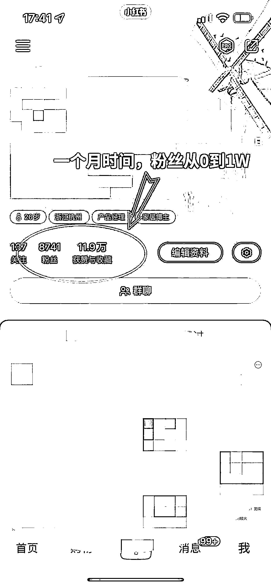

 

 

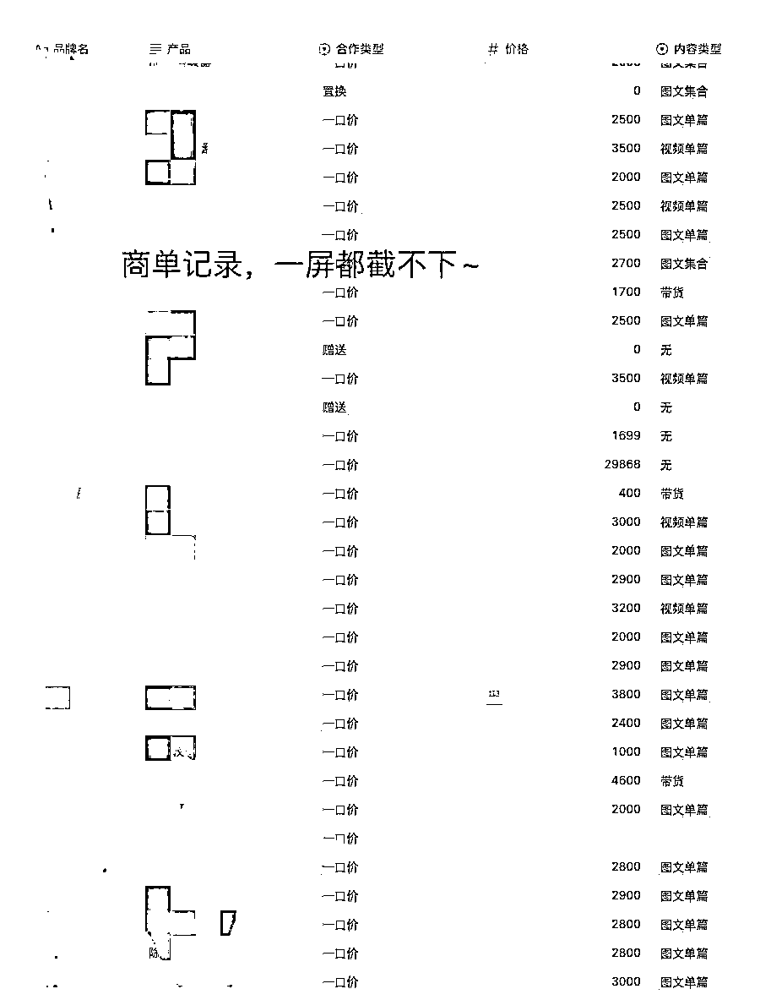

 

 

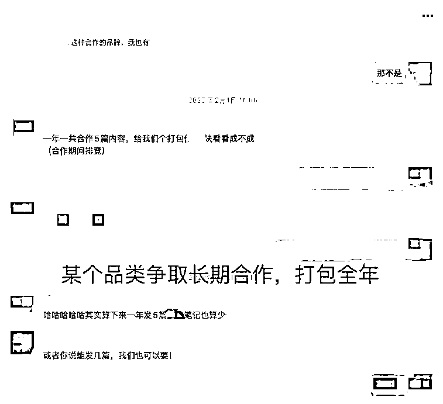

本次做纯博主接商单的方法以及经历分享。接下来的内容，我会从大致四个方面来为大家分享：

（1）开始与起号--分享我是如何快速起号，1个月达到1万粉的

（2）3W1H内容框架法介绍 -- 分享我的高爆文保持方法

（3）变现方法 -- 分享与品牌沟通的方法，实现品牌复购

 

 

（4）零星的经验和感悟分享

二、开始与起号

# **# **（**1**）起号前，先从心理建设开始

你有没有想过，你可能没有你想的那么想赚钱。

做项目前，得先确定心态。坚定不移的想要赚钱的心态。很多人其实没有自己想的那么想赚钱！

之前陆陆续续做过一些项目，如知乎好物，抖音 IP 等，但是都失败了。

我总结了失败原因：赚钱的欲望不够强烈！

知乎好物当时已经月入 3k 了，但是没有做下去，因为觉得月入 3k 已经很好了，想扩大很累。

 

 

抖音更新了 30 多个短视频，没什么成绩，都是重复式的机械劳动，懒得去思考，去改变。

根本原因我也没有自己想的那么想赚钱！我有主业，并且主业收入还不错。

刚开始做项目是很想赚钱的，但是做着做着就疲了，懒了，怕了，害怕走出现有的舒适圈，害怕努力了没结果。然后做着做着就放弃了。

然后我做了一件事。我辞职了，辞掉了 996 年薪 40w+ 的工作。打算孤注一掷，逼自己一把，让自己没有退路，专心搞钱。

我的小红书，就是在提离职后的那一个月做起来的，事实证明，逼自己一把真的有用！！！

（不建议别人学我，我还是有工作的，只是换工作降薪了。当然现在降薪的部分，也已经从小红书赚回来了，哈哈哈～）

# **# **（**2**）小红书起号** -- **认识推荐算法

主业曾经做过内容推荐的产品负责人，对推荐算法的运行机制有一定了解。想要获取高流量，得到推荐算法的青睐，一定要先了解推荐算法！

**① **从平台的视角看推荐算法

 

 

你猜，小红书推荐算法的产品经理，人家的 OKR 或者 KPI 是什么？

是首页点击率、首页内容互动率和首页停留时长。

对应的，如果我们的内容有吸引人点击的标题和封面，有吸引人互动（点赞、收藏、评论）的欲望，有能让人一直看下去的魅力。

那我们的内容，就会愈加受推荐算法欢迎，我们也就能获得更多的流量。如果创作这样的内容，后面会讲~

**② **推荐算法的两种推荐机制

推荐算法的本质，是基于千人千面的技术手段，把用户可能感兴趣的优质内容推荐给用户。

刚发布的时候，系统不知道你的内容是否优质，所以不会大范围推广，只会小范围的进行推荐。

# **1**）根据内容进行推荐（专业术语叫分词算法）

这个是最好理解的，你的内容系统会自动给你打上标签，把他推荐给对这个标签感兴趣的人。

 

 

比如你写了窗帘的笔记，系统就会打上窗帘的标签，把他推荐给近期观看过窗帘的用户。

启发**&**需要注意的点：

1、尽可能在标题和内容，多提核心关键词，这样有助于内容的标签的生成。

**2**、不要打不相关的标签，这些标签会把你的内容推荐给不感兴趣的人，会降低推荐算法对你内容的评价。

# **2**）根据人进行推荐

根据人进行推荐会比较复杂：

第一：根据关注的人进行推荐，发布的内容会优先推荐给关注过你的人，由他们对内容做成反应，系统会判断是否为优质内容

第二：系统会把内容推荐给其他点赞收藏过你内容的人。这个理解是，系统认为如果用户对你的一篇内容感兴趣，那也有可能会对你另一篇内容感兴趣。

第三：系统会把你的内容推荐给与你的内容互动过的相似的人。这个理解是，如果这个人对你的内容感兴趣，那与他兴趣差不多的用户，可能也会对你的内容感兴趣。

 

 

启发**&**需要注意的点：

**1**、不要买粉！尤其是不要买活粉！买来的活粉只会降低系统对你的内容评价，会降低你之后的内容流量。

**2**、不要刷赞！刷赞会让系统对你的内容进行误判，误会对内容感兴趣的用户属性。

**3**、你的爆款内容，会带火你的其他内容。认真的创作内容，确保每一篇都存在价值，这样一旦出现爆款，你的账号就会起飞！

# **# **（**3**）小红书起号** -- **火过的内容一定还会再火

在我看来，这是一句至理名言。

刚刚起号，在你不了解平台推荐算法的偏好，不明白平台用户的喜好是，产生内容最好的做法是模仿！

火过的内容，一定符合刚才总结的推荐算法的三点：有吸引人点击的标题和封面；有吸引人互动的欲望；有让人一直看下去的魅力。

内容的背后，是推荐算法的逻辑和人性。

 

 

模仿会让我们快速把握平台的推荐算法和用户偏好，模仿的多了，慢慢平台网感也就有了，知道用户喜欢什么样的内容。（具体怎么找爆款内容，如何模仿，这里不赘述，其他小伙伴已经讲了很多了）

如果你正确的调整了心态，真正认识了推荐算法，并且懂得火过的内容一定会火这个道理，那你经过一段时间，一定会出现爆款内容。

但是，光这些还不够！

如果内容只会借鉴，是没办法形成自己的核心竞争力的，也没办法收到品牌方的青睐。

接下来我会分享一套我实际正在使用并且效果还不错的内容制作框架，帮助你产生高质量并且被品牌方（金主爸爸）喜欢的内容。

三、通过** 3W1H **内容框架法，加速流量爆发

光洗稿和借鉴无法形成自己的人设，也无法让用户对你有清晰的认知。这种时候，就需要通过一定的方法，产出原创让用户喜欢的内容。

接下来就会是 3W1H 内容框架法的详细讲解，里面会包含用户思维、数据分析等相关内容。

 

 

who：用户是谁？是哪些人群？他们的特点是什么？

what：他们的需求和痛点是什么？

why：为什么会存在这样的痛点和需求？

how：解决方法是什么，如何满足他们的需求，解决他们的痛点和问题？

# **# **（**1**）**who**

用户是谁？他们的特点是什么？

我是做装修的，对于在小红书需要装修的用户，我会先简单的画出他们的用户画像：

① 25~30 岁，女性，主要用于结婚新房装修，会在意各种装修细节和装修中美的事物，大部分预算比较紧张，喜欢收集廉价好物或者平替好物。

② 30~40岁，女性，宝妈，主要用于改善型住房装修，预算较为充裕，装修过程中更关注孩子的所在的环境因素，会有针对孩子的选购需求，比如有熊孩子应该怎么选沙发？

有熊孩子应该选那种颜色的乳胶漆不容易脏等。

 

 

当然，还有很多，我只是简单举几个例子。可以尽可能的细节描述，去代表一类人群。

我们想要产生优质的内容，一定要先清楚用户是谁，能为接下来产生用户感兴趣的内容打比较好的基础。

# **# **（**2**）** what**

他们的需求和痛点是什么？

这个就很简单了，特别的固定。像装修，我会先用穷举法，把他们需要了解的东西或者需要购买的东西，全部列出来。

 

 

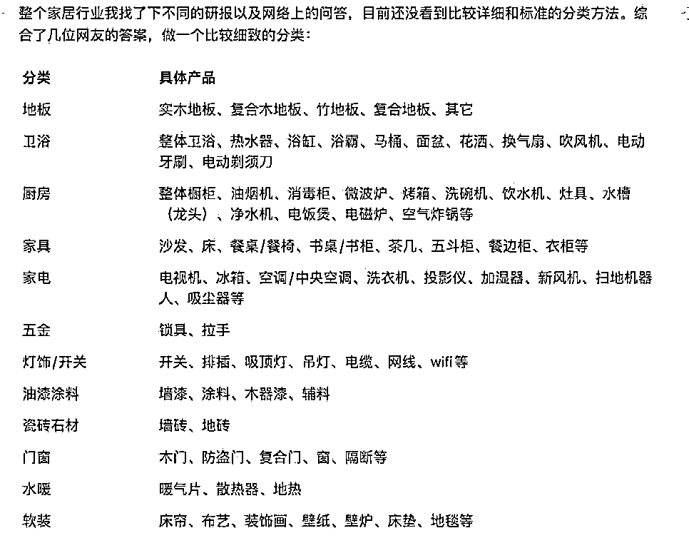

这个是啥？这个就是你的选题了，可以根据上面列的，各做一个内容系列~

OK，需求找到了，那如何找痛点？

我会从淘宝的提问、知乎相关专业贴的内容和评论，还有小红书相关爆款内容和底下的高赞评论去寻找。

比如说电视，我们来看看用户究竟在关心什么？

小红书直接搜电视，点开排名前 2 的电视相关笔记，查看下面的高赞评论，排除一些吐槽和询问内容，可以发现，用户在讨论关心电视的尺寸以及广告问题。

 

 

 

 

 

 

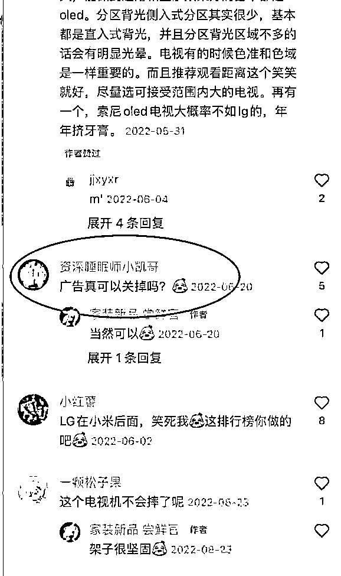

 

 

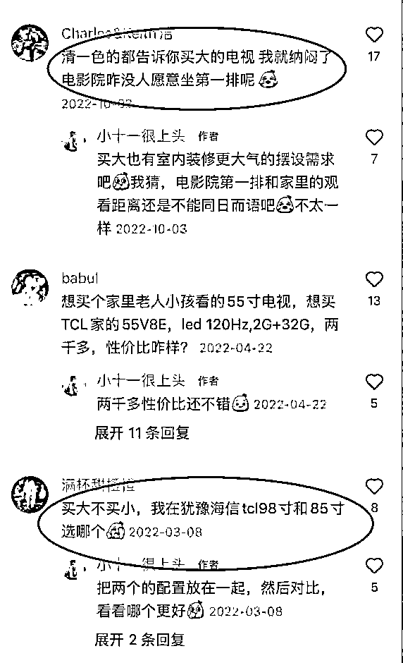

 

 

打开淘宝，搜电视，找销量和评价多的，在问大家页面，可以看到大家关心的东西，我这里看到的电视相关的，一个是质量，还有一个就是广告。

 

 

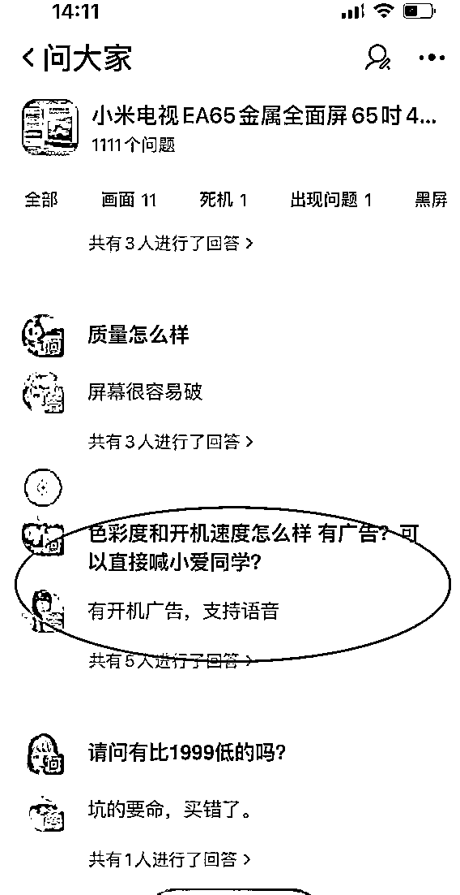

 

 

知乎也是类似的套路，找热门帖子，找高赞评论即可。这样你就能总结出用户在购买电视时，会遇到的问题：

① 应该买怎么样的电视

② 哪个电视质量好？质量好的电视有什么样的特质？

③ 电视广告多不多，哪个电视广告少，如何去除电视广告？

基于他们遇到的问题，我们其实就可以确认** N **个选题了，然后可以根据这** N **个选题，分别去制作内容。

年前就有根据这个方法，挑选了如何去除电视广告这个选题，并成功制作了一个爆款。

这个内容当天就爆了，但是视频里面因为有二维码什么的，导致被限流了...后面也懒的改他~~

 

 

 

 

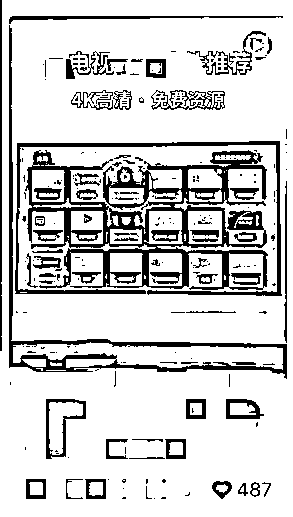

# **# **（**3**）**why**

为什么会存在这样的痛点和需求？

到what那一步，其实就已经明确选题了，why 和 who，其实是在了解内容结构，追根溯源，方便产出的内容能贴合用户心理。

对于为什么，记得多问自己几句为什么。还是拿上个例子举例：

用户为什么会嫌弃广告？因为用户不喜欢广告，对广告不感兴趣，他们只想快速看到自己想看的东西。既然用户不喜欢广告，电视厂家为什么一定要放广告？

① 为了盈利，但是这个理由不充分，他们完全可以把电视卖的更贵点但是通过无广告这个差异化来制造噱头，从而盈利。

② 因为电视本身没有视频资源，他需要依赖各大视频网站，而各大视频网站需要盈利，所以有广告。

 

 

这里好像遇到了死胡同，我们没有办法解决用户看电视没有广告的问题。因为这跟电视好像没有什么关系了。

这个时候就要另辟蹊径了，既然各大视频网站需要盈利所以有广告，那我们可不可以找一个不要广告的视频网站，来帮助用户解决看电视必须看广告的问题？

答案是可以的！市面上有很多类似的网站，但是很少有人知道。大家都只知道爱奇艺、腾讯视频等。

why 这一步，主要是多问自己为什么，从现象中，了解实物的本质，从而从根本上，解决问题。

# **# **（**4**）**how**

解决方法是什么，如何满足他们的需求，解决他们的痛点和问题？

到了这里，其实是最简单的。只要你找对了痛点和问题，并且懂得搜索。其实很容易搜索到答案。

记住，搜索到的答案，不要复制黏贴，基于你的上面的分析，先做增删改查的操作，然后根据自己的风格，去定制内容。

这就是 3W1H 内容框架法的全貌了，但是听着简单，实操很难！主要就是难在寻找痛点和找出根源。

 

 

没有人引导的情况下，会判断失误或者看到比较浅层的问题。这个就需要真实环境去联系，练多了，能一眼看穿本质~

祝大家都能成为追根溯源的高手~

为了更方便大家的理解，我就多举一个例子：

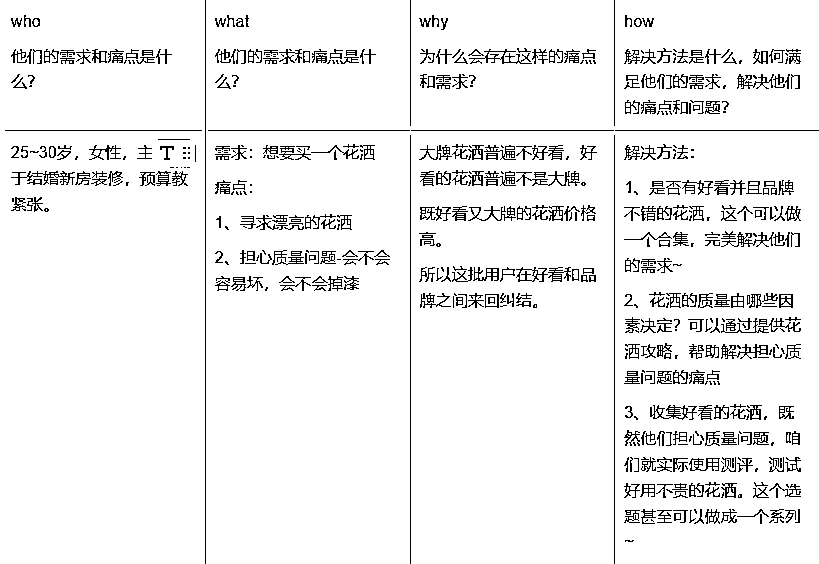

通过这个方法，可以通过需求，找到至少 2~3 个选题，其实还能继续衍生，只要你会思考和寻找。

 

 

四、变现方法分享** -- **爆商单

# **# **（**1**）商单基本情况介绍

小红书的商单其实很好获得，只要你流量好，就会有品牌方找上门。

品牌方找上门有会有两种方式。

一种是放根据你主页放的邮箱，小红书不是很限制邮箱的方式，基本不会违规，各位可以都去主页放一个邮箱，方便品牌方联系。

（图里的邮箱不是我哈，我随便找的！）

 

 

还有一种就是蒲公英，小红书官方的商单渠道，现在 1000 粉丝就能开通蒲公英。

这个咱就简单说一下，相信大家都知道~

# **# **（**2**）获取更多商单的方法

相信大家都希望有很多商单上门，但是也会有同学疑问，明明我的内容流量很高，但是找我的品牌方这么少？

我来告诉你原因！

因为你的内容不符合品牌方预期，没有进入品牌方视线范围内。

首先我们切入到品牌方的视角：

品牌方寻找博主，也是通过小红书搜索、推荐或者用第三方数据分析进行寻找的。他们会基于他们需要推荐的品的关键词，来寻找博主。

比如“电视”的品牌方，他们要找博主推广，肯定会找那些发过电视（或者其他相关品）的笔记，并且流量还不错的博主。

这下你明白了不？

 

 

想要接到更多的商单，首先思考一下，在你的领域中，有哪些品，是利润比较高，品牌比较多的。然后基于这个品去写内容，只要有流量，就会有相关的品的品牌方找到你，来寻求推广！

一般我观察到的现象是，只要你写“电视”的笔记火了，会有 N 个电视的品牌方，会找上门，来找你合作。

# **# **（**3**）如何让品牌方持续复购，带来持续的商单？

今年刚开始，我就签下了某个品牌方全年笔记的预定协议。还有品牌方听说我要合作竞品，追着我，跟我电话1小时，一定要和我合作的情况~~

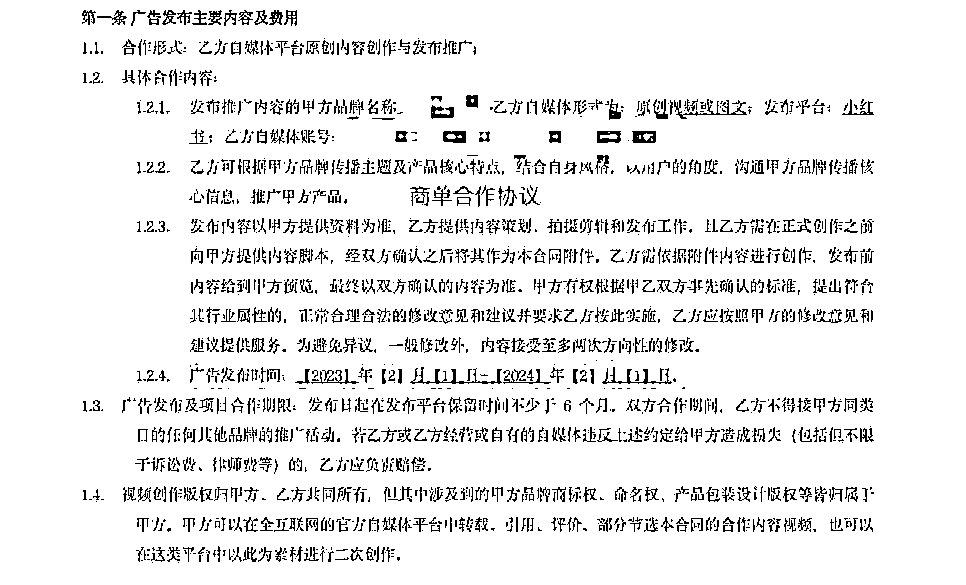

 

 

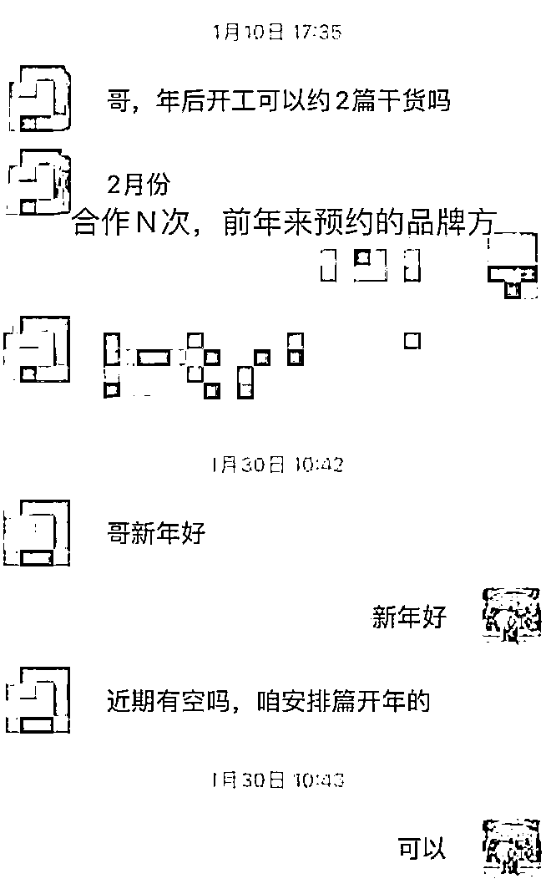

 

 

我是如何做到的？

秘诀就是：对每一篇笔记认真负责，并努力打造爆款。

你是否用心，别人是感受的到的！都在你的作品和文字里。试问，如果你作为品牌方，你愿意与一个认真负责的人合作，还是愿意和抱着拿钱办事，结果无所谓心态的人合作？

因为我的认真负责，我的爆款数量变多了，也让我在后续的接单中更加顺利。形成了一个正向循环。

我认真到什么程度？

我有已经创作好了内容，品牌方觉得也还行，但是因为自己不满意，又重新推倒重来的。

当然哈，光认真负责，但是没技巧还是不行的。这里还存在另一个问题，如何保证广告笔记也能有较高的流量？

我分享一些我常用的方法和技巧：

**① **创造新奇的使用场景。

创作内容时，切记不要站在品牌方的视角去介绍功能特点，这种太像营销文了，一看就很广，没有人会爱看！

 

 

需要结合产品的使用情况，把自己当做一个用户，真正使用之后，去分享使用感受和使用效果。最好还是新奇的有别于大众的使用感受。放几个案例：

 

 

 

 

这是科沃斯的空气净化器的广，核心卖点就是智能移动，哪里有问题就净化哪里。

基于这台机子，作者实际使用后发现，放个屁他会跟着走。这个就是实际的比较新奇的使用场景了，后面很自然的引入使用感受+功能介绍，一篇超级种菜的广告文就诞生了~总结：新奇的使用场景**+**真实的使用感受**+**穿插的功能介绍

PS ：新奇的使用场景可以根据我提供的选题方法进行寻找，这个作者就是在淘宝提问入口找到的新奇选题~

**② **欲扬先抑。

因为现在小红书种草的内容和广告是在是太多了，用户已经审美疲劳。他们不想知道这个东西多好多好，他们就想知道，这个东西哪里不好！

先说缺点，再谈优点。这样既能吸引那边比如对空气净化器感兴趣的用户，又不会真正劝退那些想买空气净化器的人。

PS ：灵感来源于一个好友，人家告诉我，现在想买什么东西，先去小红书搜：XXX避坑。

**③**合集推荐。

 

 

小红书的用户喜欢合集！这个结论是无数的前辈和我自己亲身实践都认证过的。所以接到商单，可以把你要推广的品放在合集里面，一起推荐。

可以把金主爸爸的品放前面并详细介绍。只要不是推荐竞品，金主爸爸一般是不会介意你推其他的品的~

再分享一些这么多商单接下来的感受和想法：

① 创作广告内容时，你可以不说缺点，但请不要夸大和欺骗，用户不是傻子。出来混，都是要还的，别赚昧良心的钱。

② 遇到产品不好的品牌，或者搞不拎清的品牌方，请学会 say no ！宁可不合作，也不要发自己不满意的内容。发了你还删不掉，会很糟心。

五、零星的经验和感悟分享

这里我就想到哪，写到哪。比较随意了，我随意写，你随意看，就当避坑。

（1）做内容的目标一定是制造爆款，爆款能助力涨粉和变现，还能助力历史内容的流量增长。

 

 

（2）跟随爆款，根据爆款去制造内容，这种内容往往会再次爆。不要浪费自己爆款的流量，出现了爆款，一定要抓紧时间继续创作内容。

（3）用焦虑流量问题，用心制作内容，时间会给你答案。（等爆款）

（4）认真负责是最好一件事的基础，没有什么事情能随随便便成功。

（5）看到了机会，一定要抓紧时间放大。我就已经错过了一波放大的机会（在流量最大的时候），最近有和小伙伴在规划放大的事情。

我是七天假，如果有什么不懂的，或者想一起交流小红书的，可以一起交流哦。

评论区：

嘻嘻｜溪溪 : 为你辞职的勇气，点个赞[微笑]

七天假 : 哈哈哈，谢谢[呲牙]

清欢 : 感谢分享，很有收获

七天假 : 相互交流～

厚德载物^O^洪永安 : 感谢分享

七天假 : [加油][加油]

麻雀 : 找了个bug[呲牙]

七天假 : 哈哈哈😂，看的好仔细👍

# **# ****(**精华帖**)(237**赞**)**专注仪器细分领域，**2 **年公众

# 号完成**73 **万专业领域用户的积累

 

 

作者：  鱼丸|亦仁助理

日期：2020-09-16

今天周三，  如约更新。

老板今天邀请到的是 EWG1990 仪器学习网的创始人  ，这位生财合伙人将和我们分享自己是如何通过一个个人的公众号，发展成为中国科学仪器行业产业互联网平台的。

他是如何完成 2 年 73 万专业领域用户的积累？又是如何看待为自己打造“赚钱机器”这件事情的？

# **# **欢迎**   **进行他的分享。

大家好，我叫蒋超，EWG1990 仪器学习网的创始人。EWG1990 仪器学习网属于产业互联网领域的一个创业项目。平台致力于与中国仪器行业协会，中国分析测试行业协会以及全国各省科技厅紧密合作，开展网上科学仪器行业的知识创作，以此为基础进行分析测试行业各关键环节产业链的整合，以及与分析测试相关的业务的拓展。项目自 2018 年 6 月开始，至 2020 年 6 月，平台覆盖分析检测行业 73 万专业用户，成为我国科学仪器行业中头部产业服务平台。

希望这次分享能帮助做流量的同行们一些思路。我是如何通过两年时间从个人公众号，发展成为中国科学仪器行业产业互联网平台。

为了更好让大家了解我在做这个平台的背景和思路，我分为三大部分介绍。

第一：个人背景

第二：项目背景及萌芽

第三：项目落地及发展

第四：产业生态的打造

第一部分  个人背景

 

 

我 1990 年出生，老家湖南衡阳，大学应用化学专业，大学期间苦练英语口语，熟悉了一些掌握英语口语诀窍。研究生专业为精密仪器专业。学校期间与基友阿彪创办了英语口语培训机构，培训期间让我开始意识到，每天早上我必须去晨读现场，才能盈利赚钱，如果哪期培训班我们不办了，就没了收入。所以那时起开始有了意识，能不能不靠出卖自己的劳动力时间盈利，要有自己的一套自动化的赚钱机器。例如做一套培训体系出来能自动运转，所有的合伙方，培训老师，员工等能跟着这套体系和机制各司其职，那么这个赚钱机器就有了雏形。

脑子里的这个赚钱思路模型在后来的项目中越来越强烈，大学期间偶然机会被“职来职往”节目组选中，代表中山大学参加选秀。在北京回来的路上有了一个念头，创办了一个非物质文化遗产文创品项目，这个项目在当时做的很火，得到了市场的认可，也得到了央视和南方日报的报道。它就是一个典型的产品思路盈利，我们在半年时间里设计了一连串非遗产品，六年过去了，我们还是能躺着赚钱，因为一直有人买。虽然钱不多，但这个盈利的思路模型是对的。

再到后来，我慢慢知道，这个赚钱机器的模式包括，出书，产品，产权，版权，专利，股权等等，都是属于一次时间投入，大部分情况不需要再投入大量时间，后期等着收益的例子，那么我现在从事的科学仪器互联网服务平台，就是在这个思路下成长起来的。

这样大家对后期我在做平台的运营和规划时会更了解。

第二部分：项目背景及萌芽

2015 年毕业，我考进了广州市环境监测中心，这是一个政府单位，广州市空气质量，例如我们常见的 PM2.5，化工厂排污等行政监测工作都是单位负责的。因为我是学分析仪器专业的，所以就从事了实验室一线工作。也就是在这个阶段，我开始了写作。

2016 年年底，我正式注册了了个人公众号 EWG1990，初期用来记录我在环保行业的点滴想法。慢慢的，我的同事，环保领域的同行都会关注下，偶尔也点赞转发下。期间，我也并没有想过要把这个公众号能做什么，只是埋着头一直在写个人生活的各种东西。

情感，生活，工作，什么都写。那时的动力也算是发表出来时能在朋友圈发发，朋友点点赞，自己也能得到乐趣。

在实验室工作期间经常遇到部门仪器采购，每当在仪器调研的过程中，对比各种仪器参数往往捉襟见肘，主任们也不管我们，反正就是交给我们到处去找科学仪器厂家对接各种参数，写采购仪器参数调研报告，而对于我们真正从技术人员出身的人来说，打心里起是不愿意去主动找仪器厂家帮忙的，所以也只能从熟悉的工程师口中了解一二。为解决这个痛点问题，我利用爬虫技术，用这些大数据开始了第一篇《仪器数据系列》，例 

 

如气相色谱品牌汇总，液相色谱品牌汇总等等，而也正因为这些高质量（可能是以前从来没有汇总过这么大工作量的文章），越来越多的人关注我的个人微信号，那时，我整天想的就是如何写好这种高质量的文章。

从这里开始，《》这个栏目就把以前我们行业买仪器的痛点给挖出来了，以后买仪器，对比品牌型号，大家都来这里看，所以当然我就每一周更新一篇，通过这系列文章，我认识了很多仪器厂家与实验室采购人员。也就这样，我每天还是正常工作，下班回到家第一件事就是更新公众号。

正因为有了这个公众号，再加上自己属于脑洞大开的那种性格，经常会关注外界的各种信息，其中微信的文章外链功能规则的开放，那天我激动的没睡着觉，觉得这是一个很大机会。我次日成立 EWG1990 讨论小组，我想在如今信息爆炸时代，信息量严重负荷，快餐无营养信息充斥人们生活及学习圈。我想既然微信开放了这个功能，那我能不能专门帮实验室技术人员精选知识，同时都用外链的形式帮大家导航。就出于这个念头，我正式成立实验室三人小组，定位为帮实验室从业人员精选知识，做一件能对实验室行业有影响，有意义的事。此后，这三人正式开启栏目《大型仪器知识精选汇总》。

每周更新一篇，就这样，EWG1990 由个人微信公众号转变为科学仪器学习平台号。也正因为各大专业专栏的开设，EWG1990 用户关注量破万。在非常垂直和科学仪器行业里用户量破万，这是一个非常高的门槛。后来我们能覆盖到数万的行业用户，这是垂直领域单点突破的一个转折点。

在以上的一年过程中，我们没有想任何方面的变现，依靠内容裂变运营，从这个行业的小众领域突破，才使得这个项目找到一个切入点，单点突破非常关键。

也许到了这里，大部分人可能觉得这个公众号就继续发展，后面再接广告，如果这样，也就成为了我们行业里大部分公众号那样，红不过一年。但 2018 年回老家过年后，我觉得体制里自己不会有太大进步，当然也并不是因为有这个公众号，那时的公众号的份量远远没办法和一份公职相比，但也是一脑子发热，过完年后 4 月份就裸辞了。所以真实来说，公众号是后面找不到心意的工作实在没办法，就只能做公众号了。

但幸运的是，我把我对公众号的想法——受白话区块链公众号和推比特网站的启发，和行业大佬说了下，5月份就确定了个人投资，所以这就有了启动资金。说到这里，EWG1990仪器学习网的公众号发展背景就到这里了。这里有几点：

一：流量的来源问题，为什么我的个人公众号能源源不断能有人关注，非常重要的一个原因是内容，内容帮助某一特定群体解决了工作中的问题，而且内容是非常稀有的。

 

 

二：为什么有人投资，这一块初期和我前面提到的自动化盈利模式有关。很多公司有这样的体会，每一年都想提高公司盈利，但却发现每一次的提高都是需要开疆拓土，投入更多的人力财力去开辟新的领域，这样就进入了恶性循环，也就是边际成本从未减少。

资讯，新闻内容就属于这类型内容，每天更新，人员每天都无法抽身出来。每一次的扩大都是以投入更多的人员为代价。

而作为软件开发者为什么能在开发一个软件后，当用户越来越多的时候，唯一要做的就是软件迭代更新和日常维护，边际成本将会越来越低。而这样的永久内容形成一个产品，并不随时间的流逝而价值减少，反而随着时间的增加，内容的价值一直都有用，且规模积累越来越大且规模化，因为这些规模化内容，也逐渐衍生其他盈利领域。而我当时受白话区块链公众号和推比特火山哥的影响下，我觉得我不再凌乱的做公众号的内容，而且做我们科学仪器行业一个系统且庞大的内容百科和在线教育平台。这些内容都是有叠加效应的，将来的价值连城。更何况是在我国科学精密仪器行业。

第三部分：项目落地发展

2018 年 5 月，我们有了启动资金后，在 6-9 月我们一直在线上做在线活动与课程，再加上我们在传统行业懂一些新媒体运营裂变手段，几乎行业里人人朋友圈都能看到  EWG1990 的影子。但好景不长，以前兼职兴趣爱好的时候对公众号盈利几乎不关注，但正式全职的时候，心态已经完全变了，影响力越是大，而又越是不知道怎么赚钱的时候，心里是比较慌的。9 月份的时候我们觉得这样下去不是办法，尽管我们有了影响力，但广告费几乎微不足道。

2018 年 10 月，我们被逼的没办法，尝试性的做了第一场实验室技术人员交流大会，采取参会实验室技术人员免费，仪器厂家入场收费的模式，就这样第一场线下大会，技术人员报名了 400 人，仪器厂家来了 20 多家，一共收入 6 万，除去开支刚好还赚了 2 万。但正因为这场线下大会的影响力，第 2，3 个投资人陆续进来。

而此时，通过线下会议的召开，把行业的生态逐渐有了新的梳理，为什么仪器厂家愿意付费来参加。是因为参加的技术人员都是他们仪器设备的购买者。于是就开始深入研究行业的产业链各个环节之间的关系。

我们行业包括四个群体：

1.仪器设备生产商

2.仪器设备经销商

3.仪器设备使用方

 

 

4.行业平台与媒体

学过一点市场方面的人都知道，定位最传统的理论框架是波特提出来的成本领先、差异化和利基市场的竞争战略。虽然在未来这种定位还是大家需要去思考的，但实际上在这个互联网时代有更重要的问题要先回答。我始终这样认为，如果要谈定位，首先得知道是在什么局势下定位，如同上战场杀敌，首先得了解战争形势，至于杀敌精准度及快慢，那是技术问题。而最终成败你的是你对战场的形势的把握。

对于仪器厂家来说目的只有一个，就是买卖，面对的是最终端用户。对于代理方及服务方，面对的则同时是仪器厂家和用户方，所以他们的目前就是做好服务工作，最大可能把仪器厂家的产品卖给用户，同时可能还与厂家存在竞争关系。对于用户端，目的则是怎样更好的使用仪器与如何更性价比买到仪器，同时仪器售后能方便快捷。

这样一来，我就梳理清楚了我们行业的贸易流向，同时也就知道哪一端免费，哪一端收费。或者两端都免费，第三端收费，思路就更清晰了。

就这样，我们抓住了服务实验室技术人员为核心，精准帮助仪器厂家更快对接实验室技术人员也就是他们的客户。把这条路做到极致。

所以 2018 年 10 月份后，我们做了 2019 年全国各省份的会议和行业落地规划。2019 年 3 月，我们开发了一个领域，在这个领域里，我们保持每个月一场，把会议规模从  300 人做到高峰的 1400 人，并且连续十场保持千人规模，参会厂家从一场会 20 家到一场会达到 80 家，一场会议的收入流水突破 50 万。就这样，我们每个月有了稳定的会议流水。到 2019 年 10 月，我们陆续开展了 8 大板块的精品会议。2019 年底，我们的会议板块业务合同金额突破 1000 万。就这样，EWG1990 仪器学习网的线下会议板块业务就正式落地。

转眼就到了 2020 年，EWG1990 仪器学习网已经历过了 2018 年线上互联网的运营打磨，经历了 2019 年全国线下会议渠道能力的建设，原本 2020 年 100 场线下大会，但疫情随之而来的是对我们线下会务板块的收入毁灭性打击。3 月份，正因为我们对行业的生态行为把握到位，我们迅速调头转到线上会议与培训，就这样，原本 18 年没做起来的在线教育，在 3-7 月因为猛攻线上广告营收却逆式增长。也正因为我们把所有的精力都放在课程的打磨上，所以我们的在线教育系统也就初具规模。www.ewg1990\. com 在线教育板块成为了线下会议板块的重要搭档，成为仪器学习网目前的主要现金流。也因为如此，通过线上教育+线下会议，我们一直在聚集产业链的两端：仪器设备生产商+仪器设备使用方。

 

 

第四部分：产业生态的打造

项目发展到 2020 年 5 月，我们聚集了全国 70 万仪器使用方和数百家仪器设备生产商。基于此，我们开始在全国每个省份组建运营中心，加强我们的线下活动能力和线上在线课程的销售能力。同时由于科学仪器具有普适性，广泛应用在环境监测，食品安全，生物制药，医学检验等各个领域，从今年 3 月份开始，EWG1990 开始独立孵化环境学习网，食品学习网，生物学习网，制药学习网等垂直领域产业学习平台。

至此，为了将 EWG1990 仪器学习网继续带入科学仪器产业深水区，我们在 5 月份正式上线了科学仪器行业采购平台【仪学优选】，帮助科学仪器厂家更好的对接全国各地实验室用户，用户实验室也能更方便快捷在平台上采购实验室耗材。上线 2 个月，目前  100 家全国供应商已入驻。就这样，【仪学优选】成为 EWG1990 仪器学习网进入科学仪器产业贸易和供应链环节中的重要一节。也让仪器学习网的产业互联网走向更深入的一步。在这里，也欢迎有 B2B 电商经验的人员加入合伙人，这个板块目前单独独立孵化，希望能用 1-3 年时间做成行业优秀的供应链采购平台。这条产业互联网之路，上市公司有【国联股份】，【找钢网】等，我相信，EWG1990 将会成为环境，食品，生物，制药，医学板块等国家科学技术行业高净值的产业互联网平台。

总结：

1 关于行业生态的构建从个人自媒体，到产业互联网平台。能否复制。我想是可以复制的，步骤如下：

第一步：分析行业的上中下游。研究聚集哪一方，另一方就会来找你投放广告或者合作。

第二步：聚集行业的某一端，通过内容，会议，或其他途径，在时间沉淀的前提下，做出影响力。

第三步：此处产业的另一端会开始关注并加入圈子。

第四步：搭建两端交易的供应链平台。

关于盈利模式的设计

我一直在思考，为什么我在行业举办千人规模的高质量用户大会（各高校教授，政府部门负责人），但发现都是给他人做嫁衣，我们只赚了点辛苦的会晤费用，为此非常迷茫。但如果放在长远盈利模式设计的角度来看：：

（1）赚产品本身的利润

（2）赚产业链上下游渠道的钱

 

 

（3）赚生态跨界融合的钱

（4）赚企业价值股权的钱

这四点可以把我平台办的大会以及平台的学习课程全部发挥出来，让他们成为流量入口，收取大会本身的钱，同时收取大会厂家的钱，同时还可以申报政府补贴收取政策补贴，最后还可以通过影响力收取产业链生态的钱。最后将收来的钱用于购买用户流量和投资内容，再通过流量起来后再通过企业估值获得股权收益。最后你会发现，原来会议的钱，完全可以忽略不计，从而作为流量入口。

关于合作共赢

任何事情如果要做大，都不可能是某一个人或者几个人做起来的，仪器行业细分领域太多，仪器单品也非常繁多，那共赢二字更成为行业需要运营的一门技术，但真正做起这二字来却非常困难。

EWG1990 在得到两次天使轮投资完全是两种不同的运营概念。前者是内容运营，后者是生态圈合作的运营。

前者是通过优质内容满足写作者在行业里的存在感，绝大部分靠的是写作者的兴趣爱好，后者是通过优质内容来实现企业的盈利并能将盈利返回给优秀内容的创作者，进一步形成正循环。

在这一点上，EWG1990 做到了一个中间方，把仪器企业，实验室专业人员聚集在一块了，专业人员开设专门的仪器课程获得上万课程费，企业群体通过这些仪器课程向学习用户推荐了仪器广告，这样对双方而言都真正达到需要的效果。对于我们组织方而言，平台的生态也因这种循环而正向发展。公司是一架“需要盈利”的机器，它需要我们为自己考虑，设计运营模式与方案，但核心在于我们的运营者是否真心考虑了你的合作方与参与方，做假是走不长久的。总结一句就是你的事情是否是对方需要的，同时你是否真的愿意给他。

关于赚钱与值钱

如何运营一家值钱的公司？在这一年过程中，EWG1990 仪器学习网的内容做了很大调整，这半年甚至大家觉得我们的内容创作比以前少了，是不是后劲不足？但说实话，也正是我们知道我们什么该做，什么不该做，在没有好的精品内容时，网络上复制的内容我们宁可不做也不浪费精力。

 

 

一开始我们是做内容媒体平台的，所以我们成立的第一天起就是赚钱的。在这里非常感谢我们最初级阶段的那几家公司愿意在我们平台上投放广告尝试，但今年最大的感悟却是做一家赚钱的公司容易，做一家值钱的公司很难。

如果说我们去深入做线下大会与线上广告业务，但发现 2B 业务完全不具备边际效应，在这个基础上，赚更多的钱、只养活自己并不是的我们追求，我们一直在思考：如何做一家值钱的公司？

基于此，我们选择了内容=软件=产品的思路。

很多公司有这样的体会，每一年都想提高公司盈利，但却发现每一次的提高都是需要开疆拓土，投入更多的人力财力去开辟新的领域，这样就进入了恶性循环，也就是边际成本从未减少。资讯，新闻内容就属于这类型内容，每天更新，人员每天都无法抽身出来。每一次的扩大都是以投入更多的人员为代价。

而作为软件开发者为什么能在开发一个软件后，当用户越来越多的时候，唯一要做的就是软件迭代更新和日常维护，边际成本将会越来越低。而这样的永久内容形成一个产品，并不随时间的流逝而价值减少，反而随着时间的增加，内容的价值一直都有用，且规模积累越来越大且规模化，因为这些规模化内容，也逐渐衍生其他盈利领域。

而在线教育课程以及厂家知识库，行业内容百科系统这都属于软件产品思维，对于老师而言，上传自己录制的一门仪器课程就能每年收益 10 万元以上；

对于内容百科系统，做完后随着内容日复一日的积累，将成为仪器行业庞大的内容查询系统。

而由此基础，EWG1990 仪器学习网聚集的产业资源，渠道资源，用户资源，再赋能与下游仪器后服务市场，自然就有了产业链中的价值所在。

最后鸡汤一下：人生没有白走的路、每一步都算数。成为一名优秀的运营、成为一位好的管理者、运营一家公司的道理和方法都是一样的：利他之心、保持专注、追求价值；

https://wx.zsxq.com/mweb/views/weread/search.html?keyword=仪器数据评论区：

 

 

小霸王 : 2年73万粉丝，太牛了

千已 : 老板，厉害了👍

瘦马 : 为什么仪器信息网和其他平台没能做起来的事情，EWG1990能破局？背后有很多东西值得玩味。

另外，除了组局，可以更加下沉到潜在的决策者，企业的设备采购更多是2B的行为，现在的培训更像是2C到具体的科学仪器使用者，这里面有不少假以时日是可以成长成具有决策权的管理者。

蒋总厉害！仑头离科学城也不远，有机会当面聊聊。

张静伟@生财有术 : 厉害厉害👍

曲直 : 请教蒋总，您的非物质文化遗产文创品项目，这个有网页链接吗？我家有这种产品，想看看能否对接一下，谢谢！

兔爸-金圆宝 : 看的意犹未竟啊，精彩

阿彪 : 蒋总牛逼(破音)～

蒋超 : 欢迎来园区转转

# **# ****(**精华帖**)(159**赞**)**靠流量变现三年挣了** 500W **

# 的心得思考

作者：  小许：专注流量变现

日期：2023-01-29

【靠流量变现三年挣了500万的心得思考】

各位生财圈友们好，我是小许，一个靠流量生存了三年工作室创始人。今天来给大家分享一些关于我在短视频做流量的一些思考和心得，希望能给大家带来一些有价值的信息和思路，分享之前特别鸣谢@凡灵逸尘  一直鼓励我在生财输出的领路人

做引流最难受的一个点：平台风控导致大面积封号，任何平台不会倡导外站引流，所以在做流量之前一定要做好批量死号的准备。我们是矩阵化引流每个员工都会配置15-20台手机，通过短视频曝光去做流量，账号问题全是通过地推团队合作解决

我在流量变现赛道目前成绩单：

 

 

流量形式：短视频矩阵

获客形式：短视频  图文  直播较少（直播不好复制比较挑员工）

获客平台：抖音  快手  小红书

流量类型：目前涉及  男粉  女粉  减肥  教辅  丰胸  创业  中医  金融等

团队人数：3+7（三个转化  七个获客）

账号数量：一共230，目前在跑84个（春节放假后部分辞职）

流量变现：单日最高8万+纯利

今天主要分享三个部分：

1：流量变现的机遇

2：如何解决内容批量生产

3：引流变现会遇见的问题

全文内容链接如下：

https://vfqxua5lvd.feishu.cn/docx/GeRGdIeOhoF02GxLD3LciVH1nSb评论区：

凡灵逸尘 : 期待兄弟的后续干货分享，得好好帮圈友们挖一下宝藏😂

炮爷（不睡觉） : 许总牛逼[呲牙]

小许：专注流量变现 : 该睡觉了宝

小许：专注流量变现 : [奋斗][奋斗]

麻雀 : 流量是生意的本质

 峰   : 学习了，许总牛逼!

xing : 流量最关键，其他跑通只是为了转化

亦仁 : 感谢分享，已加精华。

# **# ****(**精华帖**)(152**赞**)**美食菜谱短视频，**2 **年收获全

# 网** 500 **万粉丝，累计变现** 250**万**+**

作者：  刘易彬［快快］

日期：2021-04-26

 

 

美食菜谱短视频，2年收获全网500万粉丝，赚取250万流量收益过程分享大家好，我是快快，一位90年全职互联网创业者。

2018年下半年正式全职做美食短视频项目。基本上2019年初就走上了正轨，运营的还可以。

2019-2020年两年的时间，全网收获了500万粉丝，总流量收益近300万，净利润达到250万【公司算我自己一共3个小伙伴】。

初来生财，希望我的经历分享能够对做自媒体的小伙伴有些许帮助，里面的某些经验能够让你受到启发。

我相信，赠人玫瑰手留余香，越分享越幸运！

全文都是大白话，字数9000+，感谢阅读。

《美食菜谱短视频，2年收获全网500万粉丝，赚取250万流量收益过程分享》，可复制链接后用石墨文档 App 或小程序打开  赚钱经历

https://shimo.im/docs/XvrXXXkYDHkKYqcG/评论区：

黄浩在观察 : 感谢分享，从素材来源，场景搭建，到拍摄、运营指南，讲解得非常全面，特别是外包找全职宝妈提供素材，真的是一个很不错的思路，学习了[抱拳] 小程阿东 : get到一条小思路

刘易彬［快快］ : 感谢朋友的支持，对你有用感到非常荣幸[抱拳]

刘易彬［快快］ : 朋友有启发就好，感谢[抱拳]

Charles : 不错的分享，账号是哪个？我们去围观一下[微笑]

老九 : 这个真的是好厉害，细节把控太好了

华龙 : 很全面，收益这块是不是啃放大，不仅仅是靠平台的广告收入

薛盛泷 : 同问

# **# ****(**精华帖**)(124**赞**)**技术人转型程序员漫画自媒

# 体的完整经验分享

 

 

作者：  不会笑青年

日期：2022-09-29

19 年下半年，我开始尝试转型公众号领域，和朋友一起创建了程序员垂直领域的公众号【不会笑青年】，全职运营两年多，目前公众号粉丝接近 22W，全网粉丝矩阵 50W，整体变现 200W+。

今天这篇文章，我想给大家分享一下，我从程序员转型漫画公众号自媒体的完整细节，如果你想了解个人公众号运营的方方面面，那么本文应该算是一篇比较全面的分享，希望能给朋友们一些参考和帮助。

大家好，我是不会笑青年。今年四月份加入生财，看到了很多大佬的分享，也认识了很多新朋友，真是眼界大开，受益匪浅。

我曾是一名程序员，坐标西安，从事开发工作 10 年，在公司做技术管理岗位，年收入大概 30W+。

一方面，工作状态基本稳定，但另一方面，我也明显感觉上升瓶颈。终于在 19 年 8 月迈开了转行的步伐。

全文内容主要从以下 5 个方面介绍：

一、内容创作

二、引流增长

三、收入情况

四、经验分享

五、普通跨界者，如何实现0-1突破的一些思考

 

 

一、内容创作

**1.1 **我的转行，漫画文案从**0-1**的写作之路

19年8月，在我的铁哥们微笑哥的勾搭下，我开始着手我的第一篇漫画文案。当时是什么状态呢？我想大概可以用两个词来形容：懵逼**+**渴望。

为啥懵逼？我在职场待了10年，刚从公司离职出来，从没做过自媒体行业，至于条漫创作，更是完全没有概念，从0开始，一切得靠自己摸索。

为啥渴望？当时出现了好些条漫公众号，这类作品看起来很有趣且很受读者欢迎。而程序员垂直领域还没有这样一个公众号。我本人对“艺术创作”表示很有兴趣，同时对程序员群体也足够了解，内心是想干这件事的。

于是，在这种状态下，我开始了条漫创作之路，到今天，已走过3年。

问题来了，启动阶段要怎么搞？

**1.1.1 **漫画制作的流程

首先漫画如何制作，我们不难想到，漫画创作主要分两步：文案+绘图。

文案：我负责，这部分可以说是漫画作品的灵魂，这个怎么写，我去想办法。

 

 

绘图：是对文案内容的生动呈现，需要漫画师资源，如何对接，我后面说。

**1.1.2 **如何写文案？

自己从0开始创造显然效率太低，前期还是要从别的漫画公号中去学习，但只能看到成品，也拿不到别人的文案。

不过看的多了，倒是可以从其中总结出一些条漫常见的套路。比如对比型、盘点型、故事型、悬念型、互动型等等，这些都是一些常见的固定表达形式。

这里列举两个通用套路的例子，比如：

对比型漫画：https://mp.weixin.qq.com/s/tglPT8ipyUuvg6JJmm-F6A悬疑型漫画：https://mp.weixin.qq.com/s/f2l3u3D9z3re0jlLMLbqng  着手写自己的文案，根据已经了解的这些形式，我大概用了两三天，模仿着写出了第一篇自己觉得还算像样的初稿文案，但给到漫画师后，她的反馈却是，这样的文案没法去画。

后来明白，漫画文案与普通文章完全不同，漫画文案中，更需要的是场景化的描述文字，每个画面具体长什么样，我需要尽量用文字描写清楚。

而这种场景化思维的写作习惯，与平日写文章完全不同。

 

 

写文章时，我们顺着思路把要表达的思想说明白即可，但对于漫画文案而言，脑海里更像是在过电影，每个镜头有哪些元素，是远景展现还是近景特写，人物此刻的情绪，环境的气氛，这些东西写清楚了，才更方便漫画师的展现。

后面看别人漫画，我都会特别留意他们分镜是如何处理的，甚至在看电影时，也常习惯于跳出电影本身，思考哪些镜头运用的更为精彩，然后记录并用到我的文案里。

就在这样的节奏里，为了写出一篇满意的文案，我推翻重来了很多次，差不多一个多月后，我才写出了第一篇基本像样的文案作品。

与漫画师试合作几期之后，在相互的沟通中，我也是尽自己所能让漫画师能画的更舒服一点，比如我逐步规范的漫画文案的模板，主要是以下几点：

① 以场景为单元，每个场景分为“场景描述”（尽量清楚的描述场景细节）和“配文”（漫画中需要展示的文字）两部分；

② 规范格式，场景与配文用不同颜色的文字标记，更加一目了然；

③ 文案开头添加“漫画大意”和“人物设定”等信息，方便漫画师对整个文案快速了解。

这里也列出一个我今年的一篇普通文案：https://www.kdocs.cn/l/cdOozHZ1PZUi按照这样的模板书写文案，漫画师体验一下有了很大提升。

有位和我首次合作的漫画师朋友还反馈说：**“**一看文案，脑子里就有画面了**”**  ，对我而言，确实是很欣慰啊！

 

 

但每篇作品仍需要我和漫画师相互打磨很久，当然随着我和漫画师彼此默契程度升高，这个时间会越来越少，和我合作过几十次的漫画师，基本可以一稿过。

到19年11月，历经了3个多月的摸索实践，我觉得我对文案创作，终于心里有数了！

**1.1.3 **如何对接漫画师？

最早和我们合作的漫画师，是找来自己的朋友兼职来做，但公众号做起来后，是要定期更新的。我们初步计划是一周三更（对于漫画原创作品来说，这样的更新频率已经比较高了），一个漫画师的产出显然不够，我们需要更多的漫画师同步工作。

漫画师从哪来？答案：付费招聘。

从哪招？起初其实我们也不知道，我们写了一个招聘简章，就在网上各种漫画相关的论坛发帖，发的多了，确实也收到了效果。

陆续有漫画师开始联系我们，通常我们会试合作一期，如果合适后面就长期保持合作，前期成本大概在200-500元每篇。

顺带说一下这里遇到的问题。

实际经历中，这部分前期工作量其实还挺大的，因为找到合适的漫画师也并不容易。

首先需要判断漫画师的水平，这里分两步，第一让对方提供过往的漫画作品（对我而言最好是条漫作品），如果觉得画风ok，第二步需要试稿，就是根据我的文案，让漫画式完成前两个场景的内容，进行实际检验。

 

 

另外就是价格，专业的条漫师大多报价较高，不少报价单篇在1000-2000，有的是以“格”收费，每格漫画的报价在50-100，这个级别的报价一般不在我的选择范围。

所以，目前长期合作的几位，算是是我在谈了上百个漫画师后，沉淀下来的长期合作者。

**1.2 **如何打造高质量的文案作品

从19年下半年开始，我关注了几乎所有的行业很多头部条漫大号，前后大概阅读了几千篇的同行作品，我自己也已经写了快3年的漫画文案，原创作品已有三百多篇，对于如何打造高质量的文案，我心里也形成了一些沉淀：

** **

**1.2.1 **高质量漫画文案的内核

这里，我将高质量漫画文案的内核分为三要素：好玩、新知、共鸣。一篇合格的漫画作品，至少需要站稳其中一个点，三个点都占了，那就完美了。

好玩：漫画不同于相比于文字，通常并不需要讲一个多么深刻的道理，好玩，大多数读者才能读的下去，这个可以说是漫画类首要因素，读者读完是开心的，就很有意义！

这里我结合过往的案例和大家分享下我的经验，如何做到“好玩”？

**① **善用夸张，基本可以算是一个达成幽默的通用套路了，方便好用，大家可以回想一下，生活里把你逗笑的很多对话，都是因为有人善用夸张。

 

 

观察一下郭德纲的相声、开心麻花的演出，其中的很多包袱都来自于演员能很自然地使用夸张。

比如沈腾就特别会夸张，他和一群人经过一个地方，别人抱怨说：“这地方蚊子真多。”沈腾回话：“这地方蚊子太多了，我们都已经贫血了” 现场自然大笑起来。

【蚊子多】被夸张到【我们都已经贫血了】，描述一下就生动活泼了起来，就很好玩。

所以我在看别人的条漫作品时，就会留意人家是如何巧妙夸张的，自己写文案时，也会有意设计一些夸张的桥段，让作品好玩起来。

比如我这篇漫画的开头就应用了夸张的技巧，在程序员圈，几乎所有程序员，都被身边的朋友误以为是【修电脑的】的经历，而多数程序员对此深恶痛绝，于是我参考了同行条漫的夸张手法，套用到了程序员修电脑的梗上。

 

 

程序员：亲爱的，为你做什么我都愿意！

对方：能帮我修个电脑吗？

画面一转，就是砰的一脚，友谊的小船就这么翻了，这就很生动的表现了程序员对【修电脑】这件事憎恨到了何种地步！

以这个小镜头作为漫画开头的引子，自然吸引了读者阅读下去，探究程序员为何如此厌恶修电脑这件事。

 

 

所以，善用夸张，是让作品【好玩】起来的有效手段。

**② **善用反转，平铺直叙的内容通常比较寡淡，一波三折的故事更吸引人，通过运用【反转】，让读者体验意料之外又情理之中的感觉，这样的内容就更有趣味。

比如我的这篇漫画：《工作五年，我是如何在帝都买房的》

漫画主题：外地年轻人想在一线城市购房真的太难了。

故事脉络：前半段你读起来本以为是个励志故事，正当你感叹要主人公努力上进时，结尾他遇到了实力强劲的丈母娘，意料之外，情理之中。

 

 

再如这篇漫画：《富婆的套路真的太深了...》

漫画主题：世上没有捷径，对于程序员来说，代码才是真爱。

故事脉络：前半段你本以为是程序员小帅锅结识富婆走上人生巅峰的现实故事，结尾发现原来一切捷径都是套路，赔了夫人又折兵！代码才是你安生立命的根本。意料之外，情理之中。

通过添加反转，故事的趣味性能有效得到提升！

**③ **新知：让读者看完之后感觉有所收获，能获得一些实际价值。

比如新想法帮读者打开了思路、或收获了正向激励，再或者巧妙地讲述一点新的知识，比如程序员小灰的漫画算法，都算给读者带来了新知；这个不光适用于条漫作品，文章、视频也都适用。

比如我之前的一篇条漫作品《中国程序员VS美国程序员》，这篇漫画通过诙谐的方式，生动展示了中美程序员在各个方面的异同，读者读完，一方面觉得挺好玩的，另一面也觉对美国程序员的大体情况有了基本了解。

基于这个思路，我又继续搜集资料，完成了《中国程序员VS印度程序员》《中国程序员VS日本程序员》这些对比系列，阅读量和读者反馈都非常好。

**④ **共鸣：人是需要情感共鸣的，漫画可以达到这个效果，读者读完之后，觉得很真实，自己就像身处作品之中一样，有带入感，参与感的作品，读者自然喜欢。

 

 

要共鸣，关键点在于真实，你的内容来源于真实的生活案例，你真实经历过后输出成作品，有类似经历的读者看完就会产生共鸣。

在共鸣这点上，可以说是我条漫作品的最大特点，因为我的大多数内容，都来自于程序员群体的真实生活。

比如加班话题、开发和产品的矛盾、程序员为何双肩包、格子衫、为何总带着耳机、走哪都背着电脑、为何不爱关电脑、为何喜欢上深夜写代码、为何喜欢写博客等等等等，因为我了解这些生活细节，所以写出来的作品更容易带来共鸣。

比如这篇：《你TM到底几点下班？！！！》这篇形象的还原了程序员【下班难】的现实，确实是发生在程序员生活中的真实场景，阅读量不错，留言反响也很好。

所以，我的条漫推文，留言总是特别多，经常看到读者【太真实了】【能不能把摄像头拆一下】之类的评论。

故事真实，就更容易打动人。

综上，好玩、新知、共鸣，是高质量文案的内核。一篇作品，至少要占其中一个点。三点都占，就完美了。

**1.2.2 **技巧套路

**① **选题：一个好的选题，其实就基本决定了推文阅读量的一大半。

 

 

选题最重要的一点就是，贴合人性！比如“王姨我不想努力了”、“赚钱或买房”、“拒绝裸聊”等等，这些与钱、性、捷径、八卦等相关话题会让人本能地想要点开，当然内容本身还是要满足上面说的内核三要素，否则适得其反。

从我这三年的推文来看，凡是和人性贴近的选题，推文的阅读量至少要比普通推文高30%以上。

比如早在2020年12月，那时我粉丝才五六千吧，结合当时一个小热点，一篇《王姨，我不想努力了》，阅读量当天就飙到4千，直接达到了70%以上的打开率；要知道一般公众号推文，打开率能达到5%以上就算不错了。

再说一个反例，在元宵节，我打过一篇元宵节历史由来的科普文，前后查阅了非常多的资料，同时漫画师也是我们团队最好的，无论文案、绘图我认为都非常完美的作品，满怀期待的推文后，阅读量却低的可怜，就像你蓄力好久的一记重拳，打在了棉花套上。

后来我们复盘，根本原因还是在于选题，选题好了，阅读量一定不会差多少。

**② **标题和封面：与内容同样重要。

起初阶段我重内容轻标题，后来发现还是年轻了，两者真的都很重要；标题党不可耻，但要有底线，至少和你的内容相关。

比如我有篇程序员面试的广告推广，如果标题是“有关程序员面试的反思”，你可能不会很想看，但如果是“16:00进面时间，16：08就出来了，问的实在是太...” 。

 

 

这种标题就会引起读者好奇，到底问什么了... 当时这个标题被甲方作为通稿标题在很多技术公号投放。

标题直接影响了打开率，千万不能清高...做自媒体，阅读量与收入息息相关，你费尽千辛万苦打造的作品，却败在标题上，那就太冤枉了。

当然，这里也分享一个小技巧，即便你的大选题与这些方向无关，也可以尽量往上靠，比如我有一篇内容，核心主题是【激发程序员灵感的10种方法】，但直接耿直的这么起标题，阅读量一定不会好。

我推文中的10种方法里，其中一种就说到程序员鼓励师，这不就和大美女挂上了钩，标题改为【鼓励师加成太刺激了，代码不一会就写完了...】，这篇推文直接6W多，对于我的号而言阅读量算是很高了。

封面和标题一样重要，让读者看了封面就想点进来，这点和上一部分说的选题逻辑一致，尽量去贴合人性，效果就会事半功倍。

**③ **开头和结尾：文案质量的关键。

这里，其实无论文章、漫画或是短视频，这个都通用。有吸引力的开头，决定了全文的阅读完成率。

在开局设置冲突、或是将漫画中高潮的几个分镜，放在开头，让读者带着疑问去探究，同样，这样阅读体验也会更好。

比如这个开头：

 

 

 

 

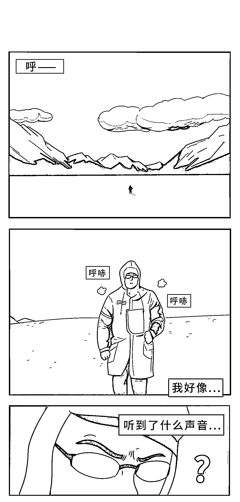

 

 

 

 

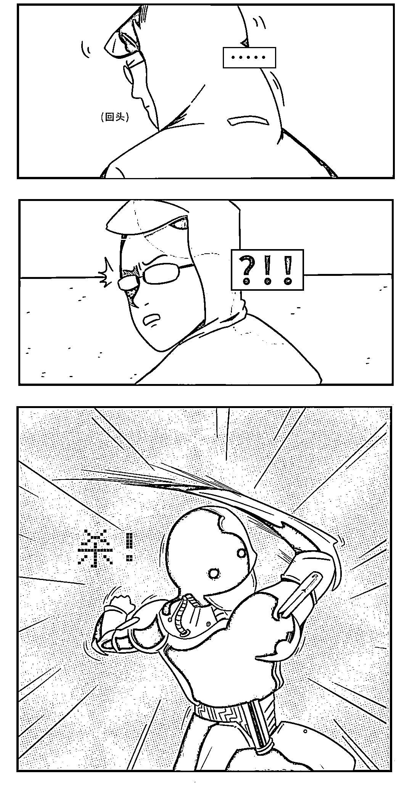

 

 

这个开头，从一个冲锋衣程序员的惊险遭遇开始，就能成功引起了读者阅读下去的兴趣，当然，本篇漫画是一款冲锋衣的推广。

尤其是在做定制广告漫画时，这个尤其重要，前文所有的铺垫，都是为了结尾广告的引出，一个好的开头，至今影响文案转化率。

结尾：一个让人意料之外又情理之中的结尾，或是一个闪亮亮的金句，都能让整个漫画档次提升一截。

比如这个结尾：全篇漫画都在讲，程序员与公务员的各种对比，双方各有利弊不分伯仲，但结尾，一个猛然反转，现实又不失风趣，让读者印象加深好多。

 

 

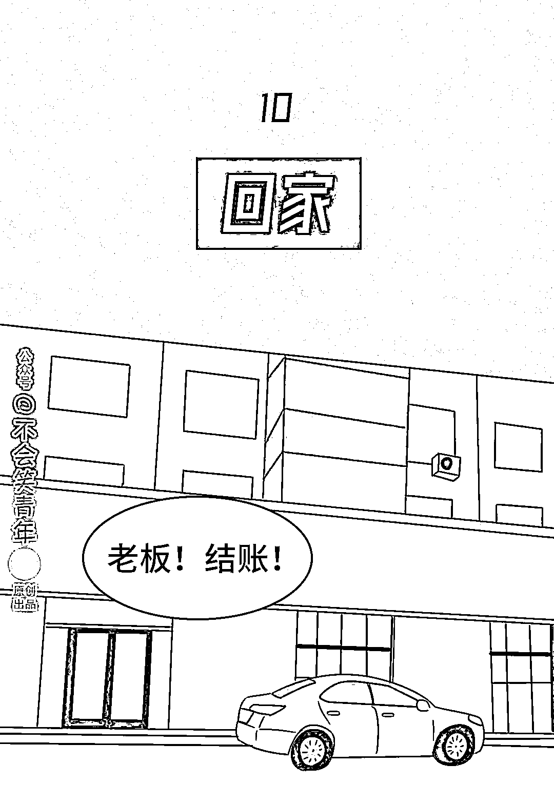

 

 

 

 

 

 

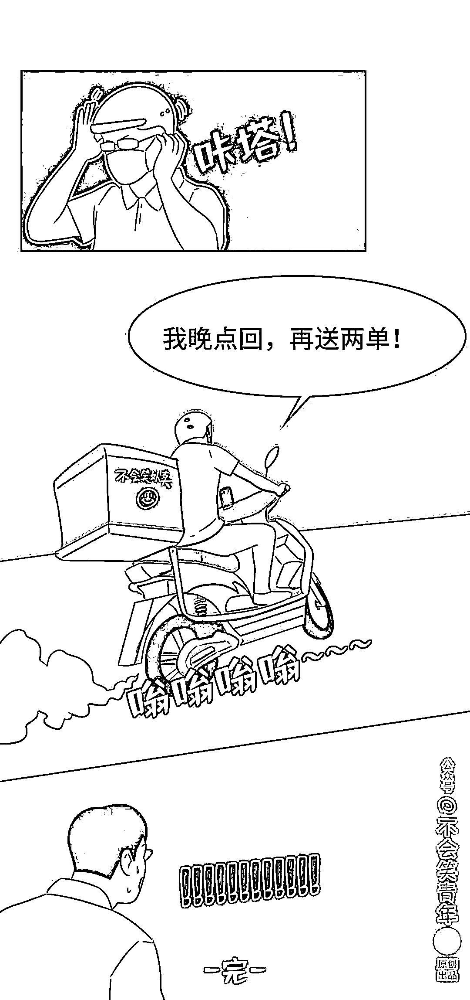

关键点：自媒体真的是在拿捏人性，一个很好的技术、一个质量很高的故事，但如果你不经过包装，只是平平无奇的展示出来，那就无法吸引大众的注意力。

通过有趣、共鸣、夸张、贴合人性的方式讲述有价值的内容，才能更有利于传播，放大流量。

以上说的都是一些技巧，尤其是对于中小号而言，绝对非常实用；对于真正级别的大号来说，这些技巧其实就不怎么重要了，交付好高质量内容就行。

**1.3 **如何保持高频率输出

其实原创多了，我的文案之路确实也出现过多次“思路枯竭”的现象，但在慢慢调整中，我也逐步摸索出了一些方法。

**1.3.1 ** 更多的选题来源

 

 

**① **曾经自己的真实经验，因为在IT行业工作了10年，所以对整个行业存在的各种痛点、梗就拿捏的比较准确，前期几乎50%以上的原创作品，都间接来自于我的真实生活；

这点我认为也是持续生产内容的基础，要做某一领域的内容，你需要对这个领域足够熟悉，这样才能保证你的专业性和敏锐度，即便转载他人内容或第三方投稿，你也具备足够的辨识力。

**② **知乎微博虎嗅**36**氪抖音等等个平台热点，我每天都会刷刷各种热点榜单，相信这是大多自媒体人的习惯。

有些号主一见热点出现，恨不得熬夜就写出文稿来带动流量，但这种方式对我来说却不太适用，因为漫画产出肯定是会滞后几天的，所以我关注的并非热点本身，而是通过热点，寻找一些更多人关心的话题，并以此来进行创作。

举例说明，比如这篇漫画：《要求整治程序员高薪的那个人，被打了！》

这是知乎上的一个热门话题，#整治程序员高薪，而且长期热度不减，我当即就结合自己的观点，把它画成了漫画。

发出后阅读量很快达到2W多，同时又被几十个公众号转载，其中不乏行业的几个头部大号，全网曝光量至少在百万以上。

所以，借助热点话题，是提升创作能力的有效方式。

 

 

**③ **其他条漫大号的选题参考

学习同行，找对标账号，这个经验放在各行各业都可适用。

我几乎关注了全国各类型的条漫大号，一方面学习人家的创作手法，另一方面也从他们的爆款中获取选题，虽然我主要聚焦在程序员领域，但一些热门话题是可以跨行业迁移的。

比如我看到一篇很有意思的家长带娃主题的漫画，我很自然的就想到程序员带娃会碰撞出什么点，然后抓紧去采访身边带娃的程序员们，他们提供的素材，让我很快完成一篇优质的文案，发出后反响也很不错。

就是这篇：《自从程序员老王当了爸，生活太太太太太太爽啦...》

**④ **读者分享

这个其实没啥好说，公众号做的久了，加你的人多了，你的读者微信群也多了，总会有热心读者给你发来选题，合适的话，就可直接用于创作。（下文我会分享公众号引流的技巧，引流到个人微信私域的一些操作）

**⑤ **大量阅读

我本身买了很多的书，书的种类比较多，行业大佬们的著作、历史、科幻、职场、哲学等等，每晚都睡前都有固定地时间来阅读，并十分享受和珍惜这样的阅读时光。

书中很多有意思的点，也可作为参考选题来进行创作。

 

 

比如读完三体后，一边大为震撼作者刘慈欣的宇宙观；一边顺带画了好些篇科幻选题的作品，其中下面这篇我就觉得很有意思，而且在留言区也被读者发现了三体风，反响很好。

《地球程序员VS外星程序员》

以上内容，算是我对自己多维度获取选题的方法和经历总结。

**1.3.2 ** 随见随记

这个可以说是我从事自媒体工作后养成的一个习惯，无论何时何地，但凡我遇见适合作为选题的素材，我会直接拿出手机现场记录。

比如一个电影镜头，一张图片，路边的见闻，我爸发给我的某条微信，和老婆的某句聊天，反正可能和选题素材沾边的，我就顺手记下。

不用记得多么详细，简单几句话就行，我用的工具就是手机自带的便签。

在每天固定工作时，再把这些便签的内容整理到我的在线文档里。不知不觉也就形成了一个选题库，这直接促进了我创作的节奏。

**1.3.3 ** 设置**deadline**

这个方法多少有点变态，但是真有用。

 

 

这是微笑哥和我俩人一起办公时，我们制定出来的新规则。手机定时，比如三小时必须产出一篇文案，超过一分钟，就惩罚一个俯卧撑。

思路来源于一句名言：不要谈什么天分、运气，你需要的是一个截稿日，以及一个不交稿就能打爆你狗头的人，然后你就会被自己的才华吓到。

有次我因超时2小时多才完成，做了135个俯卧撑，胳膊疼了两天抬不起来，后面自然也就不敢大意了。

**1.3.4 ** 调整状态

跑步是我最好的调节方式，一来减肥，二来减压，每周两三次，5-10公里，非常有助于我有更好的工作状态。

这点看完平平无奇，我反倒觉得非常重要，身体的重要性肯定是排在工作之前的，拥有健康的体魄、良好的精神面貌，身边的磁场才是正向的。

**1.3.5 ** 短篇漫画

这个是去年我们的一次重大调整，之前我们学习别的漫画号，大多都是至少20场景以上的作品。

但实际情况是，对于一些轻松的话题，其实并不需要很长，短小精湛的漫画效果反而更加友好。

 

 

一般短篇我们会控制在12场景以内，一方面加快了输出，另一方面也节约了成本。

目前阶段，我差不多90%的内容都是短篇漫画，和漫画师沟通后，短篇漫画的价格定为长篇漫画的60%，加快我创作节奏的同时，也节约了金钱成本。

**1.3.6 ** 赛道选择

其实在我写漫画的早期，选题原则上没有什么限制，但话题太杂，公号也就没什么IP了。

后来我们制定了“全网唯二的程序员主题条漫公号”这个方向，效果好了很多。一方面该赛道是我很熟悉，方便产出；另一方面也因方向足够垂直，更容易接到商务合作。

关于赛道，我也确实踩过坑。起初阶段，虽然我们设定为程序员主题公众号，但却并未严格执行这一策略，而是只要是有趣的话题，我觉得合适就会通过漫画展示出来。

公众号虽然有不少程序员故事，但整体内容五花八门，看着别的条漫大号广告一单又一单，我们却颗粒无收，一定是有问题。

经过复盘，我们发现，那么多条漫大号在前，我们的小号如何能被广告主发现，这是个问题。这么小要被看到，除非你与众不同。

捋顺这个逻辑，我们彻底将话题聚焦在了程序员领域。

 

 

只画程序员条漫，在足够细分的赛道上走到前列，便容易被发现。经过一段时间的积累，我们的条漫推广开始接单了。

第一单记得是华为云的一个算法大赛推广，当时客户发现我们时，称赞我们真的是宝藏公号，领域垂直且价格公道。

我们开单了当然也很开心，当即也开了罐啤酒。

**1.3.7 ** 制定工作计划

随着公号成长，公号运营、文案写作、漫画师沟通、商务合作、其他方向的各种尝试等等，事情越来越多，一个详细的工作计划表，就显得很有用了。

我以日为单位记录每天的工作内容，毕竟年龄大了，不记录肯定就忘了...

二、引流增长

做公众号，不太了解的朋友一定是认为内容是碾压一切的存在。但做过公众号的人应该都知道，增长的重要性一点也不亚于内容，关于不会笑的用户增长方式，我这里大致总结了一下：

** 2.1 **大号带小号

 

 

这是不会笑青年最早期的成长方式；微笑哥通过他的大号【纯洁的微笑】文章推荐、文末捎带、转载内容等形式，给不会笑青年带来了第一波启动粉丝。

这是很多公号主起号的最常见办法，每一个大号带N个小号，通过大号推文，将粉丝引流到小号上，完成公众号初始粉丝启动。

这种方式大概给不会笑青年带来了4-5万粉。

**2.2 **抽奖方式

通过第三方小程序进行抽奖，我们送过现金红包、无人机、Mac等礼物，这种方式贯穿不会笑青年成长的整个过程。

首次发放现金红包1888元的抽奖，当天即涨粉4K+。

首次抽Mac，当日也涨粉3-4K，记得当时和几个公号主联合起来，总计大概十几轮送Mac活动，不会笑粉丝从17W涨到20W，通常是10个公号主合作，每期每人成本四五百元。

优点：见效快，发出来就会明显带来一波增长。

缺点：

① 用户留存率不高，涨1000后续会掉个五六百都是常事。

② 效果一次不如一次，第一次效果奇佳，第二次减半，后来越来越不行。

 

 

③ 存在平台风险，可能会被投诉，尤其最近一段时间，强烈不建议这种方式。原因是近期圈出现多个被举报的案例，不少公众号都受到了平台的处罚，理由为“诱导关注”。

综上，目前不建议此种方式。

**2.3 **互推方式，包括单推、群推

和其他与自己体量相近的一位或多位号主，约好互相推荐！从而达到粉丝互换，相互成长的效果。这个也是公众号圈子里最常见的增长方式之一。

优点：短期增长效果很好，和抽奖类似，一推就涨见效快。

效果好坏关键看你的文案，优质文案转化率可达到阅读量的30%左右，劣质文案转化率甚至不足1%。

通常的手段就是送资料，送红包发福利等等。

缺点：

会导致圈内粉丝同质化会越来越严重，时间久了会带来一些问题，比如广告转化率低等情况。

互推的效果都是单次的，没有长尾效应，短期涨粉有效，要长期涨粉，此方法治标不治本。

 

 

这里分享两个小技巧：

① 有关优质转化文，可以是自己的，也可以别人的。

这种文章也不牵扯原创什么的，只要效果好，就收藏起来，再和不同号主互推时，可频繁使用。基本一个号效果好，在其他同类型号的效果也大概率会好。

② 如何寻找对标公号，有很多公众号排行榜。比如二十次幂，按你的搜索条件去搜同类型账号即可，比如我是技术领域，那我就搜技术号榜单，阅读量和我接近的就可挨个联络。

**2.4  **外部流量方式

此种方式最值的被推荐！通过在其他平台发布对用户有吸引力的内容（比如技术干货等），从而将外部流量转移至公众号！

比如知乎、B站、微博、小红书、抖音、各种大小网站均可。

B站目前包容性很大，视频中可以直接提公众号信息，但很多平台却不允许，比如知乎，就明确不允许露出二维码或公众号等敏感信息，这些需要自己规避。

小技巧：外部平台引流，如果有平台限制，那就不要直接通过敏感信息引导，可以在文末引入一个自己的在线文档链接，然后在链接里再做推广，不放心的话就再多加一层链接。当然，这样肯定会影响一些转化率，但总比被平台屏蔽了好得多。

 

 

优点：长尾效应极强，外站运营到一定规模，每日可被动增长粉丝几百甚至上千，且带来的流量质量很高，粘性强。

缺点：其实这个不能算是缺点，算是难点。

比如运营知乎，你需要规律性在知乎进行创作，提升等级和知乎盐值，增加自身账号权重，只有有了权重，你的回答或者文章才能有足够的曝光量，这需要你长期的积累耕耘。

比如运营B站，视频门槛就更高了，这个我自己目前也还在摸索中，目前思路就是找对标账号，模仿并持续输出。

我自己在今年1月份也开始做视频，其中几个面试系列的视频，小爆了一下，几个视频目前大约给我带来了大概三千粉丝，目前还是持续增加。

关键这些平台运营好，本身也具备超多流量和变现能力。

综合来说，外部流量增长，是目前我认为最好的方式。

**2.5 **内容吸引

照理说，自媒体就是做内容的，我们本该以优质的内容去吸引粉丝，道理没错，但现实难度很大。

通过后台数据，不会笑青年的200多篇漫画作品，效果最好的一篇大概也只带来了几百粉丝，还是被超多公号、网站、外部平台转载的结果。

 

 

一篇千万级传播的爆款，单篇带来几十万粉都是可能的，但这样的作品，是内容、时间、地域、群体、运气等因素的综合结果，对一般普通人而言，这种事可遇不可求，用心做每一篇内容就行了。

当然，还是要尽力打造好自己的内容，这是长期有利的事。一方面积累自己的ip势能，另一方面，说不定哪篇就爆了呢！

**2.6 **资本方式** **

去年底，我们开了一个新公众号，了不起的程序员。

这个公众号的增长，我们主要采取的就是资本方式，通过买其他技术号，之后迁移合并的方式快速涨粉。

当然也有些涨粉公司，直接花钱就可以买粉丝，这种方式我没有考虑。主要原因是，粉丝的质量、活性、粘性等均不可控。

这点没什么好说，花钱买流量，整体不太推荐。

三、收入情况

我入公众号领域算是比较晚了，收益的话，只能算是赚到了公众号红利的尾巴。

 

 

而公众号在21年之前，变现能力才是最强的。部分头部个人号主可做到年收入500-1000万，一些强力的公司号显然更厉害了。

就今年的行情来说，公众号仍旧能够变现，但变现能力明显减弱，收入不及往年5成。

一方面可能是短视频的冲击、另一面经济大环境也不好，尤其是技术号，曾经的一些金主甲方各种亏损、跑路......

**3.1 **目前公号的主要变现方式还是广告，一般有几下几种方式：** **

**① **外部广告一口价形式。

甲方商务的考察的主要点：一个是粉丝群体属性，比如年龄，性别，行业，地域这些；

另外一点就是公众号近期的阅读量，阅读量则是直接影响了成交价格。

按往年正常情况来算，普通图文公众号一个阅读量的报价在1元左右，整个行业其实也大体如此。

我的条漫公众号会更高一些，条漫原创作品单个阅读量可以报到1.5-2.5元；而今年的情况，整体报价变为了0.4-1元左右。

也就是说，过去你发一篇推文，阅读量1W的话，至少应该能收到1W+的收入、而现在大概只能收到五六千。

**② **外部广告分成形式。

 

 

商务在你公号发布内容，通过用户点击、或实际转化给你算分成，这种合作方式通常我不会做，靠谱的平台尚可，但很多平台的数据真实性待核实，比较耗费心力。尤其对于中小号而言，性价比很低。

**③ **群投或者朋友圈分享。

通常有经验的号主，会尽量将公众号流量转化到自己的私域来，比如添加到个人微信或者自己的读者微信群。

不少广告商并不想在公众号直接投放，而倾向于投放群分享或者朋友圈分享，我朋友圈大概2.3W好友，去年一条朋友圈分享报价在4K左右，微信的200人群，单群报价大概在100-150元之间。

**④ **自己产品变现。

如果你有自己的产品或产品来源，比如知识星球、专业技能课程、自己的实体产品甚至付费咨询等等，当然也可通过自己的公众号来推广。

在如今行情不太好的时期，靠自己产品变现最近在圈内比较流行，至少我发现很多技术类号主都在这么做。

**3.2 **如何联系商务？

同报价情况一样，商务合作在今年整体也出现了下滑。

 

 

从我的公众号情况来说，2020年21年两年，商务会接二连三的主动来找我，随着公众越长越大，我的商务微信每天都有8-10个商务来链接，这么多商务让我一个乙方都有点飘了......

而今年开始，每天能有一两个商务来咨询就不错了，大多数情况下，需要自己主动去链接，目前阶段的注意点：

多加一些甲方和公众号主的合作群。

资源共享，很多广告商是中介，他们也是有自己KPI考核的；自己接到广告，不妨也推荐给同行们，大家抱团相互支持一定好多孤军奋战。

每接到一个甲方商务，尽量做到“微笑热情5星级服务”，也就是做到尽量快速响应，同时切实考虑为提高甲方转化率的指标。

比如优化标题封面，或在社群朋友圈增加推广，再或者多送甲方一个次条等等，都是ok的，目的就是促进成单和复投。

可以看出，两年之间变化还是很大的，红利真是稍纵即逝，机会来了你不全力去抓，错过了就只能默默承受了。。。

注意事项：

当然，这里也不是什么商务都接，有些一看就是坑人的，报价再高也不能接。比如各种不知名理财产品，动辄年化15%等这些夸张内容的，一律不能接。

四、有关过程中的经验分享** **

 

 

**4.1 **不要太轴

在做不会笑青年这个公众号之前，我们就对条漫公众号领域做了一些简单的调研。我们了解到一些条漫大号，单条推广的价格可以达到几十甚至上百万，且这类广告不伤粉，如果做起来的话，对传统图文公众号来说几乎是降维打击。

所以，在起初在做条漫原创公众号时，我们对自己的定位很高，高举高打，目标只接高价原创条漫的推广，但现实一定用它的方式泼来冷水。

对于个人公众号来说，财力人力资源各方都很局限，抛开资源谈理想，就会被教育。

从19年底公众号启动到20年10月，找我的商务有很多，但在我们自己的规则限制里，能接的却很有限，而漫画公众号，每一篇的成本又比较高，再不调整策略估计就快活不下去了。

于是从20年国庆开始，我们也开始接各类图文形式的推广，20年后三个月，我们的收入就收回了全年的成本，底气也就足了起来，先活下去，才有了后续那么多的原创条漫广告。

**4.2 **抓住红利

任何事都有周期，公众号也不例外。当年在公众号的红利期，我并没有抓住时机去做变现；当时还想着自己是长期主义者，要保证原创，保证读者体验，每周还限制自己的推广次数。

 

 

我只能说，初衷是好的，但还是太天真了。

对于普通人来说，遇到的任何一个红利期，都要尽力抓住，都还没财富积累，就妄谈格局，太不明智了。

如果利用好前两年的机会，卯足劲去接推广，用推广把所有可用档期填满，变现至少是现在的两三倍。

**4.3 **普通人现在还可以从**0**做起公众号吗？

我的看法：

可以做，但比起前些年来说，难度真的大了很多很多，如果你没有外部资源支持，又想通过公众号快速变现，那就不建议做。

一个新号要想实现变现，至少你的阅读量需要在1000以上，而阅读量达到1000，你的粉丝通常要在1W以上。

现阶段公众号可以说已过了最佳红利期，仅凭内容就能稳定涨粉的时代已经过去，如果你没有相应的资源去启动你的新号，那几乎是做不起来的。

以过去我们孵化的一系列小号为例，一个技术公众号从诞生到开始变现，通常需要3个月到半年的时间，而这还是在我们有大号资源的情况下。

所以，对于普通人从0开始做公众号，我只能说，很难！

 

 

即便现在的很多大号号主，在当下广告锐减的情况下，手握流量，如何去变现，依旧是一个值得深思的问题。

五、普通跨界者，如何实现**0-1**突破的一些思考

写文案做公众号，是我的工作，对大多数人而言，或许永远也不会去涉及。但我想这个过程，对其他一些事，是共通的。

一件你想做的事，但你对它很陌生，如何实现从0到1的突破呢？我的大致想法如下：

1\. 要创造，先模仿，尽量去学习领跑者的经验，一开始大概率学不到精髓，但至少能让自己有一个起点。

2\. 在可控的成本之内，不断试错 + 持续改进，说不定就能摸索出一条路来。

3\. 一边做事，一边沉淀，实现量变到质变。

4\. 选择合适自己的方式，让自己保持高效，比如对我来说，deadline很必要，那135的俯卧撑多酸爽我很清楚。

5\. 制定可行的计划，做好时间管理。

 

 

6\. 其实谁比谁也聪明不了多少，很多时候比的还是执行力，想法很多人都有，但能执行下去的人还真不多。

7\. 执行需要正反馈，过程与结果都重要。我之前有个同事，每天英语打卡朋友圈，打了几年，还是连简单的沟通都无法完成，这种打卡真是打了个寂寞，打卡不重要，结果重要。

好了！今天就写到这吧！也希望我们都能在各自的领域，都能有所突破！加油！

评论区：

芷蓝 : 太棒了，尤其是针对文案的一部分。

不会笑青年 : 谢谢芷蓝[呲牙]

黄岛主(虚拟项目) : 学习下

不会笑青年 : 向岛主学习

黄岛主(虚拟项目) : 多交流

Nommy : 有关注，谢谢作者分享

不会笑青年 : 感谢～

李智 : 赞，很真诚的分享，受用了！……提个问题，公号红利已去，广告业务下降，未来你们会靠什么变现呢[呲牙]

# **# ****(**精华帖**)(112**赞**)**职场小白裸辞做小红书宠物

# 博主，一个月收入顶一年工资

作者：  虾饼

日期：2023-06-21

宠物赛道越来越卷了，那除了头部大 V 外，素人还能做起来吗？

 

 

不知道大家有没有发现，很多的红海赛道细分之后，就又是一个新的蓝海。我在小红书做宠物科普博主之前，就是一个毫无基础的新人，在小红书做宠物赛道也只是因为热爱分享。

所以在刚开始起号时，仅仅是利用闲暇时间去蹭爆款标题，发笔记试试水，没想到一个月就积累了近千粉。慢慢的我就开始专职做宠物科普博主，接广告推广变现了。现在，我单月的收入比我之前一年的收入还高，这也是我当时不敢想的。

而对于素人来说，宠物科普就是一个机会比较大的蓝海类目。相比萌宠、吃播赛道，宠物科普难度比较低，适合小白入局，而且起号成功之后不仅仅可以只做科普，也可以做同类型的矩阵号去引流卖货。

今天，和大家分享我做小红书宠物科普博主的一些经验和实操，希望对大家有帮助。

一、自我介绍

哈喽大家好，我是虾饼，3 年生财圈友，2 年谢无敌的红书宝宝友。我在 21 年底裸辞后开始做小红书，选择了宠物赛道里的细分赛道——宠物科普，单月收入最高抵我之前上班一年的收入。

小红书可以说是各个自媒体平台里对素人最容易上手、推荐机制最友好的，分分钟从苦逼打工人转型为全职博主！

 

 

宠物行业近年来发展趋势向好。比起生娃，现代年轻人更偏爱养育成本低而精神陪伴价值高的宠物，将它们看做是家庭成员的一部分，愿意为它们付出精力和金钱。

但实际上我选择这个赛道偶然性是比较多的，我没有像其他人一样用很科学的方式去调研去分析，仅仅是从我个人长处出发。我是一名铲屎官，特别特别爱我的毛孩子，有事没事就要逛论坛取经，学习科学养育的知识，淘车价好物，我还很热衷于把我所知道的安利给身边的朋友。

那么我的优势就是：有知识储备（量多量少不要紧）+热爱分享。所以我决定大类上选择宠物，细分赛道上选择做科普。

误打误撞，这个赛道恰恰是最适合新人入场的赛道之一。

先说一下我起号的情况：2021.10 开始利用通勤时间发简单科普笔记+萌宠日常，但发现科普笔记流量更好，通过蹭爆款标题一个月积累了近千粉丝。

零零碎碎地接广，一个品报价小几百。2022.2 用了一个爆款模板一周时间涨粉 3W，广告邀约不断，报价四位数。

 

 

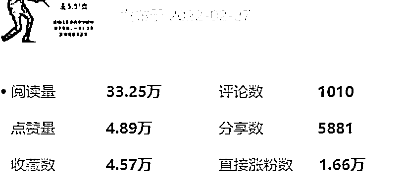

二、宠物赛道情况

宠物赛道大致可以细分为：萌宠、吃播、科普。

（**1**）萌宠** **难度：**5 **星

**1. ** 必备条件：宠物有特色或号主有较强的包装能力

**2. ** 其他条件：会讲故事、会拍摄剪辑

**3. ** 优点：流量大，出大** V **概率高

**4. ** 缺点：泛粉多，用户画像不够精准，报价较低，无法批量复制

 

 

 

 

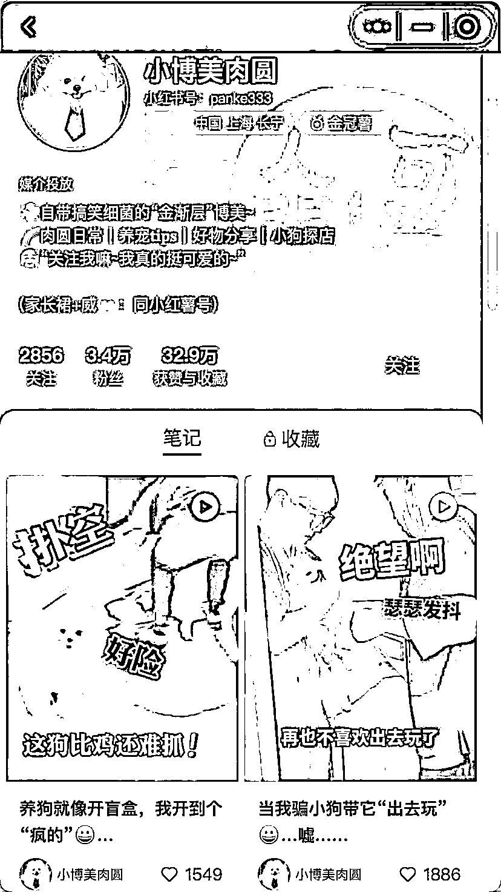

（**2**）吃播** **难度：**3 **星

**1. ** 必备条件：宠物干饭能干得很香或号主场景布置能力较高

**2. ** 其他条件：简单的拍摄剪辑

**3. ** 优点：流量中等，出片比萌宠难度低，可以复制

**4. ** 缺点：同萌宠

 

 

 

 

 

 

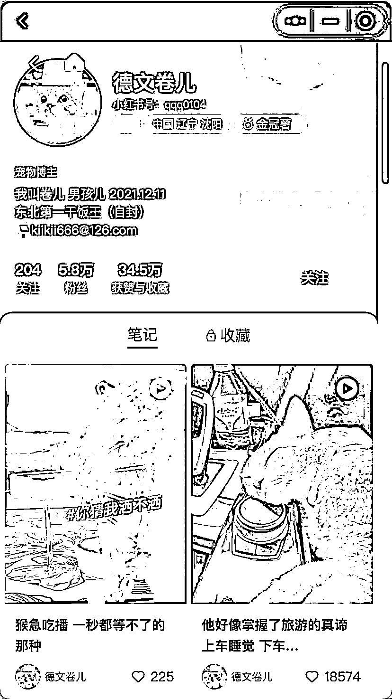

 

 

（**3**）科普** **难度：**2 **星

**1. ** 必备条件：宠物知识储备

**2. ** 其他条件：简单的拍摄剪辑或文案排版

**3. ** 优点：制作简单几乎无成本，用户画像精准，报价较高，可批量复制

**4. ** 缺点：流量较少，较难出大** V**

 

 

 

 

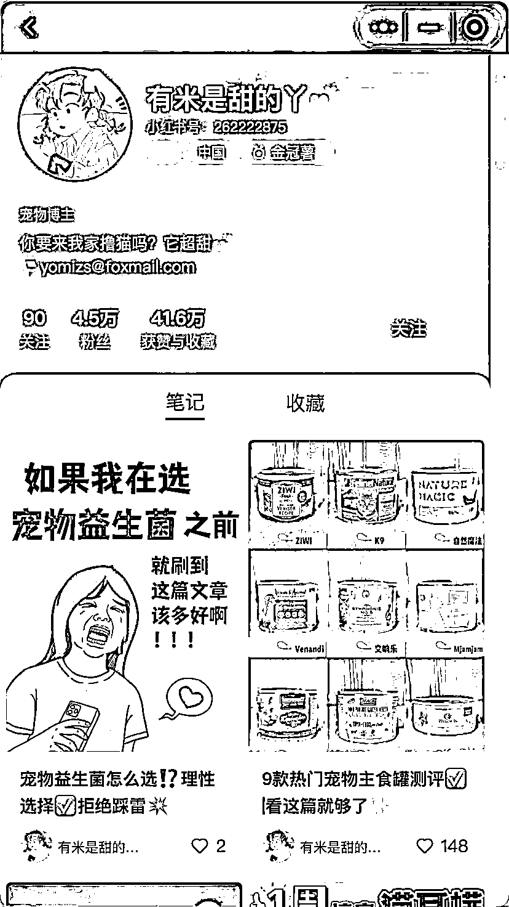

 

 

 

 

因为科普类可量产的特点，成为了许多机构和品牌做号的切入点。团队来做这类号的优势是人力充足，能量产，只要一批号里有那么几个做起来了，收益就很可观了。

**1**、品牌

**H5**

品牌起号只需要组建一个非常小的团队，成本远比每月找博主投放低。

例子：诚实一口

**H5**

品牌矩阵号&作用：

 

 

 

 

专业号大号 1 个

品牌宣传、活动发布用

 

 

 

 

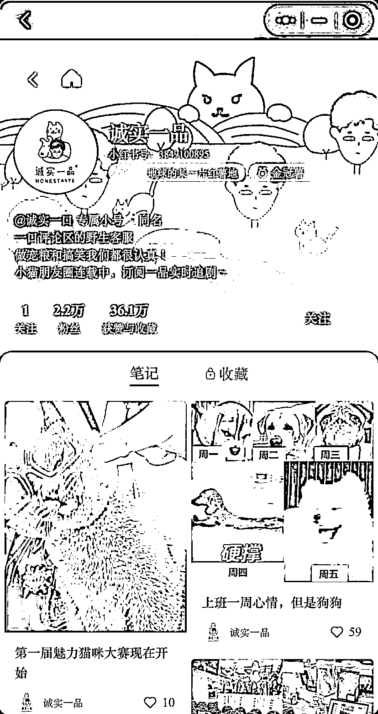

专业号小号 1 个

品牌宣传、引流用

 

 

 

 

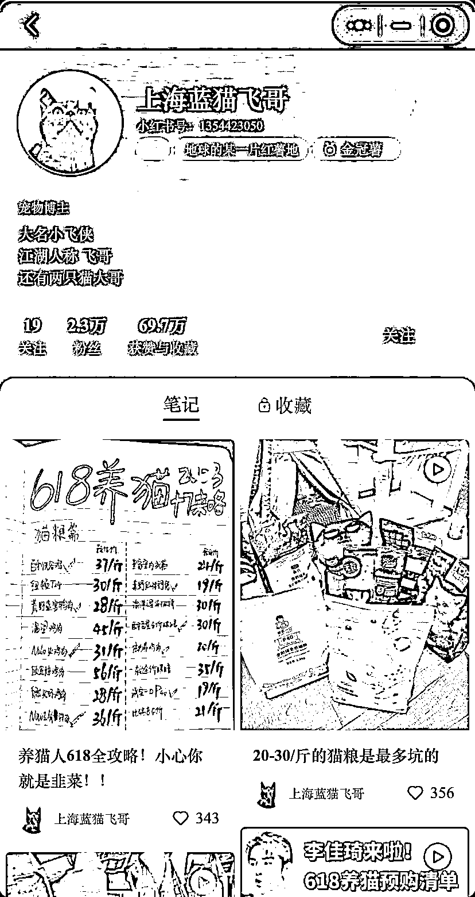

个人号猫号 N 个

给品牌打软广用

 

 

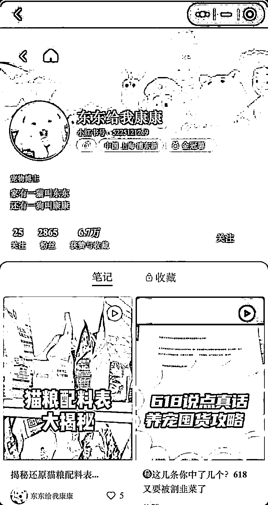

 

 

个人号狗号 N 个

给品牌打软广用

诚实一口的专业号小号做得很好，通过发布一系列有趣但没什么意义的内容，打造品牌有意思、亲近用户的形象，博得用户好感，打开品牌知名度。

该品牌前期的个人号也是图文类型，使用爆款模板大量起号，后来又做了视频类型的，成本高了一些，但传播度和影响力也更大。

视频内容的打造跟图文爆款也是一样的，猫号的某条内容火了，选题不变，台词稍微改一下，套到狗号上面，能再爆一次。

**2**、机构

**H5**

量产一批号，选题、封面设计、剪辑套路共用，只要做起来了，就可以找品牌合作推广。而且由于机构手上号多，什么量级的号都有，价位不同，给了品牌较大的选择空间。

 

 

例子：方片新媒体

**H5**

矩阵号：

 

 

 

 

 

 

 

 

 

 

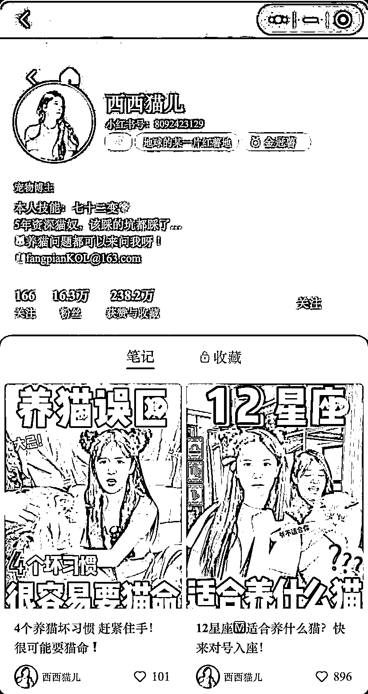

 

 

他们做的号太多了，但是基本上只要看到就能认出来，因为风格差不多。毛毛和喵喵这个号还是换过演员的，谁都可以是猫猫，视频里露的脸长什么样，对他们来说并不重要。

当然批量批号对机构来说不过是常规操作，只是做宠物号的机构没有很多。我认为可能是能批量做的类型比较少，目前看来主要都是科普类，此外就是宠物品牌预算较低，远不如美妆类的利润高。

**3**、素人入场分析

**H5**

去年小红书对宠物赛道十分友好，经常给予流量扶持，还拉了作者群进行运营。

今年起来砍掉了宠物赛道大部分的流量扶持，活动减少，类目仅限于萌宠和异宠，大部分作者群也直接解散了。现在整体环境对新号比较友好，新号能获得较多自然流量，但老号基本只能靠推流。

此外品牌和机构入场会挤压到素人的生存空间，质量不够高，或自然流量不够好的素人接广概率相比之前有所降低。

 

 

但对素人来说宠物科普仍是一个机会比较大的蓝海类目。所以我会建议小白多考虑宠物科普赛道，先套爆款模板起号，再看是要做同类型矩阵号去引流卖货，还是要精耕内容转型更有深度的科普博主。

三、实操流程

（**1**）账号装修

**1. ** 账号定位：科普类使用真人的** IP **价值更高，用宠物做** IP **需要结合萌宠内容一起做效果才好

**2. ** 昵称：最好带上关键词方便被搜到，如：**XX **养猫、铲屎官** XX**、**XX **说宠物**3. ** 头像：用真人照更容易拉近和用户之间的距离，形象更丰满

（**2**）内容来源

**1. ** 豆瓣、贴吧、知乎：找选题相关资料用，这几个网站拥有较多高质量的经验贴**2.  PetMD**、**ASPCA**、**icatcare**：在谷歌里用英文搜关键词，能找到很多同类网站。

找选题相关资料用，需自行翻译，内容有专家把控，比中文论坛的素人发帖专

业严谨

**3. ** 谷歌学术：找文献用，宠物相关的研究国外更先进且资料更丰富

**4. ** 小红书：内容质量参差不齐，主要用来模仿内容的呈现方式，内容的呈现方式，如标题、封面、排版等

 

 

（**3**）创作流程

**1**、找选题

**H5**

**1. ** 不要局限于自己的类目，其他类目的爆款也是可以参考的，比如：

 

 

 

 

 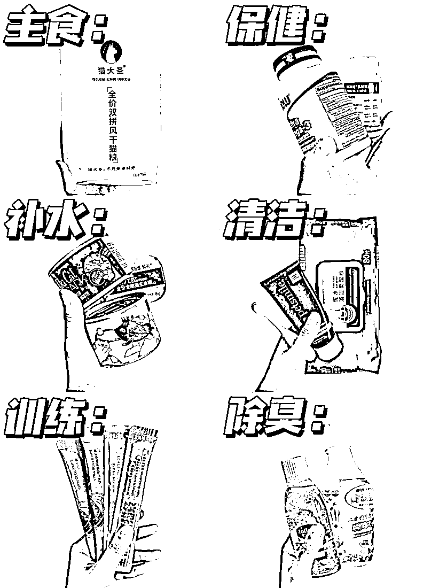

 

 

好会养猫一女的 200 元搞定日常消耗品

（同时参考了选题、标题、封面）

**1. ** 笔记要注意内容分配，一开始可以设定** 30%**引流内容（蹭热点、蹭爆款模板）**+70%**体现账号价值的内容。这个** 70%**里面留有产品植入位置，为后续接广打基础，同时也要注意账号调性，如果只发** PDD **平价养猫这种选题的笔记，接到高端产品的几率会较低。

**2**、定封面

**H5**

小红书瀑布流的推送形式让封面变得极为重要，用户第一眼看到的就是封面，想要笔记脱颖而出，封面就得足够吸睛。

但是不建议所有笔记封面都复刻爆款的，这样很累，而且没有明显的个人标识，还是得定下一个足够有个人特点的封面模板。

 

 

 

 

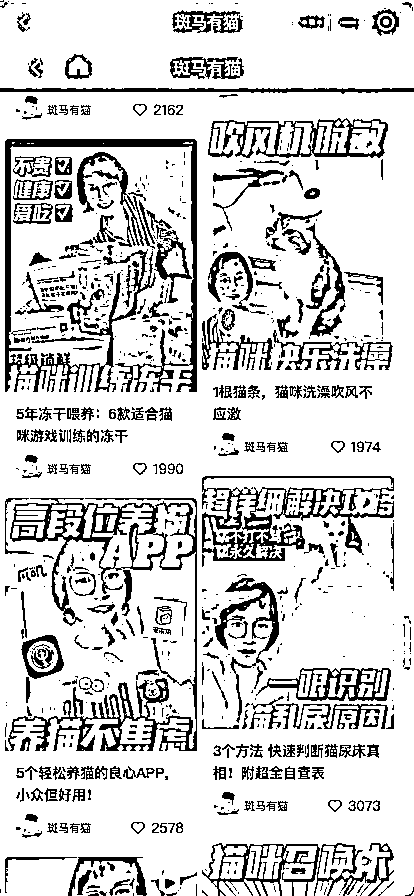

统一的花字，封面均为人像

 

 

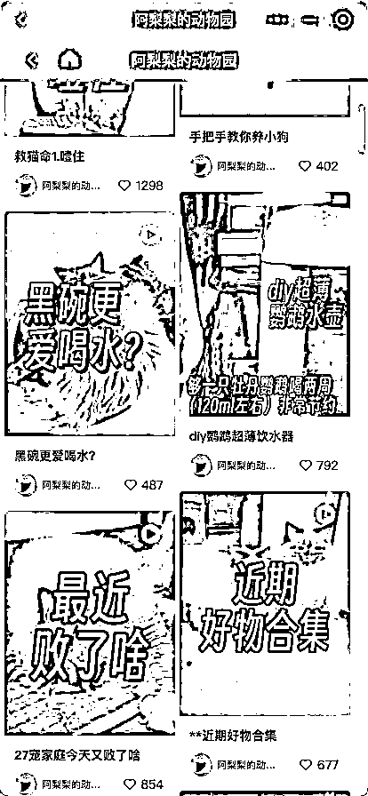

 

 

统一花字、封面、视频特效，但这位博主也是经历了很长时间的蛰伏才找到自己的爆款方向

 

 

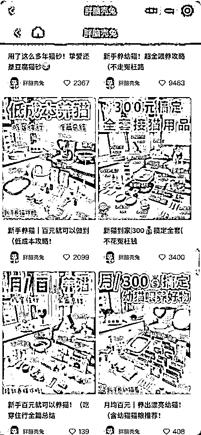

 

 

统一花字，封面均为多物品摆拍

**3**、定图片内容

**H5**

内容跟封面有共通之处，但是没有封面要求那么严格，只需琢磨出你自己一套模板即可，不用模仿爆款。

但也还是要注意可读性。

 

 

 

 

笔记科普部分

模板可拆解为：底图、标题、段落、配图，这些都是可以用固定的字体配色和排版的 

 

 

 

笔记推广部分（宠物与产品的合影）

拍摄模板可拆解为：宠物与产品的合影、产品细节图、宠物试吃图；

推广部分的文案模板：大标题、小标题、卖点详解等的字体配色和排版

 

 

 

 

笔记推广部分（产品细节图）

 

 

 

 

笔记推广部分（宠物试吃图）

**4**、定文案

**H5**

这部分其他朋友分享过，无非是分好段落，开头固定打招呼，中间抛问题埋关键词，结尾自我介绍和引导互动。此处不赘述。

四、变现方向

对于小白来说最简单方便的变现方法就是接推广

 

 

（**1**）如何提高接广率

**1. ** 前面强调的，笔记内留出产品植入空间，比如你在科普猫咪软便怎么办时，留一部分出来讲平时吃什么猫粮**/**保健品可以解决这个问题。

**1. ** 简介里留联系方式，方便** PR **联系你。不过现在不能留邮箱了，建议使用特殊字符，工具： https://exotictext.com/zh-cn/** ** 

 

**1. ** 到达千粉后马上去开通报备合作权限，你的账号可能被品牌在蒲公英平台上看到并选中：

 

 

 

 

小红书-我-左上角三条杠-创作中心

 

 

 

 

创作中心下滑-内容合作-进去后有开通指引

**1. ** 使用第三方通告平台（注意甄别），如螃蟹通告、布偶通告（均为小程序），这些平台里会有新媒体群入群引导，多加，也多跟其他人互换群资源，能接触

到很多通告信息

**1. ** 遇到心仪的品牌也可以去私信求合作

（**2**）推广合作流程

**① **合作形式

合作的形式分为报备笔记和非报备笔记。报备笔记就是前面提到过的官方认可的品牌合作，是要被收取“保护费”的；非报备就是咱们私底下合作，悄咪咪打暗广。

 

 

非报备又可以分为单品跟合集，单品就是一篇笔记里只能含这个品的广告；合集就是同时有好多个品给你广告费来出现在你这篇笔记中。

单品里面还有个概念叫做伪合集，就是一篇笔记里看似出现了很多个产品，但真正给广告费的只有一家，这种就是在最大程度上避免被判定为私自推广。

跟 PR 聊的时候还得聊清楚以下几个问题：

**1. ** 档期：就是你出初稿、终稿、以及最后发布的日期。

**1. ** 授权转发：能否授权给品牌方在电商**/**内容平台上发布，是否免费，授权周期多长。尾部博主一般是免费授权，周期一般在三个月到半年。

**1. ** 授权投流：能否授权给品牌方在小红书里投流，是否免费，授权周期多长。虽然投流能帮博主涨数据，但如果品牌爆出丑闻，还继续拿我们的笔记去投流，

对我们账号形象会有影响，所以最好定一个周期，比如一年内免费授权投流，

一年后看情况是否继续授权，是否加费用。

**1. ** 笔记发布后的保留周期：一般是一年或永久。

**1. ** 排竞：在你发布这篇笔记的前几天到后几天，不能再发布该品牌方的竞品的相关笔记。

**1. ** 活动出席：美妆和穿搭类的品牌可能会邀请达人出席他们的产品发布会之类的。

**② **如何报价

 

 

推广分为两大类，无费和有费。

无费推广就是置换，把东西送给你你帮忙出一篇笔记，跟小红书的好物体验是差不多的；

有费就是会给你一定数额的报酬，大原则上报价一般是按粉丝量的 10%～20%，具体可以看你账号的情况，如果这段时间流量很好，账号定位又跟品牌契合度很高，那就可以再往上报。

还有就是看你是否注重长期合作。一种情况是你笔记报价相对较高，但是出来的效果不好，人家可能就不会考虑二次合作了；

另一种情况是比如原价是 2000 一篇，按他们的预算可能一个月只够找你合作一次，如果能谈到 1500 一篇  ，或许他们一个月内就会找你合作两次。

再者你要看是跟品牌直接对接，还是跟机构对接。机构的话一般会找你要返点。返点就是你收了推广费之后返一部分给机构。

返点在 20% 左右比较合理，那种 35% 以上我觉得有点离谱。

图文报价一般会低一些，大概是视频报价的 60%～70%。但如果你本身就偏向于图文类的博主，那么你的图文报价是和可以视频报价相当的。

报备笔记报价，要高于非报备，因为你不仅要被品牌收取服务费，还要接受品牌更严格的审核，可能需要你更高度的配合，如果到手比非报备低的话就太亏了。

 

 

有一点很重要，一定要记得跟 PR 讲！就是你现在给的这个价格是几月份的价格，是不是一定要在当月发布稿子，如果延迟到下一个月份发布，你是不是要涨价。（保价的概念）

然后就是修改次数啦，特别是视频的，脚本接受几次修改，后期接受几次修改，大改的话是否要加钱。

有一些合作不是按固定价格来结算的，可能是按周期内的互动量阶梯式付费，比如 7 天内到达 100 赞就多少钱，到达 1000 赞就多少钱。

也有的是按带货佣金给的，给你的一个基础费用之后，你能帮忙带多少货就额外给你多少钱，或者没有基础费用，按纯佣计算。

在寄样品上面有两个概念需要了解：寄拍和送拍。寄拍主要用于单价较高的产品，你拍完照片后是要寄回去还给品牌的；送拍就是东西完全送给你了。

**③ **结款

最后就是结款了，要问清楚是否需要发票。跟机构对接他们会帮你开票，不用担心。

跟品牌对接可能要你提供替票或者是上诺诺网代开发票，替票就是你去外面消费，然后要求开发票，用的是合作公司的抬头，再把发票给他们拿去报销；

代开发票可以上某宝搜发票管家  里面有个代开的选项，是诺诺网提供的服务，选择一个税点低的城市，开票给品牌方。

 

 

还要问清楚的是结款周期，是发布后就打款，还是要等多久才能打款。

结款方式是直接打到你私人账户上，还是要注册类似人力家这种第三方平台，这种平台是会帮你交税和解决品牌的发票问题的，很省心。

现在也不止接推广的变现方式，发笔记带商品链接也是可以挣佣金的，类似抖音的小黄车，>1000 粉后可开通。

此外还可以开个小红书店铺，自己给自己带货，无粉丝要求，找得到货源即可。

评论区：

虾饼 : 加入生财的第三年啦！没想到居然会被生财约稿哈哈哈！感谢生财团队的认可和运营编辑小伙伴的工作支持🎉

周彦充 : 厉害，[强]，至今还没被谁约过稿[色]

虾饼 : [抱拳]仁兄过奖！还得感谢无敌老师给的曝光哈哈哈，让小白在圈子里也有露脸的机会

Sherry💎谢无敌 : 一直都是棒棒的虾饼[得意]

虾饼 : 呜呜感谢无敌姐团队的指导和支持

胖大魔 : 我最喜欢的宠物博主是抖音的二狗[呲牙]还有郑义的大黄[呲牙] 周周Mia : 赶来给锤妈点赞[呲牙][呲牙]

虾饼 : [亲亲][亲亲]

# 【项目分享**-IP**打造】**1**篇

 

 

# **# ****(**精华帖**)(450**赞**)**大厂裸辞跑通职场个人**IP**，

# 千人私域半月被动收入近六位数的历程分享

作者： AI君

日期：2023-06-16

大家好，我是AI君，95后，前大厂产品经理，做个人IP两年，裸辞一年半，目前是一名职场个人IP孵化教练。

一开始做IP的时候，我是无资源无背景，没有业余的自媒体账号，微信好友仅1000人，半年不发朋友圈的小透明。

到上个月的时候，我实现了靠3000私域好友、1000粉公众号和4000粉小红书，半个月被动变现近六位数的净收入。基本都是一两个月从认识到转化，也几乎没有什么沟通。

这种模式对于一个普通职场人来说是非常舒服的，不需要维护太多好友和产品，不需要做太多的销售转化沟通，也不需要搭建和管理团队，一个人的时间精力就能搞得定。

这是我做个人IP两年，微信端的变化情况

 

 

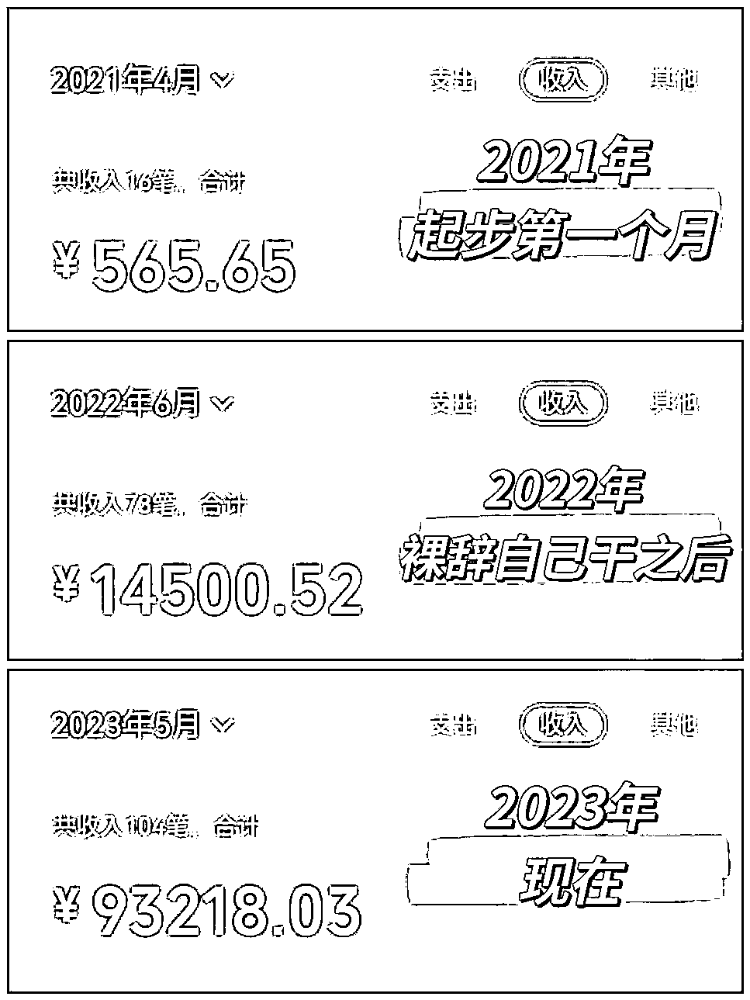

成绩和各位大佬比不值一提，但作为一个自己拿到重大变现突破的普通职场人，以及一个帮助过诸多职场人实现副业变现五位数的个人IP孵化教练，我的历程和经验，或许对大家有一些借鉴和参考。

 

 

这篇文章就想和大家详细分享一下《普通职场人，如何跑通个人IP，实现副业变现五位数》，具体包括——

1、职场遇到瓶颈和迷茫，如何确认未来发展方向，找到自己的优势和竞争力？

2、为什么学了诸多课程却没有真的改变？职场人做IP的特殊性和必须考虑的问题3、如何打造一个自身自洽，能同时实现自我价值和商业变现的个人IP模式？

4、如何通过私域内容、转化设计、自媒体打造，实现变现飞跃，超过主业收入？

5、职场人转型路上有哪些常见的问题？该如何解决卡点、保障效果？

全文将近17000字，详细写了我的经历和我做IP打造的方法论，详情请移步：

https://j7329dxmbu.feishu.cn/docx/RmGidmCRcoQEJ6xre2Zcm9UqnXd最后，要特别感谢生财给的平台，这里面真的很多好的项目和资料，也很多优秀的人，毫不夸张的说，它是一个巨大的宝库，大家可以有效利用起来，不要入宝山空手归。

2021年4月份我加入的生财，就是我起步做IP的阶段。

当时我专门花了一些时间把生财的各个分类的帖子每个看了几篇，对于市面上现在大概有哪些比较好的项目，情况是什么样做到心中有数。

同时去链接了很多自己相关的优秀圈友，去近距离交流，看看他们怎么做成的，深度了解和学习。

这些对我非常有帮助，我也很建议大家去这么做。

 

 

感谢米索、芷蓝、文静、靠谱，对于我进入生财、做IP、以及写帖子过程中提供的帮助。

感谢大家的耐心收看，希望能对大家有所帮助，也希望看到更多优秀的朋友真的走通这条路。

整个IP打造、私域变现，细节的东西还蛮多的，由于篇幅有限这里可能没有办法把所有的东西都说的特别详细。大家如果有什么需要，也欢迎和我交流。

评论区：

李米乐 : 太棒了👍

AI君 : 谢谢亲爱哒~

高海霞｜西瓜姐 : 太棒啦！！！！！加油！！！

筱云 : 学习的榜样[强][强][强]

清一 : 太厉害啦！

书情小跟班 : 励志

AI君 : 谢谢西瓜姐[玫瑰][玫瑰]看你最近也做的风生水起，多和你交流学习~ AI君 : 谢谢云云😘

# 【项目分享**-**小红书电商】**1**篇

# **# ****(**精华帖**)(1093**赞**)**从小红书电商小白到两周单

# 店变现** 78W GMV**，付费流打法实战** **单周投放** **

# **Roi 10+**

 

 

作者：  鲸鱼🐳

日期：2023-05-12

《从小红书电商小白到两周单店变现78w gmv，付费流打法实战  单周投放roi 10+ 》大家好，我是鲸鱼，前大厂广告算法产品经理，一个商业流量操盘手，擅长抖音、小红书等平台投流带货、投流精准获客及SEO。

在2月份受生财小航海启发，小红书电商零基础小白，我觉得小红书电商是个机会，提前进行内卷，在2月22号2小时内出单。

在出单后，结合生财给我带来的认知，决定研究自然流+付费流打法，进行整整2个月的实战。两周内一店变现78w gmv，二店变现14w gmv，单周投放roi10以上，最高roi 56。

在这里感谢生财有术给我带来认知的改变，还有感谢我的贵人  老师。

同时，为保证分享输出玩法的可行性，已协助学员进行自然流实战，并实现单店突破30w gmv，目前在协助付费放大。

本篇实战帖会对小红书电商带货项目进行自然流和付费流两个不同维度拆解，自然流玩法包含目前主流搬运混剪玩法，无论是新手小白还是想玩付费的玩家，均可放心食用。

为方便排版，具体文档请移步飞书：

https://ra0vtgukn5c.feishu.cn/docx/F3BjdXRJFoPmE3xPsxgcZGLDnZb

 

 

 

 

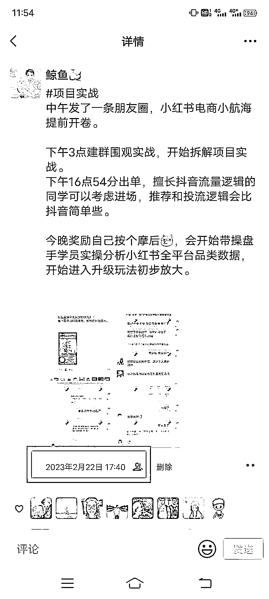   

 

 

 

 

 

 

评论区：

云珞YunL : 太厉害了，先赞后看

鲸鱼🐳 : [呲牙]一起搞钱

星尘丶 : 太强了哥

林深 : 鲸鱼YYDS

浅笑 : 先赞后看，养成习惯

鲸鱼🐳 : [呲牙]过奖啦，一起搞钱

鲸鱼🐳 : [呲牙]一起冲

鲸鱼🐳 : 一起搞钱

# 【项目分享**-**闲鱼卖货】**3**篇

# **# ****(**精华帖**)(338**赞**)**深耕行业** 2 **年后，分享咸鱼

# 二手书无货源、绝版二手书等**5**种项目玩法

作者：  老瞿Qu

日期：2023-03-01

 

 

圈友们大家好，我是老瞿Qu，励志做生财有术里面最懂二手书的男人，目前已经深耕二手书行业 2 年，有 1000 平米的二手书仓库， 2022 年仓库自有书籍销售额约 400 万，利润在 100 万+。

想要深耕二手书行业，就要精细化运营，里面的门道很多，怎么选择项目玩法？如何实操？

接下来我就从无货源二手书、绝版二手书、自建二手书仓库等5种项目，详细介绍二手书的现状和玩法，帮助大家更好的选择及深耕到二手书行业。

背景：老瞿曾经是世界 500 强房企最年轻的一批中层管理者，离职后带着 100 万融资，想做一个名叫答学百科的 APP 干掉知识星球（现在百度还可以搜索到）

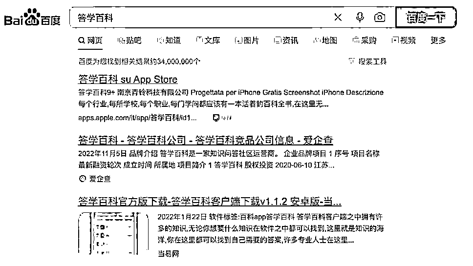

失败的时候却误打误撞进入了二手书这个行业，目前已经深耕二手书行业 2 年，有  1000 平米的二手书仓库，二手书体量在 200 吨左右， 2022 年仓库自有书籍销售额约  400 万，利润在 100 万+。

 

 

同时因为在这个行业的契机，2021 年闲鱼官方内测二手书类目的时候，就开始做闲鱼二手书店铺，2022 年运营闲鱼店铺 5 个，纯做无货源

（因为闲鱼可发布的商品数量为 3000 种，仅适合爆款书籍，而仓库有 7-8 万种书，干脆二手书项目一拆为二，拆分了一个闲鱼无货源项目出来），

5 个闲鱼账号，做无货源，年利润居然超过 60 万，2022 年闲鱼一直停止了二手书类目的入驻审核，直到 2022 年12 月才重新开放申请，目前运营帐号已经扩充到 30 个，预计 2023 年无货源的利润将超过实体仓库的利润。

下面聊聊我对二手书行业的了解，以及项目的玩法。

一、二手书行业发展现状分析

# **# **（**1**）**80% **以上的高校教材开放

 

 

据不完整统计，在国家鼓励对资源的可回收利用大政策的影响下，目前 80% 以上的高校已经放开了教材的预订，也就是大学生可以在学校预订教材，也可以自己解决，学校不做干预，这为大学生购买二手书提供可能。

# **# **（**2**）大学生对二手书的接受度提高

目前高校大学生对二手书的接受度越来越高，且每年都在递增，主要因为教材在大学的使用率较低，大家越来越接受二手书这种形式。

同时因为目前国家对盗版的打击比较厉害，行业内原来几个大的巨头据说都进去了，这也为二手书提供了一波利好，二手书相对新书价格优势明显，一般为标价的 1-4 折。

# **# **（**3**）大环境下消费降级对二手的利好

这几年的经济环境大家有目共睹，目前经营闲鱼二手书店铺有个明显的感受，随着消费的降级，越来越多的家长开始给学生买二手字典，二手字典在闲鱼成为小爆款，供不应求。

# **# **（**4**）学校周边的二手书店倒闭，电商模式优势突出

 

 

一般在学校周边经营二手书店的老板，年纪较大，疫情这 3 年，绝大多数倒闭，因为学生无法出校，哪怕仅仅就隔了一个校门，同时因为经营者年纪太大，多为一些老头老太，电商运营能力较差，无法通过电商实现业绩的突破，而随着网购的普及，目前学生网购二手书的习惯已经形成。

我们做二手书从 0 快速到 200 吨的规模，主要靠低价收购了几家学校门口的二手书店，从而快速扩张了规模，在二手书领域赚到了第一桶金。

目前二手书行业内的巨头的模式基本上是：

在郊区建仓，租金成本控制在 0.2 元/平米/天，通过小程序扫码、校园代理、废品收购站合作几种方式回收二手书，体量基本上在 500 吨以上,

通过淘宝、闲鱼、小程序进行销售，日发货量几千到上万单，快递成本在 2 元/单以下，通过控制成本，大大的提高了竞争优势，甚至商家会把仓库所在区域的菜鸟站点一并拿下，进一步降低快递成本。

二、闲鱼二手书无货源玩法（推荐，适合新手）

在二手书项目的几种玩法中，这是目前最推荐的玩法，推荐闲鱼平台，处于红利期，淘宝和拼多多不建议，

 

 

一个人建议找一个家人的身份证，一起办理 2 个出版物许可证，开 6 个账号，管理 6 个账号基本上是一个人的极限了，精细化运营预估一年的利润能达到 20-50 万。

比如目前开学季，我们单帐号每天的销售额在 1000-2000 元，平时在 500 左右，利润率在 30% 。

# **# **（**1**）项目门槛

① 需要办理出版物许可证，目前在淘宝的价格在 1500 元左右，含一个个体户 + 一个出版物许可证，办证周期 1 周到 2 周

 

 

（需要鉴别真假，淘宝有假证，拿到证去官网验证、或者电话给工商局验证以后再确认收货，不要相信他们发给你的官网，主要套路是他们建了一个网站给你查询，所以要通过百度核实下是不是真的政府官网）

② 闲鱼 APP 目前整体风控比较严格，建议一机一号，二手手机在闲鱼买 200 元左右的红米 7 或者 8 ，或者同等配置的手机即可。

③ 如果只是 5、6 个账号，可以连接同一个 WIFI ，实操下来没有发现问题。如果有一二十个号，建议使用流量卡，规避风险。

④ 目前二手书类目闲鱼 APP 上面还看不到申请入口，属于邀请制，少部分人有申请入口，没有申请入口的，有个官方的群，群里有申请链接，群里申请通过后，才能在 APP 上看到申请入口，才能上传证照。

 

 

 

 

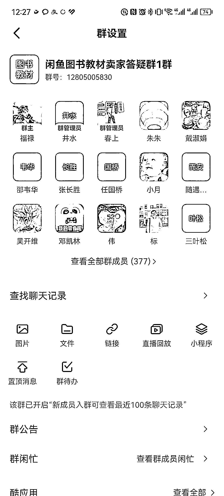

# **# **（**2**）项目优势

① 目前处于红利期，一般人在闲鱼只能发布 5 本书，2020 年 9 月之前在网上有一个可以突破发布数量的 bug，现在已经修复。

闲鱼官方是在 2021 年邀请了 200 多个商家进行测试的，也就是进行出版物许可证的认证，就可以发布 3000 本书，2022 年申请通道一直处于关闭状态，直到 2022 年 12 月份才重新开放测试，

目前在闲鱼 APP 无法直接申请出版物许可证认证，需要通过官方群里的链接审核后，才能进行申请；

 

 

② 书籍这种类型的商品，一旦上架，无需重复选品，闲鱼最畅销的是大学教材 + 小说，一般的大学教材至少 3-5 年才会更换版本，而小说的使用年限就更久了，所以一旦商品上架成功，后续这部分精力就可以省去，不用每天都在选品，忙个不停。

③ 售后较少，因为图书的商品属性以及价格偏低，所以售后问题基本上低于 10% ，我们实操下来，基本上低于 5% 的订单会有售后问题。之前也看到圈友在闲鱼卖投影仪这类型的商品，这种售后问题就会多很多。

④ 具备无货源的所有优势，不需要垫资，没有资金压力和库存风险。

⑤ 目前商家数量相对较少，起号比较容易，一个人第一个月做到 5K 的利润，第二个月利润过万，只要执行力在，问题不大（带人实测结果）。

# **# **（**3**）项目劣势（含风险）

① 前期上书需要一定的时间积累，要有耐心。该项目推荐精细化运营，首图找实拍图效果更好，文案每个账号尽可能标准化且有所差异，每天上架 20-30 本书。

强烈不建议使用群控软件，效果较差，所以前期上架书籍有个积累过程。一般上架 300-500 本书以后，帐号就能相对比较稳定的出单。

② 不能躺赢，平均客单价较低，大概在 20-30 元左右，所以订单多了以后，需要比较大的精力去买书发货，相对短视频带货等项目来说比较琐碎。

 

 

③ 不能直接搬运别人的账号，被举报以后容易被封号。

④ 单帐号天花板较低，目前跑通的最好的帐号在旺季利润在 1-2 万/月，淡季的话平均一个账号每个月的利润在 5000 元左右，跟短视频带货那种爆了一个视频，赚几十万没法比，赚的是辛苦钱。

# **# **（**4**）实操步骤

**① **办证，办理出版物许可证，注册闲鱼帐号，一个人可以办理 3 个支付宝帐号，对应  3 个闲鱼帐号，要求出版物许可证、支付宝、闲鱼三者的主体要一致。

**② **申请，通过闲鱼官方群里的链接申请开通书籍销售许可后，在闲鱼 APP 上进行出版学许可证和营业执照上传（官方群里没有申请的话，闲鱼 APP 上面看不到申请入口）**③ **选品，建议 3 种选品方式，一是根据孔夫子的二手书畅销排行版选品，二是找一家淘宝专做二手书大店铺，根据其销量排行版进行选品，三是直接对标闲鱼卖的好的店铺进行选品。

**④ **上架，上架书籍使用闲管家（闲鱼官方的后台管理工具），通过网页端后台进行上架，手机也可以上架但是需要扫 ISBN 编码，网页端上架效率更高，上架的时候在孔夫子或者淘宝的基础上加价 30% 。

 

 

**⑤ **销售，有了订单以后去孔夫子或者淘宝下单，等发货了以后再把单号填写到闲鱼进行发货即可。

**⑥ **优化，闲鱼主要靠自然流量，账号起步的时候，可以通过小号点击几个想要或者下几单做点数据；同时因为每个账号只能上架 3000 个商品，书籍的种类很多，大概有几百万种，所以定期对没有销售数据的商品进行下架，

同时比如最近《三体》火了，那么《三体》的二手书就会比较畅销，所以也可以适当调整下热门的书籍，但整体畅销书籍变化不大。

# **# **（**5**）项目如何放大

① 多帐号运营，由于单帐号的天花板比较低，淡季利润在 5000 元/月，旺季在 1-2 万/月，一个人上限大概可以精细化运营 6 个账号；

② 工作室运营，将书籍采购、发货等机械化的工作进行外包，即招募比较廉价的劳动力，比如我们现在工作室开在小区，招募的是本小区的宝妈，在南京仅给 3000 元/月，不用管吃住，不交社保和公积金。

# **# **（**6**）适合人群

 

 

① 适合新手作为第一份副业，目前处于红利期，比较容易拿到结果；

② 适合工作室作为稳定且长期的项目进行运营，由于出版物许可证的门槛，预估 2-3 年内不会太卷。

三、绝版二手书玩法（小众，适合能解决账号问题的人）

绝版二手书玩法之前也有圈友分享，不过个人实测下来不是太推荐，有这个精力更推荐多做几个闲鱼帐号，这里简单介绍下玩法。

（1）在孔夫子或者淘宝上找几家绝版二手书的店铺；

（2）在多抓鱼 APP 搜索绝版书籍，看看是否存在价差；

（3）一般存在价差的书籍，多抓鱼都没有现货，需要等多抓鱼回收回来这本书才能购买，所以点击预订排队，越是绝版的书籍价差越大，排队的人数越多，同时绝版书排队需要鱼币，通过回收二手书给多抓鱼 APP 可以获取鱼币。

如果家里没有书籍可以回收，一般操作是从多抓鱼上面买一本二手书假设 10 元，然后再回收给多抓鱼，大概可获得 2 元现金 +4 个鱼币，那鱼币的成本就是 2 元一个，抢购绝版书的时候自己计算一下投入。

 

 

比如一本绝版书有50元的价差但需要 10 个鱼币，那你就只有 30 元的利润空间了。

（4）排队预订到书籍以后会短信通知你，然后下单寄到家里。

（5）在孔夫子或者淘宝开店把书籍卖出去。

目前测试的结果是单个孔夫子帐号预订了一千多本书，当月抢到的绝版书利润在 200-500 之间，而且还涉及到收快递，发快递，操作流程相对无货源的玩法比较复杂。

（以上数据仅我们自己小规模测试，因为闲鱼无货源目前利润更大，批量操作更加方便，所以战略性放弃绝版二手书项目，也可能有人做的项目比我们好）

举例：比如这本伤寒杂病论在孔夫子的价格最低价 112 （含快递）

 

 

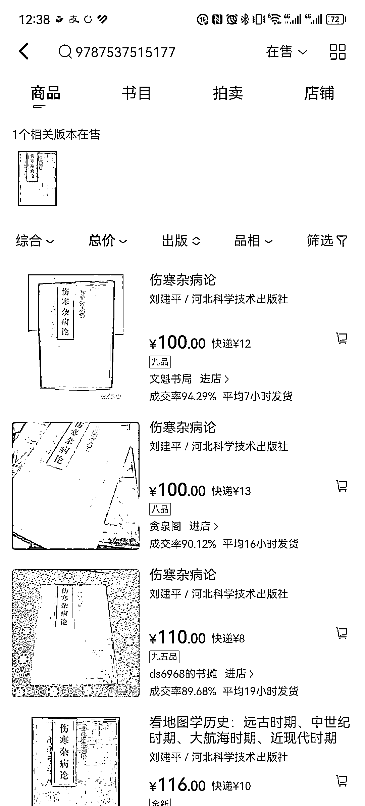

 

 

而在多抓鱼只需要 42 元（包邮），这其中就有 70 元的利润

 

 

 

 

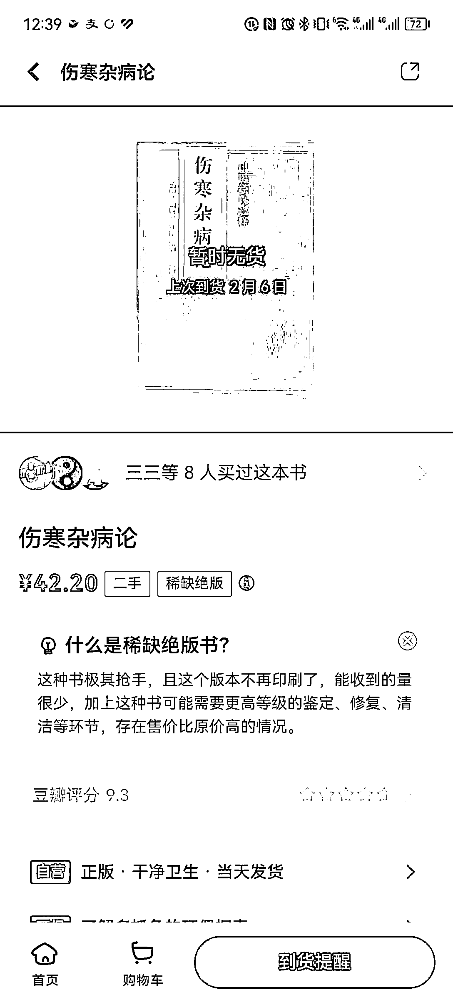

预订的时候发现需要 12 条鱼，这本书 2 月 6 日的时候有卖出去一本。

 

 

 

 

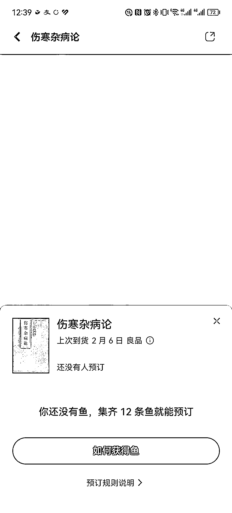

（假设每条鱼成本是 2 元，那么这本书，就还有 70-24=46 元的利润，扣除 6 元发货快递费，最终的利润在 40 元左右）

接下来就是预订，有货以后，会按照预订的先后顺序进行通知，然后等短信通知后去购买即可了。 24 小时不购买就算弃权，然后通知下一个人。

绝版书是二手书项目中一个更细的分支，比较小众，这个项目适合能批量搞到很多帐号的人，进行批量预订才能放大收益，单个帐号收益较低，而且还要收货、销售、再发货，链条并不是很短，需要投入一定的精力。

四、自建二手书仓库玩法（实体较重，适合有经济实力的人）

 

 

自建二手书仓库的模式比较传统，整体运营较重，不建议轻易入场，适合有一定的经济实力，作为长期稳定深耕的项目进行投入。

# **# **（**1**）项目门槛及难点

① 资金投入，目前市场上二手书回收到仓库的成本在 6000 元/吨，一吨大概在 2000 本，也就是含运费在 3 元一本；

 

 

一般二手书项目的利润率在 30% 左右，如果想通过这个项目做到每年 100 万的利润，仓库需要大概 1000 平米，能够放置 200 吨二手书，也就是仅书的成本在 120 万左右。

一般 5、6 月份回收的书，在 9 月份就能把投入回本，但一般仓库需要一点库存，且最终大约有 20% 的书籍会作为废纸处理。

② 流程复杂，二手书整个流程比较长，相对于一般电商更加复杂，主要体现在一是需要收书，没法按照需求进货，每年大部分书籍都是毕业季回收的。

二是书籍的种类比较多，一般都是按吨从废品收购站回收，比如我们 200 吨的仓库大概有小 10 万种书，仓库管理难度相对较大，需要一些 ERP 软件辅助。

③ 书籍的数据库维护难度大，尤其对于刚入行的人来说，面对几百万种书籍，到底哪些书籍该收，哪些书籍不能回收基本上需要通过小程序扫码，而小程序数据库的建立需要一定的积累。

④ 书籍回收难度较大，每年 5、6 月毕业季是最忙的时候，回收书籍是体力活，目前行业内 70% 以上的书是从学校废品收购站回收的，学校内部关系比较复杂，要搞定学校保安、收废品的大爷等，需要进行一定的资源拓展和积累。

# **# **（**2**）项目优势及机会

 

 

① 稳定持久，基本上根据仓库的书在毕业季时候的吨位，就可以确定一年销售额，大概年度销售额是吨位的 1.5-2 倍左右，也就是高峰时期 200 吨的库存，加上平时的不间断的小规模回收补充，一年的销售额在 300-400 万左右。

② 延展性较好，一般的大学的二手书交易群是特别容易组织起来的，自带流量，未来可以配合考研等机构进行广告投放，获取额外的收益。

③ 自有仓库可做深耕学校的书单预订，即在大量回收书的学校，可让学生按照书单购买整套的二手书，开学前进行预订，开学后统一配送。

整套书单预订线下客单价能达到 100 元以上（二手书淘宝客单价在 15 左右），且利润率也比线上高，能达到 50% 以上，关键在于推广到位。

 

 

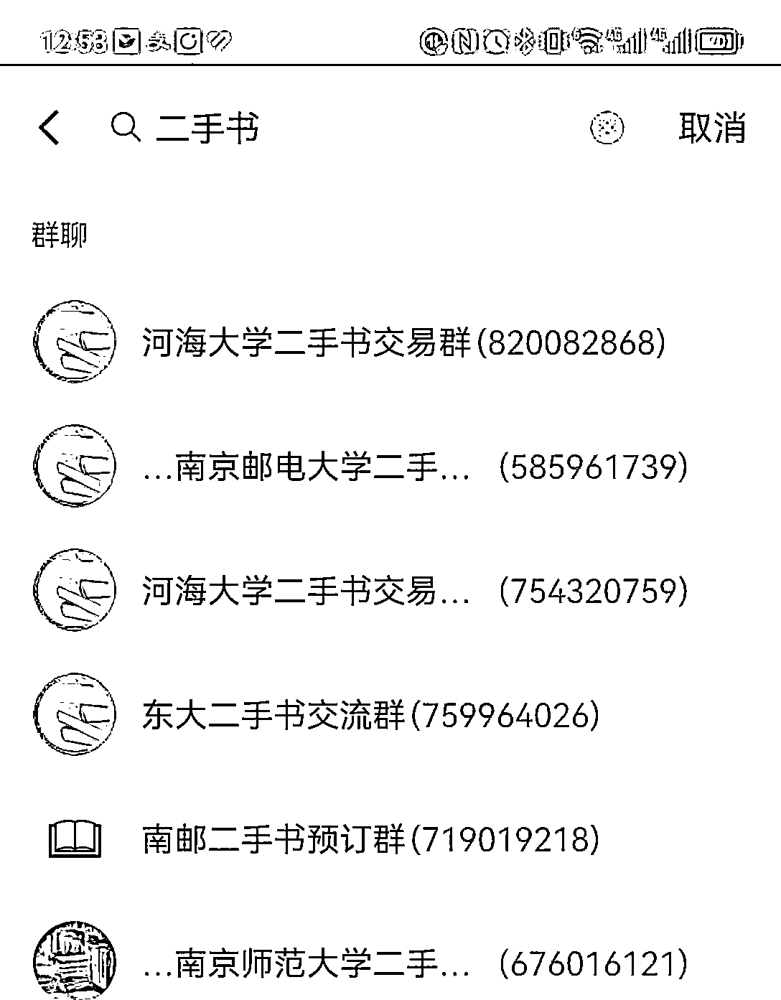

④ 发货效率高，相较于无货源模式，自有仓库发货时效快效率高，做到当天发货，而无货源作为二道贩子，发货速度慢，要等上家发货，

 

 

而且结合 ERP 系统，自有仓库可以做到一人每天发货上千单，而无货源采购书籍，发货都相对更耗费精力。

# **# **（**3**）入局需要注意事项

① 成本控制必须做到位，二手书需严格控制仓库租金、快递成本，行业头部企业一般仓库租金成本控制在 0.2 元/平方米/天以下，快递成本 3Kg 以内控制在 2-2.5 元/单，这两项成本占比较大，仓库选址和快递价格一定要压下来；

② ERP 系统可以共享，目前图书行业使用较多的是旺店通 ERP ，年费在 2 万左右，刚入行的时候可以找头部公司公用一个账号，一般给个 2000 元即可，或者他们可以帮忙给你销售你仓库的图书，他们抽成 10% ，

因为二手书回收难度较大，加上淘宝店群都已经上架了书籍，书籍种类又特别多，所以他们特别愿意帮你卖，从而来扩充他们的库存。前期在你的淘宝店铺等级还不是太高的时候，对于你来说，也有利于提升销量。

③ 回收书籍的数据可以共享，书籍种类又几百万种，千万不要自己开发小程序，费用高且数据库维护成本太高，目前行业内已经有比较好的小程序解决方案，包含销售和回收功能，主要是带有书籍回收的数据库，能帮你省去大量的精力，同时提升书籍回收的效率。

 

 

五、另类玩法

# **# **（**1**）淘宝二手书联盟玩法 （偏灰，适合有出版社资源的人）

在淘宝做二手书项目有一个特别大的难题：就是一旦出版社投诉你售假，你没有解决方案，投诉 1 次警告， 2 次扣保证金，3 次关店，且对店铺流量有很大的影响。

因为淘宝不关心你是不是卖的是二手书，是不是售假，他们要你提供的是进货单证明清白，二手书都是从废品收购站按吨拉过来的，根本没有这些，所以无解。

一般大的出版社不会投诉，往往小的出版社会搞事情，目前市面上已经形成了几个二手书联盟，即有一定出版社资源的人，会组织一个二手书联盟，收取保护费。

加入联盟即不会被投诉，不加入联盟一旦被他们盯上，就会举报你售假，基本上最后你没办法会找到他们帮你撤诉，2000 块钱一个链接，一投诉基本上你整个店群都完蛋，10 个店铺就是 2 万。

他们处理以后就推荐你加入二手书联盟，一个美其名曰保护你不被出版社投诉的『正义』的组织。

目前市面上已经有这样的组织，据说收入不低，基本上躺赚，投诉投诉你再帮你消除消除投诉，再收点保护费。

 

 

这种玩法有点违背道德，一般有经验的人会放弃某几个小出版社的书，比如上海音乐出版社从而降低风险，同时还有一个办法，就是出版社大多数是授权给这些机构维权，出版社本身不想找麻烦。

一旦被这种组织盯上，你就可以直接找出版社，出版社通常会说不是他们投诉的，但你不管那么多，你就举报出版社和一些所谓的正义组织联合诈骗，

其实也没有政府组织会受理，但威胁出版社几次，他们害怕了就会撤掉，对待坏人要用坏人的手段，亲测有效。

# **# **（**2**）参加政府比赛，或者扶持大学生参加学校比赛 （暴利，适合有学生资源的人）

目前在国家推进资源的回收利用的大政策下，以二手书包装的项目很容易通过政府的相关比赛。只要你有仓库让他们现场看一眼，再讲讲模式，画饼画饼，很容易拿到政府的资金，

我们在 2021 只有一个 100 平方小仓库的情况下，就拿到了南京紫金创业大赛的三等奖， 20 万直接到账 +10 万无息贷款，一二等奖基本上都是芯片之类的高科技项目。

未来同时也可以考虑将资源赋能给学生，参加学校的挑战杯、大创等，这类资源回收利用的项目很受欢迎，目前由于精力问题尚未进行实操。

 

 

六、关于二手书行业综合实操建议

在如今的各个平台管理更加规范的情况下，群控软件，批量铺货，无人直播等被打压的很厉害，只有精细化运营，深耕某个类目才更容易得到一些结果，

目前淘宝和拼多多的二手书项目已经相对内卷，日益商业化且还在测试阶段的闲鱼二手书类目算是一个红利期，适合小白进场，别被一个出版物许可证给阻挡了，既是门槛，也能阻挡内卷。

想做实体二手书仓库，目前我们体量在 200 吨，也参观过几个 500 多吨的仓库，整体感觉都比较稳定，尤其是把区域的快递也承包下来后食用更香，

如果你已经做好深耕的准备，可以入场，同时也有实体行业所有的弊端，比较重，需要资金沉淀，没法说不干就不干了。

预祝2023年大家一起生财有术。

评论区：

小嵩 : 我是这个项目的受益者，感谢老瞿大佬。去年 12 月 4 号开店到现在，废话不多说，上图，近30天的成果

老瞿Qu : 关键还是你自己执行力强，不像短视频那么有技术含量，执行力拉满就可以🤙  小嵩 : 是的，没技术含量，小白可以冲～[机智]

 

 

火火 : 那个官方群怎么进啊

外夏 : 请问你这个成果每天投入的时间是多久呀？

小嵩 : 上书几个小时，偶尔拍下单，其它时间可以干别的

小芊 : 请问每天与买家沟通维护时间大概多少？

小嵩 : 不固定

# **# ****(**精华帖**)(300**赞**)**从设计师到闲鱼卖货，**2**年副

# 业赚**30**万**+**，我经历了哪些？

作者：  青志

日期：2023-05-23

这么多项目到底选哪个？冲红利？还是搞深耕？

大家好，我是青志。关于副业，我尝试过不下6个互联网项目。

换了很多赛道，失败过、迷茫过，痛苦过。

从副业0收入，到第1单，到100单，2年收入30W+。

更多详细内容可以移步飞书阅读：

https://p2ls2mp3ij.feishu.cn/docx/XmpOd4X0Qos10mxeT3pccrKvnad评论区：

骏马 : 不错的

比心飞扬 : 讲的实在[强]

二帮主 : 闲鱼上品拍单是软件还是手动

上善若水 : 很真实，我刚来到这里，不知道做什么。看到此貼也是一种鼓励。能加V吗？

Clown : 写的很有意思[强]

希留 : 也很厉害了，我也做过外卖CPS、闲鱼，利润是你的十分之一[捂脸] 阿远 : [奋斗][奋斗]棒

酱酱子 : 期待下篇

 

 

# **# ****(**精华帖**)(148**赞**)**闲鱼卖露营装备一整年，月

# 入**1-2W**的小蓝海项目分享

作者：  蛋蛋

日期：2023-05-22

在闲鱼卖露营装备一整年，分享一下让我月入1-2W的小蓝海项目（生财）

大家好，我是吉良吉颖，之前一直是生财的小透明，去年一个偶然的机会捕捉到了亦仁发的露营经济风向标

然后刚好在做闲鱼无货源项目也一直没什么起色，就着手开始卖露营装备。从最开始的一天100多到后来每天1000多，目前做这个项目最多的一天净利润4000+到今天刚好是在闲鱼卖露营装备卖了一整年，目前通过这个项目变现了小20W。直至今日也是稳定月入1.5W+

露营活动一定是这两年最火的休闲项目之一了，同时它带来的消费市场也给我们做电商的带来了很多赚钱机会，今年又进入了露营这块一年中最赚钱的一个阶段

接下来我就分享一下，我在这个闲鱼卖露营装备并且保持稳定盈利的一些操作方法，具体移步飞书

https://vb5bdj4t4a.feishu.cn/docx/ZbxHdt8nRoi64KxjkEvcuHQNn8g评论区：

许海龙 : 感谢分享，方便留个V吗？交流学习

Keke : 为啥我在其他社群也看到了一模一样的文章，发布者却不是同一个人[闭嘴] 蛋蛋 : 哈哈哈都是我一个人，我两个微信分别加了不同的社群[捂脸]

Keke : [强]

蛋蛋 : 不让留微信好像

小龙成Hu : 嘻嘻，细心一点就能找到你的V

蛋蛋 : 你很聪明

小恶魔 : 在闲鱼卖露营装备需要办证吗？

 

 

# 【项目分享**-**拼多多电商】**1**篇

# **# ****(**精华帖**)(123**赞**)**拼多多无货源模式如何做到

# 月入过万？

作者：  十一

日期：2022-02-28

《拼多多无货源模式如何做到月入过万？》

大家好，我叫十一，坐标上海，一个做过直销、创过业、进过大厂的小白电商，目前副业在做拼多多无货源蓝海店；

下面我将通过四个方面【个人经历、怎么选品、怎么上架、个人感悟】，去讲述我在拼多多做的那些事，辛苦大家移步飞书观看；

飞书链接：https://u1de2ffda4.feishu.cn/docs/doccncauJN3zjRXMXI3vbxKyb5e?from=from_copylink

评论区：

北鱼 : 开120家店就已经不容易了[捂脸]

郑 : 开店是最容易的，开的挣钱比较难

十一 : 方法已经过时了，现在拼多多打压批量上货

张倩 : 请教一下找100-3000销量的产品是确定一个关键词然后搜索按销量排序么  十一 : 我是确定一个核心词，然后选择价格80元以上，筛选的

张倩 : 这个核心词是怎么找的呢？是直接的那种产品词么，比如文章里说的‘面膜’，这算不算核心词呀？

十一 : 把拼多多一级类目、二级类目、三级类目下载下来，一个一个去搜就可以了  亦仁 : 感兴分享，已加精华。

 

 

# 【项目分享**-**得物电商】**1**篇

# **# ****(**精华帖**)(253**赞**)**新人入局得物单账号变现破

# 万的教程

作者：  施仁

日期：2023-07-07

新人入局得物，保姆级教程，单账号变现破万。

四月份闲逛风向标时一条风向标引起的我的注意，飞书链接。

https://udxxg5rx5m.feishu.cn/docx/KXdsdKeSEoBj5cxMsxocqFR8nXe

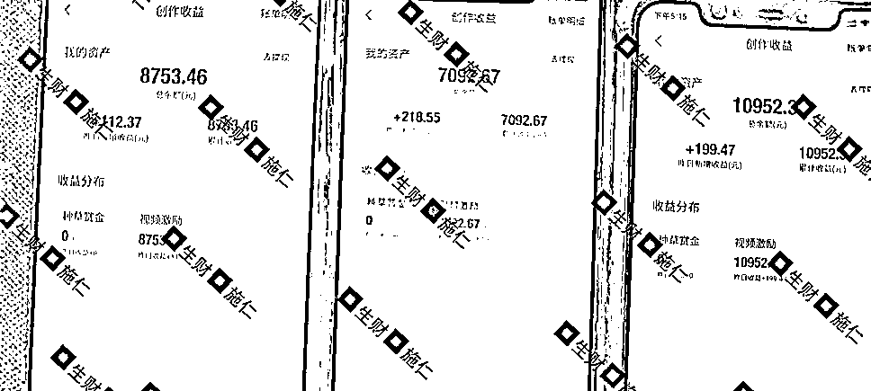

评论区：

文少 : 又涨知识了[强]，请教一下大佬视频去重的教程有吗

施仁 : 去重的教程生财应该也有，并不复杂，cr抽帧加片尾片头都可

文少 : 好勒，感谢！

离心之巅 : 请问下自己的原创视频可以得物不经过去重分发吗

施仁 : 这个更可以了

薯条 : 这个有点像拼多多视频带货

 

 

八斤 : 我想知道今年又可以了吗，去年我们玩疯了

Jie : 圈友们有没有推荐的去重软件

# 【项目分享**-**本地生活】**3**篇

# **# ****(**精华帖**)(464**赞**)**我一年开了** 180 **家互联网洗

# 衣店，赚了** 200 **万

作者：  老钱

日期：2021-09-22

大家好，我是老钱，一名洗衣行业创业者，奉行低成本创业。在洗衣行业摸爬滚打一年，我赚到了200W，今天复盘一下我的创业全流程，希望能够给到你们一些启发。

前言：我在美团、点评、口碑等线上共有180多家洗衣店，月流水四十几万，利润在60%多，但并不是传统的社区洗衣店，而是这行这几年快速发展的新模式：快递上门取送包邮+中央洗衣中心洗涤。

先解释下什么是互联网洗衣：客户线上下单，快递顺丰京东上门取衣，寄到洗衣中心，洗完了快递再寄回，客户可以足不出户、像叫外卖一样完成洗衣洗鞋。并且为了扩大优势，这个模式的售价都远低于实体洗衣店的市场均价。

 

 

快递上门取送的前身是洗衣行业前店后厂的模式，随着近年来房价和人力成本挤压，加上疫情的催化，越来越多的连锁洗衣店转成了前店后厂模式，为了压缩租金和人力成本，商家自己建一个洗衣中心，把门店的洗涤区砍掉缩减到只用来收衣服，然后将区域各门店的衣服统一送到洗衣中心洗涤，最后送回店里。

更重要的是，越来越多懂互联网的年轻人开始结合这个模式迭代到用电商渠道线上获客、快递上门取送。

你现在在一二线城市的美团大众点评搜“洗衣店”，会发现有50%的店都是我们这种快递上门取送的模式，这几年在电商平台的推动下，越来越多的老百姓开始接受这种方式。

毕竟刚需高频行业（对有干洗习惯的用户是刚需），这模式还在上升期蓝海，大部分实体洗衣店受限于线上运营能力差、店里承接单量有限，无法直接转型。所以线上平台还有巨大的单量空间。以至于京东今年也上线了这个自营服务。我今天拆解下这事是怎么做的，希望能够帮到一些人，虽然同行肯定得骂我，但是加速洗衣行业升级，我感觉很值。

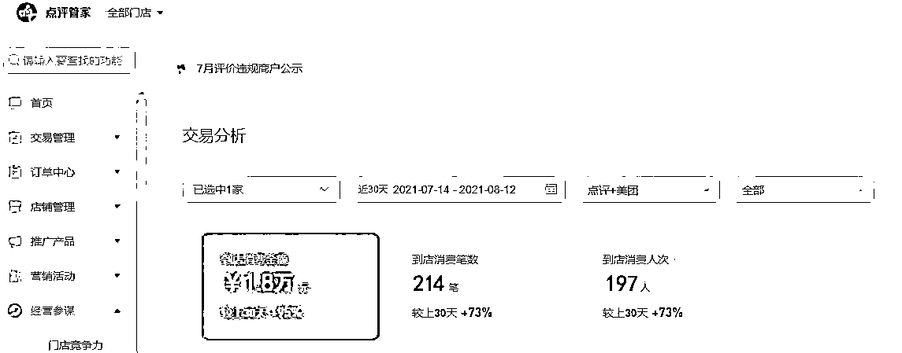

（单店淡季一个月美团点评的收入）

 

 

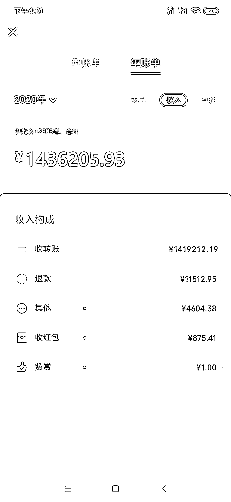

 

 

(某一个微信客服号的收款)

一、我是如何开始入行的？

我是一个94年的女生，南方小城一个普通家庭出身，毕业后去北京互联网大厂做了几年产品，2018年和朋友在天津开了2个私人影院，发挥我互联网运营的能力让这个店在点评热门榜长期第一，我自己也总结了一套美团点评运营策略，逐渐也帮助了一些商家朋友提升他美团点评获客量，这个过程中，我做起了美团点评代运营业务，收入也远超过了我的私人影院和北京的工作，19年辞职专注做代运营。

但我自己这几年心底一直想做一个能长久稳定TO C的生意，把自己在互联网做增长的经验发挥透，代运营业务能让我接触一手实体项目信息，我就不断在物色合适的生意。

 

 

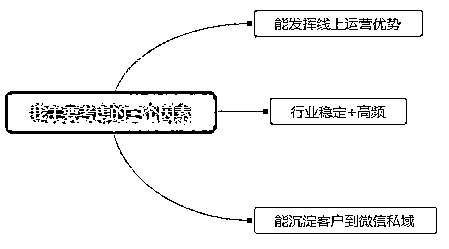

从美业、盲人按摩、展览等一路看下来，调研测试了一些小项目但都差点意思。直到2020年一次洗衣服的经历，让我感觉终于找到了正确的方向。

有一次暴雨天，我刚买的一双很贵的鞋子淋透了，因为我自己懒得洗，就上美团大众想找一家洗衣店把鞋子送过去洗，毕竟很贵怕因为护理不当，洗坏了。美团上随便找了一家洗衣店，也没仔细看买了团购，打电话给商家问店地址准备送过去，结果客服说他们是安排顺丰上门取送包邮，给了地址电话，过了一小时，快递员上来拿了鞋子，到付模式。并且有公众号可以查看洗涤和配送进度，比以前在干洗店的体验要好很多，也不用店里排队、电话催老板。

过了5天，快递上门，收到了鞋子，干净程度和以前店里的一样。一次服务就完成了。

那几天我基本把全国做这个模式的品牌摸了一个遍，我意识到，只要解决洗涤环节，剩下的单量就是靠铺电商渠道。

第一批做的几家已经做了3年多，一二线城市里入局者增速很快，说明是挣钱。

 

 

 

 

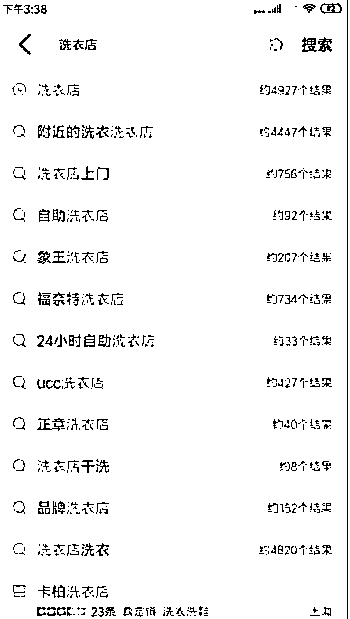

（美团大众点评搜洗衣店，是把洗衣店上门类型单独放在了前面）

恰巧后面没几天，有个苏州洗衣连锁老板找我做代运营，了解行业数据的机会来了。

我把这个洗衣店的美团点评单量从2天1个提升到每天9个，和老板聊下来发现这行确实是高毛利、高复购。一个顾客多的一个月洗五六次，内衣袜子都懒得洗；少的也得一年三四次换季的时候洗。家庭主妇更是会每个月把一家老下衣服攒攒一起洗。大部分行业，维护一个老客的成本比拉一个新客的成本要低太多。

 

 

从后台看到的数据来看，洗衣店这行各个电商平台竞争并不太激烈，这些互联网洗衣品牌很多连美团都运营得很差，但是因为线上售价都比门店市场均价低很多、还快递取送包邮，这两大优势让他在线上单量上吊打了传统洗衣店。

传统洗衣店的订单量主要还是靠线下附近人流，行业以夫妻店为主，线上运营能力较差，使得这行给了互联网洗衣很大的电商渠道增量空间。

没有高额的门店房租成本，就能在任意城市最核心商圈开店抢占流量。

我的决策历程是这样：

首先，行业基本情况来看：对有这个消费习惯认知的群体来说，这行确实是刚需，“刚”到秋冬旺季，只要一个店不是名声太臭，是个洗衣店都会爆单洗不过来。只要洗的还行，顾客就会产生黏性，毕竟普通衣服在哪家洗效果都差不多，有个朋友是上海普陀区偏远区域的一个干洗店，他的优质老客一年能贡献2万多业绩，“懒人”秋冬每个月来五六次很常见。

做互联网洗衣模式，它本质是个电商生意，关键在渠道搭建、流量获客运营优化，也是我最擅长的领域。也都符合当初我选项目的要求点。

第二，成本盈利方面：1、一件衣服洗衣费从几十到几百不等，这行最常洗的羽绒服均价按40元左右，洗衣机水电+洗涤剂成本+包装费+人工，一件衣服洗涤成本1-2元，毛利极高。

2、美团点评开户费从1080-3080元/年/店不等，新一线城市也就2080, 互联网洗衣单均价100-130元（因为件数多所以比实体店的单均价高不少），我的数据经验来看，躺着也能回本。

3、互联网洗衣模式里，快递费占每单销售额的20-30%，量越大快递费越优惠。

 

 

综合看下来这是个毛利超过60%的项目（做过生意的人都知道，一个项目毛利超过30%已经非常不错了）。

第三，在市场竞争方面：同美团业务员打听完发现，目前生意还不错的互联网洗衣品牌，在美团点评都比较依赖开推广通（同淘宝直通车的广告烧钱系统），每个月花个几万，推广通停掉则单量下滑严重。

但毕竟我是吃这碗饭的，那个客户的店我是没有用推广通就把他单量提升起来了，毕竟有很多其他手段提升门店的曝光量和权重。我做这行的话，也算核心壁垒，不用推广通，利润比竞品能高不少。

行业情况搞清楚后，接下来是执行。

二、小成本试错，测试数据

考虑到做洗衣中心这个事儿还是重资产投入的，加上自己也需要对行业加深了解、积累一线经验，所以我决定先找一个洗衣店合作，把洗衣环节外包给他，用一个月时间测试数据验证，跑通流程。

详细说下前期准备工作，

1、平台这块还是先做美团点评店，南京交了开户费2080元/年。不过后来事情跑通后我逐渐搭建了全网电商渠道体系，不再侧重美团点评了，这里就不赘述。

2、我们团队向合作的洗衣店老板也学习了很多行业基础知识，包括面料识别、洗涤原理、常见洗坏问题解决方案等，这块上到老板下到客服都必须要精研。这行的很多利润点都是售前和客户沟通出来的，比如客户本来要洗运动鞋，但是我们看到鞋子掉色磨痕严重，可以建议客户加钱补色，这就需要专业的知识储备和话术能力。

 

 

因客户对行业技术的不理解、以及希望衣物越洗越新的预期，偶尔就有售后纠纷，一个月下来，我的经验是：客户在线上电话或微信的沟通心态，会比当面说话要更严苛和肆无忌惮，都得顺毛，所以老板和客服都要有很好的脾气和始终如一跪舔客户的状态。传统实体洗衣店更是要如此，做的是客情，什么样客户都有，有的人把你名声在小区搞臭了，这个店就容易黄。相比，这也算是互联网洗衣的一个小优势。

3、软件系统、硬件这块，我找了以前互联网工作的前同事，花5000元开发了一个下单系统和京东顺丰对外接口打通，实现了下单后自动派单给快递系统，快递员收到信息会去按要求时间上门取件。

然后买了2个行业专用打印机4000元，洗衣店那边用的收银一体机二手的800元。营业执照我本身就有，大家起照的话也就一年一两千元代记账公司的成本，要省钱的话公司地址可以用民宅（这点要注意先查每个区的政策），实在不行就借朋友的。

4、衣服包装材料，我参考了几个同行，还是决定走小成本试错的逻辑，先不用贵的纸盒，前期先用防尘袋装，花了600元买了一批包材。

5、电商线上运营里，图片卖点、详情页、视觉逼格非常影响转化率，这块我找了设计师朋友几张图友情价300元，简单的图我在创客贴自己也做了几张效果不错。大家找淘宝设计师的话要找贵一点的，太便宜的技术都不行，一定不要在电商营销这块省钱，淘宝800-1000多元的设计水平就够格。

卖点包装一定要重点做差异化，让用户快速感知到你和竞品的差异点。

 

 

6、决定我们美团点评店流量的就是选址，第一个店我选在南京流量最高的新街口区域，效果不错，但是再开几家后，我发现并不是贴近大商圈就一定单量高，还是需要把附近小区、人群画像结合起来做一个平衡选取。目前我已经沉淀了一套成功率极高的选址策略SOP。

**7**月份我第一个门店上线，星级还是**0**星，第一天天来了**4**个咨询居然成交了**3**单，刚需的威力比我想象的还要猛，不像美业休闲娱乐等太内卷了，顾客比完评价比价格、货比三家。刚需行业，只要平台运营的好，曝光量和转化率站在制高地就够了。这里的电商流量逻辑就好比：客户很饿的时候去了一条小吃街，全是快餐盖饭盖面店，谁家位置好、谁家在入口，客户就优先去哪，反正味道差不多，就图个方便。

第一个月在星级逐渐上升的过程中，日均5单，过了近2个月后，我门店消费额、转化率做到了区域第一。这个店每个月能够给我带来6000-7000的利润，接下来的事情就是践行**“**把好生意复制再复制**”**，多开店起规模。

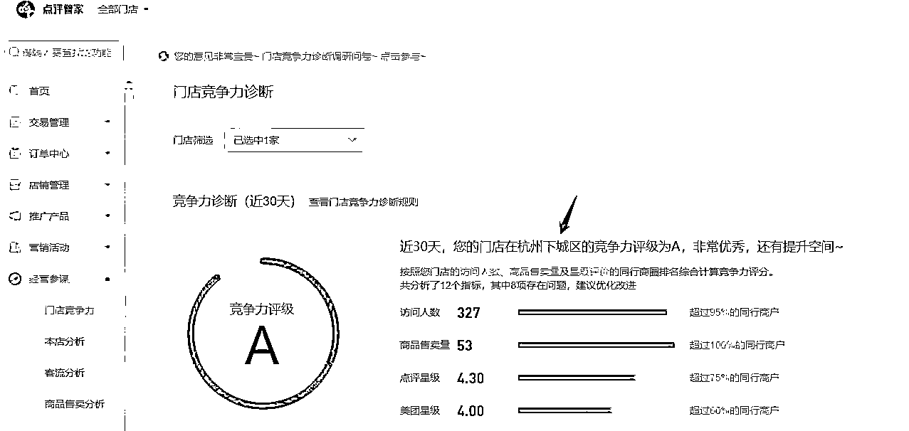

 

 

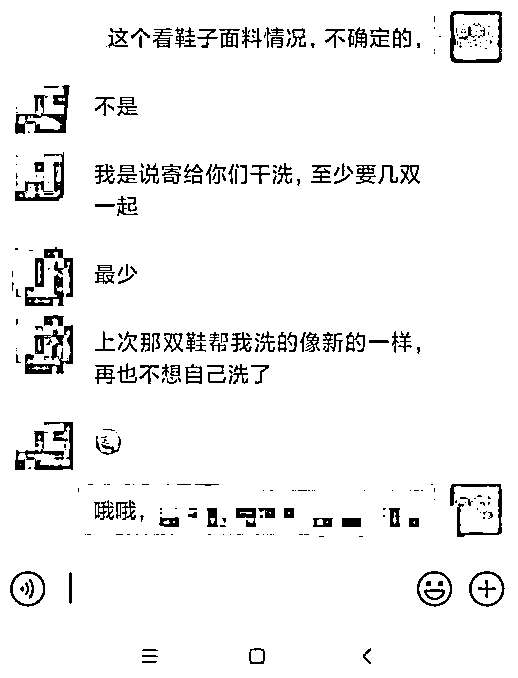

（客户的夸奖）

三、问题暴露，调整克服

但凡事都不会太顺风顺水，这行有个特性，任何一家洗衣店都有固定的洗衣出问题率，技术、管理水平和责任心决定了这个率的高低，我第一次外包合作的洗衣店，在第一个月里，出问题率高于行业平均水平，能有12%，容易导致差评影响单量。

 

 

虽然我当时不懂洗衣技术，但直觉告诉我可能这家店的技术或流程不太行，虽然有差评还能做好评补救，但是差评太多终归对转化率伤害很大，运维成本会越来越高。

毕竟做刚需行业，就是想在行业长久深扎而不是赚快钱，为了品牌和对洗衣品质负责，调研了一个月后，我决定自己建一个洗衣中心，彻底把控品质！这也是我的竞争壁垒。

期间找场地、买设备、装修、管工人，捣鼓了三个月，这部踩坑血泪史今天就不多讲了，三天讲不完，感兴趣的找我喝茶唠。反正经过三个月的磨砺，我也算是成为了一个有厂房落地经验的创业者，成长了很多。我也更深刻理解了实业兴国这四个字。

10月份我的洗衣中心正式开始运转，洗衣出问题率降到了1%，算是行业很优秀的水平了。

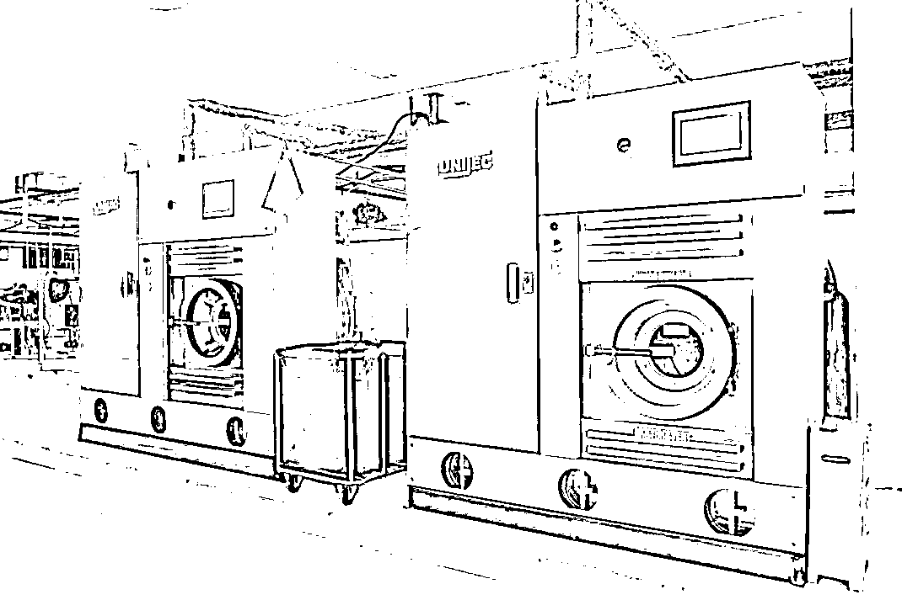

 

 

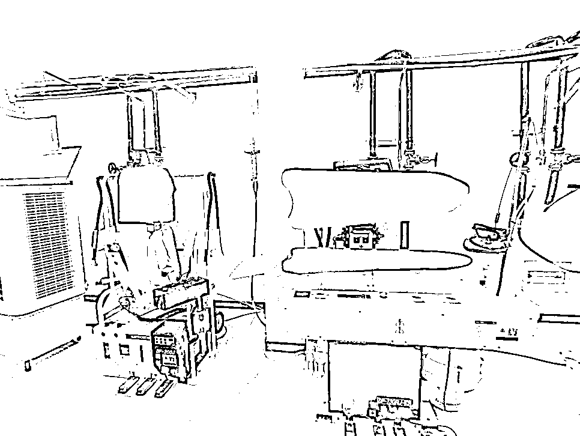

（我洗衣中心一角：行业最新全自动烫衣设备）

四、成绩和业务拓展

因为洗衣中心在浙江，江浙沪皖快递时效一样，都是第二天到，所以我现在的线上店在江浙沪皖所有城市都有上架，目前覆盖41个城市一共180多家了。

我们品牌也注册了商标，招募了城市合伙人，一个人的精力可以运营多家店。

 

 

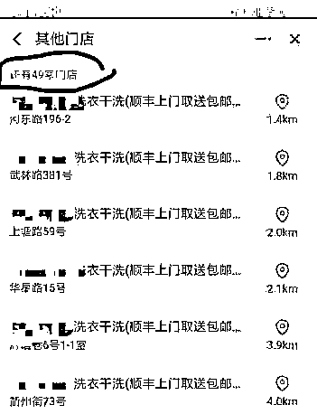

（这是一个渠道的杭州市的50家店）

 

 

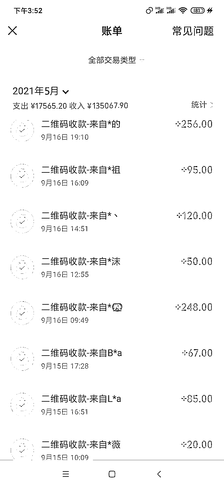

 

 

（我们某一个微信客服号的收款记录）

逐渐我攒了四个满员的客服微信号，这些高净值客户还可以延伸出更多价值：

1、二手奢侈品、奢侈品修护，这块我每个月已经有稳定的收益，多说一句，奢侈品修护行业也是值得把这个模式重做一遍的。

2、卖货，如化妆品、零食、鲜花等。毕竟年轻女性占了半边天。

3、围绕高净值家庭需求的其他服务，比如保洁、收纳等，可以自营也可以和别人合作。

由于行业跨度比较大，很多人对于美大平台规则还是不了解，统一解答大多人关心的问题：

**1**、关于异地运营：因为不用和顾客见面，线上帮他下单，京东顺丰可以上门，所以我们可以人在济南，店在上海，我们有些合伙人都是异地管理接单，有的勤快人还出去跑跑企业业务，没时间跑的人带着孩子在家办公，只用到电脑手机，靠电商线上的订单也够挣了。

**2**、互联网上门洗衣和传统洗衣店相比优劣在哪？

 

 

优势：

1）突破了门店地理空间限制，以前这行就做附近1.5公里小区的生意，而互联网洗衣面向全市、全国都能接单（京东顺丰覆盖的地区都能接，补运费即可），单量空间更大。你可以把店开在一线城市核心商圈，流量最大化。我自己都是在以10店/月的速度增店扩张。

2）普通人就能玩转，接单运营自由灵活，只要有手机，人在哪里都行，特别适合宝妈、学生、自由职业者等。这个刚需行业，只要做好顾客沟通工作就能持续有收益，这年头稳稳的赚才是硬道理。

3）投入成本低，没有较多资金的可以洗涤环节外包，省去了房租、人力成本，只有线上开户的费用，你可以理解就是个网赚项目。

4）刚需行业收益稳定、可观：没有出去洗衣习惯的人可能无法感受这点，可以多问问城里的洗衣店老板，你就知道这行在秋冬季家家都是爆单洗不过来的状态。高净值人群对洗衣的依赖还是非常深的，他们最值钱的是个人时间。

电商线上获客还突破了实体门店夏天淡季这一劣势。一个人精力可以运营5-8家线上店。

5）抗疫情风险，这个都懂。所以疫情也加速了互联网洗衣模式的快速发展。

**3**、这种模式的生意适合哪些人去做？

1）宝妈、学生，及事业单位人员做副业

2）喜欢在家办公的群体、自由职业者

3）工作清闲的人，平时能方便接客户电话

劣势：

1）售价会比实体门店市场价低一些。这行还在塑造性价比形象的阶段。

2）对运营、客服话术能力要求较高，不擅长运营的可以找我多交流，另外，这是服务行业，做这行对接顾客必须脾气、耐心足够好、有责任心愿意持续帮助顾客解决问题，不是这样的人做这行的话也是自找痛苦，当然了，有钱雇客服也行哈哈。

 

 

希望这个文章能给需要的人带来些帮助，对这行感兴趣的朋友可以找我多交流啦。

（下图我为微信）

评论区：

刘浮躁.zZ🇨🇳 : 张见识了

刘杰 : 跟我好像  厉害厉害[发呆]

亦仁 : 优秀，和云家政类似，类似电商领域的一件代发，大家可以展开想想，有哪些服务领域的一件代发？

具体一点，哪些开在你家楼下的门店倒闭了，通过这种模式可以再救活并规模化？

想象力有了。

亦仁 : 感谢分享，已加精华。

小梁先生 : 思路一下子打开了！

小梁先生 : 很感兴趣，可以加微信交流学习一下吗？我的V:ZLzhikeng 亦仁 : 大家为啥喜欢要加微信交流，评论区聊聊不挺好，有价值的讨论还可以让别人围 

 

观下

小梁先生 : 合作一下呀

# **# ****(**精华帖**)(168**赞**)**我是如何通过家政电商做到

# 月入过万

作者：  月生

日期：2022-02-28

**1**个月赚回生财门票，**3**个月从**0**到**10921**

一、写在前面的** **

我是小白，也是生财小透明！

在生财看见一篇文章写着“我是如何通过无货源做到月入过万”，在挣扎之下，决定也分享一下我的月入过万！

自我介绍：福建某二本毕业生，在家里安排进了泉州某单位拿着2K+/月的轻松活，因为个人原因在21年7月离职。

我是21年4月加入生财的，当时就看到了刘总的那篇传世作品，深受感动，但没有行动，在7月离职的时候叫了个保洁把租的房子打扫干净后，跟阿姨聊天，突然想起了刘总的那个文章，于是找了很久又翻阅了几遍，最后在8月下旬加入云嘉开启了21年后半年快速增长！

先上张图然后开始讲故事

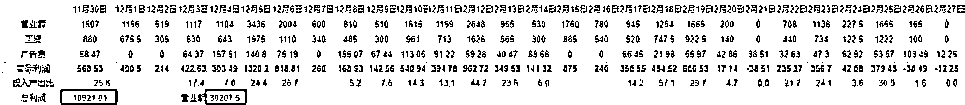

 

 

11月30日至12月27日  总营业额30207 利润10921

二、什么是家政电商** **

我所谓的家政电商就是在美团上面开家政店，以虚拟店为主，以中介的身份来帮客户寻找合适的阿姨来解决客户所面临的问题。业务涵盖，日常保洁，深度保洁，开荒保洁，家电清洗，家居清洗，除甲醛，三嫂业务等。我们所要做的就是等待客户找我们，然后解决客户所面临的问题。

整个流程就是

客户下单**-**联系我们**-**询问需求**-**在群里根据客户的需求来寻找阿姨**-**找到阿姨，上门服务**-**完成服务**-**售后**-**评价

三、为什么是家政电商** **

一开始你问我为什么做家政电商，我是不懂的，只是看完刘总那篇文章，觉得有搞头，刚好又刚失业，就去试了试，没想到真的成功了。

现在你问我为什么是家政电商，我可以说的那就太多了。

**1.**赛道** **

大家都说选择比努力重要，那做事之前就是要选对赛道。

第一，这个行业的盘子得足够大。蛋糕大才轮得到我来吃！

第二，从业人员素质需要足够低。90%的家政店都是夫妻店，而且都是上了年纪的，在电商这方面很难跟我们竞争！

第三，国家政策支持，领导们在去年多次提及家政这个行业，这一次爆红朋友圈的杭州创业补贴三大行业中也有家政

 

 

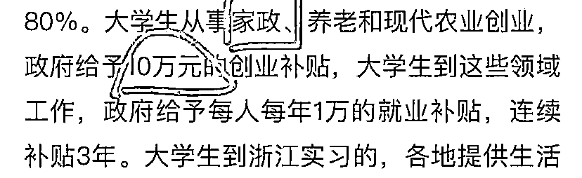

**2.**投入成本低** **

一家美团店的费用是3800-5800不等，这个钱对于大多数人来说就是打工一两个月的工资，相对于那些红海行业动辄十万八万的投资，这是个投入成本较低的创业！

**3.**轻资产** **

一个人一台安卓手机就可以做。没有办公室的束缚，没有上班时间的束缚，不用请阿姨。总资产就是一个美团店铺的成本，所以也算是轻资产创业，我看了这么多帖子，还是非常畏惧重资产创业。

**4.**流量便宜** **

除开北上广深一线城市竞争激烈以外，美团的广告费单次点击在3-8元，根据我们自己的测算，广告开第一名的转化率在10%-20%，相较于其他平台，这个费用还是算是比较合适的。

四、利润点在哪** **

1.以最常见的深度保洁三小时来举例，现在是65元/小时，厦门派单价大概是30-35元，按35计算，是有30元/小时利润，3个小时就是90元。利润率46%！

 

 

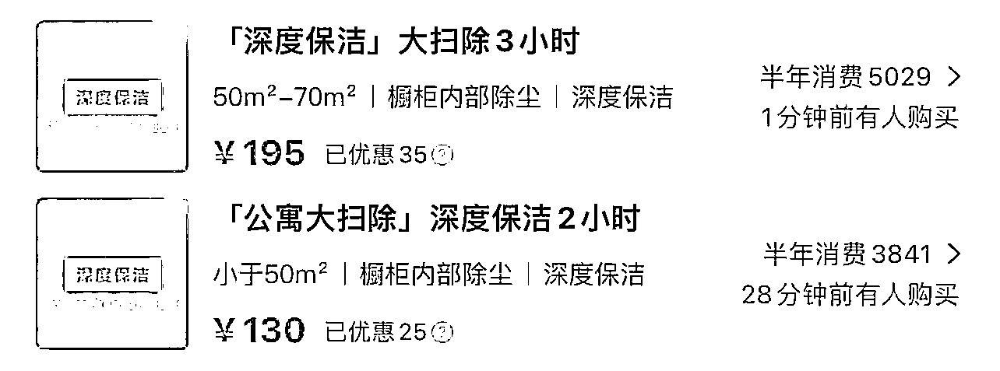

2.家电清洗类目是挂机空调，我们的挂牌价是129元/台，厦门派单价是60-80元，夏天是挂机空调清洗的高峰期。那就是一台有49元利润，那利润率就是37%，但是一般家庭是有2-3台空调，那可以给客户打9折8折，按三台3*129*0.8=309.6元，派单价可以做到180/3台。那利润就是129.6元，利润率为41%。

3.开荒的话分为粗开荒10元/平，精开荒12元/平。厦门派单价粗开荒可以给到6-8元，精细开荒可以给到8-10元。第一档（6元）就是比较难找，需要有常合作的阿姨或者小家政公司，第二档（7元）就是市场行情价，第三档（8元）就是全包全托管，赚个信息差。

这个取决于你去不去现场，和阿姨熟不熟，对行情了解不了解。

4.除甲醛的话也分几种，普通甲醛和母婴级甲醛，我们的挂牌价分别34元/平和65元/平，派单价格根据不同城市用不同药水做不同程度有多梯级的报价，利润率可以在30%以上，胆子大一点可以做到50%的利润率。

 

 

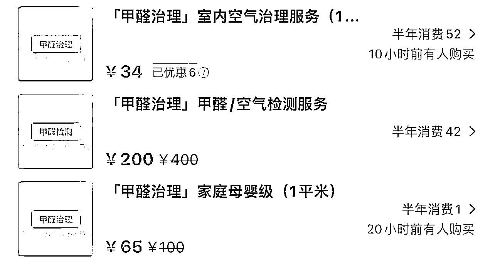

五、那要怎么做家政电商** **

**1.**选址** **

一个好的位置可以少开很多广告。

选址前要弄明白我们的用户画像！从后台可以看出50%以上的客户是20-35岁女性购买的团购套餐。所以我们选址的时候第一就是要考虑到哪里有这些人。大型商超，写字楼，高档住宅！注意避开老破小等本地居民区，小区尽量以新小区为主等条件

**2.**营业执照** **

现在做美团家政电商主要是以混合类门店为主。

混合类要求营业执照+美团人员上门签到。这就要求有实际地址，这个地址可以是你家，也可以是你朋友家，也是个其他存在的地址。然后要求有铁质的门头牌

 

 

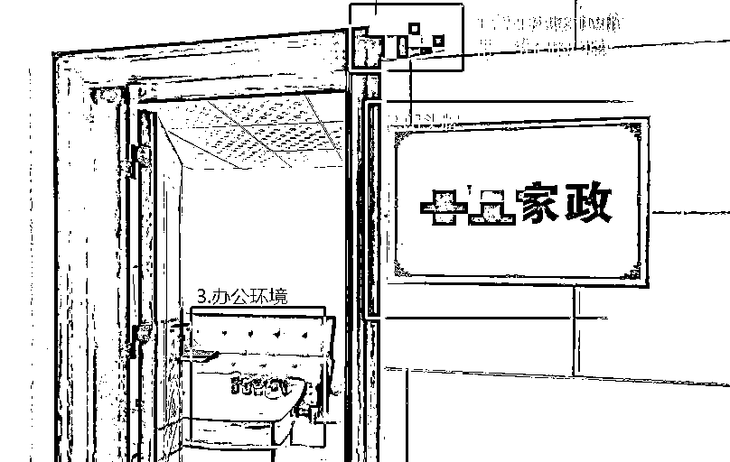

需要注意的是，我们主要是在美团和大众点评上面售卖团购套餐。美团的客户爱贪便宜，但是量大。大众的客户爱看评价，而且客单价高，两个平台的团购套餐的同步的。

**3.**微信号** **

微信号最好准备两个，所以手机选安卓的，官方自带双开，比较保险。

然后微信号可以按照生财里大佬们总结的一些方法，来养养号，切忌刚注册的号就疯狂加好友，不然一来容易封号，二来客户和你聊天的时候会出现官方提醒，降低了信任感，失去了客户。

微信号**1 **阿姨号（派单号）** **

专门用来在群里派单的微信号

微信号**2 **个人号（接单号）** **

专门用来承接客户的微信号

**4.**阿姨群获取 （他们都说这个是最难的） ** **

 

 

第一、你可以在地图上找当地的家政公司，打电话过去或者加微信，跟当地的家政公司聊聊，了解行情也顺便进群，这个可以付费，一个群大概在2-15元之间。群人数以300以上为上。

第二、你可以在美团上下一单保洁，等阿姨上门后跟阿姨聊聊，让阿姨拉你进群。

第三、进群后可以跟群里的阿姨聊聊，拉你进群

第四、当你有足够的群时，可以跟群里派单的人聊聊，一起换群。

**5.**开美团店** **

根据上门的材料，可以自己在大众点评建店，然后联系大众点评的销售，接下来他会跟你说需要准备什么材料（就是上面那些材料），约一个时间上门签到就可以上团购套餐了。

**6.**补单** **

找自己的朋友给自己补单。

注意，一定要控制转化率，比如店铺浏览人数只有3个，你补三单，太过分了。

可以自己用家人朋友的手机多点点店铺，然后每天补一单两单，递增。

一直补到评分出来为止！

**7.**广告** **

等评分出来以后就可以适当开一些广告来拉营业额。

开广告的标准就是抢第一，转化率是会高很多。

开广告可以计算一下ROI 就是投入产出比

营业额/广告费用就是投入产出比

举个例子，上面11月30日我的投入产出比是1507/58.47=25.7.做过电商的人都明白ROI达到25.7是多么可观的一个项目。

**8.**坚持** **

不断坚持，不断学习！走向成功

 

 

六、一些思考** **

新手做家政电商只需要模仿就好了，有巨人走在前面，模仿着巨人前行，就可以做的很好。会抄作业就有利润。

但是随着2021年，越来越多的年轻人涌入整个行业，新进来的朋友就更需要精细化运营。

最后感谢生财有术，让我赚到很多倍的门票！希望接下来的一年可以从**1-10**。

立个**FLAG**，等我做到稳定月入十万，再来一贴，希望就是今年！

评论区：

西昂 : 公司办个体就行吗？

超级奶爸Rock : 低买高卖

服务采购中间商

同样的其他服务也是可以触网的

月生 : 是的

代码君 : 刘总的文章是哪篇，求分享[抱拳]

月生 : 搜刘杰  他的第一篇文章

代码君 : 感谢

旺卡 : 老哥，执行力强啊

 

 

曼丽 : 老哥，您是加入了刘杰的代理还是自己摸索着搞的？我对这个行业有一些疑问，需要您的帮助，家政阿姨群的阿姨都是做这行有经验的阿姨吗？上门安全吗如果发生偷窃损坏雇主物品问题这个怎么解决？是会线上签合同吗？是如何保证这些问题不会发生的呢？

如果是没有经验的年龄大的阿姨能不能做呢？

非常需要您的答案，感谢😊

# **# ****(**精华帖**)(119**赞**)**大厂离职做鲜花创业，从小

# 区团购到小程序盈利每月** 7 **位数的经验分享

作者：  小也

日期：2022-10-17

大家好，我是近2年（2020.08-2022.05）离职创业的，从0开始做鲜花业务，先后主导了找货源（搭建供应链规则）—找开发者（拓展用户来源）—算利润（组建团队和优化投入产出）等过程，业务越来越数字化，在退出创业团队前，精力是集中到了数字化这部分。

我们在成都和昆明都有办公室，月利润已达7位数（不过是1字头），每个月的销量，平均每天约5k单。

今天在星球小范围分享一下我的创业经验，大家有其他想了解的欢迎在评论区提出~分享目录：

-为什么要做鲜花赛道？如何迭代商品模式？

 

 

-从0-1过程中，买花用户从哪里来？

-鲜花供应链、博主投放和用户留存经验分享

一、好的货源如何保障，运营如何迭代

**1.**批发** - **分发的模式

我之前是在大厂做人工智能的程序媛一枚，然后由于时间无法顾及家庭，所以就离职，并且打算网上进货&在小区里卖卖花。

后来在做的过程中，逐步发展迭代成了一个专门卖花、花束和花周边的平台。

选择做鲜花，是因为自己爱买花，但是很难买到价格合适的鲜花，自己知道的性价比高的路径，也只是先批发，然后分发。

所以，一开始就从这个模式开始，先收集小区里的人的需求，然后，根据需求统一从昆明批发商批发，批发商是网络上找的。

批发到家后，整理花材，根据之前搜集的需求，配送到家。

但是由于客人要的规格和实际批发的规格不一致，比如，实际批发时候玫瑰是20支一扎，但是客人一般只需要10支一扎，那么，就会多出10支，这种一般叫做损耗。

 

 

对于这种多出的损耗，我们是将其包装成“随机花束”便宜卖掉。

**2.**一件代发模式

后来发现，批发 - 分发的模式，对于人力消耗过大，每次花到了以后，是自己进行人工配送的，于是就去找有没有供货商直接无痕发货，而我们赚取差价的（也就是常说的一件代发）。

于是就继续在网上找可以一件代发供应商。确实是有，一开始质量还行，但是到后面，质量开始越发不稳定（后来知道，在夏天的时候，鲜花品控的把控，是要比天气凉快的时候，更难把握些），逐渐流失客户。

然后就觉得这样不是办法，于是就去昆明看看是什么情况，看这样的质量问题是由于鲜花本身问题、还是供货商的问题。

同时，也在网上找了好几家批发商，准备在看完供货商的质量后，也去其它家看看，以便更清楚地了解鲜花这个行业的情况。

**3.**自己的供应链模式

在进行实地考察后，确认了是供货商的问题，同时也发现了，在昆明没有在保证质量的情况下，性价比比较高的一件代发的供货商。

这个行业是处于一种比较蛮荒的情况，当时的花点、花加还在做花束，对于单品花的C端诉求，也没有公司去满足，而这也是代表了商机。

 

 

于是，就决定自己做，做一家保证质量、服务和性价比的面对C端的单品鲜花平台。

做平台需要两件事：1\. 做自己的供应链 2\. 做自己的小程序。

那么，对于做自己的供应链的来说，最早期，是需要有更懂花的人帮卖采购、然后找人一起打包的。

一开始的时候，是在昆明花市，和人套近乎，找到有愿意合作采购的人。我方对于对方采购的花材，每扎支付相应的酬劳，然后，在发货给到客户的时候，也会同步发货给自己，检查到货的情况、进一步提出打包改进的地方并沉淀打包要点，直到发来的货的打包质量被评估成ok，然后，开始进行客源的拓展。

在客源拓展的同时，发现之前定下的采购人和招聘来的临时打包工人，无法hold住增长的订单量，于是开始找仓库、找工人，同时通过控制售卖量来控制订单量，以平衡仓库人力和订单的关系，保证一定程度不爆仓。

找到仓库后，开始搭建鲜花的供应链，比如：搭建冷库、招聘各个部门的工人（理花工人、打包工人、玫瑰采购、草花采购、质检、库管  等等）、采买需要的设备和工具。

由于是先卖后买的模式，所以在一开始的时候，几乎不太会有库存。后来品类越来越多后，对于一些稀缺品种（比如我卖的时候可能市场有货、等卖完货去采买的时候，市场没货了）会需要进行囤货，同步供应链深度叠加上库存管理事宜。

三、初始用户从哪里来？** & **用户如何从**1-10 **？

 

 

**1.**初始用户，其实是大厂同事

初始的时候，是在本小区的各个群里（我们小区比较大，有超市群、买菜群、业主群  等）发我要做鲜花了，新业开张，进群我的鲜花群可以免费领一束鲜花，这样把人拉到我的私域里。

然后，在私域里进行常规售卖，同步的在小区楼道、旁边的小区里，张贴小广告，小广告也是一样的意思，表示自己做鲜花了，新人福利是进群免费领一束花。

一开始是大家可以选花，后来是新人随机送花。开始在小区里发的时候，还在职。

后来，离职的时候，在大厂内BBS发了广告，大厂其实很多年轻女性，都非常喜欢花，自己也会在花加或者花点上买花，同事的背景关系有信任背书+同事创业也会想要支持一下+本身也有买花需求，这一波，也增加了不少流量。

**2.**代理积累用户

在创业的时候，做一件代发的微信代理还是有比较多的。其实一开始做的小区生意，也是代理生意，所以，就积攒了不少代理群。

当时机成熟时，同步在代理群里拉人，由于昆明供货商普遍做的不好，要么供货价格偏高导致一般代理利润比较薄，要么质量不稳定导致售后较多，所以比较能触动代理的点，主要意思说我们知道某某地方可以做一件代发还不错，需要的话可以拉，就这样，也拉了不少代理。

 

 

一个代理相当于至少3个c端客户的量，那么，起步阶段的时候，是有比较足够的量来给到我们去进行进一步全国范围内的发货质量测试了。

同时由于代理相对散客稍微懂花，有些代理本身就是开花店的，那么，在直接对接他们唠嗑儿的时候，也积累了不少鲜花知识和客服经验。

**3.**小程序**-**用户的扩量时代

待到小程序V1.0版本开发测试完毕后，有了可以直接搜索到的平台，那么，就开始找博主打广告了。

20年的时候，小红书博主还没现在这么卷，找到一个有粉丝量和阅读量的博主晒单，还是能够有不少流量的，所以从21年年初小程序上线后，就一直主要通过小红书博主引流（小红书和我们的鲜花的调性比较契合）。

这部分大家可能会关心关于怎么找合适的博主，找博主的其实比较简单，一开始就看谁分享过鲜花&粉丝量记录下来倒叙排序&鲜花文章或者视频的量（点赞量、收藏量）记录下来倒叙排序，然后从上到下逐一去聊。

在聊之前，先想好能承受的价格、指标和文案要求。有个需要注意的地方，一开始，如果之前没有做过，那么一定是摸这个小红书博主的行情。

第一次接触的时候，不暴露自己的前面想好的指标，先问报价、以及对方之前合作的时候合作方的要求，多聊几个（这次其实相当于初步摸一下行情，所以排序靠前、靠中），对于行情摸地七七八八了，根据行情调整和自己的情况，去做自己这一方的需求调整。

 

 

调整之后，发现找中部或者有潜力的博主对当时的自己来说性价比最高，所以，开始找这部分博主发力，同时也会同步找一些中上部的去谈。

一开始是要求点赞量满到一定量给钱，但是博主这一块水也比较深，博主圈子会互相点赞，所以后面做了一些相对比较复杂的算法策略去和博主定付款规则。

在接触了一些博主，并进行付费后，我们这边有博主需求的事情，就在博主圈子里流传了，后面逐渐有博主主动加过来寻求合作。

再来就是，无论是之前在用快团团还是后来的的平台，都设计了裂变。

快团团用的是*人成团价的设置进行裂变；小程序是设置了，如果邀请了一个新人，新人下单并且到货后，双方都有一个月的会员（当时为了一些资金和用户粘性的考虑，设置了会员费，一个月的会员费是5元，商品的会员价要比零售价低）。

在这个时候，市面上单品类花束&性价比高（每一个商品，几乎是按照成本价格算，自己的人力成本全部算为0）&服务好的鲜花平台，靠着这个，也自来水裂变了一大批。

这些所有来的用户，统一拉到私域，后来也在小程序上贴了私域二维码，用户可以直接进去。

这样，几方作用下，私域流量急速增长。在我离开的时候，一年半的时间，已经有了三位数的群，并且群人数全是大于200的。

需要提一点的是，小程序特地设计了一个纯分享花的模块，通过这个模块进去，别人分享的内容会关联商品。

 

 

这样，如果想要买对应的商品的话，直接买即可，这个非常短的转换链路，也是当时市面没有的，所以在小程序刚推出&低价时间，每个月的复购率，是70%以上。

四、整个项目过程中的经验分享

**1.**供应链的经验：

① 负责人找本地人，尤其是供应链的所处地区是地域性特别强的地方的时候，尤其要找熟悉当地情况的常驻在本地人。

② 从小到大一点点迭代，不要一下子步子跨太大。之前的设想是5k单/天，最终是达到目标了，  但是在5k单之前，量是一步步上去的，在发现超出供应链的承受范围的时候，立刻控制单量、以保证稳住供应链优先。

**2.**博主投放的经验：** **

① 制定适合自己的付费规则。小红书博主有自己的圈子，他们会互相水数据，所以，需要找到适合自己的算法，让自己付出去的钱效益最大化。

② 确定自己的品牌调性，并对博主的文案进行把关，看是否围绕这些品牌调性来。比如，我们的鲜花品牌，品牌基调是希望可以让大家在有需要鲜花场景的时候，能想到我们；对于质量有要求的时候，能想到我们；对于性价比有需求的时候，能想到我们。

 

 

那么，你的文案，无论是视频还是图文，都是围绕这些去展开，去这样渗透用户心智，而不是给到博主去自由发挥。

**3.**用户留存的经验：** **

① 服务好种子用户，得到的一定会比付出多。当你服务到位后，种子用户会给到你非常多的特别棒的视角和建议，能弥补自己的思考盲区。

② 社群中，规则先约定好。

③ 服务好，响应及时。

评论区：

孙彤 : 我觉得对我卖家具也有帮助

小也 : 能对您有帮助可太开心了🥳

孙彤 : 谢谢你[呲牙]

ahuaa : 请问是哪个平台呀

小也 : 自己做的小程序

许义 : 谢谢分享。

椰子壳 : 感谢分享

金池 : 能否留个微信呀

# 【项目分享**-**社区团购】**1**篇

 

 

# **# ****(**精华帖**)(210**赞**)**作为职场宝妈兼团长，我是

# 如何从卖包浆豆腐到营业额超**100w**的？

作者：  小野

日期：2023-07-04

大家好，我是小野，一个职场宝妈，在国内Top5药企做医药互联网营销，同时也在不停折腾自己的副业。

可以一边做好主业、一边陪伴育儿、一边坚持副业的六边形妈妈，大概就是我本人了。

事业和孩子陪伴得以兼顾，我觉得这是这个时代的礼物，是互联网和生财有术给了妈妈们多一种人生选择。

目前我运营了2个快团团账号，一个美食团、一个母婴团，团购GMV累计近150w；另外也在做大健康方向的产品服务。之前分享过一次我的2年副业经历复盘《新手宝妈，职场副业两不误，跑通小红书引流和私域卖货，累计利润 30 万+的经验复盘》。

今天我想分享下我卖包浆豆腐的故事。因为我做团购，就是从小小的包浆豆腐开始的。

这个经历对我来说意义重大，不仅是我做团购的起点；复盘时，我自己也从中再次受益，所以希望也对圈友们也能有所启发。如果你也想要启动做团购、或者做团购时遇到了一些瓶颈，可以参考实践。

一、做美食** IP**，是我一直以来的梦想

 

 

我是云南昆明人，从出来上大学到现在已经十几年。作为家乡宝，我一直有个梦想，就是想把云南美食大声安利给身边的所有人。于是，我从 2015 年就开始写「小野食堂」公众号，写关于各种云南美食和好吃的店，只是后来工作太忙断更了。

2021 年初，在我生完孩子的 2 个月后，觉得带孩子这件事很轻松了，于是盖洛普优势「成就」第一的我闲不住，开始想要做副业卖货。我第一想法就是，卖云南美食。

闺蜜帮我找到了云南建水的包浆豆腐货源，我认为这个产品很有云南特色，虽然当时很多人对它还没什么心智和了解，但是它足够好吃、足够猎奇，我抱着试试看的心态，开始卖货了。

我记得特别清楚，1 月 19 日那天，我发了一条朋友圈，拉了个「小野食堂云南美食」群，还厚着脸皮把亲戚朋友全私聊拉进群里，有 100 多人，我自己把素材凑了凑，草率地编辑了一个团文，然后就正式开团包浆豆腐了。

 

 

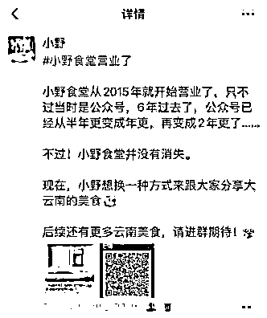

回头看，刚开始我做对了一件事，就是给自己做了个很垂直的定位：一个云南美食团长。

一方面，我之前就断断续续有在写美食公众号；另一方面，基于我是云南人的地域背景，我也一直在朋友圈表达自己对美食的热爱。所以，朋友圈对我已经有美食的定位和印象了，那么我以这个定位开始卖货，是很丝滑的。

刚开始做团购，定位很重要。我个人建议是，做快团团私域的第一步，不用着急去推很多品，而是先想好自己的定位。

二、如果你只有一个团品，如何把它卖爆？

**2.1 **讲好一个团品的故事** **

开团以后，就要去推广了。我发的第一个包浆豆腐朋友圈广告，是一篇小作文，跟闺蜜合作写的。追了当时过年期间比较火的电影《送你一朵小红花》的热点。

 

 

这篇小作文收获了第一批好评。

 

 

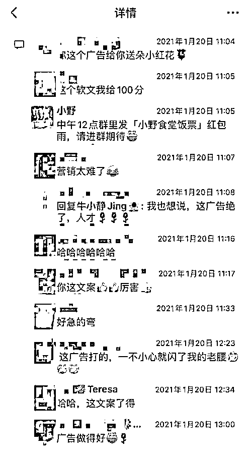

也收获了第一个团的 63 个订单。

 

 

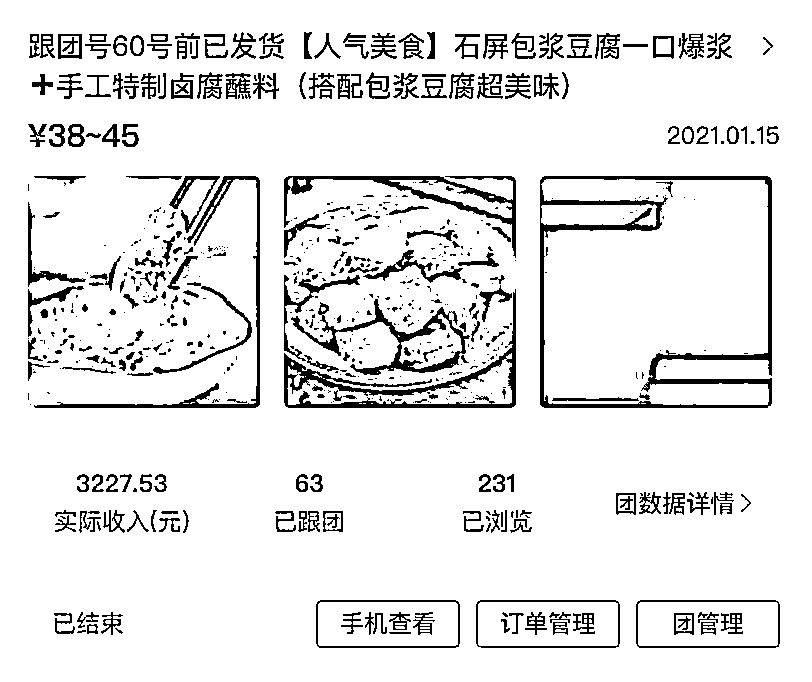

好好讲一个团品的故事，比单纯做硬广，更能吸引人。

那么，到底怎么样去讲一个团品的故事？

分享我自己喜欢用的几种方式：

**1**、结合当下热点讲。比如我最开始推包浆豆腐时，就是抓住当下电影热点，通过影评引出产品；

**2**、结合产品优势卖点讲。产品优势和卖点是要反复去告诉用户的，不要指望发过一次用户就会都知道。可以在一段时间内集中360度展示一个团品，但不是机械地去讲卖点，而是把卖点融在场景里来讲。

 

 

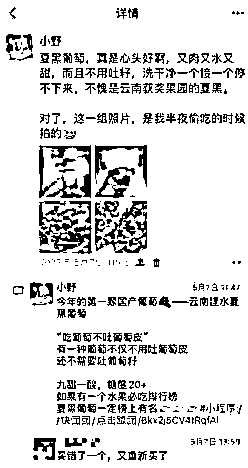

**3**、结合用户痛点讲。除了产品卖点，更关键的是要结合用户痛点。即使是吃的，每个人吃它的理由都是不一样的。比如讲玉米，就不能只讲玉米的香糯和甜脆，要讲吃玉米粗粮可以让你瘦10斤。比如这条朋友圈，发了以后就秒开了十几单，这款玉米也是后来卖爆的一个小单品。

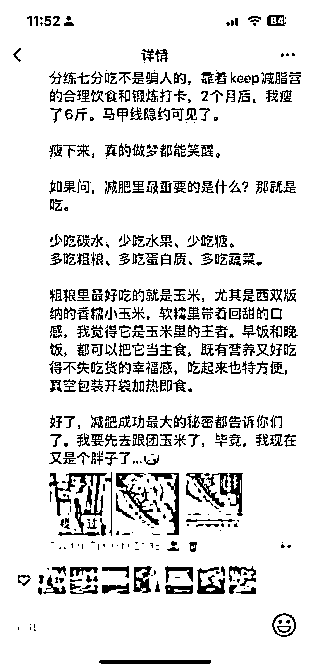

 

 

对每个团品，要思考什么用户在什么场景下可能会用到/吃到它，然后去把那个场景描绘或者展示出来，说到痛处了，用户自然就会下单了。

**4**、结合自己的经历讲。团购跟其他业务场景不同的地方在于，团长有着天然的好物分享官的属性，核心推广的团品一定要自用/测品，并且把自用的场景和获益展示给用户看，这样去推荐才更有说服力。

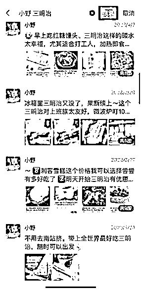

**2.2 **要持续反复推一个好团品，植入心智** **

后来，凭着我对包浆豆腐这个品的热爱，接下来的一段时间，我几乎每天都在朋友圈和社群里全方位给大家讲包浆豆腐有多好吃、怎么吃、有多受欢迎。

 

 

也收到了一片好评，以至于到过年那几天不能发货，群里一片“哀嚎”。

 

 

其实那段时间，我也开团了其他云南美食，但是包浆豆腐我是去花了最多心思、最多时间的，销量自然也是最高的。

这就告诉我们一件很重要的事，想要推出一个爆品，我们首先要讲好团品的故事，然后要持续反复的去推，这样才能在你私域的用户心里植入好产品的心智。

除了过年两个月卖了 200 多单之外，后来我每个月都会开一个包浆豆腐的团，我后来发现团不能一直开着，一直开的话大家就失去了兴趣，觉得它很容易获得。所以，后来每个月只开一个星期，有限的时间里反复去推。

 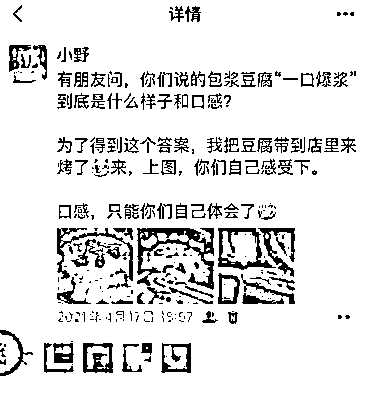

 

 

后来因为产假结束开始上班了，投入时间变少了，每个月包浆豆腐只卖了几十单。但是，很有意思的是，当我长时间在朋友圈反复去推这个品的时候，每次都有新用户来下单，大家会有猎奇心态。

同时，反复推同一个品，老客户复购也超级高，我很多网友如果想吃包浆豆腐，第一时间来找我。可以说，我应该是把云南包浆豆腐「代言人」的这样的人设在私域里立住了哈哈哈哈。

 

后来我的供应链发货太慢，我就很久没开团。直到我在去年 12 月航海里遇到了生财有术推荐的忘忧惠团，当我看到星宇他们开团了包浆豆腐，我眼睛立马亮了！！！立刻朋友圈发了一条。好在我的客户们没有忘记我，后来又卖了 70 多份包浆豆腐。

 

 

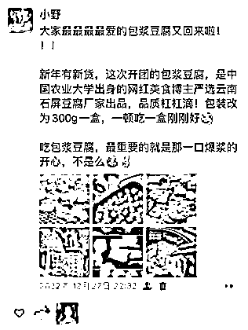 

定位和心智这件事在私域里一旦立住了，就等于收获了客户的喜欢和信任。

**2.3 **把团品当奖品或礼物，既是运营、也是种草

大家应该都知道团购社群里免不了做一些抽奖、送礼物的运营动作。那么到底选择什么礼物作为奖品呢？

我觉得最好的运营方式，就是把我们要推的团品，当作奖品或礼物。当我们把要推广团品作为奖品时，其实也是多了一次触达用户的机会。抽奖前，总要介绍下奖品是什么吧，那么就等于我们再一次向用户去介绍了团品。而参与抽奖的人，哪怕没有抽中，但他也再次被种草了，就可能去下单。

此外，也可以把团品送给想要维护的 vip 客户试吃/试用，继续种草。我今年 5 月份就把忘忧惠的云澜挂耳咖啡，作为礼物给我 60 多个 vip 客户都分别送了一份，后来的确也带来了不少心智植入和复购，现在不少客户在等着云澜咖啡复团。

 

 

 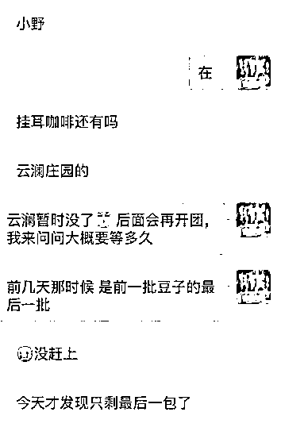

**2.4 **收集好评反馈，别人说好才是真的好** **

最早开团包浆豆腐时，我是没想到能收到很多好评的，但我知道，好评和反馈图一定要存好，反复利用起来。因为好评反馈是促进新用户下单和老客户复购的很重要的证据链。

 

 

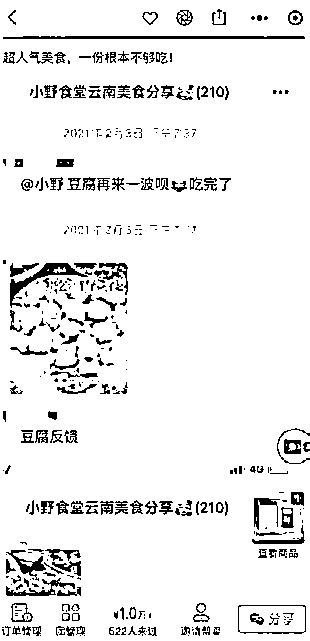 

团购这件事的底层逻辑在于信任团长和从众心理，因此，除了产品价值以及团员对团长信任外，好评反馈对于促进下单占了非常大的影响比重。毕竟，别人说好才是真的好  。

所以在集中推一个团品时，一定要收集客户对团品的好评反馈然后截图。

如果没有好评怎么办？没有好评，那就想办法创造好评。方法有很多种：

方法一：有客户下单后，主动去问问收货情况，表达关心，同时收集好评；

方法二：擅用小号，上个月我让家人用他们的微信号在我团里下单云南小芒果，然后收货以后去群里发图和好评，每次他们一发反馈，就能带动好几个客户下单。真的，好评促单，亲测有效；

方法三：我带荔枝到办公室给同事分享，然后让关系好的几个同事，每人在微信上给我一个好评反馈，素材和证据这就有了（当然，前提是产品本身足够优秀）。

 

 

**2.5 **有了自己爆品后，再去做选品拓展和领域延伸** **

刚开始，我的美食团定位只做云南美食，也做出过自己团里的几个小爆品，除了包浆豆腐，还有咖啡、鲜花饼、西双版纳玉米、云南米线……分别都自己开团卖了一两百单。

但因为我自己一个人又做供应链开团、又要做营销，实在忙不过来，而当时做云南美食供应链的大团长并不多，能帮卖的团很少，于是我决定做选品拓展和领域延伸，我把定位从云南美食拓展到了全国特色美食。

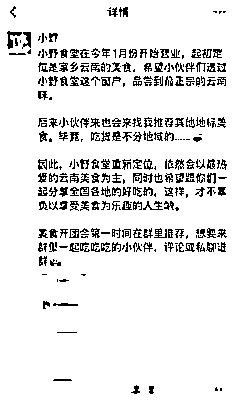

我那会儿纠结过到底要不要做定位的延展，后来想明白了，在有了自己私域定位和爆品后，再去做延展其实是不突兀的。只要讲清楚你为什么要做、有什么立场去做就可以了。

前面说，刚开始不要着急推太多品，要集中去推属于自己的爆品；而当有了爆品后，也不要怕去拓展选品和领域，大大方方做生意，兢兢业业去挣钱。

 

 

三、不仅要拓展选品、也要引流扩大用户数

决定社群团购业绩的，除了复购率，还有用户数量。那么，团长必不可少的一个运营动作就是持续引流。

大家可能都有这个困惑，做社群团购到底怎么引流？我分享几个自己用过的引流方法：

**1.**、从公域里吸引同频的人

我从小红书引流，是从备孕就开始的。在真实记录自己生活的同时，可以把自己关心的事情，用心加工输出成为对别人有价值的内容。我认为这是我们普通人做引流这件事最容易做到的了，因为选题、素材就在你的生活里，吸引来的也是同频和精准的流量。虽然我的小红书目前为止只有 700 多粉丝，但引流到微信私域的粉丝应该有一两千人，也让我成功变现了近 40 万利润。

举个例子，我在生孩子之前，发现鼓楼医院竟然没有官方孕妈交流群，于是我发了一篇小红书笔记「南京鼓楼医院助产士才会告诉你的待产注意事项」，就这一篇帖子，帮我建了一个近 500 人的鼓楼医院孕妈交流群。后来我的母婴团购群，就是这样建起来的，孕妈交流群里大多数人，后来理所当然地都成了我母婴团购群的客户。

 

 

**2. **从自建的主题交流社群引导到团购群** **

围绕某类用户的需求和周期，是可以建很多种主题交流群的，比如围绕母婴这个群体，从备孕群、怀孕群，到妈妈交流群以及二手闲置群等等。

当有了自己的群以后，怎么引导到团购群里呢？

一种方法是，通过正式发布告知大家群主做了一个团购群，并且以分享的方式讲清楚为什么要做团购群、自己有什么优势/背景可以做好这件事、可以为大家提供什么价值和服务，这样应该能转化一批人进群。大多数情况下，用户是不会排斥群主做这件事的。就算有人排斥也没关系，这也是个双向选择的过程。

 

 

一种方法是通过群公告让进群这件事成为日常，在正式发过一次另建团购群的分享后，可以把这件事挂在日常群公告里，本来的主题交流群在运营过程里，只要有人进群就需要再次发公告，那么就有人会看到你还有团购群这件事，感兴趣的人自然会找你进群。

**3**、从你线下的圈子引流

 

 

做团购社群还有个很天然适合引流的场景，就是线下圈子，例如跟你同一个小区、跟你孩子同一个学校、跟你参加了同一次活动……

我前几年办了一场线下行业会议，当时建了一个现场群用来给大家发现场讲者的 PPT，我把个人二维码放在了大屏幕上，只有加我微信才能进群，于是那场会我加了 300 多个同行业的人。

类似思路都可以用起来。比如积极参与组织线下活动，找个契机加到参与活动所有人的微信；比如在小区做一次试吃活动、或是公益玩具赠书，然后加到同小区的邻居微信；

甚至直接建一个小区团购群，虽然现在每个小区很多团购群，但有差异化的好产品和好服务依然是稀缺的。

四、当用户和团品多了，也不要忘记初心

我做团购 2 年多，无论是美食团、还是母婴团，每天会保持一定数量的团品上新开团。

可有段时间我开始迷茫，每天开团、每天发素材，都在机械化地运营，离当初那个充满热情、卖家乡美食的自己越来越远。

后来当我在回顾复盘当初怎么卖包浆豆腐、怎么把团购做起来时，我突然意识到，团购的特点决定了团品品类繁多，但我们的团购爆品不能只有几个，团购的销量业绩是由无数个细分领域的爆品组成的。

不管每天能开团多少个品，我们都应该在一段特定时间内，抓住主要的核心团品作为主线去推，集中、密集地给用户植入心智，这样才能去让用户持续去信任你，形成持续的口碑，然后团购这个雪球得以越滚越大。

 

 

日常推广核心团品的节奏可以是这样：预热种草-开团宣传-自用分享-客户好评-促单复购。按照这个节奏一步步走，很难不爆单。

五、最后总结一下，如何通过一个小小的团品来启动并扩大快团团这个项目？

第一点：打造属于你的爆品。

对新手团长来说，结合好你的私域定位，先集中打造出几个爆品。爆品不一定非得是成百上千单才可以，而是在你的选品中跑出来数据是相对比较优秀的，形成口碑，让客户信任你。

第二点：拓展丰富你的选品。

有了属于你自己的爆品后，可以大方地去拓展选品，通过更多细分领域的爆品，让客户继续对你有粘性。如果需要，甚至可以重新定位你的私域 IP。

第三点：持续引流、持续爆单。

找到属于自己的同频流量，输出内容也好、线下沟通也罢，引流这个动作始终要持续去做，把流量持续注入到团购群里，然后持续爆单。

第四点：不忘初心，保持热爱。

把每一个值得的团品都当作爆品去推，用户会感受到你对团品的重视、用心、和热爱。

当无数个小小的团品汇在一起，终将成就属于团长的口碑和财富。

最后，感谢从去年到今年生财的快团团航海项目，遇到了有趣又厉害的教练@星宇、@深藏blue…以及有趣的领队和志愿者，@筱媛、@九儿…收货满满！

 

 

感谢 @梁靠谱、@张亚萨和@芷蓝对这次复盘分享的修改建议和指导，也感谢@亦仁大大给团长提供了那么多好的团购资源！团购这条路还很漫长，也非常值得深耕，让我们一起走下去啊。

评论区：

小田 : 第二个链接没有权限

小野 : 我把内容重新放文章里了，现在可以看到了吗？

小田 : OK了

小野 : 😊

芷蓝 : 哈哈，太牛了！

做团购卖的就是生活方式，让商品在场景里出现，让自己的风格在卖货的过程中展现。

卖货要有一个目的，一个目的就是一个故事，一个故事就是自己的背书

小野 : 嘿嘿，蓝姐说得对！团购就是在卖自己的生活方式[害羞]

自律更自由 : 写的太好了，我也想买

梁靠谱 : 野总yyds啊

# 【项目分享**-**线下实体】**1**篇

# **# ****(**精华帖**)(58**赞**)**关于租房行业的一丢丢思考

作者：  猿媛说

日期：2021-01-29

轻享

今天跟大家简单聊聊租房行业的一丢丢思考，之所以说一丢丢，因为这个行业实在太大，话题太多。这里就简单说说长租公寓这个行业的发展，以及这个行业给我的理解，希望能有一些普世的思考能够带给大家，大家也可以结合自己所在的行业细品、尝试拆解。最后，我会给大家聊一下这个行业，哪些不能碰，哪些有机会。

 

 

字数8000+，请移步石墨

https://shimo.im/docs/yhjTkvr8VRCqwHvT评论区：

惠一 : 地产开发商的公寓活的怎么样？长租会跟民宿结合来卖吗？

猿媛说 : 地产开发商的公寓其实过得不咋样，这类属于集中式公寓，他们比分散式的过得好那么一点点点点，因为后期管理成本会小很多。长租跟民宿，或者长租跟短租，是可以结合起来的，尤其是临近过年，或者遇到一些租赁市场淡季，短租是一个不错的销控手段。

惠一 : 私信你了，方便加微信聊下吗

猿媛说 : 嗯嗯

邓双义 : 短租虽然价格高了，相应的渠道成本是不是也会高了？而且和长租的需求相比，也会有区别，我感觉不一定能服务好，感觉是酒店的客户。

猿媛说 : 短租在长租公寓里，是个解决个性需求的或者应对特殊销售环境的PlanB，长租公寓里的最重的支付给业主的房租，而短租能解决一部分的空置问题，属于尽量少亏的方案。

QC : 好棒！！！我一直想切入长租人群的生活服务领域，不知道个人做，能量够不够？

能加大神微信吗？

猿媛说 : chuxiaotian002

# 【项目分享**-**海外掘金】**1**篇

# **# ****(**精华帖**)(152**赞**)**我是如何通过** TikTok **广告** 3 **

# 个月赚到第一个** 100W **的？

作者： Ethan

日期：2022-04-27

 

 

《我是如何通过TikTok广告3个月赚到第一个100万？(附1万字新手攻略)》哈喽，大家好，我是Ethan。我的前职是在某互联网大厂的国际事业部担任产品经理，在过去几年的时间里一直从事的是欧美市场，做过游戏，工具和健康类的APP产品。目前正在全职研究TikTok广告+Shopify独立站的玩法，副业兼职在YouTube发一些视频。加入生财有术，已经一年有余，从这个社群获得了很多非常宝贵的经验。今天想和大家分享和复盘一下，我是如何通过TikTok广告3个月成功变现了100万。

最近看到生财有术第六期的实战小航海有规划TikTok Ads的题目，也非常期待，希望今天这篇文章能为大家抛砖引玉。虽然我自己对于欧美市场并不是特别陌生，但是就电商而言确确实实是一个零基础的小白入行，所以相信今天的文章对于很多新手朋友，也会有比较大的参考价值。目前，做TikTok付费广告投放的玩家，可能要不在测试之后抱怨转化率太低，要不自己闷声发财，很少能看到比较完整的方法论和经验分享。我自己是在去年11月份开始学习了解TikTok广告投放+Shopify独立站的玩法，在第2个月就赚到接近4万美金的收益，从第2个月开始的3个月时间累计成功变现了16万美金，差不多刚好100万，中间该踩的坑也都踩过，广告账户被封，收款账户被封被冻结，物流太慢，春节工厂不发货等等问题。

本篇文章比较长，可以倒杯咖啡，慢慢阅读，主要涉及到的内容有：

1.我为什么选择TikTok付费广告+Shopify独立站这个赛道？

2.TikTok广告平台介绍，以及新手如何创建TikTok广告投放账户？

3.TikTok爆款的选品策略

4.如何从零开始打造日赚1000美金的独立站？

5.如何制作出有潜力的TikTok广告素材？

6.如何开启TikTok广告投放测试？

7.如何维持TikTok广告的成效并进行扩量？

8.TikTok的学习资源&常用工具

9.我对TikTok付费广告的一些思考

 

 

https://nscdjspf8p.feishu.cn/docs/doccny6RJdVLpRRlM0aYycAlqLg

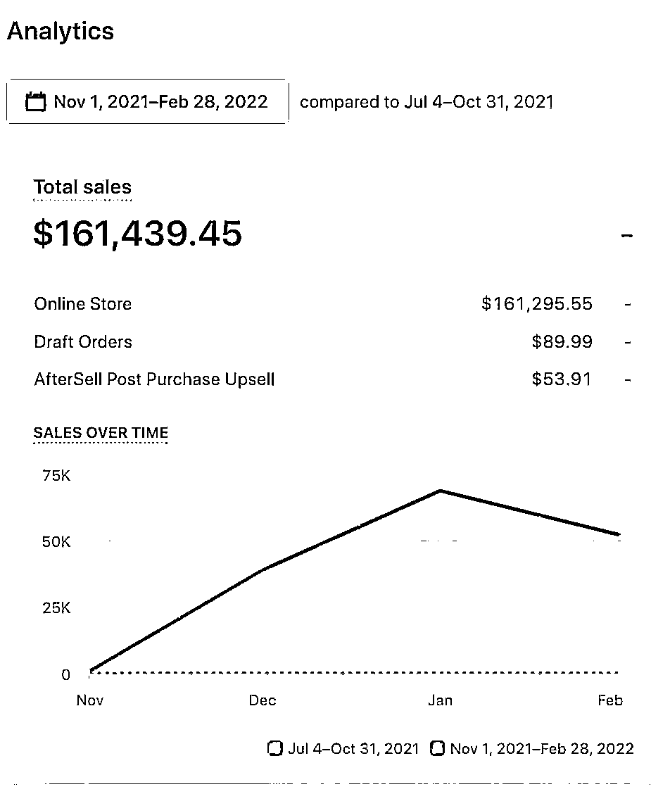

评论区：

 

 

Lee : 纠正一下里面的受众图，来源自pipiads，并非雨果跨境

Ethan : 感谢指正，我修改一下

Lee : 人均gdp单位我们写错了，是USD,不是RMB。。[呲牙]Ethan : 你是PiPiAds的人吗？😂

亦仁 : 100万是gmv还是利润？如果是利润的话，gmv差不多500万？

Ethan : 100万是gmv，利润在30%，之前在扩量操作上面还是太谨慎了，自发货也担心处理不来订单，其实有机会跑得更高，经验不足。

亦仁 : tiktok爆款站今年我还是很看好的，虽然沉淀少，但至少沉淀了利润，2020年facebook流量还好卖爆品的时候，有朋友一年靠这个赚了2个亿，tiktok应该还有类似的机会。

Ethan : 嗯嗯，我也有看到国外一些案例已经靠TikTok爆款站单日收入达到7万美金。

# 【项目分享**-**技能变现】**2**篇

# **# ****(**精华帖**)(134**赞**)**案例复盘：视频号第一次直

# 播卖课，单场净利** 16000+**

作者： AI君

日期：2022-05-16

大家好，我是AI君，95后，去年从大厂裸辞自己做课程，目前是一名自由职业者。

这是我加入生财的第二年，之前一直觉得圈内大佬太多了，就自己默默潜水和参加一些活动。最近在一些朋友的影响下，我也想来分享一下我自己的一些经验，希望对大家有所帮助。

 

 

之前我参加过生财的抖音直播大航海，持续跟着航海进度在播，但无奈直播间场观一直没有破过200，也没有卖出任何东西去。当时看着很多船友做的都有声有色的，也怀疑是不是自己不太适合主播这条路。

直到我开始转到视频号，第一次做卖课成交，单场就卖了13000+，算上一些尾款，当场实际带来的净利润是16000+，卖的都是我自己生产的课程和产品。

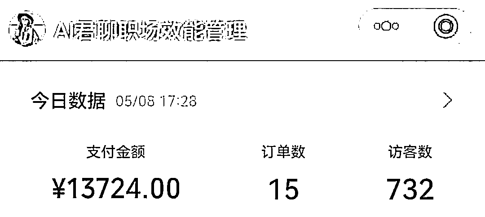

这个成绩可能和圈内很多大佬比不算什么，但是我觉得对于一个没有名气的素人、完全靠着自己前期的学习和策划，快速打造出这样一个成绩，是完全可以给大家来复制的，所以就鼓起勇气来分享一下，可以给在抖音直播没有做出来的朋友们一些其它的思路。

很多人做视频号直播会拿做抖音直播的思路，慢慢吸粉，提场观，但是视频号其实还有一个更顺畅的玩法，就是集中做成交，可以最大程度提升私域的转化。

我直播的场观和在线其实都挺低的，基本上平均就30多人在线，也没有什么公域流量，就是靠自己的私域和朋友的朋友来最快完成成交的动作。这个要比促销时靠群宣发、1v1轰炸的效率都高得多，而且成本非常低。

 

 

本文包含：

一、如何策划一场成功的直播带货？整个流程是什么样的？有哪些要点？

1、宣发到位，提前预热

2、先留人，再转化

3、以老带新，增强信任

所以如果大家平常就有在私域做卖货，自己也不太擅长做公域引流的，不妨尝试一下这个思路。在有效策划的情况下是能一场直接做出这个效果的，前面花点时间熟悉一下视频号操作就可以。

接下来我将毫无保留的把我在直播前前后后的所有打造思路分享给大家，帮助大家利用直播快速做成交额。

这个方法除了我自己应用以外，也在我身边的几位朋友身上验证过，是可以被有效复制的。

 

 

4、产品分层，阶梯价格

5、善用钩子，增强链接

6、不断播报，放大信号

二、为什么用户会在直播间下单？如何有效促成转化？

1、必要性——内容设计

2、稀缺性——嘉宾选择

3、紧迫性——价格策略

三、一些常见问题和注意事项

1、如何促成第一单

2、充分调试非常重要

**PART1 **

如何策划一场成功的直播带货** **

 

 

一场成功的直播最需要的就是一个好的策划。

在熟悉基本操作之后，开始带货了，一定不要直接上去就播，而是要先设计一下直播间的节奏。

直播间的环境非常像一个菜市场，如果你只是蹲在这儿就摆了个摊儿，大概率大家都会观望，无人问津。人群永远都会往那些最火爆的摊儿上去集中，买的人越多，想买的人也就越多。

产品好是一个基础，但只有产品好是远远不够的，我们需要把这件事传递给用户。

对于直播间来说，传递的方式就是通过策划营造出一种你这里东西非常好的氛围，这个氛围才能有效促进成交。

视频号直播和抖音直播是不一样的，抖音基本是对于一群不太熟悉的人在卖，但是视频号不是的，我们有自己的私域资源和很多已经存在的信任，这些是非常重要的资源，一定要好好利用起来。

在任何一个多人场域中，想要调动群体行为，一定要抓好里面的**koc**，让他们来带动其他人。

对于视频号直播间的用户，可以按照对我们的信任度分为三层：

第一层是陌生人。他们可能是因为直播推流，或者是你的朋友转发进入你的直播间的。

这群人本身对你没有了解，也没有信任度。

 

 

第二层是熟人。他们可能是你的同事、同学、朋友，某些社群和活动认识的人。这群人对你有认知，但是没有给你付过费。

第三层是用户。他们已经在你身上花过钱，不管是几块钱还是几万块钱。这一类就是我们要重点抓住的直播间**koc**。

那怎么能有效转化和带动这三层人呢？我总结了这六点：

**1**、宣发到位，提前预热** **

我们直播前的初始宣传一定要做到位，通过各种方式把三层人先吸引进来，很多人开始并不一定抱着了解你和你的产品来的，但是直播间这个场景是有能力快速完成从种草到转化的闭环的，所以先要通过各种场外手段把人吸引进来。

前期需要做的工作包括这些：

（1）创建好直播预告，引导大家预约。

现在视频号和公众号的承接是非常顺畅的。如果你有公众号，这段时间可以多发一些文章。

一方面直接写一些和主题相关的文章，在里面插入预告，引导大家预约。另一方面，公众号主页也会直接展示直播预告，用户进来就能看见，你发文多了曝光也会多。

最后你开播的时候，关注了你公众号的人，也能在订阅号的页面看到你的直播，这都是非常重要的导流入口。

 

 

（2）确定核心价值点，多次在朋友圈进行宣发。

整体的直播可以发一波，内容、嘉宾、奖品、优惠，这些都可以作为价值点去从不同角度做宣发。

内容吸引过来的是最精准的目标用户，嘉宾可以覆盖特定圈子的人。奖品和优惠看起来比较泛，但是会最直接的吸引一批人过来，你的目标用户也会因为奖品和优惠有更大的意愿进入和停留在你的直播间。

另外还有两个特殊的点可以在朋友圈做宣发的，一个是挑战单场GMVxxx，尤其如果你的产品涉及到做变现的，这个会是一个非常好的吸引别人的点。

一个是个人的故事，可以讲一讲自己为什么要做这件事情，背后的思考和原因是什么，这个对于私域的宣传来说是非常能打动身边人的点。

比如你可以说视频号直播非常有前景所以要尽快入局，可以说这是个对做私域的朋友特别适合的高效成交转化场景。你也可以就着内容讲一讲自己为什么要和大家聊这个主题，为什么要做这些产品，都是很好的方式。

（3）创建直播群。

我一般的操作是在公众号上引导大家去预约直播，朋友圈和群里发海报都是直接让大家加群。

 

 

开播提醒是系统给的，比较不稳定，而且不能直接触达用户。在私域就要利用好私域的玩法，通过群来营造氛围。

提前我们就在群里多做预热，提醒大家要开播了，关注直播的情况。

在视频号开播的时候，我们就把这个群勾选上选群发红包，就会直接有开播提醒发过去了。

另外过程中我们也会在群里进行播报，现在是什么什么环节了，某个重磅嘉宾要来了，聊到了什么精彩内容，马上要开大奖了，引导大家进入直播间。

（4）设计好分销机制和转发奖励，制作定向海报邀请核心用户转发。

对于第三层koc用户，一定要单独给他们做好设计，确保他们有足够的关注度，这个会对整个直播间氛围的营造非常重要。

对于嘉宾和核心用户，可以站在他们的角度上考虑，他们需要什么，给他们定向制作海报和话术，让他们来转发。

比如我当时对于koc用户，我会和他们说，你们就真实的写一些你们在这里的获得和故事就好了，如果能够把别人的产品推销出去，是你的影响力在增强。对于他们既有变现能力上的提升，也有实际的利益好处。

**2**、先留人，再转化** **

 

 

在直播刚一开始的时候，大部分人一定是一个观望的心态，我们初始要做的事情就是通过价值留住他们。

这个价值有两方面，一方面是你的内容能够对他们有启发，另一方面就是非常实际的利益。

内容上面要切中人群和痛点。我们做直播的时候针对不同人群设计了不同的内容，像我的目标用户和身边的群体比较多的是两类人，一个是0-3岁职场人，面临职业迷茫期。另一类是30多岁，面临职业转型的问题。

这两类人我们会给到一些通用的方案，但是他们的场景上又是有区别的，所以我们会让不同的嘉宾来承接这些问题，和他们年龄相仿、刚刚走过这一阶段的人讲自己的故事，这个是非常有吸引力的。

实际利益上就是非常直接的抽奖。我们做直播的时候是全场不停抽奖的，几块钱一个的红包，几个小时不停发也没多少钱，但是能有效留住一批人。

在抽奖的时候也需要做一些策略设计。我们当时是要求凭借转发截图领奖，不同的奖品有不同的要求，以满足不同用户的需求。

有一些个别小红包是没有要求的，给第一层的陌生人一些小甜头留下来。一般的奖品就要求转发，这个对于第二层用户是可以接受的。然后终极大奖是要求转发多次的，基本上只有koc用户可以达到。这样就可以通过抽奖这件事达到留人和把一些朋友的朋友吸引进直播间的目的。

转发的话术我们都是会提前根据场景给用户写好、发在公屏上的，最大程度减轻用户的转发成本。

 

 

当你的直播间内容比较好，你给用户的信任度也比较高的时候，你又帮他想好策略，又给他一些激励，转发的动力其实是很足的，没有那么困难。尤其koc用户，他们会非常积极主动就帮你做转发。

不过有一点需要清晰的是，留人不是为了场观，是为了让他们能等到该听的内容，而不是一划就过去了。所以，每次开始抽奖和开奖的时候都需要配套的去重复介绍产品和优惠策略，把这批人及时接住。

**3**、以老带新，增强信任** **

直播间的氛围下用户是很容易被感染的，我们需要用上一层的用户来带动下一层的用户。

陌生人进来大概率是不会互动的，但熟人很多是会给你评论，给你点点赞、刷刷礼物的。对于熟人一定要多和他们去交互，去带动第一层的陌生人，让陌生人感觉到热烈和亲切的气氛，产生一个对你、对你的圈子的好印象。

而转化最重要的就是通过核心用户去带动前两层的人。核心用户是为你付费过的人，是使用过你的产品的人，他们本身的信任度就很好，只要稍微设计一些分销机制激励一下，让他们去讲自己的经历和帮忙推荐都是非常有效的。

大家可以想想，如果你进入一个直播间，全场都是一群老朋友在聊天的感觉，而这群人里还有几个是你熟悉的人，你会不会挺好奇的，想要加入他们。

而如果几个你特别好的朋友，甚至是很认可的朋友，都在推荐一个产品，还用亲身经历去展示了效果很好。处在同样阶段，有着类似问题的你，是不是会很心动。

 

 

视频号直播带进来的人大部分都是有关系链的，不是嘉宾的朋友，就是用户的朋友。所以一定要把直播间的氛围感做好，和观众多去互动。

另外，在直播间还有一个特殊的场景可以好好利用。就是当你有人给你送礼、给你评论的时候，可以借着机会去互动和宣传。

念名字感谢的时候，就顺便给大家介绍一下这个人是谁，你们之间的故事。如果他是你的学员，就直接介绍一下他参加课程的情况，这些都会非常有效增加别人对你的信任度。

**4**、产品分层，阶梯价格** **

直播间的用户是分层的，信任度相差很大，所以我们需要把产品也做出梯度，来分别满足不同类别用户的需求，实现成交额的最大化。

直播间的场景是很局促的，对于新人来说，想要在这么短的时间内说服别人买一个大额产品是很难的。即使是一些大佬的直播间，卖的最多的也是几百块钱的产品。所以我们需要设计一些价格比较低的产品，让大家更容易产生购买行为，来带动气氛。

具体到直播间的场景，我们一般会上几单试听课程、价格比较低的小课，或者是书之类的小产品，在10块钱以内，或者小几十的这种，给第一层用户来购买。

然后我们可以再继续推一些我们正常价格的主打产品，这个产品主要是给第二层用户准备的。在整个直播过程中，重点要转化的就是这批人。

 

 

这批人往往会和我们的用户存在交集，用身边人的案例来说服是最好的方式，详细的策略见后文第二部分。

另外还有一些高利润的产品是给资深用户准备的。这群用户可能已经购买过我们正常单价的主打产品了，对我们的信任度也很高。这个时候就可以着重让他们看到我们更定制化、更高端的课程产品。

视频号直播间是只能挂一个链接在直播主页的，剩下的都需要点进去找。主页一般就先挂一个低价产品，快速售罄后换正常产品就好了。因为那些高信任度的用户会有很大的动力去自己翻出来他们要买的高价值产品。

这种高价值的产品只要出几单，利润直接就拉上去了。

**5**、善用钩子，增强链接** **

对于直播间大部分二级关系链，因为信任度比较低，想要让这群人付费是路径很长的，需要他们听到内容和案例对你认可，还需要有直播间热烈气氛的带动。

但是视频号直播的效益是不仅仅在于单次转化的，能让陌生人变成一个对你有一些认可和信任度的潜在用户也是非常有价值的。

所以在直播间我们也会去做一些引导，让用户和我们产生链接。

第一个就是引导他们去关注我们的号。这个可以在抽奖的时候设置好，关注才可以参与抽奖。

 

 

第二个就是引导他们来加好友。这个钩子包含两件事，一个是告诉大家需要添加好友来领奖，另外一个是告诉大家添加好友会赠送课程或者礼包。

这样我们可以长期对他们去做触达，慢慢转化。

**6**、不断播报，放大信号** **

产品有很多人在买，并且很快售罄，这会给用户有效传递出「我的产品很好、很受欢迎」的信号，打破群体观望状态。

这里需要注意的是，在直播间，这些信号一定要放大，有效传达给用户，否则这件事情就和没做是一样的。

几个常见的方式是：

（1）主播直接在直播间口播，xxx购买了我们的xxx产品。xxx产品还剩几份，即将售罄。

（2）如果是嘉宾连麦这种场景，不要去打断嘉宾，找一个小助手，或者是朋友，配合你在公屏上把这些内容发出来。

（3）直播前拉一个直播群，在群里同步播报这些信息，同时在朋友圈做转发，营造外围场域。

 

 

**PART2 **

如何促使用户完成下单** **

用户下单购买一个产品需要同时解决三个问题：

第一，必要性。为什么要买这个产品而不是不买。

第二，稀缺性。为什么要买你的产品而不是别人的。

第三，紧迫性。为什么要在此时此地购买这个产品而不是等以后或者其它场合。

这三条在直播间可以分别用内容设计、嘉宾选择和价格策略来展现。

**1**、必要性**——**内容设计** **

购买的产生一定是因为你的产品满足了用户的某个必要的需求。这个需求，可以通过内容来传递。

最好的方式就是一个核心观点+多个案例的形式。

我们的直播不是为了吸引听众的，是为了卖货的。所以不要想到什么讲什么，要设计好内容到卖货的链路。

 

 

直播间的节奏是非常紧迫的，在这种环境下大家是没有办法接收过多信息的，千万不要当成写文章一样去给大家讲，只讲一个核心观点，让每个人都听进去就足够足够了。

这个核心观点是什么呢？就是我们的核心卖点，或者说是用户的核心痛点。

比如我的直播主打产品是我的社群，那么我全程在强调的关键词就是打破圈层。

对于视频号的直播，最初始的用户一定是你的私域用户，是认识你的人，所以一定不要和他们讲道理，这个场域是不对的，他们听不进去。要讲你的故事、他们认识的人的故事，这个是他们最喜欢听，也最有效的。

我卖课的时候就发现，最有效的转化方式就是，他们认识的某某人参加了你的课程并且产生了改变，尤其是一些大家比较认可的人参加了，效果更明显。

所以直播间的内容设计就是，全程围绕一个核心观点展开，然后不断去讲自己和身边人的真实案例来论证它。

案例讲的时候就采用「成绩+原因+问题+核心观点」的形式就可以了，每5分钟左右一个案例闭环掉，不断重复这个模式。

直播间的人是流动的，是耐性很差的，我们的内容闭环一定要小，重点内容一定要突出。千万别像日常讲话或者写文章一样，顺着往下说。每一次讲完一个案例都要扣回来，再重复一遍核心观点，确保它能够深入人心。不要觉得重复烦，直播非常非常需要重复核心内容。

 

 

比如我先讲我自己一路走来的一些成绩，然后告诉大家，能够获得这些成绩，是因为我进了很多垂直的付费圈子，打开了视野和思路，之前其实我走过特别多的弯路。所以如果想要获得一个新的结果，一定要打破旧的圈层。

我也讲了很多我的学员加入我的圈子之后产生的改变，改变怎么发生的，之后再次重复要破圈的核心理念。

因为故事都是非常真实的，这也确实是我认为最重要的部分，大家一听就是能有同感的。再加上很多身边人也在我这儿获得了效果，整个营造的氛围就会非常好。其实不需要反反复复去介绍自己的课程和内容去做营销，真正的效果是最好的宣传。

另外，直播间特别怕沉闷，怕枯燥。一个人讲久了怎么都会审美疲劳，在讲内容的时候，如果有条件，最好找个朋友和你在现场一起。不需要对方发挥多少，只要能没事给你接几句话，多强调强调重点就足够了。

**2**、稀缺性**——**嘉宾选择** **

你的产品和别人相比，提供了什么无法替代的价值呢？

对于知识付费产品来说最有力证明的就是人脉质量，这一点就可以靠嘉宾来体现。

嘉宾的选择是非常非常有讲究的。直播间连麦很多人会喜欢找大咖，越牛的人越好，这个或许对场观有用，但是对变现其实没有用。

找嘉宾有两个目的，第一是给你背书，第二是帮你介绍产品。所以一定要找那种对你比较了解，比较认可你的人。他要能够说的出来你的一些成绩，你的一些产品。

 

 

这个推荐是设计出来的，还是诚心的真的觉得好，观众是能感觉到的。 宁可找那种**title**和名气没有那么响亮、但是发自内心愿意帮你做推荐的人。

只要嘉宾站在那儿，就已经传递出了两个信号：第一，你这个人和你的产品是值得信赖的。第二，你的产品是真的有效的。

选嘉宾最好的是两种人，一种是你的老师，一种是你的学员。

在某一领域有自己独特见解的、和你绑定特别深的、在某个小圈子有影响力的人都是非常好的选择。

有独特见解的、比较有影响力的，可以让他们直接聊自己的认知，这个观众爱听、有收获，而且这个能传递出一个很强烈的信号，就是这么多厉害的人在你的课程和社群里，我到这儿可以和他们结识，共同学习，这个是非常稀缺的价值。

另外就是那些和你绑定特别深的学员，受到你影响特别大的学员。他们或许不是那么有名气，但是他们的故事一定是代表了大众的。他们讲自己的真实经历，观众是能有共鸣的，他们能看到我购买你的这个产品之后，我怎么一步一步的变得更好了。

这群人能够特别直接的筛选和吸引到同类，用户会觉得，这里是一个适合我的圈子，是一个和我同频的圈子，这也是你的稀缺性。

嘉宾其实不需要给他们规定讲什么内容，只需要做好机制的设计，绑定好同盟关系就可以了。真诚的流露和推荐是最好的。

 

 

**3**、紧迫性**——**价格策略** **

我们在私域做成交的朋友，可能直播间出售的这些产品平常也是买的。这种情况就一定要给用户一个为什么要在你直播间购买，而不是等以后再去买的理由。

最常规的方案是价格优惠。但是对于视频号直播，因为是熟人圈子，有可能会有一个问题，就是用户平常看过你卖这个产品，降价有可能会让用户觉得你的产品不好，也有可能会干扰到我们后续的私域成交。

所以这里给大家三个比较好用的方案。

第一个是出一个新的类目作为主打的售卖品。比如你本来有课程A和课程B，直播间可以出一个比较优惠的打包价格。

第二个是采用赠送礼品的方式。如果你觉得每个人都送比较亏，或者担心后续大家购买都找你要礼品的话，也可以利用直播间特有的氛围做抽奖机制，所有买了课的可以进入奖池，抽取一个大奖。

第三个是在即将准备涨价的时候开直播做售卖。这样就顺理成章的形成价格优惠，直播后直接涨价就可以了。

这里还有一点要提醒大家的是，不管是哪种方案，今天购买是非常超值的，这件事情一定要在直播间反反复复的强调。最好能够在你直播间的墙上直接贴一个海报，把这件事情写上去。然后每个环节过去了之后主播都要再重复一遍。

 

 

还是上面说过的那个问题，直播间的人是流动的，我们要确保最重要的信息让所有人都听见了，让所有人都记住了。

**Part3 **

一些常见问题和注意事项** **

**1**、如何促成第一单** **

在卖货的时候有一个很关键的地方是从0到1的突破点。直播间很多时候会出现这样的情况，你的宣传很到位、货也很好、各方面该做的都做了，但是就是始终没人买。

因为在一个群体环境当中，大家会害怕出错，会参照别人的行为来决定自己的行为，所以会产生一种群体观望的状态。

这时候最重要的一点，就是要推一把，实现第一单的突破。只要有一两个人开始买，后面的下单就会流水不绝。

那怎么能够实现这个从0到1呢？有两个关键点。

第一，提前让目标用户对这个产品产生兴趣。

当天现场说有什么什么优惠，这种力度有时候是不够的，很多人不了解的会以为只是一种促销手段，他们不知道你平常卖什么价格。

 

 

而且从种草到转化，凭借一场直播间完成的难度其实并不小，最好的方式是提前做好配套措施，配合档期做宣传。

比如说我5月8日做一场直播，那么我提前几天就要开始做产品的宣发，让大家先了解到这个产品的各类信息，并且告诉大家将会在5月8日直播间以最优惠的价格给到大家，引导大家预约直播。

这样就会有一些人提前已经对这个产品有购买意向，他们会在直播当天非常快速的下单，把节奏带起来。

第二，推一些少库存的小额单来打开局面。

在第一部分我们说到，可以给第一层的用户一些小额单来购买，比如一些低价试听课，还有类似书这种比较便宜的标品。

这个不是直播间真正主推的产品，只是为了快速说服、打开局面用的，因为价格比较低，大家的决策成本也比较低。库存可以设计的少一点，快速售罄掉就好了。

当有一批人开始买了之后，群体观望状态就会被打破，开始有人陆续下单。后面的事情就按照前面的设计顺水推舟就可以了。

**2**、充分调试非常重要** **

视频号的很多操作真的挺不符合使用习惯的，强烈建议大家事先一定要试播一下，把所有操作过一遍，试的时候可以指定观众，这样别人就看不见了。

 

 

这里再提醒大家几个特别容易出问题的地方。

第一，视频号直播预告

直播预告创建之后就不能编辑了，一定要先确认好内容再把整个预告发出去，否则之前的预约就不管用了。

另外直播前一个小时千万不要做调试。我们当时开了个私密直播，想着试一下镜头，结果系统直接判定为是半小时后的直播开播了，给所有用户发了开播提醒，但是大家又进不来，我们只好重新又开了一个，相当于前期的预约都废了。

第二，视频号小商店

视频号关联小商店现在是必须要营业执照的，这个大家要提前准备好。有营业执照+法人身份证+法人微信验证一下就可以了，不需要本人是法人。

但是最后提款需要打到企业的对公账户上，所以如果挂靠，一定要找足够熟的人，不然你的钱提不出来会非常麻烦。

另外小商店里面，如果你选了虚拟产品，用电子券码的话，过后需要找用户去逐一核销，量大了很麻烦，可以考虑直接选择实体货品，15天默认自动收货。

我想分享的内容就是这么多，希望可以对大家有帮助，如果有什么问题，欢迎和我交流。

 

 

最后，要特别感谢生财提供的平台，之前参加抖音大航海让我熟悉了直播相关的操作，也学到了很多干货，帮我打下了很坚实的基础。另外也要特别感谢@芷蓝和@文静在我的IP定位过程中提供的帮助。

评论区：

。 : [强][强][强]学习了

lucky : 前面几个视频破100万后，后面就没办曝光率  了，这种情况应该怎么做了，注销重新来么

彦师 : 我这有公域流量。但是还没开展带货

老宁 : 再发3-5天，还可能有爆文，如果3-5天基本没有视频入选推荐，大概率不会再有爆文了。

陈雪🦉碎碎念 : 蹲到AI君来分享啦

蔡文静好文静 : [强][强]很细节~

AI君 : [害羞][害羞]

林沐沐 : 视频号因为之前不懂，随便发了一些抖音发过的视频，现在被限流了，0播放，怎么破？账号还能用吗？可以重置账号吗？还是说这个微信视频号就不能用了，只能换一个微信号重新注册呢？盼回复，谢谢

# **# ****(**精华帖**)(119**赞**)**摄影零基础起步，如何通过

# 打造航拍摄影** IP **实现职场副业双丰收

作者：  黄浩在观察

日期：2021-06-30

《摄影零基础起步，如何通过打造航拍摄影 IP 实现职场副业双丰收》

圈友们好，我是今年 418 才加入生财的新人“黄浩在观察”，爱好摄影，目前在无人机航拍摄影上略有建树：

· 在本地官媒网站发表过 63 次航拍作品，被置顶过 40 次，获奖 2 次，总浏览量目前有  21 万+；

 

 

· 参加航拍社区「天空之城」“腾飞 70 年·换个角度看中国”活动，在每个城市仅评选 5 位获奖作者的竞争中，同时获得优秀航拍地视频及图片两个奖项；

· 通过主动投稿成为「视觉中国」签约供稿人，「720 云」VR 全景签约供图作者。

今天想和大家分享一下，一个不是摄影专业出身的 IT 男，如何凭自己的一腔热血，从无人机航拍开始起步入门摄影，野路子走上摄影之路开始劈荆斩棘，开启自己的个人 IP 之路的。

我将毫无保留地把这个过程中，我采取的一些行之有效的行动，踩到的切切实实的坑，分享给各位圈友，如果你也想打造个人 IP，或者想学习航拍摄影内容制作，可能对你会有一些参考意义。

非常感谢生财有术组织的小航海，有幸上了龙珠修行营的船。特别感谢船长  老师的帮助，在沐文船长的价值拆解课堂中，我才萌发了把自己怎么从航拍开始学习拍摄、投稿、参加活动、扩大自己的影响力等等经历梳理成文的想法，也十分感谢  老师帮助我对自己经历的分析拆解，感谢志愿者  经常提醒我上课和交作业，感谢一路支持我的所有朋友们。

先在下方附上我文章的思维导图，大家可以看个概览，原文已经排版配图写在飞书，链接在此：

如果这篇文章对你有用，希望能点赞支持一下。如果你对航拍摄影感兴趣，或者也有无人机，欢迎留言评论与我交流哈 [耶]

[https://m1c9bomah9.feishu.cn/docs/doccnXpyeL1iBGKidbZANRowrAi](https://m1c9bomah9.feishu.cn/docs/doccnXpyeL1iBGKidbZANRowrAi) 

 

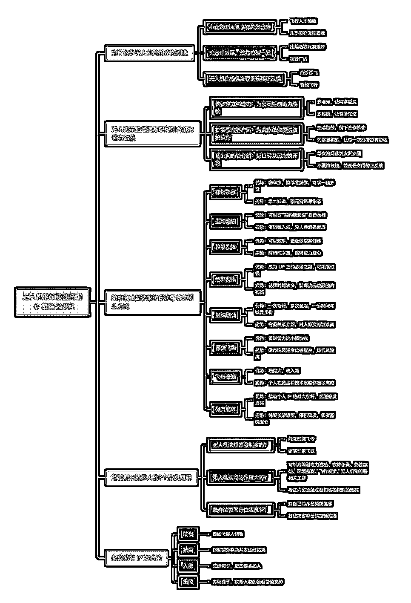

 

 

评论区：

闫小林 : 浩哥厉害，

这张思维导图好详细哎，感觉可以作为沐文老师讲的内容的一种方式，

黄浩在观察 : 谢谢小林鼓励，做思维导图就是为了节省大家时间可以快速概览内容[呲牙] 炮爷（不睡觉） : 浩哥厉害

突破_Speedy : 信息量好多啊，黄浩威武

松果 : 棒[强]一步一个脚印[强]

小浔溪💛 : 浩哥一直优秀且专业，点赞[强]

哆啦 : 黄浩厉害啊。

F先生 : 看到无人机驾照莫名的心动💓

 

 