# 选品特训 202312

> 来源：[`remhu1p2pr.feishu.cn/docx/HWrudxMMboDVe9xv0CNcGC78nfg`](https://remhu1p2pr.feishu.cn/docx/HWrudxMMboDVe9xv0CNcGC78nfg)

出品时间：2023 年 12 月 28 日

手册使用说明：本文旨在向你展示一个项目的更多可能性，帮助你更好地理解和实操。

建议：如果需要快速定位到精确内容，可以使用快捷键 Ctrl + F/command + F 的形式，搜索「关键字/词」，查找你想要的内容。

写在前面

💡

Hi,欢迎大家来到 12 月航海｜选品特训｜实战手册，相信在接下来的日子里，我们将在这里见面很多次。

有一句话叫选品定生死。无论是在抖音、小红书、视频号等内容平台，还是在淘宝、闲鱼等货架电商平台，选品的重要性相信不用再多说。

我们希望自己的电商项目是稳定发展的，希望自己售卖的产品可以总是爆单，那么选品能力的锻炼必不可少。

所以这次航海，我们围绕「选品」本身开展特训。手册将会向大家展示电商领域里通用的「选品方法论」，并且提供不同主流平台的具体选品方法作为补充，帮助大家提升选品能力。

需要注意的是：

本次「选品特训」的核心目的，是希望大家学会选品后，能够应用于自己的实际业务当中，或者希望这项技能，能给大家增加更多展开新项目的信心；本次「选品特训」结合了大量的选品案例，但因为平台发展及趋势变化，案例是有一定的时效性的，案例中的数据有可能已经不适用现在情况，大家着重了解选品思路，具体的数据判断需要结合当下情况调整；

除了上述内容外，还有个核心就是尝试多选品，多测品，多提问，多交流，在这里没办法满足你的地方，多问问，我们会一起找到关于难题更多的解法。

希望大家可以在这次航行里收获成果外，结识一群战友。

以下内容由生财有术联合圈友制作而成，仅供航海船员以及生财有术星球圈友学习使用。

同时也欢迎圈友们在实践过程中持续反馈，和我们共同完善，可以联系鱼丸（yuwan387）提供修改建议～

【更新提示】新手册使用方式在开始前，我们来简单了解一下这个手册的正确打开方式，方便你根据自己的情况来灵活使用。

在这里，手册整体的步骤顺序是按照从 0 - 1 完成一次选品进行的，你可以参考航线图，按顺序开始实操。也可以根据自己的实际需求选择性阅读。

需要注意的是：本次手册相较于过往航海，进行了较大的改版。之前的手册尽可能的展示更多可能的玩法供大家自由选择，本次改版后的手册，分为必修和选修两个大的章节：

必修篇内容：为该项目从 0 到 1 跑通一次选品的所有步骤，即航线图对应行动路径。如果你还在前期摸索中，想先完成一次整体的流程，那么建议从必修篇开始认真阅读和实操，不在玩法选择上做过多的纠结。

选修篇内容：则为该项目的更多玩法、案例和项目放大等相关内容。如果你已经初步掌握了选品方法，想进一步了解更多可能，获得灵感，那么选修篇一定不要错过。

📌

如果你对选品完全不理解：

建议在正式实操前，先初步了解下选品的重要性和基本准则👇

✅一、选品基础概述接着逐步明确自己做项目的阶段和目标用户画像：

✅二、第一步：选品前明确自己所处阶段✅三、第二步：分析带货平台

✅四、第三步：定位目标人群

📌

如果你对选品整体已有大致的了解：请掌握几个在所有平台中都可以使用的选品方法论，建立选品手感，这个阶段你可以从手册的第五章开始阅读👇

✅五、第四步：选品接下来根据你所做的电商项目平台，选择该平台的内容，掌握对应选品方法👇

✅六、兴趣电商 - 抖音平台✅七、兴趣电商 - 小红书平台

✅八、兴趣电商 - 视频号平台

这三个平台也有商家入驻开店的模式，这个模式下会更偏向于货架电商的选品方式。

📌

如果你想了解测品、更多平台的选品方法和案例，扩充更多的思路：

可以阅读以下章节进行扩展👇✅九、选品后如何测品

其他平台的选品方法：

✅十、社交电商 - 快团团平台

✅十一、兴趣电商 - TikTok 平台✅十二、货架电商 - 淘宝平台

✅十三、货架电商 - 闲鱼平台

✅十四、货架电商 - 亚马逊平台

✅十五、其他选品方法✅十二、货架电商 - 淘宝平台✅十三、货架电商 - 闲鱼平台✅十四、货架电商 - 亚马逊平台✅十五、其他选品方法航线图和手册是高度关联的，因此你可以根据自己所在的环节，进行相关步骤的学习。

必修：掌握选品技能

💡

章节概要

从这里开始，我们就正式开启选品特训的旅程了。在开始找一个具体的产品之前，我们梳理了本手册的学习路径以及下面这些内容，帮助你减少选品的迷茫感：

如果你是新手，建议在正式实操前，先初步了解下选品基础原则和底层逻辑：

✅ 一、选品基础概述如果你对选品的整体有了大致了解，就可以按照步骤，开始学习实操：

✅ 二、第一步：选品前明确自己所处阶段

✅ 三、第二步：分析带货平台

✅ 四、第三步：定位目标人群

✅ 五、第四步：选品在必修篇，航线图和手册顺序相对应，你可以按照手册的顺序进行学习，即可逐一完成航线图的每一个任务。

在后续的每个关键步骤的章节概要中，我们也将提到相关航线图，提醒你完成相关步骤。

接下来就正式开始吧！

# 一、选品基础概述

💡

章节概要选品的方法千千万，但遵循的原则和逻辑其实是相通的，因此在一开始，我们就来讲讲这几个内容：

选品的三大核心原则：

✅ 第一原则：市场和需求的明确性✅ 第二原则：渠道和能力的匹配度

✅ 第三原则：采购与供应的把控力

另外，在抖音、小红书、视频号这类内容影响转化的兴趣电商中，还有一个原则是：先有内容再有选品。

选品的人、货、场三要素：

✅人，一般就是有消费能力的人，即消费者/用户；

✅货，则是流通中的商品；

✅场，一般是指进行交易的场景。

希望你带着这些原则往下看更具体的选品方法，相信会有更深的理解。

💡

本章航线图

完成第一章的学习和实操，即可完成航线图的第一阶段：知己知彼，了解自己所处阶段和目标人群（约 3 天）

1.

熟悉选品基本准则，建立好基础（约 1 小时）

## 1.1 选品能力的重要性 @丹牛

假如我们不知道自己为什么成功，这样的成功无法复制；假如我们不知道自己为什么失败，这样的失败毫无意义。

这句话在选品领域体现得尤其淋漓尽致。

许多人所谓的选品思路是怎么样的？

看到隔壁老王做防疫用品赚钱了，于是觉得自己也必须做这个产品，不能错过这个赚钱的风口；逛展会或者看网店或者刷短视频的时候，觉得某某网红产品真的太有意思了，自己非常感兴趣，必须做这个产品；亲戚家王叔开了一家工厂做某某产品，邀请自己做外贸部的负责人，心里想自家亲戚的厂子那肯定靠谱，必须开干；能成功吗？当然能，但基本上也只能够依赖运气罢了。

但我们想要的是，看到一个产品，就能够更准确的判断自己是否可以做，能否帮助自己赚到钱。理想状态下，我们希望自己选中一个产品，就卖爆一个产品，而不是只能跟着其他人身后喝汤。因此，选品能力的训练必不可少。

内容来源：《选品的三大核心原则》

## 1.2 选品基本准则

### 1.2.1 选品的三大核心原则 @丹牛

科学选品的三大原则：第一原则：市场和需求的明确性。

第二原则：渠道和能力的匹配度。

第三原则：采购和供应的把控力。

#### 1.2.1.1 第一原则：市场和需求的明确性

什么是市场和需求的明确性呢？简单来说就是一句话：从市场出发，而非从产品出发。

所谓“从产品出发”，譬如我先确定了自己要做某某产品，然后再想方设法地去提炼自家产品的卖点，寻找对应的目标客户；

而“从市场出发”，则是先不管我到底要做什么产品，先圈定我的目标客户群体，研究他们的需求和痛点，最后再看我们到底要寻找或者选择什么样的产品来解决他们的需求和痛点。

真正意义上的“产品”应该是能够满足市场需求的任何有形物品和无形服务，应该是解决某个问题、满足某种需求以及创造某种价值的方案的载体。

一部电视机固然是产品；

一套手机软件当然也是；一套家居设计方案也未必不能称之为产品。

更关键的是，销售产品的组织和个人为其所附加的所有服务，也是属于产品的一部分。

假如不懂得产品的真正概念，就很容易发生两个致命的错误：1\. 将“产品”和“需求”割裂开来，产品设计和开发变成为工程师纯粹的实验室工作，销售人员也看不到客户购买的其实并不是产品本身，而是解决对方实际问题的方案。

真正意义上的“产品”有着 5 个层次的概念，分别是：核心产品、形式产品、期望产品、延伸产品、潜在产品。

这也意味着在创业的过程当中，有 5 个问题是我们无时无刻都必须去思考的：产品的核心效用是什么？

核心效用的载体是什么？

客户和用户期望获得什么？

客户和用户最终获得的是什么？

客户和用户未来还能获得什么？

到底什么是核心效用，以及核心效用的载体呢？还是借用“客户需要的不是钻头，而是墙上的洞”这句话，“洞”就是产品的核心效用，而“钻头”则是核心效用的载体。

这就意味着，表面上我们的产品的是“钻头”，但实际上我们更加应该着眼的是“洞”，是如何更快更好更便宜地帮助客户把“洞”给实现出来。

归根结底在选品的领域，到底什么是真正的差异化？

其实真的不是别人是黄色我们是红色，别人是方形我们是圆形，别人是第一代的技术而我们是第二代的技术，这些产品层面的差异化其实意义并不大，真正的差异化是我们的产品到底满足了市场上哪些别人尚未满足，或者即使能够满足但是还不够好的差异化的需求。

不在空白处找市场，而在市场中找空白，这就是我们的选品第一原则：市场和需求的明确性。

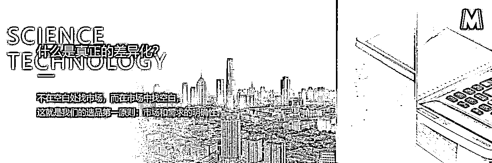

但是，确定了市场、客户和需求之后，就足够了吗？答案是否定的，我们还需要考虑选品的第二原则：渠道和能力的匹配度。

#### 1.2.1.2 第二原则：渠道和能力的匹配度

不知道大家还记不记得 2020 年初的时候，当时几乎在每一个群里，我们都能够时不时地看到类似这样的信息：“口罩实单 150 万个，请有货源的小伙伴联系”。

“口罩现货，库存充足，证书齐全，可开发票，款到即发”。

但所有的这些询盘我们都没有接，原因很简单，我们之前从来没有从事过这类防疫用品，渠道和能力根本就不匹配。

你可能会觉得很奇怪，市场那么明确，需求那么强烈，还考虑什么渠道和能力不匹配的事情，干就是了。

但事实上可能有两个大家容易忽视的误区：1\. 市场的需求真的强烈到我们感知到的那种程度吗？

在供应链管理的专业领域有一个名词叫“牛鞭效应”，指的是信息从市场端流向供应端的时候，会有异常的逐级放大的现象，就如同我们手拿牛鞭只需要轻轻一甩，末梢就会有一个很大的鞭花产生。

举个简单的例子：当市场上的 A 终端客户向 B 进口商询价 100 个口罩的时候，B 进口商会向三家中国供应商分别发询盘，而这三家供应商又会分别向他们的三家上游供应商询价......结果本来只有 100 个口罩的商机，到达供应端的时候却会膨胀为 900 个，造成一种到处都有人在找口罩的错觉。

而假如身处供应链上游的我们因为这种所谓的“需求”而去投资口罩设备的话，结果可想而知。

究其原因，就是我们的渠道距离终端市场实在太遥远了。

婚纱、假发、平衡车、无人机、指尖陀螺、跨境电商、防疫用品......假如每发现一个“风口”我都去追，而不管自身的渠道和能力是否匹配的话，结果会怎样？

结果只会是一个字，“飘”，然后根本就没有办法沉淀属于自己的核心竞争力。

那么到底什么是核心竞争力？

根据菲利普。科特勒的阐述：（1）我的工作是否能够让客户感知到具体的价值？

（2）我的优势是不是竞争对手难以模仿和抄袭的？

（3）我的能力和资源是否能够复制到其他的领域？

我在还没开始创业时，每天都会有各种各样的创业想法在我的脑海里出现，我渴望跟人讨论，但是又害怕跟人讨论，实在不得不跟人谈起的时候，我都恨不得跟对方签一份保密协议，因为我担心消息走漏之后，我的“绝妙想法”会被人偷走。假如一项工作别人也能够轻易地做到，这也是核心竞争力的缺失。

假如我一开始从事的是蓝牙耳机的外贸工作，后来由于种种原因做不下去了，于是我跑到亲戚家的机械工厂做内销工作，过往的客户资源完全用不上，过往积攒的销售能力也暂时带不到国内市场，这个也是核心竞争力的缺失。

真正的核心竞争力，一定是每当我们想要跨领域发展时，譬如之前选择 A 产品，然后选择 B 产品，之后再选择 C 产品时，能够实现复制的。

当我们真的想要从事某项长线业务，而不仅仅只是打一场闪电战时，就一定要确保自己有“根”的存在，这个根，就叫做核心竞争力。

#### 1.2.1.3 第三原则：采购与供应的把控力

我之前经常说一句话：所有的竞争，本质上都是供应链的竞争。

到底什么是供应链？简单来说，就是提供客户价值的链条，譬如你想喝苹果汁，于是我去果园买了一个苹果，又跑到榨汁工厂将这个苹果榨成了汁，又买了一个瓶子装苹果汁，最后让顺丰帮我把这瓶苹果汁寄给你，这一整个链条就叫做供应链。

而在供应链当中，永远都有着三种要素的流动，分别是：信息流、资金流和产品流。

什么是信息流呢？你告诉我想喝苹果汁，我告诉果园我需要苹果，我告诉榨汁厂我需要榨汁，我告诉顺丰需要快递一样东西，顺丰贴在包裹上的快递单……等，这些都是信息的流动。

什么是资金流呢？我将款项支付给果园、榨汁工厂、瓶子商家、顺丰快递等商家，这个动作就是资金流。

什么是产品流呢？苹果从果园到我手上的流动，从我手上到榨汁工厂的流动，苹果汁通过顺丰到你手上的流动..….等，所有涉及到实际物品的都是产品流。

所谓供应链管理，其实就是对信息流、资金流和产品流进行管理，通过对它们的优化调整甚至重新设计，以达到最大化客户价值，最小化链条总成本，最快速进行产品交付的目的。

譬如当你第二次还想喝苹果汁时，我寻思着跑去果园买苹果再把苹果送去榨汁厂效率太低了，就问果园能不能直接把苹果送去榨汁厂，榨汁厂再直接装瓶了帮我寄出去；

譬如你第三次还想喝苹果汁时，我就问你是不是以后每天都想喝，假如是的话，我一次性去果园订几百个苹果，这样可以产生规模效应，降低总成本。

譬如你希望每次一想喝苹果汁的时候马上就能拿到手，于是我在你家附近租了一个小仓库，每次一想喝的时候你就打个电话，仓库人员只需要 5 分钟就能够将苹果汁送到你的手上。

譬如你喝了几次之后觉得这瓶果汁真的很好喝，于是将我推荐给了很多朋友。订单一多，榨汁工厂开始忙不过来，于是我索性自己建了一个榨汁工厂，以确保生产效率。

为什么说所有的竞争，本质上都是供应链的竞争呢？

想象一下，假设在我们的面前有两瓶瓶果汁，一瓶我自己跑去果园摘了之后再拿家用榨汁机加工出来的，一瓶是在工业流水线上批量生产出来的，尽管它们在外观上一摸一样，但是在产品的品质稳定性和价格竞争力有可能一样吗？

答案不言而喻，而原因就是它们背后的供应链不一样。

表面上我们选的某一个产品，但实际上我们选的是产品所代表着的供应链。所以我们在选品的时候，必须清楚这个产品到底是怎么生产出来的，以及假如当前的生产路径并不是最理想的，我们是否有能力通过供应链的管理或者重新设计去优化它。

🎯总而言之，所谓选品其实就是一个从目的出发一步步倒推的过程：目标客户/用户是谁？（业务属性，采购倾向，预算能力等）

他们的需求是什么？（有什么问题需要解决？当前有哪些方案？)

有哪些更好解决问题的潜在方案？

方案的载体可以是什么？（也就是产品）

去哪里找到这些载体？

我是否具备将产品推广与销售出去的渠道或者能力？

我是否能够把握了产品的供应商以及背后的完整供应链？

最后，这节分享了选品的三个原则，但并不意味着我们必须完全满足这三个原则才行，但凡三者能够有其二，我觉得就可以干了，毕竟“三分天注定、七分靠打拼”，除了老老实实上班领工资，挣钱本来就是某种层面上的赌博，总想着完全准备妥当之后再开始，最终只会永远都迈不出最关键的第一步。

内容来源：《选品的三大核心原则》

### 1.2.2 人、货、场三要素 @盗坤

电商，其实很简单，核心也就三个字，人、货、场。搞懂这三个字，也就弄懂了电商卖货最核心的逻辑。

人，一般就是有消费能力的人，即消费者/用户；

货，则是流通中的商品；

至于场，在零售领域，一般表现为卖场、门店，或者可以理解为“社交场景”，或者消费者直接采购的“物理空间”等，负责连接人与货。比如商品详情页、直播间、短视频、带货群等等。

世间的一切都在不断变化，包括商业概念。随着商业模式的演变和技术的进步，“人-货-场”的关系也在不断调整和变化。最初，零售更侧重于以商品为中心的交易，但随着市场环境的演变，市场的重心已从商品转移到了场所和消费者，但消费者的基本需求和欲望始终保持不变。

在现代零售环境中，消费模式、场景和商品定位都更加精细：

关于“人”，已从广义的消费者转变为更具目标性的用户；

“货”为了获得消费者的欣赏，正努力满足更多样化的消费需求；

至于“场”，在数字技术如互联网和移动通信的推动下，呈现出更丰富的多维性。

一种思路，从货出发，推出这个货的对应人群，然后围绕这个人群，去找匹配这个人群的场，最后针对这个场来制作适合的卖货场景就好了。举个例子，现在卖的货是 JK 制服，产品的匹配人群是二次元少女，针对这个人群匹配一个具体的场，比如 B 站。最后，在这个场里，设计具体的销售场景，短视频和直播。

这就是一个完整的闭环。针对产品的人群分析的越细越好，再去匹配适合这个人群的场，最后再来制作具体的卖货场景。整个链条是非常清晰的，无非就是细节的揣摩和不断的测试优化调整即可。另一种思路，从场出发，推出这个场的对应人群，然后切一个细分人群，再去围绕这个人群匹配适合的产品，最后针对这个场来制作适合的卖货场景。举例，现在我们的场是小红书，小红书的最大人群是一二线的女青年，针对这个人群我们可以去做一些女装类的产品，最后我们根据小红书这个平台制作相应地图文或者短视频内容来卖货。

和上面是同样的逻辑，也就是出发点的不一样而已。两种思路的本质其实也是一样的，都是在围绕流量来卖货，一个是从货出发，去找对应适合的流量平台。一个是从流量出发，去找对应适合的产品。要想卖好货，就要搞懂人货场这三个字。就好比，你如果卖一个主要针对高级金领的健身卡产品，你原本应该去高级写字楼公寓的电梯打广告，但是你去公租房的电梯打广告，你的效果就不会太好。因为，你没有选对场，就没有做好人货匹配。

如果我们要做视频号带货，就是属于从场出发，先要把视频号的人群推出来，再去推这个人群适合的产品。

如果你搞不懂视频号的人群，就搞不清楚这些人群需要什么产品。没有搞清楚用户需求，就去瞎卖产品，你的结果大概率也就不会太理想。

内容来源：《盗坤：视频号带货的底层逻辑》

### 1.2.3 兴趣电商原则：先有内容再有选品 @张集慧

即为：从内容观察，找到一个有流量的类目。

随着短视频平台的火爆，视频带货，直播带货入场的人越来越多了，什么产品好卖，怎么选品才能爆单？是摆在大家面前的一个核心的问题。

传统电商（淘宝）和兴趣电商（抖音）这两者之间，看似都是卖货，但是已经有了本质上的不同，如果以线下的实体举例子：那么淘宝就是十几年前的纯商业商场，这样的商场，里面只有商品，一楼珠宝、化妆品、名表等等，二楼女装、三楼男装、四楼日用百货、五楼、婴幼儿等等，这样的商场属性很单一，用户来了，就是有明确的购物目的，就像淘宝一样，你打开他就是搜索你想买的东西。

兴趣电商内，就像最近几年流行的商业综合体，用户可能是来看电影、带孩子滑冰、或者去书店看看书、喝杯咖啡，或者尝尝最新开的四川菜等等，总之来这里没有明确的目的，就是消磨时间的，买东西购物，只是顺便的事情，这就像抖音，各种内容都有，你刷着刷着，无意中就下单了。

回到线上，以淘宝为代表的搜索电商，核心是你的产品命中用户搜索的流量；用户搜索的多，供应的产品少，这时候你找到这样的品，那你就选到了优秀的蓝海品。

但是到了抖音，用户刷抖音，第一目的不是来买东西的，是来消遣娱乐的，他的第一需求是内容，并不是产品，所以在这里，第一步先要解决的是内容，你要找到自己擅长表达的内容，搞到流量，然后，考虑这波流量背后的人群，以及产品。

最终，好的产品还是要有优秀的内容拉来流量，搞定转化，所以在兴趣电商时代，内容和产品同样重要，甚至，内容比产品还要重要。

兴趣电商选品的起始、重点都是内容，产品只是内容最好的落脚点。

# 二、第一步：选品前明确自己所处阶段 @盗坤 @张集慧

💡章节概要

我们不能看到别人通过什么品赚钱，就盲目的跟上。实际上，不同的品类，对于做项目的投入要求是不同的。我们需要根据自己所处阶段和预期，来调整选品策略，选择更适合自己的品。

💡本章航线图

完成第二章的学习和实操，即可完成航线图的第一阶段：知己知彼，了解自己所处阶段和目标人群（约 3 天）

分析自己的经验、预期目标，明确自己的阶段（约 1 小时）

选品策略的选择是因人而异的，取决于个人所处的阶段和预期。

比如，我之前在星球分享过的【小红书上卖猫】这个项目。从赚钱的角度讲，这种项目是 OK 的。只要稍微寻找几个合适的、靠谱的供应链，每月赚几万元肯定是没问题的。但如果想扩大业务规模，就会发现一定需要解决供应链的问题，它其实是很难解决的，因为猫其实是一个非标品。

假设一家好的猫舍，每年能提供二三十只猫供你销售，确实能获得不错的利润。但当再去找下一家猫舍时，可能猫的质量就不好了，对于这种项目，不能简单地评价好与坏。

对于像一些已经完成 0-1 阶段的老手，可能更在乎业务的长期可持续性和增长潜力，希望做一些有积累、有壁垒的事，这个时候【小红书上卖猫】这个项目并不是一个好的选择。

但如果你处于创业初期，没有太多的资金，甚至有负债，急需稳定收入。你现在第一步根本就不会考虑什么长期潜力，也不是考虑什么做 B 端还是 C 端。这个时候，更多的是要去下场把这个事给走一遍，能够赚到第一块钱，那这个时候选品就不用考虑那么多了，那这个时候卖猫这个是好事。为什么？因为它一件代发，因为它竞争没那么激烈，因为它高客单价、高毛利，因为它拿流量会直接简单粗暴。

再以我之前的淘宝蓝海项目为例，虽然一度非常成功，但现在对我来说已经不再吸引人，因为天花板太低了，每个产品就是基本上赚个几万块钱就差不多了。如果我去做更多店铺的话，我是做不过来的，因为人的精力是有限的。因此这个项目很难放大，啥壁垒都没有。但是如果对于一些刚刚起步、需要一个月先挣个几万块钱的人来讲，它又是一个好项目。

那对于一些已经创业两三年以上，兜兜转转做过很多项目，也从 0-1 赚过一些钱的人来说，他这个阶段做选品，除了看产品的竞争度以外，更要考虑到这个产品的长期性、积累性。

就比如我现在做的护肤、做茶叶，是因为这类产品复购能力强。只要能够把产品做好了，那么一定是每年可以像滚雪球一样滚的越来越好的。

所以说，对于已经有一定积累的人来讲，选品就不会单纯的从就是蓝海角度来考虑了，我可能还要考虑到这个产品的未来的增长性、复购率、供应链解决难度等等。

如果我看到这个产品，哪怕它有点竞争压力，我可以用三个月、甚至半年来慢慢把它磨出来。但是能不能坚持这么长时间，其实跟自己的成就、心态、实力有关系。手里面有那么多资金实力了，才能够更加沉下心来去做这个事儿。如果你真的是有一定资金实力的，你要去考虑这个事儿。

所以说选品，第一个要明确自己创业所处的阶段积累预期。要根据自己的实际情况，综合考虑个人阶段、预期收益和市场潜力。

在做兴趣电商的选品之前，还有一件事情要提前考虑好：想开店还是做达人？

因为抖音之类的兴趣电商，有两个角色可以带货，一个是开店，作为商家来卖货，另一个呢，是作为带货达人，这两者之间的区别还是很大的。

如果以前没有开店的经验，我不建议大家一上来就开店，还是做内容，做一个带货达人比较好，因为在短视频平台带货，很重要的一部分就是他的内容，你的内容做的好，很轻松的通过内容就能赚到不菲的佣金。

# 三、第二步：分析带货平台 @盗坤 @Erik @不语

💡

章节概要

选品要适应不同平台的特性。所以选品不止要分析品，还要分析平台。

通常来说，我们可以通过这几个维度来分析带货平台：

分析平台的内容展示方式：是视频、直播、文字、还是商品详情介绍？

分析平台的用户画像：哪部分用户群体在这个平台上活跃最多，或者是有最多的购买行为？

分析平台商品的展现形式：是主要通过用户搜索展现出来，还是通过主页内容推荐？

分析平台的购物链路：直播下单，短视频挂车下单，还是引导去店铺下单等等，消费者的购买路径是否方便？

接下来就从这几个维度看看不同平台有什么不同。

💡

本章航线图完成第三章的学习和实操，即可完成航线图的第一阶段：知己知彼，了解自己所处阶段和目标人群（约 3 天）

确定所做电商项目的平台，分析平台情况（约 2 天）

接下来请正式开始，跟着步骤分析自己所做电商平台的情况，记得在航海日志中打卡记录进度哦～

在选品的时候，我们先去理解一位用户在所谓的兴趣电商，也就是抖音、视频号、快手这类短视频电商上买东西，和他在货架电商（传统电商），比如说我们拼多多、淘宝、京东这些地方买东西，他的想法和行为有什么区别？

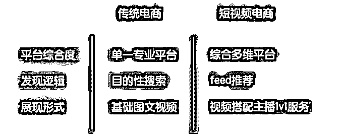

## 3.1 从平台综合度来看

像淘宝、拼多多、京东这类其实是一个单一的专业的平台，虽然有点别的功能，但大家想到淘宝就是购物，而淘宝平台也只能通过我们的购买行为来做推荐，当我有明确的购物需求时，往往最先打开的是这类平台；但是我们会在抖音、视频号等平台上做很多事情，比如看视频、搜索问题、点赞等等，它会根据我们的各方面行为展现出来的兴趣爱好来推荐，不局限于购物需求。

所以我们可以看到，作为抖音、视频号这种平台来讲，他们的优势是：对用户拿捏的精准；劣势是：用户不是真的把它当做一个购物的平台，起码现阶段来说不是，会出现我们在抖音上看了一个东西但是回到淘宝、拼多多上购买。

## 3.2 从发现逻辑上来看

淘宝、拼多多这类是以搜索为主导的电商平台，它们强调关键词搜索。所以当我们在淘宝选品时，应该以关键词为导向思考，因为每个关键词都代表了一个具体的消费需求。

这时的研究重点应该是分析这些关键词，以了解消费者的真实需求。为了更有效地获取和分析关键词数据，可以使用工具如“生意参谋”、“店查查”和“至尊宝”等，帮助你深入洞察市场趋势。

对于抖音、小红书这类以兴趣为驱动的电商平台，其操作逻辑与淘宝有所不同。它们更多是 feed 推荐的形式，即持续更新并呈现给用户内容的信息流来呈现。可能用户一开始没有预期买这个东西，但是刷到了觉得特别有意思，可能就会突然买了，这个需求是被创造出来的，所以我们说兴趣电商是要先去吸引再去下单。

兴趣电商更重视的是内容、素材和互动性。在这种平台上应该考虑如何制作有吸引力的内容和素材，以吸引目标消费者。

以视频号为例，它是一个以视频内容为主的社交电商平台。选择商品时，除了商品本身，你还需要考虑到哪些素材的制作，是自己的资源能够匹配的。

比如我们想销售中老年女装，可能还会考虑在视频号上进行直播，展示商品，并借助平台的免费流量来推广。那么这时候，就要着重考虑是否能够布置出吸引中老年人女性的场景、是否能够匹配到合适的主播等等因素。

总之，无论是搜索驱动的淘宝还是内容驱动的视频号，选择商品时都需要考虑平台的特性和消费者的需求。我们应该根据自己的资源和能力，选择合适的策略和方法，确保商品能够吸引目标消费者，并在平台上取得好的销售业绩。

## 3.3 从展现形式来看

现在淘宝虽然也有直播、视频和图文的模块，但他的内容更多的是商品展示。本质上它还是基于搜索逻辑去考虑的，用户有明确需求了来搜索寻找，它的种草力度其实是不如抖音的。

另外淘宝的直播更多是分配给大的流量主播，而抖音是百花齐放的，而且大家在抖音上花的时间会很多，那么这个时候，我们看一个抖音直播，就相当于给我们配了一个 1V1 的销售，一个好的销售可以说服一些人从没有购买需求到成功购买，这个时候转化率就会非常高。

## 3.4 从平台用户画像来看

进一步讲，即使都是兴趣电商，每个平台也有不同的人群和特性。比如：抖音

在一线和二线城市，抖音受欢迎程度极高。这些城市的居民通常更加关注潮流和娱乐，抖音以其丰富的内容和创新的功能吸引了大量用户。抖音的短视频和直播内容也吸引了众多年轻人和商业品牌。

在三线和四线城市，抖音也很受欢迎，但可能略逊于一线和二线城市。然而，随着智能手机的普及和互联网的发展，抖音在这些地区的用户群也在增长。

视频号

视频号凭借着其庞大的社交生态，在其他短视频领域电商逐渐成熟时杀出重围，快速的成长。而根据 2023 年微信公开课的数据，我们会发现视频号的消费者 60% 是一、二、三线城市，女性为主，且客单价超过 200 元。

随着视频号用户体量的增加，我们也看到视频号不再是中老年人的专属，30 岁以下的年轻消费者正在变多，更丰富的人群正在成为视频号的新增量。

快手

快手在一线和二线城市的受欢迎程度较高，但可能不及抖音。快手以更接地气的内容和对普通用户的吸引力而闻名。

在三线和四线城市，快手非常受欢迎。这些地区的用户通常更喜欢快手上的生活和娱乐内容，因为它们更贴近他们的生活。

小红书

小红书在一线和二线城市非常受欢迎，特别是在女性用户和时尚爱好者中。小红书是一个以生活方式、美容和时尚为主题的社交电商平台，因此在追求时尚和品质生活的一线和二线城市用户中受欢迎。

在三线和四线城市，小红书的受欢迎程度可能较低。然而，随着消费水平的提高和对品质生活的追求，小红书在这些地区的潜力也在增加。

总的来说，抖音在一线和二线城市的受欢迎程度最高，而快手在二线和四线城市非常受欢迎。小红书主要针对对时尚和生活方式感兴趣的用户，因此在一线和二线城市具有较高的受欢迎程度。

因此，我们在定赛道和选品之前，需要认真的分析自己所在平台的特点、人群定位，满足相应人群的需求，才更有可能选到合适的产品。

反过来说，如果我们有自己的特定产品，那么需要认真分析这个产品的特点、人群定位，再去找目标人群较多的平台去运营，才更有可能成功。

内容来源：《我的短视频与直播电商选品经验分享》、《探店 15 天 门店由亏损到日利润 6000+，浅谈 3 年探店心得》

# 四、第三步：定位目标人群 @盗坤

💡

章节概要在第一章我们讲到了人货场三要素要相对应，才更有可能拿到好的结果。那么“人”这个要素就是我们的重点研究对象之一。

我们需要弄清楚这两点，看看人群定位是否重合：

1.清楚自己所做平台的人群定位

2.

清楚自己所做产品的人群定位

然后我们以抖音平台为例，带你了解如何找到自己的目标人群。

💡本章航线图

完成第四章的学习和实操，即可完成航线图的第一阶段：知己知彼，了解自己所处阶段和目标人群（约 3 天）

根据所做方向和赛道，定位目标人群（约 2 天）

完成本章学习，期待你可以完成以下作业并提交到航海日志：

作业：分析 5-10 个对标账号的人群画像（以及可增加其他维度）

接下来请正式开始，跟着步骤找到目标人群并根据分析模板进行记录，记得在航海日志中打卡记录进度哦～分析模板如下：

账号名称

粉丝数量

粉丝性别分布

粉丝年龄分布客单价

视频/直播占比

## 4.1 清楚自己所做平台的人群定位

大家都知道视频号是有免费流量的，且是中老年人群，那我们做视频号带货，一定是冲着中老年人群去的。比如我有个朋友之前是在视频号上做中老人女装的，最开始场观 2000-4000 的样子，突然一下就涨到一两万，甚至几万，到最高七万，都是免费流量。

为什么有这么大的流量爆发？

他找了一个 50 岁的阿姨，这个阿姨长的端庄秀丽亲切大方，这位阿姨往那一站，一句话都不用说，穿着要展示的衣服，流量就蹭蹭往上涨。

一个好的店做服装需要好的款式，还需要一个好的衣架子来展示。衣架子就是这个模特本身，所以你身边如果有这个资源可匹配，那么就可以考虑做这个事儿，而不是单纯的想做什么类目就做什么类目。

但如果把上面这个项目放到小红书平台，就又不适用了。

小红书的主要用户群是 18-23 岁的年轻人，因此产品应具有高逼格、高颜值的特点，来吸引这部分用户。

## 4.2 清楚自己所做产品的人群定位

之前看到过有一个直播间是卖农作物的种子、养殖饲料等产品的，只用免费流量就能转化赚钱，目标人群是搞种植业的农民，可以看的出来这是个蓝海赛道。

这类账号内容创作能力不强，主播的直播技巧也不够，甚至在直播间说的是方言，但是主播有非常丰富的销售这类产品的经验，他可以回答直播间的各种问题，比如“猪经常出 XX 问题，应该吃哪种饲料？”、“哪个农作物适合现在种植，怎么种？”等等。即使我们乍一看觉得主播很差，但其实他是满足了目标人群的需求的。

假如我们找其他领域直播效果很好的主播，也是不能自如的应对直播间里提出的问题的，即使有再好的直播间技巧，也很有可能做不起来。但如果我们有资源可以像这个直播间一样，找到有丰富经验的主播，那么这也是一个很好的蓝海赛道。

所以在确定一个品时，我们需要清楚：这个产品的人群定位和特点是怎么样的？自己是否有资源可以满足目标人群的需求？或者说有没有资源可以模仿出对标账号的模式？

反过来想，如果我们有明确的目标人群定位，那么我们在选品的时候，就可以找这群人需要的产品，而不是看到一个很厉害的品就上架。

## 4.3 如何找到自己的目标人群 @文林 @唐明杰

选品的第一步是选人，先选你的品对应的目标人群。

以抖音为例，如何挑选适合自己，又适合在抖音上卖货出单的目标人群呢？我有 3 个经验，分享给大家。

经验 1：从自己的爱好出发，由单一个体投射出目标人群，然后做减法

比如我，有个爱好是喜欢绿植，爱养花养草，后面验证这个人群出单还不错。

那我是怎么选到这个人群的。我还原一下这个过程。

书和美食这两个类目，市场需求大，但市场的竞争也比较大，很多做书单的，也很多做美食，内容生产也相对很成熟。

这个时候，我一个刚入行的新手，估计很难在短视频打的过这些竞争对手，所以书和美食，就被我排除了。

剩下乒乓和绿植，乒乓的需求挺大的，但我查了一下在抖音上，做的号的乒乓账号变现方式都是广告为主，然后做乒乓带货很少，哪怕有带货的，但他们的带货账号销量很低的。

头部乒乓产品都是月销售额才几千元，头部乒乓带货变现的都这么少，那么对于新入局的新手来讲，那么就更难赚到钱了，所以乒乓因为天花板太低，就被我排除了。

发现大盘数据还不错，记得当时 7 月的绿植这个在抖音上销售额大盘就已经达到了 2 亿了！

月销售额 2 个亿的这个蛋糕对于新人，还有初创团队来说算是不错的了，而且当时看到的数据，每月绿植的涨幅还不错，近 3 个月月涨幅在 20%，也就是说绿植这个类目在抖音上是越做越大的。

现在是 2 个亿，以后可能每月 5 个亿了，等我 1 月 28 号查到的数据，绿植类目已经由 2 个亿上升到 3.19 亿了。

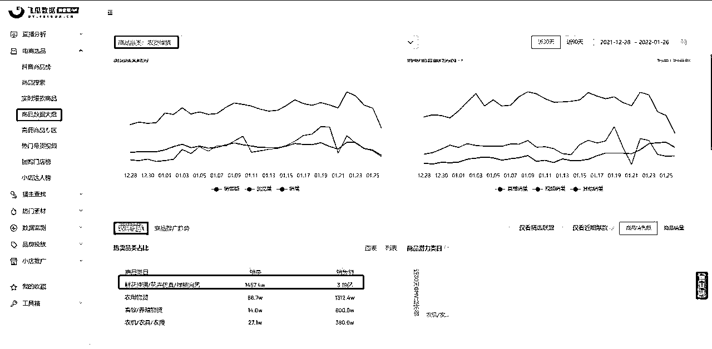

到这里，我就敲定下来目标客群：18-35 岁，喜欢养花养草养绿植的人群。

这里总结一下：

从自己的爱好入手最大的好处：自己本身就是这个人群之一，了解这个人群的需求和痛点，那么上手会更加容易，也能更加能够把握到用户需求，选品和制作内容的成功概率更高。

同时因为做的是自己喜欢的，那么这个过程也更加开心，更加享受，做的不累，而且做的过程很开心。

当然这里有个要避免的坑，一定要注意，就是选择的这个人群不能太小众。

如果这个人群太小众，每个月整个抖音大盘的销售额还不到 1000 万，建议不要碰这类目，天花板低很难赚到大钱，关键还很难得到正反馈，没有及时得到正反馈，最后就容易放弃！

经验二：从自己的熟悉的人群、擅长的人群出发

有些朋友自己不是宝妈，但在母婴行业做了很久，很熟悉宝妈这群人的需求和痛点，那么也可从这个入手。

因为熟悉和擅长的人群，自己在选品时，能够更好的把握这些人的需求，选到合适的品，这样成功率也会更高。

所以想想自己熟悉哪块，擅长哪块，然后由这块去找到自己熟悉和擅长的人群着手。

经验三：蓝海人群

如果上面两种方法，都没找到适合自己的人群怎么办？那么最后一种方法，就是选蓝海人群。

什么是蓝海人群，也就是竞争对手很少的人群。

比如女性中老年人群、超肥胖女性人群、汽车维修师傅、电工电焊人群、装修工人人群，园林人群、农业种植人群等等。

这种人群竞争少，竞争对手生产的视频也很粗糙。那么对咱们来说，就是如果你做的好，就是一种降维打击，成功概率也大。

像我之前选的人群--装修师傅，当时选了一个吊顶打钉神器，这个品 7 天卖了 42 万，利润率 20% 多。

这里有个注意的点是：不要为了蓝海而蓝海，有些人群特别蓝海的话，就千万不要碰。

因为抖音跟淘宝不一样，淘宝上用户购买商品时是用户先搜索，然后再买。

而抖音是逛街式消费，没有带着目的的，用户们是刷刷视频刷到才买的，而视频是来自抖音算法推荐的，用户每天刷视频的时间是有限的。

有限的时间内，抖音相对来说还是会给受众广的视频流量更多。

那么我们应该找什么样的领域作为我们去深耕的蓝海呢？这里建议：最好是这个人群在抖音对应的品月销售额 5000 万以上

哪怕再蓝海也不能低于 1000 万的月销售额标准，要不然会很难做起来。

# 五、第四步：选品

💡

章节概要看了星球里多个平台的电商项目的选品经验分享后，发现其实有一些通用的选品方法论是各个平台都受用的，当理解了这些选品思路后，及时后续有新的平台出现，我们也能及时的跟上，尽快定位到适合的产品。

因此在这个章节中，我们也整理了一些通用的选品方法：蓝海选品、跟品、周期性选品、用户需求选品、趋势选品。无论哪个平台上做电商生意，这几种选品方法的思路都可以根据具体平台灵活运用。

如果你有其他的通用的选品方法，欢迎在航海中分享和讨论～

💡

本章航线图完成第五章的学习和实操，即可完成航线图的第二阶段：掌握通用的选品方法论，初步建立感知（约 4 天）

掌握蓝海选品方法论并进行学习复盘（约 1 天）

掌握爆品选品方法论并进行学习复盘（约 1 天）

3.掌握周期性选品方法论并进行学习复盘（约 1 天）

掌握趋势选品方法论并进行学习复盘（约 1 天）

接下来请正式开始掌握这些方法论，记得在航海日志中打卡记录进度哦～

## 5.1 先定类目再选品 @文林 @唐明杰

目标人群定下来后，接下来会遇到一个问题，就是目标人群需求挺多的，吃喝玩乐都有，那么接下来最关键的是选择类目，先定类目再选品。

选择大于努力，特别在抖音选品里面，有时一个选择就决定了你一年赚几千万还是一年赚几千。这个是我踩了损失百万的坑，得到的经验。

还是以抖音平台为例，最开始做抖音时，我当时想的是选择一个小众的蓝海类目来做，特别小众的一个类目，结果做了两个月发现，身边朋友选其他类目时，有的才做两个月就已经月赚 10 万，而我还没破万，最关键的是的时间也浪费了前期最红利的 2 个月。

那怎么确定类目呢？具体的步骤参考以下：1\. 根据抖音大盘数据选一级类目

步入正题：当我们选择类目的时候，千万不要脑瓜子一拍就去做选择，我们一定要有数据作为我们的决策支撑。

最起码要了解抖音上到底总共多少个类目，各自目前类目在抖音上的销售额怎样？前景怎样？这些数据是可以通过飞瓜数据查到的。

等下后面我放下我给大家我通过飞瓜数据查到的抖音 9 月一级类目的月销额数据。

先看大盘，再选一级类目，大盘的天花板就决定了赚钱的天花板。

比如，电子元器件一个月在抖音整个市场月销售额才 53 万，那么再怎么厉害，也很难用一己之力把这个品带到千万销售额。

这里建议选的品类在抖音上最好是月销售额 5000 万以上的类目，相对来说这些品类已经验证，成功概率高，更适合新手。

二级和三级类目太多，我这个举个服装的例子给大家做个参考。

一级类目【服饰内衣】细分——二级类目【女装】再细分——三级类目【中老年女装】、【大码女装】。而【大码女装】月销售 3.85 亿、【中老年女装】月销售 3.23 亿，这两个类目竞争对手比年轻女装弱很多，但市场比农资绿植还大！

竞争小，市场大，所以其实这个类目的机会就很大，而来自一些同行朋友的信息，也确实验证了了这点。

## 5.2 通用选品方法论

### 5.2.1 蓝海选品

#### 5.2.1.1 蓝海选品的思路 @刘小排

一句话说明：我们需要找到“求大于供”的市场机会，即为蓝海，其中优先建议做高客单、高利润的蓝海产品。

查理芒格说了，钓鱼有两个原则。 原则一：学会在鱼多的地方； 原则二：不要忘记第一个原则。

在这个领域内，有没有人小米加步枪、产品特别简单、营销特别简单，竟然能够赚到钱的？如果有，那么，它就是蓝海。

亦仁曾经提出过：要做一个项目，需要拆解出最小闭环：流量 - 产品 - 变现。

结合上面的故事，我们可以将寻找蓝海机会的方法进行简化：蓝海三部曲 = 有稳定流量 + 产品很差 + 能稳定变现。

有稳定流量

我们经常能够看到一些所谓“现象级”的小爆款。例如 2022 年 1 月，有一个生财有术日历相关的视频爆发了：

它有流量吗？有，抖音总榜第一，有接近 1000 万点赞。

它的流量稳定吗？不，并不稳定。这其实是一个偶然事件。如果你选择去复制它，更大的概率是颗粒无收。 别说你了，就连原

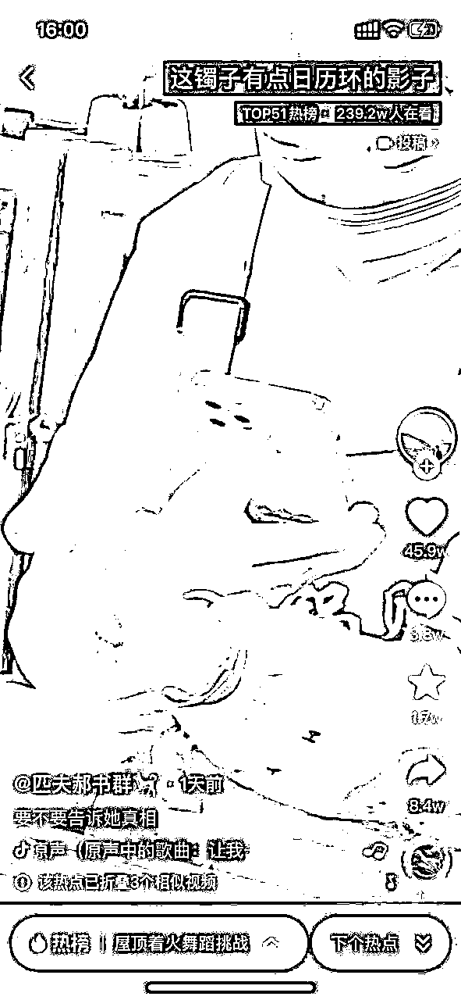

那么，怎样才算稳定的流量呢？就是你任何时候去看它，它表露出都是不温不火的样子。

直播间永远有人在线、也许不多，二三十人，但是任何时候去看，都是二三十人。

网站流量不高，每天 2000 访客，但每一天都是 2000 访客。甚至，还有持续增长的趋势。

……

这才是我们应该去追求的“稳定流量”。

怎么找稳定流量？

很简单，看到“现象级”爆款的时候，别太激动，你得去看看作者过往的其他作品。如果作者其他作品都不行，只有这一条爆了，就暂时可以忽略它；

直到你看到同一个作者连续输出多个有流量的作品，或者在较长时间内一直有稳定的“30 天销售额”，那才可以记录下来。

产品很差

有两点需要强调。

一些同学误以为，“货”，就是产品；电商人讲“选品”，选出来的，就是“产品”。

这么说倒是没错，问题是语境不同。

在这里语境中，我们讲的“产品”，特指“一个特定的解决方案”。

以“在抖音直播里带货”为例，特定问题 = 把某个货通过直播的形式卖出去

产品 = 解决方案 = 积累精准粉丝数量、提升用户种草欲望、提升直播间转化率的工作

产品很差 = 精准粉丝不多、直播质量差、短视频质量差蓝海机会 = 某个品类的货，某个主播，精准粉丝很少、直播质量差，但他竟然有可观的稳定变现

2\. 产品很差，操作要点是“它比你能力范围能做到的更差”。

“差”是一个相对概念，只能在比较中进行。跟谁比？跟你比就可以，因为是你在寻找蓝海，主角是你。

就像是本节课开篇讲的“哈尔滨程序员”的例子。他做出的产品，跟其他普通的兼职程序员相比，那是非常非常好的；只不过是在正规军软件公司看来，毕竟是业余产品，比较差。

这是一个反直觉的事情。

常规情况下，我们都讲求“见贤思齐”，我们需要刻意去看别人更好的作品，作用是学习。学习了更多的好东西，我们才知道自己有哪些不足，才能进步。

然而，在我们找蓝海的时候，要反过来操作。凡是看到超过我们能力范围的作品，我们需要立刻跳过他。他做得好，那是他的事，你又做不过他，看他干嘛？蓝海肯定不在这里。

能稳定变现流量是流量，变现是变现，它们俩常常并不是一回事儿。此处需要大家切记的是两条：

比如这个：抖音直播刷抖音直播。（没写错，这不是病句）。

但是它的变现效率非常低，没有直观的变现渠道。这就不符合“能稳定变现”的原则。

因此，我们一定要按照 2021 年抖音大航海的思路，反复提醒自己：不管做什么事，在做之前，就想好自己的变现方式。 宁要能变现的 1000 粉，不要不能变现的 100 万粉。

正面案例就是著名的董十一。他抖音才十几万粉丝吧，每周变现 100 万人民币左右。这才是值得我们去研究和学习的。

虽然我们没有必要每个人都立志要做长期主义者，但也不能太短期了吧。试想，如果你做的每个项目，周期都只有一个月的时间，下个月又要重新开始；而下个月的项目在哪里呢？还不知道，因为下个月你不一定能抓到同样的短期项目机会。饱一顿饥一顿，没什么意思。

遇到这样的项目，如果你突然有点闲暇时间，短期做一做，那没问题，值得鼓励。 但是如果你的目标是把自己未来半年、一年押上去，那就没必要，直接忽略它就好。

怎么才叫“能稳定变现”呢？

和上面讲的“流量”环节类似，你任何时候去看他，他都是不温不火的样子淘宝店每天都有单，也许不多，一百单，但他每天都是一百单。

CPS 每天都有单，粉丝也就两万，但是每天能净利润三四百元抖音探店号，视频只有一两千赞，视频带有一点商家的广告或者小黄车。看上去不多，但是他每天都发、每条视频都是这样的数据。再加上他的粉丝可以一直涨，那这就很恐怖了……

……

内容来源：《蓝海项目挖掘｜小航海学习手册》

#### 5.2.1.2 怎么找到这样的蓝海品 @古辛 @文林 @唐明杰

所有的平台都可以用蓝海选品的方法。

而怎么快速找到具备上述条件的选品，有两种方法：

小众需求可以分为小众的产品需求和小众的品牌需求，小众的产品需求是指对这类产品有需求的用户，相对较少，比如 50 码的鞋子；小众的品牌需求，是指有一小部分用户，对一些小的品牌的比较认可，比如是一些微商品牌，是不做淘宝的，那我们就可以在淘宝上截流。

大众产品里的小众品牌，大家可以用一些大众需求的词，在对应平台和第三方工具里搜索，就可以找到许多小众品牌的产品，然后去分析这些产品可不可以做。

下面以抖音平台为例，分享下怎么结合使用这两个方法找到蓝海类目的经验。

最后也准备了几个我觉得机会比较大，竞争力度也没那么大的类目合集。

经验一：选红海类目里面的蓝海子类目

比如女装是红海竞争激烈很大，那么选择女装中的蓝海子类目——【中老年女装】、【大码女装】。

中老年女装一个月在抖音上也能卖出 3 个多亿，而且退货率才百分之十几。

而年轻的女装，在抖音上一个月 100 多个亿，但退货率 50%，竞争的激烈度也比中老年高 100 倍。

经验二：避开高竞争环境，找市场里的蓝海类目

怎么判断这个品是否是蓝海，竞争对手多少和强弱呢？

有一个简单的方法，你去竞争对手的视频和直播间，看对手的视频精致还是粗糙，那种制作很粗糙的那种竞争少，大概率是蓝海类目蓝海产品。

比如卖服装，有个直播间直接上雪山直播卖羽绒服，你看这个多卷。

而中老年女装竞争则是这样的

蓝海类目推荐（抖音可以做的类目很多，这里只是简单展示部分）

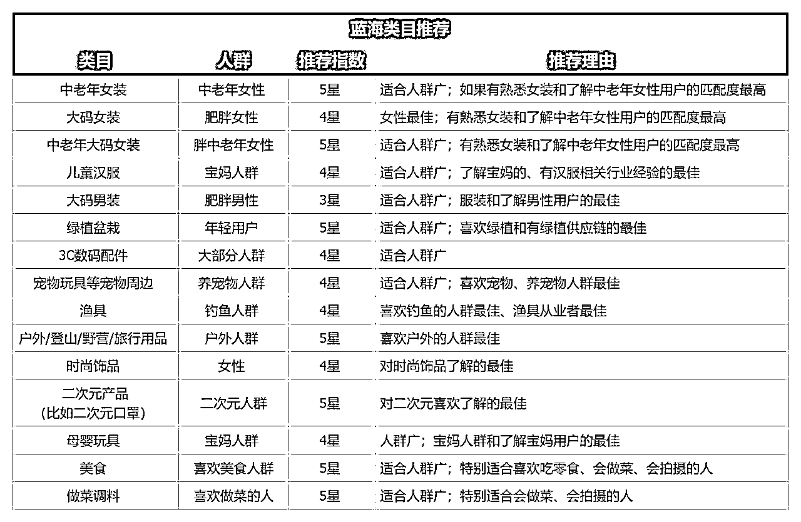

内容来源：《淘宝蓝海 选品 淘宝蓝海选品方法集合》

#### 5.2.1.3 蓝海选品的好处和误区 @陈陈

蓝海的产品如果只从销量来看，肯定是比不过红海的，但是蓝海有几点我认为的好处：1\. 竞争小，前期花费不了太多费用，就能获得一定的结果呈现。比如卖毛巾和美容院专用毛巾的竞争就不在一个量级，在领域上更细分一些。

所有的好处总结起来就是：适合普通人。

不过，新手做蓝海选品也可能容易有这两个误区：1\. 忽略需求

不管是只能想到常见商品，忽略竞争大的新手，还是过度相信自己选品就是足够蓝海，这都不是一件很好的事情。蓝海不等于冷门，需求和竞争都是我们需要考虑的事情。

判断有没有需求可以通过观察同行的数据来进行，举个例子，理发店毛巾这个产品大部分淘宝月销在 200-1000，就能排在较为靠前的位置，而如果我们更冷门一点，比如原神周边毛巾，虽然竞争只有几十，但是也证明需求是偏低的，如果想靠这个有好点的收益还是比较困难的，那么像这类的产品就不太适合去选。

越庞大的数据翻起来也就越困难，目前市面上的采集软件都只能采集到出单好的维度。市场太大了，我们很难只通过一个大词汇就采集到真正的蓝海类目，要想细分领域还是需要更多的词汇来进行辅助查找。

所以不必太去沉迷于软件的功能，不用选品软件我们也可以挖掘细分需求。

内容来源：《3000 字，更适合新手宝宝的蓝海选品技巧》

### 5.2.2 跟爆品 @悠途 @肖肖

跟品是指，看到其他的商家进行选的品爆单之后，我们也跟着上架同款产品，瓜分流量。当你不知道什么品容易火的时候，“跟品”是最有效的方式。

不过如果是单纯的跟品，同样货源同样佣金同样渠道，大概率我们只能喝到汤，吃不到肉。但对于新手来说，这是短期内获得正反馈的一种方式。

但如果你想要进一步放大，那么跟品的同时，我们就要考虑投入产出比，要考虑如何发挥自己的优势“打败”对标案例了。以【白牌低价彩妆】这个赛道为例，在抖音做的好的有两类，第一类是卖别人的货；第二类是做自己的低价白牌跟品。

第一类：卖别人的货

如果自己是带别人品牌的货，要考虑这个品我们能否有比别人更多的优势，比如有一个商家月 GMV 1000 万+，利润 10% 以内，客单价 9.9 - 19.9 元，卖的别人的品牌。

他有自己的快递站，4 线城市，员工工资 3000 左右，把供应链成本做到极致，同样的品给比同行更高的佣金，硬核碾压那种无货源的同行。碰到同样的货品，无货源的人得需要达人短视频带货或者付费才能抢到一点量。

第二类：做自己的低价白牌跟品

有个商家是做自己品牌的，自己也有淘宝，靠淘宝建立的供应链。他的跟品速度很快，靠供应链的深入获取利润。

如果以前有做自己的品牌，或者有自己的一盘货的老板，是可以占据一定份额的。但需要注意计算自己的能力和优势是否匹配，是否值得深入跟品。

跟品需要注意哪些因素？

跟品的优势和劣势优势：

入局者多，样本数据多，能让人快速成长。

对新手较为友好，如果能够早进场，竞争不大时，热度高时，容易起号。

劣势：

品类有限，跟品这个方法适合自带流量，起号难度低，有“品带人”特性的爆品。

且这类爆品来得快去的也快，任何一个品都有生命周期，在合适的时机进场很重要。

另外，跟品有时可能涉及到模仿或复制他人的商品，这在某些情况下可能会引发版权或知识产权的问题，因此需要注意合法性。

内容来源：《视频号直播单品 30 天 30 万佣金的案例分享》、《聊一聊普通团队做视频号直播的起盘方法论》

### 5.2.3 周期性选品 @李百万 @古辛

周期性产品是指每年某个时间段，某类产品流量非常高，适合销售。周期性产品包括季节性产品和节日性产品。

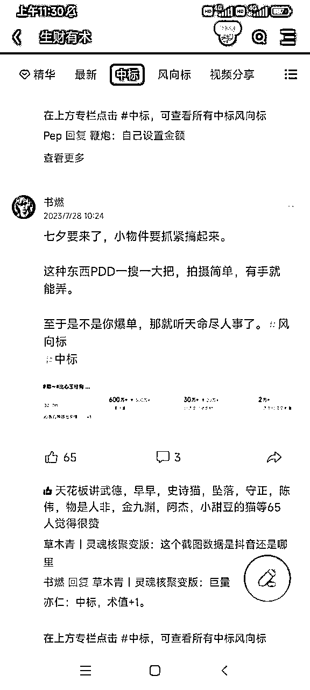

“季节性选品”，通常指的是根据不同的季节或节日选择和推荐的商品。这种方法特别针对那些受到季节影响的产品或服务，比如说在夏天的时候卖比基尼、泳帽和沙滩裤，冬天卖卫衣和圣诞节、春节的产品等。

今年的脐橙这个品，明年一定还可以卖，每个冬季，蜂蜜也依然还可以继续。不同的季节里，一些特定需求永远不会改变，我们只需要去满足人群需求即可。

我们可以通过看一个品每年的销售数据趋势来判断是否可以作为季节性选品。比如比基尼在亚马逊上每年的 6-7 月销量就会达到最高点。那么这就是一个每年 6-7 月都会卖的很好的产品。

另外季节性的产品是短线，因此我们需要注意的是：

内容来源：《电商小白通过生财精华帖＋实操，从 0 到 1，实现视频号单月佣金 12w＋的复盘》、《11 月航海 | 亚马逊入门 |实战手册》

### 5.2.4 用户需求选品 @丹牛 @李百万

我们在前面讲述选品原则时，就有讲到过，真正意义上的“产品”应该是能够满足市场需求的任何有形物品和无形服务，应该是解决某个问题、满足某种需求以及创造某种价值的方案的载体。

所以当我们明确了目标用户的定位时，可以列出这些用户可能会有的需求问题，能解决的问题越大，产品越容易挣到钱，如果再加上一个时间节点将会更加细化，比如：

夏季这些用户会有什么困扰？

事实上，现在已经有许多人都已经懂得了从市场、从需求出发的道理，不管是做客户/用户调查问卷、还是上电商平台看别人的差评，或者使用第三方数据分析的工具。只不过在这个过程当中，他们往往混淆了痛点和痒点这两个概念。

到底什么是痒点？没有办法带来直接利益或者没有办法消除严重影响的，统统都只是痒点。

举个简单的例子：自动跟随拉杆行李箱，这样的行李箱可以自动跟随着主人前进，走累的时候还可以像骑摩托一样，骑在行李箱上面。

假如我们看到机场看到这样的产品，我们会是一个什么样的反应？Wow, Amazing!

但是我们自己会买吗？大概率是不会的，且不说那超出普通行李箱几倍的价格，单纯想象一下在人来人往的公共场所我们真的有可能放任自己的行李箱不在自己的视线范围之内吗？所以我在电商平台看过销量排名第一的自跟随拉杆箱，售价￥2999，交易成功只有 92 单。

它确实有需求，但这种需求不会导致行动，因为它仅仅只是痒点，挠也可以，不挠也可以，尤其是假如解决这种需求需要付出很大代价的时候，大多数人会直接选择不挠，毕竟不挠又不会怀孕。

但痛点不一样，一旦解决了它，要么能够带来最直接的利益，要么可以消除严重的影响，因此它和痒点就有着两个本质上的区别：

而这自然给我们的选品工作明确了一个非常重要的方向：我们的产品到底值多少钱？到底能够定价多少钱？--这完全取决于我们对于痛点的量化。

内容来源：《选品的三大核心原则》、《电商小白通过生财精华帖＋实操，从 0 到 1，实现视频号单月佣金 12w＋的复盘》

### 5.2.5 趋势选品

首先说明，这个方式不太适用于新手，更适合有丰富的选品经验，能够承担一定风险的朋友。

趋势选品是指根据当前市场上的流行趋势或未来的预测趋势来选择商品的策略。这需要对市场有敏锐的观察力和分析能力，以确保捕捉到最新的消费者需求和喜好。

为了成功进行趋势选品，我们需要经常进行市场研究，关注消费者行为和竞争对手的动态。

例如，如果某种新的技术产品或服饰风格开始受到欢迎，我们就可能选择这些产品或风格进货；每年潘通发布年度流行色，那么服装、家居、潮玩等各类商家可以考虑选择和该颜色相关的产品。

趋势选品通常意味着会比大部分同行早入场布局，具有先发优势，更早的占领用户心智。如果趋势研究准确，那么将会有几率做到第一。

但与此同时也有一些劣势：

也可以将趋势选品的方法和蓝海选品、跟品、季节性选品等方法结合起来一起使用，多维度考虑一个产品是否值得选择。

# 六、抖音选品

💡

章节概要这一节中，你将会了解到抖音的平台分析以及主要的选品方法。

抖音本质还是一个内容平台，目前有非常广泛的人群流量，大家在这个平台浏览，搜索，在看视频内容的同时对产品产生兴趣并购买。这个和以搜索为主的货架电商逻辑不同，因此在这个平台上的电商模式，我们称之为“兴趣电商”。

目前抖音电商也有着很完善的体系，有前端视频 / 直播带货，有后端小店供应链，不同的模式有不同的选品方法。

我们整理了这几个选品方式，希望给到你一些思路：✅ 抖音短视频带货选品方法：

有通过对标账号选品、抖音「商品」功能搜索选品、关键词选品、根据精选联盟的产品和店铺来选品、类目选品、第三方抖店工具选品、拼多多榜单选品、根据市场供求关系选品、搜索关键词“求购”挖掘选品

✅ 抖音直播带货选品方法：有垂直类目选品、蓝海单品选品、同行跟品

✅ 抖音小店后端选品方法：

有类目选品、数据选品、产品分类选品、货源平台辅助选品、客单价划分选品、货源 / 地理优势选品另外还梳理了一些抖音电商的选品注意事项帮你避坑。

需要注意的是：选品案例是有一定的时效性的，案例中的数据有可能已经不适用现在情况，大家着重了解选品思路，具体的数据判断需要结合当下情况调整接下来来看看每个选品方法怎么操作吧～

💡

本章航线图

完成第五章的学习和实操，即可完成航线图的第三阶段：为所做项目选至少 3 个品（每天约 2-4 小时）

1.

根据自检表选出至少 1 个符合要求的品（约 1 天）

继续选出至少 1 个符合自检要求的品（约 1 天）

每天持续选至少 1 个符合自检要求的品（每天 2-4 小时）

接下来请正式开始掌握这些方法论，记得在航海日志中打卡记录进度哦～

抖音选品自检表：

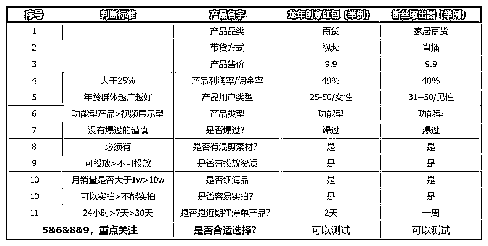

## 6.1 抖音平台分析

平台特点抖音本质还是一个内容平台，通过对用户的观看偏好、兴趣来推荐相对应的内容。而现在的抖音用户打开抖音一般也都是为了看内容，而不是购物。

大部分消费者其实是在看视频内容的同时，发现自己可能对这个产品有需求，对产品有了兴趣并且购买，因此在这个平台上的电商模式，我们称之为“兴趣电商”。这个和以搜索为主的货架电商逻辑不同。

现在抖音已经是当之无愧的变现环境最友好的视频平台，有着非常多的人通过抖音进行消费：衣、食、住、行，基本上全都能在抖音上找到合适的商家提供服务。

目前抖音电商也有着很完善的体系，从边看边买的展示方式，到商品橱窗中展示的商品，再到与抖音小店关联，打通了整个购物生态，让用户能在抖音中畅通无阻地购买商品。此外，直播带货模式的兴起也给抖音电商增加了新的玩法，丰富了用户的购物选择，增加了账号运营者电商活动的可选项。

人群画像

抖音目前的人群比较全面，从一二线到三四线，从中老年到年轻人，基本上都覆盖了。再加上他完善的算法机制，他可以做到内容和人群的精准匹配。

如果和其他内容平台相比，抖音的主体人群比视频号年轻一些，比快手更城市化一些，比小红书性别更平衡，年龄范围更广。

因此无论是做哪类产品的电商生意，都可以在抖音上进行尝试。

电商模式抖音短视频带货：即通过拍摄和产品相关的短视频，并且挂上商品链接，通过短视频内容引导用户下单来赚取佣金。这个适合于所有在抖音上带货的人群。

抖音直播带货：即通过直播进行商品讲解和引导下单，赚取佣金。目前我们可以看到很多品牌会通过直播来促进目标用户购买，有些抖音博主会进行直播带货。以及如果视频爆了大家也可以通过直播的形式来承接流量，提高转化，同时引导账号本身涨粉，形成双向导流。

以上两种模式需要满足实名认证、 1000 粉丝，且发布 10 条以上视频的要求，才可开通带货权限。另外在品类的选择上需要依据自己的目标用户群体特点和需求来选择。

抖音小店（后端商家）：即自己在抖音上开店，这样我们可以发短视频带自己店铺里的产品，也可以努力达到加入精选联盟的标准，让其他达人带货，这个模式更适合有货源的，或者想做偏货架电商的人。这种模式下，比较适合跟爆款选品以及蓝海选品。

部分内容来源：《盗坤：视频号带货的核心在选品》

## 6.2 抖音短视频带货选品方法 @文林 @唐明杰

💡小节概要

对于想在抖音通过短视频带货的圈友来说，抖音现有产品类型已经比较丰富了，如果能够发掘出好的利基市场，找到需求量大、竞争小的产品，将在短视频带货领域中大大提高竞争力，爆单的几率也会高很多。

我们汇总了圈友和过往航海的沉淀内容，整理出了这些选品的方法：

✅对于新手来说，最好的选品方式就是跟卖对标账号的品，比如方法一、二、四、五、六

✅对于有了一定基础的人来说，可以尝试用第三方工具来提高选品效率，比如方法七、八、九

✅对于想要了解选品背后的原理的人，通过挖掘选品背后的需求来学习，比如方法三、方法十除了这些选品方法以外，你还可以通过切入目前抖音上「相对蓝海」的类目，进行差异化竞争，压力小，容易出正反馈。

对于做带货的玩家来说，选品是一个非常长期主义的事，需要不断选品，不断培养、打磨自己对于利基市场的敏锐度，直到找到一个合适的品。

### 6.2.1 抖音视频选品的几个方向

#### 6.2.1.1 新奇特

举个例子，小红是个宝妈，家里的拼图玩具、积木、毛绒玩具等，孩子都玩腻了，这个时候她刷到一个泡泡枪玩具，一个可以像加特林枪那样可以射出来很多泡泡的玩具（如下图）。

这个她从没见过这样，太震惊了，以前自己吹泡泡吹个半天才吹出几个，这个泡泡机能射出很多五颜六色的泡泡，太漂亮了，下单。

这里特别强调一个点，所选的产品一定要是在视频中展示效果特别好的。

如下所示：

还有最近火起来不久的一个家用小型桌球，自己在家也能打桌球。

下班回家别总想着玩手机了。赶紧给家人安排一个这样的桌球吧。挺好玩【点击这里】

#### 6.2.1.2 高颜值

美是天性，而抖音用户是所有短视频用户里面对美的追求是最极致的。所以抖音里面尽量选高颜值的产品。

比如儿童汉服，像下面的儿童汉服，假如我有女儿的话，我都想给她买一套。

#### 6.2.1.3 刚需实用

一定要选用户有需求，且需求大的品，千万不要想当然。

用户有没需求，可以通过查同类商品的销售数据可以看到。

比如我们手机经常遇到一个问题，手机充电太慢，那像超级快充数据线、快充数据头这些对于用户来说就是超级刚需和实用的产品了，参考下图。

### 6.2.2 抖音短视频选品的方法

基于上述的选品逻辑，加上一些选品的方法，小技巧，相信大家都可以试着选出适合自己的品。

下面我给大家讲一讲，在抖音上我们可以通过哪些方法去选品。

#### 6.2.2.1 方法一：通过寻找对标账号的选品

在选品时，有个最重要的一个方法是【对标】，【对标】、【对标】，重要的方法说三遍！

找对标账号有两种方式：

在抖音环境里，通过原始的搜索寻找相同领域里的头部账号的选品通过工具，快速定位相同领域里的账号的选品

1.

在抖音环境里，通过原始的搜索寻找相同领域里的头部账号的选品

比如我们做母婴玩具这个类目，那么抖音里搜索关键词【玩具】——找到【冰冰家玩具】等对标账号——进入店铺/橱窗——点击【上新时间】。

看最近上新的产品是哪些，挑选销量最好的出来——比如冰冰家玩具。

他们家最新上新的一款产品是泡沫飞机，也是最新上新款中最好卖的一款，那么这款就可以作为选择之一，然后再返回去，看

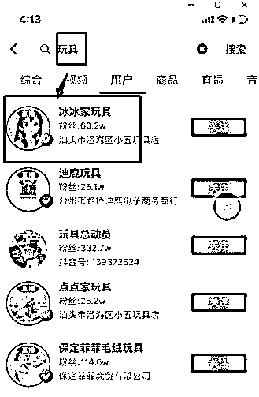

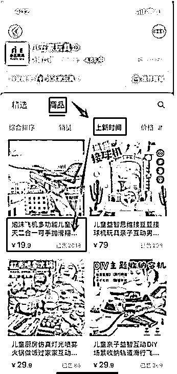

上面这种方法比较原始，从效率角度上来看不会那么高，适合刚开始做的朋友。

通过工具，快速定位相同领域里的账号的选品

更快的方式，是通过工具来帮助我们快速找到对标账号，以及他们最近热卖的品。

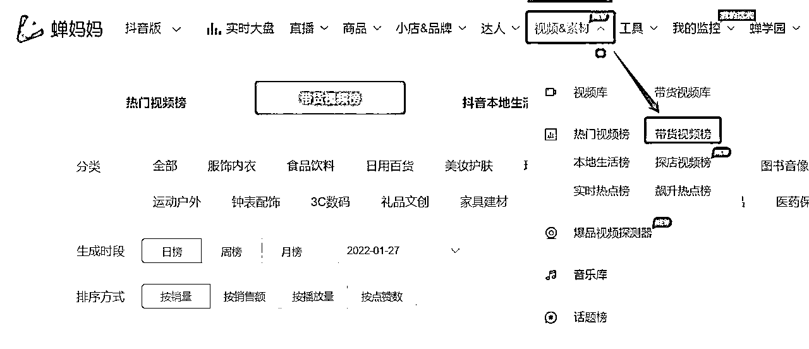

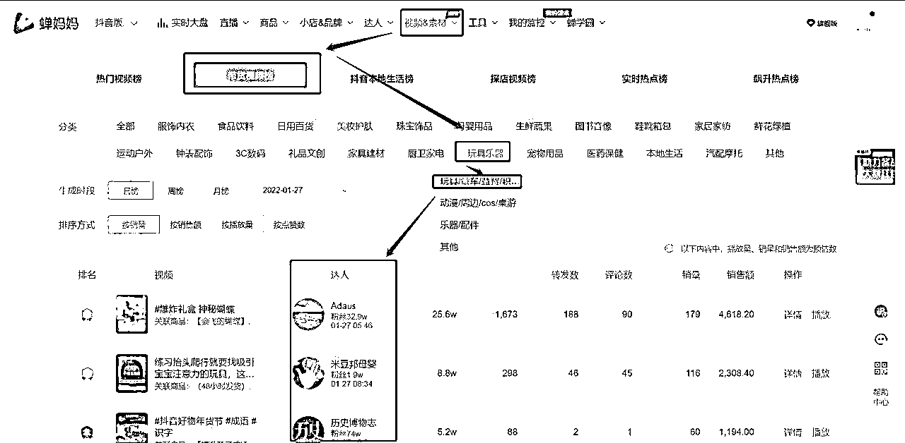

b.抖查查

点击达人——点击达人榜——选择母婴育儿——查看下方账号名称，然后刷选找到合适的账号——点击账号挑选带有小黄车的高赞视频——点击选黄车看具体品类。

#### 6.2.2.2 方法二：通过抖音「商品」功能搜索选品

举个例子，在抖音号【搜索栏】——输入【玩具】——点击【商品】那栏——点击【综合】。

这里注意，千万不要点按照销量排行，因为销量排行很多是历史数据，不代表着是最近最好卖的。

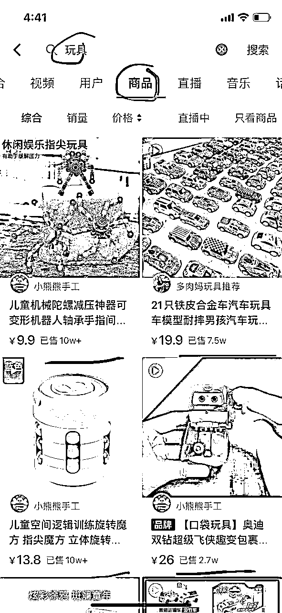

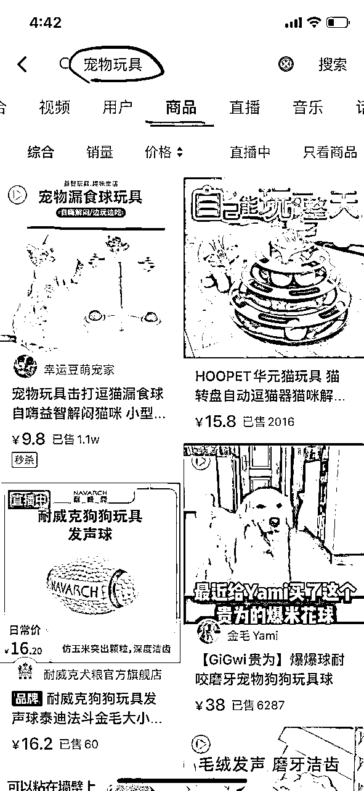

#### 6.2.2.3 方法三：通过关键词选品

这个方法适合判断趋势，以及找产品关键词。

核心策略：通过在大类目下找到最近呈现上涨趋势的小类目，再从小类目里找到最近呈现上涨趋势的更细分类目，以此类推，最终找到合适的选品。

在巨量算数官网 https://trendinsight.oceanengine.com/——算数指数——输入关键词【玩具】

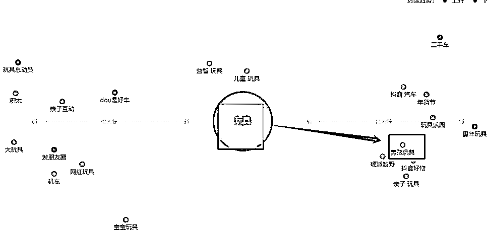

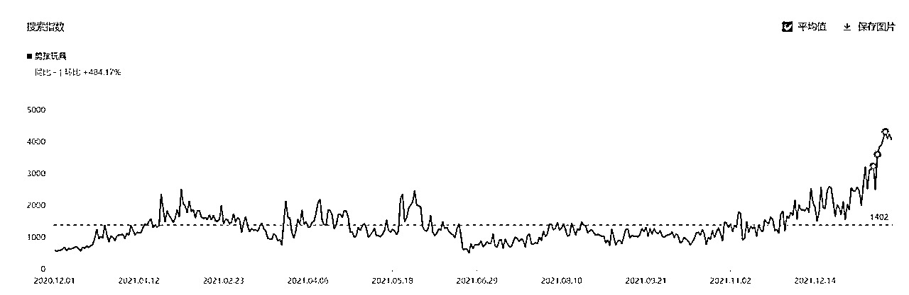

然后由【男孩玩具】找到【变形玩具】

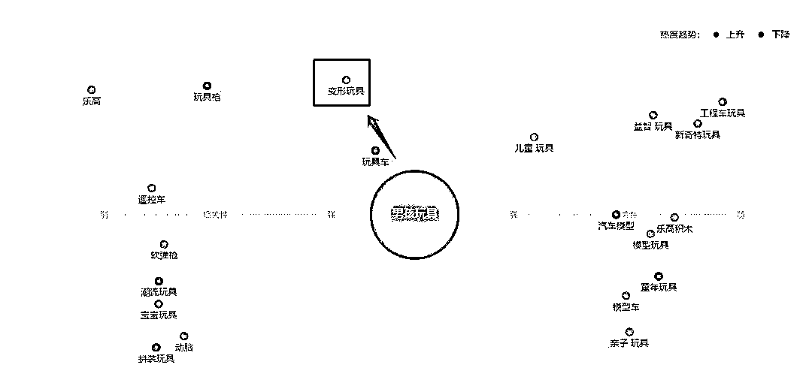

然后再由【变形玩具】找到【指尖陀螺】这个关键词。

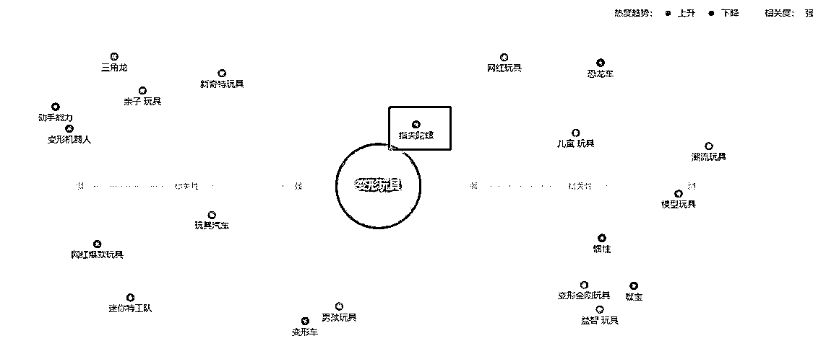

爆款是一个轮回，曾经爆过的品，很有可能再爆一次。

巨量算数还有一个方法，可以看到一个品的趋势，包括过去历史趋势，然后可根据过去几年的历史数据趋势，判断今年的即将会爆的品，然后提前布局，比如泡泡机。

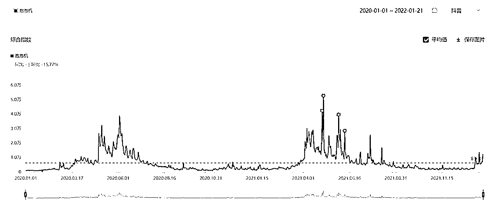

看上面这张图，可以明显看出来，泡泡机这款都是在每年的 4 月份开始爆发的，4-6 月是黄金爆发期。这个时候就可以提前一周到两周布局这个品的视频，抢先吃到第一波红利。

同样，当你选到一个具体产品时，你可以用巨量算数中的指数趋势来验证自己的选品。

#### 6.2.2.4 方法四：通过热门视频选品

拿玩具来举例，在抖音搜索框中搜索玩具——排序选最多点赞——发布时间选一周——搜索范围不限——点击搜索——筛选 3

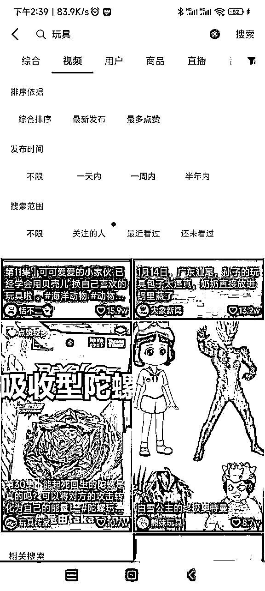

#### 6.2.2.5 方法五：通过精选联盟产品为线索选品

通过抖音自家的精选联盟里的商品，来帮助我们找到选品线索，进而选到适合我们自己的品。这里以玩具选品举例。

在抖音账号——点击我的——点击商品橱窗——点击选品广场——输入关键词玩具，然后看综合推荐选品。然后根据下面任意一种方式寻找适合自己的选品线索：

根据销量高低，寻找适合自己的选品线索

根据销量排名，寻找适合自己的选品线索根据月销量、商家体验分等，寻找适合自己的选品线索

注意：商家的月销量最好大于 5000，商家体验分大于 4.5 分。

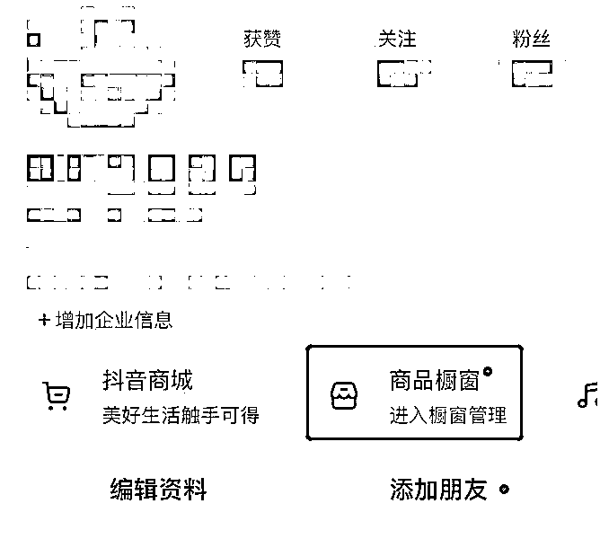

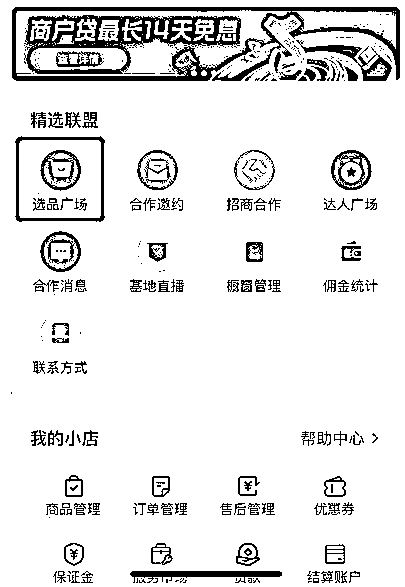

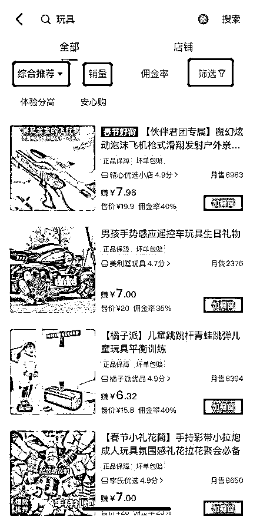

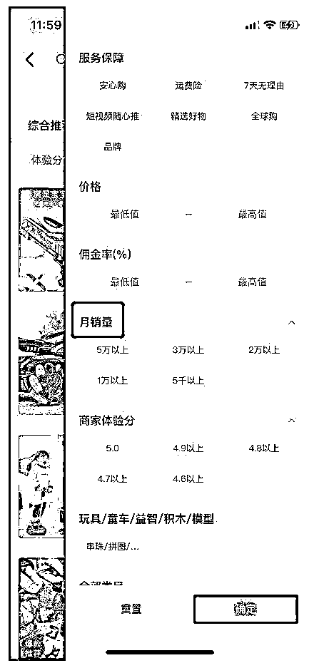

#### 6.2.2.6 方法六：通过精选联盟店铺为线索选品

通过抖音自家的精选联盟里的店铺，来帮助我们找到选品线索，进而选到适合我们自己的品。这里以玩具选品举例。

在抖音账号——点击我的——点击商品橱窗——点击选品广场——输入关键词玩具——点击【店铺】，然后看综合推荐选品。然后根据下面任意一种方式寻找适合自己的选品线索：

根据销量高低，寻找适合自己的选品线索根据销量排名，寻找适合自己的选品线索

根据月销量、商家体验分等，寻找适合自己的选品线索

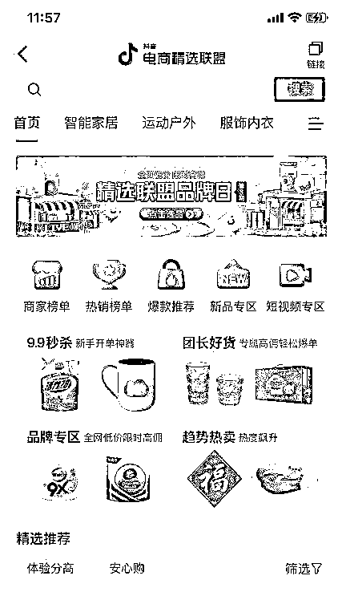

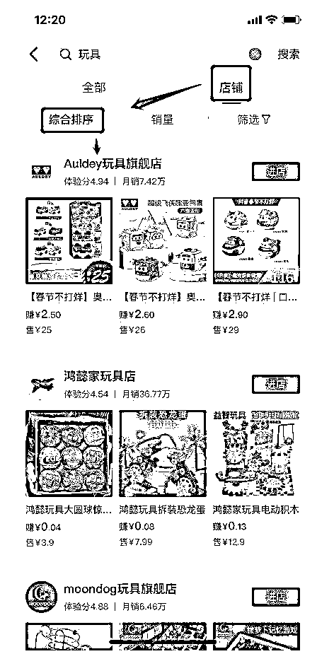

#### 6.2.2.3 方法七：通过类目来选品

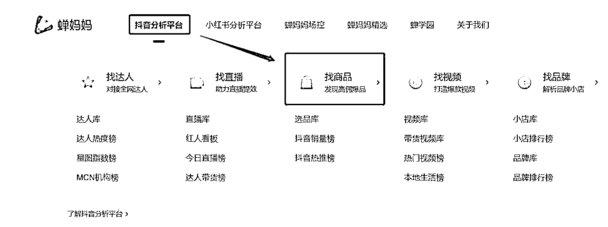

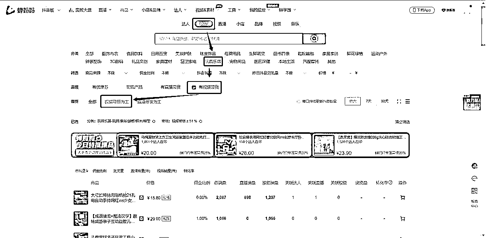

#### 6.2.2.8 方法八：通过第三方抖店工具进行选品

抖店运营及视频带货可以用店群相关软件进行数据采集和筛选，比如抖飞飞、抖小宝、抖小鸭等等，功能类似各有自己的优势。

这里以抖小鸭为例，可以采集抖音精选联盟（产品、类目、猜你喜欢、整店）并表格化展现，比手动搜索效率高很多。

a.抖音爆款采集

通过关键词采集精选联盟数据（如下图），在抖小鸭里输入“童装、女装”就可以把抖音爆款产品按照价格、销量、佣金、佣金率全部筛选出来，并且下方可以设置价格区间、销量区间、佣金率区间，相对手动筛选更为快捷。

每个产品链接旁边有 PDD 链接，软件可以直接以图搜图，标题搜图的方式找到产品的上游货源进行比价。

b.类目采集

也可以通过第三方工具按照类目筛选产品，选择抖音类目分类--选择采集类目--设置价格、销量、佣金等明细指标后可以开始采集。

#### 6.2.2.9 方法九：参考拼多多潜力榜单进行选品

我们还可以通过在拼多多等电商平台的潜力榜单，来进行选品。

这里同样是用抖飞飞工具来举例，按照类目筛选 pdd 热销商品，如下图选择了母婴玩具一级类目及玩具二级类目，按照标题、小店名称、价格、近一天销量、近 7 天销量、30 天销量、近 7 天增量来展示。

一般我们就看最近 1 天和 7 天的增量来确定这个品目前销量如何，也可以导出 excel 表格更详细的分析拆解选品。

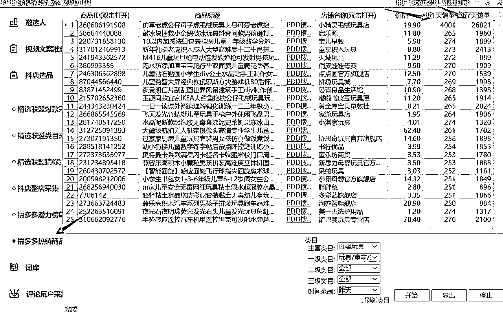

#### 6.2.2.10 方法十：根据市场供需关系

如何根据市场供需关系来选择最合适的品，简单来说就是：

需求大竞争对手少

竞争对手弱这三个点，无论是单独去找，还是组合着去使用，都会有着不同的市场和竞争难度。

而怎么快速找到具备上述条件的选品，有两个经验：

避开高竞争环境，找市场里的蓝海类目喝汤也能很舒服，选红海类目里面的蓝海子类目

下面我给大家分享下，我是怎么结合使用这两个方法找到蓝海类目的经验，并且我还为大家准备了几个我觉得机会比较大，竞争力度也没那么大的类目合集。

经验一：避开高竞争环境，找市场里的蓝海类目

怎么判断这个品是否是蓝海，竞争对手多少和强弱呢？

有一个简单的方法，你去竞争对手的视频和直播间，看对手的视频精致还是粗糙，那种制作很粗糙的那种竞争少，大概率是蓝海类目蓝海产品。

比如卖服装，有个直播间直接上雪山直播卖羽绒服，你看这个多卷。

而中老年女装竞争则是这样的

经验二：选红海类目里面的蓝海子类目

比如女装是红海竞争激烈很大，那么选择女装中的蓝海子类目——【中老年女装】、【大码女装】。

中老年女装一个月在抖音上也能卖出 3 个多亿，而且退货率才百分之十几。

而年轻的女装，在抖音上一个月 100 多个亿，但退货率，以及竞争的激烈度就比中老年高得多。

内容来源：通用能力｜怎么定位和选品

#### 6.2.2.11 方法十一：通过搜索“求购”来挖掘选品线索 @史蒂芬周

在抖音搜索“求购”，搜最新的排序，每一条的排查下去，会找到很多真正的刚性需求，做生意本质就是低买高卖，知道需求，就可以满足需求，甚至深挖。

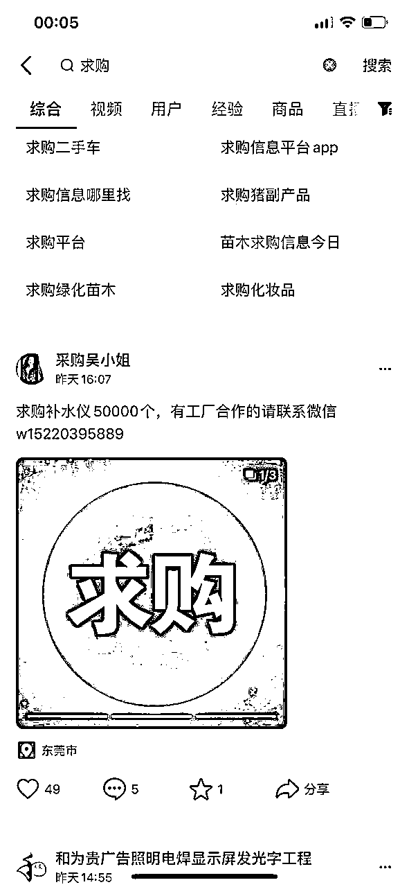

我从中找到一个很有价值的行业信息，“在伊朗卖二手笔记本”，因为伊朗长期受美国制裁所以进口成本高，发展过程中需要多样性二手笔记本，需求比较大，我就是搜索求购挖掘的高价值线索。

内容来源：《抖音“求购”挖掘线索》

## 6.3 抖音直播带货选品方法

💡

章节概要在抖音直播平台上，各类直播形式百花齐放，吸睛的直播内容和新奇特性价比的产品成为了兵家必争之地。如果能够发掘出好的利基市场，找到需求量大、竞争小的产品，将在抖音直播的运营中大大提高竞争力，爆单的几率也会高很多。

因此选品和挖掘需求成为重点的一环。为了帮助你更好的选品，我们在星球帖里摘录以下三种方式：✅垂直类目选品

✅直播单品选品

✅采集同行品类

当然，选品是一件长期的事情，离不开一次又一次的优化，可以看看同行的优化思路，找找适合自己的迭代方式。

### 6.3.1 标准的直播间选品类型 @徐立群

如果你只有一款产品，一个规格，直播间是不是就只卖这款产品？如果你有一百款产品，要全部上架么？该先卖哪些，后卖哪些？

这些问题，我们统称为选品/组品。如果你还没有想卖的货，还在找供应链，在此略过不表。我们先看一下标准的直播间的选品类型：1\. 秒杀款/起号款

定义：超出正常认知的震撼低价产品，用于快速起号，亏本赚人气。

成本价 9.9，看起来只值 9.9，直播间卖 9.9，不叫秒杀款；

成本价 9.9，看起来值 29，直播间卖 5.9，这个叫秒杀款。

2\. GMV 款/爆款

定义：性价比超群，卖得最火，现金流最稳定的款。

这个款重在保证你的现金流，拉高你的直播间人气和口碑，薄利多销。

如果你的产品，价格带都是 29-59，那么你需要一款 99 甚至 199 的战略款，告诉别人，我这是有好东西的，就是有点小贵。如果你追求性价比，还是去买 59 的吧。

所以这个款，重点不在于卖多少，而是让客户看的。在于跟你的爆款相比，有什么强烈的对比价值、展示价值，有没有故事，有没有独有卖点，能否提升你整体的逼格。

再回答开头的两个问题，如果你只卖一个 SKU，对你选品的难度和起号的技术，要求都格外严苛。可以考虑下，从横向、纵向两个维度，把你的产品放到具体使用场景里，看看你还能卖点啥，丰富下 SKU。

例如你是卖橙子的，横向拓展，是卖其他水果；纵向拓展，是卖榨汁机。

内容来源：万字长文：抖音直播带货入门保姆级手册

### 6.3.2 带货选品方法一：垂直类目选品

垂直类目选品，指的是在选中一级类目后，沿着这个类目方向继续细分至二级、三级类目选择产品，补充同类目的空白。

目前比较常见的类目有：家居、3C、母婴用品、美妆、渔具、玩具、绿植、宠物用品等。虽然说是垂直类目，但是在类目选择时，品的内容要能够丰富，因为我们不是卖单品，这种直播间逻辑，就类似“xx 超市”。

以渔具为例，常规的直播间一般主卖鱼竿鱼箱等产品，因为这种产品价格和利润都比较高。

但是我们的直播间，就可以以鱼线、鱼饵等低价位产品为主打，补充这个类目的空白，和常规直播间错位竞争。同时我们也提供鱼竿鱼箱的选择，这样很多人看到后，如果觉得便宜不错也会顺便就加到购物车。

大家可以通过蝉妈妈或者飞瓜的数据商品大盘来详尽分析，并结合自己的经验优势来最终确定赛道。

在选定后也要注意去看有没有同类直播间，如果一个同类直播间都没有刷到，那很可能并不是我们真的找到了一个蓝海，而是这个品类的商品并不适合做绿幕直播的模式，这一点我们在选品时一定要注意。

选定了大类目之后，我们就要去精选联盟选择自己的商品了。登录巨量百应，进入精选联盟，这里可以看到我们可以带的货的售价和佣金，加入到自己橱窗后，可以在橱窗看具体的 SKU。（精选联盟需要满足 1000 粉丝后才可以开通使用）

我们可以用第三方数据分析工具，如蝉妈妈、考古加等，来查看类目中的近期爆款产品，同时还可以用当日视频榜，来寻找潜在的热门款。很多小伙伴会直接选择高佣爆款，但其实选品是一件较为复杂的事情，绝对不是把爆款堆上去这么简单的。

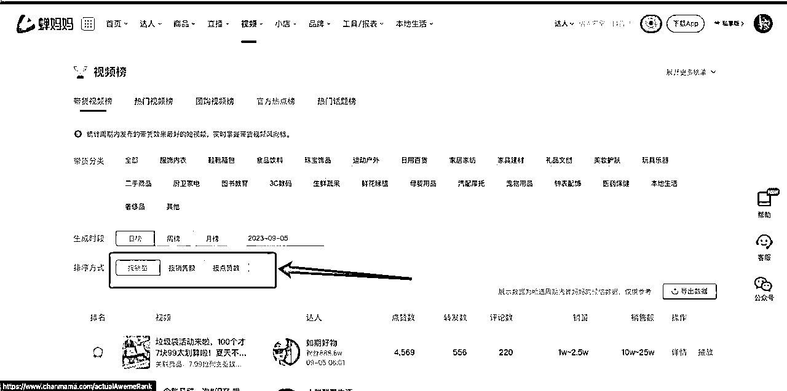

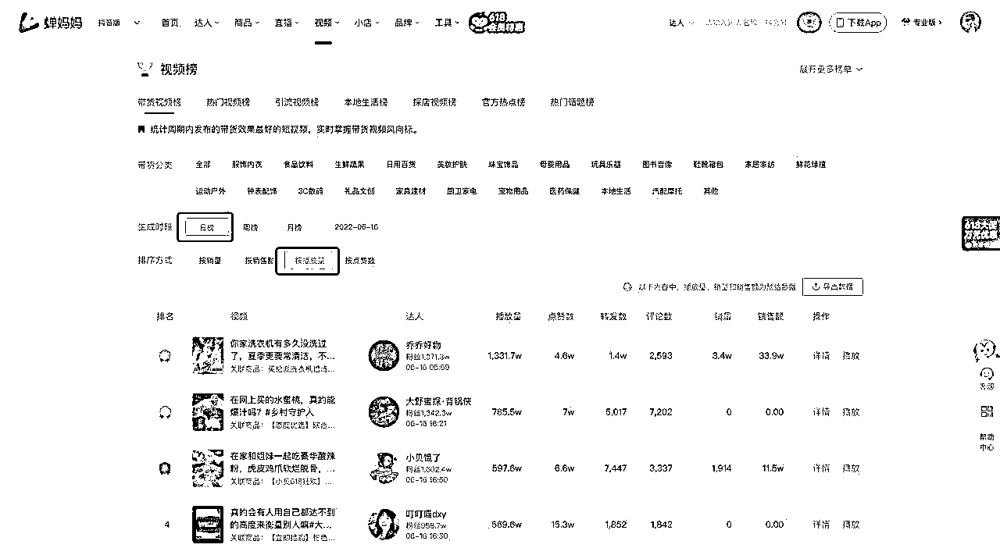

上橱窗时，我们不要只上 100 款，而要上架几百款，同时最好用表格进行分类，把商品分为 10% 的福利品 A、20% 的承接品 B、70% 的利润品 C 三种。

福利品我们不赚钱甚至补贴亏钱，承接品微利，利润品才是赚钱的。

在直播的不同阶段，根据流量情况，对上架产品和话术进行组合。比如人少时，我们要放福利品+憋单，吸引用户停留做数据，而人多时，则主推利润品来做成交转化。

### 6.3.3 带货选品方法二：蓝海单品选品

单品直播间，一般不会挂太多商品，基本的原则是，重点主推单品 + 辅助用品。

比如我们卖小酥肉粉，那 1 号链接就是我们主打的小酥肉粉，2-10 号链接，可以搭配各种调料。用户一般在看到我们的短片之后，如果想买小酥肉粉回去做小吃，有可能也会顺便在小黄车里买一些配料。

主推蓝海品的选择，有几个方向推荐大家去挖掘：小家电百货、各地特产、农产品。这几种产品一般来说都符合几个特点：新奇容易引起大家的好奇心

单价不高，一般在十几到几十块钱，尝鲜压力比较小非标品价格不透明价值容易塑造

这样的产品就比较适合做我们拿来做单品直播间。我们可以去百度或者蝉妈妈，找几个产品，然后搜索相关的直播间。这类直播间看的多了之后，平台会给我们推荐很多相关的直播间，都可以放到我们的选品库中。同时，遇到合适的场景我们也可以录制下来作为我们的绿幕背景使用。

内容来源：《初阶 | 抖音-绿幕直播｜航海实战手册》

### 6.3.4 带货选品方法三：采集同行品类 @元榕

这里的选品前期可以选择去采集同行，也可以自己去选品。我拿采集同行举例，我们之前在第一步的时候养号过程中看了大量的同行直播，我们找到 1000 人以上的直播间出来，看他们是什么品，可以直接采集他们的。

但是要避过那些同行的引流品，因为他们的引流品基本上都是他们自己抖店的产品，设置了自己的 UID，所以我们采集那些是没有意义的。

当然采集同行我们需要用到工具来辅助我们，提高效率。需要用到一个付费软件：黑核百宝箱具体的操作步骤是：“直播商品采集——输入直播间链接——查询——一件添加到橱窗”，这样就可以采集同行直播间的商品了。如下图所示：

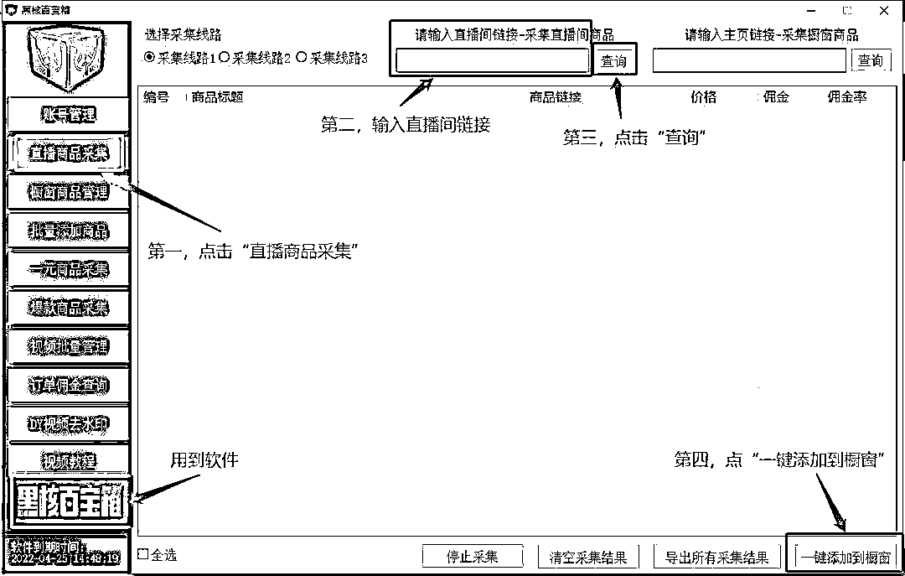

当然这个软件也可以采集同行橱窗的商品，接着在橱窗商品管理里面删除掉销量差的商品就可以了。

说到这里，自己选品这块如果有同行群的话，靠谱的一般会有人往里面提供产品链接，帮助大家筛选出一些相对比较好的产品，大家可以去找找同行链接一些资源。

内容来源：《万字分享：圈内日入 5 万+的无人直播项目，给大家来场保姆级拆解。》

### 6.3.5 选品优化思路 @徐立群

关于直播间组合选品的时候，还有一个小套路，不但可以免费获得品牌的背书和价格锚点，还可以免费拓展你的 SKU，具体方法如：

1.

例如你只有一款产品，9.9 的女款睡衣，可以在商品橱窗中加入价格 20-50，有一定品牌影响力的美妆产品

2.

直播时，只介绍这款睡衣，偶尔提一两嘴化妆品。

当然，在你有多款产品，不知道从何卖起的时候，不要拍脑袋，可以把问题抛给客户。固定人、场，通过货这个变量去测试，到底市场、客户喜欢哪些款。不要迷信自己的判断，只看数据。

如果觉得通过直播来试错，成本太高，可以试试短视频。例如，你可以每个产品都按一个模板拍成短视频，看看哪个数据好。

最后，请切记如下三点：

每个人都觉得自己卖的东西质量好，人人都适合买。真实情况是客户能感知的质量好才是真的好，给你下单的客户才是真正精准的目标客户。

卖的产品不是要很便宜很便宜，而是要让客户觉得很便宜，买到就是赚到。

直播带货，形式是直播，带的是”货“；如果你的货有问题，神仙也救不了你，在杀主播祭天之前，多看看自己的货有没有问题。

内容来源：万字长文：抖音直播带货入门保姆级手册

### 6.3.6 注意事项 @叫我郭郭

找店铺评分高的

比如商家评分在 4.7 以上说明商家还算优质，说明品质和物流情况以及售后情况还行，然后不要选择新手店铺，因为他都没有破 1000 单，要是起量了超过 1000 单会出现新手风控下不了单。

2.

选择销量高的商品

这种商品会相对有保障一些，也说明是爆款。通常这种品挂的佣金不会很高，但是没有关系，它能提升你的电商数据。

看售后的服务比如有一些是「安心购」，有“运费险”的商品，是能辅助用户下决策的点，在话术上也能做增加。

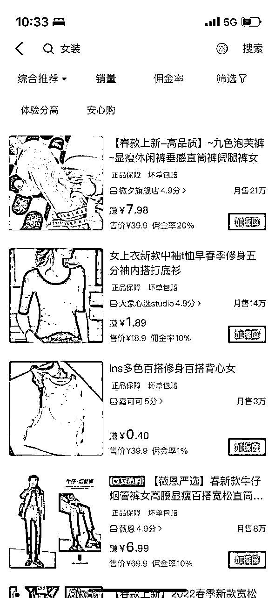

商品的目标人群

比如主打的 30-45 岁年龄的女性家居服，睡衣，大衣等就不要在夹杂 JK 制服，洛丽塔这种，既不垂直又显得不专业。

5.

复合商品链接

看着图片上这件衣服是写的 29.9，点进去一看 29.9 的是一件打底衫，图片上的大衣要几百块，这种在选品时也要规避，它是一把双刃剑，既可以通过低价吸引人停留，也能因为价格欺骗，对用户产生很大的伤害，直接不信任。

6.标题是达人专属链接

比如上图的那个（薇恩严选）你就不要去添加了，也容易影响信任度的问题。

内容来源：《11 月航海 | 抖音绿幕直播 | 实战手册》

## 6.4 抖音后端小店选品方法 @90root

如果你想做小店，一定要注意我们是先选品才开店。

也就是说，我们需要先确定自己已经找到了一个可做的产品，才能考虑开店做后端模式。如果你是电商新手，不建议一开始就进入后端，其中的产品成本、供应链等因素相对前两种带货方式还是比较复杂。

当我们进入小店这个新赛道，一定要确定自己做什么类目或者自身有什么优势，否则做了十天半个月没出结果抱怨小店达人模式不行。正确的做法是到第三方数据分析平台收集商品各项数据，分析该类目散户主播多不多，散户达人又分为直播和短视频，我们都需要进行了解。

### 6.4.1 通过类目选品

无论是做有货源还是无货源，在选择类目之前，我们需要看通过数据让自己知道这个类目的商品在抖音上销量多少、散户达人多少，主要是为了打破自己的思维，可能有些类目在抖音上数据不是太好，只能说明在抖音上市场需求量比较少，并不代表不能做。

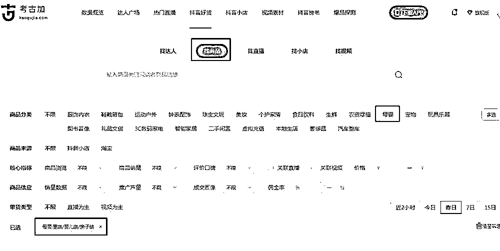

按照 30 天销量或者推广次数进行排序，推广次数 < 50 说明自播达人，> 50 说明散户达人较多。

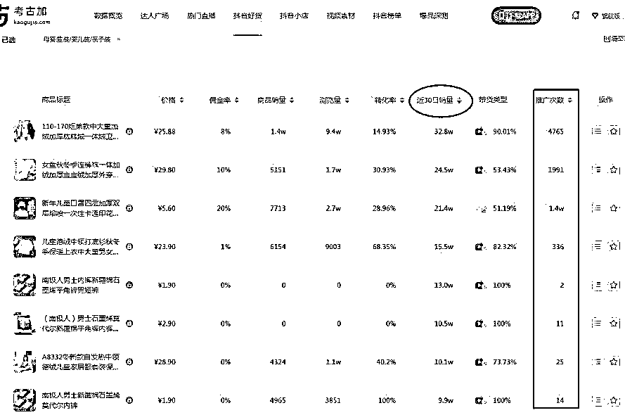

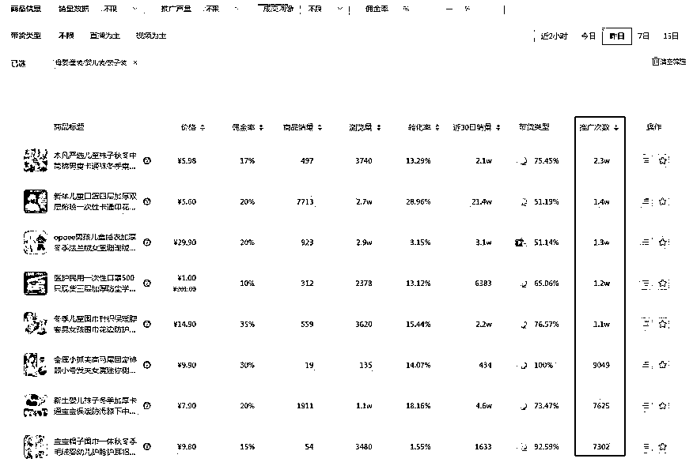

从上面两张图可以得出结论，母婴类目是可以做的，因为散户达人还是比较多的。

下图给大家放一张大类目关联达人、小店活跃商家数据图（仅作参考）：

可能有的人会说服饰内衣关联达人数量多、销量多、活跃小店商家多，那这个类目是不是不能做了？能做但竞争力大点，可以做二级三级类目：

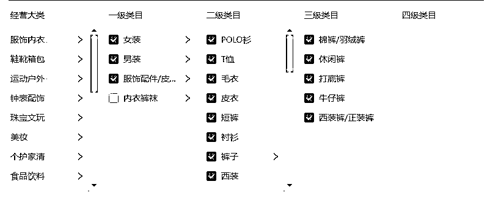

### 6.4.2 通过数据选品

再讲之前说下选品误区：

第一，所有的选品一定要有数据依撑，你都没看数据凭什么你认为这个品能够卖出去，这种做法自以为是，选品不是你认为，要让数据认为，让用户认为；

第二，有人喜欢把供应链挂在嘴边，我认识 XXX 工厂老板，认识 XXX 供应链，能给我低价，可能最后这些品卖出去的订单量还赶不上一个做无货源的店铺，正确的做法是把这个品拿到后去查数据看下在抖音市场大不大；

拿到一个产品先到数据平台搜索标题关键词，如「拖把、养生壶」。

30 天销量不低于 1 万说明市场需求量低，高于 30 万卖的太好了同行太多，不建议上，除非你有价格优势或者是能开高佣金，

如下图所示：

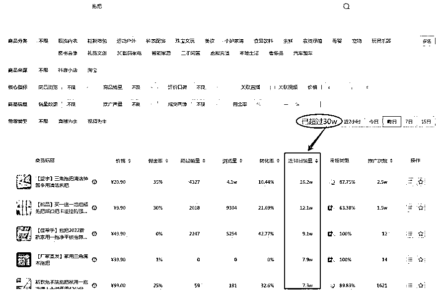

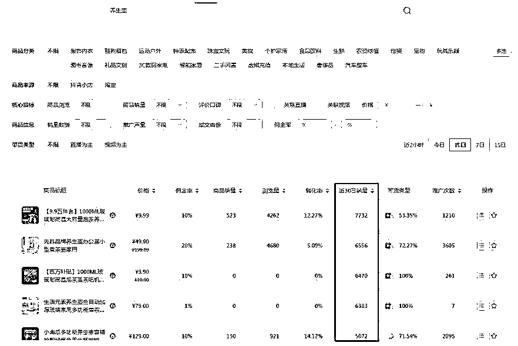

商品转换率 > 5%（30 天），比如主播带两个商品，一个商品转换率 15%，另一个商品转换率 3%，同一个主播花相同时间，没有人愿意一直讲 3% 转换率的商品，如下图所示：

关联主播 < 3000，超过 3000 你的品要有价格或者佣金优势，如下图所示：

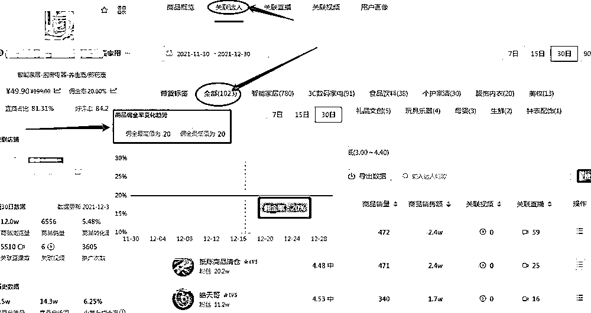

商品曲线图：7 天平稳上升的曲线图可以上，有 90 天曲线图不建议上 （每个产品都有生命周期，到了时间厂家进来就是价格战），如下图所示：

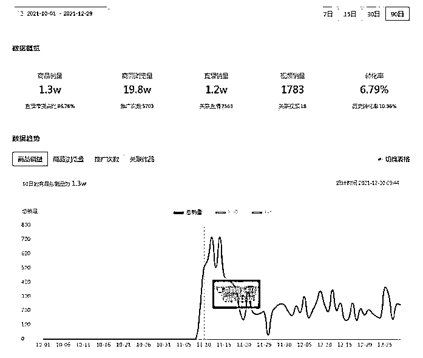

浏览器安装至尊宝插件，安装方法：百度搜索「至尊宝插件」，通过商品主图或者标题到第三方电商平台搜同款。在考古家上点「养生壶」出现 1688 或 PDD 图标，点搜索，如下图所示：

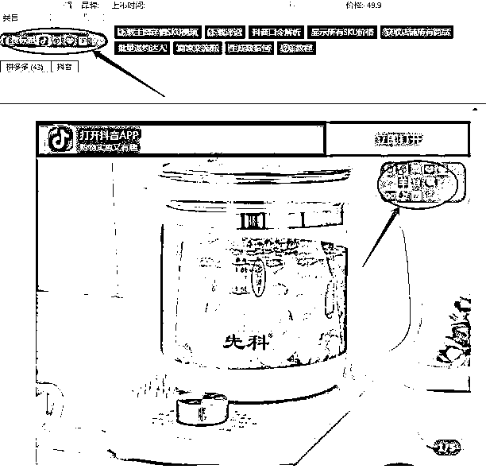

我们到 1688 或 PDD 搜同款，同行卖的价格是 49.9、开 20% 佣金。假设我们找到的一件包邮价格是 33，用运营表格计算我们的利润，如下图所示：

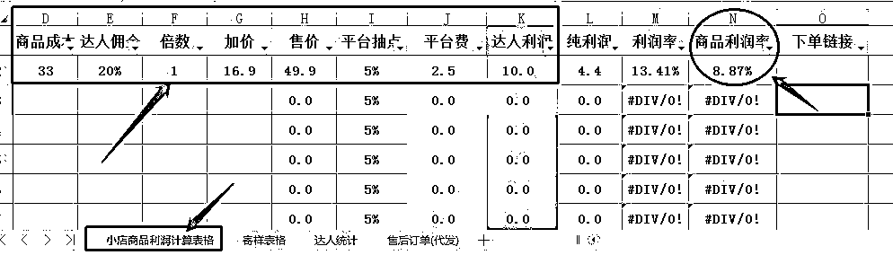

养生壶属于智能家居类目，这个品到目前为止一共关联 1000+ 主播，总不可能智能家居主播只有 1000+，肯定还有很多主播还没联系到，我们通过其他智能家居品找更多的主播到精选联盟达人广场报名邀约 （下面会讲到）。

最后得出这个品有利润，成本价是按照 33 计算，这是没有量的情况下，有量成本价还会低，成本价每低 1 块钱利润就多赚 1 块钱 （下面会讲到对接供应链）。

同款商品有价格或佣金情况下，该商品关联的主播都可以为你所用，如果没有价或佣金情况下找相似款，拿养生壶举例，没有价格佣金优势，养生壶不会只有这一个款式吧？肯定还会有其它款式，相似款产品定价和佣金对标养生壶。

第二种选品方法也是通过数据平台选，确定好类目 （童装举例），30 天销量 > 500 转换率 > 4%：

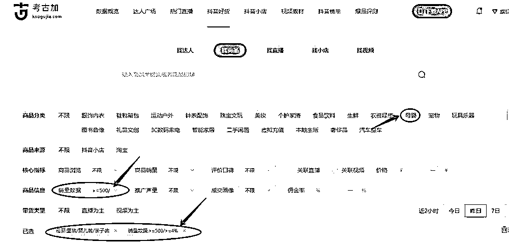

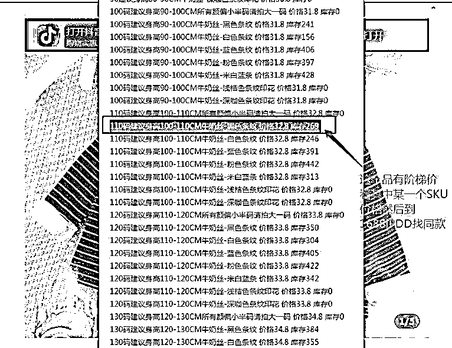

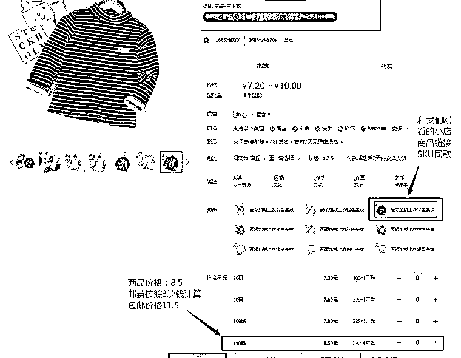

同行 SKU 价格是 32.8，暂定同行开 20% 定向佣金，我们用运营表格计算利润。得出结果，这个品开到 30% 佣金我还有钱赚，找童装类目其它达人到精选联盟达人广场报名邀约：

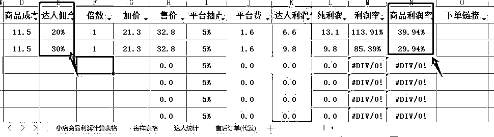

### 6.4.3 通过产品分类选品

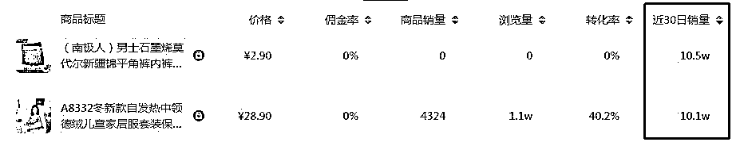

引流款的利润率大概在 7%-10%，利润率是根据产品售卖价来计算的，比如说售卖价 20 块钱，一单最多挣 2 块钱。

4\. 利润款

前期有了引流款合作基础后，推利润款事半功倍，利润款的利润率大概在 10% 以上。

需要有成功案例，比如给主播 B 介绍智能上水器转换率高，头部或中腰部 A 达人带过，你要让达人知道卖智能上水器这个品 A 达人带过并且赚到过钱 （其他主播带过的案例）。

### 6.4.4 通过货源平台辅助选品

如果是做无货源，1688 和 PDD 都可以选择，推荐大家首选 1688，备选 PDD，原因如下：

1688：基本上可以做到当天发货晚上出揽件，商品退换货需要我们承担发出去的运费；PDD：发货慢 （拼单成功后 24 小时内发货）；好评卡 （最重要的是好评卡有 PDD 字样），抖音现在严查好评返 X；价格不稳定 （拍的多了商家涨价）；一旦小店后台爆单，商家发不出来货就傻眼了；

PDD 查看无货源方法：店铺商品数量：真正的厂家商品数量是不会超过 15 个的，见过有哪几个厂家商品款式超过 30 个以上的？

查看商品的出评率

1688 平台优先选择带头牛标的商家，如下图所示：

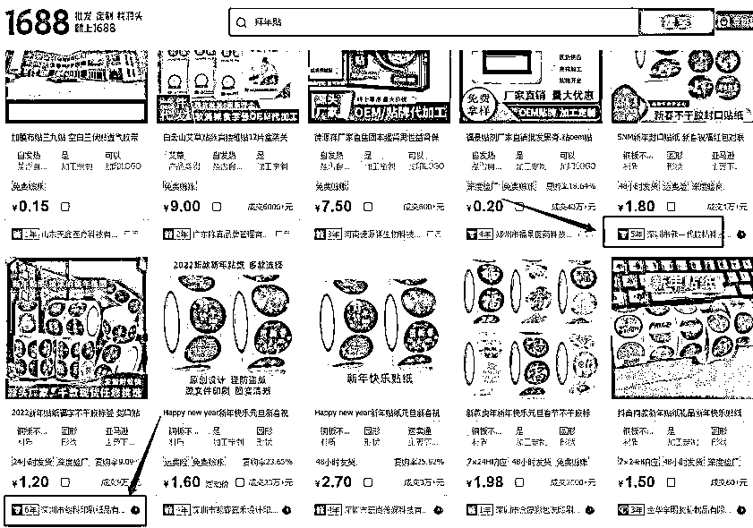

内容来源：《抖音小店无货源达人模式，如何完成完整闭环》

### 6.4.5 以客单价划分选品 @安可

对于开抖店的人来说，需要考虑的是：想薄利多销，还是想“开张赚一年”？

9.9 以下低客单，整个小店里以 9.9 以下的性价比高的为主，只要后续佣金设置比别人低 1%-5%，店铺评分不都会太低。

39.9-100 中客单，选性价比高，针对有一定消费能力的人群，佣金普遍设置在 20%-30%左右即可。

100 以上，不设上限的高客单，选高价值的物品，最好是品牌，利润高，佣金也是设置与别人差不多即可，如阿迪达斯的短裤

20%，那李宁安踏就可以设置 20%，百货类可以组合量大的家庭套装，短期内不会再购买的。

内容来源：《从零开始做抖音小店的保姆级攻略分享》

### 6.4.6 利用货源或地缘优势选品 @安可

如果你的所在地有相关特产，也可以利用好当地产品优势选品。如果你的所在地没有产品优势，也可以寻找临近地区商家进行合作。具体内容介绍如下：1\. 地缘优势：

广东：广州的服装，东莞的针织衫，增城的牛仔裤，揭阳的内衣裤，深圳水贝的珠宝，深圳南油的设计师女装，深圳华强北的电子产品，广州深圳都有的化妆品。

浙江：义乌的小商品，温州的皮鞋，杭州四季青的衣服。

福建：靠海的海鲜和漳州的休闲零食。

浙江杭州，达人资源，基地资源，直播团队资源和知识。

这些都是可以利用的，哪怕不在那个地方，也可以往那个地方的人里找相应的资源。

内容来源：《从零开始做抖音小店的保姆级攻略分享》

## 6.5 抖音 20 个类目和二级类目月销售额

### 6.5.1 抖音主要 20 个类目如下

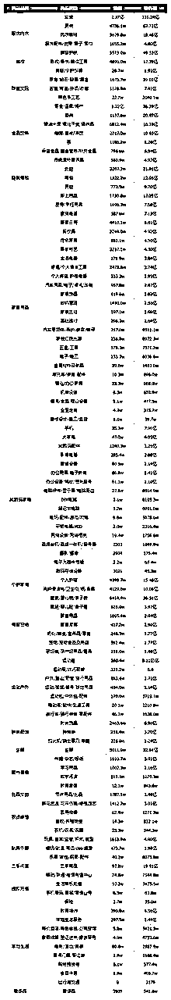

### 6.5.3 蓝海选品类目推荐

蓝海类目推荐（抖音可以做的类目很多，这里只是简单展示部分）


## 6.6 关于选品需要避免的坑

很多时候，当我们花费了九牛二虎之力选出一个很合适的品，正准备在抖音大展身手的时候，结果一上传就被判为违规，商品下架，或者是压根就和我们的预想的不一样，一单都卖不出去。

这就是因为你选的品踩中了抖音选品的坑，每一个在做抖音电商的人都有自己的经验，我在这里把我踩过的坑分享出来，希望大家能够避免。

### 6.6.1 避坑一：商家体验分 @唐明杰

商家体验分会影响达人带货口碑分。如果商品太差有些客户可能会投诉带货达人或者给商品差评，会影响带货口碑分（特别是投诉，口碑分会掉得很厉害）。

带货口碑太低会影响带货转化率，所以首先要看下带货产品的商家体验分，具体有三个维度：商品体验，物流体验，商家服务。

如下图

一般我会选择体验分 4.5 及以上，其他三个维度不能太拉胯，这样即使出现账号被投诉，带货口碑分掉得厉害的情况下，后面单量上来后口碑分也能较快涨回来。

内容来源：《抖音短视频蓝海带货，月利润 2W+》

### 6.6.2 避坑二：产品转化率和带货达人数 @唐明杰

这个是根据选品广场商品数据来算的。通常选择转化率高些而且销量比推广人数高的产品。这个时候要注意，有些产品在某天销量特别高，带货达人又少，这种情况可能是通过直播间带货成交的，所以这种产品也过掉。场景数据情况如下图：


内容来源：《抖音短视频蓝海带货，月利润 2W+》

### 6.6.3 避坑三：带货佣金 @唐明杰

带货佣金高通常售价也高，不好出单，佣金太低又没利润。所以要在这些中间做一个平衡点。大概 15%-30%比较合适。但是这个也要综合考虑。通常佣金低于 10 元我就不考虑了。

这个根据个人想法来，没有对错，有些人就是只做高佣金的，看个人运营和选择。

选定合适的产品后，可以进入其店铺看看其他产品，是否有合适推广的，这样会提高选品效率。在测试出好卖的产品，就可以把这个产品视频进行裂变，其他账号也跟着发，其他账号上大概率也能出单。后面易出单的产品也可以再反复发，提高效率。

这个过程相当于也在选款测款。

内容来源：《抖音短视频蓝海带货，月利润 2W+》6.6.4 避坑四：选品要合法合规

10 月上了一个射钉器产品，因为不知道这品是平台不允许上的品，结果没过几天，直接导致了高权重的店铺被封了，损失巨大。所以千万留意平台规则，一些抖音限制的品千万不要上。

在抖音被限制的选品：

电商创作者管理总则-抖音电商学习中心 （jinritemai.com）

内容来源：《抖音小店视频带货｜小航海学习手册》6.6.5 避坑五：不选特别小众的品

6 月做了一个特别小众的品，花费了很多精力，结果产出很一般，才做了其他品类的 1/10，现在想来，完全就是在浪费时间，导致浪费了 2 个的红利时间。

这里特别小众的定义是整个类目的月销售 1000 万以下（非单一产品）。

内容来源：《抖音小店视频带货｜小航海学习手册》6.6.6 避坑六：视频展示效果要好

当我们选出来很多品时，一定要再过一关，就是很多产品的销量数据有的是通过抖音直播成交的，但是直播间成交和短视频成交不一样。

带货视频的视觉效果一定要突出，比如美妆使用前使用后对比。

最好就是让用户看完，能立刻有「我也需要，我也想买」的冲动。

内容来源：《抖音小店视频带货｜小航海学习手册》6.6.7 避坑七：不选质量差的产品

选品不要只顾着佣金的高低，同时也要注意产品和店铺的评分，店铺评分最好不要低于 4.5，产品好评高的。

这样不但视频转化率高，而且不会因为差评导致自己的视频账号带货评分降低，影响带货。

内容来源：《抖音小店视频带货｜小航海学习手册》

### 6.6.8 避坑八：选择供货稳定的店铺、佣金稳定不调整且可谈的店铺

曾经遇到过一个坑，就是视频爆单了，结果商家货源不足，导致很多单没有成交，所以要选择货物充足的店铺。

这一般会看这个店铺的历史销量，比如家居类目月销量 10 万以上货源是相对充足的，具体看品，有些小众类目月销 1000 也可以。

所以这里方法：大类目选该类目店铺前 10，小类目选该类目销量前 3 名来带。

如果有爆单了，尽量提前找商家说一下，问一下商家的库存情况。带的好的情况下，还可以找商家谈更高的佣金，让他给一个专属佣金的链接。

还遇到一个坑，就是带了货，结果第二天佣金商家下调佣金，能赚 50 一单的，变成 10 元一单。这个只能尽量找靠谱的店铺和商家。

内容来源：《抖音小店视频带货｜小航海学习手册》6.6.9 避坑九：不建议新手选的品 @吴刻奇

### 6.6.9 避坑九：不建议新手选的品 @吴刻奇

女性是抖音的主要消费群体，但是新手最好不要做服装、食品、电器等类目（退货率、品牌授权等问题比较棘手）

内容来源：《可能价值上万的抖音小店电商干货分享！来源于抖店线下交流会（含猜你喜欢+精选联盟）》

# 七、小红书选品

💡

章节概要

这一节中，你将会了解到小红书的平台分析以及主要的选品方法。

现在的小红书成为了很多用户做消费决策的一个重要工具，大家决定吃什么，买什么，去哪里玩之前，都会到小红书搜一搜。这个平台的用户群体女性偏多，消费能力强，大家对营销内容没有像其他平台那么抗拒，是一个离钱很近的平台。

我们整理了这几个选品方式，希望给到你一些思路：✅ 蓝海选品

✅ 低粉爆款法选品

✅ 抖音精选联盟排行榜选品

✅ 灰豚数据选品✅ 蝉妈妈工具选品

✅ 小红书 APP 上选爆品

另外，本章节也梳理了一些找蓝海赛道的方法，以及爆款选品的合集，希望可以帮你更进一步掌握小红书电商的选品模式。

需要注意的是：选品案例是有一定的时效性的，案例中的数据有可能已经不适用现在情况，大家着重了解选品思路，具体的数据判断需要结合当下情况调整

接下来来看看每个选品方法怎么操作吧～💡

本章航线图

完成第五章的学习和实操，即可完成航线图的第三阶段：为所做项目选至少 3 个品（每天约 2-4 小时）

1.根据自检表选出至少 1 个符合要求的品（约 1 天）

继续选出至少 1 个符合自检要求的品（约 1 天）

每天持续选至少 1 个符合自检要求的品（每天 2-4 小时）

接下来请正式开始掌握这些方法论，记得在航海日志中打卡记录进度哦～选品自检表：


## 7.1 小红书平台分析

平台特点

现在的小红书成为了很多用户做消费决策的一个重要工具，大家决定吃什么，买什么，去哪里玩之前，都会到小红书搜一搜。

它是一个离钱很近的平台，但在很长一段时间内，都没有配置好自己的内部电商体系。

2020 年 10 月，小红书上线店铺功能；2021 年 8 月，小红书降低开店门槛；2022 年 10 月，小红书个人主页增加了购物入口，之前浏览过的账号和笔记中的商品，都会出现在这里。2023 年 3 月底，小红书推出【笔记带货】新功能，利用 KOL 合作笔记带动电商交易。

这样做的意图很明显，就是希望大家在平台内部做商业化，大力鼓励商家开店，鼓励用户边看笔记边购物。基于此，小红书店铺这个项目，目前正处在蓝海阶段，很多人刚把店铺开起来，不久就出单了。

人群画像

目前小红书有超 2 亿月活用户，并在持续快速增长，其中 72%为 90 后，50%分布在一二线城市，共有 4300 万+的分享者，其中男女用户比例是 3：7。

小红书用户都是自发式的分享笔记，笔记内容多元化，并且会结合当下热点和潮流。其中女性在平台展现出懂生活、爱生活、热爱分享的一面，同时对新消费起到了引导作用。

要知道都市白领、职场精英女性是小红书的主要用户群体，她们工作较为稳定，消费能力强，且有相应的消费需求、追求品质生活。根据官方和尼尔森调研数据显示，个人月均消费支出能达到 4.1K，并且不包含房贷，车贷。

另外，半数用户对品牌营销持理性接纳的态度，认可营销对于消费决策的价值。51%的用户相信营销宣传对商品的功能介绍，50%的用户觉得营销宣传越多越值得信赖，49%的用户觉得营销宣传让自己更多的了解品牌和商品的相关信息和理念。小红书的天然种草属性跟平台用户对其的接纳态度有着紧密的关联。

电商模式

目前在小红书上做电商生意和抖音类似，主要是通过笔记带货和开店铺的形式。

笔记带货：如果是刚刚开始做小红书带货的新人，目前也比较建议从商品中心选品，发挂车的笔记带货开始（需要达到 1000 粉丝，开通带货权限）。

开小红书店铺：即在小红书开通薯店，自己卖产品，品牌或有产品的做自营，没产品的找货源商家签订合作合同，当小红书出单了，就让合作商家来发货，我们来赚取中间的佣金。

## 7.2 小红书店铺选品方法

### 7.2.1 如何选择蓝海赛道 （附产品清单）

#### 7.2.1.1 千瓜流量大盘 @谢无敌

所谓蓝海赛道，就是同行少但市场需求量大的赛道，这样的赛道竞争压力小，同时又很有发展潜力。要找到这种赛道，当然不能凭主观判断，或者是道听途说听别人推荐。最靠谱的方法就是做市场调研，用数据来说话。

给大家推荐的第一个方法就是看千瓜数据的流量大盘，在行业流量大盘中，你可以查看到最近 30 天内，小红书各行业的笔记情况。

大家可以重点关注两个数据：推广笔记篇数和笔记互动总量。

很显然，推广笔记篇数越多，说明这个赛道做的人越多，竞争压力相应也就越大，比如这两年兴起的家居赛道，月笔记数量达到了 119w+，甚至远远超过了护肤、彩妆类的 30w+。

而笔记互动总量越大，说明用户对这类笔记的认可度高，越容易产出爆文。也说明关注这个类目的用户多，市场需求量大，比如家居赛道的互动总量有 2.6 亿。

所以我们的目标就是，找到笔记数量尽可能少，但互动总量尽可能多的赛道。

但是单独看这两个数据没有太大意义，笔记数量少的，大概率互动总量也会少。

那具体怎么去分析呢？大家可以把每个赛道的笔记数量和互动总量记下来，做成一个表格，然后算出笔记数和互动总量的比例，按照这个比值大小对表格进行排序，如下图。

比例值越小，说明笔记数量相对较少，互动总量相对较多，这种就是我们要找的蓝海赛道。

有点出乎意料的，我们普遍认为比较卷的彩妆赛道，竟然排在了第一位，所以很多时候，主观判断并不靠谱。

我这里只列举了 15 个主流类目的流量情况，每个类目下面还有二级分类，大家可以用同样的方法去做细分。

比如，服装类目下面就有连衣裙、夹克、背心等十几个二级分类。

#### 7.2.1.2 千瓜品类搜索 @谢无敌

第二种方法也是用千瓜，我们找到左侧工作台中的【品牌品类搜索】。

注意：这个方法目前不太适合小红书无货源电商，因为品牌产品货源很难搞定而且定价不灵活。

但是这个方法是比较适合买手达人来使用的。

上面罗列了 100 个品牌品类，每个品类都对应有相关的笔记数量和笔记互动总量，而且可以一键导出下载下来，比第一种方法方便很多。

同理，我们也可以直接在 excel 里，把笔记数和互动总量除一下，并按这个比例大小排序。

百分数越小，这个品就越有潜力，属于蓝海品，目前排在前三的是徕芬吹风机、TCL 冰箱、博世冰箱。

里面一共有 100 个品，表格太长了，这里只给大家截取了一部分，完整表格放在了小红书店铺项目的实战工具包中。

相比于第一种方法，这种方法得出的结果，既包含品牌又包含产品，会更具体一些。

#### 7.2.1.3 巨量算数搜索 @谢无敌

最后一种方法是借助巨量算数搜索，电脑端直接搜索巨量算数。

它的数据是以抖音、头条为基础的，但是自媒体的风向标大体上是差不多的，所以小红书博主也可以拿来参考，而且它还是免费的。

打开网页后，点击顶部的“算数指数”，会出现一个关键词搜索框。

在这里输入你想要做的品类关键词。比如我们现在输入：绘本。

点击搜索，就会出现关于绘本这个品类的数据分析，包括搜索指数和综合指数，网页下拉后有一个综合指数解读，我们需要重点看一下。

上图中，左边这张圆形图，有三个关键信息：内容分、传播分和搜索分。

内容分：指的是含有这个关键词的内容数量，数值越高说明写这个内容的人越多。

传播分：指的是内容的播放量和分享情况，数值越高，说明内容越受欢迎。

搜索分：就是指有多少人搜索过这个关键词。

很明显，内容分越低，传播分和搜索分越高，这个赛道就越好做。

我们刚才搜的“绘本”，搜索分和传播分都明显高于内容分，也就是说，它的用户需求量远高于现有的内容数量，所以可以判断为是一个蓝海赛道。

除此之外，巨量算数里还有一个可用的功能，就是打开顶部的「创作指南」-「内容消费分析」。

里面有十多个垂直领域选项，选择对应的领域，你就会看到两条变化的曲线。

蓝线：代表内容供给，也就是这个赛道内产出的内容数量。

绿线：代表内容消费，意思是有多少人观看这个内容。

比如上图，我们选择的是游戏赛道，两条线忽高忽低，总体来看，供需大致平衡。

再比如科技领域，出现的是蓝线在上，绿线在下，说明供大于求，关注这个领域的用户没有那么多，以上两类赛道都不适合我们去做。

还有一种情况是绿线在上，蓝线在下，而且我们还可以自定义搜索的时间，比如动物萌宠赛道，我们选择最近一年的数据。

出现的结果是，绿线远远高于蓝线，意味着产出的内容不够，满足不了消费者的需求，这就是一个蓝海赛道。

我们要找的就是这种绿线比蓝线高很多的赛道。

但这个方法有个缺点，就是目前只能搜索到它上面给出的这 15 个领域。

你可以把几个方法综合起来参考，千瓜的缺点是比较贵，一个月要 3000 来块，你可以和其他博主拼团一起买。

内容来源：《（附选品清单）如何选择小红书蓝海赛道和产品？3 个方法搞定！》

附选品清单：小红书产品清单（from 千瓜数据）.xls （下载请跳转：小红书航海｜实战工具包）

#### 7.2.1.4 传统电商平台搜索 @云端行走 @雄 @V 小刀

传统电商平台是在电商里面做内容，而小红书是在内容里面做电商。

因此我们在选品的时候，可以更多地参考传统电商平台的官方分析软件，一是官方的软件会比第三方软件数据更精准，二是可以更好地了解当下上升指数最快的一些热搜和转化词。

比如我们在当下要创作什么内容，我们可以看看自己比较感兴趣类目的一些热搜词，通过这些热搜词去创作相关内容就会更精准。

如果说这个产品在接下来一两个月会爆，那么提前布局就能早点占领市场。如果应季已经很爆的产品，通过软件发现热搜指数有所下降或者成交转化有所下降，那么我们制作的内容后续表现也会有所下降。

需要说明的是，这些软件费用比较高。像淘宝和京东的数据软件，是要求有店铺才能开通这个软件的。此方法只作为补充，有条件的同学可以参考使用。

若条件不足导致无法开通这个软件的，我们还有哪些方法可以选呢？看看圈友@雄给我们提供的方法。

1）无脑选品

当你不知道怎么写的时候，你不要考虑去选品，你就去给他写，什么样的款式你都写。

可以用你选品链接主图的前 2 张+多多上家或者买家秀三张主图，五张图文导入剪映生成视频。写完了之后，它会有一个数据反馈，反馈给你，你再去筛选你想去写的东西。所以不要去纠结，你就去多写就好了。

案例：女装

假如你选定了做女装，你也不清楚做什么款，那么你就按照女装里面的风格去写，如搜索女装，筛选维度为时尚，会出现很多相关的产品，可以把销量高的产品拿去小红书进行测试。

用产品的主图 1-2 张+多多上家以及买家秀的照片 3-5 张，然后将图片导入剪映里面做成视频即可。

模板.mp4【在线播放】2）拼多多选品

拼多多排行榜，不是把拼多多排行榜的产品全部 copy 上去。我们找一种这样的产品，首先它在拼多多排行榜里面，其次它的销量高，它的评价比较少。这是最近才起来的款，这种属于非常有潜力的款。

在拼多多里面选，需要特别注意它的评价，看评价里的买家秀，因为评价里的买家秀，他所展示的款式要跟商品的款式是一样的才行，不然会出现货不对板的情况。

3）特别关注某些品类，进行快速跟品根据小红书平台的内容特点和用户特点，我们不仅仅可以看这些电商平台的排行榜，还可以针对饰品这类商品。

这些品类都是以图片本身就可以成为一条优秀笔记的类目（即适合图文的类目），我们只要去找到有自己原创拍摄能力的电商平台店铺去跟进新品。因为这些店铺的产品图都是自己拍的，但是有很多店铺并没有在小红书推广，我们可以第一时间利用他们有品质的图片和选品能力。

内容来源：《小红书选品方法论》

### 7.2.2 如何选品 @V 小刀

每个电商人都知道，选品是很重要的一环，什么样的产品适合在小红书做带货呢？

我们可以分为三大类方式来进行选品操作：

1.站内选品

即低粉爆款、灰豚数据、蝉小红、小红书账号的对标选品。这个背后的逻辑都是去针对小红书平台容易爆、正在爆的品选择出来去跟品。

抖音选品

利用考古家、抖音对标大人物、蝉妈妈、抖音精选联盟等选品。这个的背后逻辑是从抖音找到可能也适合小红书兴趣电商的商品，搬到小红书去进行测试，看是否能在小红书也打爆。

电商平台选品

也就是利用拼多多、淘宝等平台进行选品。

针对在小红书上做电商，比较建议的选品组合方法是：站内低粉爆款选品+抖音精选联盟创意中心法+对标帐号监测选品，这三个方法为主。

如果是偏饰品、帽子等高颜值的商品，就更注重站内选品，如果是百货等更大众的商品就会更重视抖音选品。

先说明，没有十全十美的产品，不要在选品这一环节犹豫太久，选品不在多，在精。优先选择自己现有的靠谱供应资源，很多产品只有自己试了才知道行不行。

另外，不同的类目适合的选品方式不太一样。你可以根据自己的类目进行选品测试后，选择自己适合的 1-2 个即可。

👇接下来就看看每个选品方法具体是如何操作的：

#### 7.2.2.1 站内选品-低粉爆款法 @书豪

低粉爆款选品，本质就是找没多少粉丝但已经有品在爆的对标账号去跟品。

按照低粉爆款的思路去跟品的原则是：对标模仿的小红书账号低于 200 粉丝，同时最近 7 天发的单篇带货笔记点赞过 100，同时该带货笔记商品销量大于 100。

这种方式不强依赖于灰豚数据、考古加等第三方工具软件，我们也可以直接通过小红书发现页。找到符合要求的笔记和账号。

每天寻找三个品去测试，不要怕麻烦，耐心一点。

另外，即使是低粉爆款的品，如果你没有模仿到低粉爆款的笔记的封面，这个品也可能会出不了单。选品正确代表走完了 70%的路，还有 30%的路是封面+视频要模仿的精准。

内容来源：《小红书单店铺单月 6000+利润选品保姆级教程》

#### 7.2.2.2 站内选品 - 灰豚数据 @书豪、@表弟

如何利用灰豚数据，通过找对标账号来选品？

第一步：打开灰豚数据第二步：点击笔记查找，选择笔记搜索

第三步 ：勾选上【带货笔记：是】

第四步 ：勾选上【低粉爆文】

搜索你要的对标，比如想要做连衣裙，则搜索连衣裙。

即使是用灰豚数据，我认为你找的对标账号也应该选择粉丝在 200 以下的，点赞在 7 天内大于 100 以上的笔记，同时该带货笔记商品需要销量大于 100，才可以选这个品。同样使用低粉爆款法。

那么如何通过灰豚数据进行逆向思维选品呢？

【操作逻辑】

因为大多数同行都是进行笔记互动数进行选品，我们反其道而行：1\. 按笔记数排序，选择互动数 300 以上【低于 300 也可能是潜力爆款】的商品，笔记数越多越好，证明这个账号在大力推这个产品，在小红书平台属于新品。

【操作步骤】

第一步：打开灰豚红薯版-商品分析-商品榜单-带货商品榜-选择相应类目-选择日榜或者周榜-按关联笔记数排序

第二步：比如看到这个硅胶手指锻炼器，可以点击【查看】看下关联笔记确认笔记是商家自己的账号，而不是达人带货账号。如果是达人带货，这个品咱们带的意义就不大。


确认好后关闭，进行下一步。

第三步：点击标题进入商品详情页，看下商品销量，销量一百以上的可以考虑选品。


第四步：接下来点击左下角【店铺】，进入店铺主页，进来以后点击【销量】排序看下其他的品，拓展一下选品。

第五步：最后点击最上面的【来自账号】，进入账号主页，查看笔记，看下粉丝数，越少越好。最后看下最初的商品对应笔记，看那个封面使用较多，可以保存这个笔记的封面，写笔记的时候进行【参考】。持续选品，重复以上。


内容来源：《小红书单店铺单月 6000+利润选品保姆级教程》、《小红书店铺逆向思维选品及爆款笔记制作》

#### 7.2.2.3 站内选品 - 在小红书 APP 选爆品 @大树

确定下来要卖的商品类目之后，通过小红书搜索我们要做的同领域的关键词，找到在小红书销量高的商品，并且对应笔记的账号可以作为我们学习的对标账号。

FinalVideo_1686149116.251962.mp4【在线播放】分析对标账号里的笔记和商品情况，到其他平台搜索同款，反向选品。

6 月 8 日 (2).mp4【在线播放】内容来源：《新人入局小红书店铺每日 GMV 稳定 1000+的经验分享》

#### 7.2.2.4 抖音选品 - 蝉妈妈 @惊涛

用蝉妈妈找趋势爆品

通过蝉妈妈，我们可以看到最近几天正在爆或者即将要爆的产品，譬如现在做的是连衣裙，打开蝉妈妈视频商品榜单，选择服


而爆过的产品大概率还会再爆一遍，这个时候我们把爆了的产品和视频搬运到小红书上，成功的概率是很高的。

【操作步骤】

第一步：通过蝉妈妈的视频榜单，选择自己做的类目，譬如选择“女装 - 连衣裙”


第二步：选定类目后，再去找到符合小红书平台人群的产品。

首先年龄要符合，因为蝉妈妈上有很多品是 40 岁以上女性喜欢的品，而小红书的主力人群在 18-35 左右，这个时候就要要看下受众分析，女性为主，年龄 18-35 岁左右。


其次产品有一定颜值，在小红书上颜值即正义，大部分颜值越高，做起来的可能性越大。譬如下面这个妈妈衣服，大概率就不适合。


用蝉妈妈找新品这里说的新品，是指那种新到全网都没有货，就是连厂家都没有得现做的那种，但是这块的需求又十分大的产品。

找新品的操作步骤如下：

通过蝉妈妈 - 视频商品榜单 - 选择要做的类目，然后日榜单里面，选择趋势正在上升的产品，需要通过不断上品堆量，爆的概率还是比较大的。


另外，你也可以参考考古加和抖音精选联盟榜单。当然，找到的爆品也需要适合小红书平台上售卖。

内容来源：《小红书选品，如何做到一个月 8 万 GMV》

#### 7.2.2.5 抖音选品 - 精选联盟排行榜 @书豪 @V 小刀

为什么我们要利用抖音去选品？

第一：抖音的用户群体和小红书的用户群体有重合。

第二：抖音上面的商品是以视频为主，素材比较多，方便我们进行混剪。

那怎么样通过抖音去给小红书店铺选品呢？

第一，现在抖音支持零粉开橱窗，如果你在抖音上有开通商品橱窗，那么可以进入选品中心，搜索你选好的品类，找月销量排名前几名的商品去跟款，这是最高效的方法。

第二：可以直接在抖音的搜索栏里直接去搜索对应的品类，再利用抖音的筛选功能去选择一天内最多点赞的内容，去进行跟款和搜集素材。

第三：建议用【创意中心】模块，这个模块抖音会实时更新近 1 个小时的爆款带货视频，即第一时间发现有素材的适合兴趣电商的商品。

内容来源：《小红书单店铺单月 6000+利润选品保姆级教程》

#### 7.2.2.6 选品方向建议 @杉木 @雄 @月月

大家可以从以下几个方向选品，比较容易快速得到反馈：

1）功能性半标品：代表有瑜伽服（我带的产品就是），防晒服，这一类一般满足人某一需求，防晒，减肥，都是真实强需求。

2）红海市场中的蓝海：一般是只满足于特定人群的红海产品，例如专注于大罩杯 or 小胸的内衣，专注于小个子的女鞋。

3）美妆护肤品：护肤产品大家有货源且资质齐全，非常建议在小红书上带货

4）自带流量的产品：例如，情侣内衣，JK 服，汉服等 5）大牌平替：帮用户省钱，但又能买到质量差不多的产品

6）新奇特且有真实需求的产品：光新奇特支撑不了转化率，有真实需求才行

7）知识付费类：具体到一个明确的项目，但又不是其他平台培训的（你在小红书写抖音赚钱肯定官方不给你流量的），或咨询服务类。

除此之外，产品尽量满足其下几个原则：


除了常规的选品思路外，再提供一个方向：蓝海产品，这点@陈铭老师文章在之前的文章中讲到过，蓝海思维@盗坤老师多次提及。

蓝海也就是竞争相对没有那么激烈的市场，比如开头我说到：小红书男生比例少。这也是一机会，太多品牌争夺女生的市场，对于男生市场忽略。但比例再少基数也在这摆着，也有千万流量的级别，一些男生用品反而没有那么多的竞争，可以考虑一下。

再比如一些小众领域但又客单高的产品，定位于高端客户的服务也属于蓝海，像前几天我刷到过一个产品叫焚火台，属于户外露营用的，这个产品做的人也很少，得益于露营的热度近期流量不错。也是一个不错的选品。

还有一条大原则是不管做啥类目，我建议产品在小红书上都要走中高端路线，要敢于给你的产品开高价（当然高价前提是有比较突出的卖点，不能无缘无故的贵，这个需要精准挖掘到用户痛点）

在确定要卖什么品类后，就一直定这个品类，不要换，店铺垂直很重要。

内容来源：《我是如何通过小红书，两个月带货营收 30 万＋》 《小红书选品方法论》、《新手 15 天突破 300 多单，当日纯利润💰2000＋的经验分享》

#### 7.2.2.7 如何选到蓝海产品 @陈铭 ivy、@宅男，（周恩俊）

蓝海思维即找到一个非常细分的领域，客户和竞争者都少，模仿一个不如你，但挣到钱的竞争对手，那么你大概率也能挣到钱。在这个基础上，再去尝试筛选高净值用户，卖高客单价产品，找到这一小部分人的痛点，提供解决方案，钱就会自己来找你。

红海市场中的蓝海思路：一般是只满足于特定人群的红海产品，例如专注于大胸显小或者小胸显大的内衣，专注于小个子的女鞋。

找蓝海的方式：


如上图，这是我搜索减脂，出来的结果，一个月 5.98 万笔记，妥妥的红海。【图有点糊，大家主要看字就行】

这时候我们再细分一下，比如 “200 斤减脂”，范围就会更加缩小，上图是我换了另一个搜索词，近一个月的笔记才 9 条，这海蓝得不能再蓝。

会去搜索框里搜名词的，肯定是精准用户，试想一下，搜出来 9 条笔记，如果有 4-7 条都是我们写的，这进店率是不是很香呢～以上就是找蓝海的办法，有点笨办法，需要自己一个个去搜关键词，也可以参考 7.3.4 挖掘高热度行业搜索词 中的找词三种方法来辅助。我始终认为，在小红书做账号，选定某一个领域，是做长期的事情，那就需要自己在这个领域有前置的积累，才能去做到长期输出，所以大家可以搜索一下自己感兴趣 / 之前有相关经验的领域，去看看是不是蓝海。

内容来源：《粉丝 3000 月营收 20 万，小红书低粉高变现的蓝海攻略分享》、《操作小红书店铺无货源，单品如何从 0 做到月销 30 万？》

#### 7.2.2.8 建立「选品漏斗池」 @袁、

我会有个「选品漏斗池」，每天保证 3+ 上新的产品就是在不断扩大自己选品漏斗池的一个过程，因为再怎么爆的品也有生命周期，不能把鸡蛋放在一个篮子里。另外出单的品多关注相似款。有的出单款式做了一点改变和升级，这样的相似品重点关注。

漏斗池的作用：旨在有目的有规划的安排好第二天商品笔记的发布数量，比如有些品你测试了封面、标题、文案、发布时间依然还是没什么结果，那根据数据反馈情况看是否应该放弃。

此外今天漏斗里选了 3 个低粉爆文的商品，A/ B/ C 可能各分配三条笔记。明天继续上新 3 个商品，那昨天的 ABC3 个商品是否有一款或者几款值得我们重新再去做笔记呢，所以漏斗的作用也是在帮我规划第二天的笔记发什么内容，发多少条。

比如下面的笔记，是从灰豚低粉爆文里找到的：


在月初的案例库里我加入了一条：

A 作者 6.1 日，低粉爆款未挂车笔记。

B 作者 6.2 日，复制并挂车。商品目前销量 100+

这种复制笔记的形式，革新了我对制作笔记的原有思维

因为 B 作者只是在 A 的基础上删删减减，加一些基础剪辑动作，结果这个笔记就带来了还不错的销量。

所以，多刷一下低粉爆文多积累一下这种同行优秀的案例挺有必要的，而且平台根据我们的浏览习惯，推送符合低粉爆文的笔记还是蛮多的。

内容来源：《小红书店铺，月 GMV10w+的方法总结与复盘》

### 7.2.3 小红书爆款选品合集

除了以上的选品方法之外，我们也和志愿者 @晨枫 一起将生财有术里关于小红书选品的内容做了整理，制作了【小红书爆款选品合集】：《最新的小红书爆款选品风向与方法》。

合集中包含了这些内容：

17 篇大家在小红书上发现的爆款产品机会风向标，帮你拓展思路；

12 篇在做小红书店铺的圈友分享的从 0-1 项目经验分享，详细复盘自己是如何选品并变现的；

13 篇小红书店铺的选品方法分享，以及 4 篇利用工具和技术来提高选品效率的技巧。

希望这个合集，对在做小红书店铺的你有所帮助～

### 7.2.4 小红书电商如何测品

选中一个品之后，我们就要开始上架产品并且测品了，测品的总原则是：在测品期间，测多个封面+标题。

圈友 @V 小刀 在《12 天卖了 23.6 万，小红书电商测品方法解析》中，分享了自己的测品经验：那怎么高效率的测品？

怎么提升测品的成功率？

测品一般测试多少条，要注意什么细节？

你都可以从她的分享中得到参考思路。

另外，圈友 @书豪 分享了自己的拆解对标笔记的思路，以及对应的测品方法，你可以点击星球帖链接参考：《小红书上日入过万的那些爆款单品，到底要如何跟品测品呢！? 》

# 八、视频号选品

💡

章节概要

这一节中，你将会了解到视频号的平台分析以及主要的选品方法。

视频号电商的定位是社交电商、私域电商，背靠着微信巨大的人群流量。另外目前视频号目前的三大优势： 成本低（用户可重复触达）、隐私强（数据相对隐藏）、利润高（综合利润可观）

选品和挖掘需求是非常重要的。本节介绍了几种选品思路，为了帮助你更好的选品，这里提供了视频号的选品攻略以及快速选品的方法，帮助你学会视频号选品技能，除此之外还为你准备了快速选品的方法，让你快速上手。不过方法在精不在多，其实你吃透其中的一两种选品技巧就够用。

品选出来了，那怎么知道选择的品是否合适呢？

我们摘录了高效测品的方式，详见「8.3 如何高效测品」✅集中测品法：每个品类每天 10 条视频发布于同一个号 。

✅分布式测品法 ：定了人群，未定品类或品，可以同时发不同品类的视频，哪个爆了继续发，其他删掉。

✅暴力测品法 ：把对标视频，直接拿来发布，3 天 0 播就直接换，如果爆了，就马上精耕细作。

✅带货 / 流量视频的比例：带货视频和内容流量视频可以按照一定比例发。

✅137 法则：看 1，3，7 天的账号数据，出问题果断放弃该品。

另外，本章节也梳理了一些推荐的选品方向、高效测品方法和避坑点，希望可以帮你更进一步掌握下视频号电商的选品模式。

需要注意的是：选品案例是有一定的时效性的，案例中的数据有可能已经不适用现在情况，大家着重了解选品思路，具体的数据判断需要结合当下情况调整。

💡

本章航线图

完成第五章的学习和实操，即可完成航线图的第三阶段：为所做项目选至少 3 个品（每天约 2-4 小时）

1.

根据自检表选出至少 1 个符合要求的品（约 1 天）

继续选出至少 1 个符合自检要求的品（约 1 天）

每天持续选至少 1 个符合自检要求的品（每天 2-4 小时）

接下来请正式开始掌握这些方法论，记得在航海日志中打卡记录进度哦～

视频号选品自检表：


## 8.1 视频号平台分析 @大普靠谱

平台特点

视频号本质是微信体系里面的短视频平台，依托着微信庞大的流量和用户所展开的短视频和直播内容的对外输出。在 2023 微信公开课 PRO 上，视频号团队介绍，2022 年总用户使用时长已经超过了朋友圈总用户使用时长的 80%。视频号直播的看播时长增长 156%，直播带货销售额增长 800%。

视频号电商的定位是社交电商、私域电商，今年的 GMV 目标是 3000 亿，而今年上半年只完成了不到 1000 亿。

视频号作为"全村的希望"，现阶段平台功能与后端体验并不完善和成熟，类似于 21 年初抖音小店的初级阶段，也算是野蛮生长阶段，正是因为平台处在这个阶段里面，视频号小店有很多的产品机会和类目机会。 （比如评分体系刚出来两三个月的时间）

视频号目前的三大优势： 成本低（用户可重复触达）、隐私强（数据相对隐藏）、利润高（综合利润可观）

人群画像

目前平台购物的人群画像主要集中在 40-60 岁的人群，女性占比 80%，我们称他们为"中年少女，老年贵妇”，他们是一群在家里有地位，手里有资金，对生活追求品质，对网购产品价格没有对比的一群消费人群。另外，现在这个平台也开始有越来越多的一二线人群。

因此在选品时，需要更注重这些人群的需求。

电商模式目前在视频号上做电商生意和抖音类似，主要是通过短视频带货、直播带货和开后端店铺的形式。

视频号短视频带货：即通过拍摄和产品相关的短视频，并且挂上商品链接，通过短视频内容引导用户下单来赚取佣金。主要考核的就是内容能力，短视频做的好就可以带上购物车去变现，核心是内容要好。对于卖货，就是要有视觉冲击力，让产品会说话，常规手法：剧情、功能、视觉、卖点、对比等。对于 IP 来说，短视频的好处是可以积累，有复利。

视频号直播带货：可以零粉丝直接开播，考核的也是直播内容的能力，优化好“人、货、场”做好每一场直播。如果说视频号是被动收入，直播就是主动出击，可以灵活调整，每一场、每一个环节都会有及时反馈。成本不大，杠杆很大，一个人两个人也可以搞，这也是很多人干直播的一个原因。

目前比较推荐的方式是，带货的那条短视频爆了之后，需要及时开启直播承接流量，提高转化。

以上两种模式需要满足实名认证、 1000 粉丝，持续发布优质视频的要求，才可开通带货权限。

视频号后端商家：即自己在视频号上开店，这样我们可以发短视频带自己店铺里的产品，也可以努力达到加入精选联盟的标准，让其他达人带货，这个模式更适合有货源的人，或者想做偏货架电商的人。但是这个模式对于资金量要求是比较大的，因为如果经营不当，视频号小店容易冻结货款。

内容来源：《视频号小店达人玩法 3 个月赚 60 万的经验分享》、《8 月航海 | 视频号带货 | 实战手册 》

## 8.2 视频号带货选品方法

### 8.2.1 选品的核心逻辑

选品最重要的三要素是什么？

人群、类目、价格。

举个例子，你如果去视频号卖山竹这种水果，你成功的可能性很小很小很小。山竹这种水果，很多三四线的用户甚至没有听过，看到过，即使听到看到了，也会觉得这种水果有些贵。

你问我，有没有可能就是因为没有看到过，用户觉得很新奇，所以想买回去尝尝？有这个可能，可能性很小。再举个例子，粘鼠板就容易火，因为中老年人生活在一些老小区里，或者是农村老家里，有老鼠。很多住在大城市的年轻人，租的房子里也没这个东西，就体会不到有人看到这种视频还会点赞下单购买的心情了。

以这个逻辑，前面我们做了简单的需求定位与产品选择，那么如何在确定账号定位后放大需求，找到更多优质选品呢？

关注剩下的两个要点，即类目与价格。

2\. 类目：决定你的品是否能卖的出去

如果你卖的是美妆-假睫毛，50 岁左右的女士会需要吗？能卖出去吗？答案可能是否定的。

如果你卖的是百货-包饺子器，也许能卖出去，但客户还需要思考「我需不需要」。

如果你卖的是美食特产，因为是食品的原因，客户会跳过「我需不需要」这一步，变成「我想不想要」，同样的场观，下单转化率会增加不少。

我的建议是大家选品的时候，需要多下功夫，多去感受目标用户，也就是我们父母那一辈的需求。

洗衣凝珠，每天 700 单，每单 1 元利润螺丝粉，每天 100 单，每单 7 元利润

美食特产，每天 100 单，每单 100 元利润

我的答案是：a、b 之间选择 b ，利润一样，客服人力成本更低；

b、c 之间选择 c，单量一样，利润更高。

看着好像很容易选择，其实很多人都在这道选择题上走过弯路。

我们选择一个品的同时要去关注商品价格，给自己留出足够的利润空间。

高单价，必然对应着低销量，反之亦然。

### 8.2.2 选品的基本步骤

#### 8.2.2.1 工具辅助

大家需要明白一点前提，目前微信没有开放任何查询端口给外部，这意味着我们获得的数据有时会有较大差异。

所以工具得出的数据只是参考，最终确定选品必须经过自己的思考与判断。

操作流程：

抖音好货 - 找商品 - 输入关键词“父亲节” - 搜索

然后，你可以寻找一个细分类目：

具体到几级类目可以按照自己需要。

如果想要大范围捕捞，可以只选一级类目，一页一页去看就能把最近的爆品都找出来；这里以选到三级类目为例：

选好后，我们将商品按销量排名，点击产品进入详情页，就能看到它近期的商品数据与趋势。

如果数据不错，如何判断这个商品能不能选？

关联视频：直接找视频，观察数据与质量，便于后期进行二次创作。

细分类目选品法抖音好货 - 找商品 - 选择商品分类 - 选择带货类型

同理，具体到几级类目可以按照自己需要。

通过关注 30 日销量和转化率，我们定位到具体产品：

然后在详情页点击关联视频或者达人，分析其视频数据与质量。

总的来说，考古加比较有用的是，能辅助大家联想到一些商品，并做基础的数据分析与视频参考。

当然在实际操作中，我们在筛选商品时可以加入更多自己的条件，比如价格、成交画像等。

价格：尽量不选择价格太低的品，需要留出利润空间

成交画像：视频号建议年龄层选择 50+（41-50 这个年龄层也可以）

大家找到可能能卖的产品后，可以用一个表格记录下来，慢慢形成自己的选品库。

2\. 巨量算数：https://trendinsight.oceanengine.com/

可以获得关键词指数、关联分析和人群画像。

巨量算数官网还有榜单，可以查询各类产品的热度情况，为我们的选品做辅助。

此处附《巨量算数报告合集 -2022》：巨量算数报告合集-2023

在查询结果页，我们就能看到产品词在微信体系内的相关数据。

在选择并使用工具时，我的建议是在精不在多，只要你能摸透这么一两个工具为自己所用就够了。

#### 8.2.2.2 主观选择&排除

在工具的辅助下我们能初步明确自己的选品方向，如何确定具体品类呢？

比如 sony 游戏机、supreme T 恤，微信视频号的客户不会买，所以我们可以决定不去卖它。

我们自己不喜欢的东西，可以视情况不卖。

我们父辈喜欢的东西、娱乐消遣，可以视情况卖。

比如有的长辈退休，天天去钓鱼。比如很多阿姨就喜欢天天跳广场舞。这些东西是不是都可以试试看呢？

2\. 凭经验

经验告诉我们，有时候经验也是错误的，但可以参考。

有的圈友去年在抖音卖百货还不错，在视频号暂无起色；有的圈友年初在抖音快手做绿植，这几天在视频号起的绿植账号居然收益还不错；

再比如你在春熙路看到了 100 家火锅店，那火锅底料是不是也有很大受众，能不能做选品呢？

你过往的经验和经历，都会是财富，闭着眼睛想一想吧。

3\. 刷抖音、快手、视频号

很重要！

每天一定要抽出空来刷三大平台的视频，把你认为可以卖的产品截图做参考和备选。

有个例子，圈友的一个品在视频号爆了，3 天内跟上了 5 个同行去做这个品，他们大概率也是刷到了圈友的视频。

这个是一个需要每天重复的累活，但总会有惊喜。

有时候刷一天就能初选出来 20 个产品。

#### 8.2.2.3 客观验证&判断

这一步，我们需要判断我们的品是否可以做？怎么做？卖多少钱？

假设我们选到了一个品 — 蜂蜜（仅举例演示，不构成建议），那我们还需要进行以下步骤来进行确认是否可行：

研究竞争对手：在微信视频号搜索是否有人在做？竞争是否激烈？还能不能入场是否有视频来源：在抖音、快手搜索是否有相关视频？具备可复制性吗？

调查商品来源：在抖音、PDD、淘宝搜索相关商品，看看是否能买的到？价格如何 1\. 研究竞争对手

在微信视频号搜索「蜂蜜」，我们能找到如下几个账号：

我们需要观察的数据是：

是否有人做？（判断能否入场，竞争是否激烈）

他们的视频数据如何？（判断对手实力，预估自己数据）

他们的销量如何？（预估自己的利润，是否值得做）

如果你在视频号搜索某个关键词，未找到相关结果，那可能是一个蓝海。

要知道，视频号带货现在就是找蓝海、占领蓝海的阶段。 所以，我们的目的是找到竞争人数少，或者竞争者都比较弱的品。

如果在视频号搜索某关键词后出现很多人，都点进去看一下，不一定都是卖货的。

做法很简单，在抖音、快手搜索「蜂蜜」，看看是否有相关视频：

我们需要观察的内容是：

专门做单一品类的达人（是否有，决定我们是否有参考视频的来源；是否多，决定我们是否可以筛选最好的）

某达人的视频数量是否够多（决定我们能参考多长时间，如果只有 10 条，那一天就发布完了）

达人的点赞数据、销量数据（研究他们在抖音平台做的如何）

选择视频很重要，要找符合微信视频号调性的视频。同样的品，不同的视频去带，效果是完全不一样的，差距十分巨大。

需要注意的是，尽量避免以真人为视频主体的内容，这很容易触发真人验证，然后号差不多就废了。

前期只要保证有同款商品，并且价格有利润空间，那就没有太大的问题。

你选到的品，可以找朋友帮忙挂小商店，所以微信选品中心没有也没有关系。

### 8.2.3 视频号快速选品方法

如果你觉得上面的方法比较复杂，这里介绍一种相对比较常规的「视频号-视频带货」选品步骤，可以仅用这一种方式来选品。

步骤 1：看视频号直播广场-购物分类

找看起来不太专业（明显不是 MCN 专业达人、PGC 内容的，看起来是和我们一样的普通人运营）但场观超 500 的直播间不太专业的特征：头像和封面一致；没有样品展示，直播间环境明显和商品无关；主播不怎么和观众互动

为什么要看场观超 500 的：场观超 500 才意味着量起来了，一共有两种可能，一是直播间本身得到了系统推荐，二是从短视频流那边来人了步骤 2：看这个号的短视频情况

找出里面爆了的视频（爆款视频的判断标准：超 100 赞）以及该视频带的品（有概率是个有潜力的品）

步骤 3：到数据网站验证该品的数据是否可观主要看销量、带货达人数等，同时注意避开红海品类

常用网站：精选联盟、考古加，其中考古加数据更新快，没有使用门槛，精选联盟有粉丝、小店、保证金等限制步骤 4：在该视频的带货达人、带货视频里找到合适的模仿对象

找粉丝数百万以下（不容易和别人重复）、月销售额 10w 以上的达人（说明这个达人收入客观）；

从他们的视频里找到合适的视频素材，并到视频号搜索相关的关键词，避免选择已经被人盯上的视频完成上述步骤的筛选，大家基本就能选到到合适的选品，同时也能初步解决视频内容的选取问题。

### 8.2.4 视频号选品方向推荐

书籍类：国学书籍、名人传记、婴幼儿绘本等；

服饰类：大码女装、头饰、脚链等；

家居百货类：房子防水材料、防水产品、面条机、老花眼镜、定时提醒的药盒、老人购物车、老人防走失用品、穿针器、拐杖、广场舞音响、老人收音机等；

其他：老人手机、多功能护理床。

这些都是微信视频号选品中的优质品类。

中老年人这个群体可以挖掘的空间很大。 中老年人和中老年人喜好风格也不太一样， 城市用户、农村用户的偏好也会不同。

这里提供圈友@李诚分享的选品表，给大家作参考：

👉李诚 Sonic - 视频号选品表更有针对性的视频号选品思路和答疑可以查看：

👉《选品思路&答疑-郭晓文》

视频号选品归结起来，讲究的依旧是“人货场”。

“场”现在就是视频号，我们要思考的重点就是这个场的“人”是怎么样的，然后再给这些人匹配以适合的“货”。对于人群理解的越深，越透，你越容易成功。

如果你能真正感同身受地去理解他们所思所想，甚至同他们融入一体，你就真正的离成功不远了。

### 8.2.5 视频号选品避坑点 @黄老师

因为号主会在各个平台分发视频，所以选好商品或者视频后一定要去视频号查看是否没被搬运。

先搜搜名字查看，再根据视频文案，选择有特点的几个字去视频号搜索。确定视频没有被搬运，或者没有被过多二剪。如果在实时这个窗口下找到太多的同行，就会放弃这个品。

1、选择商品（抖音快手等平台），从上到下依次不断淘汰

商品价格是否满足要求商品销量是否满足（销量的判断根据商品利润自己抉择）

查看商品粉丝画像（视频号主要人群为 40＋）

一键搜图查看一手货源价格（商品利润是否满足）

查看商品视频对应的博主

带货博主数量为一（或者几个账号明显可以看出是一家）

博主的视频和直播情况（带货视频的销量要平均，如果是靠一个视频爆了带来的销量，我就会放弃，运气这东西模仿不来。直播带货是否是多场每场都有销量，而不是一次直播直接带出来这么多销量，在每次逛数据平台我发现好多都是假数据，我发现好多商品的销量都是刷的，按以上方法应该可以杜绝好多问题。)

2、选择账号（抖音快手等平台）

进入蝉妈妈，考古加等平台按账号涨粉情况，花时间一个一个去看。（你会看得到直接带货的账号）

需要注意的是，目前视频号是没有第三方工具的，只能看抖音快手的账号，比如用蝉妈妈考古家看抖音对标账号的内容、数据、选品作为基础参考，然后放到视频号测试。

账号的商品越少越好（这样的帐号视频内容都比较垂直）

博主涨粉情况 —— 近 3 个月新起账号（比如粉丝 30 万，近三个月涨粉 30 万，账号涨粉比较稳定，而不是一个或者两个视频涨起来的）

视频更新频率 —— 90 天更新的视频，视频的点赞和商品转化是否比较平均，视频更新越多越好。（有时候不要觉得别人视频很垃圾，我们是给 40+ 人群去看的，审美不同，它能卖的动，说明他的粉丝是有需求，我们去搬运也是一个道理）


分析上图账号，单月总发布视频 34 个，33 个关联第一个商品，剩余两个商品都是靠直播带出去的，三个商品有些许关联，大家可以看看生财的一篇文章《淘宝单店方法论：烤红薯——淘宝小白做店 27 天，月利润 10 万的思考》，淘宝烤红薯理论，就是这个道理。账号粉丝画像也满足视频号要求。账号粉丝目前也不算多，看点赞就看的出来，纯带货。这种账好做的点就在于商品单一，可以自己带货自己上品，后期无论时间和精力花费都很少。

另外需要注意的是，视频号现在的规则变化非常快，有些选品可能上周还很吃香，这一周突然就被封号了。

这里理出几个视频号平台选品必须要避开的坑：中医、医药类相关的选品，不能上（医药类在任何平台都是严打）

尽量避免以真人为主体的视频内容，这很容易触发真人验证，然后号差不多就废了。

选好品了，结果视频号选品中心没有怎么办？没关系，只要自己或朋友的微信小商店可以上架商品就可以，不要因为这点放弃选品

内容来源：《如何做到条条视频上推荐的》

## 8.3 视频号电商如何高效测品 @兰心

### 8.3.1 集中测品法

假设有 5 个号，也选定 5 个品类，一般的做法就是每个品类每天 10 条视频发布于同一个号，也可以同时测品。

举例： 每个品类搬运 10 条视频，共计 50 个视频。5 个品类，各两条视频同时发布 5 个号上面，哪条视频爆了，就把这个号定义为这个品类的，然后继续发布该品类视频，其他 4 个号继续测试。 如果第一天 50 条视频发布后没有反应，则每天继续 50 条视频，连续测试 2-3 天。

### 8.3.2 分布式测品法

定了人群，未定品类或品，可以同时发不同品类的视频，哪个爆了继续发，其他删掉。

假如号不多，纠结于好几个品类，不知道要选定哪个，可以同时发布不同品类的视频，哪个爆了就继续发哪个品类的，其余的删掉即可。

举例： 比如你想要做宝妈市场，但是纠结于育儿书籍，育儿好物，婴儿服饰这几个品类中，且已经找好了三个品类的视频，即，可以同时发布这三个品类的视频，哪个先爆，做哪个品。

### 8.3.3 暴力测品法

把对标视频，直接搬运后发布，3 天 0 播就直接换，如果爆了，就马上精耕细作。 这种适合账号多的人，虽然完全不做去重，爆款概率低，但是节省下来的时间，可以多做几个账号。

### 8.3.4 带货 / 流量视频的比例

坊间有的说七三比，有的说五五开。

其实，没有一定的绝对标准或比例，这个反而是和你本身的号还有选品经验相关。 比如，你有很多号的，就是可以按照不同的比例去编排，哪种效率高，就怼哪种。 比如，你选品有十足的把握的，可以大部分发带货视频，夹带一两条流量视频。比如，你不知道这个品到底效果如何，前期可以多发一些流量视频，爆了之后，再去测品。

### 8.3.5 137 法则

第 1 天：破 300 播放，账号正常，视频正常，继续。

第 3 天：能破 300 播放，一切正常，继续，如果没有，可以考虑换对标视频，原来的隐藏。或者，可以试试拍一下窗外的风景配个音乐，看看有没有播放，如有，则号正常，是去重做的不够的问题。

第 7 天：如果能过去重，但是视频不能上推荐，果断注销重来。 以此循环反复，直到每个号都稳定播放，稳定出单。

内容来源：《如何高效测品》

# 选修：更多平台的选品方法展示💡

章节概要

当我们基本掌握选品的方法后，可以尝试看看选修篇的内容。一方面学习测品的通用思路，另一方面了解更多平台的选品方法，拓展自己的视野。

如果你想了解更多方法，请重点阅读本章节：

✅ 九、选品后如何测品

✅ 十、社交电商 - 快团团平台

✅ 十一、兴趣电商 - TikTok 平台✅ 十二、货架电商 - 淘宝平台

✅十三、货架电商 - 闲鱼平台

✅十四、货架电商 - 亚马逊平台

✅十五、其他选品方法现在，快来发掘项目的更多可能性～

# 九、如何测品 @盗坤

我们在选品的过程中，不要轻易自己做判断。

一个成熟的生意人应该是：找到一个成功的案例对标，然后对这个案例对标进行充分的、全面的数据分析和节点拆解，分析出它是否赚钱以及它成功关键节点是什么，这个理论是非常重要的。

盗坤说：我创业 8 年，基本上我能赚钱的项目，尤其是后期持续赚钱的，要么我跟着别人无脑听话操作，坚持出来了；要么就是我自己找到一个对标案例账号，通过持续执行下面的这六个步骤，做出来了。但凡我要创新的，那真的是九死一生。

所以，在选品这个环节，当我们还没有办法对市场直接进行更准确的分析判断时，或者说想要锻炼更多的选品敏感度时，跟着这六步去执行是最好的办法。

## 9.1 第一步：找一个成功的赚钱案例进行论证

这一步非常非常重要，如果市面上这个产品有成功赚到钱的案例存在，最起码它的需求是被验证过的，它是有这个目标用户群体存在着的。如果一个产品没有任何一家赚到钱的消息，大概率这个产品并没有明确的市场和需求，我们也基本是做不起来的。

而这个案例从哪里找呢？我们可以通过各平台对应的一些数据平台、排行榜、搜索对标等等方式来获取，另外生财有术社群中有大量的帖子和风向标，分享了很多的机会……

我们现在有丰富的赚钱案例，而且赚钱案例太多了，所以获取的渠道层面，我觉得已经没问题了。

接下来我们就要辨别这个案例的真假。这个不仅仅是通过外部信息帮助辨别，我们自己也要有一定的辨别能力，不要看到一篇文章、一篇帖子就去盲目相信，我们要自己去反复的看，多篇内容去交叉论证，多个渠道获取信息交叉论证，再加上锻炼自己的商业判断力，去培养自己的辨别能力。

## 9.2 第二步：分析这个案例成功的关键节点

成功的案例背后，总有一些关键的成功因素或节点。透彻分析并理解这些节点，对于我们要复制或参考这个成功模式至关重要。其中可能包括：

比如上面 4.1 章节中说到的中老年女装案例，我们看到这个直播间很成功， 50 岁的阿姨站着不说话就有源源不断的流量，然后想要模仿。

这时候我们去学习投流技巧、话术都没有用，因为它成功的关键节点并不是这两个。这个案例成功的原因是那位阿姨模特往直播间一站就是流量，那么这个时候，直播间模特就是这个案例成功的关键节点。我们就知道要往主播上去发力，而不是去投流、磨话术。

掌握了分析拆解成功案例的关键节点的能力，无论是视频号，抖音，快手，小红书，还是淘宝，只要能拆出来关键节点，以及像下面即将说到的，我们能力可以匹配实现，那么各类平台都可以做。

## 9.3 第三步：自己的能力是否可以匹配成功节点

接下来第三步，看这个成功关键节点我们是否有能力去匹配。这不仅仅是金钱上的考虑，还包括人力、时间、资源等方面。

以复制 4.1 章节中说到的阿姨模特为例，如果我们有 20 万 - 30 万，那么在资金维度上来看，确实有能力去尝试复制这个项目。

理论上来讲，我们测一个主播， 3 天就能测的出来最近没有增长。假设平均一个主播是 200 元 / 天，那一个月就是测 10 个，约 6000 块钱，那这个测试成本是我们能够承担的。但是如果这个测试成本是 10 万块钱，那么风险就变得相对较大。

另外其中涉及的工作量和细节我们也需要考虑。比如是否有能力找到合适的模特？是否可以提供同样的直播环境和设备？是否有相应的推广策略？

除了金钱，还要考虑时间和精力。测试主播、寻找模特、设定直播策略都需要投入时间和精力。我们要评估自己是否有足够的时间去投入这个项目，是否有足够的精力去关注每一个细节。

总而言之，选择一个赚钱的案例并不难，真正的挑战在于是否有能力去复制并实施它。这需要我们进行全面的评估和计划，确保自己在资金、时间、人力和其他资源上都有足够的准备。

## 9.4 第四步：一比一落地模仿

如果经过前三步，我们发现自己有资源可以匹配实现这个成功案例的关键节点，那么接下来要做的，就是 1:1 落地，测品了。

还是以 4.1 章节中的中老年女装直播间为例，它卖什么款，我们卖什么款；它做什么场景，我们做什么场景；它是什么直播节奏，我们也安排对应的直播节奏，然后剩下的就是不停的筛选模特，和它去匹配就好了。

## 9.5 第五步：集中精力把模仿点做到最佳

当我们开始模仿时，需要做到集中精力把这个模仿点做到最佳。

在这个环节建议先不要去谈超越，谈创新，而是看案例中他们是怎么做的，我们就怎么做。

比如 4.1 章节中的中老年女装的案例，他们直播 3 个小时场观能到 7 万，那我们可以在他的直播间观察到这 3 个小时里，播之前月销是 1000 笔，3 个小时以后是 1200 笔，也就 7 万场观能做到 200 笔销量。

那我们就可以先按照这个目标去努力，把我们模仿的地方做到最好。当我们也达到了这个场观这个销量之后，再进行下一步。

这个步骤也可以叫做测品。

请注意，我们每次测品都要有明确的目的性和方向，比如小红书重点测多个笔记封面+标题，测试至少 12 个笔记；抖音、视频号重点测多个视频混剪+标题；直播间重点测直播各要素+话术；淘宝则需要通过投放，布局关键词，人工干预等方式测试。

这个过程中，注意记录每次优化的数据，如：浏览量、场观、商品点击量、销量、成本、销售额、转化率等等。具体记录的维度需要根据你所在的平台来最终确定。

## 9.6 第六步：先抄后超，达到对标的目标后再开始考虑优化

当我们通过模仿，达到了和案例一样的数据之后，才可以开第二个直播间，第三个直播间去复制一模一样的打法。

这后面的几个直播间再做好了以后，我们才有资格去拍短视频，去搞投流付费，这个时候就已经没有对标够让我们模仿了。

因为这时我们已经在这个领域成为第一名了，没有可以借鉴的案例，所以去做创新。

⚓跳转导航：其他电商的多样选品方法

📌

重要提示从下一章开始，我们将进入更多不同平台的具体选品方法的学习中了。大家不用立即通读所有平台的内容，建议优先跳转到自己感兴趣的平台进行了解，开拓思路。

以下是不同平台的跳转导航，建议大家在电脑端跳转查看，更方便哦：十、社交电商 - 快团团平台

十一、兴趣电商 - TikTok 平台

十二、货架电商 - 淘宝平台

十三、货架电商 - 闲鱼平台

十四、货架电商 - 亚马逊平台

十五、其他选品方法

# 十、社交电商（以快团团为例）

💡

章节概要

这一节中，你将会了解到快团团平台分析以及主要的选品方法。

像快团团的这类社交电商，和以上的电商模式不同的点在于，它非常依赖社交带来的信任。如果用户的信任值高，那么用户粘性也会比其他电商模式下的更强，更容易有较高的转化率和复购率。

对于不同类型的私域或社群而言，选品的方向都有所不同，所以我们集合了正在实操快团团项目的老师，邀请他们从自己的操作中提取经验，复用给大家。所以也诞生了本章节的几大选品办法：

✅如果你是新手，建议优先查看方法一

✅如果你有一定社群经验或选品经验，方法二、三、四、五、六、七、八、九或许更适合你

当然，我的建议是，对于下述选品方法，通读通学，其中底层逻辑大多是相通的。看的越多，相信你的感悟越深。

需要注意的是：选品案例是有一定的时效性的，案例中的数据有可能已经不适用现在情况，大家着重了解选品思路，具体的数据判断需要结合当下情况调整

接下来来看看每个选品方法怎么操作吧～

## 10.1 快团团平台分析

平台特点

快团团就是将社群、私域的力量放大，在熟人经济里，每个团长都是一个小的意见领袖。

相对拼多多，某宝、某东的商家商业销售行为而言，快团团的团长更像是身边的好物推荐官。追求的是用户信任后的超长期粘性及复购率，属于在微信世界里的“直播间”。你的角色等同于公域直播间的“李佳琦”，为团员更好的选品、更好的服务，同时也让社群的经济价值最大化。

对于有私域流量沉淀的朋友们来说，快团团能实现高效利用私域流量，开团之后可以在朋友圈与微信群内传播分享。

也因为流量有限，这类电商场景下，我们通常会更加偏向于选择复购率更高的产品，另外也会选择知名度高的产品，增加信任度。

人群画像因为快团团是基于私域流量所开展的生意，对于一个团长来说，他的目标用户群里是对自己有所信任、粘性高、会考虑在私域场景下单的人。通常这类人群为 30 岁以上的女性，因此我们可以看到，开团产品有非常多母婴、水果生鲜等类目。

电商模式

帮卖团长：即吸引一批垂直的人群到自己的私域中，在私域完成相关产品推荐和售卖。这种模式下，我们自己是不需要有货源的，只要挑选出靠谱的大团长，容易转化且质量好的产品，即可稳定经营。

大团长：大团长，也叫开团团长，作为这个角色，我们需要自己有货品进行销售。如果想要更多的出货量，团长就可以给其他有顾客资源的团长设置佣金，邀请其他团长帮忙卖货。

内容来源：《8 月航海 | 快团团私域 | 实战手册 》

## 10.2 快团团选品方法

### 10.2.1 方法一：新手团长的五大选品思路 @深藏 blue

选品有很多纬度，主要看这几个：

品类（红海，蓝海，复购率）

品牌知名度（认知度和接受度）

价格（高客单价和低客单价，是否有价格优势）

服务（售后）

其实大团长和刚起步的新手团长在选品的思路上是有很大的差异性的，今天我们先讲讲新手团长。

1）结合自身或顾客特点选品首先，对于一个新手团长，最重要的还是要结合自己的特点，因为新手团长首先一定是从身边的朋友（小区邻居，同事，同学等）来起盘，所以，选品应该要结合自己的特点来看，结合自己身边朋友的需求的特点。

是否为自己熟悉的品类，自己熟悉的品类，自己使用越多的产品，也越容易去介绍产品，发掘产品的特性。

比如自己是一个科技产品粉丝，那么电器类产品可以考虑，如果自己是个美食爱好者，零食类可以考虑；

如果自己是个宝妈，那么母婴类用品就很合适了。

总的来说，现在是个人 IP 时代，团长也是个人 IP，所以一定要思考自己擅长什么，对什么领域了解，这样结合自己的特点来带货，效果会更好。

2）品类选择

品类选择思维上，应该要有差异性。大家知道，现在的团购市场，越来越卷，同质化严重，如果和大部分团长做完全一样的品类，面临的竞争也非常大。所以我的建议是在“有流量”的大品类种选择“有差异性的”子品类。

举个例子，我们做进口牛肉，在进口牛肉这个大品类上，我们选择“美国”，“谷饲牛肉” 这个细分品类；如果再细分，还可以选择“牛排”，“火锅肉片”，“烤肉片”；如果再细分，还可以更垂直，比如 “厚切牛排” 。

只要比普通牛排更细分，他就能够满足一些专业用户，他们在普通超市满足不了的需求（超市都是薄切牛排），接着我们再看“流量”，发现“战斧牛排”是一个“流量牛排产品”，这样结合一下， “美国谷饲厚切战斧牛排”就是一个可以尝试的产品方向。

3）品牌知名度

品牌就是流量的保证，越大的品牌，认知越高，越容易销售。

但是大品牌又有一个问题，就是竞争很大，所以如果要卖大品牌产品，主要考虑的就是价格，越有价格优势，越容易销售。

作为小团长来说，没有这样的优势渠道的大品牌货源话，可以去考虑一些中小品牌或新锐品牌，比如说很火的空刻意大利面（现在已经是大品牌了）。

不过不同市场是有差异的，还有一些领域，其实品牌的影响力没有那么大的，比如我们的原切牛肉，没有什么特别有影响力的品牌，大部分是不知道国外工厂品牌的，对于他们来说，他们的认识就是安格斯牛肉，和牛牛肉，澳洲牛肉，这样以地域或牛种的区分。

总结来说，品牌对销售来说重要，但也不是那么重要，因为大的品牌能够帮助给你的产品销售助力，但是你必须要有价格优势（或者你能拿到市场难买到的新品，我想这个太难了）。

如果没有品牌知名度，可以从产地、工厂、原料来挖掘，让客户产生认知，你的产品确实不错。 比如麦当劳的“黑安格斯牛堡”，黑安格斯就是通过牛种的认知来提升大家对产品的认可。

4）价格

价格对于团购来说是个很重要的因素，大部分人来买团购产品，就是希望能够更低价格买到好的产品。

但希望大家要有避开“价格”竞争的思路，这里的思路很多，我讲 3 个：

做不方便比价的产品，比如新的品类（市面上无法直接比价的商品），比如非标品（定制类商品，特殊产品），像牛肉就是一种非标品，级别不同，饲养方式不同，厂家不同，牛种不同，会导致价格差别。;寻找一个“比价”的角度，避开产品和产品之间的直接比价，比如我们牛排套餐，在团购重新设计一款与“官方天猫旗舰店铺“售卖的规格不一样的套餐，这样客户就没有办法来直接比较了

还有一种思路，就是寻找一个主动对标的产品，比如我们牛排经常会选择餐厅的牛排的价格做对标，同样 500g 的西冷牛排，我们只有餐厅价格的 1/2，品质却完全一样。 那么也让客户的认知跟随我们的思路来走。

高客单价和低客单价产品的选择是个学问，有利有弊，低客单价容易出单，容易起量，但是低客单价客户追求价格，忠诚度不高，高客单价客户更追求品质，一旦产生信任，黏度高。

如果有条件，最好是选择做高客单价产品，前面会难一些，但是后期有了客户群，就更容易做。

5）服务

供应商的售后服务很重要，售后的响应速度，退换的速度。在团长的考核标准，尤其是专业团长特别重视，一般都会要求响应速度要在多长时间以内，所以这个在选择的时候要看清楚供应商写的”物流和售后政策“，并要求对方明确确认。

### 10.2.2 方法二：4 大选品逻辑，做到人无我有，人有我优 @叶子、@佳佳

选品之前，要知道私域用户和公域（淘宝、京东、拼多多、抖音、快手等）用户的区别，私域的用户是确定性的，而非随机性。也就是说，选品之前，你需要先了解你的用户详细画像（性别、收入水平、所在城市、周边商超销售的商品情况等）。

因为你选择的品是需要满足你的客户的喜好，是需要选择其买不到的，或者你的性价比要高于客户平常买到商品。也就是，人无我有，人有我优。

鉴于这点，我们总结出了私域常见公认的几个选品方法：

稀缺性、特色性，选择的产品是市面少见的或者特色性强，不选家门口夫妻店遍地都是的产品；背书强，选择的产品有强的销售数据、渠道背书（山姆、costco、麦德龙等高端渠道背书）、有热度（小红书、李佳琪、东方臻选等推荐），因为私域用户来你这购买，肯定是你的东西比其他地方好，而这一些背书就是证明你的东西比其他地方好；价差大，越大越好，用户都喜欢贪便宜，你所选择的产品，在你这个购买相比官方旗舰店、淘宝等渠道，你的价格越便宜，效果越好；利润高，售后少，这一点是所有做帮卖的团长格外关心的，因为大家都希望轻松的赚钱，如果你产品售后多，肯定会很烦。

总结来说：

私域选品，围绕人无我有，人有我优。选择的产品需要具备稀缺、特色强、背书强、热度高、价差大、售后少。

除了明白选品思路，对于不同朋友而言，找对选品类目同样重要。

每个团长都有自己的粉丝客户标签，主要可以划分为产品类目团长（生鲜食品团长、日化百货团长、进口产品团长、服装团长、美妆团长等等）、杂货团长、母婴团长等……虽然上述主要是供货大团长的分类，但对于帮卖团长来说，找对自己要做的类目同样重要。

分析清自己的客户群体，才能更明白应该帮卖哪一类货品。

如果你的客户是宝妈，那么产品围绕家庭生活、吃穿住行、孩子为主，因为宝妈对产品的痛点是好用的厨房用具、优质的食材、提高生活品质的装饰品等等；

如果你的客户是小区的用户，没有详细区分，那就选择不管男女老少都可以购买的产品、受众群体大的产品，例如性价比高特色的零食等；如果你的客户是品牌积累客户，那么我建议你一开始选择的产品调性要和你品牌调性搭配的，不要让客户感觉突兀，客户最不喜欢挑战其心智的产品；如果你的客户是淘系、抖系等客户，也同样产品一开始选择和你店铺调性相关的产品。

任何一个团长想要做好，必须花时间了解、测试出自己的客户群体详细画像。

一开始做私域的圈友，一定需要测试，通过你的分析，选择不同调性、价位等产品去测试你的用户喜好，然后逐步的提升产品的准确性。

### 10.2.3 方法三：IP 定位法 + 找对供货大团长，确定选品 @102℃De 月亮

选品首先一点要关注的肯定是符合自身 ip 定位。

这边举一个反面案例：之前做供应链的时候，给一个头部宝爸团长介绍了一款大品牌的健身速食鸡胸肉，但是当时忽视了该团长主打的就是无添加，给孩子最天然的选择，不卖任何有添加剂的产品，自然这个生意就没能做成。

同时，选品也要仔细评估产品品牌影响力和开团产品售卖价格与公域价格的比较，特别要注意的是，在很多平台大促期间价格变动幅度大，也会有一些非官方旗舰店价格扰乱市场，这些问题要提前和团友解释好，我们的选品都是官方旗舰店同仓直发，品质有保证。

当然也会有一些品牌临期清货的情况，那么就要在链接醒目多次提醒保质期的实际情况，避免产生不必要的售后问题。

同时，对于帮卖团长来讲，选品还有最重要一点，即选择关注适合自己的大团长，对大团长的选品规则有一定了解，如果能了解到大团长之前的职业背景和一些资源的话就更有助于你评估大团长的供应链。

所以帮卖团长应该加一下大团长的素材群，大团长一般会在群里做一些产品预告、详细介绍、客户好评、素材分发。在群中，你还能挑选你的客户们可能会重点关注的信息，存下来在开团的时候发到群里会给你的团购加分。

那么如何找到靠谱的供货大团长呢？

寻找靠谱的供货大团长需要有很强的识别能力，我们要识别对方的真实实力：

报价有没有水分？

售后处理是否流畅？

……

最后通过一系列综合因素确定这个供货大团长是否靠得住。

PS：为了保障大家在本次航海中的安全与稳定，本期航海，生财官方为大家联系到一些靠谱的供货商大团长圈友来提供货品，希望帮大家快速上手项目。具体名单在开船以后，我们在航海群中给大家推荐。

大家如果没有货品，可以先从他们的产品中选择合适的商品帮卖，出单后你们就可以拿到佣金。

当然，后续更加丰富的供货资源，需要大家去筛选寻找了。

### 10.2.4 方法四：4 个路径搜集选品 @刘梁

在选择团品方面，我也是下了很多功夫。我自己热爱美食，曾经在家带娃的时候也写过一个美食类的公众号，所以我总是去寻找好吃的东西，分享团购，像是给我打开了一个新的世界，我可以找到全国各地开团的好东西。

在寻找团品方面，我是这么做的：

自己平时在其他平台购买到的好东西，如果品质是过硬的，经得起考验的，那么我会去找卖家，谈团购价开团。

在群接龙平台上寻找，自己试吃，试用，然后和大团长对接，进入大团长的社群，观其言，查其行，看大团长的风格是否靠谱，自己也试着拍几次，看看售后反应速度，如果为人靠谱，东西一致，售后反应迅速，那么就可以试着引到社群里销售了。

有一些群友会提需求的，她们在其他平台上找到了不一样的美食好物，也会要我去找来开团，先有需求，再去找合适的团品开团。

也有一些是朋友和团长介绍的靠谱供应链。

内容来源：《一个转化率 40%的乌托邦式的社群团购是如何做到的》

### 10.2.5 方法五：用沉浸式体验法找到精准用户画像 @泳怡

讲到选品这块，就有一个很重要的前提，你必须搞懂你的用户是谁。

做销售，从来都不是单向，而是双向付出。搞懂了用户，并且深刻知道用户到底要什么，基本上一卖一个准。

所以重点来了，怎么搞懂用户？也就是我们常说的用户画像。

用户画像在学术概念里，基本上需要用到庞大的数据作为支撑，去提取品牌的用户数据，在电商领域尤为重要，但针对我们超级个体，客户体量没那么大，只要找对了用户画像，完全能做到精细化运营，也能保证复购率。

那怎么找精准的用户画像？

那就是“用户沉浸式体验法”

来，跟着我做，首先你闭上双眼，脑海中先幻想出一个人：TA 是谁？TA 是男生女生？TA 几岁了？TA 已婚还是未婚，家里有没有孩子（用户的基础信息）

TA 在哪？TA 现在在干什么？（用户的日常行为轨迹）

TA 最喜欢刷什么社交软件，TA 爱看什么剧？（用户的喜好）

TA 是什么工作，月收入多少？家庭资产多少？会住在均价多少钱一平的房子里？（用户的收入）

TA 喜欢吃什么？TA 会消费什么类型的品牌？TA 爱买什么？（用户的消费水平）

TA 最近有什么困扰？（用户的需求）

.....

这看起来像一个 vlog，甚至像一幕话剧，这就叫“用户情境体验”

如果你能把用户的一天，甚至是用户的一生，编排成一幕非常美妙的剧，或者一个真实且具体的 vlog，那么你一定能清晰地捕捉用户的想法和情感，再提供正中用户痛点的产品和情绪价值，试问，如此了解用户的人，怎么会卖不好产品？

这里还可以补充一点：如果你想卖的更好，或者更了解你的用户，那么首先你就必须是自己的精准用户。

我拿我和刘梁姐来举例：我的用户，是属于 90 后妈妈群体，大部分在 26-35 岁的区间，孩子都处于 0-4 岁，也有部分二胎妈妈，大宝的年龄会大一些，基本上都很活跃，喜欢社交，也很爱买。

有段时间我看到快团有些很好的食材，我就卖了一波，结果发现成交寥寥可数，一看刘梁姐的订单哗哗涨，我就有点郁闷了，到底为啥呢？

首先，我的客户很多都是 90 后，基本上没有几个做饭的，要做也是做宝宝辅食，但宝宝能吃的东西也就是那几样，比如胡萝卜、玉米、番茄、贝贝南瓜、水果这类我就能卖特别好，但涉及到肉类或者其他生鲜食材，基本上就卖不好。

核心关键在于，我的客户很多要么是跟公婆住，要么就是家里有阿姨，根本就不需要自己做饭，家里买菜的费用基本上是公婆出或者阿姨采购，是不会想着网上囤菜的。

那刘梁姐的客户，大部分孩子年龄都偏大一些，估计很多都上小学了，这时候的孩子正是长身体，需要吃很多有营养的食物，所以这类孩子的妈妈都会很关注于膳食均衡，对于食材的要求就会更高。

这个小细节，就能区分出很多的选品品类。

那我卖哪一类产品特别好卖？

关于内衣、服装、饰品、宝宝衣服，零食等，数据都不错比如我开服装工作室，第二个月流水就过了 20w，最高纪录一个客户单次买了 1w+

我的客户有个共性，大家都是 30 岁之前生了孩子，好不容易熬了前两年，孩子长大了，终于可以打扮自己了，于是就在我这里各种下单关于自己能变美、能舒服的产品，现阶段，比起孩子，自己开心更重要一些。

所以，都是妈妈群体，但年龄不一样，所处环境不一样，都有很大的区分，这就是弄清楚自己用户画像的重要性，只有找对、找准了用户刚需，才能事半功倍。

内容来源：《人均复购 80 次的秘籍》

### 10.2.6 方法六：铺量上品让好的品自己跑出来 @五加皮

常见的一般有两种选品方式：

有特别好的、精准选品直觉，一上一个准，上一个爆一个；这个是天赋的事情，我们不讨论，反正我是靠努力，但是我也负责任的告诉大家，努力就是有用。

铺量上品让好的品自己跑出来（🌟这也是我的方式）

每天上 100 个品，是一个合适我们的数字。分哪几个时间段上很关键。

每天这 100 个品是哗啦啦一下上完吗？不是！下面是我们的一个上品时间（和发朋友圈的时间点类似）⬇️选品+上品时间：

8:00 10 个 （🌟上班早高峰）

9:30 10 个

11:30 15 个 （🌟吃午饭休息）

14:00 10 个

16:00 10 个

18:00 15 个 （🌟下班时间）

20:00 10 个

21:00 15 个 （🌟晚上刷朋友圈高峰期）

22:00 10 个

还有一个关键点，这里存在一个工作日和周末的区别，尤其到了周五晚上开始，到周末，你只有在 22:00 前后上品效果明显，这一点要结合自己的用户群来做测试。

100 个品哪儿来？

找大团长，盲上，好的马上拿货（自己测评，加推朋友圈）

快团团官方商店（多多商品库还有对应的素材群）

别的平台（拼多多、淘宝、抖音）卖得好的搬过来，做无货源（一般人我不告诉他）

内容来源：《私域如何转型做快团团？10 个月一千万，我做对了这 3 件事》

### 10.2.7 方法七：剖析用户+测品+筛选产品渠道+确认产品 @叶子

1）剖析自己的用户

大多数的帮卖团长，基本都是萌新开始的，兼职卖货，或者零散时间卖货，没用一个专业的团队，所以自己仅有的客户，怎么让其价值最大化很重要，我这里不说运营方法，只说产品。

剖析自己朋友圈的客户的消费水平，生活在几线城市、住在什么样的房子、开什么样的车、周边的商场等级，就足够去判断自己做什么调性的产品，判断主流是做常规品、新奇特品、小而美产品、品牌产品、进口产品等，这个过程中不会也不碍事，后续会说测品。

年龄层次和性别，这个特别重要，如果你的客户都是男性、年轻人，建议慎重考虑，因为快团里面的供货团长的产品，基本都是围绕 30 岁以上的女性，如果你的客户群体和快团供货团长产品不太搭配，就很少有产品适合给其帮卖。

2）测品分析好自己的客户后，大多数都还是存在很迷茫的情况，这个时候，测品就非常重要，一定不要盲目的去选，会消耗掉自己客户信任度。

首次来你团买东西的客户，基本都是抱着尝试的态度，所以让客户试错成本越低的产品越容易成单，一旦成单了，后续的服务到位后，客户就容易发展成你的忠实粉丝，所以第一印象特别重要。

首先推荐大家做生活日用品，一开始测品的产品，一定不要选择什么服装、美妆啥的，一定要换位思考，选择大多数客户都熟悉的品类，生活居家日用品，是前期应该选择的方向。

然后是生鲜食品，这个品类也同样是初次尝试的客户乐于接受的品类，但是务必务必，一定不要选择售后多的生鲜产品（除非供货团长特别专业），一个差评毁了你 100 个好评，一个差评在群里炸锅，会无限放大不良评论。

选择客单低的产品，这同样是降低客户的试错成本，花一点小钱哪怕不满意，心里也不会太难受，同样也不太会影响你和客户的关系。

初次尝试的产品，一定要去比价，正常是淘宝或者线下商超，价格一定要便宜，客户讨厌被欺骗。

最后才尝试穿插一点客单价高、利润好、特别喜欢的产品，来测试你的客户的接受度，其中数据最好的价位产品是以后核心选品的类目、方向。

3）帮卖团长选品原则

经历了测品的环节，基本可以判断自己适合卖什么了。

帮卖团长，需要秉着 3 个普适基础原则：相同品质的产品，你的价格一定要比其他购物渠道低；

售后率一定要低！售后率一定要低！售后率一定要低！重要的事说说三遍，售后服务占比了你卖货 60%的精力；利润好，卖货是一件苦逼的活，一定要让自己快速赚钱，不然很难去坚持；

当然，这是适合大多数帮卖团长的普适原则，前文提到的新奇特、稀缺性产品，如果有就更好，但是这种产品太少。

4）筛选产品渠道 A、选品先选择人

选择了合适靠谱的供货团长，才能安心的去卖其产品，在这里，我说下对于萌新的帮卖团长的一些很实用的策略：选择垂直领域的很专业的团长，现在快团的供货团长已经发展成专注于自己垂直领域的产品。

例如：渔乐专业做生鲜、小 Q 米洛等专业做服装等，因为他们这类供货团长服务的帮卖团长，比全国 TOP 供货团长服务的帮卖团长要少，精力相对够，同时垂直领域、产品不差、价格不错。

也就是说，他们能给你提供一个相对产品本身质量好、服务又好的产品。

如果你一个萌新团长上来就去帮卖全国 Top 的，你在他们几万个帮卖团长中得不到重视，产品再好服务不好都是对你的伤害。

明星团长也是相同逻辑，明星团长是处于发展阶段的供货团长，官方认可的团长，他们产品相对要求高，但是下面的帮卖团长不多，服务效率也跟得上。

Top 团长能成为 Top 团长，其产品价格基本没有问题，一定是最优的，但是其服务速度可能会有一定的延迟。

权威推荐有一些行业内相对权威的玩家，专门在私域里面玩，他们推荐的一些团长也是靠谱的，例如：生财。

B、供货团长怎么来？

平台推荐

有一些行业公众号会推荐一些团长。例如：快团团团长推荐，呱呱爆品，其中呱呱爆品是我常用的快团团分析工具，上面很多团长排名、爆品数据，值得关注（Ps：部分内容收费）

找专业快团服务团队咨询

5）确认产品 A、别人卖的好的产品（跟团数高、转化率高）

快团里面转化率高于 10% 的就算非常好的产品，常规产品转化率一般在 5% 。这类产品，有 2 个优点：能降低你的试错成本

利用消费者的从众心理促进容易开单


例如：跟团数 3 万+ ，转化率 21% ，属于超级牛品，一个月可能快团就个位数。跟团数超过 1000 ，转化率大于 10% ，基本可以安心的去帮卖。

B、差价大，全网最低价，利润好的产品这点就是我说的选品的普适原则，选择到这种品，可能不一定爆，但是一定不会让客户骂，是加深下单客户关系的产品。


这种原价 XXX ，开团 XX ，一定是你需要重点选择的，这种产品，一般的客户都无法拒绝，这种产品一般是品牌清仓、或者临期的产品。

C、标题很牛逼的产品

这个特别重要，是帮卖团长，尤其萌新帮卖团长选品特别适用的技巧。

上面我截图的几个案例，就是标准标题特别牛逼的，这类产品，客户看了，基本都心动。常见的牛逼标题，客户很心动标题模式如下：

原价 xxx，开团 xx；几折清仓；

历史最低价；0.01 或者 0.1 抢购；

山姆、ole、COSTCO 等同款（这类标题是突出产品背书，容易引起客户信任）等

一切让消费者看起来很劲爆、信任度高的产品标题，都是优先考虑的，一定需要减少客户下单的心理包袱。

D、链接内容，前面和尾部的内容很有诱惑力的产品

私域或者说快团本质还是电商，就必须遵守电商的基本逻辑，消费者下单大多数只在一个链接停留 3S ，如果前面的内容和后边内容不丰富，这个产品可以选择不卖了。

本着基础逻辑：快团本质还是电商，客户看不到实物，选择的产品链接内容，需要让用户感觉性价比特别高。

内容来源：《从供货团长的视角，来讲讲选品和售后》

### 10.2.8 方法八：用数据来支撑选品和推品 @小白

首先是人群维度，对我们来讲最重要的 3 个维度是：

用户性别年龄范围

需求维度比如用户是女性、30～50 岁妈妈/奶奶/外婆、比较关注孩子学习，所以选品会围绕 30～50 岁女性用户的教育需求、生活需求（打理家庭、变美等维度）展开。

然后就可以根据以下三个数据来进行选品转化率（查看数、订单数）

出单率（最近订单时间排序）

开团时间对应的大家在开团的时候可以重点关注，基本上满足以上任意两点就会开团。


内容来源：《如何用数据来支撑选品和推品，提升用户体验和粘性？》

### 10.2.9 方法九：人货场逻辑选品 @贾璐 luca

（1）大家应该会迷茫，快团团帮卖，卖什么呢？那要先解决卖给谁的问题

我现有的微信群体的人群画像很集中：中产阶级的家庭主妇需求：家庭主妇没太多事，每天有大把时间，在群里比较活跃，个人没有收入，个体的价值也不高，主要是依附家庭存在，他们的开支主要是家庭相关开支，因此主妇给自己很难花大钱。

但是以孩子、家庭的名义，可以满足自己的消费欲望，也来带来社交价值；收入高的家庭，在日常饮食、刚需消费、家庭教育等高频消费品，往往会选择高品质，高价值，生活方式角度上能带来高势能的东西。

大城市女白领：女白领工作繁忙的多，情感生活有限，个体的价值很强，且非常依赖消费来实现，个体的消费能力也比较强，对于这个群体比更爱自己，在晒单和表现社交价值时，也更在乎对自身价值的烘托，爱生活会生活懂生活的人设是必须的，但是时间又很有限，所以需要一些能快速帮助其提高爱生活这个设定的商品。

（2）根据他们的具体需求，再深挖具体卖什么产品首先有个词要理解，生活方式，很多朋友对这个概念理解很浅，绝对无非是装逼，但是没有这么简单，生活方式来源于英文 life style，就是生活的格调和风格，结合现在的社交媒体经济，生活方式的意义和价值得到充分的放大。

简单的说，生活方式消费，就是能给消费的人带来格调的感知，有格调的生活的消费，人通过生活方式，成为更有格调的人，成为自己更欣赏，更喜欢，更希望成为的人。

也就因为如此，有格调的消费才有人愿意付出额外的价格，否则大家只想给低价；在今天，社交媒体使得个人的生活方式的价值可以快速折现成社交价值，让发布者站在高地，所以，选品如果在生活方式的角度是成功的，一定能自然激发消费者的分享欲望而不是靠晒单换打折。

当然，这个说来容易，人愿意为生活方式付出的钱是有限的，光有格调不够，所以在选品和定价的时候，追求给买家提升格调的同时，如果价值的感知更突出，让买家觉得占了便宜，才会爆。

比如直播间里的大牌主播，需要先把自己定位成懂的生活懂得美学懂的格调的人，大家接受这个设定后，再看到折扣价，才会把持不住，但是如果对主播不够信任，同样的商品，与主播不匹配，效果也不会太好。

当然不同人定义的生活方式不同，格调也不同，人货场人货场，永远人是第一位的，倾听人的需求，关注人的需求，再来做选品。

因为我小区属于中高端小区，通过长期在群里的交流，我就对于两类目标人群的消费能力和社交价值评估有所评估和理解，进行了针对性的选品和定价。结合这两个人群的特点，水果成了我的首选。

首先，对于女性，水果这个品类，经过多年的教育，已经具备了天然的亲近；其次，水果整体颜值高，具备一定的社交价值；再次，水果是高频消费，三不五时要买；最后，水果店的水果定价很高，有低价击穿的空间和可能。

当然，水果也有一定的不足，首先，水果容易坏，品相和质量问题带来的赔付少不了；另外，水果比较非标，很难保证稳定性，所以这两点也限制了水果团的天花板。

不过，我们先看机会的部分，总结下来，基于对“人”的理解，我作为人货场的“场”，结合我的"吃货属性”，定位了“货”-性价比高的水果生鲜。具体的选品是颜值高，品质高，消费欲望强的水果：葡萄，草莓，蓝莓，高端柑橘等。而快团团只是我的工具。

内容来源：《快团团新手如何帮卖月佣金达到 8 万》

# 十一、TikTok

💡

章节概要这一节中，你将会了解到 TikTok 的平台分析以及主要的选品方法。

为了让你能在 TikTok 上更好的选品，我们找了 4 份选品攻略：

✅如果你是第一次选品，建议你先去看初级选品攻略和爆款产品选品攻略

✅等你有了一定的选品经验后，可以看看进阶选品攻略这个攻略可以帮助你度过前期的选品，等到你想要更进一步选出合适的品，在市场里做差异化竞争，就要用到逆向思维，可以尝试看看第四种选品攻略：逆向思维选品。

如果你是加入的 MCN 带货，那么可以通过 MCN 来结算。如果你是自己找产品来带货，那么也可以考虑从精选联盟里选品，不过后续的结算等需要自己来解决。

需要注意的是：选品案例是有一定的时效性的，案例中的数据有可能已经不适用现在情况，大家着重了解选品思路，具体的数据判断需要结合当下情况调整。

另外，本章节也梳理了一些推荐的选品数据分析的工具和注意事项，希望可以帮你更进一步掌握 TikTok 电商的选品模式。

接下来来看看每个选品方法怎么操作吧～

## 11.1 TikTok 平台分析

平台特点聊一下 2022 年 11 月后的 TikTok 平台的变化：

从电商端来说，丰富的货品以及有创意、有产出的视频内容是平台希望看到的，简单的成功公式就是：

差异化爆品 + 爆款老脚本过气爆品 + 新创意

季节爆品每年轮回

人群画像不同国家的人群，消费习惯有所不同。比如英国，英国我开始以为他们挺有钱的，做了这个市场才发现不是我想象那样，虽然人均 GDP 是我们的 4 倍，但是他们的消费观念也是挺“务实”的，会比较注重产品本身的质量、细节、性价比。

其次是东南亚，马来西亚穆斯林人口比例大，喜欢促销 / 理性消费 / 不乱花钱；泰国人是很愿意尝试新产品的，而且消费频率挺高的；菲律宾人对价格会相对敏感，购物能力强，而且退货率非常拉垮；越南年轻人多，娱乐促销并重的他们最爱。

另外本土文化也值得关注，你要让对方买你的东西，你就要知道他需要什么东西，不需要什么东西。

比如英国人很懂得感受生活，他们觉得淋雨也是一种生活，所以下雨天他们不打伞，喜欢雨中漫步（当然下大了也会打伞哈，他们也不是傻子）。

另外他们不喜欢在阳台上晒衣服，他们觉得衣服是个人隐私，不应该暴露在外面，所以看到这里大家觉得他们会需要什么产品？没错，他们每个家庭都基本会有一个烘干机。

所以选品跟这些习惯和文化是紧紧相扣的，选品不是选自己喜欢的品就行。

电商模式 TikTokshop 联盟达人带货：这种适合没有货源的人。通过找 MCN 公司签约，开通带货的权限，然后在 TikTokshop 联盟里找到想带的商品，发布相关视频并且挂上商品链接。

TikTok 开店带货：这种适合有货源，有跨境经验的人。每个国家有不同的入驻条件，达到相应的条件即可申请入驻。开店之后，可以自己发视频进行带货，也可以找达人带货。

引流独立站带货：这种需要你拥有一个独立站，且 TikTok 账号拥有 1000 粉丝，才可开通带货权限。这种模式下，我们需要自己选品发布视频，在 TikTok 上获取 1000 粉丝后，再给自己的独立站引流带货。也可以和其他独立站合作，我们来引流，他们来承接，赚取带货佣金。

内容来源：《2 月航海 | TikTok 短视频带货 | 实战手册》

## 11.2 TikTok 平台的选品方法

### 11.2.1 TikTok 选品思维 @Ethan @Sky 老思

对，冲动就是围绕 TikTok 选品最显著的特征。

2\. 了解消费习惯和本土文化

首先是英国，英国我开始以为他们挺有钱的，做了这个市场才发现不是我想象那样，虽然人均 GDP 是我们的 4 倍，但是他们的消费观念也是挺“务实”的，会比较注重产品本身的质量、细节、性价比。

其次是东南亚，马来西亚穆斯林人口比例大，喜欢促销 / 理性消费 / 不乱花钱；泰国人是很愿意尝试新产品的，而且消费频率挺高的；菲律宾人对价格会相对敏感，购物能力强，而且退货率非常拉垮；越南年轻人多，娱乐促销并重的他们最爱。

另外本土文化也值得关注，你要让对方买你的东西，你就要知道他需要什么东西，不需要什么东西。

比如英国人很懂得感受生活，他们觉得淋雨也是一种生活，所以下雨天他们不打伞，喜欢雨中漫步（当然下大了也会打伞哈，他们也不是傻子）。

另外他们不喜欢在阳台上晒衣服，他们觉得衣服是个人隐私，不应该暴露在外面，所以看到这里大家觉得他们会需要什么产比如英国人很懂得感受生活，他们觉得淋雨也是一种生活，所以下雨天他们不打伞，喜欢雨中漫步（当然下大了也会打伞哈，他们也不是傻子）。另外他们不喜欢在阳台上晒衣服，他们觉得衣服是个人隐私，不应该暴露在外面，所以看到这里大家觉得他们会需要什么产内容来源：《我是如何通过 TikTok 广告 3 个月赚到第一个 100 万？（附 1 万字新手攻略）》、《精选联盟短视频选品思路》

### 11.2.2 TikTok 初级选品攻略

卖货最重要的是了解目标消费者的心理，需要根据自己的产品特征来反推消费者的需求，所以发布的视频内容，要充分围绕货物进行展示，内容垂直度非常高，并且通过视频字幕、标题来引导用户，告诉他去哪里购买。

而定位和选品，其实就是回答 3 个问题：

面向什么人群

通过提供什么样的服务，解决什么样的问题卖给目标用户什么产品

前两个问题是回答定位，第三个问题是回答选品。

最基础的三步走是：

第一步，先确定一个自己想要做的目标用户人群

第二步，找这个目标用户人群他们的需求

第三步，然后细分类目，根据各种方法找到匹配高的产品具体怎么做？请见手册：《通用能力｜怎么定位和选品》

在具体的选品之前，还需要对 TikTok 的选品思路有一个大概的框架，具体有以下 6 个方面：

时效选择 20 天左右的即可，因为时效太短的，价格会比较高，时效太长的，容易出现两个问题：退货率较高，出现成本管控的问题；产生客诉，客诉最直接影响的便是收款账户。

📌

独立站交易监管的是收款账号，容易造成资金流问题

做 TikTok 电商，往往使用的是独立站（ Shopify、Wordpress 等），而不是第三方平台（亚马逊、Ebay 等）。开设一个独立站非常方便，可以直接 0 元开店，也不需要像入驻平台一样缴纳一定的保证金，所以独立站比较难监管。

而且独立站交易监管的是收款账号，如果产生客诉，就是投诉到收款账号中，例如 PayPal 账号、Stripe 账号，直接在收款账号中冻结你的资金，这就容易造成资金流的问题。

设想一个场景，假如你在刷抖音，发现抖音上有一个蛮不错的商品，转念一想，这个商品楼下便利店就有，价格还差不多，那一般都不会选择在抖音上买。

所以，要选择一些市面上不那么好买到的具有新奇特属性的产品。

所以 TikTok 带货，往往都需要借助顾客的冲动消费心理。如果顾客对商品价格过于敏感，那么会极大地削弱消费的冲动。

举个例子：当你走在繁华的大街上，口渴了，想去便利店买一瓶农夫山泉，大众认知的价格是 2 元 / 瓶，但便利店却售价 4 元 / 瓶，你会怎么做？我想大部分人会出门左拐去买 2 元的，因为对于农夫山泉矿泉水这件商品，顾客的价格敏感度是很高的，价格稍有波动，客户便会不买账。

如果我们换个商品，假如要买一根手机充电线，多数人会觉得 10 元 / 根左右差不多，但如果你走进一家手机店，他说这根数据线 18 元 / 根，你感觉怎么样？我想大部分人会觉得还行，不会像 4 块钱的农夫山泉那样难以接受。

什么样的商品具有低价格敏感度呢？可以关注以下几个方向：

商品价格认知区间较大：美妆用品、3C 配件商品的独特程度高：猫爪杯、新奇特小夜灯

商品用途广但便宜：多功能剪刀商品的可对比性低：Zippo 打火机

商品或服务的转换成本高：这里讲的是可以建立护城河的产品，例如团队的产品是 App 或者自己有工厂做自己的产品，然后想办法去建立顾客的转换成本，让顾客用了你的产品之后很难再去用其他品牌的同类产品。

举个例子：

我们用微信用了很久了，假如某一天微信更新了新功能，让我们觉得很难用，此时我们会果断地放弃微信选择 QQ 吗？一般不会，因为放弃微信意味着放弃了微信上所有联系人的联系方式，需要非常大的转换成本，而此时客户便没有那么容易放弃这个产品了。

内容来源：《航海实战｜TikTok-视频带货｜实战手册》

### 11.2.3 TikTok 进阶选品攻略

举个例子：有段时间束腰带非常火爆，不管是国内还是国外，众多网红都在不遗余力地种草推荐。而这款产品被赋予的价值就是瘦腰、减肥，但其实束腰带最早是出现在产房里的一个产后修复工具，这就是认知差带来的效益。

而商家怎么宣传呢？「带上我们的束腰带，只需要坚持运动 1 个月，即可减肥成功。」这句话的关键词是「运动」和「1 个月」，商家所宣传的价值往往短时间内无法达到效果，同时其影响因素也比较多，例如运动、饮食等。如果带上之后没效果，商家会说没到 1 个月，到了 1 个月没效果，商家会说你没有科学运动，没有规范饮食。

📌

拍摄实用型选品五步法第一步：展示观众痛点

第二步：产品是什么？

第三步：产品怎么用？

第四步：产品用在哪？

第五步：用完有什么效果？

5\. 热点选品法

使用这个方法，要对时政要闻的嗅觉更加敏锐，这与趋势选品法类似，但又有所差别：趋势选品法的产品是未来长久的趋势，例如大屏智能手机问世，无法更换电池，那么充电宝将会成为趋势；热点选品法的产品往往就是一波，时效非常短暂，热点过去之后，产品的热度也会随之下降。

需要强调的一点是，热点选品法始终是昙花一现，不要过分追逐，也无需把大量的精力放在这上面，要抱着如果哪一天踩中了一个热点型的爆品，就当中了彩票的心态去做。

举个例子：2020 年美国的黑人社群暴动是非常大的热点，当时大家的人身安全防范意识增强，每个人都觉得配枪才安全，这时候我们就可以思考，针对这个热点可以卖什么东西？

最直接的就是卖枪，但是显然是不可能的，违法的事情坚决不能干。这时候就可以发散思维了，能不能卖枪支周边产品？这就应运而生了一个爆款产品：隐形枪套 T 恤。

6\. 利基选品法

利基市场，指的是在较大的细分市场中具有相似兴趣或需求的一小群顾客所占有的市场空间，说人话就是一个规模很小但确实有需求的细分市场。

利基型的产品往往有以下几个优势：

很容易成为头部的 Top1、Top2

成为 Top1、Top2 之后比较容易建立壁垒市场容量有限，不会有大量竞争者，建立壁垒之后可以长期享受利基市场带来的红利

但利基型产品的一个弊端就是：由于市场规模有限，无法短时间大规模起量，只能细水长流。

举个例子：宠物墓碑

宠物在人类生活中已经成了不可或缺的一部分，当宠物去世后，很多家庭愿意为它们设立墓碑，表示纪念，这就是一个非常好的需求点。通过调研会发现，这个需求并不是大量的，而是宠物用品中非常小的领域，所以可以集中力量抢占头部位置，享受长期红利。

细心的小伙伴会发现，我们在初级选品框架中讲到，选品应该选市场规模大的品，这里又跟大家说可以选利基市场的品，这不是相互矛盾吗？其实不是。

利基市场选品需要对市场有着足够的洞察，才能找到好的切入口，如果盲目进入很容易碰壁，所以在我们初入 TikTok 电商或跨境的时候，建议大家从市场规模大的商品开始入手，由浅入深，稳步前进。

内容来源：《航海实战｜TikTok-视频带货｜实战手册》

### 11.2.4 TikTok 爆款产品选品攻略

实际上，针对 TikTok 的选品策略，最优先的选择就是要从 TikTok 平台本身入手。接下来，我会详细介绍 3 种从 TikTok 平台选品的策略方法。

1、TikTok 首页（ForYouPage）选品策略

TikTok 的 ForYouPage 作为整个平台最大的流量入口，绝对是我们最需要关注的地方。我们可以通过不停地刷视频，来寻找对应产品。一般情况下，如果我们刷得视频足够多，每 6 - 7 条 TikTok 短视频中间，我们就能看到 1 条 TikTok 广告。

Tip 1: 当然，为了保证 TikTok 给我们推送更多的优秀广告，我们可以通过点击广告，进入网站，加购物车，甚至进行下单行为，告诉 TikTok 我们是一个高价值的潜在客户。

Tip 2: 其次，我们也可以通过每天或者每周定期刷 TikTok，来保持我们对于 TikTok 上流行趋势的敏感度。特别是有新的热门音乐 / 爆款产品出现的时候，我们可以保证在第一时间可以抓住机会测品。

2、TikTok 标签选品策略

另外一种方式就是利用标签选品法，我们可以通过主动搜索 “TikTokMadeMeBuyIt” “AmazonFinds” “Aliexpress” “Sponsored” 等对应标签下的产品，来进行选品。相比第一种策略更加可预测，效率也更高。我们可以一次看到大量的产品和对应的素材。不过，弊端也很明显，你可以看到代表著绝大多数其他人也可以看到，没办法获得一个更好的竞争优势。不过，只要执行力足够强，依然有机会找到爆品。

3、TikTok 创意中心 / TikTok 第三方广告工具选品策略

最后一种就是利用 TikTok 创意中心或者 PiPiAds / BigSpy 等 TikTok 第三方广告选品工具进行选品。这个策略好处是，我们可以通过筛选功能，快速找到一些已经经过 TikTok 市场验证且卖得不错的产品，大大提升我们的效率。

这个策略的弊端也和标签选品策略一样，我们依靠这类工具找的产品有不小的概率也会被其他卖家看到，可能对应市场已经非常饱和了。又或者，你看到的买家可以投放出去，可能多重原因导致的（比如拿货价更低，广告投放预算更高，网站销售漏斗非常精细化提高了客单价），而你不清楚的情况下就去跟卖，也比较容易遭遇滑铁卢。

案例学习：单月赚 7 位数美金的 TikTok 爆品

为了让大家对 TikTok 爆品有更多的感觉，我会在这里放上 1 个 TikTok 爆品案例。当然，我并不推荐大家现在还去销售这个产品，因为市场已经非常饱和，有很多同行都在卖。我们更加需要关注的是我们能够从这些案例中找到什么样的共性，接下来是不是能够找到更多类似的 TikTok 爆品。

#案例：日落灯

网站：https://thesolset.com/products/sunset-lamp


以上 3 种广告选品策略虽然各有利弊，但依然是目前行之有效的策略。当然，选品的方法可能有千千万万，拥有不同的资源和视角，策略也不一样。选品的背后需要付出很多思考和验证，我也并不建议大家单纯盲目地通过上面的方法去进行跟卖，这也是新手最容易掉进的坑。

更好的方式，通过这些爆款的产品，了解背后的用户需求，找到一个需求很旺盛但是还没有很好地被满足的市场。

以日落灯为例，日落灯满足的是什么需求？主要是人的社交需求，无论是用日落灯自拍也好，拿日落灯改变房间氛围也好，都是为彰显我们自己的个性和独特。那么，如果我们能够找到一款产品和日落灯一样可以满足这部分人的社交需求，只要以迎合 TikTok 用户喜好的方式进行宣传推广，是不是也有较大概率能够获得成功呢。

内容来源：《我是如何通过 TikTok 广告 3 个月赚到第一个 100 万？（附 1 万字新手攻略）》

### 11.2.5 TikTok 逆向思维选品攻略 @吴大白

#### 11.2.5.1 数据选品模式

1、付费广告数据选品

每一条商业广告背后都有一个完整的商业闭环，而不论是信息流广告还是其他广告形式它的落地页都对应着相应的产品，所以我们先来聊下通过付费广告选品的一个基础模型。

因为 TikTok 面对的人群主要是海外用户，那么我们所选择的平台主要还是以海外平台（Facebook、Google、Instagram、YouTube 等）为主，这里我们以 Facebook 来举例说明，接下来我们从以下几个维度来删选一个产品是否值得我们销售（我们目前就是通过这种形式选品的）。

广告占位：当我们打开 Facebook 输入一个目标关键词的时候它会出现一系列广告（动态、视频插播位、右边栏、推荐视频、marketplace 等区域），如果我们通过多个账号和网络环境搜索同一个关键词都能看到同一条广告的就记录下来。

投放时间：如果一条广告只出现了一天或很短的一个周期那么这条广告就不在我们的目标范围之内，我们需要找到的是连续在 Facebook 上投放一个月甚至更久的广告。

点击率：通过第三方工具分析关键词的搜索指数和落地页的详细数据，如果是跳转亚马逊那就比较方便查询，如果是跳转独立站那么就分析独立站商品内页数据（因独立站部分数据是无法验证真假，那么只能通过综合数据来判断）。


结论：当一个广告或同一个产品落地页的能长时间在 Facebook 各区域进行广告投放，那么毫无疑问此产品的产出是不错的。那么我们直接根据落地页的定位国家运营相应地区的 TikTok 帐号，而落地页直接可以借鉴，素材源的话直接爬取其广告素材（既然能持续投放那么素材绝对是经过市场验证的）。

如果圈友有技术的话那就更好了，直接爬取广告相应数据进行不同维度的对比分析就更加准确了，其他平台同样的原理。

这里推荐一个国外大神做的一个广告数据爬取网站（droppiont.site），上面爬取了非常多的广告详细数据，可以直接分析借鉴。


2、电商平台数据选品既然 TikTok 的是海外短视频平台，那么其针对的消费人群跟亚马逊、速卖通等平台针对的用户是一样的，所以接下来我们以亚马逊举例，来通过亚马逊平台进行一个选品（这个对于亚马逊卖家来说小菜一碟，但对于 TikTok 玩家来说还是有点难度的）。

首先打开 Amazon.com 搜索自己相应的目标关键词（如果熟悉亚马逊的最好是用 junglescout、AMZ Tracker 等工具），删选出前一百名卖家（这个数字自行决定），分别记录他们的展示位置、销售数据、review 等。

然后挑选出三十家跟自己预计的价格定位相似的卖家，分析并预估每家店铺的流量来源（免费流量、付费流量、站内流量），根据不同的店铺运营风格和预估的成单率列出每家店铺的优缺点（关键词布局、图片、文案等）。

接着形成一份详细的选品数据报告，这样一系列操作下来，对于自己所想要销售领域的系列产品在亚马逊的市场销售情况应该有了一个大概的理解，然后确定了产品之后搜索产品关键词直接在亚马逊、速卖通、wish 等平台找到大量卖家，直接利用他们的 listing 素材形成自己的视频素材即可，落地页也可以复制相应卖家落地页（连评论都可以截取真实好评放在我们落地页评论处）。


结论：此方法适合已经有跨境电商经验的一些卖家，新手不建议这样操作，过程有点小复杂，但这样操作选出来的可以多平台销售，不局限于在 TikTok 上面。

#### 11.2.5.2 借势选品模式（初中阶 TikTok 玩家）

前面说到了通过数据思维去选品，虽然效果不错，但是相对于跨境新手玩家来说不怎么友好，并且 TikTok 目前本身就处于野蛮生长阶段，那么我们更应该用野蛮的方式去选品销售。所以接下来告诉大家两个最简单粗暴的选品和获取素材的方式，只要操作，立马可以上手。

1、同行（ QQ 群、知乎等）选品

这里所说的同行不是说同样做 TikTok 带货的同行，所说的是国内做抖音带货的同行。在之前 TikTok 训练营的时候我说过一句话：所有在抖音上面爆过的品都适合在 TikTok 上面重新来一遍。而这个方法就是如何去找到国内抖音爆过的品和素材。

可能很多人第一时间想到的是去飞瓜数据等抖音采集平台去搜索，本身思路是没错的，但是却不符合现在 TikTok 的带货途径，因为上面找到的大部分都是普品，而目前 TikTok 更适合带高利润的快消品（如美白、减肥等产品）。很多国内抖音玩家带此类产品都是批量上号的模式在玩，因为可能一个帐号一两天就封了，这个时候飞瓜数据类似平台都还没有抓取到相应数据，所以去上面找怎么可能找到呢？

所以今天逆向思维一下这些抖音玩家到底在哪里？答案就是这批人大部分都在微信群、QQ 群和知乎类似平台里面，因为微信群不可直接获取，所以今天我们重点说下 QQ 群。

我们打开 QQ 群界面直接搜索“抖音淘客、豆荚、抖音减肥”等关键词，会出现非常多的相关群，而这些群里面就是我们要找的目标人群。


当我们加入群里面之后不要主动去找他们（因为人都有警惕心理），可以直接在群里发一些 TikTok 播放数据图、基金数据图，这样群里面很多人绝对会来私聊你（相信我，现在国内抖音不好做，很多人都已经关注到 TikTok 了，看到你的数据绝对会来问你）。

这个时候你直接表明你的意向，你就说我现在想在 TikTok 上面卖产品，但没有货源和素材，你提供货源和素材，我们能合作一下吗？这个时候只要对 TikTok 感兴趣的人几乎都不会拒绝你，因为对于他们没有多余成本。

哈哈，当你聊的人多了，那么是不是国内抖音的爆品和素材都解决了呢？

结论：此方法就是通过找到国内抖音玩家，然后借力他们的信息渠道（货源和素材）来为自己在 TikTok 上面销售解决选品和素材这两个核心问题，如果看到这里兴奋了那就赶紧去试试吧。

2、短视频算法选品

因为不论是国内抖音还是 TikTok 亦或是其他短视频平台都是基于算法来给用户推荐内容的，那么我们就利用这一个点反向思维一下让平台帮助我们来选品和获取素材。

首先注册一个干净的抖音帐号，然后输入几个目标领域关键词，然后看到自己想要的内容就直接点赞关注，只要跟自己想要的不想管的就直接点击不喜欢，这样操作三天，不出意外的话你这个号所推荐的内容绝对都是你想要的视频。都一个号刷到的内容都是你想要的视频素材，你难道还缺素材源吗？其他短视频平台也是如此。


结论：利用平台算法建立属于我们自己的素材库，在 TikTok 上面也可以用这种方式，想做哪个领域就操作哪个领域，几天下来，这个号就是你对于分析竞争对手的一把利器。

#### 11.2.5.3 截流选品模式（中阶 TikTok 玩家）

这些年来一直玩流量获取，但最让我着迷的还是做截流，因为这种借力方式能让我们事半功倍，所以接下来我介绍的就是通过截流的思维进行 TikTok 选品。

1、创建自有关键词选品众所周知，TikTok 和国内抖音等类似短视频平台都是属于赛马算法机制，只要你的内容突出，几百上千万的播放都犹如探囊取物，而这种方式就是利用这种机制来自创关键词产品。

昨天顾小北老师讲的截品牌商的流量和我这个有异曲同工之处，但是我这个方式刚好是反着来。

比如我们想做一个减肥产品，那么我们给这个减肥产品创建一个独一无二的名字，然后把这个名字在各大平台（Facebook、Instagram、YouTube 等）都注册一下，然后搭建一个独立站，站名就用这个名字，稍微做下优化，不出意外的话三天在 Google 上搜索这个关键词必上第一位。

然后在接下来所有的视频、文案、评论、主页都打上这个名字，很多老外通过 TikTok 看到这个产品之后只有有购买兴趣，都会去搜索一下，那么只要他一搜索，都会指向我们的独立站，在没有对比和竞争的情况下转化率绝对不会差。

结论：此方法就是确定一个品（这个品只要利润高、素材多都行），创建一个全网独一无二的名字，然后利用 TikTok 做品宣，只要有播放，所有意向客户都是属于你的。

相当于自己搭建一个花园，然后吸引蜜蜂来采蜜，然后封锁花园，如果看懂这个思路了我相信接下来对于做 TikTok 变现绝对会有新的启发。

2、截流其他品牌型产品这个一听可能很多朋友就已经懂了，目前 TikTok 上面卖仿品的超级多，尤其做东南亚那边 COD 的，简直就是暴利，但存在一定侵权风险，这个自行衡量。

当你决定卖仿品的时候那么你还愁选品和素材吗（品牌方已经给你准备得妥妥的了），但这种方式个人建议最好做 COD 的模式，因为会减少很多没必要的麻烦，也能提高成单率。

结论：一些国际品牌本身就有一定的势能了，我们只是借助于他们品牌势能去卖产品，成交率绝对是没问题，但在侵权风险上面需要自己去斟酌一下。

内容来源：《TikTok 如何通过逆向思维选品和获取源源不断的素材》

### 11.2.6 选品数据分析工具 @Sky 老思

对于刚起步的学员来讲，也可以借助一些 TikTok 数据分析平台帮你选品，这边推荐 5 个，有付费有免费。

先说说付费的，嘀嗒狗和 tichoo 是最常见的，收费也不一样，嘀嗒狗 899 元 / 3 个月，tichoo 就是 699 元 / 1 年，我个人感觉还是 tichoo 会更全面，不仅有商品榜、小店榜，比较火的话题和音乐也会找到。

接下是免费的，也是挺香饽饽的，功能也够用

1）特看 tabcut：虽然没有音乐榜，其他功能还算全面，更倾向于视频本身的数据，比如点赞评论等等，个人觉的数据还算够用，准备要收费；2）Tikmeta：虽然没有小店榜，其他功能还挺全面，相对于特看 tabcut 的视频数据，Tikmeta 还比它多了带货转化数据，更全面更详细，更适合联盟达人；（推荐）

3）先知 AI：敦煌网旗下的数据分析平台，每天可看 500 条数据，形同免费，虽然没有小店榜、话题榜、音乐榜，但可授权 /管理小店，可一键上品，比较适合小店卖家。

帮大家整理出来了，大家后续可以根据自己的需要做选择或者组合。


内容来源：《精选联盟短视频选品思路》

### 11.2.7 选品注意事项 @Lily 兰心

如果想多做类目，建议一个号一个类目。对当地多做一些功课，譬如上网搜一搜当地气候、购物偏向以及教徒信仰等等，适时的根据平台用户的痛点对商品进行差异化的调整，免得一下子踩了雷，吃力还不讨好，第一关就被打败了。

平台是会根据你的账号推荐给需要你的粉丝群体，就好比平时你自己刷的时候一直点赞同一类型视频，你会发现后面会一直给你推荐这种同类型视频。低价产品的佣金大多也不会很高，除非买你这个产品的人很多，才可能多赚取一些。

内容来源：《从 0-1 完成 TikTok 视频带货，我的心得及经验分享》

# 十二、淘宝

💡

章节概要

这一节中，你将会了解到淘宝的平台分析以及主要的选品方法。

淘宝平台目前涵盖的种类大而全，用户人群也非常的广泛，大部分用户都通过搜索来找到自己想要的产品，然后下单购买，是一个成熟的货架电商模式。

我们整理了这四个选品方式，希望给到你一些思路：✅ 蓝海选品

✅ 店群玩法选品

✅ 体系化选品

✅ 视频选品需要注意的是：选品案例是有一定的时效性的，案例中的数据有可能已经不适用现在情况，大家着重了解选品思路，具体的数据判断需要结合当下情况调整。

接下来来看看每个选品方法怎么操作吧～

## 12.1 淘宝平台分析 @盗坤

平台特点

当然，要想搞清楚我们应该如何营销推广，大家应该搞清楚淘宝的流量的分发逻辑，计算宝贝权重的各个维度。

人群画像

作为中国最大的电商平台之一，淘宝拥有庞大的用户群体。根据淘宝数据，淘宝用户年龄集中在 20-39 岁之间，其中以 25-29 岁的年轻人为主力，包括学生、职场人士、家庭主妇和高端消费者等不同的消费人群。

学生通常年轻、消费水平较低，但对时尚、潮流商品有强烈的购买欲望，追求个性化、时尚的商品，对价格敏感。因此购物频次较高，喜欢尝试新品，消费行为具有一定的时效性，但单次消费金额相对较低。

职场人士年龄多在 25-35 岁之间，消费行为相对稳定，购物频次适中，注重性价比，更加注重实用性和功能性，对于品牌和质量的要求相对较高。他们的购物行为相对稳定，更加看重产品的实用性和耐用性，对于产品的性价比有着较高的要求，更倾向于选择那些性价比较高的产品。

家庭主妇年龄在 30-45 岁之间，消费水平相对较高，也相对稳定，购物频次适中，更注重家庭用品、母婴用品等高品质实用商品，对于产品的品质、性价比和安全性有着较高的要求。

高端消费者年龄在 35-55 岁之间，消费水平较高，消费频次较低，单次消费金额较高。他们更加关注品质、品牌和个性化商品，寻找高端品牌的商品，如奢侈品、高端数码产品等，并关注具有个性化特点的商品，如手工艺品、定制化商品等。

另外，企鹅智酷的调研报告显示，淘宝用户活跃的时间在 18-23 点这个时间段，且淘宝用户的购物习惯中，93.1%的人是直接搜索后比较销量、评价后完成购买。

因此能够更快速的被更多目标用户搜索到和看到，是淘宝商家的运营重点。

电商模式

淘宝的玩法有很多种，包括传统电商、店群、蓝海、内容电商（猜你喜欢、淘宝逛逛）、直播等等。这些模式本质上其实都有共通的底层逻辑。

比如蓝海玩法，其实就是依托于传统电商的运营规则，把运营的产品限定在蓝海产品上面，刻意围绕选品，提炼出一套选品方法，以及围绕蓝海产品研究出一套打法。但本质上，还是依照着传统电商的运营逻辑去做的。

又比如传统的店群，是无脑批量采集上架宝贝，靠着数量取胜，一个店铺上传几千上万个宝贝，做十个几十个店铺，那么就可以有 N 多链接和宝贝。但是随着平台打压，也在往蓝海选品，传统电商精细化靠拢。

大家可以自行在知乎等论坛了解各种模式，根据自己的实际情况，最终选择自己想要做的模式。不过作为个人中小卖家，从试错成本以及资金门槛等角度来讲，我更推荐淘宝蓝海以及淘宝店群模式。

无论是哪种模式，都需要大家有较强的运营能力，且可以承担一定的试错成本，因为在淘宝上测品一定是需要付费投放等操作的。

内容来源：《小航海 | 第一周-淘宝蓝海船长日志》

## 12.2 淘宝平台选品方法

### 12.2.1 蓝海选品

#### 12.2.1.1 淘宝蓝海选品的标准 @盗坤

首先给大家普及一些基本概念：

付款人数：代表有多人下单付款购买了你的产品。


月销笔数：宝贝的销售笔数，举例一个人买了四单产品，那么增加的付款人数为 1，增加的月销笔数为 4。


收货人数：付款人数当中已经确认收货了的。在淘宝 APP 搜索某个关键词按销量排序的时候，即是展示的收货人数。


搜索人气：一个 IP 搜索一个词算一个人气。相对于【搜索热度】，搜索热度是指的次数。比如两个 IP 搜索了 6 次，那么搜索人气为 2，搜索热度为 6。

点击人气：同理，一个 IP 点击一个宝贝算一个点击人气，相对于【点击热度】，点击热度指的是点击次数。比如 4 个 IP 搜索了开心果 12 次，4 个 IP 中有 3 个人点击了宝贝，点击了 6 次，那么搜索人气为 4，搜索热度为 12。点击人气为 3，点击热度为 6。

在线商品数：是指的包含有这个关键词的在售宝贝数，在线商品数越高，竞争就越大。

商城点击占比：指的是点击点击次数里，有多少百分比的点击是点击的天猫店。商城点击占比越高，竞争越大，对于 C 店的机会就越小。

直通车参考价：所选关键词当前的直通车参考点击单价，直通车参考价越高，说明推广出价越高，竞争越激烈。

在普及这些基本概念之后，我给大家介绍一个数据查询工具，【生意参谋】。这是淘宝官方的数据查询软件，我们可以用生意参谋的“搜索分析”功能，来查询关键词数据。


这个软件呢，2021 年 7 月 1 日以后，部分达到要求的商家可以免费。没达到要求的商家不用担心，网上有很多这种租用资源，几十元一个月左右。大家可以自己去闲鱼搜索相关资源。不过友情提醒，这种资源不太稳定，一般建议不要买一个季度或一年，按月购买。

我们有了这个软件以后，就可以清晰地看到我们的关键词数据，也更有利于我们数据化的选品。前面我给大家大概讲解了一下蓝海的概念，那么今天就教大家用数据化的手段来判断蓝海。


大家可以看看，“连衣裙”这个关键词，每天有 6 万人在搜索，但是有 131 万个商品在竞争。


“男士皮鞋”这个词，每天有 1 万多人搜索，但是有 2500 万个商品在竞争，而且有 69%的人选择了天猫商城。

这正如我昨天给大家说的，这种市场这是一个很大的蛋糕，但也正是因为这块蛋糕太大，而吸引了太多卖家进场，变成了一个红海绞肉机。

但是，大家再看看另外一个词“菜狗手办”，网红基金经理，蔡经理的手办。828 的在线商品数，不足 1%的商城点击占比。


那么，我们选择蓝海产品的基本原则，就是做那些竞争小，利润高的产品。主要就是两方面，第一是对手弱，第二是对手少。

对手弱就主要指：

销量没有那么高：按销量排序，销量最高的收货人数一般不超过 1000；商城占比不高：一般占比不超过 20%。

运营水平差：主图，详情页等视觉效果很差，基本上是美图秀秀水平，比如我的苜蓿酵素

对手少，主要指：绝对卖家数量少：在线商品数低，一般不超过 5000

相对卖家数量少：日搜人气大于在线商品数此外呢，我们也还有一些具体的指标。

过去 30 天每日搜索人气基本在 1000-5000 左右（通过阿明插件转化日搜索人数基本在 500-1000 人左右）

这个产品商城点击占比不高于 35%，天猫，全球购等店铺越少越好，最好是没有。

关键词竞争度=日搜索人气/在线商品数>=1（尽量保证每个宝贝 1 天可以分得 1 个人气以上）

客单价尽量在 100 以上，才能保证每单有足够的利润。（我的标准是 1 单 50+利润以上）

通过手淘搜索产品的蓝海词，销量第一月销尽量在 300-500 以下，对手主图详情页越差越好。

当然，我这个给的指标，也是一个灵活的指标，大家可以根据具体情况来调整。不要把自己框死在里面，数据是死的，产品是灵活变化的。而且我文章开头也说过，蓝海是相对的，打得过的都可以称之为蓝海。

比如，如果一个产品的日搜只有五百，但他的的竞争对手非常少。那么它同样是适合我们拿来练手的。任何蓝海产品的选品都是变通的，也不是说符合上述数据的就一定是蓝海产品，数据只是一方面，因为最后我们还得分析手淘与实际产品 。

至于利润高，这个就更好理解了。比如一个月想赚 5 万块钱，卖袜子一单赚 5 元，一个月要卖 1 万单。但是如果一单利润有 1000，就只需要卖 50 单。你觉得是卖 50 单容易还是卖 1 万单容易？就算一周才卖一单，一个月才卖一单，也要抵得过卖很多袜子了。

内容来源：《淘宝蓝海通关指南》

##### 12.2.1.2 如何选择蓝海产品 @盗坤 @古辛 @Jayden.Liu

1、数据筛选数据筛选其实就是基于我们刚刚制定的选品标准，然后将生意参谋的数据做一道过滤筛选。

这里呢，我也给大家介绍另一个工具【将军令】（说明一下，推荐这个软件不是因为它多好用，而是这个软件有试用期）。

那么，如何通过选品软件选品呢？

我们主要通过设置筛选的数据，然后利用选品软件快速筛选到符合我们要求的产品。举例，我们用选品软件搜索“洗发水”这个关键词，大家可以看一看，“洗发水”这个词竞争很激烈。


我们把日搜索人气设置成 1000 以上，商城点击占比 20%以下，然后再点击查询，就可以把符合蓝海要求的产品找出来了。


比如这里面的“玖蔻洗发水”竞争就小了很多很多了。我们再到淘宝去搜索关键词。


但是玖蔻洗发水这个词的竞争就小了很多很多了，最高收货人数才 400 多，对手主图详情页也很差，基本上 150 人收货就可以进入前三名了。

这就是用市面上的用选品软件数据筛选的一个选品方法。

需要注意的是：将军令里面蓝海值，竞争度，这些可以忽略，没有参考价值，不能盲目相信数据。

另外做有品牌的产品，有一个潜在的风险，就是会被投诉侵权，这个是我们做蓝海的时候，需要注意避免的。

2、小众需求

数据筛选固然可以提高效率，但我用的最多的方法还是通过挖掘小众需求来挖掘产品。

蓝海产品的本质就是小众需求，因为需求小众，所以知道的人就少，卖家就少，而且因为市场小，大卖家也看不上。所以有小众需求的地方，一般很容易挖掘出蓝海产品出来。

举例，小众运动，马术就是一个很小众的运动，这还是算一个高消费运动了。所以和这个运动相关的产品肯定也是小众的。就比如，马鞍。


再比如，按照职业分类大全找小众需求的产品。

我们可以利用《中华人民共和国职业分类大典》来发掘，这里面有 413 个小类，1838 个职业，每个职业背后都代表了一种或多种需求。我们平常不知道，认知里没有的职业，来发掘这些职业背后的人群的细分需求。


特别是农，林，牧，渔，水利这五个类目，这些类目都是传统类目，离互联网相对较远，这些行业的从业者对于淘宝运营，肯定不及我们熟悉，所以在淘宝上售卖这些职业相关的产品，我们相对于他们，就是降维打击。


比如水生动物饲养工，珍珠养殖工，水产养殖潜水工等等。每个职业背后，都代表了一条传统的产业链。这些产业链在线下的销售体系很成熟，但是在线上的销售体系，相对于服装这些品类来说，还有很大差距，这就给我们提供了成长空间。1838 个职业，肯定能够让我们选到很多高利润，低竞争的蓝海产品。

3、词找货，关键词找潜在的市场需求

除了在“生意参谋”、“将军令”等工具可以通过搜索词根来选品，以下几种方式也可以参考：根据淘宝首页商品类目按梯级挖掘，如利用“淘宝首页-商品分类-鱼”下的“尔鱼水滴轮”、“射鱼器全套”逐个分析，重点可查看 1 级类目需求较大的类目；再根据需求类型按梯级挖掘，如“减肥”-“减肥酵素”-“青汁酵素减肥”（参考自圈友木易的《绑着炸弹去做淘宝蓝海 ，2 个月做到单店稳定月利润 3.5w+》“关节紊乱”-“聂下颌关节紊乱”-“聂下颌关节紊乱矫正器”）；留心日常接触到的一些新奇的事物，说来也巧，因为参观朋友的挖矿现场看到他们在使用“显卡欺骗器”，凭借好奇心去淘宝搜了下发现产品单价只有 8 元左右，但实际销量远大于收获人数。再通过生意参谋基本上可以确认正常订单客单价在 100 元以上，也就是说客户一次买的数量很多是在 10 个以上的，这种类型的产品去华强北或者 pdd 上很容易找到毛利率在 50%以上的货源，以下是其中一个月的数据，金额不多，因为有不少大客户直接转微信上去成单了。

通过直通车数据反向查看一些非热门投放产品；在「5118-关键词搜索」功能搜痛点相关的长尾词“有用吗”“怎么办”等挖掘潜在市场，如“缩胸精油”，是我在搜索时发现的比较有趣的大🐻烦恼“胸部太大怎么办”，顺延下去百度、知乎了解到的“缩胸精油”；我们做得其中一款产品“弥雾机”是来自于“弥雾机真的好用吗”的结果，这款产品客单价基本在 500-1500 左右，利润可以做到 300+。


5118 工具搜索出来的内容如果太多的话可以适当分词，用 python、php 这类脚本语言就很容易实现，大致效果如下图。


不过后来我发现 5118-需求图谱-高频需求里也有类似的功能而且还有交叉需求关联需求的功能，在选词的时候基本够用，就不太需要程序脚本了。


4、货找词，潜在的市场需求找关键词根据小红书荐物、淘宝首页猜你喜欢等发现的产品来挖掘蓝海词，如有一些视频测评提到这种比较有趣的产品“巧虎上厕所”，巧虎玩具一般都是套餐形式出现的，但也有一些单卖的需求。

根据在知乎、小红书等平台搜索功能挖掘蓝海词，如用“提升幸福感”“小众”等关键词，搜索出来的结果特别是评论区要多看，其中一款产品就是“月亮杯”，一开始完全不知道这是什么东西等了解完发现不仅客单价高而且受众都是痛点需求很明确的。

根据热门产品、服务、app、头条等挖掘蓝海词，如“西天懂佛·特朗普佛像”“clubhouse 邀请码”“旧照片修复”“高德地图城市点亮”“火星船票”等，这个圈友们已经玩得很熟悉了我就不再详细介绍。

以上所有办法里挖掘出符合条件的商品后，看竞品店铺，有不少店铺上架的蓝海产品不止一个。

其他来源：小众文化，小众爱好，小众品牌，影视剧同款、二类电商、微商朋友圈等等，都是大家可以挖掘的方向。

以下是几个在风向标发现的蓝海选品案例，供你参考：


内容来源：《淘宝蓝海通关指南》、《淘宝蓝海 选品 淘宝蓝海选品方法集合》、《三个月实操淘宝蓝海从 0 到 1 盈利 5w+》

### 12.2.2 店群玩法选品 @安信

店群玩法总结为一句话，即我们把任何平台的一些东西，加价上传到淘宝，通过大量上传的方式，从而得到流量的原理，这个就是最底层的逻辑，也可以被称为撸流量。

所以这种玩法的选品特征为：量大，可以快速拉升流量。

接下来看看具体怎么做。

下面这张图片里面的产品，相信大部分人都在抖音里面看到过吧。


他们都有这么几个特点：1）价格比抖音低，因为我们要去服务的这帮人，是觉得抖音贵，来淘宝搜同款的这帮人，所以价格肯定要低；

2）新奇特的产品，这些产品的特点就是一看就不是很常规的款式；

3）这些品的利润率都很高，你可以去 1688 和拼多多去搜下，一般利润都在 50% 以上，价格越低，利润率越高。

那么，我直接讲讲怎么做。


我现在用的是抖查查的版本，一般看两个榜单，然后我一般做的比较多的产品是美妆个护、日用百货，这几个类目有一个共同的特点，都是一些受众人群广，比较好卖的产品。

我们现在选择一个产品，先来看淘宝上，有没有卖的。


可以看到淘宝上很多人卖，而且几乎是同款，价格很便宜，说明这个产品是可以做，那么我们接下来，直接把抖音的产品，直接淘宝复制上袈。


上架成功后，标题可以看下同款的标题，改到 30 个字，然后人工干预一遍就可以了。建议你可以用一拖 6 的方式，这个方式很省成本。每天能找这样的产品就多找一点，因为指不定哪天有一个产品爆发，就可以让你日入过万。


这是我们 24 号新上的店铺，前面三天人工干预的，27 号全是真实出单，目前已经有 600 多的成交额了。这个玩法的核心，就是多上品，去蹭他的流量，指不定有一天它就会突然爆发。

2\. 如何找更便宜的货源

那有客户下单了，怎么去找更便宜的货源呢？其实方法也很简单。抖音产品的两大货源平台：1688 和拼多多。日用百货的货源在 pdd 比较多，美妆的基本在 1688 。


内容来源：《新手也能快速上手的淘宝店群选品玩法&11 条常见问答》

### 12.2.3 体系选品 @刘小排

将蓝海选单品和店群大量选品的方法结合起来，就可以尝试做“单品带体系”的选品方式了：蓝海选品方法论，能够保证有很高的概率，把单品做出持续不断的流量。而在手机淘宝的每一个详情页底部，都会推荐显示店铺内其他商品，通过这个渠道带动我们整个体系的产品转化。

步骤如下：

有两个方式：1\. 提前“投资”上升期的抖音达人

例如，在抖音的「蜀中桃子姐」还不够火、没在淘宝开店的时候，这个词在淘宝上已经有人在搜了。那时，它还是蓝海词，看上去天花板很低。但是我们根据数据，可以预判：以后她必火。 那就提前布局就行。

做一个淘宝 C 店，店名可以教「蜀中桃子姐同款店」。无论是直通车也好、淘宝客、还是别的什么方式也好，把「蜀中桃子姐」这个关键词对应的搜索结果做到淘宝最高。由于你布局得早，你只需要有 30 的销量，就可以排到第一名了。

淘宝查了一下，果然竞争还很小。

那就做呗。趁竞争不大，早早地做到第一。等到有一天，随着品牌方砸钱的过程，听说过它的人越来越多了，这个词变大了，而你稳坐第一（或第二，因为品牌方有天猫店），那就是躺赚了。

同样的，我们要做的关键词不是具体的某一个商品，而是这个品牌词本身。这个词背后，有一个体系，里面有多个产品。

比如我们在生意参谋里搜“谷奈”这个词，会发现，这个关键词相关有很多关键词，都符合盗坤方法论的蓝海要求。 每日搜索人数上千，全网商品数量两位数，天猫店占比小于 20%。

“谷奈”不是一个单品，而是一个体系。背后包括了洗发膜、洗发液等多个商品。


第二步：做火炉还是以“谷奈”为例，搜到的这些蓝海词，哪个最好做呢？ 都还不错，但是流量最大的是“谷奈免洗发膜”，虽然单品利润不高，但是流量大，我们做火炉（引流单品）时，只求流量。

我们搜一下“谷奈免洗发膜”，发现，只需要做到月销 200，就能够排第 3 名了。月销 200，不就是每天 6 单么？非常轻松。

（必须讲一下，这只是顺手找一个词，并不算特别好。实际上我做的词好得多，当时只需要 100 单就能排第一了，现在得 1000 单）


第三步：第一圈红薯

一边做火炉（引流单品），一边把其他“谷奈”相关的每个词，都铺上商品，即为红薯。

如果某个词对应多个品，那就拆开，每个品单做链接。三五个词，可以得到大约七八个品。这些红薯，我们没必要做奇怪的动作，放着就好。

实际上，我只重点照顾了火炉（引流单品），用户对我的店铺已经有了信任，店铺内其他高度相关商品的流量，自然就起来了。

第四步：第二圈红薯

在第一圈红薯烤熟之后，也就是每个商品都有十来单真实销量了，那我们就再码上一圈新的红薯。

怎么码？ 比如，既然我们是“洗发液”“洗发膜”，那就把其他品牌相对蓝海的“洗发液”“洗发膜”都码上。

比如，“丽智集洗发液” 这个词就还不错，我虽然不认识它，但我知道：第一，品类完全相关；第二，销量只需要 33，就能排到第一名。

仍然是放着，等红薯自然被烤熟，没必要做其他操作。

第五步：做利润品

每天看我们几十个红薯的数据，挑出来最香的，增加附加价值。

增加附加价值有三步：1\. 做套装；

2\. 拍摄全网独一无二的漂亮头图和视频（请个美女模特真人拍摄）；

3\. 加价卖。

内容来源：《淘宝单店方法论：烤红薯——淘宝小白做店 27 天，月利润 10 万的思考》

### 12.2.4 视频选品 @元榕

这节中说到的两个选品方法主要用于淘宝逛逛这个项目玩法中，但大家如果在做其他的玩法，也可以借鉴这个思路。


2\. 针对类目选品

这个选品方法，是建立在已经知道自己要卖什么产品的前提下，进行的。例如，我要卖麂皮抹布、户外瑜伽裤等具体的产品之后，再去猜你喜欢、抖音等各个类目去筛选产品，找到合适的。

这里需要留意个点，就是我们在选择产品的时候，一定要细化产品内容。

例如；我要卖的是麂皮抹布，如果我直接输入“抹布”作为关键词，出来的结果就会比较泛，也不好找到精准品类。建议一定要细化产品的类目。

另外，在我们选品的时候还有一个注意点，可能大家会忽略，在这里提醒一下各位宝子们，就是一定要注意产品的销量数据，有时候我们选择的品，短视频数据是很好的，但是实际上产品的销量数据是很一般的，这种产品就是比较一般的。

建议要选择月销量至少 100-2000 的产品来推，效果会好一些。

到这一步，相信大家都知道怎么选品了，选择好商品之后我们需要做的就是上架到自己的店铺。

上架店铺就是把我们选到的商品，去淘宝、拼多多等平台上寻找同款，然后把这个同款产品上传到自己的店铺上。可以利用软件做批量的上传，省时省力，上传软件有很多，大家自行寻找渠道购买即可。

软件的使用方法各大软件都会有介绍和教程，步骤很简单，这里就不作过多赘述啦。这里主要提醒大家几个需要注意的点；1、价格；一般我们是加价上家 1.5-2 元。加价的意思就是我们购买这件产品的价格和我们上传到自己店铺的价格中间的差价，这部分差价就是我们的利润。

2、SKU; 全部采集，上家有的 SKU 我们全部采集下来即可。

3、运费；如果上家是有加运费的，我们再采集过来之后上传的商品也要加上运费，保证自己的利润。

4、水印；很多商家主图上都是会打水印的，如果打了水印的我们一般就得处理一下，重新做一个图修改一下，或者直接就不采集。

以上我说到的几个方面，都是平时很容易忽略的地方，大家在操作的时候一定要仔细的检查，特别是运费和水印方面。

内容来源：《项目拆解：淘宝上传视频，一个月利润 4 万的逛逛项目，保姆级全面拆解。》

# 十三、闲鱼

💡

章节概要这一节中，你将会了解到闲鱼的平台分析以及主要的选品方法。

闲鱼平台是目前国内最大的二手市场平台，它背靠淘宝，品类也非常的多，用户人群非常广泛。和淘宝一样是货架电商模式，大部分用户通过搜索来找到自己想要的产品，然后下单购买。

我们整理了这四个选品方式，希望给到你一些思路：

✅ 日常选品法

✅ 产品分类选品法✅ 类目词选品法

✅ 参考同行选品法

需要注意的是：选品案例是有一定的时效性的，案例中的数据有可能已经不适用现在情况，大家着重了解选品思路，具体的数据判断需要结合当下情况调整接下来来看看每个选品方法怎么操作吧～

## 13.1 闲鱼平台分析

平台特点

闲鱼和淘宝一样是搜索逻辑。而且从总的流量上来看，因为背靠淘宝引流，所以闲鱼就像一个二手版的淘宝，什么都有，就像一个杂货市场，琳琅满目。

它现在也是目前知名度最广的二手闲置交易平台，并且有支付宝的担保，通过买卖家的芝麻信用来增加诚信度和交易安全性。

闲鱼平台仍旧属于一个用户到用户的交易平台，不过目前也出现了专门出售产品的商家，说明平台也是需要更多有实力的商户入驻，带动平台的交易，及其带动闲鱼的市场。

关于流量曝光：目前除了一些淘宝商家使用淘宝直通车的站外投放渠道，在闲鱼上有一定的展示机会以外，在闲鱼上架的商品都没有付费投放的方式。所以做闲鱼这个平台，流量来源的渠道主要三个。

第一个是上架产品每天获得的一次擦亮机会；

第二个是加入商品相关的鱼塘带来的流量；

第三个是通过闲鱼搜索宝贝带来的精准客户流量，卖家要合理运用。

综上，闲鱼平台上的商品很多，又是主要靠自然流量，持续的增加曝光就是一个非常重要的运营动作。

人群画像

想要在闲鱼上更好的卖货，首先需要了解闲鱼群体分为哪些，这样才可以投其所好的挑选产品。今年 5 月的闲鱼产品升级发布会透露，截止目前闲鱼用户数已超 5 亿，其中 95 后用户占比 43%，00 后占比 22%。

从用户性别和年龄占比上看，30 岁左右的男青年是闲鱼的主要用户群体，他们经济独立且具备一定的购买能力，闲置物品的拥有量较高，更倾向于出售、购买二手物品。


根据用户需求来看，闲鱼的用户可以大致分为三类：

另外，闲鱼的用户对价格还是比较敏感的，大多数用户会通过搜索想要的产品之后，进行比价后再下单。

电商模式

在闲鱼平台上做生意，主要是这两种模式：有货源模式：自己有闲置货源，有低价清仓的产品时，闲鱼平台是个不错的选择。

无货源模式：找到有需求市场的产品进行上架，当出单时，通过找第三方的低价质优商家货源下单，并且寄到顾客地址，这种模式成本较低，适合新手。

## 13.2 闲鱼平台选品方法

### 13.2.1 选品的判断标准

选品的判断标准，主要起到的作用：判别选定的产品，在「闲鱼市场」是否「可以出售」。

闲鱼平台有自己的规则，不是说你去其他平台，比如淘宝、拼多多等随便看一个很好卖的品，搬到闲鱼上就一定可以卖，能卖得好。

如果可以，下来做的工作，事半功倍，其次方向正确，后面做的努力才会更有意义。

如果不可以，那么及时进行一个调整，可以按照下面教到的选品方法，重新调整下选品。

这个标准主要参考的点有：这里以“滚轴”产品为例，解释一个不错的选品应该长什么样。

#### 13.2.1.1 想要数

「想要数」代表这个产品市场如何，有多少用户咨询过这个产品，想要数越多，证明这个产品市场需求比较大。不过具体这个查看想要数的时候，点击进入产品，发现 想要数：浏览数≥1:10，或者接近这个比例的时候，相对来说这个产品市场需求更大，可操作的空间越大。相当于来了 10 个人，就有一个人咨询，外加可能付款的可能。


这个时候再搭配下方下一个标准「查看动态出售情况」，如果出售情况比较好，这种产品一般为蓝海产品的可能性比较大，而具体判别，可以查看多家情况，少量满足，想要数：浏览数指数，外加动态出售可以的情况，这个品一般为蓝海品的，市场更好，优先可以操作。

#### 13.2.1.2 同行动态

「同行动态」显示这个产品近期出售情况如何，也就是转化数据怎么样，近期越多，自然越好，选品的时候，更为重要。

同行「单天出售大于 6 件以上」

判别市场是否可以，一般同行「2、3 家都做到单天出售大于 6 件以上」，相对来说都算不错，自然这块越多越好，而具体判别是否可以，需要查看下一个判断标准-「多家情况」，如果有至少 2，3 家也大于 6 件以上，这个产品就可以进行一个选择。

而单天动态出售只有个别几个，少于 5 个，查看多家也是这种情况，一般这种可以放弃，或者客单价可以，按照货源说道的 以图找图 确定他的利润可以的情况下，可以放到后期，当成利润款上传。

#### 13.2.1.3 多家情况

一般单个案例容易出现偶然性，所以一般可以按照上面，查看多家想要数都不错的，动态出售情况。

如果有多家都满足上面提到的「同行动态」，2、3 家出售都大于 6 件以上，那么这个品就可以进行一个选择。


以上便是闲鱼选品核心判断标准，里面「想要数」作为第一重参考，更多还是要看近期多个「同行动态」出售情况，综合判断得出结论。

### 13.2.2 四种选品方法

#### 13.2.2.1 日常选品法，适用于所有人

将自己当成买二手产品用户，自己会去搜索，关注那些产品；日常生活中看到，想到的一些产品；

去超市，五金店看到那些产品...

以上几种情况都可以及时打开闲鱼，借助 9.2.1 选品的判断标准 进行判断。对生活保持好奇心，看到的每一个商品，都把它当作是你的一个可以卖爆的选品。把选品融入生活，把选品当成一个习惯。

而「日常选品法」算是比较简单，可以优先使用的一种方法。

注意点：不要仅仅局限于这一种，不然很容易陷入进去，效率不够高效，平时看到，想到可以及时记录，完了验证即可。

#### 13.2.2.2 产品分类选品法，适用于没接触过以及有些基础的

在闲鱼平台自带的类目里进行选品 13.2.2.2 产品分类选品法，适用于没接触过以及有些基础的在闲鱼平台自带的类目里进行选品


其次，也可以借助淘宝官方专门放出来的一个 TOP20 万无线端流量词汇，具体类目下近期热销，搜索大的产品，也可以进行一个选品参考。

（使用的时候筛选一个类目，会自动出现类目下具体的产品，下来进行验证即可。)

附件：淘宝 TOP20 万词汇表-千城

除此之外，也为大家简单整理了一份关于目前闲鱼市场上，相对来说比较容易操作的类目，如果是刚开始入局闲鱼，可以考虑从下面这些类目做起。（具体产品请根据 选品判断标准 进行一个判别）


外加其他不错类目推荐：

各类机动车周边，电脑手机相机周边数码配件，家访布艺，绿植及其周边，收纳整理，视频，箱包，玩具，婴童用品，家具饰品，智能设备，灯具，厨房用品。

以上可以根据自己兴趣进行搜索，验证查看。

品，智能设备，灯具，厨房用品。以上可以根据自己兴趣进行搜索，验证查看。

同样的，这种类目有很多，厨房用品，酒店用品，母婴用品等，换一个词，出来一批，足够找出很多想都想不到的品。

简单举两个例子，搜索往下拉并且查看出现的产品即可：

厨房用品出现了：夹缝收纳置物架，懒人抹布，不锈钢厨房置物架～～

出现的产品，依次记录，完了返回首页，逐一进行搜索，按照选品 判断标准进行一个具体判别。

这个方法，相对来说会有一些难度，不过可以选择的类目更多，选出的产品也会变得更多，还是很值得推荐的。

注意点：按照方法挑选出好的产品，尽可能及时记录来的，不然很容易后面忘记。

也可以参考其他主流平台，如：

拼多多

淘特淘宝

京东抖音，小红书自媒体短视频社交平台

~~

借助他们各自平台近期热销的产品，进行一个闲鱼验证。

近期热销的产品，会根据市场热度不断更新，过段时间又是一批新的热销品

以拼多多为例：

首页点击进入之后，点击上方一个大类，下方会呈现一个排行榜，点击进入，会出现具体这个类目下近期热销的产品，会根据市场热度不断更新的一个表单，过段时间又是一批新的热销产品。

那么在拼多多上近期搜索，及其购买量较大的，热销产品，在闲鱼按照判断标准验证，如果满足条件，也可以直接进行上架闲鱼。

淘特，和拼多多进入渠道一样。

具体其他平台的，也可以关注各自平台首页，或者平台专门的数据工具，如淘宝的生意参谋，或者第三方商品查询工具。

第三方的，如市场用的抖查查，飞瓜，蝉妈妈等，自行搜索即可。

这里有一个用的不错的，无需付费，比较简单，网页链接：https://www.erlangcha.com/页面如下，抖音近期热销产品榜单，也可以借助进行一个闲鱼市场产品验证。


#### 13.2.2.4 参考同行，源源不断选品法，适用于所有人

下来具体说明，这里还是以“滚轴”为例，搜索“滚轴”按照验证方法，查看同行动态的时候，发现同行动态里面出过滚轴出售的不错（单天 6 单以上），“弹力带”及其“瑜伽垫”也不错。

发现新品，及时记录，进行验证，再继续发现新品～

这个时候，是不是在之前发现一个产品的时候，又发现了 2 个新的品，下来新的品进行及时的记录，完了再去验证，验证的时候，又会在新的同行动态，发现其他出售好的品。

这样源源不断的发现周边不错的品，而同时又满足闲鱼选品验证条件的品， 将他们不断的补充到自己的选品库里。长此以往下来，你的选品库会越来越多，对于适合闲鱼的选品，你的判断也会越来越准确。

这个方法相对来说比较简单，可以和上面三个方法里的任意一个，进行结合使用，一般找到一个好的品的情况，很容易找到周边多个不错好的品的。

#### 13.2.2.5 小结

四种方法难易程度

### 13.2.3 快速找寻满足 低价质优商家货源方法

这里主要给大家说道，寻找商家货源方法为--以图搜产品外加平台产品推荐法。

寻找优质商家货源的两个最直接的方法：

1.借助搜索框，用图片搜索货源

2.

观察平台推荐，找到货源

判断这个商家的选品是否可以作为我们货源的标准：销量--上 1000 就可以（部分新店，几十，几百也可以）

好评--近期动态查看，10 个里面 7 个以上好评就算不错。

利润--前期，保证有利润就可以进行选择，而后期流程方法熟悉，单天稳定 6 单以上，可以选择利润率 20%以上商家。

商家产品数--少于 100 个产品，一般正规商家几个产品，或者几十个产品，几千几万，很容易其他平台做无货源的商家。

这里依旧以“滚轴”举例，平台用的是拼多多，换用其他平台比如淘宝，1688，操作流程基本一致。

#### 13.2.3.1 借助搜索框，用图片搜索货源

第一步：按照 2.1 选品判断标准，找到「闲鱼」里，“滚轴”动态出售多的产品，点击链接进入，保存他的主图片。


第二步：打开「拼多多」，点击右上角的「拍照」，并选取提前上一步保存的图片

第三步：在搜索后呈现的页面里，按照销量排序找到销量靠前的几家店铺（如果产品识别出来的，不是需要搜索产品的时候，按照截图所示“产品类型”点击筛选，或者重新按照步骤 1 选择产品其他照片进行）

第四步：打开第一步保存的店铺链接，对比它家不同规格滚轴的价格和拼多多上同样产品的价格之间的差异

第五步：满足拼多多的价格低于闲鱼价格的条件，就可以当做我们的意向货源，多看几家后，按照上述提到的「货源判断标准」，就可以找到适合我们的货源。

#### 13.2.3.2 观察平台推荐，找到货源

第一步：和方法一相同，不同的是当我们借助的是平台的算法，在我们搜索的结果页下面，会有一个「相似推荐」、「猜你喜欢」，不同平台的叫法不一样，但都是一个意思，那就是和我们搜索结果强关联、相似的产品

第二步：查看这些平台推荐的产品，重点查看产品出售规格和价格，是否满足「货源的判断标准」，不断重复这个过程，最终找到适合我们的货源。

以上便是找货源渠道的方法，比较简单，找起来也比较快，方法也可以其他平台，淘特，1688 等使用。

#### 13.2.3.3 注意事项

不管是通过以图搜产品，还是找相似产品的方式，结合「货源的判断标准」，我们最终都会找到一些合适的货源。而在这之后，我们需要特别注意的是：低于市场价格的商家至少准备 2 家，避免因为一家涨价，然后慌乱，不知如何应对。

选择货源的时候，如果闲鱼市场同行标注出售的规格较多，多个规格，找商家不好找，如何应对。

闲鱼市场同行多种规格的时候，只需要确保最低规格最低价，低于同等对比的闲鱼同行即可，而其他规格的，一般单个产品上架 3-5 个规格即可。

价格的话，确保最低规格最低价，低于市场出售最好的即可，其他规格可以和闲鱼市场一样，或者小范围起伏，定价更多需要例如这里的滚轴：

如上，市场出售最低规格出售 7.9，我们只需要 6.8；而其他多个规格，最后我们只需按照区别挑选出来 3-5 个进行出售就成，这样更方便用户进行一个选择，促进成交。

具体中间规格及其价格变动如下：

30 厘米双面款 6.8 元

33 厘米月牙款 14.8 元

45 厘米月牙款 18.6 元

### 13.2.4 闲鱼选品 违禁注意品

这里提前说一下闲鱼违禁注意品，以免正式实操的时候出现账号违禁封号的情况。

虚拟类----各类会员，卡卷，外加课程资料等。（部分可以按照要求进行，官方要求附录查看即可）

涉及品牌词的产品----完美日记，古驰等各类品牌。

再加工食品----各类零食。（初级农产品除外----花生，大蒜，柿子，水果）

及其闲鱼官方命令禁止的，具体的见附录：闲鱼社区信息发布规范详情

### 13.2.5 建立属于自己的闲鱼选品库

个人使用比较好来的一个记录方法，仅供一个参考：主要用来储蓄借用选品 4 种方法，外加验证思路，挑选出来好的产品使用来的。比较方便，直观，可以根据类目进行一个及时记录，不断累计好的类目，好的产品，后期操作会越发方便。

当然也可以根据个人情况，然后自行创建一个自己用起来比较方便的记录方式来的。


具体操作一个类目，外加产品的时候，可以参考下表这样，罗列出选品的时间，外加具体产品，同行动态出售情况，外加市场出售好的一个价格区间。

并在指导市场价格这个基础上，对我们操作产品价格进行一个初步略微下降，方便后面，找货源商家，外加编辑发布产品的时候使用。


内容来源：《闲鱼电商 | 小航海学习手册》

# 十四、亚马逊

💡

章节概要这一节中，你将会了解到亚马逊的平台分析以及主要的选品方法。

在亚马逊电商平台上，产品的图片都为纯色背景，简介明了，这个时候，产品是否符合消费者的需求就显得尤其重要。另一方面亚马逊作为最大的跨境电商平台，现有产品量已经比较丰富了，如果卖家能够发掘出好的利基市场，找到需求量大、竞争小的产品，将在亚马逊运营中大大提高竞争力，爆单的几率也会高很多。

因此选品和挖掘需求成为重点的一环。为了帮助你更好的选品，我们在星球帖里摘录以下几种方式：

✅如果你刚刚开始找第一款产品，可以考虑用竞争对手选品法、跟卖、极致细分等思路进行选品

✅如果你已经找到自己要卖的产品，可以用延伸选品法来扩大产品种类✅如果你确定自己的购买人群，可以用用户生命周期价值选品法来找到更多合适的产品

✅如果你没有找到适合自己售卖的产品，可以使用批量上架的平台，选择一个类目进行运营

当然，这个过程中，你可以通过数魔软件、谷歌趋势、亚马逊榜单、Keepa 插件 \ 卖家精灵等工具辅助选品，通过数据来进行分析。

需要注意的是：选品案例是有一定的时效性的，案例中的数据有可能已经不适用现在情况，大家着重了解选品思路，具体的数据判断需要结合当下情况调整

在找到对你可行的选品方式后，尝试找到第一个适合你售卖的产品吧。

## 14.1 亚马逊平台分析

平台特点

亚马逊平台作为目前最大的跨境电商平台，在站内流量、类目纵深、仓储物流等方面有着巨大的优势。

亚马逊平台覆盖的市场基本上是目前世界上最核心的主流市场，如美国、加拿大、德国、英国、法国、意大利、西班牙、和日本，在这些国家亚马逊都是当地最大的网上购物平台。作为跨境出口卖家，想要让自己的产品在这些国家获得销售，在亚马逊平台上开店是不二之选。

目前亚马逊平台以产品为王，主打精品模式运营。另外，亚马逊有完善的仓储物流系统，会帮助卖家发货，享受产品包装、物流配送以及退换货等服务。同时还支持站点联动，卖家只需要注册欧洲站其中一个国家的账户就能面向全欧洲市场销售产品。

人群画像

亚马逊相对应的市场群众也比较广泛，在客户群这方面有着很大的优势。而美国作为亚马逊最重要、用户最多的站点，客户群体是美国的中产阶层，这部分消费群体相对比较优质，消费力值得期待。

对亚马逊消费者来说，购物是一种习惯

其中 18-32 岁这个年龄段的消费者，有 85% 的人每周都会在亚马逊上进行数次网购，而超过 37% 的消费者几乎每天都会在亚马逊上购物。年轻一代的消费者俨然成为了亚马逊的消费主力军。

价格始终是决定消费者是否购买产品的重要因素

对于低收入的亚马逊消费者来说这一点尤为关键，在年收入低于 2.5 万美元的消费人群中，91% 的人认为价格非常重要，在年收入 2.5-3.5 万美元的消费人群中也仍有 87% 的人赞同这一观点，不过对于年轻的消费者来说，品牌名称以及 Prime 资格更为重要。

不过值得特别注意的是，大多数消费者都只会浏览搜索结果页面前两页的产品，并且热衷于购买钩锁结果页面的第一款产品，而第二页之后的产品鲜少有人问津，因此卖家们想要提升流量和销量，一定要采取积极手段保证自己的产品位列搜索结果页面前茅。

电商模式

目前亚马逊主要的经营模式，是 FBA 模式，但其实亚马逊电商的玩法不止这一种，无货源其实也可以实现。

玩法一：亚马逊 FBA 模式

以亚马逊美国站举例，专业卖家都是做 FBA 的模式（Fullfilled by Amazon）， 也就是你必须先投入一定资金，将你自行开发产品或者直接从供应商处采购的产品， 头程先发货到亚马逊美国的仓库，消费者下单之后，亚马逊会就近选择仓库进行派送。亚马逊有自己的物流，时效比较快，类似京东的自建仓。

这个模式起步资金大约要 5 万左右， 并且不包括后期产品营销广告费用，还有这个是 To C 模式，需要消耗更多时间进行平台运营，客服工作， 以及后期质量售后问题等等。

行业内常见的 5 种在做亚马逊 FBA 的公司模式：第一种：知名大卖家。他们有非常大的流水，有长期的行业沉淀，几乎没人能撼动，他们的研发人员非常多，以产品和品牌为导向。

第二种：玩铺货和跟卖的卖家。他们有非常多的账号，不怕死账号，只要能赚钱就行，看上风口就去做，比如疫情下的防疫物资。

第三种：中小卖家。找一些蓝海产品，一般来说是定制类的产品，在市面上的对手很少，竞争热度不大的，自己也不求卖特别好，能建立一两款产品线，赚点小钱就可以了。

第四种：工厂转型的卖家。他们以自家产品作为货源，相当于有非常长的账期，在亚马逊平台上求突破，不怕亏钱 ，靠硬冲猛上刷排名。

第五种：个人卖家。作为副业开始做亚马逊，自己去注册或者购买账号，等产品有利润了就辞职开始一个人干，慢慢挣的钱多了就多招几个人一起做。

玩法二：亚马逊 POD 模式

主要借助分销平台工具批量合成产品详情图并上架亚马逊，省去了选品和发货等一些复杂的亚马逊流程，简化为只要运营店铺即可。

整体流程为：① 平台直接选品 → ② PS 作图 → ③ 写产品文案 → ④ 批量上架新品 → ⑤ 适当自动广告跑单 → ⑥ 根据反馈优化作图和文案

玩法三：亚马逊 OA 模式先介绍下亚马逊套利的 3 种常见模式：

RA （Retail Arbitrage，零售套利）

OA （Online Arbitrage，在线套利）

WholeSale （批发模式）

第一种，零售套利，适合本土玩家，也就是亚马逊当地的人，比如你在美国，那么就可以去美国的线下零售超市，逛逛清仓区，线下买货，计算利润，转手搬到亚马逊上去卖，从中赚取差价。这种方式叫 RA

第二种，在线套利，适合远程玩家（当然本土玩家也可以玩）。比如人在国内，但是可以去沃尔玛这种大超市线上海淘，以低价位买到一个商品，只要它的利润足够，那么就可以在亚马逊上转卖它，从中赚取差价。这种方式叫 OA。

第三种，批发模式，后期玩家，资金做大做强后，找到批发商，直接大量批发商品，以低价格，数量多搬到亚马逊上去卖，属于高端玩家的操作。

作为身处中国的玩家，对于玩法而言，可以玩的有第二种和第三种，而当你打算投入的流动资金没有那么大的时候，可以优先选择第二种玩法，即在线套利（Online Arbitrage）

玩法四：亚马逊 Dropship

Dropship：倒买倒卖，就是赚信息差。即从 aliexpress / 速卖通进货，上架到亚马逊上，在通过放到脸书的购物群组、deal 站增加曝光，进行倒卖。

内容来源：《11 月航海 | 亚马逊入门 | 实战手册》

## 14.2 亚马逊平台选品方法

### 14.2.1 OA 模式选品 @大咪

前文已经完成了店铺创建，现在要做的就是选品。

亚马逊在线套利的选品，多数是依赖于数据选品。在选品开始之前，优先推荐几个必备插件，供大家选择。


推荐一下自己的导航站：

https://amz123oa.com/

收录了我常用的购物网站，以及必备插件，每个插件的使用以及教程，都有单独的教程文章和下载地址。

#### 14.2.1.1 必备插件安装

ip-alert 官网：https://entreresource.com/ip-alert-2/，两个预防侵权的插件（提高防止侵权的概率）。


通过安装这两个插件，来避免品牌侵权的问题，这两款插件也是人为申报记录的数据，比如 A 卖家遇到了品牌侵权，会告诉 ip-alert ，它会将品牌记在它的数据库中。下次有这个品牌，图中绿色就会变为红色。黄色叹号的图标代表品牌的不确定性。

为了稳妥起见，除了绿色品牌，其他颜色直接略过。

2\. keepa

keepa 用于查看历史价格，分析销量，buybox 的神器，还有很多变体功能。keepa 可以去万能的淘宝搜，有便宜的版本！

keepa 示例，可以看到商品变体的评价和 ASIN：


使用方法，在谷歌浏览器的书签页上中，新建一个网址，网址名字随意，网址内容复制上述代码到内容栏，点击确定即可。


代码：

使用时，登录亚马逊子账号，打开【目录-添加商品】页面：


点击该书签页，从 excel 列复制 asin 即可：


❗风险提示：使用该工具建议创建子账号去查询使用，同时，每次复制 asin 建议不超过 300。 该工具效率伴随着风险，我解释下为什么会有这种风险。 这个工具的原理是，我们用程序去批量模拟点击亚马逊后台的查询商品授权动作，如果用程序去模拟这个动作，3s 以内可以模拟 1000 次。但实际上，人类点击查询按钮的动作间隔，最快至少也要间隔 3s，才能点击一次进行查询。

加了每次模拟的时间间隔，每次随机在 8s 这个数字之间。 用 1000 个 asin 进行批量查询，再次刷新页面，直接提示我的流量异常了，需要让我手动输入验证码才能再次进入后台查询。（就和 google 异地登录有些类似）至于亚马逊后台对多少数据量会有风控提示，我们是不知道的，所以尽量调低每次复制的 asin 数量。

大家要意识到有这个风险存在。（目前除了让我输入验证码之外的操作，子账号还没出现什么其它的异常）。

除了介绍的插件以外，网站中画出的部分，全部安装一遍即可，每个插件都非常有用，下面选品的过程中，默认你已经安装完了插件。

#### 14.2.1.2 手动选品

手动选品，顾名思义，就是靠人手动去主观挑选商品。虽然 OA 模式的核心是通过数据来选品，但作为一个新手，前期还是得先自己上手操作几遍，找到选品的感觉后，有了一定的成功率，才能更好的使用工具。

首先打开一个购物网站，比如沃尔玛，随意找到 toy 下的 动作玩具：


安装好我的自研 upc 查询插件，进入详情页后，点击放大镜🔍即可：


点开跳转亚马逊，可以看到第一个图长得类似：


点开详情页，发现确实一样，此时有 38 个卖家：


我们可以计算一下利润，假设你购买花了 37 ，打开 FBA 计算器插件：

可以发现，最终是亏本的，那就直接 pass ，但这里为了做演示，我们继续，假设这个物品是有利润的。


复制后，去亚马逊后台查询权限，发现可以售卖：


这里还要继续回到产品前端页面，还记得风险中的侵权问题吗，这里用到的两个插件，就是 ip 侵权提示（回看必备插件 I，ip alert 和 scan unlimited）：


好了，以上既没有侵权，还有利润，而且还没有发现品牌侵权的风险，那还有没有需要注意的？那就是这个商品的月销！

月销决定着你资金周转的时间，一个商品卖的越好，你的资金周转的就越快！

如何查看月销？这里有几个数据指标可以作为参考：先放上一个 2021 年 7 月亚马逊品类排行榜：


借助卖家精灵查看大品类的排行

可以看到 【#97,632 in Toys & Games】：


利用工具网站查询

https://www.junglescout.cn/sales-estimator/，把刚才的大类排名复制过来（去掉卖家精灵的逗号#97,632）：


除了 jsout 还可以利用卖家精灵做数据辅佐验证：


查看近期评价时间

点击 ratings：


把排序调成近期：如果近期有评价，那说明销量确实是有的。


以上，便是整个完整的手动选品流程。但是你会发现，手动选品对于新手 OA 卖家非常不友好。

主要有两个缺点：

第一，效率非常低，你选择一个商品，在像我这样分析下来，快的话至少需要 1～2 分钟。而有的时候，好不容易选到一个利润品，还非常有可能你没有权限售卖。我清晰的记得，早期我花了两个周末手动选品，屁也没选到，选到自己怀疑人生。

第二，手动选品需要你非常有网感，即对商品的敏感性，你知道应该搜哪些词可能会有利润，哪些品类是容易卖的。

当然，选品方式分人，没有哪种选品方式一定优于哪种选品方式，找到适合自己的就好。

#### 14.2.1.3 软件选品

TA（tacticalarbitrage，战术套利），是一个很好的正品选品软件，新用户注册有 7 天免费的试用期，AMZ10 可以免费白嫖到 10 天。（除了 10 天的白嫖使用外，还有网上还有别的技巧，可以白嫖到半个月，大家自行搜索....)

这款软件其实是利用了爬虫机制，把国外经常购物的网站进行了数据采集，再去和亚马逊上的网站价格进行对比。

注册地址：https://tacticalarbitrage.com/membership-account/membership-checkout/?level=31


① 选品参数标准选品参数的标准因人而异，会随着你选择的产品方向的变化和自身实力的变化而变化，这里摘录两个参考标准，供你选择。

参考标准一：

销售权：全新状态下，有销售权，且不是危险品月销量：50 以上

review：60 个以上 rating ：4 ⭐️ 以上

卖家数量：FBA 卖家至少 2 个以上，总卖家不大于 25 个

利润及 ROI ：3 美金，以及 20% 以上亚马逊自营：有的话，直接避开

参考标准二：

1.

大品牌

2.卖家数大于 5 个，小于 50 个，其中 FBA 的最少要有 2 个以上。

卖家精灵看数据，质量得分 6.0 以上，10 分是最高，越高越好，说明产品好评也不错。

平均评分 4.5 以上星级。

50 以上的评论数。

卖家精灵看月销量数据，低于 5 就放弃。

7.ROI 有 10% 以上，就可以考虑，毕竟新开的店铺权重低，能卖且有点利润的都考虑。

产品排名在 10 万以内。

Ip alert 没有提示 IP 侵权

10.

我有权限卖基于上面的准则，作为选品参考依据，大家也可以自行修改参数，并不是唯一标准。

TA 选品，目前是正向选品以及反向选品都有尝试，先来复盘一下我的正向选品设定操作过程。

② 正向选品 1、设置 bulk

我找的类目是玩具类目，所以正向扫站的时候，都是设定好垂直的单一 bulk ，如下图：


只扫描自己认准的品类，这样可以加大 TA 的利用率，单子品类的扫描时间会大大缩短。

2、设置 filter

超重、无库存、亚马逊自营全部移除。

卖家少于 3 个的移除。

前期产品价格设定在 9- 40 美金。


3、设置物流商费用

加起来 $3。

4、设置利润以及 ROI

利润在 $3 以上，ROI 在 20%以上。


5、结果过滤

第一个，设置的是 ROI 的过滤


20 - 200%，深有体会，早期没设置的时候，经常会有商品的干扰项，TA 扫描出来商品图片虽然是一样，但实际上亚马逊和目标网站的 sku 却不是同一个，比如商品源网站上的 sku 是一个单件商品的价格，而亚马逊上的 sku 则是 6 个总和的商品价格，这样直接就 pass 掉了。

第二个，设置的是 FBA 的竞争至少 2 个 FBA 卖家：


6、导出 excel 结果，批量查询权限这个步骤我是直接把所有的商品 download all 到本地，然后把 asin 复制到【批量查询商品销售权的脚本（详见必备插件 VI）】里，看看哪个 asin 自己有权限售卖，然后再把有权限的 asin 复制回 TA 的结果框里进行搜索对比。


③ 反向选品反向选品用的是 keepa 的 Product Finder 功能。逆向思维找自己的细分品类。利用 keepa 查找亚马逊上符合的品类商品，在利用 TA 去跑有权限的 asin。

不过这种效果甚微...具体操作如下：打开 keepa ，data - producter finder。

1、设定价格和销售排行

销售排行根据自己的品类去筛选，比如我是玩具类， 80000 以内基本是上月销是非常好的。

去掉亚马逊自营，设定亚马逊的价格至少在 $30 以上，低于这个利润就太低了。

2、设定商品类目

选择自己的大类，细分子类可以继续，看自己，可以看到右下角设定完，筛选的只有 10000+ 商品了


3、设置卖家数

至少 3 个卖家，右下角商品只有 3000 + 了。


4、跑结果，导出 asin


同理，通过 asin 先去用批量查询是否有销售权。

5、TA 反查

根据每 100 asin ，用 TA 的反查功能进行逐一扫描。


等待结果即可。

#### 14.2.1.4 基于软件拓展后的手动选品

手动选品，在上面的基础上进行手动横向扩展。以我有一个品牌玩具举例，我是如何挖掘到它的销售站以及其他品类的，虽然最后挖掘出来，依然没找到什么利润品，但是整体的思路却让我收获不少。

通过正向选品后，我扫到一个品牌叫 Jada Toys 的玩具，它主要是做车模的，最初 TA 扫到它是 target 上在做清仓活动。


于是横向拓展，如果这个品牌我有销售权，那么我能不能找到它的其他车模去尝试购买销售？所以，开始的思路依然局限在 target 上。

突然有一天早上起来，灵感来了，让我意识到，是否可以查看这个品牌有没有官网呢？于是在 google 上搜素了一番，找到了它的官网：


但是进到它的官网，我发现无法直接从官网购买，官网只是介绍商品，不做售卖：


那么，该去哪里买呢？我在想，有没有什么入口，到主页一下拉，发现了 where to buy：


这一点，好家伙，直接发现了新大陆！


原来这个品牌都是零售出去的，所以，后续我挨个在它官网提到的零售站上，逐步查看了，其中看到了船长曾经介绍的批发商 EE 这个网站，不仅如此，这里面介绍的基本上也都是比较靠谱的玩具站，大家有需求可以看下～

比较友好的应该是 collectablediecast 这个网站了，专门做车模玩具的一个垂直网站，而且还有 upc ，于是利用爬虫技术，把 upc 全部爬下来，在用 keepa 导入 upc ，查询每个商品的 asin ：


然后重复操作，依然是批量查找自己有销售权的 asin ，在根据 asin 去 keepa 上设置过滤条件，查看是否有利润品，不过最后我扫出来的商品，发现并没有非常符合的利润车玩具。

这次的横向拓展，完整的选品 sop 流程：

扫到有销售权的品

根据 google 查询品牌官方站查看其官网的零售商

再拓展出该品牌的更多品类

#### 14.2.1.5 竞争对手选品法（借助插件跑）

竞争对手选品的方法，非常类似淘宝电商无货源的模式，找到自己的对手店铺，把他店铺里的商品全部记录下来，然后再去自己批量查权限，最终按照手动选品的 SOP 确认是否可以落地售卖。


可以看到，左侧有很多品牌，说明这个玩家也是 OA 玩家，不过看商品，应该是美国本土玩家：


这里，可以安装 DS Amazon Quick View 插件：


这个插件的作用是在页面上可以快速看到该商品的排名和卖家人数，这里有个参考指标，一般 FBA 卖家数大于 5 的商品，说明我们可以直接抄过来：


不过，我一般最终落地的选品逻辑是：

第一，它没有亚马逊官方售卖第二，FBA 卖家数量大于 5 ，说明有少量同行在卖，侵权风险相对低一些

第三，在用侵权插件反复确认，到底曾经有没有过侵权

如果按照上述操作下来，你会发现效率依然非常低，所以这里可以借助一个批量爬取对手 ASIN 的插件。


点击橘黄色框后，可以看到插件把所有竞争对手的店铺抓取出来了，别忘记，选择 FBA 和 New 的店铺去抓取：


根据 FBA 和 NEW 的店铺，选择后面的 grab asin 即可：


然后你就可以一步步点击 grab asin，把竞争对手店铺的 asin 导出到 csv 文件 ：


有了 ASIN ，在利用【批量权限脚本工具】对每个 ASIN 查出权限，找到你有利润的品，根据利润品的名称，去谷歌查询商品的货源即可。

最终，别忘记手动选品提到的 SOP 流程，利润，月销，排名，评价数，销售权以及侵权。

这个方法目前是我用的最多的，也是效率最高的。

内容来源：《跨境新手的亚马逊在线套利 0 到 1 实操分享》

### 14.2.2 选品思路

#### 14.2.2.1 选品的思考模型 @魔音荟

选品的思考模型：刚需，大市场，高频，有技术门槛。

在选品判断的时候，还需要深度思考这些问题：明天自己的优势在哪里？ 为什么可以胜过竞争对手？

这和选品的 4 个思考模型一样重要。 你可能根据以上的四个模型找到了当时认为对的产品， 但是别人也可以做， 可利用的资源可能比你还多， 方向正确不代表就一定可以胜出。

内容来源：《如何以 1000 元的成本兼职销售破百万》

#### 14.2.2.2 新人初期选品思路 @小马丁

其实选品的本质就是“抄”，但并不是找一样的产品，那样的话并不需要选品，直接跟卖就行了。

那么具体要怎么“抄”，在起步初期，或者说是手头资金并不太充裕的情况下，这里提供一个初步的思路，希望能尽可能地减少一些试错成本。

1.

尽量选择重量体积偏小的同时又精美的产品，做到物美价廉的同时，实现成本最小化；

2.

选择不因季节而变化的刚需性产品，减少因季节原因而堆积库存的情况；

3.

尽量避开有大卖品牌的产品类目，同时不能选择太冷门的市场；

4.

针对细分人群的刚需，提供高溢价低竞争产品，开拓细分市场和蓝海市场；

5.在同类目产品中制造差异化，做人无我有的产品。

这一整套“抄”的流程，意在提取热卖产品的内核，依葫芦画瓢，用猫的骨架去画出老虎，看起来可能有点复杂，接下来我们就用思路 + 工具，总结出一套思维模式，来看看这只老虎具体要怎么画。你可以尝试从以下 5 个角度思考选品。

A. 跟卖型选品

这是选品里面最简单粗暴的方法，但确实好用。注意，是跟卖型选品，而不是跟卖。之所以强调是跟卖型选品而不是跟卖，是因为我们要提取这款产品的内核。

整体的选品流程就是寻找热卖商品 → 确认市场容量 → 确定产品趋势 → 确定产品利润 → 敲定选品。

B. 视觉型选品

说实话，当看到有个毛绒玩具连续霸占热卖第一 3 个月的时候，不得不感慨人类真是一种视角动物。

但是视觉型选品并不是说选品一定要好看，毕竟审美这种东西太过私人，一千个人眼里有一千个哈姆雷特。

所以视觉型选品的内核就是要有足够的视觉冲击力，既然要视觉冲击力，我们就从“ weird ”奇怪的这个关键词入手。

C. 实用型选品

我们逛网店的时候，除了看到一些有趣的小玩意忍不住剁手购买以外，更多的时候是抱着极强的的目的性去搜索产品来选购的，所以售卖实用类的产品也是一个选品的思维方式，并且这类选品的核心也过于简单，就是使用，从而也显得有点宽泛。

而当你面对这么宽泛的核心而无所适从的时候，没关系，亚马逊会告诉你这个核心能衍生出什么词出来。

直接在亚马逊搜索栏输入“ useful ”，能出来很多联想词条。

实用型选品有一个隐患，就是根据使用场景的不同产品总是会出现很多意料之外的问题。

比如车载手机支架，这东西你不卖不知道，一卖吓一跳。差评里面全是诸如“手机太重磁铁吸力不够”、“支架吸盘吸力不够”、“要用胶纸站在车上不便清洁”之类的问题。

这就引申出一个选品的小技巧，从热卖的差评中去选品，看差评分析产品痛点，看是否有改进空间，同时分析 Best seller 的产品特征，我们的产品要有基本的差异化特色，要开发出适合更多场景使用的产品。

D. 细分市场型选品比如前面手机支架说的，要展现产品的差异化，开发出适合更多场景使用的产品其实就是一种细分市场。

同样是玩具，一岁男孩、一岁女孩、两岁男孩、两岁女孩，每一个点都是细分市场。

所以我认为细分市场选品的核心就是足够发散的思维和足够精确的定点。虽然看起来很矛盾，但事实就是这样。

亚马逊主页的产品类目导航，也是一个可以快速挖掘细分市场的地方。确定了细分市场，就可以用我之前提到的工具，如谷歌趋势图、 Keepa 插件、 Semrush 等，还有我没提到的工具，如 Jungle scout 、魔词等工具，进行一套确认市场容量 → 确定产品趋势 → 确定产品利润的素质三连，就可以选品了。

这种选品要注意观察不同产品、不同使用场景下，选品的季节性周期性问题。

E. 情感型选品

情感型选品即在选品中融入品牌故事，用讲故事的方式去卖产品。一定意义上，情感型选品也可以称为情绪型选品，所以与其说是调研产品，不如说是调研情绪。

时刻掌握目标客户群体的情绪走向，甚至在一定程度上调动买家的情绪，毕竟有研究表明，有超过 60% 的网购行为都是冲动消费，所以在有人看到你的产品就上头的情况下，何愁选品不成功。

内容来源：《如何用一套犀利的选品思维与精细化的选品工具，找到有利润空间的跨境电商爆品？》

#### 14.2.2.3 如何做选品的极致细分 @seven、@Edwin

细分选品流程概述

1.

锁定一个可塑性极强的单品，探寻细分领域

2.

记录提炼素材（热卖元素 = 需求）：心理需求，生理需求，衣食住行吃喝玩乐喜怒哀乐（谷歌，关于衣着的关键字有哪些…）

材质 / 产品、对象、场景、功能等，探寻细分市场及产品设计创意

4.

用最大的词搜索（优先在亚马逊搜索），记录元素（不要先入为主，刻板印象，除非你实践），亚马逊长尾词（长尾推荐，软件） 关联推荐 自己列举关键字组合搜索…

看产品不能只看表面，你必须要对客户的需求有极强的认知。只有你的单品好到处于市场绝对的领先地位，你才有可能做到市场占有率第一，甚至寻求价格上探的可能性。

下面给出一些实际的案例

PS：只提供案例，具体的产品需要自己再去深入调研，希望大家掌握这套方法的底层逻辑，学会举一反三。

假如你是一名卖 LED 灯泡的卖家，你售卖的灯泡型号是 E26 ，你们售卖的这个型号的 LED 灯泡功能非常强大，可以满足客户在不同场景下都可通用的，比如说适用于客厅，卧室，厨房，走廊，庭院，车库，冰箱。

很多人常规的产品打造思路就是觉得这个产品真厉害啊，可以适用这么多场景，卖点肯定要把所有适用场景全部罗列出来，肯定大卖。其实也并不是说这样的思维完全不对，只是说这种常规打法更适合资金玩家，有一定资金的，并且资源很充足的，他们也能推广起来卖得很好，但是利润确不会特别高。

我们的做法就是把每一个场景细分（客厅，卧室，厨房，走廊，庭院，车库，冰箱），进行客户分层运营，同样这款 LED 灯泡产品，我会把每一个场景对应的功能产品都做成一个链接，把这个产品包装成适用于这个场景下相比竞品而言最专业的的专属产品。

其实对于卖家而言，库存都是同一个库存产品，只是你需要告诉客户，我售卖的是对应场景需求下的专属产品，这样就会有产品溢价空间，因为你相比同类竞品而言，你是需求匹配度最高的产品，并且你再把之前收集到的客户需求痛点融入到里面，进行价值超越，肯定就会在这个细分场景领域有绝对的竞争力，去获取更多的市场份额。

比如我可以同样把同一个 LED 灯泡包装成：客厅专用 LED 灯泡，卧室专用 LED 灯泡，厨房专用 LED 灯泡，走廊专用 LED 灯泡，庭院专用 LED 灯泡，车库专用 LED 灯泡，冰箱专用 LED 灯泡。

内容来源：《跨境龙头创始人教会我价值百万的选品方式（1）》、《亚马逊蓝海之极致细分》

### 14.2.3 选品工具

#### 14.2.3.1 趋势工具确定选品方向 @魔音荟 @小马丁

趋势工具可以通过统计热度和走向，帮助我们判断一个产品是否有合适的市场存量和未来趋势，找到更合适的产品。

下面举个例子简单地介绍一下这个工具如何使用：比如我们想要了解美国的墨镜市场，我们可以把核心关键词 sunglasses 放到搜索框进行搜索，随后我们可以得到墨镜整体的一个需求走势图，可以看到墨镜在一年里面的需求走势情况。


我们还可以把类似产品或者其他意向产品进行比较，比如可以把普通眼镜和墨镜这两种类似产品作一个比较，这样就可以知道谁的热度和需求更大，方便我们在选择产品遇到困难的时候来做出最终的决定。

此外，我们还可以知道产品在美国不同州的不同需求情况，以及与墨镜相关的搜索词和相关话题，方便我们去做进一步的深挖，找到这个产品下面更多的长尾产品和关联产品，以及更深层次的了解我们目标消费者的对这个产品的喜好情况。


内容来源：《如何以 1000 元的成本兼职销售破百万》、《如何用一套犀利的选品思维与精细化的选品工具，找到有利润空间的跨境电商爆品？》

#### 14.2.3.2 利用产品数据工具选品 @小马丁 @Jennifer

产品数据工具可以通过分析流量、广告投放情况、搜索量、榜单等来找到市场更大的产品，帮助卖家判断。

通过 Semrush 这个工具分析同行网站流量和访客主要来源，精准分析选品的竞争对手。

2\. Ahrefs 工具

Ahrefs 工具与 Semrush 是两个差不多的工具，彼此的功能和领域都非常接近，可以在这二者中间挑选一款，选择 Google Trends + Ahrefs \ Semrush 配合使用。

产品搜索量相关的衍生词都可以用 Ahrefs 找出来，根据他们搜索量和点击量来判断这个产品和行业适不适合我们。

Ahrefs 还可以查看同行在谷歌投放的广告词和广告语，方便我们了解同行广告投放情况，针对性布局和优化自己的广告语和关键词，提高广告优化效果。

我们通过 Ahrefs 看产品在谷歌趋势上面的搜索量趋势，可以大概了解这个产品的过去和未来发展趋势，同时获取必要的外部行业信息。

功能之强大，集站内诊断、关键字研究、热门内容研究、外链分析、关键词排名追踪于一身，是 SEO 的必要工具，如果选择了付费使用， Semrush 和 Ahrefs 都是非常值得深挖功能的工具。

3\. 亚马逊榜单 + Keepa 插件 \ 卖家精灵

通过 Ahrefs 看出关键词的 SEO 竞争难度后，我们再通过亚马逊 Best Sellers 最热销榜单查看当前热销产品，通过 New Release 最新上架榜单查看新品趋势，通过 Movers & Shakers 榜单看不同产品人气指数，通过 Most Wished For 榜单查看产品的存量市场和顾客的购买意愿。

蓝海产品往往藏在小分类内，所以可以重点关注下四五级小分类的榜单产品。

第一步：确定产品定类目。九大类目：home，kitchen，toys，pets，tools，garden，sports，baby，handmade

筛选条件：

A. 价格区间 20 - 35 美金；

B. 日均 15 单以上；

C. 上架时间 9 个月以上；定材质（成本低）。九大材质：金属制品、纸制品、纺织品、树脂、木制品、石头、塑料、玻璃、陶瓷找竞争少，本土卖家的蓝海产品（非 1688 现货）：海选刷图，这个一般考验对产品的触觉。

这类产品有四个特性：

有天花板（市场容量有限）

非标品（ 买家不了解产品属性、决策效率低、价格敏感度低、排名敏感度低、店铺忠诚度高）

对手利润高（年利润 100w - 500w ）

卖家比较弱（产品单一、运营技能弱、安于现状）

第二步：评估产品 - 分析利润和风险

分析产品利润：利润 > 30% ，投入产出比 1 : 2 以上，月利润 2w+ 就可以做


搜索产品是否存在商标、专利、版权查商标： 美国商标网 http://tmsearch.uspto.gov/

查专利版权： 美国专利网 http://patft.uspto.gov/或者 fiverr 平台 www.fiverr.com 找老外出专利检索报告，费用大致是 5 - 15 美金。

通过 Keepa 插件 \ 卖家精灵，根据产品价格、产品订单、产品发货时间、广告产品做筛选，最终快速锁定产品。

例如分析总体销售趋势：用 keepa 工具软件分析销量一年走势，是否存在节日性或季节性特点。价格有无经常下调，判断销量有没有因为促销秒杀或降价甩卖等原因造成的高销量假象。

总结 QA 、review 里用户的差评和建议反馈：把竞品痛点优化升级成自身卖点。

#### 14.2.3.3 利用批量上架工具选品 @亦行

如果要批量做，但自己没有建立供应链的话，前期我们是可以借助批量上架的工具的。

目前福建省内的批量上架工具平台：柔性定制德谱家、史努比定制供应链、厦门飞飞鱼、指纹定制、SDS 定制选品。

这几个平台上的产品涵盖了季节性产品、日常家居用品、箱包皮具、汽车用品、户外用品、宠物用品、 节日用品，还有服装和电子产品配件等等，有超过 700+ 的产品供选择。

虽然说平台产品有很多，但是也要看情况去做，才能事半功倍。如果实在不想选品，就先选定一个类目，在分销平台有这些类目的产品做一遍，做得多了也照样出单。以下是 3 种在平台上选品的方法：


可以看出 2016 年 7 月到 2019 年 12 月，口罩的搜索量还是和往常一样，2020 年因为疫情的爆发而猛增，到 2020 年 4 月份达到了历年峰值。

口罩的需求暴增，那么这个时候，在平台上的做口罩售卖肯定比去做其他产品的单量多。

那么再给口罩加上有趣的图案，满足他们买到有趣口罩的需求。


② 时刻去观察亚马逊新品榜单的动向

新品榜单如果有突然卖得好的产品，同时分销平台有这个类似的产品，那就可以去做。比如之前在新品榜单发现一款骑行面罩，也称作百变头巾。

同时再去谷歌上搜索一下看一下它的趋势是怎么样的？

这个百变头巾在 2020 年 4 月份的时候也突然增长了，几乎是和口罩同时暴增的。

即使我们知道的比较晚一点，5 月份开始做也是来得及的，而且外国人还不大喜欢戴口罩，这个销量一直不错。最后再看下分销平台有没有，有的话，立马设计上架亚马逊。


总结：

关注热点时事，再结合谷歌趋势发现商机。

关注亚马逊新品榜单，看到卖得好同时分销平台也有点产品，3 天之内立马上架亚马逊。

举一反三：疫情的时候，在家的时间比较长，我们可以做一些家居产品，例如围裙，烘培手套等等

基本上你能想到的一些日常需求大的产品，分销平台里都有，选择性的去做。

2\. 特定季节性产品

季节性产品比较简单，比如说在夏天的时候卖比基尼、泳帽和沙滩裤，冬天卖卫衣和圣诞节的产品。

看下最近 5 年的比基尼的谷歌趋势：


比基尼每年的 6 - 7 月的趋势都是达到最高点。想象着在沙滩上穿着一件独一无二的比基尼，然后美国人又是比较喜欢张扬个性的。

这些有特色的比基尼卖和同行之间就拉开了差异。对于特定季节的产品还是比较容易发现的，平台也会给你分类。

总结：特定季节的产品，在特定季节的前一个月就要开始找相关图片，上链接。

选品总结虽然平台提供了 700 - 900 款产品，但是不同的时间段是侧重不同的产品上架。

一年四季都可以卖的产品是长线（细水长流），比如水杯、浴帘、窗帘等等。

季节性的产品是短线（提前一定的时间布局），夏天沙滩裤，冬天卫衣。

热点相关的产品是辅助（上架要快），比如最近他们各种设计 WKL 国旗上架到亚马逊上就卖得很快。

内容来源：《低门槛，定制化产品批量上架亚马逊，单月变现 3K-1.5W+》

### 14.2.4 选品方法

💡小节纲要

亚马逊选品，核心是找符合需求的细分产品。在这一小节，我们将详细介绍几种常用的选品方法，帮助大家更好的进行选品，选到合适的产品。

根据不同的阶段，我们提供了以下四种玩法：

✅如果你是新手，没有太多选品经验，可以选择按照玩法一的步骤进行选品

✅如果你有想做的产品方向，需要找到更多细分市场，可以按照玩法二的思路进行延伸选品

✅如果你是做 3C 产品，或者自有品牌，可以选择参考玩法三，满足目标用户不同的需求，持续的购买

✅如果你是做 OA 模式，可以参考玩法四，确认目标有没有权限卖，能不能找到更加低的进货渠道如果你了解了选品的基本思路，就开始选择适合自己的选品方法找到你想售卖的产品吧。

#### 14.2.4.1 玩法一：新手初期选品法 @SHUAI / 帅帅

如果资金有限，没有预算使用付费选品软件，又希望第一款产品就有可能盈利的话，你在选品上可能会花费花比较多的时间。但是也可以找到合适的产品，以下是具体的选品操作步骤：

【第一步】选品渠道：亚马逊官网每天看亚马逊 Best seller 榜单（ https://www.amazon.com/gp/bestsellers 其他国家站点换 amazon.co.uk/de/it/fr/es/jp 等）

选品的灵感来源渠道有很多，这里主要以亚马逊站内选品为主，因为站内能真实的从需求方找到市场容量比较好的产品。先排除自己不可能做的类目（食品 / 书籍 / 游戏 / 服饰 / 家电等），点击每个一级二级三级类目往下看产品。

在 Best sellers / Movers & sharkers / Hot new rleases / Most wished / Gift 的 5 个页面找产品。

Top 100 产品能上榜，说明产品市场都是不错的， 但 best seller 热门类目大部分产品竞争也很大，我更注重看 New Releases 和 Movers & Shakers 页面产品，选择那些评论少，上架时间短，竞争小的产品。


【第二步】多维度分析产品

根据 Feedback 数量判断卖家的实力，直接避开大卖，寻找中小卖家，只看 30 天内 Feedback 个数＜30 的店铺，最好是一年之内的新店铺。


3\. 看卖家店铺里都有什么产品及产品个数


产品个数是十位数以内还是百位以上，是铺货还是精品，不选择大量铺货的店铺对标。

同时每个店铺都看显示在最前面的 5 款 Listing（显示在越前面的产品是该店铺的销量主要来源），再继续研究是否也可以复制卖家的这些产品。


调研 Listing 的基本情况

每个 Listing 的排名情况 Listing 排名是不是持续平稳或上升（用 keepa 查看）

看他的价格走势（用 keepa 判断有没有是因为促销秒杀或者降价甩卖等原因造成的临时销量上升）

Review 星级：至少>3.6 星（不找质量太差的产品，避免过多的售后问题）

Review 个数＜100，最好<20

利用 keepa 和最早的 Review 发布时间判断真实上架时间（寻找半年以内上架的产品，最好是 3 个月内的产品）

根据 Review 内容（是否都是大段长文评论加图片），和 fakespot 看卖家做起来的 Listing 是否靠刷单（排除刷单比例高的 Listing），简单判断下对站外运营推广的要求高不高

Review 发布时间统计，分析 Review 增长率，是否属于上升期


5\. 算出竞品平均日销

看到自己目标销量、能力范围之内的产品记录在表格后，每天加购 999，记录竞品的库存，跟踪 1 周以上算出它的平均日销（卖家设置了最大购买量则没法查询到他的实际库存）


内容来源：《我是如何用 4000 元在亚马逊上赚到第一个百万》

#### 14.2.4.2 玩法二：延伸选品法 @郑小焦

用以下三板斧查词、筛选、收录、挑选溢价高的产品：1.

词频。通过欧鹭查评论找到出现频率高出现的词，即用户之声。细心查看评论区，能找到用户买这个产品的真正用途、真正使用对象，进而做出不同的产品，但能满足同样的需求。

反查出来的关键词。可以用欧鹭或者 H10 软件，输入 ASIN 即可。了解用户是通过什么流量词来购买这个产品的；也可以知道这个产品的人群有哪些，再根据流量词、搜索词发现更多市场。

3.热词表。亚马逊后台的数据，非常有用。后台收取了 2020 年一整年，用户在亚马逊搜索框里搜的词的前 100 w 名，你只要把第一列添加筛选，包含进你想要做的产品词，它就会给你呈现排名靠前的那些词，右侧还会呈现三个在此关键词下的比较具有代表性的产品链接，你可以点击进去看看，发现更多同类精品。

把产品的标题关键词提取，放到热词表查看、延伸细分市场。

把反查关键词提取，一个个查看在亚马逊搜索框之下的产品，挑出同类型的产品，收录。

这样操作下来，会找到一个表格的同类型产品，再权衡更高利润、销量的产品去做。

当然，不仅同主题、不同材质的产品可以挑出来，比如，喜欢小猪佩奇的小朋友，不仅需要铅笔，还需要书包，铅笔袋等；同材质，属于大主题下的不同小主题也能很容易被挖掘出来，比如，小猪佩奇的贴纸还可以做成海报（都是纸类）。

内容来源：《自由职业 5 个月回顾之我的亚马逊进修之路》

#### 14.2.4.3 玩法三：用户生命周期价值（ Lift Time Value ）选品法 @君途-👾

LTV 指的是你的用户中，平均每人一辈子能在这里的购物金额是多少？

如果做的是 3C ，或者是自有品牌，那这个板块如果设计好，会成为超级大招，直接让利润翻几倍。

这个板块偏向于商业模式和企业战略的设计，如果你是新人卖家或者大厂打工人，在这方面的决策上基本不会有太多话语权，可以忽略。

需要注意的是，这些搭卖的产品必须符合目标人群高度统一，才能提高每次加购的可能性。小米是很典型的案例，虽然它做的品类很多，但都是围绕着【朴素却追求智能】的这波男性用户来进行产品设计的，所以会让人买了又买。


（海康威视的 app 里面，算法商店板块）

还有一个案例是华为手表，整个手表定价不过 1500 元，但买回来之后下载 app ，发现上面还可以买表盘，最贵的定价甚至到了 88 元。


（华为健康运动 app - watch GT 2 - 表盘市场）

这里还是需要回归到用户画像来看，对于华为的用户来说，一般购买力都是不弱且支持国产的，所以花 88 元支持一下国产其实并没有什么不妥。

3\. 耗材

如果一个 3C 品牌，想要让用户源源不断地想起你，源源不断地购买你，那么耗材一定是最性感的。

我第一次听到这个说法其实不是在跨境电商，而是飞利浦的电动牙刷。


这只牙刷价格 560 元，应该是加上了产品设计费和品牌溢价，所以第一批的利润估计也还勉强可以，但是，他的刷头是每隔一段时间需要换的，于是就有了下面这款产品。


这种产品的批发价格，说实话在国内 9 元 3 支就差不多了，但是因为它是飞利浦的专用牙刷，而且上面那款牙刷的用户其实客户群体消费力都很强，所以根本不在乎这一百元的差价，刷头高价也不愁卖。

这里我们计算一下利润，三个刷头毛利润 100 元，大约可以用一年，而电动牙刷毛利润我估计在 300 左右。于是利润就变成了【300 + 100 * 年数】，那就解决了一个卖家的痛点，3C 产品耐用导致复购低的问题，这个模式用得越久，复购率反而越高，换刷头这个机制也容易让客户接受。

但是！这里有两个点要注意的，否则耗材会被大量平替，让别人抄刷头而流失掉一部分用户。


（淘宝上在卖的飞利浦平替刷头）

第一个是耗材要包装得有点技术含量。比如什么【纳米材料】，【 tritan 耐热科技】等，用这些词来抬起价格壁垒，因为便宜货说自己有什么科技，即使是真的也没人信的，哪怕这个科技本身其实真的很便宜。

第二个是定价要回归用户人群。再次提到了这个点，如果说飞利浦的牙刷定价是 200 元左右，那么客户人群就会更追求性价比，这时如果要卖 119 三个的刷头，客户就会去找 40 元左右的平替；类似的模式，蓝月亮也玩得很溜。

如果洗衣液用完了，客户会想“该换一瓶洗衣液了，想想该买什么牌子的”。但是，如果你知道有下面这个东西。


决策就会变成 “我什么时候该去买一瓶补充液” ，这个方式直接斩断了客户选择竞品的可能性，毕竟只要上一瓶用得不算太差，那么补充液总是要比新买一瓶便宜点的。

内容来源：《5000 字讲解跨境电商选品逻辑》

### 14.2.5 其他选品注意点 @郑小焦、@花无缺

#### 14.2.5.1 注意点一：不要找市场本身很小的产品

选择大于努力。做一款 FBA 的产品，从选品、调研、设计、打样、做货、包装、物流、上架、运营这个过程要付出的时间精力基本相当，但是一款好产品能给你带来 10 w 月利润，但是一款失败的产品能令你费尽心思也难用接近成本价清货。在这里，我仅用市场空间来定义好产品和失败产品。

对手卖得最好时月销 100 左右，我即便分得他的一半，甚至跟他平行，依然是一个销售很差的数据，因为这个产品的市场太小了，客户本来就很少。何况对方链接售卖依旧，亚马逊官方给积累了很高权重，而我一个新来的，怎么可能轻易分得流量。

#### 14.2.5.2 注意点二：选择利润更大的产品

如果你到时手头上有很多产品顾不过来怎么办？肯定是挑选好的继续深挖，不好的砍掉不要耗费精力。

要做对选择题——砍掉细枝末节。 如果一款产品本身单价低，做货损耗率高，供应商不给力，考虑到这些原因，直接放弃。把精力放在一款市场空间大、溢价高、能做优化方案的新产品上。

#### 14.2.5.3 注意点三：选择市场认可的产品

不要你以为，要市场以为。 如果你认为自己的产品图片做得比对手的漂亮，出单却很惨淡。可能是因为自认为很不错，但其实主图产品跟对手的比起来差很多，对手的产品风格符合市场的审美；而自己的产品风格比较主观。因此需要抛去主观印象，从市场角度出发去选品。

例如对标本土卖家来选品，有这四个点可以重点关注：

1.

1688 没有现货

2.查看店铺里卖的其他东西是什么，如果都是中国的常见物品很可能不是本土

3.

查询商标有地址信息

4.

看图片风格和书写习惯（之前听同事说，我们一直以为的北欧风其实是中国人喜欢而已，他们更喜欢的原木、做旧风格。书写上，是否有中式英语的味道。)

#### 14.2.5.4 注意点四：给目标用户需要的产品

对标客户需求，服务好一个细分群体，给他们需要的产品。

在一个客户需求大而供应少的市场，收集所有素材，融入素材，提取最热卖的五个，放在一个市场上已经很红的载体上，以一种本土化的设计和思维切入这个市场，成为一个全新的但有明确对标人群的产品，从而做市场细分领域最好的单品。

总结：做好市场空间估算，定下能做价值超越的品（1。 对手不多 2。 确保产品方案能切进市场）。

⭐市场空间估算公式：月销量 * 单品利润月销量可以通过 jungle scount 或者卖家精灵测算

⭐单品利润公式：卖价 - FBA 费用（亚马逊配送费和佣金）- 做货成本（单品成本、配送物件成本，包装等）- 国内运费 - 出海运费 14.2.5.5 注意点五：做价值超越的产品

价值超越对消费者来说可能是：一份钱买两份价值。

把细分市场上热卖的几款产品，分析他们的人群，提取他们的需求，融合在一起，产品就做出来了。最后，顾客在页面上看到不错的 A 产品，又看到漂亮的 B 产品，转眼看到 A + B 的更便宜的产品，那么就会选择这款 A + B 产品。

#### 14.2.6.6 注意点六：选择适应空间更大，没有垄断的产品


不要进入季节性，节日性，圣诞节，万圣节，开学季等类目。这个类目需要超强的测评资源，以及对货物数量，发货时机，站外资源都有非常强的要求。不适合新手进入。

不要进入吉祥三宝等销量非常高的电子类目，南方大卖太多，资源拼不过。

利润超过 30% ，重量轻，不易碎，不是危险品，同类产品销量不太低，所选品类不要有垄断。

家居，厨房，户外，工具，美妆，宠物都是不错的类目。

内容来源：《亚马逊从 0 到盈利 1w+这 125 天，我的鲁莽代价和快速成长》、《我是如何从外行进入跨境电商，如何从月亏 20 万到年利润 2000 万的》、《自由职业 5 个月回顾之我的亚马逊进修之路》

# 十五、其他选品方法

💡

章节概要除了以上不同平台的选品划分以外，还有一些比较特别的品类和选品方法可以进行了解。这些选品方法的底层逻辑还是相通的，希望可以给你带来更多思路：

✅ 圈层选品

✅ 投资模型选品✅ 虚拟品的选品

✅ 独立站的选品

✅ B2B 选品

需要注意的是：选品案例是有一定的时效性的，案例中的数据有可能已经不适用现在情况，大家着重了解选品思路，具体的数据判断需要结合当下情况调整。

当然，如果你有更多的选品方法，欢迎在航海中分享和讨论呀～

## 15.1 按圈层选品 @大王

我们可以根据几个维度来进行组合，定位到特定人群所在的圈层，将会发现不同圈层的用户有很明显的选品倾向。可以给我们提供选品的大方向。


内容来源：《按照圈层选品非常精准》

## 15.2 做投资模型选品 @Junday

这套选品方法和很多其他选品方法不同的是，不是单单基于数据的选品，而是基于一些商业逻辑或者消费者行为的选品，就像做投资的投资模型和策略一样，先建立自己的模型和策略，然后用数据来验证，这也就是这套方法最有价值的地方。

因为篇幅较长，且有方法说明和案例两个文档内容构成，大家可以直接到圈友@Junday 的星球帖中了解：

## 15.3 虚拟品选品 @黄岛主（虚拟项目）

这里以淘宝虚拟项目为例，同样可以适用于拼多多、闲鱼等平台。

### 15.3.1 选品方向

很多想做虚拟的人都不知道选哪些方向是对的，而且很多人一上来就问你选什么类目能做虚拟的。那么这里要跟大家说下，我们是先选品再定类目，而不是选定类目在选品。不然的话，你会永远都选不到好的产品。

我这里给大家一些选品的方向，可以做垂直，也可以综合在一起做大杂烩：

涵盖：舞蹈类、健身类、手工类、美食小吃、体育类、电脑操作、养生休闲、学习类、语言类、儿童学习、养殖畜牧、花卉养殖、音乐乐器、服务类、电器家居、医疗资料、化妆美容、兴趣爱好、软件操作、绘画书法、素材类、沟通管理、工作技能等。

我平时喜欢做的行业，我说下：化妆美容、儿童学习、工作技能、健身类、游戏类、美食小吃.....基本上每一个方向里都有不错的蓝海，我以前喜欢选游戏类的虚拟产品，例如游戏攻略，各大游戏的游戏攻略教程都是非常不错的。这个其实大家可以分析下的，你会发现很多新奇特的东西。

当然，如果不参考上述行业，我们可以通过词根选品，做大杂烩，然后筛选能做的蓝海品并垂直挖掘。也可以选择垂直，也可以大杂烩，每一个行业里都有你想不到的蓝海，而且可以深挖。

二、选品词根

来说下选品词根，基本上做过淘宝的人都不是太陌生，我们基本上都是通过这些词根去选品，那么什么是词根？

这里跟新手科普下：说白了，就是给你一个词汇，让你拓展出更多词汇。比如拼音 a，可以根据 a 拼成各种拼音，跟这个意思差不多。另外，词根包含多种：主词根、副词根、行业词根、行业里的细分化词根。

我分享下我们在操作的通用选品词根，感兴趣可以参考：

主词根：教程

副词根：完整教程、视频教程、全套教程、入门教程、自学教程、零基础教程主词根：教学

副词根：教学资料、教学材料、视频教学、一对一教学、零基础教学

主词根：课 或 课程副词根：实战课、线上课程、课程、视频课程、全套课程、速成课

主词根：培训

副词根：培训班、班、私密班、速成班、7 天速成、一对一指导、视频培训、教程培训、培训教程、培训技能、培训课程主词根：书籍

副词根：书、TXT 下载、全套书、自学、成人学、全套电子书、电子书

主词根：疑问词

如何学、哪里学、怎么学、哪里能学、哪里可以学、怎么学会、咋学注意：我分享的词根属于通用词根，可以从通用词根里挖掘更多行业词根，不要一棵树吊死，要活学活用。

这里说下怎么去拓展更多词根的方法：先说下，为什么要拓展更多的词根，难道通用词根不够用吗？不是这样的，通用词根够用，但是总会有天花板，我们这个时候要自己整理词根，拓展出更多的，这样才能更好选品。所以，我们要不断的拓展新的词根。

说下拓展词根我们在用的思维：1、在选品过程当中，不断的积累词根，看到同行什么词用得多，自己要有意识积累下来

2、词根可以分成行业词根，也就是和这个行业相关，看到词根就知道是什么行业

例如，教育行业的常用词根就包括：学校、教师、评优、教案、试题、试卷、讲解.....例如，游戏行业的常用词根就包括：游戏、攻略、手游、端游.....

我们拿攻略这个词根举个例子：通用类词根：攻略，副词跟分为：全攻略、实战攻略，行业词根分为：游戏攻略、旅游攻略、学习攻略......

基本上，我们都可以在淘宝搜索你要做的这个行业，去积累一批这样的关键词，以及通用词根，通用词根是在不断的选品过程当中记录积累下来的。譬如这些词根：

最后，说下拓展词根的方法，我们可以去生意参谋上搜索一个通用词根，然后会出现很多词根，这个是最简单的方法，感兴趣可以尝试。如图所示：


最后，把搜集好的词根，都保存起来就行了，这个是有执行力的活，如果想把淘宝做出效果，词根是必须要做的。

### 15.3.2 选品思维

1、蓝海选品独家思维找似曾相识的产品、找从未见过的产品、找从未听过的产品、找偏门类型的产品、找行业里的细分领域里面的细分化、找主图、详情图垃圾的产品、找销量不错的，当前标题只有 5 个人以内做的产品等。

我们拿出其中两个思维举个例子：A：找行业里的细分领域里面的细分化

比如：教育里，有个性教育还是新婚夜的教程比如：游戏里，有王者荣耀攻略，还有个百里玄策英雄攻略

B：找销量不错的，当前标题只有 5 个人以内做的产品

举个例子：我之前分享的沙雕视频，就 1-2 个同行在做


超过 5 个以上，或宝贝十几二十的不用考虑了


什么样的不在选品范围：有的产品，看一眼就知道的，大众化的行业不用考虑，肯定很多人都在做。比如 PS 软件......

另外，我们还要通过插件辅助判断是否蓝海商品，插件基本上我们用至尊宝就行了，操作方法也很简单的：用插件去观察你同行，看他们的月出单量以及上架时间，如果说上架时间久，并且有稳定出单，满足两者之一的条件，那么可判定为这是一个相对比较稳定的宝贝。


基本上选品思维就这么多，大家可以参考我的思维，会有意想不到的发现。

### 15.3.3 选品方法

我们基本上都是通用选品方法：搜索“词根”选品玩法的玩法，主要就是利用词根，在平台里搜索“教程”、“视频教程”等，可以筛选出当前词根的所有宝贝。而搜索词根的平台涵盖：淘宝站内搜词根、生意参谋搜词根、其他挖词软件搜词根等。

选品的原理也很简单：找销量高，同行少，然后复制标题查看同一产品有多少，如果少的话，可以做。多的就放弃。

下面我说下选品方法：

A：“生意参谋”选品玩法基本上，我们根据选品思维，通过词根在生意参谋分析工具，分析蓝海词，这个蓝海词不是这个品刚出来没什么人做，而是这个品是信息差，大家都知道信息差是最值钱的，所以，你在选蓝海的时候也是在选信息差。

如图：我们用教程这个词根去筛选


这个时候，你要在生意参谋里，筛选 30 天以内的，把热度从大到小显示，然后挨个去查看，看看哪些是你没见过的，或者似曾相识的，或者第一次看见的。

这里可能有人问：在线商品数、点击率等参数不要参考吗？我们做虚拟的基本上不参考，只需要筛选 30 天以内+热度从大到小就行了，剩下的就看这个词是不是信息差，如果你经常遇到的，如 PS 教程，那么这个就可以放弃了。如果你遇到的是你没见过的，压根没听过的，可以备用分析。

那么，当你分析了多个信息差产品的时候，也就是找到符合条件的词，然后复制淘宝站内搜索，然后筛选销量最高，然后复制标题去搜索。这个时候，我们要看这个标题有多少个人在竞争，如果同行超过 5 个可以不做，如果没超过 5 个，可以考虑。

但如果只有一个人在做的话，那也不要选，因为可能是有版权或授权的，如果第二个人去做，肯定会被投诉掉的，这个是经验。但如果 2-5 个之内的，可以考虑备用。我们来看看案例，如图：

这个“fluent 教程”你见过吗？反正我是没见过，那么这个时候就可以复制标题去分析有几个同行。


复制标题，你可以看到有四个同行，说明可以备用操作。那么剩下的要去分析他是否有风险，这个时候要做风险规避了，不是说看到什么就上什么，如果都这样的话，那么违规的 就一大堆了，后面会讲怎么规避风险。


B：“5118 每日新词”选品玩法

这个操作很简单，而且很容选到蓝海，操作也很简单，需要用到 5118 工具里面的“每日新词挖掘”，这个每日新词可以把每天用户搜索过的词给整理出来，你可以理解成每天挖掘用户的需求词，看看用户在搜索哪些东西。有句话说的好，知己知彼百战不殆，就是这个意思。

看下挖词步骤：

1、在 5118 上打开每日新词挖掘


2、搜索词根：培训，然后挖掘，会发现很你没见过的词汇。例如“UG 建模培训”，这个我没见过，可以复制备用。


点击这个词，然后看到长尾词“UG 建模培训哪里好”，充分说明这个搜索人想学习这个的。其实这个时候你可以百度下，看看这个 UG 建模到底是个什么东西。


3、确定这个词之后，我们去淘宝搜索下，看看有人在做吗？如图，可以发现，有人在做，有几家不同标题的，那么这个时候你选择销量比较不错的那个链接，复制标题到淘宝搜索下，看看有几个人在竞争这一个标题。


搜索可以看到，就一个人在做。这种方法可以理解成把销量好的标题做了个截流，因为有用户搜索，我们要通过方法把排名优化上去。


最后要排查风险后，才能用的，这个一定要注意。

C：“找同行店铺销量前 5-10 的”选品玩法这个主要是分析店铺前三销量最好的产品，是否为蓝海。怎么操作呢？我们通过第一次词根选品，找到了很多蓝海品，那么我们这个时候可以保存这个蓝海品的店铺，后期我们要分析这个店铺里做的不错的产品，所以才有了这个选品玩法。

也就是找这个店铺销量前 10 的产品去做分析，分析也很简单，具体来看下：这个蓝海品是：抖音民间故事制作课程，之前是个蓝海产品，因为做的人少，但现在可能就变成红海了。


我们以最高销量的一个品为主，去看看他店铺里有什么销量好的蓝海吗？


那么这个时候，我们可以把里面销量好的，都拿过去分析下，看每个品有几个同行在竞争，同行少的话就可以留为备用了。另外，如果这个店铺是读者的，可以找黄岛主删掉图片。因为这个是为了文章随便找的一个品。

下面说下：筛选商品能否上架的思维

1、分析产品是否带人名、软件名、品牌、书籍等 2、分析产品是否需要出版物商家资质

3、分析产品标题是否有商标和著作权

4、分析这个产品所在店铺的保证金是多少

通过这个筛选思维，可以有效的判定这个品是否能做，是否违规等，所以大家可以尝试下去操作看看。

另外，我建议大家每天 30-60 分钟的选品，每天都选 10-20 个品，留为备用，因为后期我们需要大量上品测品，才能判断出哪个是蓝海。一定不要三天打鱼两天晒网，那么基本上没用的。

可以做个选品表格的，这样帮助你分析产品数据：


基本上就这些：分析月销量是多少、分析评论区是否为最新时间段、分析商品是否有著作权等等，具体看表格截图，按照这个去做就行了。

另外，圈友 @曾知 也分享了自己在做拼多多虚拟项目的选品词根和一些其他的选品方法，大家可以看他的星球帖具体了解：《人人都适合的虚拟选品方法实操分享 拿来就能用》、《拼多多虚拟类目，规避好版权风险，设置好自动发货，千万不要引流私域，单月多店收入 10000+ 的经验分享》

### 15.3.4 上架测试

如果分析数据没问题，确定最终能上架的产品，就可以上架测试了。

我给大家一个测试建议：1、上架后，产品测试周期 15 天

2、看哪些商品是有访问量的，通过什么关键词搜索的

3、看哪些商品是有出单的，出 1 单以上的都可以

4、最后下架无销量的商品，留出单的商品，然后在进行整体优化内容来源：《淘宝蓝海虚拟选品实操复盘，选对品可日入 300-500！》

## 15.4 独立站选品 @1 亿美金站长阿发

在国外，除了主流的电商平台，还有一种电商场景，那就是独立站。比如我们可以通过在 YouTube、TikTok 等平台上做内容，引流到独立站进行成交。

独立站有爆品站和垂直细分站两种。

爆品站：什么产品流行就上什么，可以测试的产品多；

垂直细分站：针对一个垂直细分领域选品，人群更精准，转化率相对爆品站更高，整体稳定性更好。

这里主要讲的是垂直细分站的选品方法，具体选品步骤和案例可以看星球帖了解：《9 大选品方法 + 4 种选择垂直细分领域的技巧，一次解决两个独立站最让人头疼的问题》

## 15.5 B2B 选品（工业品为例）@子不语

尽管工业品有非常多的类目，但是我个人偏好是客单价不高，但是有批发的订单，消费频率比较高的产品，如切割片，打磨片，防尘口罩，手套，包装袋，分装瓶，塑料瓶，快递袋，气泡袋等等。

如中性笔这样的，他可以是工业品，也可以是消费品，B2B，B2C 都可以。如果我们做的是批发平台，那么我们以批发为主，这种产品我们也是可以做的，这种产品的如果是没有文化符号或者一些其他的增值的点，它的价格战是很厉害的。

所以在选择这些产品前，要想清楚自己的竞争优势是什么。我个人偏爱的是一个产品可以使用多个用途，有不同人群的买家。不同人群的买家，议价能力是不一样的。

比如皮带打孔器这个产品，本来是给皮带打孔的，但是它又可以给纸袋，塑料袋等打孔，目标人群增加了很多。一把多功能菜刀，能切菜能砍骨头能拍黄瓜，但是它的客户群体还是厨师或者家里做饭的人，如果这个菜刀也能砍树木，那么它的买家群体才是增加了。所以多功能 ≠ 多群体买家。


这类工业品的选择，会更加考验卖家是否在供应链、市场规模、竞争对手等方面有自己的优势，具体怎么去知己知彼的打好一场仗，大家可以看圈友 @子不语分享的分析经验：《工业品的电子商务竞争策略》

