# 知识付费合集 230808

知识付费利润率高，有哪些机会能把握？

整理日期：**230808**

 

 

生财风向标和周报系列另外用文档分享，地址见专属群q群消息。

往期的生财周报合集（含在线版和离线版），见专属群Q群文件和群公告。

希望大家有收获~

标题加了(精华)的表示精华贴，前面为截至今日的点赞数。

以下是目录，内容有些多。大家可以挑兴趣的内容阅读。

 

 

 

# **# **目录

知识付费** **合集

目录

【行业认知】**9**篇

(精华帖)(855赞)1年百万利润，知识付费创业心法（11-50）

(精华帖)(661赞)创业 20 周年的思考

(精华帖)(474赞)从 0 到 100 万，可以从一门网课做起

(精华帖)(338赞)突破赚钱难的卡点后 3 月份收入 3.4W，总结的 10 个赚钱思维(精华帖)(200赞)一个千万项目的底层逻辑

(精华帖)(177赞)把你的产品提价 10 倍，却让客户觉得不买就是傻子(精华帖)(158赞)从三种赚钱的商业模式，谈谈财富的本质

(精华帖)(144赞)直播售卖中考规划课程，一年变现 40W+ 的经历分享(精华帖)(108赞)如何优化「督学陪伴」促进「学员成功」？

【从** 0 **到** 1**】**12**篇

(精华帖)(379赞)小白可以轻松跑通的闭环：快手知识付费 -保姆级教程(精华帖)(373赞)9 年传统行业 1 年时间，从一无所有，到年入 200 万(精华帖)(316赞)我的十年自媒体之路

(精华帖)(303赞)百万母婴博主年收入 7 位数的项目经历分享

(精华帖)(227赞)抖音虚拟类目玩法：半年在抖音卖出 50 万份课程，营收三千多万(精华帖)(215赞)普通女生 0 经验如何靠做课程赚到第一个 1000W(精华帖)(209赞)自媒体小白做小红书 3 个月，从 0 涨粉 8000 粉，变现 5W(精华帖)(186赞)体制内从 0-1 突破舒适圈，副业年赚 20W+ 的心得(精华帖)(172赞)从 0 开始做家庭教育赛道，累计私域好友 2000+，课程营收纯利润 25W+

(精华帖)(131赞)一个写作新人的升级路：如何通过内容扩大影响力，从而找到合适自己的圈子更多赚钱

(精华帖)(129赞)加入自媒体赛道一个半月营收5300+，适合自媒体小白发售的心法指南

【知识付费分销】**3**篇

(精华帖)(206赞)靠微信+朋友圈赚七位数，分享我长期经营朋友圈的经验(精华帖)(146赞)运营全靠大学生做到了生财拉新 Top5 的超详细拉新教程【个人** IP**】**8**篇

 

 

(精华帖)(386赞)32 万小红书博主的小红书涨粉变现之路复盘

(精华帖)(341赞)无专业，无定位，无爱好的全职妈妈，20 个月，变现 170W+ 的经历分享

(精华帖)(314赞)传统技术行业如何通过互联网建立影响力，实现年入百万？

(精华帖)(214赞)我做小红书垂直 IP ，第 1 个月变现 10 万的经验分享(精华帖)(198赞)用 MVP 的方法，快速验证假设，我如何做出 2 周销 3W 的知识付费内容？

(精华帖)(162赞)草根煤矿工人，如何通过「创业知识博主」6 年积累 800W(精华帖)(113赞)靠朋友圈精准营销，6 个月变现 14W+ 的实操方法(精华帖)(108赞)加了行业内 4000+ 好友，垂直知识 IP 如何利用好视频号单月变现20W+ ？

【付费社群】**9**篇

(精华帖)(878赞)我是怎样用生财有术赚到 1000 万的？

(精华帖)(533赞)玩赚 ChatGPT 社群精益创业的七天实录

(精华帖)(488赞)情人节活动，拉新 300+，变现 5W+，社群群主如何借助CP经济增加营收？

(精华帖)(246赞)通过生财有术提升商业认知，我做付费成长社群实现月入 3W+ 的经验分享

(精华帖)(135赞)知识付费的机会：小众行业照明设计从低阶到高阶 5 套课程实现年收入 16W+

(精华帖)(105赞)运营新手从0到1将家居类社群免费向付费转型，并深度变现的经验(精华帖)(94赞)知识付费创业项目：累计变现 800W 产品+流量+转化+交付系统搭建方法

(精华帖)(64赞)普通人如何打造自己的创业类付费社群，2 个月引流 200+ 付费用户，变现 9900+

【中老年课程】**2**篇

(精华帖)(200赞)高利润的中老年知识付费赛道，普通人入局都能做什么？

(精华帖)(128赞)定位中老年客群，视频号音乐技能直播变现 30W+ 的经验分享【资料课程】**5**篇

(精华帖)(1040赞)风向标掘金，免费带领1000 + 互联网小白天涯神贴项目捡钱的保姆级教程

(精华帖)(291赞)抖音无人直播助眠号-音乐号，依靠知识付费 2 个月内变现 10W+的经验分享

(精华帖)(286赞)受一条风向标启发跑通抖音四维彩超AI 项目，实现17 天收入过万(精华帖)(221赞)细分定位 IT 录播课，实现每月被动收入 5W+ 

 

(精华帖)(143赞)如何从 0-1 运营 B 站大师课翻译账号

【公考课程】**2**篇

(精华帖)(160赞)公考通过内容差异化，在小红书上变现 30W+ 的经验分享(精华帖)(107赞)新人入局考公市场，变现 10W+ 的复盘

【直播流量】**1**篇

(精华帖)(117赞)拆解下我是如何通过快手无人直播 + 知识付费 + 私域月入 3w+【视频引流】**1**篇

【进阶玩法】**1**篇

(精华帖)(51赞)我如何从一个月销 200wGMV 的知识博主半年转型成为月销500wGMV 的带货达人

【技能进阶】**5**篇

(精华帖)(370赞)引流团队如何做到小红书单月引流 13000＋，全年变现 1000W＋(精华帖)(238赞)如何从 0 到 1 打造朋友圈自动成交系统，撬动5位数收益(精华帖)(177赞)如何写出既能吸金、又能深入人心的心金文案

(精华帖)(78赞)互联网项目培训从业者保姆级教程

(精华帖)(90赞)30天私域卖课60w是什么样的体验？

# 【行业认知】**9**篇

# **# ****(**精华帖**)(855**赞**)1**年百万利润，知识付费创业

# 心法（**11-50**）

作者：  芷蓝

日期：2023-05-11

 

 

之前写了 10 个知识付费行业新心法，最近又更新了一些，把后续的内容整理上来，希望对大家有些启发。

https://t.zsxq.com/0ed2pc8Q5（之前1-10链接）11、其实我尝试过很多新的玩法和项目，但是80%都失败了，而我这几年赚到的钱，其实是 20% 成功的结果。

我认为创业失败是必然的，成功才是偶然的，而知识付费创业的好处就是帮你把成本降到了最低，而很多人不明白这个逻辑，既然成本最低了，就算失败你也不会付出太惨痛的代价，那为什么不多去尝试一下呢？

**12**、做知识付费创业，一定要保留边界感，其中最重要的边界就是：这事我不做，这个用户我不收。

劝退其实是一种营销方式，劝退用户，然后广而告之，让大家看到你做什么生意，不做什么生意，你服务什么客户，不服务什么客户，这样喜欢你的人一定会越来越喜欢，继而找你来付费，不喜欢你的人，就会更加远离你，也省了你的时间精力。

所以，保持边界感，既然帮自己赚钱，也是帮自己节省精力。

**13**、永远记住一件事：除了阅读、构建知识体系和生产内容这**3**件事自己做，其他的一定要尽可能外包出去。

以前没有团队的时候，我总想着什么事情都自己做，聊用户啊，拉群啊，在群里活跃气氛啊，结果你的大部分时间都会被这种重复性的工作占用，根本没时间提升自己。

 

 

没时间提升自己，你的业务结构就会永远被困在一个小体量里面。能分钱给别人做的事情就要舍得分钱，你要花钱买别人的时间，买的越多，你的业务体量就会越大。

业务体量上来了，你就会赚到更多的钱，从而有了更多购买别人时间的资本。

**14**、越是好的交付就越暴力

很多人觉得优质的交付就是不停和用户沟通，带着他们去实操，给他们解答各种问题。

如果你这样做就完全错了，这个错分2层，第一层是你挑错了客户。

永远没有最好的交付，只有更好的用户。

你的精力应该是放在如何生产优质内容这件事上，用户在看完你的内容时，其实已经完成了交付的过程，他来向你付钱，只是为自己的时间价值买单。

营销2个字，重点在于营，而销售只是一个最终必然的结果。所以之前我的很多合伙人咨询我如何成交某个用户的时候，我说顺其自然就行了，你没成交，说明你输出的内容不多也不好。

输出到位了，和用户随便聊两句，一定成交。否则就算你用各种方法，拿到了用户的钱，也是变相的忽悠而已。

 

 

第二层是错在了交付的方式上，越优质的用户，他想要的东西一定是简单和暴力的，比如说我的某些用户，他们为我付费，就是想看看我的产品体系，和交付模式，进来了，看到了，或者打一个电话就明白了，这个交付就完事了。

还有的用户过来就是想借助我的流量推一下他的产品，曝光一下名片，做个冷启动，我做完了，交付也就完毕了。

如果需要你一直陪着回答各种基础问题的用户，那一定是你的问题，你收错人了。

**15**、每一个产品的发售结果都要把它变成下一个产品的营销素材。举个简单的例子，我之前把“产品见证群”这个模式跑通了，沉淀出了一套 sop，利用这个sop可以帮你从0-1建立一个新产品的预售方案。

从底层逻辑去思考，产品见证群到底是什么？其实我们是在为自己的产品发售制作销售素材而已。

你想，你不是一个大v，没有势能，没有流量，这种情况下你去做新产品的预售，有底气吗？有成功案例吗？有势能吗？

作为一个普通人，答案是没有。

我们拉一个群，在群里分享我们制作产品的细节，让用户参与进来，然后把这些全部分享出去，这不是就有了营销素材吗？

这个就是“平地抠饼”的过程，我们做的每一件事情，都是在为后续的钱打基础，创造素材。

 

 

**16**、做知识付费创业，你一定要懂得借势，借风口的势，借行业的势，借人脉的势。

比如这次我的团队发售《chatgpt 大师课》就是借了风口的势，小鹅通上卖了60多万，还没统计其他渠道的收款，预计这一年来，我们能卖到300万的一个业绩。

这个就是风口的势能，你把握不住，转眼即逝。

紧接着，chatgpt 我们把它和健身、医美、写作等等行业或者领域结合，去帮助用户节省营销成本，这个就是借行业的势。

所以，只有借势做产品，才能让你在一个段时间内获取大量的财富，细水长流没有错，但是有暴富的机会，我们也要拿住。

**17**、复制自己，永远是知识付费创业者最后的大招，这个大招可以帮助你获取更多的财富和建立更完整的业务体系。

比如说我自己的定位是帮助自媒体创业者通过 IP 营销来提升商业价值。在这个定位下，我可以帮助各个垂直行业的 IP 建立一个底层的营销框架，即我的“个人品牌十字盾牌”。

原文链接：https://t.zsxq.com/0eTitiJ5N

那么，如果你想做更高客单价的产品，赚更多的钱，一定是做一个业务，就是教别人来复制自己，再做出一个芷蓝，在我熟悉的领域内创造更多和我一样的人。

 

 

然后这些人就可以和你一起构建你的知识付费体系生态，和你一起交付，一起赚钱，一起生产内容。

**18**、社群生态里的每一笔交易，无论你是否可以直接获益，都要鼎力支持，因为财富来自于交易，农夫用小提琴换音乐家的斧头，看似总量没有增长，但是他们生活的那个小镇却得到了更多的生产力，这是价值的增量。

你社群里用户之间产生交易，虽然你没有拿到钱，但是你社群的势能却增长了，你作为社群的创始人或者运营者，可以用势能去吸引更多的人加入社群，这就是新的增量，看淘宝这个 c to c 平台你就明白了，你最后可以卖直通车赚钱。

**19**、公众号这个平台有可能对自媒体新手不太友好，但却是每个知识付费** kol **必备的一个输出平台。

因为我们要把成交过的用户，从公寓引流过来的用户“困”在自己的公众号里。他们在小红书、知乎、抖音上面看到的只是我们的生产的内容碎片，所以他们也会用碎片化时间来获取。

但是，如果你想让用户购买你的高客单价产品，或者复购你的产品，就必须有一个能够让他们沉浸式阅读，和你深度链接的平台和方式，这就是公众号的魅力。

所以，你只需要把之前输出的一些碎片化内容按照逻辑整理到知识星球上即可。

**20**、别轻易去扩充团队，你的收益是有周期的，是不稳定的，是需要看外界环境的，而一旦你扩充团队，你的团队成本却是稳定的，我看过太工作室因为扩充团队最后关门大吉。

 

 

真正的好方法是把自己的核心学员培养成自己的【模块化】交付团队，随用随取，可以外包，就像 u 盘插拔一样方便，而且这些核心用户和你之间的沟通成本还很低。

这个系列我应该会写的很快，因为都是切实感受，未来几天会继续分享，希望对你有一些小启发。

**21**、懒，对于做知识付费的创业者来说是一把双刃剑。

如果你在从0~1这个阶段是犯懒，那么你将永远拿不到第1个正反馈，你就不会有后面的无限可能。

但是如果你已经从1~10，却还是像以前一样一直把自己当成系统的一个关键零件，每天不停的提升自己的工作效率，那你就进入了一个大误区。

因为在这个阶段，你要想方设法让自己变得更懒，通过你的资源和财富去购买别人的劳动力。

你在做每一件事情之前都要想一个问题，这件事儿我可不可以自己不去做？可不可以通过一个系统，或者是说一个机制让别人去做，而我从中获利？

所以，从0~1你要勤奋，拼自己的时间和精力，这是考验创业者身体和心智的一个过程。

而从1~10，你就要懒人思维，用最少的精力和时间去复制➕放大自己从0~1的成果。

 

 

永远记住：一个创业者不能把自己当成系统中的一个零件，而是要当系统的设计者。

**22**、你要先赚目标客户的钱，然后再赚同行的钱。如果反过来，你的人设就崩了。

举个例子，我是先通过朋友圈卖我的付费社群，卖出了几千个赚到100万后才教别人做朋友圈营销。

我见过很多人自己小红书还没有做出1个万粉账号，就开始做帮助别人做小红书陪跑，这个逻辑是很矛盾的，只要被质疑，你就没办法反驳。

先成为行业 kol，你才有可能把自己积累下来的营销方案传递给同行，去收他们的钱。

**23**、如果你的产品在私域有复购场景，或者矩阵模式，付费流量一定要尝试下，这里面有个逻辑，就算你的付费推广成本和后端的转化利润打平也没关系，因为只要用户到了私域，你还可以推荐他复购或者买你其他的产品，后面就没有推广成本了。

拿我的舞蹈室举例子，每个月大众点评一定会投 5000 元左右，只要到店转化，后面我卖她化妆品、舞蹈服装、课程包复购都是0成本了。

啥也不如更轻松的拿到精准流量重要！

**24**、路径依赖对于知识付费创业者太可怕了，比如我是靠付费社群运营赚到第一桶金的，所以后来看什么商业模式，都会习惯性地在大脑里先去用社群的玩法去验证，让我损失了很多机会。

 

 

很多创业者也是这样，成功于什么，最后也有可能失败于什么。所以，我后来用1年的时间去练习一种思维方式，那就是“二维思考法”。

先把自己的固有思考路径清空去看问题，这时候就会发现很多种可能；然后再用自己之前的路径去思考，去和刚才更多的可能做对比，用成本原则去看哪种解决方案是最优的。

**25**、能做咨询，就不做代运营。做知识付费创业，大家要严记一个逻辑，代运营服务到最后，很少有客户满意的。

道理非常简单，每个人的认知边界和执行力都是不同的，我自己就是做IP营销咨询，我太知道这个了。

我实战过后沉淀下来一个方法论，分享给不同的人，有的人，马上就能拿到正反馈，有的人，一年过去了还是原来那样。

你看这个就是每个人的差异化，你收个几万块钱的咨询费用，对方只要觉得你这套方法论有用，那么他无论最后有没有做成功，他都不会说什么。

但如果你收他一个几十万的代运营，最后因为他自己的原因没做出来结果，他一定会骂死你，然后找你退费。

而且你做咨询成本也是很低的，做一个圈子，然后每个月定期给他们打电话做沟通，或者说聚在线下一起，做几次分享，这事就完毕了。

 

 

你去做代运营，还要自己组建团队，这个成本可就高了，如果能做成了还行，如果做不成，口碑还砸了。

**26**、知识付费创业，如果你想把业务做大，就必须接纳比你牛的人和你在一个圈子里，甚至舍弃掉自己的一部分利益，努力把这些牛人捆绑在你身边，成为你的合伙人。

真正的牛人，永远不是搞定事情，而是搞定人。只要你能搞定牛人，牛人就能给你办很牛的事情。

韩信点兵，刘邦带将，一个创业者初期的目标可能是带更多的兵去把商业闭环跑通，甚至是把自己当成兵来用，但是后期，你一定会受制于自己的时间精力，这个时候你要做的就是学会带将。

这个也是为什么大公司都是合伙人制，因为你不搞合伙人，就没办法把公司做大。

**27**、不要先把时间花在闷头做产品和流量这件事上，而是要花在研究自己如何模仿这件事上。

模仿谁？他做的产品你能做吗？他在某个平台发的内容，你能发吗？制作这些内容的门槛高吗？能持续做下去吗？

一旦你能想明白这些问题，接下来就简单多了，无非是执行力的问题。

我观察过很多自媒体创业者，真正成功赚到钱的那些人，他们在开始做的时候，就知道自己要模仿谁了。

 

 

而那些失败没赚到钱的人，一开始做的时候，都是自己的臆想，做了一段时间没有反馈，当然就坚持不下去了。

**28**、关键词逻辑一定要重视起来，你的定位，你发的每一篇文章，每一个视频，其实都是在对某个用户关心的关键词进行详细描述，甚至你的用户身份也是一个个的关键词。

我在帮助合伙人做定位的时候，都会刻意去引导他们有关键词思维，比如说社会热点关键词就是流量、用户身份关键词就是画像、痛点关键词就是精准流量等等。

定位确定下来后，你要把所有跟用户本身和他们需求的关键词尽可能的罗列出来，然后在做内容营销的时候，把这些关键词放进去。

**29**、你一定要有能够静默成交用户的路径，因为你不可能每个用户都去聊一遍，有的用户也不一定非要跟你沟通下才去买的课程。

公众号是一个非常好的静默成交工具，把你在小红书、知乎、抖音等平台上的碎片化内容在公众号上按照一定的逻辑整理一遍就是一篇深度好文。

在文章中插入你的课程产品购买链接，未来去不断的引导用户帮你去转发公众号文章，你的产品就会获得更多的曝光，从而静默成交的用户数量就会越来越多。

**30**、在做营销之前，一定要分析好自己到底擅长什么。

你比如说我，就不擅长做产品，也不太擅长做流量，我真正擅长的是做圈子，做资源的的配置。

 

 

知识付费领域，你其实可以根据自身的情况去尝试 3 种不同的方向。

如果精力不够，或者说不愿意去跟别人做社交，甚至情商偏低，我劝你就踏下心做产品，做出来之后，去找到有流量的人，给到一个极高的分销佣金比例，让他们给你去卖，你在后端随时维护更新即可。

如果你很有网感，又有精力，我就劝你去做流量，2种方法，一个是文章视频引流，另外也就是混圈子引流，流量在手，垂直方向上，你可以随便选择自己的合作对象。

最后一种就像我这样，擅长资源整合，那么你就做个社群，先舍弃掉自己的一部分资源，给这个社群原始价值，然后你不断的去找到各个领域的 kol，去跟他们谈合作，用自己的社群价值交换他们的势能或者产品。

这样你圈子的势能就会越来越大，最后这个圈子就成为了你的王牌产品。

**31**、不管用户买不买，你都要在第一时间告诉用户你有什么产品，还要经常在朋友圈或者任何已知渠道去展示自己的付费产品。

我观察过很多做知识付费产品的人朋友圈，基本上分为2种，一种是疯狂发产品➕出单截图，还有一种，一个月也不发一回自己的产品，每天就是做干货分享，听着都对，就是不知道他是干啥的。

你只有让用户知道自己是卖什么的，做什么生意的，他们才能在自己有需求的时候，想到你，然后才是联系你和购买，甚至还有可能在你朋友圈里静默成交。

 

 

不知道就代表想不起，想不起就不会买。

**32**、引流要做加法，服务交付要做减法。

帮助付费用户科学的做决策才是我们服务的重点。

而你去引流，要做的是加法，比如说我用自己的那个【100个朋友圈营销技巧】或者【100个个人 IP 营销技巧】来引流，目的就是多写内容，尽可能覆盖更多的用户需求关键词，尽可能在标准答案上面多去铺垫内容。

有一部分用户是通过在内容平台主动搜索，找到了我的文章中的某一段，他看了之后，觉得和他的定位相同，觉得你说得对，但这个内容是标准的，没有他想要的具体的场景，所以他会去加你微信，然后问具体的问题，这个时候你就可以收费。

收费的理由是什么呢？我来帮助你做减法，给你更加垂直和更加有深度的具体场景的回答，而且还可以根据和你的对话，实现为你快速反馈的服务目的。

你看，做引流的时候要做加法，让更多的人看到你然后找到你，用户付费服务后，你要尽可能的多做减法，帮助用户节省时间，帮助用户做更精准的决策，给用户更快的反馈，这样用户就会觉得很值得。

**33**、大客户跟好客户是不一样的，大客户是愿意为你付费的，好客户是不光愿意为你付费，还认同你的观点，最重要的是还愿意为你做口碑传播的。

 

 

我经常会跟自己的学员说一个概念叫做【关键裂变人】这个关键裂变人就属于好客户，他们会去各个圈子里为你宣传，为你传播产品和理念，这种人你是要加倍呵护的，要给到他们2个点。

一个叫做“精神爽点”另外一个叫做“物质激励”，说白了就是要给他们名和利，这样他们才愿意继续去帮你做口碑。

而对大客户，做好你之前承诺的服务即可，在情绪上他们也许跟你不同频，如果你过于热情，还可能让人家反感。

**34**、关系可以变成一种财富，有了这种财富，就可以帮你降低超级个体的运营成本。

很多人问我，你一个人运营5000人的付费社群，还有500人的合伙人团队，是怎么操作的？精力顾得过来吗？成本是不是很高？

其实我这边就2个固定的员工，和一个兼职，但是我可以利用“关系财富”来降低知识付费创业的运营成本。

举个例子，比如说我的某个合伙人在小红书领域非常牛，他的服务和产品非常好，但是他不擅长引流，那么我就可以持续帮他去做优质流量的推荐，让他不用担心流量转化问题。

这种合作关系的沉淀就是一种财富，未来如果我需要这方面的优质内容，或者某个服务对象需要小红书这方面的更加深度的交付，我就可以拉上他来协助我。

 

 

这种深度的捆绑会随着时间的累积迭代协作效率，和降低协作成本，甚至比我花钱去请一个员工效果更好。

大家互相都能赚到钱，这就是关系财富沉淀的基础逻辑。

如果你也想低成本自媒体创业，那一定要架构出这么一种产品体系，在这个体系内，你就可以沉淀更多的“关系财富”。

**35**、学会低成本试错，是每个知识付费创业者要有的基础认知。你看我跑通的各种玩法，你看我在赚钱的那几个业务，那只是结果，是我在试错之后确定下来的。

在这个过程中，其实我放弃了很多玩法，比如我之前想针对会员做的那个“小红书云创作”项目，简单来说就是大家一起去创作小红书内容，然后变现后再分钱。

这个就没成功，为啥呢？

**① **普通会员群用户之间的关系不够密切，协作成本太高了，没办法像工厂一样统一管理，流水线式生产

**② **后端的利润分配过于复杂，大家的积极性不高，没有合理的利润驱动，大家就没干劲

**③ **内容原创版权的管理也不好分配

你看，这个就是在1个月的试错过程中淘汰掉的，像这样的小项目验证还有很多，最后都没成功。

 

 

但是好在这个试错成本我是可控的，那个云创在普通会员群没有成功，但是在合伙人这个关系更加紧密，门槛更高的社群中却成功了。

如果没有之前的试错，我也不会有这种系统快速迁移的想法，也不会有后面赚钱的各种玩法。

所以，试错是必要的，一味的守旧或许可以很稳定，但是真的当风口来了，你就没办法把捂住这个红利期，实现短期利润最大化。

**36**、做知识付费创业确实需要线下更深度的连接，但我建议在初期不要搞大活动，最好就是各个区域的小规模线下链接。

**① **大型活动需要一个团队的支持，比如去协调酒店，比如做签到，比如做各种物料支持，包括对活动流程的策划等等。

而知识付费创业者一开始一般都是从超级个体做起的，超级个体的优势就是有更强的机动性，可以快速执行。

但劣势就是没有团队的支持，如果做大型活动，自己一个人肯定是不行的，而且成本过高。

**② **线下聚会人如果非常多的话，基本就没有什么有价值的沟通了，就像上次我们在北京的合伙人聚会，一个屋子里小30个人，什么都没聊出来。

 

 

**③ **一个知识付费创业者在起势之前，最好要保持核心凝聚力，也就是点对点的深度链接，不能去中心化，所以要控制小圈子的形成，会影响你个人品牌势能增长的速度。

当然到后期你拥有了大量的用户之后，就不用担心这个问题，反而要去进行赋能，多造出几个社区kol，帮助他们进行流量的曝光，产品的曝光，他们之后就会反哺于你。

**37**、如果你实在不擅长去公域平台做内容引流，就别强迫自己了，不如多花点钱去别人的付费圈子好好做分享，链接优质的用户。

但这个前提是，你的后端必须要有一个超高客单价的产品，因为在私域混圈子引流需要不断消耗你的单位时间价值，你今天操作，今天就有人找到你，你今天不干活，就没人找到你。

所以你要保证，只要转化一个客户，这个利润就够你吃一段时间的，就好比古董铺子，平时不开张，开张吃3年。

公域流量获客就不一样了，一个内容爆了，可以在极短的时间内为你带来大量用户，而且在未来很长一段时间内，你就算不去输出内容，也可以享受到被动流量，只是会慢慢变少。

就好比有很多来加我微信的人，看的甚至还是我3年前在豆瓣上写的帖子。

创业这件事，没有【绝对答案】，只有【相对答案】，找到适合自己的方法才是最重要的。

 

 

当然，混圈子引流的要点就是你要为别人提供价值，耍小心眼，小心机，很快就会被别人识破，不要怀疑此点。

就好比，很多人利用知识星球3天可以退款的机制，去加各种星球，然后在星球里留下一篇为自己引流的帖子，就退出，自以为很聪明，其实简直傻到家，无非是在浪费自己的时间而已。

你在一个圈子里持续输出高价值的内容，星主也愿意为你做曝光，因为做社群，需要的是持续的优质内容，你可以提供，别人就愿意推你。

**38**、不要被**“**有价值的垃圾**”**困住，如果你觉得某个产品很消耗你的精力，但是却一直能为你赚到点钱，不如果断放弃吧，这个就属于有价值的垃圾，丢了觉得可惜，但一直这么消耗着，你根本没办法去创造更新的产品，赚取更多的利润。

说一个我自己的真实感受，我今年停掉了自己的【朋友圈训练营】这个产品，把这个训练营变成了标准课件➕增值服务的形式来交付。

因为每个月一起的训练营实在太消耗我了，而 1499 元的客单价又不是很高，但是需要每天没完没了的给用户答疑。

后来我把它改成了 999 元的标准课件，用户购买完自己学习，再送你个会员，有问题随时在知识星球里提问，轻松多了，其实一个月也能卖出20多个。

有了更多的精力，我就可以去交付购买我更高客单价产品的用户。

当初我也是很犹豫，不舍得一个那小10万元的收入，但最终理智还是战胜了小诱惑。

 

 

**39**、自己转化不了的流量，要学会用价值交换的形式卖给别人来帮你转化。从我的角度来看，流量要具备2个特征，才能帮助你更好的变现。

第一个是足够精准，比如说有些做快团团业务的小伙伴，喜欢用那种1块钱的产品来引流，这个就大错特错了。

1块钱产品引流一定是淘宝客的那种玩法，你想想，过来的人都是准备薅羊毛的，而快团团最终是靠团购优质好物赚取利润的。

你要展示的是美好的生活方式，才能吸引愿意为高客单价优质好物买单的人。

第二个就是要流动起来，流量流量，流动起来才值钱，在你这里用户不付费，不代表在别人那里没办法变现。

持续的赚取 cps，在我看来是非常好的商业模式。

**40**、做知识付费产品，千万别去给用户科普一个新的概念（跨时代科技产品除外，比如 chatgpt），用户接受一个新概念的成本太高了。

我之前给大家分享过一个词叫做“认知接口”，就是你要在用户已有的认知世界里面给他输送新场景，卖它搭建这个新场景的工具。

比如说我们这次做的【chatgpt】大师课，花了大量的篇章去讲chatgpt➕自媒体的各种商业场景应用。

 

 

说白了，就是告诉用户，以前你自己通过写小红书来引流变现，现在这个模式不变，只不过我帮你用 chatgpt➕提示词提升内容输出效率和数量10倍以上。

这样一说，谁都明白，购买课程的人，不需要知道 chatgpt 神经网络学习原理，只需要知道，我学会了提示词之后，就能用它来帮助小红书更轻松快速的赚钱了。

**41**、不管用户买不买，你都要在第一时间告诉用户你有什么产品，还要经常在朋友圈或者任何已知渠道去展示自己的付费产品。

我观察过很多做知识付费产品的人朋友圈，基本上分为2种，一种是疯狂发产品➕出单截图，还有一种，一个月也不发一回自己的产品，每天就是做干货分享，听着都对，就是不知道他是干啥的。

你只有让用户知道自己是卖什么的，做什么生意的，他们才能在自己有需求的时候，想到你，然后才是联系你和购买，甚至还有可能在你朋友圈里静默成交。

不知道就代表想不起，想不起就不会买。

**42**、不要被自己的定位锁死，定位是帮助你赚钱的，不是让你拿来信奉长期价值的。你看马云，一开始做英语翻译，后来做1688，再后来做淘宝，再后来做天猫，后来蚂蚁金服，难道真的干一辈子的英语翻译吗？

李嘉诚最早是卖塑料制品的，雷军是卖杀毒软件的，腾讯是做小游戏的，看到这你就明白了，想实现财富的跃迁，你的定位就要一直在变。

 

 

所以我才说，我的定位是跟着项目走的，先判断这个项目是否赚钱，然后我的定位就是在这个阶段服务我做这个项目的。

**44**、想赚到更多的钱，你必须得明白一个道理，就是选客户比服务客户更重要。

99%成功的创业者，都是靠自己觉醒的，而不是别人通过教育他帮助他觉醒的。

你去看那些每天需要别人看着监督，去做事情的，可能会有一点点效果，但一定成不了大器。

所以，找到一个自我觉醒的人，或者说他正在自我觉醒的这条路上，你去稍微帮助他一下，他就成功了。

你不帮助他，哪怕是链接到他，他也会成功。也就是说他的成功，99%在于自己，1%在于你，但依然是你的客户。

只有这样才能够积累更多的成功案例，有了成功案例，你自己的势能就会慢慢崛起，就会不自觉的吸引到那些正在慢慢觉醒的人。

然后这个雪球就会越滚越大，你也会慢慢趋向于成功。

**45**、起号的时候，千万别做人设，我觉得甚至连个人简介都不需要去写。

因为在起号的时候，没有人在意你是谁，这个阶段是内容带人，而不是人带内容。

直接找爆款抄就行了，等到了5000或者1万粉丝的时候，你再把自己的人设加入进去。

 

 

这个时候别人因为觉得你的内容写的不错，才会在意你这个人是怎样的。

**46**、自己会不会做知识付费产品，真的一点不重要，如果你不会做，最快速的变现方法就是找准一个赛道去做内容的拆解或者聚合。

比如你可以持续分享 100 个商业案例，100个裂变案例，100个实体店引流案例，拆解xxx活动引流全流程等等。

然后在后端卖商业课程，卖引流课程，卖裂变课程，只要是和你拆解的内容垂直的产品都没问题，初期真的不必在意是不是自己的产品，先把项目跑通才是重要的。

**47**、记录自己做知识付费的过程，这本身就是一个很好的内容输出方式，可以到抖音、小红书上搜索一下“创业日记”或者说“副业日记”这类关键词，就能看到很多这样的账号，只要真实，只要你能坚持，用户就愿意关注。

一旦你在分享的副业跑通了，就会有用户过来咨询你，到时候无论你是推荐项目、课程，赚 cps 佣金，还是说自己亲自带私教赚高客单价费用，都没有问题。

举例子，比如说你加入了生财星球，那么自己是怎么看到生财的？然后为什么要加入，加入后都做了什么动作，在星球看到了什么，你有什么想法，接下来要做什么，你做了吗，做了之后的反馈是什么？

把这一连贯的动作以及自己的想法融合在一起进行输出，就可以获得不错的反馈。

 

 

**48**、不要为了新鲜感去不停地探索新玩法，你要在正反馈的路径上找爆点，找用户为你付费的理由，然后不停地去重复这个过程。

比如说，你某天发的朋友圈成交了好几个用户，大部分人这个时候就开始作了，觉得自己朋友圈文案还是不错的，各种开始炫技，然后就没有然后了。

他哪里知道，那天的朋友圈可能就是无意踩中了用户的痛点，真不是他的实力，而是他的运气。

**49**、如果你刚开始入场知识付费，我建议你做一个特别特别小的产品，颗粒度做到最细，就比如你看今年很多人去教别人做小红书，他们的产品涵盖了从定位到引流，从引流到变现的全部过程。

新手你是卷不过别人的，怎么办？答案就是做一个小产品，比如我的合伙人小沫同学，擅长视觉美化，所以她就教别人做小红书的封面美化，服务分为2个部分，一个是爆款小红书封面的拆解，一个是给你模板。

我再给你个建议，如果你自己没有成功案例，自己也没跑通一个完整的项目，甚至还没赚到钱，怎么办？

你就多花点时间，帮别人找对标账号，别帮人做定位，他想清楚了自己的定位后，你为他提供对标账号，包括对标账号的封面模板，自己平时就是给各种行业领域的账号做分类，然后去闲鱼上找人帮忙做这个封面的 ppt 模板。

这个东西做出来后，按照不同的定位类别去卖给别人，一定有人愿意买，因为可以帮助用户快速起号，节省了他很多时间。

 

 

**50**、我现在才明白，做个人** IP **其实就是做产品，人就是产品，尤其是营销人。

别人接触你后，你能否给别人爽点？你跟用户说的每一句话，都是一次用户互动，用户在每一个能看见你的地方，都是一个用户触点。

举个例子，所有新加我的好友，我都会马上送他一份10万字大礼包，先给对方一个好的互动体验，然后我会问他的卡点是什么，这个就是让他自己展现目标。

然后我会根据他的卡点，给他一个路径，这个就是用户蓝图，而这个路径上的细节，就是我的产品，购买我的产品，完成这个路径，达成目标。

举例子：送完用户礼包后我会问您是做什么行业的呢？有什么卡点呢？

用户说我是做减脂赛道的，怎么引流呢？

我会回答说你需要先确定自己的定位，然后是找到对标账号，然后是拆解他的内容体系模板。（这个是路径）

接下来我就会推荐我的星球，来星球看精华帖，在里面搜索减脂，看之前的优秀学员是怎么在这个赛道赚到钱的。

然后来参加我们每个月一次的小红书行动营，我们的导师会带着你一步步的从定位开始做下去，还有打卡作业和点评。

好啦，基本就是这样，希望能对你有些启发，不一定适用所有人，但是我的真实感受。

 

 

评论区：

乔帮主 : 先赞后看是美德[呲牙]

老罗 : 才看了几条，就已解了心中困惑已久的疑惑！有时候收错了人，对自己真的就是一种劫难

牧清影 : 一气呵成看完了，含金量太高，一时难消化完[捂脸]

芷蓝 : 哈哈，有用就好

芷蓝 : 慢慢来

饭饭 : 写的太好了，果断赞👍

梅子 : 写得太好了，狠狠点赞收藏，常看常新！

郑鹏鑫 : 【创业失败是必然的，成功才是偶然的，而知识付费创业的好处就是帮你把成本降到了最低】  为何不去实践呢，---致自己

# **# ****(**精华帖**)(661**赞**)**创业** 20 **周年的思考

作者： mr.hua

日期：2022-04-27

创业20周年的思考

我在商业思维直播里聊的，分享给各位

01 分享

一、为什么现在的人创业成功之后他赚钱的速度远远大于以前的人？比80后70后60后要快十倍百倍？

原因：效率。

商业周期分为4个：

**1. ** 实体

**2. ** PC互联网（通过浏览器）

**3. ** 移动互联网APP

**4. ** 短视频、直播

 

 

比如我们现在做的就是这个，几万人在线，我们效率很高。

所有事情的效率在提升。你创造的价值特别大。效率提升带来价值的提升，价值的提升带来利润的提升。

任何理论用不起来就是垃圾。

创业要想成功你必须要很想。

永远都有机会，现在也有很多这种机会，在这个平台没了而已。

二、看好短视频带货这个行业吗？

本质，不看好，问题是在于多变的供应链。泡泡机很火，这些商家存在问题，下一个产品在哪里？

这是没有积累的。需要有很强的开发新品的能力。对供应链有把控的能力。今天吃的，明天别的。

赚一波流可以，一个视频赚很多钱，但是淘汰也很快。

因为你需要不断去发掘新的品类新的产品，我做的产品都是以年为周期的。

我喜欢不变的东西。真正牛逼的东西是不变的。

三、流量能不能沉淀下来比你有多少流量更重要。

越来越多大佬做直播了。

商业就是供需关系。不是单纯的商品。

四、华哥邻居做了一款女士的首饰实体店，牌子 ME 一年卖十几二十亿。为什么这样的实体有机会？

不是饰品的供需不平衡。在这里面的供需在于什么？而是shopping mall的供需。

2011年的时候城市都在建shopping mall。ME是跟着shopping mall走的，你有没有发现你产品增长的供需。

 

 

但凡做大的企业他一定是满足了某个巨大的供需不平衡。首饰借了shopping mall的势能，进入了快速增长。

你的商品并没有供需不平衡，你嫁接到了一个供需不平衡而且是在他发展最快的时候，很多餐饮跟着shopping mall走的，的确是增长很快的。

我去拆解我们的产品也是一样的。MP3有巨大的供需不平衡。

所谓的信息差是永远存在的，只是你的维度跟不上。

公众号刚起来的时候，需要看文章的人很多，产生文章的人很少，这就能做出十倍增长的企业。

比如跨境电商，海外的需求。

五、为什么生意就是做不大？

你根本没有找到供需不平衡的点。

**1. ** 隐性需求。

碟屋的需求是用户很无聊。你的生意解决的痛点是什么。海外华人无聊。想看碟片。

当时网络流量少，不能看视频。学习做网页。学习永远是为了业务服务的。做任何产品都是以用户体验为核心的。

他是一个整体。一个餐厅的用户体验不仅仅是菜，而是从他的地址好不好停车开始。

火锅店：隐性需求是，用户吃辣的，毛肚好吃。

**2. ** 价值空白。

矿泉水。可以喝白开水为何要买矿泉水？

**3. ** 简单的事。

创业找简单的事做。我的起盘资金都没有超过五万。

**4. ** 供需。

不是简单的供应和需求。

**5. ** 有多想？

 

 

够穷。极强的改变自己的驱动力。

六、商业思维，投资思维，本质上是一件事情。

用商业的思维去做投资，用投资的思维去做商业。

做过生意的人会知道什么样的是好生意。当然好生意是有指标的，比如毛利率，现金流，可持续性。

ROE是个数据指标，往往看的是过去的，判断一个企业高效指标。一个好的商业模式，数字是不可以给你答案的。但看不到企业未来的发展。

好的商业模式可以穿越很久的商业周期，不是单纯一个ROE看得出来。

具不具备可穿透的可持续性。

————————————————————

02 10万  投机，N万  投资

当你认知提升的时候你才能变得钱多。

当你钱很多的时候你的认知在各个维度是有提升的。

当只有十万的人去质疑有更大财富的人的投资方法的时候，不适合自己，太慢的时候，他的理解力根本就无法拥有下面这个段位的人的财富。

想变慢还要问问自己有无资格变慢。

我劝人不要炒股。他能通过十万赚20万，他的认知没跟上，他永远赚不到N万这个级别。

投资的效率不如创业。

投机是快生快死。投资是慢。不会让人暴富。

投资是复利，过十年二十年你看到惊叹的回报，我也五十岁了我要这钱干什么。

大道至简。很多人不相信，对所有事情不相信，

我相信符合逻辑的东西。

 

 

我们最喜欢不变的东西，才能不断的积累，你的经验才值钱，我最值钱的就是我的经验。对事物，我做的事情。

像打游戏，高手打起来很简单，但你就是做不到，学不会。我给你讲的投资你都听懂了，但是你做不到，你以为你听懂了，但其实你没懂，这个要靠经验和刻意练习。

毛选是实战加理论相结合的。分析所有的局势，用户，人民群众也是用户，没有第二本比这个牛逼。第一册就很有启发。格局大，情况复杂。

值得反复阅读的好书非常少。

七、啥是好企业？

茅台。毛利。净利。溢价。库存。很多企业的问题是库存贬值。没有数字化运营的话很难确定他的库存要保持多少。生产和零售端的平衡点很难。

你的公司具不具备长期产生现金流。

支不支持你的毛利率长期稳定在30@%。

支不支持你的库存率一直维持在一个维度。

八、我不建议去做需要时间才能盈利的公司。

**1. ** 分红型创业者。一开始做就要盈利。

**2. ** 资源型创业者。要融资要上市才能赚钱。

你做的企业具不具备可融资可上市的可能性，如果不具备就老老实实的把公司做到有利润。

你在这个阶段你未来一定是靠你的经验认知去赚钱的。

有梦想可以，但是上市公司也有从第一天就开始赚钱的。学学茅台。

我的产品出来就实现正收入。

——————————————————

03 答疑

 

 

问题1：小资金沉淀在楼市，大资金沉淀在股权怎么理解？

这是一个资产配置不得已的方案，大资金很难完全沉淀在房子上面。比如一百亿，你就变开发商了，不可能全部拿来买房子，政策，逻辑都不现实。股市一百亿就不算什么钱，两天可以全部买光。股市能承载你这个资金量。

当你真的能赚到这么大资金的时候，你在商业上肯定是做出了一定的东西，你对商业是有一定的敏感度的，但你缺股市的经验，我的朋友投三四个亿在股市也亏了很多钱。

他对商业有一定的认识但是他对投资里面更深层次的东西理解的不够深会造成短期的浮动。

问题2：为什么建议把资金放在楼市？

因为这个安全性更高，股市很吃你的认知，容错率不高，比如在一二线城市买房的人有多少是亏钱的呢？比例很低。而搞股票的很容易亏钱。

问题3：怎么看商场的未来？

趋于饱和。要发现用户新的需求点。一定会有进化。以前叫集市，后来叫商场，现在叫商业综合体。

一定会迭代的。未来某个时间节点，用户结构的变化，现在的70后、80后年纪大一点，10后、20后成长起来，她们会产生一些你现在看不到的需求，这些需求就会延展出新的形态的shopping mall。

问题4：有哪些方法可以更容易找到隐性需求？

不是空想出来的。最容易被发掘的往往是行业的从业人员，我最早做的碟屋，发现大家很无聊。

我们去做米课最早期，发现外贸培训的人很多，  我做的产品很不一样因为我在这个行业呆了三四个月时间。我接触了很多的外贸人，机缘巧合给他们去讲怎么做独立站，用户体验这些东西，我发现她们完全不懂，但是他们觉得好。

我当时的认知是她们应该懂，我敏锐察觉到她们不懂，她们居然不知道谷歌流量更大，比阿里更好。

底层逻辑，B和C是两类人群，把B2C的知识传递给了B2B的用户群，我们还有外贸的N 1体系，产品出来后爆了。

 

 

B2B的人不知道自己需要知道。让他们跟竞争对手产生差异化。价格战不是卖十万的产品卖一万，是这个行业的对手被我们杀没了，改变了产品的形态。解决了用户同一个需求。

我也凭空想不到这个，我也是通过用户的反馈想到这个，我们原来容易想当然。你可以理解为这是一个信息，但不是别人能告诉你的信息，

因为别人整合不出这个信息的价值，这是你在这个行业里面发现了这个信息的价值，这个用户群是很大的，这又涉及到你用什么样的商业模式去变现，米课最早做的模式，米课做了十年依旧没倒。

你这个模式的设计，就决定了你这个钱能赚多久。学我们的也有，但是活不过两三年，模式出了问题。

不知道自己需要，但是听了你说之后觉得自己需要。

反例：我觉得SAAS好做，但我根本不是这个行业的，我根本不知道客户的隐性需求是什么，我觉得我做SAAS推广就会有客户，这就很难做。

你觉得某平台的直播带货好做，你就去做，你肯定做不起来，但是一个发现了隐性需求的人去做，他就能做起来，区别是什么？

是他发现了隐性需求，但是你通过他表象的动作，你看不出来那个点是什么。

问题5：什么样的商业模式是好的模式？

到 A 股市场看看近十年都在上涨的股票把她的商业模式拆解一下，这就是好的商业模式。

问题6：未来三年的赛道？

短视频和直播是当下商业效率最高的一个渠道。是你的业务在这个渠道上进行延展的好时机。

你的业务能匹配这些渠道那就是很好的行业和赛道，你的业务就能比PC时代有一个很好的增长。

你也不能说去做个短视频和直播的平台。好比我们现在做一场直播，有宣传的，没宣传的两三千人，效率比以前提升很多，你要带货卖什么培训就很容易卖。

 

 

今天直播这么多人，我要想卖我就很简单一场大几百万收入。我的用户都是盲买单，这是十几年的信任。

问题7：红酒生产这个行业好不好？

红酒不在于生产，在于销售渠道，我们这个生产红酒的土壤就不对，你能生产出什么好红酒？澳洲老企业家动不动买个庄园。不好卖的。除非你的销售渠道很好。

你要卖直接进货就好了，没必要自己生产。

问题8：怎么看知识付费的得到？

我觉得他的定价做的不够好。他有很多细节，因为罗振宇开始他不是做知识付费的。他有很好的势能，但是他只发挥到30%，他的商业化可以做的更好，但是他没有。

得到的商业价值其实比他实际的营收要高的，但他没发挥出来。但是即使没有全部发挥出来，他的体量也挺大的，因为他有这个势能。

命运照顾你的时候，你足够勤奋，你做对了事情，你在一个时间节点，他当时搞了一个60秒语音，他无意中踩准了一个严重的供需不平衡，出现了这样一个人，这样一个产品，迅速的做起来了。

这种不是认知型的创业者，因为认知型的创业者他的发挥效率会比较高，这个有一定的随机性在里面。我个人觉得他完全可以做的比现在更好。

包括做APP，虽然我们的流量没有他大，但是我们的视频做的比他好太多，他对用户体验的理解肯定是没有的。

北京这样的团队肯定是很职业的产品经理在做的，很中规中矩的东西，他的社区做的肯定是不好的，他这样的体量和势能完全可以做的更好。

问题9：为什么樊登读书会会火？

找到了供需不平衡。在抖音缺乏内容的时候，提供了大量的内容进去，获得了大量的免费流量，你在正确的时间点做了正确的事情，抓到了供需的严重不平衡，你才会出现十倍二十倍增长的企业。

你没抓到就没有。

用户都三十万了，真实数据。

 

 

阿里巴巴免费注册量就十几万，中国制造三五万，重叠度，外贸公司一共就十几万家，就是我们潜在用户。

一百万我有三十万，已经是垄断性企业，我怎么增长？

任何人之间信任需要时间的，时间的积淀很有价值，如果你做一个不错的产品，用户觉得受益了，未来他就会持续的去消费。

我们不喜欢短时间内去榨干一个用户的，没有任何意义，如果我们要榨干，不可能这么多年，只有三四个外贸产品，我们这个行业能搞十年的凤毛菱角。

问题11：创业的本质是什么？

创业的本质是创造价值，不是管理，你能把人管理创造出价值也行，但是这几乎是不可能的。

像一些大企业，比如百度，他不缺人才，为什么他做不出牛逼的产品？是管理问题吗？

不是，这个时候我们就要谈企业的愿景，使命，价值观，这个阶段的企业很吃这些东西。不同阶段都是不一样的。

问题12：流量也要差异化？

关键还是你有没有满足用户需求，你可以投流模式，你可以建立个人的行业专业度，通过你的IP，个人品牌价值去获客，都可以，最简单最高效的还是投流。

最核心的东西还是隐性需求，并不是流量。流量并没有你们想的那么复杂，让你的公司运转起来的流量并没有那么难。

问题13：直播和短视频本质一样吗？

不一样。短视频是获取流量的方式，直播是转化流量的方式。比如我今天讲的东西剪成拍片子，对于一个路人来讲，路转粉的概率，绝对不如在直播间能够耐心听完一场直播的人概率要大。

你在我直播间如果能听我讲完一个小时以上，你对我讲的内容是感兴趣的情况下，你大概率会转粉。远远高于你看我短视频。

所以短视频是匹配到对你内容感兴趣的人群，这个逻辑是避免你的广告费用过度浪费。

 

 

当年搜索也是这个逻辑，当你搜一个关键词的时候，你对这个东西大概率是感兴趣的，比你在路上广告牌投放，那个效率很低，因为天天你看起来人流量很多，十万人，百万人，但这里面对你感兴趣的人可能就两千个人，比例太低，有巨大的浪费。

问题14：为什么短视频和直播是高效的渠道？

因为短视频的分发的精准度太高了，所以他才具备提升商业效率的基础。如果他没有这个算法逻辑，那么这个短视频是没有意义的，以前做短视频的公司也有很多，为什么没有做起来？

因为他没有匹配用户的这个能力，这个很重要。

短视频你不仅仅刷到我，你通过一个一两分钟的短视频，尤其在这个所谓商业知识比较泛滥的时代，你是很难说对一个人很快产生信任感，你刷完就没了。

只有当系统第二次匹配到你的时候，你才会有第二次接触点，所以短视频如果没有直播去做留存的话，那么你就没有把这个工具用好。

问题15：谈谈利他性

这里面有一个我们做产品的一个底层逻辑，就是产品很简单，你能不能满足用户的需求，能不能给用户一个比较好的体验，我感觉这是做产品最核心的一个东西。

一次两次直播很简单，但是我今年播了八十场，你要能持续去做这件事，是非常有价值的。你沉淀的用户其实很有价值的。

问题16：我觉得你是卖空气的？

商业的本质就是创造价值，农夫山泉我能卖上千亿的水。商业永远都是无中生有，把一些东西的价值给塑造出来，传递出来，用户才需要。

问题17：谈谈江小白

我觉得江小白不太靠谱的，我觉得情怀这个东西，是个间歇性的东西，你买什么都好，回归一个本质，你到底有没有给用户创造价值。

在一个缺氧的环境中，你卖空气，他就能卖出价值，关键在于你需不需要这个东西。

我说实话入口的带酒精的东西，我觉得大家为了新鲜会买，这种企业持久力不会很强，在瓶子上贴几个字，就能把产品卖十几二十年，难以想象。

问题18：谈谈商业模式和波特五力模型

 

 

波特五力模型偏理论。

我思考问题的一个路径：隐性需求有没有；别人为什么要买你的东西；

你跟别人的差异在什么地方？市场有没有人提供你的服务和产品？如果能提供，你和他之间的差异是什么？这里有无存在供需的关系，有没有存在可以增长十倍的机会。

比水，你用什么样的商业模式可以卖到一千亿和你只能卖两桶，有很大区别，这是商业模式的设计。

商业模式包含了很多东西，产品的定位定价，乱七八糟东西一大堆，我没有系统的整理过。你问我自行车怎么骑，我只能说，做上去两个脚一蹬就起来。但是你没有骑过自行车的，你就不知道平衡怎么把握。

所以商业模式对我来说就是骑自行车。你能不能骑就取决于你有没有足够的理解和训练。否则你是理解不了的。

问题19：看毛选最大的收获是什么？

我只看了第一本，印象最深，那个年代做那样的事情跟现在创业没什么区别。让我比较震惊的是对用户群的划分。

对土豪，农民，工人，对不同阶层的人的理解和划分和运用，这个挺牛逼的。

就是对一个产品的用户需求，对用户同理心，以及对用户认知的一个深度。一个国家每一类人的想法都不一样，利益点不一样，如何把不同人的利益点矛盾点平衡起来是很有艺术的一件事情。

不是一般人做到的事情。这是我觉得最惊艳的地方。

精彩的太多，不同时期的政策，打仗的，其他的，用人的水平，最顶级的企业家也不过如此。

怎么看建国后的事？我就属于0到1的创业者，我不是适合从1到100，没有人擅长所有事情的。

大到一个国家的治理也是一样的。对伟人也不要有太高的要求，他嗯呢该完成0到1已经是非常了不起的事情，极少人能从0到1 ，然后1到100。我可能就在某个阶段可以成为你的良师益友，等你到下一个阶段，你可能又需要其他的榜样，没有人可以做你一辈子的榜样。

 

 

问题20：华哥，我年纪轻轻没有动力没有钱没有对象没有娱乐就是钓鱼，不善言谈只要你开心就好，我现在很少社交，人最主要是开心，你觉得社交很开心你就去社交，不是说社交不好，或者很好，关键是你自己是否开心。你找到一个兴趣爱好，至少你钓鱼是开心的。

问题21：你的终极目标是什么？

我没有终极目标，人简单一点就好，钱够花。有几个巴菲特比尔盖茨，你怎么知道她们就很开心？尽量保持开心。

问题22：华哥，都说创业不要第一个创新，要先模仿，这和自己创建一个隐性需求制造差异化，矛盾吗？

不矛盾啊，关键是你模仿要选对对象，关键是很多人选错对象去模仿，这是一个很致命的问题。

你模仿一个他自己都不太好的模式，那你能好吗？你去模仿一个很赚钱的东西，做到七八分，你也能赚到钱，你要模仿找到隐性需求的东西，就好像以前很多人模仿我们，很多倒闭了，但是也赚到钱了。

问题23：为什么对手一直没有打败米课？

对手复制了我的隐性需求，但是他复制不了我的商业模式，这里面有个不可以复制的点，是我们有IP矩阵的，我们签约的老师都是B2B行业里面很牛的。

所以很难出现能够把这个商业模式击溃的新的人群。

而且我们有社群，IP的发展地一般都在社群，我们发现有很厉害的IP，我就把你签下来。

我有土壤，你可以发芽，也可以成为树。

你在其他地方已经不具备发芽的基础了。

所以当你起盘的时候就决定了未来的终局。

至少还能走好几年。我们还有一张很重要的牌没打。

我的懒是有底气的懒，我们积累的用户群，他是不急于在短期内变现的。

 

 

比如我三四年都还没做商业课，不是我不能做吗，而是因为，第一因为懒，第二这个东西他受时间的影响不大。

比如我们现在的内容是抖音或者视频号的运营，这种类型的知识付费课程，今年不做明年就没机会。

而我们做能做的产品是不太受时间限制的，今年做明年做后年做本质上没有太大的区别。

如果直播带货不是好的商业模式因为供应链不稳，抖音上啥是好的商业模式？

不要考虑抖音的商业模式，考虑你本身的。你本身有强大的供应链，你通过抖音视频号去放大就很厉害。

问题24：怎么提升供应链把控能力？

要看怎样的供应链，人才也是供应链，工厂生产也是供应链。首先你得对供应链很理解了解。你做iphone，第一，它所有的配件，零件，你是不是足够了解，能提供的厂家，你知道信息吗？第二你有无足够的订单量给到供应链。你没单子你谈啥呢？

问题25：请问直销模式是否商业效率太低？

效率相对是低的，什么叫数字化用户运营呢？

所有的用户你沉淀下来，成交下来以后，你怎么样通过私域，数字化运营也好，对用户的标签化，怎么对用户进行长久的运营，这些东西他的效率的确是低的，但是你积累的足够深，也是你的壁垒。

而且看产品，利润低的产品做直销没有必要，还要考虑直销背后的供应链就是人，现在的00后、90后和阿里那个年代的70后已经不太一样了。

她们就是网络的原住民，他去接触这些东西，你的供应链会比较脆弱，比以前脆弱很多，你的团队没有年轻新鲜血液肯定是不行，你没有抓住这个时代给你的红利，抓住时代给你的高效率的东西。

所以已经在做的，未来的用户资产运营是比较重要的，这是你相对提升效率的唯一点，先低再高效。

没做的就不太建议去做了。同样的精力肯定是放在效率最大的地方。

问题26：对小破站的商业价值怎么看？

 

 

就像得到一样，有些东西它是由势能的，他对势能的商业化率，为什么有些投资人会买这个东西，他看到了这个势能背后的商业化的潜力，但是我没有深入的关注小破站。

我最直观的感受包括，同类型的产品，别人赚大钱，他不赚钱，条条大路通罗马，你非要找一条最难的道路。

商业化率太低了，得到40%的话小破站只有5%，那潜力是很大，但是你发挥不出来就会有问题。当你给用户创造价值的时候，你不敢去索取，收费。

就想我做一辈子直播，我不做商业化的东西，那对我这个IP品牌是不是商业化率也很低。

比如同样流量，别人来做，一年收入很高，但我来做就没收入。一样的道理。那我明明能通过卖一些最简单的东西获取利润，我偏要说你们放心吧，我绝对不卖任何知识付费产品，我只卖水，你们只买这个就行。

那我怎么赚钱？你非要把逼格塑造那么高，最后下不了台阶，你何必呢？用爱发电，爱是永恒的吗？

你没发现很多up主都不更新吗？不赚钱怎么更新？

这玩意我投了那么多时间精力，接个十万块钱的广告都要被骂死，怎么活呀？

一个好的企业，你不仅仅要照顾好你的客户，你还要照顾好你的供应链，让你的供应链赚到钱。

就好比我现在卖iphone，我为了给我的客户创造极致体验，所有卖给我配件的通通赚不到钱，你觉得能长久吗？

评论区：

Ben : 华哥来了

我来啦 : 阿华头像暴露年龄

Grace1688 : 华哥来了[强][强]

一点心 : (⊙o⊙)哇，谢谢华哥的分享

花荣 : 华哥这篇文章值得

CF : 老华带我飞[呲牙]

刘小排 : 华哥，牛！  学习了

邹姣 : 谢谢华哥分享

 

 

# **# ****(**精华帖**)(474**赞**)**从** 0 **到** 100 **万，可以从一门

# 网课做起

作者：  老爷爷的呼啸成长

日期：2022-06-24

从0到100万，可以从一门网课做起

相信绝大多数来生财的同学，都不会满足于赚个门票钱或零花钱。一百万，应该是个不大不小、值得很多人追求的目标。

做网课是个不错的选择。投入资金几乎为零，维护成本很低，容易规模化，自动成交，一次投入多次售卖，是个非常好的东西。

知识付费也在崛起，虽然到不了美国那种每年几千亿美元的规模，但更多的人有了为知识付费的意愿，是不争的事实。

要说难点，当然有。最大的难点，和其他任何产品一样，就是，怎么卖出去。

这个这次先不说，卖之前，先说说你能不能把它做出来。

去年我写过一篇文章，说的是我加入生财两年，一直被激励、启发，一直在学习、思考，大腿都拍肿了，尝试了很多项目，但就是找不到方向、赚不到钱，以至于后来焦虑到怀疑人生，删除了星球APP。

是亦仁老师和死去的左晖老师敲醒了我，治好了我的闪亮物体综合症。我确定了项目方向，决定做一件难而正确的事，就是做网课。

中途我就想做一些分享来着，但10月份意外受伤，住进了ICU，等身体完全康复，就到年底了。

恢复后一直在弄网课，没倒出空也没静下心来写东西。

现在总算弄出来了，今天分享一下我这一年来的心得，也推荐一些好资源，再给对做网课感兴趣的同学说说我的经验教训。

在做网课的期间，我又患上了一种新的精神病，叫imposter syndrome，译为冒充者综合症，也叫自我能力否定倾向。

 

 

用白话说就是，你觉得自己要讲的东西，根本不值钱。你在准备素材、制作课程、研究市场的过程中，越来越发现，一大堆人讲得比你好，而且人家甚至是免费的。谁脑袋进水了，会花钱买你的网课啊？

这个病其实好多人都有，不只是做网课的人，任何一个人，在做任何一个产品的时候，都有可能产生这种担忧。

这种担忧有时并非无的放矢，所以你出现这个症状要仔细分析一下，看自己心虚在哪儿。

我一开始想做一个培养孩子财商的课。我也给大女儿根据她的特长喜好，设计了两个项目，她也很兴奋。

我确信这个话题有市场。因为首先去年初我曾经做过50天的视频日更，到各个平台上讲生财日历的案例，配合的主题是教会女儿赚钱，让她在20岁前赚100万。

完全冷启动，在西瓜视频上曾经每天都给几万的流量，很快有了几百个关注者，还有好多人给我私信请教问题。

另外我老婆还在抖音上买过好几本给孩子提升财商的书，说得天花乱坠的，实际上奇烂无比，但至少证明当爸妈的认可在这上面花钱。

但我女儿的项目三分钟没到就放弃了。我凭借在生财上看到的案例，加上自己学习和研究的东西，倒是录了一些素材。但讲着讲着，自己就觉得也太没说服力了。

我自己女儿都没培养出来，难道我要做卖书那种骗子吗？

我现在想，那时候心虚是对的。

对于我们这种价值观端正的人来说，真不是什么钱都能赚的。

我在udemy上看过一个中国人专门拼凑课，从tiktok一直讲到nft，开了好几十门课，什么热门讲什么。差评无数，但也卖了十几万份。真地替中国人丢脸，这种事我们做，肯定心虚。

那选什么题材才能不心虚呢？

这方面对我影响最大的是一个叫Sunny Lenarduzzi的加拿大美女，一个不仅漂亮，而且特别实诚的人。她的油管频道很值得看。

她的选题哲学是，不用想市场，只要选你自己亲身经历过的巨大转变，叫zero to hero。

 

 

如果有什么事曾经特别困扰你，而你投入很多时间和精力，去研究、学习，最终找到了解决办法，那它就是值得分享给别人的，也一定是有价值的。

她有两个学员的案例给我触动很大，一个德国女生，小时候因为不会跳舞，每次参加party时都不敢靠前，导致一度很自卑。

后来她自己研究了一些简单易学的舞步，慢慢地就能自信而优雅地面对社交生活了。它在Sunny的帮助下做了一个网课，教成人跳这种舞步，卖火了，每个月都收入5万美元。

另一个美国的大男生，父母离婚给他带来了心理阴影，他和妻子的感情也出现了危机，于是他研究了很多资料，最后总结了一套沟通改善的方法。

他不仅挽救了自己，也在Sunny帮助下开了一门网课，就这么一个一看上去就是嘴上没毛的小伙子，楞是干败了很多情感专家，一年就卖了一百多万美金。

她的学员有很多案例，什么领域的都有，有食疗治痤疮每个月卖3万多的，有教人怎么做木头船的，也能卖1万多。

但有一点是相同的，就是，都是亲身经历过痛苦，然后深入研究、总结出来了解决方案。

因为你自己知道在说什么，所以你不会心虚，你敢要更高的价。

我看了她讲的这些以后，茅塞顿开，就重新选了题。

去年夏天，我的英语听力无意中突破了，到了那种一听就懂、不用过脑子的境界，看美剧不用字幕了。

我当时很欣喜，但没想过要做课。因为我一心钻在钱眼里，就想做儿童财商的东西，因为我觉得这个潜在客户多，而且跟钱靠的近，需求更刚。

但看了Sunny的内容，我突然意识到，这才是我应该做的方向。于是我开始研究，花了好多时间，弄明白了语言习得的科学原理，也根据自己的经历，总结了一套有操作性的方法。

然后，我就住院了......

我能坐起来以后，在病床上闲得无聊，就跟两个朋友传授了我的方法（其中一个在四个多月后也突破了），他们给我的反馈都非常好。

 

 

那我当然更有信心了，于是我就开始录课。但录着录着，我的精神病又发作了，这回的症状不是对内容心虚，而是对自己在镜头里的表现心虚。

面对镜头讲话，绝对不是一件容易的事。

你明明想的挺清楚了，排练的也很完美了，但一对着镜头，就额头冒汗，双眼发直，口干舌燥，忘了要说什么。

你在看回放时不由自主地会想，表情这么僵硬、表达这么呆板、气都喘不匀，说都不会话的，还讲课？

于是我第二遍改成了不露脸只录屏。但又发现，当没有难看的脸可注意的话，我不好听的声音显得太突出了，还有一些儿时留下的东北口音太刺耳，太不高尚了。

而且，关键的是，我看着只有PPT的画面，意识到一个问题，不露脸的话，很难建立信任感与亲切感。

于是，我再度露脸。这回是录屏+右下角小画面的脸。但马上我又觉得，那个小画面太分神了。它的存在没有意义啊，分辨率低，而且眼睛在盯着电脑屏幕，也没有和听众交流的感觉。

反正就是，怎么弄都别扭。

然后很可怕的后果，就是拖延。

你想表现得更完美，表达得生动，然后录了一遍又一遍，好像有进步，但马上又发现不满意的地方。于是本着对客户和自己都负责的态度......你不停地改来改去。

实际上我也知道，我这就是担心面对失败。我担心产品一推出去，别人就会不屑一顾地嘲讽我，就你这种表现，也好意思卖钱？

很多人对imposter syndrome建议的疗法就是，给自己一个deadline，时间到了就上线，别管完美不完美。

我觉得有道理，就把deadline订到了2月22号，然后改到了3月18号，再推到4月28号，最后确定为6月28号... ...

所以，自己给自己定dealine，和老板给你定的，完全是两个性质。对正常人来说，这不是个好办法。

 

 

在我做课的这一年里，我看过很多网课制作的教程，我买过一个叫Jeanine Blackwell讲的课程，这个女人不只是漂亮，而且真的太有魅力了，我觉得我爱上她了，但她在我住院期间，不幸因癌症去世了。

她曾经说过，她自己做了上百门课，她帮学生们做了几千门课，没有一个课程是上线之前，就能凭借你自己把它弄到完美的，你必须而且只能通过学员的反馈来完善它（她虽然不在了，但她原来分享的内容都还在，如果你想做网课，也非常值得看）。

道理是这个道理，很容易懂，也能接受，但自己心理上这一关真地很难过。

要是你推出去，根本就没有人感兴趣，一个学员都招不上来，也谈不上反馈了对吧，还完善个P啊。

所以这个病，我觉得真的是无药可治。直到我遇到另一个女人，一个还活着的女人。

她叫Leila Hormozi。这回我没爱上她，她长得其实挺好，但讲话有点粗，我不怎么爱听。我其实爱的是她老公... ...一会儿细说。

我无意中看了她讲的一个如何从0开始赚100万的教程。

她讲的主题，是对heirarchy of competence在赚钱这件事上的认识，讲的是人在学习一项技能时，从小白到高手，要经历四个阶段。

就赚钱来说，第一个阶段，你没意识到自己不行，你也不知道别人为什么行。但你觉得，别人行的你肯定也行。

就像我刚加入生财的时候，觉得我未来赚的一定比亦仁老师和其他大牛们加一块儿还多。

但屡败屡战之后，你就会进入第二阶段，就是意识到自己不行。

我是去年春天进入这个阶段的。我在去年的贴里写过，我焦虑到抑郁了，才意识到，亦仁老师虽然比我小20岁，但他确实行，我确实不行。

从那以后，我就把亦仁老师奉为传法上师。因为他虽然没给我私教，但他一直在用行动践行着自己的理念，用生财这个界面，以术着手，知行合一地传播着赚钱的大道。他身上总是散发着光芒四射的能量。

每次看到他的照片（他在线下见面会上颁奖的照片），我都满怀敬畏，又感觉无比幸福。

 

 

我特别期望有一天，我握着他的手，深情地对他说，我一直想做生财老年组的排头兵，现在终于.......

哈哈哈哈，不能再往下说了，还是说回Leila讲的赚钱的四个阶段。

到了第二阶段，有的人就会彻底放弃了。因为知道自己不行嘛，就认了，创什么业做什么生意啊，找地方上班，下了班喝酒看剧打游戏，岁月静好。

也开悟了，认识到父母、自己、孩子都是普通人......

当然很多不甘心的，像我这样的。人家说五十而知天命，要心平气和地听天由命。但我认为，五十了，要知道上天赋予我的使命。我就是不服老，要活蹦乱跳地活成两个女儿的榜样。

既然不行，就研究怎么才能行呗。多看看行的人是怎么做的，看看自己缺啥、补点啥。

这样，你就会进入第三个阶段，知道别人怎么行的，也知道自己要怎么做，然后去做、去学，慢慢地就变得行了，你也会意识到自己真懂了。

再之后，会进入第四个阶段，就是你只凭直觉也能行，你都意识不到自己有多牛。就像亦仁老师这种大牛，他自己不觉得自己牛，他老说自己是普通人，跟爱因斯坦一样普通。

又说跑题了，提到亦仁老师就跑题......

还是说回Leila。她说，一个人从零赚到一百万很简单，你只需要一个产品、一种客户、一个渠道。

如果你的产品售价1万，那就想办法卖100个，如果售价100，那就卖1万个。

反正你要先有个产品，然后努力找到这么多人，卖够了就成了。

这个道理呢，其实我在跨进第三阶段时就明白了。生意到最后就是数字游戏。不可能所有人都买你的产品，但一定会有人买。你要做的是找到愿意买的。

当然技术细节有很多，生财里一堆大牛们在讲，我就不赘述了。

但她又说了一句，

Startups have a 10% chance of success while ideas never executed have 0%. All you need to do is fucking get it started. 

 

你不开始卖，成的概率肯定是0。卖呢？反正也只有10%的概率能成。那还纠结啥啊？赶紧卖了再说呗。

我是因为这句话治好了我的病吗？

你要是这么想，那就大错特错了。我是这么随便的人吗......

Leila说的这些，当然都很有意义。我觉得四个阶段里，我已经迈过了第二个阶段，因为我想清楚了一些更本质的东西，我已经从寻宝思维转入了建设思维。

在前两个阶段的时候，我认为财富人生需要两张图，一张藏宝图，一张路线图。我之前一直在找啊找的，要找到生财的密码和诀窍，我相信很多人来生财也是这样的。

但实际上我们需要另外两张图，就是一张效果图，一张施工图。

我们要把自己的生意搭建起来，你要有个愿景，就是效果图。你想盖个学校呢，还是商城呢，是准备开在城乡结合部呢，还是开到纽约新加坡？你得能在脑子里看到它。

然后你要有个计划，就是施工图，你得打地基、建框架、做地面、做外立面、装门装窗，把你想要的生意慢慢建起来。

刘强东要是没在中关村租柜台，马云要是没做中国黄页，他们要是一直在跟人家学，什么信息差认知差的，最后也不会有京东和淘宝。

那产品推出来，也可能就像马云的黄页，推倒重来了。也有可能像刘强东的柜台，越盖越高了。但总是要先搭起来才行。

那他们做的生意是没有人做的吗？当然不是。

一个产品只有你有、没有竞争，这种事不存在。

生意做大的人，都是你有我也有，我的甚至比你还贵，但客户就愿意从我这儿买。

为什么？

因为消费体验好。

你卖的什么东西都不会是独特的，但从你这儿买东西的消费体验，可以是独特的。

生意的本质不复杂，你要有个产品，别人愿意花钱买，就这么点事。

但成交不成交不在于产品本身，而在于offer，这个offer让你的产品变得独特而有竞争力。

 

 

这不是我说的，是Leila的老公说的。

她的视频里讲到了她老公，然后我就去搜索，发现这是个牛人，叫Alex Hormozi。他一开始自己做健身俱乐部，后来研究出一套接地气的经营办法，帮很多俱乐部起死回生赚钱。

他最早是做B2B咨询的，拿时间换钱。方案是好方案，但没办法规模化。后来做成了网课，才发起来的。

他是个猛男，也是个特别实诚的人，这不是我爱他的原因，而是他做了一个讲offer的教程（在他网站上，acquisition.com），解决了我的病症。

这个人的东西我极力推荐你看一下，他的缺点是语速太快，但讲的含金量非常高，而且都是免费的。

他教会我的就是，追求完美的态度是绝对没有错的，绝不能随随便便就把产品推向市场，要追求完美。

但完美的应该是offer，而不是我自己在镜头前的表现。除了我自己，没人那么在意看我是不是讲的生动流畅。

客户最关心的甚至都不是内容，而是会不会让他们有结果。

我的网课最应该追求完美的地方是三点，要有独特的体验，要保证结果，要尽一切可能把客户的风险降到最低。

所以我把整个产品的收费逻辑都做了调整，我把整套方法免费了，而且时长压缩到1个小时讲完，这样不浪费别人宝贵的时间。我看过一些课讲得云里雾里的，几百个视频看下来，好像啥都讲了，但又好像啥也没讲。

我把训练营改成每天一个任务，日拱一卒，避免信息过载。我把习得的材料缩窄到赚钱的话题，希望让学员一边研究赚钱一边提升英语，让学员的体验变得独特。

我还承诺30天无理由退款、1年学不成全额退款。

那你猜实际效果怎么样？

还不知道呢，哈哈哈哈，今天才上线，还不知道是马云的黄页，还是刘强东的柜台呢。

但不管怎么样，我已经把应该追求完美的地方，力争完美了。

而且最重要的，我把它正式上线了。

 

 

所以你如果已经跨越了第二阶段，真正想搭建自己的生意，我觉得可以做一门网课。

想一想你自己有什么经历，让你从zero变hero的。

如果还没有，那么你要不要找一个还在困扰你的难题，努力解决掉它，之后再把经验分享成网课？

如果你觉得，这也太费劲了吧，还不知道最终会不会成，有没有更适合普通人的，轻松一点、确保赚钱的方法呢？

我想说，以我五十年的人生经历来看，绝对没有。

那种好事，世界上只有四个地方有，亦仁老师在我去年的贴子里给总结过了。

亦仁老师这么一个普通人做生财的意义，难道不是为了，让我们，从普通人变成不普通的人吗？

p.s. 经常想不起来看站内私信。有想了解课程的请加微信UW5257

评论区：

何柯威.虎鲸 : 以身试法的大呼啸真相，真诚的老爷爷

我是熊叫兽 : [玫瑰]

何友澜 : 弄的啥，一年的服务保质。

老瞿Qu : 这个深刻，必须赞了

弥陀 : 看完，我觉得被疗愈了[愉快]

彭-cshuarun : 深有感触，目前就是在第二个阶段徘徊了，能加个老大哥的V吗？

墨东 : 完美主义和邓宁-克鲁格效应

老彭 : 如果有什么事曾经特别困扰你，而你投入很多时间和精力，去研究、学习，最终找到了解决办法，那它就是值得分享给别人的，也一定是有价值的。

# **# ****(**精华帖**)(338**赞**)**突破赚钱难的卡点后** 3 **月份

# 收入** 3.4W**，总结的** 10 **个赚钱思维

作者：  咏舍

 

 

日期：2023-04-04

大家好，我是咏舍、13年经验设计师

自媒体创业者

经过2022年一年的自媒体创业，我虽然没有特别惊人结果，但也跑通了一个知识付费流程，这个经历让我对赚钱认知有了更深的理解。

我是去年在公司经历了被裁员，当时的状态十分纠结内耗，也十分不适应，既想去上班，又想像生财的大佬一样开启赚钱模式。

去年的整体市场环境还有自己的大龄处境，很难有好的机会。

于是4月份参加大航海直播，我开始尝试知识付费，写文章、直播、找自己定位，也出了一些不少好的成绩，公众号文章数据历史最高，小红书内容10w+，被很多大平台转载，被媒体采访，但我一直找不到一个好的方向去变现。

我以为自己全网1w+的粉丝，怎么还不能变现呢？

事实上我发现一个9.9元的引流内容也十分艰难成交转化，我变得异常沮丧。

我对自己课程的费用也不敢收一个好的价格，带的11个学员交付起来十分累心，也没有结果。2个月后，我就放弃了这个方向重回职场上班

我总结去年的一些问题：

**①**封闭自己，尝试靠闷头努力改变一切

**②**不清楚自己真正需要的是什么，在行动上有很大焦虑，焦虑和内耗。

**③**对自己没有正向的认识，价值不配得感，觉得自己很低价，知识内容不值钱

 

 

今年，是我2023年第二次重新出发，正式全力投入从0-1自媒体创业模式，我的3月份总收入3.4w，已经超过了我曾在职场主业的到手工资。

走到现在这一步，更坚信我当初的选择。

职场打工的天花板和尽头就在眼前，没有更优解，早晚都会收到最终宣判。

只有看清现实全力奔赴自己的目标，早日全心投入才能更早实现目标，抓住趋势的红利。

我的卡点突破是来源我付费学习，投资自己，因为每天接收到的信息都是一次次的打破我的固有认知。

我每天能量特别饱满，疯狂学习。但自己没有地方输出，于是我把之前沉睡几年的粉丝社群激活，做每日分享，每日学习内容输出，到今天第60多天。

最初我也不知道自己怎么变现，自己做什么产品，就只是知道我脑子内容太多了，需要输出。

在2个多月的输出下，社群从140人到340人，知识星球从240人迅速增加到900人。

因为状态改变，能量提升，于是我吸引来的私教学员也特别高能，行动力很强，我的学员1个月就知识付费变现了2w。

所以，我觉得当你的输出让大家感觉到你不是为了赚他们多少钱，而是发自内心帮助他们，这份真诚，还有自己的以身实践就让很多人看到诚意，得到更多人的信任。

我对今年3月变现总结：

 

 

①投资自己，在更优秀的圈子让自己变得更好

②提升自己价值配得感，提升自己的势能，所有的成交都是自己变得更好，才会心想事成变得顺其自然

③以身亲历实践的分享

④为每个喜欢自己的人提供更好的服务。

⑤价格筛选大于成交低端

下面是我总结自己的经历，对突破赚钱卡点的10点思考：

# **1**、你身边是谁，决定你成为谁

有一本著名的书叫《富爸爸  穷爸爸》基本上讲的就是，如果你来自贫穷的家庭或许你可以奋斗一生，并且努力掙钱，但终究还是一无所获。

但如果你来自富有的家庭，也许你可以愚味一生，但仍然可以是人生赢家。

过去我曾做过很多浅层的一些行为，比如刻意练习改变思维，刻意去做某些动作。

实质上思维、认知并没有发生实质结果改变，只是一些堆量的结果的。

这个实质改变，其实还是自己的潜意识。

举个例子，我们工薪阶层出身的孩子，从出身就被父母、亲戚灌输的要找一个工作，去打工就是意识层的东西。

 

 

我们可能都不知道打工是为了什么，这一辈子是干什么？

而富人家庭的孩子，脑子中基本就没有打工和这个概念，他们想的是如何复制更大价值，买别人时间。

比如对财富的潜意识，穷人也继承了贫穷家庭的思想，比如“你做不到赚100w。”、“生活不容易，要节约。”、“这个事太难了。”

当你在收入5000的圈子，你跟一群收入5000的人谈论。

当你在月入10w的圈子，发现原来大家谈论的都是商业模式，原来的潜意识就会发生改变。

赚钱难得底层原因，就是自己根深蒂固的潜意识会限制自己的行为。

即使努力去做表层的努力，也并不一定能得到什么实质变化。

最关键的是从潜意识里消除一些限制，把我做不到换成，我可以做到。

这种潜意识的转化在于这样一个过程：

我看到了**—**我意识到了**—**我认为我可以

比如生财有术，这么多人都是0-1赚到了第一桶金，赚到了第一个100w，月入10w，在这样的圈子下，那么我们的潜意识就会发生改变。

说到底还是你身边是谁，决定你成为谁。

 

 

# **2**、学习不等于赚钱

很多人经常说我还在学习中，但一直没拿出什么实质结果。

学习的本质是解答一个问题或一个知识点，通过时间的付出，把知识体系积累越来越庞大。

而知识点的积累需要融会贯通的去实践解决问题，否则就只是增加一个信息。

比如：为什么公司会裁掉35岁大龄基层设计师？

学习思路是找到这个问题的答案：

原因1、降本增效

原因2、重复劳动力可替代性

原因3、性价比不高

原因……

这个学习就像我们学 1+1=？他的核心是解答一个问题。

而赚钱是解决一个问题。

他不光是搞清楚一个问题的原因，而是背后思考如何解决掉这个问题。

 

 

比如：为什么公司会裁掉**35**岁大龄基层设计师？

解决问题思路是：

**35+**设计师被裁后出路是什么？

解决方案：挖掘自己核心优势，通过流量放大个人价值，转化目标客户，达到一定收入。

这个解决方案就是一个产品，有目标群体，有需求价值，就有赚钱的路径。

这个有商业价值的解决方案路径总结一下就是：

1、挖掘用户需求（需求）

2、根据需求创建解决方案或产品（产品）

3、找到有付费能力的目标用户，让他们知道这个方案或产品（引流）

4、成交转化目标客户（收入）

# **3**、努力不等于赚钱

普通人习惯用战术上的勤奋，来掩饰战略上的懒惰。

努力只是一个行为，这个行为不等于结果。很多人习惯低效率的勤奋，就是没有目标的怼量，并苦苦日复一日坚持，盲目的相信大力出奇迹。

 

 

普通人努力路径：行动—坚持—数量

在商人的世界里，检验的唯一标准就是赚了多少钱这个结果。

所以，检验努力的结果不是数量，而是数据结果，直截了当：赚了100w、1000w真正的优秀的人是这样的高效努力路径：

第一轮：行动（先试试）—拿到初步结果（看看市场反馈）

第二轮：反思初步结果总结（为什么做的不够好，总结原因1、2、3）—优化（优化问题、吸纳内容）—结果

第三轮：反思第二轮结果—优化—结果

第四轮：

第五轮：

……

一轮不行，再接着一轮又一轮的行动、努力、反思、学习、优化、验证、直到拿到好的结果

所以努力不一定赚到钱的原因：是在于执行效率的问题，对执行路径的错误。

# **4**、认知不到位必定赚不到钱

 

 

我们都听过这样一句话：你赚不到认知以外的钱。

什么是认知？

也就是你所处的圈层，你自己的经历、经验产生出你对某些事物的看法见解和行动。

圈层即决定认知。

大多数人在自己所处的领域太多年，形成了固定的思维模式。

比如设计师属于技能执行层，大多数人都想的是工作中如何提升技法表现，让自己的作品看起来超级有创意，视觉效果惊叹无比。

却很少能想到，这个设计作品他就是商业行为中的一个环节。它是给谁看的？要达成什么样的目的？如何卖的更好？

所以，我认为设计师在职场里最直接的成长方式就是：从执行层向上突破走到管理层。

视野决定高度。

同样，职场打工赚钱和创业赚钱是完全不一样的思路。

要提升创业赚钱的能力？就得走出打工人的思维方式，走到商人圈子里，像商人一样思考：卖什么？卖给谁？怎么增加利润？怎么节省成本提升效率？

 

 

所以，提升认知，就要把自己原有的圈子撕开一道口子，打破这个舒适圈，向外链接更多的信息，付出实际行动，来改变固有的思维习惯。

# **5**、如何开眼？

赚钱不是越来越难，而是没有找到机会，机会真是到处都有。世界远比我们想像的大，有那么多我们不知道的东西，哪怕只是旁观学习下，也觉得受益匪浅。

为什么需要开眼？

见多识广。

当你对赚钱的信息了解足够多了，就会形成一定的敏感度，大量的信息、思考、结果积累形成的经验直觉力，就会提升赚钱的成功机率。

这就好比有经验的老司机，遇到前方追尾紧急情况时，见的多经历的多，多年的经验在大脑已经形成了条件反射，及时的控制风险发生的几率。

提升信息摄入渠道：

多看赚钱案例，看底层逻辑、多结识赚钱大佬看他们的优秀思考方式和行为特征、进入更会赚钱的圈子

尽量跟着有结果的人学习。

 

 

# **6**、普通人赚钱方式是信息差

赚钱的方式一般有这3种方式：

1、信息差赚钱

2、资源赚钱

3、技术赚钱

对于大多数普通人来说，没本钱、没权势、没响亮的身份标签、没吸人眼球的光环。

那么，最好的方式就是通过信息差获利。信息差不是走捷径，而是在不同圈层让需求价值流通起来。

因此，所谓信息差，本质上是圈层之差。

举个例子：我们在a圈层的掌握的信息，对我们来说太普通了，习以为然。但换到b圈发现目标人群，以及他们的需求，再进行圈层之间的价值流通。

拿设计师来说，我们的专业优势是视觉造型审美，这对我们来说在设计圈里再普通不过了。但我们换到自媒体博主圈里，会发现很多人在内容营销上很懂，但不懂视觉美感。

我们在博主圈里就可以发现这样的需求：

如何设计有视觉品质感的内容提升播放数据？

如何设计高赞封面模版提升产出效率？

 

 

这样不同圈层的价值就流通起来了。

# **7**、赚钱见效快的方式就是付费高价

大多数人对赚钱想的太过于复杂。

一方面自信心不够，总想着闷头学习积累，付出大量时间成本。

第二方面，认知及能力不够，

比如：

有的人陷入自嗨式的输出，对真实需求并不敏感

有的人陷入闭门造车的情况，方向早已跑偏。

2022 年我就是处在一个狭隘的世界，当时的我陷入一个致命的变现误区。就是我在闭门造车，没有学习，没有向上寻求专业的帮助，而是靠自己原本狭隘的认知，去努力地解决出现的问题，却又陷入一个困境。

同样一个道理，只有真正付费势能高的人说给你听，你才会感知到他的分量。

这也是我们经常听到的，不要免费做内容，不要低价，别人不会懂得珍惜。

付费跟有结果的人学习的好处：

 

 

节省试错成本。

把时间花在真正该花的地方。

目标方向坚定。

有结果的人经过大量的验证，跑通了这样的模式，我们相信这件事可成，就可以行动上先执行起来。

迭代反馈。

做的过程有人不断反馈，进入一轮一轮优化路径中，可以更大提升效率。

# **8**、稀缺才能体现高价值

曾经无比保密可口可乐的配方，如今早已不是什么秘密了。

对于个人ip来说，获得知识、课程早也不是什么难事，盗版的内容一大把。

真是有价值的是这个ip的势能、资源、关系。这是任何都拷贝不走的。

越是独一无二才越显得珍贵。

当市面出现都是同质化的竞品时候，就会贬值。

经过2022年的房产回冷，但这不意味着所有房子都不好卖了，稀缺的房子仍然好卖，全中国仍有大把有钱人等着万柳书院的房源，有钱排队也买不到。

 

 

现在买房的逻辑：好地段、品质楼盘、好户型、好物业、好楼层、好学区、好资源、好圈层等，同时具备这些条件堪比熊猫，所以才会有更高的价值空间。

同样，我们在商业市场中，也要尽量提升个人价值的稀缺性，从而提升价格空间。

在职场中也一样，我们所拥有的能力，技能，越少人具备，越具有不可以替代性。

# **9**、先产品还是先价格？

之前不敢收高价，主要对自己没有信心，总是觉得自己要先做出什么牛逼课程、产品后才可以。

就是先产品有价格的思想误区。

却没有想过，万一产品不好卖怎么办？花了很多时间精力需要再重新调整怎么办？

加入生财有术航海以来，看到大家的密集输出，报喜不断，我发现不是价格高低问题，而是自己对迭代执行、优化调整的理解不够。

先有了好的价格，才会再想我给谁提供价值，我怎么提供溢价服务？怎么让别人觉得值这个价。

之前，总是觉得要把99元的课程卖出1w 份，而不是想把1w的产品卖给99个人，实际精心细作服务好这99个人才是提升收入的解决之道。

 

 

这就是靠谱常说的，赚有钱人的零花钱，不赚穷人的棺材本。

价格不对，怎么做都是错。穷人对金钱的观念是抠出来，省出来的，即使99的付费也会觉得是在割韭菜。

而有钱人想的是怎么把这个花了钱的之后的价值再扩大。

所有先有价格，然后才是配得上价格的好产品和优质用户。

# **10**、赚大钱需要学会借助他人完成，提升时间价值

我们每个人都不可能活成一个生产链，也不可能把所有精力和时间花在具体每一个细节中。

当有了一些积累或代表作后，也要学会借助他人来完成其他的环节。

比如合作一起完成更大产品。

比如通过借助他人助力，站上更大的舞台。

这其中很重点的一点，就是自己在具体的领域有足够的深，在其他方面自己没有太多精力和能力去做。

比如当用户发展到1000人时，客服人手不够，我们需要找来助手和付费他人来完成这个环节。

 

 

当流量到达自己天花板，需要借助更大平台曝光，就需要借助更大的平台或者更厉害的人，提供自己的价值，推助自己完成更大的目标。

评论区：

海英观心社 : 赚有钱人的零花钱，不赚穷人的棺材本。

感谢分享，学习到了[强][强][强]

壁虎漫步 : 学习了。

一兰 : 学习到了，赚有钱人的零花钱，不赚穷人的棺材本。金句。收藏了。

子贡哥哥 : 学习了感恩老师分享

牛皮马甲 : 输入倒逼输出，输出变成付出，付出提升付费

无想 : 总结的很好

感谢分享！

掌控网络推广宝典 : 厉害

求是 : 鞭辟入里，感谢分享[抱拳]

# **# ****(**精华帖**)(200**赞**)**一个千万项目的底层逻辑

作者：  傅超人

日期：2023-01-12

《一个千万项目的底层逻辑》

前两天说了，要开始在生财持续输出，今天带来一篇认知方面的文章：

前几天那篇盲盒的文章，提了一嘴。

任何项目都可以拆解成：「流量效率，销转效率，交付效率，客单价，毛利率，复购率」，这六个点

「六个点，满足的越多越好，满足四个点，及格」

https://xsej9se9cv.feishu.cn/docx/NxhWdJj3UoPKvmxaBqkcz8wlntf评论区：

 

 

傅超人 : 觉得是干货的，可以点个赞支持一下，给我点正反馈。

我接下来，会持续在生财输出的。

欢迎沟通交流。👻

along : 感觉生财可以把这些  理论性的文章整理一下。  非常有价值。理论先行，实践取结果

豆豆（联系此号） : +1

洛羽 : 嗨阿龙你好，我是生财内容团队的洛羽，想了解一下，你觉得怎样的整理方式比较好呢？可以举一下例子吗？我们看看如何优化操作方法[玫瑰]

亦仁 : 感谢分享，已加精华。

傅超人 : [怄火][怄火][怄火]

发达 : 如果不二次跳转飞书文档的话，可以提高流量效率😄

傅超人 : 流量效率高指的是，内容产出时间少，素材充足，且获取流量固定**# ****(**精华帖**)(177**赞**)**把你的产品提价** 10 **倍，却让

# 客户觉得不买就是傻子

作者：  老爷爷的呼啸成长

日期：2023-02-15

《把你的产品提价10倍，却让客户觉得不买就是傻子》

介绍Alex Hormozi的一本书，他是除了亦仁老师之外，我深爱的另一个男人。

他创立了一套报价方法，让他从零开始4年赚了1亿美金。

对于做付费流量转化的，它肯定有最直接的帮助，这本书是Amazon营销类(Direct marketing/ Advertising)的#1best seller.但其实对任何行业、任何企业，包括个人创业者，都非常有参考价值。

因为他旗下的公司横跨多个行业与形态，均使用这套方法每年赚8位数美金。包括摄影、出版、健身、商业咨询、美容，包括线下实体连锁、软件、电子商务、服务、培训与教育。

我写了一篇简介后，同学们纷纷找我要电子版，统一回复如下：

 

 

**1. ** 我没有电子版给你。2\. 你如果英语过关，就去买kindle版，只要1美元；3\. 如果英语不过关，建议看我的翻译版。我现在每天翻一章，已经翻了2章。加上所有配套视频，如果没有大的意外，估计1个月左右完成。我做了一个合集，链接如下：

心急、没时间读书、还想马上就赚到钱的同学，可以只看简介：

https://mp.weixin.qq.com/mp/appmsgalbum?__biz=MjM5ODUxNDE2MQ==&action=getalbum&album_id=2803320681445720065#wechat_redirect https://mp.weixin.qq.com/s/uGSsD5uwYUiFKCzkMXQzlQ评论区：

一只微微笑 : 很有收获，感谢感谢[强]

草木青（勇猛精进版） : 早点睡觉。

龟行者 : 一早看这篇文章，看了两遍，有点看爽文的味道，前面低价格定价吸引，加实现结果后的提成、提供高价值方案、保证更短的实效内实现高回报，一套完善的营销宣传！[玫瑰][玫瑰][玫瑰]

老爷爷的呼啸成长 : [呲牙]哈哈哈，你最应该早点睡觉

老爷爷的呼啸成长 : 它这本书在amazon确实是营销类的best seller第一名，主要是讲付费注量转化的。

老爷爷的呼啸成长 : [握手][握手]

大风 : 这本书咋买~

胡鸿飞Chris : 想看这本书电子版的可以私我+v发给你哦，刚买，免费分享给圈友[愉快]**# ****(**精华帖**)(158**赞**)**从三种赚钱的商业模式，谈

# 谈财富的本质

作者：  丙丙

日期：2023-05-24

 

 

大家好，我是丙丙。主业是专业投资人，在个人投资上拿到过7位数的结果（职场另算）。2018年底我写过一篇“K12教育行业必将遭受政策铁锤，建议避开投资”的报告，给当时的老板避免了千万起步的损失（详细逻辑见《认清现实，别再逼孩子无效内卷了》）。此外，我也是一名连续创业者，从海外奢侈品代购到剧本杀到如今的商业政经类知识付费博主。

自从加入生财，一直在琢磨可以分享点什么。因为我个人比较擅长对未来大趋势和风向的判断洞察，对世界底层逻辑的分析和把握（所以投资做的很好，今年2月中下旬我预判了这轮黄金和白银投资的历史性机会，写的付费文章帮助客户赚到了7位数的收益）。

 

 

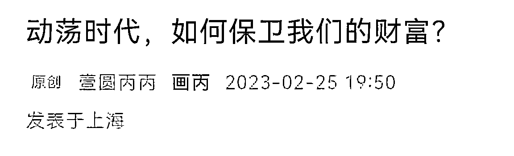 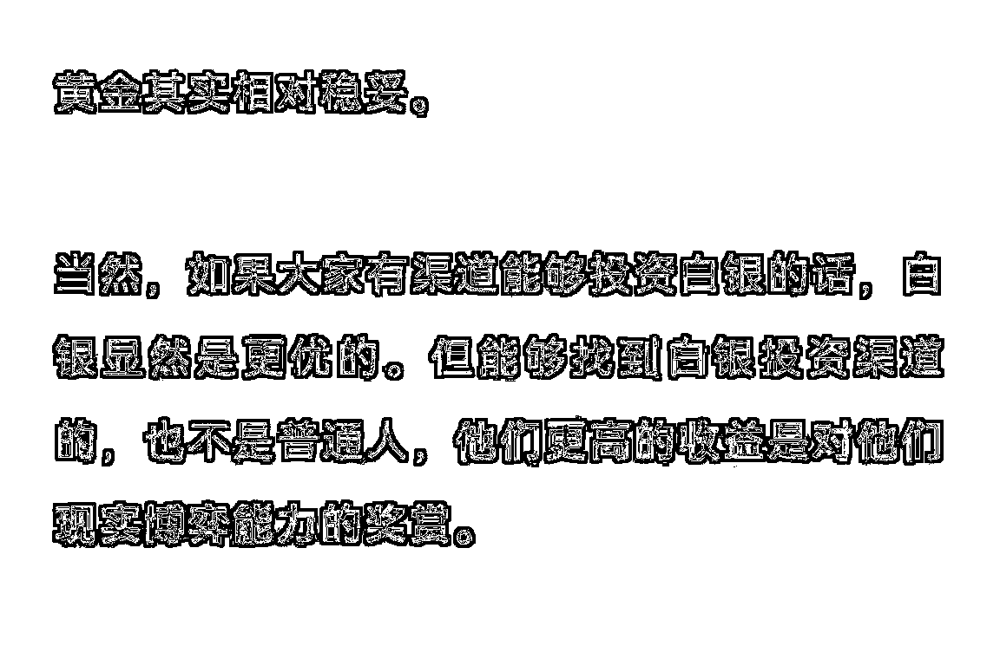 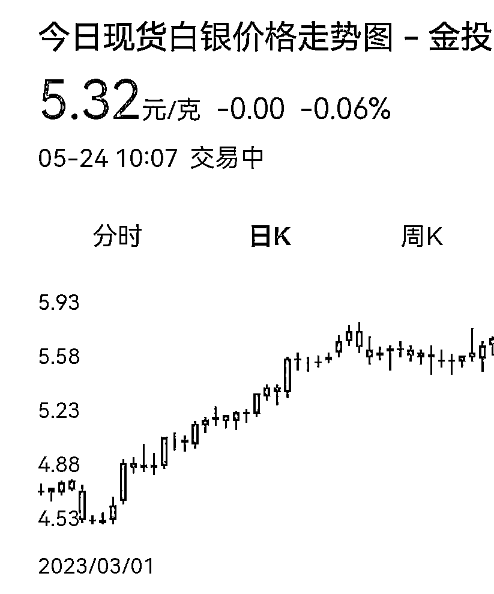

 

 

无论是经济金融我的本专业，还是政治历史，我都能融会贯通，拥有自己的底层框架并做到准确预判。（曾和200W粉丝的时政大V有过预判类合作，也跨专业考上过清北的政治学博士）

但因为以上这些都比较偏“道”的方向，我一直担心在“生财有术”分享内容会不合时宜。

前两天在靠谱老师和醒醒老师的指引下，做了盖洛普测试，发现我排位前两名的才干分别是战略和行动。然后看解析说战略和行动是非常互补的一对才干，能够彼此成就，发挥更大价值。

于是我认识到，可能我的“战略”才干（抬头看路）也能对生财诸位行动力满满的小伙伴带来一些启发。

于是想到可以把之前在公众号发的一篇付费文章《把握财富的本质，实现阶层跃升》贴出来，从专业投资人（证券&风投）和政治学视角来拆解财富和资本喜欢商业模式的底层逻辑，希望这不同的视角能对大家有所启发。

 

 

以下是原文，略有删减：

不少人盲目地追逐“纸币”，以为“纸币”就是财富。却不知道，“纸币”只是一重表象。

掌控财富的真正核心是，能够持续不断地从社会中提取剩余。

绝大多数人追求“纸币”的积累，但却不能理解，“纸币”的积累是存量，“存量”是过去的事情带来的结果。

而**“**财富**”**是什么？

**“**财富**”**是让别人的钱流向你口袋的过程。你变得更有钱的过程，就是更多人的劳动和价值转向你的口袋的过程。

那么如何让他人把口袋里的钱掏给你呢？

除了《刑法》里的办法之外，唯一颠扑不破的法则是：

你对他人有用（有利益），或者你可以对他人施加损害。

** ** 你对越多人有用，你的用处越大，或者你可以对越多人施加损害，你能施加的损害越严重，那么你能把控的财富就会越多。

 

 

根据这条法则，赚钱有**“**三种常见的商业模式**”**。

第一种商业模式，靠体力赚钱，赚的是**“**血酬**”**，花费的生产资料是自己的时间和健康。

80%的人玩的是这种商业模式。

而往往深陷于这一模式的人，有线性外推人生收入的本能，缺乏对底层逻辑的认知和把握、以及对未来可能性的想象能力。

这是因为他们从事的大多数是机械重复的无脑循环工作，且占据了他们所有的时间，让他们无暇深度思考。

这种工作已磨损了他们的认知和思考能力，长期和枯燥单调的事物打交道也让他们不敏感于时代水温。

于是他们倾向于把当前发生的事，永续地推到未来。

我在去年11月初的文章《大部分人都是“底层画师”》中，已提前推演了这部分人的未来。

人能够获得“财富”的基础要素是对他人“有用”或能带来“损害”。

而对处于这一境界的人来说，他们对他人（老板、领导）的“有用”体现在，完成一些没有含金量的，螺丝钉式的工作。

 

 

因为老板和领导的时间更珍贵，需要去做更有意义和价值的事，所以需要把一些没有核心竞争力的，没有大的用处的工作“外包”出去。

花一点钱，去买时间相对不值钱的人的时间。

且这种工作让人们将全部的时间和精力花在低价值的事情上，没有闲暇去自我提升、积累和向上突破——

做这种工作越久，这部分群体就会越缺乏议价力。

而从宏观角度上来讲：

只有这部分群体没有议价力，才实现了组织层面的降本增效，加强了资本主义社会的经营效率。

而随着AI带来的第四次科技革命，不难发现很多这种类型的“打工人”已不再被需要。

他们做的所有工作AI都可以完成，且价格可以更便宜，效率更高。

这部分群体注定会成为“无用”之人，与“财富”无缘。

当然，他们的跌落是相对而不是绝对，为了避免社会的失序动荡，需要提供基础的社会保障。

 

 

第二种商业模式，掌握稀缺社会资源赚钱。

这其实是伴随着“私有制”而来的资本主义“控制财富”的方式。

因为**“**私有制**”**的存在，使**“**排他性**”**掌握稀缺社会资源成为了可能。

什么是社会资源？大家可以简单地理解为，是社会运转、我们的生活中，会“用到”的那些东西，有形的比如说厂房，无形的比如说技术、数据等等。

这里我更加要强调的是“稀缺**”**的社会资源，“稀缺”两个字是关键。

稀缺其实有两个意思。

稀指的是这种社会资源的总量非常有限，最终只能由少数人把握，大多数人都把握不到，根本上不了牌桌。

缺则指的是社会运转中**“**必不可少**”**，没他不行的重要资源，这意味着这种资源有着巨大的社会需求。

“掌握稀缺的社会资源**”**，意味着你对那些没有这些社会资源（上不了牌桌）、但同时又非常需要这些社会资源的群体们，有巨大的**“**作用**”**（得利）、或者是能够**“**加害**”**的力量。

 

 

而刚才我们已经说了，财富的本质，就是能对他人施加**“**得利**”**或者**“**损害**”**影响，从而让他人必须同你**“**做交易**”**，向你**“**上供**”**他的劳动剩余。

来举几个“掌握稀缺社会资源”的例子。

大家最耳熟能详的就是“房地产”，特别是北上广深等超一线的房子。

房子是社会运转中，必不可少的“生产”工具。因为打工人上班，总需要地方住，你需要休息，养精蓄锐，好让你能恢复精力和体力，继续第二天的生产。

因此房子是非常“缺”（有需求）的社会资源。

那么“稀”体现在哪里？体现在北上广深的城市面积就那么大，有物理限制，你在这里扎了一块，那别的地方就没地盘了。

这就是“稀”，只有少数人能掌握，不可能13亿人都掌握。

故而北上广深的“房东”们，实际上就有了对精英打工人的议价力乃至“控制力”，必然可以从他们的“高薪”中分得一大块蛋糕。

因为你不“上供”，也会有其他需要住所的“打工人”们“上供”，在市场的调节之下，稀缺的社会资源就发挥了它的价值，帮助房东赚取了“财富”。

当然，房子作为“稀缺资源”的逻辑是上个时代的逻辑，在现如今已经产生了破坏。

 

 

读者朋友们可以尝试按照丙丙给的框架去推导，到底是哪里被破坏了，我们之后也可以在星球继续讨论这个话题，在这里不赘述太多。

再来举一个“无形”的例子，那就是移动互联网普及之后，“流量”实际上也是“稀缺社会资源”。

“流量”是如何影响和改变我们的社会生产和生活的呢？

当我们的生活离不开手机、移动互联网和各种APP。我们的购物、消费、娱乐和社交都离不开各种APP。

每次打开APP，贡献一个浏览，其实就是在贡献“流量”。

而“流量”也就和现代社会的生产者和消费者都绑定了，成为了“缺”、也就是蕴含着巨大需求的社会资源。

那么“稀”体现在哪里？

流量的本质是人们的注意力，而人们的注意力是有限的。

14亿人的一天只有24小时，要被微信、抖音、小红书、知乎、淘宝等APP来刮分，所以互联网巨头都那么焦虑。

这就是“稀”，只有少部分APP能刮分绝大多数流量，大家都怕别人多吃一口，自己就会少吃一口。

 

 

这也是为什么，微信这么焦虑小红书，所以要把公众号进行“小绿书”改版，留下用户的注意力。

许多自媒体大V，非常清楚自己的“护城河”、也就是掌握“财富”的本质——其实是把握自己的“流量”。

他们小心翼翼地捍卫自己的流量，不肯以任何方式把流量扩散到“外人”那里去。

因为他们知道，流量代表着一个大V能吸引多少人的注意力，拥有多少影响力，在多大程度上能影响多少人的心智。

而人们的心智是有限的，一个新大V的崛起，咬下一块蛋糕，都会让守擂的国王们感到焦虑。尤其是，画风和调性相近的新晋V们。

多说一句，科技是当今世界上，最重要的稀缺社会资源。谁掌握了科技，谁就赢得了其他国家向它“上供”的核心权力。故而掌握着科技的国家要想办法保证科技“稀”的属性，确保关键技术只能掌握在自己手里。

在这里就不延展了。

还有一种大家经常会听到的稀缺社会资源，是“人脉”。因为社会的运转、财富的创造都离不开“人”去做，把合适的“人”撮合到一起去做事，本身就是社会运转非常重要的能力和“资源”，这是“缺”。

 

 

而“稀”的方面，同样是基于人这种动物的特性——人的注意力、精力和活动范围都是有限的。你会发现人能够直接认识、深度交往的人非常有限，故而“优质人脉”就具备了“稀”的属性。

而另一个优质人脉“稀缺”的原因，丙丙在《真正的狠人，收割富人》里阐释过底层逻辑：

那就是越是金字塔上方的人物，信任成本会越高，这同时增加了优质人脉掌握者的“稀”和“缺”的权重。

刚刚丙丙举的这些例子，是为了方便大家更好地理解，什么叫掌控稀缺社会资源。

那么根据大家有没有已经握在手里的**“**稀缺社会资源**”**，会衍生出两种不同的打法：

一种是守擂者：他们要牢牢固守住社会资源掌控者的位置，比如说自媒体大V要把控住自身流量，坐稳护城河，并且想办法最大化资源的价值，让更多人更深刻地给自己“上供”。

个人的精力有限，但是有“产权”的保障手段，就可以通过“股权”的方式制造自己的“分身”：

比如说批量注册几十几百个公司和账号，招聘写手做内容，自己给这些矩阵账号导流，然后一遍遍薅流量钱（粉丝注意力），将手里掌握的资源吃到最大化。

通过股权方式，可以建立自己的分身。

 

 

这不仅会让自己吃到更大一块蛋糕，也防止了竞争对手抢自己的蛋糕。

所谓**“**护城河**”**的本质，就是使自己掌握的社会资源始终保持住**“**稀**”**和**“**缺**”**的属性，然后通过分身的方式最大化利益、排除竞争对手。

而这也是，许多公司做大后四处股权投资，收购兼并的核心原因之一。

而另一种打法是**“**攻擂者**”**：攻擂者暂时并没有掌握住稀缺的社会资源，但他们敏锐地捕捉到了时代的改变，并且具备把握新时代需求的素质和能力，能借到“历史”的“大势”。

那么“攻擂者”可能通过“创新”等方式，实现“弯道超车”：

在**“**新的稀缺社会资源**”**代替**“**旧的稀缺社会资源**”**的过程中，通过抢先入局和迭代，先行掌握住了**“**新的稀缺社会资源**”**的方式，完成了对旧有利益集团的**“**新陈代谢**”**，成为了新的社会资源的掌控者。

这就是，搭上了历史的**“**进程**”**。

比如说，互联网大V的崛起对传统报刊纸媒的“革命”，就是大V们抢占了新的稀缺社会资源——互联网流量；代替了旧的稀缺社会资源——书城、报刊亭等等。

** **而搭上**“**历史的进程**”**，往往才是普通人改变命运，实现阶层跃升的关键。

我们这代人的幸运恰恰在于，当前处在AI发展的初期阶段。

 

 

从现在起到未来，正在孕育和发生着大量“新稀缺社会资源的诞生”和“旧稀缺社会资源的湮灭”。

抢占掌握新稀缺资源的普通人将会崛起，而随着旧稀缺资源的湮灭，一批既得利益集团也将会跌落。

接下来，我们再聊聊第三种商业模式，通过制定规则来赚钱。

第三种商业模式是第二种商业模式的“进阶版”，你可以理解为**“**制定规则**”**是建立在**“**一定程度掌握了稀缺资源**”**的前提之上的。

而另一方面，**“**制定规则**”**则意味着建构和把握住了更深层次的**“**稀缺资源**”**。

举个例子，在第二种商业模式中，你可能是掌握了更多筹码的赌徒；但在第三种商业模式中，你是开赌场的老板。

在你的场域中，你说了算，你是庄家，你制定规则，你演化出生态，你是绝对的主场。

而在构建这个属于自己场域的过程中，要注意做到把更多人绑上自己的战车，通过分利让利的手段，让更多人、特别是牛人能在自己的场域中得利，这样便可以借助牛人的力量，将自己的场域推广的更远，让自己掌握更强大的“制定规则”的力量。

（可以参考我之前的文章《如何成为社会资源的掌控者》）

 

 

当更多人进入你的主场，形成了生态，更多的人来玩你制定规则的游戏，你就能让他们每一个人为你的场域“贡献价值”，从而稳坐钓鱼台。

因为你是“上帝”，你是“裁判”，你对你的场域的所有玩家拥有最大的**“**得利**”**和**“**施害**”**的能力，故而你总能从他们创造的价值中分得份额。

现实中，这个模式的玩法是很多的。

小到网络游戏，建立起生态，制定好规则，那么无论是非氪金玩家还是氪金玩家，都要向游戏公司上供。如果不是金钱，就是注意力、以及对整体生态的贡献。

再比如说像CFA这样的金融资格考试，因为制定规则、拥有了对考生的裁量权，而考生需要资格证来找工作，故而能够稳稳地收割考生的财富。

这就是“坐庄”的思维和能量。

再比如说所有的互联网平台，微信、小红书、抖音等等，都通过建立生态，并成为生态规则的制定者，相对于平台上的玩家来说，就是可以稳稳地抽取玩家的“价值剩余”。

这也是为什么，互联网公司的那几年，创造了估值几百倍甚至千倍的独角兽们，让许多资本赚的盆满钵满。

因为**“**建立生态**”**、**“**制定规则**”**，是最深刻地能对参与者施加**“**得利**”**和**“**损害**”**的商业模式。而一旦生态完成，就会有自复制自延展的**“**滚雪球效应**”**，**“**赢家通吃**”**，排除狭义上的竞争对手。

 

 

比如说微信作为通讯工具，根本没有竞争对手。

这也是丙丙做风投，和创业者聊得最多的地方，想清楚你的商业模式，最好你的商业模式能具有自延展性，让你有机会成为规则的制定者。

大家可以按这个逻辑推演一下，目前我们这个世界上，最厉害的规则制定者是谁。

当然，“坐庄”听起来很爽，效果也很给力。但丙丙要提醒大家的是，任何事物背后都有价码，世界是无处不在的利益博弈。

“坐庄”能够稳稳收割所有牌桌上玩家的背后，是它也在向所有玩家**“**提供一定的价值和秩序**”**。

否则，这个“庄”一定坐不住，会被联合掀桌子，或者被其他玩家“抢了”庄家的位置。

举个例子，淘宝向店家征收手续费，但与此同时，它也必须迭代自己，提供优质的服务和流量，解决信息不对称的问题，才能保证长期征收手续费下去。

否则，便会有“创新者”进来钻空子，“抢庄家”的位子。

而从这个角度讲，这也是为什么要一定程度“反垄断”：

因为“反垄断”意味着到处都有潜在的准备“抢庄家”的“创新者”，有了这些群体的虎视眈眈，会倒逼现在的“庄家”必须向社会提供更有价值的服务。

 

 

否则，任由占据了优势地位的大公司，一家独大的兼并和收购，“招安”所有的“潜在创新者”。

一旦失去了外部威胁，就可以尽情摆烂，提供更劣等的服务，从而损害公众的利益。

以上，就是赚钱的三种常见的商业模式。

而除了这三种商业模式之外，还有一种赚钱模式，我称之为**“**赚风口的钱**”——**  看什么风刮过来，我就冲进去捞一笔，赚风口的钱，虽然是“一波流”。

这种钱的本质，是因为敏锐于时代需求和风向的改变，于是能做到在**“**新的稀缺资源**”**替代**“**旧的稀缺资源**”**的过程中，去抓了一下**“**新的**”**。

但因为能力不够或者认知不够、运气不足，最终并没有抓到**“**稀缺**”**资源，因此无法产生**“**复利效应**”**和**“**护城河**”**，缺乏长期的积累和发展性。

许多三天两头换营生的“生意人”，一波一波吃风口的，其实赚的就是“这个钱”。

最后，如果我们再来总结一下赚钱的“三重境界”，去探究财富的深层本质，不难看出财富的本质可以浓缩成两个字：

** “**拿捏**”**。

 

 

无论是物质还是精神上的“拿捏”。（比如说奢侈品就是一重精神上的拿捏）

你能拿捏越多人，你拿捏的人越有影响力、能量越大，你拿捏地越深刻，你就能掌控更多的**“**财富**”**。

从这里，我们可以更深刻地理解马克思的那句话——财富是权势。

因为权势的本质，同样是“拿捏”。

理解了这一点，大家就会理解到，在社会金字塔向上走的过程，是一个**“**拿捏**”**自己的人性、**“**拿捏**”**他人的人性，既控制自己，也驾驭别人的过程。

驾驭别人固然重要，但控制自己更为重要。

否则，则会不可避免地被其他精明的镰刀所“拿捏”。（《真正的狠人，收割富人》）  而对于无权无势的普通人来说，做到**“**拿捏**”**，就是要做到：

** **首先提供价值（满足他人的需求，对他人有用），然后想办法完成绑定，把更多人绑上你的战车，让更多人离不开你。

故而使你产生了能够对他人**“**给予利益**”**或者**“**招来损害**”**的权力，无论是物质亦或是精神上。

 

 

例如苹果通过一款丝滑的手机，给予消费者价值，然后通过独特的操作系统完成绑定，让全世界30%的消费者离不开它，于是便只能给苹果不断上缴“苹果税”。

在爱与恨的交织中，痛并快乐地“上供”。

而此种心法，则不仅仅是在“财富”领域，在人际和情感领域都可以广泛复用。

因为这种心法的实质，是在教你如何获得权力。

而人世间的一切，本质都与权力有关。

以上，就是这次分享的全部内容了，最后请读到这里的圈友们思考一个小问题，“生财”是什么样的模式？它为什么能做的这么优秀？

感谢你的耐心阅读，我是丙丙，欢迎大家留言或私信与我交流。

评论区：

無限进步 : 即答：世界上最厉害的规则制定者是美联储（美国）[奸笑]吸全球血液，割全球财富

小花 : 第一个链接打不开

lydia : 深度好文[强][强][强]

有财华的宇宙哥 : 有微信吗？

亦仁 : 感谢分享，已加精华。

不知信安Na : 好文。已阅

pope : 写得真好

邵顺霞@HWP : 很深，需多次阅读[强]

 

 

# **# ****(**精华帖**)(144**赞**)**直播售卖中考规划课程，一

# 年变现** 40W+ **的经历分享

作者：  汤鱼儿

日期：2023-02-03

Hi，我是汤鱼儿，上海交大双硕士，抖音学浪金牌老师，6年+学习规划师，有培养过3000多名线下学霸的经验。

但去年我也经历着加入生财2-3个月找不到方向、教育行业遭遇双减，疫情，以及二宝出生，失去工作等一系列事件。

这一年多，我从入生财时完全不知道线上是怎么回事，到现在差不多1年多的时间线上变现40w+，很多东西确实应该梳理一下。

为什么切入家庭教育赛道，也是跟着 @沐文  和 @花爷  学习打造个人商业IP，确认了教育博主的定位以及卖课的变现方式，又跟着抖音IP直播航海实操，当时变现很快，基本上前面10场就开始陆续有家长买我的课程。

课程的逻辑是：为3-15岁家长，用299的价格，以录播课的形式，提供从幼儿园启蒙一直到中考这条路径上的学习攻略，让家长思路清晰的知道每个年龄段的学习重点和安排，同时给到他们实操，助力家长把孩子养成学霸，最终实现轻松跨过中考，不被55分流的目标。

转化路径是：抖音直播卖课-->客户进入粉丝群-->部分引流到个人私域。

那接下来就把我的故事详细讲给大家听一听，以及一些经验和感悟也可以分享给大家。

 

 

可能内容有点长，我把他做成思维导图，大家看一下这个文章的框架，就能重点来看内容了。

# 一、简单的故事来讲一讲我是如何开始

# 从线下转到线上讲抖音的？

这个故事可以分为6个阶段，咱也用思维导图画一下，大家就知道我如何“变身”的了。

 

 

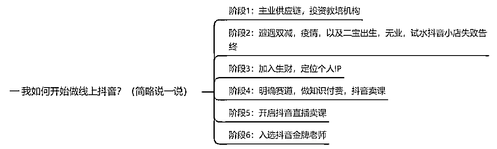

阶段一：

我的主业并不是一开始就做教育。我原来的经历背景是在供应链管理，但是自从有了娃，我的心思就在娃身上了，我大娃现在是11岁，就等于在11年之前我就对教育这个事产生了浓厚的兴趣。

15年我考上交大硕士，毕业之后，我就把精力花在了教育相关的工作上。我趁当时线下教培还挺火热的时候，同时投资了上海两家教育培训机构，那两机构主要是做幼儿园和小学以及初中生的相关课程的，幼儿园做兴趣，小初做提分，当时是作为兴趣投资，也确实赚到了一些钱。

阶段二：

这个阶段的故事基本上是每一个教育人都会讲的故事，19年开始，教育行业遇到了双减，之后又遇上了口罩事件，同时我家有了二宝，这一连串的事情成了我人生的一个转折点，我们投资的两家教培实在是撑不下去，直接关门了，同时因为二宝太小外加疫情，我就成了一个无业中年人。

 

 

那我还是算喜欢折腾的一个人，在我每天无所事事在家带娃的日子里（也不算无所事事，我入了一个微商，但是挣不到钱，哈哈），我卯上了抖音。

之所以我这么一个完全没有“网感”的人能盯上抖音，是抖音在持续发力商业版图推出的抖音小店，他们那时候专门会有工作人员打电话让你在抖音开抖音小店，虽然我都不知道这个啥小店到底是怎么回事，反正就随便玩玩，花了2000买了1500个抖音的粉，然后就开始琢磨怎么变现了。

我当时做抖音做的是无货源，20年年初开始做其实不算晚，但是我愣是没整明白这个无货源到底咋回事，所以这个小店就荒着啥也没干。

那时候，我对新媒体的所有认知只有微信，我自己有在微信开过公众号，虽然没变过现，但相对于抖音，微信还是我的“舒适区”（见笑见笑）。

所以我一心想着能不能在微信能赚到点钱，当时有事没事就拼命找各种技术贴去看，然后21年时候通过@铭则  他的引流贴（哈哈）入了他的群，刚好是在4.18之前入的，到了4.18铭则跟大家推荐生财有术，当时也是舍得掏钱，花了1500多入了生财。

（真的是稀里糊涂入的，当时也真的是舍得掏钱，毕竟1500多对于我们这些对新媒体没概念的人，入这么一个群真的是觉得好贵）

阶段三：

入了生财以后，发现里面都是大牛，干货太多，都看花眼了，看了两三个月都找不到自己的定位。我尝试着去做过饿了么的CPS，但是发现自己根本不适合，也考虑过shopee这一类的境外电商，但是自己没经验，也没团队，所以也没开始。

 

 

转机在生财的大航海，不记得是哪一期大航海了，只记得我们当时船长是@沐文，我那时候还是啥也不懂，但是隐隐觉得可能可以往IP方向去走，所以那次大航海跟着沐文船长走下来，我最大的收获就是非常明确的知道商业IP这个事情，但是对于定位到底怎么定，我自己适合哪个方向这个事还是没谱。

所以继续在生财里面泡着，找到了@花爷，  知道花爷是个人IP打造的能手，所以当时又花了1800的“巨资”入了他的个人IP入门营（当时觉得真的是巨资，所以你看认知差有多可怕），花爷的课彻底让我开了眼，在课里面我知道了个人定位，找到了商业闭环，我按照花爷的方法给自己定位在3-15岁的教育博主，当时抖音的图书非常热，所以想着打造一个学霸的人设，然后在抖音带书。

阶段四：

开启这个阶段的标志性事件是因为蝉妈妈数据的一次分析。通过生财我知道原来抖音是有数据分析平台的，因为自己是供应链出身，对数字还是有点感觉的，所以有一阵子非常喜欢泡在蝉妈妈里面看数据。

当时做了一个非常有意思的事情，就是我把我认为的对标账号的数据都去做了一个归整，印象里是找了100个左右抖音里面做教育和母婴这一块的博主，然后去看他们的销售数据以及他们销售的利润，然后我惊讶的发现，原来在抖音里面带书的博主，真正赚钱的就是头部博主，而且“头”非常大，行业集中度非常的高，到了中腰部的博主，真的赚的money也不算很多。

但是有一个人的数据非常的抢眼，就是“博士晴妈”。博士晴妈当时的粉丝量还不算很多，印象里是10几万的粉丝量，但是她的利润要比很多粉丝量在三四十万，甚至七八十万的带书博主的利润还要高。

 

 

当时确实很惊讶，然后发现“博士晴妈”真正的利润款在于她的课程，从那个时候，我才知道抖音上是可以卖课的！而且这个卖课的利润真的非常的高。

有了这样的认知，我才算是把我自己的定位和闭环都画好了，我决定卖课（反正带书又没有优势），自己开发课程，同时为了尽快赚钱，我直接把闭环的链条砍短了，本来花爷那学到的是：引流-私域-朋友圈运营-课程售卖这样的闭环，但是我觉得要从抖音引流到私域，然后还要通过朋友圈运营卖课，这里面的链条实在是有点长，对于我这样的“超级三脚猫”实在是不友好，我直接把链条砍短，准备直接在抖音卖课。

然后当时就非常幸运的碰上了生财的又一次大航海，这一次大航海是抖音个人IP，带你打造抖音视频爆款的，我没做出啥惊天动地的成绩，但是拍了一个“我的十年”，把我的个人定位基调定下来了。

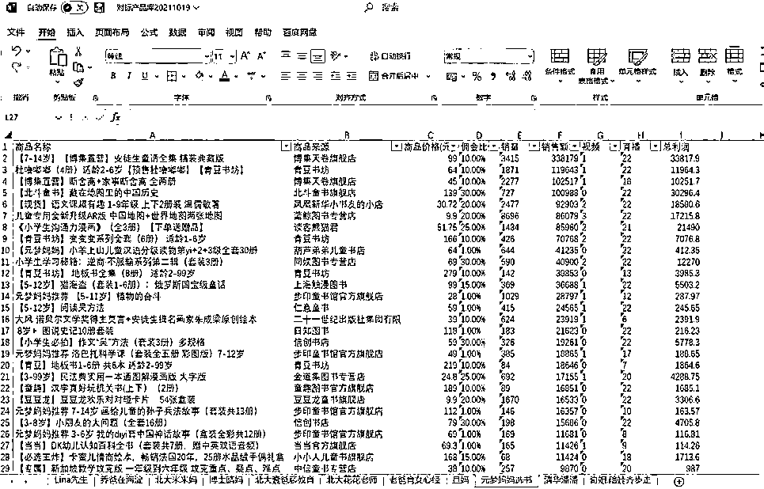

当时从蝉妈妈上下下来的数据，这个数据你通过蝉妈妈官网->达人详情页->带货分析  这个路径下能找到

 

 

阶段五：

这个阶段是从直播开始的。21年年底时候直播这个事风头很劲，我就想着再把链条砍短一点，通过爆款视频卖课的可能性还是比较小的，不如直接直播。

当时也盯了几个对标直播间，类似于“付付老师教育圈”“北大花花老师”以及“博士晴妈”，光看热闹了，没摸清楚啥门道。

但是呢，22年3月份时候，我们生财又开启了一个大航海，这次大航海的主题是：抖音IP直播。

哇！我真的运气太好了，这一路上的每一个节点我都是跟着生财过来的，每一个大航海都是我的里程碑，四月份我开始跟着大航海开启了我的“直播生涯”，当时我变现很快，基本上前面10场就开始陆续有家长买我的课程，然后到了五月份时候，我场观在2000左右，每场销售额在1000-3000左右。当时自己觉得挺惊讶的。

 

 

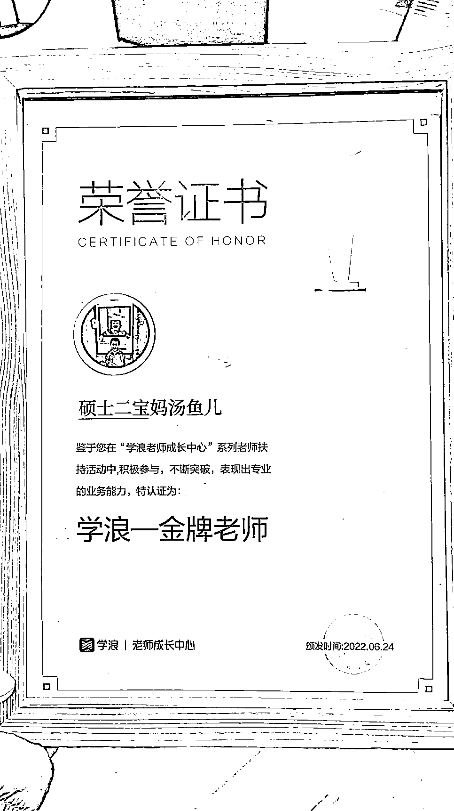

 

 

秀一秀证书吧

阶段六：

这个阶段是源于抖音对个人主播的一个扶持。直播到5月底时候，当时我入选了抖音的金牌老师培训，然后通过考核也成功拿到了“学浪金牌老师”的称号。

通过这一次抖音直播的内部培训，我总算能明白了自然流量和付费流量大概的玩法是怎么样的，如果要做自然流量，大概的环节和注意事项是哪些（这些我晚点干货环节会跟大家讲）。

那我做的一直都是自然流量，虽然做得不算太好，但是从6月底到现在12月份，也经历了日入2w的“高光时刻“（对于我这种大虾，日入2,3千才是常态，能够以万打头真的是高光时刻了，所以大家见笑啊）

贴一下数据

ok，以上罗里吧嗦一大堆就是我一路过来的历程，感谢大家看到这里，之所以跟大家讲这么多，是想跟大家提炼两个点：

 

 

**1.**入了生财干货贴一定要看，大小航海一定要跟；

**2.**虽然我做的不咋样，但是我这么一个三脚猫，从完全不知道新媒体咋回事到能够闭环，说明我确实是踩对了一些点。

所以接下来，我要跟大家来讲讲我认为的干货，希望对知识付费感兴趣的亲，以及对直播这个事情感兴趣的亲能给到大家一些启发。

以下是本帖的干货内容，只适合入门级别的朋友。

# 二、**3-15**岁学霸课的思路、框架（我的

# 定位历程）

我的抖音账号：硕士二宝妈汤鱼儿，目前账号粉丝是3.7万，主要的变现方法：1.直播卖课，2.视频带书，目前精力主要在直播带课上。

 

 

在这里，我重点来讲讲我如何找到定位的过程。我自己感觉就是对于刚刚开始做IP的人来说，找到非常明确的定位还是挺难的，我们如果要通过个人IP定位，一定要把赛道定位到足够细分，才能更快的闭环。

我来讲讲我定位的方法，这个方法是从**@**花爷** **课上学到的，再次感谢花爷。

首先，先要找准大的行业。

自媒体大的行业，也就无非资讯、财经、教育、娱乐、科技、商业、体育、母婴...这些，既然要做自媒体，那我们大概的行业类目还是能很快的明确的。

就像我当时准备做IP时候，虽然我还不知道我应该怎么实现闭环，但我知道我大的行业肯定是在教育，因为在教育行业我是相对比较有资源的，而且也有经验，同时确实离钱挺近（妈妈们在教育上舍得花钱）。

这个考虑，就符合了花爷说的：优先选择离钱近的或者资源较多的原则。

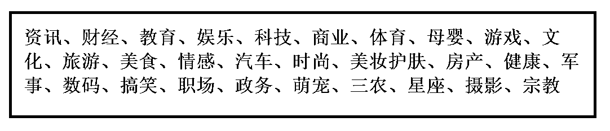

自媒体大行业也就这么多

第二，有了大的类目，就是要去切细分市场。

 

 

那细分市场是什么？就是消费者们的消费需求。

咱把细分切的越细，就越能让消费者明确的掏钱，譬如教育市场，有学龄前，有K12，还有考研考公各种细分，但是我如果说我是做小学生教育的，那这个类目还是太大了，对于家长们来说，你跟他说我是做小学生教育的，那就等于啥也没说。他没办法在脑海里给我们做个定义，那他就没有理由为咱掏钱。

所以，在细分市场定位上，我觉得有个小小的诀窍，咱可以去做逆向工程，我们去看我们的对标，像我当时就在抖音上搜罗了几十位在我当时看来跟我定位差不多的博主，我去拆解他们，带着这几个问题去拆解：

1.他们是谁？（他们给自己贴的标签）

2.他们的专业能力是在哪里？

3.他们的标签和专业能力是如何挂钩的？

4.他们是如何火起来的？（这个很难复原，但是靠抖音视频能看个大概）

5.他们的加分项在哪里？

6.他们的目标群体是谁？（目标群体一定要够细，细化到年龄、省份、收入、职业、收入这些）

7.他们是怎么实现商业闭环的？

8.他们的定价如何？

9.他们的利润如何？

10.他们的产品解决了什么问题？

 

 

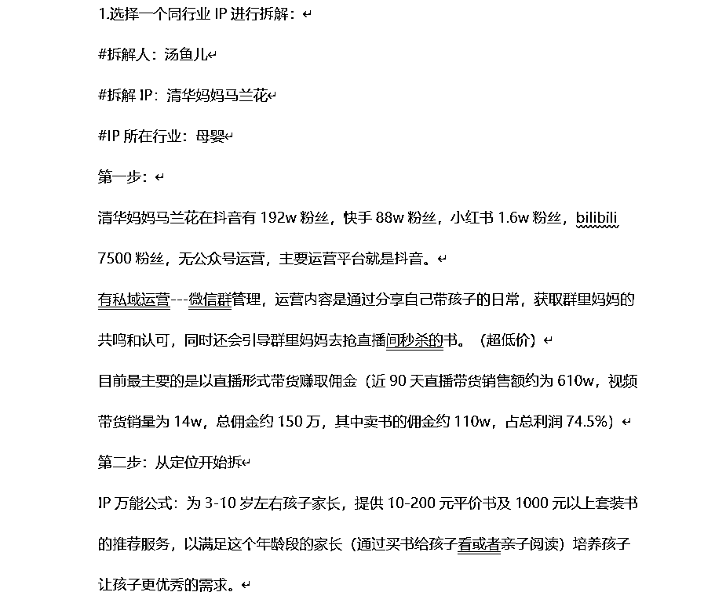

这个是我当时拆解“清华妈妈马兰花”的部分内容截屏

我的心得就是一定要多拆几个，你会发现用上面那10个问题拆同行拆的多了，你就知道了这个行业类目下的大概玩法。这个玩法你总结出来，才知道你自己能不能做好。

（就像我当时一开始是准备做带书的，然后拆了几十个对标之后，发现原来带书真正赚钱的只是头部博主，中腰部赚的其实都不咋样。而且直播带书是需要团队运营的，没有团队基本上玩不起来。同时，因为要涉及到供应链，你的供应链谈判能力要够强，或者你是大号或者你特别能卖，你才能拿到一手货源和信息，这些要求对新手其实都不友好，也是我后面放弃这条路径的原因）

第三，了解好同行有了细分定位之后，就要明确自己的IP定位。

 

 

这个定位用一句话概括之后，就应该能让你的客户为你掏钱。如果他没有动心，说明咱没敲到痛点。

那我这个学霸课的定位，概括出来就是：

为3-15岁家长，用299的价格，以录播课的形式，提供从幼儿园启蒙一直到中考这条路径上的学习攻略，让家长思路清晰的知道每个年龄段的学习重点和安排，同时给到他们实操，助力家长把孩子养成学霸，最终实现轻松跨过中考，不被55分流的目标。

这个定位里面包含了这些要素：1.我的目标客户 2.价格 3.我提供什么样的服务？4.我能帮他解决什么问题（痛点）。

这几个要素是最基本的要素，当然如果你还能更加明确，譬如用什么样的路径，什么样的亮点这些都想明白了，我觉得基本就能着手去做了。

第四，最好还有一些PLUS.

因为给人IP是一个活生生的人，所以我们如果一直只秀专业性是不够的，你要用你的真实性去打动用户。如果你的用户能说出来你是个什么样的人，那基本上也算成功了。

所以我们看到很多IP特别能怼人，有些IP特别能哭，有些特别贴心，这些是在专业性之外贴的个人标签，互联网时代，能有这样的标签更容易火不是么？（这个点我没及格，哈哈）

那这个就是我的个人定位的历程。

 

 

当时定位时候也是非常模糊，甚至非常焦虑，不知道到底应该咋弄，当时我甚至还找了大航海的老师去问，说我拍视频时候到底是应该穿啥，到底要不要画一个精致的妆？

老师当时回我说，不要管这个，你先做起来再说。现在想想这句话说的很对，先干起来你才知道如何去调整，所以IP这个事，我觉得先把基础的闭环想好这个第一重要，第二重要的就是想好了就一定要干起来。

接下来我来讲讲我的学霸规划课。

这个课的课程框架：

围绕学霸培养这个中心，这个课程是从中考分析开始讲，然后基于中考的特点告诉家长每个学科应该如何从幼儿园小学就开始有条不紊的准备，内容分为中考分析、学习方法、学习动力来讲。同时又按不同年龄段进行详细的讲解。（如下）

 

 

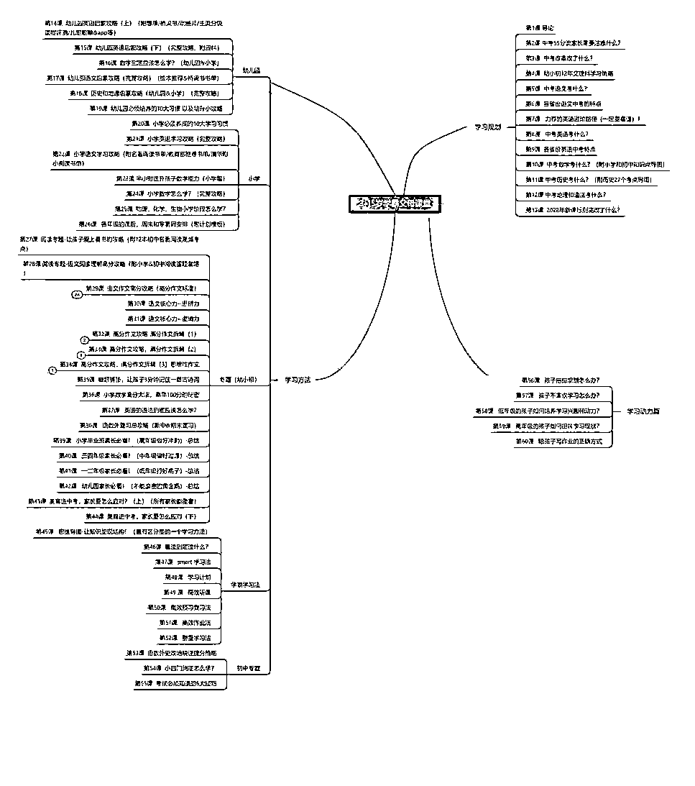

这个课的亮点：

1.12年更新，12年答疑服务。

 

 

--目前市面上199、299左右的课程，很多是一杠子买卖，我觉得客户存留应该不是太好（但这个只是我个人的想法），所以我就想目前我能力有限的情况下，先把客户留下来，那要留下来，一要么就引流私域，二么就是能够持续提供价值，引流到私域这个事我觉得我精力不够，所以我选择第二种。

对于家长来说，有12年更新而且带着他们从幼儿园走到中考，他们会觉得性价比较高。

2.课程给到的是系统的攻略，相对于市面上很多学霸课是零散的解决问题，我的课程相对是成体系的，逻辑很清晰，同时上的是完全可落地的攻略，看了课的家长给的反馈都不错。

目前我的转化路径是：

抖音直播卖课-->客户进入粉丝群-->部分引流到个人私域，私域这一块现在还没做起来，现在准备组个小团队，把私域这一块做起来了。

抖音引流我一直做的挺小心的，用的是小号在群里面（坚决不要用大号！）说话，然后用诱饵（譬如说赠送什么资料之类的），让粉丝加我微信号。

# 三、抖音直播经验分享

 

 

接下来跟大家来讲讲我这8个月的直播历程，以及我积累的一些直播经验。

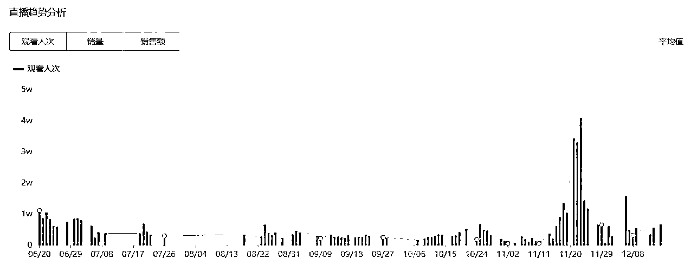

上图是我蝉妈妈里截取的我自己账号的180天直播场观变化趋势图。基本场观在3000-4000左右，有个异常值在11/20号前后，是因为我有个视频小爆了一下。

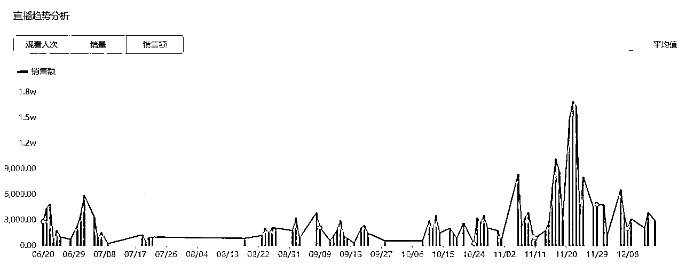

这是对应的销售额变化图。

 

 

成绩不算很好看，但是也算是稳中有升的状态，所以我来说一说直播里的一些经验，希望能对大家有用。

来讲两个点：

1\. 直播标准流程和数据复盘（自然流）

2\. 没有团队个人如何引流的一点小经验

# **# ****1.**直播标准流程和数据复盘（自然流）

以下内容是基于自然流量来讲的。也是是抖音给金牌老师内训时候给到我们的攻略，我自己也实操下来确实觉得很好用，所以值得大家一看的。

# **a.**首先，自然流量下的直播黄金流程和标准规范。

抖音知识付费的主播，如果想要撬动更多的自然流量，是有个黄金流程的。这个流程可以归纳以下这张图：

 

 

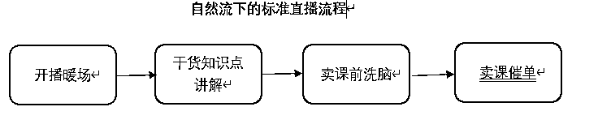

第一阶段开播暖场是为了让路过的人留下来，同时快速的建立信任，同时通过极速互动让系统给你推人。

开播暖场7步法，也给大家贴一贴：

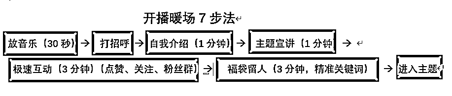

在这个环节，最重要的事情是去做极速互动，要尽量的让用户跟你做短平快的互动，如果能极速互动3分钟，系统就会给你推人。这个极速互动是指点赞、关注和进粉丝群，所以要尽可能的准备一些诱饵让用户愿意跟你来做互动，这个点我自己一直没做好，惭愧，不过大家可以去找找优秀的对标学习一下。

接下来是第二阶段干货知识点讲解。这块内容基本上秀肌肉的意思，要让客户通过你的干货内容留到你卖课，系统会先重点考核你的客户存留时长，然后再考核你的持续互动情况（点赞、关注和粉丝群），如果做的都可以，系统就会持续给你推人。

第三阶段卖货前洗脑。这个阶段非常重要！很多博主可能会漏掉这一块内容，这块内容是拿来放大需求和营造价值感的。简单的说就是戳用户痛点，让用户痛哭流涕，然后你告诉他你的东西很好，他就会心甘情愿的买单。

 

 

方法如下：

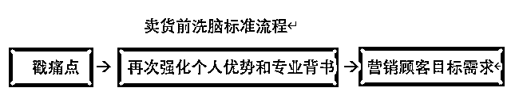

如果你觉得这么写你难以理解，那我帮你把这个流程细化一下，这个标准流程可以分成7小步：

①干货讲完，先问有没有收获，让扣：有收获。（目的是先获得认同感）

②开始展望未来：你是否想达到xx的目标

③把顾客打回现实：你们目前的情况是这样的（糟糕的现状，就是痛点）

④个人背书理由：我的成绩

⑤建立预期：直播间时间有限

⑥是否真心想学，让扣：想

⑦怎么学？现在准备和我报名

 

 

我研究过很多博主，都有这7小步的影子，我自己学了之后是按这7步来走的，我把这个卖课前洗脑加进我的直播稿以后，收效非常显著，所以大家也可以试一试。

第四阶段卖课催单。催单的目的是啥？一是让想买的尽快下单，二是让犹豫的人减少犹豫时间，今天一定要买！

留在我们直播间的客户，可以分成三类，一类是必买的（5%-10%），第二类是犹豫的（90%-95%），第三类是不买的（不是精准用户），在我们的卖课催单环节，就是要把第一类和第二类的用户都拿下来。

所以，其实我们的重点应该是在那些犹豫的客户身上，要去研究他们到底犹豫什么事情。基于你的研究，然后给客户上催单的话术。

催单话术一般是促销话术或者情感话术，促销话术包括：限时话术、限量话术、秒杀话术、加赠话术、额外服务话术、售后话术、倒计时话术、库存告罄话术。情感话术包括：换位思考话术、血泪史话术这些。

这些话术一定一定要背熟，然后要灵活使用。我自己的经验，就是每一场直播你碰到的人是不一样的，如果你把这个流程写死的话，基本上效果有限，所以一定要基于互动灵活的去使用这些话术！！

ok，跟大家简单介绍了一下自然流下的标准直播流程。我这么泛泛的来写，你如果希望从我这里拿到上手就用的方法基本是做不到的（当初我们学这个学了一个月，每个礼拜2个小时），我根本没办法把这些东西都给大家详细的写在这里。

同时我自己也是个三脚猫，很多地方我做的估计都没到及格分。

 

 

那我把这一套流程搬到这里来，是想着如果你相对是直播的小白，没有太多经验的，那我上面写的那些内容值得你多看两眼，然后就是带着这个框架内容去做对标账号的拆解！

知不知道这个框架直接决定了你能从对标账号上学到多少，然后即便是照猫画虎你也明白为什么要这么做，然后就有能力去做改进和优化。

对标账号拆解的能力我觉得可能是做抖音最重要的能力了。

# **b.**直播数据复盘

接下来讲一讲直播数据的复盘。

运营人都会非常强调直播的复盘，虽然复盘我一直没做到位，但其实我是非常认可这句话的。接下来我跟大家来讲讲怎么来看自己的直播数据，以及如何基于这个数据去做改进。

 

 

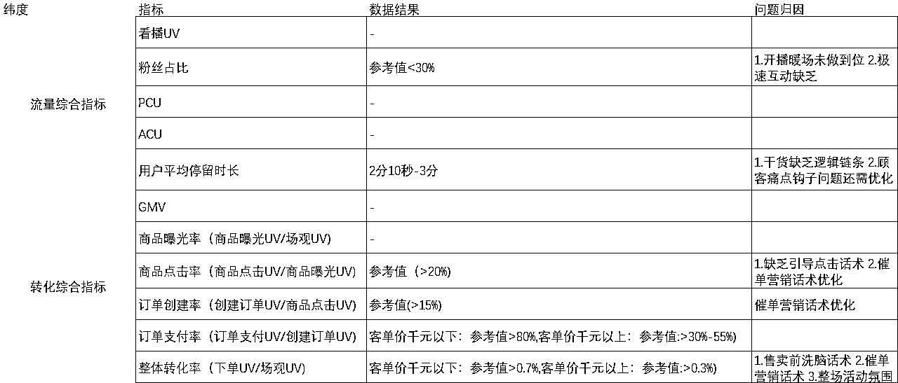

每场直播关键数据及数据分析参考表

来看这张表，我把一场直播里面最关键的数据都列出来了，红色部分是我们必须重点关注的几个值，这几个数据直接决定了下一场抖大大给你推多少流量。

如果你一场直播没挂小黄车，抖大大考核你的是流量综合指标，如果挂了小黄车，考核的还有转化综合指标。

来讲一下标红的指标。（这些数据在“巨量百应”里都可以看到）

粉丝占比：虽然不能说粉丝占比越小越好，但是如果大于30%，就说明你本场直播粉丝太多了，一场直播粉丝占比太多，就会导致转化率下降。

（因为粉丝来听直播，一是为了白嫖，二可能是已经买过单过来捧场的）。所以如果粉丝占比过多，那就是前面10分钟的暖场极速互动没有做到位，没有触发系统给你推流。

用户平均停留时长：对于干货主播，建议的平均停留时长是2分10秒-3分钟。

 

 

时间过短，就说明你的干货内容逻辑链条不行，用户听了这个就不想接着听了。同时也可能你的钩子放的不到位，因为我们主播如果要一直把用户留下来，是需要不断的给用户放钩子的，告诉他们现在这个内容虽然很好，但是你听了这个还不够，后面的内容更好。

那如果时间过长（我看到过有停留10几分钟的），那就是你讲的太实在了，光把人留下来白嫖了。所以直播讲干货，要讲几分留几分，让用户知道花钱买课更能解决问题。

商品点击率：就是你卖课时候，你的用户看到你的商品卡片跳出来之后去点击商品的比例，这个比例参考值是大于20%。

如果你的数据不达标，那就是说明你缺少话术引导用户点击，你催单的话术还需要优化。（优化的思路就是去拆解对标，很多同行是做的非常到位的，譬如会现场演示如何点击商品查看等），这个数据之所以重要，是如果你的数据好看，系统会默认为你的产品会比别人更有吸引力，所以也会给你推更多流量。

订单创建率 &订单支付率：这两个现在在巨量里面看到的是合成了一个指标，叫做“商品点击-成交转化率”，就是用户在查看了商品之后选择最终付款的比例，这个商品点击-成交转化率的参考值目前我没有，我自己的比例一般在25%左右，仅做参考了。

如果你的这个比例过低，那就是用户查看了你的商品，但是并没有付款。那就是要去找没有付款的理由，可能是你的催单话术不过关让他觉得没必要现在下单，或者他查看了你的商品，发现不够吸引人。

所以我们要去做自查，可能是催单不行，或者我们商品页详情页的内容不行，或者我们商品的评论不行，这些都需要去优化。

 

 

整体转化率：如果你的单价>1000，合格的比例是0.3%。如果是千元以下课程，达标比例是0.7%。如果你的数据偏低，那我们就要从源头上找原因。

因为整体转化率=最终买单的用户/场观，那么多人进了我们直播间，有些人听了一会会的，我们要去查他为什么只听这么一会，可能是我们内容不够吸引人，他觉得我们讲的不好，或者他觉得我们讲的还不错，但是因为没有钩子，他没留下来。

那还有有些人进来了听了好久，但是他也没买单，那可能就是我们没有营造出我这个课你买了一定有用的氛围，或者在催单时候没有让他感觉一定要今天下单。所以整体转化率不高，我们需要从各个方面找原因。

就我自己而言，我的整体转化率有时候能达标，大部分时间不行。那我自查时候就去看，到底是干货内容的问题还是洗脑的问题还是催单的问题，我最弱的地方是催单部分，所以努力的方向基本上是优化催单内容。（但每个人特点不一样，所以还是要基于自家的情况自查）

# **# ****2.**没有团队个人如何引流？（适合入门级别的

# 目前没有团队的朋友）（一个非常小的经验）

目前为止我还是一个人来做，对于个人要应付一个直播其实还挺忙乱的，有时候会觉得自己势单力薄，特别在引流这件事情上，我自己不懂得投流（这个是我非常弱的地方），压根不知道直播投流到底怎么弄，然后一直想去了解也没实际行动起来，所以流量问题一直也是非常头大的问题。

 

 

但我在11月底有几个异常值，最好时候场观达到了4w，当时是因为有个视频小爆了一下，给我带来了一波流量。

所以，这里给到大家一个经验，就是一定要重视视频内容的输出！能做到日更最好！

（我之前一度把精力花在直播上，很长一段时间内没有好好拍视频），大家千万不要跟我之前一样认为直播和视频是两个赛道，然后就钻进了牛角尖。

所以我现在的做法，就是尽量优化视频质量以及提升发视频的数量，能够做到5秒完播率>30%，然后在直播之前投DOU+，通过DOU+的流量提升直播间的流量。

这个方法相对还是好用的，可能跟运营高手比起来，我这个方法算是小儿科了，但是作为一个硬着头皮一个人撑到今天的直播人，我这个方法相信对于刚刚入门的新手来说还是有参考意义的。

等咱有了团队，等咱有了运营，自然有更加高端的方法，目前靠这个方法可以先小小的引流做起来。

 

 

# 四、总结一点心得

ok，到这，核心干货已经讲完了，希望对大家多少有点帮助。最后，我来讲一讲一些心得，作为本文的结尾吧。

心得一：

直播是非常考验个人心态的，有时候播了一场结果根本成不了单，就会觉得非常沮丧。

我7月份就是因为这样直接停了2个月，到9月份才开始重新播。

所以现在我有个挺有意思的做法，在自己觉得沮丧的时候，上蝉妈妈看看对标，找一个能力跟你差不多的人，去看他的数据，你会看到人家一路过来也是跌跌撞撞非常不容易，你就能觉得有动力持续下去，哈哈。

心得二：

直播还是需要团队的，至少需要有个人过来在直播过程中管理一下评论，拉一下气氛，在卖课时候如果有几个托那自然最好，不要小看这些，我看到有些博主就是靠水军把成绩拉的非常漂亮的。

心得三：

 

 

说实话，我觉得直播也不是长久之计。直播是属于干一天吃一天的活，今天不直播基本就没有收入。所以一定要在直播的同时去布局更多的收入方式，要把流量用起来。

我目前来说还属于非常被动的状态，现在准备往私域去走，一边直播的同时一边引流到私域，然后用花爷的方法运营私域上高价课，目标就是即便今天不直播但是依然能有正常的收入。

心得四：

把身体锻炼起来。直播非常考验个人体力，话说多了整个人气都上不来，我看到有些博主说话基本上是大口喘气的，特别费劲（有时候我自己也这样）。所以平时身体一定要锻炼，有这个大本营才行。同时如果喉咙不行，推荐大家一个叫“通州化橘”的，某宝上去搜，感觉润喉不错。

ok，就这么多，感谢大家看到这里，也感谢生财一路带着，也感谢一路遇上的那么多贵人。

评论区：

亦仁 : 一个人的破圈，往往从花了之前自己不敢花的钱开始。

基本上，一个人如果没有外界帮助，会处在一个平衡圈，这个圈子里面的一切都是和自己的认知相匹配的，匹配的穷，匹配的富，穷的稳定，富的稳定。

直到有一天，战战兢兢的花了一笔让自己痛心的钱，然后大概率被割，有些人立刻缩回去，有些人胆大点，继续战战兢兢又花了一笔，又被割，有的时候运气好，进入到一个全新的圈子，看见了完全不一样的世界。

我今天和朋友聊，我说咱俩啥时候能实现大的突破？从我们开始多招几个之前根本舍不得招的贵的人开始。

小新 : [强]深有同感，总要敢于迈出那一步，人生才会变得不一样！

 

 

决定决定命运，新的决定决定新的命运！

孙哲 : 666

波叔 : 厉害了[强]

星星 : 同为教培人，这么优秀的复盘，非常实用[爱心][爱心]

汤鱼儿 : 哇，亦仁大大回复了[呲牙]

汤鱼儿 : 感谢[呲牙]

洪智「突围一只鹰」 : 打破稳态，获取新生[呲牙]

# **# ****(**精华帖**)(108**赞**)**如何优化「督学陪伴」促进

# 「学员成功」？

作者：  杨昌

日期：2022-01-26

上周五“北京龙珠年夜饭”聚会上，遇到了两位在「抖音商业IP大航海」大放异彩的龙珠圈友。

「首批出爆款、首批获扶持、变现10w+」的大黑哥，和各群隔三差五会分享他做号建议的亮亮教练。

临走前，大黑哥开玩笑道，这次带的是哪个队，到时候我们选你们队啊。

亮亮教练也聊到，如果要在抖音上做知识付费，最好是做一次大航海志愿者，学学生财的交付。

对于首次参加龙珠夜话的小社恐来讲，二位的话给了我莫大的鼓励。

同时我也在想，新一期的抖音大航海在即，有没有可能把我学到的「志愿者交付」再总结成一篇帖子？

如果被志愿者中的同好看到，可以得到鼓励和方法，一起试着给船员带来不一

样的航海体验；

 

 

分享大纲是：

一、学员成功

二、学员/志愿者自驱

三、跟阿德勒学带人

四、跟得到班主任学交付

如果被「想今年抓住抖音知识红利」的有缘人看到，或许对他们做交付有一定

启发**~**

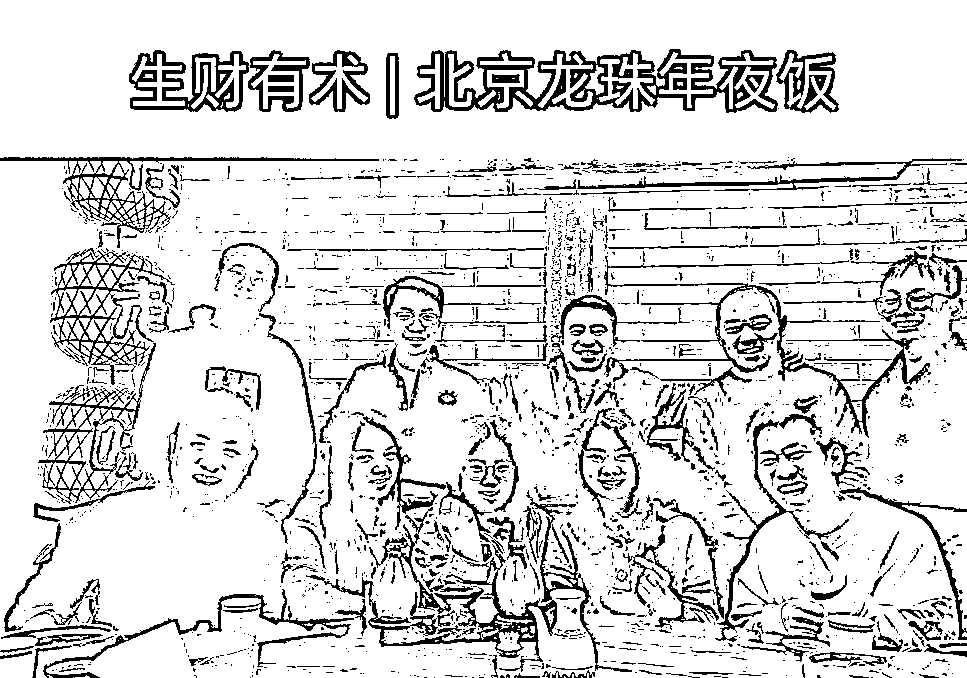

 

 

一、学员成功

生财有术的兰卡老师在知识星球分享过：训练营的指标是数量*口碑。

数量，是指你影响了多少人，比如有多少人加入；口碑，是指让想学想干的人真正学到一些方法，拿到结果。

好口碑的关键是打造好案例，而打造好案例的关键是筛选好客户。

因为想大幅改变一个人很难，但是可以找到离改变就差一口气的人，给他临门一脚。

顺下来就是：「高潜学员**→**学员成功**→**有口皆碑**→**训练营**/**大航海成功」

这很像很多高中的搞法——「招尖子生→考上清华北大→学校名声大振→学校越办越好」说到这，大航海/训练营的「底层逻辑」，应该聊得比较透了。

作为大航海志愿者，我们真正能影响的，是「学员成功」这一环。

因此，通过优化「督学陪伴」促进「学员成功」，是志愿者最重要的交付。

「学员成功」不做好，其他的花活儿大概率是无用功，如果可以，一定要聚焦。

二、学员**/**志愿者自驱

《驱动力》一书说，驱动力已经经历了 3 个阶段：

在驱动力**1.0**时代，类似避险、寻求饮食之类的「生物冲动」是主要的驱动力；

 

 

在驱动力**2.0**时代，胡萝卜加大棒即奖励与惩罚成为驱动力，这建立在「工作本身没意义」的基础上，解决机械性问题；

而在驱动力**3.0**时代，自主、专精和超越自身的渴望成为驱动力的三大要素，这建立在「某些工作很有趣，很有挑战性，需要大量探索工作」的基础上。

这意味着面对一件真正有挑战性的事情时，我们驱动员工/学员/志愿者的核心做法应该是：

「充分信任他，放手让他去干，并给他提供充足的资源」，并且引导他在技能上臻于郅治，激发他不断超越自身，达到新高度的渴望。

简而言之：当我们希望他能完成一件重要的挑战时，请给他充分赋能，引导他充分自驱。

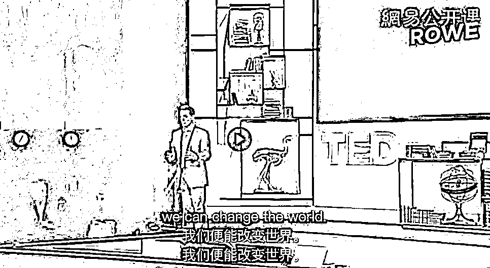

不同于一般训练营，大航海更多是探索，真正是一件重要的挑战。

因此，不存在一套万年不变的SOP；过往所谓的成功经验/方法论，也不见得适用于新的航海。

我们的工作重点，应该是营造一个能够激发各种内在心理需求的环境。

 

 

反之，如果潜意识里认为学员/志愿者从骨子里讨厌学习/工作，要是情况允许一定会逃避，

“必须强迫他们，控制他们，给他们指引，用惩罚威胁他们，让他们努力学习/工作，并最终达到的目标”，

那么产出大概率不会太好。

三、跟阿德勒学带人

上期大航海结束后，我一直在想，自己偏个性化探索，有没有什么更底层的东西，可以复制到更多的项目中去？

冥思苦想了很久，一直没找到。直到近几天，看到龙珠群李小随老师分享的这本书《管理精进：跟阿德勒学带人》，才茅塞顿开。

别被书名困惑，阿德勒心理学认为：所有问题的本质是人际关系。教育则是一棵树摇动一棵树，一朵云推动一朵云，一个灵魂唤醒另一个灵魂。陪伴船员，支持志愿者，本质上都算“带人”了。

如果只用一句话总结，那么这本书的核心方法论就是「给与勇气」。

看过《自卑与超越》的圈友都知道，每个人都怀有自卑感。一种人会不断地进行积极建设性的努力，另一种人则会采取消极的非建设性的行为。

这两种截然不同的态度正源于自身有无勇气。大声咆哮、吓唬威胁并不是勇气，只有“克服困难的活力”才称为勇气。

阿德勒心理学认为，人一旦缺失勇气，就容易产生鸵鸟心态，逃避问题的解决。相反，如果“勇气”充足，就会积极主动地直面问题，并努力克服困难。

 

 

“给予勇气”是帮助对方利用自己的能力，自发性地克服困难的行为。因为每个人都会无意识地努力让自己变得更好。我们的目的就是激发这种意识。

所以，如何给与勇气呢？「不表扬、不训斥、不直接教导」

1、不表扬：表扬不是称赞，后者是平视下的欣赏，前者多会带有居高临下或控制。请相信我，虽然大家不说，但没人喜欢一个居高临下的领队/志愿者。

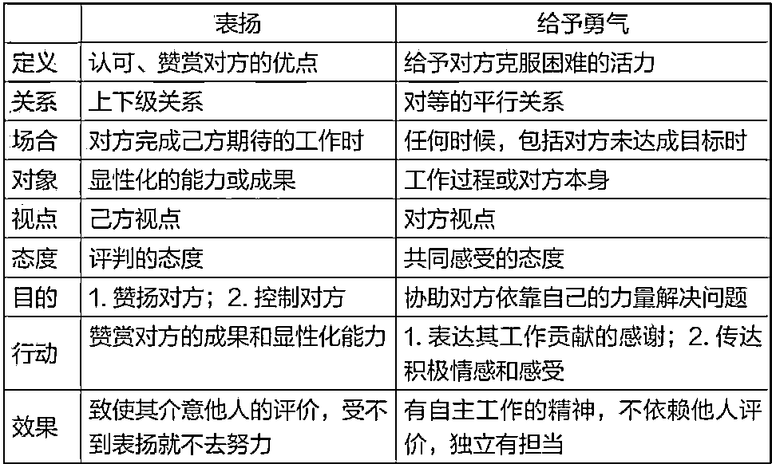

2、不训斥：我自己做船员的时候，就很不喜欢“凶”的志愿者/助教。看到他凶别人几次或被他凶几次过后，我就不太愿意搭理他了，更别说主动向他提问、求助。可想而知，这样的情况下，我还能学的好吗？如果可能的话，我必定会想尽办法换其他的志愿者/助教。

书中有个训斥的例子：“哎呀，不行！不行！你再这么做肯定会出现问题的。你怎么能这么做呢？要动动脑子。看好了，这么做才行，你赶快给我改改！”这是挫伤勇气的典型言辞，单方面的，不容辩驳的，传达给对方的意思是“我是对的，你是错的”、“我懂，你不懂”。

 

 

别扯什么“严师出高徒”，当个领队/志愿者/助教，咱就严师了？况且，换个更尊重对方的做法，也没有多难，反倒更能给与对方勇气，比如“做这个的时候，关注到这个点可能会比较好。那关于这一点你是怎么考虑的？”下次想要骂志愿者/船员的时候，不妨试试别那么居高临下地评论、指责，而是更平视地沟通，相信会有不一样的效果。

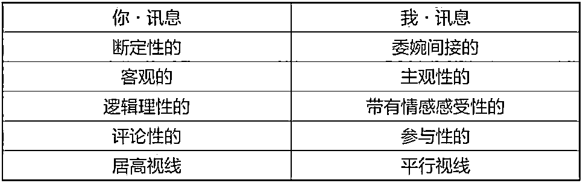

3、不直接教导：上一次大航海，我们队最让我自豪的一点，是几乎每位志愿者都做到了“八仙过海各显神通”，每个小组都有自己独特的玩法，而且最后都出来了让人眼前一亮的效果。为什么我们队志愿者都这么有想法？因为我真的尊重他们的想法，鼓励他们大胆去尝试；而不是指示一个接着一个，搞得他们除了听从指挥，别无他法。

前文中聊过我对大航海的理解，它不是福特汽车厂里拧螺丝的活儿，大家乖乖听指挥干活儿就能有好的产出；而是一件非常重要的挑战，要充分发挥大家的积极性、创造性，才有可能有新的突破。作为领队/志愿者，我真的觉得引导和鼓励，才会带来更多的惊喜。

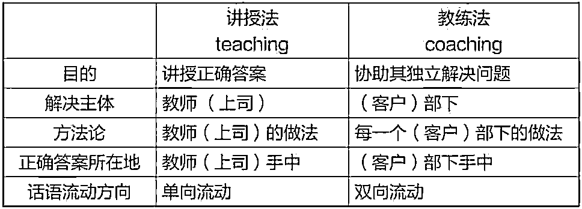

 

 

四、跟得到班主任学交付

我也在得到品控手册里，搜过班主任的内容，发现很多点，跟生财优秀志愿者提倡的非常接近。他们已经总结得很具体了，我就不另起炉灶了，直接把相关的部分，“化用”到生财大航海里：

1、合格的志愿者，不是事无巨细的服务员，而是要呈现出“真诚、利他、主动、开放、空杯、日拱一卒”的样子，甚至成为船员/志愿者心目中的朋友和榜样。

2、要想成为合格志愿者，可以从做好船员信息管理、个人精力管理、搭建支持网络、点亮船员几方面建立自己的专业形象，树立威信、赢得信任。

3、所谓做好船员信息管理，意味着你不是在船员进组那天才开始熟悉和了解他。

招生过程中，你可以通过面试官，尽可能多地了解本届船员的信息，对于往届学长推荐录取的船员，还可以通过推荐人提前熟悉。要无比重视开船前的一对一沟通。在交流中，当船员发现你对他的情况做过功课，那种惊喜和信任感会超乎预期。至少要做好微信中的一对一交流，充分了解学员的报名动机和学习目标。

通过一对一交流，要记住船员的名字。这事儿不难，大概需要花三个晚上的时间。志愿者甚至可以把船员的照片和名字写在一起，打印出来，脸对照名字记一次；建群后，自我介绍时把照片、名字和他自我介绍的特点再记一次。第二次沟通的时候，尽可能知道他的名字，他的职业类型，以及在自我介绍时他曾经给自己贴的标签。

4、要积极建立自己的支持网络，遇到问题时，宁可问错，不要沉默。

除了向领队、生财求助，最好用的其实是其他志愿者/领队的经验，

 

 

所以新志愿者一定要主动抓住有经验的志愿者，结成一对一的帮扶关系。

（此处欢迎链接，我的微信号是 yangchangpku，就是杨昌的拼音加上pku，我争取知无不言、言无不尽）

另外，要高度重视往届船员的作用，从你所服务过的热心船员中发展自己的“幕僚团”。

本届学员不仅是你的服务对象，也是你编织支持网络的重要一环，从学期开始前就应该重点研究和发展以下几类学员：年长且阅历丰富的船员、热心互动的船员、往届学员推荐的新学员、“生财”学霸。这几类学员通常更愿意为班级建设出主意想办法，是很好的倚重对象。

5、志愿者要想取信于船员，不是靠讨好，而是让他们被看见。

必须让船员能感受到志愿者为他好、想他成、看见他的努力。他们就会愿意按照你的节拍，高质量地完成学习任务。志愿者点亮船员的标配动作包括：

每个船员都应该至少经历一次一对一称赞（非居高临下的表扬），题材不限，只要是挖掘他的一个亮点即可。

对突出船员进行群内的公开夸奖，典型的方法是作业的亮点提取，你不需要点评作业，你只需要完整地看一遍作业，把学员的名字放大，把其中的亮点提取出来即可。

在知识星球的生财茶馆部分中发自己的工作笔记，赞美船员。或者哪怕每天为船员/志愿者写一封汇报工作的日报，让他们知道航行的全貌和你的付出及思考，也别吝啬对表现突出船员/志愿者的夸奖。

特别优秀的船员和行为，志愿者可以积极的、不停地向生财有术官方等推荐，为船员整理宣传案例，让更多人都能看到你支持的优秀船员。

可以的话，用专门的文档记录小组一起完成过的事情，记录整个航程你们的成绩，在毕业的那一天作为一封峰终体验的信呈现给船员们。

6、无论有多少具体方法，最重要的其实只有一条：没有任何道路能够通往真诚，真诚本身就是道路。

对于志愿者来说，真诚的对待船员就是最好用的工具。真诚并不是一句口号，是有具体的行为体现的：

 

 

可以试试在最初交流时就向船员“交底”，比如写一份志愿者使用说明书，告诉船员你能为他们做的和你的能力短板。

承认短板并不是甩锅，而是告诉船员，你也许不是事事都能做好，但是你可以通过向生财官方求助、协调资源等方式为学员积极服务。

另外，志愿者很有可能经常面对学员的不满甚至投诉，无论最终是怎样处理，咱们都要保持直面问题、不回避、不拖延、不糊弄的态度，

在第一时间就告知学员“意见已经收到，我自己能处理或需要上报处理，预计多少时间明确回复”，并且务必对学员的意见进行闭环。

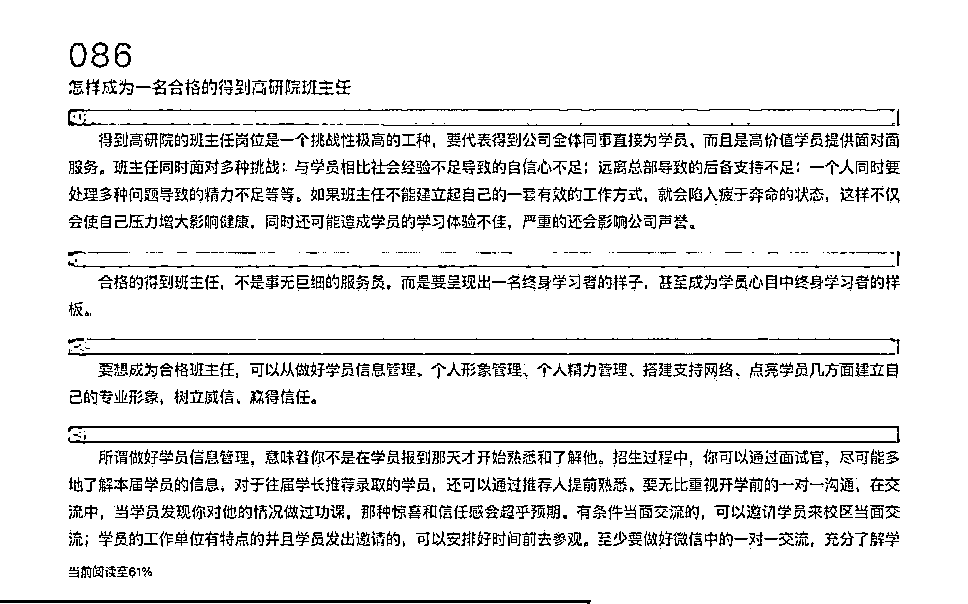

评论区：

怡成 : 昌哥yyds

vincent : 昌哥牛逼

施霖终生学习者-链接 : 昌哥666，

🍀兔丫💥 : 昌哥YYDS

炳文 : 写的真好，都是干货[强]

 

 

马小威 : 昌哥威武

阿莲养生 : 昌哥yyds

薯总 : 杨队的输出好高[666]

# 【从** 0 **到** 1**】**12**篇

# **# ****(**精华帖**)(379**赞**)**小白可以轻松跑通的闭环：

# 快手知识付费** -**保姆级教程

作者：  苍述

日期：2023-05-11

《小白可以轻松跑通的闭环：快手知识付费 -保姆级教程》

生财潜水一段时间了，第一次发帖，完整拆解一下很多人在闷声发大财的快手知识付费项目。这是个典型适合小白的项目，有以下几个优势

1.操作步骤少

2.不需要粉丝基数、证照资质

3.闭环路径短、不用引流到私域

4.正反馈很快

知识付费说白了就是在快手上卖课

本文先介绍通用玩法，再介绍都可以卖什么课（赛道）

篇幅限制，详情请见飞书（万字长文慎看）

https://uwdpzjnryu8.feishu.cn/docx/Dy8mdu2JUoyQYRx2UnocHwOinaf评论区：

 

 

天晴168 : 苍哥，我看您文档里嵌入了一个视频，那飞书共享文档可以分享音频吗，可以设置不允许下载吗

苍述 : 音频应该是没问题  不允许复制应该就不允许下载吧？可以自己试一下  隔壁黄大北 : 您好请教下，假设闲鱼买的课程，是可以直接导入那个易知课堂么，还是说重新录一遍的？[害羞]

天晴168 : 谢谢苍哥

Gus : 易知课堂那里会有版权问题吗

向日葵 : 谢谢大佬分[强]

一粒沙白 : 加微信频繁了[捂脸]

苍述 : 已经更新了[流泪]

# **# ****(**精华帖**)(373**赞**)9 **年传统行业** 1 **年时间，从一

# 无所有，到年入** 200 **万

作者：  心理諮詢師 - 根源

日期：2023-05-12

 

 

 

 

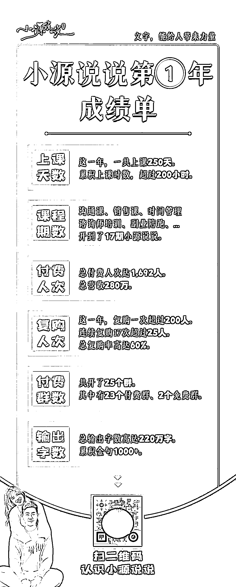

各位好，我是根源，也是做初入线上知识付费领域一年左右的新人。

因为生财有术大量的好文章，大量对的人，让我这一年少走了很多弯路，这一年来也有一些不错的思路、做法、以及成绩。

文章详情请点以下链接，排版会更好观赏一些。（飞书）

https://oee5lr7gsk.feishu.cn/docx/QPFgdHgZsorQvdxDkl9cw58LnVf?from=from_copylink

 

 

评论区：

陈雪🦉碎碎念 : 老师超强！

卿安澜 : 根源老师🐮

Shiqin : 太厉害了，感受最深的就是知识付费这个赛道要把战线拉长，保持耐心  周俊成 : 老师，666

💪Chrys : 老师超强！每次跟老师聊天都有收获！

梅林酱 : 太厉害了

一群 : 根源老师🐮

袁大 : 字里行间蕴含着满满的真诚、诚意，初心对，早晚会成功！

# **# ****(**精华帖**)(316**赞**)**我的十年自媒体之路

作者： Crossin

日期：2023-06-15

各位星友大家好。

本文是应小灰老师的邀请，写的一篇关于自媒体运营的经验分享。

算了下我做自媒体也有十年了，确实也想做个总结，但原本并不打算在现在这个时间点做。因为从结果上来说，目前我的公众号流量大不如前两年，加上一些个人原因，几乎处于半躺平式运营的状态；另外我正在向视频方向尝试，但目前尚处在起步阶段，还没形成有效的流程或方法论。所以客观来看，此时既谈不上是一个成功案例的分享，也不能说是失败案例的总结。

 

 

但择日不如撞日，来都来了，那就随便聊聊吧。讲讲我个人在自媒体方面的一些经历和由此得出的经验教训。

分以下几部分谈谈：

一、我的自媒体经历

二、爆款内容复盘

三、收入水平

四、我做对了哪些

五、我做错了哪些

六、对新入局者的建议

对了，先介绍下我自己的号：**Crossin**的编程教室。以Python编程相关的内容为主，包括教程、案例等。

先讲讲我个人在这个过程中的一些重要时间节点和复盘。但其中很多情况跟当下已经不一样了，同样的操作现在恐怕很难复制。对这部分不感兴趣的朋友可以直接跳过看后面的建议。

# 一、我的自媒体经历

粗略地理一下时间线：

**2013**年** - **注册公众号，开始连载**Python**入门教程；注册知乎，回答**Python**、编程相关问题。

 

 

此时公众号刚诞生不久，算是偏小众，更谈不上什么商业模式，甚至“自媒体”这个词都还没有。但小众有小众的好处，只要你的内容确实不错且持续更新，很容易联系上一些大号帮你推荐。不少号主也会主动搜罗一些优质号进行推荐。

而知乎在那个时候也是处在初创上升期，用户群体以大学生、刚毕业的职场人为主，内容氛围也不错，主要都是知识技能向。且早期对作者引流几乎没有限制，可以随意在回答里放公众号二维码。另外还有一点，当时百度对知乎的答案收录权重很高。所以综合下来，当时在知乎做技能向的内容分享，再引流到公众号，真的是一个非常大的红利时间窗口。

接下来的几年，我本职是做游戏行业，公众号一直当兼职在做，更新频率很低，但用户却在一直增长。期间接过两家广告合作，费用不高，差不多1k/次（甚至有家最后还有一期没给我结清），但也算是零的突破。

**2016**年** - **开始全职做自媒体，年中推出付费服务，下半年开始注册公司、组团队、参与创业孵化。

这个时候正是知识付费刚刚兴起的时候，移动支付普及，大众在网上付费的意愿大大增强，而机构还没有来及大规模介入这个赛道。当时还没有太多甲方投放公众号广告，所以只能想办法自己搞变现服务，一般是做课程或者训练营。知识星球（当时还叫小密圈）和生财有术都是这个时期出现的，我是最早期的用户之一。我的付费服务前后经过很多版调整，这其中也从生财有术里学到不少。

我最早一版的付费会员推出时，甚至没有任何自己的课程，就是提供QQ群答疑服务。但当时放出的几十个名额直接被秒杀。这给了我坚持做下去的信心。

 

 

后来感觉有希望，就开始着手开公司、组团队。直到2017年一直在尝试团队化运营，想搭建一个从内容引流到培训服务的闭环。但个人经验不足，一直无法将团队作用充分发挥出来，反倒我个人的内容输出受到影响，两边都没做好。虽然总体来说没怎么亏，用户也在增长，但始终很拧巴，不管是对团队的小伙伴还是对我个人来说，感觉都不是一个好的状态，最终选择在2018年初解散了团队。

**2018**年** - **尝试视频创作。

此时抖音兴起，于是也尝试了一下短视频，竟然在一周后就做出了一个爆款，千万播放。但这个视频跟编程无关，且我在短期内也没找到可以跟编程很好结合的内容方向。

与此同时，公众号的甲方投放开始井喷，于是重心依然保持在了公众号图文上，抖音就这么搁置了。

**2019**年** - **有意识向视频转，但不够重视。

这段时间，公众号的广告市场也很繁荣，甲方商单不断。这段时间可以算是做公众号非常舒服的一个时期。所以这时候又找到了几个小伙伴来辅助，其中大部分是远程兼职。

继抖音之后，B站也由二次元逐渐出圈，我本人其实是B站老用户（准确来说应该是A站），但之前没想过在B站上也可以发编程内容，于是同抖音一样，起个大早赶个晚集。

虽然也有过几期播放量不错的视频，但始终没当做主要渠道来重视。

**2020**年** - **正式转为**“**自媒体**”**

 

 

这一年发生了什么我们都清楚。但2020年其实对公众号主来说影响并不大，甚至还有些促进，因为很多原本线下的事做不了，反倒增加了线上的流量，比如我就多卖了不少网课。而且我阴差阳错地在一月初退掉了办公室，彻底转回到一个单打独斗的自由职业者，反倒是躲过一波损失。

但随着时间越来越久，培训机构类的金主日子也不好过，到2021年下半年的时候，广告量已经大不如前了。另外，加上视频取代图文，知乎转型“故事会”，我这个公众号的数据直接跌到没法看。然后那阵子干脆就有点躺平了，过起了半退休的生活（去学了指弹吉他、打鼓、攀岩，有时还会去公园里跟大爷大妈一起抖空竹……）。

**2022**年** - **尝试短视频

年中下定决心转型，尝试做编程教学短视频，主战场是抖音和B站，顺便同步视频号和小红书。到目前为止，数据虽然不算爆，但至少在稳步上升。暂时打算以内容创作为主先继续做下去。

# 二、爆款内容复盘

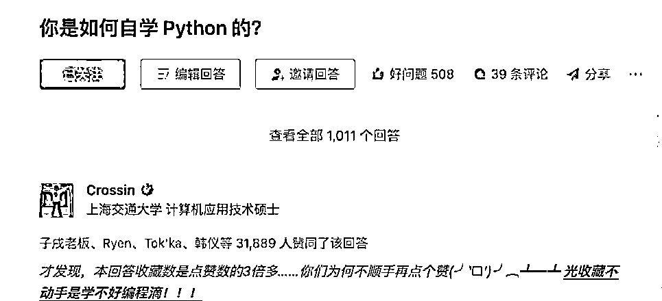

 

 

这是知乎上一个3w多赞的回答。这个回答不仅仅是曝光量大，更在于早期在百度搜索“自学 Python”的第一条结果就是这个问题，而我的回答排在第一，同时回答里又放了资源链接和公众号二维码。

在早几年，可以不夸张地说，我有80%的关注都来源于这一个问题。之前有机构想花几千块在我这个回答里加广告，我说你们太小看这个回答的价值了。

编程教室最早的一位合作伙伴是资深虎扑用户，早期去虎扑引流，导了不少用户过来。

所以编程教室最初的用户里面有相当比例的jrs。不得不说虎扑的流量真的是惊人，但在这种社区属性极强的平台引流决定是技术活，必须得是“自己人”才玩得转。我后来也去发过一些结合体育和编程的内容，比如这篇。

这是我前面提到的，刚刚接触抖音时做出的爆款，结合当时的两个爆款模式做了个结合的反转。但现在回头想，这个视频可能反而让我陷入了一个追求爆款的误区，以至于后来没能在编程相关的内容上踏踏实实地深耕，直接放弃了这块阵地。

 

 

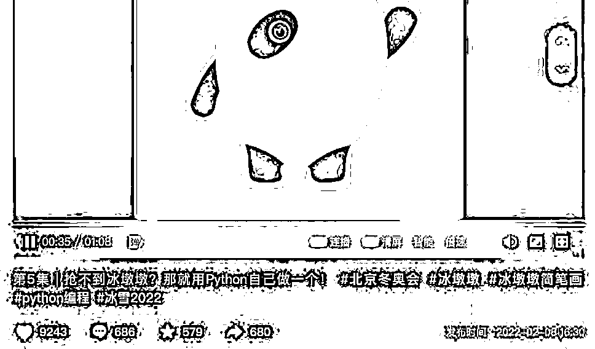

这是一个结合冬奥会热点的视频（可能有不少人看过），当时属于无心插柳，结果成了全网爆款。不过可惜的是，这爆款并不属于我，而是我的代码被全网营销号给搬运了，总体播放量我估计几亿是有的。我个人这边，公众号一天涨粉了4k，B站后来发了一个吐槽抄袭营销号的视频涨粉也差不多3k吧。

 

 

这是去年转型视频后的一个小爆款。虽然数据跟早几年的抖音已经无法比了，但我觉得这个内容与热点结合的路子是对的。

公众号方面反倒一直没有特别的爆款出现，“10w+”是从来没有体会过，比较好的也就在2、3w这个水平，比如这两篇：

 

这一方面是公众号的机制所决定，另一方面也是我的内容还是偏“干”，不是走情绪那一挂的，很难产生二次传播。

 

 

# 三、收入水平

这可能是很多人会关心的问题。但其实这个问题的参考价值真心不大，因为自媒体的收益水平真的是千差万别，而且并不和流量完全正相关。

就我个人来说，最初几年是几乎没有收益的。后来在最顶峰的时候可以做到年入百万。

但这个百万其实是营收，其中还要算上课程研发和运营的成本。并且后来也没能持续。

如果把 2013~2022 看做一整个项目周期的话，整体收入大约是两百万。但从 2023 年往后看，我觉得我短期可能还恢复不到这个收入水平。

单从绝对值来看的话，这也差不多相当于一个打工人的薪资了。但如果我老老实实去大厂做程序员，显然是可以更高的。不过以我的性格，不喜欢领导别人也不喜欢被人领导。做自媒体最起码给了我这样一个机会，至于是不是能比找个厂上班赚更多，我只能说看缘分了。

# 四、我做对了哪些

能靠一个自媒体账号做到不上班，我觉得这中间还是做了一些正确的事情。

**1. **踩上了公众号和知乎的风口，包括知识付费的风口。这有很大的运气成分，但运气偏爱有准备的人，如果当时没有积极去尝试，风口也只会从面前吹过而已。

 

 

**2. **持续输出。虽说是风口，也还是等了好几年才算是起飞。这期间不管频率高低，始终也还是在更新输出，这点也是后来能随风口吃到红利的重要保证。另外，出爆款内容其实是一个概率事件，你只有不停更不停更，基数够大，才更有机会出爆款。说实话，我的公众号运营算不上激进，内容也不是多独特，主要还是靠写得久。

**3. **冷启动寻求外部助力。很多人尝试自媒体，都停在了最初的冷启动阶段，因为每次辛辛苦苦写完文章发出去，只有个位数的阅读，这样想继续坚持是很难的。前面说到，早期的大V推荐，还有虎扑上的引流，让我很快就跳过了这个阶段，我基本上算是直接从500粉丝起步的，这样创作体验就好多了。

**4. **从用户的角度思考创作内容。写公众号也好，做视频也好，是要给别人看的，跟我们自己平常发个朋友圈不一样。我会比较注意不同内容的数据情况，以及做一些问卷，调整内容方向。最终我是把内容定位在偏初级、短篇幅，要么得有趣、要么得实用这个方向之上。

**5. **专业内容结合热点。现在“蹭热点”几乎是自媒体的基本功，但在早年其实并没有太多人意识到这个概念，至少我一开始是不知道的。但在运营的过程中，我自己也慢慢摸到了这个门道，做出了几篇还不错的内容。

**6. **完整的变现闭环。我因为自带开发能力，所以在最开始就自己搭了教程网站，后来在其上做了付费课程和学员系统。所以从内容中的钩子导流，到公众号里的文章转换，再到后续的课程服务，整个过程我是可以自己掌握的。即使在市场大环境不好的情况下，一样可以有靠谱的变现途径。

# 五、我做错了哪些

 

 

讲了做对的事情，再来谈谈做错的或者说错过的事情。当然，所谓做错也只是一种假设，也并非那样做了就一定会更好。

**1. **流量**(**内容**)**、变现**(**服务**)**都想做。前面做对的事里面提到完整的闭环，但反过来看，这个闭环也在一定程度上阻碍了我的增长。个人做自媒体精力有限，什么都想自己来，相当于牺牲了一定的增速来换取稳健。如果把这部分时间省下来都投入在内容创作上，可能性价比会更高，说不定可以再上一个流量台阶。

**2. **过早谋求团队化。团队化运作不是不行，只是对于我的情况来说不适合。同上一点一样，在这方面牵扯了大量的精力，最后效果却不及预期。也许是缺一个互补的合伙人吧。

**3. **没有尽早转型视频。很早意识到视频对于图文的替代，但却没有像当初积极尝试公众号、知乎时候那样去积极转型视频。不过必须承认，视频的门槛确实是要大于图文的，尤其对于我们这种习惯文字写作的人来说，面对镜头是非常需要勇气克服的一件事。

# 六、对新入局者的建议

前面都是在啰嗦个人经历，如果听建议直接看这里就好。但因为我的建议都是基于自己的经验，所以看了上面那部分你会理解我为什么这样建议。

我先帮各位理一下我认为做自媒体的一些选择：

 

 

一部分建议是围绕上面这些选择的。

**1. **首先想清楚为什么要做自媒体，大方向的不同决定了你策略上的不同。做自媒体是一件门槛很低，同时天花板又很高的事情。听上去不错，但另一方面，通往天花板的路非常拥挤，且越来越挤。

如果你是本职工作干得不爽，想裸辞全职做自媒体赚大钱，那我要泼你盆冷水。目前来说，好做的时间窗口已经过去了，如果你不是有过人天分，是很难出头的。

 

 

但如果你是想开拓副业，多一种尝试，那我是强烈推荐的。我这两年就间接帮助了一位朋友成功转型自媒体。但请记住：不要辞职！不要辞职！不要辞职！想做就先做起来再说，立刻就做，今天就去做。如果你说不辞职就没时间做，那相信我，你辞职了很可能也更不了几期。等你做到稳定更新之后，再考虑是不是要全职做。

就算不能做成一个能赚钱的副业，只是通过自媒体来输出个人的专业知识和独家观点，对于你的职业发展也是很有帮助的，往往会给你带来意想不到的机会。

另外一种很适合做自媒体的情况就是，有现成的生意，通过自媒体来宣传和获客。在当下这个阶段，我觉得做纯网红大V是很难了，但是把自媒体作为一个专业性展示渠道是很有机会的。现在很多平台的流量机制也在往这方面倾斜。举个例子，你开了家饭店，然后你再做个自媒体，你想纯靠自媒体养家可能不容易，但认真做点美食相关内容，把你店的销量翻一倍并不是难事。如果你的业务可以线上进行，比如培训、咨询、卖保险之类，那效果就更好了。

当然不排除有人做自媒体是出于兴趣，为爱发电，那这个也就不需要我给建议了，做得开心就行。

**2. **发布视频肯定是几个平台都同步更新，但风格上需要有所侧重。新手建议优先从** B**站、抖音、小红书** **中选择最适合自己风格的。这几个平台都会有用户推荐机制，即使冷启动，坚持更新一段时间，通常都会得到反馈。并且这几个平台是有IP这种概念的，你做得好，别人会关注你，追更，慢慢积累粉丝，良性循环。

头条这种重内容轻IP的平台，适合批量做营销号。公众号我把它归到“私域”，这个说法不严谨，但我是想表达，它是没有公共推荐流量的。不过目前似乎公众号机制有些改变，也开始重推荐了。但毕竟图文是过去式了，除非你文字功底真的很强，或者实在无法做视频，才考虑公众号。现在的公众号，因为平台规则相对宽松，更多是作为最终变现的渠道。

 

 

**3. **你的内容要和你的大方向、你的变现模式相一致。如果你是拍搞笑短剧，虽然受众广，可以流量做很大，但多半只能靠内容激励或者直播带货变现。如果你做专业内容，比如像我一样的编程教学，那注定流量不会很大，但来的都是垂直细分用户，给他们提供需要的服务，可以做到更高的客单价。

还有就是前面说到的，你有自己的生意，那就容易多了，只要吸引到潜在客户就OK了，他们会主动联系你的。

如果你想在抖音卖课，但天天跟风拍一些搞笑段子，那即使出了爆款也没有价值。做垂直内容的不用羡慕别人的爆款，他的十万播放可能只带来几十块钱收入，你的十个播放说不定就给你带来一个高价值的客户。

4\. 前面也说了，做内容是要从观众角度来选择内容。但我还是要反过来说下，如果自己都不喜欢自己做的内容，也是很难做下去的，至少你得不讨厌吧。所以一个理想的方向，是用户需求（可能是爱看也可能是实用）、自己擅长、自己喜欢这三者的综合。如果不能兼顾，至少取一个可接受的平衡。

**5. **最后，在做自媒体的心态上，尤其是新手的心态，要做到：先做起来再说，然后坚持、不要脸、坚持不要脸。

做自媒体不需要什么准备，你今天想做就可以立刻去做。如果你不放心，就先拿个小号去做，边做边想边调整。如果你觉得我要怎样怎样之后再开始，那要么你的想法有问题，要么你就是在给自己找借口拖延。很多事情，预先设想的和实际情况会有很大不同，不亲自动手做一做你不会切身体会到其中的细节。有人会完美主义，觉得我这个视频做得不够好，我不想发，我得继续改，甚至重新拍、换选题。对此我送一句话：永远在下一条视频里改进。一条视频，做好了就发，发出去就是最大的成功。

 

 

坚持不必多说，大家都懂。但很多人会在潜意识上忽略坚持的作用，更多的归因到能力、环境、运气等上面。但在自媒体这条路上，坚持是第一位的，是其他各种因素的先决条件。如果你没有做够一定的量，其他的方法论都没有展现的机会。而另一方面又会低估坚持的难度。殊不知在初期缺少正向反馈的阶段，放弃实在是太容易了，可能今天加个班，明天朋友喊你吃个饭，你就彻底断更了。

我之前跟一位想要尝试自媒体的朋友说你得不要脸的时候，她不出意料地想歪了。确实现在网上有大量“不要脸”的内容，但我不是说要做那种，而是即便你正常地去写文章表达观点，拍视频做节目效果，都难免会面临镜头恐惧，感到尴尬。这种尴尬再配合上寥寥无几的播放数据，对新手的打击几乎是毁灭性的。这时候你就得硬着头皮上，别管那么多，继续更。

我们过去接受的教育给我们一种凡事只有一次机会的错觉，觉得一旦出错了就可能带来很大的问题。但在自媒体上，我觉得不存在，至少对于新手不存在。只要你别做什么违法违规的内容，尽管放手去试吧，不停地更新，你会在更新中不断找到感觉，而不是在纸面的学习和思考中。

评论区：

伟业 : 一直在关注老哥的公众号和知乎，好多年了

Crossin : [抱拳]

书豪 : 和crossin老哥也合作很多次了，2019年就在一起搞公众号  爱飞的鱼 : 谢谢分享，收获不少！

亦仁 : 编号33的元老级圈友了

小新 : 正准备起号，非常有收获，感谢！

米斯特 LIu : 感觉是位有能力的佛系老哥😂

Crossin : 豪哥现在矩阵号风生水起[强]

# **# ****(**精华帖**)(303**赞**)**百万母婴博主年收入** 7 **位数

# 的项目经历分享

 

 

作者：  鱼丸|亦仁助理

日期：2023-07-13

做好 IP 定位定生死，但大多数人很难做好 IP 定位。

作为一个普通人，如何才能做好个人 IP 定位？今天，全网 100W 的母婴健康博主  ，将和大家分享她做 IP 定位的经验。

她之前有在生财和大家分享做健康运动个人 IP ，通过后端知识付费课程，帮助孕产后女性全周期身材和健康管理变现 100w+ 的经验：  。

这一期视频，她主要分享自己在孕期 3 个月时创业开公司，从 0 孵化三个账号达近 10 万粉丝，营收近 200 万的项目经历，更深入的拆解母婴博主这个群体的真实状态，分析多元化的变现方向。

本期访谈节目创作者  ，全平台 30 万粉母婴博主，变现 100W+。目前在做 100 个优质母婴博主的访谈系列视频栏目，希望能通过这一系列访谈，帮助到更多人想做母婴博主的，但并不了解怎么从 0 到 1 去做母婴博主的人群。

【本期视频精彩时刻】

00：36 自媒体博主的创业经历

03：04 自媒体博主如何去挖掘自身稀缺性？

04：47 博主很赚钱，为什么还要横向发展开公司？

05：59 妈妈群体更多元化的收入选择

大家也可以把想看的视频内容留在评论区，如果有好的内容也可以找我投稿哦

~https://t.zsxq.com/10CH2HdUL

评论区：

京城风四娘 : 感谢亦仁老师  和辛勤的鱼丸把这期视频带到了生财的大平台上跟各位优秀的小伙伴见面，也感谢  接受这期采访，这个项目启动过程中  和小仙给了很多支持和建议，对我也是这个很好的学习和历练的过程，希望我的这个系列视频，能给想在母婴赛道掘金的朋友一点启发，最后，祝我们一起，生财有术！

小聪明过过过💫 : 太棒啦

星月 : 真好[呲牙][呲牙][呲牙]

张可粒 : 仙儿和四娘，棒棒哒

 

 

高海霞｜西瓜姐 : 太棒啦！！！？

逸芳的中医学习乐园 : 光顾着看两位美女了😍

热爱 : 好厉害

雅俊 : 赞

# **# ****(**精华帖**)(227**赞**)**抖音虚拟类目玩法：半年在

# 抖音卖出** 50 **万份课程，营收三千多万

作者：  不甩

日期：2022-10-09

虚拟类目其实由来已久，淘系/咸鱼/拼夕夕上会玩的人很多，但是抖音平台上玩的人不多。抖音虚拟类目玩法是指：依托抖音平台，销售虚拟产品（即非实物产品，如课程、服务等）。

关于这个玩法，我认为相对于商业IP打造或者制作课程来说，会更加的低门槛与灵活，也更适合小团队切入。

大家好，我叫百晓，智客科技负责人，94年的中老年创业者。我们公司目前主营是育儿课程的研发与销售，主要渠道是抖音，产与销都是自有运营。

我的合伙人@华南虎  从事传统电商已经11年，从淘宝转战各大平台一直到抖音，所以目前我们定义自己是一家电商公司，而不仅是教育公司。

2021年年中公司基本砍掉了原有的传统电商业务，全力all in抖音赛道。由于具备电商基因，我们先从抖店开始切入抖音，经历了很多坑之后才选定了主营赛道跟生态位。

 

 

确定赛道之后我们在2022年上半年就做到了3000万+的营收，毛利30%+，售出课程50多万份。公司从产品研发到抖店运营、矩阵图文视频分发、自主直播间、千川投流等都是自营，该类目我们拥有丰富的全案运营经验。

今天从抖店卖家的角度出发，跟大家分享抖音虚拟类目的玩法与逻辑，包括项目优缺点、玩法案例讲解和避坑指南等。

下图是部分抖店与学浪的交易数据：

 

 

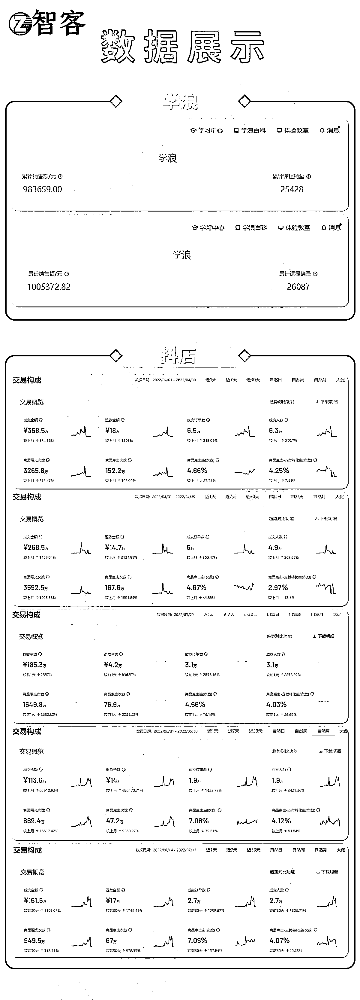

 

 

一、什么是抖音虚拟类目玩法

虚拟产品：一切没有实物的产品，例如课程、服务等。

 

 

抖音虚拟类目玩法：依托抖音平台，销售虚拟产品。

生财的两次大航海，对于个人IP的打造与课程的制作销售，总结的很详细和系统了，也带领了很多圈友取得不错的成绩，这里强烈建议大家去拜读两次大航海的资料。（我们公司读书会就专门把两次生财的资料包进行拆解学习）

我把个人IP跟课程销售也归纳到虚拟类目的范畴，从销售的产品属性来讲这是包含的关系。我对虚拟类目的定义相对会更广泛，包含了所有非实物的产品。所以我们没有从IP打造和课程制造这个点开始做起，实话说这个对于普通人来讲难度系数还是太高，变现周期也很长。

而我提出的这个抖音虚拟类目玩法就更加的低门槛与灵活，相对低成本就能运作并实现营收，更适合小团队切入。

众所周知，我们常说的虚拟类目由来已久，并不是什么新鲜的玩意，淘系/咸鱼/拼夕夕玩的溜的大神一抓一大把，但是抖音虚拟类目这个概念，很奇怪，根本没有人提起这个（或者不全面）。

往下看之前先明确几个基本概念：

在抖音卖货的两种角色：①抖店卖家 ②达人

抖店卖家：产品的供应链，运营承载方。

抖店卖家的两种载体：①抖店 ②学浪（抖音官方学习平台，数据直接与抖店互通），我们的产品根据实际情况会选择放在抖店或者学浪进行销售。

 

 

达人：渠道方、流量主。

达人主要销售方式：①图文短视频 ②直播 ③私域

我本次分享的内容是从抖店卖家的角度去分析。

两句话跟大家共勉：

①对于大部分人而言，看见了路才会相信，相信才有决心，决心是做好事情的开始。

②所有的生意都适合在抖音再做一遍，虚拟类目说：俺也一样。

二、项目优点

**1. **利润高（更赚钱）

这里先聊聊兴趣电商与搜索电商的区别，我们做了10年传统电商，一年多的兴趣电商，特别理解两者的差异。

简单一句话总结就是兴趣电商靠的是推荐流量，系统算法会根据客户标签推荐他们喜好的内容。而搜索电商就是自发性行为，我需要什么产品就直接搜索比价购买。

 

 

所以作为兴趣电商，抖音可以卖的比淘宝、拼夕夕更贵，千金难买心头好。平台给客户推送他们喜欢的内容，例如推荐了某个喜欢的卖货直播间，那直接就下单了，较少进行比价。所以看明白没，我们不能用传统电商那一套思维去给抖音产品做定价，要勇于往高去定价，越贵越爽。

特别是那些我们自研发的课程，我们掌握着定价权的，那简直就是我的草原我的马，我爱咋耍就咋耍。

所以，我们产品的售价与毛利都要远高于其他平台，高到什么程度？那种搬运的品，可以十倍甚至几十倍以上的销售定价！

**2. **爆发力强（卖的更多）

**①**众人拾柴火焰高

抖音的商家跟达人都能触达到消费者。怎么理解？就是说除了商家自己的内容视频跟直播，行业的达人也能同时帮我们带货。

在精选联盟的系统里面，相当于你有很多个业务员，每个业务员通过他的渠道帮你卖东西。每个达人都有他的铁粉与能撬动的自然流量，当一大波达人同时帮你推的时候，就很容易形成一个现象级的爆款，全网都在推。

对比传统电商的商家流量推送，达人玩法足以刷新你对天花板的认知。至于达人为什么要带你的货，我下面再分析。

**②**流量大，未开发

 

 

抖音日活7个亿，只有一亿有在抖音买过产品的，那意味着平台的大趋势就是有很多未开发过的优质流量会形成消费群体，这就是风口。而虚拟类目我掐指一算，估计6.872亿都没有消费习惯。

**3. **竞争相对小

**①**有能力的在偷撸

抖音虚拟玩法，现在在牌桌的玩家就没几个团队，专业的就更少，有能力的也是偷偷玩不出声。

**②**店铺运作门槛高

抖店虚拟的门槛高，各项指标考核也是非常严格，可以说是最严格的类目之一了。

我们有二十多个店铺被封店处罚（扣12分，罚5000元），理由也是五花八门，可以说抖店有的惩罚理由都在我们身上过了一次，搞的我们遍体鳞伤又欲罢不能。

正是这种苛刻的条件，也过滤了一批挂机器人自动交付的玩家，所以目前竞争也是相对比较小。

**4. **适合各种体量的团队

**①**适合小团队入门玩

 

 

虚拟类目无实物无库存压力，周转资金少，这个层面来讲非常适合新手小团队入门，夫妻档就能搞。

**②**天花板高，也适合公司化运作

而抖音生态处于整体上升期，流量足够大，所有头条系的流量变现都可以通过抖店作为承接，峰值也是越来越高。

我总结的五阶玩法里面，后期打造人设与专属课程完成之后，结合视频+直播+千川的闭环玩法，销售与利润的体量还能再往上走（大家可以参考一下博商）。

所以我非常看好抖音虚拟类目的公司化运作，因为公司化运作的天花板足够高，最起码有七八层楼那么高。

**5. **自研发产品与运营的优势

①虚拟产品大部分生产出之后，终身受用，全网所有渠道适用。

②无需物流、交易时间不受限制、退款率低。

③无需备货，无复杂的售前售后工作，员工能效高。

④无需投入大笔周转资金，毛利即是纯利。

 

 

⑤无需战略亏损，上品就能快速出单。

⑥无需各种花里胡哨的运营操作。

三、项目缺点

1\. 法律风险：特别是搬运的品。

2\. 政策风险：国家政策与平台政策需要及时了解，对抗政策的话基本无解，只能靠矩阵分摊风险获得收益。

3\. 店铺运营风险：水非常深，一着不慎满盘皆输（我们试过一天连封7个店铺）。

4\. 容易被复制：特别是搬运的品。自研发产品影响比较小。

5\. 客服团队要专业：不能通过机器人无脑去操作，团队配置跟卖实物一样的。

四、玩法讲解

**1. **店铺准备

**①**营业执照

 

 

营业执照注册地区，目前我首选海南，为什么呢？海南的注册开户和销户流程相对其他城市要简单。

经营范围“咨询服务”是虚拟必备，再加上现在有做网店必备的万能经营范围，可上网搜一下。

**②ICP**备案

ICP备案，是抖音上售卖虚拟产品的资格，基本做过虚拟的都不陌生。

**③**保证金

保证金2000-20000，抖店保证金也会根据店铺月GMV来浮动。一般是5000元。

**④**银行卡

银行卡最好是1类卡。

**⑤**电脑一台

**⑥**手机一台，手机号码

手机号是用来作为店铺的客服电话，平台处理工单还有消费者咨询都会用到。

 

 

**⑦**电子邮箱

一个邮箱可以开20个子账号，一个飞鸽客户端可以登录10个子账号。

**⑧**某度网盘

需要用到网盘交付的，网盘建议都充个会员，用起来方便，账号也能扛。有条件可以扩扩容，一般都是不够用的。

高度依赖网盘交付的，建立好母盘存放资料，分享盘作为平时使用，网盘分享过于频繁，也会限制账号。

**⑨**坐班客服

3分钟回复率，每天8-23点，最起码有坐班客服才可以满足。

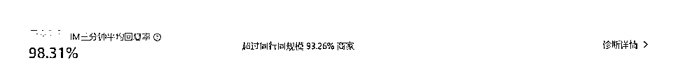

 

 

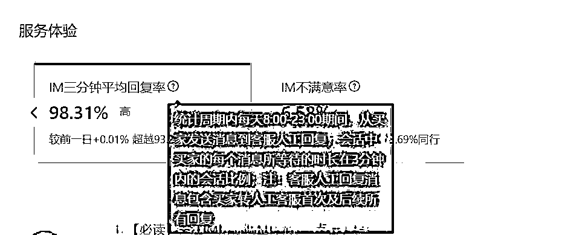

退款售后处理时效也是记录在店铺CCR指标考核。

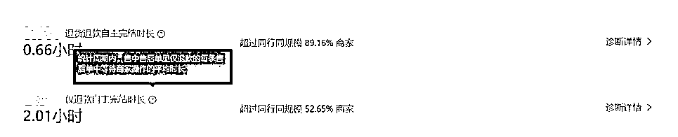

**2. **店铺与选品需要经历的**“**三个形态**”**

**①**第一形态：店群矩阵，大杂烩货架玩法，简单直接。

缺点是有侵权风险跟对抗平台，容易违规，前期入门时可以选择轻量切入，中期开始建议升级形态。

接下来我详细讲解一下有哪些形态，给大家做个参考。

分享一份我总结的脑图，先对虚拟产品的选品方向有个概念：

 

 

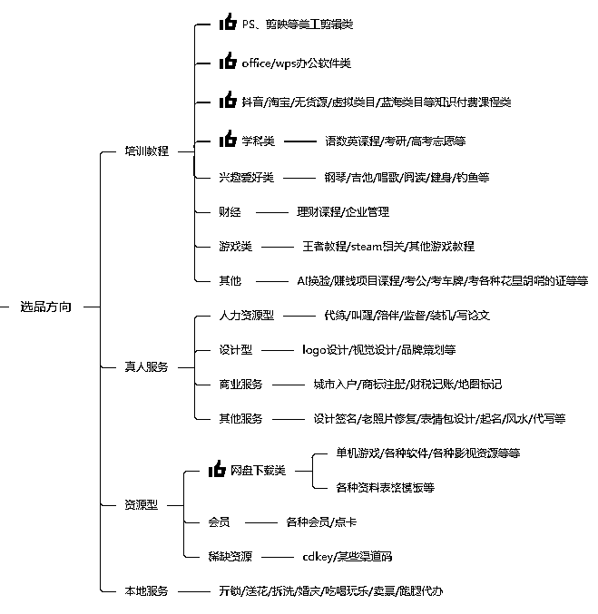

对于选品我分享三个方法，建议选正规无侵权风险的产品：

a.飞瓜选品法

b.达人选品法

c.词根选品法

a.飞瓜选品法

 

 

打开飞瓜（前期可以淘宝买一个），选择抖音商品榜，选择你所需要查询的类目，按照销量排名。这样就可以快速筛选爆品或者是正在崛起的品了。

这个选品法有三个好处：

1）可以实时观察有哪些品忽然崛起出现在榜单中；

2）可以敏锐的察觉这个类目大的风向标；

3）每天分析竞品的销售状态、运作的难度，核心出单逻辑等资料，做好登记并做出决策（我们能不能做，风险评估，投产比评估等）  。

如下图，抖音虚拟常用的两个类目【本地生活】跟【图书音像】，我每天都会去看这个排名，这样能保持我选品的敏感度，并可以及时对新崛起的品进行研究和跟进。

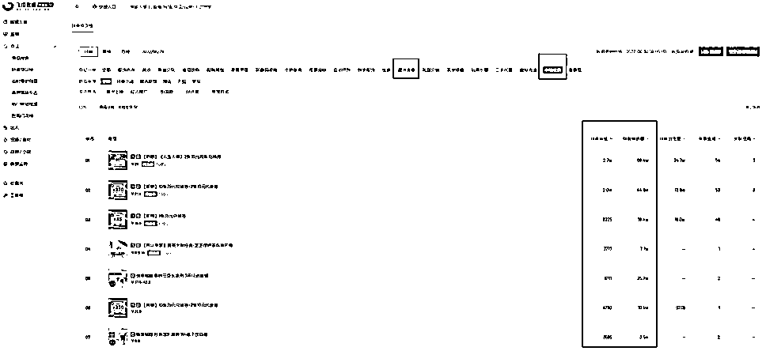

 

 

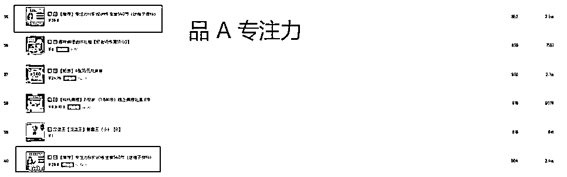 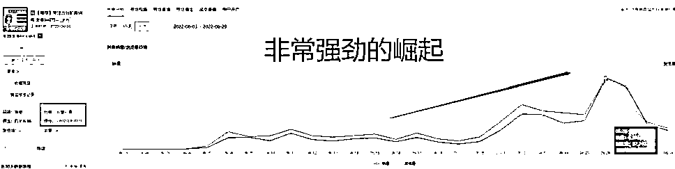

此案例中，在数据中我察觉到这个专注力的品在撒蹄狂奔时，我团队就可以迅速反应，马上就能安排选品上架，联系达人，制作图文短视频推广了。

b.达人选品法

通过火爆的品A，筛选出头部出单的达人，使用飞瓜对达人号进行带货分析，找到他们正在带的其他品如品B品C，再进行线索追踪。

找到延伸的品后，有可能这个达人对该品的出单销量并不理想，那我们可以继续回到【商品搜索】这个功能栏去寻找品B品C的头部达人，按照这个逻辑就能一路往下延伸，尽可能去挑选更多达人喜爱的品。

这个选品法的核心逻辑是把众多达人的选品化为己有。

如图：

 

 

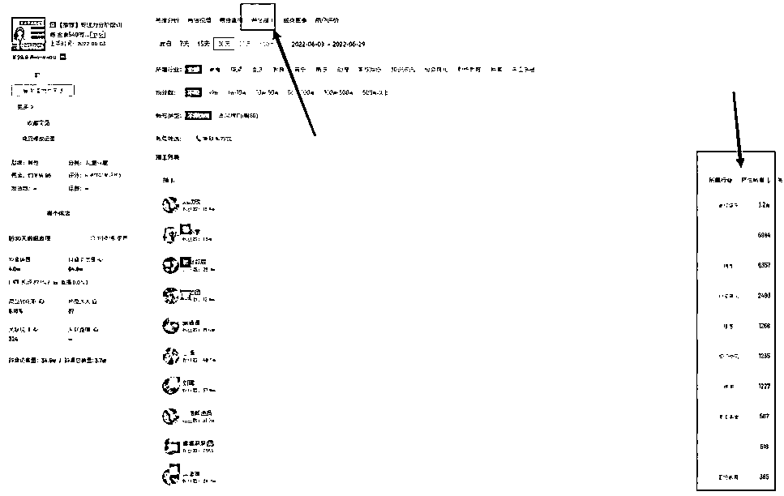 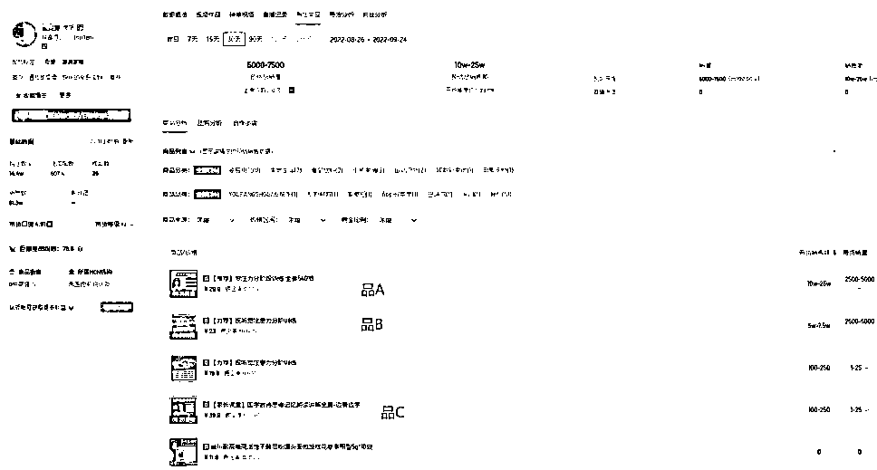 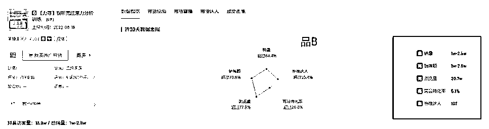

 

 

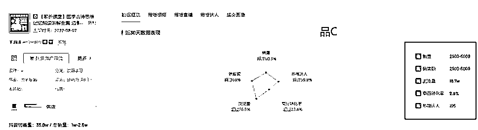

当我从品A，延伸发掘了品B品C时，我团队就开始做这个小类的全面覆盖了，就是把本品类潜力好的产品都找出来分析优化并上架。

c.词根延伸法

例如上面的品A，【专注力】是它的词根，我们可以通过搜索相近的词根去选品。

例如我们搜索【专注力课程】【少儿专注力】【成人专注力】【专注力训练】【专注力课件】等，还能联想到同一个大类目的词根去搜索，例如【感统训练】【记忆力】【注意力】【多动症】【自信心】等。

还可以跨平台到淘宝/拼夕夕搜该类词根，再把其他平台的品搬运过来。

如下图，我从【专注力】这个词根就延伸到了【专注力训练实操课】【专注力课件+教案】【感统训练】【早教大全】等等。

 

 

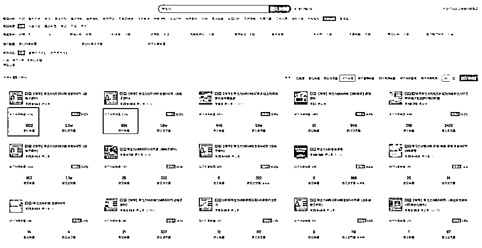

 

 

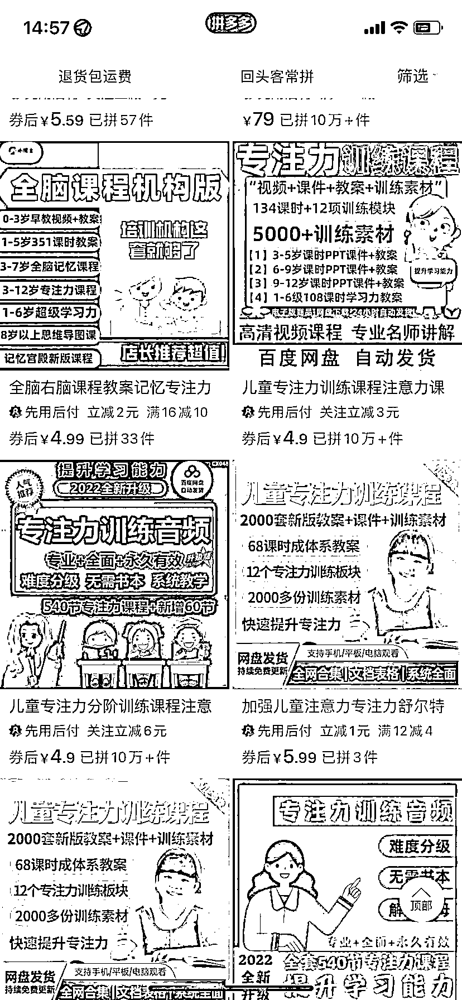

 

 

 

 

 

 

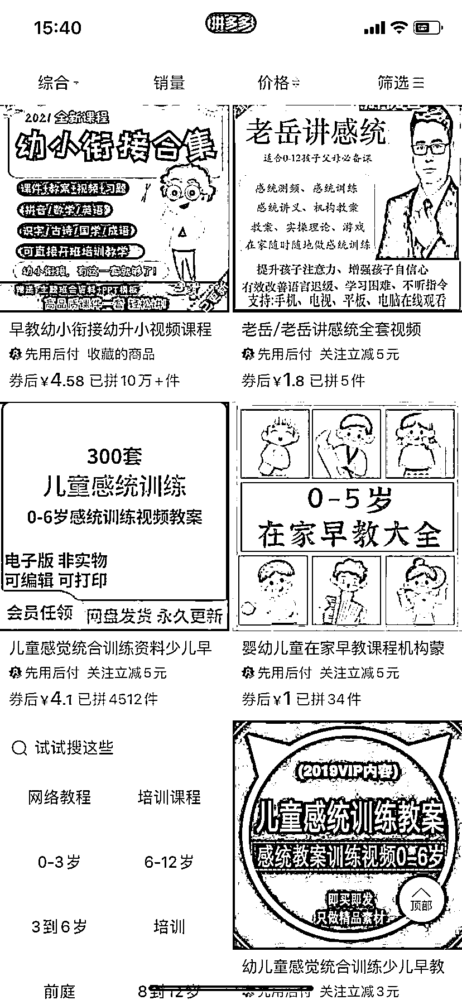

以上是我常用的三种选品法，基本能把市面热门的产品筛选进去，也能延伸关联到很多潜在的爆款。

且看我总结的选品打油诗：

找数据，上飞瓜

看市场，找爆款

爆款现，寻达人

达人强，要挖墙

思维拓，词根现

多平台，多渠道

深挖洞，广积粮

**②**第二形态：找到适合自己团队的垂直细分领域，深耕这个领域的产品。

 

 

当做到一定程度时，团队基因会影响你往一个类目深挖下去，把核心做深做强。

**③**第三形态：深耕细分领域的自研发产品，通过自营矩阵账号或者直播间去做延伸放大，最好能形成护城河。

这里强调一下，搬运选品只是入门，不要太沉迷其中，想要天花板更高赚的更舒服，强烈建议走轻量自研发微课这个形态，这个形态有以下特点：

1）自己选题，基本不违规

2）拥有定价权，不需要打价格战

3）可以随时修改或升级课程

4）其他人无法抄袭或者抄袭代价高

5）研发课程的同时可以直接出做号的素材，同步做IP号或者切片矩阵分发

6）有积累有沉淀，越做越爽，长期复利

7）自研课程可以昂首挺胸

8）独家课程，有护城河，赚的还多

 

 

下图是我们正在录制微课

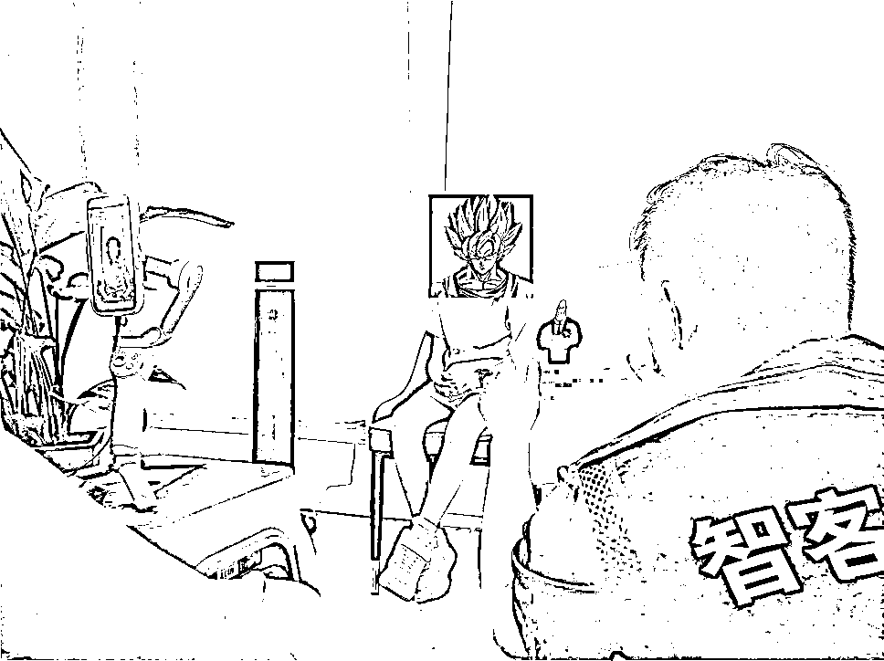

**3. **抖音虚拟类目出单的**“**五个阶段**”**

①第一阶段：达人流玩法，快速起店必备。

②第二阶段：自营短视频矩阵，自营直播间。

③第三阶段：IP人设号打造。

 

 

④第四阶段：抖店+视频流+直播流（有人/无人）+千川投流组成完整闭环。

⑤第五阶段：引流私域，多次变现。

下面给大家拆解两个产品的案例，一邪一正，拆解后大家应该能更好理解，详细的玩法可以跟随我分享的案例去学习。

五、案例讲解

案例一

**1. **产品介绍

产品：篮球游戏 NBA 2K22 美区苹果ID账号（购买后国内的苹果就能玩）（印象中有圈友分享过这个品）

这是个什么品？简单讲就是美国游戏公司开发的一款热门的篮球游戏，手游跟端游都有。

在我们国内是没有发布的，国内想玩的话只能翻墙。正常苹果手机端要玩这个游戏，需要把苹果手机ID更换成包含了这个游戏美区苹果ID，有一帮技术宅专门在外网搞这种ID，然后卖给我们。

 

 

所以这个品本质就是一个美区的苹果ID账号。

**2. **产品特点

①热门游戏，国内没有上架。

②每年都会更新版本。

③内容丰富，容易产出素材。

④话题有搜索热度，有自然流，一到假期流量就飙升。

⑤毛利高，平台扣点当时是0.5% ，毛利那是相当的香啊。

⑥这个产品用户基本都是学生、青年，沟通成本低。

**3. **产品打法

先看同行数据（同行的一部分数据，29.99元是2K21版本）：

 

 

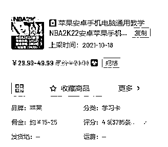  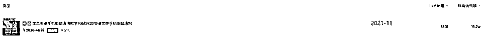 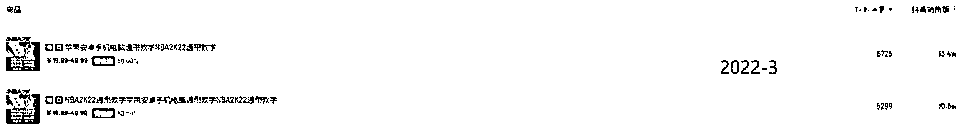

**①**市场体量

单单是这个品的体量，2021年10月游戏发布以来，抖音上销售额每个月平均都有30W+，我是最早搞这个品的玩家之一。

 

 

当时全部同行加起来也就两三个店在玩，所以分到每个团队的利润也不算少。因为年后我没有再运营这个产品，看了一下排第一的同行，大半年稳定搞了至少200W的销售额。

**②**货源

买家在抖店购买后，我们当时就去淘宝/拼夕夕采购一个，淘宝/拼夕夕卖10元以内，我们卖49.9。后期我们找到了源头，进货价约3元/个，有量还能更低。

**③**打法

1）自然流量：打猜你喜欢，传统电商那一套，上架后S单、动销、评价来一波，就可以有收成了。

2）短视频打法：矩阵号更新2K/篮球/游戏相关的混剪视频，引导到橱窗成交。

3）无人直播：高配置电脑，把画质调到极致，再安装中文解说包，录制好素材后播放就行，那时候真是简单粗暴。

4）达人流：无限开发达人就行。达人基本就是短视频+无人直播，那些游戏博主、体育博主，特别是篮球/球星博主只要发一些混剪的短视频，直接就可以爆单。而且最疯狂的时候开到了80%的佣金给达人，可以说这类达人当时也是吃到了一大波红利。

以下是我店铺过年时期这个品的经营数据，走的是纯自然流，基本毛利就是纯利。

 

 

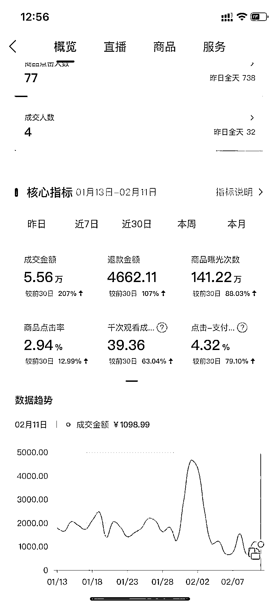

 

 

**4. **产品后端交付系统

我卖这个品的店铺已经关闭了，所以采不到之前的详细数据，下面分享的是之前的经验，大伙看看了解思路就行。

**①**产品货源

直接淘宝/拼夕夕去买，成本约5元，交付和售后直接按照无货源模式就可以了。

 

 

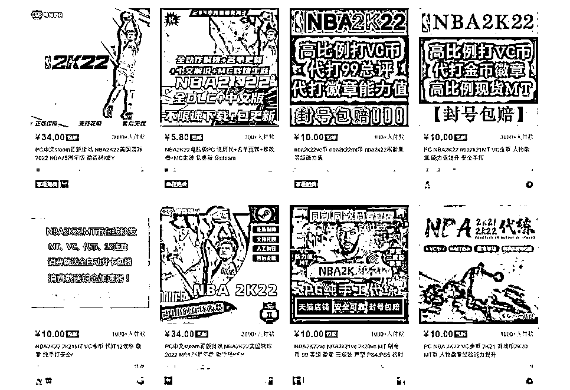

**②**产品上架

当时大家都上的教育-学习卡类目，这个类目扣点0.5%，选择虚拟发货。但是5月份平台把学习卡改成了邀约制，意味着新店无法再使用这个类目，目前普遍使用的是3C下的PC游戏软件类目。

**③**精选联盟设置

上架后把产品打开精选联盟，把佣金调好，就可以尽情邀约达人了。

 

 

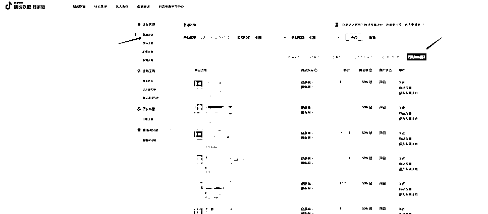 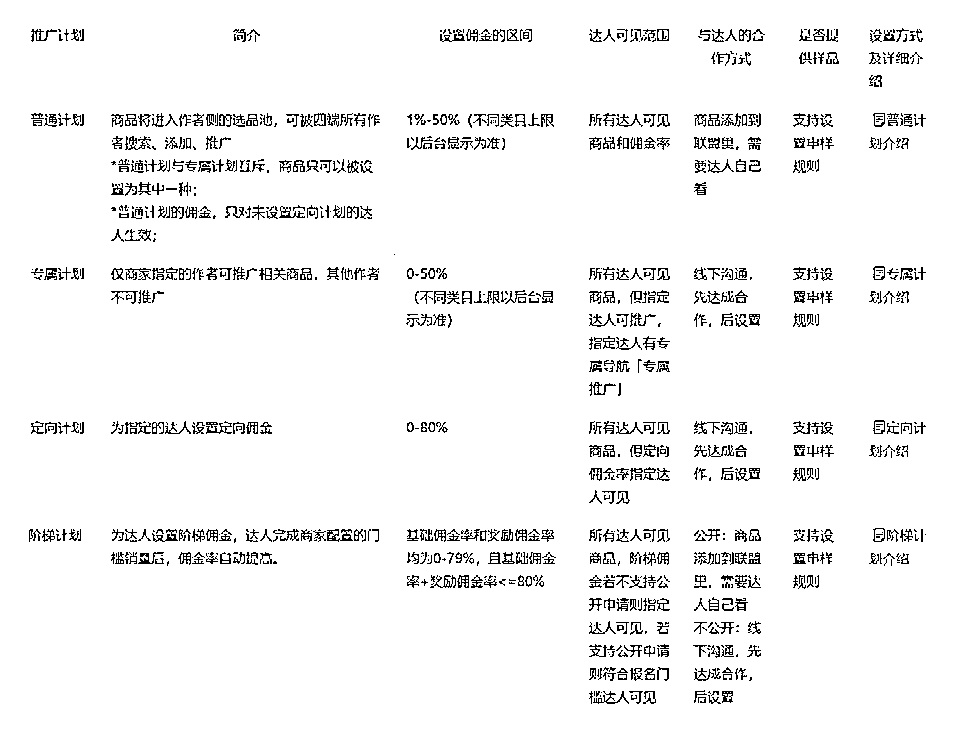

**④**客服账号以及接待

离线消息转接设置好，特别是催付助手还有自动回复功能要预设，并且根据实际情况优化。

 

 

以下是自动回复的案例

 

 

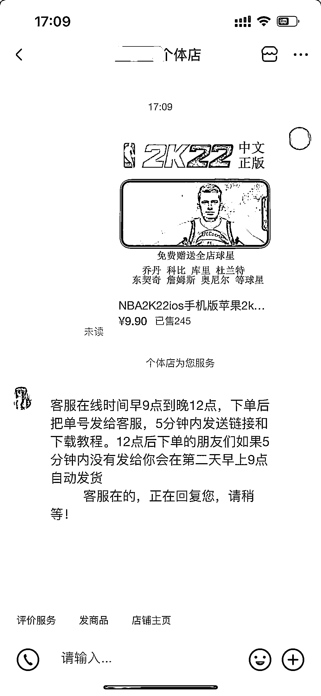

 

 

 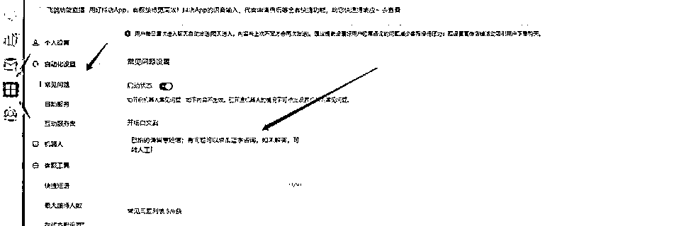

催付设置提高转化

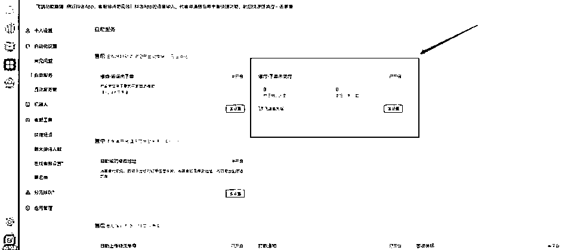

 

 

**⑤**产品如何交付

阿奇索或者极速发货把卡密设置好卡密，自动发货。不清楚的，可以看官方教程。

成交的客户，飞鸽也同步发货，使用方法跟注意事项也是需要发送的。

**5. **产品运营

产品后端交付搭建完成后，接下来就是运营出单。

**①**自然流打法

上架后3天内做十几单评价，精心晒好图，当时我们直接就有自然成交了，而且是滚雪球增长，节假日流量和成交比较高。但是这个自然流量相对其他流量来讲太少了，没太多意思，这里不建议花时间在上面。

**②**达人流打法

首先要寻找对标店铺的出单达人。

所谓知己知彼方能百战不殆，去淘宝/拼夕夕买个飞瓜，直接搜索商品名称或者对标店铺可以看到具体产品情况了。然后找到该产品出单多的带货主播，点进去达人主页可以有二维码直接跳转抖音首页，做好表格登记，然后联系，开挖。

 

 

因为这个品已经出现了10个月，达人基本都有合作的店铺了，建议挖人时候直接把佣金干到80%+。

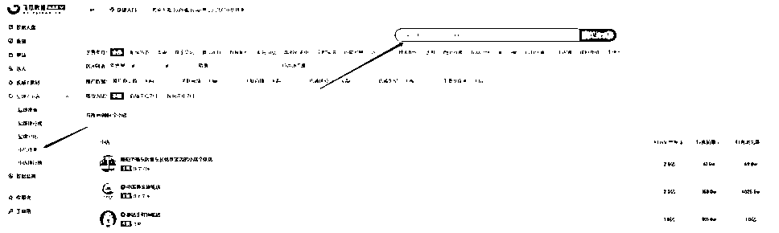 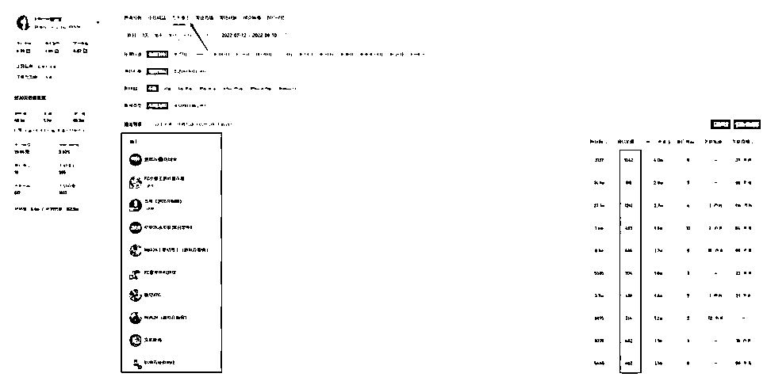

批量邀约达人

除了人工精细化联系达人，我们还要把每天的批量邀约功能用完，日拱一卒会有意想不到的效果。

我们使用的是至尊宝插件邀约，服务市场购买，直接批量邀约对应达人，纯佣金模式50%--80%不等。

 

 

要学会用好关键词词根和出单渠道属性去筛选达人，这个很重要，例如这个品的达人关键词根有【2K22】【篮球】【体育】【游戏】【手游】【科比】【库里】【詹姆斯】等等，顺着关键词筛选出合适的达人，批量邀约。

邀约说明也很关键，可以把佣金，产品、团队优势简单说清楚，最重要留好联系方式。

达人邀约基本就是大力出奇迹，每天要把邀约数量用完，后台的邀约数量是根据你的店铺营业情况提升的，起步是50人/天，到后面几百人次/天。

批量邀约每天不够用怎么办，我们还可以用达人广场后台、达人预留的电话、微信、抖音私信等方式触达达人进行沟通。

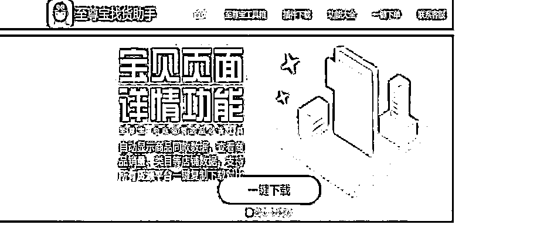

 

 

对接话术设置

我们的产品卖点，店铺优势需要通过对比同行，提炼出自己店铺产品和交付服务的优势，这样可以让达人更加心动，特别是前期销量不高的时候。

 

 

 

 

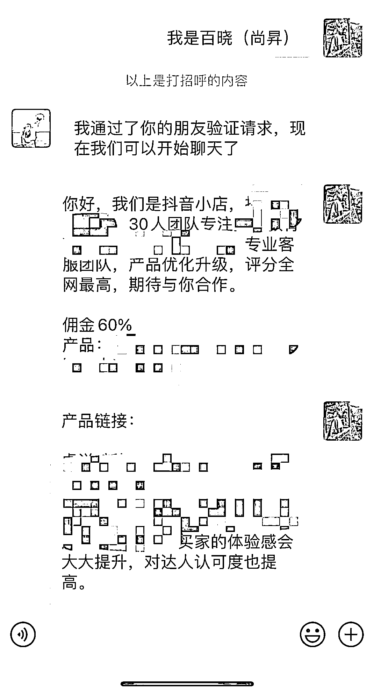

达人对接实际就是做私域。

达人流打法是最快起量的方法，没有之一，初期远比自己去摸索图文短视频、做直播要来的快速和暴力。

最好用专门的微信对接，因为微信是最及时的工具。

必须对达人进行分类，分类原则按抖音账号、出单数量、出单风格、佣金比例等设置好通讯录标签。

添加达人后，深入沟通，尽量跟达人交朋友，合作基础建立后可以按照达人要求去开发产品。

这里的核心点就是私域，要用私域思维去运作达人群体。我的微信上有接近两千个达人，都分门别类标记好，有新品的时候会通知到合适的达人。

没事我还喜欢给合作的达人们发红包，今年家里的荔枝都送出去一百多份给合作紧密的达人。

 

 

同样的佣金跟品，基本原则是同行要很难挖走跟你合作紧密的达人，如果能给轻易挖走，那一定是你做的还不够到位。

同样的品我们给达人的佣金甚至比同行低几个点，但是我们把各项服务做好，售后率降低，对我们了解的达人依然会选择跟我们合作。所以要想办法占据达人的心智，让他们足够了解并认可我们团队的实力。

所以我们要有一个概念：他们不是达人，是一起赚钱的家人啊铁子们。

 

 

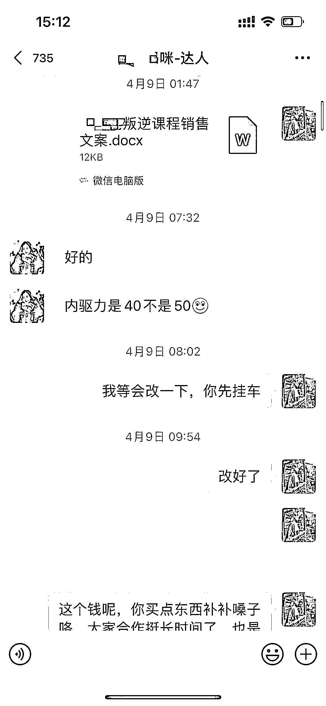

 

 

 

 

 

 

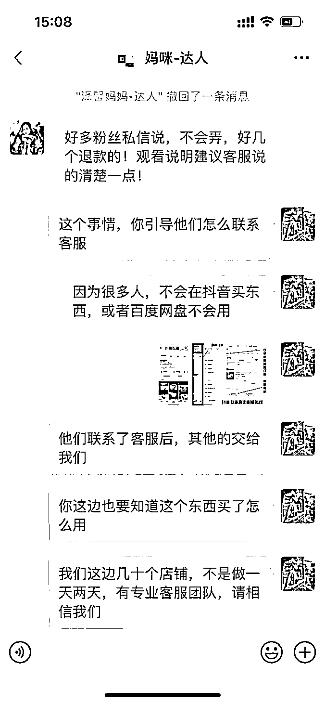

 

 

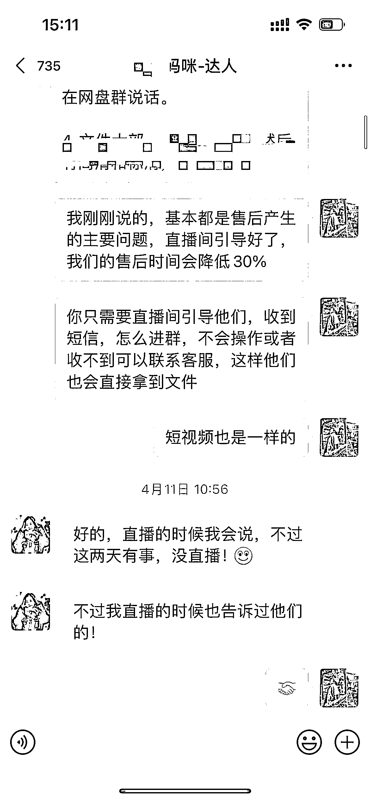

 

 

 

 

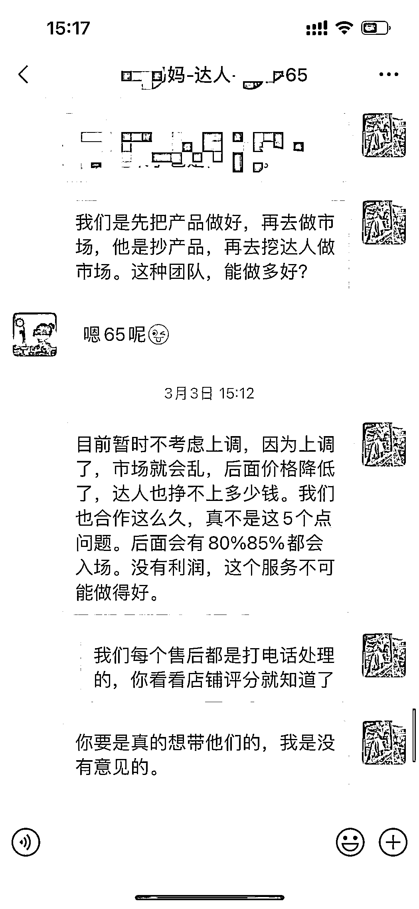

 

 

达人邀约脑图

 

 

 

 

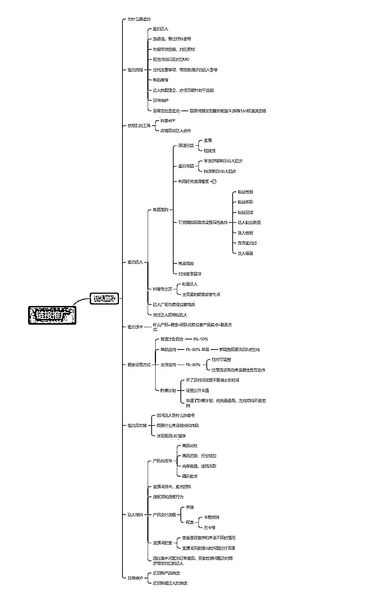

**③**无人直播打法

这个品我们是最早尝试做无人直播的，峰值能做到400+的同时在线，当时不投流。

我们使用电脑VS电脑对打，然后录制超高清素材，录制时会安装中文解说包或者加一些其他的娱乐功能，例如下图人物大小发生了变化，就很有戏剧性。

视频录制跟无人直播需要电脑配置比较高，直播时设置好，基本好几天都不用管它，自然会有流量进来成交。无人直播目前应该是这个品比较好的出单方式，但是目前平台稽查系统升级，无人直播存在封号风险，玩的话需要谨慎。

 

 

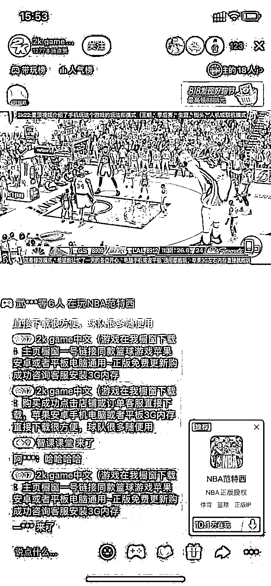

 

 

有个团队就是专门做这个品无人直播的，有20多个号，产出很稳定。

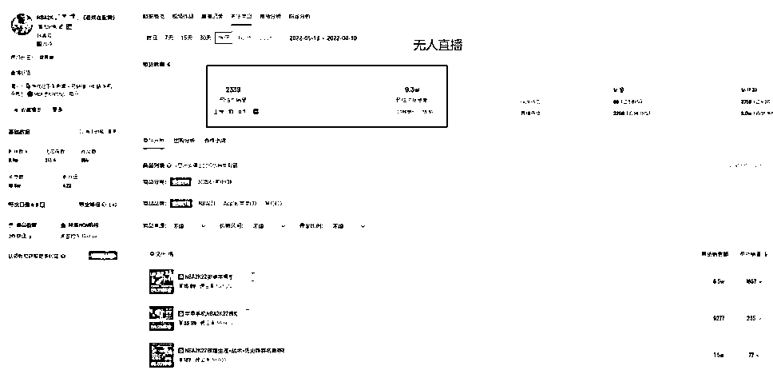

**④**店铺运营

这个产品缺点：

 

 

1）买家年龄段中学生居多，白嫖多，相对其他品退款率偏高。

2）同行倒卖：同行店铺游戏账号不够用拿不到货，直接倒卖我们的账号，而且没有底线，一个号给很多客户使用，一旦账号出风控，使用这个账号的所有人都无法使用。

3）后端交付重：因为国内没上架，使用美区苹果ID，导致产品账号不稳定甚至失效，客户使用繁琐。

基于这些缺点，店铺体验分容易掉，特别是新版ccr。但我们也是要努力维持店铺评分的，最好维护在4.8以上，低于4.6投流受限，低于4.0精选关闭。

另外这个品的售后处理难度对比我们其他品是更难的，因为客服大多是小姐姐，不容易理解手机跟电脑的设置，所以最好有个技术宅之类的组长，负责解答各种疑难杂症，维护好售后。

已经过新手期是最好的，新手期不限制单量，新手期内的店铺单日单量限制1000单，回款周期：新手期T+10，过了新手期T+4。

如何维护好店铺体验分？找到对标达人，深度沟通，佣金到位，基本问题都不大。

拉店铺体验分，一般是找第三方代办，上架福利产品去拉分，价格3.5-10元不等，看资源对接。

**6. **总结

 

 

这个品有点擦边球的，平台不喜欢，时不时会搞你一下。所有跟平台对抗的产品都会有这种情况，所以虚拟类目的坑是非常多的，不然我也不会给封了20多个店铺。

前期这种品起量容易，也能赚钱，做起来还是很爽的。不过我们已经过了经营这类品的阶段，被平台磨去了棱角。

无论是个人还是小团队，其实这个产品我觉得都算比较优秀的，每个环节都能获得流量，天花板也有一丢丢，一年搞几十个W还是容易实现的。

因为我们团队战略方向已经明确，22年年初已经开始不再操作这个产品。而虚拟市场很大，选品之初，在我们的产品池里有很多类似的品，后面有机会再给大家分享。

这类产品，如果找到几个垂直深耕下去，年盈利几十万是完全没有问题的。

案例二

大家同步参考抖音商业IP大航海 2.0（大航海资料实在太全面了）

**1. **产品：** IP +**卖课

这种就是正规玩法，自研发的课程，自营IP大号，结合矩阵号切片和直播进行卖课。

先看看我喜爱的【英语雪梨老师】的数据，最近30天销售1823万，最近180天销售额8000万+。

 

 

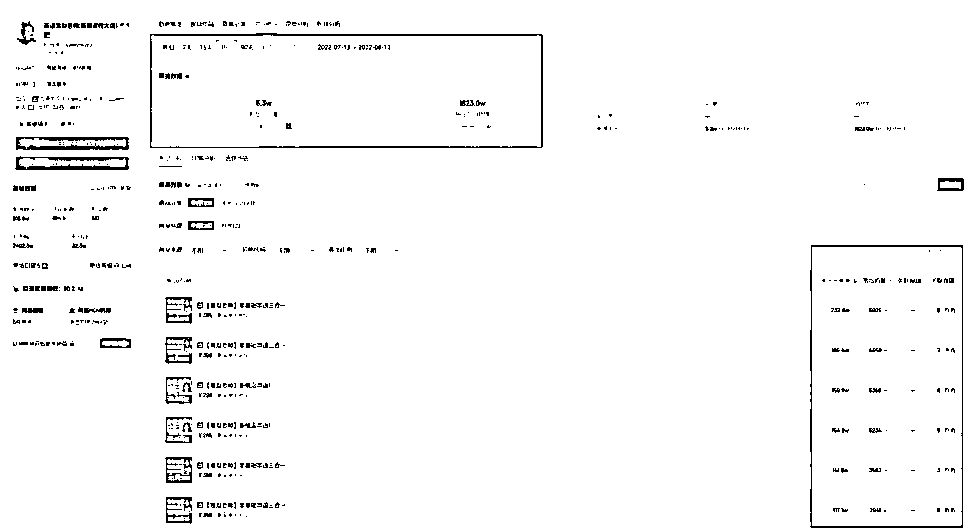

以下是她核心商品近期销量数据，客单价高，有人设，通过学浪承接。

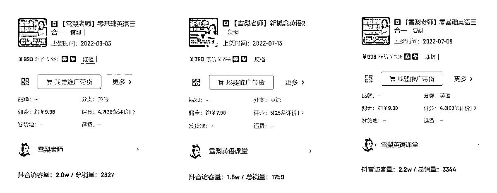

 

 

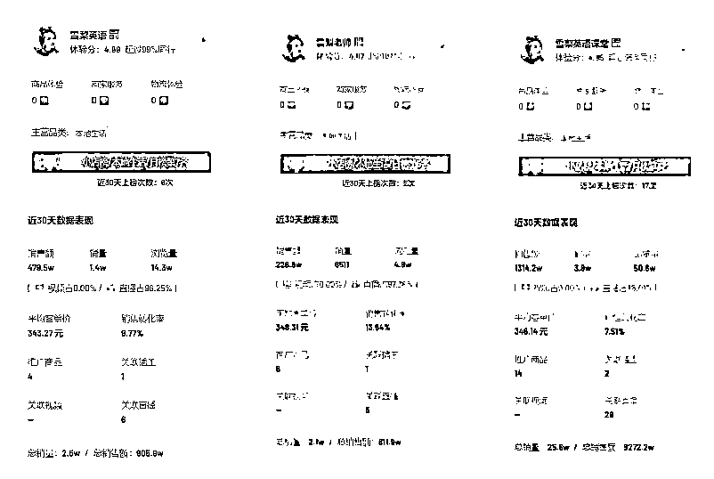 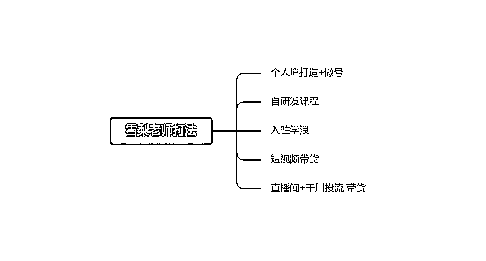

 

 

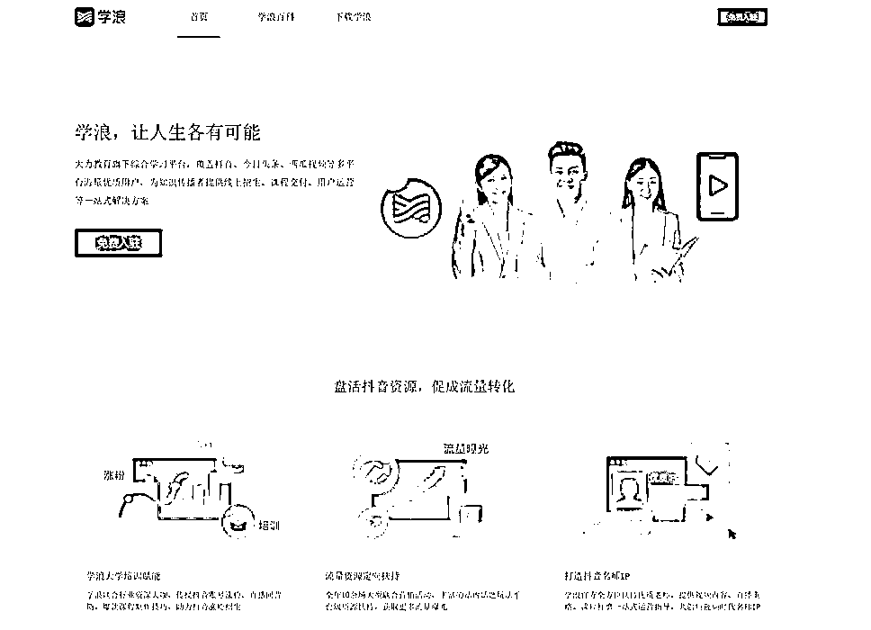

抖音的爆款课程，很多都是在学浪交付。学浪作为抖音的亲儿子，明显是要扶持他的。

另外有很多店铺喜欢把客户导到微信私域、小鹅通、公众号、APP等交付，目前抖音也在收紧这种引流到站外的行为。所以按照发展趋势，我们直接想办法在学浪交付是最好的，适应平台发展方向很重要。

**2. **学浪交付的好处：

1）订单可以同步抖音小店，订单页面直接可以打开，买家下单后可以直接看到。

2）课程上传到学浪服务器，不管店铺后面什么状态，课程是一直可以看的。

 

 

3）订单页面没有退款入口，客户下单后订单直接是签收状态，所以回款非常快。

4）学浪交付的课程售后和品质退货的指标天然比较低，店铺评分更稳定。

5）课程只能缓存在学浪APP ，客户不能下载，设置不能录屏后同行无法复制课程。

6）学浪作为抖音官方所属APP，拥有信任背书，并且客户购买后在抖音后台可以直接同步观看课程，这两点非常有助于提高转化率。

**3. **总结：

这个案例很明显天花板和稳定性都是很高，目前我认为适合公司化运作。

首先是产品研发，已经是过滤了大部分虚拟类目的竞争者，想要做成这个事情必然要准备好打长期战斗的准备，

第二是IP 打造跟做号，也需要稳定专业的团队才能持续运作生产内容，对于直播团队，剪辑团队，投流团队都是有很高要求。

不过目前抖音的知识付费赛道还有非常非常多的机会，很多垂直的小赛道都还没人做，一个选题就能做出课程售卖了，所以一开始也没必要直接对标这种大类目的大咖，可以从更垂直的选题先做起。

例如很多技能和知识类都可以做成一门课，上到k12教育课程，下到个人兴趣爱好，又或者是价值观输出，都可以作为一门课程。

 

 

我们最近也在跟机构合作，通过抖音这个平台，把许多行业老师多年的知识沉淀，传播给更多有需要的人。

六、避坑指南

**1. **法律层面

如果你的产品是盗版或者侵权的，那就要特别要注意了。因为这种擦边球的产你能赚钱，但是会很焦虑不安，你不知道什么时候平台会搞你。所以不建议都搞擦边球。我们很多违规是平台层面违规，尽量是不要触犯法律这个层面。

**2. **资质层面

资质要齐全，例如营业执照经营范围、特定类目资质许可、ICP、出版物经营许可、各种报白等

关于执照注册。icp注册这些，也没必要自己瞎研究，会的直接干，不会的，花点钱就完事了，战略资源要花在战略位置上。

**3. **操作交付层面

客服3分钟回复，品质退货CCR指标，各种售后疑难杂症的处理等

 

 

品质退货绝对是抖店圈内最头疼的一个事情，一堆人吐槽，虚拟也是一样的，只能是从客服端引导好消费者进行售后处理。

做虚拟类目心态要好，对比实物的30-50%的退款率，我们虚拟还是比较容易接受的，基本是5%-15%，售后相对简单，对于比较频繁发生的问题，直接做个视频教程或者图片教程就能降低很多售后问题。

对于疑难杂症的，能退就退，没必要浪费时间纠缠，你今天没给他退款，明天还是会找其他问题烦你。

**4. **抖店平台政策层面

尽量不要去对抗平台，基本虚拟类目最大的变数就是平台政策打压。

以下是遇到的部分处罚：

随着抖音的成才，规则也慢慢完善，抖音小店对于虚拟产品处罚力度，也是每天一个样。

有直接12分的5000的，刚开店直接就关联处罚，付出多个店铺的代价，对于抖音的规则的各种坑，也是慢慢有所了解，已经做到坦然接受。

 

 

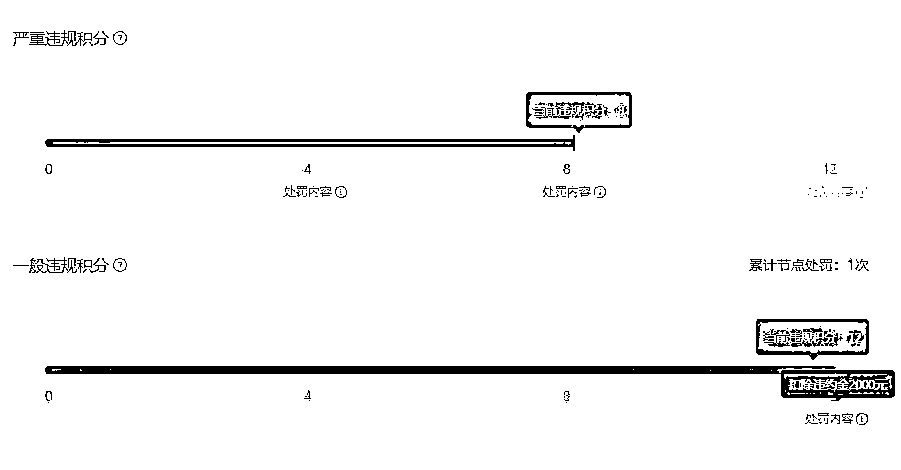 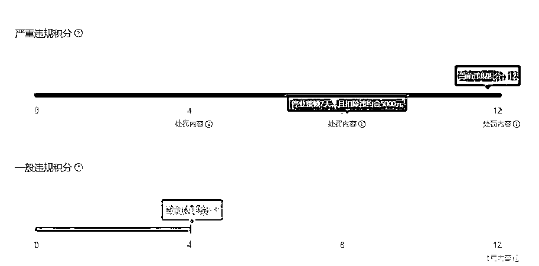

 

 

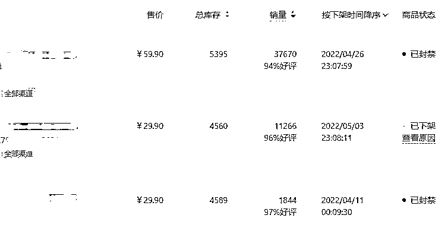 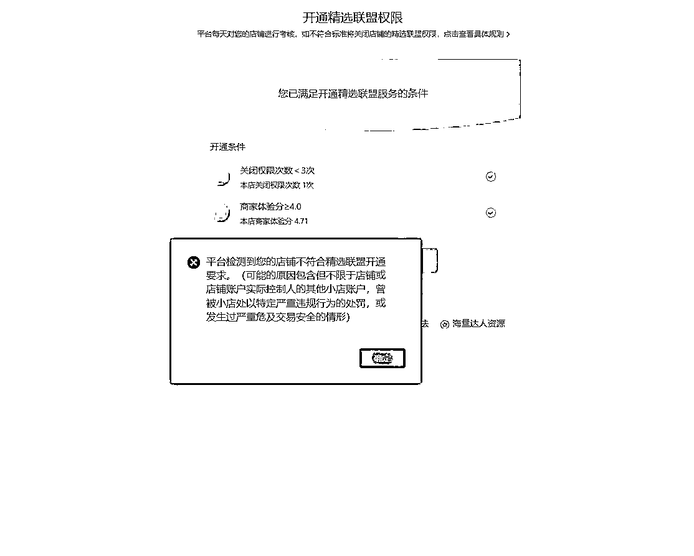 

 

 

七、其他的絮叨

以上分享了我们抖音虚拟类目的核心玩法，希望对大家有所帮助。在当前的经济环境下，  我觉得对于很多团队而言，有时候指一条路会很重要，至少走过的路我分享后，或许可以给后来者一点参考。

虚拟玩法搬运这一块能快速进场，但是面临的问题同样巨大，有条件可以直接做正规的教育课程或者服务等。

按照我总结的五个阶段玩法，我们目前处于自研课程，到IP打造，再图文短视频+直播+千川变现的阶段。

感谢生财平台，欢迎评论区留言，有问必答，我是智客科技的百晓。

评论区：

Javinlee : 需要课程研发适合小团队吗？

不甩 : 适合的，不过赛道方面需要筛选，根据团队基因来

子凌 : 是不是后续还有低转高的流程

不甩 : 低转高看团队承接能力，如果有现成的闭环，可以直接进行项目嫁接  三林 : 先看看我喜爱的【英语雪梨老师】的数据，最近30天销售1823万，最近180天销售额8000万+。 — 这个数据是不是有误啊 1823万  什么概念啊

不甩 : 数据是这样显示的，我刚开始接触的时候，也是被超过预期，正常的。

小牛 : 学习到了，感谢分享

QuG : 没啥有误的，这个数据官方也可以查到，而且比雪梨还要高的大有人在 

 

# **# ****(**精华帖**)(215**赞**)**普通女生** 0 **经验如何靠做课

# 程赚到第一个** 1000W**

作者：  阿佳bonnie

日期：2022-06-16

大家都有过知识付费的经历吧？以前通过收徒的形式来做，现在可以在网上做一门课程分发给全网的用户。

哈哈哈，看到这里大家会不会觉得这和我有什么关系呢？其实逻辑上来说，想把自己的内容做沉淀，给到其他有需要的人，都可以参照这个逻辑来做。

所以今天想和大家聊聊怎么做一门有吸引力的知识付费课程，其实一开始做知识付费的时候，我还是一个什么都不懂的小白，但在几个月以后我录了一门课程，销售

1000W+，在这个课程成功以后我又依法炮制了几门课，也都小爆了，营收在几十万到几百万。

 

 

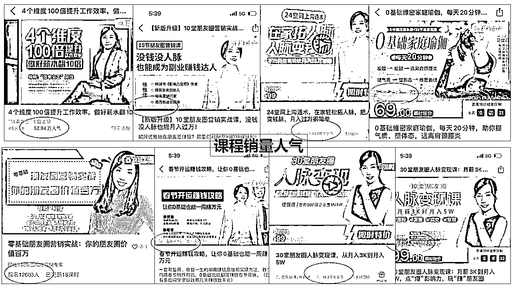 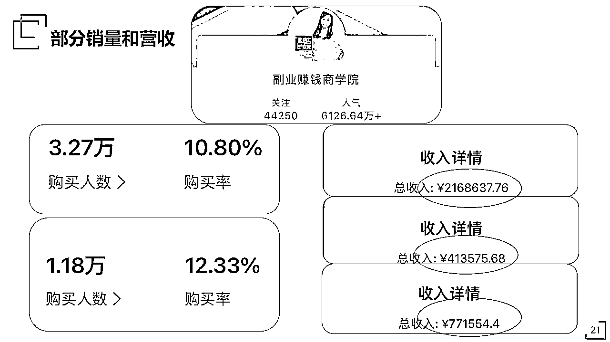

目录

一、我做最小 MVP 测试产品的过程

二、如何打造爆款课程

三、总结

 

 

一、我做最小** MVP **测试产品的过程

在腾讯游戏内部，一个产品要正式上市之前，会经历立项、很多次的测试（内测、封测、公测），用户调研、数据分析、用户留存、付费率、不断调整，反复验证才可以正式公测。

那我们做知识付费也是产品，也一样需要做选方向（选题）、立项（定选题）、用户调研、市场分析、测试。

我在做知识付费课程之前是做营销策划的，营销策划的特点是喜欢做用户调研和数据分析，洞察用户的真实需求和分析市场需求。

我在做第一个正式的录制课程之前，其实我做了很多个测试型的知识付费产品。

**1. **免费公开课

最开始，我也不知道自己可以做什么产品，我看到别人做知识付费一个月十万，我垂涎欲滴，但是我作为一个「刚失业」的职场妈妈，没有粉丝没有流量，怎么办呢？

当时有唯库、职场充电宝等一些职场平台，最开始想到的是积累讲课案例，积累讲课经验。因为虽然我在腾讯负责过培训工作，但我实际上是没有讲课经验的，于是我就毛遂自荐当讲师，免费给别人讲课。

 

 

当时，我每个知识付费平台的公众号都会去留意看有没有申请讲师的，申请讲师需要写清楚你的工作经验、擅长的领域，讲课经验或者有没有现成的课程，大家要提前思考一下。

我申请了好几个平台，第一个联系我的是职场充电宝，我和他们的运营一起碰了一下分享方向和分享时间，我结合自己的工作经验想了一个选题叫做《如何策划一场刷爆朋友圈的营销活动》，当时有 1600 多人听。如果你拿捏不准，请你一定要认识几个知识付费平台的运营，多跟他们聊天，是问一下最近什么课卖的好，什么课有市场。

**2. **付费咨询（**699 **元** 1 **小时）

我申请了在行的行家，设置了 2 个话题：

如何转行互联网

如何线上线下营销

这两个话题都是几百块一个小时，两个对比下来，如何线上线下营销约我的人更多。

约我如何转行的大部分是传统行业想转行互联网的职场新鲜人，约我线上线下营销的要么是公司里的营销策划要么是创业者、老板。

我们通过单个的付费咨询，其实也可以洞察你的「产品」有没有人愿意付费，他们付费以后你可以通过问答聊天，了解到你客户都是什么样的人群、他们的真实痛点，以及你能不能很好地解决他们的问题。

通过付费咨询，我发现我不是很喜欢解决小白的转行问题，但是对于怎么做营销、怎么获客、怎么转化，我特别信手拈来，那说明这是一个好的方向。

 

 

**3. **付费授课（**1 **万** 1 **小时）

通过几次免费分享，有更多的平台看到了我，虎嗅和 91 运营联系到我，愿意付费 1 万  1 小时邀请我讲课，讲课的方向是运营，听课的人是多少我忘记了，最后是 2 个小时分了 2 万多给我，但是课程反馈不是特别好。

通过这个产品，我又发现了我的价值，很多人想学习运营知识，提升自己的职场技能。

但是这块我不是很擅长，我自己做起来有点吃力，也不是我很喜欢方向。

所以pass这个方向。

**4. 19.9 **元** 21 **天打卡付费社群

我看到有人做时间管理社群和时间管理打卡社群，我觉得很简单，这个时候，公众号和微信都积累了一些粉丝。我试了一下招募，居然有几十个人付费。但是运营下来其实我并不是很享受，所以这个产品，后来也被我 pass 了。

**5. 99 **元销量** 10W+ **营收** 1000W+**

如果我们没有做课经验，一上来就想做一个大而全，又贵又好的课程是不现实的。

第一你没有经验，第二你没有案例，第三客户需要漏斗，第四你需要验证你的策划和进行进一步的数据分析，所以我们最佳的选择是先做一个最小可行性（MVP）课程产品。

我们创业要去很远的地方，不是一上来就先造汽车，先做轮子再做车身。而是先做一个滑板车，先跑起来，再换单车、摩托车、汽车。

 

 

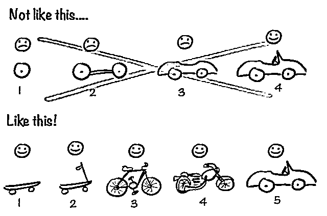

所有的产品都需要测试验证，最小的验证方法，就是通过引流课、公开课、付费咨询的方式，30 分钟到 1 小时。大家也可以参考我在做第一个录播课之前那 4 个 MVP 测试的经历，如果有粉丝积累也可以通过直播验证。

设计公开课/直播海报，通过朋友圈/社群宣传，看看有多少人对这个公开课/直播感兴趣，如果来的人很多，恭喜你，这个选题很好。如果来的人很少，最后还没什么人愿意为他付费，那么你就要调整，通过和粉丝、学员、用户聊天、访谈等方式挖掘他们最迫切需要的。

我最早验证朋友圈课程可行，是综合了几个数据：

我做了一场** 1600 **人的** 45 **分钟公开课，说明需求是存在的；

偶然发现有一个人单节** 45 **分钟的朋友圈课程卖了** 1000 **多份，验证大家愿意付费；

 

 

发现一个线下的企业内训老师，他一年** 260 **天都在上课，**90% **都是微信营销，企业花几万一天请他讲课；

当当京东上微信营销的书卖的很好，还有人出了系列书。而知识付费平台上目

前并没有成体系的课程，微商自己做的课程则都是内训，并且授课质量很低，

都是文字语音**+**图片，没有很好的理论体系知识体系；

在荔枝微课测试了** banner **和大纲，连课都没有，转化率在** 30% **以上，数据奇好，于是才开始做课件。

所以，你也可以先做一个海报，咨询、直播都可以，看看朋友圈有没有愿意咨询、付费。有人愿意付费了，再考虑下一步。不要一上来就开发一个课，花了几个月开发了几十节课录好了发现没人买，这就太尴尬了。

二、如何打造爆款课程

如何打造爆款课程，我总结起来有以下六个步骤。

第一：选题定位——选题 90% 决定了你的课程能不能卖得好。

第二：数据分析——市场分析、用户调研都做好了你才能找到一个能爆的选题。

第三：用户调研——如何让你的课程更符合学员预期，如何拥有高满意度。

第四：内容填充——体系的知识理论模型、契合的案例、PPT、实操练习。

第五：MVP测试——转化率怎么样？市场反馈怎么样？有人愿意买吗？

第六：营销推广——如何让你的课程卖得更好更多。

 

 

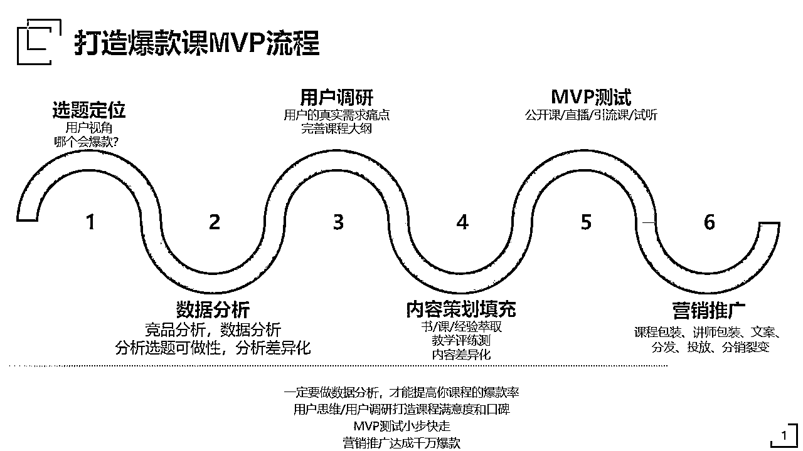

**1. **如何进行选题定位

前 4 个测试产品测试下来，我发现，我最擅长、最多人买单、我最喜欢的，就是营销。

但是营销这个领域这么大，我肯定干不过已经有名气的呀，于是，我就正式分析营销有哪些细分领域，我有哪些领域是可以进入的，我自己分析一圈下来就是微信营销。

那么作为小白，你也是一样，要先分析自己的优势：

你毕业于哪个名校？不是名校有没有在哪个名企工作过？没有在名企工作过有没有为名企服务过，有没有名企客户？都没有的话，你有没有在哪个领域做出过什么成绩？有没有经常被人夸的地方？参加过什么培训，拿过什么证书，哪个领域有多年的经验？会买房？会理财？懂财务？英语特别好？特别会聊天？求职能拿很多 offer，面试特别厉害等等。

每个你觉得没什么了不起的地方，其实都是有需求的。你觉得很简单的事，可能别人觉得特别难，觉得你特别厉害，所以你的优势是需要梳理的。

 

 

当然，也不是所有的优势出一门课程都能卖得好，这是一个事实。因为有的知识特别小众，受众面不广，但是作为想做课程的人，他往往当局者迷，因为掌握的数据不够多，导致可能做了几个课程发现都不火。

一个课程能不能卖得好，跟它的受众、市场需求、热点有关。比如瑜伽课和杠铃课，副业课和 Java 课，受众和需求就有很明显的差别。

如果你想做一个爆款课，首先，你选的方向受众就不能过窄，最好能是大众，绝大部分人都有需求的。比如变美：减肥、瑜伽；技能：PPT、Excel、销售、文案；赚钱：副业、理财。

但是这些我列举的关键词不一定是适合你的，你能做的。所以，还需要结合你的自身或者你的讲师，挖掘讲师身上可以讲的又需求大受众广的方向，刚好还切合当下的趋势和热点那就更再好不过了。

我们如何去挖掘这些关键词呢？你可以根据下面这张图写下属于你的关键词。

可以从学习经历、工作经验、业绩荣誉、兴趣爱好、特长、成功经历这 6 个方向入手，写下 6-10 个你擅长能输出的关键词。挖掘自身的优势、经验、经历，看看爆款选题中是否有跟自己的经历经验背书背景相匹配的的。

 

 

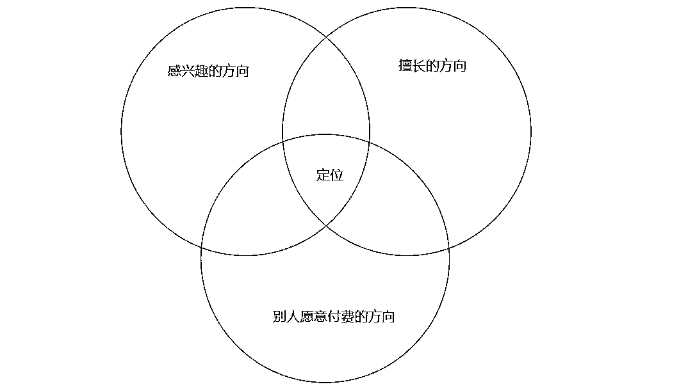

因为我在腾讯工作过，做过几次副业、卖羽绒服 8 天赚 5 万、24 岁通过信用卡买了 2 套房，我曾经做过地产置业顾问销售出身，在腾讯做的是 BD 经理，品牌营销传播等工作。

我梳理的的关键词是：副业、时间管理、营销、销售、商业模式、信用卡、房产、社交、人脉、升职加薪、创业、新媒体、短视频、直播等等。

注意：非常重点，梳理你过去的成绩、成果、经验，请数据化表达。

几岁（多长时间）做了什么事得到了什么样的成绩

你帮助过多少人做了什么事

你过去服务过有多少客户

过去在公司做出了多少业绩

过去你在学习中多短时间做出了多厉害的结果

你有多少年的** XX **的从业经验，拿到过什么样的证书（奖状）

 

 

小结：课程无论是线上课，训练营还是线下课，选题定位是核心中的核心，第一步中的第一步。短视频也是一样，选题 90% 决定了这个视频会不会火。卖货也是一样，选品决定了能不能爆。

**2. **验证关键词，全网挖掘关键词并进行数据分析

我在确定选题「微信营销」时，我同样还做了很多的数据分析、市场需求分析和用户分析，证明这个是市场上非常热的需求和非常痛的痛点，并且清楚知道这个课程的受众人群是谁。

我们有了关键词，但是你并不知道他们的需求到底是哪个大哪个小，这个时候我们需要一些辅助的工具，帮助我们验证这些关键词的数据情况。

大家可以列出自己的行业关键词，通过京东、当当、淘宝、微信指数、百度指数、阿里指数、线下企业内训等等找到属于你的行业的搜索爆款、销量爆款、需求爆款。

如果一个选题只在一个地方火  不一定大火  但是大家都在用、都在搜、都在买、都有需求，那么他肯定会爆。人群、关键词也会反复验证，看看哪个关键词更好，类似百度指数。

 

 

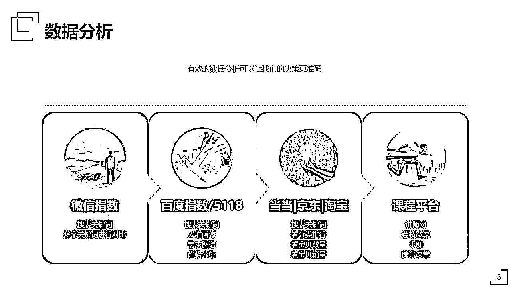

比如我在做微信营销这个选题时，我通过微信指数搜索「微信」「朋友圈」「社交」「人脉」哪个的关键词更热。我通过搜索当当、京东、淘宝发现微信营销的书销量特别高，通过讲师网发现「微信营销」的内训课需求量特别大。

我知道的一位讲师，一年讲 260 多天课，就是讲微信营销，一年课酬几百万。但是通过用户调研发现用户认为「朋友圈」跟自己更有关系一些。所以正式的录播课程的选题定的是「你的朋友圈价值百万」「朋友圈营销」也是这个课最后卖了十几万份，销售额超过了 1000W。

在建立我的直播间的时候，搜索了副业、业余、兼职这几个关键词，哪个词更热。我发现副业更热，于是直播间的名字起的是「副业赚钱商学院」，这个直播间也成为所在知识付费平台比较爆款的直播间。

当然，我认为这种成功是不可以复制的，但是经验是可以迁移的。我认为可以迁移的能力是：数据分析能力、搜索能力、成功案例的拆解能力、分析爆款共性的能力，最重要的是行动力，去测试最小** MVP**，不要怕试错。

 

 

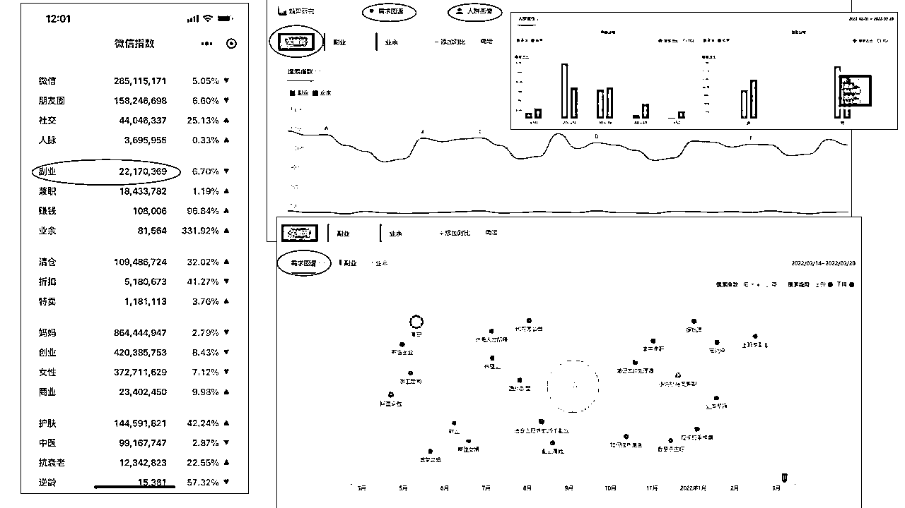 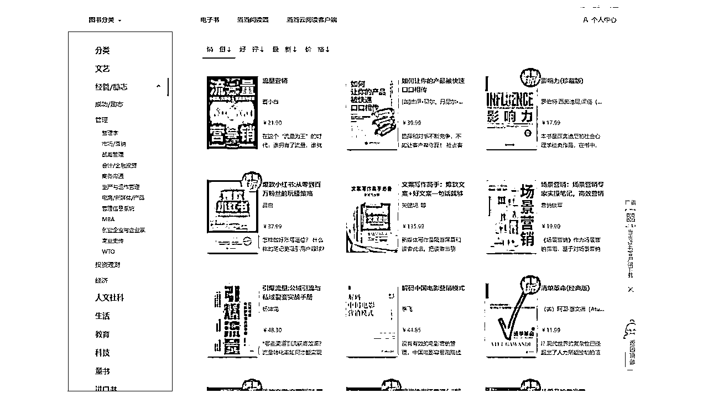

确定了微信营销这个选题以后，我把当当、京东、淘宝上卖的好的排名靠前的微信营销的书籍全部下单买回来研究，研究什么呢？书籍的标题、副标题、目录都是精心打磨过的，再看书里面的内容也是成体系的，你可以查漏补缺知己知彼。分析卖得最好得书和卖的一般的书内容差在哪里？再同时通过百度指数分析他们的核心需求点是什么，为什么企业和业务销售需要这个课？在其他平台上是否有这个选题的课程？

 

 

如何你想知道有哪些类目卖得好，有市场需求，还可以多看看知识付费平台，讲师网平台的类目是怎么分的，通常排在前面的就代表需求更大。

课程平台我们可以选择荔枝微课、千聊、小鹅通、有赞、学浪、小红书或者你的行业内比较知名的课程网站，讲师网，比如中国讲师网等等他们都有检索栏，类目栏、排行榜。

举个例子：

这是某知识付费平台和讲师网平台的导航。从导航中，你就可以看到哪些课程是需求更大的，一般需求更大的排在最前面。

在个人学习中，我要变美，个人成长，赚钱，理财，婚姻情感是需求最大的。

在企业内训中，企业管理，销售服务，职场提升，财务管理，人力资源是需求最大的。

从这里我们也可以看出，个人端和对企业端大家的需求会有很大的区别。

在抖音中，我们也可以看到在个人成长、赚钱、理财、情感的需求是最大的，而对公司或者是企业管理端，企业管理的课程、商业模式、销售服务、职场技能、财务人力管理的课程的需求是比较大的。

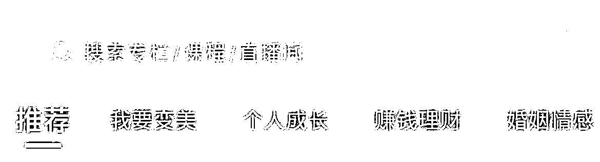

 

 

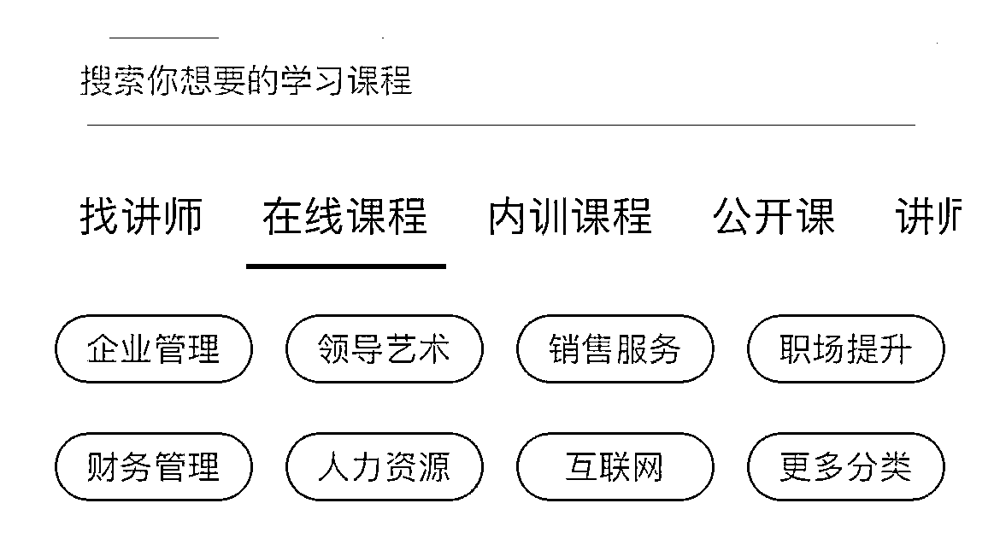 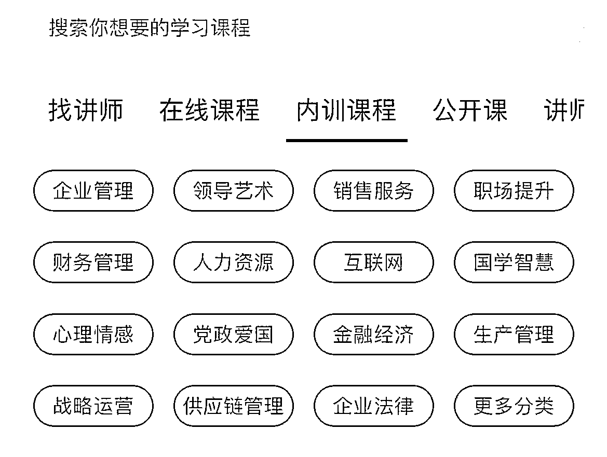

 

 

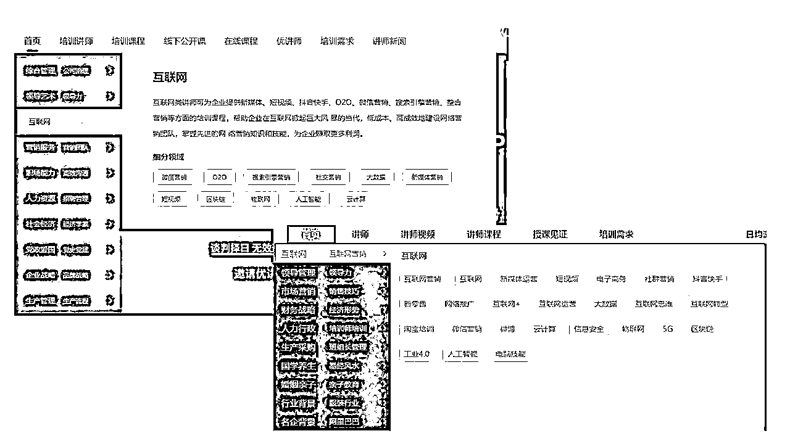

通过数据分析，你会发现以下几个方向大概率会卖的比较好，通识类、热点类、变美类、技能类、财富类、亲子类。还有要注意的是 to C （个人）和 to B （公司）的课程需求也是不一样的。

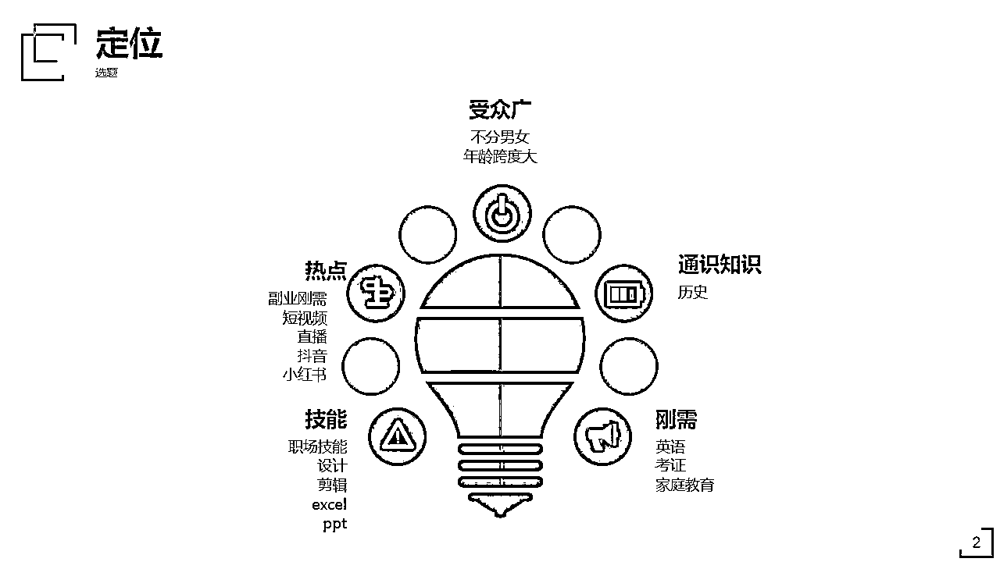

 

 

不同平台属性，他们的用户群体不一样，课程需求也会有差别。我们在策划课程的时候需要把这些因素考虑进去。同时如果你能有平台内部消息知道哪个类目正在被扶持而你又恰好有这方面的资源那就更好了。

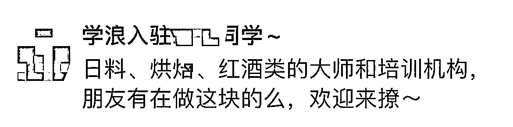 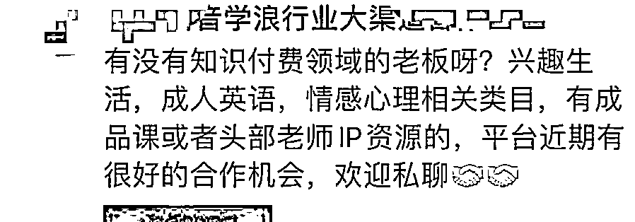 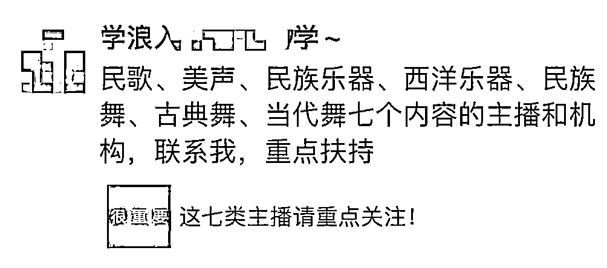

这是抖音学浪最近官方在寻找和扶持的方向

小结：一定要做数据分析，重视数据分析。没有数据支撑的商业行动，一般都是失败告终。因为没有数据支撑，那就是瞎搞，靠蒙。蒙对的几率有多大？

 

 

**3. **竞品分析

Swot分析（优势劣势机会挑战）

比如我分析自己优势：在大公司做了10年市场，懂营销懂品牌，自己有做副业的经验和成功案例，接触过微商知道微商的痛点。

劣势：入场在线教育比较晚，没有很多授课经验，品牌和营销比我名企大的大有人在，如何选择细分市场切入？

市场细分

营销：文案，公众号营销，微信营销，小红书营销，社群营销，营销策划

品牌：产品品牌，个人品牌，品牌策划，品牌传播

市场分析：机会

现在有很多新起的知识付费品牌和自媒体，那里还没有头部，是否可以借助新的知识付费平台和自媒体找到机会？

威胁：是不是有人做的比我更好？如何迅速找到细分领域定位、快速提升自身的授课能力、积累学员案例、口碑。

 

 

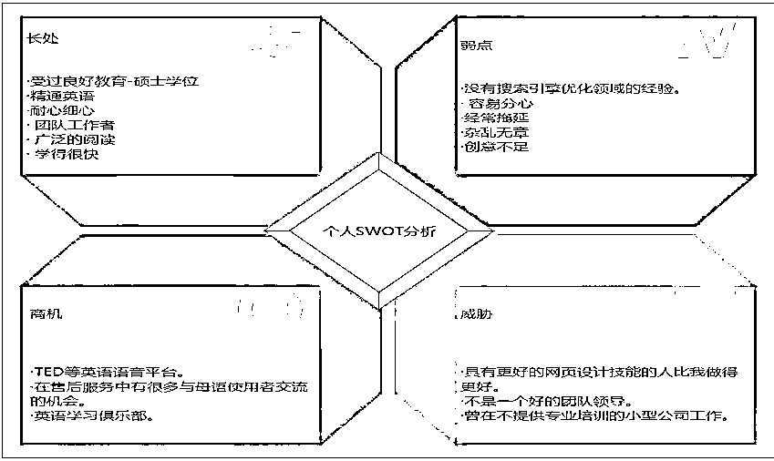

确定自己的选题方向，我们需要做竞品分析，简而言之就是要分析你的对手、同行，分析他们的优劣势，哪里做得好你可以学习，哪里做得不好你可以优化补充，你可以做哪些定位和内容上的差异化。

分析他们的课程标题、讲师包装、课程大纲、课程文案、课程销售渠道、引流转化方式、增值服务、社群运营等等。

举个例子：我当时的课就没有人在做，于是我只能通过书，线下企业内训，微商培训等方向去分析差异化。通过跨界的课程研究分析好的课程标题、大纲、详情页、文案都是怎么做的。

这里需要用到拆解的能力，360 度无死角拆解分析。

**4. **用户分析

 

 

用户分析主要用于分析你的用户需求，让你的课程内容可以更好的匹配你用户的需求，一般我会做用户调研。用户调研分为定量、定性、访谈。

最简单的方法我们可以收集用户的问题找出共性，帮助你优化大纲和课程内容。

举个例子：

我在做朋友圈课程的时候，我先把买了课程的人引流到微信群，通过群接龙问题收集的方法，挖掘他们共性的问题、底层痛点、根本性需求。所以再最后通过这群人收集上来的问题针对性开发课程，最后呈现出来的课程口碑和反馈非常好，好评率 97%。

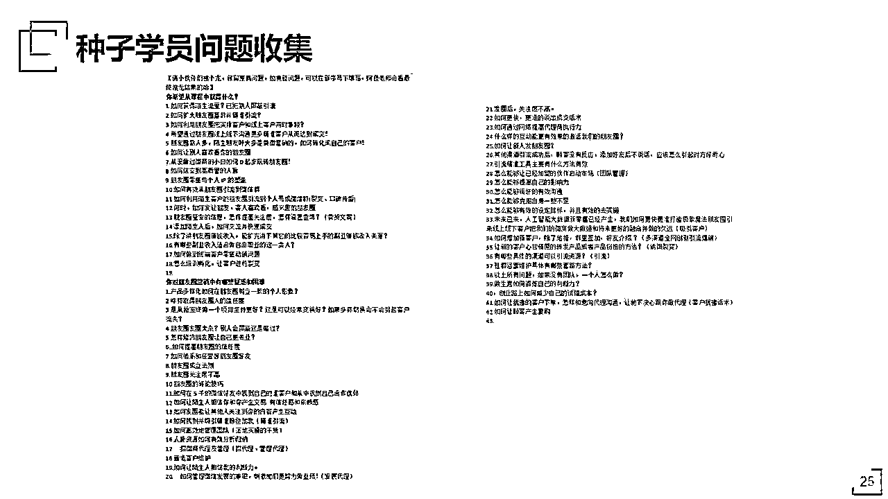

如何洞察用户的需求大家通过痛点问题收集、收集马斯洛需求层次理论，Kano 模型，多维度尺度方法，用户画像，客群定位，用户标签，角色细分等等方法。

 

 

小结：一定要了解市场，了解自己。不了解市场叫做不敬畏市场，不了解用户，叫做不敬畏用户，那一定会吃苦的。

**5. **内容策划填充

这是我策划第一个课程时列的大纲，10 节课。

大纲我的方法是结合同选题的畅销书，课程（线上课或者线下课都可以），去分析他们的大纲设计的逻辑、顺序、版块，再结合自己的经验，你觉得她们哪里好哪里不好，哪里可以更好，你有什么不同的见解、案例，梳理自己的版本。

通过 excel 或者思维导图梳理大纲会更清晰有逻辑。先写一个初版大纲，再精雕细琢润色，一般没到最后上架，大纲都有可能会修改，不需要追求一次到位把大纲策划好。

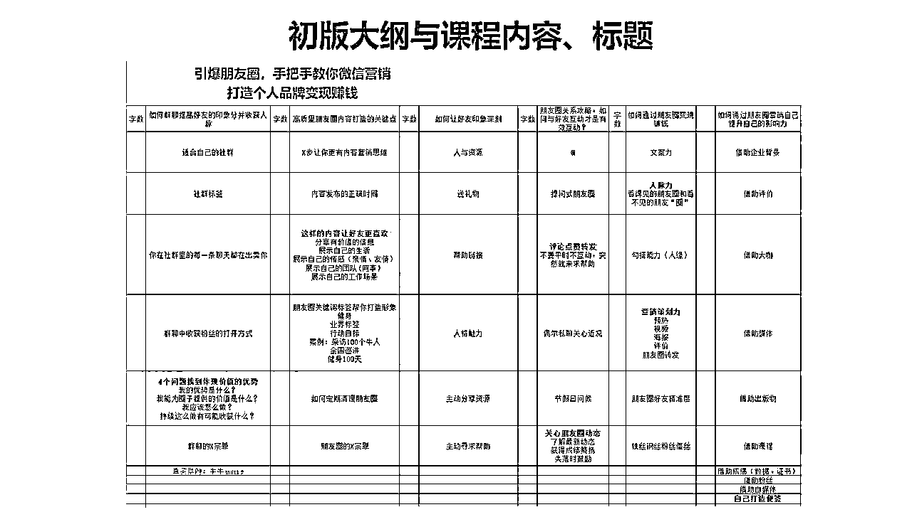

 

 

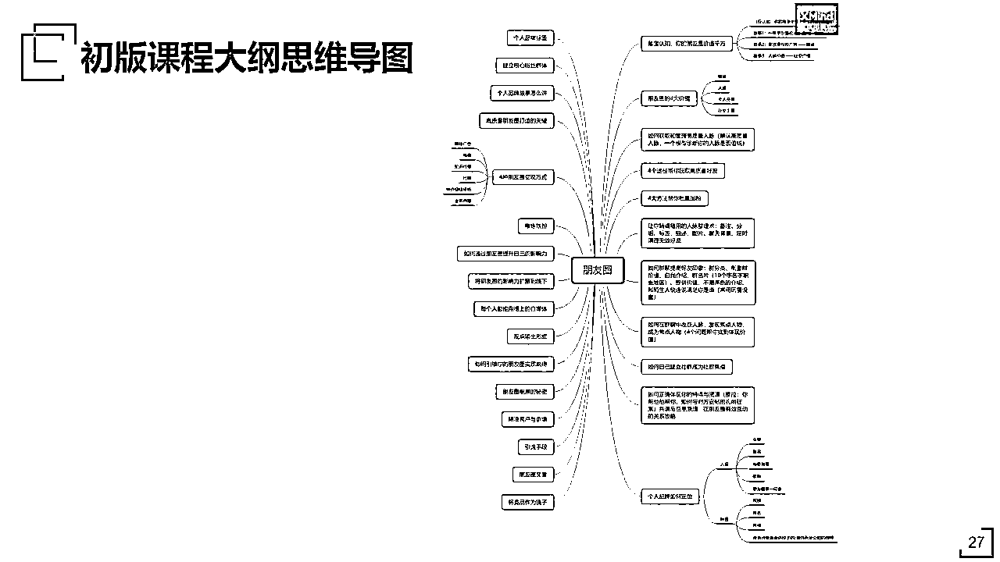 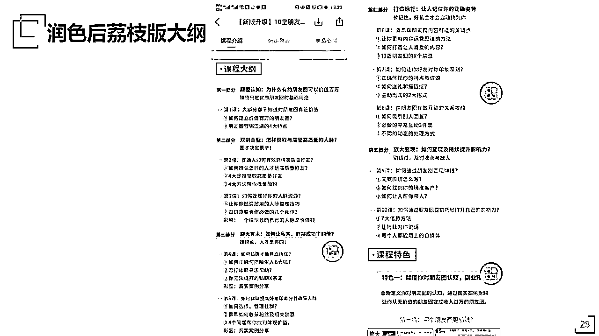

知己知彼百战不殆，内容填充你可以通过大量同主题的系列书籍找灵感，如果有可以大量对标的课程更好，细心耐心地看一遍大纲、内容，听一遍别人的课程，看看别人有没有好的可以借鉴，再根据自身的经验用思维导图梳理出自己的知识框架、理论体系和案例集。

 

 

PPT 如果你不会做的话，可以在淘宝上去做 PPT 模板，然后再把我们的知识填充到合适的 PPT 页里面即可。如果有需要 PPT 模版的话也可以留言。

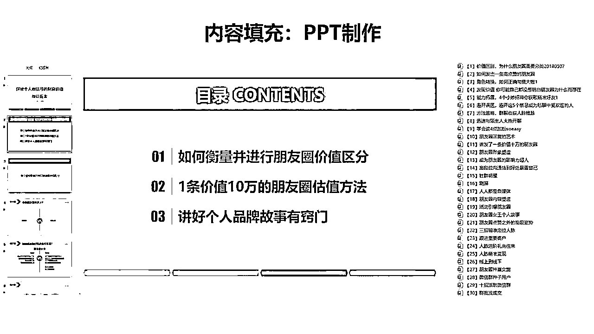

逐字稿不是必须的，但是一般优质的录播课程都会提前准备好文稿。这样讲师在录课讲课的过程中才会通顺有逻辑不卡壳。

以下是我在录制课程之前先准备好的文字稿，通过 word 或者有道云笔记写好保存。

 

 

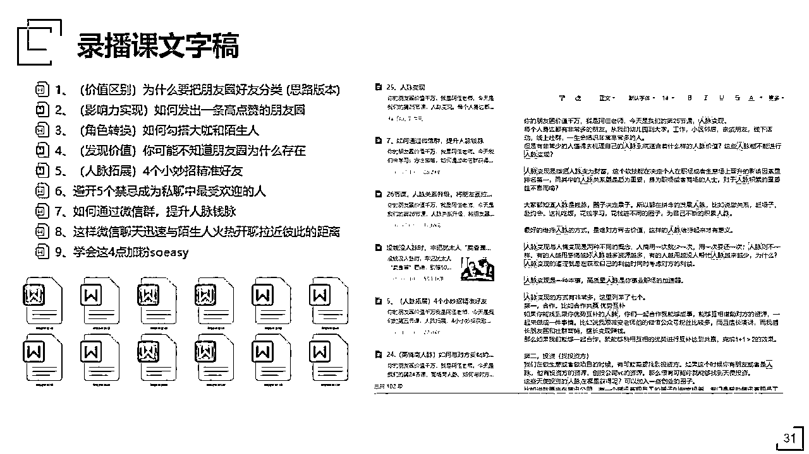

小结：

如何做出一个还不错的有逻辑不会被骂不容易过时的课程内容？

把同选题相关的好书好课都研究一遍，这样你的课才不会片面，缺乏体系和逻

辑，还可以知己知彼查漏补缺。

用思维导图或** excel **把大纲逻辑梳理出来，串一下，看逻辑是不是顺的，框架是否完整。

**PPT **可以用** PPT **模版，美观也方便你讲课得时候写文字稿的时候有画面有逻辑，还可以方便你写文字稿的时候做案例延伸。

文字稿注意不要说年月日，这样课程容易过时。比如现在是** 2020 **年做的课，你提了** 2020 **年。今年我们听的时候就明显知道这个课是** 2 **年前的，不利于持续销售。

如何又快又好写好文字稿？

先写大纲

写** PPT**，把我想到的都往里面填，包括理论，案例

**PPT **自己讲一遍，可以用** EV **录屏

 

 

通过语音转文字，可以用讯飞语音，网易见外工作台，转文字后再把文字复制

到** word **、有道云笔记、印象笔记、飞书这样的笔记工具上修改一遍。

**6. **正式发布

营销包含：课程包装、讲师包装、首发、渠道分发、营销活动、公开课、推文、试听等等。

正式发布上线，你需要梳理出你的课程产品卖点、营销方式、通过公开课和测试用户收集口碑。先通过朋友圈、社群，做冷启动和借势、造势、预热。新课程需要做一些口碑和数据才能卖得更好。

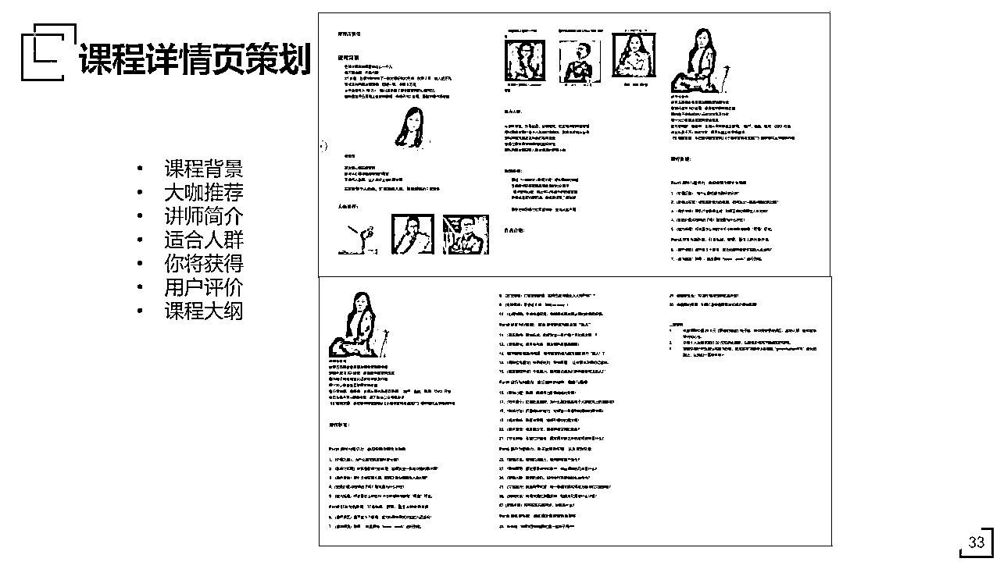 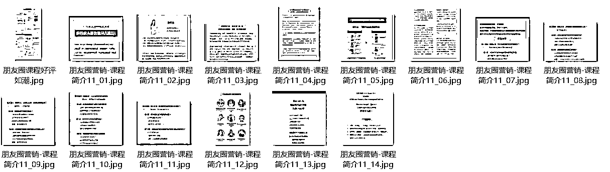

 

 

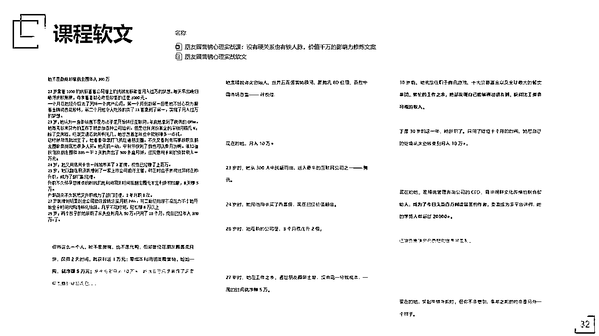

由于课程仓促上线，直播课程的效果其实是不够好的，如果一个课程希望可以长期卖，还需要注意课程录制时不要提时间点。

在课程卖了 3 万份后，我收集学员反馈，好评，学员案例等等重新修改课程的 banner、详情页、文案，根据直播转文案，把多余的口水话、提到时间的话等去掉重新录制了一版，这个时候这个课程可以长期卖且可以多个平台卖了。

如果你不知道如何做一个详情页如何包装你的课程，这里就要用到成功案例/竞品拆解的能力。

细到毛孔级别，拆解对标的包装策略、标题、副标题、banner 、广告语、详情页、讲师包装、选题包装、增值服务、卖点等等。

这里就不贴案例了，大家自己去搜，锻炼你的搜索能力。

 

 

**7. **如何持续提升销量

上架其他平台，需要针对不同的平台进行修改包装，比如大纲修改、讲师形象照、课程标题、软文文案等。

以下是针对某个平台做的大纲标题修改图，和详情页修改图，以及课程分发不同的平台的表格。

现在也有很多 MCN 机构会联系有成品课程的老师进行包装分发，他们负责包装分发，最后跟你来进行分成。像这样的机构有很多，比如博闻、简知、个人发展学会、荔枝微课现在也有部门专门做这个。

现在单个平台销量几万已经不容易出现，都是通过多个平台来销售达到销量过万到几万。

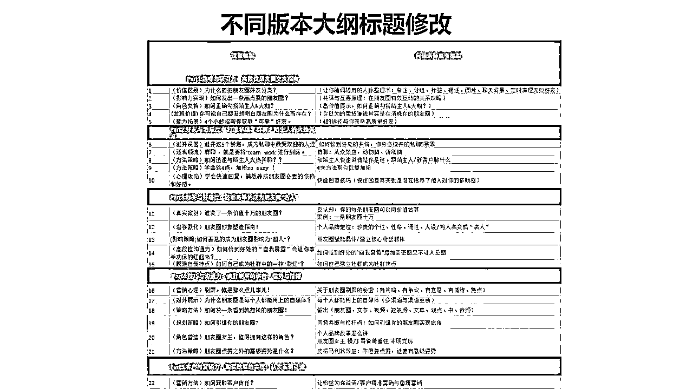

 

 

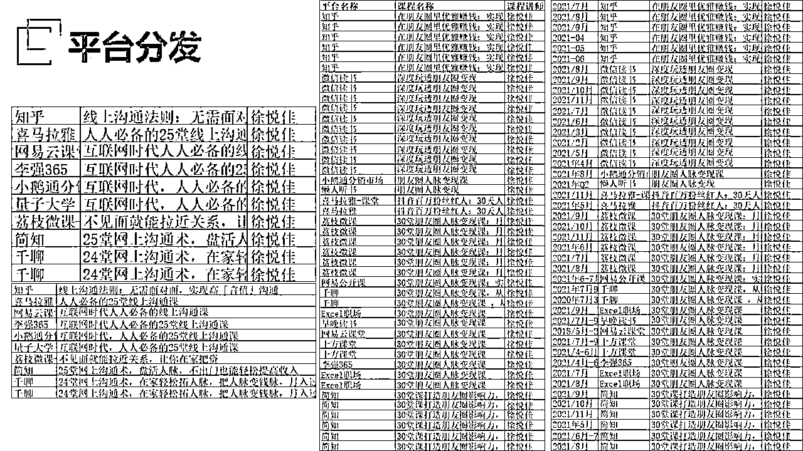

小结：没有流量怎么办？不会包装怎么办？不认识平台运营怎么办？刚开始做课程课程没数据怎么办？

没有流量我们就要去创造流量，一定要主动出击。你没有流量谁有呢？平台有，有那么我们想办法找到运营，问一下他们的合作标准，再努力去达到。看看公众号有没有商务联系方式，招募讲师，合作联系方式等等。

不会包装，第一先研究同行怎么包装，不会设计有很多免费设计网站：创客贴，图怪兽，模版很多修改文字和图片就可以。

如果你对课程非常自信，有一些数据，可以找 MCN 机构。如果你有细心留意，就会发现很多课程会上架很多平台，直播间还不一样，这就是 MCN，他们会把成品课程拿过来重新包装上架。可以找公众号，留言，买课程加课程里联系方式，加群里的运营，方法太多了。

 

 

课程没数据怎么办？让你的朋友圈好友帮忙转发，免费送出去，裂变出去，如果这个都做不到好好想想是你脸皮太薄还是平时人品关系没处好，发个红包别人不会拒绝。

这个时代是对普通人最好的时代，你可以在各个平台打造个人品牌获得流量，个人品牌是一件长期复利的事，低成本获得流量和曝光，多香呀。

三、总结

**1. **先有产品还是先有流量

做副业变现，做课程变现也好，最常见的误区就是先去做流量。

很多人做了很久都没流量，有的人做了几年十万百万粉丝了还不知道怎么变现，少数能变现的也不是很稳定，太长时间粉丝也失去了粘性。所以不要迷信什么我要多少粉丝了才能变现才开始变现，先保证自己不要饿死。

**2. **想清楚你用什么变现

副业的本质是，先有产品再搞流量或者边搞产品边搞流量。

副业、变现、赚钱、商业本质其实就是「生意」，就是商品交换、价值交换。你只有粉丝没有产品，别人想给你钱都不知道怎么给。所以你如果有实物产品很好，你的定位很清晰。如果你是虚拟产品，比如社群、服务、课程，那么你需要先设计好想好你的产品是什么。

 

 

**3. **用最小** MVP **验证这个产品是否有市场需求，是否可行

最小 MVP 可以是免费产品，也可以是超低价产品。如果免费的都没人要，那么这个产品说明没有市场，如果低价很多人要，那么你可以设计一套系统化的阶梯式的产品。（前提是你的粉丝是你的目标用户，是精准的）

**4. **知识付费小白到大神你会经历四个阶段

**1**）小白不知道怎么定位，做什么课程、什么服务。

梳理你的学习经历、工作经历、兴趣爱好、特长，把关键词写下来，把不擅长不喜欢的删除，再从中挑选市场上你觉得最有市场最有需求的，留下 1-2 个即可，这个就是你可以定位的方向。

如果不知道哪个市场有需求，微信指数、百度指数、淘宝拼多多京东当当搜一搜关键词，数据低销量低的代表需求量少，相反就是需求量大。

**2**）新手阶段，确定好你的定位，开始设计打磨你的最初级的产品雏形，这个过程都需要测试

比如时间管理的课程和服务都分为很多种：打卡群、每日早起、早起陪伴、早起攻读、时间管理课程、时间管理训练营，高效能、时间管理工具等等，人群：职场人、宝妈、学生党、高管。不同的人群你做的产品也不一样。

**3**）打造属于你的「里程碑」「冠军」「第一」「首个」事件

 

 

比如短视频播放量累计 100 万，XX 万粉丝、XX 平台签约博主、获得 XX 奖、分销第一名、畅销书第一名、XX 平台最 XX 的博主等等。这个时候你赚钱靠你的 IP 影响力。

**4**）打造系统

课程系统：免费引流、低价成交、会员产品、高价产品、超高价(合伙人/代理人）产品。这个阶段你赚钱靠团队、靠系统。

举个例子：免费送 28 个时间管理工具表、9.9 元 7 天时间管理课、999 元 XX 金币会员、3999 元 XXX 年社群、9999 元私董/合伙人/轻创客，这个时候你不仅需要有团队，还需要有好的服务和交付能力，带团队的能力。

评论区：

岁寒 : [捂脸]你是吃到了16年那波知识付费的红利吧，现在知识付费平台都活不下去了  赖欢 : 天花板太高了，没法实操，跳着看完的。

阿佳bonnie : 感谢生财团队和我一起打磨的分享，现在在抖音小红书依然可以做知识付费，而且还很香，各个平台依然可以做，目前做低转高价课市场也很大。

阿佳bonnie : 也不是的，你看到的只是表面，转型低转高了

阿佳bonnie : 还有很多你想不到的领域

亦小亮 : 都是口播的课程吧，纯图文的很难了

阿佳bonnie : 口播

岁寒 : 加油，建议分享点小红书的一线实操经验吧，唯库、荔枝、喜马拉雅真的是风口造就的，没啥说服力。

# **# ****(**精华帖**)(209**赞**)**自媒体小白做小红书** 3 **个

# 月，从** 0 **涨粉** 8000 **粉，变现** 5W**

 

 

作者：  劲猫

日期：2022-07-12

来生财三个多月了，一直是个小透明，本着发文绝不说废话，只提供有效信息的原则，我将《小红书从0到1变现5万》的经历写在这篇文章里。

先放数据。

目前总共发了50篇视频笔记，其中2篇大爆文（点赞1000以上），20篇小爆文（均赞200），粉丝8000。

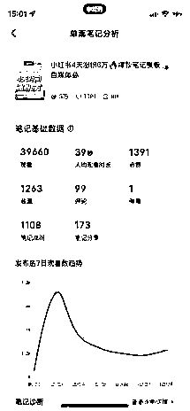 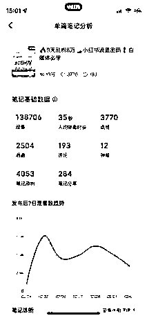

变现产品则是小红书账号诊断及小红书一对一陪跑，具体收支明细如下，图片太多放不下，放第一个月变现的收支给大家过目。

 

 

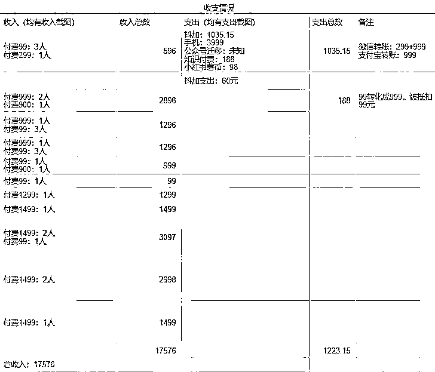

好，接下来正文开始，我会纳米级复盘，我一个自媒体小白，如何从0到1在小红书起号8000粉并且变现5万的（全文约5500字，阅读需要8分钟）

一、背景

其实说我是自媒体小白，这个不完全对，只能说我在小红书上是完完全全的小白，在这次做小红书之前，我甚至都没有刷过它。基本上我算是有5年的自媒体经验。以下为比较简单的个人介绍。

 

 

我叫劲猫，性别女，97年，大三的时候就开始接触今日头条，当时做过一个劲猫街头采访的账号，那个账号做了几个月，没赚什么钱，但是让我了解了什么叫做自媒体，也锻炼了我拍摄和剪辑以及写文案的能力。

后来我断断续续做过抖音取名项目，做过淘宝客项目，做过风水项目，还有一些比较短平快的项目比如淘宝拉新，菠菜，薅羊毛等等，这些加起来估计赚了有50万。

其中风水项目赚了大头，半年给我带来了近40万的收益，后来平台打压，便没有继续做下去。

赚了钱之后，给在老家的爷爷奶奶翻修了房子，跟朋友一起天南地北旅游。大学毕业之后我去了深圳，当上了一名硬件工程师。

原本我以为我的人生基本就要做工程师做到老了，但是没想到，我机缘巧合下成为了一本黑的粉丝，认识了郭拽拽老师。

他的文章写得特别好，再加上他揭秘的很多网赚项目都是我之前了解甚至尝试过的，所以我主动加了他微信，把我自己的经历整理发了过去。

聊了一番下来，拽哥想要我成为他的写手，帮他写文章。

当时我正在工作，还没有转行的想法，但在拽哥高薪诱惑下，我开始兼职给他写文章，就这样写着写着，对自媒体的了解越来越多，各种平台的套路也越来越熟悉。

这就导致了我对自己的本职工作一点也不感兴趣了，这破班是一点都不想上了，我觉得我就是属于自媒体的人。

 

 

于是我直接辞职，第二天便进了拽哥的公司，给他当全职写手。后来辅助他做IP课程，在自媒体这条路上越走越远，经验也越来越多。

接下来，就遇到了一个让我从0到1起号小红书的契机。

二、契机

这个契机，就是生财的抖音直播大航海。

当初我对这个航海很感兴趣，再加上拽哥是生财私董会的成员，于是他带我进了抖音直播大航海，我便开始做“劲猫”这个IP。

当时计划的是小红书，抖音，视频号，三个平台一起做，内容同步发。拽哥跟我一起做好了定位，也跟我确定了大概的选题方向。

开始出内容之后，也跟上了生财的直播节奏。开始在小红书，视频号，和抖音这三个平台直播。

这是当时第一次直播的情景，整个人紧张得不行，后来发现其实直播也不难。

 

 

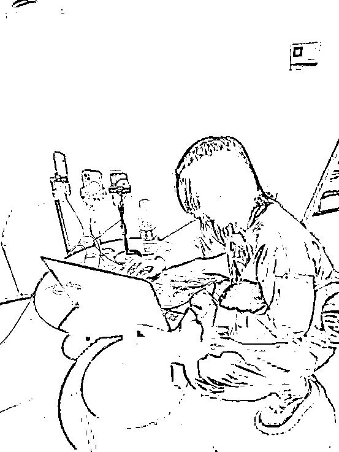

再加上生财的直播航海真的做得特别好，每一次的直播教学我都没有落下。

当时我的组长是月正哥，队长是Y024老师，他们真的超负责的说，监督和鼓励也很及时，所以我每一周的任务，我都有好好执行，反馈和心得也写得很认真。

 

 

就这样，三个平台的IP号进入了发内容，做直播的正轨。

但，每个平台的调性不一样，我的内容，在小红书上火了。

于是，拽哥开始让我深入研究小红书的爆款规律和逻辑。把抖音和视频号放弃，只做小红书这一个平台。

这个时候是二月底，我还没有变现产品，还在研究爆款与涨粉。

三、执行

二月份我开始发笔记，一直到我3月初的第一笔变现，这个时间不超过15天。

说实话，我挺惊讶的，这个速度有点超过我的预期，我原以为至少要3个月左右才能变现。

不过，我很快搞明白了我变现如此快的原因。总共有三点。

**1**，定位清晰。

我的定位是自媒体操盘手，头像名字和简介，都围绕自媒体运营展开。

 

 

看到我的主页的人，下意识都会认为我在自媒体上很有经验，所以，大部分主动私信我的人，都会问我如何涨粉，如何变现。

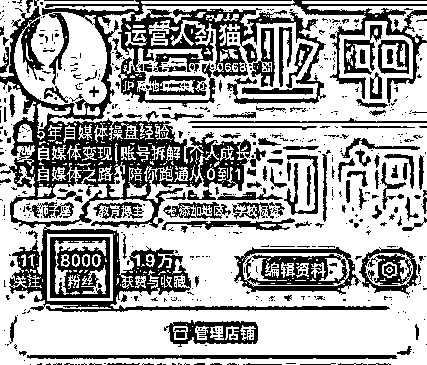

而且在直播的时候，我也发现大部分人的需求都是围绕“看号”“账号不涨粉”“不知道怎么发内容涨粉”等问题来咨询。

所以，我的笔记主题越来越垂直，每一篇笔记都围绕粉丝的需求来开展。这样就让我的粉丝越来越精准。

**2**，价值明确

由于我的定位清晰，所以我从粉丝的需求里挖掘出了她们最想要得到的价值，那就是账号诊断。

 

 

这就是我的第一个变现产品，我会给他们看账号目前的情况，哪些地方需要做出优化调整。账号诊断的价格是99元一次，目前已经涨价到299元，销量很不错。

**3**，朋友圈打造

朋友圈打造是私域产品销售很重要的一环。

我的朋友圈一天大约5条，发布规律是这样的，小红书干货1条，日常生活2条，案例反馈2条。

这样既能让别人知道我有账号诊断服务，也能让别人看到我的价值。从小红书进入微信的人，信任感的建立就会比较容易。

有了这三点之后，我的99账号诊断销量开始变多，这时候，有学员开始咨询我是否有陪跑业务。

于是，陪跑业务就此诞生了。

陪跑最开始的价格是999元，180天陪跑，目的就是帮助学员跑出一个能够成功变现的账号。

具体的权益和细则几乎没有，课程也没有，我用的是笨方法，先给学员做初步规划，然后做账号装修，做每一篇笔记的选题和修改。

几乎可以说，我在帮他们做号。

 

 

这样很辛苦，真的超级辛苦，当时我才带了4个学员，就已经忙得不行，每天除了自己做视频，还要直播，晚上还要给学员解决问题。

但这样的效果也很明显，我的学员开始一个个出成绩，有减肥学员两个月涨粉1万的，有育儿学员1个月涨粉6000，变现小1万的，有同城摄影服务学员，业绩20万的。

这些案例让我对做小红书越来越有信心，因为它证明了，我做小红书的逻辑是对的。

于是，我开始整理自己的经验以及带学员的经验，花两个月的时间，做出了一门课程有了课程之后，我的陪跑价格也水涨船高，目前涨到了3899元。

就这样，账号诊断+课程与陪跑，让我在3个月的时间里，从0赚到5万元。

四、细节

这就是我的整段小红书起号变现经历，很多小伙伴肯定有疑问，账号定位怎么做的，笔记怎么发的，爆款怎么来的，引流怎么引的，变现话术怎么说的等等。

现在我来分享一下做小红书的操作细节。

 

 

首先第一个，定位。

定位有两个要点，第一个是身份定位，第二个是价值定位。

首先提炼出来你能够给到别人的价值，比如我的是运营经验，那么还可以是穿搭经验，美妆经验，装修经验，育儿经验，摄影经验，画画经验，游戏经验，成长经验等等。

其次，就是给自己赋予一个身份。身份就相当于价值的辅助，可以帮助你快速建立信任感。

比如我是做了5年自媒体的运营工作者。

穿搭的可以是设计专业的大二学姐

美妆的可以是工作3年的化妆师

装修的可以是装修公司的主管等等。

把价值和身份搞明白了，就能够快速让别人记住你是谁，这样粉丝会很精准，变现也能够很清晰。

第二个，笔记怎么发。

小红书的逻辑跟抖音是不一样的，抖音主要以内容为主，内容重要性占70%，其余的才是封面标题账号装修等等。

 

 

但小红书的流量有两个来源，第一个是搜索流量，第二个是推荐流量，这两个分别占了50%。

所以，做好了小红书的标题，就相当于抓住了推荐流量，做好了小红书的封面，就相当于抓住了推荐流量。

只要内容不是很差劲，基本做好了封面和标题，就有机会成为爆款。

所以，我在标题和封面这两点上下了猛功夫，我搜集了近千个自媒体领域的爆款封面和标题，提炼了出现次数最多的关键词，并且用堆砌的形式放在了我的标题和封面里。

效果很好，这也是我爆款概率较多的原因（50篇笔记，22篇爆款）

还有一个点，在小红书上发笔记，其实并不用在意自己的笔记能不能投薯条。

我的50篇笔记，几乎45篇都是违规不能投薯条的，但是靠自然流量依旧能够出爆款。

所以当你笔记违规的时候，只要官方没有给你发消息说你需要修改，你就不用去修改，继续按照自己的节奏发文就行，优化封面和标题，就能有爆款的一天。

第三，引流怎么引。

这个其实困扰了我很久，因为我害怕辛辛苦苦做的账号被官方叫停。

 

 

于是我到处搜罗小红书的引流方法，但是几乎每一个都是有风险的。最后我确定了3个较为安全的引流方法。

**1**，直播引流。

这个引流方法算是最安全的，具体的操作方式就是，建一个小红书小号，在首页发布一篇带有自己微信号的笔记，然后在直播的时候，小号在直播间发弹幕。接着本人在直播间说“想要学习的小伙伴可以看XXX（也就是小号的名字）”

这个方法效果还可以，亲测一场直播下来，场观20的情况下，引流10人左右没问题。

**2**，大小号配合引流

这个情况就是有人私信的时候，我会转发小号的笔记，或者用小号主动私信这个私信我的人，让他看我第一条笔记。

**3**，图片手写微信号引流

这个很好理解，就是手写自己的微信号，然后拍一张照片，发照片给主动私信的人。

我交替着用这三个方法，目前账号挺安全的，没有啥违规情况出现。

 

 

第四，变现话术怎么说。

我的成交话术有这三个阶段。

第一  主动询问账号情况

第二  指出账号目前存在的问题，并且说明适合的服务，诊断or陪跑（提到价格）第三  营造自己很忙的氛围，这样既可以快速结束聊天，也能让别人知道不能白嫖

其实成交话术是其次，最重要的还是朋友圈的打造。

咱们生财有位朋友圈打造的大佬，前两天分享了100条朋友圈打造细节，我都是从她哪里学到的。真诚表示感谢！！

五、感想

**1.**后续的发展规划

目前我这个号处于刚起步阶段，粉丝量没过万，变现也才5万，以后还有很大的空间可以进步。包括笔记更加细致的优化，变现系统的完善，私域流量的运营，等等。现在我的学员案例也在慢慢增多，自己对小红书的信心也越来越足，感觉马上自己就要成为一个成功的自媒体人了哈哈哈。

 

 

**2.**一定要相信自己，相信数量能带来质量。

从接触小红书到真正变现赚到钱，时间真的很短，但我知道这并不意味着小红书容易做。真正想要赚到钱，一定离不开足够的尝试和坚持。

特别是在前期尝试阶段，很多时候会数据不好，会怀疑自己。

为什么这个选题人人都能火，自己却火不了。

为什么同样的直播时长和主题以及粉丝数，别人的转化效果就是比我好。

为什么同样的内容，第一篇能火，第二篇没有火？

我想这是大多数做自媒体的小伙伴会遇到的问题。因为我在各个平台都尝试过，所以特别懂那种数据黑屋的感受。

但真的一定要坚持下来，出不出爆款只是时间问题。

在足够的数量前提下，任何方法都是**100%**的成功率。

所以一定不要怀疑自己是不是步骤错了或者方法错了，在前期只有一个问题，那就是数量不够。

**3.**做自媒体想赚钱，变现模式要清晰。

 

 

这算是我这次做小红书账号踩到的一个坑。因为我的变现模式其实不是特别清晰，没有完整的产品规划和模式。产品都是跟着用户需求做出来的，虽然没有耽误赚钱，但会弄得自己有点手忙脚乱。

前期还是要将自己的变现模式想清楚，接广告卖产品还是知识付费，卖课还是卖训练营，接咨询还是付费陪聊等等。

将自己的变现模式想清楚，做起来就会得心应手，流量的承接也能够更加顺畅。

**4.**有新思路的时候，一定要自己亲自去尝试

这是我做成自己小号的一个经验，这个成功经验很有意思。

我在新红看小红书数据的时候，看到一个博主涨粉特别快，而且她涨粉的方式很奇特，就靠一张ps表情包出圈。我被这个涨粉量吓到了，便开始怀疑，这个真的这么猛吗？

于是我用自己的小号，依葫芦画瓢ps了自己的表情包，并且把内容换成了自媒体领域的相关知识。

没想到，刚发出去就火了。直接爆了10万的赞藏，成为了大爆款。

 

 

 

 

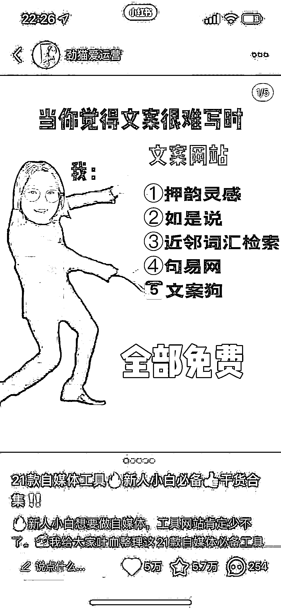

于是我趁热打铁继续更新这种形式的内容，没想到几乎篇篇爆款，就这样，这种形式的内容直接给我带来了6000个粉丝。

 

 

 

 

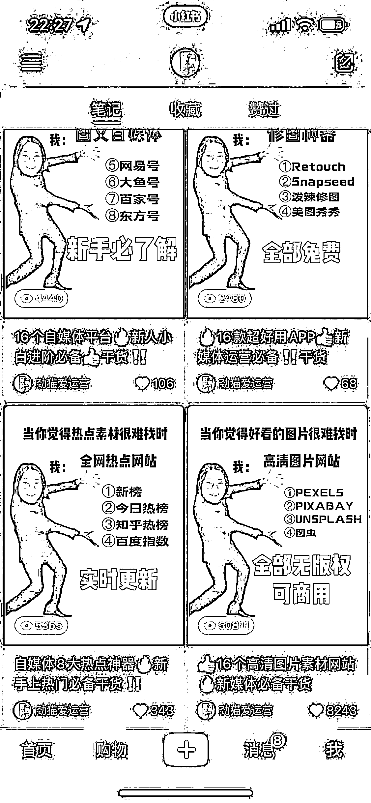

我当时直接把这个方法分享了出去，在那段时间，立马有很多人更风用这种形式，无一例外都很火。

后来我用这个小号陆续在测试我对小红书的思考，比如标题关键词，封面痛点等，有的成功，有的失败，这也让我对小红书的底层逻辑越来越了解。

所以，当有想法的时候，一定要去尝试，去实践，真的能够带来很多意想不到的收获。

**5.**一个人能不能走得快说不定，但一群人一定能走得远。

当初我自己做硬件工程师的时候，其实是有自己在做一些小项目的，虽然能赚钱，但都是些小钱。

 

 

直到拽哥带我进入了自媒体的世界，参加生财抖音直播大航海，认识了一帮又上进又努力还特别厉害的小伙伴之后，我才发现，原来团队的力量真的很大。

我直播不想播的时候，我会想到，拽哥每天在直播，航海的小伙伴就算没有流量都在坚持直播，我现在还算有点流量，凭什么不播呢？这些都是我坚持直播的动力！！！

六月份的时候，我又参加了生财的小红书垂直IP航海，毛遂自荐当了答疑官，努力回答小伙伴们提出的问题，也给了我很多做小红书的动力。

在这里真诚的感谢郭拽拽老师，如果没有他，就没有我的今天。

也感谢生财的各位大佬们，没有航海，我也不会有进入小红书的契机。

如果我的分享能够带给你一些小启发或者感悟，那我就特别开心了！感谢你看到这儿！

全文到这里结束了。最后用我的slogan来谢个幕。

我是劲猫，带你从0到1做好小红书。（响指）

评论区：

依晴 : 好干的一篇干货[玫瑰][玫瑰][玫瑰]

劲猫 : 有收获我就很开心[呲牙]

子子 : 执行力满满，向小姐姐学习[玫瑰]

劲猫 : 一起加油，一起生财有术[拳头][嘿哈]

大鹏 : 字里行间流露出是个努力又上进的小姐姐[玫瑰]感谢分享

劲猫 : 有收获我就很开心呀[呲牙]

 

 

老师傅 : 快速试错，快速迭代，需求永远来自用户，产品思维很厉害[强] 劲猫 : 用词好高级！[嘿哈]感谢认可

# **# ****(**精华帖**)(186**赞**)**体制内从** 0-1 **突破舒适圈，

# 副业年赚** 20W+ **的心得

作者：  爱折腾的土豆妈

日期：2023-03-22

时不时会看到一些朋友在搞副业、赚钱的时候，总有很大的焦虑、犹豫，比如朋友圈不敢发，怕领导同事发现；微商不敢做，卖货不合适；视频不敢拍，露脸不太好……体制内、公务员、一些特殊工作岗位，总有这些那些的顾虑，这些包袱越背越沉，甩不开严重阻碍了前进的步伐。如果你也有这种困惑，不妨看看这篇，土豆妈用自己的实战经验分享，帮你开拓一下思路。

# **# **【个人介绍】

我是爱折腾的土豆妈，一个爱折腾房子的专业幼教，上海公办幼儿园体制内的幼教，工作14年，中层岗位分管招生等工作。5年内买卖房子6次，装修改造3套。

职场宝妈5年6次房屋买卖赚百万的血泪经验  万字长文复盘，有兴趣的可以看看https://t.zsxq.com/0cE7ISGkM

 

 

# **# **【副业介绍】

**1**、进口母婴海淘

2012年孕期的时候开始尝试的项目，纯粹是从自己想囤货，朋友圈找人一起拼单，口碑相传，自己从国外网站海淘采购、国内销售，边买边卖赚了第一桶金，养娃的一切开支都是靠海淘赚来的，具体赚了多少也没细细算过账。由于一些原因，大概在18年左右就慢慢停了所有业务，现在想想当时解散了一个超高复购率的300+精准客户微信群是多么愚蠢的事情。

**2**、民宿个人房东

斜杠的民宿房东，手上最多的时候也就4套房在运营，目前2套在运营中，个人小房东。

盘活了一下自己家的郊区房和40平学区房，房租收入实现翻倍。

过去的三年非常艰难，民宿圈里也淘汰了相当多，尤其是过去一年日子确实不好过，好在都熬过来了，从2022年12月慢慢恢复。2023年3月最近的20天单一个平台的房租收入已经7000+。

 

 

**3**、家居社群创始人

2021年6月开工装修自住二手房，同步开通了装修围观群，2023年2月把群从免费群升级成付费社群，有了第一笔社群付费收入。一周拉新了30+，目前社群成员120+，199限时优惠中。

**4**、一对一咨询

2022年年底开始尝试私人咨询服务，主要是房产购买、学区规划、装修建议等方面，从一开始不收费，到红包随意，再到199/h，最近涨价到单次999/3h。把自己的时间和精力越卖越贵。

就在前几天接到了  紫菜  大神圈友关于房产、装修方面的咨询，体制内怕啥，跨领域的知识付费真的可以！

 

 

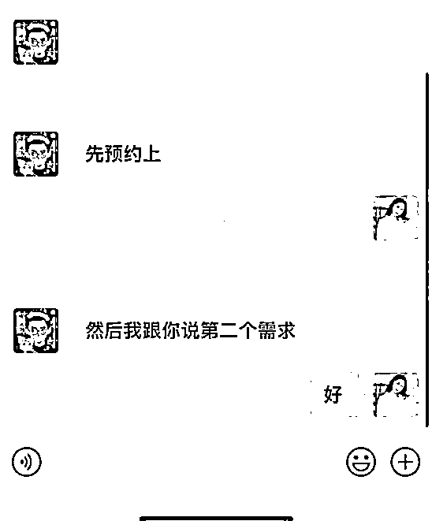

# **# **【破圈逻辑】

从表面看，副业赚钱的领域基本跟主业是分离的，但好像又有些关联性。聊聊破圈自洽赚钱的底层逻辑。

**1**、接纳本职工作限制

首先一点，不要尝试在底线摩擦，比如在事业单位有明文规定，不要做直播带货、跟学校相关的产业相关的资金交易，那么这些避开就好了。

**2**、给自己定底线标准

 

 

我给自己定的标准就是不做工作范围内同事、家长的生意，尤其是家长，哪怕是孩子都已经毕业了，家长资源不利用。虽然手上每一年经手上百家庭的详细资料，但我并不想利用。

包括我自己工作范围内的学区咨询，购房建议等相关的内容，全部不收费，免费解答。

这是我给自己定的底线。

**3**、挖掘自身兴趣爱好

想破圈，兴趣爱好是个很好的出发点，其实我曾经还尝试过利用手工制作变现，折纸手工都能制作成礼盒出售。现在则是依靠对家的热爱，装修家居的喜好，输出自己的内容来进行变现。生活类的领域，是每个普通人都离不开的，体制内想要破圈，完全可以从生活入手，比如警察可以分享每日健身，老师可以分享每日育娃妙招，医生可以分享营养减脂餐，把下班后的生活分享出来，没那么多包袱了，每个人都有下班后的8小时。

我自己靠什么来赚钱，就是下班后倒腾自己家房子，我赚点房租跟我做什么工作有关系吗？领导会来干涉吗？那就大大方方折腾就对了！

**4**、技术不够行动来凑

想要形成副业赚钱，光靠为爱发电还不够，还需要一些基础技能，直播不能干，可以拍视频；视频不能露脸，可以做图文；图文不方便，起个笔名只写文，鲁迅、巴金、冰心取名随便取，不要再喊我不行！关键还是那句话，你得行动起来，先把0-1跑通。

比如星球里各种训练营、陪跑营，紧跟步伐试一试，说不定就跑通了呢，先赚到一块钱！

 

 

从2020年入生财有术，再到22年加入玩赚星球，尝试过TIKTOK，知乎好物、小红书等等，虽然变现不多，但都算跑通了，积累的网感、图文编辑能力、视频剪辑能力、写作能力都是提升自己的核心竞争力的，每一秒、每一天的努力都不会白费。

**5**、做好孤独心理准备

尝试突破舒适圈，有个逃不开的困扰，体制内的一成不变的思想会腐化一个人的心智，桎梏你行动的脚步。曾经我一度怀疑自己的人生观、世界观、价值观怎么如此格格不入。

在体制内的单位里，不需要多努力，每天固定时间上班下班。基本一眼可以望到退休。

耳边同事聊天的内容，无非就是家长里短、油盐酱醋，老公、婆婆、孩子，衣服包包化妆品……经常有人问我又买房了？又装修了？花20W租房住？你太折腾了吧。

在工作中，同事在聊的话题我不想参与，比如某同事明明名下很多拆迁房，一套也不想卖，把全家老小困在一套可怜巴巴的小户型里，还要吐槽公婆这不好那不好，我想帮她一把，但人家不愿意折腾……而我感兴趣的话题，房屋买卖置换，装修提升租售比，社群运营，chaGPT、社群运营、知识付费，她们一个名词都听不懂，就不开口就好了。

现在的我工作中就只聊工作，不再内耗，甚至尽量减少午餐、午休时间与同事接触唠嗑的时间，避开人群找个角落看看社群消息，学点自己想看的课程，写点自己的副业心得，一个人挺好的。

 

 

# **# **【破圈技巧】

**1**、坚持做别人坚持不了的事，一定会引发关注

不管是哪一种形式的，坚持是破圈赚钱的核心，坚持写作、坚持发朋友圈、坚持健身，坚持输出图文笔记，坚持拍vlog等等，没方向的时候就选一个简单的行动，就坚持做就对了。

比如土豆妈是如何破圈让@梁靠谱  关注到我？让靠谱大神多次在群里、直播中，甚至还写了一条朋友圈单独来介绍我？其实我就做了一件小事，写每日复盘，少则20字，多则2000字，坚持了600多天，二胎生娃当天也没断更。靠谱就是一路围观我这600多天，如何买卖房子、装修房子、顺便生了个二胎。

 

 

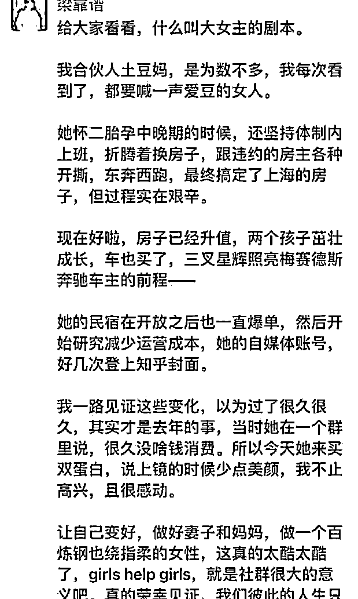

# **2**、乐于分享，流量在哪里，影响力在哪里，财富就在哪里

想要扩大收入，或者说扩大影响力，把自己的点滴收获分享出来，告诉别人。多输出才有收获。

 

 

比如我写的一篇五年买卖6次学区房赚百万的经验，帮我引流了好几个付费的私人咨询。

紫菜大神也来加好友做房产买卖、装修相关的个人咨询。

前几天，我发现亦仁老大家里也在装修，毛遂自荐了自己，分享了一下我的社群思路，也是获得了亦仁的肯定。最近一个月社群运营就特别有干劲，方向对了，跑得更顺畅了！

# **3**、别把自己当回事，大大方方搞钱

体制内的朋友，大部分都有这些那些的思想包袱，今天这篇复盘也是想鼓励更多的体制内的朋友，别对自己太在意了，赚钱这件事不羞耻，大大方方干就对了。

朋友圈不敢发？把所有人一个个拉出来做备注标签，只分两类，【看广告】和【不看广告】，就跟物品断舍离的时候一样，但凡犹豫的都暂时归纳到【不看广告】，这样分类清楚之后，你还有什么不敢发朋友圈的呢？

 

 

# **4**、边学边做，边做边改

体制内的朋友经常说，我啥也不会啊，我也不知道能干什么？进了生财你还怕没项目吗？每月都都各类大大小小的航海活动，先挑自己感兴趣的，跟着学起来。慢慢就有赚钱的感觉了。

芷蓝一再提醒我，自媒体赚钱终究是要有自己的IP定位和后端变现的产品，而最基础的产品是什么？付费社群就是一个很不错的基础入门产品。

于是在今年一月底过年期间，马不停蹄得把搞了一年半的免费社群，转换成了付费社群，一开始定价99/年的时候我是怀疑的，不确定的，一步步地优化、完善后，甚至觉得这么有内容、有价值的社群值得有更高的定价。

这种从0-1的尝试，失败了无非也就是浪费了点自己刷手机、刷剧、买买买的时间，损失成本接近于零，大胆去尝试就对了！

无论你是体制内还是体制外，在职还是裸辞，先放下自己过多的包袱和顾虑，行动一下吧。

以上，今天你折腾了吗？

评论区：

 

 

终身锻炼者—老杜 : 折腾——这个词是加入生财的精髓。

我老是去想结果，有时候就折腾不起来

还有刚开始做一个项目觉得费劲，半路就歇菜了。

以至于一直没啥结果[流泪]

大西 CC : 土豆妈厉害

xing : 先动手再完善

爱折腾的土豆妈 : 先不论结果行动起来，

潇晨 : 谢谢你，被鼓励了，同为体制内，被周围环境内耗到快抑郁，又是在异地，现在就开始不断付费链接各种大佬学习破圈，小红书已经做到3天引流1000左右，准备副业成功时脱离这个圈子，去过更好人生

爱折腾的土豆妈 : 有时候不一定是脱离体制内，而是给自己更多一个选项，让8小时后的生活更丰富多彩，让工作就单纯的工作，而不是生存必须。

爱折腾的土豆妈 : 这是一个很好的开始，坚持下去一定有所收获

尺子白 : 厉害的女性。[强]

# **# ****(**精华帖**)(172**赞**)**从** 0 **开始做家庭教育赛道，

# 累计私域好友** 2000+**，课程营收纯利润** 25W+**

作者：  杨晶晶

日期：2023-03-24

不知道大家有没有发现，现在越来越多的家长特别重视家庭教育，解决孩子的成长、教育等问题成为家长们的首要，但因为很多家长对成长教育并不熟悉，他们更倾向于找专家寻求帮助。

这就是做家庭教育赛道的机遇，我们可以搭建一个能够满足家长个性化、多样化的服务产品，以高客单的知识付费形式进行私域引流，帮助他们解决在教育孩子过程中遇到各种问题，比如养成孩子的好习惯、亲子关系的缓和、选择好学校等等。

 

 

一旦家长们认为你的产品是有价值的，就可以实现变现，接下来，我将和大家分享我是怎么从 0 开始做家庭教育赛道的。

大家好，我是杨晶晶，一位家庭教育赛道的初级创业者，2022 年 418 加入生财。

之前一直在观望知识付费，一直没入手，从 2021 年 10 月开启了家庭教育赛道的创业，目前共计营收 25 万，基本上是纯利润，这篇文章主要从以下五个方面来开展：

**1.**我选择家庭教育赛道的过程

**2.**产品和服务的设计思路

**3.**流量来源

**4.**转化变现

**5.**我们指导学员发展副业的思路

 

 

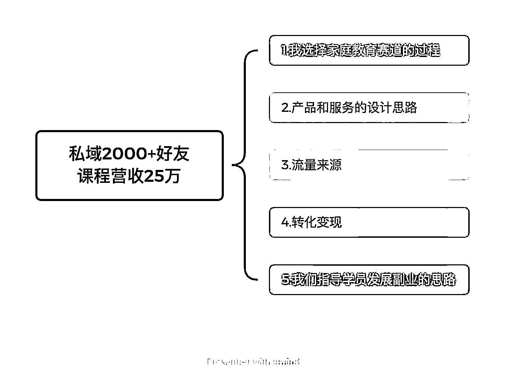

一、我选择家庭教育赛道的过程

# **# **（**1**）出发点：热爱

 

 

我选择家庭教育的出发点很简单，就是热爱。其实我没孩子的时候，也是不少师妹的“知心姐姐”。

从有孩子开始，就有许多热情去研究怎么养孩子，从一开始研究怎么安排疫苗，孩子生病了怎么护理，到辅食怎么添加，怎么搭配营养，再开始研究绘本，陪孩子读书，分享亲子阅读的经验。

再后来开始学习更广泛的家庭教育课程，跟越来越多的爸爸妈妈沟通、分享、答疑解惑，那些你不知不觉就投入了时间精力金钱的事儿，就是热爱。

就像生财日历去年 1 月 9 日的话题：如何找到自己的使命和热情？

判断是否真心喜欢的两个角度：

1）从你的爱好里筛选，找到你最感兴趣、坚持最久的事情。

2）想想有没有你贴钱也要去做的事情。

 

 

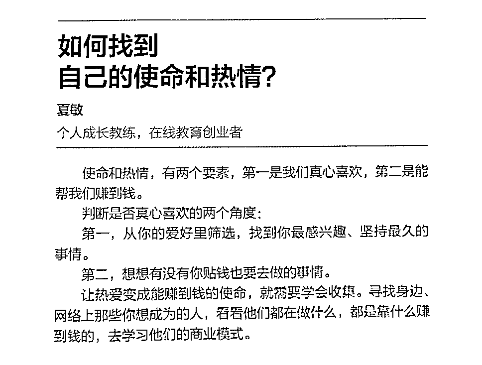

（图片来源于 2022 年《生财日历》）

后来，关注知识付费，看到了三圈交集定位法，既然热爱这么明显，那接下来就是衡量自己的优势和市场需求了。（图）

 

 

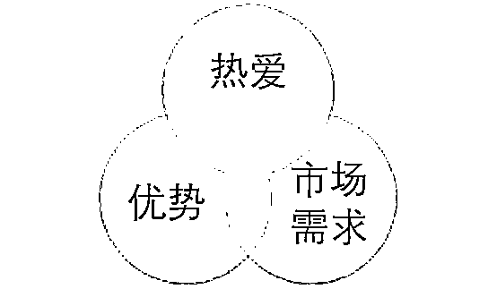

# **# **** **

# **# **（**2**）优势

能支持我干家庭教育的优势到底有什么？一开始，我是这么梳理自己的优势的：

985 本硕毕业，教育背景好

擅长学习，喜欢的事情能深入研究

做事细心，人靠谱

但是，这些太空洞了。跟我能不能干家庭教育，看起来关系不大。这些所谓优势，干啥都行，也可能干啥都不咋行。

 

 

那后来我又做了什么呢？我做了盖洛普优势测试，书写了近 20 年的成就事件，写了一段时间的优势观察日记。（图）在这个过程中，也回想了很多具体的事件。于是我发现，我的优势大概是：

① 名校背景做家庭教育，让人觉得信任度较高

② 我更爱分享和讨论家庭教育话题，生活里每天发生那么多事儿，我就关注家庭教育话题多，愿意为此写点啥或者说点啥，并且希望更多人看到听到，当然，在这个过程中，收到了很多反馈，这让我知道，有一些人原因听我关于家庭教育的分享，有问题愿意来找我帮助他们。

③ 在帮助家长教育好孩子，缓解自身养育焦虑，解决实际问题这件事儿上，收获的正反馈，让我特别有成就感、满足感、价值感。

比如，有家长反馈，孩子从每天睡前要看动画片，变成了每天睡前主动拿绘本让妈妈读，比如，有朋友因为跟老公教育理念不合经常怄气，到放下焦虑跳出了抱怨，比如，天天因为孩子写作业墨迹忍不住上火发脾气，到找到了解决问题的办法然后母慈子孝……这些反馈都让我特别开心和满足。这些正反馈，一方面说明我有能力为别人解决这方面问题，另一方面，也说明我的满足点在这里，我可以专注持续的做下去。

④ 也因为擅长学习，关联能力比较强，细心，对喜欢的事情能深入研究，这些优势，使得我在分享和讨论家庭教育问题的时候，能够做到学以致用，而不是空谈理论。

 

 

这一点，非常适合家庭教育这门实操专业。比如：有学员觉得他教育理念很好，但是孩子理解不了，那通过一些具体的事件，我可以分析出来，不是孩子理解不了，是他没有用对方法，并且给他举例，对的方法怎么操作。

从我的经验里，我发现所谓的优势需要放在具体场景里去具体化，这样的优势可以拿来判断自己是不是具有从事这一行的优势。

所以，后来我是这么梳理自己的优势的：

① 教育背景好，这个标签要用，容易收获信任

② 擅长学习，细心，喜欢的事情能深入研究，可以帮助他人学以致用收到实效③ 经过多年混迹妈妈群、自建妈妈群的经历，我发现我有解决家庭教育问题的能力④ 帮别人解决家庭教育问题我所获得的满足感大于其他事情上获得的满足感

生财日历 2 月 22 日的主题就是《怎样发现自己的优势》（作者：醒醒），其中说到了四个发现优势的思路，是非常实用的四条建议。

 

 

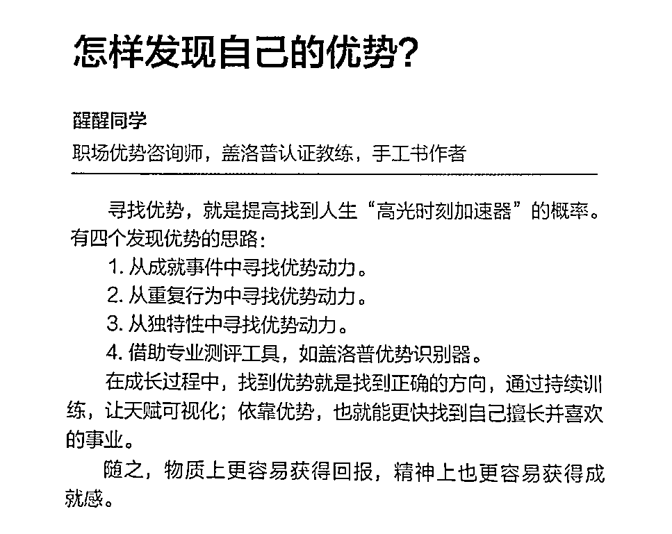

（图片来源于 2022 年《生财日历》）

# **# **（**3**）市场需求

从我这几年线上线下的学习过程中，在感性上是看好家庭教育的，可是，做事业，感觉很重要也不能全凭感觉。于是，我当时做了一些行业调研工作，分享给大家，希望能给对家庭教育赛道感兴趣的朋友提供一些借鉴。

有一个公众号叫做“发现报告”，是一个研报平台，集成各行业研究报告和数据，是我主要使用的研究工具。

 

 

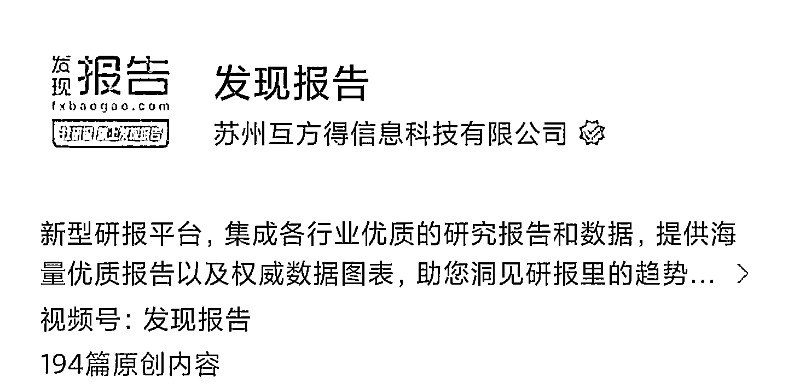

2022 年，国家素质及家庭教育类政策持续完善，推进家校社协同育人，从“双减”政策出台，到 2022 年 1 月《家庭教育促进法》颁布，

2022 年 4 月《关于指导推进家庭教育的5年规划》，为教育行业带来一些改变，以前的教育重点是培养成绩优异的优秀学子，现在则逐渐转而重视培养合格家长，帮助家长更好的了解孩子，最终实现素质教育目标。

 

 

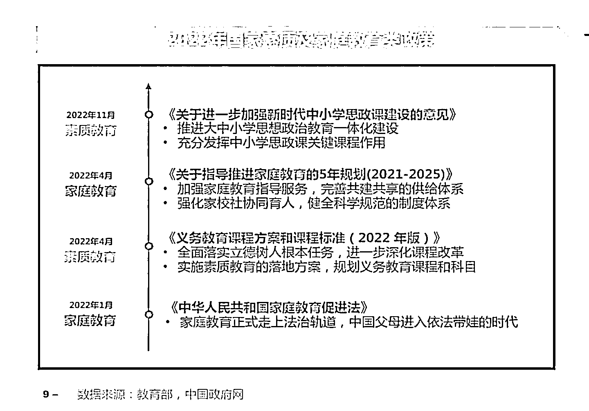

（图片来源于公众号《发现报告》）

报告中有数据显示，2021 年下半年以来，38% 的家长增加了亲子陪伴时间，家长平均每天的亲子陪伴时间在 1-2 个小时。

 

 

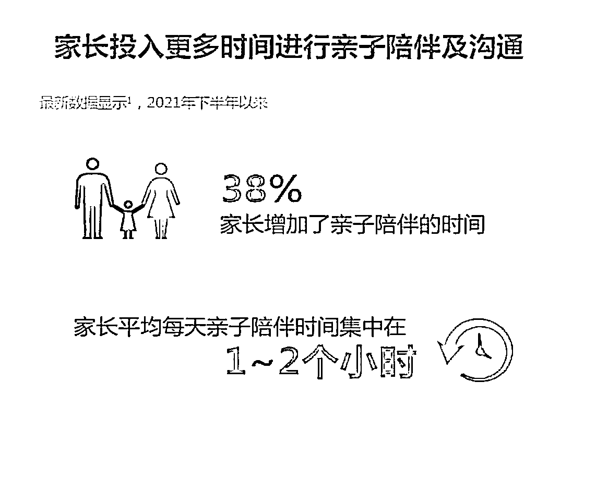

（图片来源于公众号《发现报告》）

生活发生了变化，需求就从中产生了。这 38% 的家长在每天的 1-2 小时的亲子陪伴中的生活中，会遇到各种各样的问题。

而亲子关系因为不可分割的强链接性，这些问题很难回避，当过去可以把孩子投送给各种校外培训机构的时候，问题被回避了，那么随着这种生活方式和场景的变化，亲子陪伴的时间重回生活之后，亲子问题变得不可回避。

沟通问题本身是表象，沟通问题下面是实现教育目标的问题，家长希望孩子心理素质好、抗挫力强、有正确的价值观、表达力强、社交能力强、时间管理能力强。

 

 

以前亲子陪伴时间少，问题不凸显，现在亲子陪伴时间增长了，家长常常会面对实现这些教育目标的挑战。

那么，对于家长来说，了解孩子成长规律、掌握亲子沟通的方法的需求就也随之增强了。

从巨量算数上看，“家庭教育”的搜索指数确实增长明显

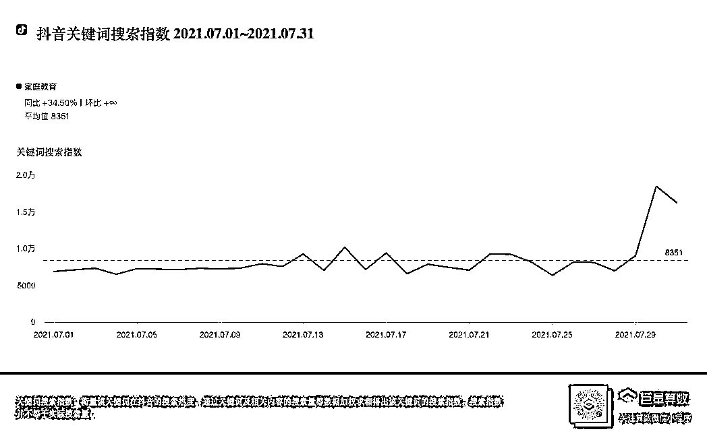

 

 

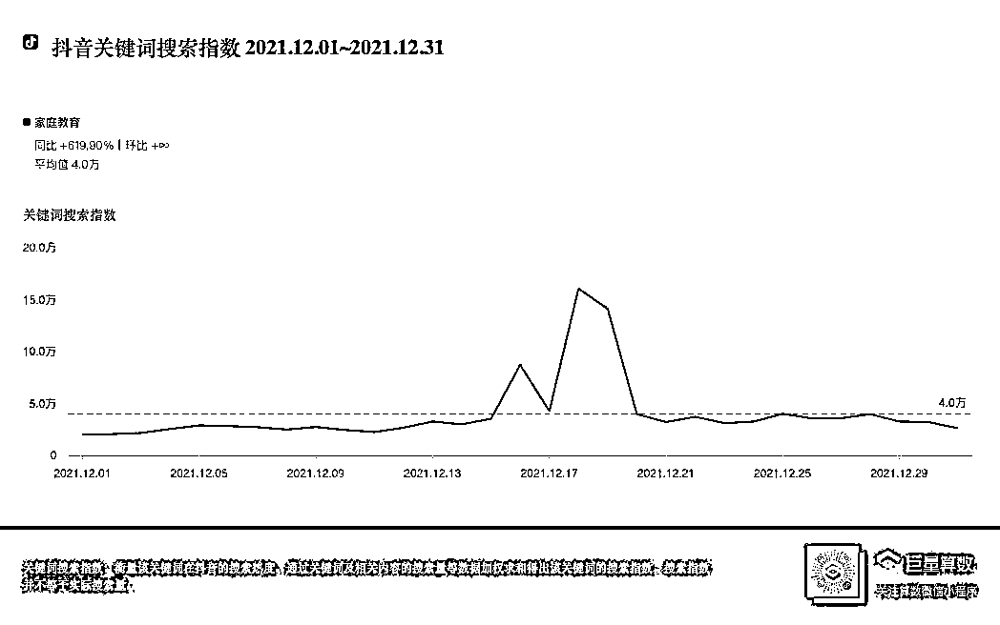

2021 年 1 月，5051

2021 年 7 月，8351

2021 年 8 月，1.1 万

2021 年 10 月，2.8 万

2021 年 12 月，4 万

2022 年 6 月，16.8 万

2022 年 12 月，18.7 万

我是从 21 年 10 月开始做准备的，那个时候就是闻到了一点热度，通过数据，也可以看到家庭教育的热度是一直在攀升的，两年时间，关键词指数翻了 37 倍。

说实话，21 年 10 月，准备开始干的时候，对能赚多少钱，我心里并没有底，也没有特别成熟的产品可供模仿，我基本上就是在热情、大的政策环境和市场关注度的基础上，准备开始尝试。

 

 

二、产品和服务

接下来，就是具体做什么产品的问题了，我以什么形式去把这份能力卖出去，换取经济回报呢？家长在什么情况下会掏钱来找我呢？

首先，有数据显示，针对亲子陪伴与沟通存在的问题，多数家长采取的学习方式中，排名前五的分别是：

看家庭教育公众号

网络搜索

看家庭教育书

向同辈取经

咨询教育专家

 

 

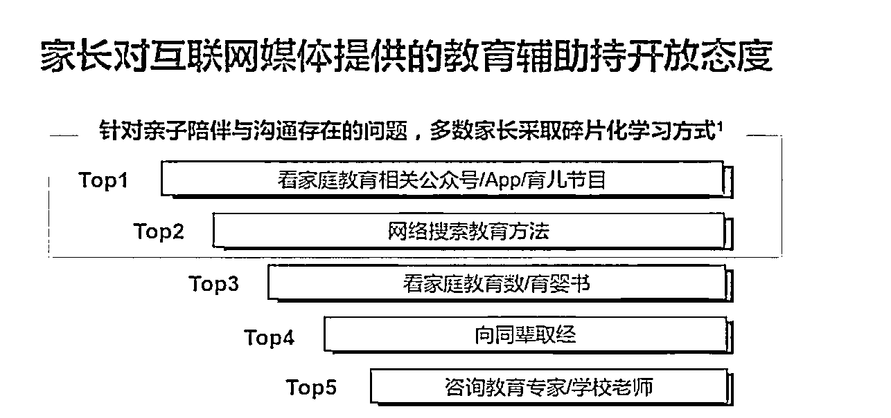

（图片来源于公众号《发现报告》）

其次，根据多年混迹妈妈群的经验，以及跟家庭教育学员的沟通经验，我总结了以下几个要点：

① 第一类家长，喜欢自助解决问题，途径包括问百度、问社群、问闺蜜、问小红书、看公众号，日常鸡毛蒜皮的小事儿，不愿意付费咨询，觉得没必要，平时自己也基本没有学习习惯，付费意识不强。

② 第二类家长，有一定学习意识，喜欢上课，三位数和小四位数的课程，比较好接受，他们觉得上课学得多学得全，学完了就能解决各种问题了，再带个证书什么的，更受欢迎。

因为教育的结果在未来才显现，如果当下的痛苦不明显的时候，对未来的结果不敏感，他们的付费意识有限，认为学得多而全更有吸引力

③ 第三类家长，高认知，愿意通过自我提升去为孩子的未来做好铺垫，对当下的养育问题比较敏感，或者已经存在较严重的养育问题，比如孩子厌学、亲子关系紧张经常吵闹冲突、自己的情绪状态不好烦躁疲惫等。

 

 

他们想系统深度学习，也需要陪伴指导以提升直面问题的能力，但是缺少系统、全面、便捷、高效的途径。

综上，我们的产品设计思路是，主要针对第三类家长，兼容第二类家长，为他们提供“可供请教的教育专家和能够提供高质量交流的同辈圈子”。

于是，我们的主打产品就应运而生了，即：提供一套系统、全面、精简的课程，同时，做长期的陪伴指导帮助他们解决问题的服务，如果家长希望拿证，我们也可以授证。

# **# **（**1**）产品形式

① 录播课：5 门家庭教育系统课 +1 门心理学基础课（积极养育课、沟通课、青春期家长课、父母自我疗愈课、教育规划课、心理学通识课）。

② 社群服务：每周固定时间直播答疑、每周固定时间收集养育反思并进行一对一回复，不定期导师一对一通话指导，可以高频率随时解决问题，持续跟踪问题的解决过程，及时纠偏。

③ 授证服务：如果学员想要心理咨询师、高级教育指导师证书，我们可以对接授证。

其实授证不是我们的重点服务，我们的学员都不是为拿证来的，是看中学习的系统化和陪伴指导服务来的，是有了学员以后，他们会问证书相关的问题，我们才对接了这项内容，目的是帮学员省钱省事。

 

 

同时，我们也发现大家对“证书”有一种认可情结，本来以为是想做副业的学员想增加背书，后来发现不打算做副业的也觉得有个证挺好，总之，大家需要我们又能满足，那就服务到。

因为，“在高客单价市场上，做差异化很重要的一点在于：提供完整的服务”

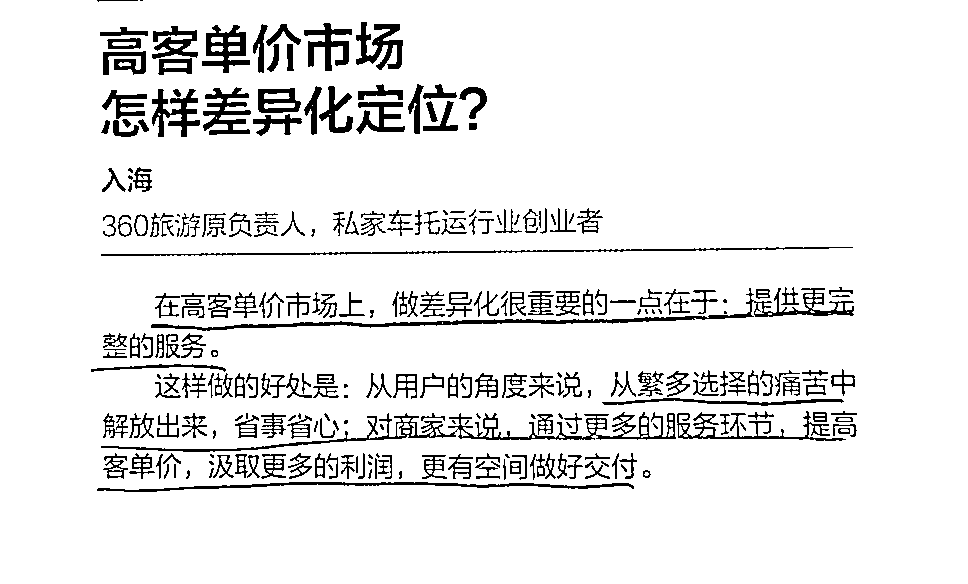

（图片来源于 2022 年《生财日历》）

# **# **（**2**）产品差异化

**1**）别人没有的我们有

 

 

家庭教育在实践中会遇到很多个性化很强的问题，因为每个孩子不一样，每个父母不一样，而每个孩子在这个家庭系统中所受的影响不是单方面的，不同孩子身上类似的行为问题，解决方法可能不一样，切入点不一样，每个家庭都有很强的个性化。

比如：同样是写作业拖拉的问题，有的孩子我们在评估之后会发现，他确实是没有安排自己的作业，安排自己的时间的能力，他需要家长帮助他培养任务意识、时间观念。

有的孩子确实有能力而不去做，他因为亲子关系紧张，与父母陷入了一种对抗关系中，他为了“对抗”而故意不去做。那解决方法就不一样。

那我们的产品特点就是通过三个板块的服务，去把问题剖析准确，然后陪伴大家在实践中纠偏、调整，带着大家去解决问题。

一是学员每周可以提交在实际中遇到的问题，导师一对一给予语音回复，分析问题，给出针对性的解决方法。

二是我们每周提供直播答疑，在互动中分析个性化的问题成因并给出有针对性的解决方案。

三是我们根据大家的学习和实践情况，会跟大家约一对一的通话，为大家解决一些比较私密的家庭和个人成长方面的问题。

通过这三个板块的配合，真正做到了让学员从“知道”到“做到”，需要及时解决的问题及时解决不积压，需要花一段时间解决的提供陪伴指导，让家长可以不焦虑不放弃不走偏，直到问题得到改善。

 

 

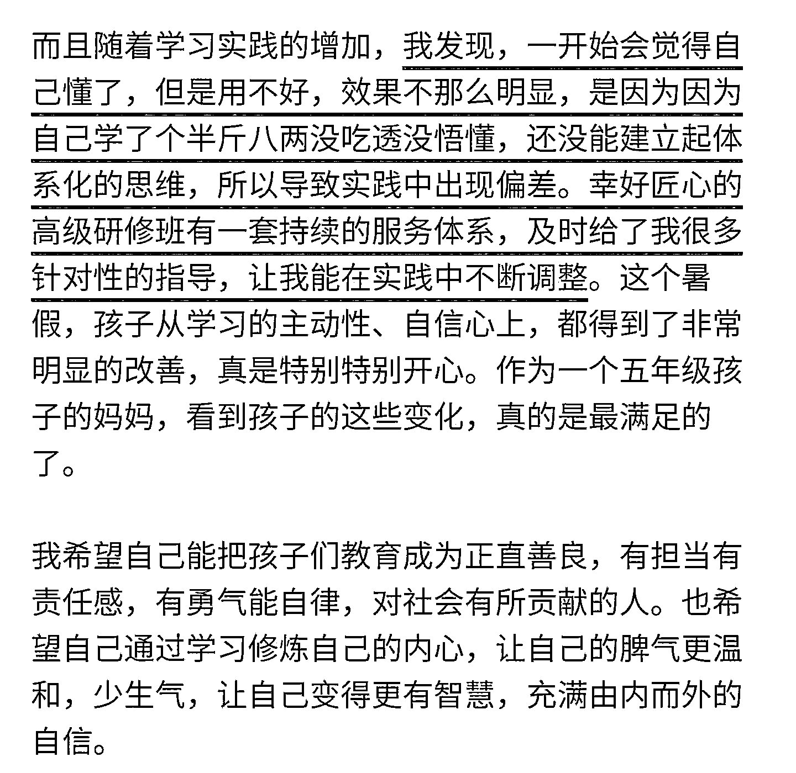

 

 

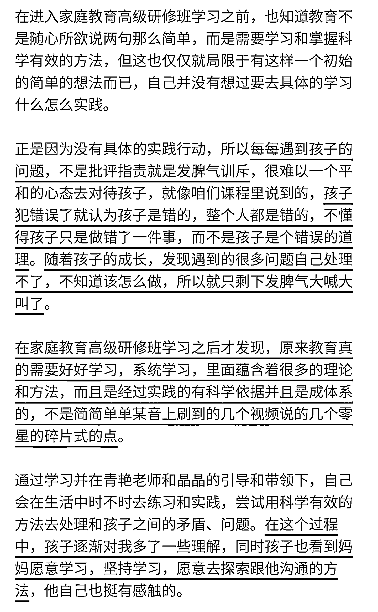

 

 

服务到这个程度的产品，目前在市场上我们还没有见到，但是需求存在，所以这部分内容做的是别人没有的。

**2**）别人有的我们划算

我们也是对标了市场上做家庭教育的机构和 IP，然后发现，基本上大部分都是做一个点，那对于想学习家庭教育的人来说，面临的实际就是，这个老师讲情绪、那个老师讲沟通、再有个老师讲学习力……

而家长们学起来就是散点式的，因为学习资源不系统，那学习之后在实操方面，解决实际问题的效果就比较差，而且成本会更高。

我们的课程内容系统、全面、又精简，一站式学完，虽然看起来价高，但是相当于打包买了一整套课程，而且加上陪伴指导，其实非常划算。

其实想做好家庭教育，让孩子好好学习，具备积极乐观等优秀品质，底层逻辑很简单，就是了解孩子、了解家长自己、了解家庭成员之间的关系如何相互影响、做好教育规划。以此为主干，我们是这样设计课程的：

① 积极养育课，讲一套家庭教育的底层逻辑，是家庭教育基础课，所有的家长都可以学且需要学，学完，可以了解孩子的心理发展规律，以及可以使用哪些方法去搞孩子。

② 智慧父母课，主要是帮助家长完成自我成长、自我疗愈，学完，可以更了解自己，也就会看明白自己这个“原件”是如何影响“复印件”的，并且对这份“原件”存在的问题进行疗愈，从而提升“复印件”的质量。

 

 

③ 高情商沟通课，主要以亲子家庭沟通为主线，讲沟通方法，因为我们对孩子的教育，要通过沟通的过程去操作，在了解了孩子了解了自己的基础上，掌握沟通方法，就可以掌控亲子沟通的方法，去实现我们的养育目标。

④ 青春期父母必修课，因为青春期孩子给父母带来的挑战非常大，所以在积极养育课的基础上，特别开一门课，让大家对青春期的孩子有更多针对性的了解，提升家长应对青春期挑战的能力。

同时，如果家长自己的青春期发展不完善，有遗留问题的，也可以通过这门课得到疗愈。

⑤ 教育规划课，在“双减”之后，教育孩子的责任有一部分回归了家庭，对应的，家长不能再把孩子全权委托给学校，急需提升教育规划能力，所以，这也是家长当前关注的热点。

⑥ 心理学通识课，因为家庭教育各种理论和方法的基础还是心理学，有些家长希望自己能再加强一些心理学基础，这样在使用很多方法的时候心里就更有底。

以上任何一个方向的课程，都在 1000+ 到 5000+ 不等，我们全部打包，再加上陪伴指导服务，价格是 12800，对学员来说是相当划算的。

 

 

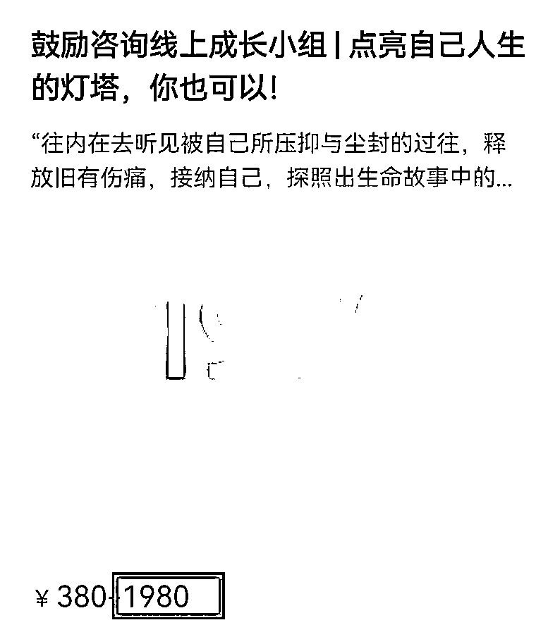

 

 

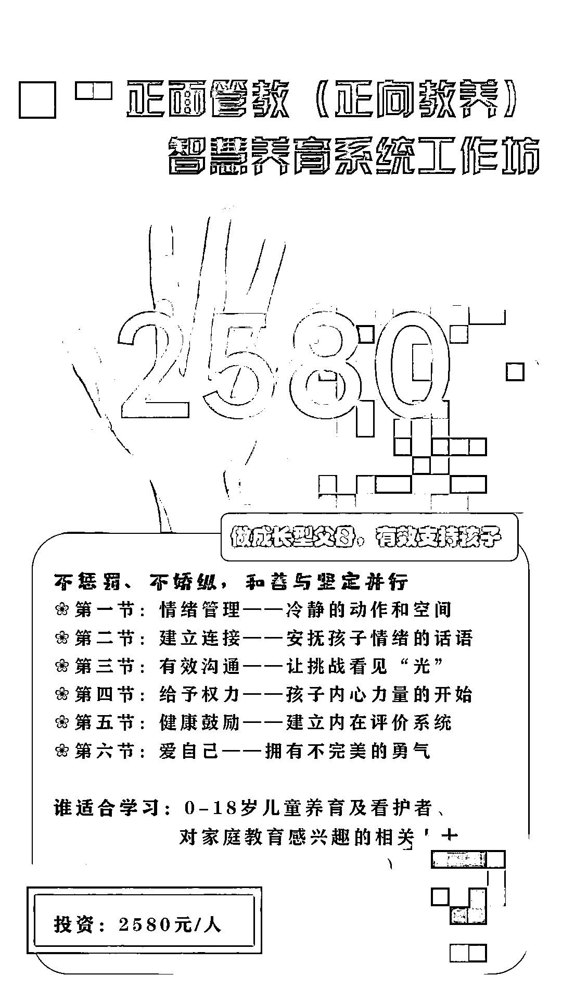

 

 

 

 

 

 

 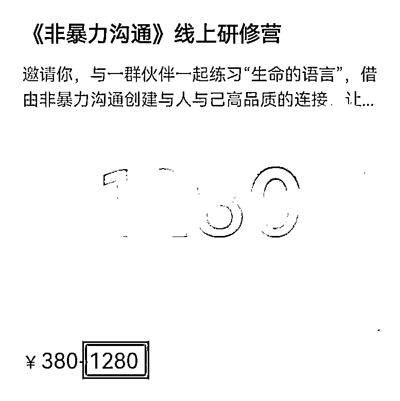

那么，还有很多家长说，我没有时间学这么多课，我只想快点解决问题，那也没有关系，课就在那，有时间就学，没时间就慢慢学，只要根据自己的节奏提出问题听答疑，也可以解决问题，在有余力的情况下，再选择适合自己的课去听，效果更好。

而且我们的课程不限期，一年听不完，两年三年也听完了，不存在三个月没学完过期了的问题，孩子长大也有个过程，也不是一夜之间就长大了。

 

 

我们有学员说过，之前自己也是学了不少课，但还是觉得解决不了问题，跟我们学习两个月，顶过去一年的学习效果，而且把之前零散的学习全都串起来了。

 

 

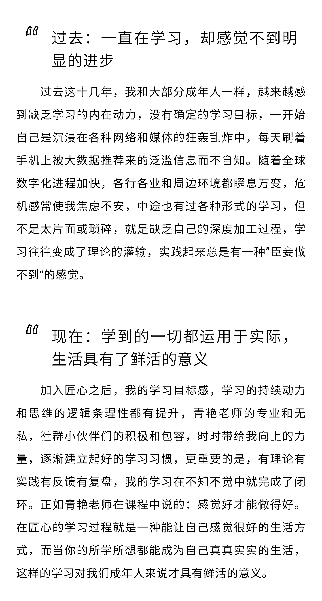

 

 

也有学员孩子非常小，两三岁，暂时没有多大挑战，但是也买了我们的服务，他们说我慢慢学，不着急，学了就能避坑，避了坑就是赚到了。

所以说，别人有的我们更划算。

**3**）高客单价应运而生

利润产品一定是高客单价的产品，这一点在很多前辈的文章里也都看过，我们也是按照这个路线来的。当我们决定主要针对前面提到的第三类客户的时候，产品价值也就配得上高客单价了。

实际操作起来感受确实也很好，这个价格就已经筛掉了很大一批无效客户了，能来问的基本上是花得起这个钱的，只要产品和需求相符，成交率是很高的，有的当时没来，日后也都来了，所以没太多无效营销，而且学员从性格到个人素质真的都很好。

三、流量从哪里来

 

 

# **# **（**1**）私域** 2000+ **人实现** 25 **万营收的原因

我们实现目前营收的私域基础大概 2000+ 人，虽然人数不多，但是人群基础较好。

第一，以前做过几期线下课、线下沙龙，这部分人信任基础比较好；

第二，我有孩子之后，建过自己的几个妈妈群，断断续续的分享过一些养育方面的学习和实践经验，期间时不时有妈妈介绍其他妈妈跟我链接；

第三，我断断续续一直在朋友圈分享我在家庭教育这条路上的学习、感悟、思考，圈儿有部分人是看着我成长起来的。

我觉得这三个方面都建立了很不错的信任基础，所以，可以成交高客单价。

# **# **（**2**）高价付费社群引流质量较高

后面也开始了一些引流动作，主要是高价付费社群和视频号，比如我考过教育规划师，有助教岗位招募，我就去做助教，教育规划师是一个 5000+ 的付费社群，引流质量是比较好的，这些人能花 5000+ 去学习规划师，那付费意识首先是到位的。

 

 

四、如何转化实现变现

# **# **（**1**）免费送一次养育问题** 1V1 **咨询

实际上，一次咨询是解决不了问题的，所以这个免费咨询的实质，其实就是梳理问题，帮他做归因，强化痛点，同时植入“你需要学习和指导”，进而，告诉他我们有产品适合你。沟通主线如下：

① 了解对方遇到什么问题

② 问题持续了多长时间了

③ 引导对方回忆一件事，唤起客户痛点的关键事件

④ 询问对方自己做过哪些努力，分析问题依然存在的原因，让对方看到自己的能力缺陷，暴露需求

 

 

（这时候可以植入成功案例，我们的学员也遇到过类似的问题，描述问题事件，通过我们的学习指导，现在的达到了怎样的理想状态）

⑤ 如果不改变，会是什么结果，必须聊到不改变带来的危害，这样就放大了当下的痛点，对于教育产品来说，这一步也不算是制造焦虑，因为教育的结果就是在未来，这是客观事实，所以这一步的沟通是必须的

⑥ 是要保持现状还是要想办法改变，推动对方自我说服。

# **# **（**2**）免费送一次亲子关系测评

用“第三方”的结果，让客户看到自己的问题，比我说他有问题，更有说服力，我们有一个学员就是解读做完，告诉我“你说的全对，感觉看到了我的潜意识”，于是顺利成交  12800 。

 

 

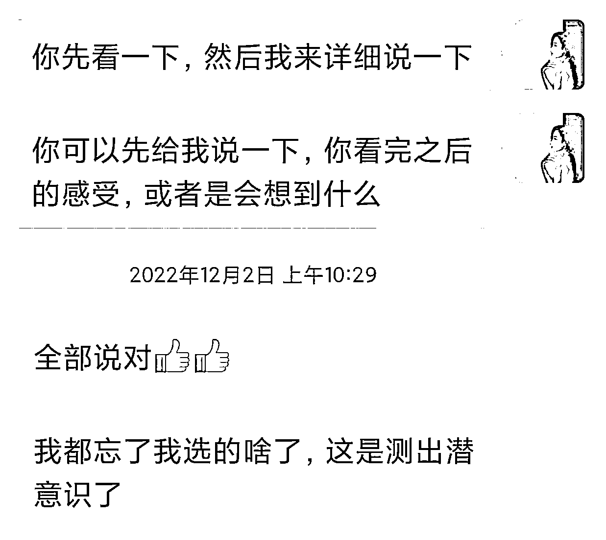

# **# **（**3**）免费公开课

在朋友圈发案例展示类内容的时候，我一般会在评论区留钩子：“如果你也想学习如何培养高情商孩子，私信 666 ，免费送您一份高情商养育公开课。

”有人留言就会把课程链接发给他，或者做 3-5 天的快闪群，到时邀请他。

 

 

 

 

 

 

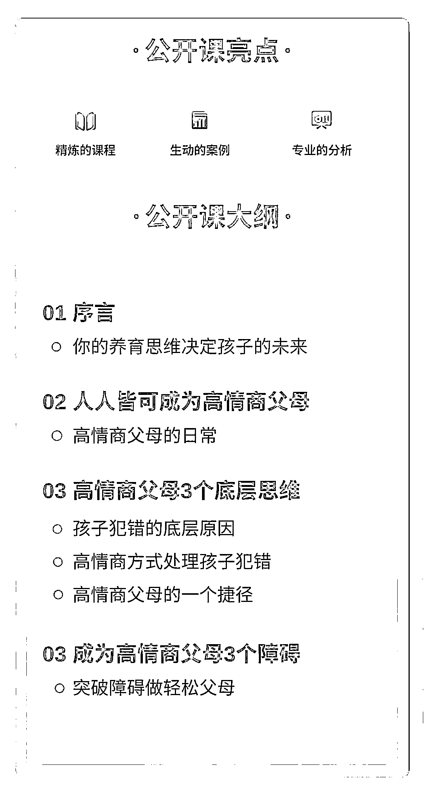

课程内容重点告诉他三点：

第一部分，展示典型养育场景，基本上大家听了都会去对标，然后告诉他为人父母的理想状态什么样，激发对理想状态的期待；

第二部分，讲成为高情商父母的几个思维局限，理论联系案例，引导大家对标自身，发现自己正式存在这些局限；

第三部分，秀肌肉，讲我们品牌故事以及学员成功案例，会请现有学员分享自己的收获。

总之，有理论、有案例、有干货，但是公开课不是用来解决问题，实际上也解决不了，是用一对多的方式，让大家对于问题看得更清晰，也看到有方法可以解决。

她听完课我们会送一个亲子关系测评，用测评结果，结合他的作业内容，让痛点、需求、自己的卡点都更加清晰起来。从而激发购买欲，至少引起对我们的关注。

# **# **（**4**）朋友圈文案

 

 

我自己总结了三条打造朋友圈的心法，分享给大家：晒案例引发共鸣、持续性建立信任、立体化链接感情。

**1**）** **晒案例引发共鸣

晒成交这个不用多说了，大家都会，有一定的刺激他人购买的作用，我个人经验中，案例是特别好的素材，每一个案例都是活生生的，真实的痛点总是能引发共鸣。

有一次，我看好一个潜在客户，于是那几天我就针对她的情况发案例，因为我知道她那几天心里在挠，结果有一条就刚好切中了她的痛点，就果断报名了。

**2**）** **持续性建立信任感

相对于线下的交往来说，线上的交往相对不容易建立信任度，那朋友圈的持续输出，就是建立信任最好的方式。

我自己有了孩子以后，就开始在家庭教育这个领域学习、探索、思考，从一开始作为一个分享者，逐步成长为一个专业形象，整个这个过程，带给人很强的信任感。

所以在第一批招募的时候，就有小伙伴迅速报名了，而且是很主动的，最快的可能就20分钟通了个电话就成交了。他们当时就说，我看到你这些年一直在家庭教育领域持续精进，我就看好你这个人。

还有人说，同样是妈妈，我看到你这些年一直在学习、在实践、在思考、在迭代，我就想活成你的样子，所以我要加入，以后就跟着你学。

 

 

也有人他们在我朋友圈没有待那么多年，可能也就关注了几个月，他们基本上都会说，你发的每一条朋友圈我都看过，我收获非常大，所以，想继续深入的跟你学习成长。

**3**）立体化链接感情

知识 IP，绝不仅仅是知识和技巧本身。如果只是知识和技巧本身，那我们直接卖书、卖  pp t就行了。

我们知识IP的本质，是帮助客户去消化知识、消化之后还能把技巧用在自己身上，从而去使自己真的得到改变，得到进步。我们是要帮助客户从“知道”到“做到”，这是知识 IP 的本质。

那这个本质，就要求我们提供超出知识本身、技巧本身的价值，去让客户有一个好的体验感。所以，为了帮助客户能通过你这个知识 IP 获得更好的体验感，从而更好的帮助他进步成长，我们知识 IP 就需要提供附加价值。

我自己的情况是，大家喜欢看我说说学习方法、时间管理、思维方式、生活方式等内容，我就会写这方面的。

这些附加价值，会让我的客户感受到，我确实是一个成长者角色，因此，他们跟着我学习家庭教育，是靠谱的，是丰富的，是走心的，拉近了距离，增强了信任。

**4**）** **朋友圈输出的专栏思维

 

 

这里还有我自己的一个经验，分享给大家，我觉得我朋友圈人数不多，能成交高客单价，跟我的朋友圈输出有关。自己的朋友圈内容，都有哪些，自己心里要清晰，比如我自己的朋友圈，主要由以下几个专栏构成：

**1. ** 根据一些金句，或者热点事件，聊一聊自己的看法和经验，传达一些教育观念**1. ** 专业和产品，也就是产品广告部分，包括课程能解决的痛点、学员的反馈、成交的截图等等

那么，这部分内容有时候不充分，尤其是高客单价，有时初期，不会总有成交，这时候我就发专业相关的，可以是展示学习成长的，上了什么课，读了什么书，跟朋友探讨了什么问题等，都可以。

**1. ** 生活圈，可以展示积极向上的生活状态，可以展示带娃日常，让别人觉得你是一个真实的人，有情感上的链接，并且你是一个符合你客户心中理想状态的人，可以增强客户粘性。

**1. ** 附加价值，结合自身优势以及客户需求塑造人设，提供价值，才有感染力和影响力，比如我，大家喜欢看我说说学习方法、思维方式、生活方式、时间管理等内容 

 

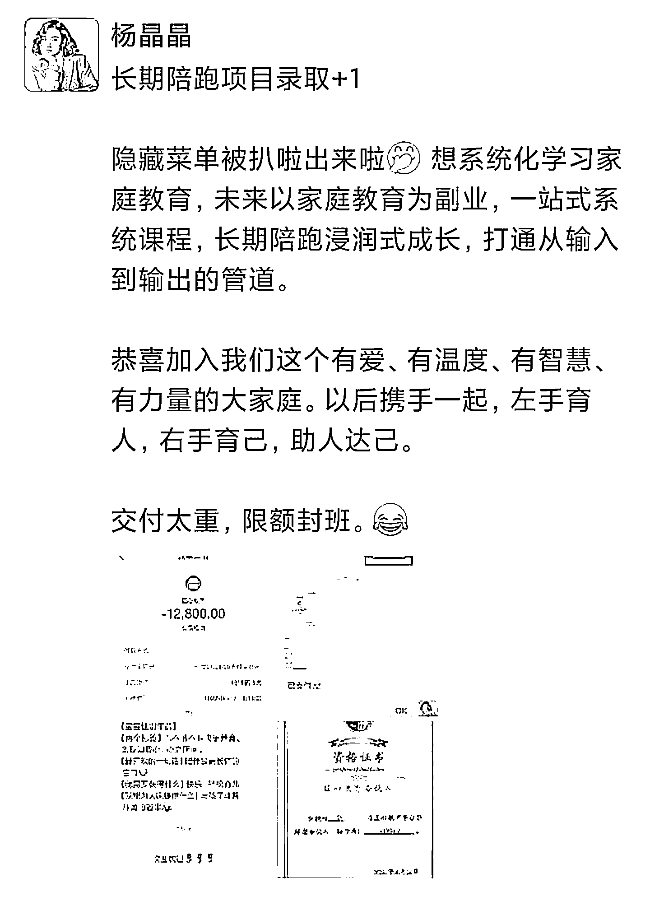

 

 

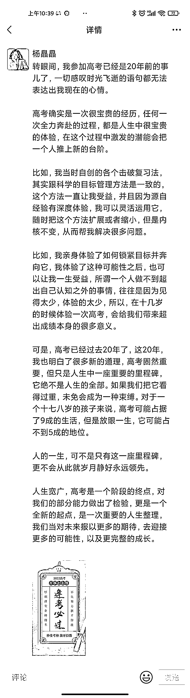

 

 

 

 

 

 

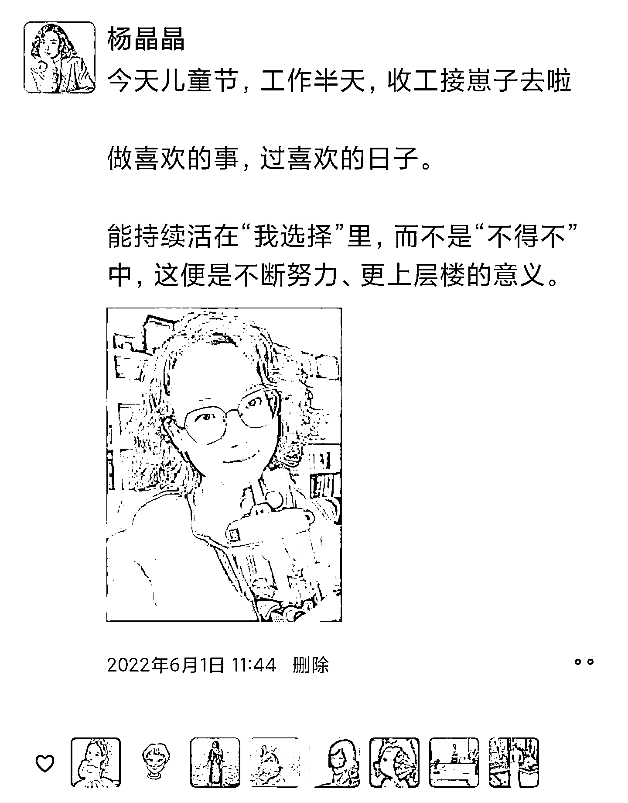

 

 

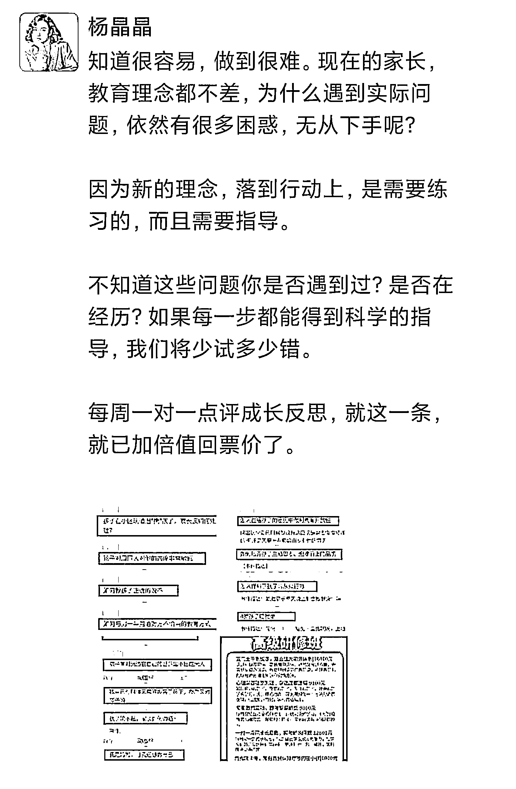

 

 

 

 

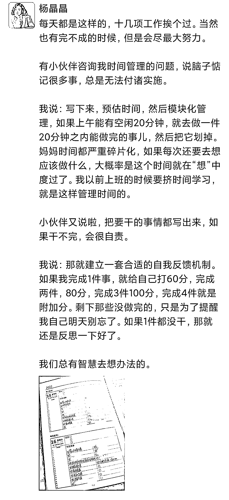

 

 

 

 

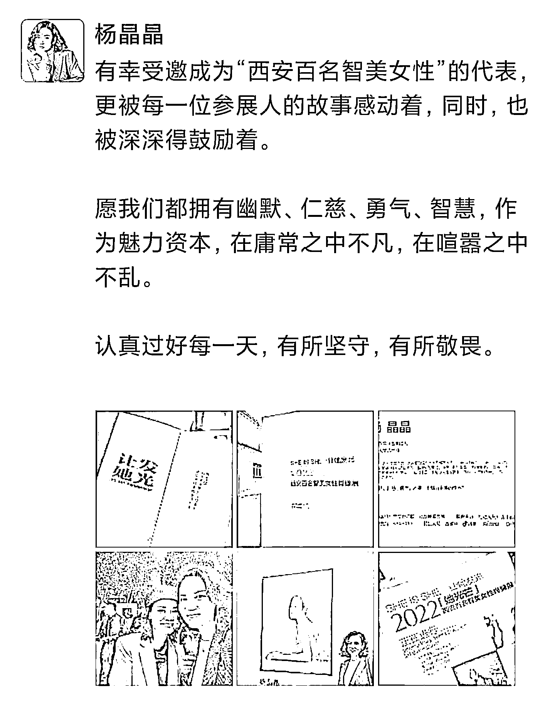

尽量每天都有这些内容，是最好的。

 

 

但有时候太忙了，没办法每天都发这么多，也可以选择着发，但是自己心中要有这样的专栏意识。我自己的经验是，不怕偶尔停下里，但是记得一定要重新开始，长期来看，你是持续的。

五、我们指导学员发展副业的思路

有人问，家庭教育赛道的门槛到底高不高？总觉得现在各种“妈妈” IP ,“家庭教育” IP 挺多的，到底赚不赚钱。

我做到目前的观察是：进入门槛不高，但是做高客单价产品门槛比较高。

# **# **（**1**）进入门槛不高

因为目前学习家庭教育的，有大量的宝妈群体，稍微有点学习能力的，读几本书吧，把内容整理整理，结合自己养孩子的经验，做个几百块的低价课，或者社群，门槛不高。

而且宝妈多少都混过各种妈妈群，初始流量是有一些的。

 

 

# **# **（**2**）做高客单价产品门槛比较高

因为，这需要家庭教育 IP 有持续迭代产品的能力，以及不断解决各种实际问题的能力，即维持稳定的产品供应链的能力。

家长能花万元以上来付费，那是真的有问题需要解决的。除了少数家长是在没有出现严重的问题的时候愿意付出这个投资，大量的家长都是救命式学习。

在孩子和自己都没有出现什么大问题的时候，就愿意付这么多钱来学习的家长不多，家庭教育大家都看好，但是市场还需要继续培养，认知到行为的改变，还需要一个时期继续去提升，

目前来看，大部分家长可能就花个小几百块听听课的比较多，与其说是学习不如说是自我安慰。

为什么会这样呢？因为教育这件事，结果在未来。

孩子心理成长和底层能力成长方面的很多问题不会一天形成，所以，不到问题很严重的时候，痛点不够痛，那家长就没有动力去付高价。

同样，问题解决起来，也不是一天两天就可以，尤其是问题已经很严重的，它的即时反馈不是那么明显。

所以，付高价学习的家长有两类，一类是认知水平高的，愿意为未来付费的，一类是问题已经很严重了足够痛的。

 

 

不管是哪一类家长，都需要你的产品真的有质量，同时，需要能真的解决问题。

因为每个家庭都是个性化的，每个孩子都不一样，而每个家长又都深受自身成长的影响，所以，很多问题解决起来不容易，不是随便读几本书，上几门课，带带自家孩子就能解决的。这是一个挺高的门槛。

比如：我们的学员里，有的是孩子在学校问题很严重了，她是很痛苦的，她学习之后自己的状态和孩子变化都很大。这个对我们的指导能力，对我们课程的质量要求就都很高，我们的课程是讲的比较本质的，同时配合每周的答疑和一对一点评作业，去实现实操指导，才能有这个效果。

那我们会说，这些家长还可能去求助咨询师，让咨询师给孩子做咨询，确实有，家长普遍喜欢搞孩子不喜欢搞自己。

但是这里有一个问题，就算孩子做完咨询后有改变，如果家长不改变，孩子的问题还会反复，可能换一种形式反复。所以，一定会有一批家长选择自己学习改变，从而使自己和孩子都获得一种长期有效的改变。

还有人说那很多大咖也具有解决问题的能力呀，但是大咖不会做这种陪伴服务的，就算做，一般人也支付不起。所以，我们这份能收到实效的陪伴指导就有市场了。

这种做高品质课程产品的能力和解决问题的能力，它就是一个高门槛。

（**3**）我们指导学员发展副业的思路

 

 

所以，如果专业积累足够，具有持续一对一解决能力的伙伴，可以用课程+服务并且重在服务的形式，做高客单价产品，

如果专业积累不够，那可能“原创课程“和“服务”这两块做起来会比较难。这也是我们有些学员想做副业的过程中面临的问题。我们的建议是两个：

①以成长者的角色带货（课），挣佣金

②做二次加工类的课程，比如《青春期孩子常见问题 100 个》，从书上或者听过的课里，整理 100 个案例，卖个 199 ，如果能卖 10000 份，也是很香的这部分也是我们今年会帮助有需求的学员去做的内容。

最后感谢在互联网遇到了 @梁靠谱@醒醒@芷蓝  ，从购买生财日历，到加入生财，学到了很多，同时在醒谱大队和玩赚新媒也得到了很多意想不到的惊喜和收获。

以上就是我们 2022 年跑通家庭教育赛道高客单价产品的实操经验总结，希望能对大家带来一些启发，还有很多不足，也欢迎探讨指正。

祝大家一直生财有术。

评论区：

纪玮 : 怎么联系呢

重楼 : 有意思！

詹伟平 : 何以解忧，唯有高客单

谈谈心 : 留个联系方式吧

小夏 : 老师的分享很赞，怎么联系呢

 

 

如果你是一个普通人，想提高自己的影响力，这并不是一件容易的事情。没有优越的背景和广阔的人脉加持，这时，写作就会是你一个很好的敲门砖。这篇文章，则会重点讲讲，普通人该如何通过写作扩大影响力，进入合适的圈子来赚更多的钱。

杨晶晶 : 你好  感谢关注 VX：Amy20120906 请多多指教  一起生财有术  杨晶晶 : 你好  感谢关注 VX：Amy20120906 请多多指教  一起生财有术  杨晶晶 : 嗯呢  不过目前觉得精准流量要搞好还是得好好研究  要继续在生财好好取经**# ****(**精华帖**)(131**赞**)**一个写作新人的升级路：如

# 何通过内容扩大影响力，从而找到合适自己的圈

# 子更多赚钱

作者：  一点心

日期：2022-01-13

大家好，我是十点读书，李月亮，张德芬这些百万粉公号的作者一点心，投稿的公号文单篇阅读超百万，多篇十万加，单篇稿费过千，通过写作实现了写作月入过万的目标，做过一段兼职编辑，也指导一些人上稿和推荐对接编辑，目前自己开班和做咨询。

我是去年五月加入生财的，那时是新手，一直潜水。也是那时开始想找个副业赚钱，就在网上学写作，开始了写作变现之路。

其实很多人看到的市场宣传写作过万是一套组合拳，用文字赚钱的方式很多，不单是写投稿，写平台，比如做兼职编辑一个月几千收入，还有写文案，软文等的收入，教人写，帮人写也是。

写作能力是一通百通的，各行各业都可以用到，属于行业技能放大器。

 

 

这篇文里，我主要讲我在投稿变现这条路里做过哪些事，怎么用文字赚钱，怎么通过写作扩大影响力，进入合适的圈子来赚更多的钱，成长里有哪些机遇，人际，骚操作，和可复制的方法。

目录

一、写作有什么好处

二、我如何用内容变现

1\. 高手指路，刻意练习，陪伴式成长

2\. 比快速做到十万加更重要的是积累实战正反馈

3\. 从写作新手开始，建立自己的人际圈子

4\. 毛遂自荐，让投稿变现雪球滚动起来

三、用流量思维积累粉丝，用内容扩大影响力

四、写作变现怎么避坑

五、一些新人写作建议

后记

** -01-**

写作有什么好处？

用文字赚钱，建立个人影响力，促进个人成长

 

 

** **一、写作变现：用文字赚钱

**1. **公号投稿方向：

看电影可以写影评，看书有拆书和荐书稿，根据热点来写娱乐，写职场，写成长，鸡汤，情感，人物等。

相比写头条百家等平台，向公号投稿的门槛高点：主动投稿，或者编辑约稿。

中小公号通常稿费 300-800 ，或者附加阅读量阶梯稿酬等。

也有一些高价公号和大号，多是 1000-2500 稿费，对文章的质量和选题要求非常高。成为签约作者后，单次稿费会增加。

但是拥有 3000 万粉丝十点读书比一般大号稿费低：头条位置稿费六百块，次条的位置（通常每天一次推送8篇文章）只有 300 块基础稿费，高起点的阶梯稿费较难拿。

2000 万粉丝的洞见稿费比十点读书高，头条签约作者 2000，次条 1000 。

对于新人来说，过稿十点读书这样的超级大号，获得的写作影响力远大于稿费收益。而有些小号阅读量几千，稿费在 300-500 ，也有八百块的。

写作市场是火热的，变现市场是理性的，选择哪种公号投稿，要看稿费性价比，和账号平台的影响力。

 

 

**2. **平台方向：

在头条百家号等平台号写内容赚平台的流量钱。

个人写头条的收益价格，要看权重和平台单价浮动，目前微头条小爆文 200 多元（阅读量十万），长文小爆文 20 万阅读的 700+ ，或者接广告，一条 150-300 元。

带货现在风头不好，平台带货收益一般，而且容易被举报。

建议：如果想做带货，年后吧。

总结：简单的说，写文赚钱就是收集信息，加上你的观点，把事情说透，也就是用文字说给人看。在这个过程里等于自己也学习一遍，还赚到钱。

新人前期追求过稿篇数和爆文数，在追求变现金额，后期放大商业价值。

二、建立个人影响力：

自己做 ip 也用得到，分两种，一种是通过文章输出，传播带来的粉。

另一种是类似故事名片，主动用文字来向别人展示你和你的成就，帮双方快速建立信任。

写作的底层逻辑相通的，拥有读者思维，你知道读者想要什么，用文字更好的达到你的目的。

三、促进个人成长：

 

 

因为你要写给人看，为了让对方看懂，主动去学习，精进并提升了认知格局眼界，整体是一个良性循环。

**-02-**

我如何用内容变现？

我初学写作时，遇到很多大神，  这是我努力的理由。

无论你的写作初衷是什么，以我对一些人的观察，通常在文字领域有成绩的，后面都会走到文字变现，商业化这条路。

我在文字赚钱这方面，对公号投稿流程最熟，早期的写作变现也是从这里开始的。

写作变现和其他领域一样，用案例推动新案例，借力打力，也会有四两拨千斤情形，一边用文字赚钱，收获影响力的同时主动出击，增加更多变现机会。

简单说下如何用案例推动案例，后面详细展开。首先要有一篇质量可以的稿，它就是你的投路石，无论这篇在各家号是否过稿，可以反复使用它敲开各家收稿编辑的门。

投稿流程：和编辑建立联系，写稿，投稿，稿子上线，收稿费。

一、高手指路，刻意练习，陪伴式成长

 

 

**1. **为什么新手学新媒体文要找高手学习？

高手比你更懂变现市场，有高手带，学习和初期变现过程中不容易踩坑。

高手有资源和人脉，作为老师可以在初期拉你一把手，比你闷头探路变现快。

去年在我没有老师的时候，曾经连续看书三个月学习写新媒体文，自己在公号写宠物文练习，那时我没有市场读者思维，写作功底一直是进展不大，也不知如何投稿变现。

**2. **高手指路和刻意练习，陪伴式成长

有的人觉得，写新媒体从文字到变现要用很久。从我的变现经验和观察一些人的结果来看，通常是3-6个月内出文字变现成绩，无论平台和金额大小。

我正式学写稿和到收到第一篇稿费，只用了一个月多。那个时间里每天高强度学习很累，全部的空闲时间都用在做功课，有时写到凌晨两点多，但也是我在新手期成长最快的阶段，为了证明写作能力，试着投稿。

虽然我的第一篇投稿（陈冠希人物文

https://mp.weixin.qq.com/s/xp3vBbgU2eyQyAUtijJPSw  ）因为不知道市场风向，四处碰壁，很久后投在一个小号发表，磨砺了意志，虽然这篇没有很快过稿，但投稿过程中得到流量大号编辑的约稿多篇（后面展开讲），就此打开了新媒体变现之门，成长和变现比一部分新人快得多。第一个月写稿 8 篇，过稿 6 篇，稿费总共 2000（有一篇过了很久发布）。第二个月出了一篇十万加，单篇稿费 800 。

 

 

所以新手学一点时间后应该去试水市场，在投稿市场的跌跌撞撞里成长，不然怎么知道自己行不行。

** **

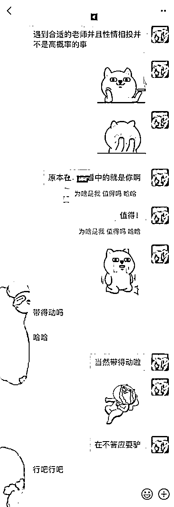

 

 

最初我决定找个高手带我，主攻人物文和观点文，我写文，他点评。那时的我并没有想用文字一定赚到多少钱。不急躁，不追求赚一票走人这两点在任何领域的学习中都是重要前提。

因为作业功课一直不错，写文有亮点，和老师气场相投，价值观相近，逐渐发展成了亦师亦友的长期关系，随着我的写作进步和过稿增多，老师也把他自己写的文章发我，由我来指出不足和建议，还把我推荐给写作圈的人脉资源。

 

 

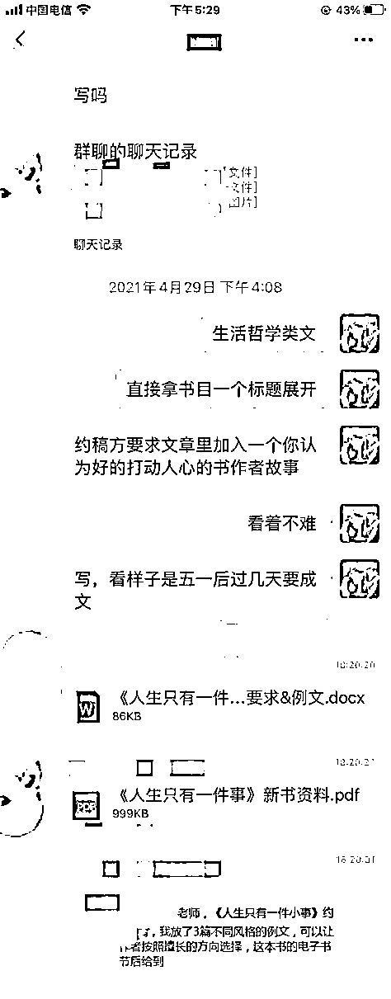

找高手贴身学习，可以从各种学习营里找，也可以在成手写手里找，过程就是付费试错和磨合，如果有合适的老师，软磨硬泡到手。

 

 

我的建议是不要同时泡几个高手，因为每个高手各有一套知识系统，在你不能融会贯通几家之长时，尽量只跟学一个老师，人数在精不在多。与之对应的，你也会在指导学习中摄入他们的生活中喜怒哀乐，多一层亲近，把共同学习的经历融入友情，就是陪伴式成长。

二、** **比快速做到十万加更重要的是积累实战正反馈

在大号过稿的稿子和十万加文，可以做为新人的背书作品。新人写投稿，不要定位只写哪一类文，先以出篇过稿，积累过稿数量为主。

**1. **剑走偏锋，适合新人的另类投稿方式：

如果只是纯粹追求十万加这个阅读量，我建议新人选择较容易过稿的类别来写，人物文相对观点文对新人容易些。

我最初在潮流号写投稿，而不是直接投常见类的热门大号，比如樊登读书，十点读书，S叔，凯叔讲故事等。

因为对于从来不写文的人来说，突然写起来是有点难的，市场收稿对质量有要求。而潮流号不需要深度观点，熟悉账号调性写起来后，过稿难度低，流量号账号阅读量不低，每篇稿费 300-500 。

写新媒体不用刻意追求字句优美，基本要求是观点清晰，逻辑语句通顺。

对于新人写作变现，最需要的是积累正反馈，一篇篇写下来，稿费有了，作品有了，在过程中也练笔实战了。

 

 

写投稿的第一个月，我在潮流号的第一篇过稿：7 万阅读

演员刘亚仁  （  https://mp.weixin.qq.com/s/5BbxGoJjdeIvs8yjaC1NbA  ）

辣妹Kelsey Calemine （  https://mp.weixin.qq.com/s/0BIePIOQ9NmYtG52IpPEHQ  ）

盘点文（  https://mp.weixin.qq.com/s/BPwVKsc4eP4Xse60tWlKaA  ）

实战对于新人很重要，直接面对市场。在实战中积累写作经验，和编辑一对一沟通，比写文自赏进步快。

**2. **问：新人投稿如何权衡稿费高低和影响力？

各家大中小号稿费有差异，小号稿费一般 200-300 ，少数 500-800 ，大号稿费通常  500-2000+ 。

新人投稿，我的观点是初期不追求高稿费，而是追求过稿篇数和影响力，因为文字变现是个细水长流长期的事，而且这个圈子做越久越吃香。

有一定过稿经验，输出稳定的，有自己喜欢的号可以先投，或者持续向几家大号投稿，没有过稿经验的，初期以积累过稿篇数为主，写新媒体适合越级打怪，不建议一直投小号。接着以过稿大号和出爆文数量为主，这阶段以追求稿费性价比和融入写作圈子为主。

 

 

先从投大平台号做起，大号没过再投小号，有时因为选题的缘因，新人有机会大号过稿。玻璃心的，先从阅读量 1000-3000 的号开始投。先积累信心和过稿经验，再向中号大号发起挑战。

**3. **海投的真正意义：

有的新人投稿为了追求中稿率四处海投，被拒收后沮丧。在我看来，海投是用来筛选合适的账号，本质是前期试错。而不是胡乱地投，会被编辑拉黑。

通过海投筛出适合你的写作水平，并且编辑欣赏你的账号。

我是如何从新人写稿变现起步的：我先写出一篇稿，得到一家潮流号试稿，还拿到另一家同类号的多份约稿：

那时我拿着第一篇长文《陈冠希》一家家投，由于选题没有大热点，文章倾向粉丝向，屡次被拒。

这篇文章原本只是打算试水市场，那时我是一张白纸的新人，对过稿压力来源于想证明自己的写作能力可以。

**4. **如何找收稿号：

新榜公号榜；微信搜征稿函；或者在各家号菜单栏输入“投稿”看回复；日常点赞文章时，弹出的系统推荐阅读号；朋友推荐。

 

 

投到时尚潮流类时候，潮流大号的两家编辑说觉得我文字有潜力，遂开始让我写约稿，在写的过程中有编辑的指导，这也是加快写作进步，熟悉账号调性的点，一边写一边把稿费赚了。

当你对账号熟悉，知道平台的读者想看什么，你就给什么，增加变现率。

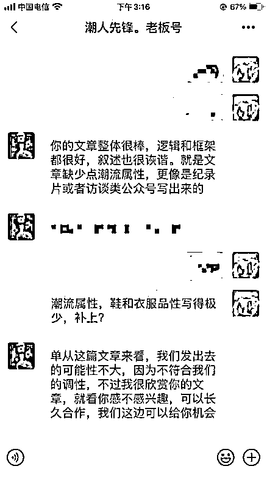

 

 

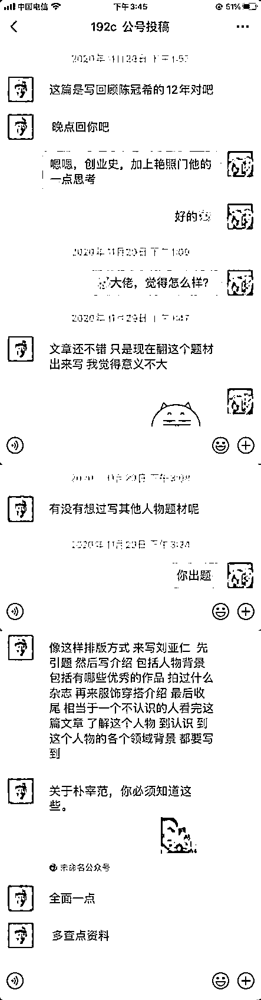

 

 

在投稿之初，我养成记录投稿账号的习惯，一边海投，一边根据上面的清单增删信息，几次就知道哪些号适合你，哪些账号不用再去投。

**5. **如何提高过稿率：

1）一个快速过稿的操作：投稿前在账号里搜文章关键词，例如，前些天一个热点是“孙海洋之子被找到后不回亲身父母身边，引起了网友热议”，很多公号写过这个话题。

如果你想投大号视觉志，就在公号里搜“打拐”关键词，会跳出一些文，去观察这些原创文的价值观取向合角度（转载的不用看）。

里面有关于打拐的三篇原创文，它们的选题方向都是同一个立场，选的角度有点特别：

她家不会去指责孙卓”认贼作父“，也不会给买家“养父母”说好话（微博有的媒体唱红“养父母”）。

人贩子在古代是什么下场？（  https://mp.weixin.qq.com/s/nh5534YNsStpi55b1Ll2CQ  ）

一个女孩被拐卖9年后，在绝境下完成了复仇！（

https://mp.weixin.qq.com/s/B2_z3SHuj9hwwYiOumzWoA  ）

逃  命  的「范  晓  媛」！（  https://mp.weixin.qq.com/s/bs5d2qwZpUZsGbqdGiOt2g  ） 

 

视觉志的三篇都不是一个时间段发表，都是围绕惩治人贩子，被拐女孩的反抗来写。

所以如果写这类话题，想投视觉志家，这样基本上要围绕的主题定了，展开去写就好。

很多新人因为不知道规则和市场风向，投几次没有反馈而气馁（后面我会详细说如何与编辑沟通的对策），做投稿向要多观察总结账号调性，从历史文中选出适合自己写的类型文，先刻意练习，后投。

写稿前先确定有多少家账号能接收，我采用一篇文对应多个账号的方式来写，最好是同类型的账号，调性相近写法变化也不会突兀。

投稿变现讲究细水长流，持续供稿，进而提升单篇稿费单价才是目的。

三、从写作新手开始，建立自己的人际圈子

写作和其他领域一样，无论你选择写作变现，还是写作成长，多结交朋友，特别是牛人。不要认为自己写得太菜而不主动去链接他人，进而丧失一些机遇。

因为写作圈子也有信息壁垒，一个新人往往是和平级交流多，进入成手圈子的机会少，经常和人交换有价值的信息，可能有意外收获。

你作为新手也可以给人影响力，把自己做为信息的聆听和传递者，同时输出你的价值观，通过你的持续行动，热情利他，初期人数在精不在多，一点一滴积累影响力，慢慢做圈子和加入圈子，让他们看着你的成长过程，更有信任，用信任交换价值。

在我还是纯新手时乐于分享，用费曼学习法帮助彼此学习成长。

 

 

去年我开始学网课，网课结营后，我作为学员在学习群里每天转发写作资料，文章相关信息，说自己的见解，其他学员也是新手，他们不时把问题发到群里，有的问题我不懂，但是我通过收集查找知识，分享这些干货知识点来帮助他们解决问题，在这个过程中我也学习内容了。

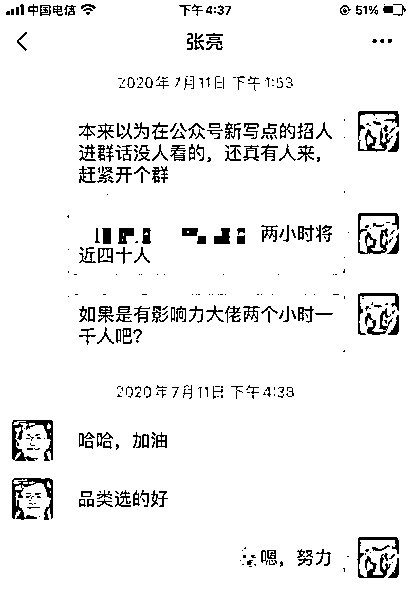

一个月后官方把网课学习群解散，从群里有 40 多人主动加入我的宠物写作群，尽管几个月后我把群解散，但今年有几个人成为我的写作班付费客户。

 

 

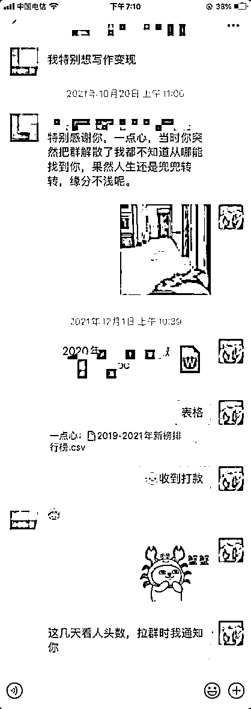

你真诚利他的热情，这点别人感受得到。

结识牛人有两个方式：识于微时，陪伴成长。这句话可以反过来用：让牛人看到你的每一个成长里程碑。

 

 

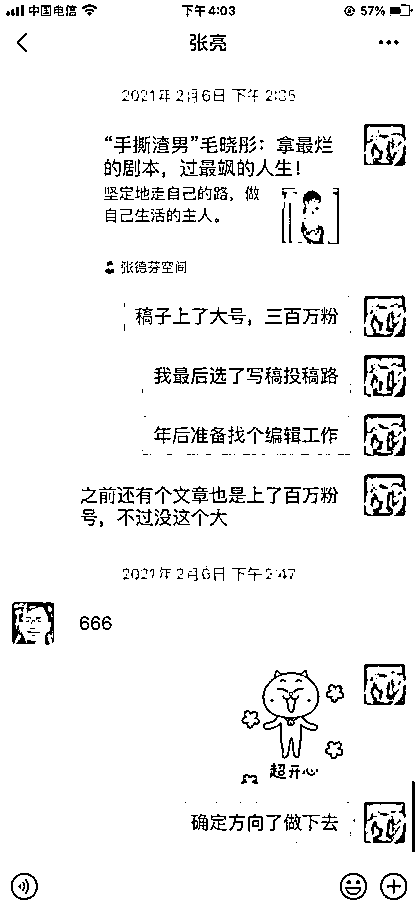

运营圈大佬张亮

 

 

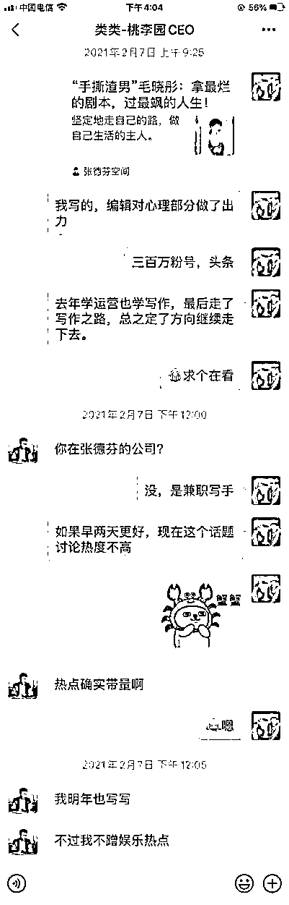

运营圈大佬类类

我做出成绩后，第一时间告诉运营大佬类类和张亮，这是我的一块里程碑，在我开写作班招生的时候，承蒙类类照应。

 

 

你在成长中接触的牛人，或是受过对方恩惠的，在你出成绩及时和对方汇报下，类似里程碑见证人的意思。像这样时不时把亮点 show 给大佬，让大佬记住你（对方不回复也没关系，重在积累成绩）。

学写作的人多，写作变现的人也多，一边文字变现一边做出影响力的人不多，在早期有意识的做好初步人脉积累和随意做是不一样的结果。

四、毛遂自荐，让投稿变现雪球滚动起来

毛遂自荐，或通过朋友链接牛人，特别是新手，一定要主动出击，闭门造车写作是最使不得的，有时变现机会，能力提升机会就在这里，所以我主动接近有助于达成我的目标的人。

先和新编辑建立联系，再拿题写稿变现。

**1. **投邮箱自荐，怎么介绍自己？

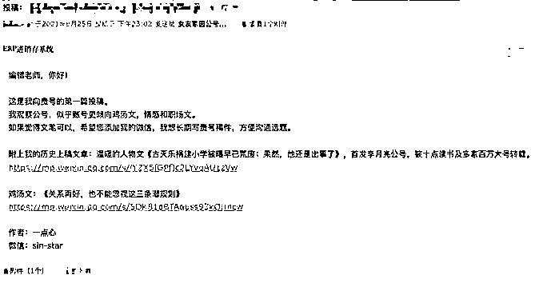

 

 

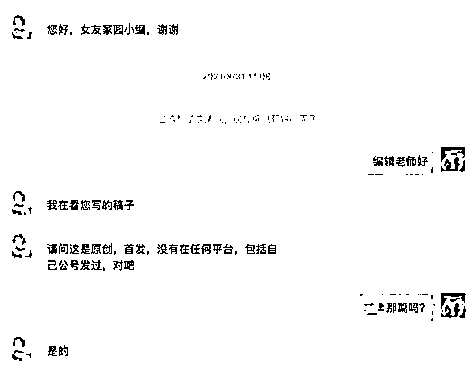

自荐女友家园公号

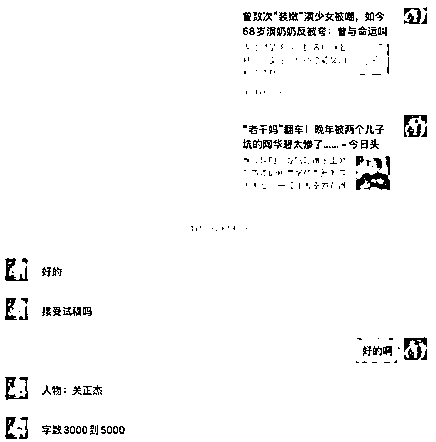

主动试稿某公号

除了日常投稿，你可以把自己自荐给编辑，同样是发自我介绍过去向编辑要题（如图）。如果是第一次投某家号，建议像我这样先看过一些账号文章后写邮件。

如果是微信号收稿，直接发文章过去，即使没过稿，你也要尽量得到编辑的反馈，把自己当做上门推销的销售员去应对编辑。

我有多篇稿子就是这样用自我介绍，旧稿子顺利拿到试稿，进而在文章通过后拿到稿费，也进一步得到更多约稿变现。

 

 

问编辑要选题前，  先把自己想写的选题和大纲（简写）写好发给编辑。次数多了，编辑看到你的诚意，内部有选题可能考虑你。

其实理由简单，在平台编辑这里，一个人有好的写作态度比文笔的分量重，好的文章是改出来的。

注：可以把自荐信一次投几家号。

**2. **为什么一定要自己投稿？

这里多说一些，如果你的写作变现是从学习班开始的，那么由人代投稿的行为对新人来讲短期内是助力，长远看不利于培养投稿的独立作战力，而独立投稿能力是和做好个人影响力紧密相连的：

第一，你接触不到市场的一手反馈，因为代投，编辑对于稿子有哪些问题和改进的点在哪里，这家号调性如何，还有一些过稿后的代投人可能不会一一跟你转达。

 

 

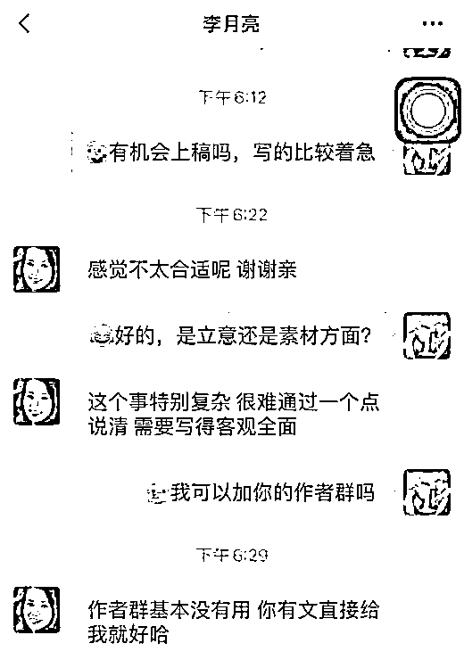

而通过编辑的市场反馈来调整自己，写作进步，更有利你挑战大平台稿变现。

第二，不利于建立自己的投稿资源库，没有和编辑建立联系，编辑也没有对你的初步印象，其实每次和账号编辑对话都是展示你的机会，再就是编辑的意见有利你增进对账号的理解，有利后续写稿。

这步非常重要，是个长期纵深链接关系：先建立联系，由点成线（优秀者由一家号推荐介绍给另一家号写，或者推荐关键节点人脉），最后横向发展成关系网，新手期先有“点”有1才有后面N个0的可能性。

** **

大家都去做同一个事，效果又不一样。

 

 

例如：我会在投稿第二天问新编辑，文章质量怎么样，素材和观点可以吗，大纲结构可以吗，我下次直接写大纲发你可以吗……等等，等编辑回复，进而拿到后面可以不写全文，先发大纲确认再写，节省彼此精力，同时给编辑留下好印象。

如果没有过稿，还要问出是什么原因，知己知彼百战不殆，这都是为后面文字赚钱和积累人脉获得圈子影响力服务。

新手在和编辑沟通过程里要多注意细节，多复盘总结。

**3. **我的投稿骚操作：

有时可以另辟蹊径，像我通过微信号把鸡汤文投给心理号编辑（投微信比邮箱反馈快），或者把职场文投给个人成长号，励志文投给情感号。这时候，编辑看的不是文章主题，而是你的文字基础，如果基础可以，可能给选题写或者试稿（沟通见上面）。

 

 

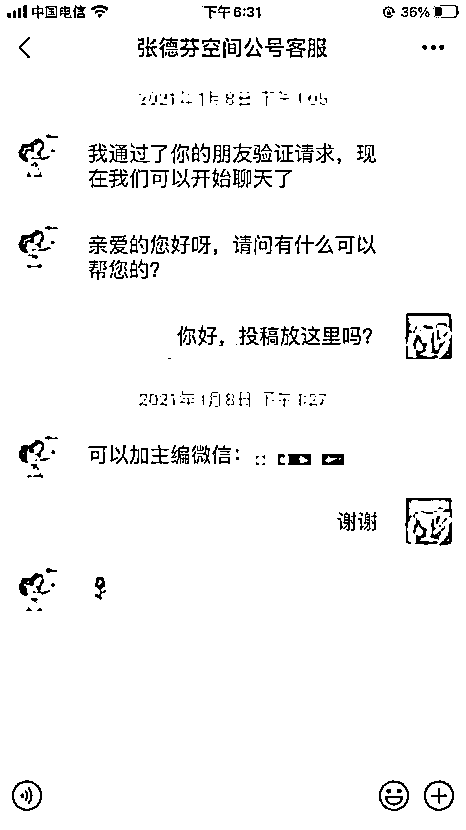

我的第一篇十万加《“手撕渣男”毛晓彤：拿最烂的剧本，过最飒的人生！》（  https://mp.weixin.qq.com/s/noui6EHfoWdfEYZ50GowKg  ）就是这样出来的：

写过几篇潮流号觉得顺手后，我开始常识写鸡汤文。第一篇鸡汤文陆续给几个号，因为第一次写这类，文章成熟度不高，被被鸡汤号集体拒收，便突发奇想，试试转投心理大号张德芬空间。

但是当时的张德芬号没有征稿函，公号菜单栏和自动回复也没有编辑的联系方式，怎么办？

 

 

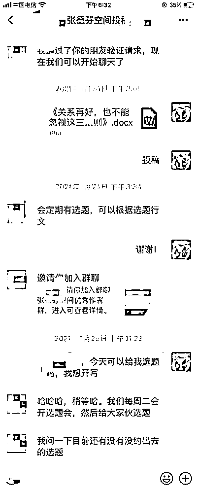

我仔细看账号，发现她家有商城客服，就从客服口中得到主编的微信（现在可以用回复关键词联系收稿编辑），添加微信后，主编觉得文笔还可以，

拉我进作者群。

 

 

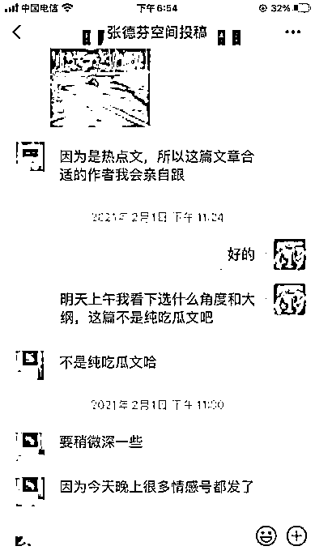

没过几天，主编半夜约了一篇毛晓彤热点文给我，我早上六点开始写，那时我给自己的压力比较大，虽然在也在百万流量号写过，但是300万粉的高质量号毕竟没写过，而且心理号文章门槛高，毕竟我是写投稿才2个月的新人，写急文很慢，又是做观点又是搜素材，写了一天多改完，期间还暴食一顿kfc。

 

 

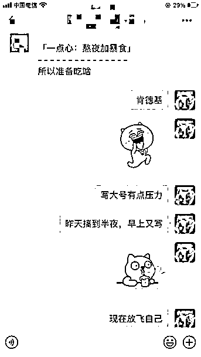

因为这篇热点文情况特殊，编辑会帮忙改，后来排期又晚了点才上线，上线第一个小时有三万阅读，随后十万加，稿费 800 。

作为一个新人，如果我只是坚持投小号，小号的过稿影响力小（例外：少数中小账号走精品路线，如果被大号转载了，做背书也可以）。在变现路和影响力的起步不会快，可能半年才一点点。

新人要多给自己创造曝光和传播的机会。

 

 

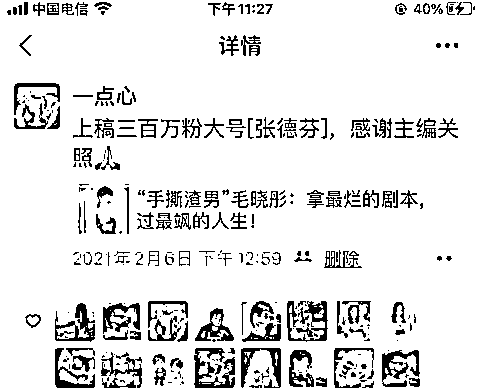

第一篇十万加发表后，我把所有能发链接的群转发个遍，也让朋友转发文章链接（变现成绩少时候最好不让家属们知道你在做写作变现，易打击写作积极心），把链接发在朋友圈让编辑们刷圈时看到。

随后就有我之前有加了微信，但是没写过稿的编辑约我写，从这时开始，不用四处开发新号投稿，集中在几个号写（注意性价比），一边积累过稿数量，顺顺利利赚钱，把阅读量数据好的文章链接整理一个文档，投向优质账号编辑要题写，进了摆渡人作者群，百万粉丝号inslady作者群等，渐渐地写的稿子也多了，稿费也上了台阶。

用你的 10 万加作品和优质文章作为跳板，挑战更大级别的号，获得更多文字变现机会和荣誉感。

人往往因为看到成果而受益，愿意做得更多。

其实写作变现这块，一些按年统计，变现总金额高的人，并不是单一的保持高质量文章输出，而是质量文和流量文通吃。

用文字或带给他人正能量，输出深度思考，或提供饭后闲聊吃热搜瓜的流量文，两者本身没有对错。

 

 

在保证正常写作频率，输出有深度有观点的质量文的同时，适当接单一些流量文赚稿费。经验不多的人写流量文一个月 2000-3000 块，一年下来也是一笔钱。

**-03-**

用流量思维积累粉丝，用内容扩大影响力，

找到合适自己的圈子，让更多知道你

我在文章的前半部分主要是分享如何快速投稿变现，积累代表作，如何和编辑打交道，新人初步建立自己的写作人际圈子。

接下来，我提一个问题，你想每月用文字赚多少钱？

一个人的精力有限，就算不睡觉，每个月能写出的文字量是固定的，同样是写文字赚钱，为什么有的人每个月只赚到一点钱，有的人赚几万呢？

单纯靠文字赚钱，没有圈子资源支持的话，赚的钱是很有限的。一个写作变现半年的人，如果只是写几个号的稿而不从圈子资源来裂变赚钱途径，每月变现的钱大约 1000-6000 。

很多人只是闷头写稿或者自己写平台赚钱，没有和编辑，平台运营打交道的意识，没有把文字变现做大的打算（可能每月赚 5000 就满足了），或没有把文字赚钱作为长期的技能看待。

 

 

和编辑，平台运营打交道是其中一个了解市场的方式，其实也是敲开他们背后资源的途径之一。

有流量思维的人和闭门造车的人，随着时间的推移，发展方向必然不同，成长速度和赚到的钱也差距大：

闭门造车的人：不做推广，或者用传统花钱买流量的方式慢慢做推广。

流量思维的人：借势平台或与大v合作，借力资源为自己赋能，用价值换价值。

如果你想长期用文字赚钱，从最开始就要有意识地用作品积累背书和打造私域流量，并加入一些合适的圈子，用写作技能结合你的专业领域来赚更多的钱。

现在我讲讲新人如何用内容扩大影响力，一边用文字赚钱，一边结合个人优势和所处阶段找到合适的圈子。

下面说的方法也适用于新人学流量增长、品牌营销，视频营销等。

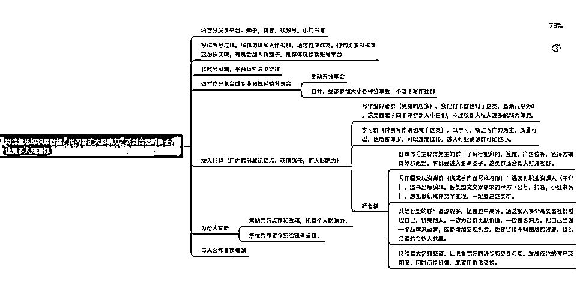

 

 

一、内容分发多平台：

知乎，抖音，视频号，小红书等。无论是否过稿，日常写的内容坚持做分发，投稿过稿的内容在账号发表后，和编辑申请转载（简称“开白”）。

二、有的账号有作者群，在你投稿账号过稿后，编辑会邀请你加入该群，可能

经常有内部选题放出（有的号没有）。

第一，进群增加变现的机会；第二，通过链接群友，发展成共同好友转介绍，有机会加入新圈子和推荐你链接新账号平台（资源优劣度根据你所在的写作阶段和人脉质量而定），得到更多投稿渠道加快变现。

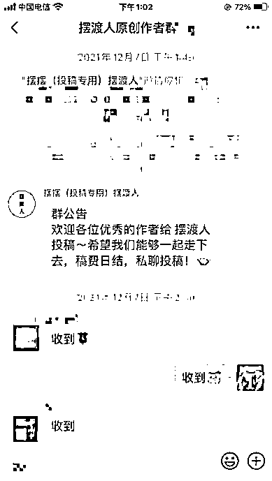

 

 

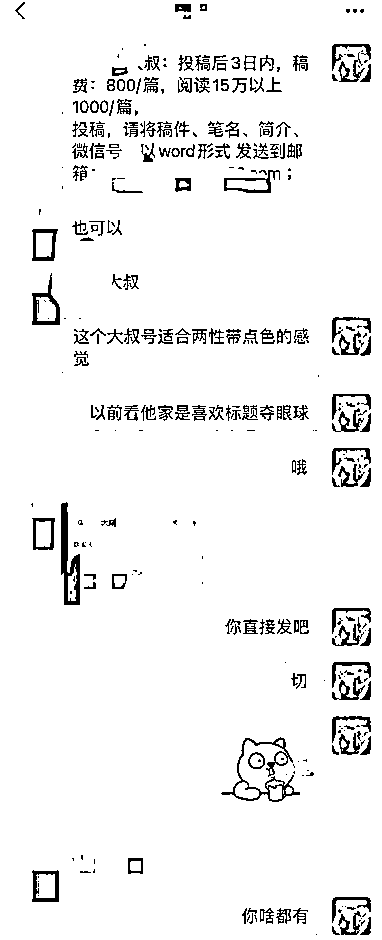

图片是我在加入某号作者群后链接群友，从相知到相交，得到想要的收稿平台编辑微信。你要主动一点，用得到新朋友的形式做裂变获得新资源。

三、和账号编辑，平台运营深度链接：

第一是约稿量增多意味变现金额增多；第二是优秀者可能被推荐给其他号写，也是资源裂变的一个方式；第三是编辑引荐你做文字类的兼职工作，例如兼职责任编辑等。

 

 

四、做写作分享会或你的专业领域经验分享会：

分为自主开办和借用他人平台做宣传。

**1. **主动开分享会：做一个细分的分享会主题（一定要有明确的主题，关系到招来多少人听），例如让朋友们转发直播信息，听分享有抽奖等。

**2. **自荐或者受邀参加行业里，圈子里的大小各种分享会（不限于写作社群）：把自己推广出去。

 

 

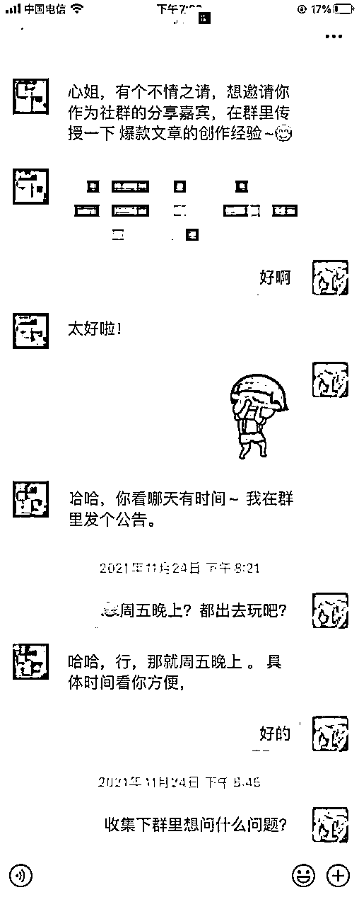

五、加入社群：用内容形成记忆点，获得信任，扩大影响力

 

 

**1. **写作爱好者群（免费的居多）：我把写作打卡群也归于这类，资源几乎为 0 ，这类群属于向下兼容新人小白们，不建议新人投入过多的精力体力。

刚开始学习新媒体写作时，我加了许多小白交流群，这个时期看上去我很“忙”，但是多是无用功。当你实力不足的时候，把大部分精力放在提升个人能力和出成绩上。

这类群资源很少，链接写作变现行业群的机会是 0（不包括 20，30 块低价稿费群）。

**2. **学习群（付费写作班也属于这类）：以学习，精进写作力为主，质量可以，优质资源不多，可以适度链接。

在里面找到和你水平相当，或者比你成绩好的人链接，互相激励和点评，改稿（给别人做改稿练习也是促进你的写作力的一种操练方式，指出对方的不足也是帮助对方进步），进入行业资源群可能性小。

和爱好者群一样，属于用时间交换价值，向下和平级兼容，把自己变成学霸做影响力。

**3. **关于写作班：

学写作就绕不开写作班的话题，简单说下我的见解：

 

 

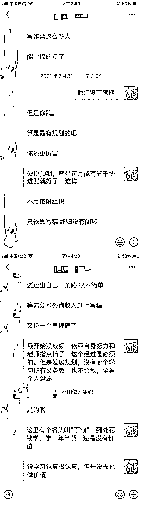

 

 

市面上写作班林林总总，优秀的老师很多，你能够学到一定的写作技巧和部分实战经验。前期可以依靠写作班多写和学习，多写多过稿做背书。你如果你想长期文字变现，扎根写作领域，就要追求更高的地方。

在写作班里，出成绩八分靠自己，二分是你选择的老师和背后资源优劣，选择写作班只是学写作的一个动作。

我在写作班学过一段时间，后来自己写投稿接稿，写文案，7 月开了付费咨询，一边写稿，一边自己接单，后来做写作班。

写作班的正确玩法：

开局：选 2 个学员做假想敌（不要告诉对方），结交 3-5 个高频交流的好友（从学员的自我介绍里选出你感兴趣的，或者有成绩的人），链接在精不在多，这几个人是要一直陪你成长的，最好都是追求变现方向的人，后面能一起做事。

**4. **行业群：

 

 

**1**）以自媒体号主群体为主的群：了解行业风向，互推，广告位等，链接力视具体群而定，有机会进入更高圈子，这类群适合新人打开视野。

**2**）写作圈变现资源群（供成手作者写稿对接）：通常有职业资源人（中介），图书出版编辑，各类图文文案需求的甲方（公号，抖音，小红书等）。资源丰富，链接力中高等。适合有写作基础，有一定数量的过稿记录的人。想扎根新媒体文字变现，一定要进这类群。

 

 

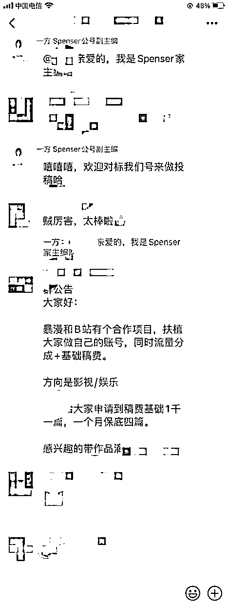

 

 

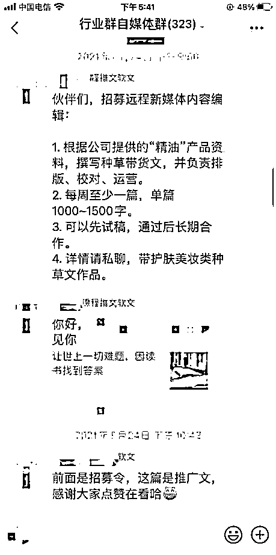

我在写作行业资源群拿到过多份稿子变现，也是通过这类群快速链接一些大的优质收稿平台并过稿，例如 S 叔Spenser，李月亮等。

 

 

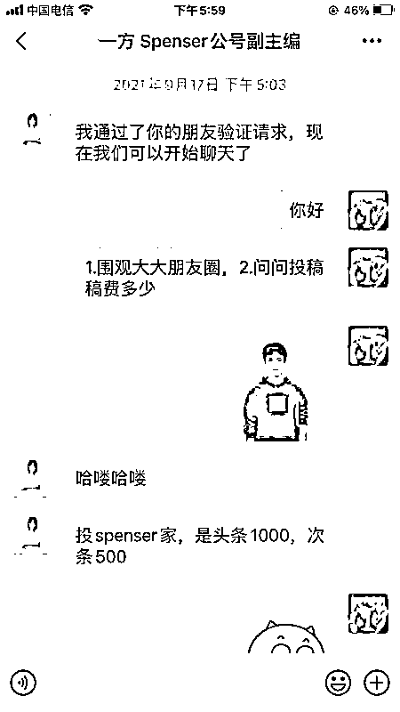

经人引荐加入圈子，用资源来写作赚钱（s叔号，暴走漫画号）

每次过稿，我都会在社群和圈子做宣传，总会有人注意到你，愿意为你赋能。

 

 

我进入的第一个写作圈资源群，是一位编辑介绍给我的老编辑拉我进入的，她所在的圈子只和成熟作者，编辑，自媒体大v等接触，由于这个信息断层，所以普通菜鸟不知道，也难联系她。

进入圈子一周，我便主动链接到牛人作家李月亮，这家情感号知名高，过稿难度也高，我投了两篇，第一篇因为热点事件发展不明朗，发文时机不合适所以没过。第二篇写的古天乐过成功过稿，稿费1000+（

https://mp.weixin.qq.com/s/iYZX5fGPfJc2LYvqAU1zVw  ）。这篇爆文首发李月亮，被十点读书转载（  https://mp.weixin.qq.com/s/rvrEeJY2Ab4y8JFSWuEu6g  百万阅读，点赞1万）和多家百万级号转载，全网阅读累计近千万，也因此成为我的大背书。

自从链接李月亮老师后，经过她不时的指导和交流，我的写作也在进步。

做文字赚钱多了解圈子，加入这类写作圈变现资源群可以让你大跨步走：链接账号平台的高层，得到更好的变现扶持;和平台牛人贴身学习，精进写作。

**3**）其他行业的群：资源较多，链接力中高等。通过加入多个高质量社群展现自己，链接他人，一边为社群贡献价值，一边做影响力，把自己当做一个品牌来运营，既是增加变现机会，也是链接不同圈层的资源，找到合适的合伙人共赢。

怎么做：根据不同行业群的定位和不同需求，做不同的分享主题：例如在生财商业社群谈“如何通过写作增加圈子影响力”，在写作圈就要谈“如何写出十万加，变现经历”。用信任和价值做个人 ip 。

 

 

案例：

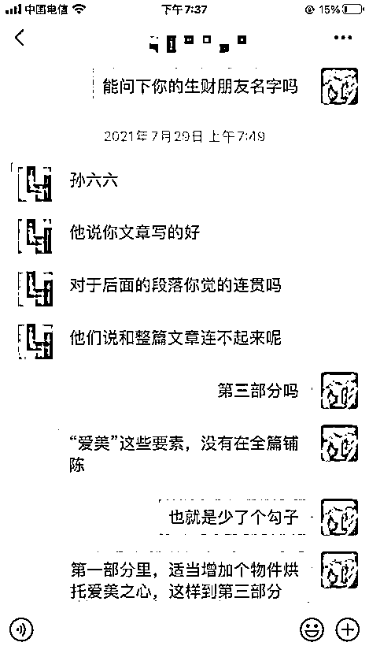

生财圈友孙六六介绍给我的单子：改人物故事名片。还有些不同圈子的人向我咨询写作和文案约稿。

加入优质社群，链接大佬促进你的行动和成长。

生财社群大佬云集，无私分享各类行业干货经验和项目玩法，涛哥和明白是我学习的榜样。在生财还让我在线上接触到了各行业精英圈友。通过生财，我还加入多个大佬的星球社群。

 

 

我接触写作一年，看过生财有术多篇关于知识付费的精华帖，但在我有了一定的写作经验和变现力后，想开班却犯了拖延症，一直到11月底看到涛哥的一篇问答文点醒了我，立马开班行动。

 

 

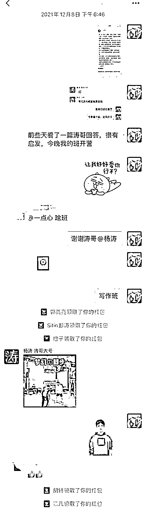

 

 

于是我 11 月 23 号开始写干货，26 号在某社群做分享，周末写招生广告，30 号晚上在个人号发布广告，马不停蹄，从 1 号到 4 号有 20 多人报名付费，总共用了 11 天。

第一次开班成功，我在群里感谢涛哥。随后，我邀请杨涛做我的付费星球嘉宾，涛哥欣然答应，让我很开心。

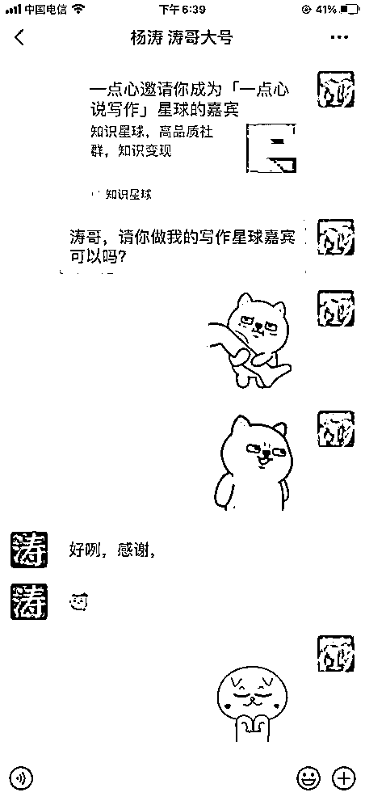

 

 

在优质社群展示自己，参与社群活动，这会使你和大佬的线上距离更近。持续和大佬打交道，让他看到你的进步和更多可能，发展成他的客户或朋友，用时间换价值，或者用价值交换。

去年和今年我花几万在知识付费，加入高质量社群，不但丰富了我的写作变现渠道，还让我被不同的圈子人知道，是我重要的对外窗口。

六、为他人赋能：利他就是利己。

**1. **帮助同行点评和改稿，让对方在朋友圈或个人号表示感谢，借对方的流量积累个人影响力。

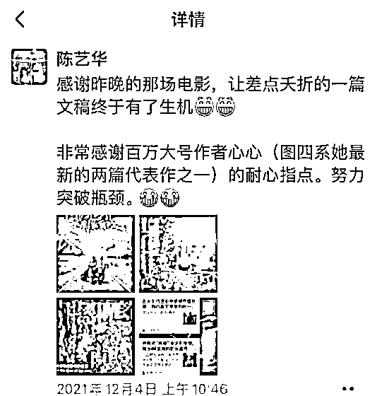

 

 

帮微博千万加爆文作者陈艺华改稿，她在朋友圈对我的感谢（多做这样的事，就是帮自己增加曝光）。

**2. **把优秀作者介绍给账号编辑

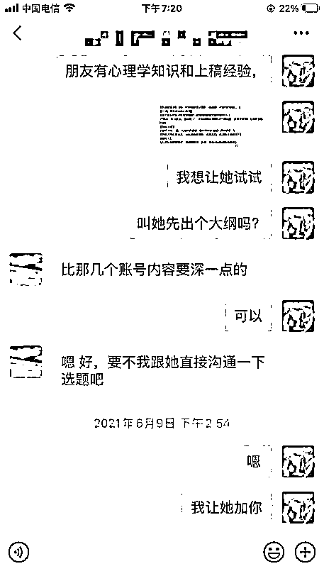

经过我的对接，该作者在账号连续过稿几篇。

我和写手王渤的小故事：

1）我在行业圈子里链接到她，并通过她链接到鸡汤号洞见（单篇 2000 ）的编辑。

 

 

2）我点评她的文，并且把她这篇推荐给樊登读书，她在这家过 2 篇稿后，其中一篇被洞见公号转载，增进了她的写作圈影响力。

 

 

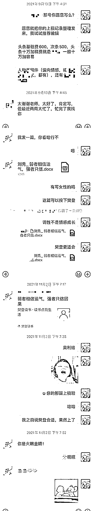

 

 

总结：人和人之间的帮助是相互的，我在帮助别人，真诚利他的同时，其实也在为自己的影响力加码，通过转介绍，我拿到一些可以快速入圈的关键人脉。

多做利他的事，帮别人收获成功，就是帮自己。

 

 

七、与人合作置换资源：和其他行业领域一样，互推，置换，买广告位等。

本段总结：写作不能单打独斗，选一些人与你同行把！

人们常说，“三人行，必有我师”。那么，好的写作朋友是什么样，如何筛选出适合与你同行的人？

我做了一份简单的自检题送给你（其他行业也适用）。

交换信息：高频，并且信息有包含价值（我不排斥八卦），让你变得更好。

介绍自己的朋友们相互认识：圈子人，行业人。

你**/TA**介绍资源或兼职机会给对方**/**你。

分享自己的学习经验，修改文章过程。

情感支持（鼓励**/**热情**/**鞭挞**/**安慰等正面情感）。

较高的认知水平，三观正（交友不慎，通常就是不符合这点）。

愿意购买你**/TA**的付费产品、内容。

按照这个清单，筛一遍自己朋友圈，哪些人符合至少三点？

想快速提升进步，多想想「朋友」能帮到你多少，可以做到什么程度。当然，你更要努力，毕竟谁也不喜欢一条人生躺平的咸鱼。

如果以上两点都没有的，要么彼此领域关联太差，要么对方没想深入链接你。

**-04-**

写作变现怎么避坑？

 

 

一、投稿变现，让编辑心里舒服，你才会舒服

第一，遇到投稿被拒收，不要拉黑删除编辑微信。其实写作圈不大，这次不合适还有下次机会，新人多爱惜羽毛。

你的产出内容好，编辑自然愿意给你选题写，有了选题相当于有了一半的上稿机会，只需注意及时写完，不放编辑鸽子。

如果编辑三言两语指出你的文章缺点，这是学习提升的机会，要感谢，忌不服气。

如果编辑让你改稿，说明有过稿机会，改稿调整是为了更符合账号调性。至于最终改了几次不重要，你的目标是上稿和影响力。

改稿后如果没有达到账号要求，编辑不会收，立马转投其他号。

二、不要接低价稿坑自己：

我不建议写稿费一百块以内的低稿费文，新人建议最多写一个月。

一篇文章的产出，少不了找选题，列大纲，写初稿，修改，定稿这套工序。写** 10 **篇低价稿占用的个人精力，并不比写出一篇高质高价稿的付出少。稿费太低的平台，往往对文章质量要求极低。你有写稿的时间精力，做什么不能赚到这多篇累计的几百块呢。

 

 

大平台的稿件稿费高，对质量有一定要求。我建议追求高稿费，多次投稿挑战优质大平台的同时，用过稿成绩增加你的个人影响力。

每个人都有一段灵魂暗夜时刻，靠自己独自走出幽暗小径。

如果你的写作水平暂时达不到两三百块的稿费，努力磨练功底，直到中稿，让自己的写作能力接连得到行业认可，进而走进新媒体圈子，收获更多机会。

**-05-**

一些新人写作建议

**1. **从新手阶段开始做写作成长规划

新媒体行业是淘金地，每个进来的新人都想挖出属于自己的金子。

什么样的人做新媒体会有成果？

1、能持续写内容：对自己研究的行业有有深度认知，能持续写至少3年。

2、会引流，懂得如何吸引读者。

3、爱钻研，分析匹配用户需求，善于「试错」。

写作这件事和做其他领域一样，无论是月入** 3000 **或** 3 **万都需要规划发展路线。

 

 

我们学写作和写文章，是让自己变得更好，用文字赚钱，同时让家人的生活变得更好，有规划和自由发展的结果是有差异的。

用写作打造个人品牌，提高收入，增加链接资源和机会。

用写作做本职工作的纵深发展，链接客户资源。

用写作做好引流，提升销售转化。

进阶方向：

兼职写手，视稿件难度每周过稿1-2篇新媒体长图文，不包括商稿软文。

独立讲师，咨询付费ip

写作班训练营主理人/授课老师

全职业：出版编辑，文案策划，新媒体编辑等

内容平台网赚高手

资源对接：资源/圈子/人脉

个人视频剪辑** IP**

抖音**/**视频号视频文案写手**/**视频剪辑讲师

剧本杀，网文小说向

其中 2 和 3 我是拆开看，这两个还是有一定的区别。几个类都可以叠加类型 6 一起做。

每个人写文都有擅长的文章领域类型，建议优选离钱近，离资源近，并且感兴趣的方向，例如写历史文在头条吃香，可以一边带货卖书，但是在公号稿子变现一般。故事文，情感文在头条和公号都是大类，变现都不错。

 

 

前期写这类稿写平台赚稿费，流量费，一边积累粉丝。当你在写作和专业领域做出的成绩越来越多，接触的交流社群增多，后期可以写卖同类型的网课，把你的写作技能和在专业领域的知识点系统化，再做海报卖课（卖写作课，卖专业课），逐步迭代课程，还可以开付费专栏做连载（头条万粉可开）。

和编辑圈子做好链接，随着你的过稿成绩越多，文章质量好，可能有引荐接到兼职的机会，例如兼职责编，兼职编辑。

还有一个方向是做写作学霸 ip ，当你 70 分时，可以教 50，60 分的人。当你在写稿积累一定的写作成绩和影响力，就可以出网课了。第一批学员从哪里来，  从和你一起学写作并看到你成长，还有各种圈子路径发展出来的粉丝里来。这个时候可以多加入一些副业变现，教人做知识付费IP的社群学习，去借势，找到合作人，推广你的课。

互联网行业发展节奏非常快，做新媒体亦然，如果抱着偏安一隅心态，循规蹈矩，不出三年，不仅新媒体小编，程序员也面临”下岗“窘况。踏实做事，在努力精通行业知识的同时，钻研迭代新媒体引流方法，写作技巧，得出自己的方法论，并勤于实践验收，积累经验。

总之，新人要有自己的写作道路规划和方向，谋定而后动。

**2. **行动在当下

先写作，后变现。

古人言，欲先取之，必先予之。

于我看来，学写作，先交出你的注意力和耐心。

 

 

一个人做任何事都有成本，做事想得到即时满足，是人的天性。

就写作变现而言，成果因人而异，不是每个人都能够速成的。但是只要下定决定，迈出行动，** **有恒心的人，结果都不会太差。

我身边有的新手朋友，写了 3—6 个月后，进步明显（公号长图文方向）。

古罗马的塞内加说，「是因为我们不敢做，事情才变得困难」。

你做事时的每一次犹豫，迟疑，都是对自己的精神消耗。次数多了，未战先疲。

体育项目里的射箭运动，一开始柔缓用力把弓拉满，随即全力以赴射出。你要做的，就是成为自己的弓和箭，用全力飞驰。

学写作，不要内耗自己，持续行动就对了。

后记：

在我遇到生财之前，我只是一名工薪阶层，掉进人群就认不出来的普通人，互联网对我来说等于淘宝加微博。

 

 

是生财有术让我这个网络小白提升认知，知道了流量思维，利用信息差赚钱，原来互联网有很多适合普通人的赚钱项目。小白也可通过生财分享的一些落地项目实操赚钱，在生财大佬的带队下，抱团做项目快速成长。

在生财的一次小项目里，我作为小白第一次实操，真真切切地尝到了热点流量在手的爆爽感（孤寡活动个人帖：  https://t.zsxq.com/y7yvnmm  ），因为在生财开眼，我从内容消费者转成内容创作者，把流量思维运用写作领域用文字赚钱，一路上快速变现，越级打怪，做影响力比一部分同期人的成长路径快：

当他们在小平台为怎样过稿绞尽脑汁的时候，我已经越级挑战大平台并成功过稿；

当他们为每月写出一两千稿费心满意足时，我已经用优质稿背书进入优质圈子，通过链接资源实现高额变现；

当他们还在点评哪个写作老师好的时候，我开始做写作ip，经营着自己的写作班，他们成了我的学员。

生财有术也改变了我的价值观，加入生财之前，我想做副业赚钱，但是又觉得做小项目（例如qq个性虚拟头像业务）很low，看不到项目背后隐藏的商业价值，而这种观念在加入生财后得到完全转变。

以前我讨厌各种媒介广告，认为看广告等于浪费时间，是生财和圈友明白老师教会我其实一篇广告暗藏商机指向:什么人会买，什么人在投放，为什么用这个方式投放，如果是我做，有更好的方式吗……等等，带我用商业视角看世界的运作。

 

 

生财社群就是这样一群对各个领域保持好奇心和挑战新事物的人，无论是在这里学技能（产品，运营等），还是追求成长（认知，沟通等），都能找到合适的定位，并付诸行动，做出成果，复盘迭代成长。

生财有术虽然不宣传「教人赚钱」，但是我通过在生财的学习成长中赚到了钱。

2021 年末，我写下这篇文感谢各位生财有术和各位圈友，在我进步成长的路上一直有你们的陪伴和指路。

本文分享：**“**我的写作变现是怎么做起来的，怎么赚钱，怎么通过写作扩大影响力，进入合适的圈子来赚更多的钱？**”**

总结：公号投稿变现流程：从写稿的第一笔稿费开始，是新手也要建立写作人际圈子，到写出十万加做背书，建立自身的影响力（没有十万加也可以，会慢些），这个阶段是市场选择你。

通过毛遂自荐，积极利他，为他人赋能，用背书推动更多约稿来写，再用数据好的稿子做传播，让更多的人知道你，多链接人，用内容走进合适的圈子，链接牛人，让文字加速变现。

到了这步是你选择市场：编辑约稿，熟人介绍资源，开付费专栏，做兼职编辑，开写作班，做写作 ip 等。

评论区：

莫一多 : wu 写作提升之术……level up.

一点心 : 大家有什么想问的吗，欢迎留言[爱心]

陆甲第 : 很有启发，谢谢~

小夏 : 心姐万字雄文

 

 

炮爷（不睡觉） : 感谢心姐的分享，去年就在明白老师群里发现了心姐这个大宝藏，确实太强了。向心姐学习[呲牙]

一点心 : 一起成长[呲牙]

张振兴 : 能加微信吗，我也在做这个18710488007

花天卓 : 心姐yyds

# **# ****(**精华帖**)(129**赞**)**加入自媒体赛道一个半月营

# 收**5300+**，适合自媒体小白发售的心法指南

作者：  安宇轩~

日期：2023-07-07

《加入自媒体赛道一个半月，端午告捷营收5300+，适合自媒体小白发售的心法指南  》大家好，见贴欢喜。我是宇轩，19岁退学北漂，21岁月入过万：正轨步入自媒体一个半月，端午集体小爆发，营收5300+，一个月总营收7300+迈出了ip营收第一步。

从看葫芦画瓢，到贵人引路，再到有小成，我有很多内容分享，全程无尿点，  小朋友们请系好安全带，司机焊死车门，我们出发了！！！

以下是适合小白发售的心法指南，全文3309字，预计阅读3min。

为方便大家阅读，请移步飞书：

https://oprlej7lc1.feishu.cn/docx/X8BEd8X7joEKaZxbTsBc26Gfnrf评论区：

惠玲 : 牛啊牛啊

小鹿 : 太厉害了！！

酷酷的胖哥 : 往往人们很自大地以为，这些我都知道，但是为什么就是用不上呢，因为没成自己的体系，这就是宇轩产品的价值，把你知道的和不知道的都做成一个体系来推给你，🐮

是微光吖 : 宇轩好棒！冲冲冲

戴智慧 : 宇轩哥牛呀

 

 

书豪 : 很棒

今夕何夕 : 学到了，实实在在。

小米｜卡片写作 : 宇轩好棒  学到了[玫瑰][玫瑰]

# 【知识付费分销】**3**篇

# **# ****(**精华帖**)(206**赞**)**靠微信**+**朋友圈赚七位数，分

# 享我长期经营朋友圈的经验

作者：  醒醒同学🍃

日期：2023-04-12

大家好，我是醒醒，谢谢静伟邀请我分享，今天的主题是：如何长期经营一个自动化成交的朋友圈。

过去几年，我依靠「微信+朋友圈」，在微信生态变现七位数。经验告诉我：每个人都可以靠微信做一门生意，一个人如果在微信里不能赚至少100万，这个生意可能是不及格的。

还有付款路径明确，微信自带转账功能，这里就不列了。

上面三点是重中之重但要讲究技巧，扯着喇叭喊肯定不行，互动是十分重要的：

有的朋友圈常发专业相关的学习，却不表明身份，客户都不知道可以付钱。

有的朋友圈只打广告晒自己厉害，也不管别人是不是爱看，越努力越吃力。

有的朋友圈微信人数只有300，配客单价几十-几百的产品，收入上不去久而久之就不想做了。

 

 

接下来，我主要分享自己写内容的经验，以及总结的让用户自动下单的心得，不用辛苦去跟单做成交的。我的产品单价从499-899-2199-10000-26999元，都是用户自动转钱的。咱们的效果是这样👇

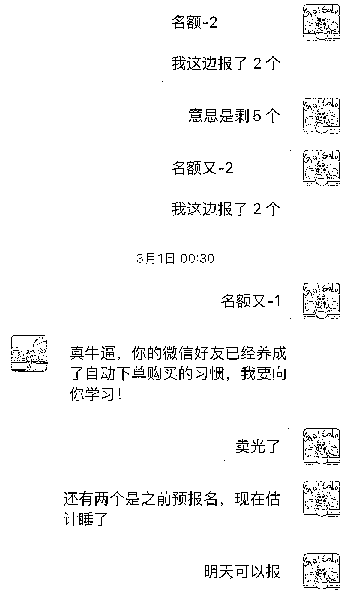

 

 

分享前介绍一下背景，方便朋友们比对，自由职业4年多，一直在知识付费相关业务，从带训练营到带团队，和公司一起做到行业头部；再到全职做个人成长教练和优势教练，我的业务主要咨询形式为主。

除此之外，还会给喜欢的星球做做推广，也全部依靠朋友圈+微信运营，如：

知识星球@生财有术  第五期拉新第五名；

知识星球@生财有术  第六期拉新第二名；

知识星球@Caoz的小密圈  拉新第一名；

知识星球@平名创业手册  拉新前三名；

以上三个星球做分销时销售额超百万。对普通人而言，朋友圈的商业价值依然不错。对有产品在卖且无上万粉丝基础的普通人来说，能做到持续写好朋友圈的人，自动化成交没问题。

先分享一个简单的自查公式，相同人数的朋友圈，当所有人卖同一个还算可以的产品时，不同人的朋友圈内容质量和频率共同影响了我们能收多少钱。

高质量低频=有钱赚

高质量高频=赚翻了

低质量高频=被删除

低质量低频=少钱赚

这里说的质量不是说文字写的多么华丽、专业，而是是否能让人听进去、听得懂、触动得了人，且和你要卖的产品和服务是相关的，看是否有人持续点赞、评论。

高频和低频不用说了，是发圈频率。

如果还是普通人甚至是素人，我们至少绝不要低质量高频，努力朝高质量高频努力，参考我的好朋友梁靠谱女士，没有一个人逃得过她朋友圈。

 

 

朋友圈很像家门口的小型市场，想要赚钱，定位、流量选址、选品、营销活动、服务都是要考虑的，大家肯定听过不少，时间关系，今天我主要分享1个点，做好了的人变现不成问题——如何写朋友圈更让人信任，就分享一个技巧：让用户参与到你的业务过程中。

最近有没有哪位朋友，是要推出新产品的？你们都会发什么内容呀？

先分享一个做线下活动的过程朋友圈，大家有没有去过餐厅，当你坐下来吃饭时，它的厨房是透明开放的，比如西贝筱面村，你能看到一个食材从准备到做成菜的过程，对卫生的信任度会提高，敢吃敢买。为什么外卖让很多人担心，其中一个原因就是完全看不到过程，担心黑心厨房。

发朋友圈也类似，如果你让用户参与到你的产品研发过程，她会更放心，甚至有的人觉得像自己生出来的孩子，看哪哪好，不买一个说不过去。这不是说要套路别人，是要用公开的方式反向提醒自己好好做事。

以我前两周首次做线下沙龙举例，从有想法到决定做活动、准备物料、到做活动，朋友圈全程参与，报名人数报满两度换场地。

首先宣布自己要做一个活动：大家不一定要什么物料都准备好再开始，跟随你的准备状态宣传就行，越是没有包袱，后面越有进步，越让人能看到我们有认真做事。

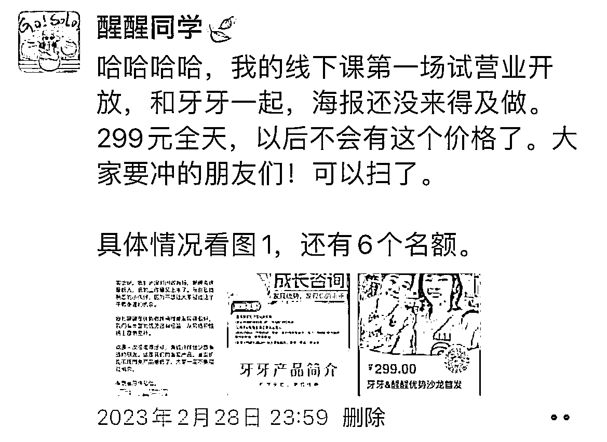

 

 

可询问场地、海报、物料选择等建议，让朋友圈的人参与进来，对于朋友圈来说，最怕的其实不是写得不好，是根本没人看，任何信息都触达不了。

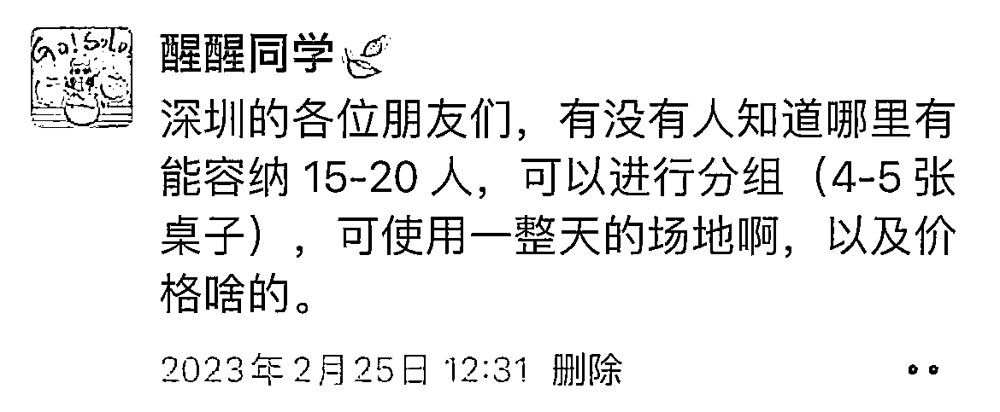

这条朋友圈帮我一次性收集了4-5个场地，甚至还来了要报名的人。珍惜每一次能和用户对话以及获得资源的机会。

准备活动期间，所有关于活动的思考，准备过程，都可以适当发朋友圈，和用户同步历程，比如说我会问海报哪个好看，会问某个模块设计大家更喜欢哪个，会问朋友要穿什么衣服。

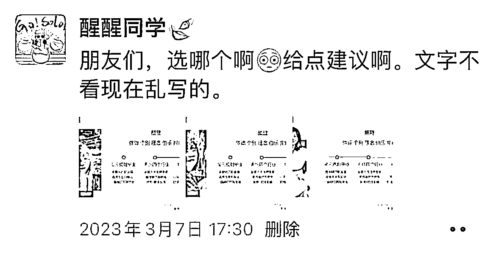

 

 

这条朋友圈有大概几十个回复，参与难度很低，只需要打个序号不用大量思考，像这种轻松参与的可以多发。

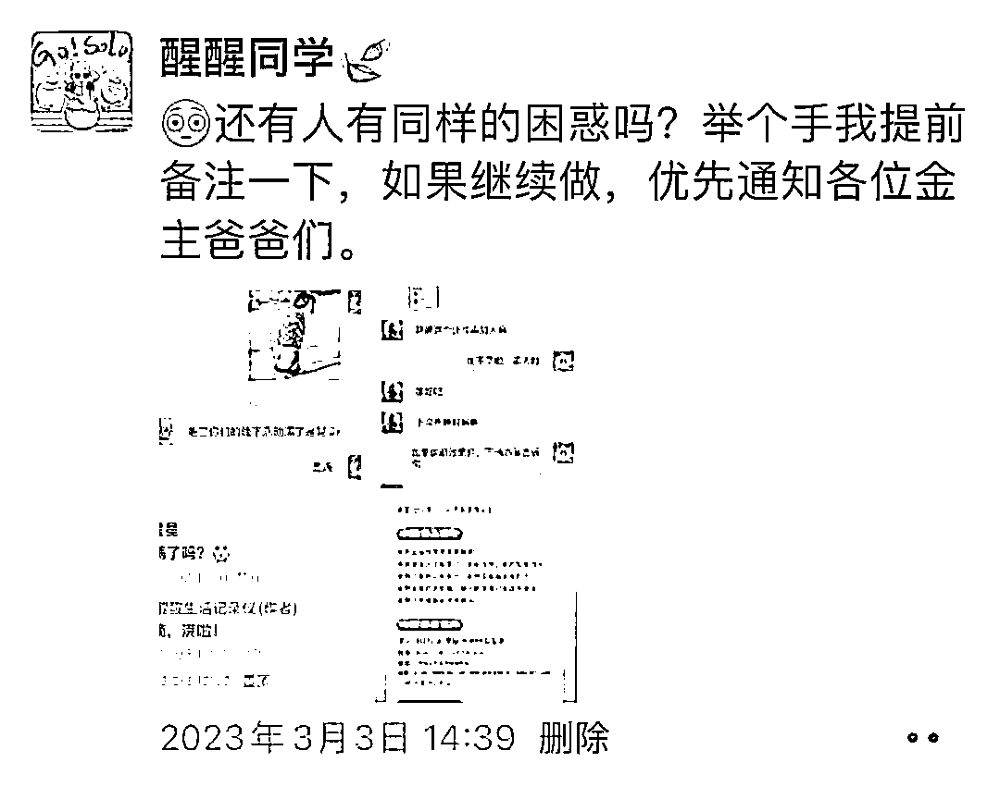

 

 

还有这种报满后有人要加位置的，也可以在朋友圈询问，这样无论是增加报名人数还是锁定目前人数，都会让人知道这个活动还蛮多人参加的，也是表达对没报上名同学的重视。

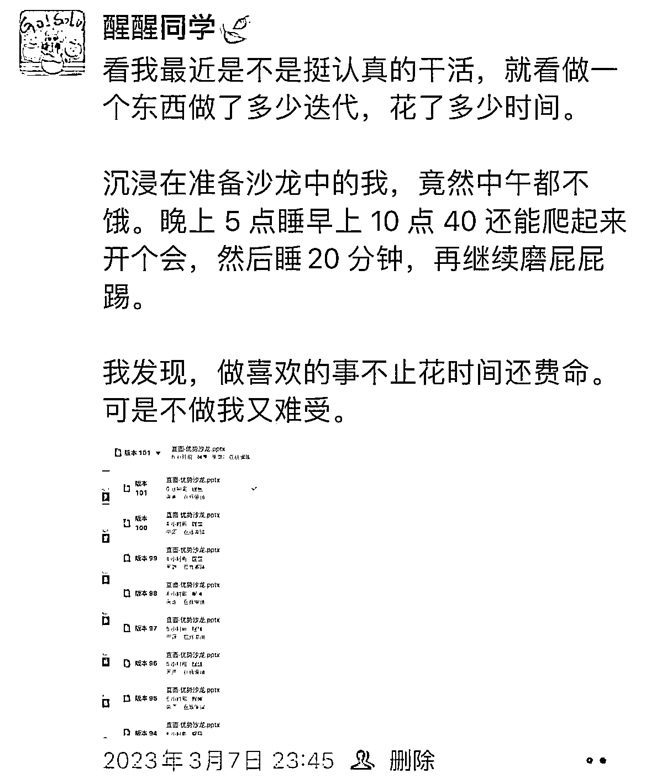

这是我改ppt后发的，当时有感而发。但也因为这些过程的披露，办活动当天我们还收到同行朋友送来的蛋糕，朋友送来的花。

 

 

这个世界有时候特别有意思，你发声就容易和他人相连，相连就会产生记忆和惊喜，带来意外惊喜。人和人的感情很多时候不能放在天平上称，当交易产生还能不影响感情，一定是交易前就已经有感情了，顺其自然就成交了。

正式办活动的时候，也可以适当转播，让人看到阶段性成果。

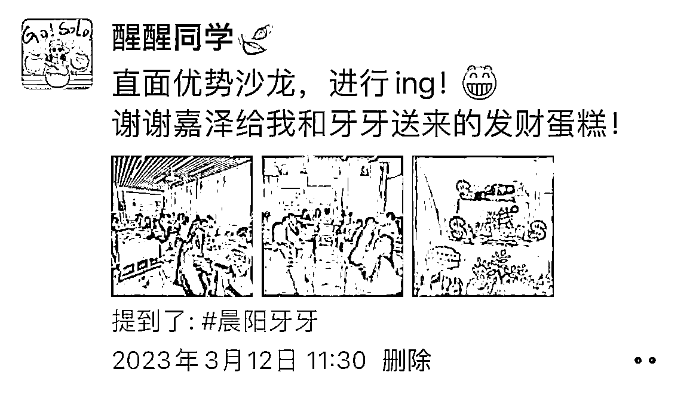

活动办完，最好能总结一下。总结的内容方向可以有：活动当天的感悟、活动复盘给其他人参考、用户反馈当宣传案例。

 

 

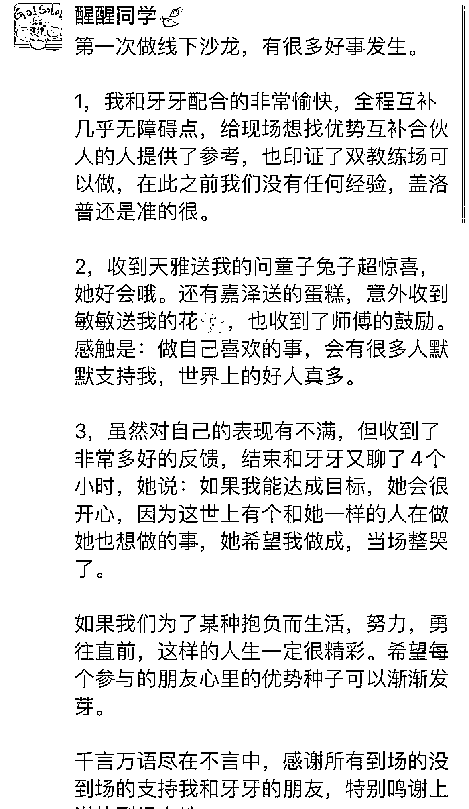

其他用户截图先不放了，这个朋友圈发出后又来了3个想报名线下的，并持续带来了专栏和咨询产品用户。后续决定尝试其他场次时，发了个朋友圈，几个小时报了15个人。在此之前我没做过线下活动，海报也是临时做的，但持续分享过程这件事帮助过我很多次。

业务类的朋友圈其实非常好发，你看啊，内容方向有：专业学习、咨询心得、用户案例、同行观察、职业价值观等。

高频且真实：

有句话说，如果我不能让你过目不忘，那我至少做到让你过目过目再过目然后记住我。

 

 

持续发60-80分的内容比单次100分更有持续力。如果觉得写得不好就不发，总想憋出100分再发，其实没多少震撼力，200分才是震撼力但难度很高。如果长期写，有几个80-90分，就能被人记住。持续分享有价值的内容，给对的人和更多对的人，赚钱就是大概率事件。

有人可能不知道去哪整那么多分享内容，分享一招，去知乎或有对应用户的社群里和用户交流，帮他们解决问题后写成案例。或去观察同行的文章，把有共鸣的观点拎出来自己写，当你有灵感时，一定要立刻去写，不要想太多限制，打动人这件事真的蛮需要情感共振的。

 

 

比如前天我坐飞机时琢磨和朋友交流的话题，下飞机后写了一条朋友圈：

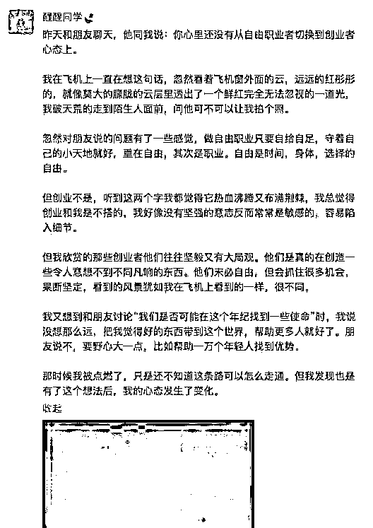

这条朋友圈有几十个点赞还有评论，其中有人说“看得热血沸腾”、“这是一条可以写进自传的朋友圈。随喜赞叹”，以及“股东报道”，睡醒后我收到了一个咨询转账。

我不敢说这笔转账和这个朋友圈有没有关系，但多多少少和长期的分享有关系，当你真的发自真心要做一件事，文字里体现出这股力量和真诚，就是会很多人被打动。

 

 

如果还是担心没有内容写，可以考虑用一些数据工具，比如极客增长，5118之类的，搜和你产品有关的关键词，搜索量大的选题，就是可以写的。我最野的时候，曾试过写两版文案，问用户哪个会更心动，或者让人帮我想怎么提高转化率，都是在朋友圈讨论的。聊着聊着有人甚至会帮我去转介绍。

我想说的真实也在这，做宣传可以用一些技巧，但不要藏着掖着，有时候真实一点用户反而接受。就像那种：我现在要参加一个7天万元销售挑战赛，在朋友圈卖xxx，希望大家多给我建议反馈的活动不止不让人烦，有时候还能得到支持。这就说明卖东西本身不是槽点，让人讨厌的语言才是。

真实的案例：

案例是朋友圈里不可缺少的，我大概每周都能产出案例，和大家分享我的做法。一般我做咨询会顺手截图存在flomo里，会在问卷里单独设置一个模块问用户，假如我分享他们案例到朋友圈，他们介意不？（目前大多选的不介意，毕竟是帮他们发现优势，也说不出啥不好听的话哈哈）

那么，任何一个case或聊天记录都能总结成内容，例如：

 

 

这个是用户还没做完咨询，刚刚找我预约完写的。用户在来到我们微信里的每个阶段，只要和我们的产品有契合点，都是可以写的。并不是只有用户赚到钱或完成服务了才能写。万物皆素材。

 

 

 

 

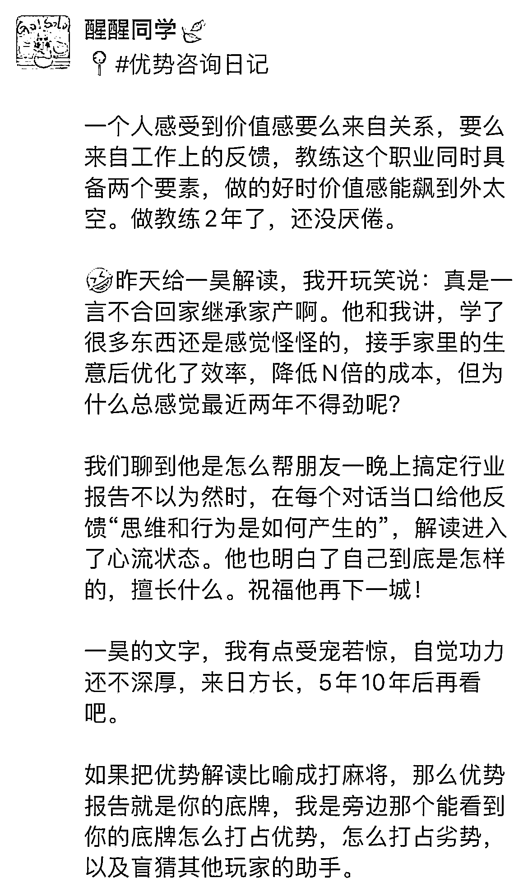

这个是解读完写的观察，配图是对方的反馈，这个写完也为我带来了新的客户。有时候呢我们做业务，说很多的话都不如相似的用户买家秀。所以发案例是真的重要，用户更懂用户，用户更能打动用户。

我一直还有个观点，任何一个靠内容谋生的人，是在替和你一样但沉默的一群人发声，你的胆怯、勇敢、改变、纠结等等，变成文字时，就等同于帮她们发声。

（当然一定要授权后发哈）

多角度观点：

其实发多了客户案例，别人看着可能也腻了，会觉得你天天打广告，偶尔要变换身份、角度来分享内容，素材就来自案例。比如说你是做电商的，那么你不止可以发产品文案，还可以发对消费者的观察，对其他同行对观察，以及自己工作的心得等等，这样你 

 

整个人就立体了，能覆盖的人也广了。

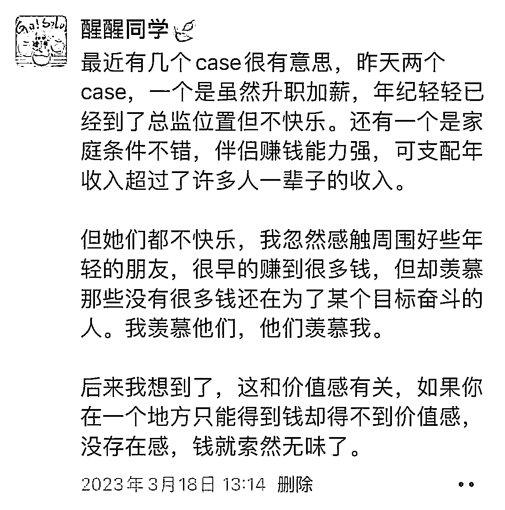

这个是结合几个案例做的总结case，有人会开始互动，讨论价值感是什么，讨论这些富婆和我们的区别等等，这些日常的讨论是不断加深关系的加分点。

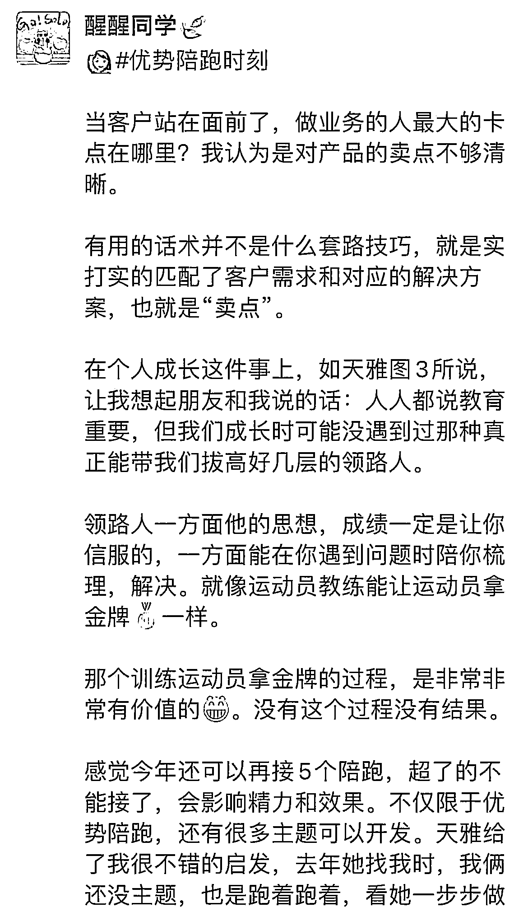

 

 

这条朋友圈是以教练身份看教练价值的内容，结合了个人成长销售卡点我的陪跑业务发的，后面有3个问陪跑服务的人，展现的是教练价值，最后再打广告。

很多人不怎么表达自己有什么业务，光是发表行业意见，这就降低了别人问单的概率，因为对方可能不知道你是有生意的。

 

 

三不原则：

关于朋友圈内容，我有“三不原则”也分享给大家

我2020年年底开始在公众号写作，后立下一年写100万字的flag的，从那以后朋友圈就经常练经常写，从一开始的99元/小时的咨询做到499元/小时，到2199元/小时，早期写的朋友圈我现在都不想看哈哈哈。

随着找我的人越来越多，我的客单价和产品数也提了上来，内容能力也有增长，几乎我每一个高客单价产品都是用户长期看我的内容然后找了我而推出的，第一个企业优势培训也来自生财有术团队，别提多激动了当时。

。

作为优势教练也观察过不少人的文字，观察下来，每个人的写作风格、写作习惯都和个人的天赋点很相关。你会看到有的人的文字张扬外放，气势磅礴。有的人文字内敛含蓄，娓娓道来。有的人不擅长把文字写短，有的人不擅长把文字写长。

比如像我，盖洛普报告里体谅、个别、理念、思维才干都很靠前，纪律靠后，我写的内容流露情绪是天然的，写纯逻辑我是不行的，写对他人观察我是很容易的，让我每天固定写多少条就要我老命了，要我有灵感随时发是完全适合我的。和我的天赋报告很匹配。

观察了很多人后，我明白朋友圈的功能里如果主要是变现，那不管是什么风格，你必须找到自己的核心卖点，找到对应的人群并不断扩大这个基数。写作习惯没养成之前，给自己点时间观察自己什么情况下最能产出内容，养成习惯后要用一些工具辅助写作。

另外，当微信人数低于1000时，增加产品匹配的用户人数的重要性大于天天研究怎么发朋友圈。但不管人数到达多少，多写多研究都是正道。

我曾帮助很多同行或朋友打通了发朋友圈的卡点，总结起来就是一句话：持续分享有价值的内容，以和用户建立长期可信任关系为主，做长长久久的生意，让微信至少发挥出变现七位数的价值。一开始可能很难，但越到后面越有复利效果，直接反应在收入上。

长期经营长期迭代不急于一时，让自己的朋友圈像一本书一样，总能迎来自动化成交的朋友圈的，祝福每一位圈友。也非常感谢生财有术，感谢静伟找我分享，我第一次真正感受到朋友圈的巨大价值，就是从做生财有术418推广开始的，后来也成了我做教练商业化中必备的一环。野路子走到现在，还挺幸运的。

 

 

我的分享完事啦，接下来大家有任何问题都非常欢迎探讨，也可就任意素材，我们来探讨如何发圈。

评论区：

小女巫忻忻 : 醒醒总是能让不够清醒的人醒过来

佳丽 : 跟醒教练学习朋友圈打造~

鲸鱼🐳 : 醒醒牛逼🐮

诗农Hope : 醒教练，有点东西～

林深 : 醒醒子牛[啤酒]

董见一 : 醒醒太强了

觉迟 : 长期经营长期迭代，让朋友圈像一本书一样。学到了！

芷蓝 : 赞！朋友圈是私域的第一道门槛，作为超级个体，是一个占领用户心智的基础工具，设置好静默成交路径，赚钱翻倍～

# **# ****(**精华帖**)(146**赞**)**运营全靠大学生做到了生财

# 拉新** Top5 **的超详细拉新教程

作者：  七小

日期：2023-05-24

《说起来你可能不信，运营全靠大学生，我们居然做到了生财拉新Top5！（1.7W字超详细拉新教程）》

以往的万字长文，基本都是我自己肝出来的整合贴。这篇文章和往常不同，内容超长而且还不是整合帖，内容很干还不是我写的，本文全部除了我的尾言，其余1.7W字正文部分，全部都是由三位小助手完成的。  （大二）  （大二） @颂九  （大一）3月18号，我们这边第二轮拉新开始，而我又好巧不巧，赶上了封号，出去各种参与活动，然后炮爷和刀姐两位负责人也都忙的一批，管不了太多的事情... 三位负责人没有能重度参与，亲自下场搞的，所以咱们这边的第二轮拉新，就变成了负责人们遥控指挥+小助手们一起讨论自行发挥。

 

 

本来以为这样子做，这次拉新要凉凉了，出乎意料的是，小朋友们干的还不错，而且在实战中进步的飞快。在跌跌撞撞中，最终还算不错的把各种事情都办下来了。（我表示非常欣慰  哈哈哈）

这篇文章，是【刀姐X七小X炮爷】战队的一篇复盘贴，也可以作为生财拉新的一套SOP，里面有许多踩坑经验可以帮大家少走弯路，也有小朋友们犯错迭代的成长记录。

希望大家看完之后，能获得一些鼓舞，获得一些进步。  希望大家喜欢这篇文章  ：）  enjoy~

正文移步飞书：

七小微信：rickea150 （大号被限，此为备用号）  ，添加备注：  生财圈友公众号：七小的人生游戏攻略

https://mkfwp3u79v.feishu.cn/docx/AxfhdrDzKofG5Bxes2cclNNenub评论区：

坤霖 rex : 真优秀👍

彦肼 : 太牛了🐮🐮🐮

赵三金 : 太赞了 

Eve : 感恩参与[爱心]

叶叶_优势教练 : 太牛了！

枕棠 : 太牛了！！！！

无争 : 牛牛牛🐂

七哥个人品牌 : 突破成长

# 【个人** IP**】**8**篇

# **# ****(**精华帖**)(386**赞**)32 **万小红书博主的小红书涨

# 粉变现之路复盘

 

 

作者：  漫漫mansi

日期：2023-05-05

《32万小红书博主的小红书涨粉变现之路复盘》

Hello各位生财的小伙伴们大家好，我是新人漫漫，同时也是一位小红书32万粉的知识博主。

刚进入生财圈子发自我介绍大家就都说，让我赶紧多多介绍自己，多多输出干货，以后可以带大家航海呢哈哈哈

所以我这段时间先打磨了一个关于我小红书成长之路的复盘

算是一个关于我的自我介绍，和大家认识一下！

·

很多人都说，短视频的红利已经过去，

但随着越来越多大佬的入局、百度和小红书的合作开启，局中人却更清晰地认识到，小红书正是很多运营的终点，所以也是重点。

而IP未来将会是人最宝贵的生产资料之一。

·

我将自己的小红书复盘放在了飞书～请大家移步观看：

·

感谢  姐姐的指引，帮我改贴💗

希望在生财能连接到更多大佬互相交流～

我的复盘之路只摘取了几个重要节点，所以如果有不够详细的地方，大家多多评论问我，和大家一起讨论入场小红书的方法～

https://xtwwuii5ub.feishu.cn/docx/WX87d3F4SoVZLHxDNGzcDDVRn6R评论区：

梁靠谱 : 大佬！

一念 : 小红书最爱的博主！

梁靠谱 : 也是咱们战队的，不过你俩没在一个群哈哈哈

刘逍遥 : 学到了很多东西，真赞

Seven : 向你看齐

锦程 : 真棒[强]

 

 

老船长李阳 : 先评后看

佛山无影脚 : 向优秀学习

# **# ****(**精华帖**)(341**赞**)**无专业，无定位，无爱好的

# 全职妈妈，**20 **个月，变现** 170W+ **的经历分享

作者：  葫芦Mom｜金侣Ly*

日期：2022-09-21

生财圈友，大家好呀！

我是港妈金侣，2008年德国哥廷根大学硕士毕业，一直在外资公司老老实实工作。2020年9月因为孩子要在香港上小学，从宁波搬到香港成为全职妈妈。

不知当时脑子出了什么问题，竟然远程在香港租了一个月三万多房租的“千万豪宅”。一次性付了一年的房租后，也用完了我和老公的一半存款。

来到香港，没工作，成为全职妈妈；我先生也因为疫情，收入大大减少。经济问题是我家当时最大的矛盾。很多人说，钱不是万能的，可是我家当时的情况，因为没有钱，要散了。

2020年下半年，我非常想要赚钱, 一边尝试给各大香港公司投简历找工作，都石沉大海，快40岁的女人呀，真的找新工作好难好难；一边想要通过自认为的专业知识（芳香疗法）变现，可是赚的钱又太少，而且太慢，我的房租，我的每月生活开支太大。

2021年初，我放弃自己的精准专业定位，回归于一个没有专业，没有定位，没有兴趣的全职妈妈，从0开始在线上找副业。

 

 

用一年时间，考察了40多个各种各样的副业项目，自己亲自上手了参与了20份的副业，最终找到稳定的8份副业。

**2021**年**1**月到**2022**年**8**月的**20**个月里，我累计变现**170**万**+**。

就这样，我在香港高额的经济压力下，住在一个四室两厅的海景房里，同时还清了在宁波11年都没有还清了房贷。

 

 

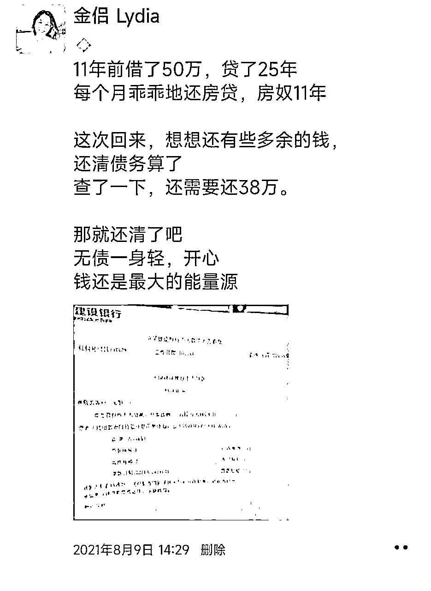

这次花了3天时间，全面梳理我的20个月副业起盘经验，也是自我复盘迭代的过程。

 

 

阅读全文内容预计花费15分钟。希望圈友们有几分收获和启发更好，如果没有，全当看故事吧。

内容框架：

**1. **我来到了香港，成为全职妈妈。

**2. **我都做了哪些副业？分别赚了多少钱？是用什么方式赚的？

**3. **普通人启动副业的**3**大基础。

**4. **没有专业，没有技能的普通宝妈适合做哪些副业？

# **—— Part 1 —— **

# 我是一位全职妈妈

 

 

2年前，我生活在浙江宁波，是一位在职场工作了12年的普通白领。

2020年９月份，为了孩子拥有更多元化的教育，同时也希望他可以在相对轻松的教育环境里学习生活。我们全家通过香港优才引进计划来到香港，而我也辞掉了工作，成为没有经济来源的全职妈妈。

到了香港后，我一边在**linkedin(**领英)上投简历，找寻职场工作机会；一边尝试通过个人品牌打造一些线上知识付费课程。

当时我定位的知识付费方向是芳香疗法。

我从2016年开始学习芳香疗法的专业知识，做过上百场全国各地的小型芳疗沙龙，拥有国内外多个权威证书，是国际认证芳疗师，还在宁波电视台上讲解过芳香疗法的知识。

我期望把线下课程改转成线上，打磨专业的芳疗线上训练营，或是精品录制课程。

# **# **一、开启知识付费之路

就这样，我先花了2个月时间，在荔枝微课上，录制了《家庭芳疗护理师的60个配方》的课程。课程录制后，却发现根本没有任何陌生用户购买我的课程。

 

 

 

 

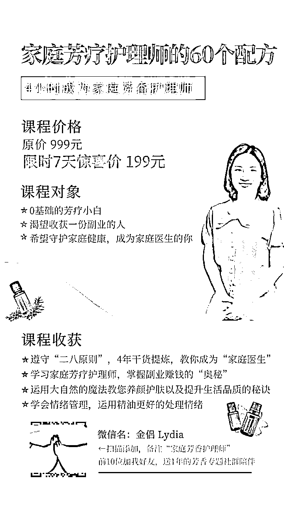

 

 

我就想通过在视频号平台上，输出专业的芳疗内容引流到私域。就这样，又搞了2个月，前前后后，费时费力地生产好内容，期望可以获得源源不断的用户，拼尽全力搞流量，可是也没有非常大的效果。

一下子，我受到了打击，同时对自己的能力，对前进的方向，产生怀疑，也对未来越来越迷茫和无助。

 

 

 

 

 

 

现在想想，当时的我陷入一个致命的线上变现误区。就是我在闭门造车，没有学习，没有向上寻求专业的帮助，而是靠自己原本狭隘的认知，去努力地解决出现的问题，却又陷入一个又一个的困境。

# **# **二、一度迷失了自己

到了2020的12月份，全港中小学因为香港的第四波疫情停课，孩子只能全天呆在家里，而我对自己未来的变现之路，也越来越迷茫。

 

 

我们母子二人，每天睡觉睡到自然醒，起床吃饭后各玩各的。我躺在床上看看小说和连续剧，孩子自己画画和玩，可是不知道为什么这样相互不打扰，并且毫无压力的情况下，亲子关系却没有变得更融洽。

圣诞节前夕的一天，我在看小说，孩子在画画，

他问我：“妈妈，你能在边上陪着我画画吗？”

我说：“我现在不是在沙发上坐着陪你吗？”

我不理他，孩子在家里一遍又一遍地大叫：“你能别看手机吗？就坐到我的边上来看着我吗？”

不知为什么，我心里特别生气，我觉得孩子不理解我，我在沙发上看手机，不是也是陪在他的身边吗？为什么一点点小事而大叫呢？

我觉得自己孩子的个性非常自私偏激，心里的火越烧越旺，在他大叫地时候，我走过去狠狠地打了他一把掌，并恶狠狠地盯着他说：“你不能好好说话吗？你再叫，我就再打你。”

这是他出生以来，我唯一一次打他，孩子瞬间非常非常伤心地大哭，露出了很害怕的眼神。

就在那一刹那间，我意识到了：我无法理智控制我的情绪。

这已经不是原本正能量，善于规划的我。看到每天一笔笔生活开支，却没有任何破解之道，让我陷入高消费的焦虑中。我只能用表面的平静来掩饰内心的不安，然而一点点小事就可能引发我情绪的失控。这既伤害了我，又伤害了我最爱的孩子。

 

 

全职妈妈，如果在周而复始的生活里，渐渐迷失了自己，找不到生活的意义，情绪也会失衡。因为孩子，我成为全职妈妈，是希望带给他更好的教育和家庭环境，而现在情绪失衡的我，显然不能。

 

 

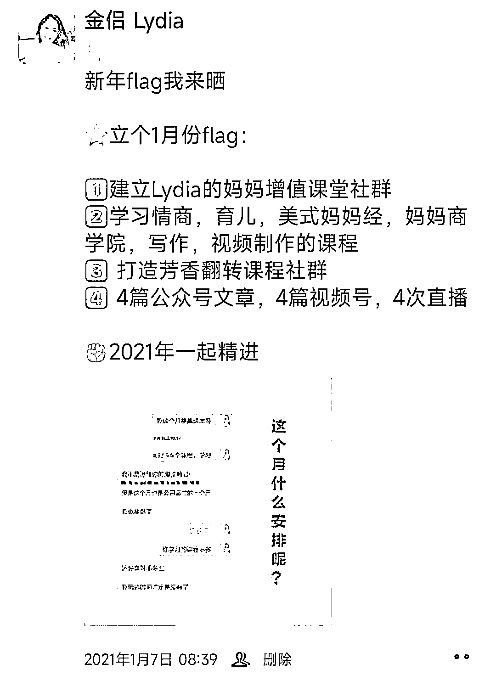

**“**靠自己不行，那我试试付费学习，跟着别人从**0**开始。**”**

 

 

2021年1月，我报名了9个线上课程，建立了妈妈增值的微信社群，通过输出的方式倒逼自己输入知识，而这也是我的线上副业的正式启航，同时现在回头看，也是正确的一步，就是学习。

普通人比大咖有的优势是什么？比专业，比资源，比能力，比技术，比经验，我们真的都不行。

那能弯道超车的优势是什么，我觉得就是时间。

用更多的时间去学习，提升自己的技能，尝试大咖或是厉害的人没有时间赚的小钱，夹缝里总会有些闪闪星光。

# ** —— Part 2 ——**

# 我都做了哪些副业？分别赚了多少钱？

# 是用什么方式赚的？

 

 

我的副业集中在下面3种副业模式里：

第一种模式：平台合作型副业（多特瑞，群买买，妈妈不烦）

第二种模式：技能服务型副业（国际采购，香港资源，平台兼职）

第三种模式：自主运营型副业（付费社群，训练营，荔枝微课）

# **# **第一种模式：平台合作型副业

身边借助平台来开启副业的人特别多，这个也是小白最容易入门的副业类型，包含了实体的产品，或者是知识付费课程。

能赚到钱的核心，就是通过你的流量和销售能力拿推广佣金。

# **1.1 **多特瑞精油推广

2016年，我接触到的第一份副业，是推广一个美国的精油品牌-多特瑞。

 

 

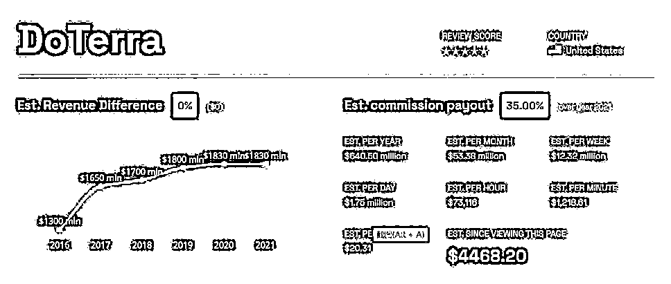

当时的模式，主要还是以线下的讲座，沙龙的场景，推广用户购买精油，同时提供后续的服务。

这是一个直销公司，会员制模式。虽然开发新客户比较难，但是老用户的复购率还是不错的，现在对我来说，这是一份低管道收入。

这个副业，一直持续到现在，前几年基本上每年都会有20万左右的收入（包括销售精油产品的佣金和芳香疗法的认证课程）。

但是疫情后，线下活动减少，同时我在2020年9月搬到香港，目前收入减少4到5万一年。

副业建议：直销产品以保健品，美妆和减肥代餐类为主，推广底层逻辑是，学习，体验，分享，事业。

所以刚开始进入这个行业，就是需要大量的学习，同时要自购产品体验，有了自己的用户见证，才能更好地推广给周围的朋友，另外需要提升自己的专业能力，分享的人多了，收益高了，再开启自己的事业，或是全职。

 

 

存量时代，好产品泛滥，直销类好产品的优势不再大了，推广难度会比以前大。但是如果推广的产品，有你本身的个人经历见证，很有说服力，同时你也希望长期学习这个方向的知识，还是值得尝试的。

# **1.2 **社交电商** - **群买买

去年8月份，我开始搞社交电商 - 群买买。这是一个0风险0投入的社交分享型副业。我用一些零碎时间的推广，到目前为止，也赚了7万4左右收益。

 

 

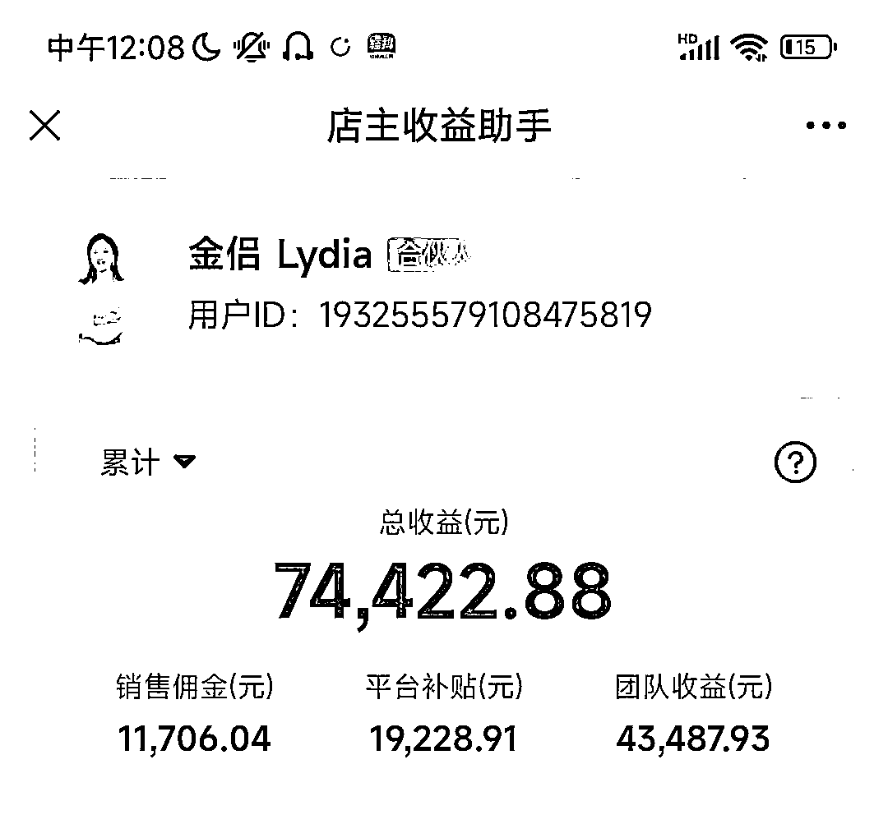

副业建议：社交电商与微商相比，它**0**投入，**0**风险，同时产品线大而全，类似于一个超级市场。

从事这个类型的副业，需要稳定而持续的流量获取能力，和选品能力，这绝对是一个大浪淘沙的项目。99%的自用用户+1%推广分享者。0门槛，同时不需要太强的私域技能，没有太高沉默成本的副业项目。

# **1.3 **妈妈不烦平台

 

 

妈妈不烦是一家女性商业教育的平台，有50万付费女性用户。

这也是去年1月份，我报名9个付费课程之一。

在这里，我学会了私域变现的几大能力（短视频直播，社群运营，顾问式销售），也推广这个课程给超过500位身边的女性朋友，获得了近38万的收益。

 

 

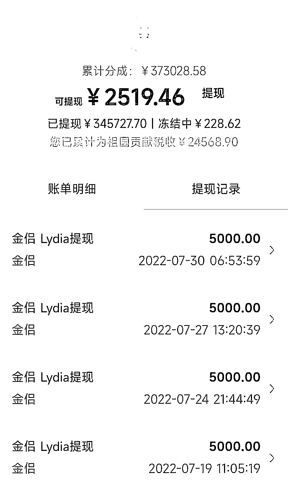

 

 

副业建议：在私域里推广知识付费的课程，本质还是靠你自己去吸引别人。别人先认可你，信任你，进而选择你推荐的课程，所以你的人设，你的收获与你推广的课程匹配度非常重要。

只有自己通过付费课程本身的知识或是技能获益后，再推广，才会更有说服力。

总体来说，所有平台合作型的副业，我们提供的是交换价值。产品和服务是别人的，我们通过转化流量，从而赚取收入。

# **# **第二种模式：技能服务型副业

这类的副业，核心是用你的时间或是技能为他人提供服务，从而得到的劳动报酬。目前技能服务型副业，我从事主要是分三块收入：

# **2.1 **香港资源

因为香港疫情，原来很多常来香港购物的朋友，无法入境香港购物，同时香港的很多产品都大打折，就这样我开启了香港代购。

 

 

这算是我来香港后的第一份线上副业，给我带来了近10万的收入。

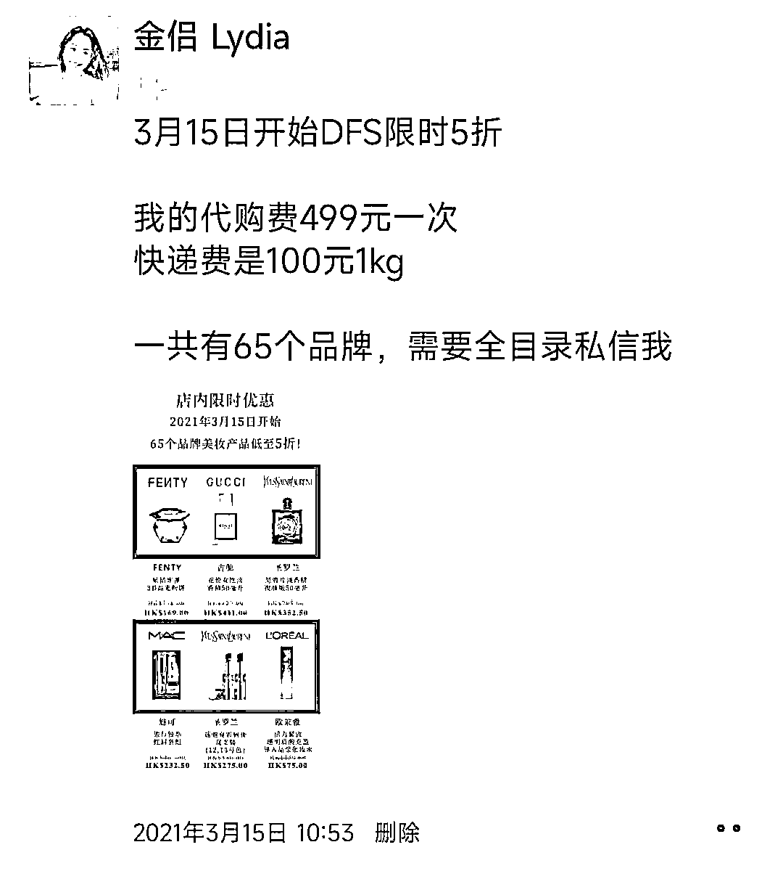

我同时也在学习香港保验、海外教育、移民、医疗板块的相关知识。虽然没有正式开始变现项目，但是也积累了很多用户的需求。这类的副业，虽然是提供服务，本质还是信息差+地域差+人脉。

 

 

副业建议：平时可以跨行业多接触各种信息，通过地域差，信息差，找到为他人提供价值的机会。

 

 

 

 

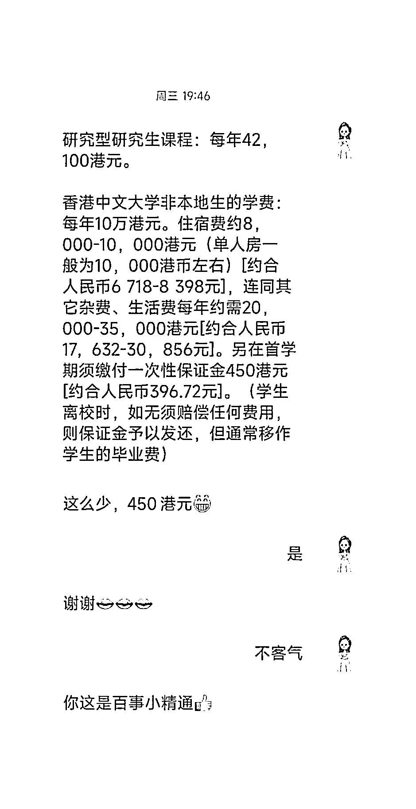

# ** 2.2 **采购技能

从自己原本有的经验和能力出发，找到一些采购兼职工作，这部分的收入，可能不稳定，所以不断地寻求新的机会，同时兼职多家公司，可以弥补这部分的不稳定。

工作的方向是以项目方式接单，拿佣金或是咨询费，时间比较自由。我核心采购的行业是宠物用品和户外家具，今年开始搞美国电子芯片。

目前这部分收入占到我总收入的一半以上。总体来说，能接到公司服务类的工作机会，报酬还是很可观。

 

 

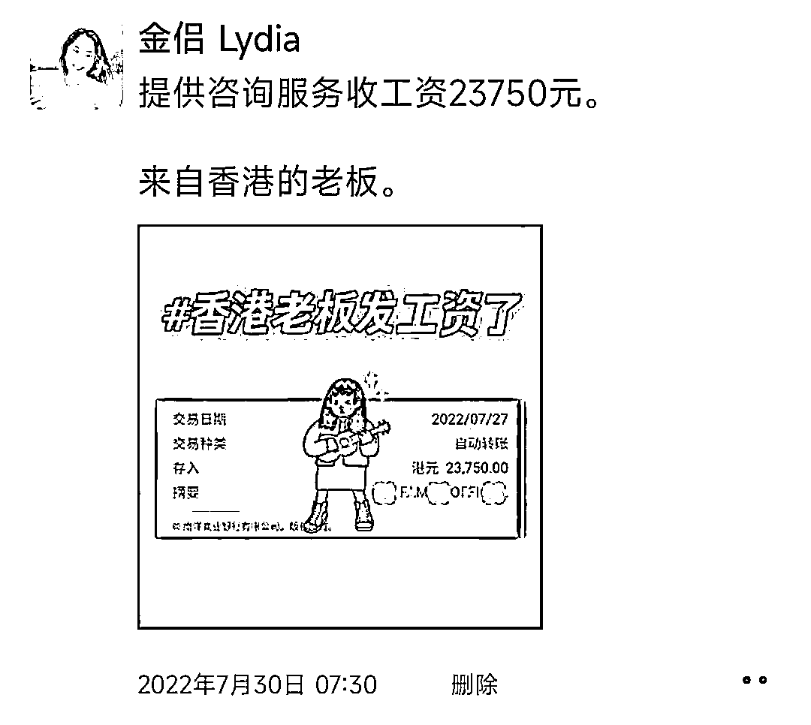

 

 

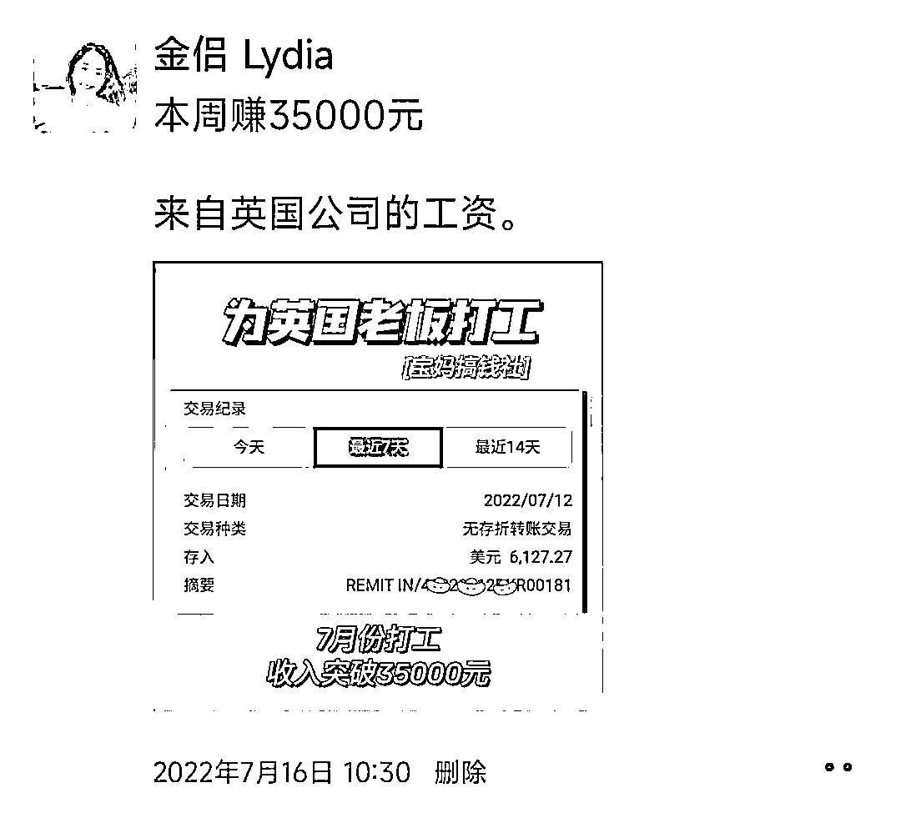

 

 

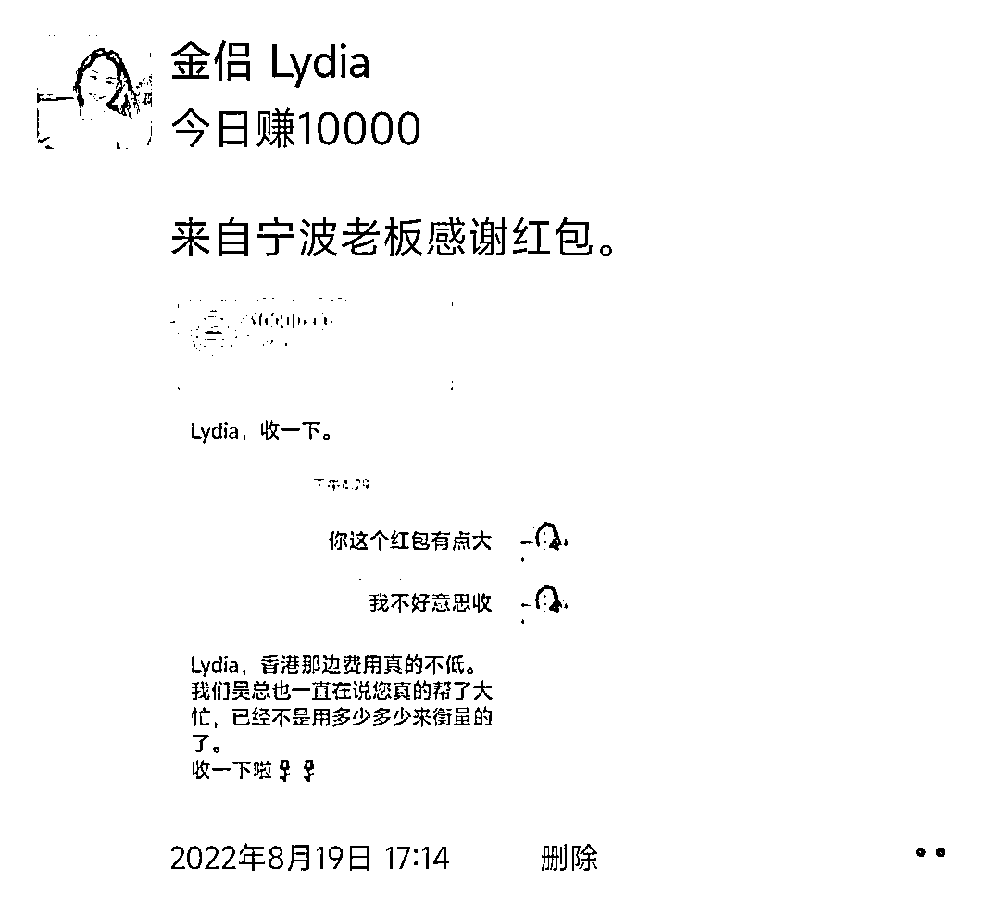

虽然我来到香港，没有了全职工作，但是我以前工作能力和经验，还是在的。即使是兼职工作，我也会把每一个老板布置的每一项工作任务都做透，做实。所谓“近者悦，远者来”，我的工作机会就是这样，一个老板介绍另一个。

副业建议：这类工作应该可以算是一种兼职，需要基本的工作能力。比如：做事要，耐心、有条理、不抱怨；沟通方面要，主动积极，逻辑清晰，能站在对方的角度想问题。

更重要，就是靠谱，成为一个靠谱的人，从长远看，会给你带来人品红利。

 

 

# **2.3 **平台兼职

很多线上知识付费的平台，我们参加课程学习后，除了推广课程外，平台内部也会提供一些有报酬的工作机会，比如常见的社群运营官，主播，私域操盘手，课程咨询服务，助教等。

我从去年10月开始在一家女性商学院里，参与平台里的课程咨询服务工作，帮助一些对未来迷茫的女性提供咨询服务，变现了2万元。

 

 

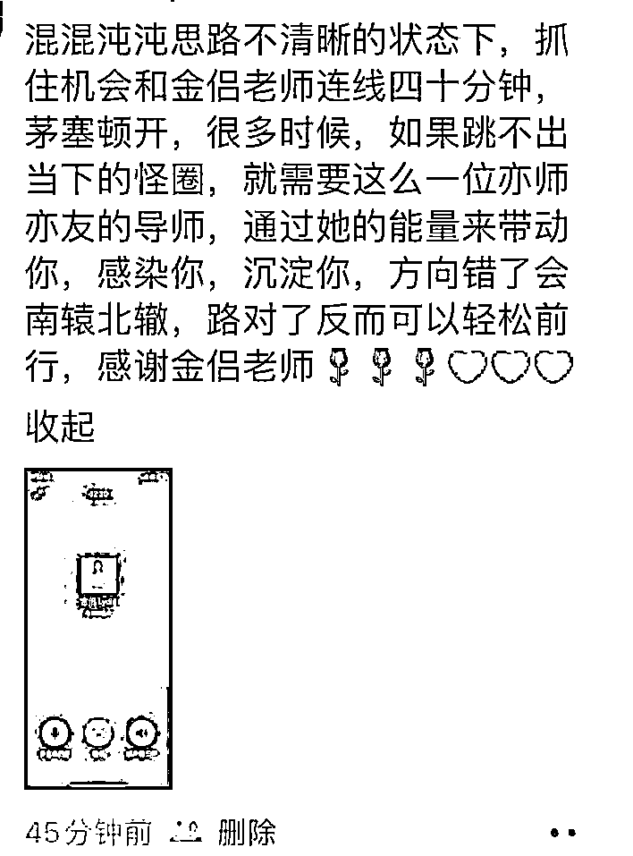

 

 

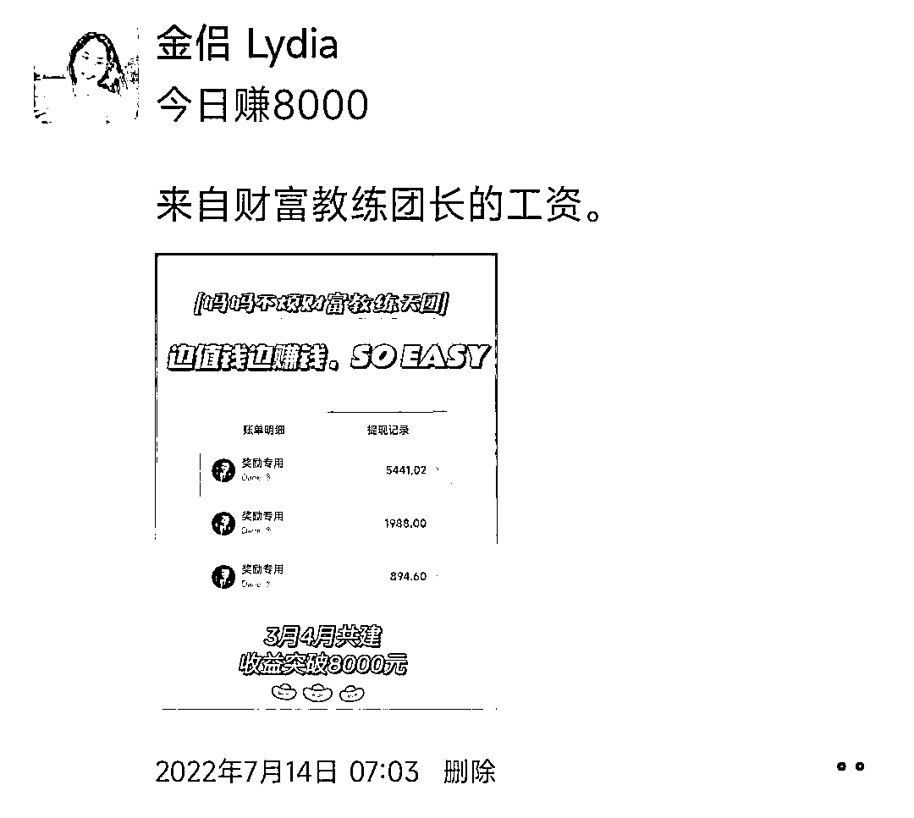

副业建议：在知识付费平台里的兼职工作，赚钱可能不是很多，但是能最直接了解平台运营的模式，也能在工作中，通过输出更好地输入和吸收知识，快速提升自己能力，所谓“先值钱，再赚钱”。

# **# **第三种模式：自运营型副业

 

 

这种类型也谈不上是副业了，可以说是个体创业。因此，难度相比模式一和模式二，都要大。

一个人要打造一家自运营公司，产品，流量，销售，服务都是一个人来运营。

我最开始希望通过芳香疗法专业变现，就是自运营型的个体创业。但是我对线上变现没有全局的商业思维，单靠自己固有认知去行动，没有拿到预期的正面反馈，而迷失了方向。

后续学习后，为了快速变现，我转变了思路，从现有的用户出发，靠近用户，发现用户的多种需要，打造她们需要的产品或是课程。

意思就是，我准备了多种工具（能解决用户不同需求的产品或课程），看见钉子就拿锤子，看见西瓜就拿菜刀，脱离锤子思维，那我的变现路径就更多元化，同时变现速度加快，缓解了我的经历压力。

补充：什么是锤子思维？

它的意思是，当我们大脑里面只有一种思维或者工具或者方法时，我们做任何事都会用这种思维或者工具或者方法来解决和分析。  在我看来，从变现角度出发，就是觉得变现的产品和课程非常单一，不愿意改变。

当我改变思维后，会非常快速启动多个知识付费的小课，找到适合我的最小的变现闭环。

 

 

比如，面部塑形的训练营，面部瑜伽俱乐部，7天小白赚钱班，妈妈医生小课堂，女性增值社群，21天生命故事写作营，副业项目拆解年度会员，闺蜜星球，视频号启动营等等。

 

 

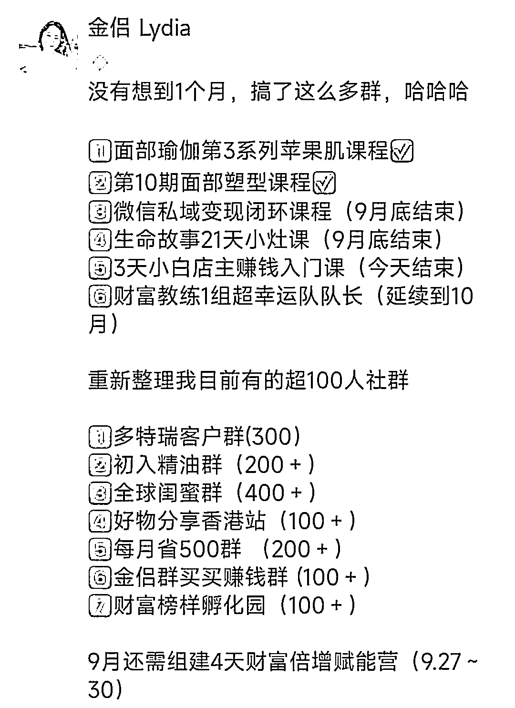

其中面部塑形的训练营，我从报名她人的课程，听课不到3天的时间，我同步启动我自己的课程招募，边学边教。这个训练营，我做了13期，每个月都招募一期。

 

 

大部分的训练营基本都是在365元到899元间，2-3个知识付费的课程同步运作，基本上都是我自己独立运用。有时忙不过来，就招一个助理，也给我带来了30万的收益。

一般的模式，就是荔枝微课，一对一指导，社群答疑，还有每日腾讯会议教学。训练营每次招募20个人左右一班。

副业建议：这类的副业，你不需要太专业才开始，而核心就是用户需求（变美，变有健康，变有钱），在你的服务和课程上给出客户到愿意承担的价格，然后用心对待每一个用户，精耕细作课程，小步快跑，快速迭代。

缺点就是需要投入大量的时间和精力，同时大部分的付费课程没有复利性。

# ** —— Part 3 ——**

# 启动副业的**3**大基础

 

 

# **# **一、用**“**爱**”**找到你的驱动力

在亦仁的收藏夹里，他分享过《人生有两种驱动力》，一种是vision（愿景），一种是pain（痛苦）。

他说：“能做到vision driven的很少，但适合pain driven的人很多；大多数人因为有痛苦，而改变。” 对来我说，**“**爱**”**或是**“**恐惧**”**就是我的原始驱动力。

 

 

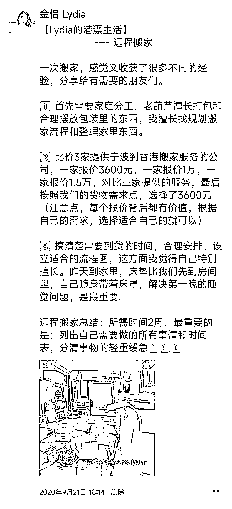

 

 

因为对孩子的爱，驱动我从宁波搬到香港，辞职成为全职妈妈；而来到香港后，我又因为对未来经济上的恐惧，不得不开启线上副业。若没有爱与恐惧的驱动，不会有今天的局面，我可能一辈子就是一个生活在宁波，拿着死工资的职场人。

现在，我在多副业项目里拼搏着，也是希望通过自己努力，少一点对未来的恐惧，多一些人生的把控权，维持自己有“爱”的生活。

我遇到过很多宝妈，想搞副业，但是没有多久就放弃了，大部分是驱动力不足。看到别人赚钱，也想试试，做了一阵子，效果不如预期，就放弃了。

在尝试开启副业之前，一定要想清楚，自己为什么要开始？你做这件事，到底是为了“爱”还是“恐惧”，是“痛苦”还是“愿景”。比如，当渴望让孩子过更好地生活或是教育时，“母爱”的驱动力真的很强。

 

 

# **# **二、用**“**驱动力**”**开启你的改变

开启副业，最难的内心卡点，就是要不断地突破舒适圈，因为改变就是一种特别反人性的行为。比如：

身份改变：16年7月份，我开始搞副业，做精油推广。一个在温开水里呆了10年的外资白领变成精油的推销员，遇到过无数次的不理解和嘲讽。我的父母也跟我说，你搞这些“偷偷的”，千万别推广给家里亲戚，太丢脸了。

学习卡点：为了要更好地推销产品，唯有变得更专业。就这样，我又不得不学习医学、健康管理、植物学等等多门学科。白天上班，晚上管孩子，空余的时间，都在学习，而我又是一个特别不爱学习的人。

回望这些年我的同龄人，大多数人有了稳定的工作，没有经济顾虑，呆在舒适圈。要突破舒适圈的核心，还是在于内心的笃定和驱动力，所以请不断地加强你的驱动力， 

 

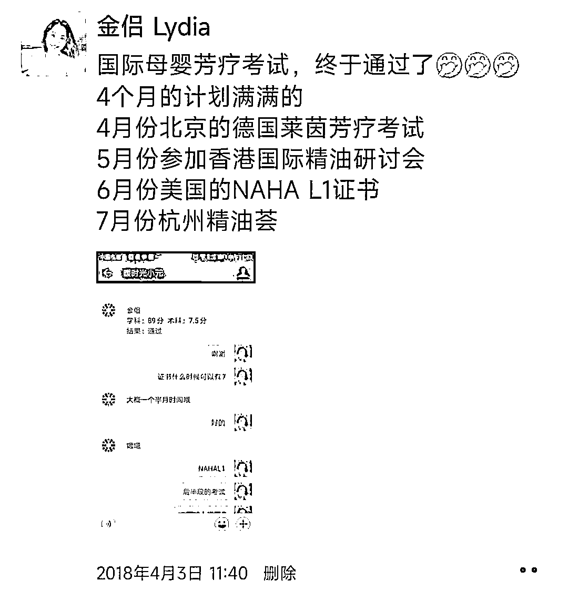

# **# **三、用**“**真诚**”**和**“**互惠**”**打通信任

线上副业最大的难点，就是你与陌生人之间产生信任，进而建立互惠关系。

 

 

获得流量，其实不难，最笨的方式，就是像我一样，在各种微信群里加人。我就是去年1月开始，报名各种付费课程，1月份报名达到了9个。之后，我的私域流量每个月以300-400人速度上涨，6月份6000人左右，现在有近7000人。

 

 

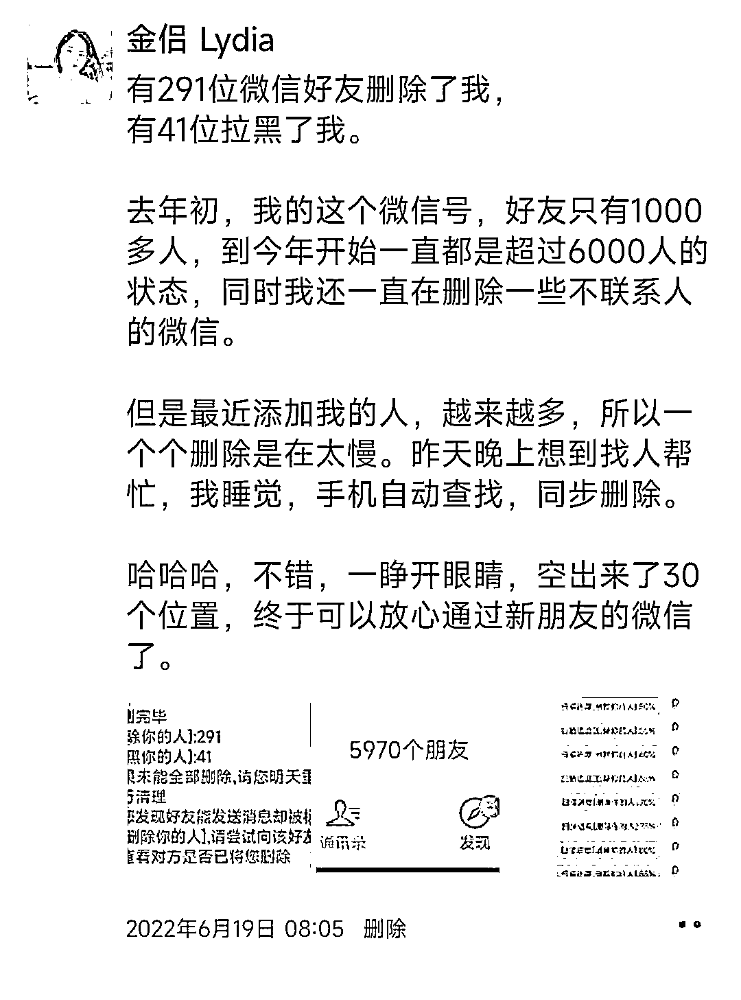

我们进入微信群后，想要扩充流量，都会添加社群里新朋友的微信。通过后，很多人会发个人介绍，主要是写明自己能提供的价值。

 

 

但是如果你是一个普通人，真心很难让新朋友通过你的个人介绍，能与你产生有信任度的链接。而信任又是私域副业变现的核心，我的方法就是是真诚和互惠。

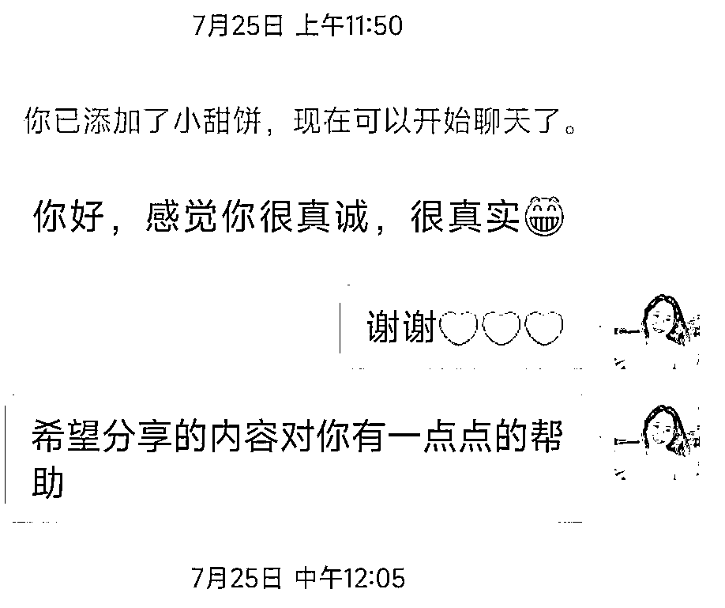

大家有没有听过一个水牛和“黑卷尾”的小鸟的故事？

水牛在河边慢悠悠的觅食，甩着尾巴驱赶身上的小虫子和苍蝇，有一种学名“黑卷尾”的小鸟喜欢停留在牛身上，以牛身上的各种小虫为食，累了就停在牛背上歇息。

 

 

牛能感觉到身上有小鸟，但是并不反感，甚至很喜欢小鸟停在它们身上，不仅可以吃掉牛身上的虫子，还时不时帮牛挠挠痒痒。就这样，黑卷尾和水牛之间形成了和谐的相互依附关系。

自然界中和谐的共处，为我们提供了典型的互惠原理案例。

牛和小鸟之间从各自身上得到好处而和谐共处，这也是人类文化中最有效的影响力武器之一：“互惠及其亏欠还债感”。

找到一些高质量的社群，比如生财有术，成为航海志愿者，真诚地为大家服务，这就是为信任建立打开了的门。

不要总想着自己的变现项目，目地性太强地与他人链接，而是链接后，真诚点，没有目的，只是纯粹地交友，就像小鸟与小牛一样，真诚地建立互惠关系。

 

 

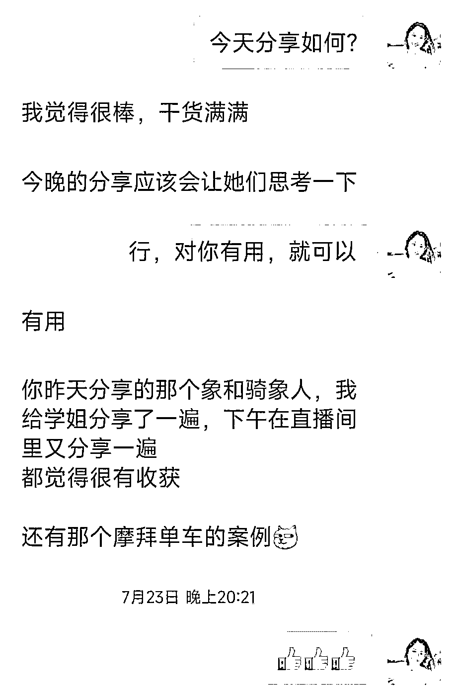

 

 

总结：内驱力的核心就是找到内心的**“WHY”**，当**"WHY"**足够强大，你才拥有了改变的动力，去一步步地突破舒适圈，这两个基是内因。

而对外来说，人与人之间，真诚是打开一切的捷径，而没有任何的捷径可以通向真诚。我自己就是这样，真诚地打开链接力，不断地与他人建立互惠体系，后续再根据客户的需要找到副业项目，变现路径越来清晰，越来越多样化。

# ** —— Part 4 ——**

# 普通女性适合做哪些副业？

没有专业，没有兴趣，也没有经验的普通女性在赚钱路上，首要明白自己在这一段时间里，想要做的是创业，主业，副业，还是兼职。

 

 

因为你对赚钱项目的定位不同，所花的时间和精力不同，预期会不同，最终的结果也是不同的。

比如我，刚开始在香港的时候，我特别缺钱，想要快速变现，那最快的变现方式，就是找一份稳定工作的主业。

当主业找不到的时候，我想通过芳香疗法的付费课程变现，那其实是一个个体创业之路。但是我是希望陌生流量快速变现，就是做好芳疗录播课程后，能马上有一批用户下单，就是这样预期判断不准确，才导致后面失望和迷茫。

后面我快速调整，我走的路线就是就是无专业的兼职和副业。

如果你类似于我去年的情况，就不要太多的考虑你的兴趣，你的情怀，你的优势，你的定位或是长远行业发展，而着眼于你现有可以触及的用户，从用户需求里找变现可能性，找到你可以操作的信息差。

我就从知识付费，流量变现，和提供服务三种适合普通女性开启的副业类型，给大家拆解一下，我的副业启动方式。

# **# **一、** **知识付费** - **边学边教模式

去年线上芳疗课程变现不了，我看到朋友圈里有一个老师在教面部塑性线上课程，我就报名学习。

 

 

学习3天后，我发现这个课程，也特别适合我朋友圈里的用户。这是因为我自己本身是芳疗师，所以微信里有很多喜欢自然疗法的女性。

所以我就开始朋友圈每日打卡，通过自己的亲身见证，让用户看到我的变化。

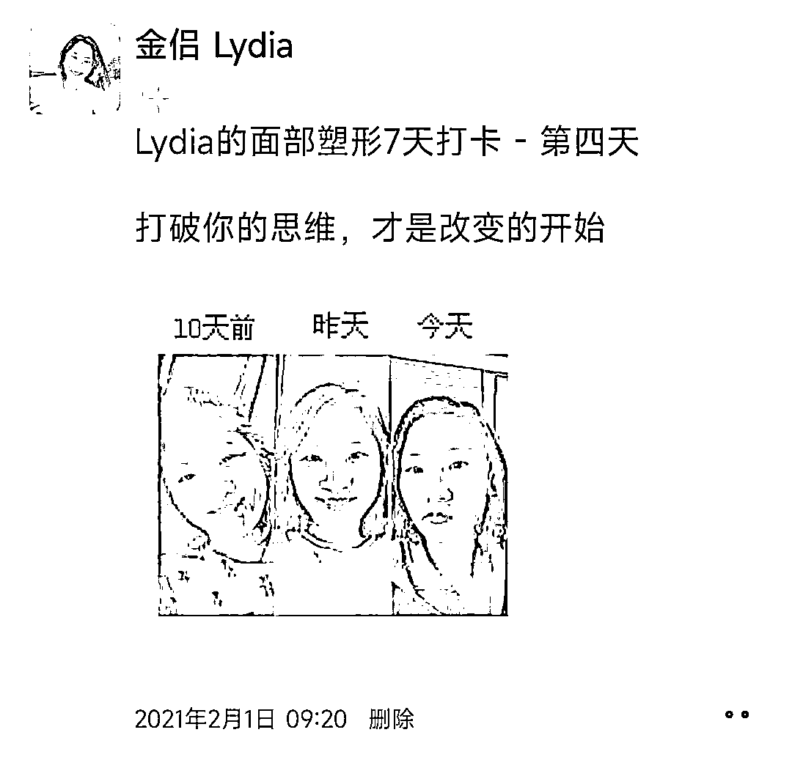

 

 

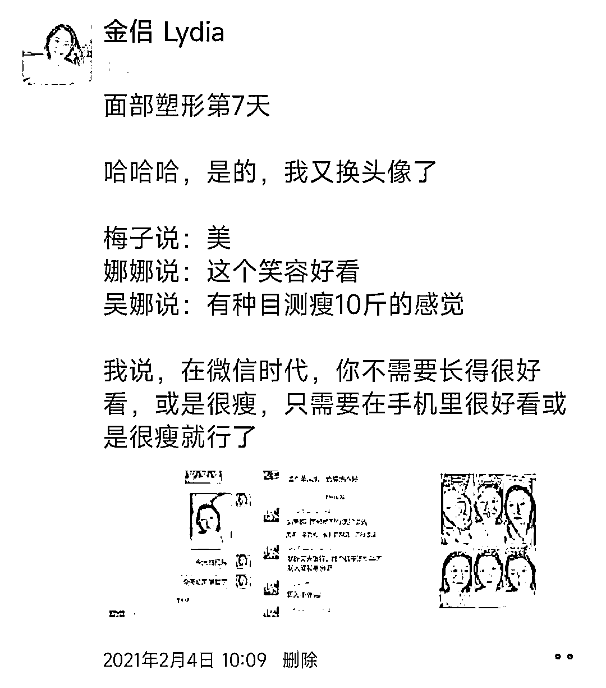

 

 

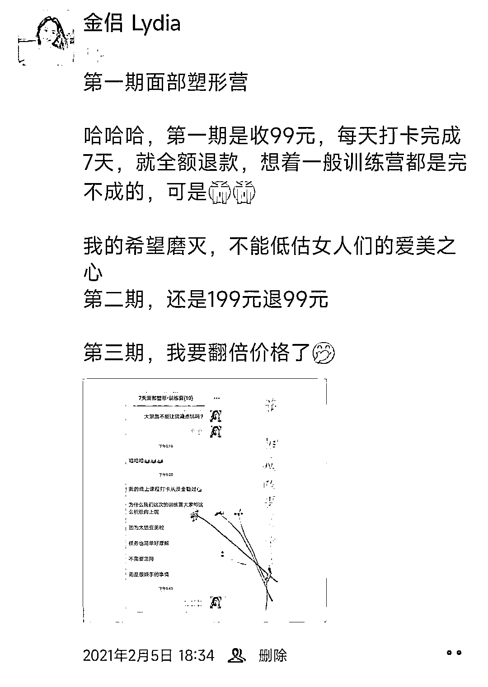

 

 

这种知识付费的边学边教变现，是很多普通人就可以尝试的，但是开始变现，需要突破两大心理卡点：

**1. **在私域里，都是信任自己的朋友，很多人不好意思向朋友开口谈钱。

**1. **

那我们首先可以反问自己，为什么你要把自己知识和经验分享给你信任的朋友？一定是因为这个知识的本身对朋友是有价值的。

而我们要明白，付费是一种筛选的过程，所以朋友圈里定价自己的，对这个课程有兴趣的朋友圈自动会报名。另外，付费才会让自己和用户更加重视，而双方都重视，效果才会更好。

**2. **就是觉得自己目前的水平，还不够高，对自我提供的价值不肯定。

我知识付费的开启模式，就是99元打卡返现，后续一期一期涨价。当自己的水平不够，可以通过打卡返现的方式，找到自己的种子用户。

# **# **二、平台推广** - **流量互通变现

去年7月，  群买买开始在朋友圈刮风的时候，那会儿我刚从香港回到宁波，正在宁波维也娜酒店集中隔离。

 

 

当时我的学习重心是视频号直播，在勤勤恳恳地直播了31天后，我获得了很多流量，可是发现知识付费课程的复利性不好，而要产生复利，最好的方式，就是让用户可以重复的购买。

就这样，我把群买买当作是我初探社交电商的一次学习，从微商模式，到淘客的变现逻辑，还有社交电商平台的制度和佣金体系。

跨行业的学习，短短几天的学习，又进一步打开了我的思维。就这样，2021年8月2号我正式入局群买买，把它作为8月重要的一个副业项目去做。

我想如果我可以**0**成本投入**1**个月赚**1000**元，这个项目可能也适合别的宝妈。  没有想到我一个月内竟然可以赚到**3000**元。到目前为止，我就拥有近**3000**位宝妈店主团队。

 

 

在流量变现的最大卡点，就是当你频繁在推荐不同的产品时，你是否会迷失自己的定位？打破这个卡点的方式，我觉得公域平台里的内容输出，是需要垂直，细分，精准。

可是在私域里，普通人不需要有太垂直的定位，更重要是从工具人里脱离，突出你自己的真实，有血有肉的人，因为私域的变现核心，就是信任。

所以即使我不断地变化不同的副业项目，只要有信任在，我的产品可以满足用户的需求，就可以做到流量互通变现。

# **# **三、提供服务** - **有效利用时间

提供服务，是普通人可以快速入门的线上副业，门槛低，比如社群运营或是云客服，基本花上1月份的培训就可以上岗了，目前这类的工作机会还是很多的。

 

 

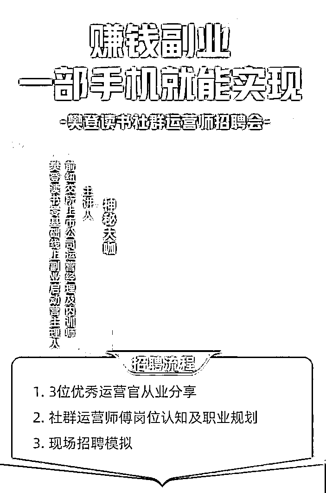

 

 

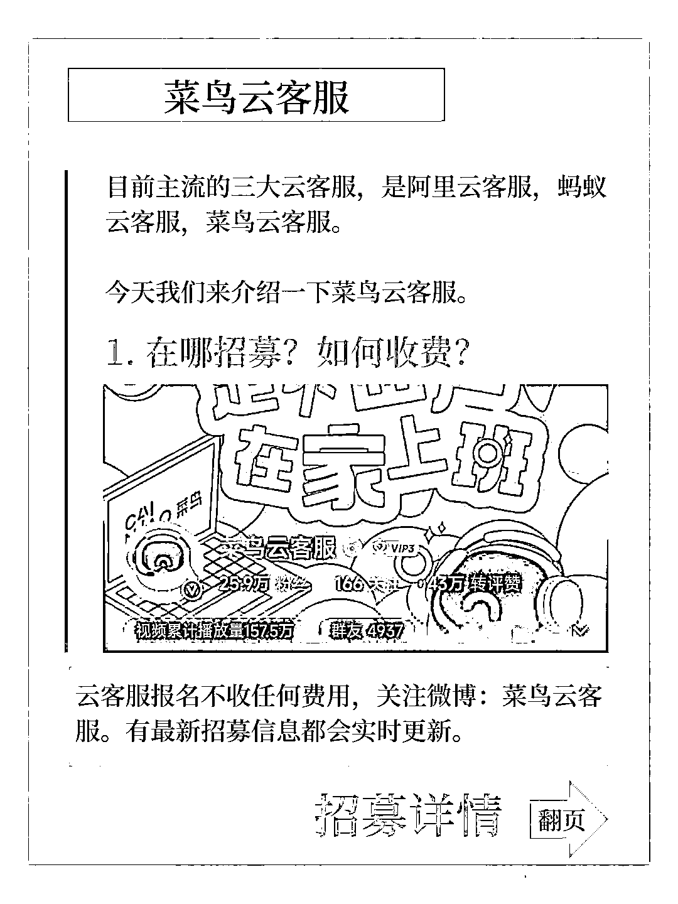

 

 

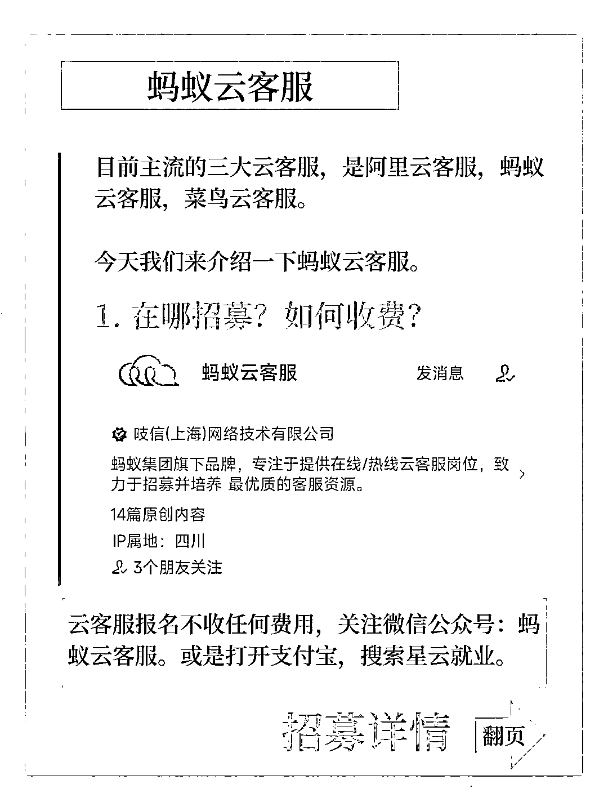

 

 

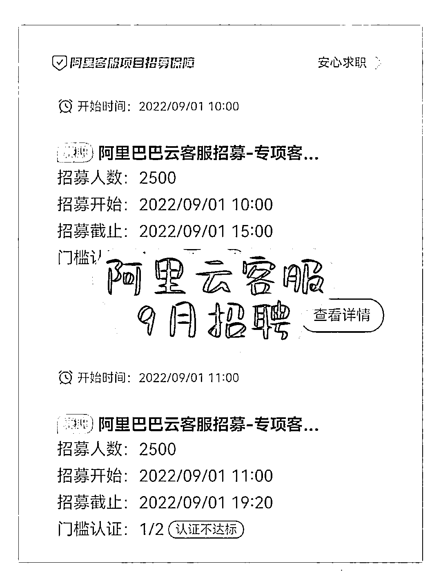

但是这其实是一种出卖时间的兼职，赚得少，做这类副业最重要是管理好自己的时间。

 

 

这类花时间的工作，不建议作为长期的副业选项，但是却是可以让你快速启动副业的方式之一。

从长远看，最核心的还是需要让我们的时间精力分配在更能复利的地方，同时尽可能的，让多份副业之间能相互联系和助力。

妈妈们的时间和精力是非常有限，把不同的副业分享到不同时间段去做，我的几个对策是：

**1. **自由支配的时间

我早上的工作效率很低，但是晚上相对安静的环境呢，我就可以比较高效的工作。自由支配时间，就是要利用我精力最充沛的时候去做一些更高效的工作。

**2. **利用碎片化的时间

比如说我会在做饭的时候去听课，也会在平时在路上坐车的时候呢，去做一些不需要集中注意才能做的副业，比如在社群里推荐产品。

可以思考一下，哪些副业需要整块时间（自媒体写作），哪些副业可以用碎片的时间(社群卖货)，哪些副业可以同步一起做(我常常会同步几个群一起开会，哈哈哈)。

**3. **工作的优先级排序

虽然我是有非常多的副业的，但是不同副业的轻重缓急都是不同的，要根据自己的节奏去有效地安排。

 

 

同时也可以根据自己的时间去放弃一些花时间特别多的这种副业。比如去年，我做了非常多的短期课程训练营，但是今年我基本上都没有在做，把时间放到更能产生复利效果的。

**4. **能量管理比时间管理更重要

很多宝妈是有时间的，但是却提不起能量做任何事，要学适当的能量管理。在自己精力充沛的时间段，实现高效的工作，这也是节约时间的一个秘籍。

# 写在最后

感谢生财有术，我是今年通过@走心小姐姐@醒醒加入进来的，但是我对生财有术的认识已经有一段时间了，去年还作为嘉宾在香港还参加了一次生财夜话的活动。

 

 

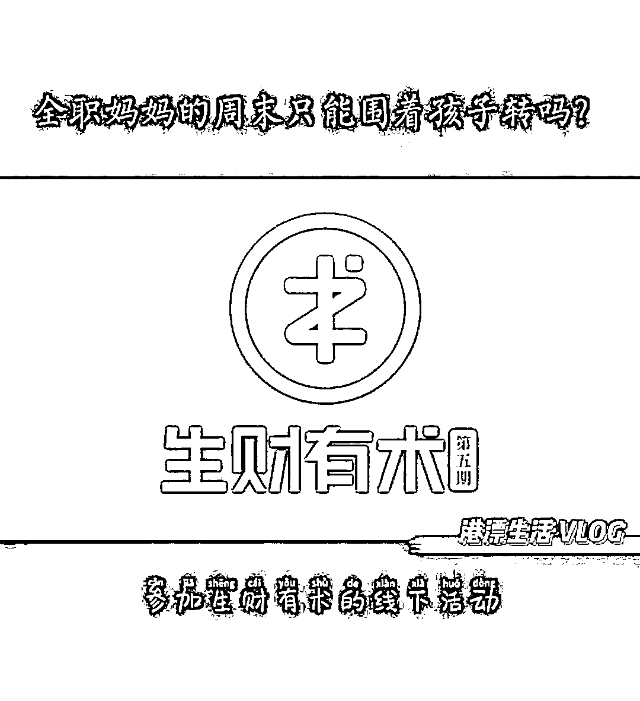

今年加入进来后，参加两次的小航海认识了好几位优秀的实战派船长，优秀的圈友，弥补对于不同副业平台的认知，学习到了很多新的赚钱思路。

好了，我的分享就到这里了，总结一下

 

 

纯小白，花时间提升自己的能力和技能，建立势能差。我们走的每一步，都藏着未来的影子。

谢谢你能耐心看到这里，我会一直很努力跟上，希望今天的分享能对你有一些些借鉴和启发，欢迎圈友们链接多多交流！

评论区：

凯 : 很赞

海程 : 看过的非常真实的分享  很值得妈妈用户看

葫芦Mom｜金侣Ly* : 谢谢

葫芦Mom｜金侣Ly* : [玫瑰]

温妮 : 真棒，太厉害了！

葫芦Mom｜金侣Ly* : 谢谢

Aron.Li : 厉害厉害

阡墨 : 厉害[强]

# **# ****(**精华帖**)(314**赞**)**传统技术行业如何通过互联

# 网建立影响力，实现年入百万？

作者：  梁靠谱

日期：2022-07-29

你好呀，我是生财医官梁靠谱，这是这个月龙珠见面会上，我的分享稿，感谢生财团队帮忙整理，这里一并分享给大家。

去年的4月18号，在出差回家的高铁上抢到了生财的门票，那天去的是大连，凌晨在海边看日出的时候，还发了一条朋友圈，引用的是星爷《喜剧之王》里的台词，“你看前面漆黑一片，什么也不看不见”，“也不是啊，天亮之后会很美的”。

https://shengcaiyoushu01.feishu.cn/docx/doxcnV8vCvH8RrVGwrIN9pFsj5g 

 

评论区：

白杨SEO : 靠谱[呲牙]

IDO老徐 : 靠谱，靠谱  。

西小昔 : 靠谱，榜样[强]

Kris王 : 梁靠谱老师太讷了

小椰 : 你最靠谱

子洋 : 句句走心，靠谱

小雨 : 认认真真的看完了，非常用心，超级赞！

白奇杉 : 谢谢分享，那一段应对焦虑的特别能提炼出方法，具体的每天的行动目标能够应对焦虑，有宏观的目标推出具体的任务。

还有，朋友圈的框架那一段我也深受启发。坚持日更，和框架。

# **# ****(**精华帖**)(214**赞**)**我做小红书垂直** IP **，第** 1 **个

# 月变现** 10 **万的经验分享

作者：  芳园朋友圈

日期：2023-02-24

谈到小红书引流变现，很多人脑海里第一想法肯定是“先做流量、先涨粉”，那“一个低粉  IP ”要怎么做才能高质量变现呢？ IP 怎么设计才能吸引流量，  当流量来了怎么承接，如何转化到私域变现？这才是做好小红书的关键，

想实现“低粉高变现”，最关键的逻辑顺序，先需要设计好私域的变现产品，其次搭建好私域基础建设（也就是流量来了如何快速做成交），最后再放大小红书流量，引流到私域成交。

我将结合我做小红书垂类 IP ，月变现 10 万的自身案例，从“如何打造低粉高变现的小红书账号”这个维度，毫无保留的分享我经验，希望给想做“低粉高变现”的你带来一点启发，少走弯路。

 

 

生财圈友好，我是芳园，6 年亿级私域操盘手，之前在大厂带领近 10 人团队负责私域业务，22 年 4 月底从某互联网大厂裸辞创业，6 月底正式做小红书，定位私域 IP 顾问，专注帮创业者提供私域变现和精准引流服务，做到了小红书 4 千精准粉，第 1 个月变现  10 万， 3 个月变现 20 多万。

很多做小红书的人容易犯一个错误，就是以为只要把小红书流量做起来，引流到私域，就能变现，甚至有的人认为把小红书流量做起来了，只要接广告变现就行。

但是现在竞争很激烈，“把流量做起来”这件事情并没有那么容易，要是好不容易把流量做起来了，结果私域却没有成交能力去承接，甚至只等着接广告来变现，那就会白白浪费很多原本可以变现的流量。

千万不要在不知道如何做好私域成交的情况下，就大力做流量，更不要只等着流量做起来接广告变现，两者都会导致你的变现周期会非常漫长......

接下来我结合自身案例，从“如何设计好私域的变现产品”、“流量来了如何做成交”、“如何在小红书精准引流”这 3 个维度的变现步骤，来和大家具体分享，我是如何做到小红书第一个月就变现 10 万的。

一、如何设计好私域的变现产品

首先我想问你一个问题，光是看我的这次分享的标题：做小红书第 1 个月变现 10 万 

 

你觉得，如果我卖的只是几十块钱，或者几百块钱的课程，我有可能做到第一个月就变现 10 万吗？对于当初我这样的自媒体小白来说，几乎不可能，对吧？

所以这也是我想要和你分享的第一个变现的关键要素：首先你得有高利润产品

请不要只卖低利润产品

请不要只卖低利润产品

请不要只卖低利润产品

这句重要的话我要重复三遍！

甚至，用户量越少，你就越应该卖高利润产品！如果你用户量很少，你还在那边只卖低利润的产品，那你几乎不可能赚到大钱！

我那时候给自己设计了3款付费产品：

1 V 1咨询 500 元

28 天训练营 1980 元

全年私教 9800 元

可以看到，刚开始做，我的产品价格设置就都不算便宜。而且，告诉你个实话...我当时重点就是卖 9800 元私教产品的，所以这也是为什么我能这么快速做到 10万  变现的核心原因

那如何设计高利润产品呢？

 

 

如果你是做知识付费的，那么，你不要只卖训练营、1V1 咨询之类的中/低价格的产品，更不要只卖几十块、几百块的课程...

因为这三类产品，并不是真正帮你赚利润的！

这三类产品，更多是为了建立客户对你的信任的，是为了让客户体验后，得到超预期交付，从而认可你，愿意为你付费更高价格的产品

所以，除了低价格、中价格的产品以外，你可以再设置私教、私董、弟子班之类的高价格产品

私教常见的交付周期和定价有：

2 个月：3980 元

3 个月：4980 元

6 个月：6980 元

一年：9800 元 / 12800 元

这四档交付周期和价格，不用四档全做，任选其中 1 到 2 档即可

当然每个人情况都不一样，这里我无法一概而论，具体的得根据你的赛道和交付情况来定，我只能给大家做个大概的参考

私董和弟子班更适合已有一定成功案例基础的人做，这里我就先不展开介绍了

 

 

所以，你的产品设计应该有三个梯度：引流产品、信任产品、利润产品

那么，不同行业具体该如何设计产品梯度？我继续给大家举3个例子（注意，以下只是举例子，并不局限于此，不以偏概全哈）

如果你是做知识付费类的，那么常见的产品形式为：

引流产品：比如免费资料、9.9 公开课、99 元年度会员、知识星球等，作为用来引流的钩子，同时让客户对你建立初步的信任，愿意付费更高价格的产品

信任产品：比如 1V1 咨询、训练营、年度付费社群等，这类中等价格的产品，客户体验后，觉得超预期，愿意付费更高价格产品

利润产品：如私教、私董、弟子班等高价格产品，是帮你真正做利润的，不可或缺！

就像我当时给自己设计的 3 个梯度产品：

引流产品：免费的私域干货资料包、15 分钟轻咨询

信任产品：1V1 咨询 500 元，28 天训练营 1980 元

利润产品：全年私教 9800 元

如果你是做零售类产品的，比如护肤品，那么产品形式有：

 

 

引流产品：比如小样/中样体验装，一方面能作为引流的钩子，另一方面，客户体验后觉得不错，就很容易购买正装产品

信任产品：比如面膜、面霜等口碑很好的爆款产品，客户体验后，觉得超预期，不断回购，且愿意付费更高价格产品

利润产品：比如精华、套装、胶原蛋白肽等，利润高，且容易形成周期复购

如果你是做微商的，比如减脂类产品，那么产品形式有：

引流产品：比如小样/中样体验装，或者 99 元减脂打卡营，可以获得一份体验装产品，同时在社群里，会分享减脂干货，用户在群里满 30 次一日三餐的减脂餐打卡，可以退还 99 元，同时还可以获得一份赠品，购买正价产品可以带走这份赠品信任产品：比如减脂产品套餐，客户买回去后，你可以给到一些针对性指导，他体验不错，就很可能升级你更高价格的产品，甚至升级为代理商

利润产品：比如代理商，成为事业合伙人，这是主要的利润来源，也是你应该重点花精力的地方

总结一下 5 个关键点：

（1）如果你的流量有限，想做高变现，那么得要有高利润产品，不要只卖低利润产品 

 

（2）产品设计要有三个梯度：引流产品、信任产品、利润产品

（3）引流产品的目的：作为用来引流的钩子，同时让客户对你建立初步的信任（4）信任产品的目的：客户体验后，觉得超预期，愿意付费更高客单产品

（5）利润产品的目的：帮你真正做利润的产品，不可或缺

二、流量来了如何快速做成交

这是一个很大的话题，这次主要和你分享，高客单产品如何快速做成交

首先，用户刚加你好友时，他对你的信任感是非常弱的

所以，你是不可能，在他还不信任你、不了解你的情况下，就成交他的，毕竟人都不是傻子，钱也不是大风刮来的，别人怎么可能轻易就从兜里掏钱给你呢？

但是，我经常遇到，刚和我学习的学员，发给我她和刚加的人的聊天记录，然后问我：

老师，我是不是哪里说错话了？为什么对方不理我了？

结果，我一看聊天记录，果然，聊不到几句就直接给对方报价、推销产品了... 

 

给大家欣赏一张我学员的聊天记录

 

 

你看了有什么感受？你会愿意直接给她掏钱吗？不太愿意，对吧？

你都还不了解对方的需求到底是啥，你也还没有给对方提供价值，让对方信任你，你是不能直接就给对方推产品，指望着对方立马付费给你的。记住一句话：给对方报价和推产品，是最后的底线。

那么，正确的成交思路应该是怎么样的呢？

这里我重点给大家分享一下小红书引流来的用户如何做高价格产品的私聊成交

首先，你要先筛选对方是否为你的潜在精准客户，如果当下不是的话，那你其实不用多花时间，在微信里通过社群、朋友圈、直播慢慢养着就行，说不定在未来的某天能成为你的精准客户

那如何筛选精准客户呢？

我拿我举例子，我前面有提到，我们在引流前，可以先准备一个引流产品，比如我选择送免费资料，《私域干货资料包》，作为用户加我好友的噱头和理由

然后加了好友后，我会先问对方：某某某你好呀，你是想领取免费资料，还是想了解私域、引流相关项目？

对方通常都会回答：先领取资料吧（如果对方一上来就回答，想了解私域、引流相关项目，那通常有两种可能，要么是非常精准的客户，需要重点维护，要么就是同行来打探情况的）

 

 

这时我会问他：那你目前有遇到什么困难点吗？我看下哪个资料更适合你，有不同的资料类型

通常这个时候，对方会直接告诉你他遇到的困难，你可以从他的回答，就大概能判断你是否能帮到他，他是不是你的潜在客户，

如果这个时候他的回答，你觉得你帮不了他，不是你的潜在客户，那么你直接把资料发给他，后续在微信里通过朋友圈、社群、直播等方式养着就行

如果这个时候他的回答，你觉得你能帮到他，那么你就给他一个大概的方向建议，注意，这里只给大概的方向建议，不要给具体的解决方法。因为这里的目的，是为了吊他胃口，引发他想要进一步了解的好奇心。

如果这时候你直接给他很具体的方案，那么他就会很有获得感，觉得已经得到了，不需要再继续和你咨询了。这点很重要，一定要注意！给大家举个我的例子

 

 

 

 

你看，我给到对方的是大方向的建议，当你给了他大概的方向建议后，他会忍不住想知道，那具体该怎么做呢？

这时，重点来了！！！

你不要再在微信里和他继续聊了！是的，你没看错！

当时我第一个月做小红书变现了 10 万，主要就是用的以下这一招！只要你用好以下这一招，你的高价格产品成交，就成功了 80 % ！

这时，你要直接和他约电话聊

为什么？因为从建立信任的深度来看，  依次排序是：见面>直播>电话>私聊所以电话聊比私聊更容易建立信任。

注意：我这里讲的是高价格产品的成交方式，如果你的产品只卖几百块、千把块的低价格产品，那不需要电话聊，因为电话聊的时间成本很高，如果你的利润很低，就很划不来当然这个具体得根据每个人的情况具体分析

还是拿刚才的聊天举例子，

 

 

 

 

当我给对方大的方向建议后，我会说，“这样吧，微信打字不方便，我们可以先电话沟通  15 分钟左右，我会给到你一些相关建议”

然后，让对方填一份问卷。注意，问卷这一步是很关键的！

一方面，你可以筛选掉不符合你要求的人如果他连问卷都懒得填，或者随便乱填一通，那么你放心，他基本也不会为你付费

如果他填了一些信息，你发现他不是你的精准客户，那么你也没必要再和他电话聊了。

比如我就不收负债的，如果他填了他是负债的，那我就不会继续和他聊了。

这时你可以说：

亲爱的，很抱歉，我刚才看了你填的信息后，发现我暂时无法帮到你，实在很抱歉，我会送你一份资料，以表我的歉意，我们可以保持联系，或许将来我有机会能帮到你如果你看了对方填的资料，初步确认你能帮到他，那么你可以约他 15-30 分钟的电话时间

接下来，又到了非常重要的环节了！

 

 

如何电话成交对方呢？这也是我一个月变现 10 万的核心秘诀

首先，我建议大家用飞书 app 或腾讯会议与对方约视频会议，然后你开摄像头，这样的效果是最好的，一方面你露脸了，能更加强对方对你的信任感，另一方面，方便录制下来，做复盘回顾

然后，有 3 个关键步骤：

第一步：提前准备

是的，你要根据你们之前私聊的情况，以及对方填写问卷的情况，来判断他目前遇到的问题，然后提前准备好你能提供给他的相关建议

（注意，这里的建议也是同样，只给大概的战略方向建议，而不是给具体解决方案，否则你直接给了具体的解决方案，对方会觉得没必要再为你付费）

第二步：了解需求

是的，虽然之前你们私聊和问卷有初步了解需求，但是你其实还是不了解他的具体情况的，所以这时候你可以补充问他一些问题，一方面是进一步了解他的情况，以便你更好地给他相关建议，另一方面，通过让他回忆，其实是在放大他的痛苦和需求

第三步：给到建议

当他说了自己的痛苦和需求后，你可以给到他相关的大方向的建议，同时强调痛苦和好处，也就是说，如果他不解决这些问题，他将面临什么样的后果，如果他解决了这些问题，他将会得到哪些好处

 

 

比如，拿刚才的截图举例子，我会这么说：丽丽（最好称呼对方昵称或姓名，更拉近距离），你目前核心要先解决的，是用户对你信任度的问题，

你现在直接在群里推商品广告的方式，用户对你的信任感是很差的，如果你持续按现在的方式在群里直接只推商品，那么用户对你的信任感就会越来越差，你的业绩是不可能做得起来的。

但是如果你解决了信任感的问题，那么用户就会很关注你在群里推的商品，很容易被你种草，自然而然会更容易成交，那么你的业绩很快就能做上去了

当他认同以后，你再提你能够如何帮助他解决这些问题，并且这里可以举 2~3 个你的成功案例，更吸引对方，同时加强对方对你的信任感

（注意，在对方没有进一步问你产品时，你不要急于介绍自己的产品，否则推销感就会很重，对方会有防备心理）

当对方进一步问你产品，或者问你如何得到你的帮助时，你再和他介绍具体产品以上就是电话销售的 3 个关键步骤

当你做好以上 3 步后，有的爽快的客户，会立马选择购买，但是，绝大多数客户其实是没那么爽快的，毕竟你的产品价格不便宜，他也才加你好友不久，你们建立的信任感，还没有那么强，想要让对方当下立马做出决策没那么容易

接下来，有个很关键的步骤来了，就是回访，可以这么说，电话成交的客户，有 70% 左右，其实是通过回访成交的

 

 

因为你电话结束后，对方是需要思考时间的，他会思考自己到底需不需要你的产品？你到底是不是真的值得他信任？

所以在电话结束后，你需要在 15 分钟内，趁对方热度还在的时候，微信私聊给到他你的成功案例、个人故事、销售信（产品介绍），让他了解一下，这一步很关键，能进一步帮助他了解，加强他对你的信任，以及对你产品的需求度

然后，如果当天客户没有做出决策，你可以在第 2 天的时候做个回访（选个对方休息的时间，比如中午、晚上）

注意！这个回访不是让你去问对方“你考虑的如何了？”

千万别！这是大忌！你这么一问，对方只会觉得自己在被推销，就会有抵触心理，大概率前功尽弃！

所以第 2 天的回访，你应该再次进一步提供价值，然后放大痛苦和好处，最后给对方留一个钩子

回访公式：进一步提供价值**+**放大痛苦和好处**+**留个钩子

回访我建议你可以给对方发语音，因为你们之前电话沟通过了，所以相对来说信任感会更强一点，这时候你发语音，对方不会反感，反而能拉近距离。

我举个话术的例子（为了你们内容阅读的完整性，这里我就不一句一句发了）

 

 

“丽丽，昨天和你沟通完后，我后来又想了一下，你这个情况我建议你第一步可以先把社群的内容安排优化好，你现在社群里全都是广告，以你目前的社群情况，如果没有把内容安排这块优化好的话，你就很难成交客户，这也是为什么你目前客户成交率很低的其中一个重要原因”

“但是如果你先把社群内容安排这块优化好了，客户看了你社群种草内容后，就会很心动，很想要购买，那你的成交率就会大大提升，当你社群内容安排这块优化好后，你再去重点做活动成交，这样你的变现速度就会变得很快”

“我这里有一份社群运营资料，你要的话我发给你参考”

然后，你就等对方回复吧，至少 90% 以上都会回复的哈哈哈

（剩下的 10% 没回复，要么就是对方忙忘了，要么就是电话沟通完后，对方完全没兴趣，那你也不用在意，说明当下他不是你的目标客户）

当对方说需要这份资料时，这时，你把资料发给他，然后说，有问题可以随时联系我，我可以给到你一些相关建议

你看，我在干嘛？我在“处处埋钩子”哈哈哈，你发给他资料，他看了资料后，又对你的产品再次心动，（当然，资料也是需要设计过的，资料里除了干货分享外，还要留你的成功案例、产品介绍、微信二维码）

然后呢，因为你还说了一句“有问题可以随时联系我，我可以给到你一些相关建议”，所以当他再次联系你的时候，你们不是又建立了继续沟通的机会了吗？那不就等于是再次有了成交机会了吗？

 

 

绝不绝？哈哈哈

当然，如果有的客户刚开始确实有顾虑，不敢一下子买高价格的产品，那你可以退而求其次让他先买中价格甚至低价格的产品，逐渐培养信任，再成交高价格产品，这叫“环环相扣”

所以最好的成交方式，是日常的时候，你筛选一遍潜在客户，如果是低价格、中价格的产品，直接私聊成交就好，如果是高价格的产品，电话成交，然后定期再做直播成交、批量发售，这叫“多线布局”，这样的变现效果是最好的

总结一下 5 个关键点：

（1）用户刚加你好友时，他对你的信任感是非常弱的，千万不要一上来就给对方报价，“给对方报价和推产品”是最后的底线

（2）新加的用户，先筛选对方是否为潜在的精准客户，只有筛选出对方是精准客户，才进行下一步成交动作

（3）筛选出精准客户后，用“电话成交”的方式，成功率会更高

（4）电话沟通完，要创造下一次沟通的机会，毕竟电话成交 70% 左右，都是通过回访成交的

（5）回访公式：进一步提供价值+放大痛苦和好处+留个钩子

 

 

# 三、如何在小红书精准引流

这是一个很大的话题，篇幅有限我没法都讲清楚，但我这次想分享一个对你更有用的大招！只要你掌握了这一招，你再去做小红书，那你的引流效果，就会比别人好 10 倍以上！

我就是通过这招，小红书 4000 粉，就引流了近 1000 人到我的微信！很多没有掌握这个方法的人，即便做到 4 万粉丝了，引流量和精准性也没有我高

那么，想知道我是如何引流，能做到这么好的效果的吗？

哈哈哈，不卖关子了，直接告诉你吧，一共有 3 个关键步骤。

首先第一步，你小红书发布的选题内容，要能吸引精准用户，比如像我的账号，

 

 

 

 

 

 

都是我的目标受众很喜欢的内容，所以我的转粉率、引流率都很高，很能吸引精准客户。

当然，你可以有 20%~30% 左右的笔记内容，是为了蹭当下热门话题做流量，或者讲个人故事做人设的，但是至少，你 70% 的内容，一定要垂直、吸引你的目标受众。

第二步，如何写出容易爆的短视频文案？

我拿我干货型的短视频文案举例子，在选题吸引精准用户的基础上，你的短视频文案内容，需要给用户带来新的认知，也就是，这个知识点，是颠覆他以往认知的，或者，这个方法，是他此前不知道的。

这一点很重要。如果你提供给他的东西，他发现他以前就听过，那很有可能，他对你的内容就不感兴趣了。

 

 

如果，你给他非常具体的，他直接就能拿去落地的方法，那他就会非常有获得感，忍不住就想要收藏关注。

比如我有篇视频笔记，是讲“私域年赚 8 位数，做对了什么？”

 

 

 

 

里面我分享了 3 个方法：

第一步，每个销售每天至少找 50 个客户聊天；

第二步，每条朋友圈，都必须有用有趣有共鸣；

第三步，如果这条朋友圈你不愿意出现在你自己的朋友圈里，那这条内容，也决不允许出现在客户的朋友圈里

重点是，这三步的每一个方法都非常具体，我甚至连话术都直接提供了，用户可以直接参考着我的话术去做，这么一来，用户的“干货获得感”就会很强，就很容易吸引收藏点赞。

那么第三步，也是非常非常非常关键的一步！当我的目标受众关注到我的内容了，那我该如何吸引他们加我微信呢？很多人引流效果差，就是这一步没做好！想知道吗？

哈哈哈，不卖关子了，直接告诉你吧

目前小红书最安全、引流效果最好的方式，就是群聊，目前群聊里你直接发微信号，也是安全的，不会影响你的账号，所以你一定要创建群聊，并且在群聊里引流到微信，如果私信发微信号的话，账号很容易被封，那么群聊里具体该如何引流呢？

注意！接下来我讲的这三步很关键，很多人就是因为没做好这三步，所以引流效果才这么差！

 

 

那首先，第一步，你要先准备一个你目标受众感兴趣的钩子，比如我的钩子是免费送你《私域干货资料包》，我知道你们很多人都是被我这个资料包吸引来的哈哈

那么第二步，当有人进群了，你要第一时间@他，欢迎他进群，为什么呢？因为人都是渴望被关注到的，当你@他，他就会产生好奇，咦，我被@了，那我要去看看，你看，这样他不就被你吸引过来了吗？哈哈

为什么要第一时间呢？因为如果你隔了好几天才把他邀请进群，或者隔了好几天才@他，那人家早把你忘了，也没兴趣加你了

就像我昨晚分享提到的，用户加你的那刻，是对你最感兴趣的，同理，用户关注你的那刻，对你是最感兴趣的。

给大家发个我的话术案例做参考：

 

 

那么第三步，非常关键的一步来了！注意，第三步比第二步更关键！我有个学员之前引流效果很差，主要原因就是出在这一步没有做好！后来我帮他们把这一步做了优化，引流效果立马翻了 3 倍以上，这一步就是：

（1）你要明确告诉他，想要得到这份资料，就要加你微信。如果你不告诉他，很多人是不知道的，你也别指望让用户来猜你的心思，人家没那闲工夫

（2）你要把你的微信号，单独发出去，方便对方复制粘贴！注意！这一步是重中之重！

很多人引流效果不好，就是死在了这一步，为什么？

因为他们把一条上面有微信号的图文笔记发在群聊里，或者直接把微信号写在一张图片上，然后把这张图片发在群聊里，让用户自己去微信里一个字母一个字母输入他们的微信号加好友...

这样很多人就懒得加了，因为你又不是什么大咖，别人为啥要为了你搞得那么麻烦？

所以，给用户提供方便很重要，这个是我群里引流的完整话术，发给大家参考

 

 

总结一下 3 个关键点：

（1）你小红书发布的选题内容，要能吸引精准用户，内容比例参考：70% 的内容，一定要垂直、吸引你的目标受众； 20%~30% 左右的笔记内容，蹭当下热门话题做流量，或者讲个人故事做人设

（2）如何写出容易爆的干货型短视频文案？两个关键：①能给用户带来新的认知，不要老生常谈；②给他非常具体的、能直接拿去落地的方法

（3）“群聊”是目前小红书最安全的引流方式，在群聊里，用户进群后，你要第一时间@他，并用他感兴趣的钩子，明确告诉他加微信号可以得到，吸引加微

ok~以上就是我结合着自己的变现案例，和大家分享的，关于做小红书如何实现“低粉高变现”的三大步骤，相信按照以上三大步骤来做，你的私域变现价值能放大 N 倍以上。

 

 

感谢你耐心看完本文，希望能给你带来启发，如有问题咨询、合作、深入交流，欢迎联系我。

评论区：

强哥手记 : 写的非常详细了，忍不住为你点赞。1、目前小红书更新频率是怎样的？2、怎么批量生产这类目标用户视频？

强哥手记 : 怎么联系你？特别棒

金彩 : 可以留个联系方式不

小花 : 太良心了，立刻去关注你小红书领资料[呲牙]

芳园朋友圈 : 感谢老铁支持。您的这两个问题，需要根据赛道来看哈，不同赛道有差异  芳园朋友圈 : 我的v：xiaowaiwai18

芳园朋友圈 : 我的v：xiaowaiwai18

芳园朋友圈 : 哈哈，谢谢[呲牙]

# **# ****(**精华帖**)(198**赞**)**用** MVP **的方法，快速验证假

# 设，我如何做出** 2 **周销** 3W **的知识付费内容？

作者：  李李Leona

日期：2022-07-21

Hello大家好，我是鹅姐，一枚B站知识区Up，专注职场领域，有30w+关注。

在生财潜水20个月，平时看各位圈友、大佬分享，经常有很多“aha”。

但在亲身探索变现路径上，却在过去很长一段时间都缺乏行动力和章法，只把生财当成了爽文，自己却没去尝试做一把主人公。

说到底，还是认知不到位，所以行动没跟上。

 

 

这篇分享，是想和大家分享下我近期的一个变现小尝试：

2周内，面向私域5000人精准流量，售卖69元的2场直播课。在一字未写直播课内容的情况下，实现500+学员购买，变现3w+。现在2场直播已经做完了，学员的反馈，也非常积极。

这个成绩，在诸多大佬面前当然不值一提。但却也是我在前期踩过一些坑、浪费了大量时间/精力/机会之后，实现的小小突破。

我想和大家重点分享的，是我自认为这次在知识付费产品的设计和营销上，做得比较对的一些尝试，以及我之前失败的经验。

这些经验教训，对于想要做知识付费、还处于早期起步阶段的朋友，应该会有借鉴意义。

全文请戳  https://shimo.im/docs/wV3VVVxeVlcYZQ3y评论区：

倪大胖 : 谢谢鹅姐带来的aha时刻。

知道 : 膜拜

平凡小吴 : B站up鹅姐职场！，我在b站也关注了，没想到是圈友！

阿花 : 我也关注了，真巧呀

南风 : 感谢鹅姐

拱卒 : 你也可以做做B站

低头赶路 : 不知道留学生人群多不多哈，多的话可以合作变现[抱拳]

林书 : 鹅姐的视频给人感觉很舒服，持续关注您

# **# ****(**精华帖**)(162**赞**)**草根煤矿工人，如何通过

# 「创业知识博主」**6 **年积累** 800W**

作者：  领飞懂运营

日期：2022-03-14

哈喽！大家好！我是领飞！

 

 

这篇文章适合：想做创业知识博主的朋友

一个草根煤矿工人，国企铁饭碗辞职，6年时间单打独斗的创业者。

第一次在生财发表文章，默默潜水将1年了，会员都快到期了，呵呵！

非常感谢！各位大佬每日分享的文章，同时看到这么多努力的战友，发表以下文章内容，希望对大家有所帮助！

领飞文字水平不好，擅长说话，希望大家体谅。

如何通过

【创业知识博主】

原始积累**800**万

一、我有老婆了

领飞大学毕业，之后分配到老家国企煤矿单位（现在叫国家能源），在一线井下做区队技术员，早晨5点半起床做通行车，晚上7点到家，井下300米一呆就是几个小时，这种工作我一干就是3年，北漂族感觉都没我这么幸苦。

我们行业有句话说：赚着白面的钱，操着卖白粉的心

 

 

为什么要出来创业？

不是因为工作干不下去，而是因为工作当中有2次距离死亡擦肩而过！

觉得做为一个男人，不管成功不成功，先要把老婆搞到手，就这样结婚了！

兜里有5万存款，没有房贷，开始打算着如何出来创业！（因为找到老婆了，哈哈！！！）

二、能糊口养活自己就行

一天在百度搜索“1万元如何创业”，发现了一个讲述“百度产品竞价”的帖子。（那年还没自媒体的概念，也没有这么多的媒体信息渠道）

之后联系到这个老师，进入他的QQ空间，看到一些发单视频，实在太吸引人，就这样他成为了我第一位互联网创业师傅，花费了3000元。

“百度产品竞价”需要设计网页，需要设计产品文案、宣传广告；对于我这个二把刀大学生来说，几乎是从零开始学习。

其实也算是万幸中的万幸，这位老师还是很靠谱的，通过QQ远程协助，一步步的教我如何做网站，传授产品思维。

可是咱做为一枚互联网创业小白，内心对于钱的渴望，想必大家都经历过，就好像报名一个老师的课程，老师就能给钱一样；说实话当时不理解，没少折磨我老师。

 

 

就这样，在家呆了半年，几乎不出门，每天就是研究各类产品，整理各类资料，设计各类网站。

当时我所有的产品，全部围绕“虚拟变现”也就各种教程，比如：30天足球教学教程、零基础90天钢琴教程、修车技术大全教程、小白理财教程、街舞教程、太极拳教程。。。

等等，我做了50多款，基本所有的内容，都是网上整理的。

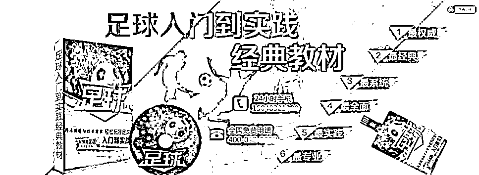 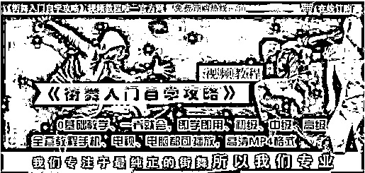

还有很多这样的设计页面，我就不发了，图片很长也发不了，都是被淘汰的产品了。

重点要一：什么事情就怕整理，一整理就能为懒人服务

 

 

其实做竞价最赚钱的还是医疗和美业，领飞的老师他从教我第一天起，就没有告诉我他做什么竞价产品，害怕竞争。

但还是在话里话外中，我找到了他的产品库，专注于“小吃教程”；这也就导致我什么，起步也做教程的原因。

其实这样看来，在现如今，就是知识付费、虚拟变现。

大力出奇迹，第一单我通过【30天足球教学教程】赚了300元，抛出去竞价广告费50元+邮寄费23+10元U盘+3%的货到付款服务费，说实话我这个产品，还是比较有产品力的，虽然单量不高，但是成本低，属于冷门细分。

之后陆陆续续其他教程也出单，温饱月入5000也就基本实现。

通过“百度竞价”让我打开了互联网创业的一扇窗，之后就开始操作各类网赚项目。

说实话，是你们无法想像的一种疯狂，见到任何项目我都去尝试干一遍，这也就促成了，领飞报名了很多老师的课程，比如：电影资源公众号、淘宝虚拟变现、朋友圈看看广告赚钱程序、卖微信群网站、菠菜套利、微聊流量、脚本引流、。。。等等，老战友是不是感觉都非常熟悉啊！呵呵呵！

总结出：玩虚拟变现去山东，玩电商去杭州、玩套路去广州、玩竞价去福建、玩讲师去深圳。

有钱了，就开始各种投资实体店、开公司等等，这些就不说了；

 

 

下面开始给大家分享本文章的主题：

【创业知识博主】

跑通闭环经历

知识付费变现：是目前互联网创业产品中，成本最低的，变现能力最强的，2021年抖音知识付费官方数据30亿，2022年会实现100亿，如包含其他平台2021年整体市场知识付费规模达到675亿。要知道电影的市场规模才472亿。

这代表着：人们更愿意把钱花到学习上面。

大家都知道这几年经济环境不太好，投资啥都不容易见到成效，所以知识付费是一个难的创业好赛道。

问题是该怎么做？非常简单，一句话： 深耕人群，打造流量，变现卖课。

创业知识博主：是所有知识博主类型当中，起步门槛最低的，变现能力最简单

的，几乎做到人人可参与；人们所产生的焦虑几乎都跟“钱”相关，赚钱机遇、赚钱案例、赚钱方法、赚钱渠道、赚钱科普、赚钱项目等等，你有想赚钱的粉丝，难道卖不出项目吗？没人找你学习项目吗？

草根创业不要怕没有产品，要学会借鉴，要学会模仿对标，要学会**“**一件代发**”**，每天讲互联网创业，吸引到想创业的粉丝好友1000个，之后买个项目，合作个项目，自学个项目，是不是就能赚钱！

 

 

知识付费变现：课程变现、项目培训、社群变现、资源变现、线下沙龙变现、招商加盟变现、合作对接变现等等，这一切从1单9块9到1单9万9，给大家切实体会下领飞这些年怎么做知识付费，跑通闭环创业粉丝。

感触到：会获取流量，任何项目都能做。

**2015**年，线下找了一个刮腻子的老师傅，给了2000元拍摄刮腻子教程，通过百度SEO竞价2年，赚钱40万；这几年不停挖掘市场需求做了很多教程出售，目前仍然还在有2款产品在做SEO竞价，不方便透露以免增加竞争。

赚了谁的钱：想学技术赚钱的人。

 

 

**2016**年，微信营销流行，领飞网上搜集整理一本《实体店微信营销秘籍》扫街30天，加了4000多个实体店老板微信，电子书+教程+微营销软件，赚了10万。

这个方法其实我觉得在抖音时代仍然可行，落实到地面，你会发现空白市场，小白人群真的是非常多。

赚了谁的钱：想学营销扩展生意赚钱的人。

**2017**年，线下POS机办卡流行，领飞网上搜集整理一本《信用卡技术，POS机金融实战秘籍》，送给了4000多个之前的老板微信好友，并且使用我代理的一款POS机，赚手续费这一年，形容盆满钵满不为过。

赚了谁的钱：私域流量的钱。

**2018**年，流行社群淘客，领飞花了3000元做了一款程序，淘宝天猫产品一件群发，一件无货源开店，去学校门口引流，通过扫码送礼吸引1000宝妈，之后裂变出8000本地宝妈，卖程序卖代理，接本地广告，商家联盟，最后被一家我们当地公司收购。这里我就不说怎么后期运营的了，原来就是不管做什么人群，必须先有一个切入点的产品，之后再扩展营商模式。

赚了谁的钱：想副业赚钱的人。

2017-2018年，领飞在喜马拉雅FM分享创业音频，实施至今，从起初免费社群培训，到498元社群，每月涨200元到4980元，教授1000多个学员。目前一直占有喜马拉雅FM创业板块前十。

 

 

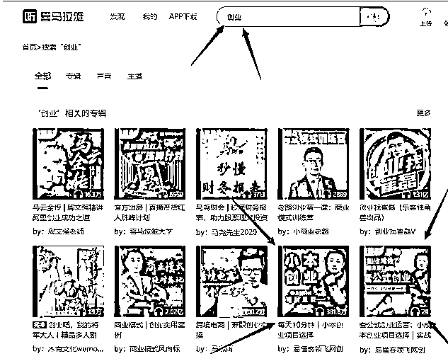

**2019**年，领飞给公众号粉丝推荐赚钱APP，趣步、粉像生活，3年时间一直在被动收入，其中趣步让我赚了50多万吧，没有投资一份钱。

这里说个小插曲，还一款APP是棋牌的5级线下收益，我当时没有太注重，也不想让我的粉丝和学员跟赌博相关，也就是给他们线报了下有这么个赚钱渠道，当时一个学员就操作，半年赚了80多万，他告诉我，如果把推荐码发出来，用我的，至少我也能赚个几十万。

赚了谁的钱：私域流量的钱。

 

 

**2020**年，疫情来了，也让我静下心来，把我互联网创业经验，以及教学经验，原创一本10万字书籍《套公式创业运营》一万个项目就是一个项目；

录制成了80节课程，瞬间铺天盖地网赚圈，使我源源不断获取创业流量，变现卖我之前几年录制好的几百节课程，千聊APP平台，创业板块课程近几年一直排行前十，官方也找我合作。

赚了谁的钱：内容分发被动流量的钱。

 

 

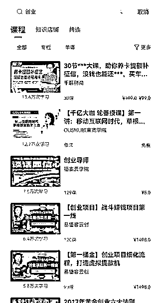

**2021**年，领飞休整、调养身体、陪伴家人一年。

赚了谁的钱：不焦虑，不缺钱花，具备赚钱能力的钱。

 

 

**2022**年，很多人都在教授如何利用抖音打造“商业IP影响力营销”，领飞看准一个市场抖音“SEO内容分发营销”，两者都是营销，前者做的人太多了，后者目前属于蓝海，具体不说了，之后给大家分享如何SEO赚钱，也有不少生财的大咖也分享过，大家可以考古下，或者随时关注这个赛道。

从**2015**到**2022**这些年，领飞几乎原始积累，都是从知识付费赚来的，只不过每年、每个阶段的需求不一样，营销风口不一样。你会发现每一次的变现，领飞都抓住人们想赚钱、想创业的需求，并且每一次的变现产品，均为虚拟知识服务，以小博大。

其实我的粉丝量并不多，满打满算公域流量也就**10**万粉丝，基本都是以私域流量进行成交，我成交记录是：**1000**个被动添加好友变现**60**万。

每一个创业博主，都会有负面信息，领飞出现信用危机是在2019年，当是和一位写字书法老师合作，他研发了一套（教孩子写好字的方法），领飞利用我的流量给他推广，他教授技术，授权卖代理。

之后与这位老师合作不太愉快，很不付责任，售后问题总是跟不上，我策划的方案也不实施，最终2020疫情来临，每个人都很压抑，教培行业影响更别说了，这也导致我的信用危机。

这里省略一万字，不说了，创业没有一帆风顺，打击和压力必然要有，吸取教训继续前行才是王道。

案例：

 

 

商业小纸条：抖音粉丝1000万，每天分享科普创业案例，粉丝变现推自己引进的项目。

名正言顺：抖音粉丝1000万，每天分享别人的创业案例，变现广告收入，带货与项目嫁接。

李一舟：抖音粉丝130万，每天分享抖音运营案例，变现卖课上千万，课程100个博主都一样内容。

【创业知识博主】每个人都可以做，都可以通过内容产生价值，获取认同你忠诚的粉丝，不用担心变现，有人了变现自然就有了，分享内容其实就是在运营项目，上面的大V会运营平台打通流量，这就是成功案例，所以有人就会买单。

上面大**V**创业很牛，你为什么关注找我学习，这就是内容分享认同价值！

【无货源抖音小店】是项目，你教别人卖货；

【自媒体书单号】是项目，你教别人卖书；

【抖音运营起好】是项目，你教别人做号；

【创业知识博主】是项目，你教别人卖【无货源抖音小店】【中视频书单号】【抖音运营起好】

只不过区别在哪？

 

 

卖的服务产品不一样，内容分享受众群体不一样，但都在一个平台营销引流，都需要做内容分享，所以【创业知识博主】是项目，也是你的成功案例。

没有交付力，得不到结果，属于割韭菜；这个行业正因为赚钱，所以贬褒不一；

并不是让大家当镰刀，价格决定价值，所以一切价值定位来源于交付力；

【创业知识博主】可以称之为流量生意，可把流量转化交付能力强的变现产品服务，可自有、可嫁接。

运营【创业知识博主】的好处

创业做项目其实就在熟练营销技巧，任何的项目变现都需要流量，都需要有人

才能赚钱成功。

做【创业知识博主】每天都会分享各类创业项目、营销技巧、赚钱信息等，其实就是在刻意学习。

**1**、通过刻意学习，让自己的创业知识认知更丰满，解决盲目投资智商税的问题，省钱就是赚钱。

**2**、通过内容分享，让自己掌握更多被动精准的粉丝，用一件事感受营销获客的问题，学创业就是在学营销。

 

 

**3**、通过粉丝鱼塘，让自己有项目不再害怕没人买单，会营销有流量有人在前，投资变现在后稳赚不赔。

绝大多数人创业，都是先投资后营销，这种方式已经不适合当下创业营商环境，尤其是针对没有任何创业经验的人，你的试错成本钱没了，时间没了；

但是通过【创业知识博主】试错成本只有时间，至少钱还在；论赚钱能力，会

营销，有流量渠道、持续有获客能力的人，发财比例会更高。

花费**100**万投资一个店，一年时间能赚100万吗？不一定，才回本，不投资放银行也能年收益20万。

花费**360**天投资一人精力，一年时间能100万吗？不一定，有可能，也许零成本赚了20万。

每个人都需要赚钱能力，能力是可以成长的，流量经济时代，项目不再是第一位，有人才是王道。

新人草根创业，领飞这么多年的成功经验，只需要学会一招：一件代发！

变现一件代发，有人了找人合作，有人了买个项目出售，有人了嫁接项目出售，有人了把别人好的东西拿来卖。

项目产品永远都不缺，缺的是有人买它，而我们操作【创业知识博主】就是为买它的人提供客源；

 

 

怎么获取客源？

还是一件代发，整理全网那么多的创业相关内容，用自己的方式分享，获取认同你的粉丝，信息差永远存在，你说的就是你的。

为什么要做

【创业知识博主】

多久能赚钱

为什么要做创业知识博主，多久能赚钱？

这是2个问题

先回答下为什么要做创业知识博主？

其实创业知识博主属于商业**IP**

商业IP与创业IP具体的划分不是特别明显，关键在于你如何细化分；

商业**IP**侧重：营销策略、商业模式、创业方向、经济宏观、创业案例。。。

创业**IP**侧重：具体项目、赚钱渠道、创业类目、个人经济、创业案例。。。

 

 

比如：领飞创业IP相关的内容什么都讲，也可以只讲开店创业，抖音创业、咸鱼创业、自媒体创业、写文章赚钱、拍视频赚钱、地推赚钱。。。等等

项目应对趋势可随时变化

比如：

抖音小店流行、知识博主流行、咸鱼无货源流行、书单号流行等等，这些都是可以变的，也许是买来的项目，也许是合作的项目，也许是自己实操的项目。

这里大家就会明白，领飞为什么说草根创业，一定要学会：一件代发

内容分享一件代发，变现成交一件代发，重点在于先把内容分享出去。

我给大家举个例子：

比如你每天只分享关于：抖音各种赚钱账号的案例

这个视频为什么赚钱？这个账号为什么赚钱？

在抖音有一大把这个样的博主，把别人成功的案例，当作自己的内容分享，这就是**“**内容一件代发**”**。

 

 

因为观众不会像你一样，去针对的、细节的分析，你给他们提供了赚钱信息；自然你就获得了粉丝。

通过有了粉丝，你再**“**一件代发**”**把你找到的成功案例博主，与之合作，再给你的粉丝变现。

这样你是不是，每天只需要专注，内容分享，获得粉丝，内容持续分享，每日持续获得粉丝。

内容越多了，粉丝越多了，你就是大**V**了！

个人IP持续放大，还有很多绝招：简单说一个

你的粉丝从抖音，转化到微信，又增加一个渠道生态系统，可以通过微信视频

号、微信搜一搜、微信公众号，又影响更多的人。

比如你的公众号有了1万粉丝，你可以找同行互推粉丝，是不是又放大了流量池。

人多了，都是一类人，都是一类创业想赚钱的人，你觉得什么项目卖不出去！

**OK**！这就是我们为什么要做创业知识博主！

不再为项目发愁，不再为投资风险发愁，不再为可持续性发展发愁！

 

 

多久能赚钱

领飞第一年为了快速成长、为了提升个人能力、为了媒体平台更多曝光；所以我大量产出内容，有内容分享出去，才会有人来找我；

**1**、每天干多长时间，在于你

每天一条内容分享，每天10条内容分享，都能获得粉丝，你觉得哪个快？

内容数量，决定曝光量，曝光数量决定粉丝数量，粉丝数量决定变现单量。

有时间多操作，坚持去操作，是不是这个道理，谁也拦不住你偷懒，拦不住你奋发图强！

**2**、每天能赚多少钱？

领飞第一年做创业知识博主还是个新人，从第1天到第30天、第60天、第180天、第365天，每天分享3条以上内容，共计**1095**条。

每天查看50个同行内容，一年**18250**条信息潜移默化被我脑袋吸收，大脑又通过系统运转，筛选、优化、排除等一系列骚操作，成长为现在的我。

内容分享一天比一天干货，一天比一天有价值；

 

 

表达能力一天比一天自然，一天比一天像专家；

内容质量决定粉丝质量，个人质量决定粉丝质量，个人能量决定变现价格。

第一年到2022年，从0到198-498-1298-2498-3689-4980-9800的过程。

每个人都要有从**0**到**1**到**1+**的过程，不要问任何一个带你发展的人，多久能赚钱，能赚多少钱？

要问你自己：现阶段什么能力，对待这件事物能拿出多大决心，能付出多少辛

苦，是否认同这条路对你有发展？

没有不赚钱的项目，没有不赚钱的人；

小钱与大财，搬砖与老板；

差别只在于：个人能力的成长！

**OK**！2个问题回答完了，你要不要这样创业，值得你深思。

最后：这篇内容，是之前的文案结合写的文章，总的来说并不是一篇非常好的文章，但是基本讲清了一个创业知识博主能给大家带来什么样的好处。

我也希望认识更多的大咖，认识更多志同道合的人。

 

 

感谢生财这么好的平台，这里面有大文化，大学问的人特别多，我一个草根在这里留有余香，希望多多包涵。

评论区：

李  司令。 : 太棒了  👍

半藏 : 学习[奋斗][奋斗][奋斗]

天涯 : 刚好抖音在大航海，可以做创业IP的心法

Eleven : 感谢分享，真的棒！

东海 : 感谢分享[鼓掌]

徐飞宇 : 感谢分享，很有收获[强]

初心～大林 : 大佬优秀[强][强][强]

宋大刀 : 整理思维印象深刻  谢谢前辈分享

# **# ****(**精华帖**)(113**赞**)**靠朋友圈精准营销，**6 **个月变

# 现** 14W+ **的实操方法

 

 

作者：  小鹿

日期：2023-07-06

从分销到有自己的定位和产品，靠朋友圈精准营销，6个月变现14w+的实操方法复盘大家好，见贴欢喜，我是生财圈友小鹿。

有幸在5月航海，受官方邀请在“朋友圈运营航海”船上，作为嘉宾分享“朋友圈广告这么发，用户不反感还想追着看”，给大家带来朋友圈广告的正确发法。

本篇分享，我将在此基础上，从朋友圈变现三步走，到朋友圈基本框架布局、故事发圈法、朋友圈文案万能写作模板、朋友圈广告怎么发、朋友圈防折叠小技巧等6方面。

全方位分享从分销到有自己的定位和产品，靠朋友圈精准营销，6个月变现14w+的实操技法。

为方便阅读，辛苦大家移步飞书：

感谢 @梁靠谱@理白  两位老师带我加入生财，感谢静伟老师、范磊领队、九儿老师的暖心引导，感谢理白教练、子冯教练、思念教练的无私分享，以及航海所有志愿者、工作人员的辛苦付出。感谢生财有术的邀请，让我能够有机会和大家分享我朋友圈变现的成长历程。

祝我们都能厚积薄发、生财有术。

https://bokm2adr1g.feishu.cn/docx/KzUMduAqLo5y21xgihUclePjnMe评论区：

清一 : 小鹿最棒！！！

是微光吖 : 吼！小鹿太棒了吧

小沫 : 好酷小鹿！朋友圈变现找小鹿！

凌心 : 终于等到你，感谢分享

小王子 : 小鹿最棒，一起生财有术

饭饭 : 小鹿厉害！

Andrew : 小鹿厉害 

理白 : 小鹿是朋友圈文案专家！

 

 

# **# ****(**精华帖**)(108**赞**)**加了行业内** 4000+ **好友，垂

# 直知识** IP **如何利用好视频号单月变现** 20W+ **？

作者：  东山老师

日期：2022-08-22

之前有圈友分享过，和线下教培机构合作做招生转化的项目，基本能做到月入几十万，年入千万的成绩。

授人以鱼不如授人以渔，直接教机构怎么去做招生转化也能赚到同样多的钱。

大家好，我是黄东山，70后连续创业者，现在在广州，主要是“艺术培训、少儿体育培训机构”的老板，自己做招生和转化。

我今年418期间经朋友的推荐加入了生财有术，前段时间参加了“视频号IP”的航海活动。

其实生财里很少我的客户，反而有很多同行，刚开始我是纠结要不要分享的。

但想想，如果能有更多朋友通过我的分享获得启发，走向超垂直知识IP的创业之路，也是好事一桩，于是就有了这篇帖子。

这篇文章会有点长，我主要分为3个部分进行：

第一部分：我是如何走上超垂直个人知识IP创业之路的。

第二部分：我是如何打造流量线+培育线+成交线的闭环，最后利用视频号进行发售进行变现的。

 

 

第三部分：超垂直个人知识IP创业，如何靠自己实现轻松年入百万。

第一部分：我是如何走上超垂直个人知识**IP**创业之路的

# **# **一、我的介绍和经历

我是广东人，70后，我在2016年以前，干过很多事情，开过工厂，搞过电商，也搞过互联网培训，算是连续创业者吧。

我会走上帮“艺术机构做拓客招生”这条路，纯熟偶然！

在2016年初，我那时候在搞互联网营销培训，一次受一个开少儿美术机构的学员邀请，帮她们的机构做完一场互联网裂变招生后。我发现这帮搞艺术培训的老板真的是非常简单和真诚，但又极度缺乏营销策略！

我觉得，这或许是个转型的机会，因为我当时非常厌倦微商和社交电商这帮人。于是，我毅然从互联网营销培训迈入了艺培招生转化这个行当！

 

 

2016年至今，我帮1500多家艺术机构用2天半时间，不地推不派传单，足不出户就招到100~400名新生，并且教会他们一套体验课转化流程，让他们的转化率提高了50%以上！

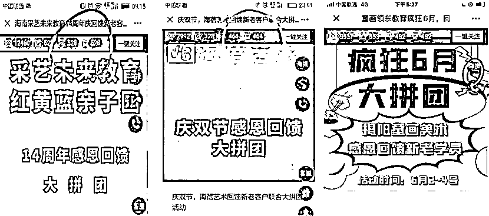 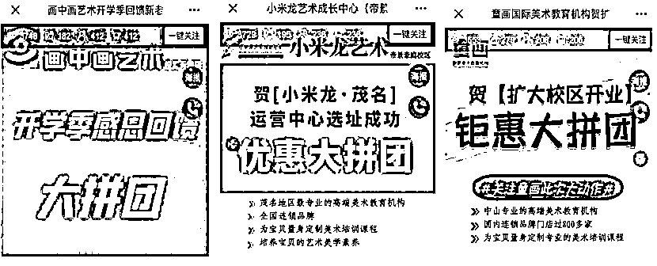

我以前的做法就是直接到艺术机构里面，采用内训的方式，手把手带着他们的老生去做裂变招生活动，活动结束后我给他们做2-3个小时的转化内训。

平均而言，我们给机构做一场活动能收入2-5万元左右，一次活动需要3天的时间。我们的团队加上我也有10个人，扣除所有的开支和分成，我们一个月也能赚个30-50万吧。

 

 

在今年的**5**月**5**号，我把这个团队解散了，坚决不再帮机构做招生！

我的很多同行都偷偷的笑我说：老黄指定是疯了，好好的跟钱过不去！

我其实没有疯，我只是受不了了，2个原因：

第一个原因，身体受不了

帮机构做招生看起来轻松，其实身体特别累。例如在今年元宵节过后一直到5月1日，我经常晚上11点结束一场活动，第二天早上5点跳闹钟起来，就赶去高铁站或者机场，中午12点又要出现在另一个城市的客户那里了。

我们有教练累到要住院，辞职不肯干了！我也40多岁的人了，这么干下去身体真的吃不消。而且我和老婆长年累月在外面跑来跑去，孩子和老人家也照顾不到，搞得左右不是人！

第二个原因，心里受不了

从2020年开始，我们这个行当，乱象就特别多。

很多压根就不懂教培运营逻辑的“大咖”跑进来帮机构招生，因为他们就是冲着“赚钱”而来的，所以招生数量当然是多多益善，福利当然越大越好！

搞出了很多非常恶劣的招生方案，给机构埋下了很多看不见的坑。

 

 

他们策划的招生方案力度非常大，甚至搞几十家机构联合招生，每个机构出8-16次课，让一个家长交一分钱可以任选5门课。或者让机构直接出24次课，48次课，甚至60次课来招生。

这样的方案能够瞬间激发家长薅羊毛的心理，一场活动能赚10-20万，但是机构就会在未来的几个月内宣布倒闭。

这2、3年间，我亲眼看到有小几百家机构被这些招生团队生生搞垮。在写这个帖子之前，在广东番禺又有一家机构被生生的搞垮了。我知道他们倒闭的原因，就是找了招生团队做了一次299元48次课的联合招生活动。

搞艺术教培的这帮老板都是一群很善良单纯的一帮人，他们只是一门心思的想把自己一身的才艺教给更多的孩子，他们对于营销的理解起码落后了其他行业5年以上。根本就辨别不了什么是好的招生方案！

所以，我们不应该去坑他们，而是应该帮他们才对！然而，不知道从什么时候开始，招生团队从雷锋叔叔变成了过街老鼠了？

我非常的纳闷，心里受不了，经过几个月的深入思考，我在5月5日这一天，把原有的招生团队彻底解散了。

# **# **二、超垂直的个人知识**IP**之路的开始

 

 

我决定换一种方式，去帮这些单纯而又情怀的艺术机构老板们！

我认为：校长要想彻底摆脱对招生团队的依赖，就必须要自己去学会整套的招生策略和实操流程。

所以我把原来我们帮机构做落地招生的整套方法策略，搭配我们的软件工具，直接复制给机构的校长。

也就是，我把从**“**帮**”**机构校长招生转化为**“**教**”**机构校长去自己做招生。

从“帮”到“教”看似简单的一个字变更，但却是全新的交付形式，这是一条非常难走但又有意义的路。

我当时估计最少要1-2年的时间才能正常的转型过来。所以我备足了干粮，把团队解散，把运营成本控制到极低。就我和老婆2个人全力以赴打好这一仗。

我所依仗的就是“超垂直个人知识IP”的打法，我准备用半年的时间，探索出一个转化率比较高的，可复制的闭环模型后，再重新组建一个5-7个人的小团队来运营。

至今2个多月了，我觉得可能要不了一年，我们就能重新起航了。

**1.**《批量招生操盘手复制**1.0**》的诞生

5月5日解散团队后，我们花了一个多月时间，把整个流程进行分解，打磨了《批量招生操盘手复制1.0》的训练营，招了19个校长进行测试。

 

 

这一轮，我没有参与陪跑，就想看看如果靠校长自学我们打磨的招生流程，能否产出结果。

结果非常理想，有校长最高的招了241个新生，单机构能招到这样的数据是非常理想的。差的一些机构也能招到50来个，后期的转化率都不错，有50%多的，最高的能做到75%左右。

 

 

 

 

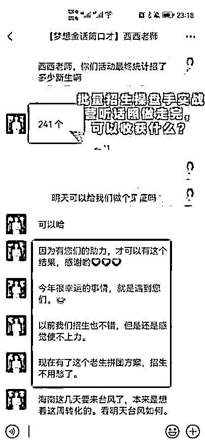

 

 

 

 

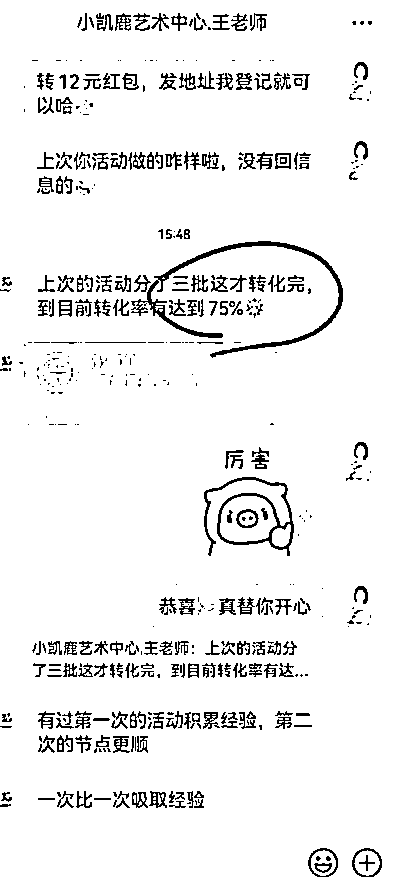

**2. **《批量招生操盘手复制**2.0**》的诞生

我看到第一次训练营后反馈的数据非常欣慰，就马上在原来的流程上进一步细化，分为策划案+制作案+执行案+实操案共4个步骤进行交付，并加入了陪跑的模式，就升级成了《批量招生操盘手复制2.0》。

这一次刚好趁着参加生财有术的《视频号IP》的航海，我就直接用视频号直播进行发售。这一次又招募了近20家机构进行测试。这一轮的陪跑交付还有几天就结束了，目前的数据也是非常不错。

所有参加《批量招生操盘手复制2.0》的校长反馈：这次让她们会非常有信心。

 

 

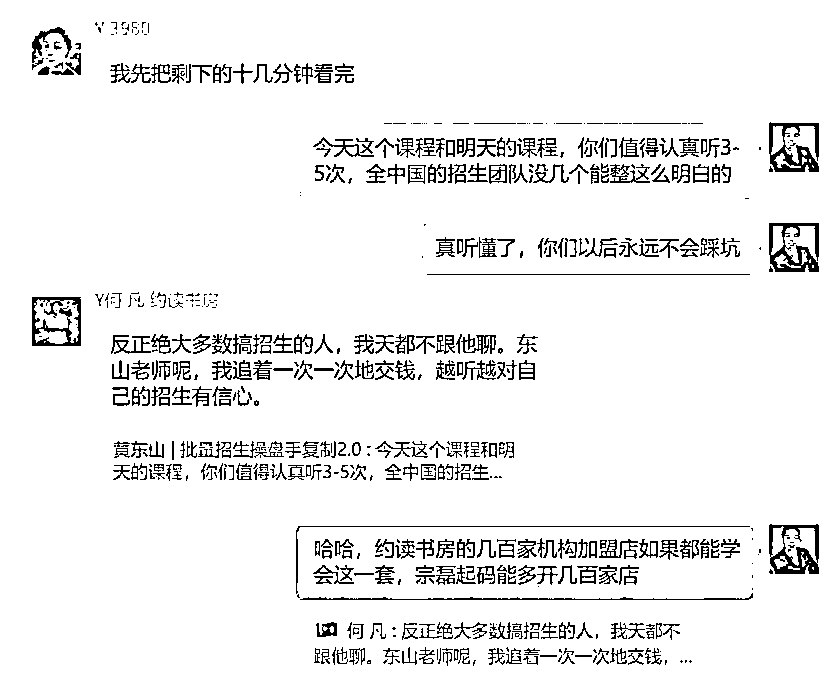

这个产品，我还会持续的优化，不排除未来疫情防控更安全的情况下，会直接用线下课+线上陪跑的模式去交付。

无论用什么样的方式去交付，我的初心都是一样的：就是希望校长能靠自己搞定招生和转化，用商业的策略实现教育的情怀，而不是依赖于招生团队。

 

 

第二部分：我是如何打造流量线**+**培育线**+**成交线的闭环，最后利用视频号进

行发售进行变现的。

2016年至今，我一直不断地加人，也不断的删人，到目前我还剩下4000来个精准的校长，这是我的基本盘和底气。

这4000多个校长，我一看头像我就知道是谁，在哪里，做什么科目，有多少人，我非常熟悉他们的情况。

那些我搞不清是干嘛的，朋友圈也不给我看的，待了一年了也没有互动过的，我都删了。

从去年开始，我零零散散的做了一些抖音和小红书等，粉丝加起来也不过3000来人，目前视频号只有200来个粉丝。

这就是我所有做超垂直知识IP的所有资源。

我在当下把视频号只是定位于定向培育信任和做直播发售变现的一个工具，没有完全的发挥出这个平台的其他功能。

因为在当下，我们还处于边打磨产品，边招募机构来测试的阶段。在营销上，我还没有全面发力，很多老客户我都还没有告诉她们我转型的事。

我的超垂直知识IP之路分为流量线、培育线、成交线三段同时进行。我分别说说：

 

 

# **# **第一条线，流量线

流量线是我们生存的根本，我主要分为2点去实现：

**1. **公域转私域

我现在每天都更新短视频，每周也会做直播，所有的宣传指向只有一个：免费送《批量招生策略》的实体书。

任何时候，免费送总是比卖更容易的事情，现在我每天都能送出20-50本书左右。所有送书的人，全部都放到私域流量池里养起来。

做超垂直个人知识IP的的核心，是靠知识去获客和培育，这一点我做了详细的规划，下一步我会一步一步的去实施，包括短视频，实体书，知识付费课程等等。

2\. 老客户转介绍裂变

老客户转介绍是我一直在做的，2016年至今，我的经营理念就是：“用心服务好客户”这7个字。

每一个我服务过的客户，我都会跟她解释这7个字的含义：我确实是非常用心的服务好客户，但前提你得是个好客户呀。

 

 

对我们而言，好客户的标准只有一个，就是给我们做转介绍！

并不是说你找我做招生，你就是好客户，那只能叫大客户，不是好客户，因为你招我做招生，我也给你对应的服务，我们是交易关系，两不相欠。

所以，只有给我转介绍客户的，我才当你是我的好客户。

如果你是我的好客户，我除了帮你搞定招生转化的难题，我还会给你解决流量的问题，解决机构管理和盈利的问题，赠送其他我写的书籍等等。（我还有5本书籍，只送给好客户，外面的人花10000元都买不到。）

总之，你是我的好客户，在我这里，你的一切问题都不是问题！

我每次这么给客户去解释，目的有2个：

1）我希望他们也跟我一样，去对他们原有的老生家长进行分层管理。

她接受了我这个理念，他们就能做好转介绍，我给他们招生时，他们能更加积极执行。

2）我希望这些校长理解了我做事的风格和理念，他们非常乐意转介绍新客户给我。

在云南昆明呈贡，有一个叫圆萌舞蹈的机构，她们的任校长把所有认识的机构校长都分享给我，至今给有20多个机构做了招生。这就是典型的超级好客户。

 

 

也有校长直接把所有认识的校长拉群，把我设置为管理员，让我在里面分享干货！

作为回报，我不但支持她把机构塞满，而且还教她持续的涨价，她的机构从刚开始的200多人变成了现在的500多人，年费从以前的7000多元涨到现在的12000元。

现在我更是支持她走知识IP这条路，开始服务全国的舞蹈机构同行。

这么多年来，我都是靠老客户转介绍为主，我们80%的客户都是靠的转介绍而来的，这一点在全国都找不到第二家！

老客户给我们做转介绍非常简单，只要帮我送书给她的朋友就可以了。甚至给我拉一个群，我在里面吆喝送书，至于她们找不找我做招生不是他们的问题。如果有人找我做了招生，我还有提成给他们。

# **# **第二条线，信任培育线

信任培育线是打造知识IP的核心，因为信任是批量成交的前提，没有信任，就要降价，要让利去做成交，我是很抵触的。关于信任培育线分为3点去做：

**1. **朋友圈剧本

以前我在带队做落地招生时真的贼忙，忙的连静下来好好喝口茶的时间都没有，更没有怎么发朋友圈。现在我每天都在广州的办公室里，每天8小时就是干宣传。

 

 

我把朋友圈当成一个机构招生转化的杂志去看待，整了4个专题，分为是：东山招生笔记，东山转化笔记，东山生意经，东山随笔等。再随机的搭配一些日常生活的，看书的，以及客户见证等内容，一天就满满当当的了。

每个主题我准备了90多篇内容，每天像连载一样每天按序号去发，3个月就能发完。他们看完我这3个月的朋友圈，对于招生和转化等，他们会有更深的认知。

**2. **会员社群

我现在给所有招生同行看到的就是我不断的免费送书，所有的校长拿到书后，我建一个叫《批量招生策略研习社》的会员社群，这个群是免费的，相当于书友会。

但也不是有书的校长都能进，她需要在前台拿着我的书给我拍一个见证发到群里，才能进！

 

 

 

 

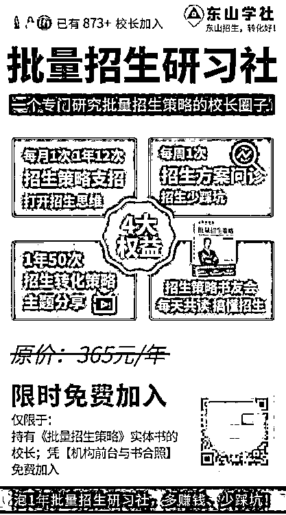

他们进来《批量招生策略研习社》有什么好处呢？

首先，我每周四会做一场东山问诊的活动。

周一到周三我会发群公告，让他们接龙关于机构运营的一切问题，我周四晚上统一文字回复。

在所有的群运营当中，问题答疑是最见实力的，也是最容易让客户信服的。因为客户提出的问题千奇百怪，没2把刷子都会被他们问倒的。

目前我已经回答了她们上百个问题了，通过不断的回答问题，我既解答了他们的困惑，收获了他们的信任，同时我也能更深入的了解客户的需求和痛点，为我下一步研发产品打下基础。

例如我可以随时根据问题的归纳，我琢磨一个3次课或者7次课的小课程包，卖个99元，赚个三两万块是很容易的事情。

其次，每周五我会做**1**次主题分享

例如暑假班招生，秋季招生，双十一招生等，这样的话题分享，每次都能吸引很多人来学习。

 

 

主题分享会员是免费的的，外面的校长也可以参加，他们需要给宣传活动的海报，吸引2个人进来就可以学习。而且学完后，他们都会成为我的会员，因为会员以后都不用做任务了。

在每周主题分享中，我和客户们建立了信任，同时还可以实现每个月的产品发售。

我的发售都是在内部群做的，外面的招生团队根本就不知道我是怎么玩的，他们只是看见一个傻子天天送书出去，调侃说我是钱多了。

同时，我每个月也会做一次大的主题分享，其实就是主题发售活动。每天也时不时的在群里分享一些书里的金句。

**3. **我会拍针对性的短视频给特定的客户去看

我以前拍的很多内容都是跟客户私聊后，或者在会员群聊天后，再总结拍成视频的，把这个视频发到视频号里，再转发给客户看，客户就感觉是为他们专门去拍摄的，很感动，获取信任很容易。

有时候，我看到某些机构在朋友圈发的招生海报，我知道她们踩坑了，但是直接给她说，她是不愿意听，我就直接拍一个她踩的坑，把底层逻辑和其他案例都说一下，然后发朋友圈，@她来看。

她当时不会说，但是在后来的分享时，都会说特别的感谢我，说幸好我提醒了她。让她没有亏那么多。所以这种人是最愿意报名我的陪跑营的，因为他们吃过亏。

 

 

# **# **第三条线，成交线

我所做的一切动作，最后都是为了成交客户，我现在的成交客户就2种方法：

**1. **细水长流的捡一些客户

每次主题分享会完了后，都会有校长问我《批量招生操盘手复制2.0》的事情，我就发一篇销售信给她看，她OK了，先交钱等着开营的时候拉群学习。

现在我们每个月开2期陪跑营，都是集中开营，集中结营的模式。未来客户数量更多一些时，我会结合客户做活动的需求做到每周开一期，循环开营和结营。

**2. **我每月**1**期社群发售

我每次做发售都要提前10天做准备，严格按照浪潮式发售的造势，预售，发售，追售的流程去做。

整个发售都是内部进行的，主要是针对被我洗了脑的，有了信任的会员客户进行，外面的同行是不知道我在干嘛的！

我的时间是这样分配的：50%的精力用来做送《批量招生策略》实体书和在《批量招生策略研习社》里做培育，45%的精力用来做交付和协助客户拿结果。我们只用不到5%的精力用来做发售。

 

 

我相信，有源源不断的价值输出和不断的客户好评见证出来，成交客户其实是一个非常简单的事情。

因此，视频号于我只是锦上添花，是一个定向培育客户信任度和直播变现的工具。而抖音和小红书以及其他自媒体平台，也只是我不断送书和宣传的工具。

第三部分：超垂直个人知识**IP**创业者，如何靠自己实现轻松年入百万以上。

看完了我的经历和我做个人知识IP的流程后，我来聊聊假设你也想做“超垂直个人知识ip”的话，如何创业和变现的话题。我想这才是对你有帮助的。

# **# **首先说说，什么是超垂直知识**IP**？

我个人认为，所谓的超垂直知识IP，就是聚焦在一个极度细分的人群（行业），为他们提供整套的解决方案的专家型IP。

随着私域和抖音、视频号等新的创业平台出现，确实成就了非常多的创业者，在当下，有2类主流的创业方向。

 

 

**1. **第一类创业方向是，我有一个牛逼的技能，我服务所有的人。

例如现在很多人都能做引流拓客，引流拓客就是她的牛逼技能。

她就可以帮餐饮店做，也可以帮美容院去做，也可以帮微商和社交电商去做，甚至还可以去教一些人如何帮餐饮店去做等等。

这种就是我有一个药方，谁给我钱，我就给谁药。这样的方式是当下的主流方向。

好处是容易成名，容易成为大咖，做得好成为头部的话也容易赚大钱。

坏处呢，也有2个：

**1**）太卷了

任何一个你能想到的领域都太卷了，因为聪明又努力的人不止你一个！

不信，你看一些互联网创业的社群，以前都是微商，社交电商，个人品牌、文案、社群等特别多，现在都是清一色的私域、IP、短视频培训的多。

什么风口热，就一股脑都是这些昵称和标签了。如果你只是有2把刷子都很难出圈，起码是5把刷子都不够。

这种面向所有人的定位，对于流量的获取是源源不绝的，所以他们往往追求10万+，追求百万粉。

 

 

但要做到这一点，还真不容易，因为“流量也越来越贵，而且也越来越精了”。

**2**）需要不断的换风口

任何一个风口，都是刚开始2-3年能赚钱，然后就要换风口了。长此以往，其实也挺累人的。

如果你什么风口热就做什么，需要不断的追风口，一群人不断的去追，总有追不上的时候呀，所以就会莫名的焦虑。

所以，我看到很多互联网社群里，前些时间还教别人怎么做抖音起号的，现在纷纷开始研究视频号变现了，因为视频号是正在进行的风口。

**2. **第二类创业方向，超垂直个人知识**IP**。

如果你觉得老是和千万人去追一个风口太挤了，你不妨试着走一条没那么多人的路。

 

 

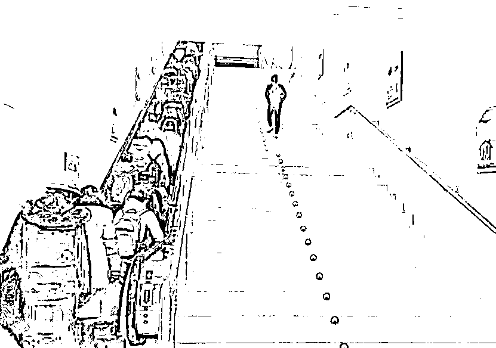

也就是我聚焦一个非常细分垂直的人群（行业），然后找到他们最明显的一个痛点，给他们提供系统的解决方案。

例如同样是拓客引流，如果我什么人都服务，我自然很难彻底的提供靠谱的解决方案。

如果你只针对一个超细分的行业去做，那么你就会真正的懂这个行当，能对症下药为什么很多招生团队帮机构做了招生，会把机构搞倒闭？

因为他们不但帮培训机构做招生，还帮美容院，帮健身房，帮瑜伽馆做招生等，他们不懂每个细分行业的运营逻辑，就会用各种极端的方案去拓科，体验课学生是招了很多，但是没有转化，机构就生生被薅死！

 

 

我只聚焦在帮搞艺术培训的中小机构做招生拓客。我就充分的了解这帮人的现状，痛点。我再教他们做招生，就能做到对症下药，自然就药到病除了。

所以选择做超垂直知识IP这条路的好处就是：客户数量不需要很多，而且转化率高，忠诚度高，转介绍率高，你可以做到闷声发大财。

选择做垂直知识IP 对于客户的数量真的不需要太多，就算你只有1000个，甚至大几百个，如果足够OK，也能一年赚个两三百万。

我有一个好朋友，在昆明和普洱两地走，只做高端定制茶。专门给一些超级大咖定制很好的茶叶。他的朋友圈就常年维持在600人上下，一年一个人能赚300-500万左右，我觉得就挺香的。

坏处也有2个：

**1**）做不了特别大。

小团队能赚9位数以上的垂直IP，我很少见。但一年赚个千把万的很多，属于典型的隐形冠军类目。

如果你也跟我一样，觉得一年就两三个人能赚几百万，千把万很满足的话，这个是可以实现的。

**2**）做超垂直的知识**IP**，真要很专业。

 

 

选择了超垂直的领域，你就要深挖下去，成为行业的专家。你要成为比行业里的资深老板还要懂的人。

我为了彻底搞懂这行，我还参股开了6家艺术机构，我亲自去了上千家机构做招生，和客户面对面交流，我才算弄懂了这个行当是怎么回事。所以现在没有几个校长能问倒我。

如果你决定选择走超垂直知识IP这条路了，那么你可以分为4步走：

第一步：如何选择好的赛道

第二步：如何筛选精准的客户

第三步：如何建立产品体系

第四步：如何做成知识IP，并运营变现

# **# **我先来讲第一步，如何选择好的赛道

作为一个40多岁的连续创业者，我是一直都赞成每个人的去做垂直领域的知识IP，否则我就懒得分享这篇文章了。

为什么要选择超垂直的领域呢？

因为很多人走的路，其实更难走，这个前面也说了。

 

 

目前，抖音上和各种社群里，讲创业的特别多，我前段时间去线下听一个讲门店流量策划的课程，发现现场有80%都是老师的同行来听，真正的门店老板很少。

同行个个都是人精，很难赚到他们的钱的。

如果她只聚焦在一个门店领域里，例如只给全国做烘焙的老板讲如何进行流量策划，那相信来的大多数都是烘焙门店的老板了。如果你的方案确实牛逼，这些老板都愿意埋单。

为什么要是知识型个人**IP**呢？

因为表演和娱乐需要老天爷赏饭吃，咱没那天赋。而且从业务形态来说，无论你现在是做什么，其实都可以当成一个商学院去做，只不过有些公司是靠商学院的培训来赚钱，有些公司靠商学院的内容去引流和培育而已。

用知识去教育市场，获得客户，建立信任，进而变现是一条可以持续发展的赛道。当你成为这个行业的专家，给行业的其他创业者赋能，从而实现个人与客户，行业的共赢，既得利，也得名！

那我们应该如何去选择一条适合自己的赛道呢？我分两种情况去讲：

第一种，你已经在某一个赛道上了，如何进行系统的优化？

第二种，你想重新换一条赛道，如何进行重新选择好的赛道？

**1. **也就是你已经从事某个行业很久了，想通过打造个人知识**IP**去更好的卖产品。

 

 

这个其实比较好做，你要做一个改变，养成从行业的角度去俯瞰你的企业或者职业。

你从此不要站在你企业的角度去看问题，而是要站在行业的角度去看问题。

你以前总是站在自己企业或者职业的角度去看问题，你看到的全是对手，你眼里只有客户和你的产品，这样你跟你所有的同行都是对手，天天打价格战，累得半死还不赚钱。

你如果站在行业的角度去看问题，你所有的对手都是你未来的客户，所有同行遇到问题都是你的机会。

我举个例子：

我有一个客户是做少儿中国舞培训的，她以前跟绝大多数的机构校长一样，只关注自己的机构和周围2公里的同行，他们的竞争焦点就在生源的抢夺上！

她后来成了我的“超级好客户”，我引导她把眼光放大了，她看到的是全国千千万万和她一样做舞蹈的机构老板的问题，她会发现所有机构老板都面临管理的问题，面临产品升级的问题，面临招生转化的问题。

她在我的指导下把自己的经验按序列的形式写成了一篇篇文章去分享。

 

 

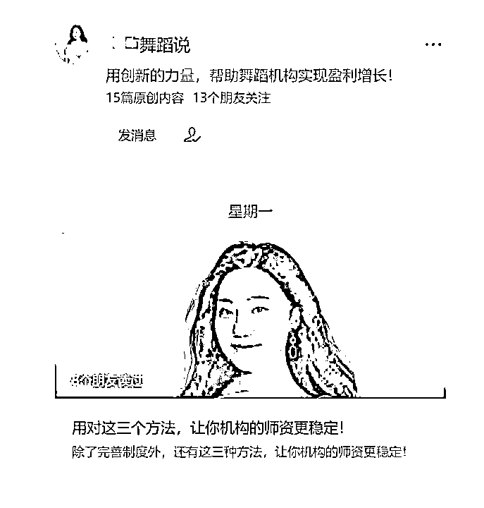

她在短短的半年时间吸引了大概600多个全国少儿舞蹈机构的校长加她，跟她交流。

她最近开始做会员社群分享，做线下沙龙分享，同时不断给我推荐招生客户拿提成等等。

半年来，这600多个校长贡献的利润比她经营那500多人的机构贡献的利润也差不到哪里去。尤其在前段时间碰上疫情时，她比周围所有的机构都淡定的很。

 

 

而且输出倒逼输入，她通过不断的分享，她自己也变得更加的强大，知识体系也更加系统。她在疫情结束后，就不断的涨价，让自己的机构实现了升级。

所以，无论你现在是做什么行业，做什么职位，你只要能拉高你的格局和视野，你都可通过打造垂直的个人知识IP重新改变你的盈利路径。

当你愿意主动的把你做的最牛逼的事情和方法论大胆的分享给全国所有的同行，你让其他同行变得更好，他们也会让你变得更好！

我们的客户们有很多都是走上了这条路，他们有跆拳道机构的，也有舞蹈机构的，有画画机构的，都做的比较好，这样也算是为疫情之下变动的世界里走出一条相对稳定的新路。

未来支持客户们走向“个人知识IP”的路，也是我的一个后端产品，我打磨了完整的方法论。

**2. **你厌倦了现在的赛道，想重新换一条赛道，打造个人知识**IP**进行变现，如何进行精确的选择？

这种情况其实非常常见，我就是这么过来的。2016年以前，我搞文案培训，搞个人品牌培训，搞社群裂变培训，什么火搞什么，看起来牛逼轰轰，其实没赚几个钱。

后来，我就选定了少儿艺术培训机构这一个赛道，用了几年的时间成为这个行业里引流拓客和营销流程的专家。现在就是碰到再大的困难，我也丝毫不慌了。

 

 

现在，任何的细分行当，都可以用超垂直的个人知识**IP**打发重新搞一遍。这一个单一的技能匹配单一的人群，全国的市场无限大，你总能通过你的一亩三分地建立你的王国，而且竞争也没有那么强烈。

寻找新赛道的方法只需要做分2步就可以了。

① 找出你最牛逼的技能。

② 找出最容易赚钱的细分行业或者人群。

你以前不断的跟风，你每个技能都掌握一些，所谓十八般武艺样样精通，但要想上华山论剑，你得学会一招如来神掌。

这个如来神掌就是你的绝招，你最能拿得出手的技能，你能讲三天两夜线下课不重复的内容体系等。

例如你可以用文案去做，也有做的很厉害的，你可以做社群，你可以做教裂变引流，你可以做成交，甚至你只教人改微信昵称等都可以。

无论你选择那一样都有非常大的市场空间，但是你只能选择一样去做。在真正的市场里：十八般武艺样样精通，不如一招如来神掌。

你找出你的技能后，下一步就选择你的赛道，也分为2种情况：

**1**）选择做**B**端的服务

 

 

选择一个你熟悉的B端客户群体，为他们为提供对症下药的整体解决方案，陪她走完整个梦想的路程。你协助他们实现他们的梦想后，你就能实现你自己的梦想。

我有一个师傅，上海的张有为老师，60多岁了，他近10年就死磕工业品电商的营销策划。

前几年还带一个助理去搞，现在连助理都不要了，就1个人，一年就服务50来个客户，吃光用光还能剩下200来万，不但受人尊敬，还能为行业的发展做一些贡献，真的挺好的了，我希望我到了60岁后，就成为他这样的人。

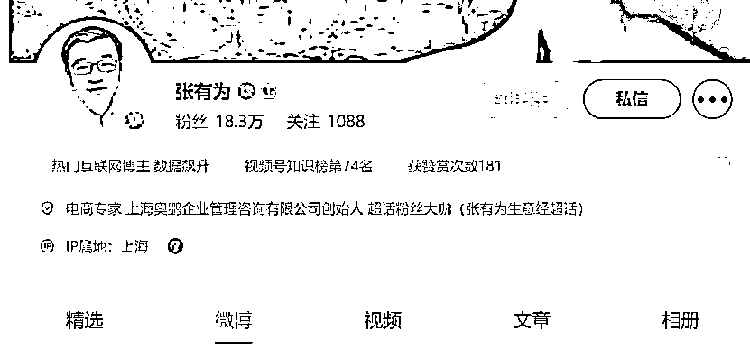

我有一个朋友，做模具钢贴牌的，一个人带2个助理，从全网SEO开始做起，现在拍了1000多个短视频，全网发布。也成了一个模具钢这个类目的小大王，一年做几千万的流水，而且都是款到发货。

他一根就能抵得过很多做模具钢工厂和门店的利润，所以垂直的个人IP，用专业的只是建立起信任感后，真的有很多机会。

 

 

 

 

 

 

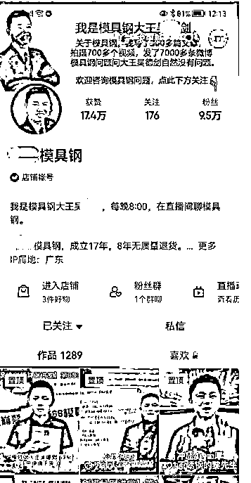 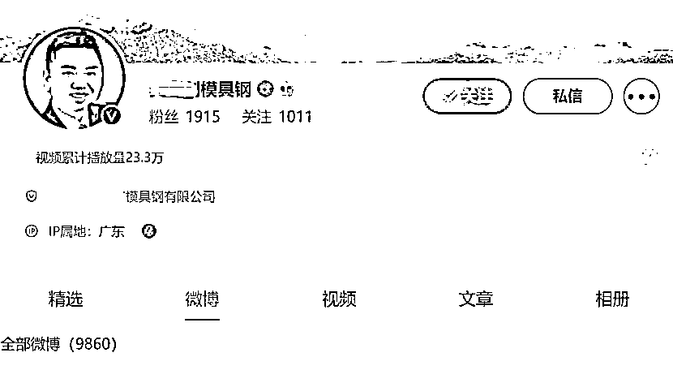

想不到吧？

一个工业品模具钢就拍了1200多条视频，写了9000多条微博。在常人最觉得不可能有客户的平台上，他就能混得风生水起。

很多做工业品的，什么罗茨风机，液压泵，锯片、制锁机等等，如果你的产品足够好，围绕产品提供非常细的知识服务，真的各行各业都有机会。

因为绝大部分的工业品老板，现在还是15年前、20年前的老套经营思维，如果你用现在的社群、短视频、私域等打发去开发，去维护，简直是降维打击。

 

 

**2**）选择服务**C**端的客户

如果你没有工业品的厂商资源，就是自己一个人做做，你也要聚焦一个非常窄的人群。

我有一个朋友庞老师，在广西的玉林卖蜂蜜和一些现熬补品膏。按道理，蜂蜜这个产品是个人都要呀，尤其是宝妈！

但，这些年来，他就聚焦一类练瑜伽的白领人群去开发，去售卖她的产品。由于他的定位非常精准，他跟全国很多出名的瑜伽馆老板合作，直接把产品送到客户手上。她8年来一直就做这么一件事，也实现了吃光用光年剩百万的小目标。

所以，就算你做C端，也可以通过人群的分析，去找到一个对你的产品有巨大的需求的，同时能出得起更高的价格的人群，好好的培养，去贡献价值，坚持下去做个三年五年，你也不用追什么风口，一年赚个200万、300万真的挺好的。

# **# **第二步，如何筛选精准的客户

如果你确定了一个服务人群后，你下一步就要开始为此积累客户了。

做超垂直的个人知识IP，不需要很多客户的，我进入这个行业也有几年了，我也就积累了几千人而已。我常常想，那些搞10多万、几十万私域的，咋看得过来呀？

 

 

你需要的客户是极其精准，所以需要不断的筛选和过滤。在筛选客户的阶段，切记贪心。

我确定转型以后，我就接连删除了近2000人好友，退了近300个无效的社群。留下来的客户，我能做到不用看标签，只看昵称和头像我就知道是谁，在哪里，做什么科目的，有多少人，需求是什么等等。

我现在每天都会随机的翻看客户的朋友圈，发现这个人如果不是老板，我会删掉，或者我觉得她未来是不会成为我的客户的，我也会删掉，或者是以前见过面，聊的不好的也会删掉。

我任何的营销动作，其实都是在筛选客户，例如免费送《批量招生策略》，我们也不是所有机构校长都免费送的，我们要看朋友圈，凡是不给看朋友圈的，一律删！凡是做的很杂的，又开机构，又搞微商的，我也删。提供的收货地址不是机构名字的，也删。

我删除拉黑客户是非常坚决和果断的。因为我一直信奉一点：好客户不是谈出来的，好客户首先是筛选出来的，然后再培养出来的。

对于业务，我从来都不求客户讨饭吃，我只挑选符合标准的好好合作。

对于未来几年，我也有清晰的规划，我不需要百万粉，也不要10万粉，我的目标是5万个书友会即可，我会用3-5年来实现这个目标。其实，我对于实现这个目标的信心是200%。

所以，我给你的建议不是不断的增加客户数量，而是不断是筛选客户，一遍增加客户数量，一遍剔除不符合你标准的客户，留下来的都是精华。

 

 

# **# **第三步，如何建立产品体系

我搭建了精准的客户池之后，就要建立你的产品体系。个人知识型IP，就是要把一人当成一个企业去做，再小的个体，也要有基本的产品体系。

怎么搭建产品体系呢？你需要顺着客户的信任阶梯，一步一步的搭建产品。

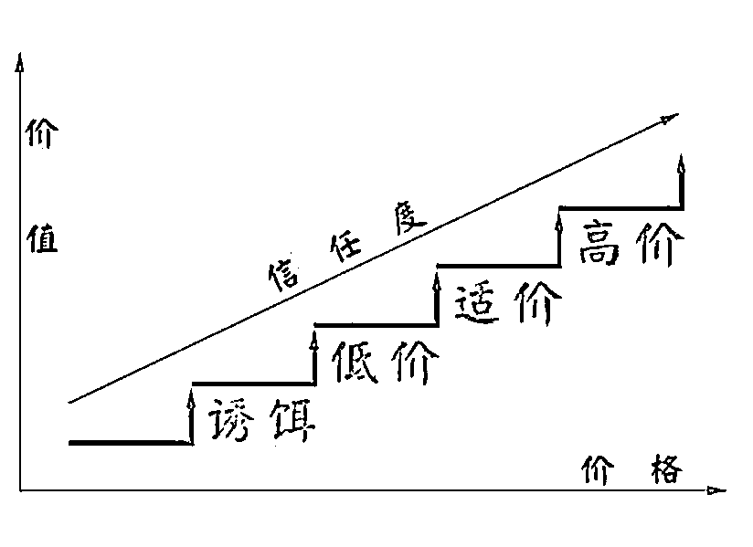

根据信任阶梯，目前我搭建了4级的产品体系，分别是：

引流品**+**培育产品**+**利润产品**+**超级赠品

** **

 

 

我拿我自己做例子，分别说说：

引流产品

目前在所有公开的渠道，客户和同行能看到的都是我免费送《批量招生策略》这本书的内容，《批量招生策略》就是我的引流品。

所有的引流品中，再也没有比“免费”更加能吸引客户的了。但免费的也不能乱来，这里有2点需要注意：

**1**）引流品也是过滤器

免费的引流品变成一个初步过滤客户的过滤器。如果不是超精准的客户，你送给她她都嫌占地方。只有超级精准的客户，她就会抢着要。

像我的《批量招生策略》这本实体书，只有是搞艺培、开机构的校长才用得上，连老师都看不上的！

**2**）引流品也是培育品

你的引流品千万不要让客户拿着就跑了，再也不联系的那种，那种你后端很难转化。

就像我的《批量招生策略》，她拿了书，难免看不懂，难免想要我亲自指点，所以我就可以做《批量招生策略研习社》，以后每周都有链接，就有机会做成交。那种拿了就跑的，连聊天的机会都没了，那就真的是做慈善了。

 

 

信任培育产品

校长拿到我的书之后，我们会要求她做见证，和做裂变，完成一个基本任务后，可以免费进入我《批量招生策略研习社》，也就是书友会。

这个社群对完成任务的校长是免费的，外面的人给1000元，我都不让进。因为这个群我是用来做信任培育和成交的。

我会在群里每周讲一次课，课的内容也是书的延伸。同时每周都会开问诊答疑，这些都是固定的时间开展的。每个月我会提前在群里做预售，优先让会员先报名，享受更多的优惠和福利。

5月份至今，我断断续续的招募了300多个《批量招生转化研习社》的会员，我的目标是在2023年元旦前把这个数量做到3000个，明年7月份结束时，我们的目标是10000个！

如果实现这一点，我们的业绩绝对会超出解散团队以前，而且更加轻松，也更加有意义。

赚钱的利润品

目前我的利润品主要就是：《批量招生操盘手复制2.0》陪跑营产品。单价卖3980-19800不等。这个陪跑营一个月干目前干2期，每期10-30人不等。

我还在打磨另外2个陪跑营，等我的会员超过3000时，我就推出来。这2个产品，价格略高一点，是可以支持客户直接拿结果的，带有0风险承诺，敢做对赌的。

 

 

所以利润品千万不能只有一个，那样会有点赌的成分，但也不要有一大堆。我觉得2-3个就足够了，而且要不断的进行迭代。

你是个人IP，没有几十上百人的团队去交付，产品不要太多，多了就不精。

超值赠品

超值赠品是塑造价值，也是用来辅助利润品的成交的。

目前，我最大的超值赠品就是：2天2夜的《3步转化密码》线下课。

一共380多页PPT，2本共32万字的配套教材，加40多张执行表格。这是一个超高口碑的产品，是可以直接拿到结果的。

《3步转化密码》每2个月开1次，每期50人，目前作为超值赠品送给陪跑营的客户，外面的校长，给10000块也不卖。

当然，我在2天2夜的课程里也会转化19800元和98000元的课程，每次也能转化一点。

我还有一个赠品，就是《批量招生策略》这本书，这本书我可以让老客户帮我赠送给她的朋友，这样我又把赠品变成了引流品。

 

 

# **# **第四步、如何做成知识**IP**，并运营变现

我们把产品设计出来后，最后是要想办法去变现赚钱的。打造超垂直知识IP，要分为5步去走：

1\. 定位包装

2\. 建立内容体系

3\. 建立会员体系

4\. 批量发售变现

5\. 打造裂变循环模型

我们下面一步一步来讲：

1\. 定位包装

这个很简单，你是做什么的，就写清楚，然后呈现给你想要的那一群人看到。定位包装主要呈现在你对外的微信4件套上。

例如我见到一个很厉害的朋友，专做快餐厅盈利菜单优化的。她的昵称就是：XX--餐厅盈利菜单优化。

还有一个朋友，只做连锁药店的私域体系打造。她就写成：XX，连锁药店盈利教练。

 

 

我自己也是，我的昵称就是：黄东山I 送你一本《批量招生策略》

**2. **建立内容体系

内容体系是非常重要的，是打造知识IP的核心，大约分为3大部分内容：

1）对外宣传和引流的内容

宣传和引流的内容主要是围绕客户的痛点、行业的现状、按照序列的方式，1、2、3、4、5等一直写下去。用视频，图文，朋友圈文案等发到所有客户会看到的地方，潜移默化的影响他们，再用引流品把他们都装到你的私域流量池里面来。

这一部分是让所有同行和客户都看到的，是明线的内容。就像我一样，我是全网慢慢铺序列式的内容，全力以赴的送《批量招生策略》这本书。我的同行看到不知道我在干嘛以为我疯了。

2）你的理论体系

理论体系是建立你的江湖地位的，你最好用导图的形式去讲清楚你要如何支持你的客户实现梦想。

 

 

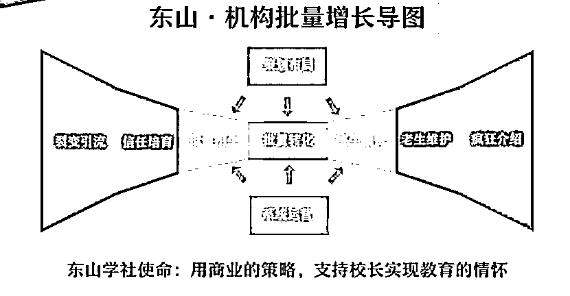

我就为我自己打磨了一个增长导图。我未来几年就会为这张导图的每一个节点都写书，写课，研发产品。客户找我们学习招生和转化后，她的前端和后端，我都还可以继续去延伸。

**3**）产品变现体系

包括你的信任培育，会员体系，发售体系等都是内部在搞的，同行是看不到的。就是暗线营销，这个才是核心竞争力。

就像我现在一样，我把所有免费领了书的人用会员社群装起来，在里面实现第三步的：

会员体系。我在会员群里通过更专业，更系统的内容进行培育和批量成交。

# **# ****3. **批量变现

 

 

我现在的做法就是每个月做一次浪潮式发售，我每次做浪潮式发售可以解决我们一个月的订单需求，这就够了。

对于做线上做批量发售，我也是踩了非常多的坑，现在总算总结出了一套可以复制的流程，以后有机会可以单独分享。

打造知识IP去变现，一定要做批量发售，不要一个一个的去成交考核，那样太累了，而且也掉价，做不成IP。

我对于成交变现一直坚持一个原则：只宣传吸引，不求客户！从来都是客户主动找我们，我们还要经过2轮的审核才行。

# **# ****4. **裂变和循环

最后还需要做好裂变和循环，这个也是内部去做的。

我的策略就是不断的宣讲：用心服务好客户这7个字，发动每一个有收获的客户去分享，去帮我送掉《批量招生策略》这本书，然后我就又可以把他们拉入会员群进行不断地循环了。

好了，关于如何做超垂直的个人知识IP并变现的话题我就分享到这里。

最后我想给你几个经验和忠告，希望能让你少走一些弯路：

 

 

**1. **坚决不做穷人生意

越是垂直的领域，你越是需要做高端的人群，穷人已经很穷了，赚他们的钱跟剥他们的皮一样，你将会永远耗在解释和讨好身上，累死也赚不到什么钱。

大家都知道，现在教培机构真的很难，但是我也尽量选择那些形象好，地段好，能轻松付得起钱的客户去服务。

我在审核时，很明确的告知客户：如果不是非常轻松的支付学费，不要跟我学。我好怕哪些人去借钱学习，虽然很看起来很励志，其实搞得双方都压力特大。

此外，还有一些人很有钱，但是不舍得为价值埋单的，这类人比真正的穷人更讨厌。他们就想占你的便宜，不断的向你索取。你一定要直接拉黑删除100遍，把时间留给那些愿意为价值埋单的客户。

2\. 坚决不求客户讨饭吃

既然是打造知识型IP，就是要足够的专业，你是行业的明星专家。你只负责贡献价值，真正的做到利他，吸引有需要的客户埋单即可。

千万不要求客户讨饭吃，那样真的很掉价。

我只做不断的分享，她如果有需要，自然会埋单，就算现在不需要，过一两个月，一两年也会埋单，只要是你的客户真的是筛选过的。

 

 

如果她跟你学了1年了，明显有了很大的收获，她还一直不付费，直接拉黑！

中国市场那么大，再细分的类目都有足够大的市场，不要试图讨好所有人，一定要不断的做过滤。

你对客户越是有要求，你越有标准，你提供的解决方案就越能解决问题，这样那些付得起高价的客户才会选择你。

**3. **不要做太低价的产品或者服务

你提供的产品或者服务，不要太低价。

想想看，如果你一年想赚200万，你如果提供的是1万的产品，你服务好200个人就够了，你有1000个左右的精准名单，或许这事就能成。

但是你如果提供的是100元的产品，你得服务10000人，那就是走电商的模式了，还搞什么IP呀？

如果是100元的产品，那就要有超高的复购率，例如每周都要买的，那样可以打包卖会员，那也是可以做的。

我看到现在主流的价格就是2000-20000之间的客单价很适合做垂直领域的个人知识IP。

**4. **要有长期主义

 

 

无论你选择哪一个垂直的赛道，你都要打定主意，最少扎根3-5年！

现在整个互联网感觉还是偏浮躁，一个事情搞半年没看到结果，很容易就换赛道了，这样很难打下基本盘。

做垂直领域的个人IP，都要有一个自己的基本盘，也就是环境再差的条件下，也能一年赚个100万上下。这是你保持基本生活品质的底气。

但要积累到这一步，也是需要持续专业的输出和影响的。我觉得500-1000篇行业的专业文章（视频）是基本合格线吧，没有这个打底，垂直个人知识IP还是想想而已。

好了，我这次的分享就到这里，以后等我有更大的成果时，再向各位报告！

希望这次的分享对你有帮助，如果你看完后，还有其他问题，也欢迎跟我联系，有空我会回答你的。

感谢生财有术，希望我们未来都能在赚钱的同时，为行业做一些正能量的贡献，我想，这样赚钱才更有意义。

别像我的一些招生同行，自己是一年赚好几百万，但是是建立在搞垮几百家善良无知机构的情况下的，这样的钱赚的，挺没劲！

最后用一段话结束我的分享：

 

 

我和你都是在路上的创业者，骨子里流淌着不将就的血液！我们面对当下的每一件小事，都认认真真的想做到最好，害怕辜负每一个信任我们的人那份期待，因为我知道：

凡事都讲究个招牌。

对于自己要做一辈子的事业，尤其不想将就，那是面子！

评论区：

雅士哥哥 : 我就是教培行业的，还真的是这样，当老师的都是很单纯，不会营销。然后被招生团队坑死了

雅士哥哥 : 黄总能留个联系方式吗

兰卡 : 非常好的一篇分享，让我理清楚了这个商业模式怎么落地，感谢！

徐 Ken : 越看到后面越精彩。多谢分享！做非艺术培训的，有什么方式可以观摩《批量招生策略》？[呲牙]

东山老师 : 都是审核才送的，要的就是精准

荔枝家教| 陈老师 : 方便加个好友吗？也是做教育这一块的~

有财华的宇宙哥 : 在生财看到最干最接地气，最实战的个人IP干货！[强] 有财华的宇宙哥 : 同在广州，方便留个联系方式交流？

# 【付费社群】**9**篇

# **# ****(**精华帖**)(878**赞**)**我是怎样用生财有术赚到** **

# **1000 **万的？

作者：  李鲆

日期：2022-07-18

李鲆：我是怎样用生财赚到1000万的

 

 

这是我在生财有术发的第二个帖子。

加入生财一年多，社恐的我，一直在默默潜水，默默学习，默默做事。跟群友几乎没有沟通，也没有参加过线下活动。

前两天算了下账，过去8个月，收入超过1000万（我主要用知识星球收费，经常占据星球财富周榜第一的“抖音内参”，就是我）。

觉得实在良心有愧，就上来发了个处女贴，感谢生财，感谢@亦仁。

然后亦仁邀请我分享一下经验，我最近有点忙，先简单写一下吧。

——————————

【摘要】

1、生财之道

赚想赚钱的人的钱，从来是门好生意。

2、生财使用手册

开眼界，找项目，学方法；不薅流量。

3、超级个体

别做实业，别做产品，网赚、分销、搞定流量，年赚百万不难。

4、多赚十倍

找到边际成本几乎为零的产品，拼命堆流量。

5、死磕流量

谁能低成本解决流量问题，谁就可以做好几乎任何生意。

6、多维打击

流量+品牌+培训+社群+跨平台。我没有同行。

————————

【序章】李鬼太讨厌了……

首先我要感谢两个人，@大程  和@临西，他们是我进生财的领路人。

为什么是两个人呢？

2021年年初，我在郑州做活动，大程请吃饭，力荐我加入生财有术。

我说我应该是加了，临西之前推荐过，但我觉得不怎么样，到期就没再付费了。

边说边打开手机，咳，我付费的原来是“生财有道”……

马上付费进“生财有术”，翻了半天帖子，兴奋得想爆粗口——这TM ，就是个金矿啊，到处都是钱啊……

又想，李鬼真是太讨厌了。

浪费钱是小事，浪费了我时间啊。

 

 

————————

【序章之前】我的至暗时刻

我是2014年创业的，刚创业时公司主营业务是出版。

创业之前我就职于《中国图书商报》，出版了《畅销书浅规则》系列，也是当时出版界最贵的培训师。

做自己擅长的事，自然顺风顺水。我先后策划出版了几百本图书，特别是电商、微商领域的图书，很多都是各自领域最具代表性的作品。

借由出版，我对创业领域有了更多了解。2016年做微商文案培训，也是当时行业前列的，四个月赚了200万吧。

2019年，我投资了一部电影，因为政策原因，一直未能上映；出版业务同样因为政策原因，成本增加，很多坏账。两项相加，这一年我损失了700万。

2019年是我的至暗时刻，也是我对创业、赚钱进行深度思考的一年。

————————

【第一章】多赚一倍

2019年，我一边思考，一边开始写《多赚一倍》。

写这本书时我已经明确“把公司做小，把利润做大”，后来给临西策划《轻创业》，给大鹏策划《就想做个小公司》，跟这个思路是一脉相承的。

这本书里，我总结了100多种多赚一倍的方法，我先后做过1000多个创业个案咨询，很多人只需要优化两三个点，就可以轻松多赚一倍了。

但是我对多赚一倍并不满足，我开始思考，怎样才能多赚十倍？

————————

【第二章】多赚十倍

怎样多赚十倍？这个问题，我整整思考了两年。

最后结论很简单：找到边际成本几乎为零的产品，然后拼命堆流量。

核心是两点：

1、产品

首先不能做实物产品，因为要实现十倍增长，供应链、物流、管理都容易出问题。

其次不能做一对一服务，比如咨询、策划类。

最终结果，是只能做边际成本低的虚拟产品，做一对多服务。比较高客单价的培训产品，是很符合的。

2、流量

 

 

谁能低成本解决流量问题，谁就几乎可以做好任何生意。

2020年，我花了四个月时间，把微博从4万粉丝写到了84万粉丝，这是纯粹的内容粉，没花一分钱。

最近半年我也测试了一些付费流量，作为内容的加速器。

我现在是微博教育十大博主，100多万粉丝。这些流量，几乎可以支持我做任何项目了。

————————

【第三章】生财使用手册

创业的逻辑有二：

1、先研发产品，然后找流量，去销售。

2、先做好流量，然后去找合适的产品。

这两种逻辑都对，我做不同的项目，也用过不同的逻辑。

但我现在以为，第二种显然更安全，更容易成功，也更容易做大。

我已经有了流量，就去做了几个培训产品，包括微博爆款写作课、吸金文案课之类，卖得都还不错，口碑也很好。2020年还做了个创读会社群，一两千块钱年费，收了小一千人。

所以我来生财的目的很明确，就是寻找更好的产品，确切地说，是知识付费项目。

我的生财使用手册是：开眼界，找项目，学方法；不薅流量。

我在生财里研究了大量项目，最终决定，最后确定做抖音短视频带货培训。后来又升级为“短视频带货训练营”（抖音内参是短视频带货的资料库，这两个是一回事），抖音、快手、视频号一网打尽。

————————

【第四章】年赚百万的超级个体

知识付费领域，大部分人都在做写作、读书、时间管理、自媒体之类的培训，我也做过，但始终兴趣不大。

我更感兴趣的是创业、副业、赚钱，是“超级个体”。

所谓超级个体，就是一个人可以抵得上一家运营良好的公司，一个人也可以年赚百万。

以我个人经验，超级个体收入上限是300万，再想做大就必须有团队加持——当然团队也可以做到极致的小。

超级个体有两个方向：

1、知识付费。

你擅长做内容，有个人品牌，会教人，就可以做知识付费。

 

 

2、带货分销

不需要内容和个人品牌，会做流量就行。去跟有产品的人合作，卖他们的产品。

知识付费是一个闭环，带货分销显然更容易一些。

普通人想年赚百万，最好就是一个人的战争，不要开公司，要做超级个体。别做实业，别做产品，网赚、分销、当然最重要的是搞定流量。

抖音和视频号带货，是这两年生财力推的项目，完全符合超级个体逻辑，适合普通人做。

————————

【第五章】自媒体逻辑与电商逻辑

确定项目之后，我组建了一个小团队，开始做测试。

我们报了市面上几乎所有相关课程，员工和我一起去听课，去做视频。

开始三四个月很惨，不要说出单，就连做个一万播放量的视频都很困难。

然后我就开始琢磨，怎样才能做出爆款视频呢？

市面上的相关课程，大部分是电商人在做，而我擅长做自媒体，我可以用我的逻辑来做。

我在微博生产过大量爆款内容，最高单条阅读量是4200万。我猜测，社交媒体的爆款逻辑，都是差不多的。

我整理了我做微博爆款的逻辑，让团队用这个逻辑去做短视频，很快有人做出了100万的播放量。

有了播放量，出单就很容易了。我有员工很快爆单，一条短视频赚了四五万元。

然后我就开始做短视频带货训练营，用微博来卖课，至今已经做到第九期，收了5000多个学员，学员最高单条播放量是2700万，最好成绩是单月收入60万元。

更注重内容，只做免费流量，自媒体（爆款）逻辑+电商（爆品）逻辑，是我课程的特色，更适合没有电商基础的普通人。

————————

【第六章】我没有同行

市面上有很多做短视频带货培训的，生财里也有不少大佬。我并不觉得我们存在竞争。

确切地说，这些年来，我做任何项目，都会奉行一条原则：我没有同行（这个观点是张有为提出来的）。

或者这样说：我要让自己没有同行。

没有同行，自然没有竞争。

如何做到呢？多维打击。

 

 

在短视频带货培训领域，我的多维打击是：

跨平台+流量+品牌+培训+社群。

1、我在微博上销售短视频带货课，是跨平台销售，几乎没有人这样做。

2、我微博有百万粉丝，有超强个人品牌，一个月阅读量1.5亿，根本不缺流量。

3、我做的不是简单的课程，而是真正的“训练营”，培训+社群+1对1辅导，确保学员有收获。

4、短视频带货训练营的底层逻辑是自媒体爆款逻辑，这是我的强项，也是多数电商人不擅长的。

这些擅长加在一起，就是多维打击。

我没有同行。

我只要踏实做自己的事就好了。

———————

【第七章】培训宇宙的尽头是训练营

这部分是超级干货。我犹豫了很久要不要写出来，最后还是决定写一下。就算是给生财的答谢吧。

培训其实是一门专门的学问。很多实干家做培训，会把自己懂的一股脑儿教给学员，确实很良心，但学员基础差，是很难学会的。

我做的不是单纯的培训，而是训练营。让小白也能轻松学会的训练营。

1、小鹅通学习。

课程是录播，放在小鹅通上，方便随时学习。

课程设置由易到难，循序渐进。

2、知识星球答疑。

经验帖，答疑，放在“抖音内参”知识星球里，学员可以在知识星球提问。

已经积攒了1000多篇经验帖，方便学员查询，这样就会越做越轻松。

3、社群服务。

微信群做通知，互动。

每期学员都拉群，通知，一些重要资料放在群里。这样也可以在一定程度上防止被盗版。

4、助教一对一辅导，诊断。

这是我们的杀手锏。我培训了一个助教团队，每个人都是爆过单的，然后做了助教sop ，大家按统一标准做客服。学员有问必答，而且还要主动出击，确保学员出单。

我们承诺“听话照做，保证出单”，这是很容易做到的。

 

 

对认真努力的学员，我们还要尽最大可能，让他们持续出单、爆单。

培训宇宙的尽头是训练营。训练营才是最能出成绩的，也是最不可能被盗版的。

————————

【第八章】让盗版为我所用

知识付费领域，最让人头疼的就是盗版。我的盗版课程，在拼多多上是同类销量第一。

我的想法是，既然打不过，那就加入；既然无法杜绝盗版，那我就让盗版为我引流。

我有很多学员，都是听了盗版课，收获巨大，然后发现有些地方还是卡着做不好，就跑过来报正版训练营的。

这里面也有一些技巧，择要说一下：

1、课程不断升级。

每期都优化30%，每期都重新讲。

2、课程里有些内容不讲。

只在知识星球和群里发资料；

3、还有些重要资料不公开发。

助教一对一服务时，根据学员进度发放。也就是说你做得越好，给你的内容就越多。进来盗课不做事的，永远不可能接触到核心机密。

4、助教一对一诊断、答疑。

很多不出单的被诊断后马上出单。爆单后给二次爆单方案，正常能多赚30%左右。听盗版课，自己且去琢磨吧。

5、学员专属高佣链接。

我们申请了抖音团长，以团长身份去跟商家谈合作，筛选出高佣、安全、容易出单的产品，让学员直接带，很容易出单，而且赚钱更多。

比如某品牌产品，达人自己带货分佣只有10%，用我们给的带货链接，分佣就是20%。

有人爆单没用我们的链接，结果少赚了几万元，肠子都悔青了。

6、在课程里留联系方式

这就是常规操作，没什么特别可说的了。

————————

【第九章】让黑子给我打工

我在知乎上看到了一些黑生财的帖子，老实说黑我的也有，不过不多。

不知道亦仁是什么心态，反正我不在乎。黑我，也是在帮我做宣传。黑我的人越多，就说明我越有影响力（羡慕生财ing）。

黑子们往往脑回路非常清奇：

 

 

有人黑我，说，“不是每个学员都能爆单赚几万！要非常努力才行！”

我当时都笑喷了：当然要非常努力才行。不努力就想赚到大钱，我是神仙啊？

知乎黑我的那个帖，说，“保证出单”是我派人下的单。这个我还真没办法反驳，因为真有这个可能，是吧？

但我爆单赚了几万、十几万的学员没办法忍，就纷纷过去晒收益图——“这也是鲆叔派人买的？他收我几千块钱学费，买我几十万上百万产品，他是不是傻？”

陆续有人从那个黑我的帖子里摸过来付费。黑我的人要是知道了，估计得气得生癌吧？

当然，肯定有人看了黑我的帖子，决定不付费，那说明他就不应该是我的客户。

实话说吧，这个世界上是有一群这样的人存在，他们根本就没准备付费，只想白嫖；他们花几元钱就像割肉，别说一次性付几千了；他们又想赚钱，又怕受骗，根本舍不得花钱。他们看黑料，只是为了坚定自己不付费的决心。

这样的人，千万不要让他们成为我们的客户。太麻烦了。

———————

【第十章】要拒绝客户，不要说服客户。

做知识付费，要紧的不是说服客户，而是拒绝客户。

你不应该努力提高成交率。相反，你应该努力降低成交率。

如果你努力提高成交率，那就会成交不应该被成交的客户，后期服务就很困难，而且会影响口碑。

那些学习能力很差的，没有行动力的，没有抗挫折力的，根本不会做事的，情绪不稳定的，交几千块钱非常肉疼的，负债累累的，幻想一夜暴富的……就是不应该被你成交的客户（学员）。成交这样的人，就是在给自己埋雷。

拒绝客户的利器是设置门槛。我专门写过一个帖子，说什么样的人不应该报名短视频带货训练营。然后世界就清静多了。

成交不是说服，而是筛选。双向选择，客户在筛选我们，我们也在筛选客户。

我们刚开始做训练营的时候，每期都有十几个非常麻烦的学员；后来开始设置门槛拒绝客户，最近几乎已经没有了。

当然，降低成交率需要建立在做大客户基数之上的。

我微博每个月阅读量约1.5亿。这让我有足够的底气去拒绝客户。

———————

 

 

【第十一章】为什么你在生财赚不到钱？

因为赚钱是一个人所有能力、努力和运气的总和。

你没有能力，不够努力，运气来了也抓不住。然后你还要抱怨别人不给你机会，割你韭菜。

你能力强，自然能赚到钱；能力不强，自然多交学费——我每年交学费也有几十万啊各位。

没有人天生是什么都会的。学任何东西，都是需要交学费的。创业、赚钱也一样。

学费分两种。第一种是付费跟人学，比如买书、买课、咨询、进社群之类，其实花钱极其有限。

第二种是自己不懂，瞎折腾，结果赔钱赔时间，才能得到一点经验教训。这可就没数了。

成功的捷径，就是找到有结果的人，向他学习。不要自己瞎折腾。

总想白嫖，不肯为价值买单，结果肯定是要交更多的学费。

我自己有流量，有品牌，会做事，来生财只是为了找项目，我赚钱就简单；

如果你什么都不会，也不肯努力，交几千块钱就想轻松年赚百万——您这个需求，只有骗子才能满足。

您千万别来生财，当然也千万别报我的课。

———————

【第十二章】做终身学习者

学习其实是风险投资。

不要指望某次学习一定能有多大收获，能有一两句有用就很好了。有时候，真是一两句话就足以改变人生了。

多去学，养成学习的习惯；多去做，多试错，才是最重要的。

多学习，多努力，能力就会强，运气也会好，就容易赚到更多的钱。

不断变化的时代，在不断奖赏善于学习的人。

我今年给公司员工都买了生财。我的想法是，让他们分别测试一下生财推荐的项目，如果合适，就来放大。

只是最近事情太多——实话说就是短视频带货训练营做得太好，大家忙不过来，加上我也不太会做管理，所以这个想法还没有来得及落实。但未来是会落实的。

我已经确定，或者说事实已经证明，生财就是一座金矿，你会做事，你肯做事，就能得到巨大的财富。

———————

 

 

【第十三章】赚想赚钱的人的钱

赚想赚钱的人的钱，从来是门好生意。

生财做的是这个生意，我做的也是这个生意。只不过，生财做得大，我做得小；生财做社群，我做训练营；生财什么都做，我专注一个小领域，做到极致。

你会一个赚钱的法门，自己亲自去做，可以赚到钱；但如果你去把这个方法交给别人，就可能赚到更多的钱。

关键点有四：

1、你自己要能赚到钱；

2、你要有足够的流量来源；

3、你要会做成交；

4、你要擅长教人，能让学员出结果。

凡尔赛一点说，这四点我都比较擅长。

所以我才能把短视频带货训练营连做9期，而且越做越好。

我想赚更多钱，当然会尽量让学员都赚到钱。

学员赚到钱，跟我赚到钱，目标是一致的。我要努力让学员赚到钱，我才可能赚到更多钱。

聪明、努力、诚实、靠谱，才是赚钱之道，才能持续赚钱。

———————

【第十四章】死磕流量

谁能低成本解决流量问题，谁就几乎可以做好任何生意。

无论你是做实体，做电商还是做知识付费，流量都是绕不过去的坎儿。

你必须解决流量问题，才能赚到钱。你的流量越多，就越能赚到更多的钱。

生财里有很多项目，你学会了，用流量去放大，就能赚到钱，就这么简单。

关于流量，我可能跟很多人想法不一样，我建议大家更努力去做公域流量，而不是私域流量。

公域流量是海洋，私域流量只是池塘。

有些知识付费达人，忽然很轻松就赚了一两百万，然后再也赚不到钱了，就是因为他的流量枯竭了，没有新的流量进来。

我之前也是做私域流量，一样遇到过这样的困境。后来认真经营微博，获得源源不断的公域流量，就做得很轻松了。

———————

 

 

【第十五章】该不该去做微博？

公域流量有很多平台。

我当时选择微博，是因为我发现微博大佬都不怎么赚钱，我就认为微博的流量便宜，值得去做。

事实证明我是正确的。

但我并不太建议大家去做微博。原因有二：

1、微博并不适合割韭菜。

微博是个“希腊广场”式的社交平台，或者干脆说是个斗兽场。你很容易被扒皮。如果你的产品和服务不够过硬，分分钟会崩盘。

2、再好的培训产品，也不可能让所有人都满意。

学员的素质、努力程度、收入水平、期望值，甚至夫妻关系、精神状态，都会影响他的满意度。一个处理不好，在微博上就可能成为大事件。

我在微博上做了两年多知识付费，短视频带货训练营做了9期。我现在还是很少负面——我干脆直说了吧，口碑算很好了。

我每天都小心翼翼，如履薄冰，如临深渊。

当然，如果你的产品和服务都很好，做微博是没问题的，微博也非常有利于积攒口碑。

我有学员会在微博上晒单，晒经验，这是非常好的客户见证。

客户说你好，比你自己说自己好有用的多。

———————

【第十六章】长期主义与赚快钱

到2022年7月，短视频带货训练营做了9期。还能做多久？我不知道。我只是尽可能把它做好，做得长久一些。

我也跟蒋晖请教过——他的《怎样做好淘宝》也是我出版的，他给了我一些非常有益的建议，比如继续专注做微博，比如做好爆单营。他说电商培训不如以前好做，因为现在大家的注意力都在抖音快手。

所以李鲆短视频带货训练营做得好，其实也是吃到了时代红利。

做超级个体，无论是知识付费，还是分销带货，赚的都是红利期的钱，风口的钱。就是要赚快钱。

不断有人问我：你说短视频带货还是红利期，红利期过了怎么办？

这问题就很奇怪：你想那么多干嘛？好不容易有个红利期，难道不是应该抓住机会，拼命去赚钱吗？等红利期过了，再找新的红利呗。

当然也有另一个极端：我看到一些人，一直都在赚快钱，赚琐碎的钱，不停地换项目，非常辛苦，很难放大。

 

 

赚快钱与长期主义矛盾吗？我的想法是，不矛盾。

首先你要赚到快钱，活下去，然后才能长期主义。

其次，你要有赚钱的主项目，能帮你赚到超过80%的收入，同时也要不断测试项目，储备项目。

最后，也是更重要的，不断学习，死磕流量，打造个人品牌。

“我”才是最好的产品。

不断投资自己，做好自己，让自己更聪明、更能干、更有影响力，就是最好的长期主义。

————————

【最后】感谢，还是感谢

感谢亦仁，感谢生财。

感谢贡献了优质内容的圈友们。

感谢大程，感谢临西，没有你们，我大概还要很久才能来到生财这个宝地。

我可能比生财大部分圈友年纪都要大一点。我的经验是，过去几十年，从来没有任何时代，像今天一样有这么多赚钱的机会，像今天一样适合个人逆袭。

我们进入生财，就是进入了宝库。

我们一起努力，一起生财。

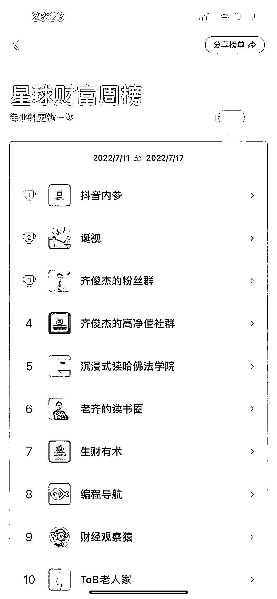

 

 

评论区：

 

 

小白 : 第一

辛亥 : 真的厉害！！！

a'ゞ初夏の约定 : 这思路厉害👍

薯总 : 不断增加自己的势能

东哥 : 我的天，惊掉下巴。。。😱

凯 : 先赞后看

江吉仪-墨鱼 : 让盗版为我所用这个思路牛🐮

廿一 : 牛牛牛

# **# ****(**精华帖**)(533**赞**)**玩赚** ChatGPT **社群精益创业

# 的七天实录

作者：  凡灵逸尘

日期：2023-03-08

【玩赚ChatGPT 社群精益创业的七天实录】

各位生财圈友们大家好，我是郑州圈友凡灵逸尘。

近期很多朋友对我们，由河南生财群内发起的项目很感兴趣，所以就给大家分享下我们的经历。

带大家复盘一下我们创业七天的旅程，看看如何从几个人一拍即合，到一周多的时间成立一家公司。

也希望我们走过的弯路和踩过坑，大家以后在创业的道路上不要踩到。

原文如下：

https://vfqxua5lvd.feishu.cn/docx/WRqQd64xqoYxXexWorYcmDmrnfh评论区：

 

 

炮爷（不睡觉） : 这个视角可以的，还得是你

阿润 : 强

飞奔的白羊古城 : 强[强]

纪年 : 尘哥太强了

liliya : 太震撼了

阿满-擅长沟通 : 太震撼了

谢呈蕴 : 直呼卧槽

林勇-广深 : 凡哥，这一波干的漂亮

# **# ****(**精华帖**)(488**赞**)**情人节活动，拉新** 300+**，变

# 现** 5W+**，社群群主如何借助**CP**经济增加营收？

作者：  理白

日期：2023-05-15

520抄作业 | 情人节活动，拉新300+，变现5W+，社群群主如何借助CP经济增加营收？

大家好，见贴欢喜，我是生财龙珠圈友理白，距离520情人节还有5天时间，足够我们布局一场不错的CP社群拉新方案，本文将结合我在上个情人节（3月14日  白色情人节）期间，靠CP营销拉新300人，变现5W+的全过程，给做线上社群的小伙伴提供一个发售、营销及承接流程。

本贴方法，可供50人以上陪伴型社群使用，人群基数越大，拉新效果越明显，有高客单价产品承接者尤为适用，可在七夕节、任意月份14日（西方情人节）、上元节、中秋节、圣诞节、女神节等可与「CP经济」挂钩的节日使用，百试百新。

为了方便大家阅读，请移步飞书：

文毕，感谢我的爱人  ，CP经济只是一种营销策略，但你对我的爱、支持和包容，是我勇气和底气的根源。如果没有你一直以来的鼓励和支撑，我也不会认识  ，不会认识  姐，也不会接触生财有术星球，不会有机会与这几万多名正能量的圈友们相逢与此。遇见你，和你们，是我的福气。

 

 

这篇帖子写在情人节前夕，细节已全部讲述，各位群主可根据自身社群情况，进行细节微调。如果这篇关于CP营销的小帖子，对大家有帮助，那是我的幸运。

但我更想说的是，请大家珍惜眼前人，珍惜那生命中流淌的爱意和幸福，这远远比几万块的营收，要重要得多。

晚安，生财有术，并提前祝大家情人节快乐，祝有情人终成眷属。

祝大家，生财有术，恋爱交友，亦有术。

https://fcjmogm9bc.feishu.cn/docx/OkyOdA1zqo6J7oxQUFBcSDrqnUK评论区：

惠玲 : 比白！牛！！！

郑韩 : 厉害了！

有匪君子 : 我掐指一算，六一我还能再吃到一波狗粮？

自证预言家Saki : 学会了！！520抄作业用起来

小浩哥 : 理白太牛拉

橘子有何 : 🐮！！

理白 : 520一起抄作业喽，用赚来的钱谈恋爱，和爱人一起赚钱钱。[害羞] 冯一晓 : 比白粉在此！🐮

# **# ****(**精华帖**)(246**赞**)**通过生财有术提升商业认

# 知，我做付费成长社群实现月入** 3W+ **的经验分

# 享

作者：  🔥逆熵增者💰

日期：2022-11-17

生财有术的圈友们，大家好，我是逆熵增者，一位逆变成长的90后，目前副业做自媒体和社群。

 

 

这是我在生财有术第一篇帖子，希望对大家有帮助。

今天主要分享一位普通人是如何通过阅读写作，2年赚到40W的经验。

下面是我这两年按照时间线的成长轨迹：

❶2020年前，还是一条咸鱼，下班后每天沉迷6小时王者荣耀的网瘾少年；

❷2020年初，疫情来了，居家隔离了2个多月，没什么事情就开始看书，没想到从此养成了阅读的习惯。

那一年总共读完170本书，蜕变成另外一个人，后来把网名改成了【逆熵增者】，一位试图对抗熵增的猛人；

2021年继续大量阅读和各种学习，读完130本书，也就是两年时间读完300本书。

这300本书里面，一半和个人成长领域相关，三分之一和搞钱相关，包括投资理财，财商思维等等书籍，这些对我后来做知识付费帮助都非常大。

边看书的同时边输出读书笔记，2020年1月第一次在互联网上写点东西，那时候开通了简书和微信读书，写了10个月，但依然没有多少粉丝，阅读量也是两位数。

2020年10月份加入阿猫读书的成长星球开始日更写作100天打卡活动，同步开通了公众号。

 

 

❸2020年12月底，创建付费成长社群，到今天为止，一年零10个月，总共有1000+小伙伴加入一起学习和成长。

❹从2020年10月到2022年10月，两年时间，靠日更公众号700天，涨粉1.5W，变现40W；

❺1年多时间，通过微信读书APP和公众号引流到个人微信10000人，开了两个微信。

❻2022年，一个人，在5天时间里成交114单，拿下剽悍私域成交高手实战营冠军。

以上就是我这两年多的一个经历，我确实是从一个**“**三无**”**的普通小白开始做起来的，没背景、没人脉、没资源。

不过我也有一些优势，比如我有超强的自律能力，不错的学习能力，一定的阅读写作能力，对自己够狠，够拼，有极强的目标感等等。

然后通过两年多的努力，拿到了副业月入3万的成绩。

所以今天来分享我是如何通过生财有术赚到前20万+的。为什么说是在没有加入生财之前呢？后面会揭晓谜底。

分享框架如下：

一、我是如何通过生财有术提升商业认知的？

二、我的项目是如何从零开始做起来的？

三、做付费成长社群的经验分享

 

 

四、新人想做有什么样的门槛？

五、我和生财有术的缘分

六、后续如何优化？如何做大？

一、我是如何通过生财有术提升商业认知的？

# **# ****1. **亦仁的亦无所知、生财有术公众号所有公开文章

这也算是一种白嫖大佬的智慧，因为生财有术公众号每周会分享一些精华帖内容，对于当时没什么钱，也没付费学习意识的我来说就是最佳的学习方法。

从亦仁大大那学到了以下几点

**1.1 **你要增加自己的表达和输出。

你要让别人知道你在做什么，你的价值观是什么。

** **

 

 

所以我开始在微信读书、公众号和知识星球日更分享，输出自己的学习和成长心得，以及自己的价值观。

**1.2 **第二个就是你要沉下来做一件事。

这件事情是什么不重要，但是你要沉下来开始做，开始迭代。有成果出来之后，加上你有表达，其实是一个双向的叠加。

我就是沉下心来阅读和写作，然后运营社群，虽然每天需要花很多时间和精力在这几个方面，但是很有收获，也算值了。

**1.3 **如果真的有流量红利，如何看见并抓住它？

最重要的三点：赚钱的欲望、敏锐度与执行力。

赚钱欲望是发动机，敏锐度是方向盘，执行力是油门。

这个比喻简直太精准了，目前我有赚钱的欲望和执行力，缺的就是敏锐度，所以需要加入生财有术这样的搞钱圈子，提升敏锐度。

**1.4 **从算账和概率的角度去理解问题

比如写一篇文章从长远来看是不是值**1000**，比如计算自己的时薪，算一下我们的一个小时值多少钱。

 

 

这个方法我用了，比如日更公众号600天，变现30万，相当于每篇文章给我带来500，未来可能还会更值钱，所以这是我可以持续日更的一大动力。

因为形成了正反馈循环回路，再做这件事就比较顺心了。

在此，特别感谢亦仁大大的这4条赚钱建议，总结一下，主要包括利他、长期主义、会算账、深耕一个领域、知行合一、持续输出等等。

亦仁还有一句话对我影响挺大，虽然和赚钱没有直接关系，但这一点很重要。

他说，认知上的最大竞争，其实是信息输入量的竞争。

原因很简单：你输入的信息越多，你看待问题的视角会更多元，分析问题也会更有深度，也就具备了洞察力。

所以我就大量阅读输入，每天输入3小时，目前已经持续1000+天，没有间断过一天，哪怕大年三十那天我还在看书学习。

我现在的阅读速度得到了飞速增强，初步统计，每小时可以读完2万字，所以平均每天至少输入6万字，一年下来总输入超过2000万字，这两年基本上都是这个量，每年花在学习上超过1500小时。

再回到这句话，输入的信息越多，你看待问题的视角会更多元，分析问题也会更有深度，也就具备了洞察力，以上这些能力在不知不觉中真的会得到提升。

**2. **明白老师：赚钱兵器库

 

 

赚钱4要素：需求、流量、营销、变现。

**2.1 **需求

别人都有什么痛点、痒点、爽点？

别人都有哪些需求和待解决的问题？

什么类型事情能赚钱？为什么？怎么做？

**2.2 **流量

获取流量的方式和渠道有哪些？为什么？怎么做可以更好的精准引流？

**2.3 **营销

如何推广产品，能更容易卖出去？为什么？怎么做？

什么样的文案更容易成交？如何增加我们的信任感？

**2.4 **变现

不同类型的产品，

该如何赚钱？为什么？怎么做？

如何更好的交付我们的产品或内容？

 

 

上面这个清单，就是高手的「赚钱兵器库」。

从这个兵器库学到了想要赚钱，就得了解别人的痛点和需求，还需要搞到相应的精准流量和用户，做出相关的产品，比如课程或者社群，然后加上一定的营销技巧进行转化。

以上就是赚钱的通用法则，我就是按照这四个要素去搭建自己的付费社群。

想要在互联网赚钱，主要就是搞流量和搞产品，然后加上转化方法就可以变现了。

后面我会详细分享我的搞流量方法。

# **# ****3. **曹大：赚钱的本质

这是《生财日历》里面的一篇内容。

赚钱的本质是什么**?**

赚钱的核心思想是交易，只有交易才能给你带来金钱。所以要先建立一个认知基础，理解一切皆交易。

交易的核心，不外乎两点：

 

 

第一，你掌握的资源；

第二，你所能找到的买家，也就是愿意为这个资源付费的人。

在此过程中，等价交换可能是不存在的，但互惠交换永远存在。

从中了解到要想赚钱就得有东西和人交易，这个东西可以是自己产品和服务，我也一直在思考自己有什么价值可以提供。

因为我在一年时间里看完**170**本书，学习能力得到了提升，个人成长也一年顶三年，所以我萌生了将自己一年多以来学来的东西总结出来形成一套方法论，打包成课程。

这就相当于一个知识付费产品，然后再找到有这方面需求的用户就可以啦，所以我去各大学习平台分享自己的读书笔记和心得，主要包括微信读书和简书，还有后来创建的公众号。

**4. **肖厂长私域**5**力模型

这个模型非常厉害，对我帮助极大，能做到现在这个规模，也得益于运用了这个模型。

总结为五句话和一个公式：

001 第一性原理

和粉丝保持长远而忠诚的用户关系，把粉丝当做朋友一样来相处。

 

 

002 两大主阵地

公众号和朋友圈。

003 内容三要素

①真实真诚

②持续分享

③干湿结合

004 成交四步法

①引导加好友

②发圈建信任

③活动造势能

④私聊促成交

005 “五力”模型：

①个人IP力

②加微力

③产品力

④运营力

⑤内容力

私域变现核心公式：

 

 

私域资产 = IP力 x 加微力 x产品力 x 运营力 x内容力²。

想要做好个人品牌就得持续打造这“五力”，尤其是内容力，这是唯一一个带平方的要素，可见内容的重要性。

内容是私域的核心能力，内容是1，其他是0。引流需要优质内容、建立信任需要内容、成交同样要靠内容、最后的交付也需要内容。

而我这两年多一直在做内容，比如日更公众号已经700天，每天大概花2小时。持续给读者提供价值，通过好内容慢慢积累了1.5万粉。

比如在微信读书持续分享书评，每看完一本书就输出一篇，分享出去，目前已经有2万关注。

两年不到，通过微信读书和公众号引流到个人微信将近10000人，这些都是比较精准的老铁。

比如从今年1月1日开始，每天更新3-4条朋友圈，雷打不动，截止目前已经发了1200+条朋友圈。

然后通过朋友圈的持续建立信任，一年零10个月时间，有1000+老铁付费加入我的成长社群。

以上就是持续分享带来的结果，所以猫叔的金句“持续分享，黄金万两”确实很有用。

 

 

因为持续分享就是在输出价值，建立信任，有了这个基础，才能有后端的私域成交。

凡事先给出去，才能有收获，利他才是最好的利己。

二、这个项目是如何从零开始做起来的？

**1. **我为什么要做成长社群？

建社群的想法应该是在20年8月份，那时候刚了解到有付费社群这东西，觉得挺好奇的，就去参加了一个些，然后觉得自己未来也可以做这一块。

我就思考要想做一个付费社群需要具备哪些条件呢，第一肯定需要在某个领域特别强。

第二肯定需要大量支持和信任我们的粉丝。当时这两样东西都不具备。

只不过那时候已经看了100多本书，尤其在个人成长、时间管理、高效阅读等方面积累了不少，也在这些领域建立了自己的知识体系。

后来在20年的年末做年终复盘总结的时候，发现自己一年以来学习成长和收获巨大，统计了阅读、写作、复盘、健身、早起和投资理财收益等等。

 

 

这时候我就在想，我是不是可以将自己这一年所学的所有知识和以及成长过程梳理一下，将其整理打包成一系列课程，教给有需要成长和改变自己的朋友。

也就是

一个人阅读不如带着大家一起阅读；

一个人写作不如带着大家一起写作；

一个人成长不如带着大家一起成长。

基于这个初心，我就启动了此项项目，通过帮助别人的同时，顺便赚点钱。

**2. **提供什么样的产品和服务？

年度成长社群，定位是阅读写作和个人成长方面，客单价365/年。

主要在微信群里交付，每周末一场分享，一年至少52次分享，另外也会组织内部共读营。

共读自己的《逆熵增成长之路》这本书，或者其他好书，比如《纳瓦尔宝典》《财富自由之路》《认知觉醒》等等。

除了微信群，还有知识星球，主要用来沉淀每周的分享内容，以及引导小伙伴在星球写作打卡，锻炼读和写的能力。

我为什么选择微信群做交付？

 

 

虽然说用微信群，运营成本非常高，需要花很多时间和精力维护群，但是和用户接触更近，粘性更好，而且每周都有固定时间一次分享。

**3. **用户从哪里来？

我的公域流量来源比较单一，主要来自微信读书和简书，通过爆款书评和读后感引流到公众号和私域微信。

下面详细拆解我是如何通过微信读书这个APP进行引流的。

引流就是“要到有鱼的地方去钓鱼”。

而微信读书就是适合我的“鱼塘”，2年前开始使用这个APP进行阅读，目前累计3000+小时的阅读时长，现在马上突破2万粉丝关注。

**3.1 **我总结了一下， 微信读书共有**3**个地方可以引流。

# **① **自我介绍栏

可以留下自己的公众号和微信，但不能出现这几个字，所以就用谐音代替了，比如公主号、薇信等方法。

** **

此处可以留下一个钩子促进添加微信，比如可以加入自己的阅读交流群，或者电子书，学习资料等等。

 

 

可以用一些微信读书还没有上架电子书作为引流资料，因为有很多人需要。

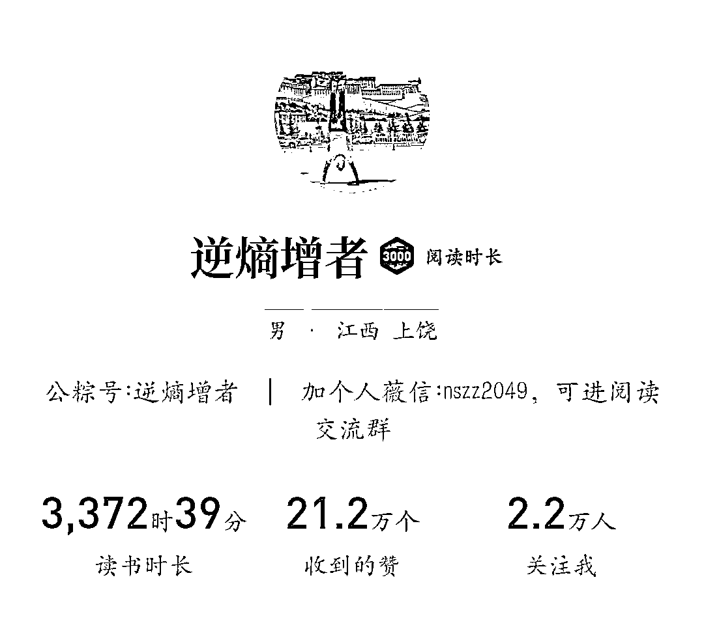

# **② **每本书的评论

我有个习惯，每看完一本书，就要输出一篇读书笔记或者书评，然后发在微信读书里，顺便在底部留下我的公众号，目前至少发了200本书的书评。

 

 

其中有一篇算是爆款，我在《认知觉醒》这本书的评论点赞数已经破2.4万了，目前应该是微信读书最大的一个点赞量。

因为这篇书评，每天都会给我带来200+的点赞和评论，以及关注。

如果这篇评论的流量不错的话，还可以在这篇书评底下评论，再次引导加微信或者关注公众号。

比如：我有这本书的电子版，需要的小伙伴可以添加我的微信领取☞xxx

 

 

再比如：两年读完300本书，我们还有一个免费的读书交流群，想加入的小伙伴可以加个好友☞xxx

# **③ **在微信读书里关注自己的公众号

我每天都会把文章精华部分同步在自己的公众号评论里，这样关注我的书友都可以看见我的评论，同时就会关注的公众号。

就这一波操作下来，每天可以给我的公众号带来20个左右粉丝，同时每天也有10几个书友添加微信。

同时还得将公众号粉丝引流到个人微信，这一块生财圈友肯定比我更熟悉了。

**3.2 **今天简单分享 **3**个可以引流到个人微信的位置。

# **① **文章底部

可以留下一个钩子，比如加我微信，可以免费领取价值999的《个人成长52条干货笔记》，目前用这个资料两个月时间引流1000+小伙伴加微信。

# **② **关注后的自动回复

 

 

除了留文字，还可以直接上一张图片，所以我设计了一张带着我个人二维码的图片。

这一个方法也是参考了许多大佬公众号，然后做了一个优化和调整。

这个作用是，减少粉丝添加微信的难度，不用复制粘贴微信号，然后去添加，直接扫码就能完成这个动作。

# **③ **自定义菜单栏

可以在某个栏里加上自己的个人微信，也可以加上自己的产品，比如我们的知识星球和成长社群等等。

**3.3 **如何转化和变现？

通过做知识付费变现，用日更公众号和朋友圈建立用户信任，一年多时间靠私域成交1000付费用户。

三、私域运营和转化变现经验

 

 

**1. **关于朋友圈的重要性

这一块主要靠朋友圈，因为朋友圈真的太重要了，宇宙的尽头是铁岭，私域的尽头就是朋友圈，朋友圈就相当于是我们自己开的一家店。

以前我还没有意识到朋友圈的重要性，所以第一年没怎么发朋友圈，大部分靠公众号转化，而且还是一周发一次成长社群和知识星球的二维码。

一篇公众号推文，最多的一次才转化了6位加入社群，但有时候我发一条朋友圈就可以成交10几位，我记得最好的一次是，一天内有25位小伙伴从朋友圈加入。

再分享一个数据，2021年一整年才200多付费用户，但是从今年开始，每天发4条朋友圈，持续260天，截止目前今年已经发了1100条朋友圈。

也就是说这10个月时间靠朋友圈转化了600位老铁，是去年的两倍还多。

可见私域朋友圈的威力。

下面就详细分享关于发圈内容和发圈时间。

**2. **朋友圈应该发什么内容？

**2.1 **日常生活圈

 

 

个人品牌首先要是个人，所以一定要有自己的生活圈⭕，用户是跟人打交道的。

任何成交都建立在信任的基础上，如果你的朋友圈没有生活状态，你的微信好友会认为这仅仅是一个营销号，无法对你有更深入的了解，也就很难跟你发生金钱关系，起不到潜移默化宣传的效果。

优秀的成交者，都是在生活中将产品卖给他的用户。生活内容可以从学习、情感和休闲等角度，去分享正向的生活态度、价值观、专业知识等。

让你的微信好友在翻看你的朋友圈时感到有趣、有用、有能量，这是与好友建立信任感的重要一步。比如我会偶尔晒晒哇，偶尔晒晒出去旅游拍的美景，偶尔晒晒好吃的，好喝的。

**2.2 **专业价值圈⭕

就我个人而言，我经常会在朋友圈发读书和写作心得、学习方法和时间管理等内容，让用户了解自己的专业程度。

毕竟用户觉得我们有价值，才会留下来，成为我们的忠实粉丝。

同样，我们分享的专业知识也要和自己的定位相关，建议分享的内容要能为用户解决问题，真正有实用价值。

给用户直接可以吸收的知识点，比如自己付费内容也可以截取一部分分享出来。

**2.3 **用户反馈和成交截图

 

 

这个非常关键，其实我以前不好意思发成交截图，感觉有点营销味太浓，但是我看朋友圈很多人都会晒，所以后来我也试了试，发现效果很好。

如果你的朋友圈里都看不到有人下过单，又怎么能够让人相信你的产品真的卖出去过呢？

所以，一定要发用户转账的截图、用户好评的截图、用户加入社群之后的前后对比变化等等。(此处提醒：记得打码，或者征求本人同意再截图发朋友圈)。

这些截图就类似淘宝的买家秀一样，是站在用户的角度去证实产品的效果，用户说好才是真好。

人都是有从众心理的，适当地发一些用户的反馈，有利于激起潜在用户的消费欲望。

当然这些的内容不宜发布得过于频繁，造成刷屏的现象。在推出新品或进行某个活动的时候可以发多一点，让用户感受产品或活动的火爆程度，刺激用户的消费欲望。

这里可以用上浪潮式发售的方法，目前正在学习中。

**2.4 **产品圈

我们在朋友圈发布内容的终极目的还是为了带货，把产品卖出去。

 

 

产品内容的发布并不是简单地发产品图，更应该是产品的用户口碑、故事、用户在社群里面的改变，比如养成阅读、写作、复盘等习惯。

还可以适时地发布优惠活动、促销信息等，我一般都会借着各种节假日推出优惠活动。

**3. **朋友圈发布时间

朋友圈发布的时间也是有讲究的，规划好了朋友圈的内容之后，我们就需要规划内容发布的时间。

我们可以根据人的认知规律、生活习惯，例如每天玩手机的时间和规律，来规划我们每天的信息发布时间。

根据朋友圈用户活跃的数据分析，有四个时间段是大家浏览朋友圈的高频时间段。

**3.1 **第一个时间段是早上**7**点到**8**点。

这个时间段大部分人刚起床或者在上班的路上，是一个工作时间的空白点。很多用户早起第一件事就是去刷朋友圈，看看有没有新鲜的事情。

早晨更加适宜发布一些正能量话题，为好友打气，给他们一天的好心情，所以这个时间点我通常是发一张早起打卡图+一个金句，或者关于读书和学习的内容。

**3.2 **第二个时间段是**11**点到**13**点。

 

 

这个时间段是大多数人的午餐时间，我们可以选择在这个时间段发布一些与个人专业、知识、技能相关的内容。

也可以展示我们已有的成绩、案例和口碑，将我们的个人IP与用户需求、产品价值结合起来，形成真正有用、有价值的内容。

我基本上在中午时间段转发自己前一天的公众号文章，加上一句介绍语，相当于给公众号二次触达和曝光。

**3.3 **第三个时间段是**17**点到**19**点。

这个时间段大部分人都在摸鱼或者下班通勤路上。在这个时间段，我们可以以生活化内容为主，展示有趣的段子、诱人的美食，展示我们的休闲生活。

这个时候我一般晒晒娃，或者出去玩的照片。

**3.4 **第四个时间段是**21**点到**23**点。

这个时间段是用户使用手机的高频时间，这个时间段发布的内容，要主打福利相关，比如用户互动、优惠活动、促销等。这个时间段用户最容易产生冲动消费，然后睡前我一般会发一条今日复盘的朋友圈。

每天发朋友圈的频率多少比较合理？

我觉得找到最适合自己的推送频率就行，没必要强求。

 

 

逆熵增成长社群权益

一、微信群内一年至少进行52场分享

主要分享一套【成长体系课程】：

成长=阅读输入+深度思考+极致践行+写作输出+复盘反思+持续迭代

包括以下内容：

①如何高效阅读？

②如何精进写作？

③如何构建知识体系？

④如何保持自律成长？

⑤如何做好时间管理？

⑥如何运营公众号？

我自己基本上是雷打不动每天3-5条，就在介绍的那几个时间点发圈，现在已经养成习惯了，每天到点就发圈，其实我连闹铃都没有设置，就是产生条件反射了，到了什么时间点自然会想到该发什么圈了。

其实，有很多生财圈友的朋友圈都运营的很好，比如王子冯老师，梁靠谱老师等等。

**4. **成长社群的招募文案

文案也是成交非常关键的一环，我没有专门报班学过，基本上就是看书，然后看同行的朋友圈文案，以及他们的产品发布文案，不断模仿和改进。

但总得来说，离不开《影响力》这本书里面提到的几点社会心理学，制造稀缺、限时限量、权威、从众效应这些。

我的社群文案如下：

 

 

……

二、一年共读12本个人成长好书

三、免费体验一期共读营(价值66)

四、赠送我的书《逆熵增成长之路》

五、知识星球：50万字个人成长干货

六、可以链接800位优秀的小伙伴

价格：原价465/年，现在加入可优惠100，只需365/年，一天一块钱就可以享受以上所有权益，马上就要涨价咯。

只限前20个优惠名额，目前已经用完15位，仅剩最后5位，抓紧时间哦。

【社群使命愿景】以生命影响生命，点燃更多人的改变“引信”，让10000人爱上阅读和学习，通过自律和行动获得富足人生。

欢迎你的加入，和800+优秀小伙伴

一起学习，一起成长；

一起阅读，一起写作；

一起行动，一起自律；

一起提升认知和思维！

四、新人想做会有一些什么样的门槛

 

 

①需要持续内容输出能力

②需要引流加微信的能力

③需要一定文案转化能力

④需要持续输入学习能力

要真的能做到日拱一卒，功不唐捐，肯下日日不断之功，每天进步一点点，每天输出一点点！

因为通过做个人IP赚钱，本身就是一个赚慢钱的活，需要花比较长时间积累用户信任，最后才能成交。

如果问这个项目最大的门槛是什么，我觉得就是耐心！

需要持续输出内容，那么下面就分享一下我是如何做到日更的，以及我是如何生产内容的。

做内容的经验分享

首先，我在做自媒体之前没有一点写作基础，高考语文作文还不及格，800字作文对我来说就是一场噩梦，每次写作文就像挤牙膏一样，而且还挤不出来那种。

所以，像我这种没有基础的小白，依然可以做出内容，我总结了一个方法，那就是去借。

第一，向书本借。

 

 

我在最开始的写作，全部是通过阅读书籍，然后把书中的重点内容摘录出来，形成一篇读书笔记，做知识的搬运工，这是第一步。

第二步，升级为书评。

这就不仅仅是摘抄了，需要加入自己的思考，关联自己的经验，还得形成自己的逻辑结构，最后再加上自己的践行清单。

分享一个写书评的模板：

开头：今天看了xx书，分享一下我印象最深刻的3个点。

中间：分别写①②③三个感触点，把书本内容和自己的感悟写出来。

另外，再加一两条下一步的践行清单。

结尾：总结一下内容，抒发感情。

我的很多文章都是这么出来的。

第三，构建自己的知识体系。

 

 

这是我能够日更写作最为关键的一步，因为写作并不是从一张白纸从0开始写的，必须基于已有的写作素材。

因为我两年看完300本书，所以积累了大量的写作素材，我主要用手机备忘录进行知识管理，目前已经积累3300+条笔记，大约300万字。

大的分类主要有：

①阅读类

②写作类

③时间管理类

④学习类

⑤个人IP类

⑥思维类

我的公众号更文和成长社群也主要围绕这几个方面进行，所以前端的内容和后端的交付也是统一的定位。

做知识体系还有一个小妙招：

可以先列出该领域100个问题，再根据问题寻找解决的方法，拓展阅读和学习。

构建知识结构就像搭建乐高城市一样，有一个大的框架，再根据每一个小的知识点拓展相关的内容，把这个小的知识点汇集在一起就是一个大的知识结构。每个人掌握的知识不同，演化出来的结构也是不同的。

 

 

第四、学会混剪。

乔布斯说，创新就是把各种事物整合到一起。把旧的元素重新组装在一块也算是一种重新。

所以，做内容也可以套用这个思维，当然并不是完全抄袭别人的内容，还需要用自己的话重新表述，再加入自己的逻辑结构。

在写作这一块我们最应该原创什么呢？

猫叔说，每个人的经历都是独一无二的，必然也是原创的。

你最有可能也最应该原创的，是你自己的故事。尤其是你不断突破自我，取得优异成绩的故事。

这些故事，很能给你的个人品牌加分。

所以，你的经历，你的故事，你的践行，你的案例，你的经验都是最好的原创。

第五、提前规划好每周要输出的内容。

比如每周天更新周复盘文章，总结一周的收获；

 

 

比如每周两篇书评，推荐好书；

比如每周分享一篇关于阅读主题，一篇写作主题，一篇学习主题，一篇时间管理主题的文章。

以上就是我做内容的经验分享。

五、我和生财有术的缘分

我是在一年多之前通过明白老师的公众号才知道有生财有术这么一起谈钱不伤感情的圈子。

因为明白老师经常提到生财有术和其他一些圈友，包括每年的418会员日之前都会做一波宣传。

我就是今年418才通过明白老师加入的生财有术。

之前一直通过生财有术公众号和生财日历进行学习。

后来看了100位大佬的《2021赚钱建议》，以及买了一本《生财日历》，真是大开钱眼，非常哇塞，虽然每篇字数不多，但是非常精辟，对我帮助很大。

从中了解到花爷、曹大、涛哥、芷蓝、盗坤、狗哥等大佬，后来关注了他们的公众号，也进了一部分知识星球。

 

 

那段时间就一直浸泡在这些生财大佬的圈子里，每天学习一点，慢慢提升了一些搞钱方面的认知，后来才不断优化自己的付费社群。

六、后续如何优化？如何做大？

花爷前些天一篇文章中说，对普通人来说：

稳定月入3万是一个硬门槛。基本上，这是普通人单干自媒体的天花板了。

我现在的收入状态基本上就是稳定月入3万，持续9个月了，确实快到天花板了。

所以，也想借着这个机会向亦仁大大和各位生财大佬请教一个问题，基于我目前的情况，如何进行优化和做大做强，赚更多。

首先，我自己也思考过以下几点，可以帮忙参考一下是否可行，谢谢啦！

# **# ****1. **搭建产品矩阵

 

 

因为产品比较单一，就一个365的成长社群，所以可以新增一个低价的引流品、1000左右的训练营产品，再加一个万元级别的高价产品，比如私教、合伙人等项目。

# **# ****2. **拓展引流渠道

目前主要靠微信读书公域引流，渠道过于单一，可以将内容分发到多平台，比如开始做小红书和视频号，增加流量来源。

# **# ****3. **搭建一支团队

目前已经在做这一块了，因为想要完成两个优化，靠一个人单打独斗肯定完不成，所以需要团队协作。

# **# **不知道这些想法是否可行，希望大家帮忙参考参考，谢谢啦！

评论区：

 

 

文林 : 优秀

宋大刀 : 优秀～

🌲乐乐 : 叶老师，太了不起了！

感恩分享！！！

西昂 : 看到过这个书评！写的很好~

🔥逆熵增者💰 : 这么巧啊，谢谢鼓励

🔥逆熵增者💰 : 感谢乐乐的夸奖

也谢谢你的校稿呀/:heart

🔥逆熵增者💰 : 谢谢大刀鼓励

🔥逆熵增者💰 : 谢谢鼓励

# **# ****(**精华帖**)(135**赞**)**知识付费的机会：小众行业

# 照明设计从低阶到高阶** 5 **套课程实现年收入** **

# **16W+**

作者：  照明邦

日期：2023-03-08

小众行业也能做知识付费？

我就是通过知识付费让年收入额外多了 16 万，接下来，我将讲述我在开始做照明亮化设计知识付费时，是如何发现需求，验证需求，规划与设计课程，引流成交并让学员多次复购的整个思路。

当然，我不是专业搞营销的，这些都是我在实践过程中沉淀下来的，里面肯定还有能够优化和深挖的，大家也多多指教。

 

 

先介绍一下，我是照明邦刘滔，做亮化设计的，我从决定做知识付费开始，一共录制了五套课程，这五套课程录制了好几年，也售卖了好几年，特地统计了一下，这五套课程这几年带来的总收入是52万。

亮化设计属于照明设计中的一个分支，而照明设计本身就非常小众了，所以亮化设计这个行业估计也很少人听过，简单来讲，就是负责户外夜景灯光工程的设计。

很多做设计的，应该都会有个切身感触，就是每设计一个项目，永远都只能收一次钱。

不是天选之人，你再厉害，设计费也并不会比同行高多少。

所以单纯地靠做设计，收入的上限也基本被限定了。那能不能开启更多的收入渠道？能不能把自己的能力变成可被重复购买的商品呢？

这就是我做的知识付费，把自己的经验技能录制成课程去售卖，就能实现将一份时间多次收益的目的。

一、发现需求、验证需求

# **# **（**1**）发现需求：原来这么多人需要课程

 

 

我刚入行时，有个特别痛苦的小白期，就是啥都不懂，去网上也找不到专业的学习资料，非常害怕被炒掉，后面是给了公司设计经理 5000 块钱，算是拜师费，学习成长的辛酸，这里略过不表，后面总算在这行立足了。

在这个行业混了几年后，我开了自己的工作室。工作室刚开始是没什么业务的，所以无聊时去百度搜索了一下亮化行业的相关教程时，发现少得可怜，仅有的几篇文章还相当不专业。

于是空闲时就写了一篇亮化设计的专业文章《 PS 景观照明亮化设计效果图制作教程》，发表到了当时的照明行业论坛上。

没几天这个论坛的编辑就找到我，问能不能把文章发布在他们公众号上，我同意了，条件就是必须要带上我署名和联系方式。

当时只是觉得我写的文章，带上我的署名和联系方式是理所应当的，没想到后面陆陆续续有几十个人通过这篇文章加我好友，其中有十几个都有问我有没有相关视频教程。

如果只是一两个人问，可能我没什么想法，但是十几个人问我时，我就觉得不对头，隐约觉得出课程是个机会。

加上前面所说的，设计始终是干一票才有一票的收益，但课程却可以实现一份时间多份收益，这不就是我想要的吗？这个念头起来时，我非常兴奋。

# **# **（**2**）验证需求：嗯，肯定有搞头

 

 

在决定要做课程前，我也做了一些简单的调研：

**1**）搜索是否有相关竞品

会不会有人已经在卖这个课程了呢？

带着这个问题，我在全网搜索了一下，当时卖亮化课程的淘宝上有一个，在‘我要自学网’上有一套收费课程。

但仔细看了两套课程的介绍及里面展示的效果，我明显觉得课程质量不是很好，还不够专业，自信在课程质量上能超过他们。

**2**）百度指数查趋势

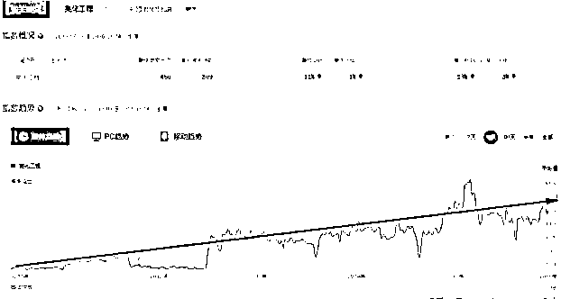

 

 

随后我又查了查百度指数，这是当年我仅有的一点营销相关的知识。

查看一番后，发现与亮化相关的关键词都处于一种逐年缓慢上升的趋势，这又让我增添了一份信心。

**3**）行业前景预判

那时的亮化行业利润空间比较大，设计与施工水平参差不齐，处在加速向正规化、专业化的方向发展。

再回想起以前跟行业老板们的聊天，他们说亮化行业远远没有达到饱和的状态，因为亮化工程只要半年一年就能出效果，

很多官员喜欢搞这种面子工程，有政绩，见效快，民众也喜欢，还能带动夜间经验和旅游业，可谓一举多得……

综合上面这些信息，我确信亮化行业虽小，但肯定还有一大波发展空间。而我来录制专业课程的话，应该是恰逢其时。

当时并没有什么最小可行产品的概念，仅凭着对这事的简单判断和美好想象，我便满怀热情地开始了第一套课程的录制。

 

 

二、规划与设计课程

其实我并不觉得“规划”这个词用在这里合适，因为并不是一开始我就想好了五套课程怎么做，它们更像是“生长”出来的。

# **# **（**1**）课程设计制作方法

第一套课程，取名《 PS 亮化效果图制作技巧全解密》，这个名字我琢磨了好些天才定下，

“全”：代表课程内容全面且多，事实上也的确如此，一共 68 个视频，8 大不同场景的案例，外加从业这几年自己制作整理的 30 多个 G 的独家素材资料库，毫无保留地全部给到。

“解密”这个词也很好，有神秘感，让人向往去获得。

那课程到底是怎么设计出来的呢？

其实就是围绕一个核心的“认知方法论”来打造的，后面几套也是同样的方法和思路。

**1**）认知方法论

 

 

什么是认知方法论？

就是你做这个事的认知加上你的流程或方法。只不过这个流程或方法是经过你无数次的实践和打磨过的，你把这个教给别人，别人按照你这个方法去学去练，也能保证拿到差不多的结果，这就是认知方法论。

**2**）总结出方法论

如果你有一门专业技能，就一定有自己的一套方法流程，去解决一堆类似的工作任务。

我们要做的，就是把这个方法流程总结出来。

比如做亮化设计，大体就是这么五个步骤：

项目分析——画面处理——灯效处理——环境处理——检查与确认。

所以有项目拿过来  ，都是这么个流程。

 

 

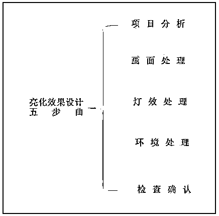

至于项目到底要怎么去分析，画面到底要怎么去处理，灯效到底要怎么模拟，这每一步又有更细致的一套流程，步步推进，直到可落地执行。

**3**）完善认知** **

光有方法，没有相应知识的支撑，也不可能掌握这个技能。所以就需要教他们关于这套教程涉及到的相关知识，也就是完善认知。

 

 

认知方面我觉得可以分为两方面，即基础知识与核心知识。

**① **基础知识

以 PS 亮化课程为例，学这套课程要了解哪些基础知识呢？

至少有三个，分别是 PS 软件的基本操作，常用的亮化灯具类型，以及常见的照明方式。

这些基础知识算是地基，后面设计项目时都要用到。

**② **核心知识

核心知识就是你自己总结的做项目的思路、技巧、流程，包含了前面的方法论。

**③ **概念打造

如果可以，最好能将认知层面的东西浓缩成一个简约的概念，这样更利于记忆与传播。

PS 亮化课程我们提出的概念是“亮化设计铁三角循环体系”，来告诉学员学习本套课程需要掌握什么知识，注意事项及它们之间的关系。

 

 

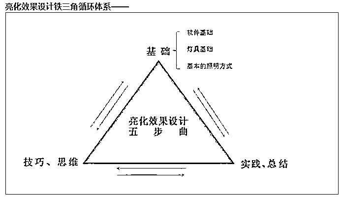

关于这样的新概念，我看很多写作课程中就常有，比如“六脉神剑写作法”、“12字爆款公式”等，都值得借鉴。

**4**）整理课程大纲

当方法论和相关知识都有了方向之后，就可以使用思维导图整理出课程大纲了。

很多时候我是一边整理导图，一边思考要用到哪些知识哪些案例。

课程大纲的内容其实就是把“认知方法论”进行扩充，通过相关知识、图片、视频、案例等方式，让其更详尽，更浅显易懂。

以 PS 亮化效果这套为例：

 

 

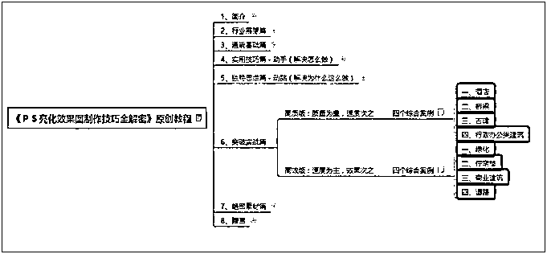

简介、行业展望篇、通晓基础篇、独特思维篇，这些都是从认知层面切入的，只不过如前所说，有的是基础知识，有的是核心知识。

实用技巧篇、突破实战篇，则是融合了认知、技巧与方法论。

实战篇里有八个综合案例，都会告诉你如何用方法论中的五大步骤，层层推进后，把项目设计出来。

只不过这里又分了两种情况，即有的项目要速度，有的项目要质量，所以分别用四个案例演示了它们的设计侧重点。

最后还有一个绝密素材篇，就是将我这些年整理收集，已经分门别类整理好的素材资料讲解了一遍，不然很多人拿到素材根本不会打开看，更不知道怎么用了。

当然，这个大纲我并不是一次就能整理好，需要很多天的反复斟酌调整，直到整个课程的内容在心中已经非常明晰，并确信新手看完这个课程，就能知道设计的流程、重点、难点，以及自己对教程的价值充满自信时，就可以进入到下一个阶段了。

 

 

**5**）课程制作

录屏软件有很多，只要你想录就能找到，我用的 Camtasia ，这不是重点。还是说一下录课的技巧和心得吧。

**① **录课技巧：

**1. ** 讲课前先把要讲的内容理顺

刚开始录课没经验，经常会出现卡壳的问题。那时我是把要讲的内容用文字写下来，对着念。

后面熟练了一点，对着思维导图讲就行。再后面只需要在脑海中将内容过一遍，配合导图上几个关键词就能讲。

不过不论怎样做，都会在课前做大量的功课，把内容理顺，做到胸有成竹，才能在录制时尽量少卡壳。

**1. ** 卡壳后尽量别暂停

卡壳的问题只能减少，往往无法避免。

有时候讲着讲着脑子会一片空白，或者虽然知道怎么回事，却无法用语言表达出来，这时候就会卡壳。

 

 

以前卡壳我会按暂停键，仔细想清楚后再讲几遍，顺了之后再录。

后面发现这种方法不可取，因为暂停之后，脑子就容易放松，放松之后再来录，就有畏难情绪，就会拖延不想录。

如果我是在不暂停的情况下，去想如何把话讲清楚，因为心中有“还在录课”这个事存在，脑子就会加速运转，解决问题的效率要高很多。

**1. ** 控制好每节课的时间

以前我在看别人视频教程时，发现一个让人很难忍受的点，就是一个视频动不动半个小时，一两个小时的时长，关键里面内容讲得拖拉，原理就几句话，但一番反复操作却要花几十分钟，知识点太少，看得让人昏昏欲睡。

所以我录课时，就特别注意这点，每个视频都不会太长，大部分都控制在 3-10 分钟内。

有的案例实在太长，会分成几节来讲。

从心理角度来讲，每看完一节课就有一个反馈，知道自己往前走。如果太长，没有反馈，就会没耐心，学不下去。

**1. ** 录制完后要重新剪辑

录课时除了卡壳、错漏之处，还有各种语气词、无意义的停顿等，都会影响课程时长及用户感受，所以一定要在录制完成之后进行剪辑，将这些部分处理好。

 

 

此外，我们做效果设计时，有很多部分是重复性的操作，比如抠图，这些部分是必须的，操作又是重复的。

那我会把这一段视频挑出来，进行加速播放，在不影响质量的情况下节省更多的时间。

经过上面这些处理之后，留下来的全是最有价值的部分，视频短小，而知识密度非常高。

在这一点上，有很多学员专门给我反馈体验非常好。

**② **做课心得：

看了以上的内容，也许大家会觉得做一门课也不难啊。那这里的心得，就主要说说我做课遇到的一些苦恼与纠结吧。

**1. ** 录制一个好课程，是相当耗精力，耗时间的

按上面所说的做课方法，通常情况下，一个五分钟的成品视频，我要花三四十分钟录制。如果加上前期的准备工作，比如案例的准备、相关资料的整理、讲解思路的梳理等所花的时间，至少要三到五个小时才能完成。

如果是一个 10 分钟的视频，那一整天时间是跑不掉的，往往还要加班才能完成。

另外如前所说，有的技术问题，虽然我知道怎么做，却也很难讲清它的原理，这时又要去找相关资料充分理解后，再去讲解，这里也要花不少时间。

 

 

再则一个视频反复录制三四次才算满意的情况，也是屡见不鲜。

所以要出一个不敷衍，让自己真心满意的好课，真的并非想象的那么简单。

**1. ** 畏难情绪作怪，我不想做课了

我主业是做亮化设计，工作特点是一旦有项目来，那就得加班加点工作好几天，好几周，甚至一两个月，闲的时候没项目做也会闲得发慌。

很多人想当然地认为，那不挺好，忙的时候做项目，闲地时候做课程啊。

实际情况是，当录课被项目打断一段时间后，是很难衔接上去的，会有强烈的拖延症，宁愿拖着，也不愿马上投入到课程制作里来，这本质上是一种畏难情绪。

因为做设计项目的时间过长，已经记不起之前讲课的整体思路了，记不得讲到哪里来了，也记不起下面要讲什么了，思路得全部再重新整理一遍。

另外，虽然有思维导图大纲，但细化到录课要讲的内容时，都是需要再去找资料的。在讲的过程，也会有新的想法出来，需要增加课程，那这节课是先讲还是后讲，是本章节来讲，还是另一个章节再讲，都需要考虑再三。

总之，这一堆问题叠加在一起，就会让人产生畏难情绪，很不愿意去做这事。

所以给我的感受是，录制课程最好能一鼓作气，不要被打断。

 

 

后面做 AI 绘画体验课程时，我推掉客户的设计项目，也要把 AI 课先录制完成，也是这个原因。

**1. ** 计划外的诱惑，你是否抵挡得住？

在录制完第三套课程后，有一段时间我去做自媒体了。做得还不错，高峰期百家号做到月入 3 万多，有这样的收益，到底还要不要按计划把下面的两套课程做完？

这个我纠结了很久很久，最终还是选择了放下自媒体，花了一年多的业余时间，专心把第四套第五套课程做好了。

这两个课程到目前为止，给我带来约 18 万的收益。如果单纯地从赚钱的角度来讲，自媒体可能让我赚得更多，但是把课程做完，却是来自内心的一种呼唤，

我觉得不把这五套课程完结，不把自己这么多年的亮化设计经验录制出来，我将来会后悔，录制好这五套课程，也算是自己的一个使命，和对这段职业生涯的一个见证一个交代吧。

所以我想问，如果是你，能否坚守初心？

# **# **（**2**）产品链：大家需要的不止一套课程

 

 

第一套课程推出后，获得了行业内的很多好评和推荐，同时有更多的人问我，有没有亮化动画视频教程或者其他亮化方面的课程？

从这时开始，我意识到，大家需要的不仅仅是一套课程。

每个人都需要成长，而一个小白成长为高手的过程，需要的往往不是一套课程，一个技能。

而是在他成长的每一个节点上，都需要有人指点或者说有套课程来教他怎么做，至少在咱们亮化设计行业是这样的。

**① **产品链的概念

想通这一点后，我便又规划了从低阶到高阶的四套相关课程，总共五套课程。

说是“规划”，其实没怎么思考，是从脑海中自动跳出来的，因为平时做一些高端项目，就需要同时用到五套课程的内容来做设计。

这五套课程，基本上每一套都是后一套的基础，只有学会前一套，才能继续学下一套。

比如第二套是讲 AE 亮化动画的，想学这套，就必须要会第一套 PS 亮化效果图，想要学第三套，就需要前面两套为基础。

我把这个叫做“产品链”，每一套课程都独立成章，都能解决设计师在某一阶段的问题，教会他在这一阶段所需要的技能，同时各自之间又相互紧密联系，像一根紧密连结的链条，指引着设计师一步步走向高手之路。

 

 

如果想成为真正的高手，那么这五套课程必须都会，购买了其中一套，还想继续成长的话，那就必定需要继续购买下一套，这就是产品链的好处。

有了产品链的思维后，在后面每套课程的录制中，我都会有意识地把这些信息植入到课程中，告诉学员，除了这套，后面还会有几套课程会出，想要成为高手的话，后面的课程都需要掌握……

这个操作会让学员对后面的课程有所期待，有的甚至主动询问下面的课程什么时候出，某套课程能不能先出，也为后面我先收钱再做课的操作埋下伏笔。

**② “**产品链**”**课程的设计逻辑

五套课程的设计逻辑，是根据一个完整的、高端的亮化项目所需要创作的内容与设计能力，反向拆解成亮化设计师成长过程中必定会遇到的节点问题，再针对性的出一套能解决相应问题的课程。

比如，所有亮化设计项目最基本的要求就是要有亮化效果图，这是设计师必须要会的能力，是新手要过的第一关。这就对应了第一套《 PS 亮化效果图制作技巧全解密》，这套课程会教你怎么做亮化效果图。

效果图有了，但不够生动。因为夜景灯光有很多是动态跑动的，静态效果图不够形象，需要用动画去模拟，才更能打动客户。

那么第二套《一天精通 AE 亮化动画》将教会你怎样把静态效果图做成动态灯光动画。

 

 

效果图和动画都有了，但你为什么这么设计呢？谁来给我解释下？

这就对应着第三套《 PR 多媒体解说动画》。通过多媒体动画讲解的方式，告诉客户项目的设计思路、预期效果、应用产品、安装维护等。

后面两套以此类推。

# **# **（**3**）课程定价

价格上，前面三套都是 498 一套，第四套 998 ，第五套 4800 。

前三套定价不高，是因为亮化行业新手工资并不高，北上广深也许可以拿到七八千，但二三线城市基本都只有四五千。

那么 498 的价格，即便买三套，对他们来说压力也不是太大。

第四、五套相对更专业，且具有唯一性，全网独有，其他地方没得卖，也没人教。

一般是行业高手才有需求购买，价格高一点，他们也承担得起。

总的来讲，在定价上，我没做多少功课，几乎完全是依据自己对课程价值的判断来定价的，

 

 

三、课程引流与成交

我能想到的，需要这几套课程的人，要么沉淀在行业论坛、社群里，要么会主动百度搜索遇到的问题，要么会去淘宝看有没有相关课程。

这三个里面我没弄淘宝和行业论坛社群，主攻百度搜索结果。而我所了解的是，知乎、B站在百度结果中的权重比较高，所以主要在这两个平台引流。

整个引流成交过程可以分为四步，即知乎 B 站引流、公众号进行过滤、朋友圈视频号孵化、微信一对一咨询成交。

# **# **（**1**）知乎**B**站引流

引流分文章和视频，内容主要是一些行业相关知识，自己的一些见解感悟，一些行业干货等。这些行业干货和感悟，没有经历过的人，其实是很难仿写的，或者写出来是没有感情的。

 

 

而我写的专业文章和视频，往往是新手必定会遇到的问题，或者自己在行业的所见所闻所感，比较能打动人，这也许是为什么有的人加我好友之后，二话没说，直接转账购买的主要原因吧。

当然这些干货文章和视频，也同样是很费时间精力的，且很难马上见效，所以非常考验人的执行力。我也只是在觉得这个话题或内容，真的很有价值时才会动手去做，都是日积月累，积少成多的。

另外，B 站对引流行为好像没什么处罚，我视频里放二维码都没问题。知乎以前不行，现在不知道可不可以，但我在知乎文章及账号主页中放公众号信息没问题，

比如：更多亮化设计课程，可关注公众号“照明邦”，这是没问题的。

在所有的引流动作中，只要能带上勾子的，我会尽带，并会说明关注公众号后，可以获取一些专业素材资料。

# **# **（**2**）公众号进行过滤

流量过来后，会经过公众号的过滤，公众号会设置引导加私信，里面有也课程介绍。

如果关注了公众号，还来加我私信的，说明这人的成交意愿相对更强烈。如果没加的，往往只是好奇或购买意愿不强烈。

 

 

# **# **（**3**）朋友圈、视频号孵化

加了好友的，一部分会在咨询后马上成交；一部分会觉得课程太贵，暂不购买；

绝大部分在加完好友后处于静默状态，也许是信任度还不够，也许是不着急学习，也许仅仅对这行感兴趣想多了解一点，总之他们会在好友列表里潜伏着。

对于潜伏在好友列表的这批人，主要是通过发朋友圈、视频号让他们触达到关于我的信息。

这个不断触达的过程，就是孵化的过程。

时间长了，信任度积累到一定程度，那些真正有需求的人自然就会过来咨询。

我遇到过很多个加我好友几年，没聊过一句话的，突然跟我说要买课的。

# **# **（**4**）微信一对一咨询成交

如果一个人看了课程介绍，还来主动咨询，那说明成交意愿已经足够强烈了，这时的成交会非常顺畅，往往只需简单的几句介绍就会付款。

 

 

还有一些没看教程介绍的，在咨询时，我会先告诉他把介绍先看一遍，看是不是他需要的。

或者直接语音聊天，也能快速把对方的疑虑解决掉，成交也比较顺利。

要提防的，是那种给他教程介绍链接，他也不看，就是各种提问的。这种人的自主学习能力比较弱，我一般不愿卖给这种人，因为卖了后会有大量的售后工作要做，占用大量时间，得不偿失。

另外，在这行久了，亮化设计上的口碑还行，又都知道我这边有出专业课程，所以有不少同行、客户来推荐或自购，这部分也占了不小的比例。

以上便是引流成交的整个过程，成交这块我比较佛系，不会主动推送信息，也没什么优惠，要问的话，回答就是这个价格就是优惠后的价格，一直都一样。来买的我会好好服务，不买我也不着急。

四、售后服务与课程复购

售后能不能让人满意，很大程度决定对方会不会继续购买后面的课程，所以这块需要处理好。

 

 

# **# **（**1**）售后服务

售后这块主要有两点：小群解疑与课程免费更新

**① **小群解疑

很多新手买课的痛点，是害怕买了之后遇到不懂的地方找不到着人问。

而我给的服务是，我会把他拉进一个小群里，这个群里有我、助理还有这个学员，条件是只要你有认真看完一遍教程，遇到不懂的可以在这个群里问，我和助理看到都会及时回复。

这个保障基本可以打消他们在这方面的顾虑。

当然，这个“提问之前把教程看完一遍，才会给到答疑”的要求，我会在咨询课程时就讲清楚，以规避那些认为买了课程，就能全程有老师陪跑的人。

**② **课程免费更新

另外我的课程会免费更新，只要我发现学员问的问题有价值，或者行业内有新的产品或设计方法技巧出现，就会找时间对这些问题专门录课进行讲解。

比如，第一套课程在原有 68 个视频的基础上，目前已经新增了 21 个给学员解决问题的补充视频。

 

 

# **# **（**2**）课程复购

复购这个问题，一开始并没有考虑过，因为有产品链的思路，认为有需要的自然会多买几套。现在回想起来，还是有挺多意料之外的事：

**① **复购率

前面有说，这五套课程是一个产品链，只要你想继续成长，就需要购买下一套课程。

从复购率上看，想象是美好的，现实有点残酷，从第三套开始，复购率就断崖式下降。

购买第一套后继续购买第二套的占比 58%，也就是 2 个购买了第一套的人中，会有一个继续购买第二套，但继续购买后面几套的比例就少之又少了。

原因很简单，对于一个普通设计师来讲，他们不需要成长为高手，第一二套课程已经足够应付大部分的工作所需，用不到后面需要更高费用的那么专业的高阶技能。

当然，这也是意料之中的事，毕竟能持续成长，不断进步，成为高手的人始终是少数。

能服务好这些少数人，也就够了。

**② **课程还没录完，钱先收了

 

 

在录制第四套课程的时候，有个学员着急着想学，隔一段时间就来询问我的进度，也许是等得不耐烦了，他提了个建议：

“其实课程不需要全部完成再开售，你可以一边录制，一边出售。因为即便你把整套录制完我们来学，也不可能在短时间内全部消化，还不如现在你出一部分，我们就看一部分练一部分，等到你全部录制完，说不定我们也已经掌握得差不多了。”

这个建议让我醍醐灌顶，当天就发布了第四套课程提前售卖的消息，课程采取录完一个章节就上传一个章节让购买的学员先学习的方式。

当然，为了感谢大家的信任，课程价格上也会给到相应的优惠……

就这样，我人生中第一次体验到课程还没录制完，就已经收了两三万学费的乐趣。

 

 

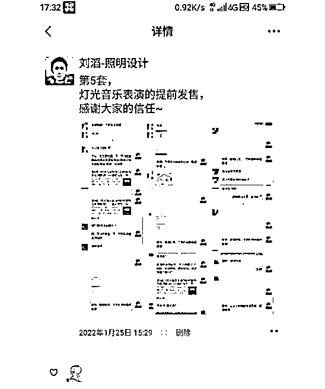

后面录制第五套时，也是这样提前发售，这种提前拿到学费的最大好处，是它会鞭策着我们赶紧把教程录制完成，给学员一个交代。

如果没收钱，他们来询问课程进度，根本没什么心理压力。但人家付完款后再来询问课程进度，这有点像债主上门，你怎么也不好意思鸽太久吧？

 

 

（**3**）信任加持下，顺利卖出延伸产品

当一个人在你这里购买了好几套课程时，其实他对你的信任度就相当高了。而在这个时代，信任真的可以换钱。

五套课程全部完成之后，我在逛生财星球时，看到 AI 绘画的介绍，后面一直在尝试与关注着这块的发展，直到 AI 绘画技术越来越成熟，看到生财大佬已经实现 AI 绘画变现，我再也忍不住决定开发一套 AI 绘画体验课。

AI 绘画体验课我是定价 48 元，为了检验这个课到底有没有人需要，就发了条朋友圈去验证，结果当天就收到 22 个人的学费。

注意，这时我还没开始录制课程，甚至连怎么讲课的思路都没有，仅仅有这样一个想法，就先把学费收了，这种感觉真的很奇妙。

 

 

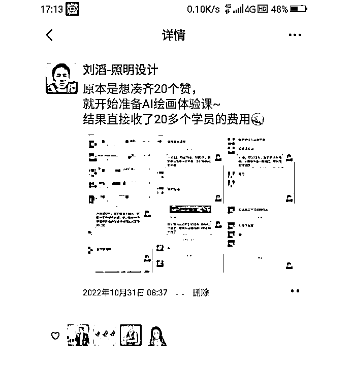

最后这套 AI 绘画体验课在一周内卖出了 80 多套，收了 3800 多块钱。

个人感觉还不错，现在朋友圈的打开率越来越低，能有这个效果已经很好了，我觉得除了 AI 绘画体验课本身价值的吸引力，更多的还是大家对我的充分信任。

有了这份信任，相信我以后出售或推荐其他课程，应该都会有人购买吧。当然我不可能随便推荐，因为信任很珍贵，忽悠信任你的人，是极其愚蠢的。

 

 

五、结语

以上便是我在亮化设计这个小众行业做知识付费，从起心动念到课程录制到实现变现的整个过程。

做亮化课程虽然很辛苦，但毕竟我是把它当成使命一样必须要去完成的事，而且每录制完一节课，多少能享受到一点成就感。

要说最痛苦的，其实是看着生财的各位小伙伴又赚到钱了，而我课程还没录完，不能动，  眼睁地看着那么多赚钱的机会哗哗地从身边遛走，这种感觉你应该懂的。

当然了，这有点玩笑，因为我也知道，不是所有赚钱的机会都适合自己，这和每个人的能力、性格、认知都息息相关，需要去尝试、去筛选，甚至如前面所说，还需要遵循内心的呼唤和向往，而一旦确认方向，就得制心一处，全力以赴。

这也是目前我在做的事，也祝愿各位都能找到让自己全力以赴的事业。

评论区：

 

 

一只酥酥喵 : 厉害，学到了很多细节，刚好可以迁移使用

Hope : 垂直领域知识付费真是香，学到了

亦仁 : 感谢分享，已加精华。

CRAZY : 小众课

市场没有  而我专业  论坛发表  被邀公众号  要求署名和联系方式  十几人加我  挖掘复利模式  做课程  前三套价格较低  小白初阶都可也能购买无负担  第四第五  唯一高阶高价  适合专业人士  可先收费倒逼自己做课

新事物以此为做课基石，收费复利

詹伟平 : 厉害了，万物皆可知识付费

do小鱼 : 从需求中发现机会  结合趋势判断市场 [强] 又有专业的交付和质量  厉害！

奇杰 : 屏蔽诱惑，沉下心把自己的事做好，这就是别人信任你的原因。后其身而身先，外其身而身存。做事符合大道，迟早是有奖赏的。

张日 : [抱拳]

# **# ****(**精华帖**)(105**赞**)**运营新手从**0**到**1**将家居类社

# 群免费向付费转型，并深度变现的经验

作者：  爱折腾的土豆妈

日期：2023-06-01

运营新手，从0到1将家居类社群免费向付费转型，并深度变现的经验

作为一个体制内幼教，爱折腾房子的土豆妈，在社群运营方面完全是个新手，曾经创建过宝妈购物群、装修围观群，副业赚钱经验分享群等等，但经过3月社群运营大航海深入学习之后，才发现那些群都称不上真正意义上的社群。

经过了四个月的努力，终于把一个【免费装修围观群】升级到了【家居陪伴年度社群】，，邀请了14位群友分享，4次大咖讲座，已沉淀46000字精华内容，跑通了好几个变现闭环，实现了稳定变现。

这些无门槛的免费群都遇到了一系列共通的问题：

加入的新人很多是引流为目的地爆粉，拉低老群友的体验感。

 

 

群内聊天以闲聊、吐槽为主，没有价值，甚至充满负能量。

购物群变成广告发布群，销售额不增反而降低。

群内以群主发言为主，持续输出耗费大量时间、精力，得不到反馈，难以坚持输出。

群内活跃度越来越低，甚至发10个红包半天都没抢完。

……

如果你的微信群，也遇到了同样的问题和困扰，不妨看看土豆妈是如何运用一些小技巧、小话术，一步步解决以上这些问题，把一个装修围观免费群转变成有活跃度、有价值、有变现的家居陪伴付费社群。

以下内容经过浓缩提炼，保证字字干货无废话，担心回看找不到，不妨先点个赞。

图文内容4200字，请移步飞书阅读。

https://sebz0gwoxb.feishu.cn/docx/FCekdjKiYoqbe6xUOxVcooOUnCb

评论区：

 

 

小沫 :  超会做社群表情包的小沫在这！

土豆妈做社群真的超用心的，这篇文章更适合做社群的小伙伴反复阅读，真的讲了很多方法，装修避坑找土豆妈准没错！

曲直 : 我就在土豆妈的社群里，真心超牛逼！不仅能提升生活品质，而且还能学到很多社群运营经验，真是太厉害了[强]

爱折腾的土豆妈 : 感谢曲直的认可

飞扬 : 土豆妈真优秀[强][强][强]

爱折腾的土豆妈 : 感谢认可！

云珞YunL : [玫瑰][玫瑰][玫瑰]好厉害

唐葫芦 : 土豆妈越来越厉害了  实践出真知

爱折腾的土豆妈 : 感谢认可

# **# ****(**精华帖**)(94**赞**)**知识付费创业项目：累计变现** **

# **800W **产品**+**流量**+**转化**+**交付系统搭建方法

作者：  钱剑波¹（我是钱）

日期：2022-08-17

大家好，我是“我是钱”，最近在生财航海参加“垂类IP”学习，看到很多大佬的分享，收获很多，也把我们操作知识付费的经验整理下，希望对大家有帮助。

我们从2014年开始操作百度竞价，同时把我们实际操作的经验整理成课程对外销售，8年时间累计卖了1600多学员（学费5000），累计800w左右变现，当然跟群里大佬没法比，只是我们产品流量转化搭建比较简单，适合很多入门级的小伙伴，而且每年都有稳定的收入。

本次分享会从4个板块来展开：

1、产品：选择什么样的课程，可以卖8年。

2、流量：选择什么样的渠道，最少能稳定提供3-5年的流量。

 

 

3、转化：建立什么样的流程，泛粉可以半自动化成交转化。

4、交付：如何立体式做交付，最大化保障学习效果。

一、产品：

我们主要操作百度竞价冷门产品的课程，一个创业类知识付费的课程，要能长期并且稳定的做，需要满足以下条件：

1、课程有效果：我们是创业类的培训，首先我们自己操作，能做出效果，同时对于学员来说，只要认真去做，也能做出效果。（PS：赚钱类的课程，是最好卖的。）2、及时正反馈：因为我们是付费流量，所以一般只要投放精准，基本上广告上了3天之内都能见效，这样对学员有非常快的反馈，也会让大家有动力继续往前。（PS：大多数人其实没有太多耐心，我们之前做过一期SEO培训，半年见效，基本上没有人坚持下来）

3、有利润：百度因为是花广告费的，所以通常一单最低的利润在300-500以上，很多产品利润普遍在2000-3000以上；一天出1单，可能就比上班的收入高很多，有利润大家才能持续。

4、项目能长期做：市场上90%以上的项目，其实都是对抗平台规则的，这也意味着项目非常短期，几个月，甚至几天项目就做不了了，而百度是付费流量，我们为百度贡献广告费，百度给我们提供客户，百度吃肉，我们喝汤，也是项目能长期做的原因。

综上所述，一个百度竞价的项目+课程，我们做了8年，这是知识付费课程的选择，我选择的是能长期稳定运营的。

二、流量：

知识付费，做课程，对大多数人来说都非常简单，但是能不能把它卖出去，能卖多少出去，决定我们能赚多少钱。所以第二步，如何建立持续稳定的流量渠道。

 

 

流量，我们也追求持续稳定，就是最好今天干一天，接下来10年都有的吃的那种，我比较懒，哈哈。

所以对流量渠道，我的要求是一件事情我做了，最少能持续给我提供3-5年的流量。于是我选择了3条主要流量渠道：百度SEO，视频流量，课程流量。

1、百度SEO：我做了一个“我是钱博客”的网站，目前每天的流量在8000IP左右，可以被动加50个粉左右，这个加粉量已经持续了3年多。

关于SEO，我们做的比较简单，我们要的是微信私域流量，所以网站所有的文章，都是直接搬运的，安排一个客服每天更新即可，这样每天的工作是简单机械化的，只需要投入基本的人工，简单高效。（SEO很多大神，我是就不班门弄斧了，我只会这一点点。）

（51la的数据统计后台）

2、视频流量：这里不是短视频，是腾讯，优酷等视频平台，这些平台有几个好处：

A、视频平台内部和百度都能获取流量；（百度会收录和给排名）

B、视频可以留广告，赤果果的直接留微信；

C、视频能长期留在视频平台和百度上，这样只要你视频存在，就能给你带来持续的流量；

D、视频平台虽然流量小，但是胜在质量高，我计算过，B站平均100个播放，能加1个粉。

E、市场上有成熟的软件，我可以用软件24小时挂机传视频，基本不用人工。

 

 

因为以上的原因，我们选择了视频流量作为一条流量渠道，前后最少传了3万个视频。

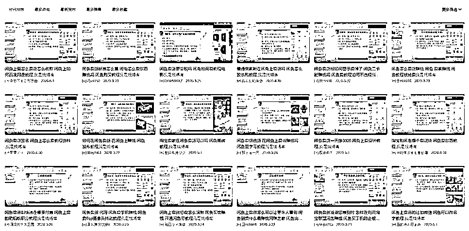

（B站上传的一部分视频）

（软件挂服务器完成自动上传）

3、课程流量：网络上有很多免费的课程，包括淘宝闲鱼卖几块钱课的，有些少数是盗版（就是本人不愿意或者不知道，被拿出来卖的），还有大部分，是故意流传出来引流的（本人主动的）。

课程流量其实也是非常大，而且非常精准的一块流量。因为一个粉丝看过你的课程，他觉得有帮助，再来加你微信，这种本身信任度和转化率非常高。

于是，我们做了50多套课程，并且把这些课程免费传播出去，怎么传播？淘宝上，闲鱼上，有很多卖课的，你把课给他们就行。

 

 

当然，引流的课，你就不要全讲完，比如课程中用到的软件，资源，让他课后私下找你，这样很多人看完，会主动加你微信。

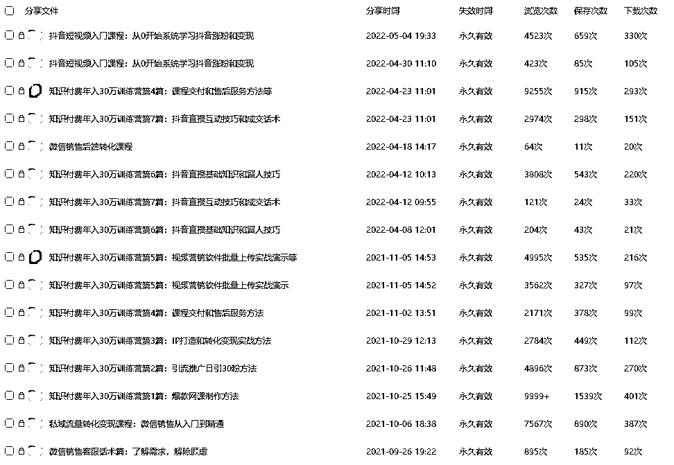

这是我的百度网盘的分享，这些课程还会被保存到其他人的网盘，然后被二次三次分享。

以上的三种方法，奠定了我们基础的加粉量，目前我这边微信每天被动加80人左右，而且持续稳定。

三、转化：

接下来，课程有了，流量有了，怎么转化？因为我们是通过免费流量来的，流量比较杂，各种需求的都有，所以我们比较粗暴，直接把粉把我们能提供的方向引导。有以下几个步骤：

1、加粉后，不聊天，只发自我介绍和课程介绍：

 

 

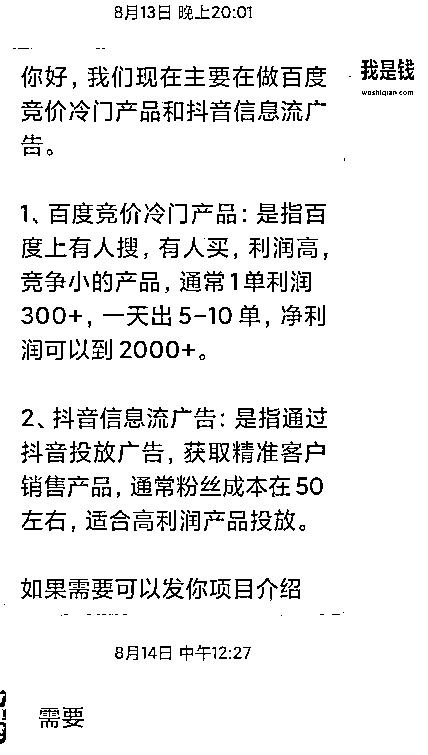

 

 

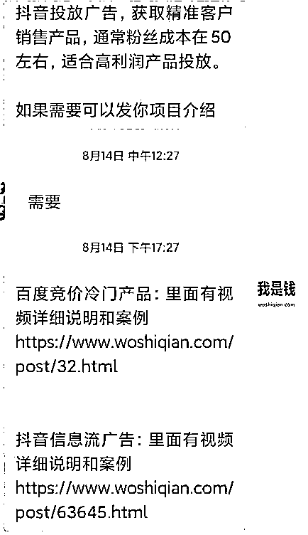

2、做课程介绍：并且把项目介绍，常见的问题等全部录制成一个视频，插入到视频中，看完视频，基本上所有的问题都可以解答完成，减少人工沟通。

 

 

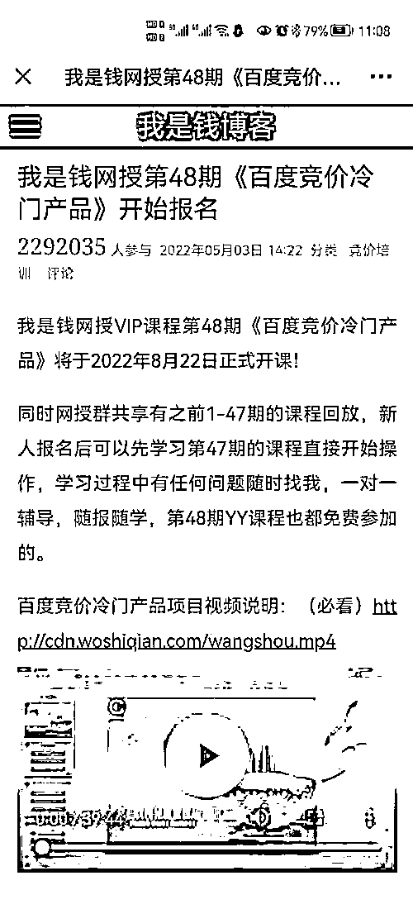

 

 

3、朋友圈转发：朋友圈每天3-5条，早上发鸡汤，中午竞价答疑，下午公众号文章转发（提前半个月准备好，客服每天按时发就行），其他的内容都是来自学员的反馈，因为我们学员比较多，所以反馈也比较多，每天素材比较多，包括朋友圈格式都是固定的，这样减少编辑朋友圈的时间。（因为我们还有项目在做，所以都流程化了）

 

 

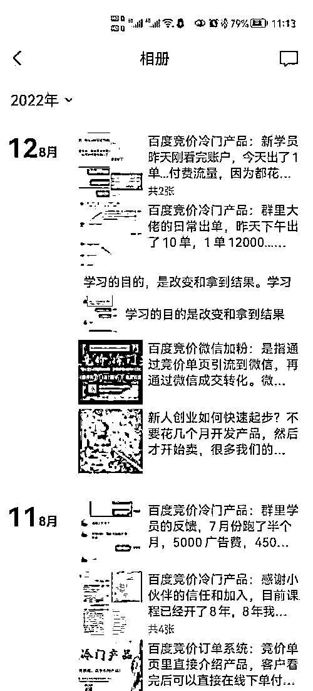

 

 

4、群发：

因为现在朋友圈打开率偏低，而且部分手机会出现折叠现象，所以一般开课前6天会开始群发。

 

 

 

 

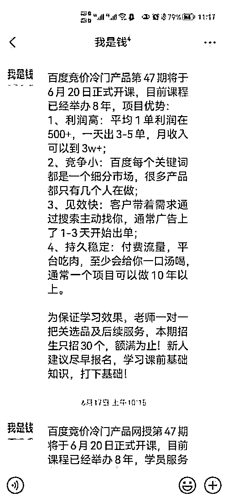

 

 

 

 

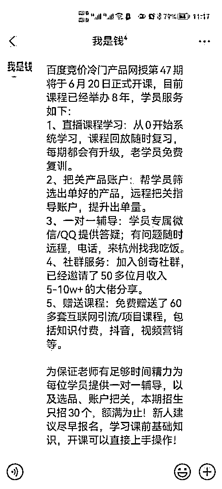

我们竞价开课是2个月开一期，以上的动作做完，一期招生在30个人左右，基本能完成招生目标。

四、交付：

交付也是我们非常重视的，一个知识付费的课程能长期做，交付一定要做好。所以我们把交付分为：直播课程+课程回放+QQ空间日志+社群大佬分享+社群日常交流+赠送课程+一对一辅导。立体式来做交付，保证效果和服务。

1、直播课程：我们课程每2个月举办一期，每天晚上20:00-21:30开课，一期6天左右，老学员免费复训。尽量把课程都讲得非常详细，这样学员只需要看课程，就可以把大部分问题都解决掉，减少后续一对一再讲知识点的工作。

2、课程回放：直播课程我们会录制成视频，上传到我们加密的播放器里，学员可以在我们的播放器里随时看回放，因为竞价涉及大量实际操作，所以每个学员本身也需要反复看课程。

这里还有一个好处，因为课程有回放，所以新学员不必等开课才报名，随时可以报名，报名后直接看上一期的课程回放，就可以直接开始操作。

3、QQ空间日志：学员普遍会遇到的一些问题，我们会整理在学员内部的QQ空间日志里，这样减少学员犯同一个错误的几率。

4、社群大佬分享：不定期会邀请一些群里做得好的小伙伴，在群里分享，一方面是经验的学习，另一方面也是对其他成员的激励。

5、社群日常交流：平时有问题可以随时在群里交流。

6、赠送课程：因为我们做网络比较就，基本上很多项目都涉及过（淘宝，天猫，闲鱼，拼多多，抖音，视频号等），所以我们会把很多项目我们实际操作的经验整理成课程，免费送给学员，这样丰富大家的项目库和知识面，来更好的提升自己。

 

 

7、一对一辅导：即使我们课程已经讲得很详细了，或者已经反复强调的点，每个学员在实际操作中还是会出错（认知偏差），所以我们要求学员操作过程中，产品，账户都发我们把关，避免操作失误浪费广告费，可能我花5分钟看下产品和账户，能让他省几千广告费，所以这块是我们一直在做的，也是我们把交付最好的核心。

目前我们课程的售前都是客服在做，报名之后，会让学员加我微信和QQ，后续我负责对接。

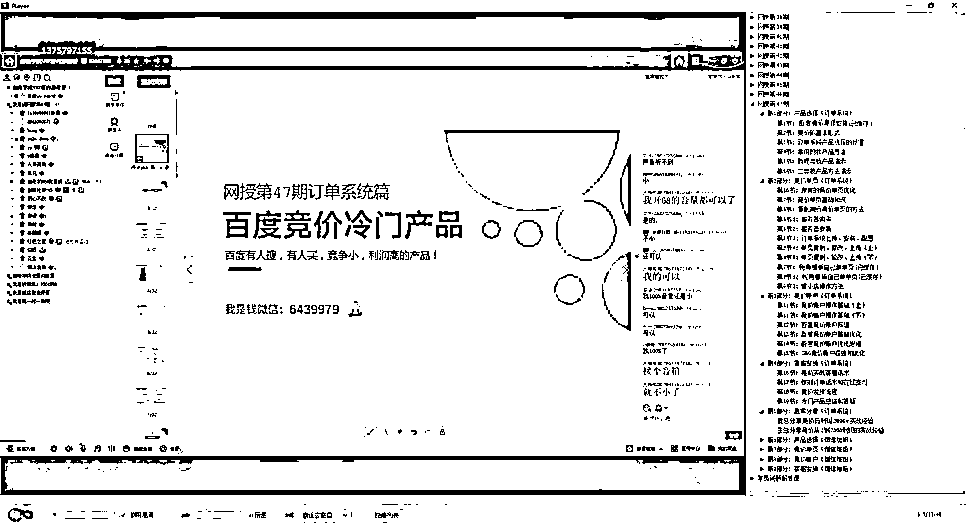

（课程播放器）

 

 

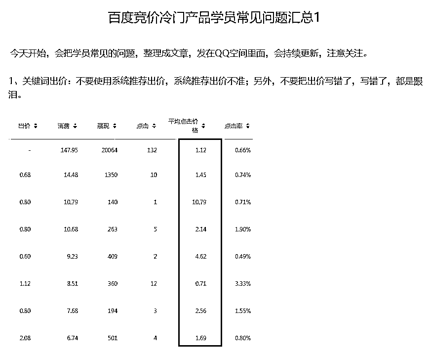

（QQ空间日志答疑）

这样一整套的流程就结束了，核心点是，无论课程选择，流量渠道，转化流程，交付方式，我们都选择了能长期稳定运营的方式，这样也许短期不能赚很多，但是一个项目可以吃很多年。生财很多大佬，希望跟大家多交流，多指点，谢谢。

评论区：

施仁 : 嚯，老哥你这博客我还收藏了

钱剑波¹（我是钱） : 哈哈，这么巧[偷笑][抱拳]

阿愚呱呱RPA : 流弊

芷蓝 : 有一句话挺好：对抗平台规则的项目，都是不长久的，好文~

钱剑波¹（我是钱） : [抱拳] 感谢支持

钱剑波¹（我是钱） : 确实是的，这几年做过很多项目，对抗平台规则的，最后都很难做了[抱拳]

 

 

第一个系统店铺，后转用小鹅通系统

小鹅通系统截图

灰太狼叔叔 : 钱总我顶你个肺。。。

昊东.Lee : 怎么和南侠1987说的那么像[皱眉]

# **# ****(**精华帖**)(64**赞**)**普通人如何打造自己的创业类

# 付费社群，**2 **个月引流** 200+ **付费用户，变现** **

# **9900+**

作者：  新侠

日期：2023-04-10

大家好，我是新侠，主职是苹果供应链中某上市公司中层，管理20+人的工程师团队和50+人的普工团队，善于数据分析和团队管理（企业），副业是在互联网上捣鼓一点小项目。

我在今年初正式开始了我的互联网项目探索之路，并一路抄袭、模仿、创造，最终创建了一个互联网项目付费社群。

2个月的时间社群从19.9一路涨价至199，最终吸纳200+会员，总共变现**9900+**

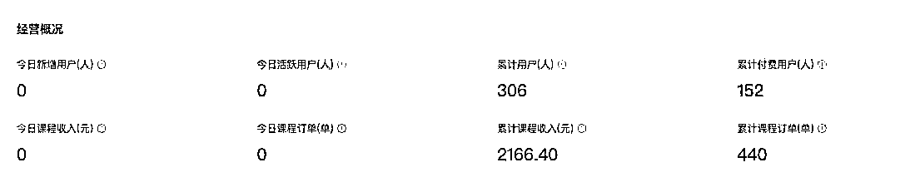

 

 

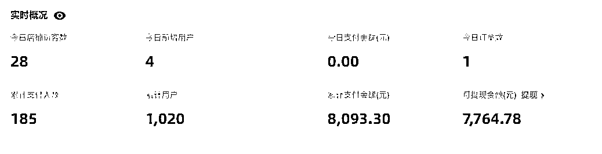

同时，在4/2把我的项目思路和方法教给一个完全没有接触过互联网的小白（我的小舅子）。

**4/6 **他成功开单，跑通闭环，共**4**天时间。

 

 

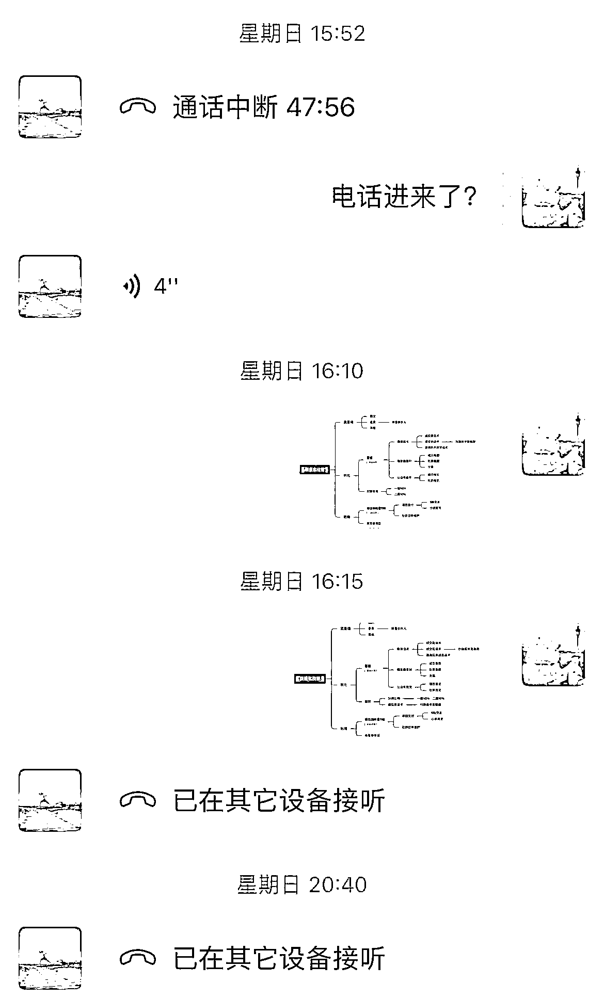

 

 

 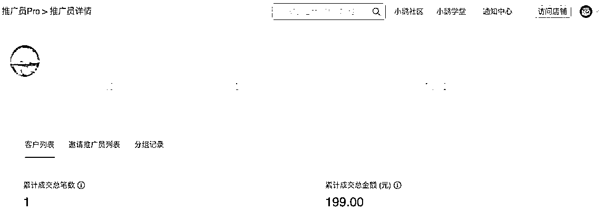

虽然经过几个月的跌跌撞撞，好在总算趟出来一条可行的互联网道路，并且经过验证这套方法同样适用于其他和我们一样的普通人操作。

本文我尝试着把我整个项目中遇到的问题，我的解决方式以及我的一些思考记录下来，当作是一个复盘，也希望能对你有所启发。

正文请移步飞书：

https://pbw5yhoa0k.feishu.cn/docx/K3oEdbAo1o5fq4xlSf3cOhkMnrg评论区：

老崔要瘦身 : 你好，怎么加入社群

新侠 : 我不是来拉人头的哈😂主要是分享和复盘

一恒 : 写的真好。倾囊相授了。

新侠 : 共同学习

魔方 : 优秀，目前我有往这个方向发展

新侠 : [抱拳]可以多交流共同学习

 

 

魔方 : 多多想你学习

老崔要瘦身 : cuishaoxuan123，学习一下

# 【中老年课程】**2**篇

# **# ****(**精华帖**)(200**赞**)**高利润的中老年知识付费赛

# 道，普通人入局都能做什么？

作者：  渔火

日期：2023-04-17

近两年，中老年市场垂直方向的知识付费迎来了很大机会。

比如之前圈友分享过的中老年唱谱课，通过在直播间用带唱简谱的方式完成变现，如果你不会音乐专业技能也没关系，还可以做其他类目比如书法、国画等。

我自 2019 年开始，基本上都是针对中老年做知识付费的项目，两年期间在不花费很大的精力下，数据和营收都增长了很多，还拓展了不少中老年类目的知识付费和电商，也因此对中老年知识付费赛道有不少的感悟。

接下来我按这四个板块和大家聊一聊，普通人做银发赛道的高客单知识付费，有哪些新的流量渠道和发展机会。

一、为什么做中老年赛道？

 

 

二、中老年人群的消费习惯？

三、中老年市场近两年的变化？

四、2023，中老年赛道对于普通人的机会有多大？

大家好，我是渔火，一名在路上的创业者。

很久没分享了，先说下近况，2021 年我作为联合创始人的项目，获得了真格基金领投的千万投资，自己作为创始人的中老年项目是 2019 年开始做的。

最近有很多生财的铁子问我关于中老年赛道的问题，由于我和这帮银发大爷大娘的爱恨情仇羁绊了四五年，曾让 83 岁老大爷为我付费，还算有些心得，而且也真的觉得这是一群很可爱的人，用心提供价值和服务就会有回报的一群人！

 

 

（口罩期间班级群里相互关心）

所以我今天主要分享的是 2023 年中老年赛道的一些机会，以及简述一下我见到的这两年中老年赛道的发展和变化（今天主要聊银发赛道的知识付费，其他类目改天分享）

先说一下 2019 年我为什么搞银发赛道，当时找细分赛道的时候，先聊我当时的底层逻辑吧，我觉得这是搞钱最关键的，拿知识付费来说，我当时先粗略的看了下整体的发展路径。

成人领域从早期的知乎时代-罗辑思维付费会员-樊登听书-付费问答-订阅课程-各种课堂专区分区圈子等，在对应到同期教培行业的发展，线下、线上课、一对一、大班课、小班课、社群、AI课、训练营、行动营等等

大概能感受到整个行业的发展路径是随着用户习惯和认识逐渐觉醒来发展的，对吧。

当时 K12 大厂打架有多狠大家都知道，我一个普通人，得选个好做的赛道啊，对标了下银发赛道，你就知道银发赛道的知识付费有多初级了，这不就是原始阶段嘛。

能预判的是，随着时间的发展，形态和内容肯定会越发的丰富，妥妥的机会呀，毕竟人年龄大了后更有钱和时间来为自己的兴趣买单！

 

 

光是兴趣生活类，琴棋书画、诗词歌赋、针灸养生、摄影朗诵、茶文化、手机技巧、花艺园艺等等调研下来发现都有一些小团队在闷声赚大钱，然后果断开始入局的，一直到现在。

对了，再分享个数据，国家统计局公布 2022 年末 60 岁及以上人口接近 3 亿人，占全国人口的 19.8%，那么如果是 45 岁以上的人群有多少，可想而知！

今年，我能明显感觉到，大家对于银发赛道的关注度和进场的人数明显多了很多，发现很多铁子确实不太了解这波人，所以我先来和大家聊聊，这个人群的行为习惯。

我这几个月曾蹲了下各平台银发赛道评论区的热词，我发现经常会出现的，“老年人没有网购习惯”“银发人群手机都玩不明白”“我开过养老院赔了”等等，看完我深度意识到很多人是完全不理解这波人群的行为和消费习惯。

按理说都市银发是抖音八大人群之一，我之前以为很多人会很了解，小镇银发确实不好做，但是都市银发可是妥妥的有钱有闲的人呀。

我自己的项目，我对有效用户的定义是一二三线城市的 40-75 岁人群，都是我的获客范围之内，而且效果也确实不错。

 

 

觉得中老年人玩不明白手机？移动互联网都发展多少年了，我们山沟沟现在都有 wifi 了，我给你们看看我的母亲，1968 年生人，我帮她做了个视频号，一个月都已经一万六的粉丝了。

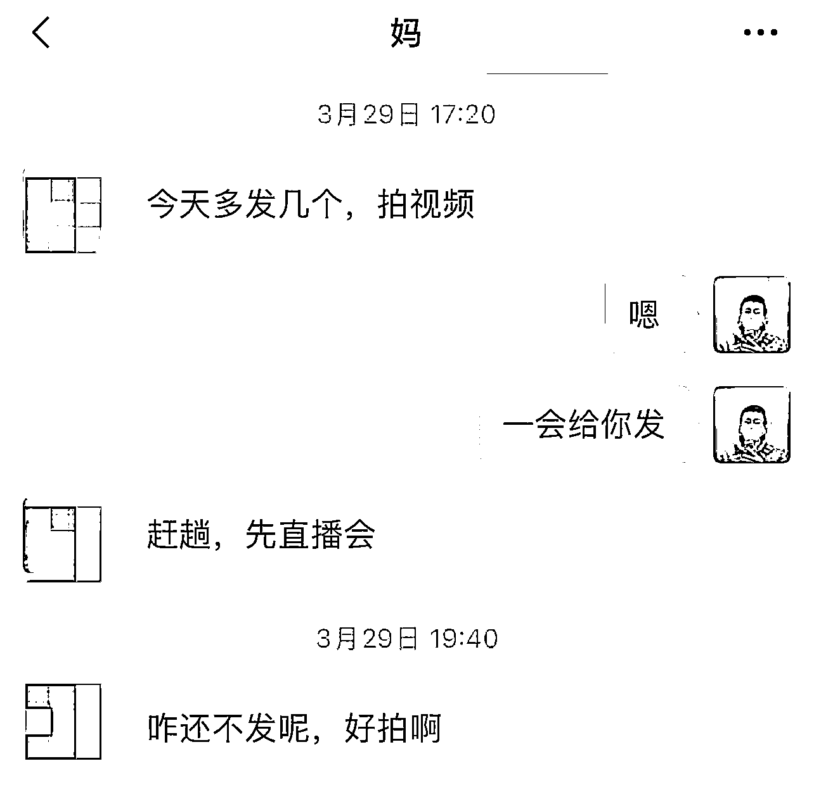

（我妈每天催我给她脚本）

 

 

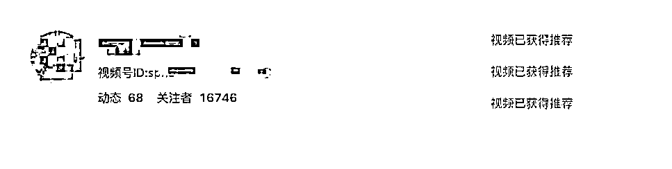

（我妈做了一个月的视频号）

每天直播加橱窗能卖个八百一千的货，我妈用的手机是红米手机，现在也是红米，前两年手机都玩不溜的人，大家不要小看中老年的学习能力，换句话说，不要小瞧五环外人群

你以为中老年买东西都买便宜的？我给大家分享个我的数据，我的客单价是一门课 500-2000 不等，我的用户平均复购 3 门课以上，这是课程类的，随之的消耗品，书画类用户，每年要消费 2000 左右在笔墨纸砚和印章上。

如果是艾灸方向涉及健康的，客单价更高，很多中老年退休后，有的跟着孩子在国外生活，有的在大城市照顾孙子，有的回到了老家，但是这并不妨碍他们追求自己的兴趣和生活

 

 

（给大家截几个私域的用户）

一句话总结就是，现在的都市银发，手机可以玩得溜，有钱，有时间、爱分享，对服务更关注、对线上付费逐渐适应并习惯

 

 

拿我自己的赛道和我自己的经历，我把这几年大概分为三个阶段（知识付费为主的赛道，篇幅问题，今天不谈硬件、APP、电商等类目的）

2008-2015 混萌芽期，这个阶段很多人都不知道怎么做银发赛道，这几年大部分的是做流量的平台，后期变现也表现不好，糖豆广场舞等垂直 APP 在那几年获取了大量的流量。

2015-2019 野蛮生长期，这个阶段，出现了一些垂直的平台，比如美篇等社交平台、墨客、墨池、快乐 50 等垂直领域的机构、养老家政、健康睡眠等项目兴起、线下的老年大学（报名名额抢都抢不到）、音乐相册、天气软件等工具类产品，得到了快速的发展，吃到了一波红利。

2020-2023 飞速增长期，这个阶段，大厂开始入场，先是红松短期内拿到了两笔由蓝驰、经纬等机构数千万美元的投资，知乎合伙人出来做的老年项目、尚德教育、大鹏教育（如今倒闭了，噫吁嚱）、高途等等都开始做银发赛道的知识付费我自己深有体会，中老年知识付费，2015 年到 2018 年，绝对是野蛮生长的几年。

分享个数据，这几年最开始走最简单的公众号投放，完全不需要任何投放技巧和文章的转化技巧，书法课、国画课的 ROI 可以做到 20，而且复购率超高，什么概念，一个月投放花 5 万，能卖 100 万，而且客单价可以轻松拉到 2000。

 

 

主要是用户巨便宜，当时我平均一个进群用户的成本在 5 元左右，注意，是垂直的兴趣粉，不是泛流量。

而同期，是幼儿教育赛道和 K12 神仙打架的几年，当时优质的母婴流量从几十一个快速攀升到一两百我当时这个项目整个的启动资金，仅仅是小鹅通的平台费 + 找老师录制的体验课费用（最开始卖期货，有体验课和长期课大纲就开始卖）+ 第一个月的投放费用，整体成本不超过 5 万，就滚到了第一年营收两百多万。

我总结这一切得益于我前面几年做幼儿赛道的经验，可以说如果做过 K12 或者幼儿教育，进到老年赛道，那些做课方法、服务方式和营销手段简直是降维打击。

最近两年，随着大厂进场来普及用户认知，更多的垂直方向的知识付费都迎来了更大的机会。

咱们不能说一提到银发赛道，能做的项目就都是开个养老院、弄点高毛利的保健品、走步送鸡蛋、针灸广场舞等。

现在的银发族可不像前几年了，移动互联网都发展多少年了，现在大部分赛道都可以银发人群重做一遍的，银发族的社交、健康、衣食住行、兴趣爱好、线上工具等，很多维度都蕴含着很大的机会。

 

 

随便举几个最近比较火的例子：老年Keep、老红书、老年家政、老年睡眠、老年文娱、营业健康管理，正确带孙子的课程等等等等，太多了，说不完！

从我的角度，个人觉有几点原因

（1）流量侧：更多元的触达用户的形式，视频号等中老年居多的短视频平台，还有类似美篇这种垂直平台的兴起，带来了更多的机会

（2) 用户侧：大公司进场，用户认知和习惯逐渐培养起来，还有就是中老年对于服务的感知和认可，超过品牌加持。

哪怕你是大公司的课程，我服务做的好，我课程更贴近用户需求，一样可以卖的很好，在中老年眼里，这些大公司和你没区别，并且现在的都市银发，已经能很熟练的下载  APP、转发评论、小程序打开、各种支付玩的很溜。

（3）产品侧：现在中老年赛道的产品很匮乏，你在其他赛道做到 120 分才能有机会，可能在这个赛道做到 60 分就有点机会了，毕竟见过曾经的音乐相册软件和天气软件几个月可以获取几百万的流量。

不过需要注意的是，流量获取阵地和产品形态要选好，说句实话，我测过很多主流渠道，有用户之后，测试过很多种形态的打法。

测试下来，基本上微信体系内和视频号是路径最顺的抖音和线下也还可以（这里不包含银发电商玩法）

 

 

（某班级群作业圈，虽然是大字手机，但是也超爱分享）

对于我们普通人，个体来说，无论是搞流量还是做课程，都是机会超级大，如果你没有产品技术能力的话，我更推荐个体去做课，是真的香。

我现在已经在从生活和兴趣的两个大维度上，大范围的做轻课去测试了，可能有的铁子会觉得这需要一些专业技能。

其实说实话，我最开始是完全不懂书法国画的人，我仅仅是懂用户和流量，课程我找对应专业的人录制，老师出完大纲，我结合用户需求修改审核，甚至很多方向，你找个大学生，极低的成本就能给你出来很多专业的课程

 

 

今天拿我最近做的一款电子琴课程来举个例子吧。

之前有铁子和我说，一听电子琴，还是老年人学电子琴觉得好小众啊，能有人买单吗？

我来告诉你，音乐方向的课在银发知识付费里的是一个不小的市场，目前已经有很多规模不小的公司在做了，比如快乐 50，红松学堂等，而且客单很高。

首先挖掘细分需求这个这里不做过多赘述，可以看我之前在生财分享的一篇文章，https://articles.zsxq.com/id_pt1urnv5g4ah.html  挖掘好需求之后，我需要快速做 mvp 验证，这里我要解决的是流量和产品的问题，因为变现就是靠售卖课程对吧，那么我开始思考流量。

于是我用视频号测了下，老年人音乐的几个方向，比如老歌混剪、乐谱、唱谱、乐器等，测了一圈，发现引流效果还不错，流量的问题前期基本上可以按这个跑了。

产品这里是我要重点说的，做银发赛道的知识付费，最重要的是了解用户，不同的课程大纲，售卖结果可能天壤之别。

我累计和不少于几千名用户深度沟通过，比如最开始我追求详情页设计优美、小鹅通装修美观、海报精致等，后来发现这帮人根本不在乎这个。

他们报名课程最看重的是体验课的内容、老师的水平是否让他们认可、服务是否让他们满意，以及未来长期课是否能下载、永久回看等。

 

 

甚至有几次我做 AB 测试，一个淘宝找人花了 1000 设计的详情页，居然没打过我用懒设计 10 分钟搞的一个绿背景，一堆大字堆叠的长图。

（相对品牌，很多用户更在乎能下载和时效）

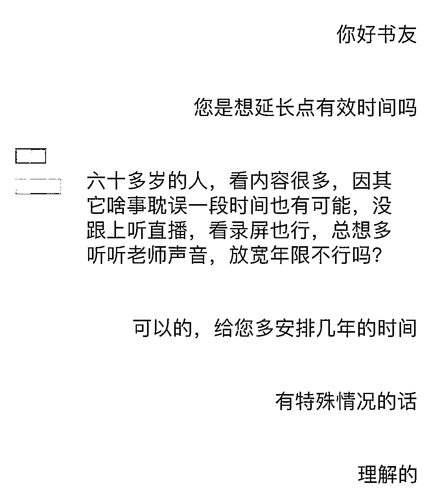

 

 

所以，切记不需要产品多么华丽，你只要多和你的用户沟通，了解需求，定好课程形式，是需要录播 + 直播，还是全直播、全录播，然后定价，售卖，就完事了大体的思路没问题，剩下的就是执行过程中不断优化和调整了

除了常规的知识付费类目外，在举几个我最近见到的一些团队在做的例子,也是我最近深度调研的方向

①　老年家政

大家都知道家政市场很大，这几年发展也很好，咱们的圈友也有做的很优秀的，目前由于老年家政主要是子女给父母下单的，服务内容比如：打扫卫生、做营养餐、测血糖、擦湿疹药膏、陪同散步聊天、陪同看病煎药等

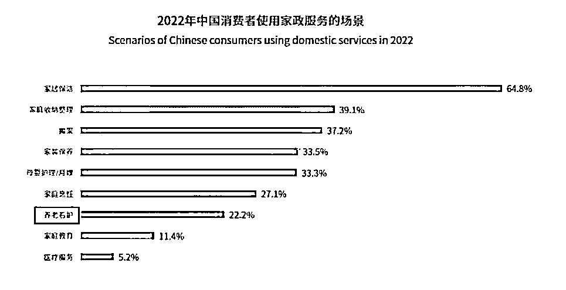

打法等同云家政的模式，只不过获客模式和方向上有所差别，大家可以看看天鹅到家上关于老人的服务已经订单量很多了，只不过服务项还有些单一

 

 

②　中老年睡眠

前段看数据的时候，从国民睡眠健康白皮书我看到 40 岁以上的人群睡眠问题已经很大了，而且逐渐严重.

然后我去了解了下数字睡眠这个市场，已经有很多公司在做了，比如好睡眠、享睡等各种各样的 APP，还有一些和音乐助眠结合的白噪音产品等等。

总之睡眠问题是个复杂问题，原因很多元

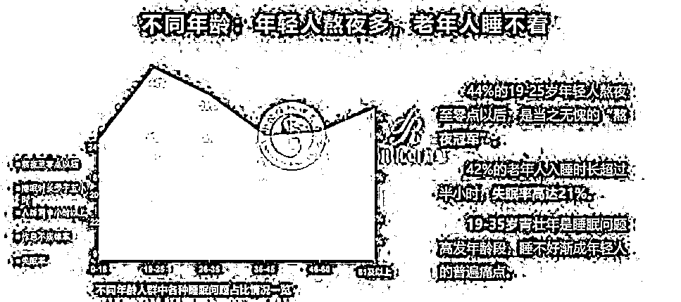

作为普通人，我想切入的可能有三个方向，一个是偏教程类，超低价的课程来教大家怎么使用市面上各种各样的助眠产品。

第二个可能是从心理、情绪方向疏导的课程。

 

 

第三个可能是身体健康管理方向的课程，比如请专业的营养师规划一些晚餐或者晚上该怎么运动改善睡眠的课程等等

③　中老年旅游

这个通过数据的时候看到的，中老年旅游市场增速也很猛烈。

那么年轻人经常会做旅游攻略，而中老年经常怕被骗，我妈就是一提旅游就怕被宰。

那么作为普通人，是否可以通过做为中老年各种各样的定制的旅行攻略，来收取一点点服务费呢？

同时给靠谱的旅行社引流是否可以赚到佣金呢？而流量端，视频号里旅游类和风景类的视频有多火，相信你去看看就知道了

④　中老年电商

中来年电商这块相信不用说大家也知道，咱们星球不少书友都做的很好，还有卖图书的书单号等等

和几个在做的团队聊过，目前他们卖的最好的是女装和鞋，尤其是鞋，利润率很高，这块就不做过多分享了，有相关资源的朋友可以考虑

④　中老年宠物

 

 

宠物赛道这两年发展很快，我觉得幼儿赛道一般有的，都可以在宠物赛道做一遍，之前看的报告，全中国每年新生儿 1000 万左右，宠物猫五千万，宠物狗也三千万左右了我调研下来，养狗人平均年龄基本上比养猫人的平均年龄大 10 岁，养狗人的平均年龄在 37 岁左右，发现了么，是不是平均年龄已经靠近中老年了，那么可想而知，中老年养宠物的人应该很多，其中我觉得应该养狗的更多。

那么是不是宠物赛道的打法可以试试了，我给我妈做的就是宠物账号，毕竟我妈是 1968 年生人，她自己出来讲，公信力更强，目前做了一个月是一万七的粉丝

（上面是一万六，这里是一万七，因为本文写作期间，涨了 1000 粉）

商品橱窗加上直播（我妈直播纯聊天，没有任何技巧，我妈在老家）每天能卖 800-1000 宠物用品，佣金是 30% 左右，每天私信的人很多，几乎都是问各种各样养宠问题的，其实你百度就有，不过他们不会，也没这个习惯。

这里面我觉得需求和想象空间很大，下一步我的策略可能不会让妈直播卖货了。

毕竟直播需要直播能力，我妈学起来困难，可能走直播引流，到私域后售卖产品在扩展一下，如果你接入 AI 是不是能实现个性化的问答，“中老年的私人宠物医生”，是否能出针对中老年关于养宠经验的课程等等，篇幅问题这里也不展开了

今天分享的均是我站在我的角度的思考，可能有的对有的不对，希望能对你有启发2023 年普通人在中老年赛道的机会就分享到这里啦～有问题评论区留言互动～ 

 

评论区：

Ray♻  💥 : 我女朋友学音乐的，想教他做个人IP😂

渔火 : 有个人技能做中老年赛道更容易

控心 : 是不是要有个人技能才好做

渔火 : 不用吧，懂用户就行，我没啥技能

阿顾 : 干货满满  受教了  感谢大佬分享

Jia : 干货很多，学习了

Jia : 主要你也有输出产品的资源

渔火 : 你没仔细看应该，比如最近电子琴和宠物方向的课是找的对应专业的大学生录的**# ****(**精华帖**)(128**赞**)**定位中老年客群，视频号音

# 乐技能直播变现** 30W+ **的经验分享

作者： LLL

日期：2023-03-17

不知道你有没有在抖音上或视频号上刷过这样的视频或者直播

 

 

 

 

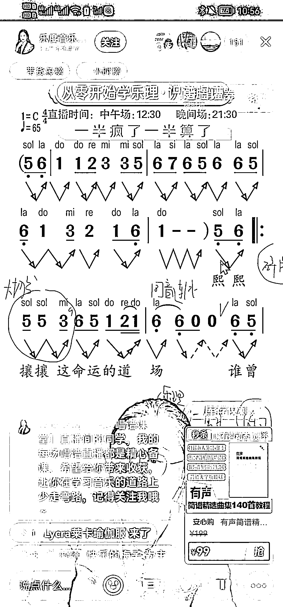

 

 

 

 

这是一个相对不起眼的赛道，  市场不大，主要通过用特定的软件教普通人学习简谱，在直播间带唱简谱的方式，进行知识付费的变现，产品有虚拟课程，更多的是简谱书。

主要客群为中老年人，特别是退休干部，客单价基本在 100 元左右。

我在这个赛道中单枪匹马坚持了近一年的时间，变现了 30W+，虽不能和生财的大佬比，但还是想跟大家分享一下自己的实操经验以及心得体会。

这是 2022 年的部分收益

 

 

 

 

大家好，我是 LLL ，一个在生财潜水 3 年的小透明，主业 18 线小县城体制内，不算忙。

20 年加入生财后陆续尝试过一些项目，如淘宝蓝海、视频号大海航、快手小游戏等项目，都没有做起来。

去年 3 月跟随生财的脚步，深度参与了抖音 2.0 直播大航海，后转战视频号，赛道即是上文所述的简谱教学赛道，主要客群为中老年人群，女性为主。

接下来给大家分享下自己的实操经验（文笔很菜，写的不好请大家批评指正）

 

 

一、什么是音乐技能直播

就是通过自身的音乐技能在视频平台进行直播获取流量进而变现的方式，以变现的方式可分为三类。

分别是：娱乐打赏类、娱乐带货类、知识教学类。

今天我们主要讨论的即是知识教学类，而知识教学类的直播间也有很多，如乐器教学（钢琴、吉他、电子琴、电吹管、葫芦丝、二胡）、声乐教学、音乐基础技能教学。

 

 

 

 

声乐教学

 

 

 

 

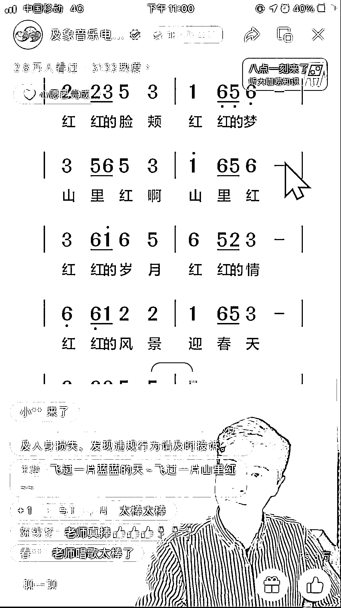

歌曲教学

 

 

 

 

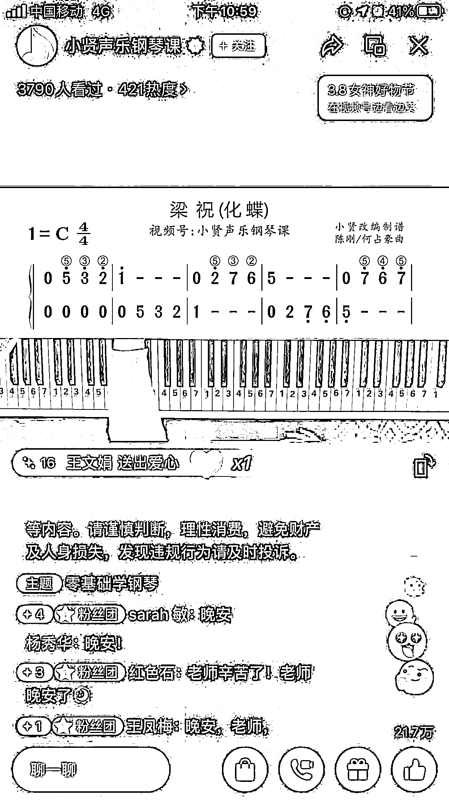

简谱钢琴教学

 

 

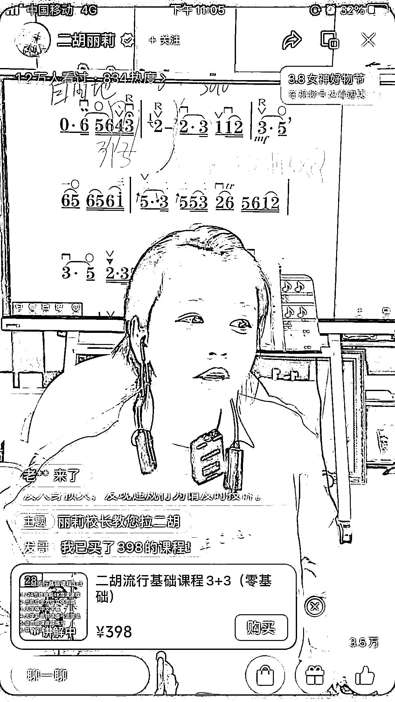

 

 

二胡教学

 

 

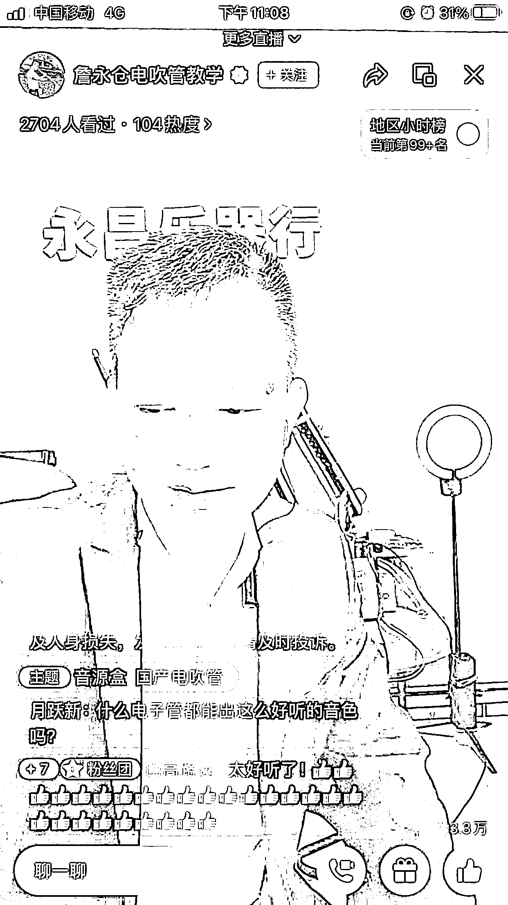

 

 

电吹管教学

 

 

 

 

小提琴教学

二、如何在音乐领域找到适合自己的细分赛道？

# **# **（**1**）结合自身优势

首先还是要结合自己的优势，自己拥有什么样的音乐技能，或者自己对哪些技能感兴趣，也可以现学现卖。

由于自己本身是音乐学院毕业，也有一线教学的经验，对于音乐基础理论课，如乐理、视唱练耳，基本上能信手拈来，只需将线下教学的模式搬到直播上就可了。

 

 

# **# **（**2**）不高的测试成本

其次是测试成本低，前期能够通过“一己之力”完成整个闭环，如【直播形式——如何引流——产品打造——变现闭环】，整过流程一个人就能完成，只需要花点时间，关于资金成本，当然是越低越好。

# **# **（**3**）在蓝海赛道中选择受众人群最广的细分赛道

音乐技能那么多，为什么要选择识谱教学，因为乐谱是记录音乐的文字，所有音乐技能的基础，不管是学习什么乐器，或者对自身的音乐素质有一定的要求，必须要会看谱。

所以，对于想在音乐素质上有所提升的人群，识谱是个绕不开的话题，基本上都要经历，算是在这个赛道上的刚需。

而目前国内主流的记谱法主要是五线谱和简谱，对大多数人来说，五线谱入门相对来讲会难一些。

而简谱就相对容易理解，所谓简谱简谱，简单的记谱法，所以简谱识谱就成了很多人学习目标，也是相对容易接受的一个基础理论课。

# **# **（**4**）如何寻找对标账号？

 

 

确定了细分赛道，先不要急着按照自己的想法去做，一定要看看相关平台有没有人在做，如果有人在做，去看看同行是怎么做的，直播间怎么搭建，怎么引流，产品如何，怎么变现，价格多少，思考各个环节应该如何实现。

首先在抖音搜索框上输入【简谱教学】，依次点击上方的分组，然后看下有没有异常值。

 

 

你发现了什么？

接下来用【唱谱】来搜索，搜索框上输入【唱谱】，然后选择用户，会发现好多这样的唱谱账号。

 

 

这些都是简谱教学的对标账号，接下来一个个点进主页看看，看下他们发哪些视频，视频的点赞量如何，评论区中有哪些需求，在直播的进直播间看看，观察下整个行业的基本情况。

第二步是通过蝉妈妈等第三方平台去分析同行的各项数据。

 

 

蝉妈妈官网：https://www.chanmama.com/

注册登录后选择左上角的【抖音分析平台】

选择【找达人】

 

 

在上方搜索框输入关键词【唱谱】，再点击右下方的场均销售额（详细数据需开通会员），可以看到唱谱赛道中，头部的变现成绩，选择其中一个账号作为对标账号，进行像素级的模仿，先抄后超。

三、项目实操

 

 

（**1**）确定直播形式

**1. ** 通过对标账号，确定了不需要真人出镜，只用简谱软件**+ PPT **的直播形式，基本上一台电脑就可以完成，不需要很复杂的设备，如下图：

（**2**）准备直播工具

**1. ** 电脑一台

**2. ** 麦克风、耳机（耳机用来监听乐曲的声音）

**3.  obs**软件**(**直播软件，官网地址： http://www.obsproject.com.cn/** **）**4. ** 教学**PPT**（讲解基础知识用）

**5. ** 简谱软件

 

 

如何找到对标账号一样的软件？最快的方式是以学员的身份直接在直播间询问主播，有些主播会告诉你软件的名字。

利用好各种搜索引擎。如果问了多个主播都没有回复，可以试试在百度、淘宝、微信、知乎等平台进行搜索，并进行逐一对比。

通过大量的搜索及对比，终于找到了这个软件：JP-WORD (官网地址：

http://www.happyeo.com/  ）

这是一款专业的简谱打谱软件，可以实现播放乐谱，同时还有唱谱时对应进度条，完整的功能需要购买，价格如下图。

（如果有购买的需要，建议选择498的加密狗版，可以在多台电脑上用）

 

 

（**3**）确定直播流程

直播流程确定为：自我介绍 + 基础知识讲解 + 节奏型讲解 + 节奏型练习 + 卖课，如下图：

【基础知识讲解】需制作 PPT。

【节奏型练习曲】可以找市面上各种视唱练耳书的谱例，也可以自己创作，将谱例输入到 JP-WORD 中，直播时随时调用。

 

 

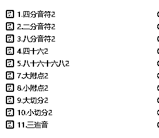

直播流程主要是从零基础的角度出发，一步一步讲解简谱中的基本知识，加上大量的唱谱练习，直播模式基本上以带唱为主，就像运动博主带操一样，需要自己亲自做示范，目的就是让用户真正听懂并掌握相关知识。

（**4**）开播引流

所有工作准备好之后，就开始直播啦，下方为详细步骤。

 

 

第一步：下载安装 OBS 软件，点击右下角【设置】，选择【视频】，设置【分辨率】，竖版设置【1080*1920】，横版设置【1920*1080】

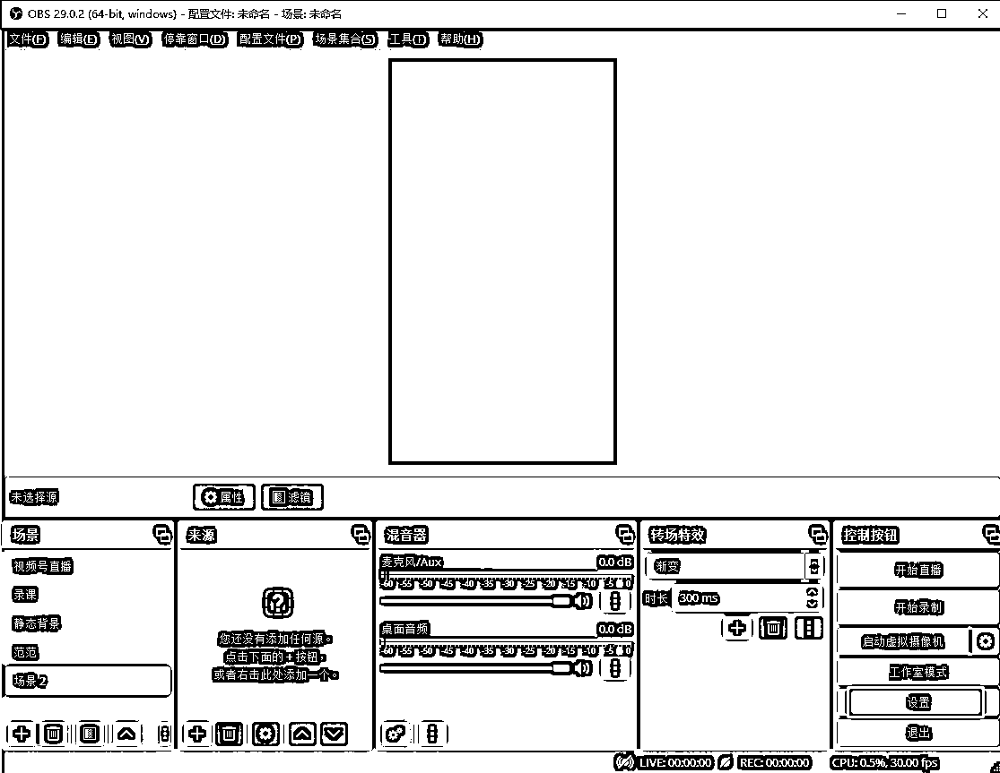

 

 

第二步：在【来源】中增加各种窗口，方便直播时随时切换

 

 

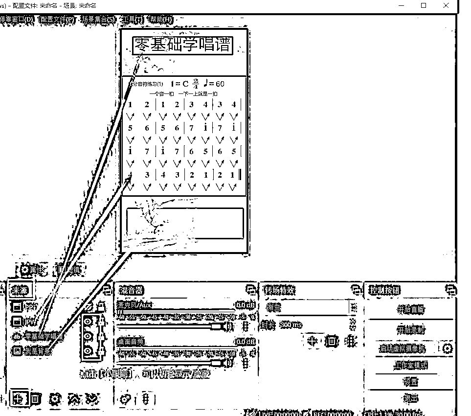

第三步：点击【启动虚拟摄像机】

 

 

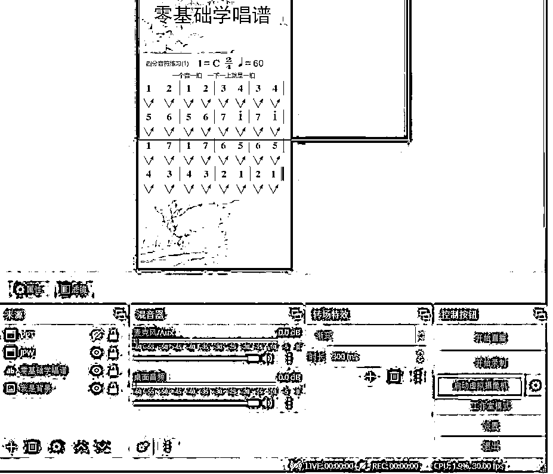

第四步：电脑登录微信，点击左下角的三条杠，点击【视频号直播工具】

 

 

 

 

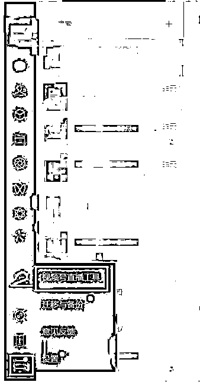

第五步：点击【添加画面源】，然后点击【摄像头】，选择【obsVitual Camera】。这时，obs 上的图像就以虚拟摄像头的方式呈现在视频号直播工具上了，

接下来，就可以开始直播了，直播过程中，只需要在 obs 上操作即可，注意视频号直播工具上的麦克风要打开，不然没有声音。

 

 

 

 

直播开始后，我将原来注册的企业微信绑定在视频号上，直播过程中还增加了引导加企业微信的环节，为将来在私域上变现做准备。

（**5**）同步开发课程

接着马上就着手开发课程，课程也是通过 OBS 来录制，再上传到【小鹅通】，用户买了课程后，直接通过邀请码发给用户。

课程的主要内容是录制好的简谱唱谱的视频，因为如果要真正掌握唱谱这个技能，是需要大量的练习，所谓孰能生巧，

初学者即使在直播间学会了如何看简谱，但是没有进行大量练习，依然掌握不了唱谱技能，这也是这个赛道的特点，也是在直播间里敢完全教课程里面内容的原因。

 

 

四、** **做音乐技能直播的几个阶段

# **# **第一阶段：左手直播右手产品，持续复盘提升数据

（**1**）左手直播：执行力拉满，复盘优化

刚开始直播的时候，正常情况下，前期直播间都是没有人的，这个时候千万别心灰意冷，只要坚持播下去流量会慢慢的上来，

当然了，每场直播后都要进行及时的复盘，复盘的方法主要是结合直播回放和直播数据，分析做了什么动作导致在线人数增加？

什么话术让直播间的互动量提升，这些复盘非常重要，下面是当时复盘的表格：

 

 

前期主要是要做好用户停留时长、互动、加粉丝团这些数据，至于详细方法，可以去参考去年 3 月生财的抖音直播 2.0 大航海的课程，内容非常干。

大概播了一个星期左右，在线人数基本上能够达到 30-100 人左右，一场两小时计算，场观可以轻松达到 2000-3000 人左右。

其次是可以选择避开同行的直播高峰期，因为这个赛道大部分主播的直播时间是上午 8 点左右和晚上 7 点左右。

所以我选择早上 6-8 点直播，一方面 8 点后需要正常上班，其次是主要客群是 50 岁以上的中老年人，很多老年人睡眠时间短，早上起的很早，选择 6 点开播，完全不需要担心流量的问题。

需要注意的就是，尽量固定直播时间，提高直播间用户粘性。

 

 

刚开始直播的时候，为了能快速的拿到正反馈，拿到结果，每天都是 5 点半起床，眯着眼睛打开电脑，然后开启直播，有的时候因为还没有睡醒，讲话都是磕磕巴巴，为此还闹过不少笑话，

如：直播到一半，为了消除倦意，直减跑到卫生间用冷水洗脸；讲课到一半，才发现  PPT 没有切换过来；

评论区经常有学员提醒，没有看到乐谱等问题。

随着直播次数的增加，慢慢地适应了早上起床直播的节奏，且直播后，会以更加饱满的精神状态开启主业，

现在看来，非常感谢那段时间的辛苦坚持，正是持之以恒的早起直播，才能快速拿到正反馈，才有今天这点小成绩

（**2**）右手产品：快速完成产品的打造，有问题再优化

产品的打造，第一步就是对产品有一个全局的规划。

产品通过什么样的形式给到客户？

产品内容体系如何？

如何差异化？

 

 

怎么录制？

如何快速产出课程内容？

录制课程的sop是什么？

这些一开始一定要想明白，不然会浪费大量的时间做重复性的动作，下面是我的产品的规划大纲：

1）产品内容体系。

① 基础乐理知识讲解

② 基础节奏型讲解

③ 基础节奏型练习（跟唱练习+完整乐曲带唱+钢琴动态谱）

④ 综合练习曲（跟唱练习+完整乐曲带唱+钢琴动态谱）

2）如何差异化？

① 练习曲的练习方式增加【跟唱练习】，就是一句一句的带唱，这种教学方式，更容易让初学者接受，同时，观察了同行，并没有这样的教学方式。

② 综合练习曲，即 110 首歌曲，同行大部分都是以当下流行的歌曲为主，如《梅花泪》《早安隆回》《红枣树》等，这些歌曲非常受中老年人喜欢。

 

 

但是同行中用经典老歌来作为教材的很少，所以我选择了用《歌声飘过 30 年》中的歌曲为主。

《歌声飘过3 0 年百首金曲演唱会》为《中国音乐电视》推出的合集。该合集囊括 30 年来流行于内地及港台地区的百余首代表性作品，归纳和梳理改革开放 30 年来中国原创歌坛的经典歌曲，囊括 30 年来流行于内地及港台地区的百余首代表性作品。

还有一个原因是客群主要是 50 岁以上的中老年人为主，这些经典老歌都是他们年轻时流行歌，把这些歌曲拿到直播间教唱，非常容易引起他们的情感共鸣。

3）  产品通过什么样的形式给到客户？

① 抖音：直接用学浪,由于自己有教师资格证，资质没问题，开课后，录完一课就上传一课，非常方便。

但即使这样，  很多客户依然每天都来问在哪里找课程，为此，录制一个如果观看课程的视频是非常有必要的，凡是来问的引导他们去主页看视频。

② 视频号：

小鹅通：由于视频号官方没有虚拟课程的平台，所以只能通过第三方平台来上传课程，需要讲购买了课程的用户引导加微信，然后通过微信发送。

我用的是小鹅通平台，小鹅通是可以直接上架虚拟课程通过视频号卖货的，比较方便。

 

 

视频号小号：还有个方法就是另外开通一个视频号小号，将小号设置成私密账号，把课程上传到小号了，引导客户关注视频号小号，后台通过关注申请就可以了。

避坑：刚开始的时候，为了节省成本，选择了用免费的【荔枝微课】平台，结果导致了非常多的售后问题。

荔枝微课里的广告非常多，每天都有大量的客户来问怎么找课程，为什么课程看不到等诸多问题。

后来实在忍受不了这无休无止的售后问题，花钱没了小鹅通平台，从此以后，用户基本上没有了操作方面的问题了。

所以，课程的平台选择还是很重要的，毕竟客群不是会玩手机的年轻人。

# **# **第二阶段：根据市场反馈持续优化产品

刚开始的时候，为了做到【轻交付】，采取的是虚拟课程，但是中老年人群有个特点，就是眼睛不太好，眼睛长时间盯着屏幕看，字体小，在直播过程中不断有用户提出能不能出书，这就是在做的时候市场给到我的反馈。

所以后期采取了简谱书 + 二维码的形式，每首乐曲上方都有一个二维码，用手机扫码后就有相对应的练习视频，用户可以一边看着书一边练习，这样产品非常受中老年人的喜欢。

 

 

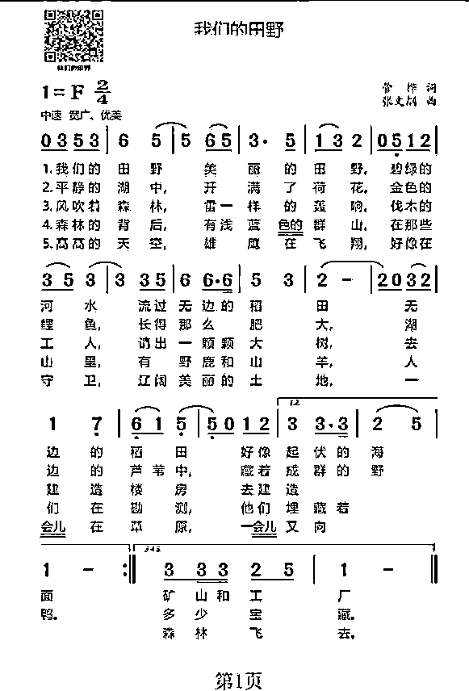

 

 

所以，有了产品之后，要不断的去收集市场的反馈，根据市场反馈，不断的去优化产品。

# **# **第三阶段：百花齐放，将收益进一步放大

（**1**）提高直播时长，增加直播场次

当有了产品，并且稳定变现之后，接下来就要开始将收益放大了，下面介绍几种方式：

首先是提高单场直播的时长，做过直播的圈友都知道，直播绝对是体力活，几个小时不停的讲，需要耗费大量的体力和脑力.

在体力允许的情况下，尽可能的提高直播时长，直播内容讲完了，可以重头讲一次，因为很少人会从头听到尾，甚至有时候聊聊天也是可以的。

很多客户都是在讲完课后聊天阶段下单的。

增加直播场次很好理解，力所能及的情况下，根据人群特点增加直播场次，前期主要是早上 6 点直播，为的就是避开同行的直播时间.

当直播间有了一定的竞争力时，我的直播场次增加到一天三场，分别是：06:00 - 08:30；13:00 - 14:30；19:30 - 21:30。

 

 

（**2**）无人直播，不是长久之计

去年的视频号，无人直播是非常盛行的，基本上，无人直播不会扣分更不会封号，同时，可以一直循环播放，由于那个时候怕被封号，一直没敢尝试。

（当然，现在视频号上还是有很多的录播，特别是知识教学这行，只不过被提醒的概率更高了，且出现了会扣分的现象）

后来到了 10 月份才慢慢尝试着录播，提前录制好视频，或者干脆用直播回放挂上去，那个时候的收益，基本上是躺赚的，每天都有 2000-3000 的收益.现在回看，最后悔的就是那个时候没有及时的放大，没有开更多的小号放录播，不然，收入应该能破七位数。

随着视频号的崛起，无人直播慢慢的被打压，到现在基本上是寸步难行，即使是放录播，也要保持直播的状态，不然当有一天不能录播后，发现自己的直播能力下降的太厉害.

更糟的是，心态发生了变化，不愿去直播，有畏难的情绪，所以，跟平台抗衡的事情，还是要谨慎，即使是录播，也要保证有有一两个账号是正常直播的，这点非常重要。

经过测试，发现播放 20 天以前的直播回放没那么容易被提醒，只要不是频繁被提醒，一般不会被扣分，

如果被提醒录播后，也可以引导用户去主页橱窗里购买课程，这也是个方法

 

 

（**3**）复制复制再复制，探索普通人也能直播的方式，多平台同步开播

放大收益的最佳方法，就是多账号矩阵化运营，将一个账号的成功案例复制出来，放大收益。

可以通过聘请主播，以合作的方式，打造多个直播间。

但是大家会发现一个问题，上哪找那么多会唱谱有音乐技能的主播，且不说这种类型的主播少，就算找到了有专业技能的人，需要一段时间的培养，且在他们掌握主播技巧，搞清商业逻辑的时候，很多人会选择单干

业内人都知道，唱谱赛道的门槛不高，很容易单干，所以找拥有音乐技能的主播肯定不是长久之计，天花板太低。

所以，需要探索出一套普通人也能够在这个赛道直播方式，这里分享一个思路，打造普通人也能直播的直播间。

可将整个直播间拆分成两个部分：

① 第一是直播间的讲解部分，只要把直播间讲解部分的逐字稿写出来，让主播加以练习，就可以流畅的表达出来，如，讲清楚一个知识点，或者一个节奏型，这些是可以照着逐字稿念出来的，只要用户能听懂就行。

 

 

② 唱谱部分，唱谱部分可录制音频或者视频，在需要唱谱展示的时候，播放提前录制好的音频或视频就行。

这个已经有成功的案例，案例参考抖音号：大广来唱谱

其次就是多平台同步直播，一鱼多吃，具体的实操方法就是通过 OBS 【开启虚拟摄像头】，然后在视频号、抖音、快手（我没测试）等平台添加【虚拟摄像头】，详情请参考上文：项目实操--开播引流---第五步。

多平台同步直播时，要注意不要用平台的名字，比如不要再抖音说【添加微信】之类的词。

（**4**）丰富产品体系，覆盖更多人群

一个完整的产品体系，应该包含引流品、爆品、利润品，针对不同人的需求，开发更多产品，覆盖更多的人群，当然了，开发产品需要很多时间和精力，考虑成熟再做选择。

我的产品体系价格大致分为：引流品 9.9 元、爆品 99 元、利润品 199 元，交付由轻到重。

每个细分赛道的情况不同，同行价格也不同，产品的价格是大学问，我这里没有是没干货分享，经验就是根据市场需求来调整，多参考同行产品，需要根据自己的情况来定。

（**5**）广积粮，高筑墙

 

 

现在各大平台竞争都很激烈，且平台的规则变化的非常快，不符合平台规则的很快就会被踢出赛道，所以，我们需要不断的学习，不断的探索，不断的适应平台的规则。

包括产品的定位，都不是一劳永逸的，就如前文所说，我一开始做的是虚拟课程，然后到书本，但现在基本上同行都在卖书，产品同质化严重，这时候，就要开始往训练营、付费直播方向去思考，去开发产品。

因为我发现，很多客户即使购买了产品，还是喜欢来直播间听课，用户喜欢听直播，喜欢互动。

所以，为了提高生存力，在条件允许情况下，尽可能的把客群引流到私域，如果是团队的话，可分出一部分人专门运营私域。

关于私域的运营，我自己没什么经验，基本上处于零运营状态，但是可以分享一些思路，请看下面章节。

五、用户如何承接进入私域

视频号有个好处是，承接流量到私域，非常的丝滑，注册一个企业微信，视频号认证后可以直接挂直播间，用户点击企业微信名片，就可以直接添加进微信

 

 

提前在企业微信设置好欢迎语，在欢迎语中引导进群，进去微信群后，每次直播时把直播链接发送到微信群，既提高了用户粘性，又帮助提升了直播间的停留时长。

很多用户在学习了一段时间后才下单购买

六、进入私域后如何成交变现

私域成交后，私域的运营非常重要，在这里可以提供一些方案及思路供大家参考。

这是在视频号里艺术教育板块中比较大的团队，几乎都是采取录播的形式，非常多矩阵号，直播间不卖课程，全部都是通过引流到企业微信，再私域中转化。客单价很高。

 

 

 

 

 

 

 

 

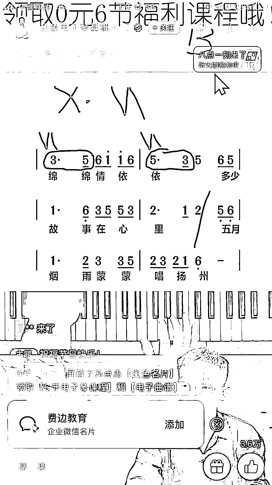

引到私域的话术就是【免费领取XX节XX课程】，引流到私域后，他们的运营方式会不厌其烦的发送信息给你，通知你上免费的课，然后引导你购买课程，请看下图：

 

 

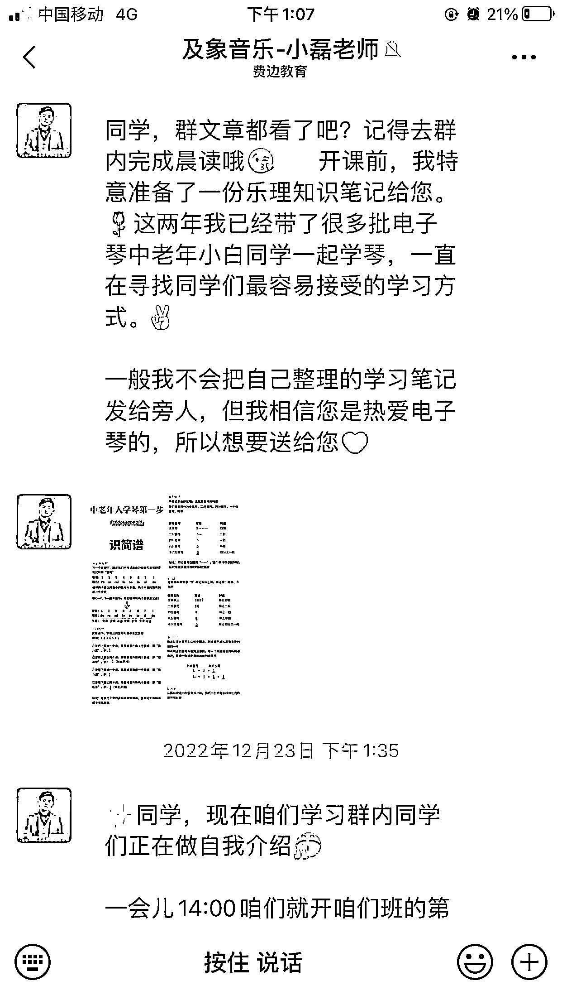

 

 

 

 

 

 

 

 

 

 

 

 

 

 

 

 

 

 

 

 

 

 

 

 

 

 

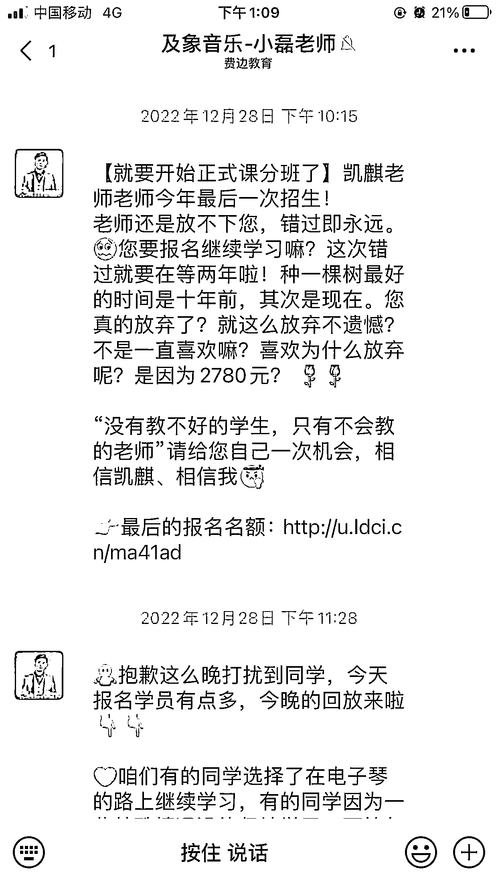

七、新人想做的门槛和建议

① 首先自己必须要有基本的乐理知识，要会唱谱，如果自己不会，团队中至少有人会。

② 这个行业的特点是转化率不高，因为用户只要有时间就可以白嫖

③ 先模仿再超越，执行力拉满，做着做着就有思路了

④ 视频号录播现在依然可行，但肯定会越来越难，录播终究不是长久之计。

⑤ 无音乐基础的可以将唱谱环节的视频提前录制好，结合提前规划好的讲解话术，一样可以直播，案例参考抖音号：大广来唱谱

（**1**）延展思路：乐器类

 

 

乐器类教学因为实操性较强，在学习过程中需要具体的乐器练习，所以，普遍转化率会更高，不会像唱谱赛道存在大量的白嫖用户，产品客单价也更高，当然，竞争也很大，有条件的圈友可以去尝试一下。

落到实地的操作方法同样是先抄后超，先去看同行怎么做，然后进行像素级的模仿，最后在做的过程中不断优化调整改进。

下面提供一些思路和案例：

1）电子琴教学

通过简谱唱谱引流至私域，在私域进行群内电子琴教学录播 + 转化文案的形式。

 

 

 

 

传统电子琴教学，电子琴+教材实操展示，转化率较高

 

 

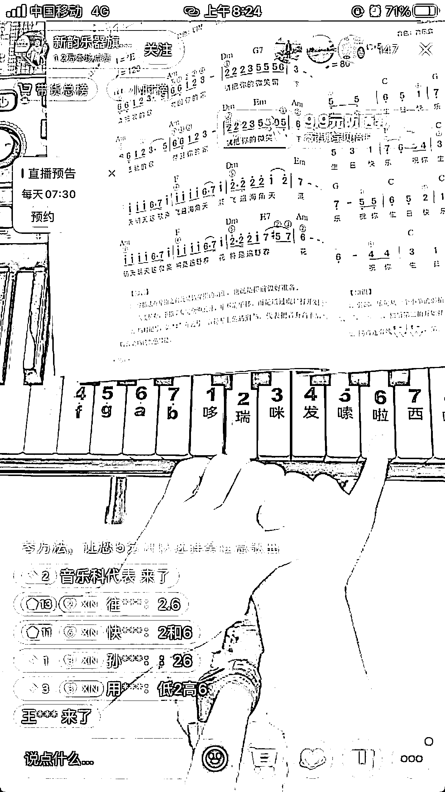

 

 

2）钢琴教学，钢琴教学的太多了，大致分两个类型

传统钢琴教学，与线下教学基本一致，直播时主要讲解乐曲及练习曲的处理

 

 

 

 

简谱钢琴教学，对应的是大学里的即兴伴奏课程，这种形式的钢琴教学非常受欢迎，满足了大多数想学钢琴的成年人，且入门不难。

 

 

 

 

3）电吹管管教学，这是一个相对蓝海的赛道

客单价高，由于结构较复杂，不太适合做教学直播，一般是在直播间示范演奏，然后通过卖乐器变现。

 

 

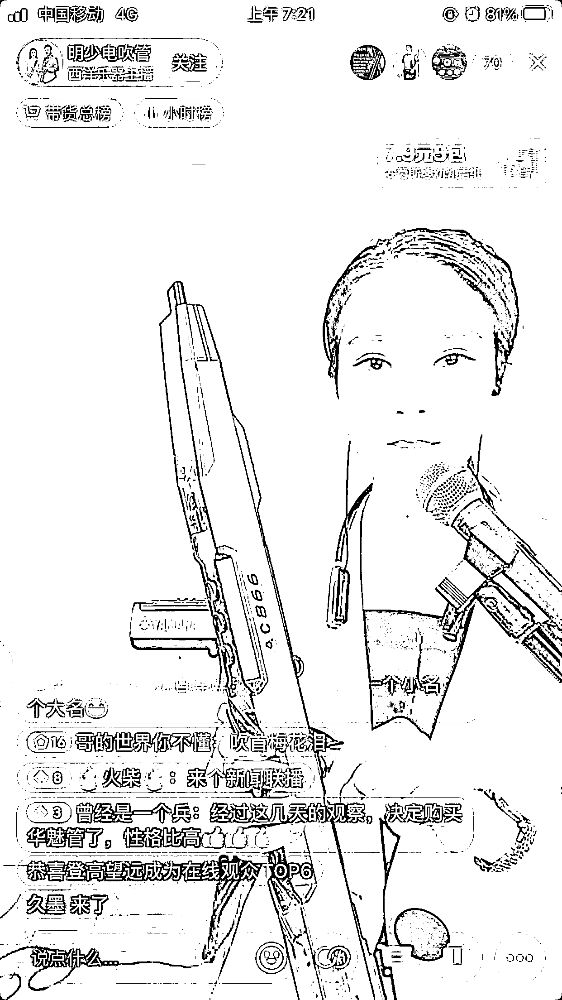

 

 

4）吉他教学，可以和带货相结合（吉他、吉他周边）

 

 

 

 

5）二胡教学，可以和带货相结合。

 

 

 

 

关于乐器类的教学直播，有兴趣的圈友可以多去挖掘一下，这里这是抛砖引玉，提供一些思路。

以上便是我的经验分享，讲的不到位或者不准确的地方请大家指正！谢谢！

评论区：

阿黎 : 很棒，也有很多你的思考，感谢分享

阿祥 : 厉害了，为你点赞啦！

bgz洲洲 : 太棒啦

阿立 : 终于看到和音乐相关的项目了[流泪]

白杨私人号 : [强]

LLL : 谢谢[抱拳][抱拳]

LLL : 谢谢[抱拳][抱拳][抱拳]

LLL : 确实星球很少有音乐相关的项目😂😂

 

 

# 【资料课程】**5**篇

# **# ****(**精华帖**)(1040**赞**)**风向标掘金，免费带领

# **1000 + **互联网小白天涯神贴项目捡钱的保姆级

# 教程

作者：  付一

日期：2023-05-17

《风向标掘金，免费带领1000 + 互联网小白天涯神贴项目捡钱，汇总千人经验的保姆级教程全网首发》

大家好，我是付一，我的合伙人是

这段时间天涯神贴项目大火，

我们在两天起号变现5k+后，

将天涯项目变成了一场千人的项目实战营，

带领千名小白圈友实战，

目前抖音SEO搜索前列，视频号，B站最高播放量视频作者均为实战营成员！

总结千名实战高手的经验之后，我们总结出一份保姆级天涯神贴项目教程，希望帮助大家一起热点生财！

文章目录如下

第一部分：

项目回顾-从两个人到一千人

1）生财风向标发现风口，深入执行

2）真诚利他，免费带领小白开启生财之路

3）迭代升级，带领1000人共掘金

4）这个项目现在还能不能做

 

 

第二部分

千人实践经验汇总---保姆级天涯实操手册全网首发

1）领取资料

2）发内容前准备

3）学会发布内容

4）学会私信引流

5）用微信流量承接

6）变现方式

7）私信转化方式

第三部分  项目总结与收获

1）实战为王

2）生财航海是项目培训的理想模式

3）坚持真诚利他

4）感谢

正文请移步飞书：

微信：fuyi59（付一59）添加备注：生财圈友

都是自己人，不用客气，

有什么问题可以微信来撩

对啦，有用别忘了赞一个[呲牙]

负责任的说，这个项目还在风口，现在实操还能吃肉，心动不如行动，实战为王！

感谢  的指导，帮助我们和很多朋友少走很多弯路！

感谢  的鼓励和纠正，让我们的千人实战顺利进行！

感谢  提供的天涯神贴项目思路和实战经验。

最后，感谢生财有术平台。

https://ixj2n96xjg.feishu.cn/docx/HY99dPzghoqnTTxZYzJcisDgnxh评论区：

 

 

自牧👀 : 太优秀啦！付一哥真的很真诚！

小路 : 付一和平生太用心了

Eve : 平生付一真的强哇！

穷开心与长不高 : 仅仅半年，平生的影响力就已经可以带动千人了，超级节点指日可待[可怜]

七小 : 付一和平生小老弟非常优秀！🐮

百万先生 : [强]

坏脾气的小可爱 : 付一学长和平生学长都很优秀，带着很多人变现，这个项目真的适合零基础的小白上手。

付一 : 感谢自牧[呲牙]

# **# ****(**精华帖**)(291**赞**)**抖音无人直播助眠号**-**音乐

# 号，依靠知识付费** 2 **个月内变现** 10W+ **的经验

# 分享

作者： Lucas zhou

日期：2022-11-02

大家好，我是Lucas zhou，坐标上海，是一名月销近千万的达人带货直播间运营。

由于yq原因，今年4-5月上海人民不得不在家中度过，于是工作之余我和朋友便探索了一下抖音的无人直播玩法，希望找点其它营收。

做了助眠账号和音乐账号，幸得眷顾，在其中变现了10w+。今天分享一点经验给圈友们~

项目成果：

 

 

助眠账号直播间在线稳定3k+，最高在线稳定在万人以上，礼物打赏约5k+；间隔2个月没有开播，9月份开播后在线依旧稳定在1k+。

音乐号在线稳定在3k+，单日场观约100w，单日付费学习咨询约20人，最终单日转化学员约3-4人，目前已转化学员约200人。

这个项目风险低，开通橱窗带货车载U盘，挂载汽水音乐软件推广，涨粉售卖账号等，但要规避封禁账号的风险。

这个项目投入资金少，一台电脑+一部手机，企业号半蓝V认证开通直播权限。

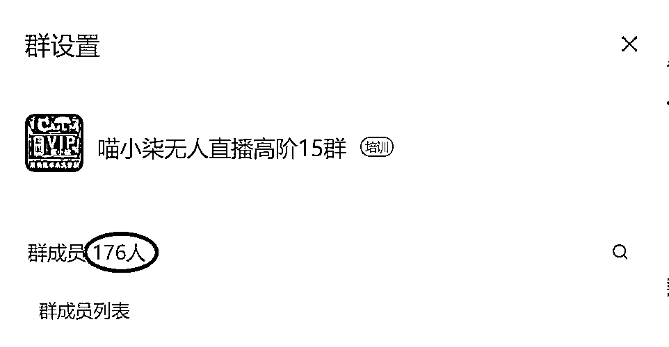

 

 

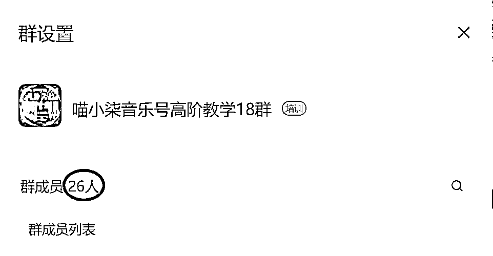

一、如何做一个无人直播助眠号

助眠账号主要就是通过直播间中放一些助眠的白噪音，吸引用户停留在直播间，且这类直播间停留时长普遍较长，系统很容易判断这是优质直播间，便会继续推流。

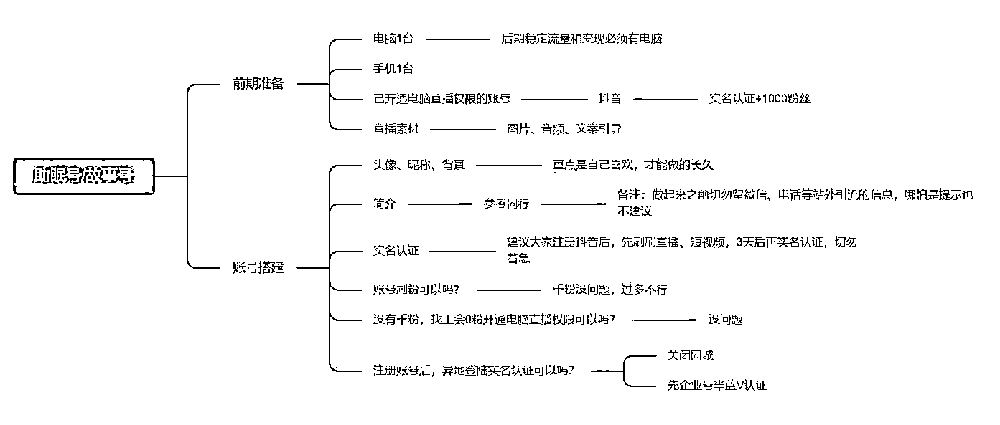

通过圈友大佬们分享的一些无人直播保姆级教程，我们启动了账号。

 

 

主要流程：

1\. 注册账号并养号3-5天，期间可刷一下同行直播间。养号主要为了过风控，让系统判定账号为真人使用。因此我们要尽己所能让其像正常用户使用。

一号一机一IP，注册时使用移动网络；每天在不同时间不同地点使用，如通勤路上、午休期间在办公室短时间使用；

看的内容可以多样一些，泛娱乐、旅游、美食之类不同内容；

点赞关注评论加粉丝团以及购买商品等，每天累积养号1.5h即可。

2\. 准备直播素材，可到油管下载一些睡眠场景图片，在⌈喜马拉雅⌋APP中搜索助眠白噪音音频，通过剪映等剪辑软件制作一段直播间里循环播放的素材。

以下会详细讲解素材制作过程的避坑点，个人总结的经验是素材需遵循以下几个要点：

**1. ** 画面素材有看点

**2. ** 音乐素材不杂乱

**3. ** 音画匹配较和谐

**4. ** 文案具有互动点

3\. 企业号半蓝v认证+1000粉丝开通电脑直播权限。首先需要提前办理个人营业执照，若账号使用个人实名认证就不需要企业号半蓝v认证。

 

 

营业执照可以自行在当地工商局网站线上自助办理，或在淘宝等电商网站找商家代办，没有类目要求，选择【互联网服务】即可。

打开抖音—我—右上角三条杠—企业服务中心—点亮蓝v，按照提示完成前2步，到达第三步点击空白处退出，即可完成半蓝v认证。

1000粉丝是抖音使用直播伴侣开播的硬性要求，在直播伴侣中，开播按钮处会有相应提示需要解锁开播权限，如果粉丝量不够可以在网上找刷粉渠道，价格视市场风控情况会有所调整。

当解锁开播权限后，即使开播时粉丝不到1000了，也是不影响开播的。

4\. 在晚上21点到次日上午8-9点这一期间直播。

一种方法是将音视频素材导入OBS场景中，启动虚拟摄像头功能后，通过直播伴侣采集虚拟摄像头输入源进行直播；亦或是通过淦直播（付费软件）采集推流码直接推流开播。

以下是第一种方式的操作方法。

 

 

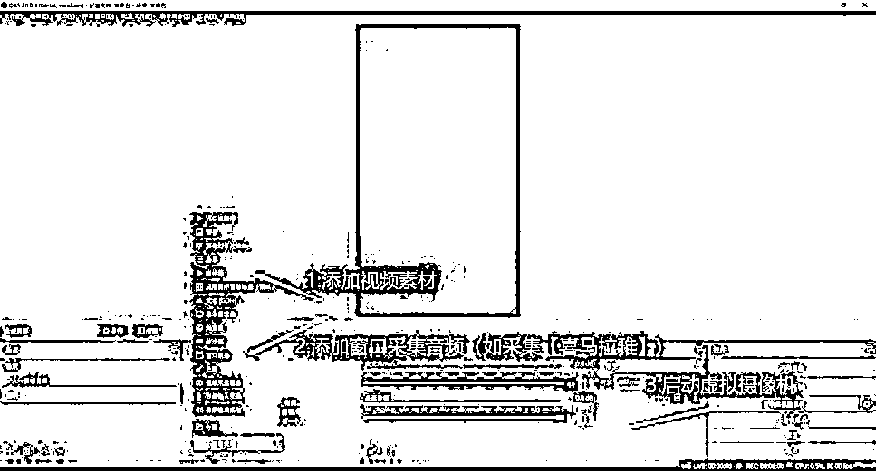 

二、无人直播助眠号如何运营

无人直播主要通过自然流量直播推荐的玩法运营，因此决定我们账号运营好坏的因素主要就是账号本身风控状态和直播间素材优劣。

 

 

所以在账号运营过程中，前期养号尤为关键。注册账号后前3天先不修改用户昵称和简介，正常刷视频和直播间，不同时间不同地点不同网络环境去模拟正常用户使用，适当的点赞、关注、评论。

3-5天后可以包装一下账号，修改昵称和简介（切记账号做起来之前不要留电话、微信等站外引流信息，哪怕是提示也不建议）。

其次就是不断优化直播素材拉升直播间停留以使系统不断推流。一个合格的素材是一个直播间的基石，我们可以通过在各个视频平台搜索相关素材下载下来，或者直接在网上购买也可以。

千篇一律的直播间注定不长久，所以拿到素材后，我们不仅要做去重，还要做一些改动二创。画面昏暗，就需要调色使其明亮，制造槽点吸引停留，如动态的小宠物，人物的睡姿等。

添加动态小动物，可通过添加绿幕素材后调整滤镜所得。

 

 

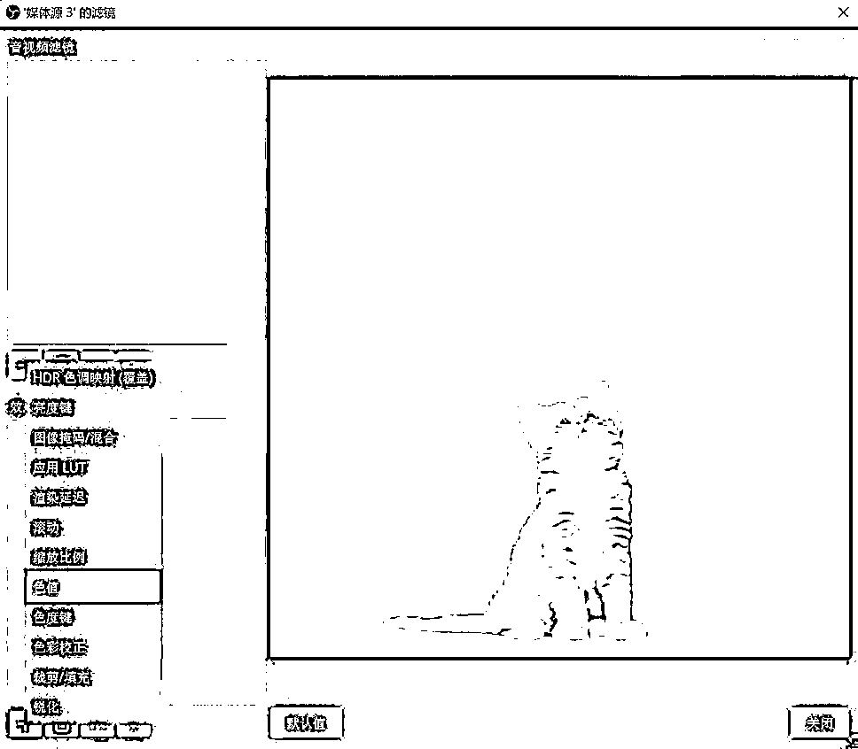

 

 

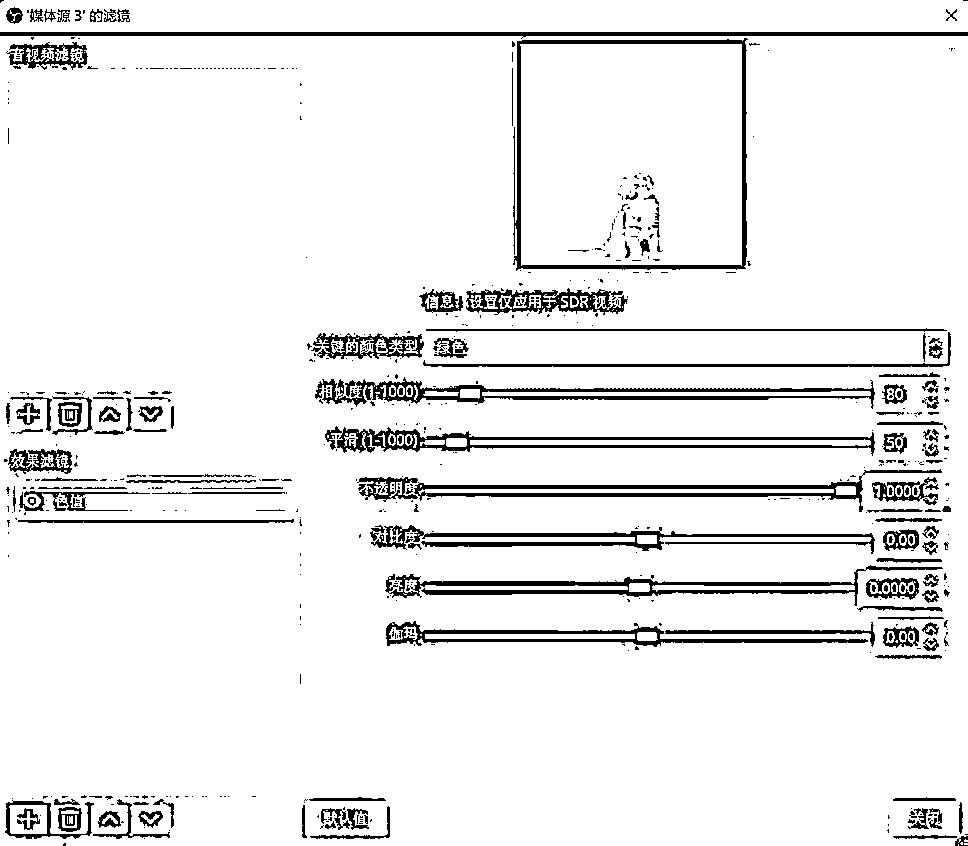

 

 

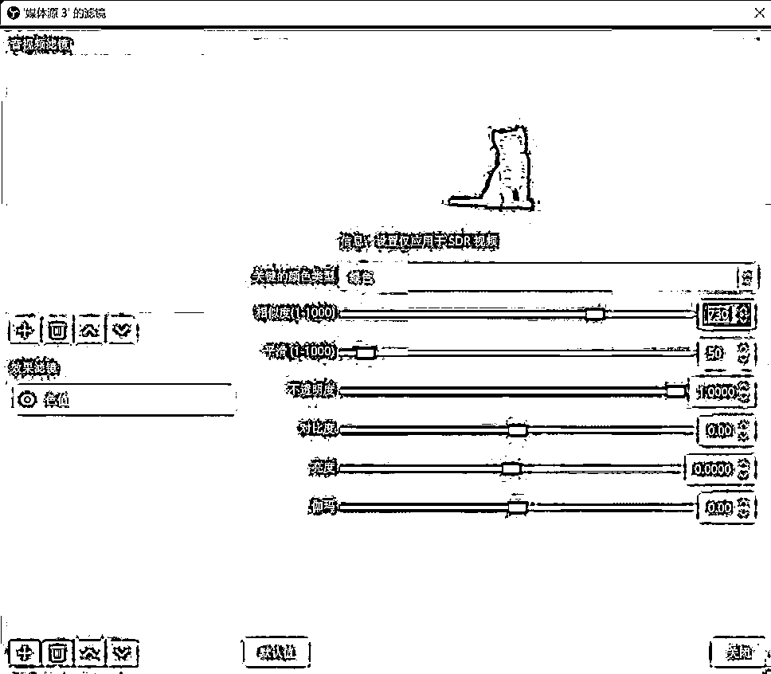

音频可以通过喜马拉雅等软件搜索采集，助眠音频大致有雨声等白噪音类、@脑波音频类、哄睡声控等。

大致根据画面找音频匹配较和谐的即可。OBS通过采集播放音频的软件窗口即可采集到所播放的音频。

 

 

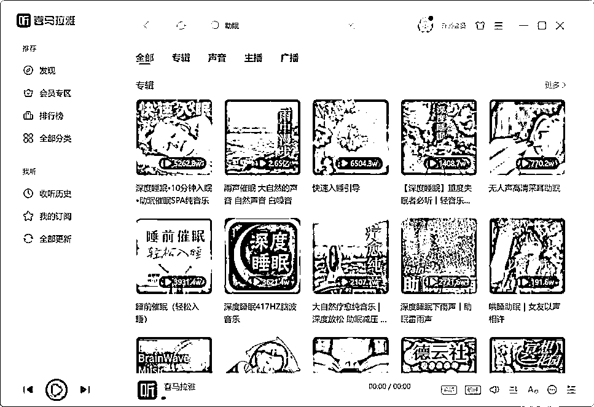

无人直播很容易让系统判违规的一项内容是【非实时直播画面】，即循环播放内容。

为规避此类判罚，一方面我们准备的素材要尽量长，其次可以通过添加动态非循环内容规避，如添加提前制作好的飘屏素材和时间插件。

 

 

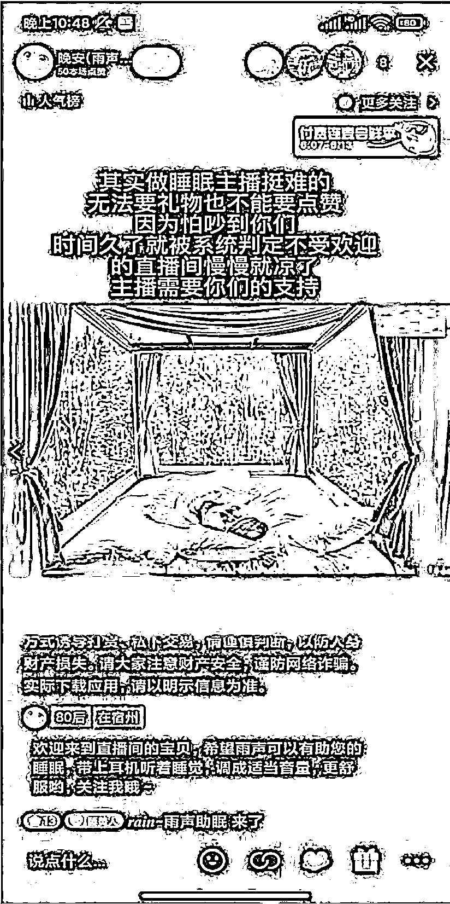

 

 

 

 

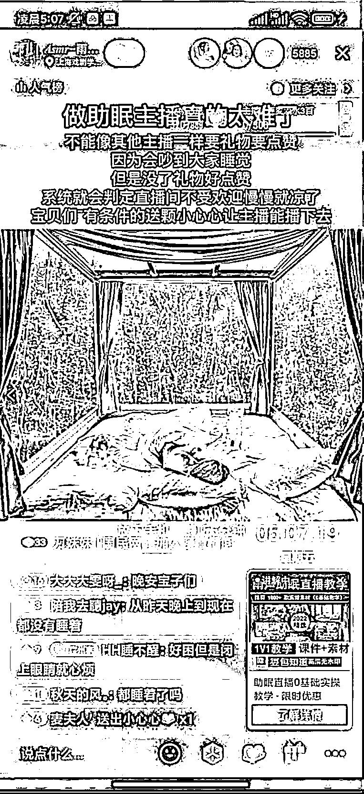

 

 

右侧的素材经过调色、锐化、填充背景、文案编辑、排版、绿幕宠物素材添加动态、时间标签添加等动作，在线数据与左侧相比便是天壤之别。

关于素材，新手可能无从下手不知怎么做，可以在刷直播间时留意一下同行直播间的素材，根据画面去找寻相应素材。

早期仅仅需要一张图片+白噪音就行；经过一次次内卷后，素材质量也不断提高，需要更多的二次创作。

在这期间我总结出以下素材制作的一些避坑点：

① 没有动态感，画面不动，很容易判为无效直播甚至封禁账号；助眠直播间最基本的的就是画面和音频，  也就是观感和听感，只听到声音看不到相应的画面观众的用户体验是很差的。

 

 

② 清晰度不够，可能是原素材问题或是剪辑操作问题。

③ 音画不匹配，只能不断去试听优化。

④ 音量大小问题，音量大小直接影响直播间的停留，宁可小，不能大。

⑤ 画面过于假，透视大小脱离实际，较强的P图痕迹。

 

 

 

 

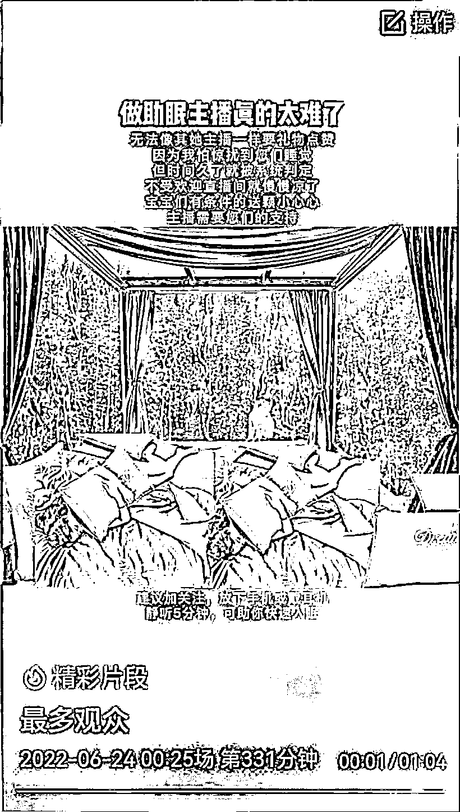

⑥ 明显违规（如身体暴露部位）或相似度过高、使用人数过多的素材。

⑦ 画面无看点，不舒服（画面黑暗脏乱差、内容单调)。

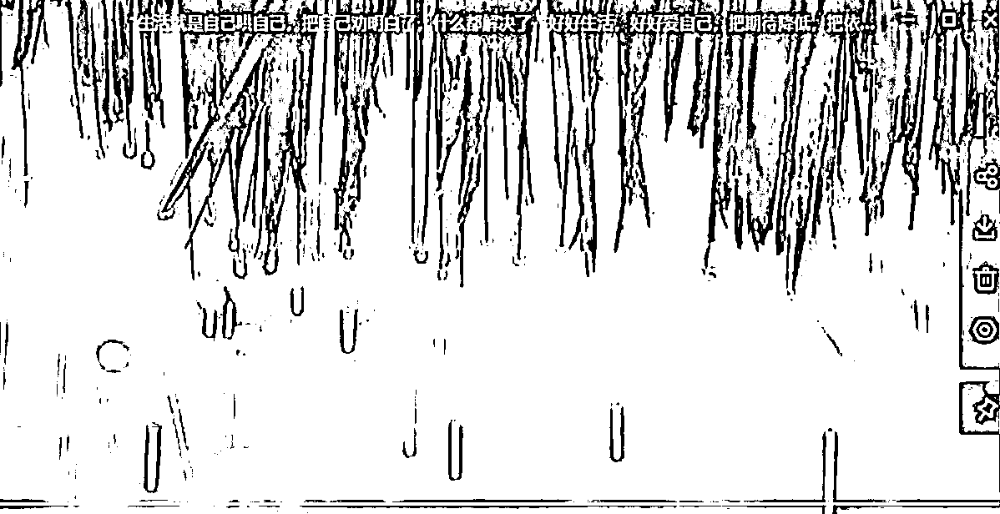

 

 

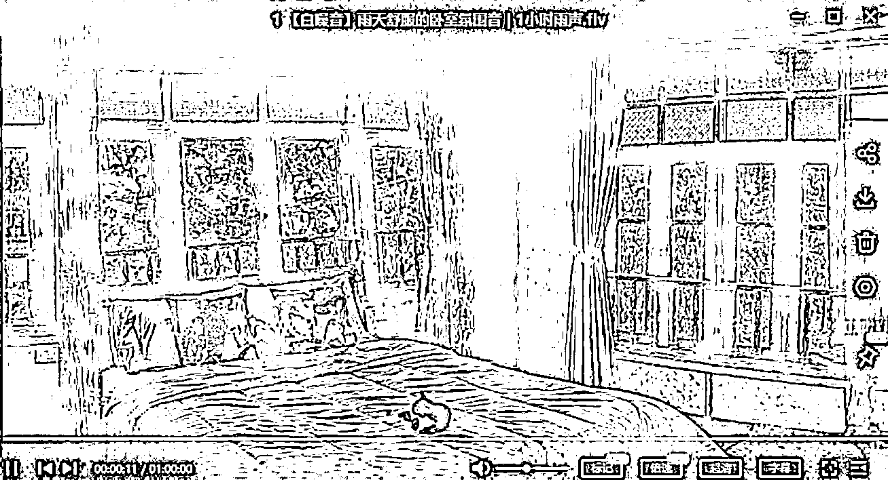

一个优质的账号和直播间素材会帮助你更快起号。

如何判断账号活跃度足够了？

可以发布一条视频，正常会有不少于500的播放量；或者任意开播1小时，一般账号会有200-500的场观，如果场观不足100，那就属于异常账号了，不解除异常几乎不可能做起来。

账号异常的原因主要有3种因素导致。

① 自然因素（之前没有做过直播），建议第二天第三天再开播尝试；解决不了建议注销账号。

② 账号不活跃，可能是太久没有使用，或者是开过直播并且违规过；建议停播几天养号后再开播。

 

 

③ 人为因素，如互关互赞，大量刷粉、刷在线、刷互动；建议停播几天养号后再开播。

当账号和直播素材都准备好之后，就可以开始起号了。

对于1个新号，我们开播的流量肯定是少并且不精准的。起号的前3天，建议每天定时定点开播（精确到分钟），不同类目直播间会有不同开播时间段。

比如助眠直播间建议在凌晨0点到2点之间开播。前三天播1小时内就行，根据直播间流速判断下播时间，如果开播40分钟后就已经不进人了，那就可以下播了，整场直播不要低于30分钟。

坚持3天后到了第4天，理论上开播会迎来极速流，在线会有几十人。当在线高于百人时，直播间可能会出现直播间不能加热的现象，说明本场直播被限流了（账号开始启动），开播时长2小时内下播。

过10分钟后再开播一场基本会再有极速流量，且较上一场流量有所增长，第2场还是会出现直播间无法加热的现象，此时根据在线人数决定下播时间。

如果在线高可以一直播到上午8-9点，如果在线不高，播1小时就可以下播了。往后就按正常开播时间节点开播即可，不断重复上述步骤。

当然，由于众所周知的原因，运营期间恰逢上海市民生活较为无聊，因此账号稳定后，每晚我都会开启同城定位~此时同城流量可能帮助我们放大了直播间的流量。

 

 

三、无人直播助眠号可以通过什么样的形式变现

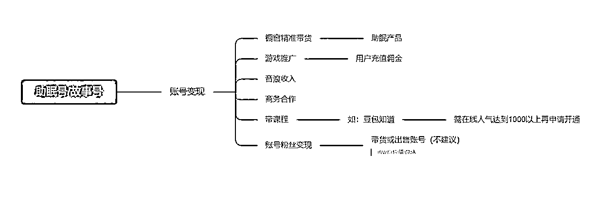

助眠账号在直播中挂载小黄车进行变现是比较困难的，也很反逻辑，来直播间为了助眠而停留的用户，解决的是当下需求。

因此前后我挂载过游戏推广链接，自制课程链接（助眠直播间搭建基础课程售卖约千份）。

 

 

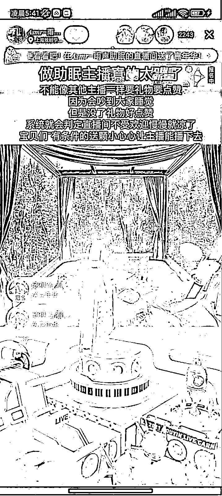

 

 

莫名被眷顾的嘉年华，够吹好几年了😂。

当直播间在线长时间稳定在千人以上时，此时的变现更多依靠的是知识付费，也就是收徒。

前期录制了一套助眠直播间搭建的课程，定价29.9元，共10节课，上架在直播间里共计出单1000单左右。课程中最后还有1堂无人直播专业课的引流课，引流到私域成交。

前期每天会定时发一下朋友圈做营销宣传，当有了学员的转化后，宣传的素材就更多了。

同时我们也建了钉钉的交流群，学员在群内交流以及做更深度的转化，基本上隔一晚我们就会在群里开一次直播，询问大家的直播情况并解决问题，学员们因此更加信任我们。

 

 

之后我们还做过音乐号无人直播的教学，冷启动便有10人报名。

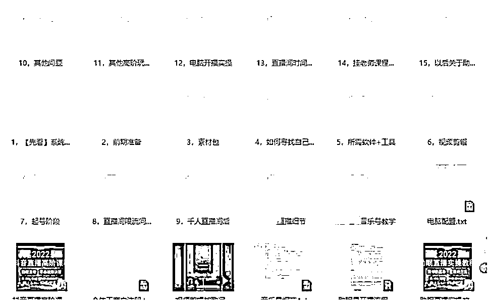

四、新人想做会有一些什么样的门槛

无人直播的生命周期很短，需要不断迭代换内容。

如后续出现的音乐直播间（我们也做了）、影视直播间、云蹦迪、沙雕漫画直播间、游戏直播间··· ···不变的是无人直播间的运营方法，起号、破流量层级、稳流量、变现等，基于此不断研发新内容。

新人急需掌握的是合格素材的制作，一个优质的素材，即使没有玩法运营也是有机会做起来的，只是有好的运营方法会加速这个进程。

 

 

 

 

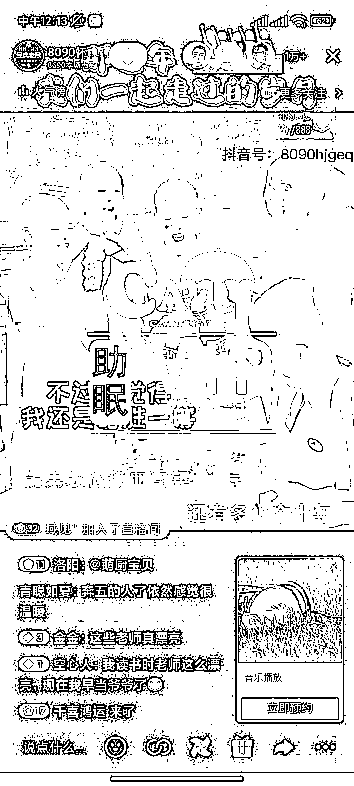

 

 

 

 

 

 

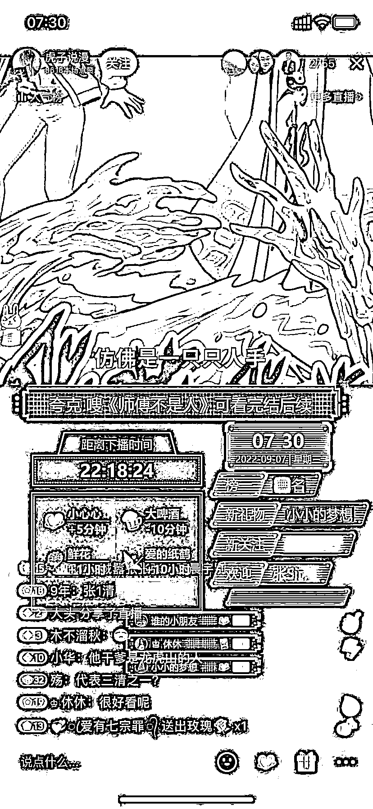

 

 

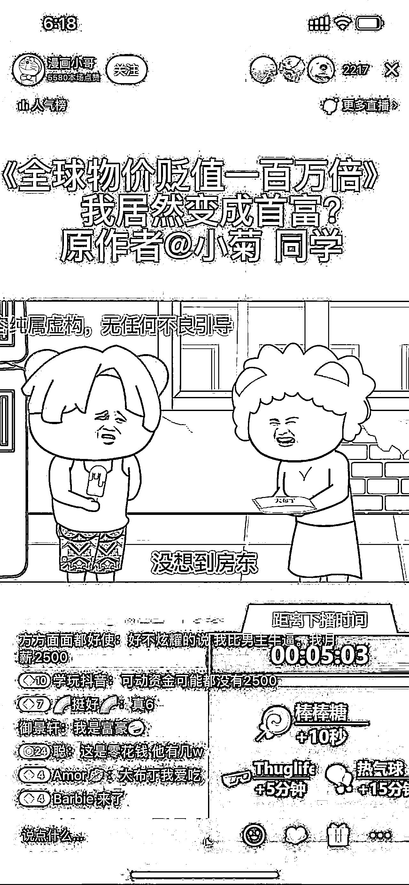

 

 

五、结语

无人直播是个投入成本极低的项目，但面对的问题也是更多的。

非实时直播画面、长时间无有效互动，时刻面临着违规限流甚至封禁账号。

助眠、声控、故事号、游戏号、音乐号、沙雕动漫，衍生迭代的内容也越来越多。

因此也暗藏着很多商机，素材售卖、素材制作教学（沙雕动画）、下播倒计时软件售卖（规避非实时直播画面）··· ···可以去做一个“卖铲子”的人。

大家也要清楚无人直播不是挂着就能躺赚的项目，对于项目有一个预期，再判断自己适不适合、愿不愿意投入去做。

 

 

以上，第一次在生财上分享，文笔拙劣，欢迎圈友链接，祝大家生财有术~

评论区：

Lucas zhou : 大家好，第一次在生财上分享，大佬们多多指教！刚参加了9月份的半无人直播小航海，接下来也会深耕于此，希望认识更多的同行小伙伴~

+龙 : 互粉也会影响直播推荐吗，

Lucas zhou : 会的

亦仁 : 感谢分享，已加精华。

蕣 : 优秀

草木青（勇猛精进版） : 优秀，

李森 : 感谢分享[玫瑰]

江湖 : 优秀

# **# ****(**精华帖**)(286**赞**)**受一条风向标启发跑通抖音

# 四维彩超**AI **项目，实现**17 **天收入过万

作者：  竹子。

日期：2023-06-30

《新手小白受到一条风向标的启发，执行拉满，跑通抖音四维彩超AI 项目，实现17 天收入过万的复盘》

大家好，我是竹子。今年 4 月 22 日加入生财的新人。出生财新手村后，5月6日看到了一条四维彩超ai生成宝宝照片的风向标后，5 月 7 日晚上入场抖音，发了第一条关于四维彩超 AI 预测宝宝长相的短视频，当天晚上开始有客单咨询，完成了从 0 到 1 的变现，17 天完成收入过万，目前视频合集播放量超 100w。

这是一篇复盘帖，我将从AI绘画的变现形式和路径、引流转化的方式、我遇到的各种问题和解决方式来分享这个项目的跑通经验。

 

 

大部分内容在5月的AI绘画航海中已经做过分享，本次的分享添加了一些新的内容，重新做了一下章节调整。

具体内容请移步飞书阅读：

在这里感谢生财平台和圈友提供的风向标，让我赚到了来生财的第一桶金。也谢谢生财团队子安的分享邀请，push我产出了这篇复盘帖。

感谢  我的朋友和大学同学在朋友圈为生财代言，让我知道了这个会搞钱的社群，带我进了生财，也作为这个项目的合伙人为整个团队的小伙伴提供了不少帮助和支持。

感谢美丽的首席医官  指导我修改帖子，通过醒谱白战队进入生财真是我的福气呜呜，醒谱白战队&陪伴群yyds, 感恩！！

我永远爱生财，一起生财有术！

https://xqya1zd76f2.feishu.cn/docx/Xqmed28eTomg4bxVEmkcCwgtnSd评论区：

书情小跟班 : 这执行力杠杠的啊

梁靠谱 : 执行力拉满，就是结果拉满，风向标牛逼，竹子牛逼！

三行MU : 厉害了这执行力

坏脾气的小可爱 : 执行力太强了吧！

课代表 . jime : 很佩服有系统有执行力的做事儿

凌心 : 执行力拉满

张热烈啊 : 执行力yyds

竹子。 : 谢谢夸夸，一起生财～

# **# ****(**精华帖**)(221**赞**)**细分定位** IT **录播课，实现每

# 月被动收入** 5W+**

作者：  鱼丸|亦仁助理

日期：2022-03-16

 

 

大家都知道，我们本期抖音商业 IP 大航海 2.0 已正式开船，但我们也发现有不少圈友因为时间的问题，没办法跟着我们一起学习。没关系，我们这期「生财合伙人」专栏，请来了 @突围一只鹰  老师，来为我们分享另外一个切入知识付费赛道的方式：录播课。

在同样时长下，直播课需要协调学员的时间，但录播课却可以把时间售卖多次，大大提高了用户覆盖数。虽然大部分垂类录播课的收入天花板不高（百万级），但对个人来说仍是个不错的选择。

他将会在本篇「生财合伙人」专栏中，以他细分定位 IT 录播课为例，为我们详细分享一门爆款录播课从制作到售卖，再到交付的全过程。

虽然文中涉及的领域比较小众，但是课程的制作、售卖、售后服务都是相通的。如果你在找一个时间效率相对较高的副业方向，文中会给出你想要的答案。

目录

一、录播课是个好的副业吗？

二、如何制作一门录播课？

三、如何卖出第一份录播课？

四、如何扩大录播课的收入？

五、如何做好录播课的服务？

 

 

你好，我是突围一只鹰，程序员出身，从 2014 年开始创业，做过 App、软件外包，目前专注于自媒体。

我做 IT 录播课已经有 4 年多了，出过爆品课程，也有 0 销量课程，目前能做到每月  5W+ 收入，高峰时期月收入超 20W。同时我也在帮助一些朋友通过技术类录播课变现，最高的已经做到年销售额大几十万。

本文约一万字，整篇分享围绕以下话题展开：

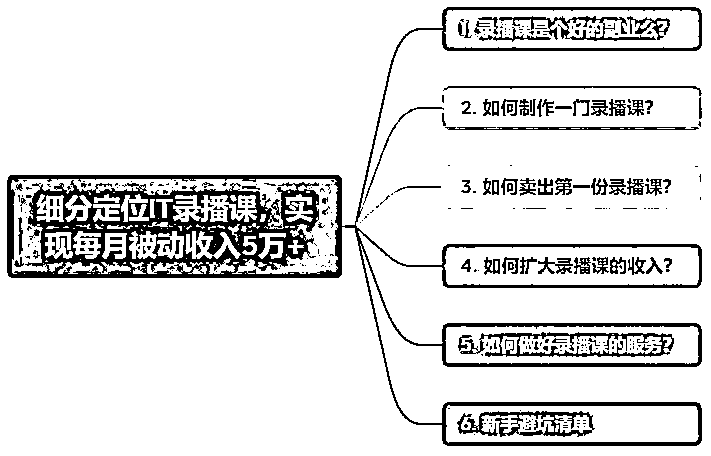

**—Part 1—**

录播课是个好的副业吗？

 

 

好的副业应该满足以下 3 个条件：

收入有潜力，长期来看有机会超过主业。

与主业互相促进，主业的经验能给副业带来竞争优势，副业带来的个人影响力

可以反哺主业。

最好可以长期做，有积累、有复利。

对于录播课而言：

**1**） 它是一个可以把时间售卖多次的好生意。大部分垂类录播课的收入天花板虽然不高（百万级），但对个人来说是个不错的选择。

**2**） 它可以打造你的个人** IP**，提高你在整个技术生态中的地位，以及增强日后你在职场中的竞争力。

3）长期来看，教育行业会是一个持续存在的行业，只要你做的内容符合未来趋势，就能长期持续地做。

如果你也是程序员，或者是技术类职业，这个副业方向将会非常适合你，不仅能带来额外收入，还能帮助你的主业更好地发展，甚至超过你的主业。

**Q**：我是怎么走上录播课这条路的呢？

 

 

大鹰自从大学本科毕业以来，就一直从事软件开发工作，也就是程序员。我有写技术博客的习惯，会把工作中遇到的问题或者学到的新知识技进行总结记录。

经常有小伙伴在博客留言问一些非常基础的操作问题，比如 XX 功能的入口在什么位置，XX 的设置在哪？还有小伙伴问：博主有没有视频教程？

刚开始我并没有当回事儿，不觉得这是一个机会风口。后来我开始发现图文表达的方式有局限，因为当时自己的写作能力也有限，经常会出现文章内容表述不够精准的情况。

而且，自己在学新技能的时候也更倾向于看视频教程，我这才渐渐意识到：视频教程有得天独厚的优势。

图文是有选择地表达，总会有遗漏的地方，而视频能记录下所有的操作，其他同学在学习的时候可以根据看到的步骤进行操作、模仿学习，减少学习中遇到的问题。

2018 年初，我尝试录了一个简短的视频教程，定价 38 元。这个视频上架到腾讯课堂（抽成 10%）之后，反响还不错，前几个月每月都能有一千多块的收入。

当时我心想这门生意不错，如果我能录 100 门视频教程，那相当于每个月就能有 10W 收入。当然，这是异想天开，具体原因后面再说。

我从 2018 年初到 2021 年底，总计制作课程 50+ 门，目前还在售卖的课程有 20 门。

在全网多平台自然流量下，月收入稳定在 5W+。

**Q**：对讲师有什么硬性要求吗？

 

 

录课的门槛并没有想象中那么高，就像你在日常工作中给一位新同事讲解你做的东西，在这个基础上更精炼一些就行。

大体上来说，制作录播课需要你具备以下几点：

**1**）有一个熟悉的技术或者项目

这里说的是熟悉，但不需要技术难度很高。优秀的高中生就可以教小学和初中，所以不要怕自己还不是行业专家，没法去当老师。记住：并不是要成为罗永浩才可以直播带货。

小到你的大作业项目、课程设计、自学的技术，大到商业级实战项目、专业系统课，都可以成为录播课。

**2**）正常的表达能力

**3**）视频剪辑（不会可以学！）

视频一定要精炼，不要发布未经剪辑的视频，把视频中无关紧要的内容全部剪掉，节省用户的时间。

读到这里，你大概已经知道录播课适不适合自己，以及要不要选择录播课作为一个副业突破口。下面我们就一起尝试去制作第一门录播课吧！

 

 

**—Part 2—**

如何制作一门录播课？

如何做出一门爆款录播课呢？

首先要回答一个问题：别人为什么会买你的课？

你的课一定是能让学员解决遇到的困难、更好地完成工作、找到更好的工作、挣更多的钱，然后你从他们挣到的钱中分走一部分，你的课才能做得更好。

让买课的同学高效学会你讲授的知识技能，更进一步则是帮他们解决问题、找到工作、升职加薪。这些是录播课的原则，将这些话记在心中，遇到问题时这个就是答案。

下面我们就开始讲具体的录播课制作流程。

第一步：做好选题

2018 年初，我在第一门小课上尝到甜头之后，就开始准备疯狂录课，目标是一年录制  100 门课程。然后开始制作我拍脑门想到的一些选题的课程并逐步上架，定价都是 200 元以内的小课。但是随后上架的 3、4 个课程，销量很差。

 

 

另外，还发现了一个问题：课程生产速度并没有那么快。第一门课程虽然只用了两三天就录完了，但是在录制前是花了很多时间做准备工作的。当时觉得一年能做 100 门课程，可实际上一年想做 50 门课程都非常困难。

既然课程的产量做不到那么高，就得从质量入手，得研究一下为什么有的课程卖得好，有的课程就卖得差呢？经过仔细分析以后，发现卖得好的课程有两个原因：

**1**）跟上了一个热点

当时微信刚出来跳一跳小游戏，那门课程是跳一跳小游戏的教程。但是后来出的几个课程既没有热点加持，也忽略了市面上已经有类似的课程，而且这些课程有数据和评价支持，我的课程并没有差异化，学员自然会去选择那些课程。

**2**）目标人群精准

这在当时是误打误撞的，后来才发现 80% 购买此类小课的学员都是为了完成自己的课程设计而购买，刚好课程的内容、难易程度、价格非常符合此类人群的需求。

所以，一门录播课能否成功赚到钱、赚到大钱，选题占了一半以上。选题选好了，后面会事半功倍。这个环节是你的课程能不能卖好的最关键一环！最关键一环！最关键一环！

一、选题类型

在开始选题之前，你先要了解录播课的几种课程内容类型：

 

 

**1. 0 **基础入门课

这类课程主要面向小白用户，他们的核心需求是快速入门。课程内各个知识点需要详尽讲解，否则后续的答疑压力会非常大。

在这个阶段，学员主要不是为了课程视频付费，而是买个能随时帮忙答疑的老师。所以，讲师不需要有很强的技术背景，现学现卖都可以。即使将很多技术官方出的图文教程通过视频课演绎一遍，也会有人买。

此类课程的缺点是门槛低、竞争激烈，而且 B 站中有很多免费基础教程。

这类课程的机会在于一些新兴技术的教程，由于国内暂时没有系统性的入门教程，如果早期能从国外网站学习并用中文重新演绎，并在垂直领域站住脚，也可以取得不错的收入。缺点是选择太早期、变化太快的技术版本做教程是一把双刃剑：

早期技术的教程还没人做，你做可以快速占领市场，但是维护成本非常高，可能在教程录制的过程中，技术就发生变化了，学员跟着你的教程学习，会遇到很多的问题，答疑压力会非常大。

如果你想做一门课长期获得被动收入，个人并不推荐这种类型的选题。

**2. **专题进阶课

什么是专题？《0 基础入门 Excel》属于入门课，而《如何在 Excel 中使用 VBA》则属于专题进阶课。

 

 

此类课程面向有一定基础的用户，他们的需求通常是解决工作中的问题，增加自己的核心竞争力，争取升职加薪。

此类课程的大课可以做到较高的客单价，但需要比较强的技术背景，对专题技术熟悉度很高。

**3. **项目实战课

此类课程有自身的优势，即使你两门课包含的技术点大体相同，但是用不同的实战项目串起来，就可以作为两个课程售卖。

课程主要可以定位 3 类人群：在校学生、应届毕业生、求职者。

在校学生：实战项目作为课程设计的作业，课程内容不需要太多，重点不在技术讲解，而是跟着你的视频操作就能把项目做出来。用户对定价敏感。

应届毕业生：实战项目作为毕业设计或求职作品集的展示项目，课程内容需要相对完整，有一定的技术难度，符合最新的职场技术方向。用户对定价不太敏感。

求职者：实战项目需要作为项目经历写入简历。课程内容需要完整，看起来是一个商业项目案例，有较多的技术难点讲解，能经得起面试官的提问。用户对定价不敏感。

**4. **系统就业课

此类课程主要面向应届毕业生以及求职者。学员的需求是掌握此门技术达到特定岗位的要求，可以通过笔试面试找到工作。

 

 

课程内容需要完整且系统化，包括基础知识原理的讲解，也包括实战项目，可以说涵盖了上述 3 种课程的内容，但不是简单拼凑，而是需要系统化的设计。

4 类课程类型的对比如下：

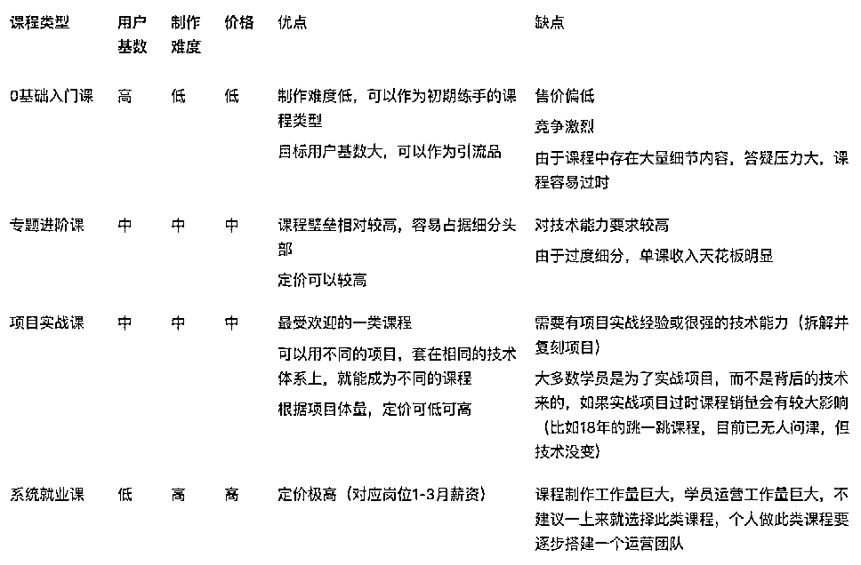

二、选题原则

了解了课程类型后，在具体选题之前，先分享我总结的 4 个选题原则：

**1. **力出一孔

 

 

如果可以，尽量集中精力做一门优质大课。比如项目实战课或就业课（如果对课程有信心可以包就业），为什么呢？

学员对低价课和高价课的品质与服务要求是一样的，低价课会有很多的客服、答疑成本，综合算下来可能并不能赚钱。但是一个 5000 元左右的高价课，一方面可以减少精力分散，另外一方面高价课所产生的收入足以让你做好课程的各个方面。

**2. **选题查重

在选题基本确定后，一定要去市面上查找看看有没有类似的课程。

如果有，一定要想好你的差异点、竞争点在哪里，为什么用户买你的课而不是友商的课？如果没有明确答案，这个课程选题就要放弃掉。

**3. **强获得感

课程学完后，学员要能跟着你做出一个实际案例出来，能作为他学业、求职升职的一个作品。这种类型的课程对学员才有获得感，不至于学完之后什么都没留下。

**4. **蹭热点

如果可以，尽量跟上一些当下的热点，这样会有流量加持。但是也不要为了蹭热点而蹭热点，核心还是课程内容本身。

比如最近《原神》游戏比较火，你就出一门《原神渲染实战课》，但你的课程核心还是渲染技术。

 

 

比如最近拼多多爆火，你就出一门《从 0 开始开发一个拼多多 App》，但课程核心还是  App 开发技术。相当于铁打的技术（内核），流水的项目（外表）。

然后要避开「选择太早期、变化太快的技术做教程」。这是一把双刃剑，早期技术还没人做教程，你做可以快速占领市场，但维护成本非常高。在教程录制的过程中，可能技术就发生变化了，学员跟着你的教程学习，会遇到很多的问题，答疑压力会非常大。

三、选题步骤

**1**）根据自己的技术储备，确定课程大体的技术方向。比如你擅长 Android 开发，那就大方向是 Android。

**2**）定位目标用户。根据自己的实际情况，定位你的课程要卖给谁，解决他们的什么问题（学生的课程作业、毕业生的就业、在职人员的转行等），基本确定课程类型。

3）通过下述的数据驱动选题法，找出 20 个关注度高的技术、项目作为备选主题，依次执行 4-7 步。

**4**）在搜索引擎中搜索是否已有类似的课程。如果有且与你定位的目标用户冲突，则排除该主题。

**5**）评估该主题所涉及的技术范围是否是你力所能及的。如果是，选用该主题，如果不是，进入下一步。

 

 

6）如果主题涉及的技术范围太大，评估能否缩小课程范围到能力圈。比如你讲不了《拼多多系统架构实战》，你可以讲《拼多多 iOS App 开发实战》。如果能缩小范围，选用该主题；如果不能，进入下一步。

**7**）评估能否现学现卖。很多技术通过自学，然后录视频二次演绎，能取得非常好的效果。因为你能从初学者的角度，去讲解课程中内容。如果能，选用该主题，如果不能，放弃该主题，回到第 2 步。

现在拿到的选题就可以作为下一步课程设计的题目了。

再举几个具体选题的例子：

一门技术如果你也刚入门，刚好你可以从初学者的角度制作** 0 **基础课，初学者视角对于技术大牛来说很难做到。

如果你对某项技术研究的非常深，专题进阶课适合你。

如果你项目经验丰富，实战课适合你。

如果你在一个技术岗位有超过** 5 **年的经验，系统就业课适合你。

**Q**：什么是数据驱动选题？

找一个你想要录课技术领域的规模最大的公众号，扒下来它最近一年内的推送数据，分析阅读量、点赞量、转发率最高的文章。身为程序员，数据当然不是手动扒了，把数据爬下来。

 

 

如果不熟悉爬虫，可以看看新榜、拓途数据等工具里面的公众号回采服务。新榜贵一些，拓途数据 500 篇 30 元。如果你还觉得贵，可以看看某宝，关键词是「公众号回采」。

同理，还可以分析各个博客网站、课程平台的数据，分析当下热门的话题，更要分析几年内都很热门的话题（说明这类技术关注度一直很高，此类话题的课程更不容易过时）。

还有一个选题数据来源，就是找各个在线课程平台的类目经理，他们会给你提供一些选题的建议，毕竟他们手里的数据是平台实时一手的数据，有很大的参考价值。

四、选题验证

选题完毕就开始制作课程了么？NONONO。

我们还需要验证选题是否真的是用户感兴趣的选题，进而会买你的课，同时找到一些种子用户。怎么操作呢？

根据选题写一篇相关图文教程，教程内容是你想做的选题中的部分知识点。文

末留下** QQ **群号（**XXX **技术交流** Q **群：**1234567XX**），发到各大技术博客中（**CSDN**、博客园、知乎、简书等）。

分享文章到你已加入的相关技术群中。

如果大家对你的内容感兴趣，会有一些人加入** Q **群。

 

 

持续在群中讨论相关技术** 3 **天，在第** 3 **天分享课程大纲，关注大家的反馈。

第** 4 **天发布课程预售信息，**1 **元定金（课程上线后可抵** XXX **元）。如果入群** > **交定金转化率能超过** 20%**，说明你的选题是用户真正有需求的，可以继续进行课程制作。

选题验证环节就是要通过真实用户的反馈，来验证你的选题不是一厢情愿，并且通过早期的验证可以积累起一部分种子用户。

这里用到了一种精益创业的方法：假设验证法。这种方法能避免我们的产品做出来，才发现用户根本不需要，没人买的场面出现。

先做假设：一个创业项目要做成，有许多先决条件，这些先决条件就是我们做出的假设，只有这些假设经过验证可成立之后，我们的创业项目才可能成功。

再验证：验证的方法成本从低到高依次是：常识 < 数据分析 < 调研 < MVP。

这个话题后续我会再详细总结分享一下。

第二步：课程设计

现在我们的选题经过了验证，也有了一些种子用户，可以开始课程设计了。

 

 

课程设计最开始要做的是什么？查阅资料，寻找对标，还是设计大纲？这些都是课程设计的必要环节，但我认为最开始需要做的不是这些。

一、先定价

最开始要做的是定价。

你可能会很诧异，怎么会是定价呢？现在还什么都没有，怎么定价呢？

价格决定产品！价格决定产品！价格决定产品！

同样是一瓶洗发水，定价 20 和定价 200 的产品设计方案完全不同，主打卖点不同、包装不同、渠道不同等等。

所以，在你选完题之后，你就应该结合自己的能力，先对课程做一个初步的价格预估。

比如同一个选题，你要做一个 200 元的小课还是做一个 2000 元的大课，在课程设计上一定是不同的。200 元的小课可能只包含主题相关知识点，很少做技术延伸讲解，大概  10-20 小时。但是 2000 元的大课，除了课程内容更丰富、系统化之外，还提供更多的增值服务，比如答疑、督学、直播加餐等等。

但是一定要记住，即便是不同价位的课程，用户对于课程质量和答疑的需求都是没有太大差别的，如果有能力，建议多做高价课，高价课和低价课引流、服务的成本几乎一样，但是高价课能让你更专心地去提升课程内容质量和服务。

如果你对一门课程能卖多少钱没有什么概念，以下几点可以作为参考：

 

 

1）可以参考同类型课程确定价格范围，并在课程上架时先从较低的价格试验（早鸟价、首发价），后续可以逐步提高价格。

2）如果是独有的课程，差异化较大且是刚需，可以定高价（根据课程内容甚至可以过万元）。

3）还有一个定价角度：你的课程能给学员带来多少收入增量，比如学完你的课包就业  8K 以上，那你可以收他 1-3 个月薪酬也就是 8K-24K 作为学费。

二、大纲设计

下面就要具体设计课程中需要包含什么内容了，大纲设计和优化贯穿在整个课程制作过程中，初版大纲可以按照如下步骤去设计：

1）使用思维导图（大鹰用的飞书文档），暂不查阅资料，拍脑门子列出选题所涉及的需要讲解的内容点。

2）验证所列出的内容点能否支撑目标用户的需求以及课程定价（如不确定可以在各课程平台搜索，对标同类型相近价位的课程）。

3）如果不能，需要进一步扩展内容点或者增加实操案例。

4）细化整个大纲思维导图，有些课程（实战课）可以直接拿思维导图录课，不需要再额外做 PPT。

 

 

5）开发大纲中涉及到的实战项目。

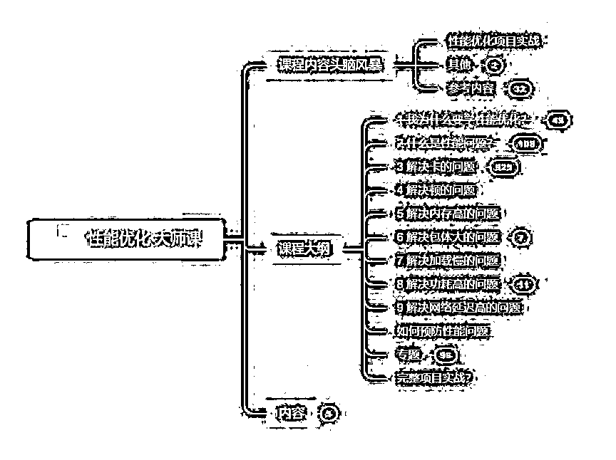

定价和大纲有初版之后，可以继续在种子用户群中分享验证一下。

三、课程制作

课程制作一般要包含以下几块内容：

1）PPT 制作，是否制作 PPT 需要根据课程内容来定。

 

 

如果理论知识偏多，建议用 PPT 图文搭配讲解；如果课程是实战项目，很少有原理讲解，主要是实际操作，可以直接用思维导图大纲将课程串起来。PPT 中尽量不要包含二维码等内容，有些课程平台审核严格，严禁向站外导流。

2）配套实战项目开发。

3）几篇图文干货（用于图文平台的推广）。

4）提供几节试听课。

为什么要学这个课？讲遇到的问题、技术背景、前景、学好之后的收获（升职加薪等等）。

我能得到到什么？尽情展示本节课的直观最终成果，比如实战课最终成

为什么要跟你学？一两节吸引人的课程内容。

5）后面是正常的课程内容。

四、录制

录课所基于的技术版本，尽量使用最新的稳定版本来录制课程。优先使用最新的 LTS（Long Term Support，长期支持）稳定版本（因为企业中通常会使用 LTS 版本开发，而且 BUG 更少）。

1）最新可以保证课程的寿命，不会因为技术过时而过早淘汰。

 

 

2）稳定版可以保证课程质量，避免因基础技术、SDK 版本不稳定带来问题，可以减少售后以及答疑的压力。

录制、剪辑工具顺手即可，我用的工具如下：

录音设备：罗技 H340 头戴耳麦

录制工具：OBS 或 Camtasia（Camtasia 有个问题就是录出来的视频特别大，比较占空间，但好处是可以录制中加一些标记，比如在你卡壳地地方加标记，这样你可以有重点地剪辑）

录制配套小工具：PointerFocus（高亮显示光标位置）、Carnac（显示你按下的快捷键）剪辑工具：Camtasia（如果不会 Pr，可能 Camtasia 是一个比较好的选择，简单够用）如果从来没有录过课，建议先录几个短视频教程传到 B 站练手

五、讲解

在录课讲述时，要有目标感。你要想象面前是你的一个学生，你要一对一将知识经验传授给他。你所讲的内容一定是连续的，有前后逻辑的。

图文内容在某处作为补充内容可以放一个超链接，如果用户想了解更多详细信息可以点击超链接去阅读另外一篇文章。

但由于视频课是线性前进的，要根据你的目标用户在课程讲解中及时对可能大多数人都不清楚的内容进行补充说明。补充说明要简洁明了说清楚两件事：这个名词是什么；如果你要详细了解应该去哪里？

六、注意事项

 

 

录制过程中注意以下几点，可以大幅减少后期的剪辑工作量：

有意识的控制自己不必要的语气词，比如「嗯、然后」等等。

熟练使用录制工具的暂停功能，某些时候，会发现没办法表述清楚或者突然大

脑一片空白，可以先暂停，好好梳理后再继续讲。

在说错的地方做记号，方便后期剪辑。**Camtasia **录制工具可以在录制中加标记，使用其他录制软件的时候可以拍手做记号，剪辑时能在音波图上看到一个

尖刺。

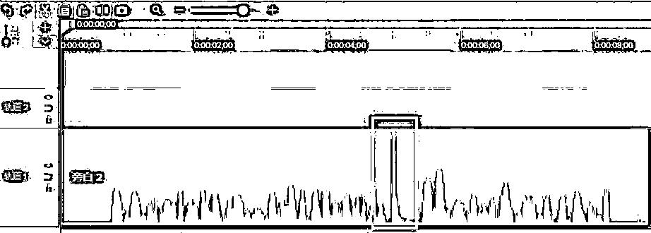

**—Part 3—**

如何卖出第一份录播课？

课程制作完毕，下一步就要开始想办法卖出这份课了。

 

 

一、选择课程平台

首先要有一个能承载录播课的平台，这个平台可以完成用户从浏览到下单再到学习的整个闭环。

作为一门副业，不建议自己建站（小鹅通、EduSoho、有赞等 SaaS 工具也算）作为主阵地。优先使用公域课程平台有以下好处：

第一，可以减少早期的工具服务费投入。

第二，可以大幅降低流量获取成本，但相应地也需要支付一定的分成给平台（一定要舍得分钱，让专业的人做专业的事，否则自己会累死）。

第三，即使你自己不做任何推广宣传，靠自然流量以及平台的促销活动，依然会有出单。但是自己建站卖课就需要自己去开拓流量。

技术类课程的通用渠道主要有以下这些：

腾讯课堂（初始平台扣 10%，随着老师账号等级提升，平台服务费也会降低）CSDN（平台扣 40%）

51CTO（平台扣 50%，自主推广不扣费）

网易云课堂（平台扣 50%，自主推广不扣费）

你的课程技术领域头部的课程平台（与平台协商）

不同的平台有不同的入驻要求，都接受个人讲师（腾讯课堂严格一些），要求可以自行查看申请。

 

 

个人建议高价课优先选择腾讯课堂。一方面是与腾讯系的微信、QQ 互通更好，方便学员的运营维护；另一方面是平台服务费更低，最后是打款更省心（不用手动提现，每月两次打款）。

腾讯课堂收益分级：

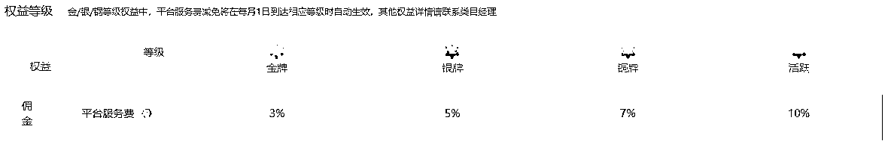

如果是低价引流课不要太在意分成收入，尽可能上线越多平台越好。

另外，不要忽视技术垂直领域的课程平台，它们往往会有更多的精准流量，可以先尝试上架一两门低价课程看看数据，可能会有意想不到的收获。但也要小心黑心平台不尊重版权、随意免费送课、不结款等行为。

课程平台对比表：

 

 

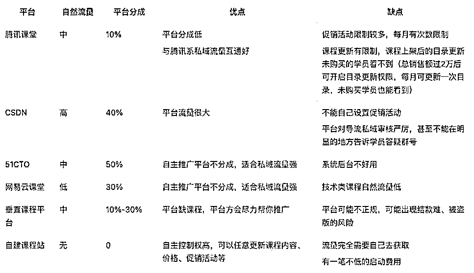

二、制作封面、详情页

封面、详情页建议用图片展示。使用创客贴、稿定设计等在线设计工具制作，有课程详情页模板。封面和详情页是非常重要的一个环节，是给学员的第一印象，一定要好好设计。

好好设计并不是说要做得花里胡哨，而是让用户清晰地、一眼就能找到他想要的答案。

好的详情页应该包含以下内容：

课程解决的是什么问题

学完以后会怎样？

都学习哪些内容？

为什么要跟你学？

秀肌肉（讲师个人实力）

秀案例（学员评价等）

 

 

学习中遇到问题怎么办？（给一些服务保障，比如答疑、助教助学等）

限时促销优惠？能提升转化率。

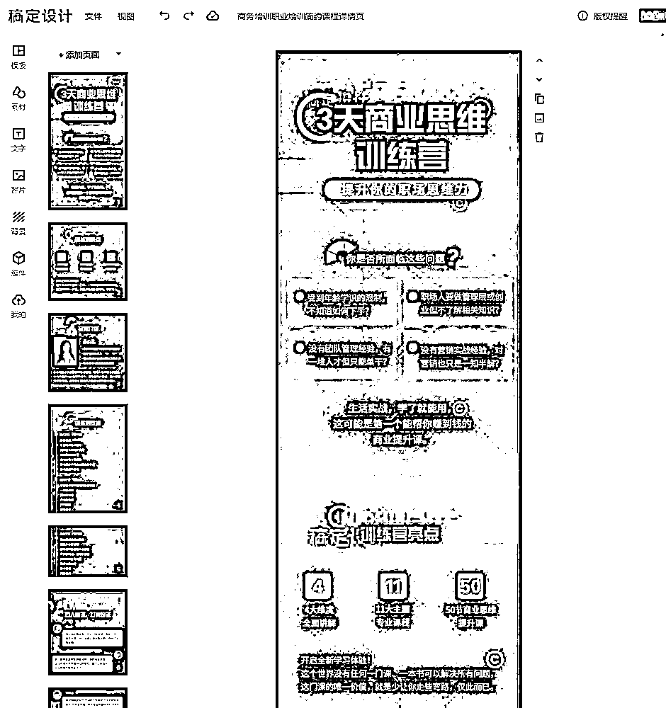

三、卖出第一份课

这时候我们的产品已经准备就绪了，进入到销售环节。

 

 

课程上线后第一时间应该告诉种子用户群，之前付了定金的用户就可以用优惠价购买课程。这时候应该就能卖出第一份课程了。

除了种子用户群，最早期的种子流量也可以来自你的朋友圈、QQ 群以及博客。

课程上线了记得发朋友圈，技术类 QQ 群一般不排斥干货分享，把你的博客文章分享过去，文章最后加个钩子引流到课程。对于客单价比较高的课程，博客最后的钩子可以引流到你的个人 QQ 或者微信，如果能够追单可以大幅提高下单率。

**—Part 4—**

如何扩大录播课的收入？

利用二八原理，20% 的课程贡献了 80% 的收入。那应该如何去提高收入呢？

我们从一个通用的销售公式入手：销售额** = **流量** X **转化率** X **客单价** X **复购率。

要想提升销售额，可以从以下几个方面入手：

**1**）想办法增加流量。免费流量渠道有内容引流、用户运营、裂变、发展推广员等。付费流量渠道有广告投放、找同类号主付费推广等。

**2**）增加转化率。优化课程封面、介绍、试听课等，让学员容易感知课程的价值。增加  1 对 1 的私聊追单。

 

 

**3**）提高客单价。提高单个课程的价格，但是也要考虑课程提供的价值以及用户的付费意愿。

**4**）提高复购率。对于录播课，单门课程的复购率几乎等于零。因为学员一旦学会，他就不会再去购买一次这个课程甚至同类课程。单门课程没有复购，但是可以扩充课程产品线，让学员可以有机会再去买其它课程。还有一个方式是做年付费的课程或者社群。

下面我们进一步分析说明：

一、提升流量

当时为了扩大录播课的整体收入，先尝试了从流量入手。因为当时课程卖出去是完全靠课程平台的自然流量，自己并没有去做运营和推广工作。

于是，我就去把几年前注册的微信公众号又启用了。每天去发一些原创技术文章。由于我做的这个技术教程的领域相对比较狭窄，每天大概只能涨几个粉丝。心想这样也不行啊，每天几个粉丝，一年撑死也就 3000 粉丝，考虑到转化率可能也只能把销售额每月提高几千。

于是开始去公域寻找流量，首先是把写的技术文章在各个公域平台发，主要是 CSDN、简书、知乎以及垂直的技术论坛，然后在文末留钩子，在公众号回复「xxx」就能领取资料，引到公众号里。

每个平台的审核力度也不一样，比如 CSDN 可以比较明目张胆地放一些钩子，但知乎就不太行，差点把号搞没了。后来经过实验发现知乎写「本文首发于 XXX 公众号」问题不大，但是引流力度也差了很多。

 

 

当时百度贴吧也是我一直想攻下的一个公域流量池，但是百度贴吧非常严，除了系统审核还有吧主，有时候发干货内容都会被莫名其妙删帖，更别说引流了。

有一天，还是和往常一样，在贴吧费了九牛二虎之力发了一个帖子，发完以后顺便逛逛贴吧，就发现贴吧上有一篇帖子特别火《收徒弟，想学游戏开发的进》，帖子内容是：

加群 XXXXX，并在帖子下面留下 ID，群验证填写贴吧 ID。

这个帖子几天就有几百的回复，每天都有好多新人留 ID，每次有人回复会把帖子自动顶到贴吧首页。我想了想，也可以这么搞啊，于是仿效写了一个同样的帖子，发现贴吧的流量是真的厉害，而且都是初学者，对于我来说流量十分精准。仅仅用了 10 天就加满了一个 2000 人 QQ 群。但是后来吧主发现这都是引流套路，此类帖子都被删除了。不过我已经累积了大量的种子用户。

模仿是最好的老师，一定要注意观察学习那些做得好的案例，动手尝试。

关于引流，我总结了一些尝试过的方法。

第一种：免费流量。

免费流量的核心打法是：干货 + 钩子，但是需要注意每个平台对钩子的打击力度不同，而且经常会调整，需要自己不断地试探总结。

免费流量引流的办法有：

 

 

1）把之前准备的干货文章在各个技术博客上发布。知乎、CSDN、简书流量都是很高的平台，尤其要重视知乎。垂直社群虽然流量不高，但是用户精准。百度贴吧有很多小白用户。

知乎可以容忍类似本文首发于 XXX 公众号的钩子，QQ 群号也可以尝试CSDN 可以容忍在 XXX 公众号回复关键词获取本文相关资料

简书审核不太规律，有时可以容忍在 XXX 公众号回复关键词获取本文相关资料垂直社群一般对钩子打击力度不大，  但也看具体社群的运营者

百度贴吧对引流打击力度非常大，只能小心地引流到 QQ 群

2）把之前准备的试听课（干货部分）在各个视频网站上发布，视频中和视频详情介绍中留钩子。

3）精彩课程片段在短视频网站发布，个人介绍中留钩子。

4）在一些微信群/QQ 群分享你的干货技术文章（末尾带钩子），直接发广告分享课程很大可能会被踢。

第二种：付费流量。

1）和一些群主合作，在他们群里发广告，可以给他们开通分销权限，让他们帮你发。同样适用于公众号主。

2）投放广告。这个话题比较大，大鹰也不特别擅长，可以单独去学习付费投放。

二、提升转化率

 

 

课程底价秒杀，从 699 开始，每 10 人涨 100 元。

前 2 位购买的同学，拼手气 200 红包；第 3-5 位购买的同学，拼手气 200 红包；6-9 位购买的同学，拼手气 200 红包。以此类推。

流量的问题解决了一部分，然后尝试去提升转化率。当时花了很多时间去优化课程封面、介绍等内容，但是收效不大。到 618 的时候，就想着促销一波，设计了一个活动。

活动的大概规则是这样的：

当时怕有的同学看不懂规则，留了个微信作为客服。没想到不是活动规则吸引了用户提高了销量，而是加了微信的同学，因为我 1 对 1 私聊的追单，转化率超过了 70%。

由于微信好友可以通过朋友圈、私聊等多次触达，大幅提高了转化率，这也是为什么现在私域流量这么火的一个原因。对于高价课程，一定要重视追单。

关于促销活动的原则，总结如下：

不能让已经购买的用户觉得自己有损失（或较大损失）

即使降价也需要付出一些努力（时间成本）才能获得的较好

制造紧迫感，促进购买

技术类课程由于面向人群比较窄，有一些促销活动实际上不适用，比如砍价、关注、助力等吸引的都是非精准粉丝。

比较适合的活动包括：

 

 

拼团

涨价秒杀（比如从一个较低的价格开始，每秒杀一个涨 100）

推广分销（注意是推广员和新客户同时获得优惠，这样减少推广员赚朋友钱的负罪感）课程包（多个课程打包，优惠价）

抽奖（可以是付费后抽奖）

三、提升客单价

然后我开始着手解决客单价的问题。到这个时候我已经意识到，垂直类目里的目标用户群体数量很小，如果想把录播课单独作为一个创业项目，收入要达到一定规模，必须得提高客单价才行。

提高客单价当然不是简单涨价，因为在课程自身价值不提高的情况下，涨价会影响转化率，收入总量不会变化太大，甚至会降低。

要想提高客单价，首先要修改课程的定位以及用户的心理预期，其次是增加课程内容。

如果课程只是教会用户学会一项技能、学会开发一个小案例，这些只是在一定程度上提高了学员的竞争力，但是并没有切实的解决用户的本质需求：学生的课程设计、毕业生找工作、跳槽找工作。

例如一个 99 元的实战项目小课，如果你将课程目标从讲好一个实战项目变成通过实战课程帮助学生顺利完成毕业设计，定价可以提高到 999。

如果能帮助学员找到工作，那学费收几个月的工资，也是用户想要的一个双赢的结果。

 

 

四、提高复购率

在学习如何提高复购率的时候，发现了我之前课程产品设计里面很大的坑，就是之前仿照友商推出了终身包更新产品。终身本身就是一个伪命题，在课程产品设计时一定要注意：你不可能终身交付。而且提出终身更新这种产品就注定与复购无缘了。

所以，要想提高复购率，首先需要确保你的课程付费模式可以复购。有两种比较好的产品设计是：

课程内容可以不限时回看（仅限这个课程版本，不包括后续更新），服务期限** 3 **个月（服务期限一定要有时间限制，比如答疑、督学等，到期后解散服务群，

可以将学员拉入交流社群），可以付费延长服务期限。

年费会员制：**1 **年期内可以查看所有课程内容，服务期（答疑等）也是** 1 **年。

用户在你这买过一门课，后来又买了另外一门课，也是一种复购。所以扩充课程产品线，覆盖从入门、进阶、高级，再到社群圈子。

其次，提升复购率的最好办法就是通过优质的内容和服务让学员成为你的粉丝。一旦你在学员那里建立了信任感，学员会优先在你这里买他需要的课程，你的新课他们也会额外关注。

**—Part 5—**

如何做好录播课的服务？

 

 

现在已经有学员购买课程了，录播课并不是将课程卖出去就结束了，这只是交付的开始。还记得最上面我们提到的录播课的核心么？

你的课一定是要让学员解决遇到的困难、更好地完成工作、找到更好的工作、挣更多的钱，然后你从他们挣到的钱中分走一部分，你的课才能做得更好。

让买课的同学高效学会你讲授的知识技能，更进一步的是帮他们解决问题、找到工作、升职加薪。

学员在学习过程中一定会遇到非常多的问题，做好课程服务对于交付至关重要。

一、答疑

技术类课程答疑是一个非常重要的环节，学员遇到的问题千奇百怪，处理不好答疑环节会导致很多差评。

技术类课程一般学员不会主动给好评，需要通过答疑和用户拉近距离，然后引导用户对课程好评。

答疑渠道目前看来较好的是 QQ 群，一方面不需要维护二维码，另外不需要专门负责人去拉群。但是个人微信是最好的私域渠道，最好是个人微信也加一下，但是切记不要在个人微信上答疑，只是将个人微信的朋友圈作为一个曝光渠道。

学员群最好分开交流群和答疑群，交流群供学员日常交流，答疑群专门回答问题禁止闲聊。

 

 

如何减轻答疑环节的负担呢？

一定要汇总学员问过的问题到一个文档中，将这个文档作为课件提供给学员。

如果问同一个问题的同学很多，那就要考虑是不是课程视频中有问题，可以在

课件中增加更明确的解释引导，或者重录视频进行更新。

在学员群中招募助教回答问题（金钱报酬最直接，但是也可以用更有价值的回

报给助教，比如就业推荐、核心群、课程优惠等等）。

二、课程更新升级

技术类课程有一个很大的问题就是随着技术更迭，课程有一定的生命周期。短则几个月，最长一般也不会超过 3 年，除非是底层的课程比如数据结构、算法之类的。

如果课程持续销量很好，内容有些过时，建议可以重新录制一遍。

如果课程销量不好，那就放弃这个课程，去寻找更好的选题吧。

**—Part 6—**

新手避坑清单

 

 

**1. **早期不要自建课程站

我在很早就买了一个小鹅通店铺，虽然平台分走的钱少了（小鹅通服务费一年固定 2W ），但是为获取流量付出了巨大的成本，每一个流量都需要自己努力去获取。

另外，技术类课程大家都更愿意在 PC 端学习，如果想要小鹅通 PC 端得买旗舰版（一年  2W ，而且体验还不好），总的算下来没有全部放到腾讯课堂上划算。

**2. **尽量不要做价格太低的课，引流课除外

有一句话说的很好：同样的产品，不论价格怎样，客户想要的服务都是相同的。所以价格一定要瞄准那些真正想学的。价格也是一种筛选。

**3. **不要基于最新技术录课

一方面课程寿命可能很短，另一方面答疑工作量可能会很大。最新技术的视频教程只适合做一个免费的入门介绍，放到视频站（如 B 站）引流，然后将人流引入公众号或者群内，不适合做成课。

**4. **不要盲目追技术热点

技术更新迭代比较快，一门课上架以后大多数寿命在 6 个月至数年不等，并不是一劳永逸的被动收入，而追热点可能会导致课程寿命更短。延长课程寿命的办法是尽可能找到经久不衰的主题。如果课程刚好能蹭上话题热点，不要吝啬。

**5. **个人讲师不要做太多课程

 

 

课程维护和答疑压力会非常大，非常消耗精力。

**6. **防盗版设计

录播课的盗版问题目前通过法律手段解决很费劲，最好的防盗版是防患于未然。

盗版通常只能拿到课程的视频、课件等内容，但是没有办法获得课程的配套服务。所以防盗版要在课程设计之初让盗版者无法顺利完成整个课程的学习，同时要让课程的核心变成服务，视频只是知识服务的一部分，甚至一小部分。

防盗版手段主要有：

加入答疑群需要订单验证（最关键）

加入学员群需要订单验证

课件或资料只能通过私聊或者答疑群获取

直播互动课在答疑群中进行

课程提供增值服务（分销赚钱、内推、抽奖、共学活动等）

有时候，在课程中使用这些小手段，说不定会让盗版者变成你的推广者，就好比买了生财有术的精华帖也没用，发现有价值的人最后还是会加入生财有术社群。

**—**结语**—**

 

 

以上，就是目前整个录播课的攻略。特别感谢生财有术提供的丰富资源，其中技术大牛  @梁勇老师 @二两老师 @Sitin @涛哥老师都给了我很多的启发和帮助。而对于技术人员都不擅长的流量能力，生财的精华帖、大航海和小航海都能给你很多帮助，一定不要错过。

最后，本文中难免有纰漏，如果你也对录播课感兴趣，欢迎找我聊一聊。

P.S. 如果你也想在生财有术专栏分享你的经验和认知，请点击链接

http://form.shengcaiyoushu.com/f/HA1G1g  填写表单，我们会陆续邀请有赚钱相关经验和案例的嘉宾做分享。如已填写表单请忽略。

评论区：

鱼丸|亦仁助理 : 感谢  老师的分享，大家如果有什么问题。可以在评论区留言~ 看好你 : 干货满满 get 感谢突围老师分享

突围一只鹰（旧号） : 参考文中的选题部分，使用数据驱动选题法选几个适合你的录播课题目

发出来让大家给你提提意见呀~

老黄牛 : 干货[强]

苟有恒 : 大鹰太厉害了，这真的是干货杠杠滴[强][强][强]

浮生一梦半日凉 : 干货满满！！超级感谢老师那么细致的讲解。

蠢小二 : 突突突，满满的干货，thanks

向上的塔皮 : 真的是干货满满！！！疫情结束，我得打印出来，随时拿出来看看！！

# **# ****(**精华帖**)(143**赞**)**如何从** 0-1 **运营** B **站大师课

# 翻译账号

 

 

作者：  内森Nathan

日期：2022-09-07

你可能刷到过这些发布在B站上的国外大师课程，比如NBA巨星史蒂芬.库里教篮球的大师课，FBI首席谈判专家Chris Voss 教谈判的大师课，时尚女魔头安娜.温图尔教创造力与领导力的大师课......

如何获取到最新的国外大师课程，及时翻译分享出来呢？今天我来分享如何从0-1运营搭建字幕组团队和B站账号，并且实现商业化变现的经验。

大家好，我是内森。很高兴在今年加入生财，在社群内一直潜水了4个月，之前主要在B站做翻译大师课和付费社群的项目。

正文分为四个部分来讲述：如何管理字幕组的志愿者，B站的生态和入局建议，怎么做B站公域引流到私域以及未来的发展方向，希望对大家有所启发。

先简单做一个自我介绍，我16年本科毕业，工作了2年多后，在澳洲读了一个研究生，2020年毕业后加入了深圳的互联网公司，做产品运营工作。

平时业余爱好是读书，学课和冥想。我自己对于跨界学习和内在成长的内容非常感兴趣。在国外留学的时候，了解到了大师课Masterclass这个网站，购买了他们的会员，学习了相当多的课程，大有收获。

 

 

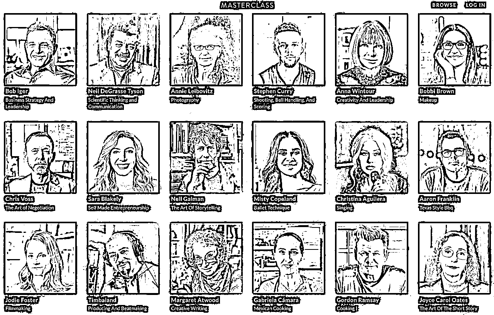

2020年疫情，我被困在家，无法前往澳洲上学。我自己开始在B站做自己的日常分享，就有了下面的账号【内森の日常】。我在里面会分享读书学习，正念冥想，英语演讲等内容，也会搬运一些外网的课程资源，逐渐开始形成了第一波粉丝群体，吸引了同频的小伙伴关注。

不久之后，我偶尔在万能的TB看到了大师课盗版资源，我购买之后发现里面有比较全的视频文件和字幕文件。我看了安娜.温图尔的大师课，觉得对我启发特别大，我就在上学的间隙，把这个课程完整地翻译了下来。

时尚女魔头-安娜.温图尔  教创造力与领导力大师课（中英字幕）：

https://www.bilibili.com/video/BV1EZ4y1j7qx  我把自己翻译好的大师课放到频道里，获得了很多小伙伴的支持和鼓励。就这样，内森の日常走上了另外一条道路，也就是大家看到的以全球优质课程翻译为主，内森的原创分享为辅的综合性知识学习平台。

 

 

在往后的2年，总共有超过50人的志愿者曾经加入过字幕组，帮助我翻译大师课。我们累计翻译了400+小时，共计110套大师课，是全世界大师课最全的中文翻译组。

同时，我也招募了运营的小伙伴，组建了一个20人的团队，正在通过个人IP和付费共学社群来进行下一步商业化。

我是在2021年7月决定开始商业化，至今变现14万，但是为了字幕组奖励和必要的运营开支，共计花了10万，盈利4万。

因为我本职在互联网大厂搬砖，推进副业的速度还是比较慢的，希望我的分享可以给大家启发，未来愿意与有共同愿景小伙伴共创有价值的项目。

 

 

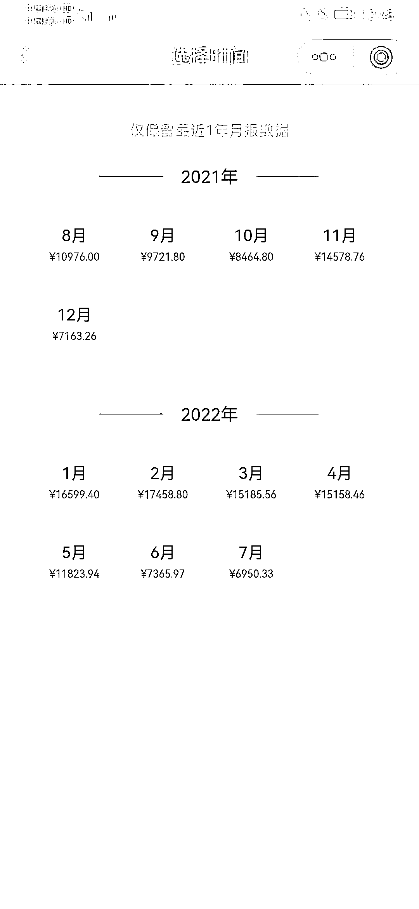

 

 

一、如何运营好一个字幕组

**1.1 **招募流程

字幕组是什么？他们是一群把外语影片进行翻译后，通过特定软件压制至影片的爱好者团体。本身字幕组就是对于某些作品有喜爱，并且主动分享的一群人。

加入我字幕组的同学，大都是很优秀的同学。我并没有刻意去招募，而是把招募信息放在了我翻译的大师课里，陆续有许多优秀的同学申请加入。

 

 

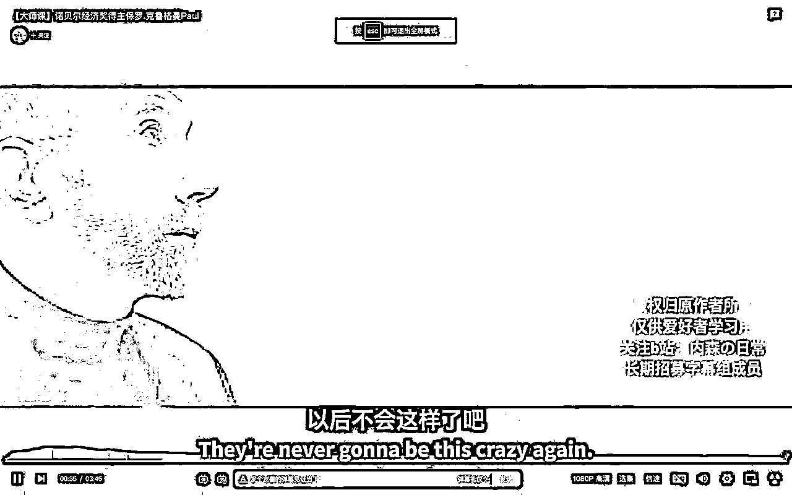

进组流程如下：

1）领取试译任务

2）了解字幕组格式

3）下载并学习字幕组工具

4）完成试译并提交SRT格式文件

5）等待试译反馈和审核通过

6）正式加入字幕组

这是我们的字幕组问卷：

https://wj.qq.com/s2/6375668/c5cd/

这是字幕组试译指导文档：

 

 

https://knowlink.feishu.cn/docx/doxcn9TmNDBJgpiYmASwqyzkAfh  **1.2 **翻译流程

我们翻译的是大师课，里面都是配有原装英文字幕，这样加快了我们的翻译流程。

第一步，机翻中文字幕。

前往  https://jianwai.youdao.com  上传英文字幕，使用机器AI翻译，导出中英字幕。

第二步，使用软件进行人工精修校对。

Mac可以使用Subtitle Studio，Windows 可以使用人人译世界。按照字幕组的规范，进行标点符号去除和人工校对。

更多翻译的详情，可以参考当前我的字幕组的指南了解格式

https://knowlink.feishu.cn/docx/doxcn9TmNDBJgpiYmASwqyzkAfh  第三步，视频压制。

根据我们的需求，需要压制水印和字幕两个东西。

 

 

前期我们会使用submerger 来进行压制，所有压制都是我一个人完成。压制时间较长，一般需要通宵完成，所以我会把电脑挂着。

后面团队成员有程序员背景，帮助我们开发了一套完整的压制流程，可以批量进行生产和压制。

完成以上三步，就可以生产出一套大师课了。在人员安排上，需要有翻译和校对两个不同的角色。一人翻译一人校对是基本配置，保证产出的内容用户能轻松理解，并且没有硬核知识的错误。

我个人的翻译的速度，每1小时的课程，大概需要4-5小时全程高度集中的工作时间来完成。

校对的速度来说，1小时课程，需要1.5-3小时校对，取决于翻译的质量和对课程内容的熟悉程度。

所以，一个2小时的大师课，总计需要至少8小时的高强度投入的翻译时间，配搭3小时的校对时间才可完成。

如此浩瀚的工作量对个人的主观能动性要求非常高，有很多次我都一度想要放弃。如何调动字幕组成员的积极性是一个重大课题，下面就讲讲志愿者团队管理。

**1.3 **团队管理

在字幕组团队管理中，我融入了许多领导力的方法论，科学地在没有太多酬劳，主要靠热爱和愿景，驱动一支50人的志愿者团队工作。

 

 

在我刚做字幕组的时候，我会极力筛选价值观同频的小伙伴加入，并且让他们互相链接。

字幕组并不是一个只是工作的地方，而是有一个共同的话题--大师课，赋能人的链接和成长的社群。通过有效地调动每个人的“认知盈余”，激发创造力和潜力，最终完成我们共同的目标。

认知盈余的概念是克莱.舍基在他的书《认知盈余》里面提出的，我们可以将其理解为人们在时间、智慧、创造力和慷慨之心等方面的盈余集合体，经由技术手段聚集，提升效率，从而实现创造和分享。

此概念盛行于2019年，是马化腾为此书做序，也是许多当前盛行的互联网大平台的理论基础。

 

 

基于上面的理论，我一直深信：优质的年轻人是有能力通过业余时间，用本身刷短视频，玩游戏的时间，共创出好的且有价值的内容产品。

所以我基于这个理论，把共创的概念融入到了我的愿景当中，提出了“跨界学习启发中国年轻人成长”的愿景，价值观是：真诚助人，合作共创。把字幕组以一个社群的运作方式去运营，开始逐渐衍生出了后面的服务产品。

 

 

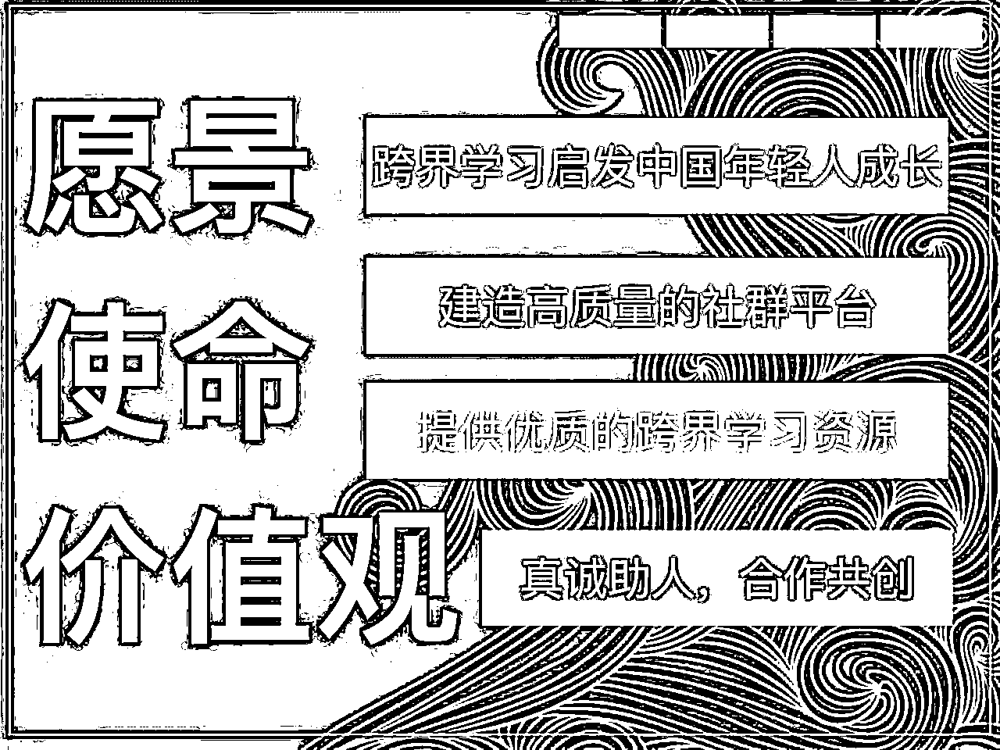

我不断地用愿景和价值观去筛选合适的字幕组成员，他们是一群不会被简单的功利性目标所吸引，并且有非常强烈的助人利他之心。

当我非常清晰地知道我的愿景和价值观时，频道的力量就散发出来了。许多用户在看到我们做的大师课翻译后，看到的不止是一个搬运内容的频道，更是一个有愿景目标的大平台。他们愿意加入进来并贡献自己的力量。

有了愿景和价值观，是远远不够的。基于科学的管理方法，定期的聚合大家，显得非常有必要，可以增加团队成员的亲密度和链接，帮助团队整体往一个方向去使劲。

因为大师课的翻译是属于各自翻译自己的课程，所以对于线上远程协作团队来说，有好有坏。

 

 

好处是：各自可以独立完成任务，无上下游牵连。

坏处是：一旦个人的拖延或者是生活出现变化，对于这个任务的推进力度就会降低。

我从成立字幕组开始就不是以老板自居，我是作为一个引领者来和大家共创。只是我走的更前，有责任引领大家更好地完成任务。

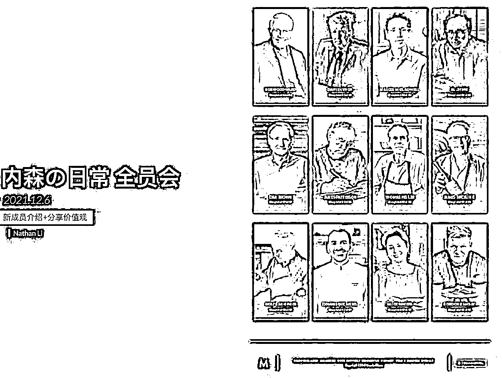

所以我设置了周会的制度，每个周末定期开例会，帮助大家梳理翻译的难题和讨论翻译成长收获。

我极度关注每个字幕组成员的成长，关心他们的个人生活变化，并且与大家交流和分享在大师课所学收获。

 

 

我把字幕组的例会做成了成长的复盘会，让大家在翻译中学习和成长，并且可以互相链接，认识新的朋友。

每个字幕组成员的背景都非常迥异，有海外留学的，有在大学读工科但是喜欢英语文学的，有自由职业者和高中生等等。

把链接搭建起来，字幕组就会成为一个小社区，而我需要的只是设置好这个社区的活动规则，让大家可以在这里培育自己的一颗成长小树。

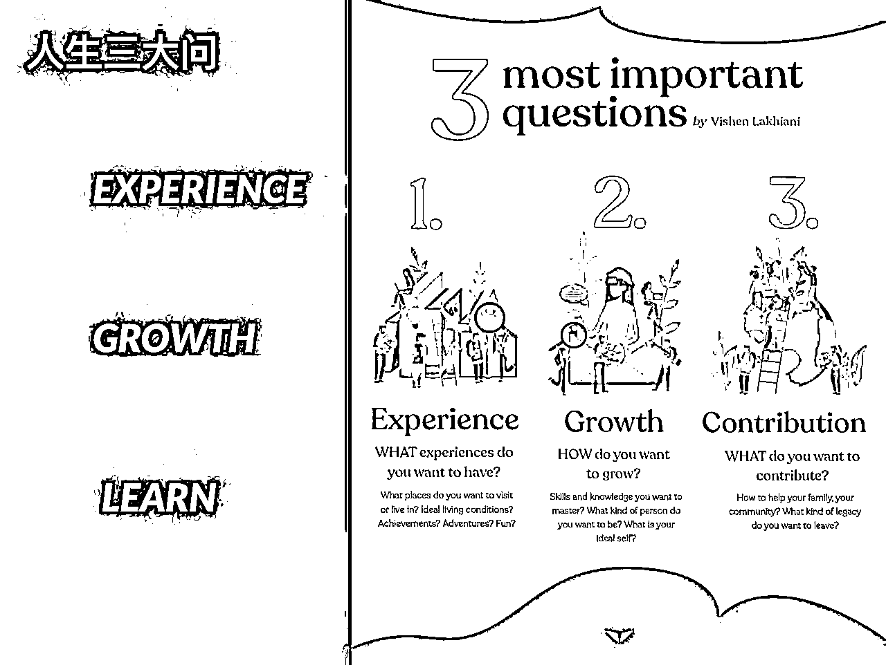

有了例会，还要有阶段性目标。在前期，管理人员只有10个人的时候，我可以每个人都照顾到进度。

 

 

但到了后期，人员越来越多，翻译的项目线也会变得复杂多变，我开始尝试用表格和工具去记录进度。

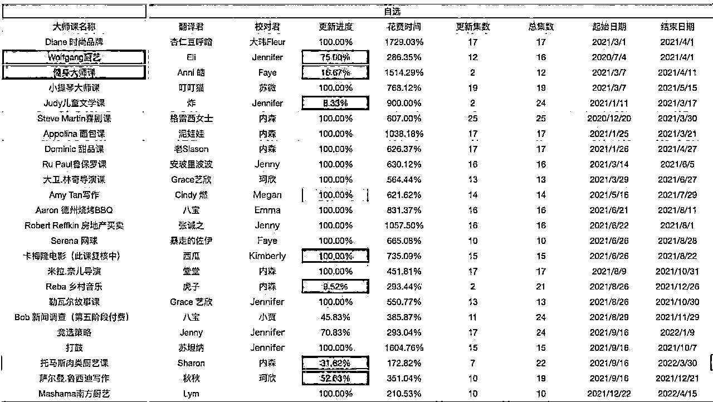

但在我管理当中，发现一个重要的点，就是阶段性目标。我会把翻译的课程设置成第X阶段，精选其中的部分课程，并且鼓励大家从这些课程中进行翻译，设置一个合理的翻译校对时间，让团队成员两两搭配，鼓励互相帮助和反馈，让各做各的翻译项目模式变成团队阶段性冲刺模式。

有了阶段性目标之后，很多翻译的速度也得到了提升。每个加入阶段翻译的同学，在可预期的2-3个月内，都会全力投入，不管是因为团队归属感还是目标使命感，都增加了团队成员的凝聚力。

我们也通过这个阶段性目标的管理方式，逐渐发展出了一套新的游戏规则，让字幕组成为一个有趣好玩的生态，使加入里面的成员都可以找到自己的成长之路。

 

 

**1.4 **设计好的游戏规则

在字幕组的运转后期，我们也有了一些盈利的方式，包含对接一下翻译项目以及VIP付费社群。社群的内容会在下面展开说，这里我们聊一下如何增加志愿者管理的奖励系统。

每个人都会在完成任务-获得奖励-有所成长-持续挑战-完成更高任务-获得更高奖励，的一个闭环中，不断地成长并且留下来玩。

所以，我开始把字幕组分成了自选组和付费组两个模式，付费组可以在翻译完成之后，获得一定的奖金，并且会对翻译的时效性和准确性有了更高的要求。

我在每个季度的复盘会上，也会专门做有仪式感的事情，来表彰获得奖励的字幕组成员，让他们可以知道自己在字幕组的贡献，并且起到模范的作用。

 

 

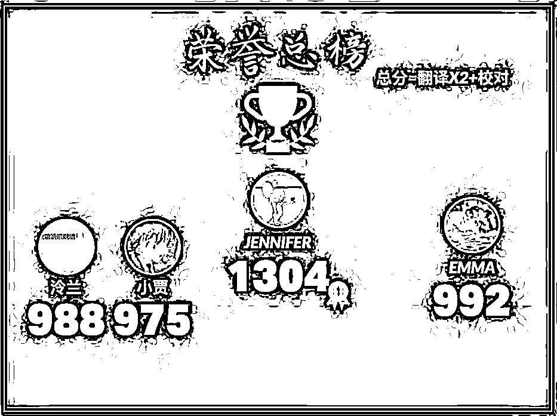

一套好的游戏规则，可以让整个组织按照规则的制度去驱动，更好地完成组织目标。通过合理的奖励，鼓励成员不断提升自我，挑战更加难的任务。

每一次我都会把奖励以学习金的形式进行发放，鼓励大家用这个奖励金去购买学习的内容，不断提升自我。我深知自己所能发放的现金奖励不会很高，对比一个正常的翻译项目来说，这是一个很低的价格。

但是如果从共创和共同成长的角度来看，字幕组成员可以在翻译过程中获得成长，得到他人的校对反馈，并且在锻炼英语和爱好学习当中，都能获得收获。这时候一个额外的现金奖励，不应该被仅仅看做是翻译的劳动费用，而是一个面向未来加速学习的好工具。

 

 

每个字幕组成员在这个模式下，都得到了不同的提升，也通过前面所说的例会制度，分享和交流自己的收获，让整个团队的凝聚力得到了大幅地改善，加强了组员之间的深度链接。

在与字幕组的深度链接和共创中，也孵化出了后面的一系列内容栏目和社群产品。这个是某一次会议当中的分享和总结，启发了我后面去做更大的社群服务。

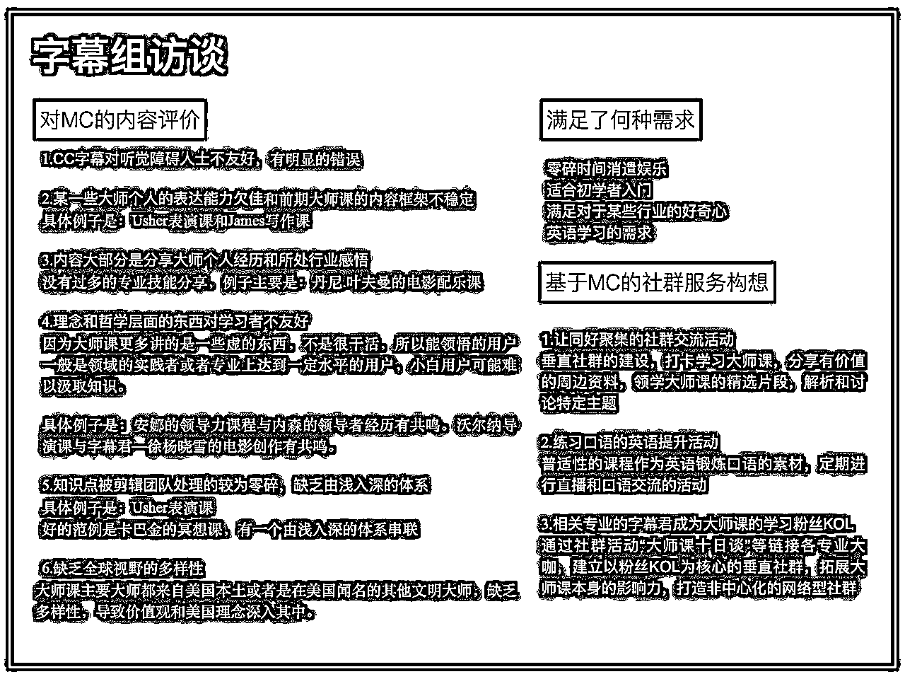

最后，我还增加了一个额外的内容栏目，就是大师课十日谈。这个栏目旨在邀请优秀的字幕组成员，可以分享自己的翻译收获，并且通过B站的大平台进行直播，吸引流量来到频道里。

这个活动持续了好几期，也同步邀请了频道粉丝里的KOL做分享，让这个大师课翻译的项目变成一个综合型的分享交流活动。

 

 

【大师课十日谈】关于家装设计师Kelly Wearstler的分享会 | 嘉宾：大玮Fleur：

https://www.bilibili.com/video/BV1pU4y1p7BQ?zw&vd_source=26bbd5c99a86d984e07264d4c57d74e5  二、**B**站生态和入局建议

**2.1 **一个年轻人的聚集地

这个部分，我希望和大家聊聊自己对B站的看法，这只是我的主观感受，并且多年来在B站知识区混迹，也是获得了一些体感，希望分享给大家，带来一些启发。

B站是一个年轻人聚集地，在这里可以看到新的Z时代，90和00后在这里玩梗和畅聊，在优秀的作品和Up主的引领下，形成一个弹幕的虚拟空间。

敢  杀  我  的  马？！：https://www.bilibili.com/video/BV1yt4y1Q7SS?zw  B站重要的不是UP主有多牛逼，曾经我记得有一个财经UP主，在B站分享自己月入千万，如何炒股成功等牛逼的案例，在B站并不欢迎这样的“狂人”。不管这个UP主他是不是真的月入千万，在B站这个社区里，平等和去魅是两个很重要的特质。

UP主并不是高高在上的人设，不用去搞特别高大上的标签，没有什么需要去包装，而只要做真实的自己，分享自己的思考和观点，做让用户可以基于你的内容表达观点的事情，这就足够了。

 

 

这怎么理解呢？其实B站的最特别功能就是弹幕和三连。弹幕是一群人在异步的时空里面进行交流，UP主的视频内容重要吗？重要，但是最重要的是提供了一个虚拟的抓手，让大家可以在上面玩梗和分享，这就是B站的特殊地方。

三连是对UP主最大的尊重，下次一定，白嫖等这些词都是在B站盛行。我一直把B站当做是一个自留地，并且是乌托邦一样的存在，每个用户在里面都保有最纯粹的好奇心，每个UP主在上面分享着自己的热爱，用爱发电，无私奉献，这样的社群氛围让B站的商业化一直都是慢人一步。

 

 

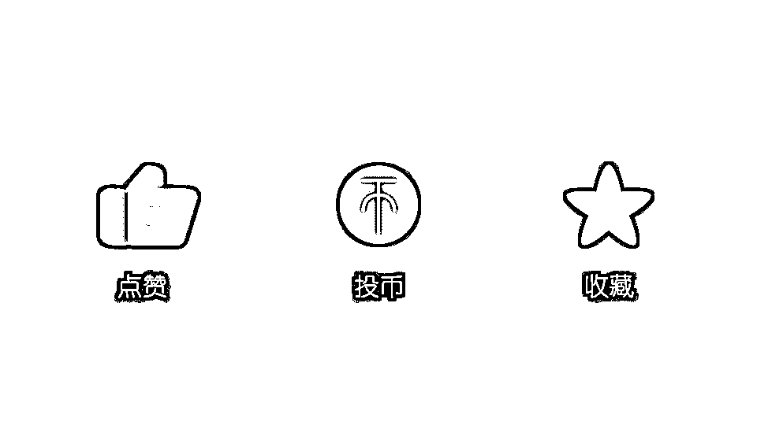

**2.2 **有料有长度的内容有人看

基于我做大师课分享的内容，我总结了几个在B站知识区做内容的思考，这里仅供参考。

在B站做视频内容，和其他视频平台包括（抖音，快手和小红书）不太一样的地方是：完播率可能并不是那么重要。在当前的B站的环境里，真的有非常多中长视频。据最新的报告显示，用户日均时长81分钟，这是一个相当可观的使用时长。

所以，把视频做长或者做成合集，在B站是一个常态。当我动不动把10个小时的大课，按照分P的形式，传到了B站上面时候，能看到有很多人会先点赞收藏，然后慢慢回来看完。如果这么长的视频，还需要追求完播率的话，那我的数据就真的不好看。

一个典型的例子就是可以看到我的最高观看数的课程里面，全部都是几个小时的大课，每一个都有几十万的播放量，最高有150W。

 

 

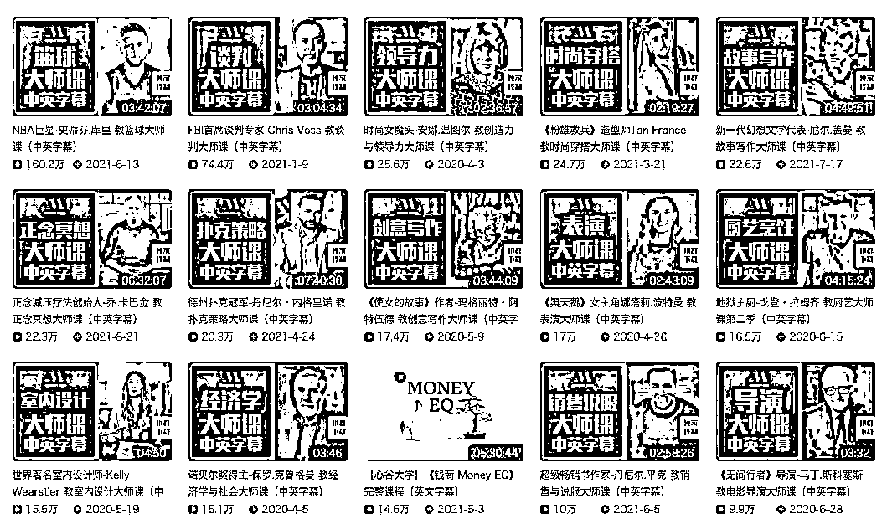

**2.3 **实用有干货的内容有人藏

如上图所示，我的频道内排名第二的大师课是FBI首席谈判专家Chris Voss的课，仅次于超级篮球明星--库里的课。这个课程的主讲人并不是什么大明星，甚至在他所在的领域当中，都是比较少众。但是这个课程干货十足，非常落地和实用，我翻译的时候获得很大的收获。

所有看过这个课程的同学，都会在弹幕中说：厉害，马上学会，是这么回事......我在这里想要表示的是，该课程是我发布的内容当中，极其有干货含量的课。

B站的用户对于学习和求知的渴望，远远大于你们的想象。不要通过一些不够实在的干货内容，做成好看的视频，就以为可以唬住用户。在B站，用户可以花很多心思去研究和分析你所分享的内容，甚至会出现在评论区总结里面的要点和学习笔记，成为“课代表”。

 

 

这些都让B站再次成为年轻人口中的一所大学，很多人把B站当做是学习平台来使用。请看2021百大UP主--取景框看世界做的视频，你就能看到知识区有多厉害。

我要在b站建所大学，送给每个大学迷茫的你！！！【框框的b站大学-导论】：

https://www.bilibili.com/video/BV1pv411T7rM  **2.4 **有话题和热门内容有人评

我在上面的部分聊到，B站的内容其实是一个载体，让用户可以在这上面自由的分享。当你的内容围绕着一个超级话题，或许是这个圈层里面很重要的人物或者是讨论点，大家都会用弹幕的形式，在你的内容上进行讨论。

所以，篮球大师课就很好体现了这一点。库里是一个篮球区的超级红人，看里面第一集的弹幕，你能看到有很多在上面表达对明星的追捧和玩梗的用户。用户会说：教练，我想学扣篮。本身这是库里篮球课里面没有的内容，或者说这是库里不擅长的内容，但用户通过幽默地表达他们的声音，让整个视频火了起来。

 

 

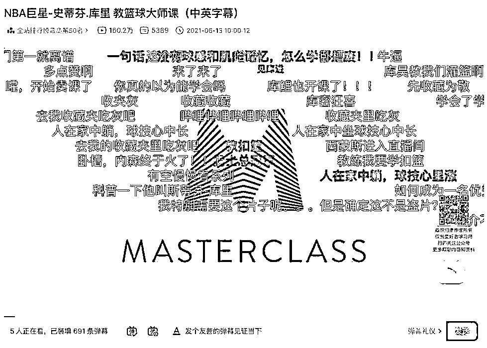

在这里，我们看到了一个虚拟的弹幕构造空间，通过弹幕评论，让这个视频在发布之后如此长的时间里，一直都会有长尾流量关注。B站有很强的推荐机制，一个视频紧接着会弹出其他视频推荐，这是其他平台没有的功能。

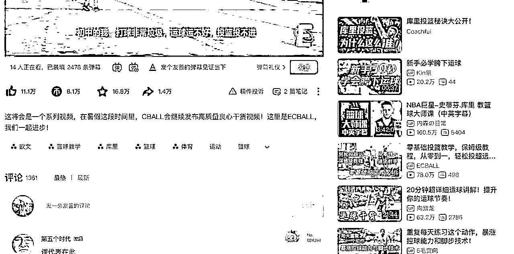

 

 

**2.5 **入局**B**站的建议

最后，对于入局B站，我有三个建议：

1.做真实的自己，与用户深度链接。不需要去建构假大空的人设，而是让自己的热爱去吸引同频的小伙伴。表达自己真实相信的观点，没有对与错，更多是自我的真实展现。

2.公域转私域做起来，让好的用户逐步沉淀在自己的私域当中，把B站作为商业化版中一个灯塔的存在，吸引同频热爱的小伙伴加入，散发出一个很强烈的信号。

3.理解B站的生态，去看更多的内容，感受里面的弹幕，评论和玩梗的氛围，融入每个圈层，不要太在意每个用户对你的差评，持续做自己爱做且擅长的内容，只有热爱和专注才能走得长远。

三、**B**站公域引流私域

**3.1 **公众号引流

B站在所有的视频平台内，对比小红书和抖音，是对引流私域最包容的一个。

所以，我在刚开始做大师课翻译的时候，就已经开始于翻译的水印当中，引流和沉淀流量到公众号里。

 

 

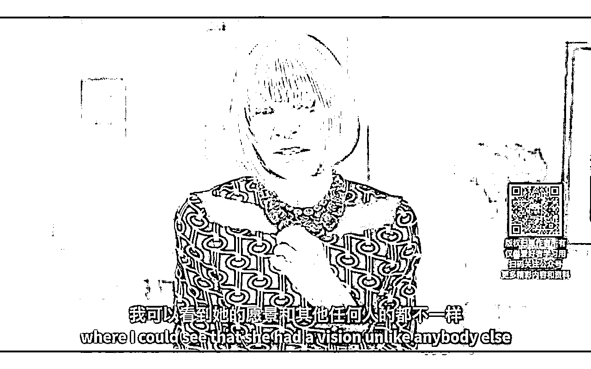

截止现在，我的公众号粉丝3.2万，对比B站的24万的流量来说，算是一个较高的比例。

首先，我把大师课配套的英文原版PDF，放到了公众号的后台回复当中，用户需要在看大师课的时候，希望获得原版配套的英文学习手册，需要到公众号里回复对应的数字编号，就可以弹出文档对应的下载链接。

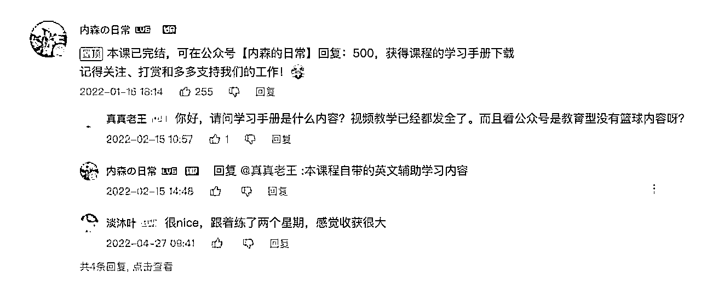

 

 

通过这样的一个钩子，让用户从观看视频，到关注公众号，获得配套手册，留存至公众号内做转化，一气呵成完成。

在我看来，公众号当前很难靠原创文字内容进行涨粉，我自认自己不是一个写作的好手，很难写出惊天地泣鬼神的十万＋爆款文章，但是我能通过从公域当中的视频流量，逐渐转化到公众号的私域流量。

在公众号里做不同用户圈层的划分，把他们分流至不同的免费社群，进行后端的转化。

**3.2 **免费社群分流

我在做公众号的初期，就建立了大师课粉丝群，希望吸引喜欢大师课的粉丝朋友加入并且会做一些投票的活动，票选下一部要翻译的内容。

大师课粉丝群现在已经有4个，但因为是免费社群，且每个用户进来的出发点都不一样，有些是因为篮球大师课来的，有些是因为谈判课，建筑课和写作课等等，用户的需求非常的多样化，导致社群一直没有一个很好的讨论氛围。

 

 

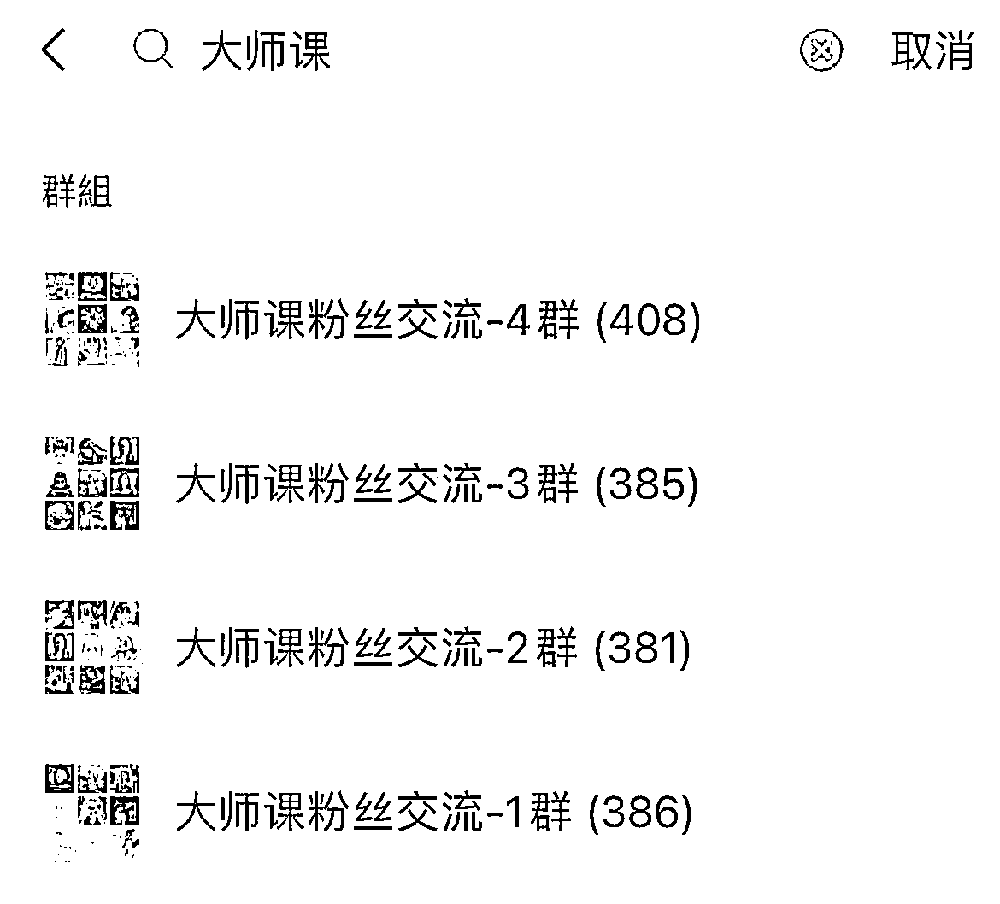

后来，我在大师课粉丝群的基础上，建立了读书俱乐部。当前的读书俱乐部是借助课程这样一个载体，横向扩展了读书这个品类。也开了3个读书俱乐部，积攒了不少人气。进群的时候只需要填写问卷，即可进群。

后期也做过裂变活动，希望把读书俱乐部的海报分享到朋友圈，集赞10个后即可进群。

通过这样的方式，前期也是积攒了不少的读书粉丝，也有出版社合作方找我合作，寄书做分享。

 

 

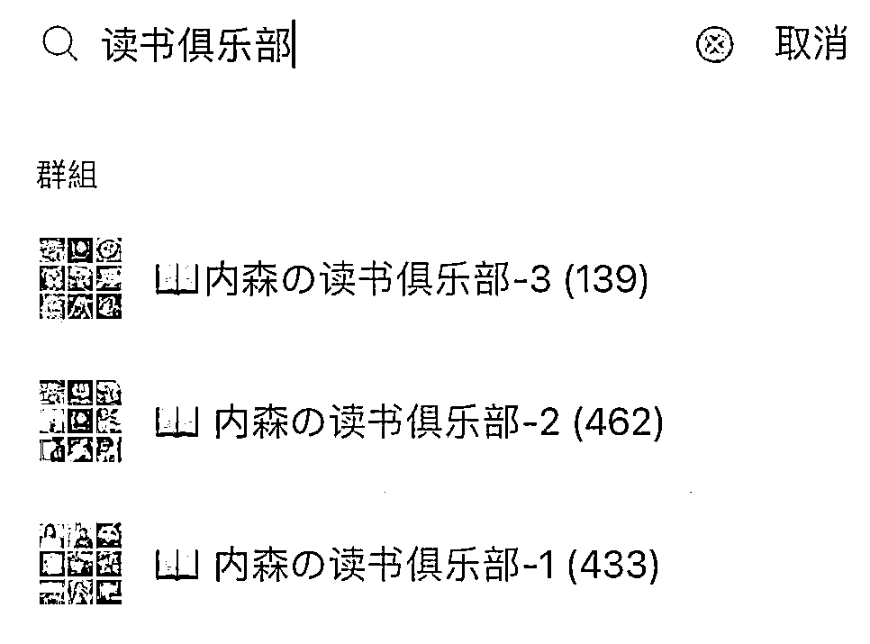

最后，在免费社群的分流当中，我也逐渐分拆出了英语群，一个专门做英语学习和打卡的免费社群。用户在里面需要用英语进行交流，并且分享学习英语的收获。之前有做过英语圆桌论坛小组，并且做了许多直播的内容，分享给喜欢英语的同学。大家可以边学大师课，边获得英语学习的启发。

 

 

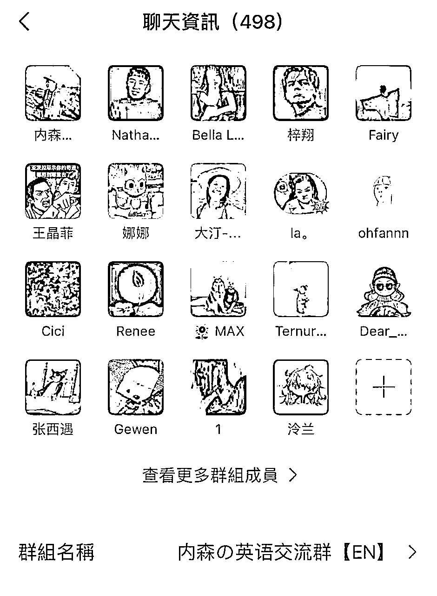

**3.3 VIP**付费社群

 

 

在2021年7月，为了更好地支持字幕组的运作，让整个字幕组可以自负盈亏的运转下去（之前一直是我贴钱在做），我决定开设VIP付费社群。

从第一个付费社群--商业群开始，我把大师课的内容分成了10个垂直类别，并且陆续把播放量不高，但内容质量很高且非常小众的课程，分别收录进付费社群。通过收取社群的进群费用，提供一个交流打卡的社区平台和完整的翻译内容，开始了新的商业化模式。

 

 

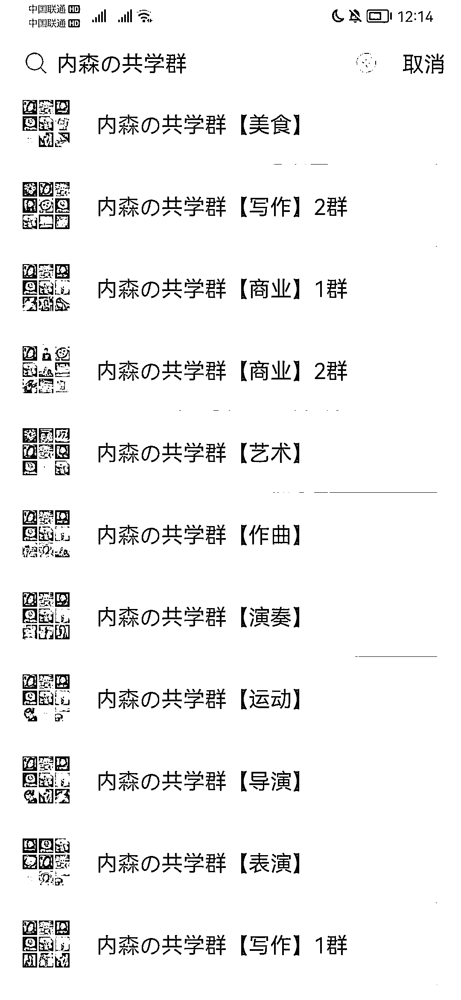

 

 

从整个转型的过程来看看，我在从免费到收费的转变时，遇到了掉粉和评论区的负面评价，压力还是比较大。虽然，当前大师课翻译有别的b站UP主在做，不管他们是用机翻还是人工翻译，内容的深度和广度都没有能完全超越我们的产出。所以，我还是有信心做成付费，仍然能获得用户的支持。

同时，开始进行一定的商业化是为了更好地可持续运转下去，让我这个副业可以扩大规模，提升产能，帮助更多年轻人成长。

客单价一开始我不敢收太高，并且觉得收费是一个很可耻的行为。本身搬运翻译盗版的大师课来盈利，让我一开始非常地不舒服。我在开始收费的时候，还是和字幕组同学做了深度的沟通，并且得到了他们的认可和支持。

同时，我也保证一定数量的大师课，会全部放在频道免费供观看，保证字幕组的成果得到充分地展示，而不是仅仅作为商业化的用途。

 

 

我的第一个共学群是商业，因为本身这个行为就是商业化行为，所以我把商业类型的大师课做了分类，开出了第一个共学群。后面也陆续开出了关于写作，运动，冥想，艺术，表演，导演等其余9个共学群，让用户开始分流。

在进群的定价和涨价策略上，我用了一个比较简单的模式，就是人越多，定价越高。

因为，我相信只要进来的人越多，产生地链接和丰富度将会逐渐变多，社群的价值也会越高。当然这个理论后面得到了证伪，一个社群不是人越多越好，而是链接越深越好。

我认为是有一个社群人员临界值，突破了那个临界值后，社群的活跃度将会平稳甚至下降。

第一个社群的单价是29元，每增加100人，涨价10元。为了让这个商业群的价值提升，我甚至去拉赞助，希望获得更多有价值的资源来扩充商业群的内在价值。

从商业群开始，我每个月都会策划新的共学群，并且搭建好的社群所需要的打卡体系和内容规则，在这个过程中，我也学到了不少社群管理的知识，让一个付费社群运营逐渐形成。

最终我在一年内，通过做垂直付费社群，共获取到了优质的付费用户私域流量3200多人，并且总共变现14万。

四、对未来的一些思考

最后，感谢你看到这里，希望上面写的对你有所启发。

 

 

我分享一下自己对于未来的一些思考。从翻译大师课开始，我积累了第一波粉丝并且做了私域的沉淀，也有了一班志同道合的小伙伴。

**4.1 **专注内在成长的个人**IP**

建构于这个基础之上，我开始向内探索，我真正擅长并且热爱的事情是什么？不是翻译课程，也不是做字幕组，而是我的愿景所说：跨界学习启发中国年轻人的内在成长。

很感谢生财有术，给我扩展了商业的认知，并且看到了更大的宏观格局，让我知道原来还有这么多种商业可能性。从生财链接到了花爷，加入了花爷的IP，从0到1开始做起个人IP，把自己的原创内容摆在了更高的位置。

我在做大师课翻译的同时，一直关注着另外一个课程平台--Mindvalley 心谷大学，这是一个将觉醒教育带给10亿人的全球化线上学习平台。我从2014年就开始学习Mindvalley的课程，并把不断获得内在成长。

未来我会基于自己的个人IP--内森师兄，来帮助中国年轻人尤其是职场人，探索职场自由和内在成长，并且转型知识服务赛道，帮助启发更多的青年人。

**4.2 **专注知识链接的社群品牌

而原本属于共学社群和大师课的内容，将会作为新的独立品牌出现，那个就是知链青年Knowlink，通过知识链接同好，跨界启发成长。

 

 

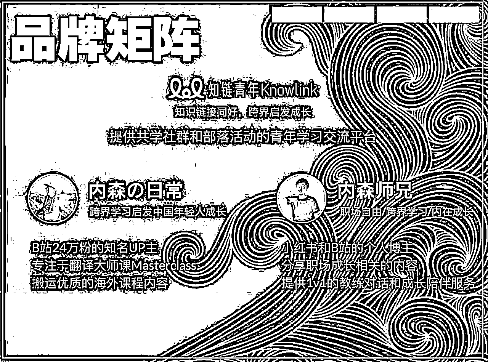

知链和内森的分工将会基于外在成长和内在成长，做双轮驱动的引擎，从外在获得技术和能力的提升，通过我们提供的社群产品服务，提升自己的影响力和利他力。在内森师兄这边，可以获得内在成长的方法论，提升自我认知以及快速成长的方法。

通过由内到外，再从外部反馈回到内部的闭环，提升每个人的自洽成长，让改变和个人成长得以发生。

两个方向也在做不同的生意，知链青年是流量型生意，扩展更大的流量，做出有价值的内容，在公域转私域的流程下，不断提升影响力。内森师兄做的是复购型生意，通过提供不同的训练营和1V1教练陪伴服务，帮助用户更好地梳理内在成长需求，成功改变和发掘自己的潜力。

 

 

在分享的最后，大师课的版权问题一直是悬在我头上的达摩克里斯之剑。就像新东方起步时候与GRE试题的版权纠纷，一直在让我不断思考如何更好的处理和Masterclass的关系。

未来，我希望不断地提升自己组织的能力，扩大本身品牌的影响力和个人能力，最终可以和Masterclass 达成对等合作模式，成为他们的官方的翻译和分销合作方，为优质的大师课进入中国市场做出自己的一份力量。

如果看到最后的你，不管是你做个人IP，做社群服务，知识付费还是教育创业，都欢迎和我进行交流。

如果这篇文章对你有所启发，欢迎评论留言，告诉我你的思考和见解。如有表达不清楚的地方，也可以提问，我将尽力去回复和改进。

让我们为中国新一代青年人的成长共同努力，用知识链接同好，跨界启发成长。

评论区：

平凡小吴 : B站关注＋1~

内森Nathan : 谢谢关注🤝

nn : 啊在b站关注的up主，也是星友啊！感谢分享[爱心]

小夏 : 之前在公众号看过内森哥哥的分享[呲牙]

小夏 : dj好听

fung : 花29进群后能有啥连接  ，如何更深地连接会员们

田新一 : 太厉害了，想请教下，收费社群都是提供的什么服务呀？我目前也有一个群体的爱好者，也有想过做社群，但是没有想明白能提供什么服务，所以想请教一下。

Bluear : 版权上没问题吗？

 

 

# 【公考课程】**2**篇

# **# ****(**精华帖**)(160**赞**)**公考通过内容差异化，在小

# 红书上变现** 30W+ **的经验分享

作者：  哆啦

日期：2023-02-16

一年1-2次的公考，以及数以万计的考生，都说明了公考项目是一个可持续做的知识付费赛道。

那怎么能在这个红海赛道里分一杯羹？我希望通过今天的分享，给大家提供一些思路。

大家都知道，知识付费变现有两种方式：

第一种方式是分销别人的产品，不过销售权、定价权、产品所有权都在对方，分销者很被动，获得的收益也有限；

第二种方式则是先通过学习、掌握并进行运用、验证、整理，总结出一定的经验，再传授给更多用户。虽然制作产品的时间比较长，但是适合长期做，自己可以掌握销售权和定价权，将收益最大化。

我做的就是第二种变现方式。

下面，我会完整拆解出我在公考红海赛道中通过差异化，在各大公考机构激烈厮杀中获取30W+收益的经历。

生财有术的圈友好，我是哆啦，3次考入不同体制内单位，副业在做「公考面试培训」知识付费，之前一直在知乎引流，从22年4月份开始转战小红书，在小红书累计变现了30W+。

 

 

本篇主要说说我是怎么通过小红书起号、引流、变现的，希望能为做知识付费，从0到1，从1到10的圈友提供一些思路和实操方法。

# 一、怎么在小红书做一个公考面试账号

我的知识付费方向是公考面试辅导和培训，如果大家做其他领域也没关系，变现、引流的底层逻辑和方法大体都是相通的。

我的小红书闭环思路：

变现（公考面试培训）

** ↓**

引流（有面试需求的粉丝）

** ↓**

差异化（不断优化笔记内容）

** ↓**

转化（话术建立信任并成交）

 

 

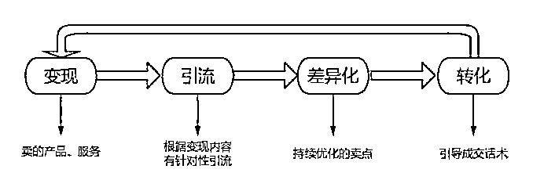

# **# ****1.**我为什么选择公考面试？

# （**1**）先说说什么是公考面试，方便大家了解

不管是公务员还是事业单位考试，基本分为两个部分：笔试和面试。

笔试一般是考行测、申论、公基等等，笔试通过后，会以1:3的比例进入面试（N一般是3到5，如果岗位招1个，笔试前3~5名进入面试）。

公考面试，就是考生要在规定时间，回答指定的面试题目，由考官进行打分，把去掉最高分和最低分后的平均分作为考生的面试成绩。

 

 

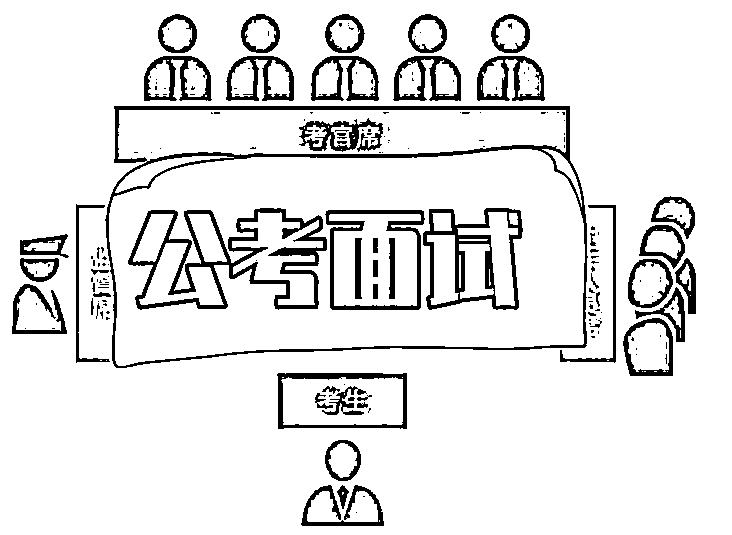

下面是一些面试题目举例：

**1. ** 年轻干部要修炼好“内功”，必须要坚持刀在石上磨，人在事上练。对此谈谈你的理解。

**2. ** 一项调查数据显示，未成年人互联网总体普及率高达98.1%。与之相伴的是，网络成瘾现象十分严峻。  对此，请谈谈你的看法。

**3. ** 你是单位的一名新人，单位有个老同志总是看不惯你的工作风格，表面很和气，背地里却经常同其他同事说你的不是，导致同事们对你议论纷纷。对此，你怎么办?（**2**）我为什么做公考面试？

# **①**考生数量多

 

 

除了每年的国考、省考、事业单位等大规模的考试，还有很多其他考试，像2022年，因为疫情很多地方简化了事业单位人才引进的招考方式，只要满足招考条件，不需要笔试，直接面试就可以了。

而且，每个省、每个市、每个县、疾控、医院等事业单位自己组织的考试有很多，可以这么说，全国几乎每周、甚至每天，都有地方在组织体制内的面试。

# **②**高客单价且刚需

客单价：对于面试来说，很多面试机构的价格动辄就是1w+、2w+起步，线下培训班拉高了整体面试培训的单价，而且面试这个东西，不像笔试有标准答案，笔试自学看看视频就行了，面试自学是很难提升的。

面试机构拉高了面试培训的价格，个人如果从事面试培训，如果客单价在3000/人，每月10个左右学员，就可以稳定月收入3W+以上。

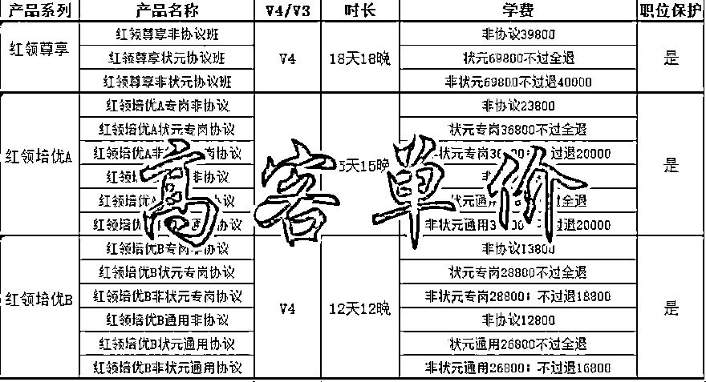

 

 

刚需：面试是上岸前的最后一关，只要通过了面试，就能进入体制内，所以不管是学生也好，家长也好，都舍得，或者不得不舍得花钱去报班。

# **③**我有面试经验

我曾经3次考入不同体制内单位，在机关单位也有多年工作经验。我虽然笔试能力不是很强，但是只要进入面试，我是100%上岸的，我对面试有很多自己的理解和经验。

刚开始我是免费帮考生面试辅导，不想浪费了自己的上岸经验，纯粹是为了分享知识，能用自己的能力帮助别人。后来吧，感觉面试辅导可以长期做，就开始了付费辅导。

 

 

# **# ****2.**起号

我的小红书从起号到现在经历了3个阶段。

 

 

# （**1**）第一阶段：发面试真题

我第一次在小红书发笔记是在22年的4月份左右，当时我在微博搜索“面试”相关的内容，发现很多公考机构每天都在分享最新的面试真题，我就想着能不能把做成图片的方式分享。

然后我找了找作图工具，把真题做成了图片，同步发送到小红书、头条号、微博、公众号、知乎等各个平台，这段时间只有小红书反馈和互动最好，每天都有几百到一两千的小眼睛，有了这种正向的反馈，就一直激励着我更新面试真题。

 

 

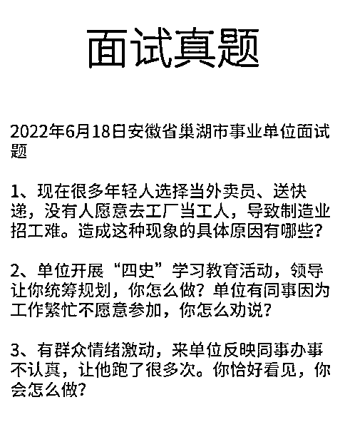

发面试真题笔记的时候，会有考生在评论区咨询面试题目怎么答，我就在评论区认真回复：这个题目怎么建立框架，从哪些角度思考，怎么展开这道题。

这个时候就会有个问题，小红书评论区最多只能发300字，我写的解析很长，还得分段发送，感觉花了很多时间在评论区的回复上，也太浪费时间了，而且性价比不高。

所以，这个阶段，只持续了一周左右。

 

 

# （**2**）第二阶段：发面试真题**+**面试解析

一周后，我对标了一下同行，发现粉丝多、赞藏多的，发的笔试是面试真题的解析和逐字稿，然后我就迅速调整，从原来的「面试真题」调整为「面试真题+面试解析」。

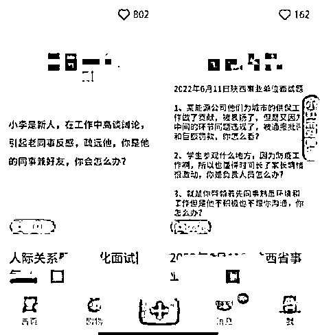

 

 

效果果然比只发面试真题效果好得多，会有不少粉丝私信我面试提升。

这个阶段，持续了大约两个月左右。

# （**3**）第三阶段：只发面试解析

发面试真题会有个问题，就是每天的面试真题太多了，会有很多考生在评论区问题目答案，回复吧，一道题起码得写一二十分钟，不回复吧，还经常有考生问，越来越感觉，发面试真题有点鸡肋了，所以过了两个月后就索性不发了，后面就只发面试的解析笔记。

# **# ****3.**笔记呈现形式

我的面试解析都是「图文笔记」，我在对标同行的时候，一开始我也不太明白，为什么图文笔记会有那么多粉丝愿意看呢，我和一个学员沟通的时候，给了我答案，她说图文笔记里面有作答逐字稿，一些视频都是口播，没有逐字稿，看图文笔记更加清晰。下面是我做图文笔记的一些方法：

# （**1**）首图简洁明了

一开始我发图文笔记，是很注重首图「外在」的，就是图片要精美，通过对标爆款账号，发现他们的笔记也没有太多花里胡哨，更多是内容。

 

 

我就从考生角度思考了一下，如果我是一个考生的话，更多想看看：面试解析的思路和作答逐字稿，所以我就又修改了笔记首图风格，就是「白底+黑字」，不再关注外在形式，只关注内容，这种形式我也一直延续到现在。

 

 

 

 

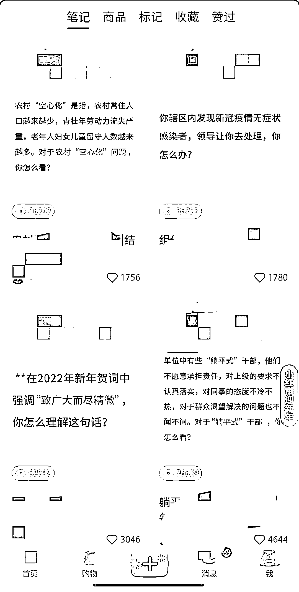

# （**2**）内容差异化

小红书也不少做面试辅导的同行，怎么在同行里「凸显」出自己呢？就需要把内容做的比别人更好，做出产品的「差异化」。

我和普通机构的差异化：因为我有很多面试上岸经验和体制内的工作经验，我写的内容就更加贴合考生的痛点和难点，普通机构的玩法更多是付费推流，买广告流量的方式，不会过多注重面试题目的解析上，而且，普通机构的老师很多是短时间培训出来的，他们没有太多干货，笔记自然就没有太多质量。

我和同行的差异化：也有一些同行也会写一些解析，但是他们的解析更多是写面试答案，不写思路和过程，一方面可能是写不出太多干货，另一方面可能是不想花太多时间去解析思路，这样他们的笔记给考生的「获得感」就不会很高。

我的图文笔记，除了答案，还会分析怎么架构一道题目的思路，怎么想到这个答案，对于考生来说，解题思路和方法往往比答案更重要。

我在结合了很多同行的优点后，把小红书笔记优化为：面试题目解题思路+思维导图+作答参考。

 

 

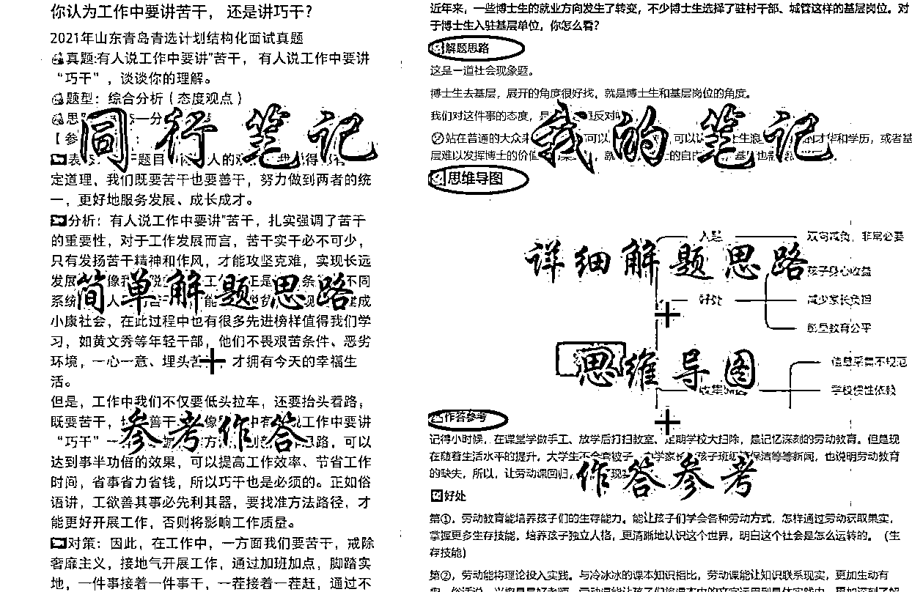

# **# **

# **4.**怎么引流精准粉丝

我的变现方向很清晰：就是做面试拔高，所以我引流的群体就是：需要面试拔高的群体。

怎么让粉丝愿意为你付费呢，一句话描述就是：让粉丝信任你。

# （**1**）输出干货体现专业

 

 

小红书笔记是第一次取得用户信任的地方，所以我每一篇面试题目的解析都是用心写的，一篇有质量的笔记花费时间大约在0.5~1小时左右，我会输出一些面试解析干货，来体现我的专业性。

在写笔记的时候，我也不断通过「笔记质量」提升与竞争对手的差异化，我也不怕把干货分享完，粉丝就不来找我，因为面试能力是一个比较含糊的，很多时候文字更多是表达一个大致的方向，粉丝要想快速提升，是需要沟通、交流、授课才能解决的。

对于变现来说，前期建立信任花的时间越多，后期成交才会越顺利。

# （**2**）在笔记里面带出自己的价值

在写笔记的时候，可以带出自己的一些经历，比如自己从事这个行业多少年，取得了什么成绩，带动多少人实现了什么成绩。这样除了分享干货，还能让用户了解你哪里牛X，打造个人**IP**，进而吸引用户来私信你。

比如我在解析的时候，会加上一些话语：

**1. ** “之前我在授课的时候，有学员问我关于***的问题”

**2. ** “我们体制内工作的时候，并不会**”

**3. ** “我之前学员就是用了这个方法，才***”

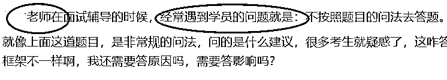

把自己的人设柔和地融入到面试解析中，考生脑海里自然会建立你的画像：这个老师有授课经验、有体制内经验、老师的学员成绩也不错。

 

 

# （**3**）价值考的是吸引，不是推销

和“谈恋爱”一样，知识价值的魅力在于“吸引”，而不是“推销”。粉丝觉得你的内容不错，又有需求的话，自然会关注你、私信你。

但是，如果主动私信，那就成了推销，这就不值钱了。

所以，如果有粉丝在评论区留言，说咨询面试提升，我也只是评论区回复“小窗T我，滴滴我”的话术来引导粉丝私信，一般不会主动私信粉丝。

 

 

通过图文、视频展示自己的价值，当他们有需求的时候，会主动找你的。

# **# ****5.**模块化回复

有粉丝咨询的时候，往往会耗费很多时间，而且小红书又没有PC版，只能手机打字，忙的时候就应付不过来了，所以，编辑好固定的回复话语，粉丝问的时候可以直接发过去，会减少很多沟通成本。

我一般是用手机输入法自带的“常用语”功能：

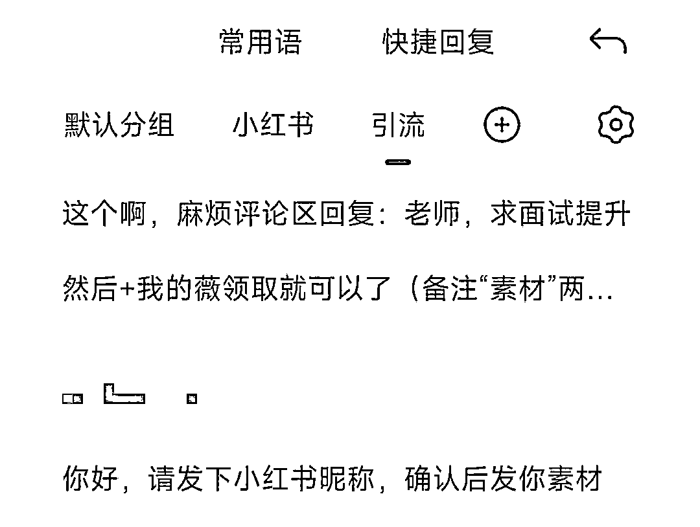

粉丝私信问我微信的时候，我没有用其他圈友“把微信号做成图片”的方式，我用的是两段话回复，比如：

 

 

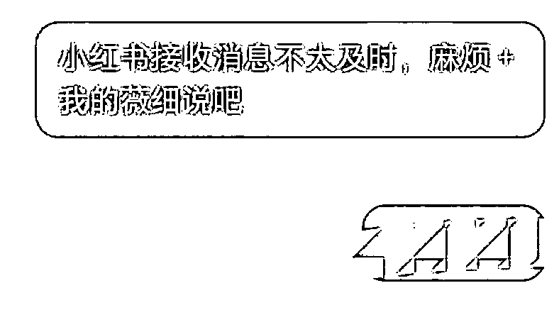

“小红书消息接受不太及时，麻烦+我的V细说”，然后下一段打上我的微信号。发图片有点繁琐，这样发送更快一点。从我每天大约10~20个的粉丝咨询量，我用这种方式，从来没有出现过问题。

# **# ****6.**定价

价格决定收入，怎么提升自己的客单价，就看个人能力了。

# （**1**）输入干货能力决定收费价格

 

 

小红书上有不少刚上岸的，也在做陪练，他们基本就是发个笔记，说自己刚上岸，然后发发微信辅导截图。

这样的老师价格一般在几十块/小时，多了基本就没人会找他们，因为他们提供的价值就是那些截图和自己的上岸成绩，考生通过这些内容产生的「信任感」并不是很强，所以，考生一般不会为这样的老师付高价费用，考生选择他们，更多是因为：便宜。

 

 

 

 

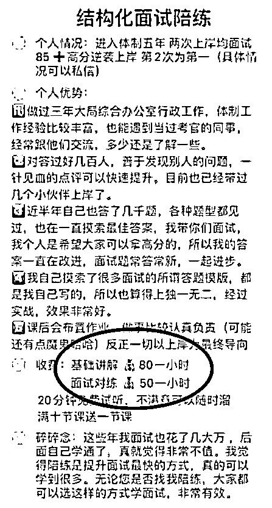

# （**2**）我的客单价

我的价格一开始也是几十块/小时，现在是几百块/小时。

为什么别人只能收几十，我能收几百呢？

在笔记的价值输出上。

举个例子，如果你是考生想报课，博主只是吆喝“我教的好，我有能力，我有经验，我能帮你”，你会花大几千去听课吗？大概率不会吧。

如果博主不仅吆喝“我有能力”，还写很多经验、干货，考生就会更加清晰了解博主的价值，在转化的时候，就会更容易。

我为什么比他们收的多，因为我输出的多啊，我不止是摆我的经历、阅历，我花了很多时间，写了很多解析，学员就可以通过这些解析了解我的能力，如果他们有提升需求，就会私信我。

 

 

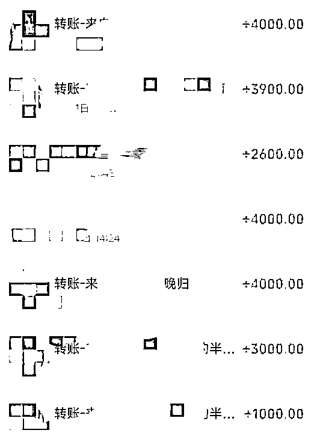

 

 

# （**3**）价格包装

这个方法让我的面试私教课价格翻了好几倍，我之前价格遇到瓶颈的费用是300左右一节课，因为学员高于这个价格就会犹豫，想一节一节上，我为了留住学员，就给他们授课了。结果是，我的课讲的干货太多，基本一两节课就帮他们提升一大截，带来的问题是，费了好大劲才招到的学员，只上一两节课，投入产出比太低。

所以，后面我就慢慢地转变了策略，学员问我一节课多少钱的时候，我不会说一节课的价格，而是说整个拔高课的价格，我会告诉他们“我是整个拔高课，一两节课我是不预约的”。然后我会讲讲我这个面试课的形式和价值，能帮助他们什么，让学员了解并认可我的能力。

 

 

 

 

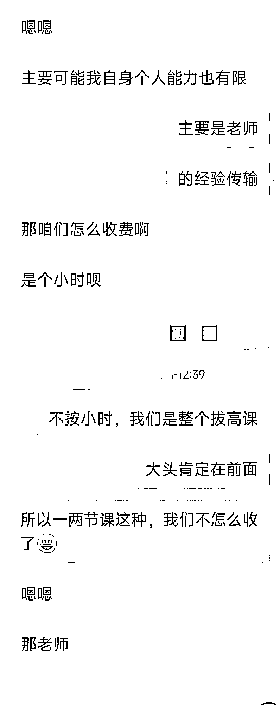

如果交流完后，如果学员觉得我能快速帮他们提升，就不会在心里纠结「上一节课花了多少钱」，而是「报了这个课，我可以提升我的面试成绩」。当然了，话说回来，我具备能让学员短时间拔高的能力，才会有底气和学员这么讲。

所以呢，收入提升甚至翻倍，很多时候是某个细节点的优化。

# （**4**）多元化满足学员需求

 

 

面试考生有很多个性化需求，大多数都会选择报班，但是呢，面试有些问题不是报班就能解决的，因为很多线下机构的面试老师讲的太烂了，这些老师绝大多数都没进入过机关单位，很多都是机构短时间培训出来，又去教面试考生的。（大家可以搜搜：某公退费难。就知道这个行业的老师水平有多差）

也正是因为他们讲的烂，导致考生很多问题，这里就有很多考生的需求点：

**1. ** 线下培训班学不到东西，自学又提升慢的

**2. ** 面试没有自己解题思路的

**3. ** 面试答题空洞，需要提升质量的

**4. ** 考前需要提升，又找不到有经验老师的

这些需求是大机构难以覆盖到的，而且机构更多是固定的面试班时间，报班的就必须在这个时间段上课，我的时间就比较灵活，只要提前预约，这些学员的个性化需求，我都可以满足，而且我授课的质量比机构好的多，学员就更倾向在我这里学习。

有些需求也并不是提前找到的，而是深耕这个领域后，慢慢发掘出来的，所以啊，一般越大的市场，细分的机会就越多，找到这些细分市场的需求，机会就是你的。

# （**5**）通过复利扩大运营

 

 

学员多了，我就教不过来了，我把以前的「一对一」优化为「小班、一对一」两种形式。

我从上岸学员里培养了一个面试老师，一起合作，现在「一对一」我一般就让合作老师去教，我空出时间就写写解析和教多人小班。

这里面有两个「复利」，一个是「人」的复利，一个是「时间」的复利。

**a.**合作老师是人的「复利」。我会把大部分利润给授课老师，我只需要引流学员就可以了，这样我虽然损失了一些收入，但是我不用参与授课，时间空出来很多。

**b.**小班是时间的「复利」。同样的时间如果是一个人上课，同一个时间只能收一份钱，如果是多个学员上课，就能收到多倍的收入。

# （**6**）不断优化价格

我现阶段的价格是4000左右，说实话，以我的授课质量来说，考生在线下，就是花4W也买不到相同质量的授课。

不同粉丝对价格的认可度是不一样的，就像学习面试的粉丝，有的粉丝认为上几节课就几千块钱，太贵了，超出了他们的承受能力。有的粉丝就会想，才几千块，比线下便宜多了，而且是多次上岸的老师授课，讲的都是干货，太划算了。

但是呢，和粉丝交流的时候，我们往往是不知道粉丝的价格底线的。

如果粉丝心理预期价格是大几千，你报价3000，粉丝几乎会毫不犹豫报课。

如果粉丝心理预期价格是1000，你报价3000，就大概率不会成交。

这就像薛定谔的猫一样，只有打开盲盒才知道粉丝对价格的承受能力。

客单价越高，成交率肯定越低，我们要|不断优化和提升客单价，慢慢试探用户群的接受能力，达到更优的转化。

 

 

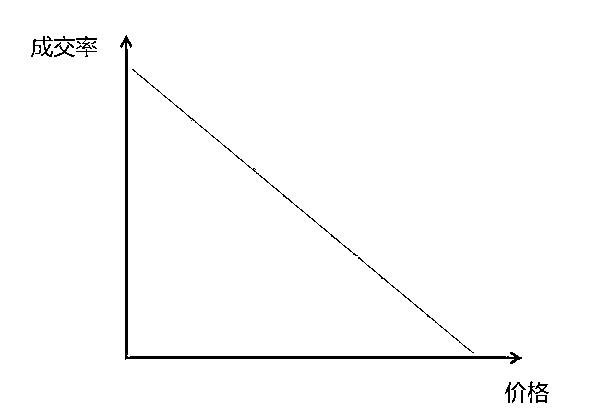

# **# ****7.**微信朋友圈打造

朋友圈也是人设打造的地方，是「取得粉丝信任」很关键的环节，我一般在朋友圈发我的面试解析笔记、学员问题解答的截图和学员上岸的截图，继续让粉丝了解我的「价值」，我的微信朋友圈一般包括下面几方面的内容：

（**1**）专业内容：我会把面试真题解析同步发送至公众号，分享公众号面试解题链接，持续打造专业性。

（**2**）价值内容：主要是解答学员问题的微信截图，或者学员上岸的微信截图，这些也是自己能力的间接印证。

（**3**）生活内容：零星发点生活中的感受，让粉丝感觉我是个活生生的人，而不仅仅只做面试培训。

 

 

 

 

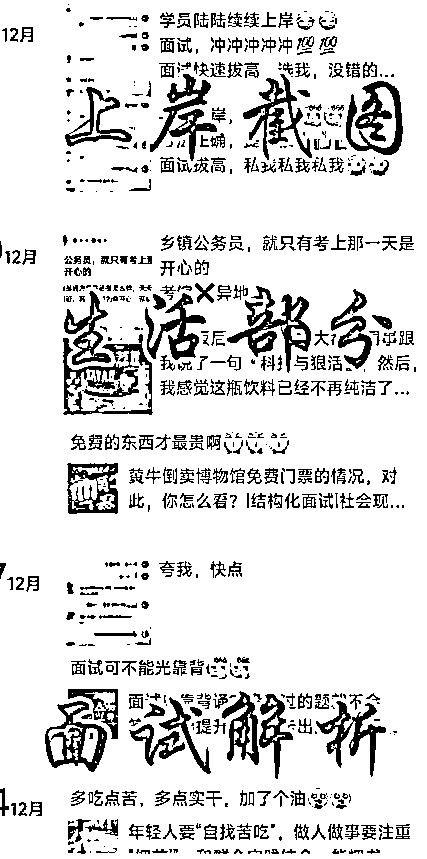

 

 

# 二、进入私域后如何成交

# **# ****1.**不同粉丝不同方法

粉丝加我微信，基本是有明确需求的，这基本就到了成交的最后一步。我的粉丝里面大体有两波用户：

**①**问价的

一般上来问价的，基本就是比价，他们加了很多老师，互相比价，对比价格，价格是他们最看重的。

所以这个时候，我会转移他们的思路，不先说价格，而是通过沟通，让粉丝继续了解我的价值，和能给他们带来什么，让粉丝明白我和其他老师的差异点在哪里。

 

 

沟通完这些内容，我再说我的价格、授课方式，这样用户对我的了解就更多，转化率也更高。

 

 

 

 

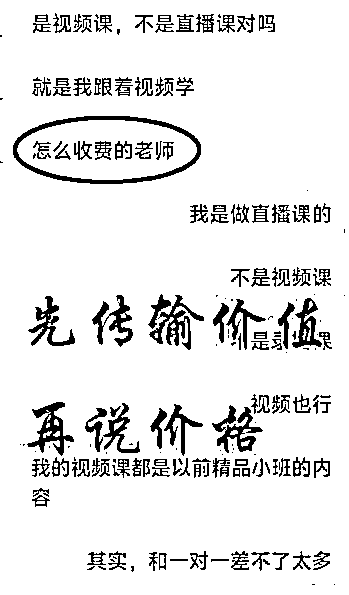

**②**问课的

这种用户就是问你能帮助到他们什么，所以我就说一下他们会出现哪些「面试提升难」的情况，直戳他们的「痛点」，就着他们的痛点，疯狂输出我会怎么帮他们解决，到这一步，如果价格大体谈得拢，就会在我这里报班。

总体来说，如果话术对，10~30的话语沟通，基本就能成交。

 

 

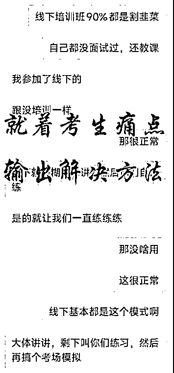

 

 

# **# **** **

# **# ****2.**用真诚代替推销

有的机构会把他们的课程搞成一些精美的图片，我是不这么做的，因为如果发图片，显得更像是在推销。

我更多是站在解决粉丝问题的角度去沟通交流，即使是一些在输入法里提前整理好的常用回复，我也不会发的太快，有节奏地发送给粉丝，就像是平常聊天一样，回答和解决他们的诉求，这样粉丝才会更加信任你。

# **# ****3.**语音沟通建立最终信任

 

 

还有一种学员，就是即使他们了解你的价值，但还会对你的课程是否有用产生怀疑，他们想「试听」一下课程，看看课程的质量。这些学员的特点是，他们得试听后并认为你讲的内容有干货，才会报你的课。

我的方法是：直接微信语音沟通。

我没做过面试试听课，不是因为懒，而是面试中用户的需求点太多，试听课带来的感觉并不直观，给考生的获得感不强，不能精准解决用户的需求。

 

 

 

 

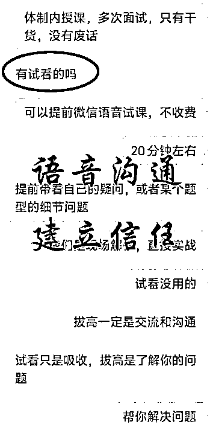

所以，我会直接约个时间和学员「语音沟通」，让学员短时间学到一些东西，让他们了解我的能力。

我一般会问问学员之前是怎么备考的，是自学，还是报了线下班，是初学，还是想拔高，然后我会就某个具体的面试题型，短时间讲解应该怎么架构一道题，怎么展开一道题，现场传输一些面试干货。

这样就会让学员现场学到一些价值的内容，让学员通过沟通直观了解我的能力，这样一通操作下来，基本就可以顺利成交。

# 三、知识付费选题经验

以上就是我做小红书的一些思路和方法，如果圈友也想做知识付费的话，首先遇到的问题就是赛道的选择，我说说我的选题经验和看法。

 

 

# **# ****1.**选题前先考虑变现

不管做什么项目，首先考虑的就是怎么「变现」，卖什么产品，卖什么服务，由「变现」反推出怎么「引流」，这样才更有针对性，全部细节都是为了变现服务。

我做「公考面试培训」，也从自己最擅长的方向做的，因为我参加过多次公考，也有很多公考经验，所以做公考来说，我更加适合。从自己擅长的方向入手，能找到很多很多变现的方式。

# **# ****2.**深耕某个领域

深耕可以让我们在擅长的行业里持续赚到钱，我做的「公考面试培训」很卷，某公、某图、某笔等大机构在做，各地的一些中小机构也在做，同行也很多在做，连一些刚上岸的考生也在做辅导，那说明竞争很激烈，那就不该去做吗？并不是。

 

 

因为即使有很多人在做的红海项目，也会有很多机会，有很多细分的市场，我们很多时候不是和他们去竞争，因为远远没达到那个量级，在某个行业的大蛋糕里面分一杯羹，就足够了。

在一个领域深耕的时间越长，就会越熟悉这个赛道，即使会有很多同行竞争，只要做出差异化，就能持续在这个赛道里获得收益。

而且，跑通一个赛道的底层逻辑都是相通的，知道怎么引流、怎么转化、怎么变现，即使哪天这个赛道卷的没法做了，换个赛道也能快速起号。

# **# ****3.**边行动边思考

 

 

很多人选题的时候都会有一个问题，就是纠结的太多，行动的太少，想把所有细节都考虑清楚再行动，大多数时间都用到「设想」上了，缺少了行动。选题方法多了，选择多了，就会产生每个都想做，但是都浅尝辄止的问题。

 

 

 

 

所以呢，在选择项目的时候，不要过于纠结，也不用想的太多太杂，也不用过多考虑是否是蓝海红海，想得再多，没有行动，那也是0，尽快行动起来，边行动边思考。

# 四、新人如何做知识付费

知识付费是一个长久可做的赛道，如果选择正确，沉淀越久越吃香，收入也越高。知识付费通常有两种玩法，一种是分销别人的知识产品，另一种是自己生产知识产品。

第一种方式优点是不用花时间生产产品，只需要分销别人的产品就行了，缺点是销售权、定价权、产品所有权都在对方，分销者很被动，获得的收益也有限。

第二种方式就是先通过学习、掌握并进行运用、验证、整理，总结出一定的经验，再传授给更多用户，虽然制作产品的时间比较长，但是适合长期做，自己可以掌握销售权和定价权，将收益最大化。

我做的就是第二种变现方式。

 

 

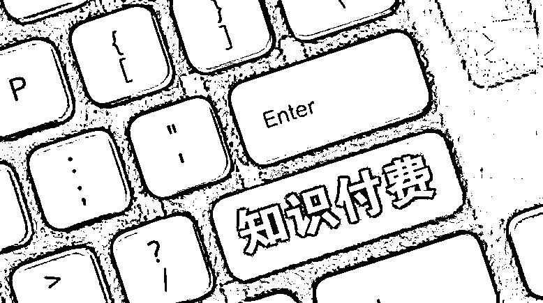

# **# ****1.**知识付费门槛

知识付费的门槛并不是很高，只要做好向下兼容就好了，如果不知道能做什么项目，我推荐从自己的经历出发，因为自己的经历才是我们熟悉、擅长的领域，比如：

**①**所学专业。专业一般是自己学习时间比较长的，这些是我们已有的技能，拿计算机专业来说：

**1. ** 如果擅长各种编程，可以教：编程的技巧、编程的理念、怎么制作小程序、怎么制作小工具等等。

 

 

**1. ** 如果擅长各种视频制作软件，像剪映操作、PR操作，可以教：怎么制作短视频，怎么让视频更吸引人等等。

**1. ** 如果擅长各种办公软件，像EXCEL、PPT，可以教：EXCEL和PPT的常用技巧、快捷方式等等。

**1. ** 如果考了某个证书，比如计算机软考，不要光考完就拉到了，可以看着别人的教程，翻录一些考证的视频，讲解考证的知识点。

**②**从事行业。自己长时间从事的行业也有很多知识可以传输，比如我从事的是机关工作，不做面试培训，我还可以做公文写作、笔试、面试、职场经验等等领域。

其他领域也是类似的，先专注一个领域，高认知打中认知，中认知打低认知，低认知打零认知，其实也是知识付费的市场下沉，只要你有优质内容输出，总会有需求的人来买单。

# **# ****2.**要喜欢传输知识

知识付费需要个人有喜欢传输知识的欲望，起码不反感讲课。有的人天生是不能沉下心来讲课的，如果硬要从事知识付费行业，就会感觉很累，浑身不舒服，每个人的天赋是不同的，有的人天生适合做销售，有的人天生适合做科研，有的人天生适合讲课。

根据自己擅长的方向去努力，才会有做知识付费的动力。找到自己可以传输知识的领域，深耕下去，时间长了必定有收获。

 

 

# **# ****3.**知识付费难点

# （**1**）自己做和教别人是两码事

就拿考试来说，让考进清北的人去中小学讲课，也不一定比普通老师讲的好多少。

所以，「自己能考好」和「教的学生考得好」是两种技能，前者靠「自己学习的天赋和努力」，后者靠「给别人传输知识的水平」。很多人自己做一件事能做好，但是并不能讲的很清楚。

我一开始讲面试的时候，就是无偿和进入面试的考生陪练，有时候自己心里知道是什么意思，但是表达的不是很清楚，或者自己讲的内容对方吸收的比较慢，我就花了一些时间来提升自己讲课的能力，思考怎么把知识点讲明白、讲通透。

讲课能力呢，说难也不算太难，讲得多了，自然就有经验了。

# （**2**）难以做出差异性

目前我们常见到的知识付费课程，大多数是以快速入门、快速见效为噱头，吸引用户为之买单。但是细看之后就会发现，课程内容与市面上课程雷同较多，内容质量也是令人堪忧，没有太多值得的干货。

 

 

所以，用户重视的不是知识的数量多少，而是知识的含金量，特别是稀缺的、优质的、有价值的的知识。

所以，做知识付费要想打造壁垒，做出差异性，就更要专注这个领域，时间长了，对这个行业了解和认识会更深入，小白也会逐渐成为这个领域的专家。

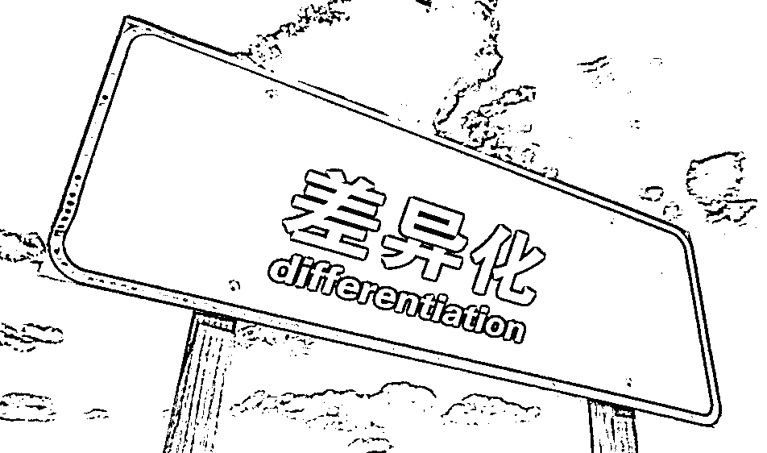

# （**3**）复购率较低

知识付费很多时候是一次性交易，不像食品之类的消耗品可以多次复购，知识付费一般用户购买一次后就告一段落了，想做二次或者多次转化，往往是比较难的，所以需要不断引流新的学员。

# （**4**）需要持续推广

 

 

很多人做课程就只是埋头把课程做好，但是做出来发现，根本没人去买，就是引流的方式方法有欠缺。只有用户知道你的产品好，才会在你这里消费，不管是知识付费还是其他行业，都是需要持续去引流的：

**①**付费引流：一般机构、团队运用这种比较多，就是打广告，买流量，1元或者9.9元低价课来吸引用户进入私域，从而转化高价课，这种适合一定规模的团队，个人初期并不适合。

**②**内容引流：通过持续输出有质量的文章、视频，让用户了解你能提供的价值，从而在有需求的时候第一时间能想到你。我的引流更多属于这种，我在引流方面，从来没有花过1分钱，都是通过自然流量来吸引用户。

其实，做任何赛道都没有那么简单，都需要对这个赛道认知上的积累，了解越深入，就会有越多变现和引流的方向。

# 五、**10**个知识付费经验

生财有很多小红书和知识付费经验，圈友分享比较多的，我就不重复分享了，我说下我认为比较重要的内容吧。

 

 

# **# ****1.**尽量不做低客单价

不管是高客单价还是低客单价，都有沟通成本，而且低客单价的时间成本一点不比高客单价低，所以能做高客单价就不做低客单价。

拿我写的面试解析和作答逐字稿来说，我期间也尝试过卖我写的解析资料PDF版，价格19-39左右，也会有很多人私信购买，但是太浪费时间了，每个都得回复，即使一天卖个10份20份的，还不如我一节课的客单价高，搞的自己很累，后来我就基本不怎么做卖资料的引流了。

和低客单价比，高客单价会更加省心，粉丝素质也更高，变现也更多。

# **# ****2.**优化好付费资料引流

因为我的面试学员，大多数是看我的小红书笔记私信我的。还有一小部分，是通过资料找到我的，所以把引流资料做好，也可以拓展一些学员。

 

 

不管是免费还是付费资料，不要光只放资料和联系方式，也可以在资料里面添加自己的人设，这样对于那些不是通过小红书等平台认识你的，能更加全面了解你。

我的付费资料主要包含：面试真题解析部分**+**人设部分。

 

 

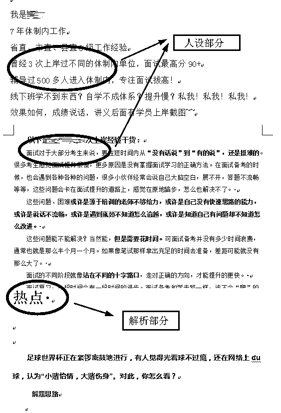

 

 

解析部分：就是我的小红书面试解析电子汇总版，因为小红书观看需要一个笔记一个笔记看，比较繁琐，所以一些粉丝会想要解析汇总版。

人设部分：如果只有解析，粉丝更多只是看我的解析，不会找我来拔高，所以我会在资料里增加体现我价值的部分。

**1. ** a.我的介绍。 把我的面试、上岸、工作经历在资料首页写明白，打造个人人设。

**1. ** b.我的面试提升经验。 我会整体讲讲面试提升的思路、方法，什么样的方式才是正确提升的方式，怎么合理分配面试提升的时间，提升遇到瓶颈应该怎么解决等干货。

**1. ** c.面试上岸截图。 通过学员成绩来丰富自己的授课成果，把面试上岸的微信截图摆出来，让粉丝觉得，在我这里提升，他们也能上岸。

这些和微信朋友圈的内容方向大体也是类似的。

# **# ****3.**变现是从**0**粉丝开始的

知识付费就是找到有需求的客户，并把课卖给他们，所以，不要迷恋什么粉丝数量，要找到有需求的精准粉丝。

 

 

我在小红书成交的第一个客户，就是做小红书一周左右，这个时候，我的粉丝只有几十个，当时，我在小红书评论区回答了一些题目的解析，然后粉丝就私信我面试怎么提升，我就跟她探讨了一些面试快速提升的方法，就顺理成章的成交了，最后这个学员也上岸了。

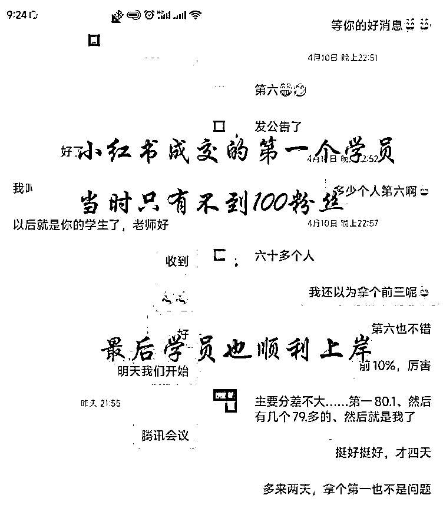

 

 

很多圈友以为先把量做上去，再去变现，这种思路大概率是错误的。我小红书有4W粉丝，但以经验来说，愿意付费的更多是新增粉丝，粉丝数量多少对我来说更多只是个数字，并没有太多价值。

# **# ****4.**不会变现等于自嗨

所有流程都是为了变现服务的，没有变现渠道，都是无用功，前段时间一个做人民日报金句分享的小红书博主加我，她的账号有将近20W粉丝，问我变现的问题。

 

 

 

 

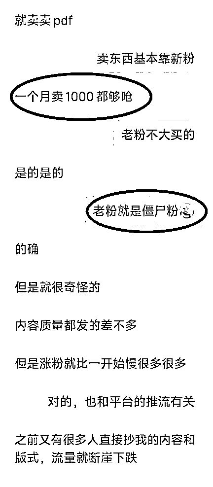

她说她20W粉的账号一个月变现才1000左右，你敢信？没有变现，很多时候更多是：数据漂亮，但是赢不了比赛。

所以，建议大家要架构好自己的变现内容，不要光盯着浏览量、点赞量、收藏量，要变现！变现！变现！

# **# ****5.**把干货都输出完了怎么办

很多圈友都会有这么一个疑问，我在文章、视频里把所有干货都讲完了，那怎么办呢？

我可以提供两个思路：

 

 

**a.**讲一部分，留一部分

如果课程价值点在实操，我们就讲讲理论；如果价值点在理论，我们就讲讲某个部分的理论点的实操，不要一次性讲完。

**b.**拆分细节，一次只讲一个小点

比如讲引流，我们可以一次讲一个引流的小方法，讲引流的小工具，讲引流的小技巧，讲引流的某些话术，拆成一个一个小细节点，就会有很多可以讲的内容。

# **# ****6.**笔记搜不到怎么办

如果笔记10分钟以内还没有小眼睛，大概率就是触发了审核，这个时候需要手动申诉下，步骤是：我→帮助与客服→笔记申诉。如果笔记没有问题的话，通常会在0.5~1个小时内审核通过。

 

 

 

 

# **# **** **

# **# ****7.**需要不需要刷启动赞、藏？

不需要，如果笔记没有小眼睛，99%是内容有问题，刷赞藏没用，要考虑怎么把内容质量做上去，没有浏览大概率是内容不够吸引人。

# **# ****8.**需要不需要规避所有敏感词？

不需要。我的笔记一般字数比较多，一篇大约一两千字（图片+文字），我发笔记的时候一般不会做违禁词检测，因为那些违禁词检测网站，是把所有敏感词列为关键词，如果把这些字都替换掉，那笔记就牺牲了很多可读性。

以我的经验来说，有些是一定不能发的，像涉政的，发了一定过不了。

 

 

其他敏感词，比如极限词之类的，只要出现频率不多，问题是不大的。像下面一篇笔记，写了很多敏感词，但是依然能发出来。

所以一些词语能不能发，自己多测试测试就有答案了。

 

 

 

 

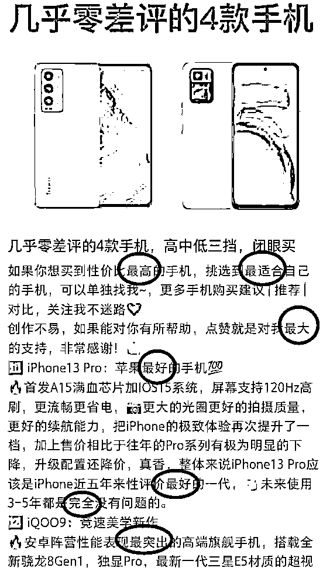

# **# **** **

# **# ****9.**确定某个领域后，模仿、对标同行，同行就

# 是最好的老师！

一开始不要用过多的分析方法，可以用蝉妈妈等分析工具，看看同行是怎么做视频的、怎么做图文的，复制它、模仿它，这个同行学习一点，那个同行学习一点，慢慢地就会掌握做爆款的方法。

记住一点：分析工具只是辅助，不要把工具作为主导。

如果确定了自己的赛道，如果不知道怎么做，那就去学习同行。

# **# ****10.**多请教、多链接

 

 

选题也好、其他也好，请教、链接能让自己事半功倍。很多时候我们遇到有变现渠道，但是不知道怎么引流，或者引流了后不知道怎么变现，这个时候如果迷茫，可以看生财文章，也可以多请教请教大佬，有时候大佬的一句话就可以把你点透。

闭门造车大多数是造不出来，交流、请教很重要，比如我之前收款都是异地的大额，连续转账很容易风控，我就去请教别人怎么控制风控的问题，然后得到一些答案，比如运用千聊、小鹅通等等。

所以呢，找有类似经验的人去交流，会很快得到准确的答案，这些坑很多都是别人都走过的，请教别人会更快得到想要的结果。

# 六、一起**“**生财有术**”**

很感谢生财提供了一个创业者交流学习的平台，我也通过生财学到了很多东西，不管是精华帖还是航海，都开拓了我的视野，带给了我很多思路。

我也很了解我目前存在的问题，就是不管我怎么做面试小班、一对一，只要我没从写面试解析、授课这个角色抽身出来，本质上我只是在售卖自己的时间，并不是一个好生意，但是，我依然愿意深耕下去。

我后续需要优化的变现方向也很明确，就是从售卖时间慢慢转为睡后收入，所以，这段时间，我也录制了一套面试课程，尝试在抖音、视频号里推广，也希望有公考流量的也可以和我链接~

 

 

评论区：

大俊 : 你是原来的朝夕老哥吧

哆啦 : 是的，改了个名[憨笑][憨笑]

芷蓝 : 这个太赞了～

亦仁 : 感谢分享，已加精华。

陶学长 : 6666

陶学长 : 公考每天引流200人，就是客单价太低了，学习了

亮菁菁(台州) : 我也在备考，要是有机会进面，就找您[呲牙]

在海边 : 感谢分享

作者：  卓卓子是我🎈

日期：2023-01-16

大家好，我是卓卓子，一名互联网产品经理，六期生财圈友。

从从来没有做过知识付费到入场考公培训市场，三人共计营收32万，纯利润14万。本文将从1.广东省公务员考试现状、2.如何进行引流转化、3.提供何种差异化服务三方面进行拆解。

好啦，我的分享就到这里了，希望能帮到各位圈友，让我们一起生财有术！

# **#** **(**精华帖**)(107**赞**)**新人入局考公市场，变现 **10W+** 的

# 复盘

 

 

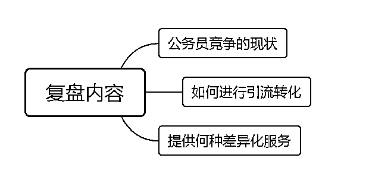

# **#** **1.**广东省公务员考试的现状

 

 

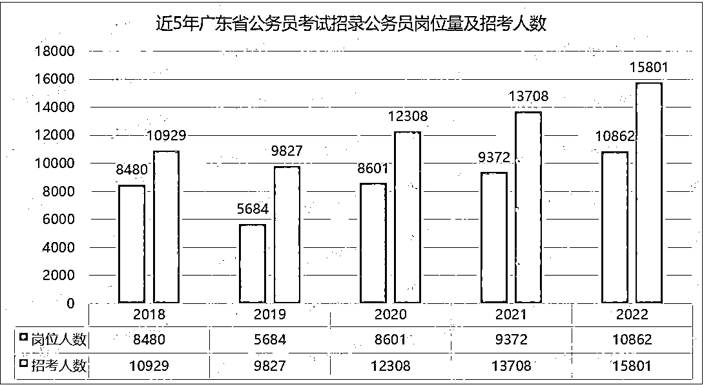

从2018年~2022年近五年的广东省公务员考试  招录公务员岗位及招考人数可以看出，近4年来考试招录人数一年比一年高，其中2020年~2022年平均增幅达14.93%。

最新出炉的2023年广东省考公告，有3846个招考单位参与，共计提供12768个职位，计划招录18258人。同比去年招录人数增加2457人，增幅15.6%。

我们入场的原因有三：

1.在口罩时期的影响下，不管是头部大厂还是中小企业，存活难度上升，裁员倒闭的概率增加，更多人为了寻求更稳定的工作来保障生活，“铁饭碗”就成为了第一选择

2.1962年至1972年这段时期，是新中国成立以来第一个人口高峰期。当时每年新增人口2000多万，所以从2022年开始将持续十年最大的退休潮。虽然国家也作出了相应的应对措施，比如将在十四五时期落实延迟退休政策。但从岗位更替的角度而言，保守估计招考岗位在短时间内还会持续短时间的增长

 

 

3.广东省无领导面试尚处于发展阶段，培训机构的竞争格局还没有完全形成，考公学习体系也仍存在值得进一步钻研的空间

市场上永远不缺好的内容，缺的是好的渠道。在正式投入宣传之前，我们做了几件事：

📌对所了解的渠道做了简单分析，制定了相应的策略

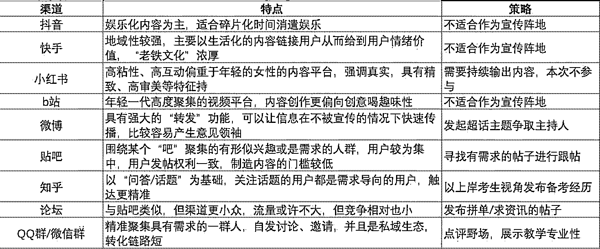

# **#** **2.**如何进行引流转化

# **2.1**选择什么渠道

 

 

📌提前注册公众号，设置关键字自动回复，发布文章，文章最后留客服微信号，引导加客服微信邀请进考生交流群

📌建立考生交流群，将有意愿的考生聚集在一起，同类问题统一解答，提高效率针对以上渠道，我们对最终报班学员的来源进行了统计

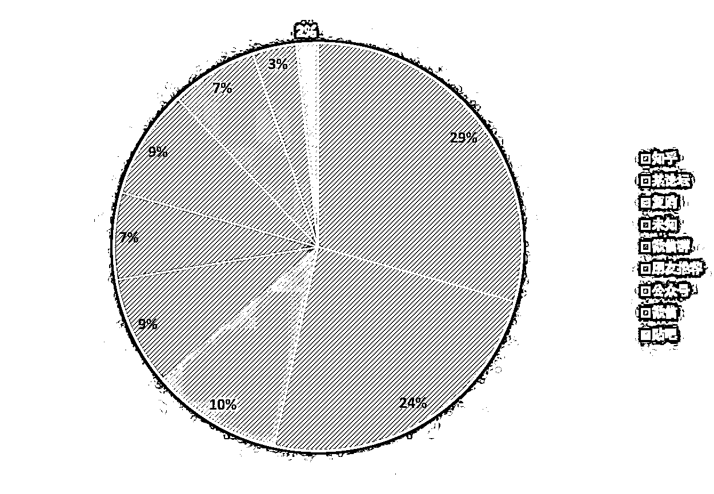

根据引流效果从高到低，分享我们具体的实操方法，供参考⬇

# **2.1.1.**知乎

 

 

做法：以上岸考生的身份，发布从选岗-笔试-面试的详细备考经验帖，包含是否需要报班，以及对市面上机构的横向比较，在内容中，客观阐述各机构优劣势，同时突出我们做得比其他机构好且对考生来说更关心的部分，如价格、服务

目的：上岸考生的经验分享可信度更高，没有进行拉踩，客观分析让有需求的用户自行了解去做比较

结果：问答内容质量高，引流用户精准且付费意愿高，相当一部分学员是从该渠道引流而来并且最后付费

做法：注册多个账号，以备考考生的身份，发布不同诉求的帖子。

1）求拼单帖-参考文案：xxx机构现在有拼单优惠，是否有考友一起上车？

2）机构咨询帖-参考文案：请问有考友听说过xxx机构吗？看其他考友介绍的，不是很了解，求告知

发布帖子之后，用其他账号留言保持帖子热度，同时，考虑到路人不会长篇大论去对某机构进行评价，留言要注意控制文字数量，一般不超过20字

目的：增加用户对机构的好奇心，通过在碎片信息中获得机构名字自行了解

结果：引流人数多，基数大，最终也达成一部分转化，在学员来源中位列第二

# **2.1.2.**论坛

# **2.1.3.QQ**群**/**微信群

 

 

做法：建立精准用户的圈子，并将从其他渠道关注公众号并加客服微信的用户聚集在一起，前期开展了2次公益实战点评，中期分享机构培训产品，后期群里发起拼单和促销优惠目的：

1）通过公益实战点评，打消有意向报班但不了解老师实力的考生的顾虑；

2）发布产品直接群内答疑提高服务效率；

3）群内发起拼单和促销优惠，利用羊群效应，能让一些犹豫的考生参与群内拼单，提高付费率结果：有一定的转化，并且还有自发邀请进群的，被邀请人和邀请人一起付费的比例高做法：发起考公相关的超话主题，以考生身份交换备考心得，在内容中询问其他备考考生对机构的推荐，再用小号留言推荐自己机构

目的：用户自发进行转发，提升机构曝光度

结果：头部大机构已抢先占得超话主持人的身份，话题热度不高

# **2.1.4.**微博

# **2.1.5.**贴吧

 

 

做法：找别人寻求是否有报班/机构推荐/面试备考经验等相关的帖子，用非机构注册账号直接留言几个机构名字

回复参考文案：自己去过AB机构，A机构老师蛮好的，但学费高，B机构性价比不错，朋友说C机构不ok

目的：简单曝光

结果：有转化，比例相对较低

引流只是接触用户的第一步，如何能达成转化，才是关键

从出公告到正式考试，考生能做出报班决策的时间是非常短的，所以在接触到过程里既要体现出专业性，也要满足时间性，因此我们的做法是整理常见问题的Q&A放在推文中，固定话术做成快捷用语，这样的好处：

1）对外话术的沟通口径一致

# **2.2**达成转化的几个关键

# **2.2.1.**展现服务专业性

 

 

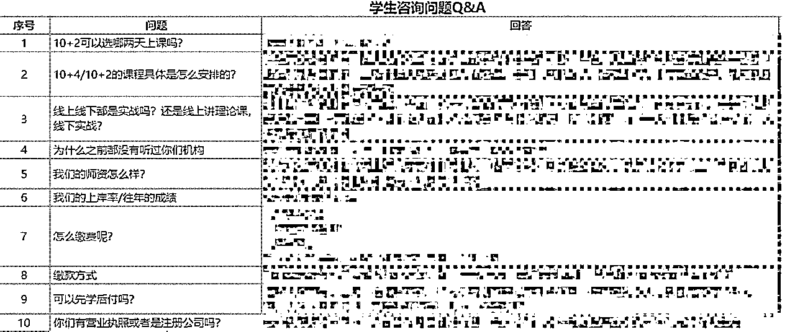

2）便于直接了解常见问题，避免流失不好意思开口担心被强制消费的用户

3）提高回复时效性

 

 

 

 

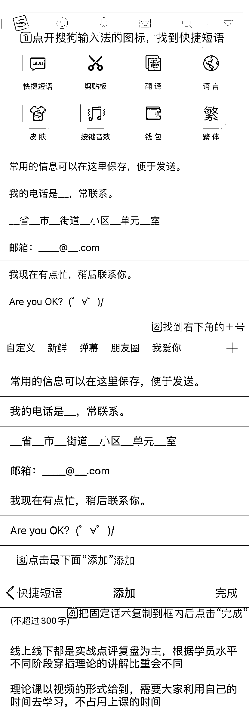

 

 

一次培训少则几千多则上万，很多考生应届毕业，怕花出去的钱打水漂，对老师的教学水平存疑是非常正常的。

出于这部分考量，我们把线上课程的前15min做成了试听版，还准备了一个实战点评的音频，以便考生了解老师的专业水平。

听完试听课会有两种结果，无非就是成交和没有成交，针对听完之后依然没有成交的用户，我们会在发送试听课的3天后，询问用户还存在的其他疑虑，并作针对性回复：

1）线下课程时间无法配合：少量异地用户在职，这部分问题无法协调

2）对价格存在纠结：告知用户拼单优惠的策略，只要2人成团能各自优惠的比例，这个动作让一半以上对价格敏感的用户得到转化，同时为我们带来更多成交

3）对教学水平不满意：询问觉得有待提高的方面，有则改之无则加勉，虽无法成交，但依然要体现服务的专业性

4）对课程效果和个人学习没有信心：客观分析课程所能覆盖到的对考生的利好以及在备考方面的局限性，同时指出考生心态的偏差，并不是报了班一定能上岸，更多还是教和学的互相促进试听后的结果回访很重要

# **2.2.2.**体现老师专业性

 

 

1）从可能流失的客户，根据疑虑针对性回复，进一步转化

2）了解流失的原因，是否有可能在之后的产品中迭代

3）让用户感受到完整的服务，这次没有成交，或许还有下一次

引流到微信的用户有两种，一种是只在社群的，一种是加了客服微信的

1）对于只在社群的用户，我们会群公告告知大家拼单的时间限制，并且在社群内发起接龙，有意向报名的考生可以在群内进行接龙，两两成团享受拼单优惠。

免去一部分考生要自己额外找人拼单的麻烦，同时在群内营造多人报名的氛围，带动一些原本只是有想法但是还犹豫的用户下最终决策

2）对于没有在社群的用户，会一一询问，了解用户是否已经报了其他的机构，没有报考的是否有报考我们机构的意向，有意向的用户告知限时优惠的政策，需要再考虑的用户进行备注3）在开班前几天，再对之前考虑成交的用户进行回访，告知目前仅剩余的名额数，增加决策紧迫性

虽然在促单过程中有一定销售技巧的成分，但面对用户的答疑我们始终是秉持客观真诚的原则。

比如有的学员会说自己基础很差觉得报班也没有希望，有的学员对我们师资不了解会多从各种维度质疑，这些都很正常，比起毫无波澜，有碰撞才会有火花，才会有故事。

# **2.2.3.**群接龙拼团，限时促单

# **2.2.4.**真诚解答，客观回应

 

 

从引流到转化的过程中，我们不会以成交为最终目的。

对于基础不好的考生或是完全没有接触过无领导面试的小白，都会如实告知，培训能达成的作用，辅助提供其他已选择我们机构的学员对我们的反馈。

面对想要速成的学员，我们也会选择劝退，一是对对方负责，降低期待；二是对口碑和上岸率的保证。

我们对市场上能找到的机构/个人开的班型和价格做了收集，从而制定性价比更高的班型**#** **3.**提供何种差异化服务

# **3.1**制定班型和价格

 

 

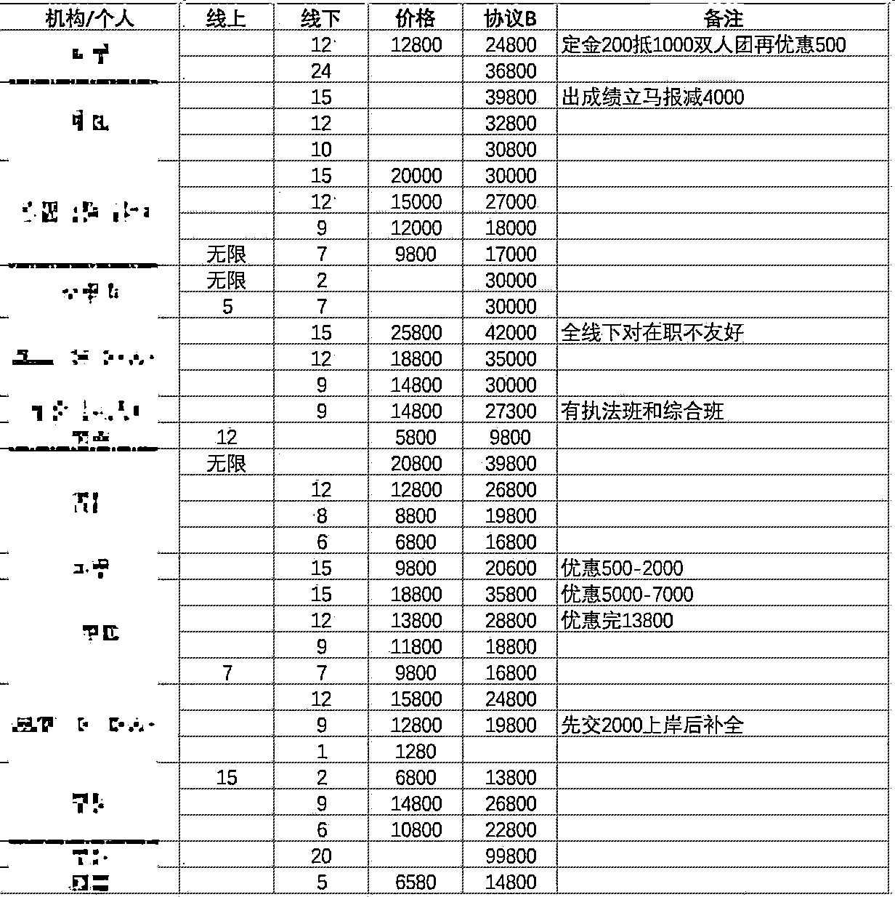

# **3.2**理论课的打磨过程

 

 

无领导面试发展的时间不长，线上课程的内容都是大同小异。我们有相关的知识，为了构成体系，就购买了几家头部机构的课程，对整体框架有了概念

一些线上平台售卖的渠道，我们会去看一下学员对课程的评价，了解这门课程在学员的角度有什么优势和劣势，简单来说就是取其精华弃其糟粕，应用到我们自己的线上课

很多机构的线上课内容冗长，配套的素材动辄几百个话题，十几万字，学员根本看不完。

考公学员的时间其实是非常宝贵的，因为从出面试公告到真正面试之间的周期不长，如何能把知识点嚼碎了喂到嘴里，对他们才是至关重要的。

# **3.2.1.**购买口碑较好的机构课程，拆解课程框架

# **3.2.2.**调研其他考生对机构课程的评价

# **3.2.3.**提炼关键内容，做减法

 

 

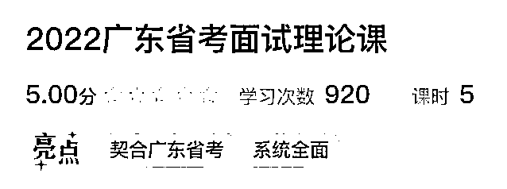

我们开发的线上理论课共5节，1节课的时间不超过1.5小时，总时长比市面上大部分课程减少了至少三分之一。

配套的话题素材，精简到30个必考的话题，每个话题用固定的结构是什么-为什么-怎么做引导学员进行理解，同时每个案例素材缩短到1-2句话概括，方便学员记忆素材。

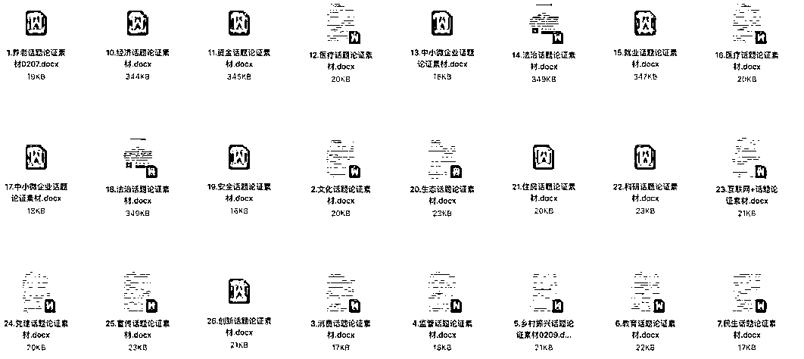

 

 

1）正式开班之前，会在社群有个开营仪式，介绍每个老师的分工和职责，同时会有一个摸底2）在群里给大家分享考场上可以使用的常用话术，节省考生额外整理的时间

3）阶段性私聊学员对线上理论课和实战点评课的教学反馈，对于基础差的学员，提供更多针对性的指导建议

4）无论线上还是线下实战，所有老师的手写记录和课程音频整理成资料打包发送5）线下课的午间，会给大家准备水果，下午上课会比较困，提提神

6）考前提供基本的考场礼仪和着装建议，日常给予心灵按摩

7）考后私聊每个学员成绩，以及对机构服务的建议和意见

# **3.3**其他配套服务

 

 

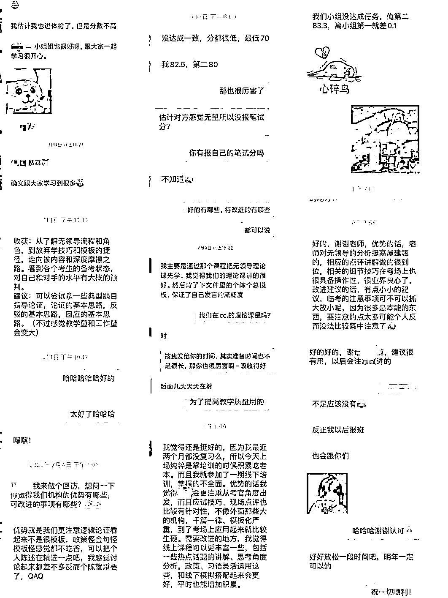

 

 

上述服务，帮我们赢得了很多学员的正向反馈，而这些反馈也为我们今年的宣传提供了很多素材第一次做这样的项目，要说一帆风顺是不可能的，在转化和教学的过程中也遇到了一些问题，比如：

1.班型和学员的个人意愿匹配度存在差异（纯线下时间太短、地点不合适、时间不匹配、长班已报满etc.）

2.对机构了解不全面，师资教学等没有信心（试听回访后没有进一步动作）

3.协议班的费用想要分期付款或者先学后付

4.宣传准备时间较短，一些内容渠道比如：小红书，没有覆盖到

……

上面的这些问题，在这次项目中我们没有很好地解决，造成了部分咨询的流失，也为我们今年提供了努力的方向。

# **#** 【项目过程中遇到的困难】

 

 

梳理整个项目过程，除开上述重要部分的拆解，下面的是一些个人的体会：

1.如果想找合伙人，把理想合伙人的条件都写下来，再去招募，这样会让你的思路更清晰；

2.如果想做一个自己的产品，可以先去体验别人的产品，并且在别人的痛点做切入，会相对更加容易；

3.引流，并不一定要去流量很大的地方，重要的是触达的用户足够精准；

4.服务，很多打动人的就是一些别人没有关注到的细节，而这些细节能帮你赢得口碑，获得转介绍；

5.入场的时机很重要，很多事情都无法等到全都准备好才开始，只能一边做一边迭代，才有可能抢到先机，赚到钱。

……

最后要感谢 @梁靠谱  的鼓励和支持，提供了很多宝贵的建议，同时在醒谱大队得到了很多意想不到的惊喜和收获～也感谢带我进入生财有术的 @走心小姐  让我在生财这个平台、在各种帖子中获得了很多想法。

# **#** 【这次项目的一些心得】

 

 

以上就是我们2022年跑通考公项目的实操过程，希望能对大家有用。想要在考公这块深耕或是合作的圈友，欢迎多交流。

评论区：

亦仁 : 感谢分享，已加精华。

亦仁 : 和我当年做考研资料的玩法几乎一致

阿黎 : 执行力强，想到能做到[强]

走心小姐 : 真棒！

亚马逊森林 : 厉害了，不过有个疑问，师资力量是招募过来的吗

卓卓子是我🎈 : 招募＋自身条件

李雪 : 话说  你们老师是怎么搞到的呀

骏马 : 老师是怎么解决的呀？

作者：  雨林

日期：2023-03-24

哈喽大家好，我是生财圈友雨林。

这是我的第一篇文章，写这篇目的呢有2点。

# 【直播流量】**1**篇

# **#** **(**精华帖**)(117**赞**)**拆解下我是如何通过快手无人直播

# **+** 知识付费 **+** 私域月入 **3w+**

 

 

1：感谢生财的优质文章，这里就像定向推送商业创业内容的抖音。一进来就有看不完的干货，出都出不去。使我的认知及见识得到了许多提升。其次呢，做这个项目也是在生财的风向标里面给我的灵感。所以，我理应为生财做出一点贡献。毕竟写这篇文章还是有许多思想斗争的，可能会导致我的赛道加剧内卷。

2：输入后不输出，知识其实不属于你，它只会在你的大脑里面稍纵即逝。所以就拿这个我有点成绩的项目当做我的第一篇文章，以后也会多写文章，保持思考，持续进步。

# 一：先分享一下这半年我的快手无人直播的成

# 果（**10**月份开始做）

全网粉丝60w+，变现20w+（直播收益16w+私域收益4w）

以下是其中3个账号

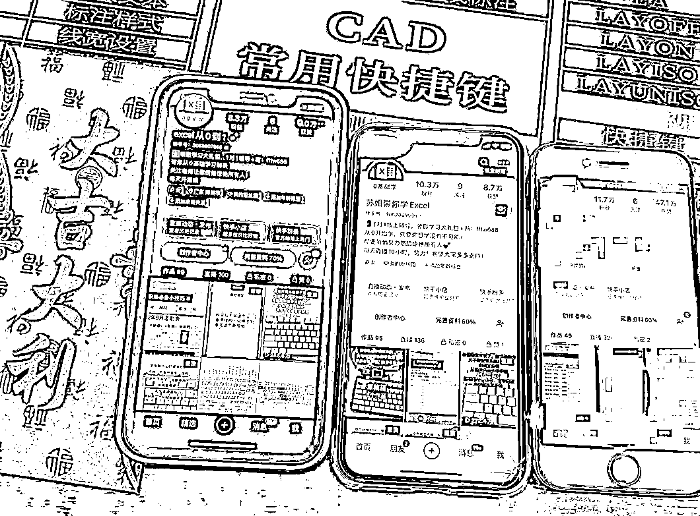

 

 

内容有点长，请移步飞书：https://sq065yn6aoy.feishu.cn/docx/KpMRdNVS1olPpoxAvZjcZJ0znRc评论区：

Tango_lo : 细分领域出人才

不困 : 厉害啊，新的思路！

结合一下又是新的方向🧭

我也是从10月份开始做快手无人直播，我运气比较好，勉勉强强活了下来

雨林 : [握手][握手][握手]一起进步

lydia : 咱20w的营收是三个号一起的收益吗

雨林 : 6个

lydia : 感谢！搞无人直播对设备是什么要求？一个帐号一台电脑么？

雨林 : 我买了个1000多专门多开的可以挂4-5台，普通的电脑应该可以挂2个  蛋蛋。 : 学习到了，看到了一个中老年人的市场

作者：  峻昌小叔儿

日期：2023-04-05

# 【视频引流】**1**篇

# 【进阶玩法】**1**篇

# **#** **(**精华帖**)(51**赞**)**我如何从一个月销 **200wGMV** 的知识

# 博主半年转型成为月销 **500wGMV** 的带货达人

 

 

#抖音

在生财整整潜水了一年，决定发一次贴。（文章最后有直播带货的大坑，最少让我赔了五百万  ）。

大家好我是骏昌小叔儿，以前在互联网上的名字是申老板，当年与现在的海参个当时是同一时期产物，但是没干过他，然后转向短视频孵化ip与直播带货运营ip等等

在接下来的半小时里我会跟大家深度地去剖析我如何从一个月销200wGMV的知识博主半年转型成为月销500wGMV的带货达人，并且创立电商公司每月总营收超3000w。目前又把一百多人的团队解散，准备重新塑造，主打重新开始。

为什么转型、如何转型、踩了多少坑、交了多少学费、有哪些经验心得……在今天跟大家好好分享下，我希望也能够激发大家的思考和讨论。

我们先讲第一个话题，创业五年，作为一个知识博主，单月稳定GMV200万，为什么要转型电商带货？

第一个原因，选择做知识博主并不是一个商业上审慎的考量。

我之前一直是上市公司的管理岗位，也一直有一个创业梦，我希望能够赚更多的钱，纯粹是从我当下立刻就能变现的角度出发，我选择了卖我的时间，也就是去做咨询，从一个小时收500块，到演变成一个小时2000块钱，再到可以带一些大班课，一个小时5000块钱，再到我决定卖一些录播课，把我的时间去形成复利。

后来当我们一个月稳定变现大概60万的时候，我跟我当时的同事决定出来创业。起初18年开始做直播带货但是到了21年初我们的创业时机刚刚好赶上了抖音知识付费爆发，也就是在2021年的时间，我们在抖音从零起号把我们的四个合伙人的账号都做到了20左右粉丝的量级，我也很快达到了单月稳定GMV200w+。

做了两年，我发现了一个很可怕的事实，从20年到21年到22年，每一年我们的营收都在200%以上增长，但是我们的利润并没有显著增加，反而人越来越累。在我发现我们做的很累的时候，我就去看我们的同行。结果更可怕的事情发生了，我发现我们已经是在赛道里面很少的在赚钱的公司，我的同行都比我们更累，甚至烧着投资人的钱，到现在都从来没有实现过盈利。我发现这个赛道很奇怪，好像没有人在这个里面能轻轻松松的赚钱。

 

 

这件事儿同步在启发我。在21年的时候我们孵化了一个账号，他当时想做一个玩具类目赛道的拆箱ip，但是在我们给他起号的过程中，我们发现用户的诉求——看着好的产品就想要的到。所以我们直接给他定位他的为带货达人，主带高端玩具定向高消费男士人群，后期我们引入了一些非常好的供应链给他之后，他的账号越做越好。在21年刚起步的时候，年底他开始带货，一场可能三万gmv，然后一个月他可能播20场，一个月就60万，当时谁都没有在意他的量级。可是到了22年他反而像滚雪球一样，在618的时候当日直接做到了几十万，到了双11的时候当日甚至做到了百万级！而他越做越轻松，在到单月千万级的时候他的团队只有5个人，而我们公司月销300万的时候已经有了接近50个人。为什么会有这种差异？知识博主和带货达人的商业模式有什么区别？

我不断问自己这两个问题，发现了三个关键点。

第一，复购！

只要不是k12，知识付费的复购率都是很低的，尤其是像我们这样的成人教育，整体不超过20%。

这注定了我们想增长必须要去抢流量，而流量越来越贵新人越来越少，赛道越做越卷。电商带货如果选对赛道，比如高端产品，复购率可以做到70%以上，用户只要相信了博主，拿到产品吃了或用的有结果，他会持续在这购物，甚至会在你这锁死一辈子。

第二，可复制！

知识付费公司增长最难的就是IP的不可复制性。往往一个公司就是围绕1-2个IP的个体户，再想复制发展特别难，因为用户买的就是你这个人，对人的信任的建立是需要漫长的时间。当这个IP不在，用户就不买单了。可是电商更多的是货，你的货足够好，人就没那么重要。我们孵化的这个带货博主双十一的时候一天播了16个小时，他自己播了8小时，另外8小时都是副播完成的。培养一个带货主播上手只需要一个月，但培养一个知识博主至少要半年。这种可复制性的差异决定了公司天花板的上限。

第三，团队配置！

我的朋友他双11做到单日百万时，他的团队只有5个人（1负责人+2跟播+1私域+1剪辑），而当我们知识付费做到全年3000+万量级的时候，我们的团队已经70我相信所有的老板都明白，团队人多不仅代表着你的业务重，代表着你的支出高，同时代表着你的风险更大。换句话说，我这个朋友如果这月想休息，只要付5个人的工资，而我们要付50个人的，自己真的变成了生产队的驴。

这张表格是我整理出的电商和知识付费在这三点上的差异化

这三个原因让我21年末毅然决然带着全公司转型。

接下来分享的内容就非常的实操了，这半年我们做了哪些事情，让团队可以达成这种超高幅度的增长，让我一个完全的新人进入电商带货赛道，可以能够稳定的月销500w+？

 

 

【第一点，我觉得最重要、也是新手最容易犯的错，就是选品。】

在我转型带货的时候，其实我看过蛮多的账号，都在尝试转型带货，但他们都犯了一个最大的问题，就是他以为的带货是他自己见过的带货——找一些销量高的品，看起来好卖的，先卖起来把人攒起来再说。然后你上了一堆9.9、29.9、99，辛辛苦苦卖了好几天也没卖出去几千块钱。

错在哪儿了？我们经常刷到明星带货直播间，明星在上面扭一扭说9块9，然后直播间10w+，然后销量刷的特别疯，一场一天可能带个几千万几个亿，不都是这样带的吗？

但是那不是我们普通人可以选择的带货，目前的带货已经进入了后半场，如果你这个人不是自带流量，你不是张柏芝，你根本不要想这种9块9带货的方式，这种方式必须是强流量支撑，加上你的直播间非常的热闹才能够满足。

而我们普通人能选择的一定要是那些明星直播间卖不了的货或他不愿意卖的货。抖音就像是一个大的游乐场，这个游乐场里面有很多摊位，最中间几个大舞台里面卖大众的东西，而你如果想在这个游乐场竞争，你要到旁边去开一家精品店，从这个集市里面分流出的人群，他有付费能力的，对这个感兴趣的，他会走进你的精品店，在这里买你的东西。所以给大家的第一个经验：放弃低价品，选品永远只选三高类型的产品——高客单！高口碑！高复购！第一个选品原则就是——高客单！如果你想开一家精品店，精品店要在游乐场活下去，你必须锁定一群有高付费能力的人！什么是高客单？平均客单价3000以上，GPM做到1万以上，也就是抖音给你推进来1000个人，他们要至少完成1万块钱的销售额。

很多人就会说这种品怎么卖？这种品根本卖不动。你太小看抖音了，我们有很多人都在抖音消费过几千元客单价的产品，抖音覆盖了一半的中国人，有消费能力的人一点都不少，而当你一个人收3000块钱，你今天晚上能收30个人的钱，你是不是直接就有了9万的GMV，你一个月是不是就接近300万了。而这种高客单我们可以想象到底哪种类型的产品？比如说保健品、电子产品、首饰以及高端女装，或者精品家居家具等等，这种店才是真正的闷声发大财。又会有人问，那我一开始卖贵的卖不出去，我能不能先卖9.9积累点人气再卖高客单？绝对不可以！因为抖音直播间是基于标签的推荐，你卖便宜的，来的就是买便宜货的，你卖贵的，才能推进来真正有消费能力的。所以最开始就要高客单起号。第二个选品原则就是——高口碑！很多主播我们看着他起来，又看着他塌房。原因都是因为他不爱惜自己的羽毛，把用户当韭菜。都是卖保健品，都宣称抗衰，但是有的产品它根本做不到，有的产品你吃完真的能抗衰，很多主播自己都不懂，哎呀看哪个品牌方对我热情一点，哪个佣金高一点我就选哪个。结果你发现你带的差的产品，它可能第一波让你赚到了钱，然后接下来就没有任何的水花，甚至你的口碑分会被直接拉低，导致你一波一波的用户对你失去信任，所以高口碑这件事情它跟前面一个高客单是衔接的，当你做高客单生 

 

意，你必须要有对这个行业的专家认知，这是大家一定要培养的。如果我今天去卖个可乐，我卖可乐我不需要认知，因为可乐就是可乐。但当我今天卖3000块钱的保健品，我需要极强的认知，3000块的保健品它必须得有用，要不然用户买完骂你，你觉得你的号还能做多久？所以我们是跟供应链深度合作，这里面也有一些机缘巧合，就是得到了非常多业内信息，我们直接深度绑定了一个品牌，这个品牌也是在后来给他做了完整的店铺自播，不仅做达播，帮他把自播去起盘。一句话，什么叫高口碑？就是主播千万不要想赚快钱，这个东西我觉得差不多，我试了两天我就上了。第三个选品原则就是——高复购！这个也是三高里面最有难度一点。所以为什么很多人带货会感觉很难，第一步就在选品这上面踩了大坑，大家都可以用三高原则去审视一下自己的货盘——高客单、高口碑、高复购能不能做到？如果你能做到，那你一定可以把你的直播做起来，只要你不傻，只要你的团队不傻，我觉得我们团队能够做得很顺利的原因，不是因为我们的直播能力有多强，其实就是因为在选品这一块，我PK掉了99.99%的人，我们直接选中了保健品赛道，并且是高端保健品，并且是抗衰类保健品，并且是真正有用的抗衰类保健品。你选择了一条难的路，越走越简单，如果你选择一条简单的路，你越走越难。最后强调一下，好的选品是成功的一半，千万不要贸然转型，不选好品永远不要转。

【选品之后的第二个经验——专家人设的塑造。】

选品跟达人人设它形成一种天然的联系，当你选到了三高产品，你这个主播他就一定是专家型的人设！这也是知识博主转型的一个优势，知识博主天然就是要专家，你空气都能卖出去，这么好的产品还能卖不出去吗？什么是好的专家人设？比如你卖保健品，你是营养学专家、院校博士、中医世家、健康达人，这都是极好的人设。如果没有这么专业怎么办？和赛道&品牌建立联系！

我转型到保健品赛道，本身也不是营养学专家，那我就直接说我是这个品牌在国内合作的运营公司老板，我跟这个品牌已经深度合作xx很多年，我全家人都在吃。这也是一种信任的背书。同理，你是某个品牌的推广大使/营销负责人，或者你是长期xx产品的重度爱好者，自己测评和尝试过xx种都是一种专家人设，总之，给用户一个相信你的理由。再举一个例子，我是一个英语老师，转型带货护肤品怎么立人设？  我在xx高校做了xx年的老师，因为自己的皮肤问题研究测评了xxx种护肤品，最终选择了xx这个产品，甚至小众品牌联系上并建立了合作，也帮助他们完成xx市场的推广。（举例子作为参考，以真实情况为准）知识博主的表达力是天生的优势，人设稍微到位一点，辅助专业知识的讲解，用户的信任会很快建立。当然在转型过程中要学习很多新行业的知识，我相信对知识博主来说不是难事。这里再补充一点，知识博主转型电商一定要把自己捯饬的精致一点！看起来像在用好东西的样子！很多知识博主特别朴素，但是咱们卖的是高客单价呀，你要看起来是真的用得起的才行。所以发型妆容衣服都要精心搭配下，看起来越低调的贵气越好。

 

 

【第三个，当你选品完成、人设定位完成了之后怎么做，那就是最关键的直播！我们应该怎么样去直播？】

这句话真的价值一百万：新人起号做好一个月都非常寂寞的准备，每天4小时直播只干一件事：

打标签！我们期待的直播间是一开播百人千人在线，互动极高，各种人进来刷礼物抢福袋，转化特别的顺畅。但是抖音99.99%的直播间，其实就只有10个人在线，甚至没有人提问，大部分电商直播间是非常寂寞的，我们要有这个心理准备。不要盲目追求在线人数，因为我们要的是能买三高产品的精准用户。我跟大家毫无保留的分享一下我们当时做电商的数据。我转电商是起了小号，利用私域宣传完成了一次启动，第一场直播是20万的gmv，而第二场就只有6万的gmv，因私域用户下单基本已经结束了。从第三场开始，我的每一晚直播都是1万的gmv左右，相当于这一整晚我可能只有三四个人在我这付款，我一整晚播三个小时，一个小时里可能连两个互动都没有，在线十几个人。就这样一直播每天播。而到了第二个月的时候，直接就可以单日做到大约3~5万的gmv，再到之后单日可以做到5~7万的，再到之后单日可以做到7~10万……甚至我在三八节现在做到了一个单场百万的量级。现在我的在线人数也就是50人而已，为什么能够做到这种稳定的增长？其实很简单，三高产品是高复购滚雪球的，最难其实是冷启动。所以第一个月要做的事情不是拉流量，而是耐住寂寞打上标签！什么叫打标签？你要让系统知道什么样的人喜欢你，你想吸引的是什么用户，年龄性别城市兴趣消费能力关注品牌这些都是标签。而抖音做的这么好也跟他深入的标签和匹配策略有很大的关系。但是新人开播你的在线很少，10个人在线，一场推流不到500人怎么打这个标签？教大家三招：福袋、画面、短视频。福袋是成本最低的做法。标签中的一个关键衡量要素是你直播间的评论互动，你的直播间是不是很多人在评论区提到了这个关键词，这个就是你直播间的标签。我们会发现婵妈妈的后台也会有这个数据，看你直播间的关键词。举例子，今天我们卖的产品叫做XX小熊，假设小熊是你主带的品牌关键词，你的福袋就可以设置“XX小熊真的太神奇了”或者“XX小熊真的太好吃了”“XX小熊真的太好用了”每一个用户进来点开福袋都帮你做了一遍标签。第二个就是你的画面一定要把产品进行突出！好的产品是自带流量的，当你在直播画面黄金位置展示的时候，对这个品牌感兴趣的人就会从广场点击进来。甚至你可以把进入语也加入品牌关键词，比如“XX小熊到货了，拼手速”，这就对人群进行了一道天然的筛选。第三个短视频，这点我们今天不展开了，简单来说不要啥都拍，拍点精准的和产品和人设有关的。初期短视频非常重要，内容越聚焦越好！给大家直接看我当时拍的选题。电商冷启动一定一个月的耐心，但是只要能把标签打上，稳定单日做到变现2-3w，后面就是日常优化迭代人货场就可以了。我们用这套框架冷启动目前100%的成功率。

最后再分享一个在实操方面，我非常有心得体会的，就是如何去搭建团队。

 

 

因为我们公司是知识付费转型电商，所以我们把知识付费的团队里面优秀的操盘手都优先调到了电商团队，而且他们都非常的开心，因为很多做知识付费做久了的运营，他发现你的公司依然没有更大增长空间的时候，他自己也会感觉到迷茫。而进了电商对他们来说又是一个全新的赛道，有更大的天花板，所以完全不用担心你这里会不会有很多人员的变动，优秀的人才，当你告诉他这个事情的发展前景，他是能跟上你的，而如果他看不见看不懂不听甚至不信任你，这种人也不是能够跟你并肩作战的你的新团队的战友。优秀知识付费的操盘手进入电商赛道也是降维打击，因为知识付费卖空气，本身就对用户敏感度、销转细节体系要求更高，他们进入短平快的电商不仅能够快速适应，还能够做的比一直在电商的还要好。那团队需要多少人呢？我们在转型过程中把20%的人调进电商团队，保留40%在原先知识付费团队，精简了40%的人。如果一个知识付费的博主月销300万，他基本上后端配置的人员至少是10~20个，因为它涉及到课程的制作，私域的运营，甚至私域的销转，课程非标的交付非常多，复杂的前前后后的人。但是电商博主非常的简单，如果你月销300万，你做的是我讲的这种三高赛道，你不需要直播间人数很高，你最少你只需要两个人就可以：一个人做你的中控运营，直播间的时候，帮你配合弹产品讲解，帮你配合直播间的气氛，给你发福袋，给你看数据，给你做场控。中控的核心画像是细致、聪明、数据能力强。第二个做用户运营，包括私域的引流，公域的回复，对vip用户的一对一触达。用户运营的核心画像是负责、耐心、学习能力强。电商带货是个很扁平的事情，老板供应链和直播全部都把握住，然后有优秀的人上来配合跟你干，没有优秀的人招基础的人能够帮你把活给你干仔细了就足够了，先有再优。

 

 

好了！再讲个我走多的大坑，当初我在杭州认为回到老家成本会降低，所以带着核心骨干回到县城租场地装修等等，到最后发现人才招不到，供应链远配合不默契，所以建议创业的人来说，想要创业就要背井离乡

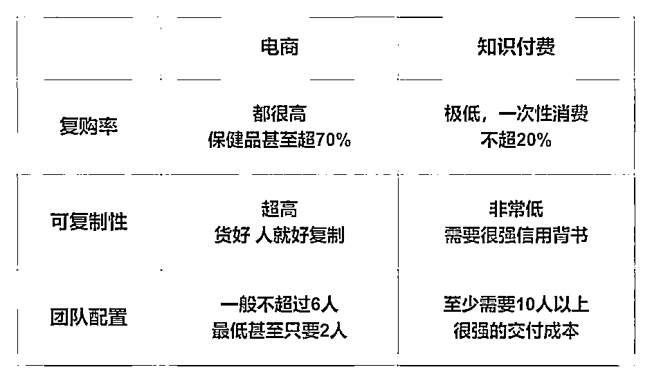

评论区：

亦仁 : 可以点击编辑排版分个段，现在阅读起来太累。

峻昌小叔儿 : 哈哈第一次没经验，马上改正

书情小跟班 : 文字密集恐惧症😳

峻昌小叔儿 : 第一次，尝试分享，也是第一次在星球上发，很多东西都不会…… 峻昌小叔儿 : [难过]第一次在星球上发帖，文字密集恐惧症的可以……

我会陆续改正

亦仁 : 排完版可以回复下我，我移动到主信息流

Jia : 学习了感谢

菜菜—-福鼎白茶批发* : 感谢大佬分享，学习[呲牙]

 

 

作者：  佳能

日期：2023-06-13

引流团队管理分享：如何做到小红书单月引流13000＋，全年变现1000万＋㊙大家好，我是佳能，生财潜水新人，谢无敌老师的关门弟子，目前在做线上教育类目，今天主要给大家分享一下我做小红书以及团队管理的一些经验。部分知识来自于谢无敌老师的实战营  。

先做个自我介绍，今年是我工作的第 6 年，这 6 年期间我打过杂，带过项目，当过运营主管，也自己创过业，目前是公司的合伙人。目前我和另一个朋友共同管理着15人的团队，通过0成本获客，我们在45 天内做了 100 多个账号，引流了 3 万多人到微信，单月变现80w+，全年变现1000w+。

我现在的岗位名称是全栈运营，或者叫全域运营，知乎、b站、公众号、微博、抖音都有做过，运营种类也很广，活动运营、产品运营、增长运营、内容运营和社群运营，也全都做过。

一、先聊实战，结果倒推

首先问大家 3 个问题：

你有没有制作流量热点地图？

你的矩阵号有没有进行分类？

流量爆了之后，成单率是不是也变高了？

大家可以带着这三个问题，再来看我接下来的分享：单月引流1w3，我做对了哪些事情？

1.抓住热点，提前2个月布局

我觉得不管开展什么业务，新业务也好，老业务也好，最好是赶紧去把全年的流量热点地图做出来。

比如大学四六级考试，永远是考前一个月流量最多。减肥类目，春天和夏天需求是最旺盛的，因为冬天大家都爱吃火锅，而且天气比较冷，不愿意动。

# 【技能进阶】**5**篇

# **#** **(**精华帖**)(370**赞**)**引流团队如何做到小红书单月引流

# **13000**＋，全年变现 **1000W**＋

 

 

再比如考研行业，它的热点是2月出分，3月国家线，这些就是自然热点，自然热点是什么意思？

就是平时可能默默无闻，突然在2月3月的时候，考研就炒上了微博热搜。而微博热搜是大家评判行业热点的一个标志，有了热点，就要提前2个月甚至 3 个月开始布局起号，热度一来马上就有流量了。

我的经验是，热度前的 2 个月是最忙的时候，等到热度一来只需要及时回私信，跟进爆款就好了。哪怕你这个行业没有明显的淡旺季，也一定要总结出来，这样你的工作才能有节奏。才能提前两个月布局，布局工作一定要做到位，而且要做准，如果做不准的话，来的流量一是没办法变现，二是流量不够。

2.矩阵做号，分类要到位

做流量矩阵，不能为了矩阵而矩阵，比如你做 10 个账号，不是说随随便便注册好了就直接发了，一定要有分类。

我们做流量是为了赚钱，赚钱就要从产品去倒推：产品的受众人群是谁？向往人群和势能人群分别是哪些？有什么样的特点？在哪些平台上？会看哪些内容？

举个例子，比如我的产品受众是 40 ~ 50 岁的男性，这些男性不太可能玩小红书，他们玩手机一般会看一些国家大事，爱用的平台可能就是头条和抖音，他们会把头条当搜索引擎来用。

刚好头条是文字类，抖音是视频类，这两个平台直接把我们输出的内容分类好了，我们可以以此为方向去做矩阵号。

做矩阵号的话一定要对账号进行分类，无敌在实战营课里也有讲到过，账号要从咨询类、晒单类、官方类、 IP 类，还有行业细分类去做。

①晒单类

最左边的这个就是晒单号，这个账号也是无敌老师在实战营群里分享的，你看一个蛋糕才1000，但是花了 2000 配送，激起了好奇心，就很想点进来，对吧？

晒单号就是直接把和用户的聊天截图，发到公域平台上，因为人都有偷窥欲，在这个过程中，让用户的嘴夸你的产品：这个蛋糕虽然只要1100，但是它值 2000 的配送。

那用户就会想到两点：1 这个用户怎么这么有钱，是不是冤大种；2 我想看一下这个蛋糕长什么样。

②咨询类

第二张图：运营小白必看 16 个书籍，这个就是资讯类的账号，这个不用多讲，我觉得大家应该都知道，其实就是合集类。

 

 

③官方类

第三张图为官方号，如果大家做个人 IP 的话，我觉得没必要做官方类，但如果是在公司里面做账号的话，有一个比没有好，不过官方号是要认证的。

④ IP 类

第四张：xx学姐，个人 IP 很强。个人和机构号相比的话，肯定是个人的吸引力会更强一些，我们去小红书看内容，更多也都是看个人IP。

⑤  垂直细分类

第五张图，是我找的一个穿搭博主，她身高165体重 59 公斤，分享的内容都是针对她这个身高体重的，那么同样体型的用户就可以参考她的穿搭。

大家也一定要去思考，怎么去做你自己行业里面的细分赛道。我的个人经验是：个人 IP 号和行业细分号是很香的，反而资讯类的不太香。 IP 类和晒单类，更多属于一种品宣，可能平时私信流量很少，但是一来一个准，所以不同账号带来的结果是不一样的。

所以，你要去思考每个月的 KPI 是什么？你想要涨粉？还是想要引流？根据你的需求去做对应的账号，每个账号大概做多少个，矩阵就出来了。

不同类型的账号成交率和用户信任度也不一样，具体哪个效果好，需要从用户角度去测试，其实我们是一个需求供应方，而不是给用户创造需求。

其实矩阵的意义和赛马机制是异曲同工的，东边不亮西边亮，如果我们能把每个平台、每个类型的账号都能运营好，当然是最完美的，但是做到二八定律也很好，把握好最重要的20% 的账号就能得到 80% 的结果。

3.一定要从产品出发，不要掉进流量陷阱

这张图不知道大家有没有看过，我们可以把产品分为四大类：引流品、裂变品、利润品和价值品。

我以在线教育为例，给大家详细说一下每个品的特点。

①引流品

大概是 0 到 49 元的区间，它没有信任感，用户只需要出一笔很少的钱，就能体验你的课程和服务，如果不好的话，用户亏的也是很少的一笔钱。

比如K12 经常有那种 9.9元的课程，他会投入很多精力，为什么？因为他不是赚你 9 块9，他是通过 9 块 9 的课程让你去续费他 349 的课程。

 

 

②裂变品

价格区间在 50- 200 元，它有一定的信任感，但是信任感一般。用户和机构或老师建立了一个基本的信任，用户有意愿把你的课程推荐给其他人的，而且价格不会特别贵，方便用户的好友能够快速做决策。

如果加入分销机制，比如说 3 人拼团多少钱，那用户的推荐意愿会更强，再加上实时到账，用户对机构会更有信任感。

③利润品

利润品就是 200 到500，或者说是 500 到 1000 元，比如 999 元，利润品就是你能挣到一部分钱了，而且用户和老师建立了高信任感，愿意在你这里消费。

机构应该把重点工作放在这部分用户运营上，不断提升复购率，让这波用户能够再提升一个档次到闭环品上。

④闭环品

也叫价值品，它的客单价在 1000 元以上，是超高信任感，用户和老师之间建立了强绑定的关系，不管是利益上还是情感上。

此时的用户不仅是你的用户，更是一个渠道，它能帮你源源不断的带来高净值的用户，他就是你的口碑。

我们做运营，做流量，肯定是为了把产品卖出来，那在设计产品的时候一定要把每一块都给做好，你可能这 4 块做不全，但是最起码也要有利润品和闭环品，或者说能让你赚钱的必须要有。

前期可以加一个引流品，我建议百元以下，或者是 10 元以下，筛选愿意在你这儿付费的用户，哪怕掏 1 块钱也比直接过来白嫖要好很多，要香很多。

做运营一定要学会算账。比如说你要赚到 10 万元，或者你公司这个月业绩指标是多少万，那你首先要测算成本，其次要拆解到各类产品，流量品、引流品、利润品，每个品大概要卖出多少，才能达到业绩指标？算成单转化率，再根据转化率去算要加到多少线索，就是一个倒推。

不管做什么都是倒推，从结果倒推我们现在要做的动作，而不是说我有 10 个账号，我这 10 个账号能带来多少流量？转化率多少？我能赚多少钱？并不是这样的，是我要赚到多少钱，倒推出我要做什么样的动作，这个思维一定要转换过来。

4、私域高客单的转化

①SOP 话术一定要设计好

 

 

用户的疑问点可能也就 10 个、 20 个，通过沟通，了解用户需求和可承受产品的价格区间，然后给用户打标签，后续维护起来，就能更好地切中用户痛点。

高客单的产品一定是需要时间来养的，不可能加了马上成单，所以说转化路径的设计是很重要的。

②意向人群的锁定

我引了1万 3 的用户，成单大概是 80 多个，剩下的 12920 可能都不是我的意向用户。但是我能保证这 13000 都是我这个业务的，就是考研的学生，但不能保证这些都是能消费的起我的产品的学生。

所以说用户分层很重要，能够极大的节省时间，针对不同层级的用户去推荐不同层级的产品。

③做好长期维护和服务的准备

我觉得 5000 以上就算是高客单价，一定要沉下心来做长期维护。像我这边1万以上的产品，成单时间最短转化周期都是一个月，一般是 1- 3 个月。

④人设

人设就等于信任，你的朋友圈，你的头像，你的签名，还有你的社群维护，这些细节都是很重要的。

我建议大家坚持发 5 条朋友圈，时间要定好，分类要定好。朋友圈配图一定要考究一些，一张好的宣传图，是用户没有点开放大时，就清晰的知道大概有哪些东西，然后被吸引进来。

其实跟咱们小红书封面设计是一个道理，你打开小红书，信息流一个页面是 4 篇笔记，你怎么做到在这四篇笔记里，让用户点到你的笔记里，而不是其他人的笔记。

要把这个思考点也用到你的朋友圈里，因为朋友圈也是一个信息流。

二、再聊管理，承上启下

接下来是团队管理这块，它其实是一个承上启下的动作。我觉得我们在座的每个人，多多少少会涉及到管理这方面，因为不管在公司上班还是自己创业，你不可能一直是一个人。

关于团队管理，也是先问大家几个问题，然后我们再来聊团队管理sop。

你觉得管理最重要的工作是什么，人or事？

从月度、周度、日度来看，管理sop如何制定？

工作流、业务流、绩效、培训是否都定好？

1、会不会做

 

 

①工作流

从早上 9 点上班到晚上 6 点下班，具体的工作安排。工作安排最好以半个小时为单位去规划，上图是我们公司内部的一些工作流。

因为我们的引流路径已经跑通了，所以没必要按照半小时去卡点，但是新业务或新创建的团队，最好以半小时为单位去规划。

②业务流：

相当于咱们星球以及实战营的课程，教给大家平台规则、发文要求、爆文技巧，以及引流方法这些硬核技能知识。

我每周都会带着部门 20 多个人去听课，听完课我要求每个人都输出手写的笔记和思考，这里就涉及到了培训。

③培训

培训又分为四块：

1  部门内部的业务能力培训，比如我让他们听课，听完课后运用到日常工作，提高工作效能。

2  外部的跨部门协作培训，比如职场上你怎么沟通，怎么说话。

3  公司层面的培训，你要对这个企业有一定的认同感，而不是说和公司是对立的。

4  职场技能层面的培训，比如职业礼仪、职业素养等。

这样从各个方向把员工的素质打造起来，他就不是一个单纯的引流工具人。我们做矩阵账号，不管用的兼职还是全职，它都是一个可复制的岗位。但我还是希望成员能在工作中找到一些意义，学到一些东西，而不只是简单的工具人，在这个过程中他能知道自己的不足，也知道该往哪个方向去弥补自己的缺陷。

④学习氛围

运营岗位一定要不断输入，比如说我们加入无敌的星球，是因为对知识有一定的渴望，这种品质我们要去影响给团队其他成员。这里要注意一点，就是培训之后一定要有考核或者审查。

记住一句话：员工只会做你检查的事，不会做你安排的事。

就跟学生做作业一样，你不规定明天要交，他今天肯定不做，但你说明天要交，而且还有打分制，达不到几十分，就会怎么样？他就会更上心。

培训也一样，一定要让员工自己去思考如何优化手上的工作，不能为了培训而培训。

2、如何自主做

 

 

①要设置有增长空间的薪酬绩效

包括可量化的、不可量化的、关键指标、绩效考核等。

绩效这块，我是按照可量化的发文量和爆文量，达到多少才可以拿到对应的爆文提成。

除此之外还要有个浮动奖励，比如我这个月给他定的目标是一个月引流 2000 个，如果做到 2500 或者3000，我会额外给一笔钱。你要刺激他不断地做更多，而不是说拿个底薪就 OK 了。

在做绩效的时候，建议大家用阶梯去奖励。比如说你单月引流 1000 以下是 5 毛钱一个， 1000 以上是 1 块钱一个，阶梯标准具体定多少，要根据大家的Roi去定.

②月度和年度的奖项设置

针对可复制的工种，也就是专注引流的员工，建议做短期奖励，也就是月度奖励。

对于比较出色的员工，那种不可复制、很牛逼的，你想留住他，就要做年度奖励，比如说年终奖或者 13 薪，或者你跟他做项目合伙，项目分红，但千万不要直接提拔成公司合伙人，项目合伙就可以了，要一点一点去满足。

③打造互帮互助的氛围

我会在开早会的时候，把昨天的引流数公之于众，做得好的点名表扬，让大家鼓掌，然后让他分享一下经验，整理成文字，发到运营群，把引流效果好的笔记链接也直接发到群里，供大家参考。

做得好的一定要当众表扬，做得不好我觉得没必要当众批评，但是要一对一的批评。

3、如何有效地做

其实就是工作计划、工作执行和工作总结复盘。

目的是确保工作的饱和度，月度、周度、日度都需要盘点，工作饱和度这块，我觉得大家可以自己去测试一下。

我们自己的运营团队，有的负责 5 个小红书账号，有的负责 10 个，我是根据不同的账号种类以及素材量去敲定的。

负责 5 个的，就是精细化运营，内容可能偏干货一些。负责 10 个的就是追热点。

还有一点要注意，就是小红书做得越久，你的速度会越快。

所以工作流这块，我建议半个月更新一次，如果你精力 OK 的话，一周更一次都是可以的。如果你不更新你的工作流，员工的划水时间就会越来越长，工作效率就会越来越低。

 

 

除非他特别聪明，会在工作中不停地思考如何做爆款，如何把流量给做起来，但是这样的人 10 个里面可能只有一个，甚至一个都没有。所以我们把底线给定好，至于能不能往上走，就要看能不能找到这种人。

4、如何落地

首先是数据分析，不同平台、不同账号、不同内容、用户意向度这些都要分析，因为我不是只做小红书，我还做抖音、公众号、知乎、微博，包括我现在也在布局 b 站。

要根据结果去投入人力、成本、精力，带领每一个运营梳理工作流和饱和度，明确好引流的有效方法。

然后整理培训资料，制定好月度、周度、日度的培训计划。并且每天都要汇总工作完成情况，通过结果去抽查过程，也就是说通过引流数据去抽检账号，引流数据做不起来，要么是账号的问题，要么是人的问题。

我们上周发现一个运营数据特别差，每天只引 4 、5 个，跟他聊了聊，问他是怎么做的，他说直接抄对标账号。问他抄的哪几篇？他说就是 12345 这几篇，再一看他抄的那些都是点赞连 10 个都没有的。

所以，员工在做的过程中，他接收的信息可能和我们传达时是有偏差的。通过抽检动作去审查他的工作过程和思路是很重要的。

可能他觉得按照你的想法去做了，但没做出来，就是账号的问题，但事实是吗？并不是。然后你还去怪他：我给你培训这么久，在你身上花了这么长时间，你没做出结果来，为什么其他人可以，你不可以？

所以这个中间是有误差的，遇到问题不应该先去问责，而应该去解决问题。

5、管理原则：向内找

在开展项目前，或者每月初，一定要定好规则，定好打法，然后赏罚分明，通过数据去抓过程。

结果做不出来，过程肯定是有问题的。

我们做小红书时，怎么去看过程呢？按照三驾马车的原则。

三驾马车是什么？选题，主图还有标题。

把员工按照会不会做和想不想做分类一下，如果会做想做，但我们的支持没到位，就是说没有给到培训，那么作为管理，肯定要反省自己的问题，如果他不会做不想做，就涉及到态度层面的问题，需要一律优化掉。

 

 

大家看这个四象限图，有才有德的员工就是右上角的明星，他是团队的榜样。对待明星的核心态度是捧，物质上要慷慨，精神上要表扬，

那有才无德的员工是什么？是野狗，就是左上角的，对于野狗的话要限制地用，甚至消灭掉。如果这个人不能为你所用，那他到底还是不是人才，是需要打一个问号的。

第三个是能力差一点，但是任劳任怨的员工，叫老黄牛，老黄牛可以放心用，但是黄牛容易随风倒。如果你公司或者团队明星比较多，那他就会学明星，如果野狗比较多，他就会学野狗。

第四个是无才有德，无才有德就是右下角小白兔，小白兔态度很好，但是业绩不好，我觉得可以多培训，但如果变成常年的老白兔，就一定要清理，否则公司就是白兔成窝，人效会很低很低。

一句话总结：捧明星，消灭野狗，清理老白兔，放心用黄牛。

还有一点，管理团队时，其实是可以适度放养的，只要确保培训到位，必要的部门协同支持到位，工作饱和度也能安排到位。那就用结果说话，你做的越好就越自由，干涉得越少。

三、TO: 0- 3 年的运营人

也是三个问题：

你了解自己吗？

你了解运营吗？

行业变动下，如何建立自己的护城河？

1、你的优势是什么

这个跟咱们做小红书账号选赛道是一样的，可以通过测试，比如霍兰德、MBTI测试，或者通过身边的朋友、领导、同事的评价，他们觉得你的优势是什么？你的缺点是什么？

也可以从你自己的一些高光时刻、记忆最深的、最有突破的事件中，多个方向去考虑，千万不要只从一个方向去看自己，尤其是上面的测试，比如你现在是INTJ型，但它只是你的一个阶段，不同阶段你要重新去测试，它不是定死的。

认识自己，是为了取长补短，而不是单纯的扬长避短。大家一定要注意是取和补，而不是扬和避。

我觉得短板还是要补的，因为我们作为运营，你不是单纯只做运营这个工种，你要知道产品是什么，你甚至要学会研发产品，你要知道销售如何转化的，这样你在做流量的时候，才能切中用户痛点，我希望大家多方位去发散，把自己的优势去扩大，或者说把自己的短板给补齐，至少作为运营是这样。

 

 

2、从0-1的“秘诀”

①流量意识

我觉得流量是一个公司的根，你连用户都没有，你怎么成单，做运营不能只服于内容，品宣工作固然重要，但是光有口碑没有用户的话，我们是赚不到钱的。

②不断迭代

比如 15 、16年的公众号裂变， 17、18年的抖音，还有22、23年的小红书，都是风口。

“站在风口上猪都能飞”这句话大家应该都听过，其实做生意是这个道理，做流量更是。说实话，如果我没有带团队去做小红书的话，即使碰上考研热点期，我可能也搞不出现在的结果。

③抓住机会

很多人说找工作一定要进到公司最重要的那条业务线，但是哪条是重要业务线，你光靠面试是无法准确判断的。

如果这个公司和领导都不错，那可以先进来，在做好本职工作的同时，再去观察，观察最重要的业务线在哪里？业务线里你适合的工作岗位有哪些？这些岗位需要什么样的工作能力，然后沉下心去学以致用，做出结果。

让重要业务线的领导先看到你，接下来就需要一个时机了，等到岗位空缺，这个位置肯定就是你的。所以抓住机会的真实意义在于做好准备。

④变现意识

变现按理说是销售的活，我不知道大家有没有看过运营的书籍，它们都会强调运营是产品和用户之间的纽带，也就是说你吸引用户过来是为了卖出产品，不是为了吸引而吸引，这也是我上面强调的，用户一定要做分层，要精准获客。

虽然我们不是销售，我们不背业绩，但是销售业绩是和我们运营动作是息息相关的。

3、工作6年才知道的事

第1条：

迷茫。

我觉得大部分人都会迷茫，不管是刚工作，还是做了 1 年、 2 年、 3 年，甚至 5 年、 6 年，你都会迷茫。

我觉得迷茫是常态，当你迷茫时可以用丰田生产法，这也是我经常用的，方法就是不断追问自己为什么，不断向下深挖。

 

 

举个例子，你觉得你自己掌握了一些运营技能，但依旧不自信，原因可能有以下几点：

你可能引流了几百几千，但和同事大几万的引流成绩相比，显得太少了。

你知道了引流的具体操作手法，但这个能力没办法复制。

引流不能证明你做项目拿到了成果，项目关注的是用户的留存和转化。

像这样多问自己为什么， 1 个问不出来，问 2 个， 2 个问不出来，问 3 个，不断向下挖，挖到你觉得找到迷茫的答案为止。

如果是自己的问题就取长补短，如果不是自己的问题，就放过自己，想想真正能够带给你发展的是什么？而不是陷入这种迷茫的状态。

再来看第7条：

事物的发展是曲折的。其实我们每个人的职场生涯，我觉得也是曲折的。职场生涯有一个名词叫做生涯四看，分别是向上看、向内看、左右看和向外看。

向上看什么？看你在这个企业内可能的职业发展路径，比如你现在是一个运营专员，那么你的职业发展路径就是运营主管、运营经理、运营总监，这是大部分都能联想到的一条路径。

向内看什么？看在原有领域往深了走，成为专家型的人才有哪些细分方向。比如同样是做运营，你可以做活动运营、内容运营、增长运营、产品运营、用户运营、社群运营，你可以选一个方向去深耕。但是这条路其实很考验大家对于这件事情本身的热爱程度。

左右看，指的是不同岗位上的变化和尝试。比如以前是做销售的，现在可能想尝试一下公司运营、市场公关这些岗位，当然，这条路是有一定风险的，做得好也许可以成为跨界创新者，但也可能错过工作上持续的积累和精进的机会。

最后是向外看，就是一个人已经不满足于现有的职业，把一部分精力转移到家庭，或者自身的兴趣发展上，类似于我们常说的斜杠青年。这条路的好处就是除了本职工作以外，还可以获得额外的成就感和幸福感，但是要平衡好主业和副业是有一定难度的。

也是我说的第2点：没有平衡，只有取舍。工作和生活是这样，主业和副业也是一样。经过这样一番梳理和盘点，我觉得大家应该能从迷茫中走出来，知道自己接下来往哪个方向去发展。

其实没有一份工作是完美的，不能百分百满足你所有的要求。只要大部分满足你最想达到的东西，那就是最适合你的，就是一份好工作。

所以不要看到别人涨薪升职就去羡慕，然后自己很痛苦。我觉得每个人的花期不一样，做好自己是最重要的。我在第 3 点也说到：不要轻易贴标签，什么意思呢？作为运营，你要全方位的发展，全方位开花，做一个斜杠青年。

 

 

第4和 5 条：没有喜欢，只有擅不擅长。你如何把你的擅长点从 20% 发挥到50%，就是你接下来要做的，你要学会把你的工作做成你喜欢的，自发性的，主观能动的，而不是公司给我这个岗位，给我指派这些活，我就只能这么做。其实我也不喜欢我的工作，但是我每天都会在中间去找乐趣。

第6点，利他思维、向上管理。我们应该都听过“屁股决定脑袋”，你坐在管理或老板的位置上，你能不知道基层员工赚的不多吗？但是基层员工如果不每天 8 小时或者加班 10 小时，公司是无法正常运转的。

学着把屁股挪到领导或老板的位置上，去思考我应该怎么做工作，才能最大化让领导和老板获利，这个就是利他思维。向上管理并不是你要仰头去向上管理，而是把你的思维魂穿到领导和老板的脑袋里，从领导的角度去做这件事情，能不能帮你的领导或老板解决一些问题。

最后一点：躺躺卷卷，是躺平还是卷呢？我觉得如果实在很累，你就去躺一躺，休息休息，这样你的状态会更好，这个过程中你也会有更多启发。与其一直不停地在岗位上卷，各种担忧，状态特别特别不好，不如适度躺一下，结果反而会更好。

希望大家也能越来越好，不论是小红书，还是你自己。

最后，再次感谢我的贵人，无敌老师~

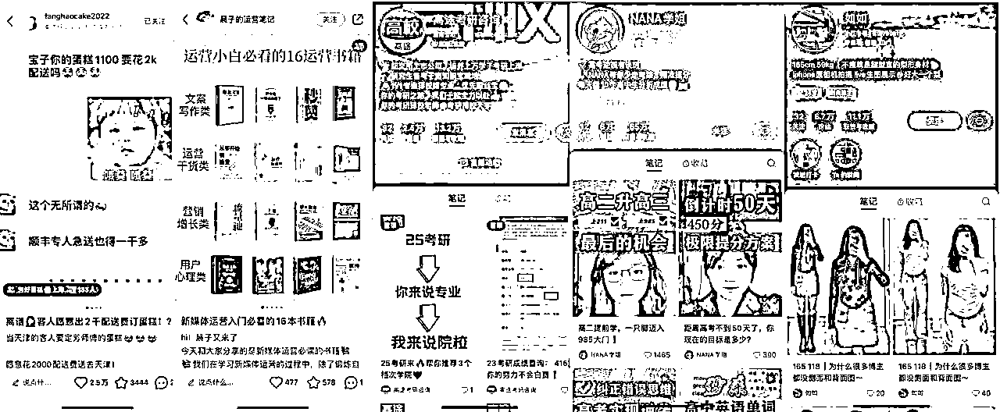

 

 

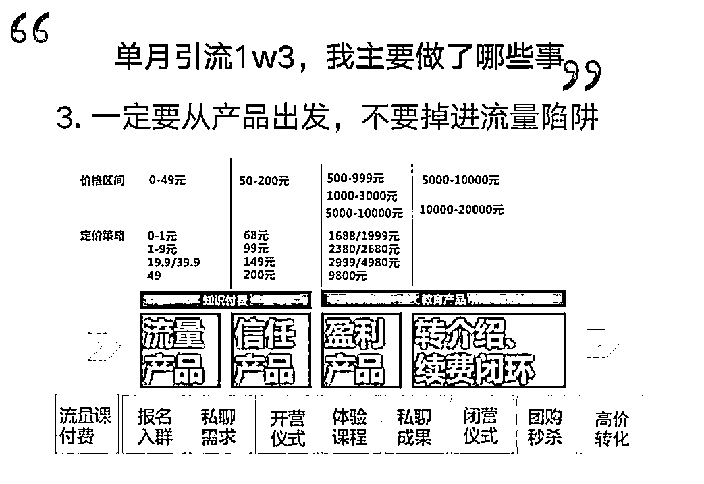 

 

 

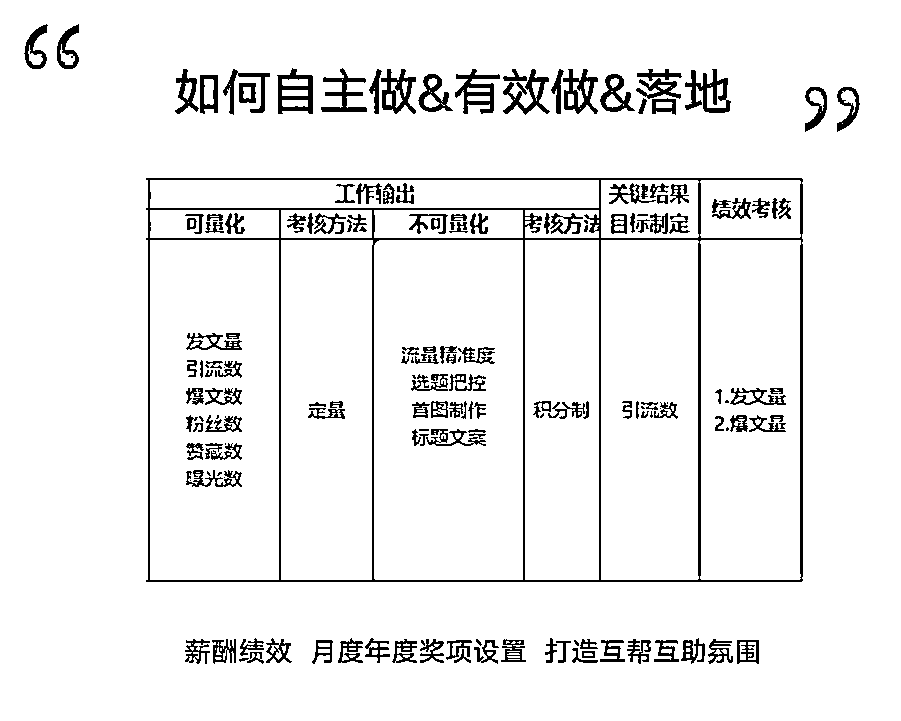

 

 

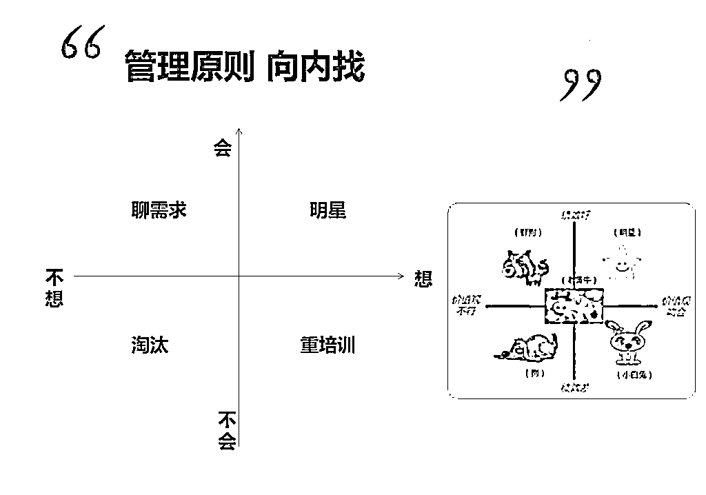 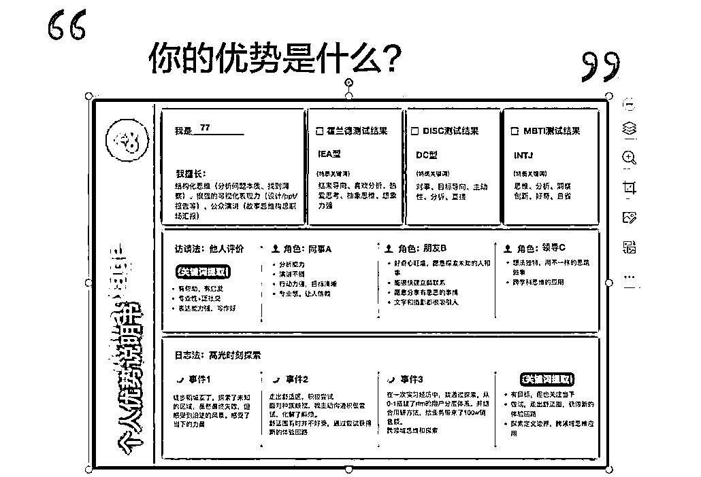

 

 

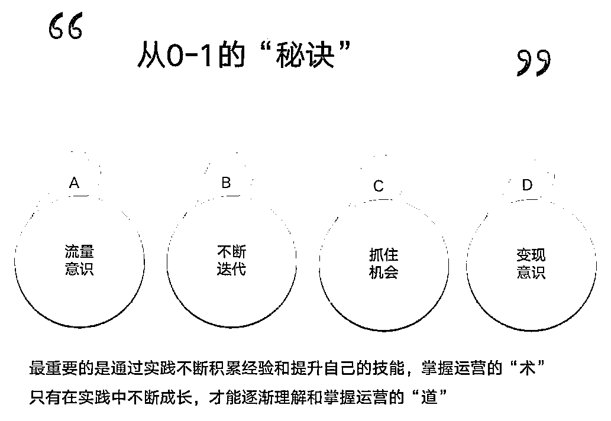 

 

 

评论区：

万青 : 感谢分享，全程高能干货[拳头][拳头]

夏汉九 : 感谢分享，从管理者的角度剖析了工作中的问题，不管是打工人还是创业者都很有用。

周周Mia : 宝子太棒啦~一个月就成长的这么快速

Sherry💎谢无敌 : 实操派写的文章，只说干货，不带废话的[呲牙] 大闵 : 感谢分享，很干

嗡嗡嗡起JoyBoy : 我也是无敌老师的关门弟子[呲牙] 无敌老师yyds 佳能 : Yyds

佳能 : 不好意思，第一次发言不知道从文章入口进，附上飞书链接，方便阅读：

https://v4y8yg9y6n.feishu.cn/docx/QRLidI7zHoJxWix3Dr1csKObnsc作者：  理白

日期：2023-06-09

零基础，如何从 0 到 1 打造朋友圈自动成交系统，撬动5位数收益

大家好，见贴欢喜，我是生财龙珠圈友理白，本月初，应官方邀请，在「朋友圈运营大航海」中作为嘉宾分享《朋友圈自动成交系统》，给非常多零基础小白从0到1打造朋友圈的实操方法论。

在担任教练期间，80%以上的小伙伴都启动了自己的朋友圈日更计划，并在航海作业中反复CUE到我，谢谢大家的抬爱。

航行过程中，我回答了近1000个问题，总结发现，咱们的很多小伙伴，做项目多，做流量多，做产品多，但是转化上存在卡点，几百个优质流量进来，转化率不到5%。私域明明沉淀了上万意向，却迟迟无法搅动他们的付费欲望。深耕内容，却不懂如何更好地展示实力，只知道一味地发成交截图或晒单，浪费了朋友圈最宝贵的位置，封号风险大不说，还容易被屏蔽。

# **#** **(**精华帖**)(238**赞**)**如何从 **0** 到 **1** 打造朋友圈自动成交

# 系统，撬动**5**位数收益

 

 

那些让人看了就想打钱的朋友圈，有没有什么内在逻辑？

看起来不营销，却又可以让人产生付费意愿的朋友圈，到底有什么规律？

这篇文章，将以更系统地方式，梳理零基础发圈小白的朋友圈布局模式，全文9000余字，案例配图50余张，可以说，只要看完这篇帖子，任何人都可以立刻发好一组成体系的朋友圈，打造自动成交系统，让自己原有的收入，再提升30%。

为了方便大家阅读，请移步飞书：

文毕，感谢我的爱人  ，让我的朋友圈，可以因为你的出现而多姿多彩；感谢我的良师益友  ，你的朋友圈给了我非常多的启发和帮助，正是在你的影响下，才开启了我的自动成交之路；感谢范磊领队、子冯教练、思念教练，以及大航海所有的志愿者，因为所有船员的共同努力，才有了咱们这艘船的乘风破浪、披荆斩棘。

祝我们，生财有术，发圈成交，亦有术。

https://fcjmogm9bc.feishu.cn/docx/Lq6jdKMoOolvwZxS4s3cmCqMnbf评论区：

比比先森° : 理白大佬带带我！

小浩哥 : 白白牛

大西 CC : 理白大佬牛逼！

轨迹LLC : 理白nb

理白 : [色]

凌心 : 理白大佬牛

张可粒 : 理白大佬，太牛了。

小鹿 : 跟着理白学私域！绝绝子！

作者：  李思念

日期：2023-01-10

# **#** **(**精华帖**)(177**赞**)**如何写出既能吸金、又能深入人心

# 的心金文案

 

 

《如何写出既能吸金、又能深入人心的心金文案》

大家好，我是李思念，是一名9年的创业老玩家。

我身上被人广为记忆的个人IP标签中，首当其冲的应该就是我的文案力。朋友圈坚持更新，累计输出百万字，写的文案在微商圈/创业圈疯狂传播，在小红书上也通过文案吸粉无数，变现超过7位数。

我有时候会觉得，文案，它真的是一个逆天改命的武器。

当你开始亲自原创文案时，你会发现，自己学会了在字里行间思考，自己慢慢拥有了核心思想，这种思想，通过文案的传播，吸引、影响、感染了更多同频的人。

而这种影响力，也反之加持了你的个人IP，会直接作用于你的事业成绩。

写作多时，去年我给我的文案风格，终于敲定了一个名字，叫做「心金文案」，寓意是既能吸金、又能深入人心的文案。

文案不同于文章，文案本身就带有一层商业变现属性，所以能够吸金才是关键，而文案又需要蕴藏感情、给人能带来触动，所以深入人心的写法，也是必要。

那么接下来就来分享下，我是如何写出既能吸金、又能深入人心的心金文案的。

全篇将分为以下四部分：

一、写文案前的3重思考

二、文案写作的道与术

三、写作方法论

四、如何培养文案持续输出能力

欢迎大家移步飞书详细阅读→https://b80fa9wrsf.feishu.cn/docx/JPRAdLgGFowUE7xargGc8YNjnzh评论区：

安可果儿 : 感谢分享

Aimmon : 用文案生成工具吗

李思念 : 自己写文案的。工具能拼凑字词，但永远替代不了思维。

Aimmon : 厉害了

小花 : 先赞后看，感谢大佬分享

Benjamin : 学习了

冰点 : 硬实力

陈真 : 想看看你朋友圈文案[呲牙]

 

 

作者：  黄勤文

日期：2023-01-03

大家好我是黄勤文，第九公社联合创始人。之前分享的2篇文章《视频号三天千粉、内容规范、违规、官方认证等技巧分享》以及《互联网小白上岸避坑指南》在圈友中反响良好，今天我写下了这第3篇文章《互联网项目培训从业者保姆级教程》，这篇是从知识付费培训老师的视角去分享心得。全文一共1.2万字，内容有点长，希望大家耐心看完。

我从2019年大二开始带队抖音培训，连续做了4年的互联网项目培训，目前我团队积累了几千个学员，项目交付效果获得97.8%的好评率，也帮助了很多普通人在互联网上稳定赚到钱，见证了很多人从新手到老司机的蜕变。

培训本身是一个不讨喜的职业和工作，容易背负骂名，被视为“割韭菜”的“镰刀手”。培训做得不好容易损阴德，甚至赔上自己的职业生涯。

但是相对应的，现在越来越多的行业大佬都入局知识付费行业，卖起了自己的课程和社群，比如分众传媒的江南春、新消费王岑等等老师。这也说明培训行业受到了强者们的肯定，并且成为普通人向上管理和晋升的重要途径。

从业培训行业4年，我虽然没什么大成绩，但是今天想把自己一些比较好的培训心得分享出来，给培训新手做个参考，期待更多有格局、有职业素养的培训老师的诞生！

一、培训行业火爆的原因

# **#** **(**精华帖**)(78**赞**)**互联网项目培训从业者保姆级教程

 

 

**1.**讲师的自我成长。最强的学习方法是费曼学习法，最好的学就是教别人，你在教别人的过程中，也在一遍又一遍重新梳理认知和经验，最后讲师自己就成了行业专家，获得自身成长。教别人的过程，本身就是自我成长的过程。

**2.**轻资产模式。培训不需要像传统行业那样，砸几十万开店和投入巨大成本和风险，只要后端培训交付做得好，讲师团专业度有保障，就可以引流收钱，利润率很高。而且费用是提前预支的形式，等于是先收钱后干活，这点跟理发店充卡是一样的。

**3.**普通人向上晋升的通道。做培训具有极强的积累性，你做10年培训下来会有很多精准的学员数量，做生意的核心要素就是用户数，当你手上有人时，做什么生意都会顺风顺水，能够增加一个人连续成功的概率。并且在对外社交时，培训老师的身份就是你最好的社交名片，能够在外面撬动很多资源和帮助，良性循环。

二、培训行业现有不足

1.培训从业者良莠不齐，90%的从业者都想纯割韭菜，入这一行之前没有经过系统的职业素养和职责范围学习，缺乏对于用户的敬畏之心，什么钱都想赚。

2.培训付费用户甄别能力有待提升，连最基本的哪些团队的项目交付靠谱还是不靠谱都无法判断，只凭别人的一张收益图就敢贸然付费入场。

3.更多的这里就不列举了，懂的都懂。

二、培训后端交付体系

 

 

根据我对“培训的交付性”的理解，我列举了5个最重要的组成部分，分别是课程、微信群优秀学员分享、直播连麦辅导和保姆式解决问题。我团队目前全部执行了这5个部分。

一个基础的项目培训交付体系，最少要包含下面罗列的1和2。目前市面上大多数是只有1，其他的4点都是缺乏的。你们带队培训的时候，自行做加法或者减法，根据自身实际情况来。

新手做培训，不一定我这5点全部要做到，但是如果你真的全部都做到了，并且项目也是跑通了，那么项目交付水平起码也是95分了。

**1.**基础课程

这个不用说，如果连课程都不做，或者直接发别人的课程，那肯定是割韭菜。做得好不好是一回事，你有没有花时间用心去做是另一回事。

①思维导图**PPT**

录课程之前最好做出详细的思维导图或者PPT课件，这样录课程的时候会减少磕巴，思路更加清晰流畅，这方面可能需要占你做课程总时长的50%。思维导图用Xmind软件来做就行。

②真人出镜

课程属于讲师的原创作品，能真人出镜的尽量真人出镜。如果一个讲师没有勇气露脸和真人出镜，那么他的发展会非常受限制。当然，如果你是奔着割韭菜走的，那么你露脸会增加风险，现在人脸识别功能很强大。

 

 

③手机、电脑等多种形式。

电脑录屏我用的是班迪，手机投屏用傲软投屏，这些便宜的会员都可以在拼夕夕上搜到。

在录制课程前要调试好声音和流畅度，争取一遍过。投屏的效果图如下：

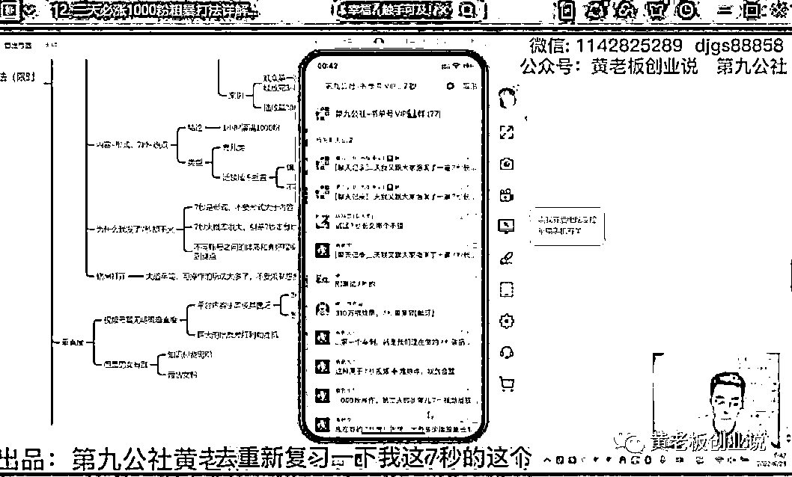

④课程水印

这个是用来标识你的原创依据，哪怕课程外泄出去，起码观看者会知道是你原创的，甚至加你微信跟你付费报名社群。

以上综合下来，就是这样的课程页面效果：

 

 

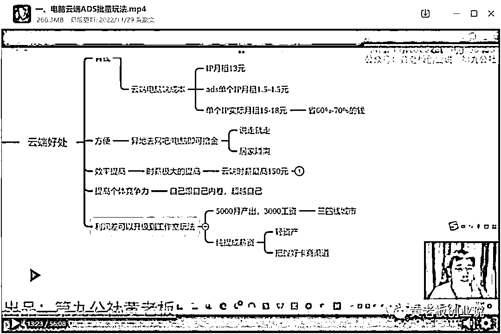

⑤向下兼容，通俗易懂。

在讲课的难度控制方面，你千万不要高估任何人的理解能力，很多知识点和认知只是你自己知道，你的学员都是一无所知的。如果他们都知道的话，也不需要给你付费了。

所以在讲解的时候，你要把学员当做幼儿园的小朋友那样对待，起码要像白居易那样做到通俗易懂，最好达到一个学员只要听得懂中文，就能听懂学会你的课程的地步。

你也不用担心自己说的过于白痴和啰嗦，录制课程最方便的一点，就是学员可以拖动进度条，选择性的听讲，查缺补漏便捷双方。

⑥不定期更新课程

 

 

不要想着录制一次课程就一劳永逸，那是不可能的。项目每隔1-3个月都要更新玩法，或者有些变化最大的行业比如短视频带货，可能一个月要数次更新玩法和教程。

多去主动积极更新迭代，自己革自己的命，比被同行革你的命更好。没事就多去超越自己，一直保持最前卫的玩法。

同时你多次更新迭代的行为，也会被学员看到。自己付费的老师这么负责任，他们也会感动和受鼓舞，各方面都产生良性循环。

 

 

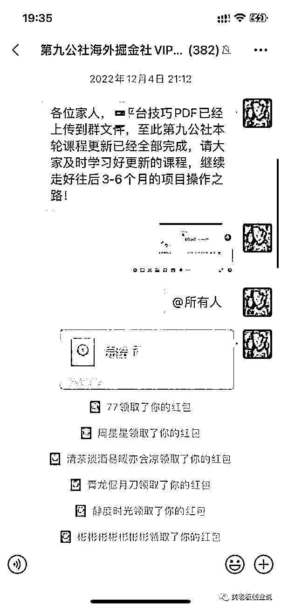

**2.**微信群

 

 

①群规

没有规矩不成方圆。最基础的群规，不谈论政治，禁止黄赌毒。在群里禁止发广告，第一次提醒第二次警告第三次踢群。还有在群里有什么想法，都要提前跟群主或者管理员说明，获得官方授权，禁止私下推销行为等等。

②管理风格

有的团队管群管的太死，比如群里一半的信息和话都是工作人员说的，学员说一句恨不得你回复五句，那就沦为一言堂。

“法无禁止即可为”。有时候管理者多点格局和自信，让子弹在群里飞一会，学员们自发进行互动交流，官方人员少插手，多点茶馆的色彩在里面，群的信息和价值就体现出来了。

③群价值观导向

每个社群和团队都会传递价值观。有的团队传递的是低格局的价值观，比如喜欢斤斤计较，或者传播社会的负能量等等。但是有的团队社群传递的是积极的价值观，比如反复提——凡事都有解决办法，方法总比困难多，责任和担当，或者真诚利他，越分享越幸福这些价值观。

只要一个团队社群有了一定规模和影响力，就要积极承担社会责任，多引导大家向善，多传递正能量，让这个项目社群真的成为一个放松的港湾和家的感觉，多一个栖息之地。

很多时候，一个团队和社群对用户最有价值的，不是产品或者服务，而是背后传递的价值观。

 

 

④大群小群特色群

按照不同的目的和需求，可以额外增加社群服务。比如我带队的问卷调查项目，除了项目培训大群之外，针对那些买了云端IP进行电脑云端操作的学员，我还额外增加了一个云端交流群，满足这种特定人员的学习交流需要，最终反响非常热烈。做培训尽量多加餐和物超所值，这样让学员占到了便宜，会更加信任你。

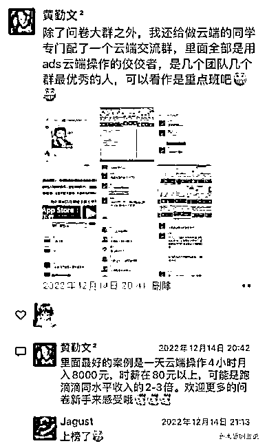

 

 

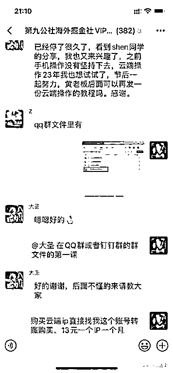

**3**、优秀学员嘉宾分享

可以说，培训老师工作的直接任务就是培养标杆案例，实现学员的成才和赚钱。通过有仪式感的邀请学员分享的动作，也可以激活群里潜水的学员，让大家被身边的牛人鼓舞，推进操作项目和创造产出。有了学员的真实案例，团队还能更好地招商赚钱，形成良性循环。

①提前约稿

虽然学员嘉宾的分享内容基本是自由发挥，但是他们一般都缺乏对外分享的经验，不知道把握重点和如何表达。比如把不重要的东西反复说，把很重要的东西忽视掉。

 

 

又比如自己本来业绩很牛但是在分享内容里没有体现出来。名正才能言顺，人是更倾向于听牛逼的人的话，越牛逼的人说的话他们越愿意听，得把嘉宾的牛逼也彰显出来。

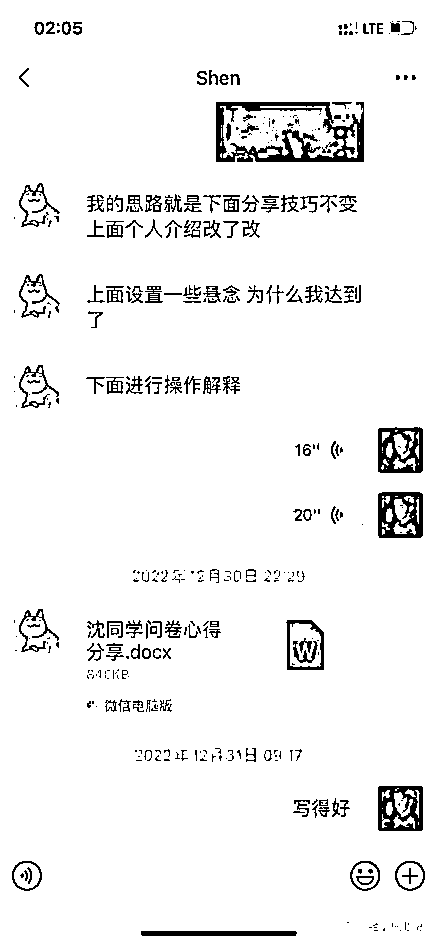

这些方面都需要带队老师这个经验更加丰富的人去帮忙，所以最好让分享嘉宾写一份分享稿初稿，然后发给老师看一下帮助修改完善，争取达成最佳的“节目效果”。这样嘉宾说出来的话比较有水平，最后他也倍有面子。

当然，邀约嘉宾来做分享，这件事本身也是非常难的事情，需要你拿出哄女朋友的态度和技能，“连蒙带骗”最后征得嘉宾的同意。有些嘉宾真的就不给面子，那没办法只能换下一个学员、

 

 

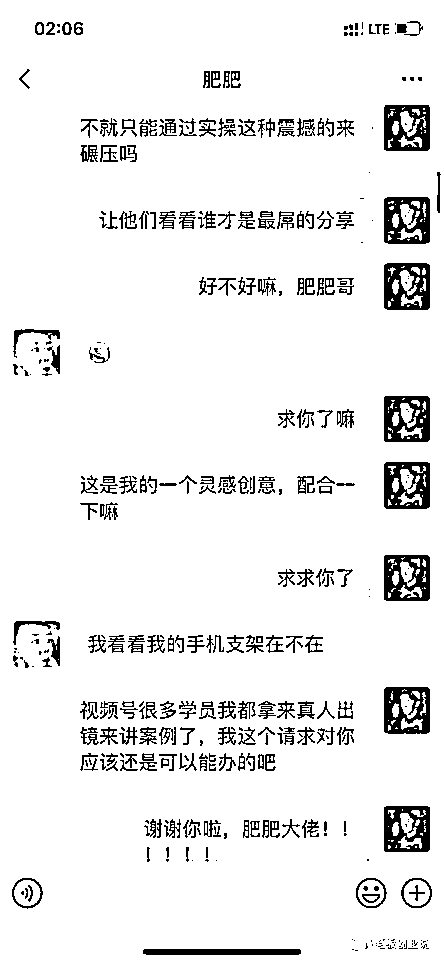

②预热**—**介绍**—**正式分享**—**感谢**—**嘉宾答疑

分享的前一天要先在群里预热，说明什么时候在什么地方请到什么同学分享什么内容，并且进行嘉宾的推崇。在当天分享前的1小时要进行倒计时，在分享开始前10分钟要介绍嘉宾并且带动群里的氛围，比如打666等等，把队形刷起来。

 

 

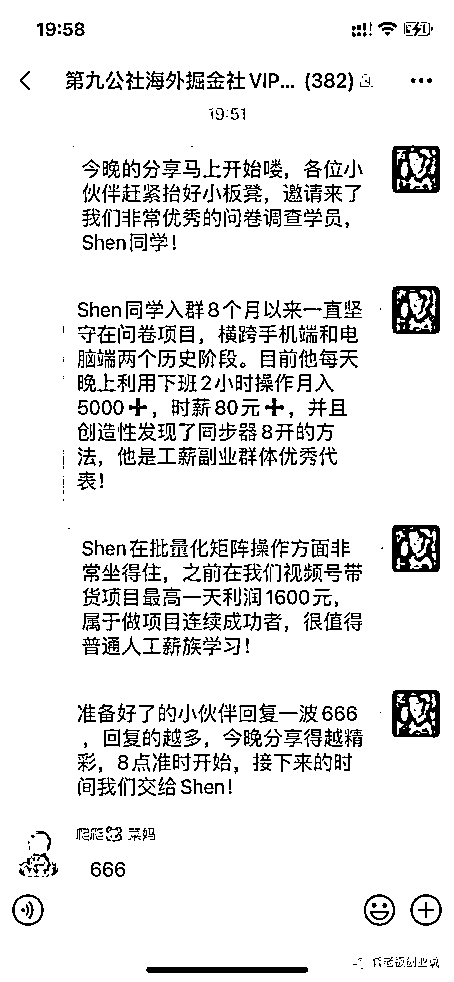

分享介绍后，进行总结和感谢，并且请其他同学提问，请嘉宾进行解答。本质上来说，邀请嘉宾分享就是把官方带队老师的影响力和信任度，集中让渡给分享的嘉宾，把舞台交给他。

上等人人捧人，中等人人挤人，下等人人踩人。江湖不是打打杀杀，而是人情世故。

③给酬劳感谢嘉宾

 

 

学员花时间精力为你进行了一次分享，你一定要发红包感谢，给多少钱都可以，根据你自身财力来，但是不要看着太寒酸，100元以下的红包就不要发了，没什么意思。

优秀学员分享是一个项目培训全闭环的重要组成部分，发红包就是对嘉宾的鼓励和正反馈，想做好事情，先得学会做人。

**4.**直播连麦辅导

在经过了课程、微信群、嘉宾分享之后，学员们95%的问题理论上都能得到解决。直播连麦可以做，也可以不做，属于加分项，不是必选项。

直播尽量做真人出镜，如果不敢真人出镜，那你宁愿不做直播也不要用其他拙劣的形式代替真人。这年头没人关心你的长相好不好看，只关心你够不够真诚，能不能帮助别人解决问题满足需求。

直播连麦环节充当的作用，更多的不是答疑，而是定心丸和形象款。就是让你的学员看到，自己的老师愿意花时间陪我聊天答疑，我的老师一直都在陪伴我，并且帮我耐心疏导，太感动了。

所以直播时，不应该是冷冰冰的答疑工作，而应该是一种心理咨询、职业规划的定位。

直播软件有钉钉，飞书，腾讯会议等等。目前钉钉和腾讯会议已经收费，钉钉一年9800元，腾讯会议300人以上需要收费。你们可以选择飞书直播。最好能下载直播全程回放，给学员自行复习观看。

 

 

①主讲人

一般是带队老师或者助理。带队老师能出面的还是由本人直播比较好，毕竟是定心丸和灵魂人物。主讲人确定后，开播寒暄——安排学员代表连麦提问——实时答疑——总结引导②安排代表嘉宾

开播之前要在微信群里征集积极学员，作为连麦嘉宾进行提问和答疑。当然为了直播的效果和质量，还是得提前让候选人们把自己的问题列举出来给你过目，因为有些问题的质量很差，可能会耽误直播的时间，简单问题你就直接告诉他答案就行了，有一些很有价值的代表性的问题可以入选到连麦互动正式内容中，作为代表性案例进行答疑和讲解。

③实时进行答疑互动

除了回答嘉宾的代表性问题，也要照顾好其他学员的实时提问，注意好时间节奏，努力做到寓教于乐，妙趣横生。

 

 

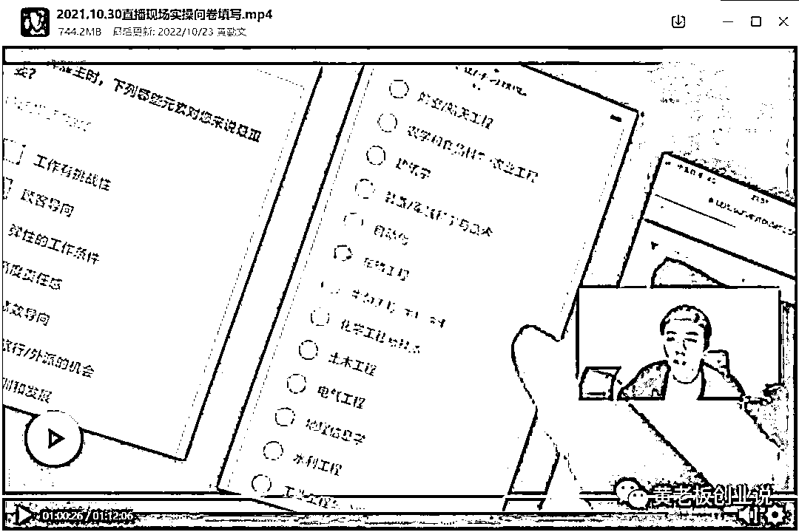

**5**、保姆式解决问题

①培训老师的尽头是保姆和家长。

别以为做项目培训只是谈项目本身怎么怎么样，其实你作为带队老师，更多的是一个灵魂人物的作用，你需要学会安慰、协调、插科打诨、活跃气氛、引导三观等等方面的能力。

最主要的是，锻炼你的解决问题的能力。学员有需求和遇到了困难，你如何保质保量的去解决他的问题，并且达成比较满意的结果，既考验办事效率，也考验情商智商逆商财商等等。

 

 

所以做培训是一个独立承担责任的过程，是了解社会和人性以及自我提升的极佳工作，如果你全部都坚持下来了，那么你本身也算个人物了。

②学会分工和运筹，以结果为导向。

一个项目培训规模做大了，不可能所有的问题解决都由带队老师本人来负责，人的精力很有限。所以就涉及到专业化分工的问题。如果基础的底层工作能够安排给员工和助理做，那么老师就能解放出双手去做更重要、不可替代性更强的事情，比如对外社交获取资源、付费学习研发、前端引流进人等等。

学员付费进来需要的是什么？是你帮他解决学习过程中的问题。至于是不是哪一个人帮他解决，其实并不重要！

只要你能最终帮学员切实解决问题了，那么不管什么方式什么办法都可以，要以结果为导向。比如请一些优秀的老学员跟新人分享一下，比如让助理解答一下，比如花钱去获得解决方法等等，法无禁止即可为。

小作坊有小作坊的玩法，大团队有大团队的玩法，要结合自身实际情况来解决问题。

二、前端引流

引流就是去微信之外的平台吸引你的目标客户，方法分为免费流量和付费流量。前期钱不够的建议搞免费流量，虽然要研究平台规则花时间，但是剩下来的钱全部都是利润。

 

 

后期如果规模大一点，时间资源比较稀缺，那么就花钱去买别人的流量，算好投产比ROI，比如引流1个人的成本是30元，结果平均下来一个人给你产出了60元利润，那么投产比就是1:2.然后不断地买流量和成交，获得稳定的流量来源。

为什么很多人招不到人，或者招募几个学员后就停滞不前，最后项目培训不了了之？就是因为没有稳定的源源不断的流量来源，不知道如何搞流量。

**1.**免费流量

引流和搞免费流量，本质上就是农民工项目，需要的不是学历和思维，而是执行力和体力。本质上还是搬砖的体力活，就看每天能不能去其他平台发大量的作品，数量大于质量，量大出奇迹。

你在公域流量平台（抖音快手小红书等等）上，输出有价值的图文/短视频内容，对别人有帮助，那么这个内容就自带流量，给你带来用户。你再去把用户导流到你的微信里，就成为你的私域流量，平台带不走，你可以一直吃。

比如你想吸引想发家致富的创业粉，那么你就去输出发家致富的内容。如果你想吸引育儿教育的宝妈，那你去输出教育培训的内容，以此类推。

目前最好的免费流量平台就是抖音，来人的质量也是最好的。前期做好免费流量，剩下来的钱全部都是利润，适合小白操作。

**2.**付费流量

 

 

这一块适合专业化团队或者至少有经验的个体玩家操作，因为有一定的风险承受能力。然后每个平台都不一样，同个平台的每个流量主号主都不一样，需要广泛去投放和测试数据，有亏有赚。

具体的引流方式我不多说了，你去付费给有结果的人学习，并且严格执行下去就行了。方向对了，细枝末节的方式方法也就没什么大问题。

三、个人**IP**转化率

个人IP就是个人的品牌。比如海参哥，广东夫妇等等，都是个人IP。个人IP本质上就是解决信任度的问题，做好个人IP就是积累更多的信任度。

为什么很多人想做培训但是招不到学员呢？就是因为没有做个人IP，解决不了信任度的问题。比如那些天天在朋友圈发项目的人，但是他只发项目广告，没有文章内容输出，没有专业度，也没有真人出镜，有的就只有朋友圈广告。说今天又赚钱了，多少多少钱，风格跟骗子无疑。

有时候他还会忍不住发一些抱怨的负能量的吐槽内容，更加让人觉得他这个人格局很低，信任度进一步下降。

其实转化率更多是跟个人IP挂钩的，而不是跟某一个项目。一个成熟的个人IP，推不同的项目都能成交和招募到学员。一个不成熟、做得很烂的个人IP，再好的项目也很难推出去。

个人IP要做好以下几个方面：内容输出、定位、项目后端变现、前端引流。大多数人做培训招募只做到了“项目后端变现”这一点，每天没有内容输出，没有专业度，给别人提供的价值和印象很一般，所以也招不到人。

 

 

四、年费和复购

目前市面上做的比较专业的知识付费团队，很多都是采取“年费制”的收费模式，比如樊登读书会，生财有术，比高研习社等等。

永久服务学员和客户是很难的。因为只收一次学费，后端如果再没有进行利益捆绑和后端被动收益，那么这种组织形式是不长久的，而且没有复购。任何一个产品没有复购，都是不值得做的。

所以我建议按照3个月、6个月、或者年费制来收费，尽量设定一个可量化的时间。

反过来说，如果你不设置时长，永久服务，但是学员他们真的有耐心一直做下去吗？并不会。

一般学员付费后，对于项目的新鲜感只有3-6个月，持续一年以上的激情和积极性是很难的。所以，顺应人性，同时也放过自己，设定合理的时间和价格，完成交付，成全彼此，是更好的策略。

同时，第二年的续费数据，就是对于第一年服务和工作的考核。如果续费率低，你就会想着怎么去优化提升，如果续费率高，你就会坚持你觉得正确的事情，放大自身优点。

普通人付费互联网项目，其实是为了稳定地获得赚钱渠道和享受高质量的社群服务，只要你能满足他的需求，价格控制在合理范围内，收费方式都是可以被他们接受的。

 

 

五、常见问题答疑

**1.**遇到课程盗版外泄怎么办？

作为原创作者的你可以选择维权，也可以选择不维权，没有对错之分，只有利弊。

①本身是好事情

如果你发现自己的课程被盗版和外泄，甚至白嫖的人加到你微信让你帮他解答问题，那么我首先恭喜你——你做出成绩了！起码你在这个项目和行业里面有了一点点影响力。

因为如果你招募的人数比较少，那么你的课程连被盗版外泄的机会和资格都没有。

评判一个培训做的有没有足够的影响力和成绩的重要标准，就是你去淘宝、拼夕夕、咸鱼等等上面搜一下你的名字，看看有没有人卖他的课程或者作品。

现在市面上影响力大的培训大师，电商平台上面随便就能搜到他们的全套课程。

那么，为什么那些大师没有选择维权打假，任凭这些卖家猖狂呢？难道是因为盗版课程外泄并不重要，对他们无关痛痒吗？

没错，正是这样。而且两者的定位人群也是不同。

买盗版课程的人是什么群体？大多数是白嫖党，他们不懂付费，不懂付出和感恩，所以这种群体最终也不会做出什么成绩，甚至买了课程后就放在网盘里积灰了，全过程只是逗自己开心罢了，乐呵乐呵。

 

 

真的，你有没有听过哪个大佬是通过学别人的盗版网盘课程起来的？我没有听过，相信你也很少遇到过。因为，学课程本身没有用，只有拿出执行力去实操，跟老师及时沟通答疑迭代，才能做出结果。

相反，如果真的有人通过看我的盗版课程，最后做出了业绩，那么我很恭喜他，因为他本身就是能人。可以在众多白嫖的失败者中杀出一条血路获得成功，这本身就需要通天的本事！

以上是对于学员角度的分析，那么你的课程盗版和外泄对你就只有坏处吗，有没有什么好处？答案是肯定的。

一个品牌能不能做大做强，不在于它卖出去多少个产品，而在于有多少个人帮它卖产品！

相应的，你做培训成不成功，不在于你自己卖出去多少个学员，而在于有多少人在市面上帮你推广和宣传！

如果市面上有很多人拼了命要卖你的东西，你还需要担心销路和宣传辐射范围吗？根本就不需要担心，你的影响力马上也会打出去！

如果你的课程上面打了水印，比如留了微信，那么随着你的课程外泄，学习者也会加到你的  微信，旁观朋友圈。高能量的人朋友圈都是有巨大的吸引力的，搞不好一个白嫖党最后就能成为你的付费客户。

②维权的结果不尽人意

 

 

我们也试过维权和打假，最后闹得不欢而散。而且我们并没有因此多赚钱，反而牵扯了我更多的精力，耽误我做更加重要的事情。这是一个教训，后面我们再也没有去维权，随小镰刀们自己玩去吧！给别人一条活路，让自己的路也变得更宽，何乐而不为，哈哈。

民生各有所乐兮，余独好修以为常！

**2.**被培训同行竞争了怎么办？

①一个行业有同行和竞争，这是好事情。

尤其在中国，如果你发现你的生意没有同行，那么你就要重新思考一下这个生意能不能跑得通。如果跑得通，为什么没有其他人做呢？

就像你在一个外地城市投资，要先调查一下外地人同行在这边投资情况怎么样，外地人过得怎么样。像北方的一些城市，外地人100%被赶走，走的时候都是哭的。投资不过山海关。

所以如果有同行跟你竞争，跟你卷怎么办？很简单，不要怕，你卷死他们就行了。卷不死他们，那么你就被卷死，市场总是动态平衡的。

只有竞争，才能不断迭代和前进，最后成为最强大的自己，达到新的高度。

②不要诋毁和评价同行。

 

 

像很多销售行业，比如做A家保险的，客户问你B家保险怎么样怎么样，80%的业务员都会评头论足顺带贬低一下，然后市场就这样恶性竞争，然后乱了，最后每个人都没有好结果。

就像互相打小报告和互相揭短的狗咬狗行为，最后只能证明这两个人都是傻B，而不能证明谁比谁更好。

而且你得知道，只要你说同行的坏话，不是99%会传到他的耳朵里，而是100%会传到他的耳朵里，别有侥幸心理。自古好事不出门，坏事传千里！

如何彰显你自己的牛逼呢？就是极大地突出你自己的优点，然后让别人自己品。而不是靠突出别人的缺点，来反衬自己的牛逼。

反衬的动作应该是用户做的，由他自己品位和判断的，而不是靠你自己说。

该说的话一定要说，不该说的话一定不要说，这样你起码在做人方面就没有大问题。

所以从今天开始，当客户问你XXX同行做得怎么样？你就不要说“做的XXX不好，很垃圾”，而是说“他的情况我不了解，不做评价，你自行判断就行了。”

真正有格局的人，从不树敌，因为他知道仁者无敌，宇宙的尽头都是朋友和师长。

诋毁，本身就是一种仰望！

 

 

**3.**遇到学员维权退费怎么办？

①先了解清楚是什么原因导致他想退费。

是项目本身交付有问题，还是售前信息沟通误会，夸大宣传，还是他遇到了什么困难等等。以及确定是真的走不下去了，还是只是他遇到挫折后的想法，想跟你抱怨和获得帮助。另一方面，如果确实是项目后端交付有问题，那么你就要思考自身的问题，要么就做好整个交付闭环，要么就不要再招募学员，别做培训了。

②安抚和解决问题。

如果你的项目后端全部都可以跑通而且有成功的学员案例，那么80%以上的可能性是因为他遇到了挫折，需要心态建设和安抚，以及你给出方案如何让他继续走下去。那么这时候你就得扮演一个保姆和心理医生，安慰他，像个男朋友一样哄哄他，然后用自己手头的资源和人脉去倾斜给他，帮他更快的获得正反馈和走上正轨。

③复盘售前介绍细节。

如果经过你的安抚和引导后，学员还是无条件要求退款，那么就复盘一下当时他付费的售前是怎么沟通的。比如发他的介绍内容里，有没有承诺包退包赚钱这些。如果介绍和售前沟通里说明了收费后概不退款，那么你可退也可不退，都没有是非对错，因为已经明确权责关系了。

相反，如果你售前说了包赚钱包退款，那么这个政策你就得自食其果，本身制定的对你就是不利，但是承诺就是承诺，如果你不想暴雷，就直接退了。

 

 

还有一种，就是售前没有明确说明，到底是包退款还是坚决不退款，存在争议的，那这一块就比较麻烦了。这种情况，我是比较倾向于退款的，就当带队老师自己买个教训，下次招募的时候提前说明白写上去就行了，格局大点，为以后做大事赚大钱做准备。

④按照具体情况退款。

如果争议过大，矛盾冲突过大，那么最后还是建议退款。因为一旦信任消失了，那么双方就没有必要继续走下去，再纠缠会造成更大的损失，不符合长远利益。

如果实在不想退款的，也可以协商退50%的款，或者换个别的项目给他免费做（也就是退款+补项目），这样你自己的损失也会降低一点。当然，全款退费还是解决问题最彻底的，事后就没有纠纷了。

售后维权方面的处理方式，涉及到整个项目和团队的持久性问题。虽然在市面上有很多团队用不切实际的诱饵夸大承诺去吸引别人付费，并且还赚到钱了，但是这个钱最终能不能平稳落地，那还是另说。

如果作恶多了，可能最后全部都得吐出来，赔进去罚金，甚至进去。所以，割韭菜行为短期能挣钱，但是会放大一个人的罪恶和邪念，最后还无法软着陆和持久运作。

君子爱财，取之有道。赚钱不仅要有短期爆发力，还得有长期持续力，这样才能立于不败之地！

**4.**学员人数太多了，每天提问数量特别多我忙不过来，心很累怎么办？

这涉及到信息和沟通的工作效率问题，可以通过以下几个方法解决：

 

 

①在课程里面，把知识点说得尽可能全面，在课程这一步就解决学员**95%**的问题，并且引导学员去课程里查缺补漏。

针对那些不知道知识点在哪的学员，你可以截图画圆圈让他们找到位置进度。课程本身就是一个长期内容沉淀的作品，你只需要录制一次，就可以批量化解决N个学员的问题，所以你把课程做好，就等于在节约自身的答疑时间。

②能在群里答疑的，尽量不要私聊。

同一个问题，你私聊解答一个同学是解答，在群里公开解答他也是解答。两者对于这个同学角度的问题解决，其实效果都是一样。但是对带队老师来说，在群里解答了一个问题，其实是顺带同时帮助群里其他遇到相同问题的学员解决了问题。这样的话可以提前避免问题出现，能够节约带队老师的时间。如果一个问题老师在群里说一遍就能让所有的人都学到，那么信息传递效率是最高的。“偷懒”也得有技巧。

但是如果学员的问题非常的隐私，比如涉及收入岗位等等那些，还是得私下帮他解决问题，不该偷的懒坚决不偷。

③引导老人带新人。

社群氛围和价值观培养好了，新人在群里问的问题都不需要你回答的，很多老学员会直接帮你回答。因为“好为人师”是每一个老司机的基本心理特征。也可以通过发小红包去引导老人带新人，引导群里真诚利他的氛围。红包金额虽然不大，但是正反馈效果拉满，这点就跟你写的文章被读者打赏了1元钱一样的心理。

 

 

弱化官方人员的角色，该放手的多放手，创造社群自动化发动机，让充满价值的信息在群里高效率地转动起来。培训做到最后卖的不是标品，而是社群圈子，是信息差。

**5.**做培训最后暴雷的人，是什么原因导致的？

培训后端交付的安全性，最重要的是3个指标，一是售前承诺，二是售后退款，三是能不能跑通变现闭环

①售前夸大承诺，没有筛选人群。

在回答售前咨询的时候，没有的东西坚决不承诺，坚决不保证人人赚钱，不虚假夸大数据，甚至要把数据往小了说，尽可能降低对方的期望值。并且针对不适合的资金短缺的人，要敢于劝退和筛选掉，减少自身风险，尽量对双方都负责任。

暴雷的培训团队，在售前恨不得把世界上最拙劣的骗术都说一遍，生怕对方不转账付费，比如包赚钱，包回本，包XXX，然后案例全部都用最高水平，甚至把数字夸大个几倍，这无疑极大的抬高了学员的期望值，等到进来后发现并不是那么回事，就很容易有矛盾了。

这一点抖音海参哥做的就很好，虽然他的视频风格饱受争议，但是他不收穷人的钱，也不做任何保证承诺，所以到现在还能稳定在抖音上招商。

②售后不及时退款。

 

 

如果在售前没有做好人群筛选，把不适合做项目和花钱的人收进来了，那么很容易出现退款售后的事情。如果金额不大还好，金额一旦大了可能会被发到互联网上传播，并且对簿公堂，造成丑闻。在互联网上事情被进一步放大，最后小事变成大事。比如抖音的小小如（张曼如）收了孕妇6万元，没有做好退款，导致的公关危机，最终也是以退款收场。

所以在售前就得筛掉那些不适合做项目的人群，比如负债的人，眼高手低的人，急于求成的人，磨磨唧唧的人等等。售后该退款的就果断退掉，承担责任。

③项目无法跑通变现闭环

做培训你最少先自己做到从0到1的闭环，再去复制别人的从1到100\. 如果自己都没跑通变现流程就去招募，那这是人品问题，  我不多说了。

六、后记

**1.**对于普通人做生意来说，做培训这种业务利润最高，也最赚钱。

我在2019年大二第一次组建公司团队的时候，当时商业模式变现模式不成熟，没有专注和聚焦。当时有3个业务并行，分别是短视频带货、抖音培训，和企业抖音号代运营。

第一个业务是有必要做的，毕竟自己有业绩才能带培训。但是对于第三个业务，我就像抖音陈厂长一样做得非常累，钱少事多。比如一个月只收费1万块，我需要满足甲方各种要求，并且当时作为大学生的我，对于合同的内容和权责划定也没有敏感性，最后辛苦干一个月还得给甲方退钱，也牵扯了团队成员大量的精力，少赚了很多钱。

 

 

最后的结果是，我把一个能赚100万的红利赛道，只赚了30万。对我这个生意人来说，这是个耻辱和重大失误。

后来我复盘，我大学在抖音短视频行业的收入一半都是来自第二个业务—抖音培训。如果当时我有做培训最赚钱这个重要的商业认知，那么我会果断的把第三个业务企业号代运营砍掉，专注于前端引流+后端做好培训交付。

所以你永远挣不到认知之外的钱，哪怕只是一句话的窗户纸，你没有把它捅破，也终究会失败。

**2.**知识付费行业本身就是客观存在的大行业，跟直播带货和网红接广告是一样的。

商业的底层逻辑是什么？就是你有需求，正好我很专业。

交易过程使得双方各自都产生溢价，付费学习的学员获得了知识或者赚到了更多的钱，节约了自己的时间成本，带培训的老师赚取了相应的合理范围内的学费，双方都达成了自己的需求和目标，实现了双赢，这就是良性的商业行为。

既然是合法的商业行为，那么做项目培训只是社会分工的不同，本身不存在对错好坏之分。不能说别人只要收钱和实现盈利就是罪恶的。这种观念本身就是一种受害者的弱势视角，如果长期持有这种观念，对一个人自身的发展有巨大的阻碍作用。

市面上骂知识付费培训从业者的人，很多是因为自身没有能力去做培训，想去“割韭菜”赚钱都收不到别人的学费。因为无法完成“信任度”的传递行为，没有人相信他。

 

 

这种心理，就好比很多骂那些在国外留学和生活的人怎么样怎么样，原因却是因为他自己没有能力出国和享受更好的生活一样。

另一方面，偏见源自误会。培训行业就是因为有太多没有职业素养道德的从业者，所以才导致了很多不愉快和误会，最后让很多人对做培训的人产生了偏见和抵制。

**3.**有良性的商业行为，肯定也有恶性的商业行为。

比如带队老师自身团队很不专业，恶意夸大宣传和作出承诺，却无法提供给学生相应的专业性服务和培训，但是培训费已经提前收取，而且无法退还。这就造成了学生单方面的利益受损，俗称“割韭菜”，并且产生后续一系列的售后维权恶性行为，这就不符合生意人的职业道德，以及商业的本质。

足够的量变，也会产生质变。当带队老师作恶达到一定的数量，可能导致学生集体维权，对簿公堂，严重的可能会导致带队老师锒铛入yu，最后自食其果。市场终会达成平衡，作恶者终将反噬。

这提醒我们这些知识付费培训的从业者要怎么做？

**1.**要持续保持对于项目的专业度，投入足够的精力和资金。

比如花足够的时间去研发项目，或者花足够的金钱去外面付费学习最新玩法，这样才能持续保持专业度和时效性。

**2.**要有职业素养和职业道德，不要什么钱都收。

 

 

收培训费是一种提前预支的行为，所以，收钱应该是带队老师责任承担的开始，而不是交易行为的结束。培训从业者应心存敬畏，敬天地，敬众生，敬自己，小心才能驶得万年船。

**3.**严格筛选人群。

贷款和负债的人尽量不收，别赚穷人的钱。抛弃渡人的思想，少做给别人雪中送炭的美梦，多做锦上添花的事情。比如，你的学生赚到钱了，那是因为他自身能力强，你对他做的培训只是锦上添花的作用。

拿好你该拿的钱，凭良心做好职责范围内的事情。尽量多去输出和利他，把反馈的期望值降低。

愿天下没有割韭菜的发生，愿市场经济最终能惠及每一个用户！

评论区：

亦仁 : 感谢分享，已加精华。

作者：  宋老师

日期：2023-07-26

《30天私域卖课60w是什么样的体验？》

# **#** **(**精华帖**)(90**赞**)30**天私域卖课**60w**是什么样的体验？

 

 

各位圈友大家好，我是宋老师，在知识付费做课卖课领域已经摸爬滚打2年多。过去的一年有6000多位知识博主和我学习，私域也沉淀了近3w知识博主，依靠短视频和私域单月变现近7位数今天，把我的其中一个知识博主的私域细节秘法--私域卖课分享给大家。结合自己的私域实战经验，给各位圈友分享一下，知识付费老师为何要做私域，如何在私域光速成交，私域的细节玩法等等。

文章较长，为了阅读体验放到了飞书。有收获记得先赞后看，哈哈

正文请移步飞书飞书链接：

感谢生财各位圈友的无私分享，祝大家2023年下半年私域生财，卖课百万！

https://b16xnqwk20.feishu.cn/docx/XXOodPIP3o2KROxOCtEcKPH9nL2?from=from_copylink评论区：

语秋 : 我看到了我微信的一个好友是宋老师的私域[偷笑]

宋老师 : 私域是一张大网[偷笑]

老风 : 精彩，干货满满

戎戎 : 宋老师，怎么联系你？

宋老师 : ❤❤

芷蓝 : 很详细，赞！

芷蓝 : 公域是空气，私域是氧气，这个比喻真的很形象，私域可以建立更强的信任感，且高客单价还可以做复购，最主要的是用户不容易忘记你，只要记得你，就可能买你的产品。

执  笔  写  洪  顺 : 优秀啊，能加老师个微信吗

 

 