# 中老年赛道合集 230714

2亿中老年市场暗藏机会，看看你我都能做点啥？

整理日期：**230714**

 

 

生财风向标系列单独用在线文档分享，地址见专属群q群消息。

往期的生财周报合集（含在线版和离线版），见专属群Q群文件和群公告。

希望大家有收获~

标题加了(精华)的表示精华贴，前面为截至今日的点赞数。

以下是目录，内容有些多。大家可以挑兴趣的内容阅读。

 

 

 

# 【目录】

中老年赛道** **合集

【目录】

【最新风向标】**6**篇

(71赞)视频号定制喊麦，平台中老年群体多，  微信指数不低

(59赞)视频号姓氏头像，评论区需求很高

(60赞)站群版的“音乐U盘”项目，为中老年提供便利

(57赞)打造成中老年网红，售卖技能还挺有收益的

(45赞)根据姓氏引流

(43赞)针对中老年提供向 ChatGPT 的代问服务

【赛道机会】**7**篇

(精华帖)(529赞)电商领域最后一块增量市场，高客单、高利润的老年电商机会分享(172赞)聊聊抖音蓝海背后的几个核心点

(92赞)2023 消费行业趋势：老龄化、少子化和小户型化成为关键指标(精华帖)(65赞)银发经济 2.6 亿规模的老年人市场，有哪些你能入局的新机会(52赞)分享两个中老年市场对于我们个人(小团队)的机会

(37赞)中老年人群的圈友可以考虑下中老年培训

(33赞)一个专注养老行业资讯整合的平台，做了场分享会

【需求挖掘】**3**篇

(52赞)老年人市场内容宝藏推荐

(精华帖)(31赞)分享思路：大妈效应

(3赞)一个中老年人的社交平台

【中老年电商】**11**篇

(精华帖)(439赞)视频号航海新手，7 天涨粉 10W+ 实操手册

(精华帖)(257赞)视频号还能做吗，三个月通过视频号赚 20W

(精华帖)(200赞)副业做抖音中老年书单号，单月变现 5W+ 的复盘(160赞)37 天 8W8 佣金，0-1 抖音图文矩阵带货突出重围

(145赞)小红书中老年服饰，妈妈直接出镜拍也是个强需求

(精华帖)(125赞)定位中老年客群，视频号音乐技能直播变现 30W+ 的经验分享(77赞)加姓氏群引流卖定制姓氏白酒

(59赞)中医的春天，传承和推广中医药的可以干起来了

 

 

(27赞)拼多多上的中老年市场

(22赞)小说 App 可以投广告

(8赞)教中老年人跳广场舞，长期稳定直播带货账号走红

【中老年知识付费】**7**篇

(精华帖)(185赞)高利润的中老年知识付费赛道，普通人入局都能做什么？

(67赞)中老年领域的可以做类似线上瑜伽课的中老年入门课程

(56赞)视频号中老年赛道，直播书法闷声发大财

(61赞)教中老年人直播和剪视频，还有更多上网技巧

(40赞)公众号开设针对中老年手机摄影课，后期可接各种中老年资源

(21赞)中老年赛道知识付费

(15赞)面向中老年人的钢琴教程广告

【中老年情感】**3**篇

(精华帖)(738赞)我通过流量主每月被动收入超5W的历程分享

(106赞)”情绪价值”很有用，站在大格局的角度，还可以这么解释：

(56赞)我是怎样通过视频号直播放音乐月入过万的

【中老年服务】**4**篇

(30赞)转行做陪诊师，月入上万

(22赞)适老化产品，在小红书上关注度也不错

(8赞)医院陪诊一天收入300，  闲鱼上可以直接发布相关服务的商品

(5赞)深圳卫健委发布的老人上门洗澡服务，评论区很热闹

【线下实体】**2**篇

(精华帖)(75赞)靠「租柜+老人社交」屹立 20 年的健身房案例拆解(精华帖)(64赞)线下养生馆发展为线上电商，靠理疗拔罐变现 50W+

# 【最新风向标】**6**篇

 

 

# **# ****(71**赞**)**视频号定制喊麦，平台中老年群体多，** **

# 微信指数不低

作者：  熊自由

日期：2023-05-15

视频号定制喊麦

平台中老年群体多，可以收的起价

微信指数不低，主要都来源于视频号

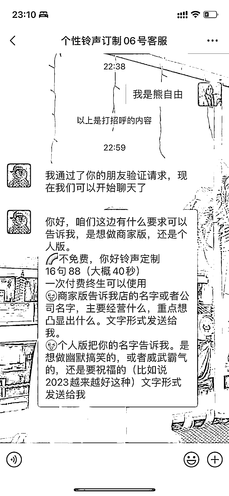

 

 

 

 

 

 

 

 

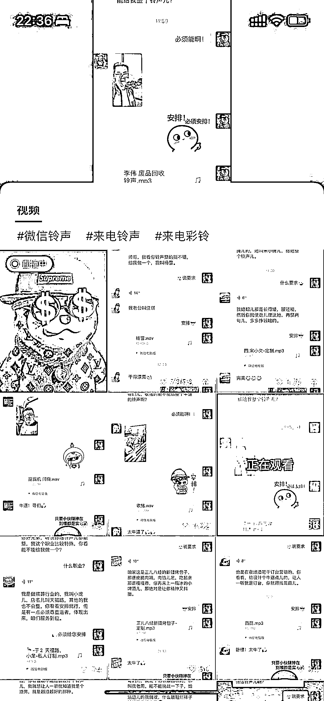

 

 

 

 

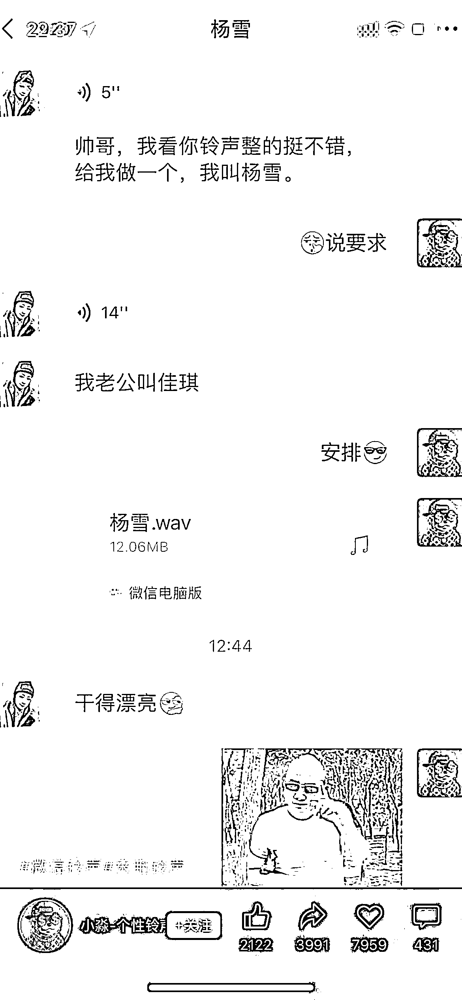

 

 

 

 

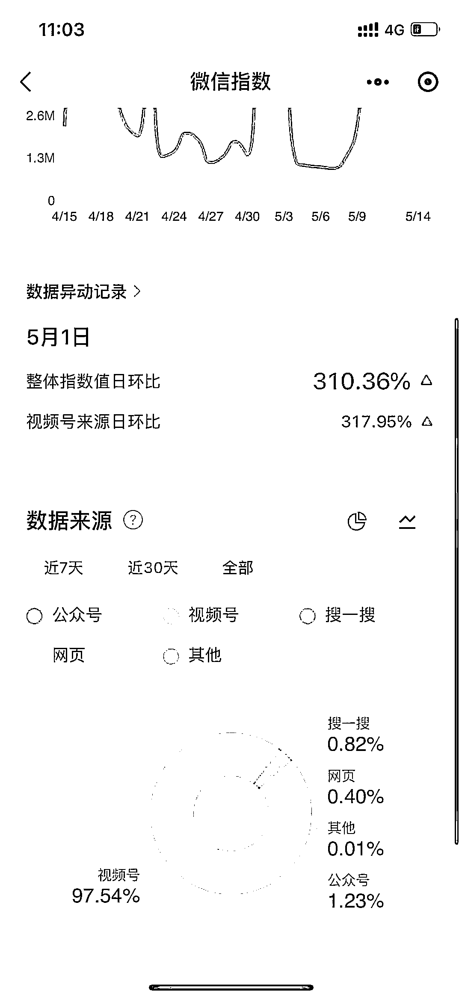

 

 

 

 

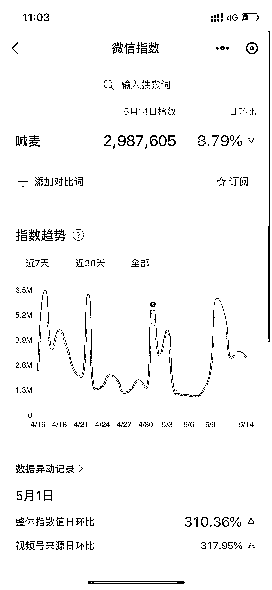

 

 

评论区：

Unbrick : 结合ChatGPT生产力工具，就是定制化批量麻烦

姜姜 : 这个可以

亦仁 : 中标，术值+1。

在上方专栏点击 #中标，可查看所有中标风向标。

晨哥 : 用什么软件可以制作呢

熊自由 : 这大哥人工喊的，可以自己去闲鱼试着捡一个会喊麦的东北兄弟去**# ****(59**赞**)**视频号姓氏头像，评论区需求很高

作者：  肆零柒

日期：2023-05-29

 

 

视频号姓氏头像，评论区需求很高，都是求头像的。

视频制作方法简单，用小程序生成姓氏头像，配点音乐加点背景

变现:推的是小程序，可以看广告解锁或者充值会员。

充值门槛很低，周卡3.9，月卡9.9，视频号中老年用户比较多，他们不仅可以给自己做还可以给朋友做

 

 

 

 

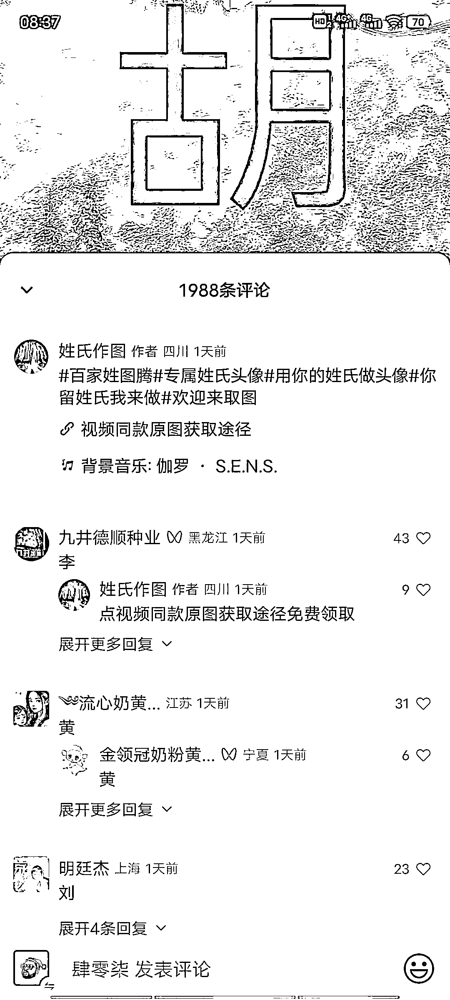

 

 

 

 

 

 

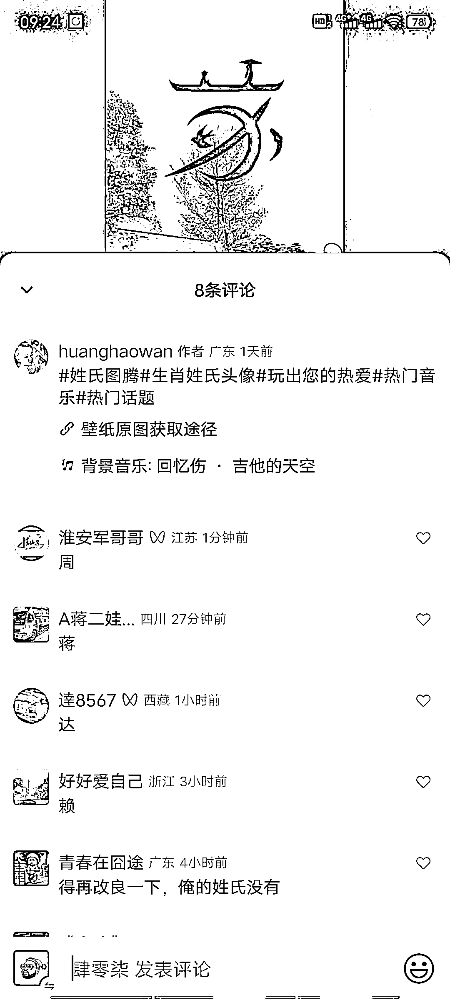

 

 

 

 

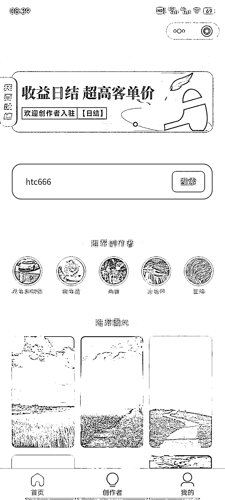

 

 

 

 

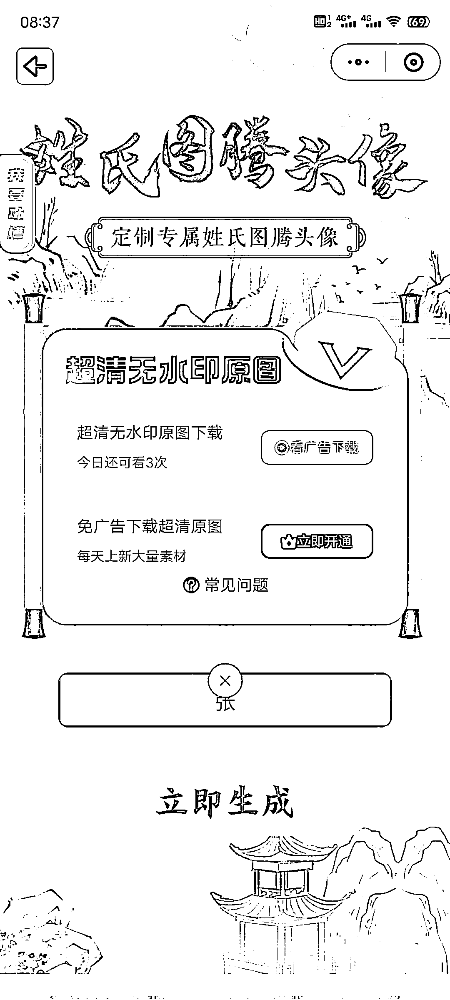

 

 

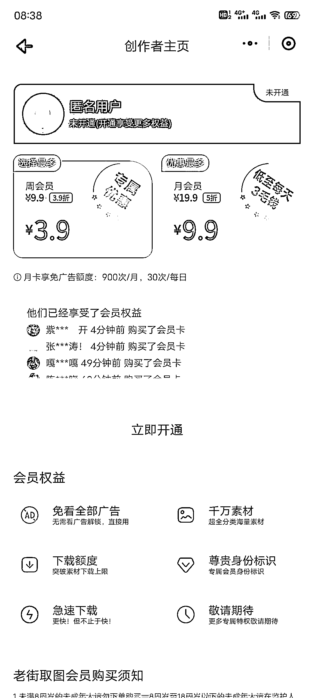

 

 

评论区：

毅恒(收售租二手机) : 试了一下，请问他这个动态文字怎么做出来的呢  ，在小程序里没找到，哈哈

亦仁 : 中标，术值+1。

在上方专栏点击 #中标，可查看所有中标风向标。

白宝香 : 在抖音也看到了

依稀阳光 : 这个我也看到了，进去先看个小广告才能输入，输入完生成第一个完全就是类楷书，需要在看30S广告才能继续看……估计找一个满意的要看很多广告，或者直接充值了

胖大魔 : 广子也是一个收入吧

闰土 : 招到了么  老哥

毅恒(收售租二手机) : 没呀

# **# ****(60**赞**)**站群版的**“**音乐**U**盘**”**项目，为中老年提

# 供便利

 

 

作者：  嘟

日期：2022-12-01

站群版的“音乐U盘”项目。

这是找小品的时候发现的，里面还有戏曲、二人转、相声，都是单独的站点。

之前还看见过国学资料、医学资料、佛学资料卖硬盘的，更贵。

为中老年提供便利，省去一个个下载的烦恼，很不错的生意。

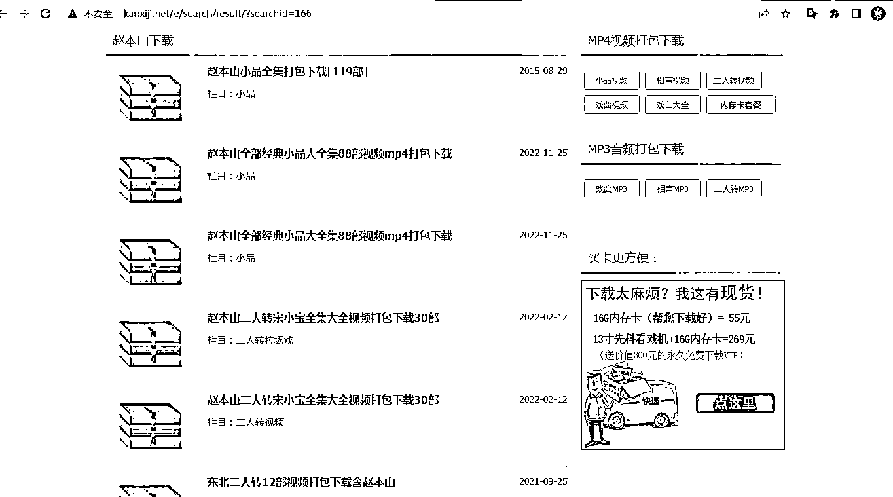 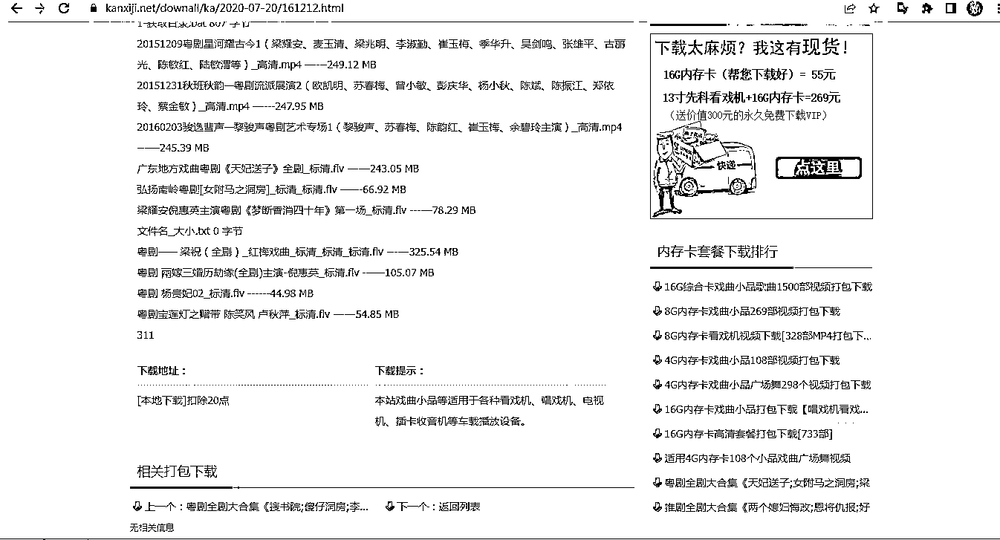

 

 

评论区：

亦仁 : 中标，术值+1。

在上方 #星球栏目  专栏中，点击 #中标，可查看所有中标风向标。

胖大魔 : 现在怕版权问题

# **# ****(57**赞**)**打造成中老年网红，售卖技能还挺有收

# 益的

作者：  高杰

日期：2023-05-05

找一些退休的有一技之长的中老年人，通过打造成中老年网红，售卖技能，比如一些学钢琴等技能，既能让他们发挥自己的余热，丰富生活，找到自己的价值感，还能有收益

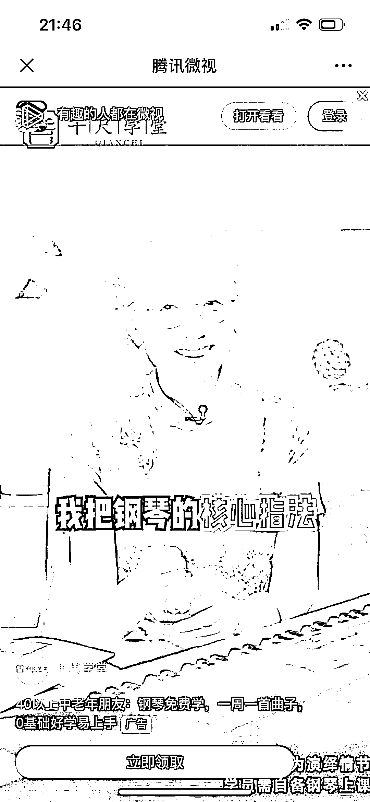

 

 

评论区：

亦仁 : 中标，术值+1。

 

 

在上方专栏点击 #中标，可查看所有中标风向标。

清风 : [抠鼻]smart

# **# ****(45**赞**)**根据姓氏引流

作者：  梁潆月

日期：2023-03-13

根据姓氏引流

视频直接写了电话号码“寻找同个姓氏的家人”

我首先想到的是可以直接加联系方式引流，像大学时看到的微商那样说免费送，但是需要付邮费。

评论区评论的应该都是中老年，问多少钱一件，引流中老年粉丝到私域，之后还可以卖其他的。

 

 

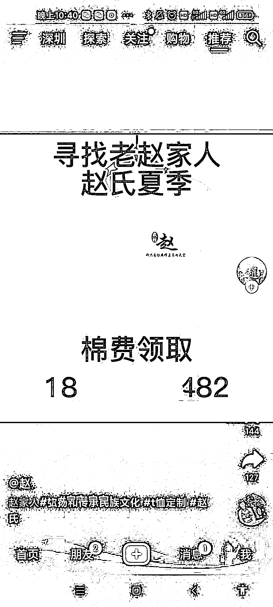

 

 

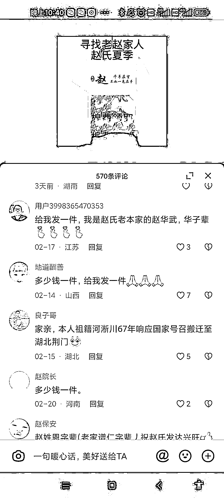

 

 

评论区：

亦仁 : 中标，术值+1。

在上方 #星球栏目  专栏中，点击 #中标，可查看所有中标风向标。

# **# ****(43**赞**)**针对中老年提供向** ChatGPT **的代问服

# 务

作者： do小鱼

日期：2023-02-17

我爸妈这两天都找我向chatgpt提问，他们也很好奇这个东西能干嘛，觉得很神奇很想一试。我爸给我发了个文档，里面有十几道问题来让我帮他找chatgpt回答，我看了一下内容都是跟健康、旅居相关的问题。是否可以考虑做一个针对中老年的chatgpt小工具呢？

或者针对中老年提供向chatgpt的代问服务？

 

 

评论区：

良辰美 : 文档链接发来看下？这可能是个机会

羊羊羊 : 同求文档，是很精准的需求

亦仁 : 中标，术值+1。

在上方 #星球栏目  专栏中，点击 #中标，可查看所有中标风向标。

# 【赛道机会】**7**篇

# **# ****(**精华帖**)(529**赞**)**电商领域最后一块增量市

# 场，高客单、高利润的老年电商机会分享

作者：  张集慧

日期：2023-01-21

现在的老年人市场，刚刚开始，还在萌芽阶段，是真正的一群全新的增量用户来消费，他们和以往的用户有很大的不同，他们直接跨过图文电商时代，直接进入了视频电商时代。

网购已经不再是年轻人的代名词了，随着千元智能机的普及，微信支付宝的渠道下沉，以及视频带货的生动效果演绎，大大降低了老年人群的网购成本。

至于老年人群的消费刻板印象，比如舍不得花钱、斤斤计较、谨慎下单，也是没有搞清楚真实的老年消费者的特点，其实他们是有源源不断的健康需求、可支配收入多的、不擅于多平台比价的。

 

 

今天这篇文章看标题，会感觉这个内容是不是写的有点大呢？可能会让人感觉有点空，读起来不如我以往的一些实操文章感觉爽。

但是你相信我，这篇文章，远比我以前的9篇龙珠文加起来的价值都要大。以往文章中的点子、方法，大多是有局限性的、时效性的，可扩展性不是很强，但是这篇文章，是我开始改变思路，从盯单个项目，变成盯一个人群。

平台会变，规则会变，热点也会变，但是人的行为模式，消费习惯一但养成，他变化的的周期往往是5-10年为一个周期的，更适合考虑长期项目的你。

我是张集慧，19年加入生财，写过9篇精华，最近一年多，输出的东西有点少，因为更多的时间，都花在了我现在做的老年人电商上面，一年时间去熬出一篇文章，希望能带给大家一些启发。

文章目录：

**1**、老年电商市场现状

**2**、老年人市场分析

**3**、老年消费习惯分析

**4**、老年产品如何做

**5**、怎么做好一个赚钱的老年抖音号

**6**、未来老年人群的机会

在开始这篇文章之前，我想让大家先看一个数据，通过异常的数据，发现问题，带着问题和思考往下看，效果应该会更好。

 

 

下面的数据是最近一个月抖音直播带货排行榜前十里面几个具有代表性的账号的粉丝数据，比如知名的小杨哥，东方甄选之类的，核心购买力人群都集中在31-40这个年龄段，唯一特殊的就是新疆和田玉老郑的账号，排名第三，一个月销售额1亿左右，50+以上的粉丝，占比近一半。

一边是一些头部大号涉及老年人消费很少，一边是个别账号，老年人消费数据客单价，利润都很不错，造成这两个极端的原因在哪里呢？

下面，我用我这一年时间做抖音老年人人群内容，带动几千个账号，创造出多个10亿级以上话题的经历，来粗浅的分析一下。

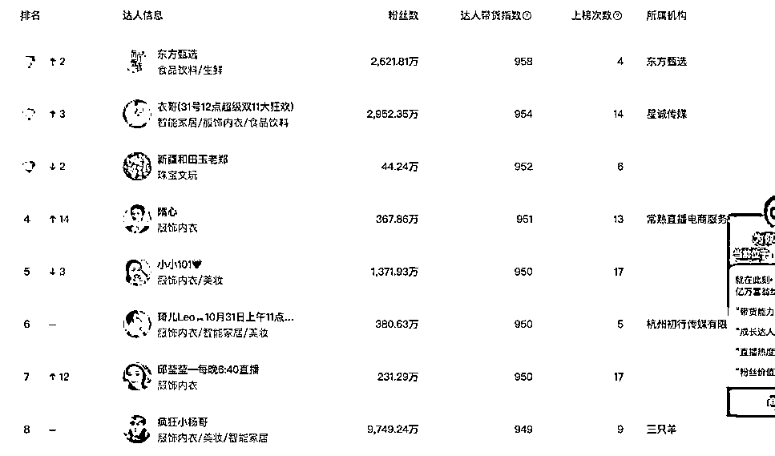

 

 

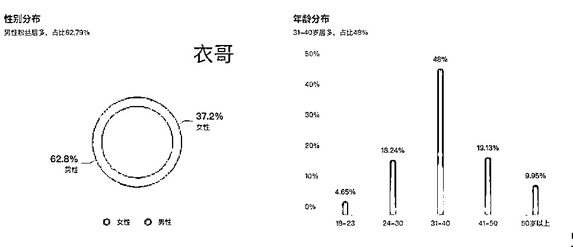 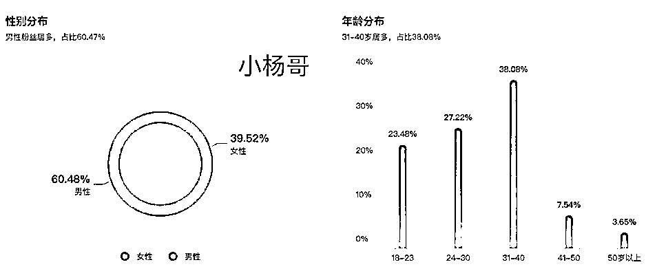 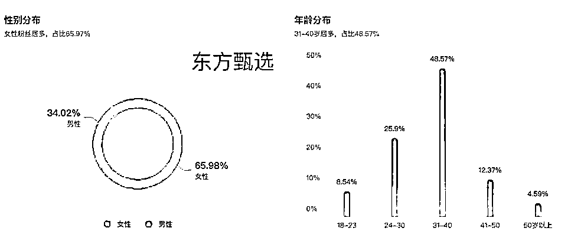

 

 

# **1**、老年电商市场现状

我开始做老年人市场，也是无奈之举，19年的时候就尝试过抖音，虽然有播放量，但是变现途径完全没有，也尝试过带货，最惨的时候，40w播放出一单19元的品，后面从心里就抵触抖音，不想做抖音了。

21年上半年8个月，不同平台，尝试了很多不同的方向，一事无成，最后实在没有能去做的事情了，只剩下做抖音了，就硬着头皮再来做抖音，死马当活马医，不成也不损失什么。

 

 

既然要做，就要做分析，要捡软柿子捏，硬碰硬不是我擅长的，31-40人群，盯得人太多了，我只能研究头尾，儿童或者老年人人群，先着手的是做儿童类内容，但是数据很一般，后来一想，儿童类的内容，受众也是他的父母，人群还是31-40重合，还是红海，那就只有做老年人了。

我知道大家喜欢看数据，不喜欢听太多的基础分析，那我先把这一年里面比较有代表性的数据亮一下，看完数据，再听我啰嗦？

**a**、流量

由于老年人内容的稀缺性，所以很多爆款视频可以多次爆火，只是简单换个背景就可以。如下图所示，抖音不同账号，发布同一个视频，只是简单换个背景，每次都有500万+的播放量。

今年4月7日，我在社群建议大家把发抖音的中医类视频发布到视频号，一周后视频号中医的流量达到峰值，在抖音爆火的视频，在视频号播放量达到3300w+，这一波中医内容也直接带火了视频号，从5月开始  ，大量内容创作者入局视频号。

 

 

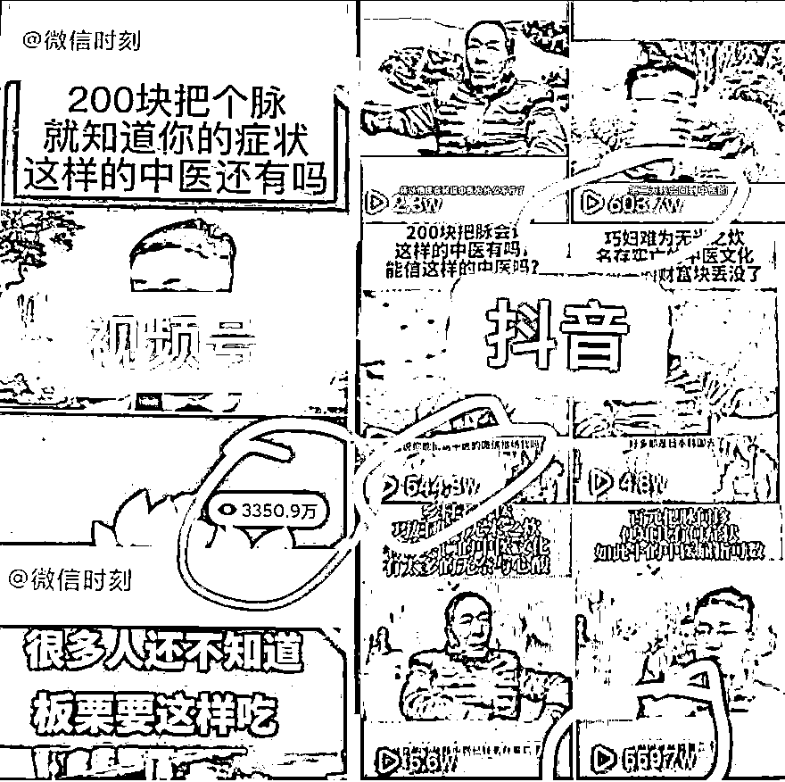

 

 

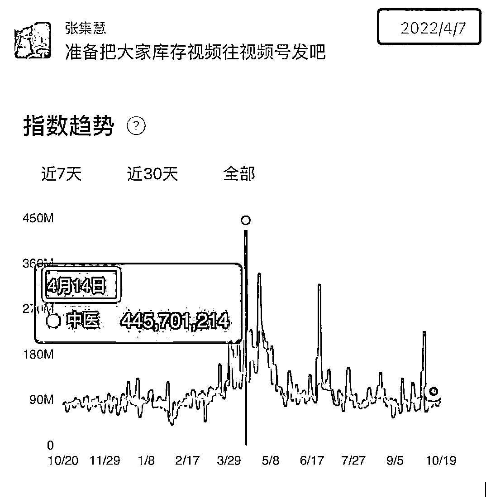

**b**、销售数据

中老年产品类目，还处于一个初级阶段，还没有太多专业团队进场，基本都是视频自然流量，不做投放，而且很多类目也不允许投放，所以最终数据都是纯佣金，50%以上的高佣金，都可以进到你的兜里。

下图几个单品曾经占据分类榜单的top1

 

 

 

 

 

 

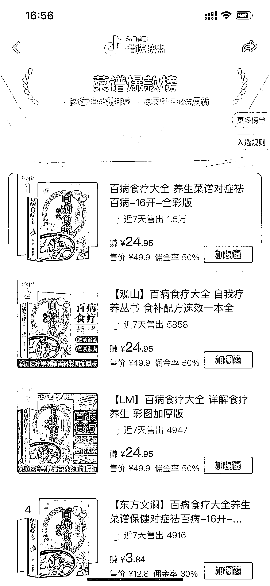

 

 

 

 

 

 

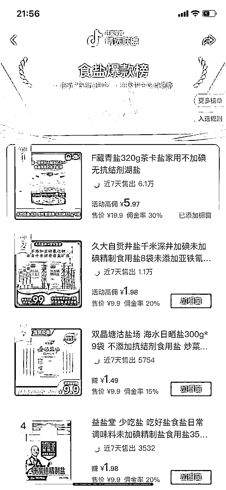

单视频454w播放，佣金8.1w（部分图片时间较久，无法找到原图，部分图片已打码，望见谅）

 

 

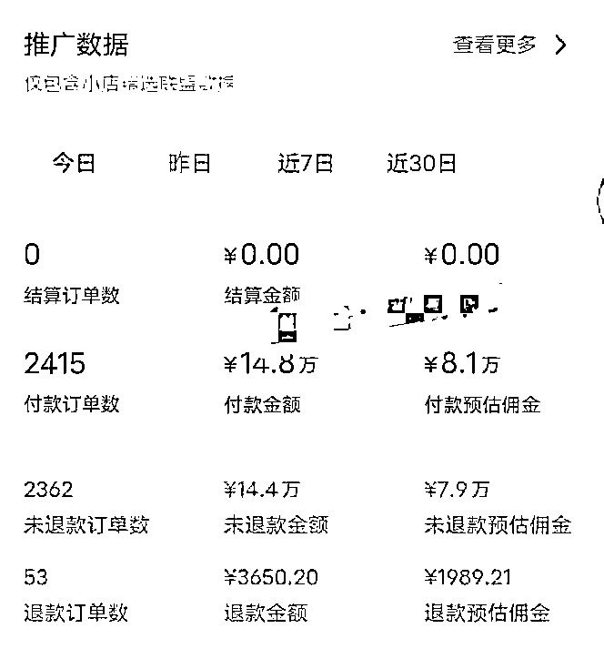

 

 

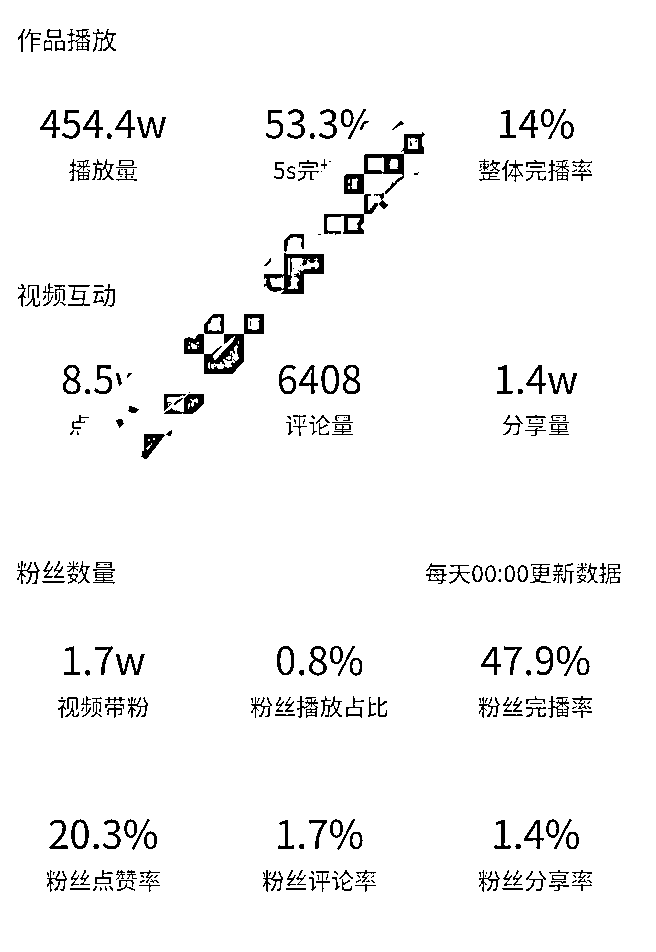

 

 

高客单，高佣金，代表性的有土单方套装，客单价在150元左右，佣金可以达到60-74%。

食疗，食补类产品，因为是消耗品，单价100元左右，但是有部分人会买半年或者一年的量，所以也会有不少高客单出现。

 

 

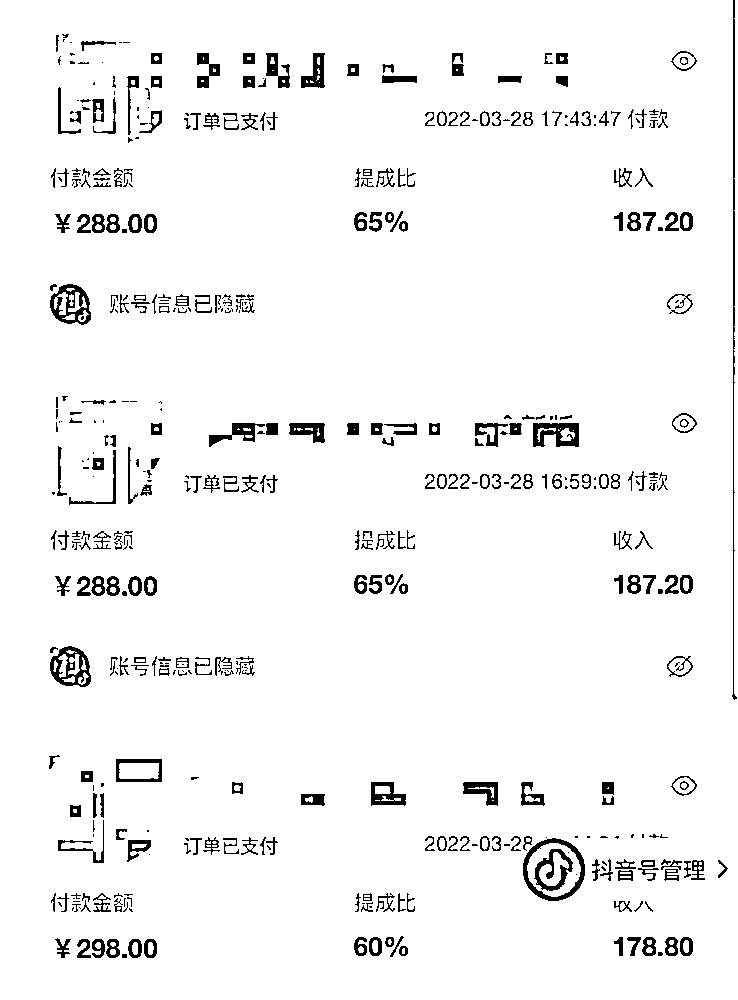

 

 

 

 

 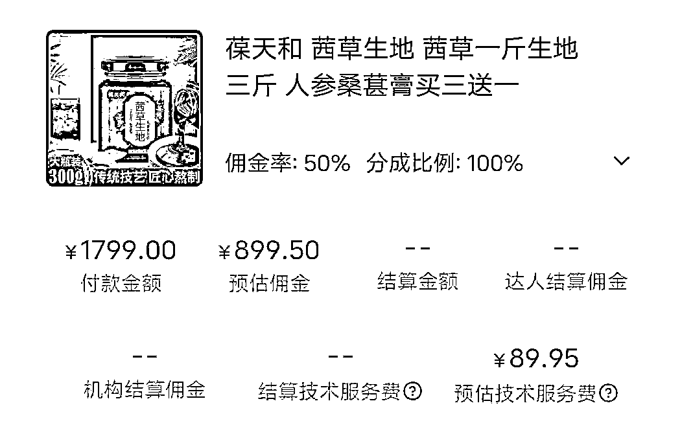

如果看完以上数据，你感兴趣，那么就可以听听我下面的详细分。

针对老年人市场，很多东西都是认知上面的问题，赚不了老年人的钱，就是不够了解他们，往往就是那么一层窗户纸，捅破了，你就会发现，这个人群原来这么神奇，根本不需要你有什么花哨的技术分析，什么黑科技加持，你只要做的是用心了解他们，给他们想要的就行。

但前提是你要从多个角度，去真正了解这个人群，要用心了解，不是表面的看几组数据，看一些粗浅的东西，就觉的了解这个人群了。

 

 

# **2**、老年人市场分析

在大家的印象里，老年人怎么可能网购呢，网购是年轻人的代名词，老年人怎么可能玩的了这些时髦的玩意，从淘宝网上线到现在，差不多20年了，网购已经深入人心，感染着身边的每一个人，老年人怎么可能不心动，他们的购买力没有释放出来，是有几个原因的：

1.硬件条件制约。

最早的网购人群，大部分是上班的白领，日常使用电脑，随时随地摸鱼逛淘宝，网购剁手，已经是上班生活中的一部分，等智能机到了年轻人手里的时候，移动端网购那就更方便了。

但是看看老年人这边，大部分都退休在家，家里有电脑，而且会用电脑的人，凤毛麟角，年轻人的iphone手机一遍遍刷着物流信息的时候，老年人的手机，还只能接打电话，硬件条件的制约，就限制了他们网购的第一步。

而这几年，随着智能机，千元机的普及，老年人终于甩掉了按键手机，也步入了智能化，随着智能机进一步普及，网购在老年人中的渗透率还将增加。

2.支付渠道下沉。

 

 

得益于支付宝，微信各种拉新，刺激消费的活动普及，才让老年人愿意接受线上支付，打通了支付渠道这个关键步骤，如果不是做这些下沉的工作，以老年人的习惯，你让他扫个码就把钱付出去，输几个数字钱就到别人手里，那是万万不允许的。

日常买个菜，交个费啥的，他们习惯了支付，就会觉得支付也没那么可怕，不会有太大的风险，这样真正到了电商购物，线上产品还没拿到，就付款，他们才会接受。

3.购物渠道体验不同。

淘宝，京东系的图文电商购物，作为年轻人，多少年来已经习惯了，但其实和视频带货比较，差距很明显，一款产品，在视频里面呈现出来的效果要更好，尤其老年人，一上来有了智能手机，就接触的是抖音、快手视频号，哪经得住这全方位的轰炸，马上就是买买买。

# **3**、老年消费习惯分析

一提到老年人，是不是都有一个固有的印象，老年人舍不得花钱，特别在意价格，斤斤计较，买东西特别谨慎？

 

 

真实的老年消费者，有以下几个特点：

**1.**注重健康。

小孩怕笨，女人怕丑，男人怕不行，老人怕死，这不是营销界的至理名言，话糙理不糙，健康是老年人最大的痛点，从健康这个切入点来入手，很多东西都会容易很多，中医相关的知识，几乎任何老年人都绕不过，一边是几千年文化的传承，一边是老年人多年实际经历的过程中感受过中医的作用，对中医内容天然就接受，天然就有好感。

所以有这个前提，就可以卖一些中医相关的书籍，无论是经典的中医典籍，还是与日常常见病调理保健，或者是食疗养生健康类目的书籍，都可以作为销售的品类。

** 2.**强购买力。

老年人里面的部分人群的购买力，是远大于年轻人的，最主要的是可支配收入多，相对于中年人  ，房贷车贷占据大头，日常消费的金额不足，这一点，从各种政策拉动内需其实都可以看出来，真正的购买力是不足的。

反观老年人，几乎没有大额的消费，日常生活的花销占比也不算太多，这时候，撬动购买力，是有真金白银可以支持到的。

**3.**价格不敏感。

在淘宝、京东之类平台，消费者已经习惯了比价，这些规则已经烂熟于心，哪怕便宜5毛钱，也会开心很久，这个比价的习惯也是多年慢慢培养出来的。

 

 

老年人接触电商，完全还是新人状态，新鲜还来不及，遇到自己喜欢的产品，还处在能购买成功就很开心的状态，搞价？比价？什么鬼？而且，很多产品，心理价格不明确，比如书籍，日常在书店买，就是标价卖，殊不知，成本就是一折左右。

一本书该值10块还是80，这个其实没有一个心理价格，只要觉得有用，喜欢，80也会买，他不像是卖土豆，卖鸡蛋，价格烂熟于心，应该是4块钱，你今天涨5毛钱，他立马就觉得你卖贵了。

**4.**错误的老年数据。

早期的老年人市场，很多类目其实是一个伪老年人市场，因为他真正的用户不是老年人，而是为了老年人产品买单的年轻人，他们是老年人的子女一辈，他们的消费习惯，对产品的选择，是年轻人的需求，是他们认为老年人的需求，所以这个需求数据，消费数据，面对真正的老年人用户的时候，很大程度上是会失效的，因为他们是完全错位的。

# **4**、老年产品如何做

 

 

前面内容铺垫那么多，其实都是为了理清老年人这个市场怎样，老年人习惯怎么样，喜欢消费什么样的品，是一套粗糙的方法论。

现在的老年人市场，刚刚开始，还在萌芽阶段，是真正的一群全新的增量用户来消费，他们和以往的用户有很大的不同，他们直接跨过图文电商时代，直接进入了视频电商时代。

针对这种情况，要有不一样的策略。如果按对年轻人的策略来思考问题，把对年轻人的一些方法拿来用，基本没什么效果，就像你做过淘宝电商，来做抖音电商，会水土不服一样。

**1.**内容为导向。

老年人电商这块，因为没有前辈的数据可以参考，现在进来的很多都是在拓荒，那为了更高效的测出好卖的品，肯定不能以产品为导向，如果先选品，再去做内容，整个过程都是猜，猜用户可能喜欢这个产品，猜这个内容用户可能喜欢，这样，失败的几率极大，毕竟，大多数人，都不了解老年人。

如果从内容角度出发，效率就要高很多，因为内容是直接触达用户的，点赞评论等等数据直接反应出来用户的喜好。

从内容中去挖需求，垂直的老年人的内容很少很少  ，因为前面提到的原因，大家都不知道怎么去做老年人变现，没法变现，纯粹的用爱发电来做内容就很不现实，所以老年人内容是极度稀缺的，缺内容，那你就去填补内容，有流量一切就都好办了。

我当时做老年人内容，第一个思路去验证就成功了。不是我运气好，是这类内容太缺了，痛点也太多了。

 

 

健康----中医----中医相关产品

比如刚才说到的中医切入点，为什么我选这个点，不选其他呢，做垂直内容，吸引精准粉丝，那你的内容，就要有排他性，某个人群特别喜欢，别的人群很少关注，这样的内容才是好内容。

你吸引来精准粉的同时，过滤掉了无用粉丝，粉丝越精准，后续的变现越好做。

内容部分，一般是分两部分，一类是流量内容，有噱头，有话题性，同时也能引起争议的，这样的内容，停留数据会很不错，点赞、评论、转发、等等数据也会明显优于其他内容，尤其中老年人，遇到喜欢的内容，点击转发的热情度比年轻人大的多。

另一类就是带货内容了，带货内容，更多的是要强调出产品，  内容能短就不要长，言简意赅，直击痛点即可。

流量内容和带货内容就像线下商店的引流款商品和利润款商品一样，靠流量视频把目标用户拉过来，完后带货视频做成交。两者相辅相成，缺一不可。

**2.**产品选择

因为是内容为导向的，所以产品选择上其实是有一些局限性的，要跟着内容来，所以产品选择有一些特殊性。

 

 

1）高客单。一定要做高客单，不要迷信那些所谓的低价的品好卖，你卖低价品，吸引来的也是图便宜的人群，平台给你推的人群也是消费能力差的人群。

比如中医相关的书籍，大家心理会存在一个担心，价格便宜的，会不会质量不好，会不会有错误，这时候，几十元的差异，在最终的消费决策中，并不会有太大的影响。

下图是今年我的抖店一个卖的不错的单品的数据，明显可以看到，多个SKU，买3本146套餐的，占比57%，买单本59元套餐的，加起来占比42%。

老年人有个理念，他认为值的东西，要买就买好点，要买就买全套。

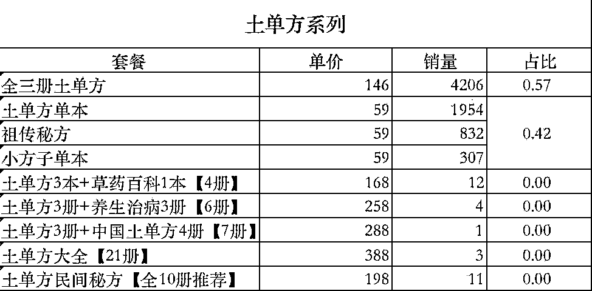

我们卖几百的感觉客单已经不低了，但是看到几家卖精品图书的，几千客单的品，出单也不错，老年人的消费能力，只有你想不到，没有他们做不到。

 

 

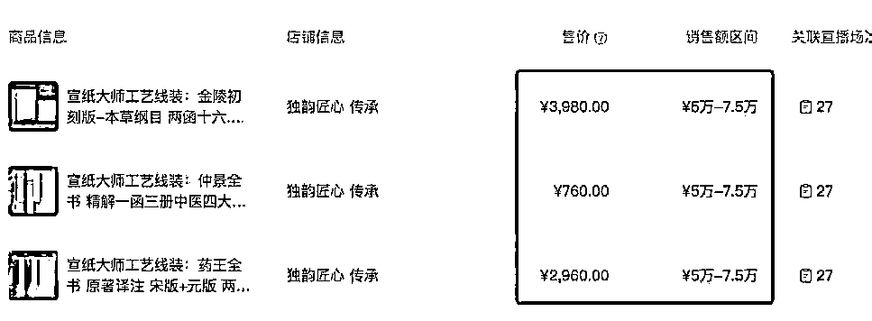

**2**）产品卖点的提炼

产品要想做好转化，各个链条的细节其实都要做好，比如产品的标题，产品的封面图等等，但是很多商家做不到这些细节，这种情况下，自己开店，自己优化标题，优化封面图等等，就很有必要。

** a.**封面优化

要想优化这些细节，就需要去观察竞品的买家评论，再结合分析。

比如我上图中卖的不错的【土单方】，就是观察用户的评论，说书很大，字也很大，看的清晰，我就在我的封面图上面加了简单的四个字【大字大本】，效果就很不错；有用户看了低价的链接，返回了找我买高价的，虽然我们卖的都一样版本，但是用户并不清楚，他以为我们的是大字大版。

这几个字，很多同行看到，估计都没有留意，他们也没有去照抄，在他们的理解里面，大字大本这不是正常的么，怎么可能是卖点呢？

 

 

**b.**标题优化

产品封面图、产品标题是最直观的几个点，所以标题优化，排在第二位，而且，标题可能就是几个字，就起到很关键的作用。

比如同样是土单方，我会在标题加【即将失传】几个字，给人一种紧迫感，感觉是即将失传的方子，很珍贵，错过今天，过几天再买可能就没了，这也是日常逼单中的一些小套路，简单几个文字就可以达到效果。

 

 

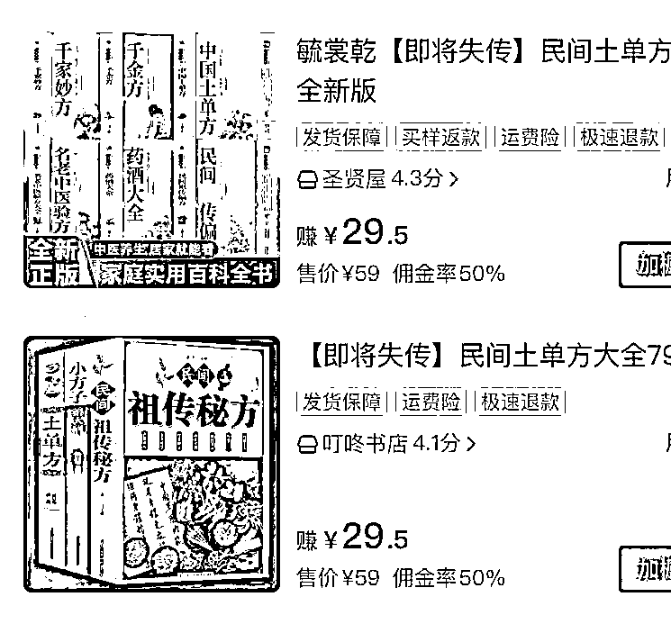

 

 

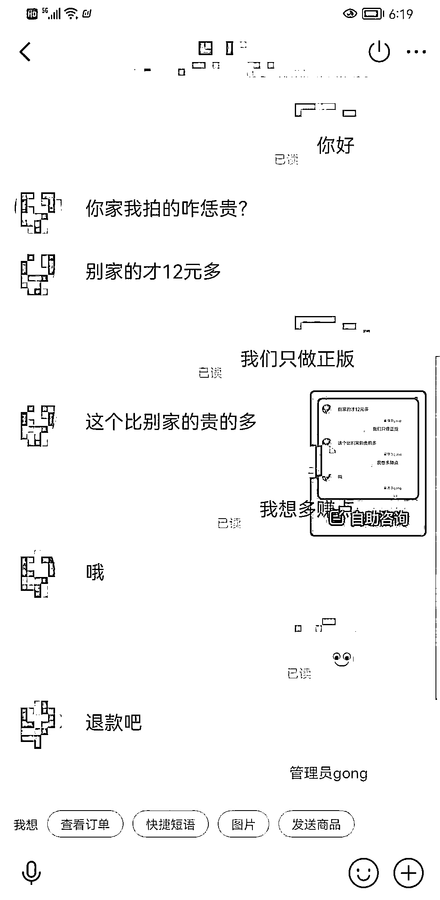

 

 

 

 

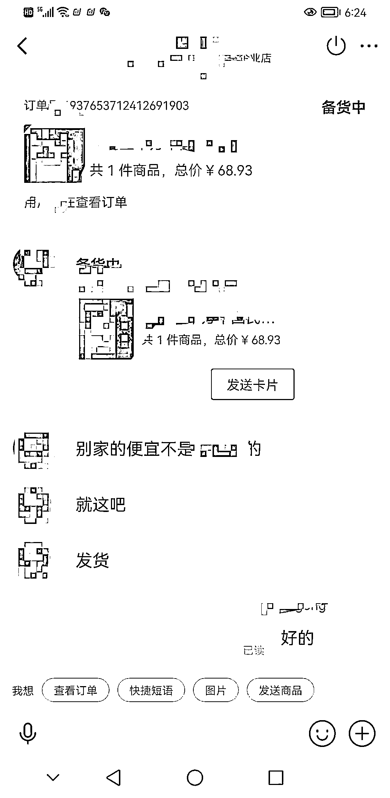

 

 

**c.**包邮问题

在我们这么多年网购的习惯中，以及商家内卷中，包邮已经是一个约定俗成的规矩了，虽然是羊毛出在羊身上，但你再怎么样，邮费是不能直接收的，否则很多消费者到付款页面，看到邮费，直接就气跑了。

但是老年人，很多还没经历过这一切，他们还不太清楚包邮这一说，你收邮费他们认为也是应该的，所以能看到我下方的一个数据，邮费赚了上万元，这钱完全是白捡，不要白不要。

当然，这个包邮问题，不是一成不变的，用户也会被市场教育，慢慢也会不接受付邮费的商品，这里我只想说明一点，就是用户习惯培育过程中，还是有很多的点可以赚钱，固有思维能丢掉就丢掉，多尝试，多从老年人这个人群来考虑。

 

 

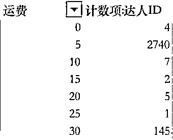

# **5**、怎么做好一个赚钱的老年抖音号

这篇文章，我是想从宏观的角度分析老年人电商市场的，和大家来一起分享老年人这个人群的一些特色，至于落地去做一个赚钱的抖音号，那完全可以再详细写一篇文章了。

 

 

这里呢，我先简单的写一下，把核心的一些点来讲一下，大家如果有需要，我随后再开一篇文章，单独把这块讲一下。

**1.**账号注册

账号是要做老年人内容，所以从昵称，简介、到背景图，文字、配色等等，都要从老年人的角度来考虑，多观察一下做老年人内容，尤其是中医内容的账号，账号的细节都值得参考。

账号注册建议一次多个账号来注册，因为不论是做IP号还是带货号，都是批量去做，完后从里面选一个数据好的重点来培养，做账号多了就会发现，同样的人、差别很小的同样的内容，发不同的账号  ，数据会有天壤之别。

 

 

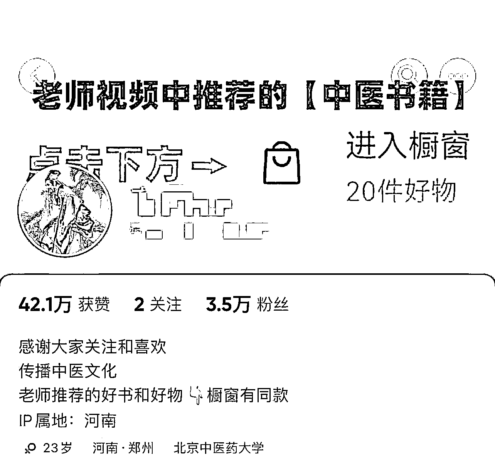

 

 

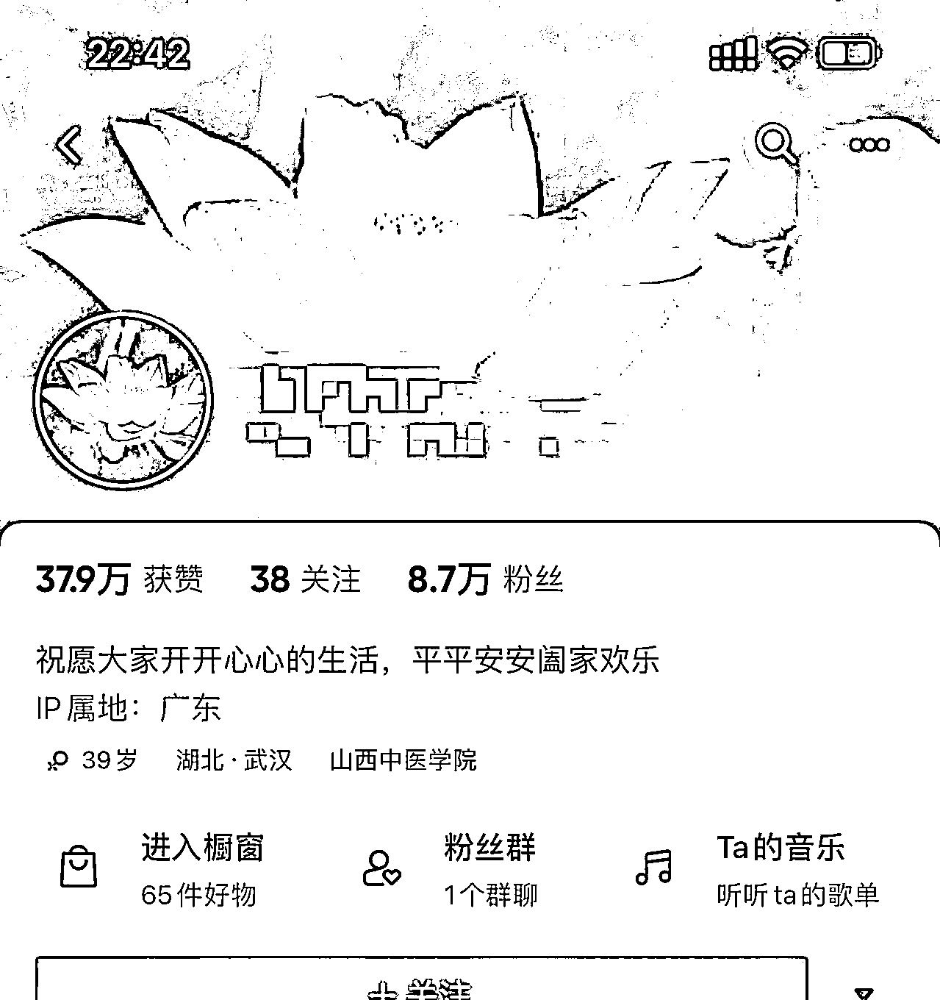

**2.**账号运营

账号注册完，摆在眼前的第一件事，就是做内容，要做好内容，要注意下面几点：

**a.**丢掉错误方法

 

 

市面上流传着很多让人哭笑不得的玄学说法，做抖音前，一定要把这些东西从你脑子里请出去，比如下面几点，流传盛广，毒害最深。

1）抖音没有养号一说，内容创造者和抖音用户，是一个账号上面的两个角色，拿用户角色去刷抖音，去给内容创作者角色养号，逻辑都不通，就好比一个人在家里担当两个角色，既是儿子也是父亲，他爹贫血，他买了药给儿子补血，这不扯么？

2）要想带货，想要1000粉，只能好好去做内容，一点点吸引垂直粉丝来，别想着我买1000粉，开了橱窗立马带货，让1000人关注你都做不到，你怎么就有自信让人在你橱窗下单呢？做内容，吸1000粉，是你熟悉这群用户，打磨内容必须要经历的过程。

3）一机一号，流量起号，这也是无稽之谈。一提到做多号  ，就想到号群，就想打一些不太正规，平台不喜欢的操作，这些人在平台眼里，是要斩草除根的，所以会封他设备，封他IP，所以才有一机一号，用流量的传说。

但是，你现在是在带货，抖音是抽10%个点技术服务费的，说白了，你和抖音是合作关系，你做号越多，抖音赚的越多，他没事限制你干嘛，如果他不想你做多号，为啥还加一个多账号切换？吃饱了撑的没事干么？我们线下几十台手机上百个号都用同一wifi，也没见出问什么问题。

** b.**内容

你开始做一个新的类目，最好的开始的方法就是模仿，账号细节模仿，内容完全也可以去模仿，不要一上来，就要创新，就用你的固有思维认为别人的内容不好，来推翻重构。

比如下面的视频，都是几十万赞，看着平平无奇，那这类内容好在哪里呢？

 

 

1）核心是内容，这位赵霖教授军人出身，说话掷地有声，说的也都是关系普通人的日常生活的内容，尤其是老年人。

这样的内容，如果从年轻人的角度来看，自己一点都不喜欢，完全没有意义，你去找你喜欢的内容给老年人看，那么老年人会喜欢么?

2）画面观感问题，如果从视频美观的角度来看，这些画面没一个合格的，字体排版粗糙，文字杂乱无章，颜色对比冲击，完全没有美感，那为什么这样粗糙的东西不会影响播放量，反而会起到帮助的作用呢？

标题的作用，就是在画面出现的几秒内，抓住用户，文字包含的信息是远超视频的，视频可能十几秒才把一件事情说完，但是十几个文字就能提炼出来核心，用一秒抓住用户。

既然标题是要起到抓住用户眼球的作用，那文字就需要抢眼，就要大，颜色要亮，要醒目，要突兀，才能达到他的目的，这时候，几乎不需要考虑美观的问题。

 

 

 

 

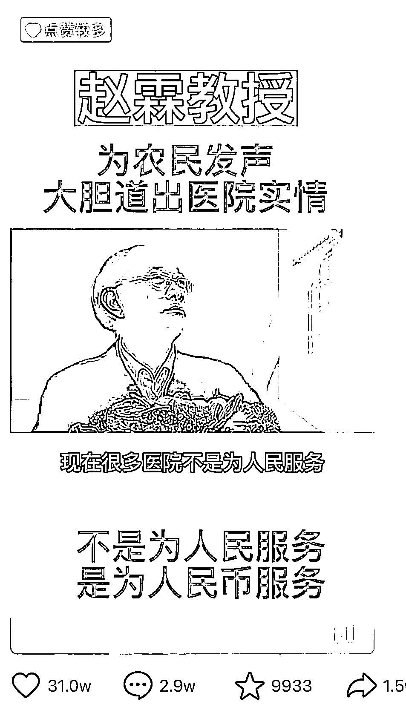

 

 

 

 

账号注册好了，内容也知道怎么做了，那剩下的就是多发视频，等着千粉开橱窗。

**c.**带货

等你千粉开通橱窗后，面临的第一件事就是带什么货，什么货品好卖呢？我最早卖的书，书的优点前面也提过了，这里就不多说了，那么什么样的内容才是好的带货内容呢？

比如以【土单方】这本书举例，这本书里面收录了民间的很多土方子，大部分是治一些小毛病的，比如咳嗽、牙疼，皮肤小问题等等，这些小毛病很多时候去大医院不值得，或者去了也不见效，这时候大家就寄希望于这些民间的土单方上面。

这种情况下，就可以用一些提到土方子治病的故事、传说等等的片段，来强化民间土单方可以治病，简单还办事这样的一个氛围，在这种氛围下，你视频中不去强调买书，他也会直接下单了，毕竟随便去去医院都不是100块钱能搞定的事情，买本几百个方子的书才几十元，还是很划算的。

 

 

 

 

 

 

 

 

以上就是做一个针对老年人的带货抖音号的大概流程，如果你有一些剪辑的基础，你其实马上就可以上手，去做很快就可以看到结果，并没有你想的那么难，因为他还是一片蓝海，几亿人的需求，才满足了冰山一角。

# **6**、未来老年人群的机会

老年人，相对于年轻人，经历过了多半生，相对于底层的生理需求，更多的在意的是安全需求层面的东西，即使生理需求安全需求交织在一起，也要向安全需求方向去做，因为相对于生理需求，安全需求层面可以做的东西更多，也更有价值。

 

 

从另一个角度，选品还是要有蓝海思维的，简单的复制衣食住行这些底层需求虽然简单，但是很多人都会想到，用不了几天，就是红海一片。

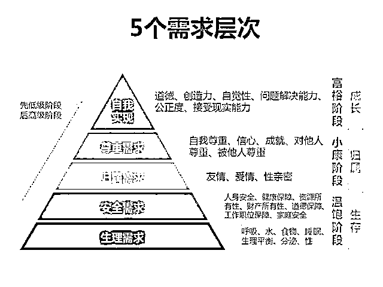

1.文化类产品

书籍类

这块是已经验证过的，高客单，高利润，极低的退货率，但是现有的书籍产品，还是有很多不足，很多书籍都是按年轻人的需求来印刷的，字极小，年轻人看都头疼，别说老年人去看了。

 

 

所以作为内容创作者，推荐书籍时候，尽量把老年人真正需求作为卖点，把老年人关注的点推广出去，慢慢让市场感受到，注意这些细节，这样建立一个完善的生态，作为整个生态中的一环，我们也能收益。

课程

也将是一个巨大的需求，老年人退休后热衷学习，其实就是为了自己晚年的生活不那么枯燥，他们更多的是从心底真正需求，而不像年轻人功利心那么强，所以这类针对老年人的内容，更需要用心打磨，要真正触动人心的好内容，而不是重营销，轻内容的样子货。

这其中的例子，就一个简单的广场舞，就可以出现糖豆这样的平台，数据就已经做的很不错了，如果在短视频平台围绕广场舞相关，可以做产品还有很多。

 

 

 

 

 

 

 

 

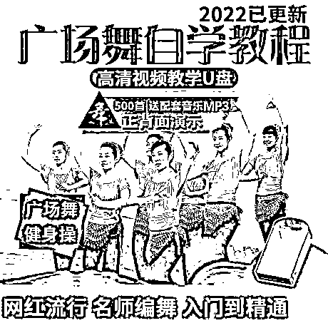

生活用品

看着老去的父母，行动慢慢迟缓，听力、视力可能都不太好，作为儿女很多时候，并不知道该怎么办，有时候买了产品，却发现很鸡肋，因为我们都是从我们年轻人角度想问题的，对于老年人真正的需求，其实并不了解，和父母沟通吧，他们心疼儿女，也不想让儿女花钱，一般也是推辞而过。

如今，老年人自己开始网购，他们不再需要麻烦儿女，自己也知道自己真正的需求，厂家在面对真正消费者反馈的过程中，也会将产品做出更适合的改进。

 

 

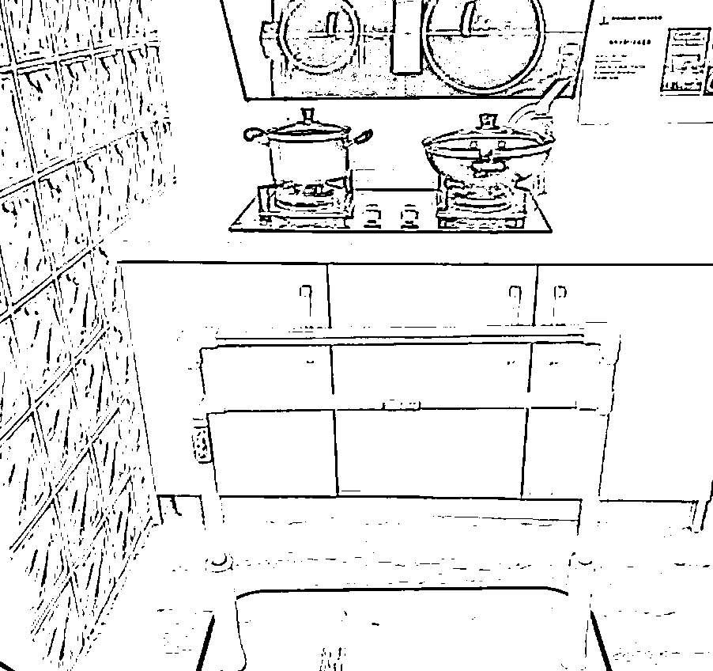

 

 

 

 

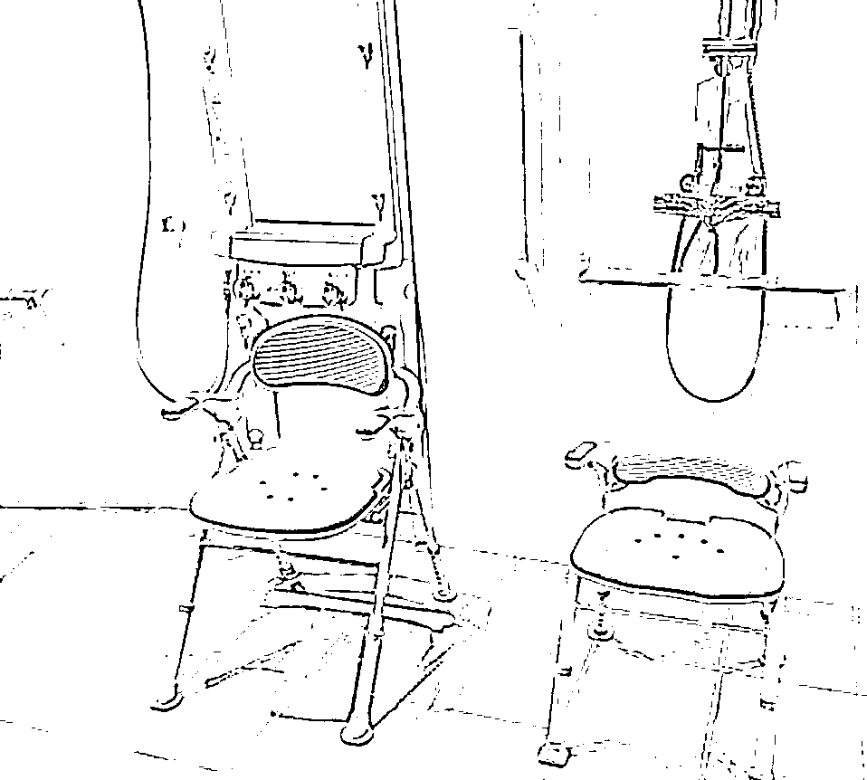

 

 

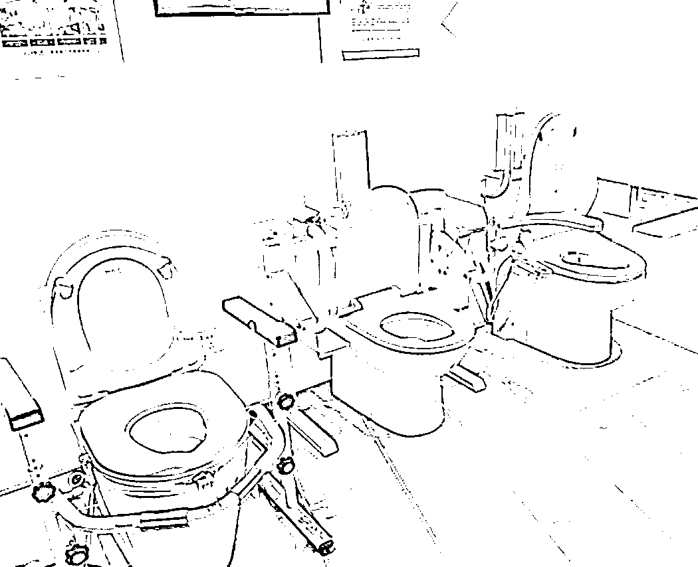

 

 

 

 

老去之后，我不想成为一座孤岛。

占据中国人口近五分之一的老年人，常常被排除在主流叙事之外。媒体的聚光灯鲜少对准银发苍苍的他们，而身为晚辈的我们也难以想象，一个人行至暮年时需要什么、期待什么，又在恐惧什么。

最近看到一篇报道里面，提到豆瓣有一个【适老化改造】促进会的  小组，里面的简介很有温度，我转载过来：

 

 

当我们或父母进入生命的黄昏时，现在的老年人所面临的困境——想和孩子交流却看不清手机上的文字、需要乘坐公交却不知如何出示健康码、前往银行取款柜台员工却听不懂方言、早晨起床时稳不住重心几欲摔倒——它们都会改换面貌，进入我们日新月异的生活场景之中，带来深重的困扰。

因此，我们应当将我们生活的世界，改造成一个老年人也能够安全、幸福地度过余生的世界……而这需要该换社会与市场的逻辑，需要每一个人关心老年人的困境与需求，并为之行动起来——无论什么身份，我们都可以为之贡献力量：更换家具、购买辅具、开发或选择老年版App、增设或捐赠无障碍设施…

就从这里开始吧！

随便翻几页，都会发现很多老年人的产品需求，很多需求可能连相应的产品都没有。

 

 

 

 

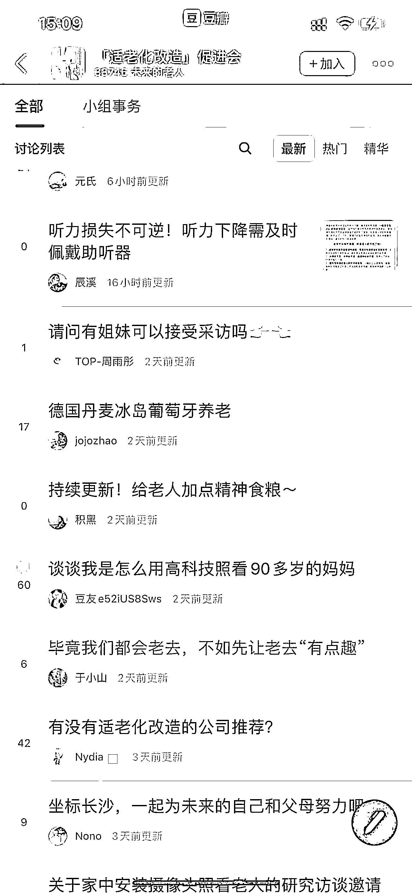

 

 

 

 

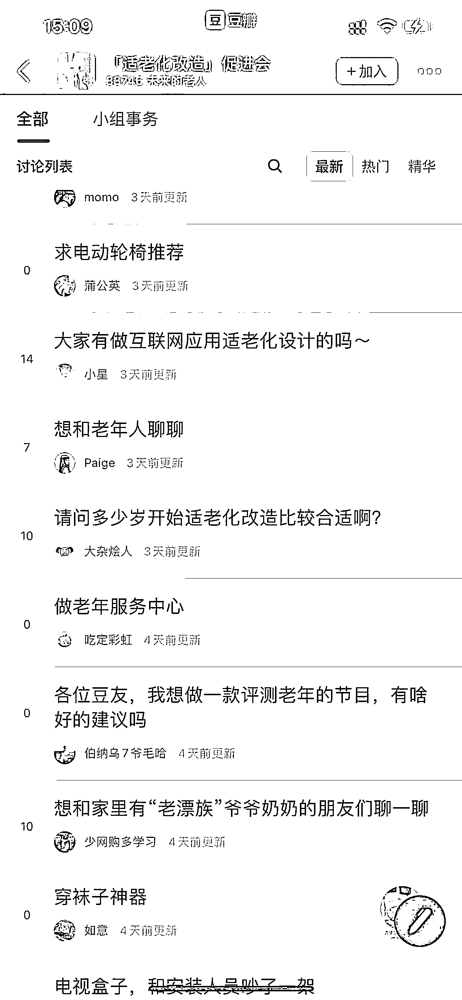

 

 

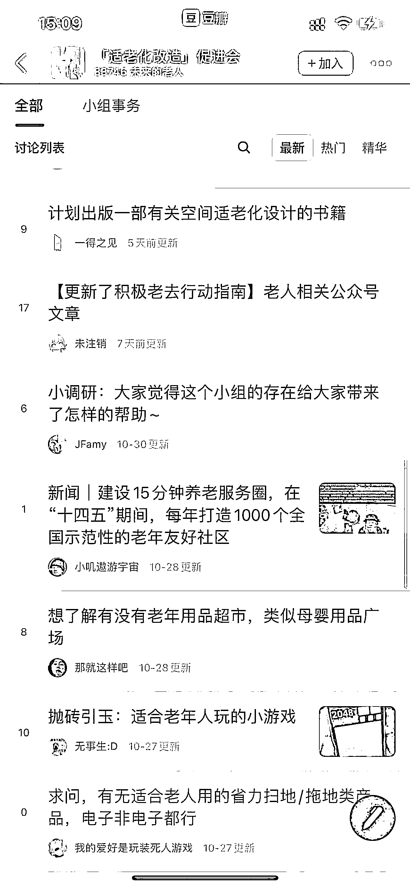

 

 

 

 

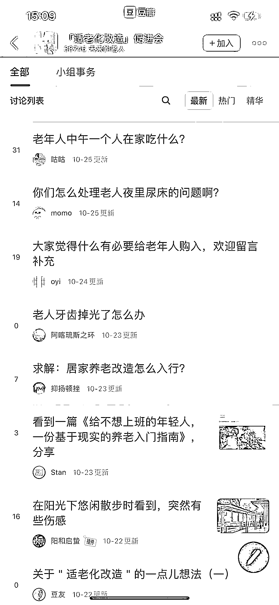

 

 

感谢能看到结尾的你，这篇文字中没什么科技与狠活，如果你是想一篇文章看到一个信息，立马就可以赚到钱，那可能会略失望，但如果你也像一年前的我一样，厌倦了周期短的项目，想沉下心来做一些长久的，想抓住为了几年的一个有潜力的方向，那么完全可以留意一下老年人这个人群，他一定不会让你失望的。

评论区：

-末末。 : 太棒了。给了我很多启发。

江南style : 写得真好，为了看这篇文章，沃锅里的鸭子都糊了[尴尬] Luke王子 : 感谢分享

花天卓 : 感谢分享，新年快乐！

施霖终生学习者-链接 : 慧姐[强][强][强]

草木青 : 慧哥牛逼，

高建中-扬州-婚礼庆* : 确实，老年人对健康的需求是刚需，就看我们如何从老人的角度挖掘需求，满足需求

小太阳发光 : 慧哥yyds

# **# ****(172**赞**)**聊聊抖音蓝海背后的几个核心点

 

 

作者：  张集慧

日期：2022-04-06

大家好，我是慧哥，最早在生财分享知乎好物，3篇文章拿3颗龙珠；20年双十一，淘密令骚操作，10分钟写5篇文章带货495w;喜欢挖掘原创新玩法的家伙。

在去年8月份，我又开始了抖音蓝海带货的尝试，20天内做到了单日佣金过7000，今年1月份最好数据，单日佣金破8万，而做到这一切的过程其实很简单，没什么高深的东西，已经有大佬在这里分享过方法了，我也就不赘述了。

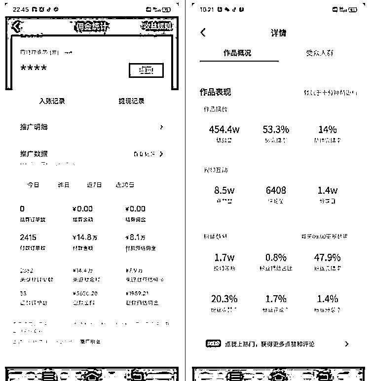

 

 

我今天想和大家分享的是如何在抖音找到这类蓝海的方向，和如何抓住这些蓝海的核心点。

做过抖音带货的话，应该明白，要想赚钱，无非搞定三高：

**1**、高流量

**2**、高客单

**3**、高利润

其实还应该有个高转化，但是人不能太贪心，能把前面3高搞定，就很厉害了，搞定3高还有精力，再去搞高转化也不迟。

对应上面的3高，我们一条条来说，

先说说高流量，什么内容有高的流量呢，除了有共性的热点内容，受众广的，剩下的肯定就是稀缺内容，现在抖音什么内容稀缺呢？

再来说高客单，什么人买什么东西，不太在乎贵贱，或者说他不清楚商品本身的价格？

最后说高利润，高利润还是和上面的高客单有直接关系的，什么人群对价格不敏感，你加价N倍，他都不觉得贵，你自然就卖出了高利润（比如下面这套书，我卖151，但是我去拼多多下单，才需要26.8元）

 

 

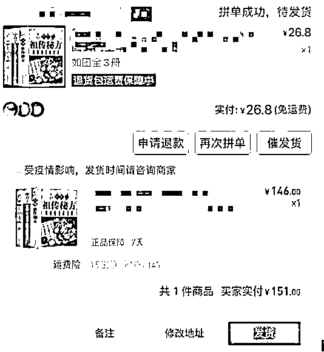

带着几个问题，进入今天的正题。

-01-

存量**&**增量

先看一张图，至于图里面的数据，是否真实，误差会有多少，我觉得不重要，大趋势是，抖音在抢传统电商的流量，在抢传统电商的用户，这个大趋势是明显存在的。

 

 

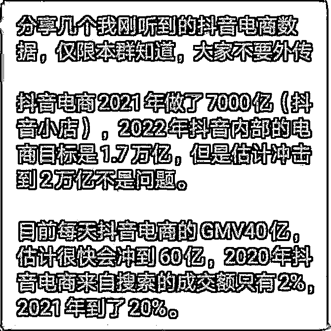

在写后面内容之前，我先定义一下新老电商，以淘宝、京东为代表的电商，因为展示形式主要是图文，那么就定义为图文电商；快手、抖音出现的短视频表现形式电商，就定义为短视频电商

那么，在抖音从图文电商手里面抢用户，抢流量的过程中，就存在一个抢存量用户还是抢增量用户的问题。存量用户，基本就是一片红海，虽然少部分类目切到抖音，吃第一口肉的时候，还是蓝海，但是这些在别的平台做的很大的类目，本身就有完善的电商销售体系，换抖音就是切一个流量入口，只不过大家有的跑的快，有的跑的慢，但是这个差距很快就会拉平，继续在抖音延续原来平台的商战，原来的红海又回到红海。

除了传统的图文电商手里抢存量用户，那增量用户又在哪里呢？以国人的勤奋程度，电商厮杀了这么多年，还有没被挖掘的用户么？有的，而且不少，这个增量用户就是**260000000+**老年用户

 

 

图文电商时代，商家应该也关注过老年人这个群体，但是渗透率是远远不够的，这个背后主要有以下几个原因：

【硬件支持】

1、几年前要完成网络购物，首先想到的就是电脑，但对于老年人，日常中使用电脑的人本来就少，能把电脑玩的很溜的人，更是少的可怜，年轻人工作中天天接触的电脑，对老年人来说，完全是个鸡肋，总不能为了网购，单独去买台电脑吧，这样的人少之又少。

2、再说回手机，早些年年轻人用智能机淘宝剁手，绝大多数老人还在用的是按键的绿屏机，有个简单的通话功能就行，很多子女帮父母买了智能机，也用不了。当时的老年人，要想网购，硬件这块就是一个大问题。

【支付问题】

说到支付问题，例如支付宝的使用，在年轻人开通支付绑定淘宝的情况下，感觉支付很简单，但是回想一下第一次申请支付宝，绑定银行卡，到注册淘宝，绑定支付宝，完后一些列的登录密码，支付密码，是不是有点晕，这个步骤，老年人操作一遍，可以流畅使用的可能性几乎为零，虽然微信支付普及好一些，日常生活中要用到，但是淘系又不支持微信支付，这就造成网购的第二个问题。

这两个问题没法解决，老年人网购的渗透率就上不来，而这两个问题，也不是几家电商平台可以解决的了事情，这一切，只能交给时间。

在后续的时间里，拼多多的出现，凭借微信对拼多多的流量以及政策方面的支持，让众多中老年人，初次尝试了网购，比淘系便捷的支付，以及病毒式传播的砍一刀，都让老年人实现了网购从0到1。

 

 

这个启蒙不仅带给老年人新体验，同时也让拼多多快速成长，这其中的农村用户，老年用户，这些增量用户，功不可没。

随后，随着国产手机品牌的崛起，高性价比的智能机，开始在老年人群众普及，相对于文字阅读的体验，视频更直观，对老年人来说也更加友好，老年人直接跨过图文时代，直接进入了视频时代，紧跟着遇到的就是抖音购物。

这一切来的真是天时、地利、人和，早一步晚一步，都没这样的效果。

**-02-**

消费习惯**&**消费能力

消费习惯

图文电商时代，主要依赖的是搜索流量，要想买一款产品，要先知道这款产品叫什么，才能去搜索，所有的需求，都需要在知道有这么一款商品的前提下，从商家角度来说，这种销售形式是完全被动的，算是被动销售。虽然有类似猜你喜欢这样的功能，但是猜你喜欢简单的几个标签，能达到的效果还是有限。

反观短视频电商，一款商品可以不知道叫什么，可以不知道什么功能，只要你拍个视频，在视频这个信息高度密集的载体里，展示产品相关信息就够了，眼见为实，自然有用户买单，这样算作主动销售。

 

 

相对于老年人，视频电商时代的主动销售更适合他们，年轻人会各种对比参数，比对价格，去小红书，去知乎等等看看种草文章，能进行这些比较和参考，是因为这么多年图文电商购物时代培养出来的消费习惯。老年人已经不可能再回去学习这一切，历史不会倒退，消费习惯也不会，就好比我们相较于欧美，直接就跨过了信用卡支付的繁荣，快进到了移动支付。

老年人，也跳过了图文电商，直接跨入了视频电商，所以你可能会发现，你的父母辈，爷爷奶奶辈，直播间购物比你都多。

消费能力

说到消费能力，我经常会开玩笑的说，年轻人上有老，下有小，车贷房贷一堆，基本都是负资产，虽然赚的多，但是大部分钱花哪些地方了，大家心里应该有数，反观老年人，特别是有退休金的这批老年人，大部分积蓄比年轻人多，房子也比年轻人多，手里资产，一点不比年轻人少，只是以前穷苦惯了，在日常生活上可能给大家的印象是，比较节俭。

但是是从我这边后台数据统计，很多产品多个SKU，单品和套餐之间，绝大多数都会去购买套餐，在他们的消费习惯里面，都决定买了，就买个好的，就买个贵的，买他一套。

这样，就和大家传统中认为的老年人舍不得花钱的观念有冲突，线下买菜，买鸡蛋之类的，他们是知道价格，所以才会比较谁家便宜几分，谁家便宜几毛，明明能省，就省点，但是网上看到适合自己的东西，新鲜还来不及呢。大量老年人第一次接触网络购物，就是短视频购物，简单的看到什么买什么，也符合老年人眼见为实，买的放心的心态。

 

 

短视频或者直播间看到什么，只能单向的接受视频或者主播的宣传，在这样的场景下面，没有比较，也就没有价格对比，这样产品值多少钱，很多情况下，老年用户并不清楚，觉得有用，觉得新鲜，就直接去下单了。而不是像我们当年PC时代，去搜索一款产品，比比图片内容，比比价格。

**-03-**

老年内容现状

以上内容我写这么多，这些细，就是为了扭转大家心目中老年人的印象，互联网在变，老年人也在变，在这一切变化中，以往的不可能，就变成了可能，以往啃不到的骨头，今天就突然变的肥美多肉。回到开篇我留下的几个问题，为什么老年人群体完美的满足上面3个条件？

**1**、高流量

抖音从业者，基本都是90前后的人员，输出的内容，关注的点，大部分都集中在自己同龄人身上，所以同龄人的内容，基本都是红海一片，要想在里面杀出来，难上加难，也许有人也尝试过老年人的内容，但很多时候，也只是表面了解了一下，完后觉得老年人应该喜欢这些，就像你妈妈觉得你应该穿秋裤，虽然本意是好的，但是你心里很抗拒，做内容也一样，很多时候，你觉的老年人应该看这些，但是他们并不领情。

这就造成了一个问题，抖音上几亿老年人真正喜欢的内容，是稀奇的，只要你做出真正的好内容，流量是相当的大，而且这样的内容，还是精准吸引老年人，年轻人都不喜欢，从内容开始直接就做了筛选，为后期的转化提供了帮助

**2**、高客单**&**高利润

 

 

高客单和高利润，除了前面分析老年人消费习惯的时候，提到的几个点，还有一个很重要的点，那就是要抓住老年入的痛点，怕死，你卖的产品，只要是和健康沾边的，不管是什么东西，他们都愿意付费，你线上加了10倍8倍，你感觉已经加价挺狠了，但是你和线下的比，还是差的很远，我听说线下一个杯子，成本50，能卖到5000，虽然听着有点过份，但这就是抓住痛点，产生的结果

**-04-**

老年市场的未来

经过这半年多抖音老年市场的摸索，我感觉老年市场的潜力太大了，大家也常听到“银发经济”这个概念，但是里面都是一些很大的概念，养老，医疗，大健康等等，和我们普通人的关系不是很大，但是老年人网购，老年人内容这些方向，我们普通人可以快速切入老年人的日常生活消费，可以挖掘出来很多新的需求。

这些老年人的需求，可以尝试从以下几个渠道挖掘

**1**、传统电商渠道

首先可以去传统电商渠道找一些老年人的品类，但是因为传统电商和短视频电商的人群，消费场景等都不同，所以不能直接照搬，要分析原来产，按不同分类来选择1) 原来电商渠道购买人群非老年人，比如一些老年人产品，是儿女去帮他们买，但是这些品不一定是老年人真正需要的，而是儿女认为他们的父母需要，如果真正的老年人群看到，反而不一定会去买，这个可以通过产品的介绍页面，评论区等等进行一个侧面的了解，还可以在抖音小批量去测品，确定最终合适的产品。

 

 

2）一些图文电商不能很好展示的品类，或者功能型产品，别人都不知道你的作用，自然也没法去搜索，没法产生销售，但是短视频直接就是来展示产品，功能介绍前置，这就给这类被埋没的“好物”有个自然爆发的空间。

比如下面这款床边扶手，就是很好的例子，如果让人去直接搜索，可能都不知道怎么搜索，但是抖音视频展示这个产品，看到的有需求的，就直接购买了。这类型的产品，挖一下，还是有很多很多的，在绝对刚需面前，价格根本不是问题，卖300、卖500，照样有人买。

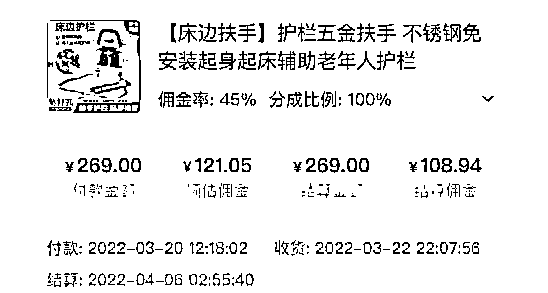

**2**、向线下渠道学习

在老年人多的社区，一般都会有很多针对老年人卖产品的机构，不张扬，但是很赚钱，他们选的一些品都很有启发性，可以多参考。

老年人的市场，才刚刚开始，有很多可能性，不要被传统思路束缚的话，能玩出不少新花样，希望我这篇文章抛砖引玉，能带给大家一些思路。

评论区：

陈宥伊 : 先收藏，明天好好看看

zheng : 太棒了，分析的头头是道，我今天也看在看大盘数据，作为准备入局抖音的小白，先选蓝海人群，中老年退休人群，这类人有钱有时间。

张集慧 : 是的，关键这群人还算是第一次接触网购，啥都新鲜。

 

 

三林 : 干货

代码君 : 感谢分享，学习了

成义 : 学习了，明天刚刚挖掘一下老年人的需求痛点

黄承德 : 做到日佣金8万，大佬认为技巧很简单，我却认为很难[捂脸]，大佬能展开来讲讲吗

张集慧 : 那个只是运气好，并不是每个视频都能那么多，日入8万是想告诉大家，抖音带货上限很高，潜力无限。带货基本操作就那些发视频，挂车等等，讲的人太多了，但是爆单的核心的是找到蓝海品，蓝海人群，这些没什么人讲，这个才是我文章的核心。

# **# ****(92**赞**)2023 **消费行业趋势：老龄化、少子化

# 和小户型化成为关键指标

作者：  阿Lok beta版

日期：2023-06-21

2023消费行业趋势，大家可以结合自己的业务从这三个指标里思考一下如何顺势而为。

老龄化：银发经济、抗老年轻化

少子化：缺少陪伴，宠物拟人化

小户型化：空间利用率、家居用品小型化

更多详情可看👇这份趋势报告

评论区：

胖大魔 : 妙啊

亦仁 : 中标，术值+1。

在上方专栏点击 #中标，可查看所有中标风向标。

 

 

# **# ****(**精华帖**)(65**赞**)**银发经济** 2.6 **亿规模的老年人

# 市场，有哪些你能入局的新机会

作者：  刘三点

日期：2022-01-10

近几年，网上崛起了一大批网红中老年银发 IP ，最广为人知的就是时尚奶奶团，目前全网粉丝已超过 1500 万；全国有超过 200 万人住在养老机构里，从进入养老机构开始就需要初始评估，签订入住契约、合同，通过评估结果实施不同等级的服务，这里面存在着很多新兴的机会......中老年是个非常大的市场，所有行业都会因为中老年人再做一次细分。

接着，介绍一下我自己，我留美七年，今年初刚刚回国在做养老院的产品策划。我本科是 UC Davis 景观建筑专业，研究生在 USC 南加大念了老龄服务管理专业。

本篇内容，我想给大家分享的更多是一个大趋势关于老龄化的现象以及伴随着现象带来的新机遇的话题，也希望有更多有爱有才的人能加入到中老年行业里，在创造商业价值的同时，给世上千千万万的老年人，传递一种中老年人美好的生活方式的可能性。

---正文---

很多人问过我一个 90 后的小姑娘，怎么会想着去做养老？

其实纯属偶然一个机会，我暑假回国陪朋友一起去帮她给她爷爷考察养老院，那个环境我到现在都印象深刻。所有的画面都变成了几个印象：昏暗，悲伤，一个大写的不开心。在里面的爷爷奶奶不开心，工作人员不开心，进去参观的人也不开心甚至有写压抑和难过。

 

 

我一看就下定决心一定要做出一些改变，这不是我所期望的老年人的生活，我也不希望任何人是在这种氛围中度过自己的晚年。于是就选了这个老龄服务管理专业就读。

文章分为三个板块：

一、老龄化趋势

二、人口老龄化带来的新机会

三、银发经济

**-01-**

老龄化趋势** **

老龄化成为全球国家面临的重要民生问题之一，继欧洲和北美洲后，东亚的较

高老龄化速度将助推其成为下一个“重老龄化”地区。

继欧洲和北美后，东亚是全球老龄化最快的地区之一，人口预测显示，到 2030 年左右，东亚 65 岁年龄以上的人口将超过 10-25 岁的人口群，中国将在 2030-2035 年间实现老龄人口大于新生一代人口。

而我国人口老龄化态势严峻，面临着更为复杂的问题:

老年人口绝对规模大

发展速度快，中国国在崛起过程中是除日本外的老龄化速度最快的世界人口大

国，应对人口老龄化的时间安排要求更为紧迫。

存在 “长寿不健康”现象，我国老年人 平均健康余寿比发达国家低 10 岁左右；同时， 实际退休年龄只有 53.3 岁，加之**“** 未富先老**”**，这使得我国在同等老龄化水平下， 面临着比发达国家更沉重的养老、医疗和照护服务压力。

高龄、独居空巢、失能半失能等弱势老年人快速增加，养老照料供求缺口巨大。

 

 

发展不均衡。人口老龄化水平城乡倒置， 农村人口老龄化程度始终高于城镇。区域常住人口老龄化呈现出 东部放缓、中西部不断加快的态势，随着中西部青壮年人口向东部流动，这种态势还将 进一步加剧。

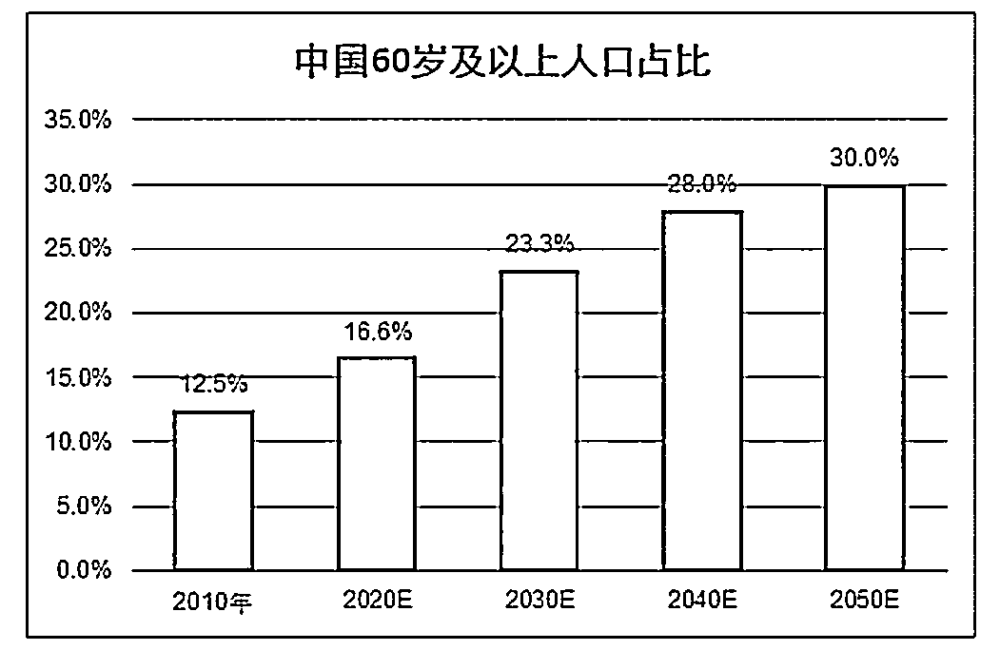

中国七普人口数据分析（老龄化趋势）

2021 年 5 月 11 日，国家统计局发布第七次全国人口普查公报（以下简称七普）。此次人口普查的调查研究对人口和人口结构对经济发展具有重要的意义。

此次人口普查的调查时间为 2020 年 11 月 1 日至 12 月 10 日，以 2020 年 11 月 1 日零时为标准时点，对我国境内的自然人以及在境外但未定居的中国公民，逐户逐人进行了普查登记。

 

 

人口普查是全面查清国家人口数量、结构、分布的重要途径，中国目前为止进行了七次人口普查，分别于 1953、1964、1982、1990、2000、2010、2020 年进行。在现行统计制度下，人口普查每 10 年开展一次，尾数为“0”的年份为普查年度，其余年份进行人口抽样调查，其中尾数为“5”的年份进行规模较大的 1% 人口抽样调查，也称为“小普查”。

需要注意的是，人口普查与抽样调查的统计方法不同。人口普查以全体目标人群为调查对象，而人口抽样调查的数据利用抽样比推算获得。相比之下，人口普查不存在抽样误差，漏登率更低，数据更为准确。因此，根据普查结果修正中间年份的历史数据亦是人口普查的重要意义之一。

我这次会从人口规模、年龄结构、城乡结构、区域结构和人口素质等方面对七普数据进行研究，分析中国人口变化的五个趋势，以及由此带来的对经济的影响和市场机遇。

首先有个事实：

人口老龄化是今后较长一段时期我国的基本国情，这既是挑战也存在机遇。** **

中国人口变化趋势可以用“一慢四快”概况。

人口增速放慢

 

 


而生育率较低是人口增长放慢的主要原因。

历史上，中国三次婴儿潮分别在建国初期、**1962-1973 **年左右、**1986-1990 **年左右出现，出生人数的波动存在明显的周期性，但由于实施计划生育政策，第四次婴儿潮并未在 2010 年左右出现，且 15- 49 岁育龄妇女人数在 2011 年达到约 3.8 亿的顶峰后持续减少，使 2010 年后出生人口直接进入下行区间。

生育政策逐渐放宽使出生人口短期上升，继“双独二孩**”**、**“**单独二孩”于 2011 年、2013 年相继放开后，2016 年中国放开“全面二孩”，在 2016 年、2017 年出生人口大幅增长至 1,883 万和 1,765 万人，二孩占比由 2013 年的 30% 左右升至 2017 年的 50% 左右。

随着此前积累的存量释放，2018 年以来出生人口回落，但出生人口中的二孩及以上孩次占比在 2019 年仍高达 59\. 5% ，**“**二孩效应**”**放缓但仍在延续，使得 2020 年 0-14 岁少儿人口占比较 2010 年回升 1.4 个百分点。

 

 


老龄化加快

根据七普数据，我国劳动年龄人口的比例和绝对量都出现下降。


 

 

我国老龄化现象加重，并呈现出三大特点：

**1**）人口老龄化加深且规模庞大：

“七普”数据显示，我国  **60 **岁及以上人口有 2.6 亿人，比重达到  **18.70% **，其中 65 岁及以上人口 1.9 亿人，比重达到 13.50% 。

按照国际通行划分标准，当一个国家或地区 65 岁及以上人口占比超过 7% 时，意味着进入老龄化；达到 14% ，为深度老龄化；超过 20% ，则进入超老龄化社会。我国正处于属于轻度老龄化阶段。

**2**）从国际比较来看，中国老龄人口规模也非常庞大：

65 岁及以上人口数量大于美日德法英韩 6 个主要经济体之和。


**3**）未富先老：

 

 

从经济发展水平来看，2020 年我国人均** GDP **为** 10,504 **美元，而日韩达到相似老龄化比例（ 65 岁及以上占比 13\. 5% ）的时间分别为  **1993 **年、**2016 **年，当时其人均  GDP 分别为 35,766 美元、29,289 美元，远高于我国目前水平，中国正面临未富先老的现象。

而老龄化进程也是明显加快：2010 至 2020 年间，我国老龄化进程明显加快，与六普相比，**60 **岁及以上和** 65 **岁及以上人口占比上升速度分别加快了  **2.5 **和** 2.7 **个百分点。

相比之下，六普相对于五普，65 岁及以上人口占比幅度仅提升 0.5 个百分点。据世界银行数据，**2008 **年后我国老龄化速度明显加快，**2017 **年增速超过日本，目前在主要经济体中增速仅低于韩国。


城镇化加快

 

 

中国城镇化率由  **2010 **年的** 50% **达到** 2020 **年的** 63. 9% **，年均增速** 1.4% **，处于城镇化高速发展阶段。从国际比较来看，改革开放后，我国城镇化进程迅速加快，不断缩小和世界的差距。

1980 年时我国和世界中等偏上收入国家平均城镇化率的差距高达 28.3 个百分点，到  2019 年时该差距已经缩小到不足 2 个百分点。


人口流动加快

2020 年我国共有流动人口 3.76 亿人  ，较** 2010 **年六普增加** 69.7% **，意味着我国约每四人中便有一人为流动人口。其中，2.5 亿人为从乡村到城镇的流动，较 2010 年增长  1.1 亿人，在总流动人口中占比达** 66.2% **。反映了我国城镇经济活力正在不断提升，人才资源配置水平提高，城镇吸纳人口迁入包容度加大。

 

 


人口素质提升加快

随着我国人均受教育水平不断提升，接受高等教育的大学毕业生数量越来越多，根据教育部最新预测，2021 年我国高校毕业生数量将达到 909 万，到 2022 年，高校毕业生数量将超过 1,000 万人（图15）。但另一方面，创造合适的就业岗位，解决大量大学毕业生的就业问题也是一个挑战。

 

 


**-02-**

中国人口老龄化趋势带来的影响和机遇** **

一、影响

**1. **一老一小消费市场广阔** **

根据联合国对中国 2020-2030 年间人口变化的预测，未来 10 年间 35-44 岁、55-64 岁、65 岁及以上几个年龄段人口数量增长最快（图16）。人口结构的变化也将带来消费结构的改变，婴幼儿消费、银发经济这一老一小市场空间广阔，同时，家庭规模缩小也带动了单身经济、宠物经济等消费的发展。

 

 


联合国数据预测未来  **10 **年我国将增加** 1.1 **亿** 60 **岁以上老龄人口。中国老年人口庞大，老龄化进程加快，是我国人口面临的一大重要挑战，但老龄人口的增加也扩大了老龄产品和服务的消费，使得银发经济具有广阔的前景和巨大的发展潜力。

除了带动医疗、康养等相关行业之外，老年人对休闲娱乐、旅游等需求也越来越强烈，甚至许多老年人退休之后进入老年大学等教育机构来获取知识和培养兴趣，老龄教育服务行业应运而生。

 

 


我国近年来人口出生率虽然有所下降，但 2020 年仍有 1,200 万新出生人口，约为美国、日本、德国、法国、英国、韩国  **6 **国新出生人口总和的** 1.8 **倍。

5 月 31 日中央政治局会议进一步提出放开三胎，并将重点推出税收、住房等配套支持措施，随着后续生育政策在降低家庭生育、养育、教育等成本方面发力，有望在一定程度上提高适龄青年生育积极性。

同时，越来越多的  **90 **后甚至** 00 **后将成为父母，成为育儿消费市场的主力。他们普遍接受过良好的教育，更加注重科学育儿和品质消费，推动育儿产品的消费升级。此外，越来越多的年轻父母也将需要独立育儿，这也给普惠托育、智能玩具、育儿生活护理等细分市场带来新的增长点。

**2. **国货品牌快速崛起** **

 

 

近年来，随着中国经济的增长、国内产品质量的不断提升，以及中国文化魅力的彰显，中国消费者对国货品牌的关注度明显提升，百度数据显示，从 2009 年到 2019 年的十年间，消费者对中国品牌的关注度几乎翻倍，从** 38% **增长到** 70% **，甚至超过了对境外品牌的关注度。

特别是对于  **80 **后、**90 **后来说，是在中国经济和数字化高速发展的过程中成长，拥有更高的国家和民族认同感、自豪感。此外，年轻一代消费群体更加注重个性化的表达，勇于尝鲜，是中国品牌发展最主要的关注者。

未来10年，这些年轻一代消费群体普遍处于  **35-44 **岁区间，也是增长最快的人口区间之一，这个年龄段消费群体的增长为中国品牌的崛起提供了巨大的成长空间。

为了迎合年轻一代消费升级的需求，国货品牌的质量也在不断提升，中国在数字经济方面快速创新的优势，也使得国货品牌可以更快速地洞察消费者需求、打造“千人千面”的营销模式、加强个性化定制的产品输出，从而提升品牌价值。

如今的国货产品已经褪去“无趣”和“廉价”的刻板形象，国货品牌也代表着“新潮”和“高品质”。我们预期国货品牌价值将迅速增长，新国货全面崛起指日可待。

**3. **社区养老和商业养老保险大有可为** **

面对日益严重的老龄化压力，**“**十四五**”**规划将积极应对人口老龄化上升为国家战略。对于如何破解中国目前的老龄化矛盾，可以从几个方面推进：

**1**）大力发展社区养老和机构养老

 

 

随着计划生育时期出生的独生子女逐步成为社会的中坚力量，家庭养老的负担也日益加重，加强社区养老和机构养老可以帮助缓解一些对家庭的压力。

对于社区养老，可以完善社区居家养老服务网络，推进公共设施适老化改造；对于机构养老，可以加大对养老产业的支持力度，多措并举扩大养老机构床位供给，提升养老机构的专业服务能力。

加大二三支柱养老金的推进力度：我国三大支柱的养老金体系发展很不平衡，呈现**“**头重脚轻**”**的现象，以企业年金和职业年金为主的第二支柱参保覆盖面仍然较窄，只能满足小部分群体的养老需求；由个人储蓄型养老保险和商业养老保险构成的第三支柱参保人数几乎可以忽略不计。

根据 2019 年数据，我国养老金第一支柱占比逾七成；第二支柱占比不足  **3 **成；第三支柱占比几乎可以忽略不计，相比之下，美国等发达国家养老金体系已经走向以二三支柱为主导的商业化模式。未来我国亟需加大对二三支柱养老金的推进力度，促进养老金体系更均衡、更可持续的发展。

 

 


**2**）自动化、智能化升级加速** **

七普数据显示，我国劳动人口的比例和绝对量都出现下降，较低的生育率也将影响我国未来劳动力人口增长。劳动力作为主要生产要素之一，劳动力数量的下降会推升劳动成本，但也将加速企业自动化升级的步伐。

疫情后制造业企业正在加大资本开支，例如今年前四个月，制造业企业固定资产投资增长** 23.8% **，明显快于房地产、基建等投资门类。可以看到，企业正在加大投入提升机械设备自动化水平，减轻对人口成本的依赖，预计未来工业自动化装备市场前景广阔。

中国经济正处于转型升级的关键阶段，面对人口红利的逐步消失，以及当前新一轮的科技革命和产业变革着重强调的数字化转型，传统产业也将加速向智能、高端升级，以提升国际竞争力。

 

 

目前许多行业龙头企业已经从早期的数字化尝试，演进到数字化贯穿企业的各个部门，并积累了大量数据。在此基础上，企业可以利用云计算、人工智能等先进适用技术，更好地挖掘和利用数据资产价值，助力产品和服务创新，发现新的业务和商业模式。

另外，智能化转型不仅可以帮助企业提高生产和服务、发现新的需求，还可以帮助提高企业的敏捷能力，以应对全球市场的快速变化和技术的不断更新，推动企业提质增效。

**3**）人才红利推动创新发展** **

我国人口结构的变化将推动从人口红利向人才红利的转变。**“**十四五**”**规划指出，创新是我国未来发展的核心驱动。在国际环境日趋复杂的背景下，加强基础研究，攻关核心技术，切实提升关键领域自主可控能力，是我国面临的重要任务和挑战，而人才是科技创新的根本。

过去十年间，我国拥有大学（大专及以上）文化程度的人口占比增长最多，由  **8.9% **提高至** 15.5% **。企业应充分发挥人才资源的作用，利用好当前的人才红利优势，加大对人才投入力度，加强对创新型、应用型、技能型的人才培养，以提升在未来创新发展中的市场竞争力。

一方面，企业可以通过引进高端人才，提升科技创新能力和国际竞争力，在加快产业转型升级的同时，创造出更多适合大学生的就业岗位，进一步形成人才红利的良性循环。

另一方面，企业可以加强与高校、科研机构合作，通过承担国家重大科技项目，建立产业创新中心等模式，对基础学科、关键技术和前沿领域进行研究和攻关。这能够促进产学研相互融合，全面激发科研人才的创新活力，同时也有助于企业加快成果转化能力，助力国家实现关键技术自主可控。

 

 

二、人口老龄化带来的新机会** **

**1. **养老院

很多对养老感兴趣，准备进入这一行的人，经常会问一个问题：那就是养老院的名字各不相同，有的叫养老院，有的叫养护院，还有的叫护理院，这些到底有何区别？

虽然市面上能见到养老院、养护院、老年公寓等种类繁多的称谓，其实在国家标准规范上，有一个统一的名称——老年人照料设施。

根据 2018 年 10 月 1 日正式实施的《老年人照料设施建筑设计标准》（JGJ450-2018），老年人照料设施（care facilities for the aged）是指为老年人提供集中照料服务的设施，是老年人全日照料设施和老年人日间照料设施的统称，属于公共建筑。

老年人全日照料设施（24-hour care facilities for the aged）是指为老年人提供住宿、生活照料服务及其他服务项目的设施，是养老院、老人院、福利院、敬老院、老年养护院等的统称。

老年人日间照料设施（day care facilities for the aged）是指为老年人提供日间休息、生活照料服务及其他服务项目的设施，是托老所、日托站、老年人日间照料室、老年人日间照料中心等的统称。

当然每个人分类方式不同，从养老院产品策划角度来说，我一般喜欢按照辐射范围分为以下几类：

**1**）社区居家型：

 

 

如同老年人日间照料设施，辐射范围为全社区的长者，可提供日间照料，居家上门，康复理疗，文化娱乐等服务，也有一些社区型机构会设置少量床位（几十床），为长者提供长托、短托和临托服务，床位设立是创收的基础，而入住率对机构来说是营收的最关键指标。

**2**）护理型机构：

设有生活起居、文化娱乐、康复训练、医疗保健等多项服务设施。主要面对的的需要护理照护的，缺乏自理能力的长者，为他们提供居住、医疗、保健、康复和护理的配套服务；主要类型有养护院（民政牌照，养护为主），护理院（医疗机构，医疗护理为主），养老院（自理、介助、介护长者都有）等。

**3**）**CCRC**（可持续照顾型社区** **）：

是一种复合式的老年社区，通过为老年人提供自理、介护、介助一体化的居住设施和服务，使老年人在健康状况和自理能力变化时，依然可以在熟悉的环境中继续居住，并获得与身体状况相对应的照料服务。

CCRC 选址通常在郊区，离城市较远，由于社区规模较大，在选址上关注生态环境和自然气候，大量运用园林景观和水系营造出人与自然和谐的居住环境，使老人在城市中享受到田园生活，达到怡情养性、延年益寿的目的，十分适合老年人居住和生活。

随着观念的改变，现在送长辈去养老院已经不是子女不孝的代表了，有些高级养老院的入住反而成了一种儿女成功的身份象征。家里没人照料，保姆照护不专业，老人独自在家太寂寞，都是越来越多人选择去养老院的原因。

随着年龄的增长，老人对物质的追求逐渐降低，更加注重内心渴望，但居家养老，老人在家里时儿女上班，孙子孙女上学，大多数时间老人都是孤单一人。

 

 

孤独比每天吸一包烟对身体的损伤都要大，对于老人来说，精神孤寂是影响健康的首要原因。

如果在养老院，就会找到一群和自己年龄相仿、阅历相差无几，也不会有代沟的朋友。

那些共同经历的年代记忆能让老人找到归属感，不再孤单，吐露心声，成为知心朋友。

现在的养老院为入住老人提供丰富的业余选择，做到天天有活动，月月有安排，使老人乐在其中，认识更多同龄的朋友，实现自身价值，丰富业余生活，让老人在精神上得到极大的满足。

传统观念中，养老院仅为老人提供住宿和饮食，经过这些年的发展，我国养老院尤其是民营养老机构不断建设与完善。居住房间均配有电视、冰箱、空调等生活设施，公共活动中心有阅览室、棋牌室、理发室、健身房、康复室……

一般的养老院都具备完善的组织架构和服务体系，从悉心照护到精神关怀再到一体化医疗，专业化的服务让入住中心的老人安心，让家属放心。

大部分养老院都会有自己的时间表，老人除了自由活动外，一般都会安排集体活动时间。和老伙伴们一起运动娱乐玩耍，这样会让老人的生活更加健康和快乐，也可以让老人的一天过得非常充实。规律的一日三餐，营养均衡；规律的生活有利于老人的身心健康。养老院把合理丰富的活动和充足的休息时间相结合，老人每天都能精神振奋。

最后必须总结一下：

养老院虽然前景广阔，但却不是一个适合普通人入局的项目。

原因：投资大，回报周期长

 

 

因为整体老龄化趋势，诞生了很多门槛不高适合普通人入局的新兴职业：

**1**）老年人能力评估师

2020 年 7 月，人社部联合国家市场监管总局、国家统计局发布 9 个新职业，包括老年人能力评估师。

截至 2020 年 11 月初，全国各地的老年人能力评估师大致分为专职和兼职两种，专职指第三方老年人评估机构，兼职则指由养老机构从业人员担任评估师，两种类型的评估从业者人数在 10 万人以上。常见的评估方式分为三类：第三方评估、养老机构评估后再由相关部门抽查或普查、养老机构独立评估。

工作任务包括：

采集、记录老年人的基本信息和健康状况；

评估老年人日常生活活动能力；

测量与评估老年人认知能力、精神状态、感知觉与沟通能力、社会参与能力；

依据测量与评估结果，确定老年人能力等级；

出具老年人能力综合评估报告；

为老年人能力恢复提出建议。

目前，我国享受高龄津贴的老年人达 2680 万人，享受护理补贴的老年人达 61 万人，享受养老服务补贴的老年人达 354 万人，共有超过 3000 万人需要通过老年人能力评估确定领取补贴资格。

从筛查到护理补贴发放的过程都需要进行评估，需求量很大。而且现在全国有超过 200 万人住在养老机构里，从进入养老机构开始就需要初始评估，签订入住契约、合同，通过评估结果实施不同等级的服务。所以，这个岗位无论是从宏观体系、干预人才体系的建设还是微观的服务提供上，都是一个非常有必要的新岗位。

 

 

统计数据显示，老年人能力评估师人才需求为 150 万，但当前的从业人员尚不足 10 万，有巨大的人才缺口。这跟老年人能力评估师是 2020 年人社部等发布的“新职业”，很多人还不了解或者说是没接触过有一定的关系。一个新的风口，就看能不能把握住了。

现在一线城市中的老年人能力评估师月薪将近万元，二三线城市月薪也高达五六千元。

随着养老机构、评估机构等需要老年人能力评估师的机构越来越多，而人才缺口还高达百万，相信老年人能力评估师的待遇还会有所提高！

**2**）适老体验师

一个为老年人“造梦”的新职业经由央视新闻推广。

在 2020 年底，工信部开展互联网应用适老化改造专项行动，为了让老年人在信息化发展中获得更多幸福感，适老体验师应运而生。

为解决界面复杂看不懂，想看视频不会搜索，字太小看不清……这些问题，适老体验师推出了听音识图、无障碍剧场等功能。为了摸准老年人的使用习惯，适老体验师还会蒙上眼睛，模拟老年人真实使用场景，或去社区收集老年人的使用建议，为老年人带来更多的文化娱乐新体验。

帮老年人追赶智能时代。

 

 

目前，各大互联网公司应工信部要求，都有适老化改造需求。截止至12月，工业和信息化部发布《关于电信服务质量的通告（2021年第4号）》。通告指出，第三季度互联网应用适老化及无障碍改造专项行动取得阶段性成效。目前，已有158家网站和APP初步完成改造。改造后，老年人浏览新闻更轻松，线上购物更简单，购票打车更省心。

（工信部）

“阿里40万元年薪聘“老年产品体验师”、“还记得年薪40万的中老年淘宝体验师吗？”消息层出不穷。

这个职业不仅仅年轻人可以参与到软件的适老化改造，老年人也有机会被聘请为体验师。随着老年群体的网购需求，网络娱乐需求的快速增长，适老体验师需求和市场也在逐步扩大。

适老化改造推行一年，成果显著，更有不少网站和APP不止于字体放大、界面简化等初级改造，而是为老人配备专属客服，更加彻底地解决老人面临的数字困境。伴随老人使用互联网的障碍进一步消除，未来更深层次的适老化将展开拉锯战，各大平台需要更加深入地研究老人的需求和喜好，为他们提供适合他们的内容、产品和服务，这是留存老年用户的关键。

再例如健康管理师和公共营养师等新职业也因为老龄化趋势而变的紧俏。平均 2 个月就可以自学考到证书，考完后还可以领导国家办发的证书并申请补贴。就业市场也是十分的广泛。

**-03-**

银发经济** **

 

 

你心目中的老年人vs 现在的老年人

你心目中的中国大爷大妈是不是还停留日本脚踹樱花树、在法国喷泉泡脚、在泰国盘子铲虾？

是不是在停留在穿着老土、仪态欠妥的传统印象？

是不是认为老年人稍微会用手机搜索购物，会跳广场舞就算很厉害了呢？

给大家看看现在网上崛起的一大批网红中老年银发 IP 。

2019 年 6 月，几位奶奶穿着非遗蜡染旗袍在北京三里屯走秀的视频迅速登上各大社交软件的热搜榜，在抖音上发布第一条视频，并迅速登上抖音、微博、快手三大平台热搜榜。连续 7 天，总播放量超过** 5 **亿。

这个是由一个平均年龄超过了** 65 **岁，每个人的头发都已经灰白，但仍然化着精致妆容的团体：**“**时尚奶奶团**”**

 

 

时尚奶奶团是中国时尚文化传播者，她们代表着中老年女性的精神面貌、生活状态和生命状态，时尚奶奶团更是全新的中老年生活方式平台，让更多的中老年女性都能活出自我，开启崭新人生。她们穿着旗袍走遍世界各地，向全世界宣传中国的文化，向大家传达了美好的生活理念，把中国老年人的时尚态度及文化带向世界舞台，让世界看到东方女性的魅力。

时尚奶奶团曾受邀在上海的日本大使馆、菲律宾大使馆、法国大使馆和明星走秀，也曾经多次受邀参加伦敦、纽约的时装周，国内很多电视台也都给她们递过邀请函。

截至目前，时尚奶奶团全网粉丝已超过 1500 万，已经发展成引领中老年女性开启全新生活方式的成长平台，从而鼓励所有中老年女性群体不再被年龄定义和束缚，勇于表达自我，欣赏自我，活出精彩。”

往小了说，我国中老年产业发展已经初具规模，这个产业里的各个细分市场都在重塑消费者画像，创业者们都在寻找中老年人群隐藏在表象之下的真实消费需求。

往大了说，随着我国国力日益强盛，需要向全世界展示中国老人美丽、优雅、自信、大方、从容的精神风貌，在世界范围内打造完美的国际形象。

得益于互联网短视频平台的发展，更得益于近两年兴起的中老年网红产业，他们创造与传播了全新的中老年人形象，将越来越多的中老年人带入了互联网。

看中了这个产业趋势，在互联网平台上打造中老年网红的远不止何大令和她的团队打造的“时尚奶奶团”。

 

 

他们有的帮中老年人甩掉了“封建落后”的标签，如“罗姑婆”就操着一口流利四川话，教年轻人如何在爱情中取舍；他们有的帮中老年人拔掉了“生活技能落后”的字眼，如“老饭骨”就细致入微的给年轻人讲解了经典菜肴的制作过程，让他们能回归家庭生活。

任何行业都会因为老年行业而细分一次，那么面对的问题也不会有太大偏差。

在中老年网红产业里，大部分中老年网红们都是通过内容吸引粉丝，从而通过打广告、接代言、或者选品带货的方式进行流量变现。

近两年被吹上风口的直播带货模式，成为了各类网红们变现的首选，然而，这条路在中老年网红身上却并不好走。很多中老年网红都并没有选择直播带货的变现模式，如“罗姑婆”目前还是以原始的广告合作为主，而“老饭骨”宣布融资之后开始走线下品牌孵化之路了。

做任何事情你的发心都是绝对最后能否成功的基石。这个世界上任何成功的企业，都源自于他解决了一个社会问题，又或是提供了另一个视角的生活方式的可能。一个好的初心，一个利众的旅程，在任何行业做任何事情都是至关重要的。

中老年行业里创造商业价值的同时，如果能传递一种中老年人美好的生活方式作为切入口，带给千千万万的中国老人更多种丰富多彩生活的可能性，打破传统的限制性信念，这一点对于我本人来说是最重要的。

年轻人现在美业流行，那么按照每个行业都可以就银发群体做一次细分的规则，大家是不是也可以考虑做中老年的美业？大家自行发挥想象哈哈

开头说过所有行业都会因为中老年人再做一次细分，最后给大家整理了一下老年行业在娱乐，健康、科技的发展数据以及市场动向资讯。

 

 

**1. **有声书** **

近日，QuestMobile 发布《2021声音经济洞察报告》，2021 年 10 月，声音人群规模达到 7.28 亿，其中，有声听书作为新兴行业，月活用户规模增长强劲，对比 2020 年 10 月增长率高达 166.9% ，远超其他四个行业。而在有声书的用户画像里，60、70 后为代表的年长用户偏好度（TGI）明显高于年轻用户。另外，为声音付费的用户里，60、70 后占比也达到 27.9% 。


基于“看”的短视频在席卷中老年人群生活之时，有关“听”的声音经济也在快速向中老年人渗透。多种数据表明，中老年人是有声书的重度用户，“听书”已经成为他们中间的一股风潮。围绕“听”的需求，中老年人的付费意愿也越来越强烈。如今，随着互联网的流量红利日趋接近天花板，中老年人作为最大的增量所在，毫无疑问也将为在线音频市场带来新一轮机遇。

**2. **银发健身** **

 

 

银发族健身人数增速明显，女性私教活跃率高出男性** 1.3 **倍。

早前，乐刻发布“银发一族（60岁及以上人群）”健身大数据，近两年该年龄段人数增速明显，每年增幅在 30% 左右，上午 8 时至 10 时是“银发一族”女性最爱时段。同时，“银发一族”每周到店健身频次比其他年龄段多出1次，该年龄段女性私教活跃率占比比男性高出 1.3 倍。

此外，平均每两位到店的“银发一族”女性中，就有1位会上团操课，Zumba 类的舞蹈课程为“银发一族”最爱，其次是瑜伽类等课程，男性团课活跃率几乎为零。（新京报）随着国内老年群体健康意识增强，他们对运动健身的需求也不断扩大，传统健身市场大多把目光聚焦在年轻人身上，针对中老年人群的商业健身机构一片空白。近日，中共中央、国务院发布《关于加强新时代老龄工作的意见》，提到要提升老年文化体育服务质量，可以预见，未来老年运动健身市场将迎来新的发展。

**3. **银发族线上消费** **

QuestMobile 数据显示，2020 年，中国 50 岁以上人口数量为 4.51 亿。截止 2021 年  10 月，50 岁以上移动网民月活突破 2.5 亿，月人均使用时长达 143.9 小时；地域分布上，三四五线城市人群占比达到 62.1% 。另外，近七成银发人群通过线上进行支付，千元以上消费能力的银发人群占比 54.3% 。女性人群关注价格和品牌，男性更注重时尚、品质等，在消费体验方面要求更为突出。（QuestMobile）

 

 


在国内，50 岁以上人群已经可以视为占比高达 1/3 的主力人群之一，他们在互联网上的渗透率也在不断提升，线上正在成为他们生活场景中的重要组成部分。未来，银发人群的各种需求很大概率将会通过线上满足。然而，目前针对银发人群的线上内容、产品和服务供给还相对稀缺，未来潜力巨大。

**4. **电视节目** **

银发人群收视特点：**50 **岁以上电视观众达** 3.58 **亿，每天近** 7 **成银发观众收看电视节目。

 

 

CSM 2021 年基础研究报告数据显示，50 岁以上银发 e 族电视观众数量达 3.58 亿，占全国电视观众的 28% 。每天有近七成银发观众收看过电视节目，人均收视时长达 215 分钟，收视率达 14.9% ；从节目类型来看，电视剧、新闻/时事、综艺是银发 e 族收看的最主要节目类型。另外，相比所有观众，银发 e 族在财经、法制、新闻/时事、体育和戏剧类型的节目资源使用效率更高。（CSM）

银发网民数量已经高达 2.8 亿，但相比银发电视观众仍然少了 7500 万人，时至今日，电视仍然是触达银发人群最主要的媒介渠道。

而从银发人群对媒介的偏好和使用习惯来看，他们也依然是电视的重度用户。这一方面为传统电视台转型指出了方向：即针对老年人的需求和喜好设计创新节目，增强粘性。

另一方面也为老年行业企业提供了新的获客思路。

**5. **中老年化妆教程网站** **

日本资生堂推广** 50+ **女性个护产品线，上线中老年化妆教程网站。

 

 


近日，日本资生堂面向 50 岁以上女性的个人护理系列“PRIOR”启动新项目“熟龄魅力”（意译）  。资生堂将为此开设专门的网站，传播中老年化妆教程，目标是在三年内将“PRIOR”打造为熟龄一代的首选品牌。

发布会上，76 岁的宫本信子、67 岁的黑泽和子、69 岁的大岛美雪等演艺名人作为代言人亮相。据了解，日本永旺、亚瑟士健步鞋、连锁药店 WELCIA 等日本企业也将参与此项目。（外媒）

于 2015 年推出的资生堂“PRIOR”主打美容护理产品，以护肤、底妆、护发等系列为主，售价约在 200-600 元人民币之间。

在产品线成熟后，资生堂将重点放在了市场教育及渗透上，通过化妆教学视频打开市场。在国内市场，通过化妆教学视频引流，也已经成为中老年赛道的流量密码。在线下渠道方面，资生堂选择和日本永旺、连锁药店合作，为国内老年化妆品品牌提供了新的思路。

 

 

**6. **天猫医药健康联合薇娅直播间，发起**“**银发经济公益活动**” **

近日，为协助关怀困境老年人群体，在国家卫生健康委人口家庭司的指导下，天猫医药健康联合薇娅直播间发起“银发经济公益活动”，举行关怀困境老人义卖直播，聚焦关注60岁以上，身体和心理需要照顾的老年人，公益收入将全部捐献给中国人口福利基金会，用于困难老人等特殊老年群体健康和扶助关怀。（中国家庭报）

从字节跳动发起助老公益项目“银杏家园”，到天猫如今发起的银发经济公益活动，巨头围绕银发人群展开的动作不仅仅是适老化改造，也在纷纷以公益形式助推他们的生活变得更加美好。这也诠释了银发经济的核心不是“经济”，而是“银发”，只有本着为银发人群提供更高品质更加美好生活的心态，才能做好银发人群的生意。

** **

**7. **中国老年人体育协会广场舞专项委员会成立** **

近日，中国老年人体育协会广场舞专项委员会成立大会在国家体育总局老干局活动中心举行，中国老年人体育协会副主席温文当选广场舞专委会主任。专委会由中国老年人体协、各省老年人体协、华奥星空科技发展有限公司及合作企业代表组成，办公机构设立在华奥星空。会上，湖北、山东和河南的老年人体协代表以网络连线的方式进行经验分享，介绍了省内开展广场舞运动进行的有益尝试和成熟做法。（中国体育报）

广场舞，一直以来被视为中老年女性的专属标签，也被不少企业视为打入中老年市场的重要渠道。如今，中国老年人体育协会广场舞专项委员会成立，意味着广场舞在老年人运动、文娱、社交等领域的价值正在被国家重视，正式成为老年人体育运动中的一种。

可以预见，未来，广场舞仍然会有更多发展形态，围绕广场舞所建立的老年线下运动、健身空间也有机会。

**8. **韩国将开发**VR**老年驾驶培训课程，计划于**2025**年开始使用** **

 

 

为了控制老年司机的事故率，近日，韩国警方正在开发一个定制驾驶员培训项目，该项目计划使用 VR 技术评估 65 岁及以上驾驶员的驾驶、认知和记忆能力，以判断他们是否继续持有驾驶证，项目为期三年。该项目源于韩国日益加深的人口老龄化问题，据悉，在韩国，约有 40% 的士司机年龄超过 65 岁，同时，去年由老年人驾驶员造成的道路交通事故，超过 31000 起。（外媒）

VR 在老年人中的应用场景越来越多，此前，曾有公司探索将 VR 与旅游结合在一起，为老人提供虚拟世界旅行；也有公司将 VR 与游戏结合，应用于认知症的治疗等等。如今，VR 又被应用于老年驾驶培训，这意味着，VR 技术在老年人群中的商业空间在不断拓宽，未来仍有许多值得探索的方向。

** 9. **伊利欣活签约**70**后刘国梁为品牌推荐官** **

近日，伊利旗下中老年奶粉品牌欣活宣布签约70后知名乒乓球运动员、教练员刘国梁为品牌推荐官。刘国梁有着近 40 年乒乓球职业生涯，现任国际乒乓球联合会执行副主席、中国乒乓球协会主席、世界乒乓球职业大联盟理事会主席。关于此次签约，伊丽欣活表示，希望和刘国梁一起用专业配方守护中老年人健康。（伊利欣活公众号）婴幼儿奶粉市场增速正在放缓，由增量市场变成存量市场。与此同时，伴随老龄化趋势加深，中老年奶粉正日渐成为乳企的主要竞争方向。近两年来，包括伊利欣活、蒙牛悠瑞、雀巢怡养等在内的中老年奶粉品牌不断加码中老年高端市场，除了密集发布新品，营销玩法也越来越多样，推动中老年奶粉市场竞争加速升级。

**10. **美国老年人社交学习平台**GetSetUp**获得**1000**万美元战略投资** **近日，AgeClub 获悉，美国一家老年人社交学习平台 GetSetUp 获得 1000 万美元战略投资，投资方为 LightShed Ventures 和 Cowboy Ventures 。

 

 

一年前，该公司曾获得 1000 万美元天使轮融资。GetSetUp 创立于 2019 年，采用实时互动的同辈教学模式，主要为老年人提供课程学习和社交服务，通过视频向老年用户讲解如何使用不同类型的软件，以及一些医疗、金融产品和服务的相关内容。（鲸准）老龄化带来的市场潜力和机遇不仅仅发生在国内，也发生在许多国家。同时，老年人生活、工作、贡献社会的时间也整体呈现出延长的趋势，这催生了不同国家老人对文娱社交和学习的共通需求。

而 GetSetUp 采用同辈教学的模式，既能够帮助老人化解孤独，提升个人认知和社会参与感，也能为不少老人带来“赚钱”的新方式，从另一个维度解决了老人的价值感和收入问题。对于国内企业来说，这不失为一种值得借鉴的模式。

**11. **智能助听器公司智听科技获数千万元**Pre-A**轮投资** **

近日，智能助听器公司智听科技（全名为：深圳市智听科技有限公司）获得数千万元  Pre-A 轮投资，投资方包括青松基金、小米战投、顺为资本，华芯资本、至澄资本担任融资顾问。此前，智听科技曾获力合创投天使轮投资。据悉，智听科技成立于 2017 年，是一家致力于听力检测与助听系统智能化开发的医疗器械公司。（界面）

世界卫生组织曾发布统计数据显示，65 岁以上老人中约有三分之一患有残疾性听力损失。与此同时，国内助听器市场的覆盖率不到 5% ，这其中，传统助听器普遍万元以上的售价和不佳的体验是阻碍老人购买助听器的主要痛点。

针对传统助听器市场的痛点和巨大空白，近两年出现了不少新兴智能助听器企业，也带动资本的关注和布局。未来，立足研发，探索更适合老人的产品形态和验配模式，将成为助听器市场变革的关键。

 

 

** **

**12. **美国数字化老年健身平台**Vivo**完成**100**万美元种子轮融资** **

近日，AgeClub 获悉，美国数字化老年健身平台 Vivo 完成 100 万美元种子轮融资，本轮融资包括著名的医疗保健和长寿行业领导人及风险资本家参与。Vivo 是一家在线训练健身服务提供商，专门为 55 岁及以上成年人设计训练健身计划。该计划以远程方式提供，用户通过该平台可在家中锻炼。（鲸准）

关于中老年运动健身，国内外已经出现不少相关项目，不乏成功者。而从最近的趋势来看，区别于过去以健身房为主要承载空间的商业模式，瞄准中老年人居家运动锻炼需求的项目也开始出现。除了美国这家数字化老年健身平台 Vivo ，在国内，以乐刻为代表的头部健身公司也在通过家庭场景切入中老年人群。这意味着，中老年人将成为整个健身市场的重要增量已经成为共识，而聚焦他们在不同场景下的运动锻炼需求，也将产生多元的创新创业空间。

**13. **发展智慧旅游提高适老化** **

 

 


近日，文化和旅游部资源开发司发布通知，公布首批发展智慧旅游提高适老化程度示范案例名单，“杭州适老服务弥‘鸿沟’便民惠民提效能”等全国范围内 14 个案例入选。案例评选旨在推动发展智慧旅游提高适老化程度，解决老年人“数字鸿沟”问题。

种种现象和数据表明，老年人正在成为推动旅游市场复苏的重要推动力量。相比年轻人，他们有钱有闲，对旅游的喜好和需求更加旺盛。而伴随旅游适老化的逐步推进，意味着他们在出行时面临的第一层壁垒被消除，出游的热情也会进一步激发。未来，围绕老人的旅游需求和痛点进行深层次的改造，打造高品质的场景、内容和服务，将成为推动旅游市场升级的新动能。

 

 

关于人口老龄化的思路绝不仅限如此，我只是做了一个大致市场趋势的描述来供大家参考，对中老年人赛道有兴趣的朋友欢迎在评论区跟我交流呀~

评论区：

亦仁 : 感谢分享，已加精华。

刘三点 : 谢谢亦仁🙏

老黄 : 我做了一个月的中老年交友，对标的美国outtime，但项目终止了，其实中老年市场最大的风险在于我们的国情，很容易被定性为“诈骗”，客单价不高问题不大，但是一旦客单价起来了，就很容易暴雷，没有十全十美的交付，即使降低预期也不可能，所以老白金真正的购买群体是年轻人，而不是老年人。

我做的这部分群体都是高知的中老年人，拿退休金的，但是也不能。

我想明白了为谁服务，但是没想透钱从谁身上出。

一起个人经历，一起生财！

Destiny : 感谢分享，我们团队目前在上海做养老社区领域，想深耕养老行业，期待能加微信联系私聊Loius19357

池月白 : 感谢分享，老年人在互联网上的商机挖掘，值得探索一番~

聪_CC : 内容完整、数据详实，思路结构有逻辑，仔细阅读了全文，感谢分享！不管是从行业需求发展趋势，还是我们这代人父母长辈身边人的切实需求，都是一个很值得思考的多赢创业方向～希望有机会还能看到你的相关分享

夜翔梦多 : 你好哦，方便加个微信交流吗，也是从事养老行业的。yexiangmengduo 哇咔丸 : 我们机构想做老年人兴趣课，但是不认识老师....

# **# ****(52**赞**)**分享两个中老年市场对于我们个人**(**小

# 团队**)**的机会

作者：  渔火

日期：2021-11-10

 

 

大家好,我是渔火,一名在路上的创业者!

最近很多朋友找我了解中老年的市场,以及讨论一些看法,我是2017年大学毕业,投身到幼儿在线教育,后在2020年副业做的中老年市场,本着和这两波比较有特点的用户打了不少交道以及做过很多次调研,给大家分享一下我的看法以及我个人觉得的一些机会,希望对圈友们有所启发!

先总结一下,按照挑选一个项目最基础的三个模型入手,我将按以下几块内容给大家简单介绍一下

从流量端来讲**,**中老年市场的大概现状

从沉淀和变现端来讲**,**中老年群体的线上用户特征

中老年市场对于我们个人**(**小团队**)**的两个机会方向

**1**、从流量端来讲**,**中老年市场的大概现状？

我的思路是,做一门生意,如果不提前算好流量的获取成本、难易程度,那么后面会很痛苦的,所以先看下这个领域的流量端情况

银发经济这个词,可能大家经常能听到,我先来分享一些最近看到的数据,大家感受下中老年群体的整个市场情况

 

 


也就是说,目前每年大概1000万左右的增速,2022年起增速会更快,而这里的数据是60岁+人群,那么如果年龄放宽到50岁+或者55岁+,可能数据起码翻倍吧


这里这个数据,可能更能直观的看到微信体系内的用户体量,以及增速

这里可以看到,微信体系内,2015-2018年,55岁-70岁用户量为6100万,三年增速是4倍,那么我们现在2021,我不知道有没有最新数据,大家感兴趣的可以自己找找,按照整体的预估,1.2-1.5亿用户量是有的,这个数据大家可能没什么感觉,这样,我给大家对比一下儿童领域可能大家就更清楚了

 

 

 

按我国的城镇率,当时2017年,城市内0-6岁的儿童家庭大概4000万,自从2016年二胎政策放开之后,整个儿童教育市场有多火热可能大家都知道,就不过多阐述了,举个例子当时我们做幼儿英语启蒙,光英语这个品类,能查到的竞品公司大概有300多家.

而现在中老年线上教育、知识付费、或者平台型的公司,大家能数上来的可能也就快乐50、美好盛年、乐活课堂、银铃书院、退休俱乐部、网上老年大学、乐唱族、红松学堂、家游学院、樊登年轮学堂、墨池、快乐老人大学、糖豆、美篇、桃有木等等几十家那么这么来看,无论是什么业务形态,是工具形、流量型、轻课、重服务、TO C、TO B可能都是有很多机会的。

至少在行业初期,流量是便宜的,我之前测试过的公众号投放,最便宜的时候书法垂直类的进群(测试下来,这波用户先进群后加好友比先加好友更便宜)是十几块,那么非垂类的老年市场可能会更低,抖音、快手应该同样的道理,相比母婴单个用户三四五百,这个流量成本很低**2**、从沉淀端来讲**,**中老年群体的线上用户特征

 

 

流量端大概的成本有个数之后,沉淀端也就是用户池以及活跃用户有什么特征

中老年用户是极其没有被互联网满足的一波人,目前大部分适老化产品只是一些功能和使用上的提升,从深层次的用户需求来讲,可能并不多

这里分享一个我之前针对普通用户(未付费)和付费用户(购买过教育产品)的调研总结1、大部分中老年用户（60%及以上）是和子女或更多成员一起生活，也就是说，遇到不会使用的电子产品问题，可以依靠其他成员解决；

2、运动、读书、烹饪、唱歌、摄影是中老年人最喜欢的5大兴趣；

3、大部分用户（70%及以上）每天会花至少1小时在自己的兴趣爱好上；

4、使用网络搜索兴趣爱好已经成为习惯，并且会关注兴趣爱好达人；

5、大部分用户（80%及以上）每天会花至少30分钟在网上浏览兴趣爱好；

6、一半的用户比较有意愿秀自己；

7、大部分用户（70%及以上）喜欢在网上社交认识朋友，基本没有用于陌生人社交的APP；

8、一半用户在网上学习过，觉得比较靠谱，但是愿意付费的仅占25%；

9、普遍接受300元以下的课程付费；

10、喜欢玩游戏，70%的用户都玩过休闲类小游戏；

11、对大品牌忠诚度不高,更相信自己的体验、感受、服务质量;

这里有一点,中老年爱分享,大家可能了解美篇,美篇开始也是满足了用户爱分享和自我表达的需求,就好比大多数父母喜欢给子女转发文章是一样的,她们是很需要自我表达以及社交满足的需求的

 

 

美篇目前的数据,累计注册用户2亿，累计创作用户4000万，累计作品数3亿，累计上传图片60亿张，APP月活跃用户1200万，日访客数2000万。这里已经成为很多中老年项目创业者获取流量的阵地了

**3**、中老年市场对于我们个人**(**小团队**)**的两个机会方向

抛开大资本入场的打法,这里我说的是个人(小团队、无大资本)的机会,也就是搞钱的方向**a**、做工具型产品**,**搞流量**,**后面赚流量的钱

这里给大家举几个我体验的例子,

公众号-加画框;小程序-加画框,通过为书法、国画、油画、摄影等图像作品加框增色的工具

 

 

 

关注这个,是我无意间在书法国画用户群看到了很多人发的作品都是带加画框水印的美图,我顺着过来体验后,感觉确实不错,整体的体验对中老年很友好,而且我在垂类公众号还见过几次这个小程序的投放,具体数据怎么样我不清楚,但是增速应该很客观,从一开始个别群里几个人发的作品带,到后来一小部分,到现在几乎有一大半书法国画用户都会使用他们,增速应该挺猛的,看他们最近在做私域,但是拉群后,除了用户自发的分享美图,没见到有其他的运营行为

目前他们主要变现的方式是小程序广告以及会员费(开通会员享受会员模板)

值得借鉴的点:极大的利用了这波用户爱分享、有自我表达需求的这一点,扩散效率很高且不影响用户体验,全是用户基于自我表达需求,自发分享传播

产品设计上,深度挖掘到了用户需求点,发现了现有的用户在创作作品后,发朋友圈,发美篇等社交平台上,都很不美观,通过他们的工具,使用户的作品更具有艺术感,极大满足了用户的内心需求,分享传播水到渠成,甚至他们模板的更新是被用户推着走

还有个玉米音乐相册,也是类似的思路,涨粉都很快,这里就不过多阐述了

**b**、做知识型产品**,**赚知识、服务、工具的钱

这里也是举个我体验过的例子

橘杏缘-中医药文化相关,知识课程、针灸艾灸工具

他们用到的工具是,有赞商城+小鹅通课程

 

 

 

这个是我今年4月份体验过的一个训练营模式,之所以这么久还记得,这里不得不重点说一下他们的模式,他们是免费体验营(社群),转化的是温元艾的工具包(12根温元艾),赠送实战班课程,客单价498元这个还是挺有意思的,梳理下流程是这样的

社群体验课(开营是直播课,平时的课有录播有直播)-体验过程中会让购买价值58元的艾灸包(信任第一次,付出沉默成本)-继续上课打卡(强化体验)-最后推付费的时候,宣布2998的温元通脉灸实战班免费学,并开放拼团购买工具包,工具包会送实战班免费学名额,价格498-568元这样,然后包含使用的温元艾等等,还会有一些超级赠品促进转化,比如讲义、艾灸架等等

我之所以印象很深,一是他们的模式,二是整个过程运营很温和,最多就是群内植入了一些水军,但是不会私信很强烈的卖,私信的内容还是用户价值为主,提醒课程回看,发每天的秘方,最后会才会发活动的拼团等,三是我4月加的他们工作人员,到现在还会每周至少两次私信我,通知不同的公益课程和活动

值得借鉴的点:在用户不理解或者没有对知识付费习惯的时候**,**知识免费**,**卖过程中的用到的工具**,**那么换到其他用户对知识付费没概念的领域**,**有没有可能知识免费、服务收费**(**点评、监督、行动等**),**工具收费等**,**值得思考**.**

 

 

最后说一下,教育本身是个“慢”的事情,做知识付费型产品,需要的是耐心以及对内容品质和服务质量的把控,而不是一味的卖课,现在整个中老年市场有个问题是,优质的课程和好的服务不多,甚至很多几十人的公司内容质量很一般,而这帮用户群体又是很需要服务和体验的人群,所以如果你有擅长的领域,在内容和服务上做升级都是有机会的

今天主要是分享知识方向的思路,不做过多的细节描述,后面有时间再给大家分享其他的方向,感兴趣的圈友可以顺着思考一下,希望有所帮助!

评论区：

林港 : 非常感谢.[强]

铃铛 : 我爸也发了艾灸课程，让我去学[偷笑]

渔火 : [偷笑]

有800亩茶园的茶公* : 我这里有老人市场，交流交流

有财华的宇宙哥 : 做老年人生意，开实体更有效，这个群体对体验感需求很强。

小南 : 最近我也在研究老年粉变现，方便的话可以一起交流下 V 13787242884[偷笑]**# ****(37**赞**)**中老年人群的圈友可以考虑下中老年培

# 训

作者：  嘟

日期：2022-11-11

 

 

央视报道，做中老年人群的圈友可以考虑下中老年培训


 

 

评论区：

姬小光 : 我们小区就有老年摄影协会

亦仁 : 中标，术值+1。

在上方 #星球栏目  专栏中，点击 #中标，可查看所有中标风向标。

小满🎀 : 我爹学中医、针灸课程也是学的不亦乐乎😂😂

哇咔丸 : 想做中老年培训，有招生力量，但没有老师

嘟 : 在生财发资源对接，可以找同领域其他人合作

哇咔丸 : 好 

# **# ****(33**赞**)**一个专注养老行业资讯整合的平台，做

# 了场分享会

作者：  高杰

日期：2023-01-09

 

 

最近一两年关于中老年赛道的相关机会越来越多，从圈友的各类中老年带货数据来看都是相当给力，但是这个赛道应该是有大机会的，正好看到一个专注做养老行业资讯整合的平台搞了一个两天时间的线上分享会，如果有兴趣的圈友可以去听一听

 

 

 

 


 

 

 

 

 

 

 

 

 

评论区：

亦仁 : 中标，术值+1。

在上方 #星球栏目  专栏中，点击 #中标，可查看所有中标风向标。

# 【需求挖掘】**3**篇

# **# ****(52**赞**)**老年人市场内容宝藏推荐

作者： Luke王子

日期：2023-04-11

老年人市场内容宝藏推荐

众所周知当前中国中老年市场潜力巨大，怎么能深入了解他们的心里想法和真是需求？

这里提供一个思路：我上周逛了离退休办公楼，有大发现。离退休中心会给老人订购中老年杂志：请见附录

这里我重点说下《老干部之家》

每月上下两刊

上刊：老人摄影，文学投稿，故事（类似意林），老年人关注的板块

下刊：养生知识（你嗅到什么了？）

（多说一句：互联网严重冲击，老干部之家杂志还能保持盈利，说明深的中老年人欢心）

 

 

离退休中老年人的消费能力和学习热情高，价值大！

 

评论区：

 

 

招财喵 : 货源有吗

侯小凌 : 很多老干部对文件性的杂志还是很感兴趣的，但是这是机关报社，好像不存在盈利吧。

Luke王子 : 你看到有年费价格的，都是要通过订阅才能拿到杂志的噢！

Luke王子 : 没有

镜泊森源 : 离退休老干部的报刊、杂志都是有订阅任务的，有考核指标的，说白了就是摊派。

镜泊森源 : zf机关的老干部局（办），国企的老干部办（中心）。

Luke王子 : 看看老干部之家，这个挺有意思的

wangyalili : 这个有什么盈利点吗，有朋友在hn老干部局，杂志是它们下属二级机构在做的，每个单位都有订阅任务

# **# ****(**精华帖**)(31**赞**)**分享思路：大妈效应

作者： A小A

日期：2017-03-24

分享一个思路：

**1. ** 不知道大家在城市里有没有这个印象，一大群老头老太太坐着免费的公交车，跨过整个城市，就是为了便宜买一个吃的，一件穿的。

**2. ** 超市里面的部分促销东西不仅比网上的便宜，还比进价还便宜（被商场强行打折），相当于亏本卖

现在每天晚上的广场舞把大妈有效得聚合在一起，而大妈对生活用品类的价格是很敏感的，传播率也很高，随着智能手机的普及，可以给大妈安装一个App。告诉大妈附近范围内打折的东西，大妈们就会蜂拥而至。

这里有几个点

**1. ** 大妈的App就是一个基于位置的促销打折信息，没有其他附加功能

2.涉及到地推，开小超市的很多都是江浙人，很多认识，可以形成一个有效团体，开大超市的现在很多还是有效开放合作，比如前几年的一些跑腿业务，都知道大超市的商品价格

 

 

3.收费点是对促销价格门店进行收费，因为大妈们肯定不会只买促销品，会带走其他商品。收费比例和价格可以参考云蚂蚁

评论区：

西风客 : 美团抄你咋办？

A小A : 云蚂蚁不知道是否了解呢？一开始云蚂蚁的方式我不认同，因为这不是跟美团，饿了么一样吗？后来发现云蚂蚁这种，他是一个一定数量级公里数只允许开一家；面对的对象不同，这里是针对大妈，简单粗暴，美团等大妈们可不一定会用啊

七对 : 流量的利用效率会很低，推一个撞机会很累，而实际平台购买的品类又很少…… A小A : 朝阳群众和大妈群体的流量不低，城市的价格购买力也惊人。看看每年的年货会…至于购买品类，请发挥自己的想象空间。都是为了几毛钱，都爱囤货，而且传播率高的一个群体。

七对 : 个人判断优惠的产品体量支撑不起来啊

白菜 : 对大妈的分析不错，洞察可以再细一点，比如：

1、大妈为什么会为了便宜而这么拼（以前穷？成就感？）

2、现有围绕这个需求的产品有哪些？他们是怎么做的，成绩如何？

3、未来10年、20年逐渐达到年龄的大妈，跟现在的大妈一样吗？

麒麟 : 感谢分享

【招徕定价】

招徕定价顾名思义，用低价来吸引顾客到店消费；低价只是一个手段，而到店是一个目的，最终带来其他商品的销售是最终目的；

在我的身边就经常发生这样的事情：今天老妈看到一家超市面包有活动，“买二多一”，然后老妈就叫着这园里的张姨和李婶一起结伴而行，后来的时候，你会发现他们的购物车里是满满当当的，而不只是买了价格便宜的面包；

在打开他们的购物车，你会发现里面有很多不是很便宜的商品，所以可以看出来，大妈们不是单单喜欢低价，而是在乎的是一种心理平衡，在买面包的事情上自己是沾便宜的，那么在买猪肉的时候，就不在乎多个块八角了，毕竟还有心理定价的个性化不同；

从商家的角度来看，需要思考的是如何选招徕品，可以让大妈们情不自禁的吆喝身边的好友一同到店，就算只是买面包，至少会起到聚焦人气的效果，从众心理就会发挥作用了。

 

 

我是加入生财第172天的麒麟，有幸一路前行

木头也温柔 : 这个思路的出发点是从小城市包围大城市么？个人对大妈的了解是，小城市的大妈可以起到从众效应，大城市我就不了解了。个人认为大城市的大妈从众效应，从相亲这个点出发会更好。仅为个人拙见。

# **# ****(3**赞**)**一个中老年人的社交平台

作者：  郑州房产·文豪

日期：2022-11-17

这个美篇app中老年人的社交平台，非常不错，有同城社群，和摄影交流等等


 

 

 

 

 

 


评论区：

风影 : 美篇APP

郑州房产·文豪 : 是类

# 【中老年电商】**11**篇

# **# ****(**精华帖**)(439**赞**)**视频号航海新手，**7 **天涨粉** **

# **10W+ **实操手册

作者：  大星儿

日期：2023-04-07

大家看到这个标题是不是觉得很厉害，到底是怎么做到 7 天涨粉 10W+ 的？

 

 

很多人做视频号的第一步就是直接按照自己的喜好起号发视频，而我的第一步是去了解视频号平台和用户属性，从用户喜爱的内容去做账号定位。

通过观察发现，视频号的内容类型还是偏泛娱乐为主，符合中老年用户群体的情感视频会有很大的流量，因此我的账号定位就是面向中老年群体做情感视频。

定位账号后就是去寻找对标做爆款，我的方式是在抖音搜索关键词找爆款视频，通过二改原视频和替换视频画面的方式，重新打造出自己的爆款视频。

这么看来是不是很简单？其实真正做的时候，我们可能会遇到账号限流、搬运视频违规等各种雷区，如果是新手来做，这些雷区可能就会出现粉丝不但不涨，账号也有可能起不来的状况。

接下来，我跟大家分享我是怎么从了解平台属性开始，一步步找对标做爆款，在7天内把视频号做到 10W+粉丝的实操步骤。

文章目录结构如下：

一、视频号起号步骤

二、打造爆款的 3 个方法

三、5 个避坑分享

四、个人心得

大家好，我是大星儿，22 年 418 入圈生财，感谢生财团队的邀请，让我今天有机会在这里和大家分享视频号快速涨粉的实战经验，那我先来简单的介绍一下自己。

 

 

**1. ** 视频号从** 0 **到** 1 **起号，**7 **天涨粉** 10W+**，累计播放** 2000W+****2. ** 私域增长运营，熟悉公众号、企微、社群、小程序闭环打法，最高月** ****GMV170W+**

**3. ** 小红书从** 0 **到** 1 **起号，周涨千粉

话不多说，我们先看数据：

7 天涨粉 10W+，累计浏览 2000W+，直到现在这个爆款视频每天依然会有尾量浏览和点赞，后续还出过几个 100W+ 播放以上的小爆款。

   

 

 

作为生财里的小透明，分享我自己的一点运营心得，希望给同样还在纠结要不要下海的你一点帮助。

一、视频号起号步骤

# **# **** **

# **# **（**1**）了解视频号平台属性

想要在任何一个平台拿到成绩，熟悉平台规则是第一步。

视频号是一个”场“，在视频号活跃的用户是”人“，选择在视频号买卖交易的商品是“货”，满足基本的人货场，接下来我们要了解活跃在视频号这个场中的主要人群是什么。

# **① **视频号用户属性

视频号的用户属性根据视频的传播方式，将其分为 2 类：

 

 

1.当视频主要传播形态是通过转发朋友圈、微信群、公众号、朋友点赞等好友关系裂变形式传播的时候，视频号的用户人群就等于微信的人群。

2.当视频主要传播形态就是在视频号体系内的【推荐】专栏的时候，视频号的主要人群就成了三四线的老年为主，一二线老年为辅，然后才是中年人、年轻人...

明确视频号的真正活跃人群为——三四线中老年用户群体，他们是视频号内容消费的主要活跃者，通过视频号【推荐】专栏获取公域流量推荐，0 粉也可以出现爆款视频。

 

 

 

 


# **② **视频号内容属性

视频号平台内容类型的喜好度，主要还是偏泛娱乐为主，符合中老年用户群体的情感视频，对画质要求普遍不高，制作难度也比较低

 

 


# **# **** **

 

 

# **# **（**2**）找对标选视频

# **① **抖音直接搜关键词

抖音搜索故事、故事会、民间、情感、正能量、家庭情感故事等关键词，筛选条件：最多点赞——一周内，搜素靠前的视频其点赞、评论、转发数据都不错，点击头像进入账号主页，观察几个要素


 

 

1.账号主页各视频的点赞数据

2.找到点赞量高且近 1-2 天内发布（至多不超过 7 天，因为数据好的视频，时间越长，很有可能已经被 BY 到视频号）。

点开看用户评论，如果用户的头像明显是中老年人风格（花花草草之类的），那说明该视频及账号的主要受众是中老年人群体


 

 


# **② **蝉妈妈平台搜索**+**数据验证

方式一：蝉妈妈——视频——热门视频库/带货视频库——情感


方式二：蝉妈妈——视频——搜索框根据关键词搜索：故事、情感、正能量等。

 

 

然后视频选择近 7 日内高赞的视频，点击进入账号主页——看数据和视频源是否充足，以便后期能找到足够的视频进行剪辑

查看该细分类目下的相关账号，点击进入看具体的数据信息，主要关注 2 个核心数据：

1.近期涨粉人数，可以判断账号涨粉速度及近期是否有爆款视频

2.账号的视频用户画像，是否符合 50+ 用户群群体

 

 


3.找到相关账号后，搭建账号库，记录核心信息，并用抖音号关注账号，博主发布视频后第一时间接到消息 push，下载第一手热乎视频

# **③ **视频号找对标

用微信小号，搜关键词，找到类似的账号，完播、点赞、评论，过一会视频主页就会推荐类似的视频，头部账号建议也关注一下，主要分析 3 个点：

 

 

1.账号的主页包装设计；

2.账号的视频内容类型及视频数据情况，为后续伪原创视频提供选题素材；

3.账号选品中心，分析同样的用户群体带货类型

具体搜索方法：

1.发现——视频号——搜索：家庭故事、正能量等关键词，然后会出现视频，看那些封面图一眼就很糙，没有个人 IP 出镜的视频

2.点击进入主页，看账号的昵称，头像和简介介绍，是否挂商品

3.参考对标账号，直接创建自己的账号

**1. ** 频号内搜关键词，找视频**——**再找账号

 

 

 

 

 

 

 

 


**1. ** 点头像进账号主页，看包装，看视频风格和内容类型

 

 


 

 

 

 

 

 


注意：如果是真人出镜的账号直接 pass，一眼看起来视频封面及内容很糙，整体画面像素不高的，就是对标的账号类型（中老年人对视频的画面要求不高）

# **# ****(3) **包装账号

账号基本注册流程在航海手册中有，这里不过多赘述，主要说下账号的包装，核心看对标账号怎么搞

① 头像

可以是纯文字、也可以是图文形式，不建议直接用【点头像下单】以及易侵权的商标类图片，中老年群体我直接在小红书搜索老年头像，复制链接——去水印——保存图片，然后上传图片

 

 

具体去水印方法：小红书右上角分享——复制链接——微信小程序搜索：去水印——排名第一个就可以——粘贴链接——下载去水印保存

 

 


 

 

 

 


 

 

② 昵称

昵称一年只能修改 5 次，建议慎重修改，通常是根据自己要做的账号定位进行包装，常用的方法是采用关键词组合的方式，例如 xx 聊职场、xx 女装、xx 国学、xx 妈妈育儿好物等等

我是直接参考对标账号：xx故事会，昵称重复就换xx部分的文字，或者加后缀加数字③ 简介

简介能随时修改，可以放一些账号价值提供的介绍，或者是促进成交的内容

账号初期简介：讲民间故事，品百味人生（定位账号提供的价值）

账号带货期简介：

👇点击下方商品，下单购买

👇点击下方商品，下单购买

如果有引流私域：可以留微信号

提示：直播的过程，如果简介有直接引导下单的话术，可能会被违规警告，要求修改，直播过程直接删除下单的简介介绍即可

 

 


 

 

二、打造爆款的** 3 **个方法

不论哪个平台，粉丝量基本都是靠爆款带起来的，视频号如何做爆款视频？

# **# **（**1**）找爆款视频

# **① **根据对标账号筛选视频

 

 

根据 1.2 中的找对标账号方法，汇总账号库，从账号列表里找低粉爆款，最好是近 1~3 个月快速涨粉的账号，再筛选最近发布（ 7 天内）视频中点赞、转发、评论高的数据视频；

# **② **抖音关键词搜索找爆款视频

抖音直接搜索你想做的内容的关键词，筛选——点赞最高——1 天内，看视频排名，筛除 IP 类账号博主，下载源视频，根据上述提到的方式二改视频

 

 

# **③ **改造爆款视频

# 方式** 1 **：原视频二改

步骤 1：使用圈友分享的去水印视频工具，复制单个/多个视频链接，去水印保存到本地

步骤 2：打开剪映，导入视频源

步骤 3：导入自拍视频，分离音视频，删除音频

 

 

步骤 4：添加背景图，滤镜特效，音频调低音量

形式模板：源视频+自拍音频+背景图+滤镜特效+音频调低音量，后续直接替换源视频即可，如果出现低播放（未过重），说明找到视频源被多次使用，需要再深层次多个视频混剪

步骤 5：PC 端打开微信视频号后台，拖入视频，复制下载视频标题，发布即可。

一般遵循早晨 6~7 点，12~13 点，下午 6 点之后的时间点发布


 

 

# 方式** 2**：保留音频，替换视频画面

步骤 1：同上先下载视频

步骤 2：将视频导入剪映中，音视频分离

步骤 3：删除视频画面

步骤 4：添加自拍视频，作为画中画素材，分离音视频，并删除音频

步骤 5：根据源视频大纲内容，选择合适的人物图片，导入剪映,操作区选中对应的图片，右上角动画——向左/向右滑动——设置动画时长：3.5s 左右即可

步骤 6：拉长图片长度，保持与音频同时段结束，如果源视频中有关于抖音字眼及点击右侧+引导关注的字眼，记得选中视频删除

 

 


# **# **（**2**）做爆款选题

做情感故事，核心是围绕着人性讲故事，老年人对什么感兴趣就按照这个选题方向批量复制。

另外一个特点是中老年用户对于视频画面像素要求普遍不高，在咱们看来粗制滥造的视频，在老年圈广受喜爱积极传播

 

 

所以我们不用在视频上大费功夫找高清好看视频（带货类除外，带货类还是要讲究视频高清流畅，视频画面优劣会影响转化率），非带货类视频重点是选题

步骤 1：拆解爆款视频，思维导图梳理常见爆款视频的情感故事人物关系


方式 2：素材库整理爆款选题库，交叉生成新的视频选题


视频故事选题需要包括：

 

 

有情绪、有信息增量、性、金钱、暴力等至少 2~3 个元素，另外尽量写老年人的家长里短故事，不要写出轨等非主流社会宣传的选题故事

视频开头：总结故事主干，用一句有悬念的话留住用户的注意力

视频中间：解开故事开头的谜底，叙述故事发生过程

视频结尾：结尾主要是引导点赞分享，通过大家认可/支持 xx 的做法嘛，来调动用户情绪，引发共鸣，顺势点一波赞，评论留言互动，提升视频播放数据，实现破圈传播**# **（**3**）视频爆款要素

① 爆款选题：

**1. ** 讲故事**—**人的本性都是爱听故事的

**2. ** 谈情怀**—**触动用户内心深处的情感共鸣

② 提升用户点赞方法：

**1. ** 引发共鸣**—**解决用户痛点或调动情绪价值，引导点赞

举例：大家认同xx的做法嘛/大家觉得xx这样做对嘛，认可的家人点个赞，评论区留下你的说法吧

 

 

**1. ** 乞讨效应**—**用示弱赢得用户关注

举例：感谢家人们的观看，麻烦您点个赞吧，祝您阖家欢乐，万事如意~

③ 提升用户分享方法：

**1. ** 调动情绪**—**触及用户内心深处，感同身受

**2. ** 代入感**—**自我代入感让用户身临其境

**3. ** 共情效应**—**向往美好，支持正向能量传递

④ 制造悬念：

开头黄金三秒，话说一半，吊人胃口

比如：农村一位老人拆迁房子得了100万拆迁款，结果一分没留给儿女，这到底是怎么回事呢，大家接着往下看

三、**5 **个避坑分享

# **# **** **

 

 

# **# **（**1**）准备好再开始

不存在彻底准备好的时候，一直纠结一直准备只会让你在岸上旱死，大概率拖延着到最后不了了之

所以别犹豫，现在立马就去做，在做的过程中迭代就行，也不用纠结设备好不好，账号头像昵称简介是不是要精心打磨，都不需要！

0 粉爆款主要靠视频公域推荐，账号搜索流量很小，不用纠结。

我第一次搞视频号的时候，各种调研其他账号信息如何包装，用表格记录、分析，断断续续花了一个星期才搞完账号，事实证明这些并没有让我的流量出现爆发式增长；

第二次开新号的时候定下来就立即开号，头像、昵称和简介花 10 分钟搞定，直接就开始发视频，流量也没受到影响。

如果你现在看到这里并打算开始运营视频号，别犹豫，现在立马拿起手机，打开微信，创建一个视频号，头像可以改，昵称一年 5 次可以改，简介也能改，不要总想着一次做的很完美，先做再改。

# **# **（**2**）陷入流量数据自嗨

 

 

对个人来说，流量一定是为变现去服务，所以当出现非带货类爆款视频后，赶快怼带货类视频，测试选品，有部分用户会通过爆款视频进入账号主页看到其他视频，有利于带货视频曝光。

以终为始想最终的变现方式，到底是什么，在执行的过程要关注自己有没有偏离核心目的，如果明确就是带货变现，那就把更多的精力投入到选品中，数据爆了就开播，想办法用各种可以提升转化的方式去测试，去提升带货佣金。

不要沉浸在爆款视频  ！点赞、评论、关注这些都是昙花一现的虚假繁荣，账号违规了视频分分钟零播。

# **# **（**3**）遇爆款没开播

出现爆款视频，不要拖，抓紧直播，有选品就直接直播带货，没选品先把用户引流到私域（微信号最佳、小程序和公众号触达效果弱），仅存留在视频号上的粉丝很难再触达到。

(因为大部分的视频流量还是来源于公域推荐，即使有几十万粉丝，用户依然没有形成从关注列表中只看你的视频的习惯，基本上是随便刷，刷到你的视频感觉不错再进行后续的动作)

所以抓住机会要么转化，要么留存在可多次触达的私域场景。

 

 

下方图片是当时爆款视频的相关数据，不到半小时就能涨几千粉，涨粉速度非常快，但是当时犹豫没有选品，直接开直播不知道讲什么，加上对直播比较畏怯，就一直让这种非常爆的状态持续 3-4 天白白流失掉了。

如果在这种涨粉速度下开直播，通过短视频引流到直播间的用户，也能轻松让自己进入到场观几千人的直播广场中。

所以当视频号出现爆款播放，不管爆的是带货类还是非带货类，先预约直播，下班就开播介绍产品，中途用户互动引导点赞打赏，可以提升直播间互动数据，把自己直播间推到更大的流量池中。

在直播的场景下转化链路更短，互动及时性也强，相较短视频的转化方式，转化效率更高。

 

 

 

 


 

 


 

 

 

 


 

 

后来还有一次是爆了 200W+ 播放的视频，当时距离视频爆发式增长过去 3 天，流量增速已经慢下来了，大概每半天能涨粉 3000 左右，然后上午预约了直播，下午开播场观轻松过 500

短视频数据（ 2 月 3 日开始数据有明显增幅）

直播数据

 

 


# **# **（**4**）重选题轻剪辑

如果一个视频需要你深度的剪辑才能解决审核破重的问题，那这个视频果断放弃二剪抖音上很多该赛道的爆款视频，画面像素甚至不高，大家看了可能会觉得粗制滥造入不了眼，但是不同博主换个视频画面，脚本直接套用，依然可以爆，核心是视频内容引发用户共鸣，破圈传播

剪辑是锦上添花，不要本末倒置。

中老年情感号大概是唯一一个视频赛道对画质要求不高的类型，有的视频素材甚至摄像头的座机式拍摄，然后结合视频画面配选题文本，依然会有比较好的数据，内容为王（选题）在视频号依然适用。

 

 

# **# **（**5**）带货雷区新手不要碰

抖音不限制的品类视频号可能会限制，定选品前可以先查查视频号带货类目限制，尤其养生茶、中医书籍、食谱书籍等新手慎入

一是因为这些大众所知的选品已经是红海品类，素材基本被用烂了；

二是因为容易擦边、违规，现在平台已经开始管控了，我当时从抖音 BY 发了 2 条养生食谱书带货，直接扣分限流，后续发啥都没流量。


四、个人心得

 

 

# **# **** **

# **# **（**4**）降低预期

人心很浮躁，赚钱这件事，从最开始就降低自己立马能赚到钱的预期，不要妄想着出道即巅峰，任何一个行业里的成功者，都是经过专业积累沉淀的。

看到别人赚钱着急嘛？着急就对了，别光心理上着急，行动起来，否则会越想越焦虑**# **（**2**）执行力拉满

这点很重要！精华帖看的再多，那也是别人的，“先干了再说”，干完之后再根据结果去做反馈，然后再去做修改。因为只有参与之中才会能有更多的心得收获。

# **# **（**3**）敢于露面直播

我之前面对镜头就会非常不自在，为了承接爆款视频带来的流量，匆匆开了直播，在直播间用户进来很快就流失掉了，评论互动也很少有人回复，慢慢的紧张的情绪也就稳定下来了。

 

 

这也是我第一次突破自己，尝试出镜，做自己之前一直不敢做的事情，真的很爽！

评论区：

ヾ  静默 : 新手报道第一天，对这一块很有兴趣，向你学习

大星儿 : [呲牙][呲牙]看完就可以尝试实操了

大楞|AI 航海 : 学到了[悠闲]

lydia : 请问：在视频剪辑那个板块里，第二步的自拍视频是指什么？

书情小跟班 : 非常优秀，认识一下

lydia : 另外，请问涨粉10w后的带货变现是不是也很厉害？

十里承欢 : 学到了，但是去重的地方还是比较模糊不懂

。希望能出视频讲解[呲牙]

大星儿 : 自己拍的视频，这样不会和平台上的视频重复，提高原创度

# **# ****(**精华帖**)(257**赞**)**视频号还能做吗，三个月通

# 过视频号赚** 20W**

作者：  橘子海

日期：2023-04-17

《视频号还能做吗，三个月通过视频号赚20W》

大家好，我是橘子海，2021年加入生财有术，在21年底辞职，去年初开始做短视频电商卖货，目前全网有茶业IP粉丝15W+，但让大家失望了，卖货成绩并不好。

去年5月份接触了视频号，前期操作和大家一样，通过软件选品发视频，视频爆了开直播，这种情况一直持续到12月左后，靠数量也博得了几个概率，运气好的情况下一个月也能赚几万块钱，难点在于选品和素材。

 

 

今年1月份开始转换了一下思路和方法，不在追求爆款，也不开视频号小店和直播，主要是懒和能力有限，直播对个人来说成本太大了，但我发现收益也并没有减少。关于选品的方法星球积累了非常多的资料，这里不在赘述，我着重跟大家分享一下我的操作方法。

全文可移步飞书查看

感谢生财有术，让我从职场打工人完成第一次转变，初中毕业后进过厂，干过流水线，自学设计也进过某行业top公司；21岁独自买了人生第一套房子，也曾负债过几十万。无学历无背景无资源，我的起点可能比生财大部分人更低，但不管工作还是创业，全力以赴。普通人没什么梦想，无外乎挣点小钱，让自己和家人过得好一点。

https://k93b5ikes3.feishu.cn/docx/I8BLdIIfbobzkYxCLGBctYqbnae评论区：

高超 : 很真诚的分享，感谢你哥们，又给我了一个新思路

梦想1* : 感谢分享，可以加个v吗？

小太阳 : 说得很好，做的也很棒，

大熊 : 感谢分享👍，确实应该真心实意的对待农村下沉市场

昊东.Lee : 很真诚细致的分享[抱拳]

橘子海 : 可以，KZ97666

二师父 : 你是自己的自有产品吗

lydia : 小红书也能出单确实惊到我了[偷笑]

# **# ****(**精华帖**)(200**赞**)**副业做抖音中老年书单号，

# 单月变现** 5W+ **的复盘

作者：  刘逍遥

日期：2023-04-12

首先简短介绍下自己：

嗨喽，大家好。我是逍遥，一名手游公司的95后打工人，也是生财有术第七期的新圈友 

 

从19年接触互联网项目，最开始做自媒体影视解说类型账号（西瓜视频，大鱼号，百家号等）

然后到中视频计划，到现在的中老年书单号项目。

话不多说。

今天主要给大家分享一下我目前做**“**中老年书单号**”**的一个心得：

**1. ** 我为什么要选择**“**中老年书单号**”**这个项目？

**2. ** 我是如何从一个从没接触过带货项目的小白，两个月兼职赚到**5W**的

**3. ** 实操后感受：我对目前中老年书单号的一个拓展想法

 

 


# **# **我为什么要选择**“**中老年书单号**”**这个项目？

22年的10月份，我刷到了一场抖音直播，大概内容是：“四个舌头，然后产品是养生茶”，这个直播间一个小时，商品随便出了几千单，评论区清一色的询问主播，迫不及待想买商品的评论，这一下勾起了我的兴趣，我大概思考了一下，养生茶这种品类（单价并不低，最便宜的茶包也是售价58.8元），但是利用了人们害怕得病的一个心理，牢牢 

 

的勾住了用户的痛点，所以当时就萌生了想做茶包类的想法，但是自己对于带货完全一窍不通，于是我在知乎开始搜索，在我看来中老年人对于互联网的需求和认知其实并不清晰，只要我们的内容能够让他们认可，他们其实是很愿意付费的，而且中老年人大多都有退休金，在付费这块其实并不比年轻人差，于是我开始了我的中老年书单号项目。

具体请移步飞书：

https://ki9cyy7wy03.feishu.cn/docx/ByU7dOhOUorzQqxgGilcS463nfd?from=from_copylink

评论区：

周彦充 : 怎么起号的？

惠玲 : 优秀[鼓掌][鼓掌][鼓掌][鼓掌]

简冬阳 : 好优秀！很有启发

刘逍遥 : 起号这块在文章中我有提到，拱卒大佬的一篇文章，他有非常详细的起号流程，现在依旧是可用的[玫瑰]

平凡小吴 : 方便在评论里附上链接嘛

along : 可以问一下您之前做自媒体影视解说类型账号，现在不做了是有什么考虑吗？

谢奇遇 : 先赞后看，逍遥NB！

刘逍遥 : 这是拱卒的文章，里面起号很详细

https://articles.zsxq.com/id_j1haltrgav93.html**# ****(160**赞**)37 **天** 8W8 **佣金，**0-1 **抖音图文矩阵带

# 货突出重围

作者：  九月（欢迎链接）

日期：2023-06-06

37天8w8佣金，0-1抖音图文矩阵带货突出重围

大家好。我是九月，全职在做抖音，深耕中老年赛道（中医养生号）快一年了。

 

 

这是我手里13个号上个月和本月的佣金截图，本月佣金截图于6月6日下午。

感谢生财这个平台，没有生财我也不会知道这个项目，因为生财我才能链接到这个赛道的大佬，才能做到这个成绩，感谢🙏

飞书链接：https://mymkbeayzl.feishu.cn/docx/P4Acd9epMoq1jdxrLeBcsRRjngc


 

 

 

 

 

 


评论区：

悦佬 : 暴赞

九月（欢迎链接） : 感谢老哥[呲牙]

Bill 陈 : 很吉利的数字

九月（欢迎链接） : 也要感谢老哥，一起砥砺前行

草木 : 思路真的要打开[强]

江吉仪-墨鱼 : 牛逼

不困 : 奉上咱们得工具，助大佬更上一层楼：

https://wx.zsxq.com/dweb2/index/topic_detail/412515418885558  北纬64度 : 感觉不用到20万播放，有的时候几千播放也出违规[流泪]**# ****(145**赞**)**小红书中老年服饰，妈妈直接出镜拍

# 也是个强需求

作者：  颜乐乐

 

 

日期：2023-05-24

小红书中老年服饰  妈妈直接出镜拍

因为平台都是女生，给妈妈买衣服也是个强需求。淘宝逛到眼花，小红书这样实拍的妈妈装，对比确实时尚不少。

产品单价百元内，笔记互动量不高，但销量单款过百。

拍摄手法

1、穿搭对比（穿农村妇女装和他们店里的妈妈装）

2、痛点放大（腰胖  驼背）


 

 

 

 

 

 

 

 


 

 

 

 

 

 


 

 


 

 

评论区：

亦仁 : 中标，术值+1。

在上方专栏点击 #中标，可查看所有中标风向标。

无念 : 这个好，有对比，有痛点

朱朱侠 : 在小红书开一个爸爸的逆袭卖老年男性服装，都说女儿是爸爸的小棉袄，而且孝顺的心理账户里也特别有钱，花起来也特别大方。感觉女儿给爸爸买衣服会比给妈妈买更舍得花钱。

颜乐乐 : 是个不错的主意[强][强][强]

lydia : 哈哈，这一定是你的错觉[憨笑]

KK : 妈妈更爱美,爸爸都不要衣服[捂脸]

终身锻炼者—老杜 : 要鱼竿啊[偷笑]

Joanna : 这是一个很好的思路呢

# **# ****(**精华帖**)(125**赞**)**定位中老年客群，视频号音

# 乐技能直播变现** 30W+ **的经验分享

 

 

作者： LLL

日期：2023-03-17

不知道你有没有在抖音上或视频号上刷过这样的视频或者直播

 

 

 

 

 

 


 

 

这是一个相对不起眼的赛道，  市场不大，主要通过用特定的软件教普通人学习简谱，在直播间带唱简谱的方式，进行知识付费的变现，产品有虚拟课程，更多的是简谱书。

主要客群为中老年人，特别是退休干部，客单价基本在 100 元左右。

我在这个赛道中单枪匹马坚持了近一年的时间，变现了 30W+，虽不能和生财的大佬比，但还是想跟大家分享一下自己的实操经验以及心得体会。

这是 2022 年的部分收益

 

 

 

 


大家好，我是 LLL ，一个在生财潜水 3 年的小透明，主业 18 线小县城体制内，不算忙。

20 年加入生财后陆续尝试过一些项目，如淘宝蓝海、视频号大海航、快手小游戏等项目，都没有做起来。

去年 3 月跟随生财的脚步，深度参与了抖音 2.0 直播大航海，后转战视频号，赛道即是上文所述的简谱教学赛道，主要客群为中老年人群，女性为主。

接下来给大家分享下自己的实操经验（文笔很菜，写的不好请大家批评指正）

 

 

一、什么是音乐技能直播

就是通过自身的音乐技能在视频平台进行直播获取流量进而变现的方式，以变现的方式可分为三类。

分别是：娱乐打赏类、娱乐带货类、知识教学类。

今天我们主要讨论的即是知识教学类，而知识教学类的直播间也有很多，如乐器教学（钢琴、吉他、电子琴、电吹管、葫芦丝、二胡）、声乐教学、音乐基础技能教学。

 

 

 

 


声乐教学

 

 

 

 

歌曲教学

 

 

 

 

简谱钢琴教学

 

 

 

 

二胡教学

 

 

 

 

电吹管教学

 

 

 

 

小提琴教学

二、如何在音乐领域找到适合自己的细分赛道？

# **# **（**1**）结合自身优势

首先还是要结合自己的优势，自己拥有什么样的音乐技能，或者自己对哪些技能感兴趣，也可以现学现卖。

由于自己本身是音乐学院毕业，也有一线教学的经验，对于音乐基础理论课，如乐理、视唱练耳，基本上能信手拈来，只需将线下教学的模式搬到直播上就可了。

 

 

# **# **（**2**）不高的测试成本

其次是测试成本低，前期能够通过“一己之力”完成整个闭环，如【直播形式——如何引流——产品打造——变现闭环】，整过流程一个人就能完成，只需要花点时间，关于资金成本，当然是越低越好。

# **# **（**3**）在蓝海赛道中选择受众人群最广的细分赛道

音乐技能那么多，为什么要选择识谱教学，因为乐谱是记录音乐的文字，所有音乐技能的基础，不管是学习什么乐器，或者对自身的音乐素质有一定的要求，必须要会看谱。

所以，对于想在音乐素质上有所提升的人群，识谱是个绕不开的话题，基本上都要经历，算是在这个赛道上的刚需。

而目前国内主流的记谱法主要是五线谱和简谱，对大多数人来说，五线谱入门相对来讲会难一些。

而简谱就相对容易理解，所谓简谱简谱，简单的记谱法，所以简谱识谱就成了很多人学习目标，也是相对容易接受的一个基础理论课。

# **# **（**4**）如何寻找对标账号？

 

 

确定了细分赛道，先不要急着按照自己的想法去做，一定要看看相关平台有没有人在做，如果有人在做，去看看同行是怎么做的，直播间怎么搭建，怎么引流，产品如何，怎么变现，价格多少，思考各个环节应该如何实现。

首先在抖音搜索框上输入【简谱教学】，依次点击上方的分组，然后看下有没有异常值。

 

 


你发现了什么？

接下来用【唱谱】来搜索，搜索框上输入【唱谱】，然后选择用户，会发现好多这样的唱谱账号。

 

 


这些都是简谱教学的对标账号，接下来一个个点进主页看看，看下他们发哪些视频，视频的点赞量如何，评论区中有哪些需求，在直播的进直播间看看，观察下整个行业的基本情况。

第二步是通过蝉妈妈等第三方平台去分析同行的各项数据。

 

 

蝉妈妈官网：https://www.chanmama.com/

注册登录后选择左上角的【抖音分析平台】


选择【找达人】

 

 

在上方搜索框输入关键词【唱谱】，再点击右下方的场均销售额（详细数据需开通会员），可以看到唱谱赛道中，头部的变现成绩，选择其中一个账号作为对标账号，进行像素级的模仿，先抄后超。

三、项目实操

 

 

（**1**）确定直播形式

**1. ** 通过对标账号，确定了不需要真人出镜，只用简谱软件**+ PPT **的直播形式，基本上一台电脑就可以完成，不需要很复杂的设备，如下图：

（**2**）准备直播工具

**1. ** 电脑一台

**2. ** 麦克风、耳机（耳机用来监听乐曲的声音）

**3.  obs**软件**(**直播软件，官网地址： http://www.obsproject.com.cn/** **）**4. ** 教学**PPT**（讲解基础知识用）

**5. ** 简谱软件

 

 

如何找到对标账号一样的软件？最快的方式是以学员的身份直接在直播间询问主播，有些主播会告诉你软件的名字。

利用好各种搜索引擎。如果问了多个主播都没有回复，可以试试在百度、淘宝、微信、知乎等平台进行搜索，并进行逐一对比。

通过大量的搜索及对比，终于找到了这个软件：JP-WORD (官网地址：

http://www.happyeo.com/  ）

这是一款专业的简谱打谱软件，可以实现播放乐谱，同时还有唱谱时对应进度条，完整的功能需要购买，价格如下图。


（如果有购买的需要，建议选择498的加密狗版，可以在多台电脑上用）

 

 

（**3**）确定直播流程

直播流程确定为：自我介绍 + 基础知识讲解 + 节奏型讲解 + 节奏型练习 + 卖课，如下图：


【基础知识讲解】需制作 PPT。


【节奏型练习曲】可以找市面上各种视唱练耳书的谱例，也可以自己创作，将谱例输入到 JP-WORD 中，直播时随时调用。

 

 

直播流程主要是从零基础的角度出发，一步一步讲解简谱中的基本知识，加上大量的唱谱练习，直播模式基本上以带唱为主，就像运动博主带操一样，需要自己亲自做示范，目的就是让用户真正听懂并掌握相关知识。

（**4**）开播引流

所有工作准备好之后，就开始直播啦，下方为详细步骤。

 

 

第一步：下载安装 OBS 软件，点击右下角【设置】，选择【视频】，设置【分辨率】，竖版设置【1080*1920】，横版设置【1920*1080】

 

 


第二步：在【来源】中增加各种窗口，方便直播时随时切换

 

 

第三步：点击【启动虚拟摄像机】

 

 

第四步：电脑登录微信，点击左下角的三条杠，点击【视频号直播工具】

 

 

 

 

第五步：点击【添加画面源】，然后点击【摄像头】，选择【obsVitual Camera】。这时，obs 上的图像就以虚拟摄像头的方式呈现在视频号直播工具上了，

接下来，就可以开始直播了，直播过程中，只需要在 obs 上操作即可，注意视频号直播工具上的麦克风要打开，不然没有声音。

 

 

 

 


直播开始后，我将原来注册的企业微信绑定在视频号上，直播过程中还增加了引导加企业微信的环节，为将来在私域上变现做准备。

（**5**）同步开发课程

接着马上就着手开发课程，课程也是通过 OBS 来录制，再上传到【小鹅通】，用户买了课程后，直接通过邀请码发给用户。

课程的主要内容是录制好的简谱唱谱的视频，因为如果要真正掌握唱谱这个技能，是需要大量的练习，所谓孰能生巧，

初学者即使在直播间学会了如何看简谱，但是没有进行大量练习，依然掌握不了唱谱技能，这也是这个赛道的特点，也是在直播间里敢完全教课程里面内容的原因。

 

 

四、** **做音乐技能直播的几个阶段

# **# **第一阶段：左手直播右手产品，持续复盘提升数据

（**1**）左手直播：执行力拉满，复盘优化

刚开始直播的时候，正常情况下，前期直播间都是没有人的，这个时候千万别心灰意冷，只要坚持播下去流量会慢慢的上来，

当然了，每场直播后都要进行及时的复盘，复盘的方法主要是结合直播回放和直播数据，分析做了什么动作导致在线人数增加？

什么话术让直播间的互动量提升，这些复盘非常重要，下面是当时复盘的表格：

 

 


前期主要是要做好用户停留时长、互动、加粉丝团这些数据，至于详细方法，可以去参考去年 3 月生财的抖音直播 2.0 大航海的课程，内容非常干。

大概播了一个星期左右，在线人数基本上能够达到 30-100 人左右，一场两小时计算，场观可以轻松达到 2000-3000 人左右。

其次是可以选择避开同行的直播高峰期，因为这个赛道大部分主播的直播时间是上午 8 点左右和晚上 7 点左右。

所以我选择早上 6-8 点直播，一方面 8 点后需要正常上班，其次是主要客群是 50 岁以上的中老年人，很多老年人睡眠时间短，早上起的很早，选择 6 点开播，完全不需要担心流量的问题。

需要注意的就是，尽量固定直播时间，提高直播间用户粘性。

 

 

刚开始直播的时候，为了能快速的拿到正反馈，拿到结果，每天都是 5 点半起床，眯着眼睛打开电脑，然后开启直播，有的时候因为还没有睡醒，讲话都是磕磕巴巴，为此还闹过不少笑话，

如：直播到一半，为了消除倦意，直减跑到卫生间用冷水洗脸；讲课到一半，才发现  PPT 没有切换过来；

评论区经常有学员提醒，没有看到乐谱等问题。

随着直播次数的增加，慢慢地适应了早上起床直播的节奏，且直播后，会以更加饱满的精神状态开启主业，

现在看来，非常感谢那段时间的辛苦坚持，正是持之以恒的早起直播，才能快速拿到正反馈，才有今天这点小成绩

（**2**）右手产品：快速完成产品的打造，有问题再优化

产品的打造，第一步就是对产品有一个全局的规划。

产品通过什么样的形式给到客户？

产品内容体系如何？

如何差异化？

 

 

怎么录制？

如何快速产出课程内容？

录制课程的sop是什么？

这些一开始一定要想明白，不然会浪费大量的时间做重复性的动作，下面是我的产品的规划大纲：

1）产品内容体系。

① 基础乐理知识讲解

② 基础节奏型讲解

③ 基础节奏型练习（跟唱练习+完整乐曲带唱+钢琴动态谱）

④ 综合练习曲（跟唱练习+完整乐曲带唱+钢琴动态谱）

2）如何差异化？

① 练习曲的练习方式增加【跟唱练习】，就是一句一句的带唱，这种教学方式，更容易让初学者接受，同时，观察了同行，并没有这样的教学方式。

② 综合练习曲，即 110 首歌曲，同行大部分都是以当下流行的歌曲为主，如《梅花泪》《早安隆回》《红枣树》等，这些歌曲非常受中老年人喜欢。

 

 

但是同行中用经典老歌来作为教材的很少，所以我选择了用《歌声飘过 30 年》中的歌曲为主。

《歌声飘过3 0 年百首金曲演唱会》为《中国音乐电视》推出的合集。该合集囊括 30 年来流行于内地及港台地区的百余首代表性作品，归纳和梳理改革开放 30 年来中国原创歌坛的经典歌曲，囊括 30 年来流行于内地及港台地区的百余首代表性作品。

还有一个原因是客群主要是 50 岁以上的中老年人为主，这些经典老歌都是他们年轻时流行歌，把这些歌曲拿到直播间教唱，非常容易引起他们的情感共鸣。

3）  产品通过什么样的形式给到客户？

① 抖音：直接用学浪,由于自己有教师资格证，资质没问题，开课后，录完一课就上传一课，非常方便。

但即使这样，  很多客户依然每天都来问在哪里找课程，为此，录制一个如果观看课程的视频是非常有必要的，凡是来问的引导他们去主页看视频。

② 视频号：

小鹅通：由于视频号官方没有虚拟课程的平台，所以只能通过第三方平台来上传课程，需要讲购买了课程的用户引导加微信，然后通过微信发送。

我用的是小鹅通平台，小鹅通是可以直接上架虚拟课程通过视频号卖货的，比较方便。

 

 

视频号小号：还有个方法就是另外开通一个视频号小号，将小号设置成私密账号，把课程上传到小号了，引导客户关注视频号小号，后台通过关注申请就可以了。

避坑：刚开始的时候，为了节省成本，选择了用免费的【荔枝微课】平台，结果导致了非常多的售后问题。

荔枝微课里的广告非常多，每天都有大量的客户来问怎么找课程，为什么课程看不到等诸多问题。

后来实在忍受不了这无休无止的售后问题，花钱没了小鹅通平台，从此以后，用户基本上没有了操作方面的问题了。

所以，课程的平台选择还是很重要的，毕竟客群不是会玩手机的年轻人。

# **# **第二阶段：根据市场反馈持续优化产品

刚开始的时候，为了做到【轻交付】，采取的是虚拟课程，但是中老年人群有个特点，就是眼睛不太好，眼睛长时间盯着屏幕看，字体小，在直播过程中不断有用户提出能不能出书，这就是在做的时候市场给到我的反馈。

所以后期采取了简谱书 + 二维码的形式，每首乐曲上方都有一个二维码，用手机扫码后就有相对应的练习视频，用户可以一边看着书一边练习，这样产品非常受中老年人的喜欢。

 

 

 

 

所以，有了产品之后，要不断的去收集市场的反馈，根据市场反馈，不断的去优化产品。

# **# **第三阶段：百花齐放，将收益进一步放大

（**1**）提高直播时长，增加直播场次

当有了产品，并且稳定变现之后，接下来就要开始将收益放大了，下面介绍几种方式：

首先是提高单场直播的时长，做过直播的圈友都知道，直播绝对是体力活，几个小时不停的讲，需要耗费大量的体力和脑力.

在体力允许的情况下，尽可能的提高直播时长，直播内容讲完了，可以重头讲一次，因为很少人会从头听到尾，甚至有时候聊聊天也是可以的。

很多客户都是在讲完课后聊天阶段下单的。

增加直播场次很好理解，力所能及的情况下，根据人群特点增加直播场次，前期主要是早上 6 点直播，为的就是避开同行的直播时间.

当直播间有了一定的竞争力时，我的直播场次增加到一天三场，分别是：06:00 - 08:30；13:00 - 14:30；19:30 - 21:30。

 

 

（**2**）无人直播，不是长久之计

去年的视频号，无人直播是非常盛行的，基本上，无人直播不会扣分更不会封号，同时，可以一直循环播放，由于那个时候怕被封号，一直没敢尝试。

（当然，现在视频号上还是有很多的录播，特别是知识教学这行，只不过被提醒的概率更高了，且出现了会扣分的现象）

后来到了 10 月份才慢慢尝试着录播，提前录制好视频，或者干脆用直播回放挂上去，那个时候的收益，基本上是躺赚的，每天都有 2000-3000 的收益.现在回看，最后悔的就是那个时候没有及时的放大，没有开更多的小号放录播，不然，收入应该能破七位数。

随着视频号的崛起，无人直播慢慢的被打压，到现在基本上是寸步难行，即使是放录播，也要保持直播的状态，不然当有一天不能录播后，发现自己的直播能力下降的太厉害.

更糟的是，心态发生了变化，不愿去直播，有畏难的情绪，所以，跟平台抗衡的事情，还是要谨慎，即使是录播，也要保证有有一两个账号是正常直播的，这点非常重要。

经过测试，发现播放 20 天以前的直播回放没那么容易被提醒，只要不是频繁被提醒，一般不会被扣分，

如果被提醒录播后，也可以引导用户去主页橱窗里购买课程，这也是个方法

 

 

（**3**）复制复制再复制，探索普通人也能直播的方式，多平台同步开播

放大收益的最佳方法，就是多账号矩阵化运营，将一个账号的成功案例复制出来，放大收益。

可以通过聘请主播，以合作的方式，打造多个直播间。

但是大家会发现一个问题，上哪找那么多会唱谱有音乐技能的主播，且不说这种类型的主播少，就算找到了有专业技能的人，需要一段时间的培养，且在他们掌握主播技巧，搞清商业逻辑的时候，很多人会选择单干

业内人都知道，唱谱赛道的门槛不高，很容易单干，所以找拥有音乐技能的主播肯定不是长久之计，天花板太低。

所以，需要探索出一套普通人也能够在这个赛道直播方式，这里分享一个思路，打造普通人也能直播的直播间。

可将整个直播间拆分成两个部分：

① 第一是直播间的讲解部分，只要把直播间讲解部分的逐字稿写出来，让主播加以练习，就可以流畅的表达出来，如，讲清楚一个知识点，或者一个节奏型，这些是可以照着逐字稿念出来的，只要用户能听懂就行。

 

 

② 唱谱部分，唱谱部分可录制音频或者视频，在需要唱谱展示的时候，播放提前录制好的音频或视频就行。

这个已经有成功的案例，案例参考抖音号：大广来唱谱

其次就是多平台同步直播，一鱼多吃，具体的实操方法就是通过 OBS 【开启虚拟摄像头】，然后在视频号、抖音、快手（我没测试）等平台添加【虚拟摄像头】，详情请参考上文：项目实操--开播引流---第五步。

多平台同步直播时，要注意不要用平台的名字，比如不要再抖音说【添加微信】之类的词。

（**4**）丰富产品体系，覆盖更多人群

一个完整的产品体系，应该包含引流品、爆品、利润品，针对不同人的需求，开发更多产品，覆盖更多的人群，当然了，开发产品需要很多时间和精力，考虑成熟再做选择。

我的产品体系价格大致分为：引流品 9.9 元、爆品 99 元、利润品 199 元，交付由轻到重。

每个细分赛道的情况不同，同行价格也不同，产品的价格是大学问，我这里没有是没干货分享，经验就是根据市场需求来调整，多参考同行产品，需要根据自己的情况来定。

（**5**）广积粮，高筑墙

 

 

现在各大平台竞争都很激烈，且平台的规则变化的非常快，不符合平台规则的很快就会被踢出赛道，所以，我们需要不断的学习，不断的探索，不断的适应平台的规则。

包括产品的定位，都不是一劳永逸的，就如前文所说，我一开始做的是虚拟课程，然后到书本，但现在基本上同行都在卖书，产品同质化严重，这时候，就要开始往训练营、付费直播方向去思考，去开发产品。

因为我发现，很多客户即使购买了产品，还是喜欢来直播间听课，用户喜欢听直播，喜欢互动。

所以，为了提高生存力，在条件允许情况下，尽可能的把客群引流到私域，如果是团队的话，可分出一部分人专门运营私域。

关于私域的运营，我自己没什么经验，基本上处于零运营状态，但是可以分享一些思路，请看下面章节。

五、用户如何承接进入私域

视频号有个好处是，承接流量到私域，非常的丝滑，注册一个企业微信，视频号认证后可以直接挂直播间，用户点击企业微信名片，就可以直接添加进微信

 

 

提前在企业微信设置好欢迎语，在欢迎语中引导进群，进去微信群后，每次直播时把直播链接发送到微信群，既提高了用户粘性，又帮助提升了直播间的停留时长。

很多用户在学习了一段时间后才下单购买

六、进入私域后如何成交变现

私域成交后，私域的运营非常重要，在这里可以提供一些方案及思路供大家参考。

这是在视频号里艺术教育板块中比较大的团队，几乎都是采取录播的形式，非常多矩阵号，直播间不卖课程，全部都是通过引流到企业微信，再私域中转化。客单价很高。

 

 

 

 


 

 

 

 

引到私域的话术就是【免费领取XX节XX课程】，引流到私域后，他们的运营方式会不厌其烦的发送信息给你，通知你上免费的课，然后引导你购买课程，请看下图：

 

 

 

 

 

 

 

 

 

 

 

 


 

 

 

 


 

 

 

 

 

 

 

 


 

 

 

 

七、新人想做的门槛和建议

① 首先自己必须要有基本的乐理知识，要会唱谱，如果自己不会，团队中至少有人会。

② 这个行业的特点是转化率不高，因为用户只要有时间就可以白嫖

③ 先模仿再超越，执行力拉满，做着做着就有思路了

④ 视频号录播现在依然可行，但肯定会越来越难，录播终究不是长久之计。

⑤ 无音乐基础的可以将唱谱环节的视频提前录制好，结合提前规划好的讲解话术，一样可以直播，案例参考抖音号：大广来唱谱

（**1**）延展思路：乐器类

 

 

乐器类教学因为实操性较强，在学习过程中需要具体的乐器练习，所以，普遍转化率会更高，不会像唱谱赛道存在大量的白嫖用户，产品客单价也更高，当然，竞争也很大，有条件的圈友可以去尝试一下。

落到实地的操作方法同样是先抄后超，先去看同行怎么做，然后进行像素级的模仿，最后在做的过程中不断优化调整改进。

下面提供一些思路和案例：

1）电子琴教学

通过简谱唱谱引流至私域，在私域进行群内电子琴教学录播 + 转化文案的形式。

 

 

 

 

传统电子琴教学，电子琴+教材实操展示，转化率较高

 

 

 

 

2）钢琴教学，钢琴教学的太多了，大致分两个类型

传统钢琴教学，与线下教学基本一致，直播时主要讲解乐曲及练习曲的处理

 

 

 

 

简谱钢琴教学，对应的是大学里的即兴伴奏课程，这种形式的钢琴教学非常受欢迎，满足了大多数想学钢琴的成年人，且入门不难。

 

 


 

 

3）电吹管管教学，这是一个相对蓝海的赛道

客单价高，由于结构较复杂，不太适合做教学直播，一般是在直播间示范演奏，然后通过卖乐器变现。

 

 

 

 

4）吉他教学，可以和带货相结合（吉他、吉他周边）

 

 

 

 


5）二胡教学，可以和带货相结合。

 

 


 

 

关于乐器类的教学直播，有兴趣的圈友可以多去挖掘一下，这里这是抛砖引玉，提供一些思路。

以上便是我的经验分享，讲的不到位或者不准确的地方请大家指正！谢谢！

评论区：

阿黎 : 很棒，也有很多你的思考，感谢分享

阿祥 : 厉害了，为你点赞啦！

bgz洲洲 : 太棒啦

阿立 : 终于看到和音乐相关的项目了[流泪]

白杨私人号 : [强]

LLL : 谢谢[抱拳][抱拳]

LLL : 谢谢[抱拳][抱拳][抱拳]

LLL : 确实星球很少有音乐相关的项目😂😂

# **# ****(77**赞**)**加姓氏群引流卖定制姓氏白酒

 

 

作者：  发达

日期：2023-04-14

加姓氏群引流卖定制姓氏白酒

最近有一个美女从本家姓氏群加到我微信，开始以为是有什么事找我，热情寒暄后好像没事啊。看了下她朋友圈，怎么感觉一股专业卖酒的人设号。朋友圈就是日常生活+卖酒的日常。(图1-2）

隔2天除了寒暄还突然问我还有其他本家微信群，我就感觉这肯定不是本家老乡，后来就开始向我推销本家(尤氏)定制贵州白酒。(图3）

可能是看我没买酒打算，心想是不是感觉酒价格贵了，就换了个思路变相降价来成交我，我还是不买，最后又加磅说买酒送一件定制姓氏T家族纪念服。(图4）

事实上我个人不太喜欢这种以本家群，绕来绕去的销售方式，但是可能很多中老年面对这样的场景，应该还是会买单的。

启发和思路拆解:

1.引流: 打着祖籍是本家的方法，去进各种本家群，然后把群里男的本家人都加微信闲聊增强信任，再问聊的好的邀请进其他本家群。

2.卖货: 根据本家姓特点，改下包装，推出定制姓氏白酒(让你体验被重视、亲切感觉)，我不喝白酒，发我姓氏酒图片时候，多少有点亲切的感觉的。

3.转化: 有了美女形象+本家群人设+姓氏定制酒，爱喝酒一部分中老年可能就下单了，对钉子客户，进一步变相降价和赠送附加值，来增加成交的机会。

思路发散:

用祖籍是本家的思路，可以换成李、王、刘、张等形式再来一遍引流。

1.白酒同行可以试下模仿她这个模式，毕竟白酒用户引流成本一个高达几百元。

2.其他有白酒客户相同的客户群体，比如中高客单价的古董、文玩，玉石等产品。

 

 

 

 

 

 

 

 

 

 

 

 

 

 

 

 

评论区：

 

 

华龙 : 😃，其实就是散装酒装入定制酒瓶，别问我怎么知道。

Luke王子 : 确实可行，我爸已经买了酒

Kilo : 一件含泪赚400[呲牙]

登登 : 我爸也买了，还很自豪😂

怡宝 : 我爸也买了  也很自豪[捂脸]

发达 : 看来买的很多啊😂

思蒙 : 😄😄

巫哥 : 看评论区突然觉得这个方法可能效果很好

# **# ****(59**赞**)**中医的春天，传承和推广中医药的可以

# 干起来了

作者：  施霖终生学习者-链接

日期：2023-03-01

一早起来，刷到个新闻

中医的春天来了，

国办印发《中医药振兴发展重大工程实施方案》

各位做养生号的，

短视频的，

中老年蓝海的，

特别是本来就在传承和推广中医药的，

圈友们，

跟着节奏，

踩准步伐，

动作轻盈，

大干快上，

祝你生财有术啊，


 

 

 

 

 

 


 

 

 

 

 

 

评论区：

旺小哥 : 周期轮回，去年的4，5月份也是高爆发期

施霖终生学习者-链接 : 旺哥最有发言权，[强][强][强]，中老年蓝海开创者，  旺小哥 : 不不不，不是开创者，我也是向慧哥学习的，比我做的久做得好的大有人在，只是正巧坚持久了一些而已[偷笑]

亦仁 : 中标，术值+1。

在上方 #星球栏目  专栏中，点击 #中标，可查看所有中标风向标。

施霖终生学习者-链接 : 慧姐（喊习惯了）是优秀的，继续冲，这次3.25慧哥分享，一定精彩

施霖终生学习者-链接 : 谢谢亦仁老板，

# **# ****(27**赞**)**拼多多上的中老年市场

作者：  小猫招财

日期：2023-01-27

拼多多上的中老年市场


 

 

 

 

评论区：

亦仁 : 中标，术值+1。

在上方 #星球栏目  专栏中，点击 #中标，可查看所有中标风向标。

# **# ****(22**赞**)**小说** App **可以投广告

作者：  林子

日期：2022-11-03

这里可以投广告了。

中老年妈妈们开始看言情小说了有没有？

我妈用APP听有声书，APP是免费的，但是听一会就得看一个广告。广告投放超级精准，针对中老年妈妈的，她毫无招架之力，见啥都想买。

到现在，我被迫帮忙买了好几样东西，最没用的就是这个，一看就知道没啥大用的静脉 

 

曲张软膏。

评论区：

代码君 : 请问阿姨用什么APP听书

李巍  （私人号） : 这不说哪个APP有啥用啊？

林子 : 番茄免费小说

亦仁 : 中标，术值+1。

在上方 #星球栏目  专栏中，点击 #中标，可查看所有中标风向标。

 

 

# **# ****(8**赞**)**教中老年人跳广场舞，长期稳定直播带

# 货账号走红

作者：  李瑞腾

日期：2023-06-02

教中老年人跳广场舞

短视频教跳广场舞，直播带货，直播时间早6点30到12点。（直播具体时间没细看）。

这个账号有几年了，IP做起来了。可以做为一个长期的事业，直播在线人数虽然不高，但是长期稳定，销量不错，  （没用工具查具体销售额）有很多老粉，基本都是女粉，评论区直接问几号链接下单

 

 


 

 

 

 

 

 


 

 

 

 

 

 


评论区：

暂无评论

# 【中老年知识付费】**7**篇

# **# ****(**精华帖**)(185**赞**)**高利润的中老年知识付费赛

# 道，普通人入局都能做什么？

作者：  渔火

日期：2023-04-17

近两年，中老年市场垂直方向的知识付费迎来了很大机会。

比如之前圈友分享过的中老年唱谱课，通过在直播间用带唱简谱的方式完成变现，如果你不会音乐专业技能也没关系，还可以做其他类目比如书法、国画等。

我自 2019 年开始，基本上都是针对中老年做知识付费的项目，两年期间在不花费很大的精力下，数据和营收都增长了很多，还拓展了不少中老年类目的知识付费和电商，也因此对中老年知识付费赛道有不少的感悟。

 

 

接下来我按这四个板块和大家聊一聊，普通人做银发赛道的高客单知识付费，有哪些新的流量渠道和发展机会。

一、为什么做中老年赛道？

二、中老年人群的消费习惯？

三、中老年市场近两年的变化？

四、2023，中老年赛道对于普通人的机会有多大？

大家好，我是渔火，一名在路上的创业者。

很久没分享了，先说下近况，2021 年我作为联合创始人的项目，获得了真格基金领投的千万投资，自己作为创始人的中老年项目是 2019 年开始做的。

最近有很多生财的铁子问我关于中老年赛道的问题，由于我和这帮银发大爷大娘的爱恨情仇羁绊了四五年，曾让 83 岁老大爷为我付费，还算有些心得，而且也真的觉得这是一群很可爱的人，用心提供价值和服务就会有回报的一群人！

 

 


（口罩期间班级群里相互关心）

所以我今天主要分享的是 2023 年中老年赛道的一些机会，以及简述一下我见到的这两年中老年赛道的发展和变化（今天主要聊银发赛道的知识付费，其他类目改天分享）

 

 

先说一下 2019 年我为什么搞银发赛道，当时找细分赛道的时候，先聊我当时的底层逻辑吧，我觉得这是搞钱最关键的，拿知识付费来说，我当时先粗略的看了下整体的发展路径。

成人领域从早期的知乎时代-罗辑思维付费会员-樊登听书-付费问答-订阅课程-各种课堂专区分区圈子等，在对应到同期教培行业的发展，线下、线上课、一对一、大班课、小班课、社群、AI课、训练营、行动营等等

大概能感受到整个行业的发展路径是随着用户习惯和认识逐渐觉醒来发展的，对吧。

当时 K12 大厂打架有多狠大家都知道，我一个普通人，得选个好做的赛道啊，对标了下银发赛道，你就知道银发赛道的知识付费有多初级了，这不就是原始阶段嘛。

能预判的是，随着时间的发展，形态和内容肯定会越发的丰富，妥妥的机会呀，毕竟人年龄大了后更有钱和时间来为自己的兴趣买单！

光是兴趣生活类，琴棋书画、诗词歌赋、针灸养生、摄影朗诵、茶文化、手机技巧、花艺园艺等等调研下来发现都有一些小团队在闷声赚大钱，然后果断开始入局的，一直到现在。

对了，再分享个数据，国家统计局公布 2022 年末 60 岁及以上人口接近 3 亿人，占全国人口的 19.8%，那么如果是 45 岁以上的人群有多少，可想而知！

 

 

今年，我能明显感觉到，大家对于银发赛道的关注度和进场的人数明显多了很多，发现很多铁子确实不太了解这波人，所以我先来和大家聊聊，这个人群的行为习惯。

我这几个月曾蹲了下各平台银发赛道评论区的热词，我发现经常会出现的，“老年人没有网购习惯”“银发人群手机都玩不明白”“我开过养老院赔了”等等，看完我深度意识到很多人是完全不理解这波人群的行为和消费习惯。

按理说都市银发是抖音八大人群之一，我之前以为很多人会很了解，小镇银发确实不好做，但是都市银发可是妥妥的有钱有闲的人呀。

我自己的项目，我对有效用户的定义是一二三线城市的 40-75 岁人群，都是我的获客范围之内，而且效果也确实不错。

觉得中老年人玩不明白手机？移动互联网都发展多少年了，我们山沟沟现在都有 wifi 了，我给你们看看我的母亲，1968 年生人，我帮她做了个视频号，一个月都已经一万六的粉丝了。

 

 

（我妈每天催我给她脚本）


（我妈做了一个月的视频号）

 

 

每天直播加橱窗能卖个八百一千的货，我妈用的手机是红米手机，现在也是红米，前两年手机都玩不溜的人，大家不要小看中老年的学习能力，换句话说，不要小瞧五环外人群

你以为中老年买东西都买便宜的？我给大家分享个我的数据，我的客单价是一门课 500-2000 不等，我的用户平均复购 3 门课以上，这是课程类的，随之的消耗品，书画类用户，每年要消费 2000 左右在笔墨纸砚和印章上。

如果是艾灸方向涉及健康的，客单价更高，很多中老年退休后，有的跟着孩子在国外生活，有的在大城市照顾孙子，有的回到了老家，但是这并不妨碍他们追求自己的兴趣和生活

 

 

（给大家截几个私域的用户）

一句话总结就是，现在的都市银发，手机可以玩得溜，有钱，有时间、爱分享，对服务更关注、对线上付费逐渐适应并习惯

 

 

拿我自己的赛道和我自己的经历，我把这几年大概分为三个阶段（知识付费为主的赛道，篇幅问题，今天不谈硬件、APP、电商等类目的）

2008-2015 混萌芽期，这个阶段很多人都不知道怎么做银发赛道，这几年大部分的是做流量的平台，后期变现也表现不好，糖豆广场舞等垂直 APP 在那几年获取了大量的流量。

2015-2019 野蛮生长期，这个阶段，出现了一些垂直的平台，比如美篇等社交平台、墨客、墨池、快乐 50 等垂直领域的机构、养老家政、健康睡眠等项目兴起、线下的老年大学（报名名额抢都抢不到）、音乐相册、天气软件等工具类产品，得到了快速的发展，吃到了一波红利。

2020-2023 飞速增长期，这个阶段，大厂开始入场，先是红松短期内拿到了两笔由蓝驰、经纬等机构数千万美元的投资，知乎合伙人出来做的老年项目、尚德教育、大鹏教育（如今倒闭了，噫吁嚱）、高途等等都开始做银发赛道的知识付费我自己深有体会，中老年知识付费，2015 年到 2018 年，绝对是野蛮生长的几年。

分享个数据，这几年最开始走最简单的公众号投放，完全不需要任何投放技巧和文章的转化技巧，书法课、国画课的 ROI 可以做到 20，而且复购率超高，什么概念，一个月投放花 5 万，能卖 100 万，而且客单价可以轻松拉到 2000。

 

 

主要是用户巨便宜，当时我平均一个进群用户的成本在 5 元左右，注意，是垂直的兴趣粉，不是泛流量。

而同期，是幼儿教育赛道和 K12 神仙打架的几年，当时优质的母婴流量从几十一个快速攀升到一两百我当时这个项目整个的启动资金，仅仅是小鹅通的平台费 + 找老师录制的体验课费用（最开始卖期货，有体验课和长期课大纲就开始卖）+ 第一个月的投放费用，整体成本不超过 5 万，就滚到了第一年营收两百多万。

我总结这一切得益于我前面几年做幼儿赛道的经验，可以说如果做过 K12 或者幼儿教育，进到老年赛道，那些做课方法、服务方式和营销手段简直是降维打击。

最近两年，随着大厂进场来普及用户认知，更多的垂直方向的知识付费都迎来了更大的机会。

咱们不能说一提到银发赛道，能做的项目就都是开个养老院、弄点高毛利的保健品、走步送鸡蛋、针灸广场舞等。

现在的银发族可不像前几年了，移动互联网都发展多少年了，现在大部分赛道都可以银发人群重做一遍的，银发族的社交、健康、衣食住行、兴趣爱好、线上工具等，很多维度都蕴含着很大的机会。

 

 

随便举几个最近比较火的例子：老年Keep、老红书、老年家政、老年睡眠、老年文娱、营业健康管理，正确带孙子的课程等等等等，太多了，说不完！

从我的角度，个人觉有几点原因

（1）流量侧：更多元的触达用户的形式，视频号等中老年居多的短视频平台，还有类似美篇这种垂直平台的兴起，带来了更多的机会

（2) 用户侧：大公司进场，用户认知和习惯逐渐培养起来，还有就是中老年对于服务的感知和认可，超过品牌加持。

哪怕你是大公司的课程，我服务做的好，我课程更贴近用户需求，一样可以卖的很好，在中老年眼里，这些大公司和你没区别，并且现在的都市银发，已经能很熟练的下载  APP、转发评论、小程序打开、各种支付玩的很溜。

（3）产品侧：现在中老年赛道的产品很匮乏，你在其他赛道做到 120 分才能有机会，可能在这个赛道做到 60 分就有点机会了，毕竟见过曾经的音乐相册软件和天气软件几个月可以获取几百万的流量。

不过需要注意的是，流量获取阵地和产品形态要选好，说句实话，我测过很多主流渠道，有用户之后，测试过很多种形态的打法。

测试下来，基本上微信体系内和视频号是路径最顺的抖音和线下也还可以（这里不包含银发电商玩法）

 

 


（某班级群作业圈，虽然是大字手机，但是也超爱分享）

对于我们普通人，个体来说，无论是搞流量还是做课程，都是机会超级大，如果你没有产品技术能力的话，我更推荐个体去做课，是真的香。

我现在已经在从生活和兴趣的两个大维度上，大范围的做轻课去测试了，可能有的铁子会觉得这需要一些专业技能。

其实说实话，我最开始是完全不懂书法国画的人，我仅仅是懂用户和流量，课程我找对应专业的人录制，老师出完大纲，我结合用户需求修改审核，甚至很多方向，你找个大学生，极低的成本就能给你出来很多专业的课程

 

 

今天拿我最近做的一款电子琴课程来举个例子吧。

之前有铁子和我说，一听电子琴，还是老年人学电子琴觉得好小众啊，能有人买单吗？

我来告诉你，音乐方向的课在银发知识付费里的是一个不小的市场，目前已经有很多规模不小的公司在做了，比如快乐 50，红松学堂等，而且客单很高。

首先挖掘细分需求这个这里不做过多赘述，可以看我之前在生财分享的一篇文章，https://articles.zsxq.com/id_pt1urnv5g4ah.html  挖掘好需求之后，我需要快速做 mvp 验证，这里我要解决的是流量和产品的问题，因为变现就是靠售卖课程对吧，那么我开始思考流量。

于是我用视频号测了下，老年人音乐的几个方向，比如老歌混剪、乐谱、唱谱、乐器等，测了一圈，发现引流效果还不错，流量的问题前期基本上可以按这个跑了。

产品这里是我要重点说的，做银发赛道的知识付费，最重要的是了解用户，不同的课程大纲，售卖结果可能天壤之别。

我累计和不少于几千名用户深度沟通过，比如最开始我追求详情页设计优美、小鹅通装修美观、海报精致等，后来发现这帮人根本不在乎这个。

他们报名课程最看重的是体验课的内容、老师的水平是否让他们认可、服务是否让他们满意，以及未来长期课是否能下载、永久回看等。

 

 

甚至有几次我做 AB 测试，一个淘宝找人花了 1000 设计的详情页，居然没打过我用懒设计 10 分钟搞的一个绿背景，一堆大字堆叠的长图。

（相对品牌，很多用户更在乎能下载和时效）

 

 

所以，切记不需要产品多么华丽，你只要多和你的用户沟通，了解需求，定好课程形式，是需要录播 + 直播，还是全直播、全录播，然后定价，售卖，就完事了大体的思路没问题，剩下的就是执行过程中不断优化和调整了

除了常规的知识付费类目外，在举几个我最近见到的一些团队在做的例子,也是我最近深度调研的方向

①　老年家政

大家都知道家政市场很大，这几年发展也很好，咱们的圈友也有做的很优秀的，目前由于老年家政主要是子女给父母下单的，服务内容比如：打扫卫生、做营养餐、测血糖、擦湿疹药膏、陪同散步聊天、陪同看病煎药等

打法等同云家政的模式，只不过获客模式和方向上有所差别，大家可以看看天鹅到家上关于老人的服务已经订单量很多了，只不过服务项还有些单一

 

 

②　中老年睡眠

前段看数据的时候，从国民睡眠健康白皮书我看到 40 岁以上的人群睡眠问题已经很大了，而且逐渐严重.

然后我去了解了下数字睡眠这个市场，已经有很多公司在做了，比如好睡眠、享睡等各种各样的 APP，还有一些和音乐助眠结合的白噪音产品等等。

总之睡眠问题是个复杂问题，原因很多元

作为普通人，我想切入的可能有三个方向，一个是偏教程类，超低价的课程来教大家怎么使用市面上各种各样的助眠产品。

第二个可能是从心理、情绪方向疏导的课程。

 

 

第三个可能是身体健康管理方向的课程，比如请专业的营养师规划一些晚餐或者晚上该怎么运动改善睡眠的课程等等

③　中老年旅游

这个通过数据的时候看到的，中老年旅游市场增速也很猛烈。

那么年轻人经常会做旅游攻略，而中老年经常怕被骗，我妈就是一提旅游就怕被宰。

那么作为普通人，是否可以通过做为中老年各种各样的定制的旅行攻略，来收取一点点服务费呢？

同时给靠谱的旅行社引流是否可以赚到佣金呢？而流量端，视频号里旅游类和风景类的视频有多火，相信你去看看就知道了

④　中老年电商

中来年电商这块相信不用说大家也知道，咱们星球不少书友都做的很好，还有卖图书的书单号等等

和几个在做的团队聊过，目前他们卖的最好的是女装和鞋，尤其是鞋，利润率很高，这块就不做过多分享了，有相关资源的朋友可以考虑

④　中老年宠物

 

 

宠物赛道这两年发展很快，我觉得幼儿赛道一般有的，都可以在宠物赛道做一遍，之前看的报告，全中国每年新生儿 1000 万左右，宠物猫五千万，宠物狗也三千万左右了我调研下来，养狗人平均年龄基本上比养猫人的平均年龄大 10 岁，养狗人的平均年龄在 37 岁左右，发现了么，是不是平均年龄已经靠近中老年了，那么可想而知，中老年养宠物的人应该很多，其中我觉得应该养狗的更多。

那么是不是宠物赛道的打法可以试试了，我给我妈做的就是宠物账号，毕竟我妈是 1968 年生人，她自己出来讲，公信力更强，目前做了一个月是一万七的粉丝

（上面是一万六，这里是一万七，因为本文写作期间，涨了 1000 粉）

商品橱窗加上直播（我妈直播纯聊天，没有任何技巧，我妈在老家）每天能卖 800-1000 宠物用品，佣金是 30% 左右，每天私信的人很多，几乎都是问各种各样养宠问题的，其实你百度就有，不过他们不会，也没这个习惯。

这里面我觉得需求和想象空间很大，下一步我的策略可能不会让妈直播卖货了。

毕竟直播需要直播能力，我妈学起来困难，可能走直播引流，到私域后售卖产品在扩展一下，如果你接入 AI 是不是能实现个性化的问答，“中老年的私人宠物医生”，是否能出针对中老年关于养宠经验的课程等等，篇幅问题这里也不展开了

今天分享的均是我站在我的角度的思考，可能有的对有的不对，希望能对你有启发2023 年普通人在中老年赛道的机会就分享到这里啦～有问题评论区留言互动～ 

 

评论区：

Ray♻  💥 : 我女朋友学音乐的，想教他做个人IP😂

渔火 : 有个人技能做中老年赛道更容易

控心 : 是不是要有个人技能才好做

渔火 : 不用吧，懂用户就行，我没啥技能

阿顾 : 干货满满  受教了  感谢大佬分享

Jia : 干货很多，学习了

Jia : 主要你也有输出产品的资源

渔火 : 你没仔细看应该，比如最近电子琴和宠物方向的课是找的对应专业的大学生录的**# ****(67**赞**)**中老年领域的可以做类似线上瑜伽课的

# 中老年入门课程

作者：  可伊

日期：2023-04-06

看到一个中老年线上 瑜伽课的引流

最基础的内容

有一技之长，或者对某个领域很感兴趣的圈友可以考虑做类似的中老年入门课程，而且很多课程内容网上也可以搜索到

比如说，中老年唱歌，中老年交谊舞，中老年摄影，中老年绘画等等。


 

 

 

 

评论区：

波叔 : 中老年交友需求也挺大[偷笑]

可伊 : 哈哈哈那确实[偷笑]

渔翁 : 这里有一个需求，像到了我爸妈这个年纪，我观察到普遍他们都有睡眠障碍。。。。

雨林 : 这个不止父母了  助眠那么好做就是失眠早就年轻化了

周彦充 : 中老年应该有钱，有闲

苍鹰 : 失眠这块的变现，要么做正念的培训，要么卖产品，我去年就是在抖音上做直播卖酸枣仁，就是针对失眠人群的，没做起来，对标的是河北的一个账号，他们每天卖三四百单，已经卖到头部。后面小卖家想进去好难，投流费根本支撑不了。特别要想好变现方式

亦仁 : 中标，术值 +1。

点击最上方 #中标  专栏，可查看所有中标风向标。

# **# ****(56**赞**)**视频号中老年赛道，直播书法闷声发大

# 财

作者：  马克图布

日期：2023-02-17

视频号中老年赛道，直播书法闷声发大财

刷视频号直播的时候发现一个书法账号，在直播教写毛笔书法在线人数还挺多的，点进去之后发现可以加企业微信。

通过好友，发小程序，然后里面卖各种中老年的产品全部都有，类目特别广，书法，古筝等。

 

 

顺藤摸瓜，在刷的时候，发现视频号好多账号，全是在直播教学书法的，直播国画教学的，，然后你点进去再发现，全部都是同一个企业微信啊。

好家伙，这些账号刷出来全部都是这个机构在做的。

原来中老年赛道这个机构在闷声发财


 

 

 

 


 

 

 

 

 

 

 

 

 


 

 

 

 

 

 


 

 

 

 


 

 

 

 


 

 

 

 


评论区：

亦仁 : 中标，术值+1。

在上方 #星球栏目  专栏中，点击 #中标，可查看所有中标风向标。

栗子 : 这个矩阵做的好厉害👍

糖果 : 还是很牛逼的！

# **# ****(61**赞**)**教中老年人直播和剪视频，还有更多上

# 网技巧

作者：  枫晓陌

日期：2023-07-03

视频号教中老年人直播、剪视频。

可以延伸一下，教老年人怎么上网，怎么差资料，怎么下载内容，甚至怎么用手机或者电脑

 

 

 

 

 

 


 

 

 

 

 

 


评论区：

单引 : 读书的时候做志愿者做过类似的事情

亦仁 : 中标，术值+1。

在上方专栏点击 #中标，可查看所有中标风向标

枫晓陌 : 谢谢亦仁大大

# **# ****(40**赞**)**公众号开设针对中老年手机摄影课，后

# 期可接各种中老年资源

作者：  一堆薄码

日期：2023-04-10

针对中老年的手机摄影课，中老年有钱有闲，不仅仅可以教如何用手机拍出好照片，中老年资源都能接上[微笑]

 

 

 

 

 

 

 

 

 


评论区：

亦仁 : 中标，术值 +1。

点击最上方 #中标  专栏，可查看所有中标风向标。

# **# ****(21**赞**)**中老年赛道知识付费

作者：  老洪

日期：2023-02-09

 

 

中老年赛道+知识付费


 

 


 

 

 

 

 

 


 

 

 

 


 

 


 

 

评论区：

亦仁 : 中标，术值+1。

在上方 #星球栏目  专栏中，点击 #中标，可查看所有中标风向标。

# **# ****(15**赞**)**面向中老年人的钢琴教程广告

作者： LimBo

日期：2023-02-01

 

 

最近经常刷到的小年糕钢琴课

货:精准面向中老年人的钢琴教程广告

人:老师选的是知性优雅的中老年女性

场:投放的是知识属性的微信读书渠道

 

 

 

 

 

 

评论区：

亦仁 : 中标，术值+1。

在上方 #星球栏目  专栏中，点击 #中标，可查看所有中标风向标。

# 【中老年情感】**3**篇

# **# ****(**精华帖**)(738**赞**)**我通过流量主每月被动收入

# 超**5W**的历程分享

作者：  程序员田同学

日期：2023-06-20

 

 

大家好，我是程序员田同学，一个在小程序行业沉淀了五年，在老年私域粉+公众号\小程序流量主赛道专研三年的玩家。

三年前，我大四实习工资一月3000，经过这几年的探索，现在在不影响我本职工作和个人IP业务的前提下，兼职运营数十个公众号和小程序。

下图是我今年二月上线的小程序，目前像这样在盈利的老年小程序有十二个。

下图是我今年新开的一个老年公众号的收益，这样的公众号目前有十五个。

 

 

这样的成绩在大佬云集的生财里可能不值一提，但它对于我这样的普通人来说，在当下的人生阶段还是挺满意的。

这篇文章就和大家详细分享一下——我是从何从迷茫的状态->再到找到赚钱方向->最后再到老年私域粉的引流和变现的具体玩法。

详情请移步：

https://q2srbwoeiz.feishu.cn/docx/N147dCBZJoN4sxxAprMcVZZHnWf最后特别感谢涛哥对文章的悉心指导。大家如果有什么需要，也欢迎和我交流。

评论区：

展扬 : 先点赞后观看

程序员田同学 : [抱拳][抱拳][抱拳]

张集慧 : 把抖音，视频号火过的养生类视频和这类小程序结合起来，不知道效果怎样  程序员田同学 : 内容从来不是最重要的，老年粉喜欢军事

而且养生类是不能上架小程序的

张集慧 : 懂了

小王子 : 大哥牛逼

云桃桃 : 厉害！

猴大 : 多个公众号，在一个ip下有影响么？

# **# ****(106**赞**)”**情绪价值**”**很有用，站在大格局的角

# 度，还可以这么解释：

 

 

作者：  写书哥

日期：2021-05-11

昨天和一个投资人聊天，对“格局”有了更深的体会。我以前认为，”情绪价值”很有用，能让人舒服、高兴，也能赚大钱，这当然有道理。站在大格局的角度，还可以这么解释：

现在中国发展了，物质很丰富，大家手里有闲钱，满足了物质需求后，需要更多的精神需求，于是有人愿意为“情绪”买单了。只有在这种情况下，情绪价值才能卖出高价。

为什么我这样的70后后知后觉？因为我生在匮乏时代，总觉得要干货，要实在的东西才值得卖钱，但现在的90后、00后早就不这么想了。

还有一群手握现金，找乐子的中老年人，除了广场舞以外，他们还想玩玩其他的，如果你能带他们一起玩，也是提供情绪价值，盈利也会非常棒。

抖音上经常有画画课、声音课、书法课、出书课，这些都有上亿营收，本质上不是教人家赚钱，而是带着人家玩、享受生活。

殊途同归，但你会发现机会多了很多。

评论区：

财火 : 解决人们的精神需求，游戏是不是就是这种？

高杰 : 针对老年人的玩，有啥好的可以挖掘的点？

张存磊 : 那些做会销的，陪老人聊天，其实本质上就是提供情绪价值

高杰 : 这些做会销的确实把握住了老年人的痛点，但是大多数是不靠谱的，坑蒙骗，有没有一些靠谱的选择方向

张存磊 : 我刚刚想组织广场舞比赛有没有搞头，通过组织比赛和一个城市的广场舞领舞搞好关系，他们是老人群体中的KOC，KOL

高杰 : 如果你能想好变现的路径，这个事情其实可以干，如果只是单纯为了搞个活动意义就不大了

三生 : 听说过一个企业在做中老年人社交领域创业，切入点是老年人社交，手段用的短视频、线上直播课程和老年大学等。老年大学的这波老年人，一般都是有钱有闲的人，价值很高。感觉可以参考一下。

郭庆军 : 教跳广场舞的这个领域就很大

 

 

# **# ****(56**赞**)**我是怎样通过视频号直播放音乐月入过

# 万的

作者：  搞流量的沈阳

日期：2021-08-12

大家好，我是沈阳

今天给大家分享一个自己正在实操的项目，通过抖音导流到私域

然后直播播放歌曲，讲情感内容一个月靠打赏能月入一万多块钱

先给大家看看我视频号最近直播的数据


 

 

1.2W热度就是600块钱

这个项目真的很偏门，也是自己无意间发现的

大家先看看下面这个号，我从去年就开始关注了

真的有些颠覆我的价值观，女主播扭腚让大哥打赏的号，我见过很多

只是没想到中年女粉的打赏能力也这么强

 

 

 

 

那时候自己也在做无人直播这块，不过我们是卖产品

那时候看到这个号真的震惊了，我们卖产品还要发货，还有成本

他这么一个号靠打赏的收入都比我们矩阵号还要多了

于是就想到了这件事情我可不可以做呢

然后就开始尝试，最关键的问题就是直播间流量怎么来

于是我研究了这些号的作品

归纳总结后发现大都是一个比较朴实帅气的农村小伙子形象，然后对口型唱歌的 

 

 

 

类似这样的，然后直播的时候，大多是聊一些情感故事，以及对口型唱歌

对，连真唱都不用，而且不用真人出镜，只需要你能对上口型，然后有人打赏的时候感谢一下就行了

在观察好长一段时间后，我发现这类号直播间收益非常稳定，不算很高，但一个号只要直播间有两百人左右在线，一个月通过打赏赚万把块钱是完全能做到的

于是我也想试着做一做

毕竟长期与这种小项目接触，看到了能赚钱的事情不试试就觉得怪可惜的

然后就开始了对这个项目的探索，接下来我给大家完整拆解一下这个项目

首先，我最开始是打算做一个和他们一样的抖音账号起来的，感觉很简单，无非就是找一个形象能让中老年人喜欢的帅弟弟，然后对着口型唱歌就行了，导流就是最常见的详情页挂微信导流

但是做过了之后，发现没那么容易，自己的形象太过年轻了，尝试过拍了一些作品，都不太行，偶尔有点赞的要么是阿姨，要么是年纪很小的小女孩......

 

 

于是想着我能不能通过主动私信的方式把这些人导流到私域之后，通过视频号来直播呢？

因为把这些人加到微信之后，每次直播都能通知到他们，这样还不用像在抖音，直播间有没有流量还得看抖音脸色吃饭

于是就开始了漫长的流量探索过程，想到的第一个办法就是，通过私信来找到这些同行活跃的粉丝，然后加到自己的微信

经过不断的探索之后，我发现主动私信引流这条路可行

首先我发现可以通过数据分析工具找到同行的粉丝团成员，然后找到他最优质粉丝的抖音名称，大家看到这个下面这张图里面有个亲密度，亲密度越高，这个粉丝给这个主播打赏的也越多

所以通过这个操作，我们可以找到同行最优质的粉丝的抖音名称和抖音头像，通过这两个条件，我们就可以找到同行粉丝的抖音号了

 

 


接下来就是如何通过一一私信的方式，将她们导流到微信

先说一下，私信这里面有很多的坑，首先你要包装好你自己的抖音号，否则，人家是不会加你微信的

下面讲一下，该如何包装一个抖音号

首先，准备四个老号，最好是一年以上的，去找自己的爸妈、好朋友换号

怎么换呢？自己去开几张手机卡，然后把爸妈、朋友的老抖音号换绑你新注册的手机号然后让他们再自己新注册就行了，有一个关键点，就是大家换绑之后记得在“登录设备管理”里面把之前登录的设备剔除下

 

 


接下来第二点，我们有了账号之后该如何包装

我从五点来给大家讲

头像：最好风景、或者花草，总之就是中老年人喜欢的头像

 

 

名称：最好是四字成语（淡泊明志、宁静致远这种稍微有点内涵的）

签名：最好是励志正能量的

地域：随便填或者不显示就行了

背景：风景就行

大家看看我下面这张图就是标准模版

 

 


 

 

然后账号的内容打造也是中老年人喜欢的内容

大概就是这几个类目“花草、美食、歌曲、旅行、风景”

内容要稍微有美感一点，可以跨平台找素材，去快手找了用剪映稍作修改就可以了然后这里有一个关键点，要弄三条置顶的内容

首先就是弄一条比较阳光帅气的自拍视角的内容，不一定是你自己，但用你自己的是最好的

就像我下图一样的内容就行，背景音乐配中老年妇女喜欢的音乐

 

 

第二条就是拍一条自己开车的视频，然后一样是找中老年妇女喜欢的音乐

 

 

第三条拍一个花花草草或者自己出去旅行的，背景音乐还是配中老年人喜欢的就行了 

 

这三条置顶视频做好之后，我们的账号打造就完成了

然后每天的视频更新的内容就是美食、美景、旅行，记得背景音乐一定要配中老年女粉喜欢听的，要根据粉丝的审美来做内容

大家看一下一个标准的账号打造出来应该是什么样子的，看下面第一张图就是

 

 

随便找了这个账号的一个作品，点开评论区，你会发现都是精准的中年女粉

 

 


 

 

 

 

 

 


有人会问，作品怎么来，快手、小红书去搬呀，这样的内容简直太好做了，下面是内容制作的方法


做好账号打造之后，就可以开始最关键的导流了

这里给大家讲几个导流路径

 

 

首先，你日常发的作品都会有不少粉丝评论，去和她们评论互动，然后再和她们私信互动

因为大多数给你评论的用户已经是你的粉丝了，所以你去给她们发私信，她们基本都回复的

这里提前给大家讲一下话术，大家看到我下面发的，就是主动导流的话术了

记住，一定要等用户回复了再进行下一句，强扭的瓜不甜，一定要在导流私域之前就筛选掉那些不愿意和你沟通的粉，要不然加过去了也很难转化


还有一个就是我在文章前面所说的，主动私聊这些用户，当然这种效率会低一些，但是依然可以搞，一个人一天加十几个优质用户一点问题都没有

 

 

具体的操作就是，通过婵妈妈数据分析软件，找到同行优质的中年女粉的抖音号，然后进行一下的三个步骤

首先，关注这些人的抖音号

等到她们回关之后，你再去给她们发私信，愿意回关你的，就说明也是对你感兴趣的因为抖音中老年女粉的量足够大，所以我们筛选最优质的就行了，不回关的我们直接不要去私聊加好友

通过这两种导流方式，我们只要积攒几百上千个中老年女粉到微信号，光直播这块，每个月赚1W块都是稳稳的

还别说有了这些高信任度的中老年女粉，去做一做微商卖卖产品了

好啦，就分享这么多了，大家可以去实操，有问题直接评论区问，这样也方便其他人看到

干就完了！

评论区：

芒果虾（n） : 兄弟幸苦了，这差事还真有点难度

莫莉说 : 中年女粉很寂寞[偷笑]

森忆 : 🐮🍺

胡川川🌎 : 有盈利数据截图吗？

 

 

搞流量的沈阳 :

辛西娅 : 商品合作嘛？

东平 : 这执行力杠杠的

三十年 : 大佬，请问现在还能做吗

# 【中老年服务】**4**篇

# **# ****(30**赞**)**转行做陪诊师，月入上万

作者：  牧歌

日期：2022-11-07

陪诊师这个职业，之前就好像看到过，但并未看到很多反馈，今天看到新闻，一个舞蹈老师转行做陪诊师，月入上万。我来简单分享一下这个职业的工作内容和玩法。

工作内容：陪伴老人、孕妇、社恐人士等到医院看病。

陪诊完成，会把当天陪诊的检查结果，还有医生说的话及之后的用药和注意事项。用纸记录下来。

包括ta下一次要过来做什么检查，做什么车等等。

目标群体:1.子女不在家的老人，2.异地就医，3.孕妇和宝妈，4.社恐人士。

初期困难:会被误解为医托或者黄牛。

解决方法：可以从做同城号开始，坚持拍摄陪诊视频（注意先询问顾客，且保护用户隐私）。

前面的视频，可以找自己人配合拍摄，把流程和服务展示出来。

 

 

可以团队做，可以复制。同时积累私域用户，做好维护，比如事后关心之类，后面可以私域做其他产品。

评论区：

亦仁 : 中标，术值+1。

在上方 #星球栏目  专栏中，点击 #中标，可查看所有中标风向标。

# **# ****(22**赞**)**适老化产品，在小红书上关注度也不错

作者： Jay

日期：2023-03-07

适老化产品，在小红书上关注度也不错，特别是有些产品，看评论和弹幕，不止老年人，孕妇，年轻人也想用，可以增加宣传范围和人群

 

 

 

 

 

 


 

 

 

 


 

 

 

 


 

 

评论区：

亦仁 : 中标，术值+1。

在上方 #星球栏目  专栏中，点击 #中标，可查看所有中标风向标。

Jay : 谢谢老大！

# **# ****(8**赞**)**医院陪诊一天收入**300**，** **闲鱼上可以直

# 接发布相关服务的商品

作者： time

日期：2021-05-31

医院陪诊，针对老年人和对医院不熟悉的人服务，26岁女孩当职业陪诊陪人看病，一天收入300。

闲鱼上可以直接发布相关服务的商品。

随着进一步老年化，这类专门为老人服务的市场会越来越旺盛。


 

 

 

 

评论区：

林勇-广深 : [强]

亦仁 : 中标。

点击帖中中标标签，可查看所有中标风向标。

或在置顶帖中，点击#中标  标签可直达

刚刚

time : 辛苦老大

静水 : 现在没法发布了[闭嘴]

# **# ****(5**赞**)**深圳卫健委发布的老人上门洗澡服务，

# 评论区很热闹

作者：  水哥爱搞钱

日期：2023-03-14

深圳卫健委发布的老人上门洗澡服务，评论区很热闹

 

 

 

 


 

 


 

 

 

 


 

 

评论区：

暂无评论

# 【线下实体】**2**篇

# **# ****(**精华帖**)(75**赞**)**靠「租柜**+**老人社交」屹立** 20 **

# 年的健身房案例拆解

作者：  老黄牛

日期：2021-02-28

《靠“租柜+老人社交”屹立20年的健身房》  案例分享

 

 

今天拆解一间位于老城区健身房的商业模式，通过几个差异化战略让它屹立20年不倒，而且越办越好，占地越来越大。

本文主要分享：

1、从“场、人、货”三个维度看看本案健身房如何做差异化战略

场：场地设施的差异化

人：消费群体的差异化

货：产品的差异化

2、如何用“场、人、货”框架，发掘自己的差异化商业模式。

▶场（场地设施与同行的差异）

本健身房隐藏在广州一个老城区，占地三层

设施包括：

1、一般健身房该有的撸铁设备、跑步机

2、两个游泳池：室外、室内恒温

3、舞蹈室、形体室、瑜伽室

4、球类场所：篮球、乒乓球、桌球

“场”的差异化：

这个身处老城区的健身房的不同之处是，除了一般该有的撸铁、跑步机等设施设备，还有室内恒温泳池、各类球类的场所。不但没有因为占地大而倒闭，反而越做越好，人原来越多。原因请看下面“人与货”的分析。

▶人（消费群体与同行的差异）

1、因地制宜

因为本健身房是老城区住宅区，这就有别与坐落在商业区、受众为白领的健身房。

附近年纪偏大人群较多，所以50岁以上退休的女性和60岁以上退休男性较多。

2、老中青幼全面覆盖

这里受众从6岁~90岁全面覆盖

①退休的中老年，会去跳健身操、撸铁锻炼、游泳、打乒乓、桌球。

②上班一族，下班后也会去锻炼身体

③上学的青少年，下课会去打篮球

④读小学的儿童，会参加儿童游泳训练班

 

 

3、全天候策略

①本健身房营业时间7:30~22:00。无论从早上、下午、晚上，都人员鼎盛。

②周一~周五，上、下午上班时段，是退休的中老年人在锻炼，游泳、打乒乓等。

③到了晚上下班、放学，白领和学生就会去锻炼或打球。

★中老年社交需求

之所以中老会员那么多，社交需求的驱动尤为重要。

1、消磨时间

在这个健身房有个独特的现象，就是早上和中午，会看到一些退休的大叔大妈坐在休息区吃早餐，和身边的人笑谈风声。

然后相约踢毽、桌球、乒乓，这就消磨时间的方式取代了早茶、公园锻炼。

2、互相监督互相鼓励

大妈们都有微信群，会约定某个时间段跳操，然后对相互间的体重了如指掌，互相攀比、监督、取笑、鼓励。

3、组队旅游吃饭

每隔一段时间她们会约饭、约唱K、约旅游。

这种高频次的社交圈，把他们绑定在这家健身房，要转会的成本很高。也正是这种社交需求取代了反人性的自律，才能让她们可以做到1周5天去锻炼。

▶货（出售产品与同行的差异）

常规的大部分健身房，是靠教练卖课，健身房拿提成这样的模式，这样的模式难以持续，面临倒闭不在小数。

反观本案例，整个健身馆只有一个教练看场子，而且还不主动卖课。它却提供一项特别的服务：租柜。

一、租柜

整个健身房租的柜子不完全统计大概是1200个。每个每月收40元，一年是差不多60万的纯利润。

 

 

为什么学员，愿意租柜子呢？

1、高频

退休的大妈大叔过来跳舞撸铁已经成为生活一部分，每周一到五都准时过来，基本不缺席（就和跳广场舞一样大妈一样，每次来都是充满热情、有讲有笑，而不是通过反人性的自律）

由于来的次数频繁，每次带物品来回就显得特别繁琐（柜子放冲凉用品，拖鞋，洗头水冲凉液、运动鞋等。）

2、占小便宜

很多住附近的大妈大叔们，过来锻炼后，在这里洗澡洗头回家就不用再冲凉了，省些水费。

二、月卡

很多健身房会员卡都是一年期，如果只买一个月是非常贵的。

但这里月卡170元（但每年交100会员费），年卡是12个月送3个月（大部分人买年卡）这种少有的便宜的月卡形式，也很好的把散客收揽。

最后，本案健身房的“场、人、货”是一个相辅相成三要素，项目也是逐步迭代的（因为我曾经也是会员之一，是看着它逐渐有了篮球场、桌球，也看着它们的柜子越来越多）▶如何用“场、人、货”框架，发掘出自己的差异化商业模式。

把“场、人、货”三个要素先单独分开，再按照MECE的原则（完全穷尽，互相独立）列出所有因素，然后逐个看看能否纳入自己的商业模式中。

一、场（场地设施）

以书店为例，书店除了卖书，也可以书为入口，提供很多场景

1、吃：很多书店提供咖啡消费区，只要消费就可供大家休息、看书

2、住：1200book&bed:书店+民宿的结合

3、行：打造网红打卡点：茑屋书店

4、衣：成都的诚然书店就有卖衣区，“不务正业”却火得一塌糊涂。

同理。。。尽可能多列出各种要素，找出属于自己的创新基因

 

 

二、人（消费者）

1、学生、在家待业者、职场人士、老板

2、儿童、少年、中年、老人

3、单身、恋爱、已婚、离婚

4、程序员、司机、医生、律师、产品经理。。。参考《国际标准职业分类表》  像生财根据消费人群不同，提供副业、私董会等产品。“得到”也开发“少年得到”。把能想到人群画像都列举出来，头脑风暴一下。

三、货（出售什么产品与服务）

1、线上：文章、音频、训练营、社群、直播

2、线下：见面会、座谈会、演讲分享、饭局、私董会

3、产品服务：日历、礼品、书、咨询

根据场和人的特性，打造自己的产品与服务（产品线）

最后总结：

本文通过拆解一家坐落在老城区的健身房，分析它如何以中老年为突破口，以独特“中老年社交需求”+“租柜服务”屹立20年不倒。

再从“货、人、场”三个角度从新思考自身商业模式，希望对大家有启发。

 

 


 

 

 

 


 

 

 

 


 

 

 

 

 

 

 

评论区：

小蚁 : 这个案例有意思[强]

郑小焦 : 哇塞，感谢分享~观察细致、解析精辟，用“经营”的角度看待身边的营业场所，的确有新的收获。

芷蓝 : 这个是从人群做行业差异化，厉害！

HEXIN : 感谢分享，找到同类项了，我现在也在用人货场这个方式进行分析：。补一个信息，我之前有研究过传统健身房这个赛道（泡健身房闲聊出来的经验），传统的健身房，本身盈利要看年卡会员费+私教课时费，所以一般健身房会分两个部门：一个是会籍部，主要负责开新卡，一个是私教部，负责一次性多交私教课的钱，然后再慢慢消耗课时。年卡会员费，是不靠中老年人赚钱的，这块主要要赚的，是开了卡，但是不来健身的人的钱。因为健身房的空间是有承载能力上限的，如果大家都每天来健身，承载能力加上器械的磨损，都是亏的。而私教，主要赚健身新手的钱。

https://articles.zsxq.com/id_155ttlvf66rg.html  老黄牛 : 那这个案例和“年卡会员+私教”这个模式完全不同。

萧遥 : 日本有个针对老太太的连锁健身房，好像差不多

老黄牛 : 想起孙正义的时光机理论。多看案例对创业帮助和启发还是很大的  老黄牛 : 嗯嗯，也和设施场地与有关会员模式有关。相互吸引

# **# ****(**精华帖**)(64**赞**)**线下养生馆发展为线上电商，

# 靠理疗拔罐变现** 50W+**

作者：  大树

日期：2023-04-06

如果让你做一家实体养生馆，你会怎么做？

很多人都是想把市面上所有关于养生的项目都推出去，相反，我就只做一个项目，把产品和技术做到极致体现出我们的专业，就能赢得消费者的信任，产生转化了。

 

 

我从经营一家线下养生馆发展到全国合作店面 20 家，主要是靠线下和线上联动运营。

线下就是靠单一小众理疗拔罐产品切入市场，配合一套合作共赢的会员制奖励制度，以合伙加盟的方式做市场推广。

而线上则是通过朋友圈运营，利用活动、公益课程、受益者分享，专业知识讲解来引导意向顾客到店体验，再进行一对一的指导咨询和用户产生粘性实现复购增长。

如果你也有这样的技术，但是不知道怎么去选产品做项目、如何建立拓客变现，接下来我就和圈友分享我从线下到线上养生罐拔罐产品变现的逻辑。

具体目录如下：

一、经营第一家养生馆

二、如何筛选有价值的产品

三、用户从哪里来

四、关于用户如何承接进入私域实现复购

五、新人想做的门槛和建议

生财有术的圈友们，大家好，我是大树，一个从事 5 年养生行业的 90 后创业者。

本想依靠这个小众项目闷声发点小财，奈何混入了生财有术这个赚钱高手如云的社群，整日接受真诚、利他的分享，接下来和大家分享的内容，还请各位看官多多指点，同时也欢迎对健康养生行业感兴趣的朋友一起交流探讨。

 

 

一、经营第一家养生馆

我的家人曾经由于腰间盘突出，生活不便，四处问诊没有得到有效的治疗，后来经人介绍接触了一个拔罐疗法，用远红外磁疗罐配合中草药，通过负压吸纳，将体内的风寒湿邪能够排出体外，达到截根拿病的效果。

有些医学可能不认可这种疗法，但是见证了一个个的康复案例证实的确有效（关于原理这里不阐述太多了，主要分析项目逻辑）

经过陪伴家人的调理过程，我发现生活中有颈椎病、肩周炎、风湿骨痛滑膜炎的人群特别多，由于不健康的生活习惯导致的这些症状，即使去到医院花了很高的费用，也没有很好的治疗方案。

我想如果能通过这种花费少且行之有效的方法帮助普通百姓摆脱风湿骨病等疼痛的困扰，会是一件帮人助人，挽救家庭，积大功德的好事！

如果通过我的产品和技术帮助 10 万人解决了病痛，每人给我10块钱，我还要分出去5块钱，让更多的受益者像我一样在传递健康的路上顺便积累一点财富，然后帮助更多的人！

 

 

我本身对中医健康养生这一块非常热爱，平时喜欢看一些中医经络穴位方面的书籍，于是我就开始参加培训，学习技术，自学中医理论知识，开了第一家以专做拔罐调理疼痛项目的养生馆。


 

 

二、如何筛选有价值的产品

对比市面上琳琅满目的养生项目和产品：推拿、按摩、针灸、刺血、火罐、汗蒸、艾灸、泥灸、膏药、口服营养品等等。

有的是很耗费人力，无法同时服务很多的顾客，需要聘请技师；

有的需要专业的操作技术，上手难度大，并且需要有医师证；

有的调理周期长，效果不能立竿见影；

有的是价格昂贵，普通百姓承担不起费用；

有的是项目有局限性，不适合复制放大。

综合对比分析，一项能够排除以上弊端，且能得到顾客认可，经得住市场考验，让患者花小钱治大病的方案，可复制放大的项目产品由此产生。

我建议店面专做一款产品，将一个项目做到火爆，因为现在市面上卖养生类产品的特别多，营销方式（套路）也是五花八门，很多中老年群体都会比较抵触了，所以我要求店面不推销任何产品，只做调理服务。

 

 

有很多营养保健产品厂家代理都找过我合作，但是都被我婉拒了，我认为将一个产品做多极致更能体现出我们的专业，更能赢得消费者的信任！

三、** **用户从哪里来

# **# **（**1**）线下养生馆市场推广

开第一家店的时候，选址选在了一个县城的繁华街道，东北县城的老龄人口有健康需求的人群比较多，试营业期间就召集了身边的亲朋好友。

只要家里有颈椎病、肩周炎、腰疼、腿疼、滑膜炎的统统来店免费体验 7 天，不用花钱，只为宣传，承诺调理不好不要钱，调理好了帮我转介绍顾客过来，新顾客可以免费体验，介绍人还可以继续免费调理。

 

 


因为对产品有足够的信心，能坚持来按疗程调理的基本都很满意。就这样口碑在一座小县城很快就传播开了。

 

 

到店的顾客我都会准备好红枣枸杞茶水，教大家做养生操，让大家边喝茶边聊天，边调理身体，店里的顾客有说有笑，氛围特别好，有新顾客进店都会被这种氛围所感染，身心得到放松。

鼓励顾客之间互相分享心得，分享自己的病痛和调理之后的好转变化。

# **# **（**2**）合伙人模式

由于顾客太多，服务的老师不够，我就发起了招募合伙人，免费教技术！

家里有想寻找事业的可以来店里学习，免费教技术，提供实操场地，并且合伙人可以带顾客来店，是你带来的或者你服务的顾客后期付费调理，我都会给你一部分的利润。

 

 

在这其中，也有很多本身是顾客后来转变为合伙人的，他们的亲身经历更能打动新的顾客。

这样既带动了店里的顾客流量，又解决了人手紧缺的问题。

开业一个月，筛选了 18 位愿意共同做这份事业的合伙人，考虑到一个线下店面的触及人群范围有限，在这期间也有一些客户咨询加盟事项，如果想要快速扩大到全国市场，此时需要开放加盟，吸纳更多的合作伙伴。

首先找到技术团队开发设计了一个线上商城，然后制定了一套社交电商新零售的会员制奖金模式。一个人干不过一个团队，一个团队干不过一套系统。

拥有一套完善的系统才能让大家抱团在一起，设置奖金池，按照贡献值分红，公司的业绩和每一个团队，每一个个人都有关系，设置帮扶基金鼓励所有会员互相帮助，互相成就，保证市场的良好发展！

 

 


 

 

 

 

 

 


加入会员即可获得一套产品外加八大调理技术的学习。

整合了一下人脉资源，联系一些做过直销，带过团队的领导人，分享了整套产品、市场前景、收益模式和未来趋势，一些团队长表示愿意合作，就这样开启了推广加盟。

让开店的会员继续复制我们的拓客方式，前期没有顾客的时候就是免费体验，发名片贴广告也要召集第一批顾客在当地范围内做出口碑。

有了稳定的进店顾客，接下来指导大家分享：通过朋友圈转发获得免费体验资格，邀约到店的顾客都会做好登记，记录好推荐人，在店里办会员的会有推广权益，同时还可以学习技术。

同样办会员的按照制度发放奖励。进店的顾客由专业的老师接待，送免费调理。

加盟店的合伙人，公司会派老师驻店进行指导，或者来总店参加技术培训。

 

 


# **# **（**3**）线上引流

由于疫情期间，很多线下店无法营业，我们团队就决定转向线上，我负责带领大家做线上引流拓客。

文案策划：集思广益，制定多套文案、邀约话术、配图，提供给会员分不同阶段直接转发。

让会员们可以简单快速的复制下去！文案要求通俗易懂惠民接地气。

 

 

文案类型：

① 开业活动宣传


 

 


 

 


通过开业活动宣传，设定开业福利：连续转发 5 天朋友圈，送免费调理，这种转发朋友圈的裂变方式虽然老套，但是针对县城的中老年群体还是很有效果的，还可以找本地的微生活付费转发，消息基本上就可以覆盖全城了。

类似的一些超市开业，金店搞活动，送礼品、送鸡蛋，愿意转发的人都有很多，还有专门用软件实现扫码一键转发的（圈友有同类顾客群体需求的可以用起来）

文案中体现出明确的调理范围，赠送的项目价值以及名额紧缺，为了筛选用户，可以收小额红包，比如发 9 块 8 红包预定名额，愿意发红包的基本都会来，不想发的想来也都可以，开业初期就是要人气！

 

 

② 效果反馈类：


 

 


③ 产品介绍类：突出产品特色，介绍调理范围

 

 


 

 


④ 店内火爆场面：配图/视频

 

 


 

 


⑤ 健康知识分享

 

 


 

 


日常多分享一些健康养生的相关普及知识，为顾客提供价值，吸引有健康需求的顾客关注朋友圈。

⑥ 招商会议类

 

 


招商会议，线上线下都可以进行，有条件的就组织线下的招商会议，主要是招商加盟，招募合伙人。

也可以组织线上会议，组织招商会议群！

指导会员通过群发，发朋友圈，一对一邀约，筛选自己或家人有健康需求的顾客，引导进微信群，每天晚上请团队讲师进行分享：

一、公司背景

二、产品背书

三、九穴功能功效

四、古法经络绝技的功能

五、市场商机

六、模式讲解

 

 

七、价值远景

八、开设公益养生课堂

以公益课程为福利引导，团队长做邀约人数比赛，红包奖励邀约人数多的队长。

会员下单之后组织视频技术一对一指导，鼓励大家随手拍视频，记录调理过程，采访心得，指导顾客将视频发到抖音、快手，教会员按照邀约话术，邀约进群，市场讲师进行统一讲解，答疑。

四、关于用户如何承接进入私域实现复购

# **# **（**1**）社群运营

组建** 6 **类群

① 核心群：公司合伙人商讨公司发展方向和营销方案

 

 

② 团队长群：团队长为市场推广主力，有自己推广的分店，也有属于团队推广的会员和用户

③ 店长群：开实体店的店长，拥有本地的客户群体

④ 会员群：付费会员可以免费到店调理半年，可以学习调理技术，免费学习养生课程⑤ 顾客群：到店做过调理，了解产品的顾客

⑥ 围观群：市场推广人员邀请进来的意向用户

通过从下到上，层层递进，用公益课程，受益者分享，专业知识讲解来引导意向顾客到店体验，用体验式营销促进会员转化，会员当中分 3 类群体：

① 想免费调理身体的

② 想学习技术帮家人调理的

③ 想开店推广赚钱的

针对想推广赚钱的会员，鼓励开店，开发市场，进行市场推广、奖金模式方面培训，市场业绩达标者晋升为团队长，优秀团队长晋升合伙人，享受整体业绩分红。

# **# **（**2**）私域转化

 

 

因为产品属性和市场效果，产品本身会有很强的复购，这样的顾客是一定要积累的私域进行重复消费转化的。

内部系统已有的用户都会让客服以技术指导答疑的理由留存到微信，再邀请到用户交流群学习，因为很多人都想要看别人的效果。

大家眼见为实还能够增加产品使用黏性，群内会经常分享一些健康养生的知识，搞一些健康话题的讨论互动，保持大家的活跃度，用红包鼓励分享。

每到一些节日或者电商的促销日会做复购的优惠活动。

通过外部电商平台下单的用户，因为产品使用需要指导，而且每个人的体质症状不一样，都需要一对一的指导，在发货的时候会送一张人体穴位图，上面会有指引关注公众号，领取使用教程，添加指导老师的联系方式获取一对一指导！

以此为引导积累到私域，重复上面的复购转化。

关于私域这块，如何保证长期稳定的复购？

首先在合伙人模式当中，设置了复购的奖励，店长和会员自己复购是有折扣的，如果推荐的用户产生复购也会有奖励，这样从公司到店长，再到会员，只要有团队的，都会一起努力增加复购。

对于店长来说，只要有稳定的顾客，不断有新的顾客进店，一直会使用新产品带动复购。

 

 

对于个人使用的用户，大家可能会关心别人都使用的怎么样啊？

在店附近的顾客鼓励大家到店里一起拔罐，一起参与活动，会让大家融入氛围。

在线上群里每天都会发大家都在拔罐的视频，拔罐之后的好转感受，让使用者能够感受到产品很好，让每个人，每个家庭都真正的受益了！

通过氛围烘托，让用户保持长期的使用，并且要介绍身边的亲人朋友来体验。

未来的方向也可能会扩展一些与现有产品实现互补的新品，因为拔罐属于排湿排寒排於堵泄的方式，中医上有清调补的理念，要融入合适的补的产品。还可以借助这套模式融入一些健康相关的付费课程。

五、新人想做的门槛和建议

门槛：健康养生类的项目都会涉及到医药类资质，还有操作技术培训，售后指导的问题。

用户群体年龄偏大，指导起来麻烦一点，有的需要手把手教那种，还涉及到一些专业的中医经络穴位知识。

 

 

建议：从事相关行业的圈友可以借鉴经验，跨行业的新人慎入。

如果你也有一项技能，想要通过这样的模式去放大，首先选品要产品过硬，复购性强，能够形成口碑传播，快速裂变。通过频繁的使用反馈，用户评价积累，建立长期信任。

然后可以参考借助一套合适的奖金激励模式，使团队之间利益形成捆绑，每一位参与者的定位都是老板，共享分红。

白岩松老师讲到：”大健康产业将是未来中国第一产业“，让每一个家庭都有一个懂健康的人

自己健康是美德

助人健康是功德

经营健康是大德

评论区：

大树 : 欢迎生财圈友们，交流探讨，指点建议[握手]

HOT : 小兄弟厉害了，我也拔罐爱好者，没像你这么有心，再加上这执行力，杠杠的！

大树 : 感谢支持肯定，养生正在年轻化[强]

奥卡 : 咋学技术兄弟

大树 : 可以推荐到就近的店里学习哦

伟业 : 树哥优秀！[强][强][强]

大树 : 感谢点赞[抱拳]有收获就好

爱张女士爱冰墩墩 : 六六六啊

 

 