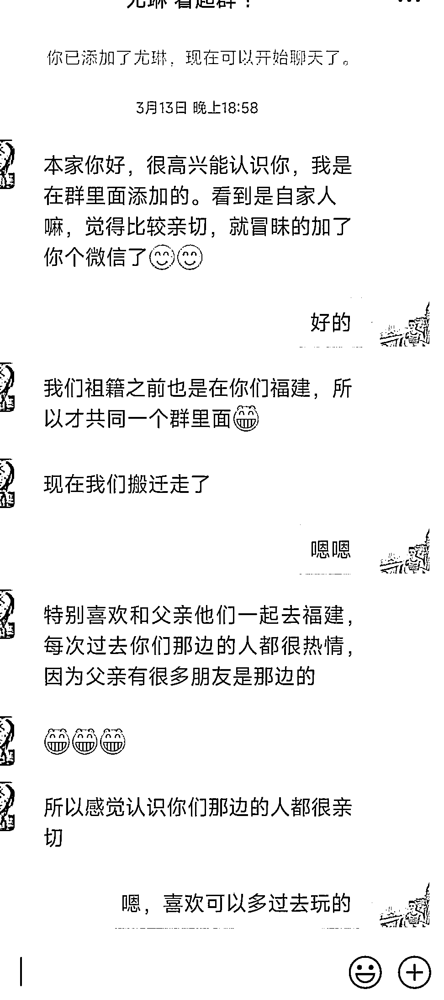
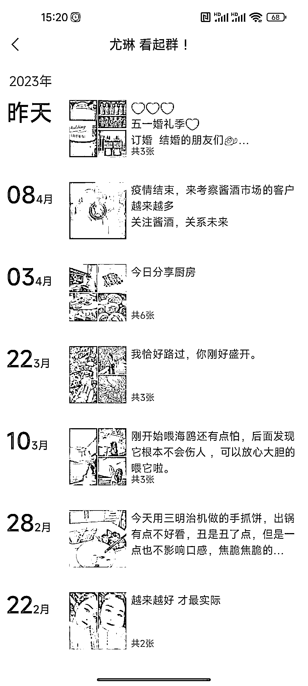
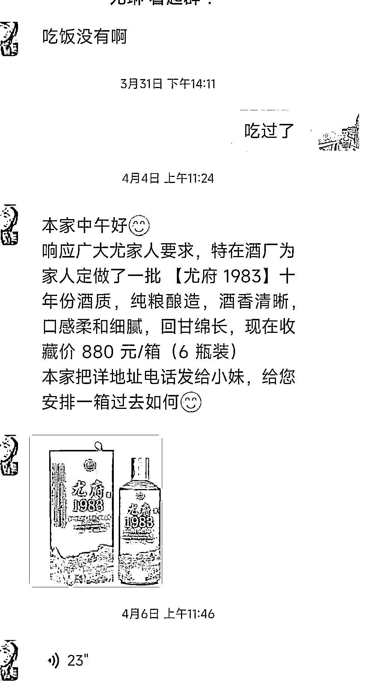
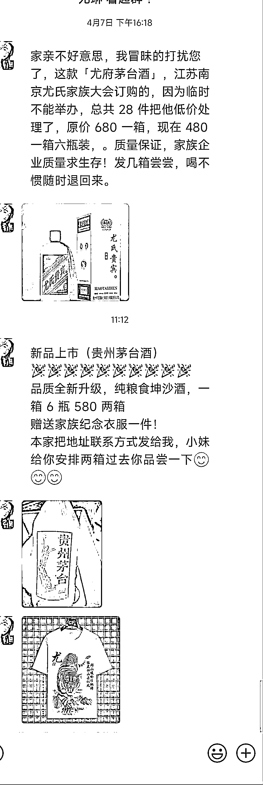

# (77 赞)加姓氏群引流卖定制姓氏白酒

 

 

作者：  发达

日期：2023-04-14

加姓氏群引流卖定制姓氏白酒

最近有一个美女从本家姓氏群加到我微信，开始以为是有什么事找我，热情寒暄后好像没事啊。看了下她朋友圈，怎么感觉一股专业卖酒的人设号。朋友圈就是日常生活+卖酒的日常。(图 1-2）

隔 2 天除了寒暄还突然问我还有其他本家微信群，我就感觉这肯定不是本家老乡，后来就开始向我推销本家(尤氏)定制贵州白酒。(图 3）

可能是看我没买酒打算，心想是不是感觉酒价格贵了，就换了个思路变相降价来成交我，我还是不买，最后又加磅说买酒送一件定制姓氏 T 家族纪念服。(图 4）

事实上我个人不太喜欢这种以本家群，绕来绕去的销售方式，但是可能很多中老年面对这样的场景，应该还是会买单的。

启发和思路拆解:

1.引流: 打着祖籍是本家的方法，去进各种本家群，然后把群里男的本家人都加微信闲聊增强信任，再问聊的好的邀请进其他本家群。

2.卖货: 根据本家姓特点，改下包装，推出定制姓氏白酒(让你体验被重视、亲切感觉)，我不喝白酒，发我姓氏酒图片时候，多少有点亲切的感觉的。

3.转化: 有了美女形象+本家群人设+姓氏定制酒，爱喝酒一部分中老年可能就下单了，对钉子客户，进一步变相降价和赠送附加值，来增加成交的机会。

思路发散:

用祖籍是本家的思路，可以换成李、王、刘、张等形式再来一遍引流。

1.白酒同行可以试下模仿她这个模式，毕竟白酒用户引流成本一个高达几百元。

2.其他有白酒客户相同的客户群体，比如中高客单价的古董、文玩，玉石等产品。

 

 

 

 

 

 

 

 

 

 

 

 

 

 

 

 

评论区：

 

 

华龙 : 😃，其实就是散装酒装入定制酒瓶，别问我怎么知道。

Luke 王子 : 确实可行，我爸已经买了酒

Kilo : 一件含泪赚 400[呲牙]

登登 : 我爸也买了，还很自豪😂

怡宝 : 我爸也买了  也很自豪[捂脸]

发达 : 看来买的很多啊😂

思蒙 : 😄😄

巫哥 : 看评论区突然觉得这个方法可能效果很好
