# 资料整理 202308

> 来源：[`remhu1p2pr.feishu.cn/docx/XSRCdjnlcoGuJ5xN4CBcf8YAnhd`](https://remhu1p2pr.feishu.cn/docx/XSRCdjnlcoGuJ5xN4CBcf8YAnhd)

出品时间：2023 年 08 月 18 日

建议：如果需要快速定位到精确内容，可以使用快捷键 Ctrl + F/command + F 的形式，搜索「关键字/词」，查找你想要的内容。

## 懒人思维导图：

写在前面

💡Hi,欢迎大家来到 资料整理 | 实战手册，相信在接下来的日子里，我们将在这里见面很多次。

首先需要跟大家说明的是，本次手册是在 5 月航海｜资料整理｜实战手册的基础上制作而成，新增内容主要为上一期航海的高手分享内容，集中在第一、三、四、九部分（第一部分的 IP 变现，举了几个比较详细的使用思维导图整理资料做 IP 的例子，如果正在做 IP 的你，说不定会得到一些启发）。所以大家在阅读的时候，会发现很多内容和之前的手册有所重叠，这是正常情况。

互联网时代，每个人都面临着海量碎片信息的轰炸，在这样的洪流中，有的人被冲得头晕眼花，而有的人通过学习和摸索，找到了可以轻松驾驭这些信息的方法。

通常情况下，一个人资料和信息管理的混乱和秩序，反映了这个人大脑对资料和信息处理的混乱和秩序。

为了让自己彻底摆脱信息和资料焦虑，我们需要掌握一套高效的资料整理方法。

在正式开始实战之前，我们先来了解几个小问题：

1）资料整理的好处是什么？

2）资料整理有几种模式？

3）如何使用好本手册？

1）资料整理的好处是什么？

资料整理，是一项重要的内容管理技术，它通过使用工具，策略性地对内容进行有序处理，目的是让这些内容能够得到妥善的储存、提取和使用。

做资料整理，可以提高工作效能、提高成长效率，还可以拓展第二曲线，开辟更多营收渠道（如资料引流、技能变现和 IP 打造等）。

2）资料整理有几种模式？

关于资料整理，不同人有不同的操作模式。手册的主线模式，基于“万事万物，唯我所用”。由该思路所引出的两种资料整理模式，可以从整体性和专项性两大层面，帮助我们解决信息和资源的巨大混乱和无序。

所谓整体性资料管理模式，就是想明白世界上所有资料和我们之间的关系，从关系出发将它们分为三大类：认知类、决策类和操作类。再往下依次细分，直到覆盖所有资料和知识类别。

策类和操作类。再往下依次细分，直到覆盖所有资料和知识类别。

所谓专项性资料管理模式，就是针对一个特定领域做资料收集和整理。通过“道 - 法 - 术 - 器 - 用”模型，快速搭建相关领域的资料和知识体系。

当然，除了上述模式，我们还整合了其他圈友的更多思路。大家可以先通览全文，选择自己喜欢以及适合自己的操作方法。

3）如何使用好本手册？

本次资料整理实战选题，我们的目标是在 21 天时间内，让大家通过学习，完成资料/知识的整理，并开始在公域平台引流，实现商业闭环。

针对这个实战目标，本手册将重点放在教大家一套受益终身的资料管理方法，并且成功搭建出一个资料库。具体内容包括了资料管理的好处、资料管理的底层逻辑、资料库的搭建方法、资料的高效获取和快速提取、资料库的维护方式等。

在资料引流和商业变现方面，由于之前我们已经有非常详细且完整的小红书资料引流手册，为减少大家的阅读和学习压力，我们将不对原手册内容进行二次汇编。已经搭建好自己的个人资料库，想通过小红书平台尝试引流变现的同学，可以直接跳转到 11 月航海 | 小红书资料引流 | 实战手册 进行学习。

❗️每一期航海手册我们都会持续迭代，如果你是本项目上次航海的老船员，那么以下有新增/有修改的内容可能更值得关注：

1.2.3.3 IP 变现

方法五：使用思维导图

渠道二：使用人工智能

案例七：让框架为你工作，让体系帮你变现

最后，希望大家可以在这次航行里收获成果外，也能结识一群战友。

以下内容由生财有术团队联合多位在资料整理领域有实战经验的圈友制作而成，仅供航海船员以及生财有术星球圈友学习使用。

同时也欢迎圈友们在实践过程中持续反馈，和我们共同完善，可以联系提供修改建议～

# 一、基础介绍 @洛羽

## 1.1 什么是资料 / 信息 / 知识整理

互联网时代，几乎每个人都有电脑和手机。

为了获取更多信息和资源，大部分人的手机和电脑里，都安装了很多资讯、社交、办公、学习甚至理财类软件，每个软件上都会产生海量的碎片信息。

关于这些碎片信息，绝大多数人的整理方式是：怎么方便怎么来。

比如看到好的东西，第一反应就是收藏，要么直接用网页收藏工具，要么顺手转发到自己的微信或者朋友圈。

这样的操作方式，存的时候很简单，但是在要的时候，几乎是翻遍自己所有存在过的软件、平台和聊天记录，都找不到想要的那个东西。即便是能找到，中间也需要花费大量时间。

而相比之下，有的人就可以快速地找到自己所需要的各种信息和资料，在他人还在冥思苦想“在哪里看过”“东西放哪儿”的时候，高效且靠谱地把它们呈现出来。

个人资料和信息管理的混乱和秩序，反映了这个人大脑对资料和信息处理的混乱和秩序。

当然，我们也不否认，有极少数人可以在看到资料和信息的同时，就能做到把资料和信息直接消化和运用，无需再通过其他方式对其本身进行操作和整理。

但说到底，这样的人又有多少呢？我们 99.9% 的人都只是普通人，我们没有那么强的资料和信息处理能力，只能通过反复的“搜集+理解+消化+应用”，才能做到对这些内容有一定程度的把握。

因此，从大体上看，一个能够把所有资料和信息分门别类整理，并且做到在任何时候，都能快速找到自己所需要的东西的人，说明 TA 具备很强的资料信息整理能力，这几乎可以算做是互联网时代的一个“强大竞争力”。

知识整理也是类似，在常规理解上，它和资料管理、信息管理并没有那么明确的概念区分，都是对内容进行处理。在专业理解上，资料和信息可能比较偏向于即时的、碎片的、海量的、未经过实证检验的；而知识比较偏向于时间和实践沉淀出来的、较为体系化的、有数据和样本支持的理论和方法。

总的来说，资料也好、信息也好、知识也好，我们不用在概念上纠结那么多，只需要知道：所谓的资料 / 信息 / 知识管理，本质上是一项重要的内容管理技术。它通过使用工具，策略性地对内容进行有序处理，目的是让这些内容能够得到妥善的储存、提取和使用。

为方便操作，下文我们将不再对上述内容进行概念区分，统称为“资料”，对“资料”的处理统称为“资料管理”。

## 1.2 资料管理的好处

学会资料管理这项技能，有很多好处，总结起来有以下几点：

### 1.2.1 提高工作效能

工作是我们投入时间精力最多、也是必须要看到成果的领域，如果我们能够通过收集和整理，搭建出自己的行业资料库和业务资料库，就可以大大提高工作效能。

具体表现在，当我们有了分类清晰的资料库，在平时看到行业或业务相关的资料时，可以快速收集到资料库中，后续有需要的时候，可以快速提取出来，便于实际工作参考或运用。

除了收集和提取外来的资料，还有沉淀和提取个人方法论。

当我们在业务上取得一定成果的时候，可以把相关项目资料和方法论梳理出来，有序沉淀到资料库中。后续如果有同样的业务需要跟进，或者有其他人需要参考资料时，就可以快速提取出来复用。

### 1.2.2 提高成长效率

个人成长领域也是一样的。如果我们能够通过收集和整理，搭建出自己的人生资料库，也可以大大提高成长效能。

个人成长领域也是一样的。如果我们能够通过收集和整理，搭建出自己的人生资料库，也可以大大提高成长效能。

具体表现和上方一样，当我们有了一个分类清晰的资料库，在平时看到任何和个人成长有关的资料，在我们取得任何成长和进步时，都可以把相关资料沉淀在个人资料库中，方便后续参考和复用。

持续地“搜集+理解+消化+应用”，我们的成长就不再是碎片的毫无章法的，而是有迹可循、不断迭代的。就好比自身是一个系统，资料库是一个外挂大脑，我们在对外挂大脑进行升级的同时，个人系统也在不断升级。

### 1.2.3 拓展第二曲线

除了工作和成长，资料整理的另一个隐形好处，是可以拓展第二曲线，开辟更多营收渠道。

据我所知，和资料、信息、知识相关的商业化思路主要有：

资料引流：通过整理好的资料，在各平台进行引流，然后在私域进行成交转化；

技能变现：承接一些资料收集、整理和出品的商业需求，直接进行技能变现；

IP 打造：在整理和消化资料的过程中，逐渐成长为一个“知识型 IP”，并通过内容本身进行商业化变现；这几种方式，难度是依次递增的，下面我们逐一展开介绍。

这几种方式，难度是依次递增的，下面我们逐一展开介绍。

#### 1.2.3.1 资料引流

设想一个场景：让你现在添加某某微信，免费送你价值 1999 元的 100 份 直播电商报告、100 份直播脚本、100 份私域操盘方案、10 节视频直播课程……

如果是真的，请问你愿意添加吗？或多或少，一定有一些人会添加。

大家再回想一下，我们在小红书 / 朋友圈 / 知乎等平台，有没有看到过类似的送母婴育儿、运营地图、私域方案的资料玩法？

为什么一定有人需要呢？其一是有人帮忙做了整理，节省了本人大量的时间；其二是大多数人都有厌损心理，总担心自己会错过什么重要的资料。

这些资料可以是电子版的资料或模板、语音直播课程，甚至可以是纸质书籍，全看我们的引流需求。当然，一般来说，都是以电子资料为主，交付较轻。

比如现在只要有涉及 ChatGPT、知乎好物、直播带货、私域运营、外卖 CPS 、跨境电商等任意一种资料，就一定能吸引一部分用户关注。

等有用户通过获取资料这一途径，进入我们的私域池子后，我们可以再引导他们购买其他商品，实现营收变现。

这就是资料引流的玩法介绍，资料整理是其中至关重要的技能。

内容来源：《#引流# 10 种最有效的引流方法》

#### 1.2.3.2 技能变现

不知道大家有没有看到亦仁在星球分享的，关于开设“资料整理”这个航海选题的考量。

他说：

“对于很多圈友来说，其实是没有专业知识的，更没有专业知识的输出能力，属于没吃过猪肉只看过猪跑的这群人。

比如我让你设计一套社群运营课，你肯定设计不出来，但我让你收集整理一下：互联网上有哪些好的社群运营相关的文章，帮我整理出来，清晰呈现给我。

这个你大概率能完成，我愿不愿意付费？当然，我需要这样的整理好的东西，节约了我大量的时间。

所以，没什么专业知识的人，学一学资料收集整理的技能，反而很多人愿意买单，因为绝大多数人实在是太懒了。”

关于资料管理的技能变现，类似的还有：

1）把嘉宾分享的音频、视频、现场内容整理成逐字稿，并且打磨成一篇干货文章交付给需求平台。我通过这样的方式，和笔记侠还有腾讯学堂合作过。

2）将一些专业人士分享的内容，收集整编成一本电子书或实体书籍。比如生财圈友七小，为很多有 IP 的圈友汇编了电子书，这里面有一定的合作空间。

3）将一些课程或书籍的文字内容，通过整理提炼出思维导图或者各类视觉笔记。这种方式可以和樊登读书会、得到以及商业书籍出版社合作。

4）把自己整理资料的方法论沉淀出来，通过技能教学实现商业变现。

#### 1.2.3.3 IP 变现

💡

互联网时代，很多人都在打造个人 IP ，个人 IP 中有一类叫做“知识型 IP”，即对某个特定领域有比较系统全面的知识储备，能够提出比较专业深刻的见解，以及切实可行的建议。

要想成为这样的“专家”，必须要有足够的信息输入，还得能把信息转化成自己的认知和经验。这就离不开强大的资料收集、资料整理、资料学习以及内容输出能力。

成为知识型 IP ，在商业化变现方面，可以入驻一些知识平台当讲师、开设专栏、上架课程、出版书籍、举办训练营以及一对一咨询等。

下面会拿思维导图来举例，说一说运用思维导图可以在小红书做哪些种类的 IP，建议大家看完全文后，再返回来细读这一章节，你可能会：对资料整理、思维导图、做 IP 的理解更加透彻

案例一：读书博主

思维导图可以解决一个很大的痛点，那就是帮助我们阅读，很多人看书看完就忘记，用思维导图一边看一边梳理，记忆深刻，同时把你的导图笔记分享出来给他人，可以帮助别人节省阅读时间，或者想看一本书，看下你的笔记就知道这本书值不值得看，或者想看一本书，但是一直没时间看，通过你的笔记了解精华知识点～

那如何用思维导图做一个读书博主呢？

定位：用思维导图形式分享读书笔记（我写的是比较概括的哈）

封面：一直用同一款模版，所以提前设计好一款模版，往后就是打开文件改文字，一劳永逸的事情。如同咱们的 PPT 模版一样，你只需要对应在里面改文字。

内容输出形式：

变现形式：

①卖导图模版，开个店铺卖导图模版

②接广告，结合粉丝人群接广告

③引流到私域，做读书会，带领大家拆书阅读做笔记

④思维导图代做服务

⑤思维导图训练营产品

适合人群：

①阅读较快，擅长做笔记的人

②私域有学习读书产品的人

④逻辑思路清晰，会用思维导图的人读书博主的思维导图做法和注意点：

读书博主的思维导图做法和注意点：

封面：单张导图或者整本书的导图，加个爆款话题

内页内容上：每一张呈现一个知识点，不要死板的直接把书籍目录或者章节标题写出来，要学会站在自媒体人的角度写思维导图的标题，比如你看《早起的奇迹》这本书，我们可以试着把早起的 7 个步骤罗列在一张导图上，这张导图就可以叫“7 步戒掉熬夜，学会早起自律”等等。

然后围绕这个点，开始展开给大家分享，为什么要早起，早起的 7 个步骤、坚持早起过后的改变或者一些案例，这样我们的分享是可以真的带着粉丝落地实践的，那么你给到粉丝的干货性就更强，不仅仅是在搬运作者的一些观点。

生财圈友熊孩子不差之前做过一个号分享“思维模型”，每次都会在最后带上一个案例，真正能让人知道这个模型怎么使用的恰好就是这个案例，说了那么多的是什么、为什么，不如教他怎么做。所以我特别建议读书博主可以从书中延伸运用案例出来。

小红书标题：小红书标题也很重要的，有很多书籍压根小红书上没啥搜索，你直接把标题写为书籍的标题，大概率会石沉大海，这时候我们就得运用爆款标题的方法来写，具体大家也可以研究小红书的爆款标题写法。

我自己最喜欢的一种，搜索我想分享的关键词，看看有哪些爆款，随便找 3 个爆款标题重新组合下变成我的标题，简单好用。

定位精准，输出精准，内容风格统一，很容易涨粉的，对你感兴趣的粉丝进入你的主业一看，这个博主有点内容，关注了！

这里我分享一个用思维导图做复盘的博主，他就是自己设计了一套思维导图复盘模板，每周每月复盘或者针对自己的一些大事件复盘分享。

定位：用思维导图呈现自己的技能

封面：复盘内容集合，比如本周做了四页复盘，那就把这 4 页拼在一起，作为封面，对复盘感兴趣的小伙伴一定想看看这 4 页都复盘了什么，我是不是可以学习借鉴呢，这个博主好自律呀，我要学习下等等，整体来说就是很吸睛。

内容输出形式：

①复盘阅读、学习、思考、生活想法等

②在思维导图中插入一些图片，增添复盘的可读性

③导图色调较多，符合生活的调性～

技能博主的思维导图做法和注意点：

技能博主的思维导图做法和注意点：

封面：把技能展现出来，做复盘的，把你的复盘结果展示出来人，让人感受到做复盘的美好和充实。

内页内容：内页内容主要就是展示你这个技能的过程，有的宝妈用思维导图教孩子阅读，那咱们就把思维导图如何一点点教孩子读懂绘本每一页的过程展示出来；教复盘就把复盘过程一页展示，让粉丝跟着你这篇贴子感受到你这个技能给人的获得感。

小红书标题：依旧采用咱们上面说到的爆款思路，但是一定要有你技能的关键词：思维导图+技能关键词（读绘本/学英语/复③引流到私域，卖生财的门票等

③引流到私域，卖生财的门票等

适合人群：

①某个领域的操盘手/有成功经验的人

②有知识付费产品或可分销可靠的产品的人

③副业第一步分享副业赚钱项目的人

私域引流博主的思维导图做法和注意点：

封面：一定要大字突出你的这张导图上的信息很多很全，可以帮助对应的人群解决某些痛点，比如：100 个引流技巧，50 个打造 IP 的技巧，80 个朋友圈发圈技巧，这里就决定粉丝点击，决定粉丝来找你，说白了私域引流博主用思维导图的目的就是引流到私域来要你的这个资料。

内容上：把你的技巧一点点罗列在思维导图上，不要求颜色多漂亮，基本的层级数量一致，每个分支宽度一致就可以的。然后每个技巧也只需要讲基本的做法，简单的做法，不用讲案例。让想要资料的人觉得拥有你的这些资料他也可以轻松的实现某个目标。

标题上：数字是很大的诱惑力，标题中有数字，体现资料集合感。跟封面的方法差不多。

内容来源：5 月 25 日《如何用思维导图做小红书》@熊孩子不差！

# 二、资料管理的底层逻辑 @洛羽

## 2.1 为什么做不好资料管理

第一章和大家介绍了什么是资料管理，我们为什么要做资料管理。相信大家看完之后，也都知道了做资料管理的必要性。

接下来，我们思考一个重要问题：为什么很多人做不好资料管理？

根据我的个人经验，最核心的原因就是：不知道如何对资料进行分类，再核心一点，就是不懂这些资料！

我们人类从诞生到现在，一边实践一边沉淀了海量的经验和资料。从口口相传到用龟甲石头刻字，从牛皮纸张竹简再到现在的信息时代，我们记录、传输和沉淀信息的能力越来越强，现如今，几乎完全不用担心信息和经验留不下来。

很多时候，我们会说当下的世界充满了信息和知识焦虑，但其实这种现象，从古至今一直都存在。

面对浩如烟海的文字和材料，如果不是每个时代都有那么一批人，不断对这些内容进行分类、编撰和归档，这些古老的经验也不会流传到现在，变成全人类共同的财富。

参考人类对于资料的管理和使用经验，我们不难发现：能够对资料进行分类，可以说是处理信息和资料的第一步。甚至可以说“分类就是知识本身”！

是的，分类就是知识本身。一个人想要对大量资料进行分类管理，前提是 TA 得深刻理解这些材料，之后才能将它们分门别类、物归所属。

这也是为什么，从古至今做资料管理的人，基本都是博览群书的人；这也是为什么，有很多人想做资料管理，但一直做不好的根本原因。

看到这里，是不是有人会觉得很沮丧？如果自己之前没有博览群书，也无法快速对这些资料进行理解，是不是就做不好资料管理了？

别着急，本章节我就教大家 2 个超级强大的资料管理方法，也可以说是对知识理解和运用的底层逻辑。

逻辑一：整体性管理

逻辑二：专项性管理

## 2.2 逻辑一：整体性管理

### 2.2.1 什么是“整体性管理”

资料的整体性管理，顾名思义，就是对“所有”资料进行管理。何为“所有”？即肉眼可见的一切东西。

这么多东西，只是想一想就觉得头都大了，还要把它们管理得井井有条？可真不是一件容易的事情。

确实是这样，所以我们在对所有东西进行管理之前，必须得先想清楚：为什么要对所有东西进行管理？管理它们要达到什么目标？

基于我个人多年的实操经验，一个人如果想要管理所有东西，最大的目标和需求就是：希望世界上所有的东西，都能为自己所用。

具体来说就是：当觉得某些资料、信息、知识甚至人很好的时候，都可以快速收藏起来（是的，人也可以收藏，主要收藏的是和 TA 有关的信息和资料）；当自己对一些事情有一定理解和操作经验的时候，也可以快速沉淀起来，之后在有需要的时候，能够快速查找和参考，目的是让自己变得更聪明和更强大。

如果你也有这样宏大的资料管理目标，那就认真看接下来的内容，相信我，一定会对你有所启发！

### 2.2.2 如何进行“整体性管理”

采用“整体性管理”方法，我总结了一下，大概会经历三个阶段：

第一阶段：什么资料、工具、方法论都想要

第二阶段：想清楚了目标，开始精简操作

第三阶段：找到整体性管理方法，可以综合使用灵活运用；

1）第一阶段，什么都想要

什么都想要的人，最常见的操作就是：

朋友圈或社群里，看到别人分享了一个网站、一个工具、一本书、一篇文章、一个资料包，觉得很好，立马就收藏起来；

在刷社交媒体的时候，看到一个好的视频、好的音乐、好的创意点、好的活动玩法，也立马就收藏起来；

看到身边的人最近在做什么，感觉什么不错，就想跟着一起做；……

……

接着，发现资料混乱、信息爆炸、知识不成体系、人际关系复杂、看不清楚事物运转的原理。之所以会出现这样的问题，是因为在这类人的大脑当中，对资料、信息、知识、人事就没有什么概念，也不知道它们之间的关系如何。因此对它们几乎没有掌控力，只能是别人看什么就看什么，别人学什么就学什么，别人做什么就做什么。

他们完全不知道关注、收集和处理这些东西的目的，即便给他们再多的资料管理方法，最终还是会陷入细节里，成为工具、方法、内容和人事的“奴隶”。

我最开始做资料管理，也很痴迷于对工具、方法和内容本身的研究。

那段时间，我就像是一个工具测评博主一样，会去刷市面上比较好的资料管理工具，然后看不同人对工具的使用方法，自己也会经常上手实操。但工具多了，也会产生烦恼，资料这里存一点那里存一点，和之前没有做资料管理相比，并没有什么明显的效果。

同时，我也像是一个小松鼠（松鼠有“囤积症”）一样，觉得什么资料管理方法都可以学学，毕竟都有人尝试过且拿到了结果；也觉得什么资料都可以收藏起来，相信未来总有一天，它们会派得上用场。

不知道在看手册的朋友们，有没有过上述情况？如果有的话，相信大家看完接下来的内容，就可以直接跳过我踩过的坑，进入如何理解这句话？展开来讲就是，所有外部的东西，做到极致也就是都被我们收集到位并了解一遍，它们对我们的影响路径是：首先影响我们对于一件事情的分析和判断，继而影响我们的操作和行动，最后影响了我们是否能拿到结果。

如何理解这句话？展开来讲就是，所有外部的东西，做到极致也就是都被我们收集到位并了解一遍，它们对我们的影响路径是：首先影响我们对于一件事情的分析和判断，继而影响我们的操作和行动，最后影响了我们是否能拿到结果。

要想从外部资料的无意识关注、收集和整理，做到资料能被我们使用，并让我们发生改变，核心点就是要“知行合一”。这是哲学上的“世界观决定方法论”，也是王阳明苦苦觉察悟出来的终极真理。

“认知影响决策，决策影响操作”，这是我在对资料进行整体性管理时采用的顶层分类方法，即把世界上所有的资料分为三类：认知类资料、决策类资料、操作类资料。

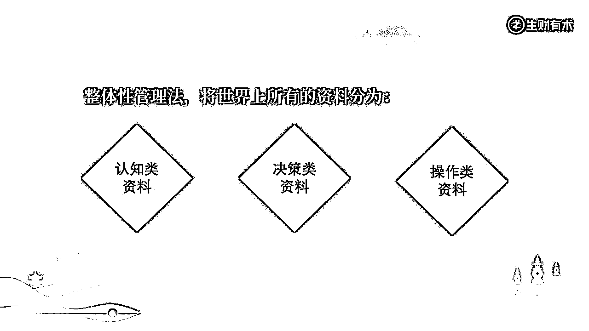

通过这样的分类方法，就可以精简大脑思路，从更高维度对所有资料进行掌控。

通过这样的分类方法，就可以精简大脑思路，从更高维度对所有资料进行掌控。

3）第三阶段：用整体性管理方法，掌控所有资料

第二阶段，我们已经将所有资料分为了三大类。第三阶段，我们继续对这三大类进行更为细致的划分，逐渐会发现，我们混乱的思绪慢慢变得清晰，所有的资料也开始有了系统性的脉络。

下面，我们具体来拆解一下各大类——

#### 2.2.2.1 认知类资料

认知类资料，是我们的第一大类资料。它所对应的资料类别是：人类对于事物的理解和判断。

人类对于事物的理解和判断，经过上千年沉淀，有着海量的资料。我基于不同类型认知所能解释事物的广度和深度，对人类思维进行了进一步分类，主要分为四个层级：

本能性认知

经验性认知智慧性认知

智慧性认知

以上四个认知类别，越往后走越高深，所解释问题的广度和深度也越强。

所谓“本能性认知”，这是最底层的人类认知维度。这是根植于人性深处的、无需通过任何实践和教化就能具备的东西。通常来说，人类偏本能的感觉、观念和想法，都属于这个类别。

所谓“经验性认知”，这是最常见的人类认知维度。人类通过实践所掌握的一切理论、方法和经验，都属于这个类别。这个经验，可以是别人所沉淀下的经验，也可以是自己通过实践，所沉淀下来的个人经验。

所谓“哲科性认知”，这是比较高维的人类认知维度。它和“经验性认知”最大的区别在于，这是通过数理逻辑实证过的，对更大数据样本进行系统性总结后的经验。通常来说，各类学科性知识和资料，都属于“哲科性认知”。

所谓“智慧性认知”，这是最高的人类认知维度。我们人类存在的时间有限，思维能力有限，因此这个世界上还有很多知识，是我们目前无法触及和理解的。通常来说，各种宗教、灵修和冥想等资料，都属于“智慧性认知”。

这部分不稳定的因素，主要有时代趋势、国家大势（政策风向）、行业动态、平台讯息等。如果我们平时能多关注和收集整理相关的资料，在做战略决策的时候就有了可参考的东西，甚至有可能吃到信息差红利，实现变道超车。

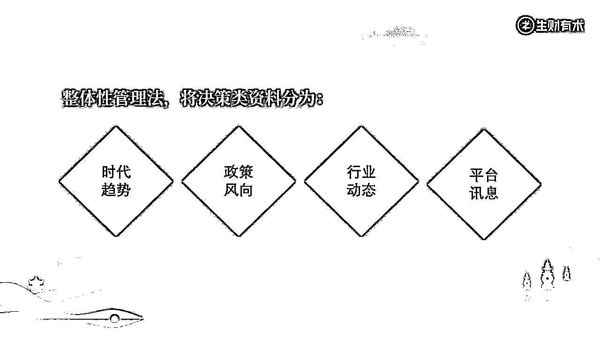

#### 2.2.2.3 操作类资料

操作类资料，是我们的第三大类资料。它所对应的资料类别是：我们在认知影响下，决策制定后，所进行的一系列行为的资料存档。

通常情况下，我们的操作会涉及各个方面，但最主要的还是这四大板块：工作、学习、生活和兴趣。我也是基于这几大模块，对操作类资料进行分类管理。

为此，我们对世界上所有的资料进行了综合分类：

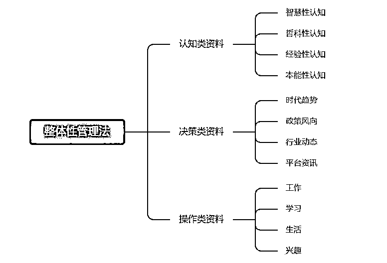

## 2.3 逻辑二：专项性管理

### 2.3.1 什么是“专项性管理”

上面我们介绍了资料的“整体性管理”，肯定有一些小伙伴会觉得，这项工程实在是太宏大了，有没有比较“小”一点的资料管理方法。

好，这就来到了资料的“专项性管理”范畴。所谓“专项性管理”，就是针对一个特定领域做资料收集和整理。

同样，专项性管理也需要先想清楚目的。基于我个人的实操总结，一般存在以下几个目的：想系统学习该领域的知识和技能，用以提升自身专业能力，甚至希望成为细分领域专家；

想系统学习该领域的知识和技能，用以提升自身专业能力，甚至希望成为细分领域专家；

想整体梳理该领域的相关资料，用于商业化运作。

如果你也有这样比较特定的需求，可以采用以下资料管理逻辑——

### 2.3.2 如何进行“专项性管理”

对于一个特定领域来说，哪些资料是重要的呢？这些资料又是如何构建出一个领域的资料体系的呢？如果不了解这些问题，后续可能花费了很多时间和精力，结果收集起来的资料，对于学习和商业化毫无帮助。

在这里，我给大家推荐一个分类模型——道 - 法 - 术 - 器 - 用。其中的“道法术器”来自《道德经》，“用”来自一线实操。通过这个模型，大家可以快速搭建出细分领域的资料体系。

所谓“道”，主要包括了概念、定义、理念、规律和目的。它主要承担的作用，就是讲清楚该细分领域到底“是什么”，我们研究它到底是“为了什么”，该领域存在的意义和价值在哪里。

所谓“法”，主要就是在探求“道”的过程中，经过实践思考、总结归纳出的规则体系和方法原则（比具体方法更抽象化），属于高度提炼总结的规律。

按照上述方法做细分领域的资料收集和整理，往深了说，可以写出详细且专业的学术论文和科研报告；往浅了说，哪怕任何一个维度下的任何一个模块，稍微打包打包，就可以实现商业引流或者变现。

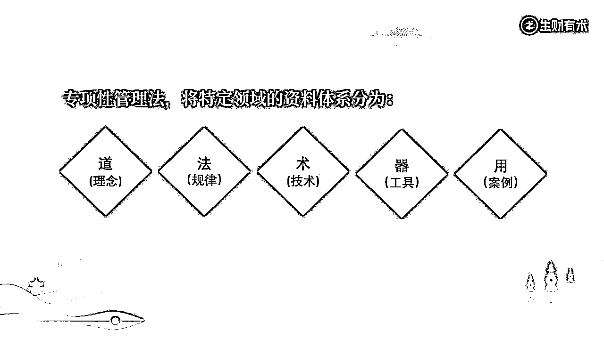

# 三、如何搭建终身受用的资料库

💡

章节纲要

上面和大家讲述了资料管理的基础内容，以及资料管理的核心分类逻辑，本章节我们将正式进入到资料管理的实操环节。

节。

如何搭建一个终身受用的资料库？主要了解以下几个方面：

需要管理的资料类型

如何选择管理工具

搭建资料库的详细方法

如果你之前已经有使用得比较顺手的资料管理方法，或许这些内容可以为你提供一些不一样的视角；如果你之前对资料管理完全没有概念，也没有任何操作基础，可以参考下面方法，逐步搭建出自己的第一个资料库。

## 3.1 需要管理的资料类型 @洛羽

## 3.1 文字资料

文字资料是最常见的，我们平时看到的内容，绝大部分都是文字资料，包括各类网站和客户端的文章，包括个人产出的灵感、思考和笔记等，都属于文字资料的范畴。

对于文字资料的管理，是资料管理工作的大头。因此，无论是在选择资料管理工具，还是在对资料进行分类时，都需要考虑对文字资料的快速收集、呈现、标记以及提取。

## 3.2 图片资料

图片资料，有时候会伴随文字资料一起出现，常见于各类文章之中。有时候也会单独出现，比如我们在使用手机或相机进行拍照时，影像资料就是单独存放在相册内。

对于图片资料的管理，需要考虑到即时同步、快速加载、像素保真、快速下载、内存大小等。

## 3.3 文档资料

这个文档资料，和上面的文字资料不同，它不是单独的文字形式，只需要复制就可以保存下来。它是基于本地文档而生成的各类文件，比如 Word 文档、Excel 文档、PPT 文档、PDF 文档等。

对于文档资料的管理，需要考虑快速加载、在线阅览、快速下载、内存大小等。

## 3.4 音像资料

音像资料，包括了语音资料、音乐资料和视频资料等，做“自媒体运营”或“知识型 IP”的人，会经常涉及到此类资料的管理。

音像资料，包括了语音资料、音乐资料和视频资料等，做“自媒体运营”或“知识型 IP”的人，会经常涉及到此类资料的管理。

和文字、图片、文档资料相比，它们所占用的内存是最大的，也是最需要考虑上传、预览和下载速度的。

## 3.5 其他资料

除上述资料外，还有其他比较小众的资料类型，如设计师需要的各类源素材、程序员需要的各类源代码、程序和插件等。

由于这些领域所涉及的资料管理工作比较专业，本手册中就不展开说明了。

## 3.2 如何选择管理工具 @洛羽

### 3.2.1 选择管理工具的原则

#### 3.2.1.1 最好集中在一个平台

诚如手册最开始提到的，如果我们在做资料整理的时候，为了图方便，随手将资料收藏或者转发到不知道什么地方，后续想要查找起来，几乎就是大海捞针，效率极差。

为了让这个资料库能够持续且高效运转，建议大家最好选择一个固定的平台。这个固定的平台，不是让大家把所有资料都只放在这个地方，而是它应该成为我们搜索资料库的总入口。

我们可以根据资料的类型，在不同的平台上存档资料。但无论我们将资料存档在任何地方，都应该要设置一条线索，将其汇总在一个“固定的平台”（也可称为“总资料库”），这样就可以实现通过这一个入口，链接到所有资料（甚至是全网资料），并实现快速查找和提取。

#### 3.2.1.2 最好有足够大的内存

我们在选择资料库搭建平台的时候，需要考虑的一个重要因素就是——是否具有足够大的内存。

对于资料的整理和管理，通常是长期性甚至终身性的，在选择平台的时候，如果内存太小，当需要存放大量图片或音像资料的时候，系统很快就会显示不够用。

此时，我们再去选择新的平台，把已经整理好的资料，迁移到其他平台，整个过程工作量是很大的，也非常浪费时间。

当然，这里面会存在两种情况：

1）如果我们最终确定的“总资料库”，它所承担的作用是资料汇总地，那么就像上面说的，内存必须足够大；

2）如果我们最终确定的“总资料库”，它所承担的作用是线索汇总地，具体的资料存放在其他平台，那么对于内存大小的考虑，可以稍微放开些。

虑，可以稍微放开些。

或许有同学不太明白“资料汇总地”和“线索汇总地”的区别是什么，没关系，后面我会详细介绍。

#### 3.2.1.3 最好能够多平台协同

多平台协同，意味着我们所选择的资料管理平台，它应该是一个云端服务器。即：在同一个客户端的同一个账号下，无论是通过手机、电脑、还是平板打开，都可以看到资料库的所有内容。

这就避免了一种情况：当我们把资料存储在一个端口（比如电脑的本地文件夹），后续想要随时处理这些资料，还得随时带上这台保存了资料的电脑，很不方便。

更可怕的是，要是某一天这台电脑突然坏了，而我们的资料又没有上传到云端，想要找到这些资料，所付出的时间和人力成本将是巨大。

### 3.2.2 资料管理的工具介绍

做资料管理，选择合适的工具也很重要，因为它能直接影响到资料管理的操作体验和实际效率。好的资料管理工具，能够在技术上为我们减少很多人力成本，让我们把更多精力专注于对资料本身的使用上。

作为一个资料管理深度践行者，除了上述工具选择原则，我对于资料管理类工具软件的需求，总的来说有：

资料收集是否方便快捷；

资料呈现形式是否多样；

资料编辑是否灵活高效；

是否有结构化的资料管理功能；

内存是否够用；

搜索和查找资料是否方便；

是否可以多平台协同；

是否可以共享给其他人。

基于上述需求，我将自己这些年使用过的资料管理工具，给大家做一个体验分析，包括：本地文件夹

本地文件夹

网盘类工具

笔记类工具

知识库工具

需要说明的是，以下只代表我的个人经验和感觉，供大家在选择和使用时作为参考，不代表工具平台本身的好坏和优劣。

#### 3.2.2.1 本地文件夹 ★

这个大家应该比较熟悉，每台电脑都配置有本地文件夹功能，可以算是资料管理的最简单工具。

我对于本地文件夹做资料管理的综合判断是：

💡

工具评分：40 分（满分 100 分）

使用建议：PC 端高频使用的本地资料管理图片类、文档类和音像类资料，可以直接下载或存放到对应文件夹；

图片类、文档类和音像类资料，可以直接下载或存放到对应文件夹；

文字类资料得先建一个本地文档，把内容复制进去，形成本地文档后，再存放到对应文件夹；

总的来说，不是特别灵活快捷。

2）资料呈现方面

从可存档的资料来说，本地文件夹能管理各类文档、图片、音像、压缩包等资料；

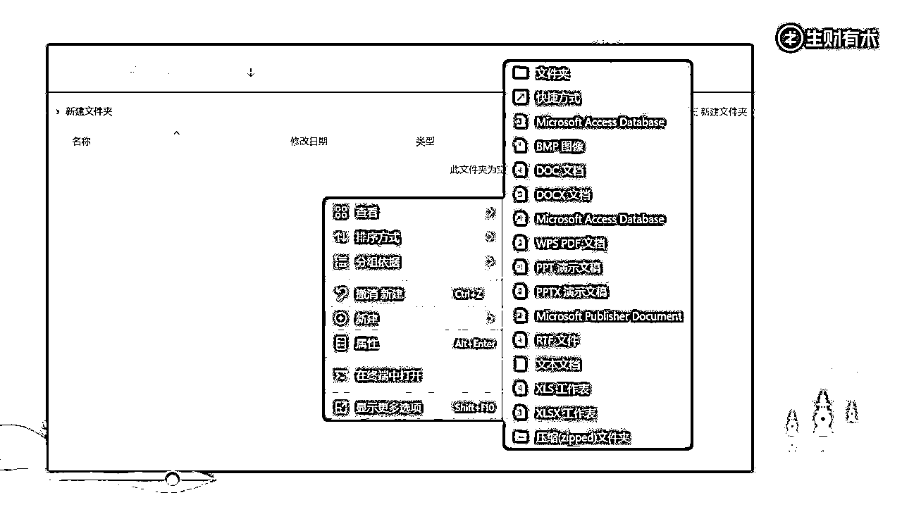

从资料的展示形式来说，有列表和图标两种；排序上有按名称、修改日期、类型、大小等。

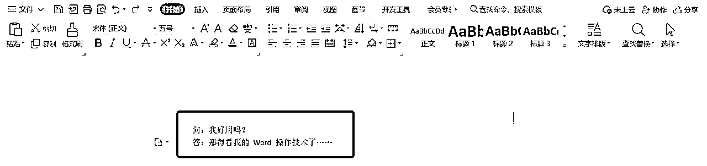

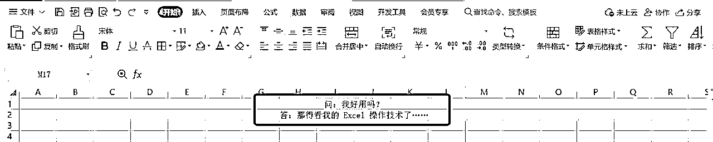

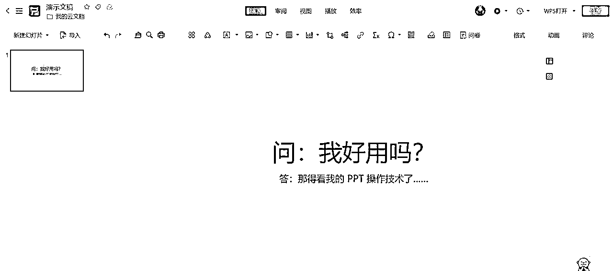

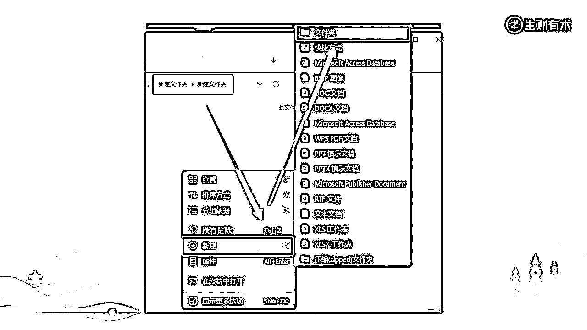

5）内存方面

文件夹的内存，和电脑本身的内存强相关，因为大多数电脑的内存够用，所以我们默认为文件夹的内存也够用。

这里需要考虑一件事，就是如果电脑的内存占用过多的话，会导致运转速度变慢，所以我们不太建议在本地存储太多占用内存的资料。

总的来说，本地文件夹内存够用，但是不建议在资料上占用过多内存。

6）搜索和查找方面搜索和查找文件，常用的方式是逻辑查找（知道自己放在哪里，一层层点击进去）；以及关键词查找（搜索关键词，定位对应文件）；

搜索和查找文件，常用的方式是逻辑查找（知道自己放在哪里，一层层点击进去）；以及关键词查找（搜索关键词，定位对应文件）；

高效搜索和查找的关键，不在工具本身，在于我们对资料的分类和命名；

总的来说，如果“分类”和“命名”做好了的话，本地文件夹的查找功能还是比较方便的。

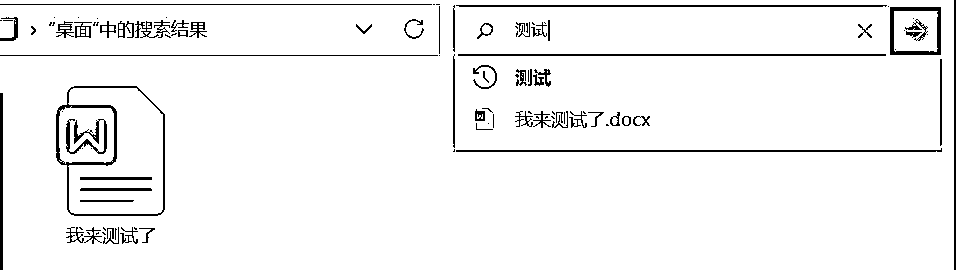

7）多平台协同方面

本地文件夹，核心存储地是 PC 本地空间，“无法多平台协同”，可以算作是这类工具最大的痛点。

8）资料共享方面

本地文件可以传输给别人，但是不可以“共享”（这里的“共享”，指的是可以看到最新版本，以及协同编辑）；

#### 3.2.2.2 网盘类工具 ★★★

网盘类工具，市面上还是比较多的，比如百度网盘、腾讯微云、阿里云盘、坚果云笔记等。

我对于网盘类工具做资料管理的综合判断是：

我对于网盘类工具做资料管理的综合判断是：

💡

工具评分：70 分（满分 100 分）

使用建议：本地文件云端备份 + 大文件存储地

所有网盘的功能其实都差不多，我这里就不逐一介绍了。大家感兴趣的话，可以去对应官网获取。

以下是网盘类工具的使用体验，以腾讯微云为案例进行说明：

1）资料收集方面

网盘类工具，一方面相当于本地文件夹的云端备份，另一方面相当于接受外部资料的中转站；

作为云端的本地文件夹，除了相册资料可以自动同步外，其他文档资料可能都需要手动上传；

作为外部资料的中转站，除了百度网盘是比较通用的传输中介外，其他的网盘都比较小众和私人。需要先用百度云接收资料，然后下载到本地，再然后上传到云端；

总的来说，用网盘做资料收集，整体路径比较长，不算方便快捷。

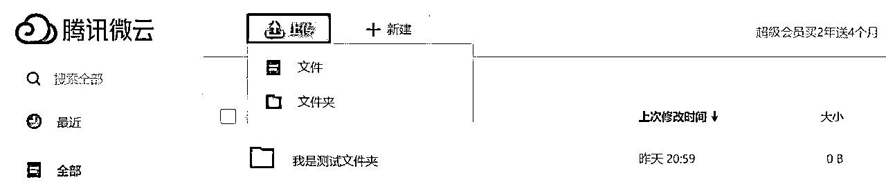

2）资料呈现方面

2）资料呈现方面

从可存档的资料来说，网盘和本地文件夹一样，能管理各类文档、图片、音像、压缩包等资料；

从资料的展示形式来说，有列表和缩略图两种；排序上有按名称和修改时间；

总的来说，如果这些功能运用得好得话，还是有可能实现井井有条的。

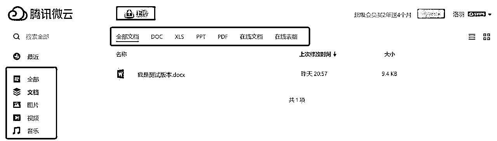

3）资料编辑方面

想要编辑网盘里面的资料，可以逐一打开目录，或者直接搜索关键词，然后对其进行编辑；

现在的网盘工具，基本都可以实现一边在线编辑一边自动保存，无需下载到本地编辑后再上传；

对于各类资料的编辑，也是和软件本身的功能有关，这里就不展开描述了；这个得看自己的资料管理需求，如果不够用的话，还可以付费扩容。

这个得看自己的资料管理需求，如果不够用的话，还可以付费扩容。

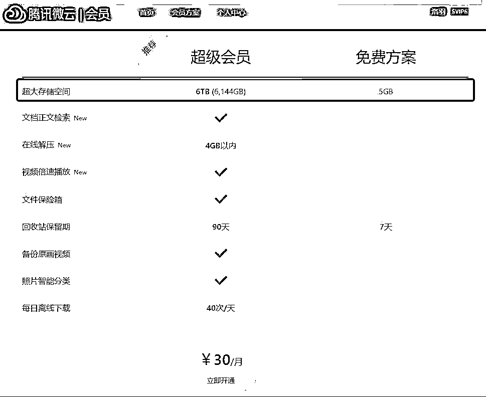

6）搜索和查找方面 7）多平台协同方面

7）多平台协同方面

网盘支持网页登录，也支持客户端登录。只要在同一个账号下，内容都是互通的，这点很方便。

8）资料共享方面

网盘类工具，可以将一个文件夹或者单个文件，用链接的方式分享给其他人，分享的时候还可以设置密码，这点是很方便的；

但这种“共享”，更多是单向分享，不能实现协同操作。

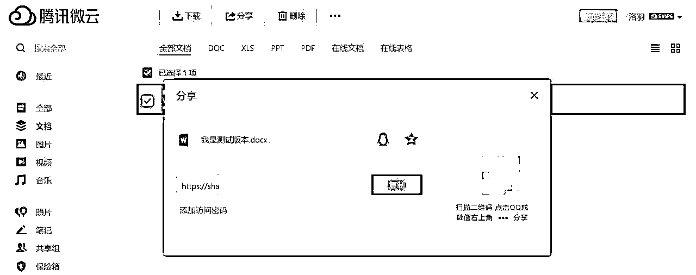

#### 3.2.2.3 笔记类工具 ★★★

笔记类工具，市面上也是很多的，比如有道云笔记、WPS 便签、随手写、智能备忘录、为知笔记、华为备忘录、敬业签、白网路笔记本、蜜蜂便签等。

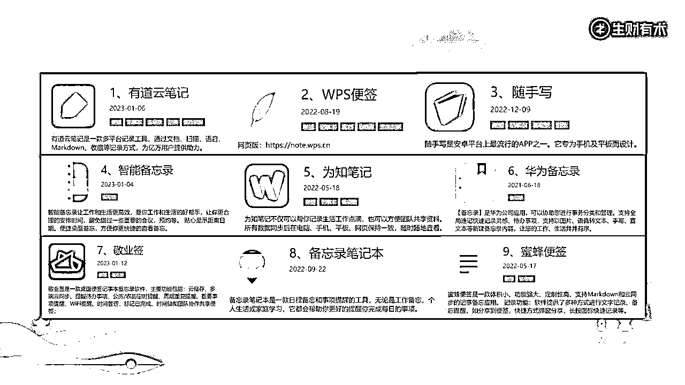

我对于笔记类工具做资料管理的综合判断是：

💡工具评分：70 分（满分 100 分）

工具评分：70 分（满分 100 分）

使用建议：碎片文字收件篮 + 需要结合其他工具使用

笔记类工具，功能其实都差不多，包括了“快速收集 + 打标签 + 对外分享”等，这里我就不展开介绍了，大家感兴趣的话，可以去对应官网获取。

本章节，我主要和大家分享一个近两年比较热门的笔记类工具—— flomo 浮墨笔记。

用一句话介绍 flomo ，它是一款全平台的卡片笔记，主打点是“聚焦记录想法和灵感”。这个工具和微信是打通的，我们可以像发资料给自己一样，随手发给 flomo，它会在后台一条一条沉淀出来。

详细介绍，大家可以前往官网查看（https://help.flomoapp.com/）。

下面是我对笔记类工具的使用体验，以 flomo 为案例进行说明：

1）资料收集方面

笔记类工具，最大的作用就是快速收集文字和个人想法，不适用于收集其他格式的资料， flomo 也是如此；

相比于其他笔记类工具，flomo 在收集资料方面的一大优势是和微信打通。它的传输接口就在微信聊天界面上，我们可以把平 flomo 目前只针对文字资料做管理，方式也主要是标签化；

flomo 目前只针对文字资料做管理，方式也主要是标签化；

总的来说，呈现形式是比较单一的，也可以说比较简洁。

3）资料编辑方面

在 flomo 里面，可以随时新增内容，也可以随时对文字内容进行修改调整；

总的来说，编辑起来还是比较方便的。

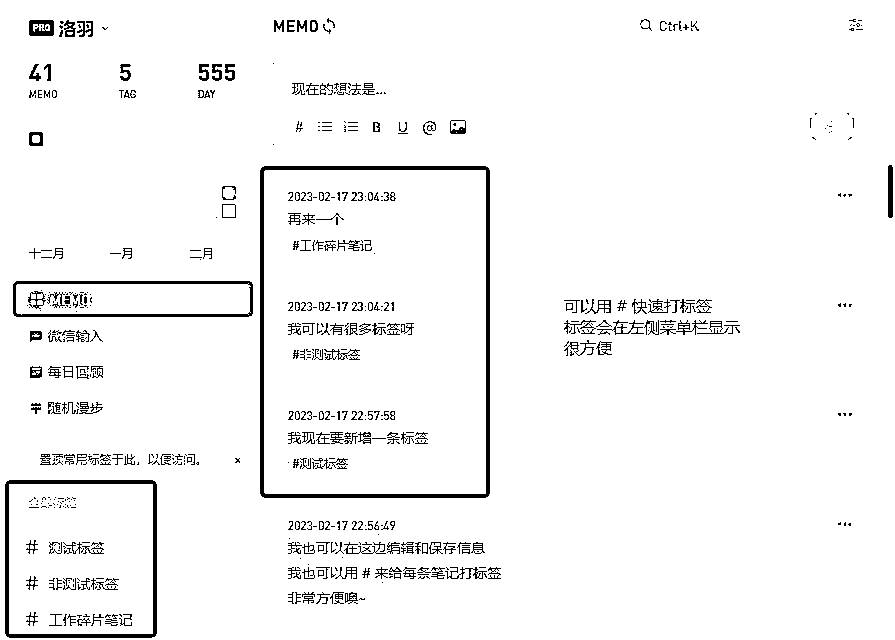

5）内存方面

flomo 主要是用来收集和整理文字资料，内存是够用的；

6）搜索和查找方面

flomo 的入口，可以通过在微信界面搜索，也可以通过微信聊天栏打开，这个是比较方便的；

想要在 flomo 里面搜索笔记资料，可以通过搜索标签和关键词；flomo 可以通过链接和图片的形式共享资料；

flomo 可以通过链接和图片的形式共享资料；

和网盘资料一样，这种“共享”，更多是单向分享，不能实现协同操作；

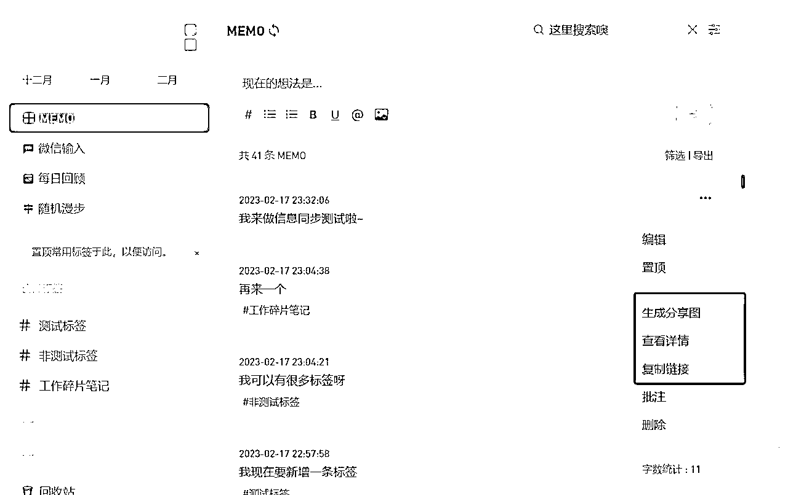

总结一下，用笔记类工具做资料管理，优势是收集文字类资料方便快捷、资料编辑灵活高效、搜索和查找方便、不会占用较多本地空间，可以多平台协同。缺点就是不适合收集整理其他类型的资料。它就像是一个私人笔记本，零零碎碎地记录个人的所见所闻，所思所想。

因此：

工具评分：70 分（满分 100 分）

使用建议：碎片文字收件篮 + 需要结合其他工具使用

#### 3.2.2.4 知识库工具 ★★★★

知识库是我最喜欢的资料管理工具，也是截止到目前运用得最得心应手的工具。

其中一个比较重要的原因，是我对资料、知识和信息有比较结构化的认知，并且在知识库中搭建好了整体框架。所以在接触到各类资料、知识和信息的时候，可以快速反应出来，它们应该属于知识库的哪个模块，然后马上转存到对应位置。

我对于知识库工具做资料管理的综合判断是：

💡

工具评分：85 分（满分 100 分）

使用建议：资料总库 + 所有资料线索汇总地 + 一次搭建终身受用

市面上的知识库工具很多，比如印象笔记、notion、语雀、飞书等。

我是 2020 年开始使用印象笔记的，因为平时比较爱搜集爱记录爱思考，一年时间大概整理了 4000 多条笔记。后来接触了飞书，发现它的空间和知识库功能对于资料的结构化管理更方便，于是在 2022 年，逐渐将资料管理的主阵地，从印象笔记迁移至飞书。

关于印象笔记和飞书的整体介绍，感兴趣的同学可以去官网获取（印象笔记官网：https://www.yinxiang.com/）（飞书官网：https://www.feishu.cn/）

接下来，我主要和大家介绍一下印象笔记和飞书的使用体验：

1）资料收集方面

① 印象笔记

在这方面，印象笔记和 flomo 有点类似，和微信还有各大浏览器打通了；

我们可以通过微信聊天界面，直接将想要收集的文章和资料传输给“我的印象笔记”，它会自动同步到后端；

也可以为常用的浏览器安装印象笔记剪藏插件，看到好的内容，可以一件转存；

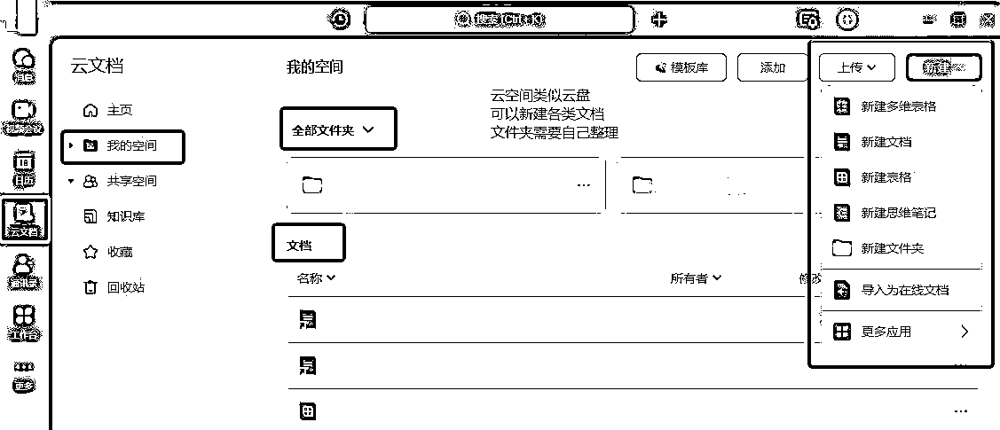

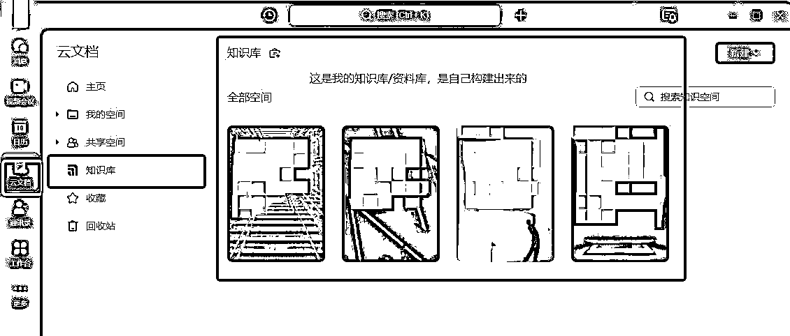

2）资料呈现方面

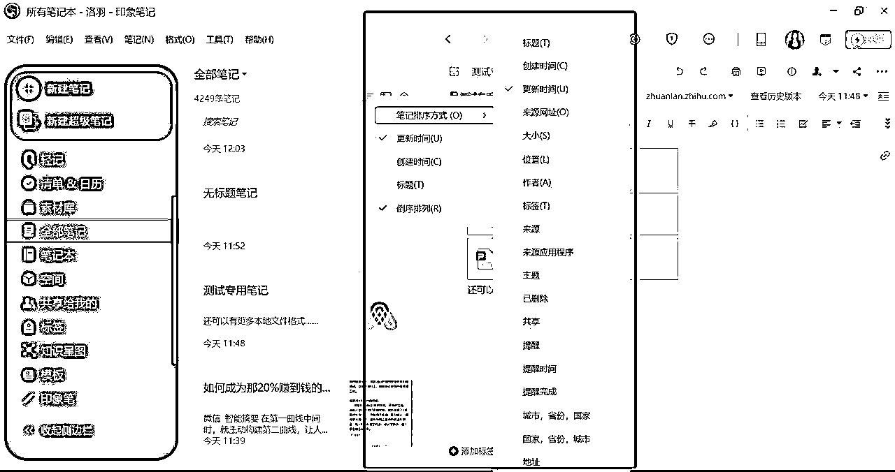

② 飞书（云空间 & 知识库）

从可存档的资料来说，飞书也能管理各类文档、图片、音像、压缩包等；

从资料的展示形式上说，飞书云空间和云盘类似，飞书知识库和印象笔记类似，这里就不展开介绍了；

但飞书知识库有一个很强大的功能，就是可以将文档、表格、PPT 、思维导图等综合起来呈现，这一点印象笔记做不到。

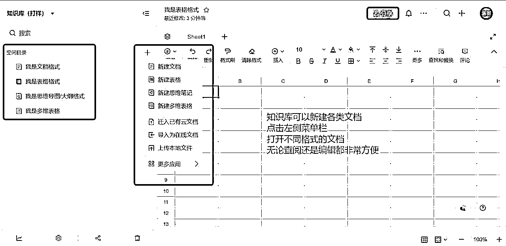

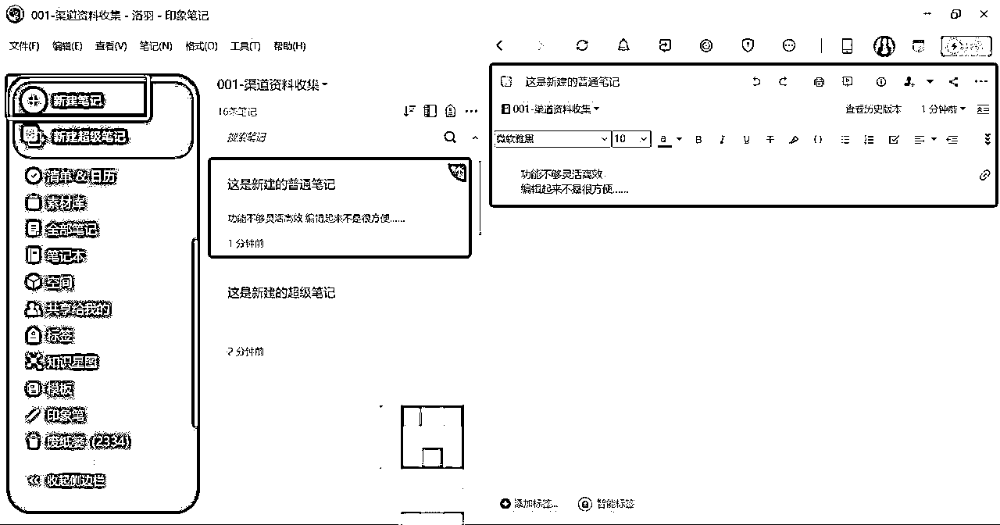

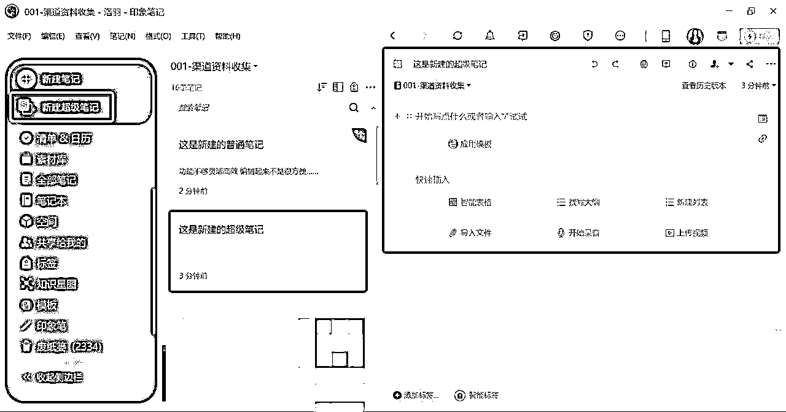

② 飞书（云空间 & 知识库）

想要编辑飞书云空间或知识库里面的资料，可以逐一打开目录，或者直接搜索关键词，然后对其进行编辑；

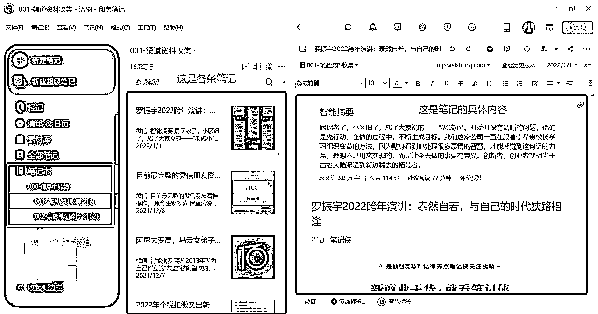

印象笔记的纵向结构化功能，主要是“清单&日历、素材库、全部笔记、笔记本、空间、标签、知识星图、模板”等。通常情况下，我们用不到这么多功能，能够把“笔记本+标签”功能用好，就已经很不错了；

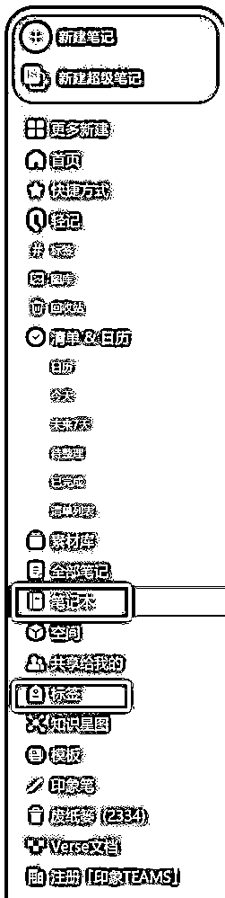

② 飞书（云空间 & 知识库）

飞书云空间的结构化功能，主要体现在文件夹的层级上。我们可以在文件夹中创建子文件夹，一层一层进行管理；纵向结构化和印象笔记不一样，没有多余的功能，整个知识库都需要自己建立分类（我个人觉得这样挺方便的）；

纵向结构化和印象笔记不一样，没有多余的功能，整个知识库都需要自己建立分类（我个人觉得这样挺方便的）；

总的来说，飞书的结构化功能是最简约，也是最好用的。

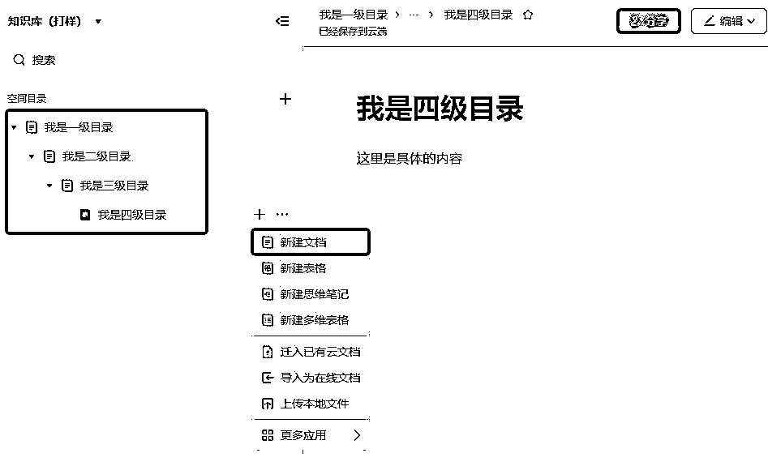

5）内存方面

印象笔记作为老牌知识管理工具，早就已经商业化了，如果内存不够用，可以付费扩容；

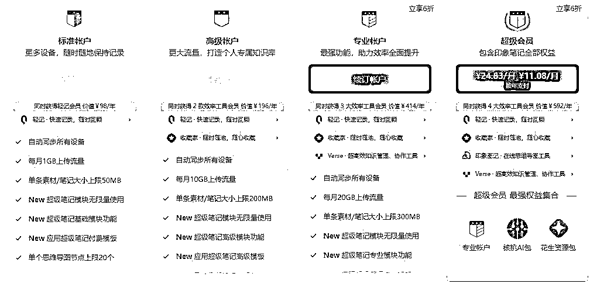

个人账号的飞书云空间和知识库，内存一共有 10G，暂时不能扩容。这里有一个点需要说明，飞书只有在存档图片和本地文

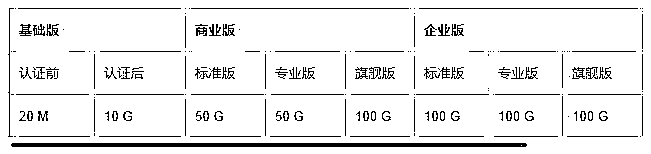

6）搜索和查找方面

① 印象笔记

如上所述，高效搜索和查找的关键，不在工具本身，在于我们对资料的分类和命名。

如果“分类”和“命名”做好了的话，印象笔记的查找功能还是比较方便的。

② 飞书（云空间 & 知识库）

在飞书上查找资料，一是可以通过云空间和知识库的分类逐层查找，二是通过关键词查找；

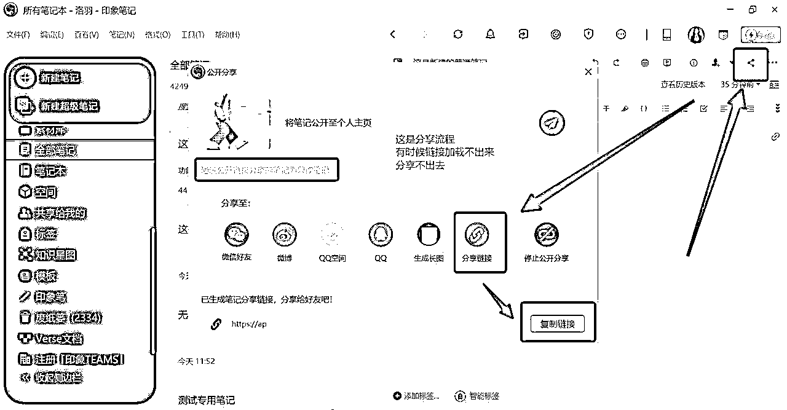

印象笔记协作流程：

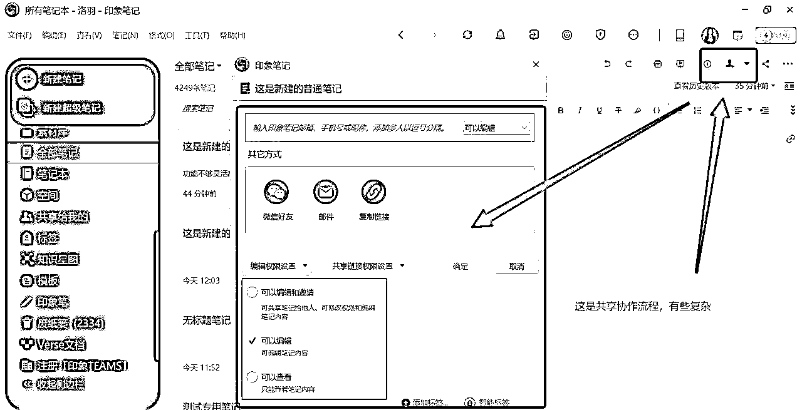

飞书的共享和协同处理，也可以说是所有协同办公软件中最强大的。我们现在很多工作资料对接，都用的是飞书文档；

这里需要说明的是，如果是需要对外分享和协作的文档，最好单独创建，然后归档到云空间或知识库。在云空间或知识库创建的文章，想要对外的话，需要特别注意父子级页面的权限设置。

建的文章，想要对外的话，需要特别注意父子级页面的权限设置。

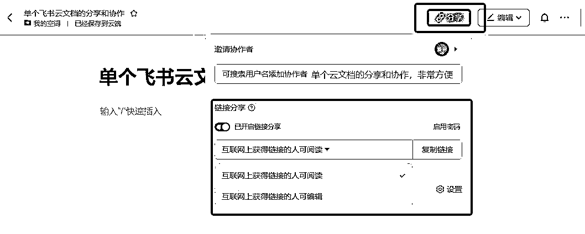

总结一下，关于知识库工具，印象笔记属于比较老牌的知识管理工具，但功能稍微有些死板，不够灵活。飞书软件的云空间对标云盘，知识库对标印象笔记，整体功能建立在办公软件的基础上，非常灵活高效。

如果大家要选择一个知识库工具，我个人比较推荐飞书知识库。虽然在收集上稍微逊色于印象笔记，但在结构化、查找、共享等方面，可以说是目前各类空间和文档中最好用的。

综上：

知识库工具评分：85 分（满分 100 分）

使用建议：优先选择飞书软件（自带云盘和知识库），并在飞书软件上搭建出一个强大的资料管理总库，把其他所有零散的资料及相关线索，都汇总在飞书资料库上。一次搭建，终身受用。

## 3.3 搭建资料库的详细方法

💡章节纲要

章节纲要

讲完了资料管理的底层逻辑、工具选择的基本原则，以及不同类型资料管理工具的优劣势，接下来我们就需要真正上手，搭建一个属于自己的资料库啦。

搭建资料库的方法有很多，本章节我们采用的主线思路为：一个中心（飞书资料总库）+多个基本点（各子资料库）。

### 3.3.1 一个中心：飞书资料总库 @洛羽

结合资料管理的底层逻辑、工具选择的基本原则，以及不同类型资料管理工具的优劣势，我最终选择用飞书平台，来作为我的“总资料库”，它既是我的“线索汇总地”，也是我的“资料汇总地”。

为什么选择飞书？因为它同时具备了云空间和知识库功能，方便做资料的“整体性管理”：

我非常建议大家在做资料管理的时候，优先采用“整体性管理”的方法，最重要的一个原因就是：“整体性资料管理”方法是一次搭建终身受用，它和“专项性资料管理”是包含与被包含的关系，选择管理范围更广的方法，可以有效减少后续返工的成本。

以下是我在飞书上进行资料整体性管理的操作步骤：飞书本质上是一个办公软件，即便是个人账号也有一些办公功能，这个不用管它。

飞书本质上是一个办公软件，即便是个人账号也有一些办公功能，这个不用管它。

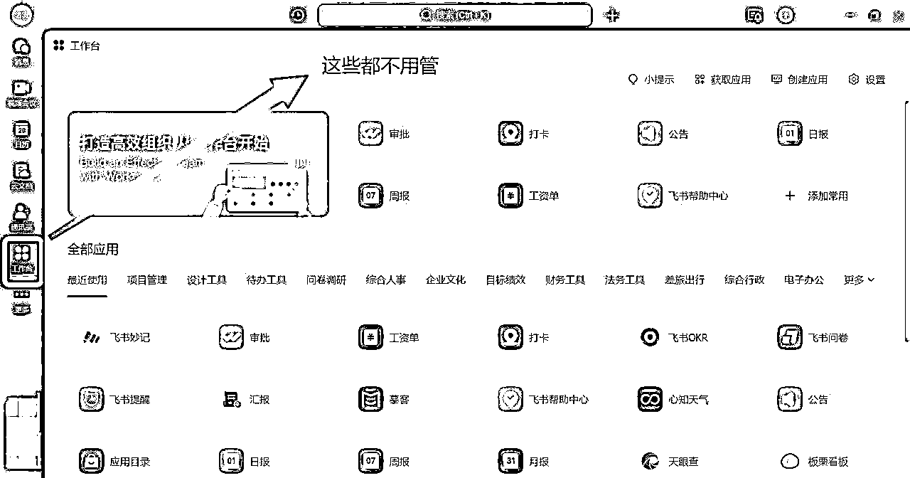

第二步：完成云空间 / 知识库基建 @洛羽

到底采用云空间管理方式，还是知识库管理方式，主要看自己平时的习惯，一般情况下，二者选其一即可。

以我个人的使用经验，比较推荐大家用知识库来构建资料总库，因为无论是内容的呈现还是二次编辑处理，知识库都比云空间更灵活方便。

知识库资料管理样式参考：

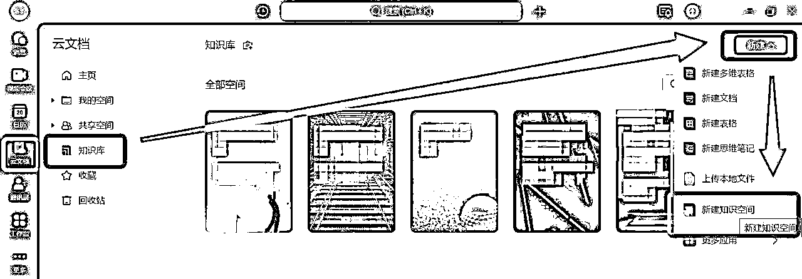

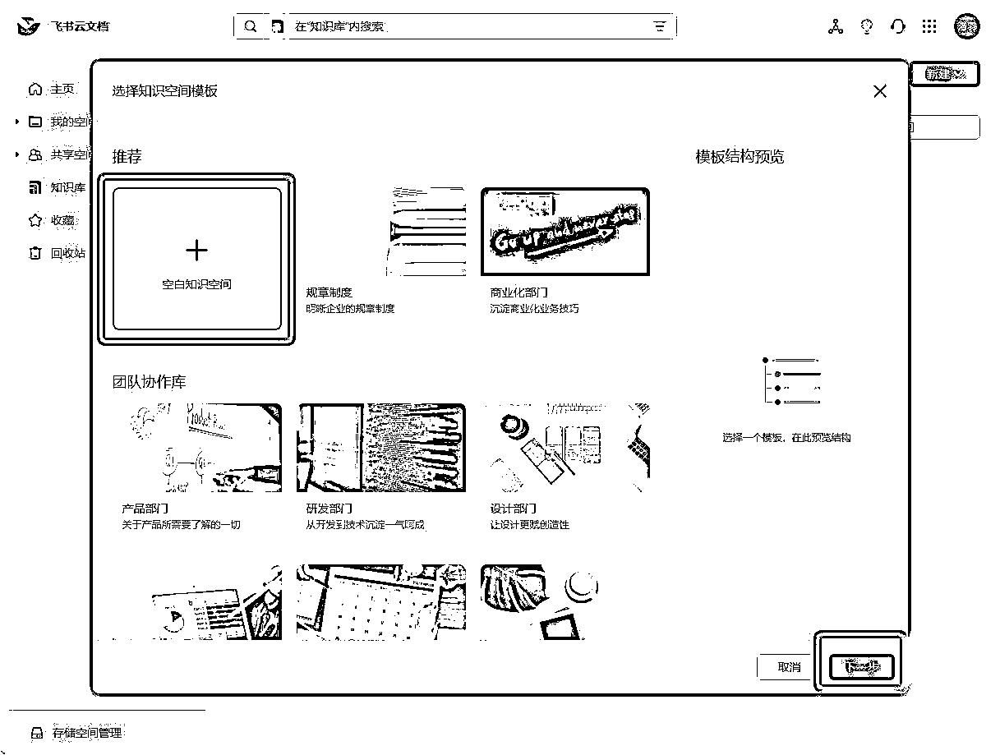

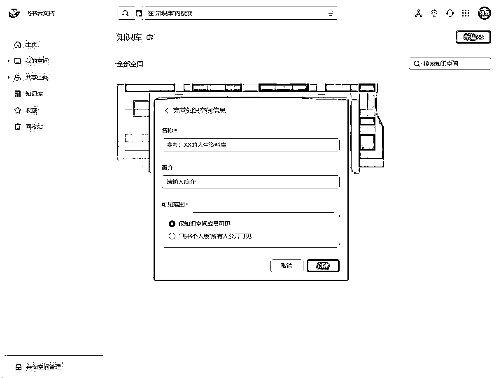

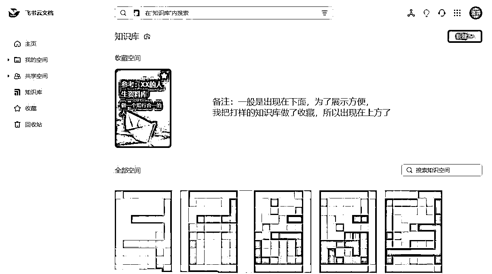

在知识库中设置目录和子目录：

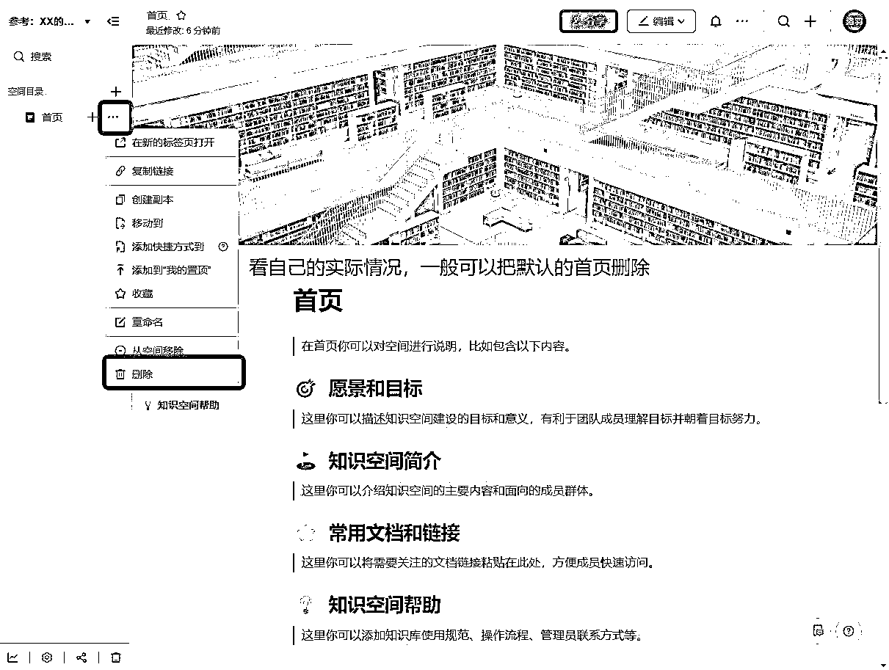

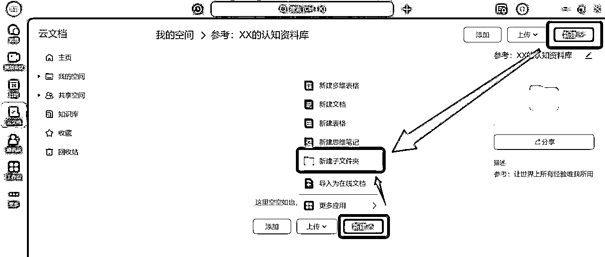

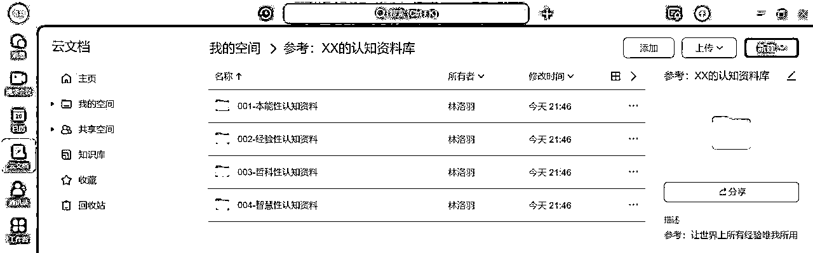

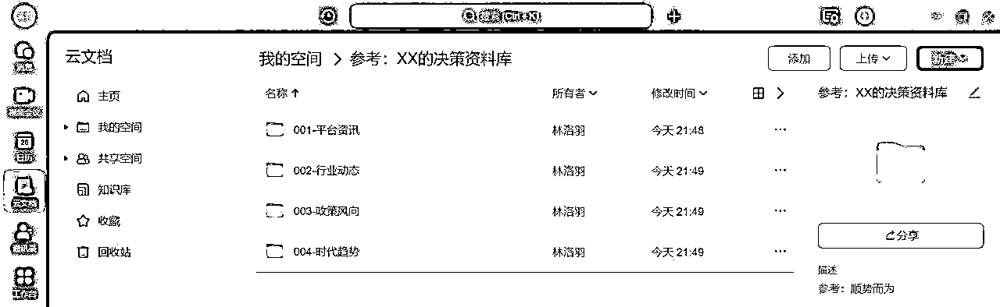

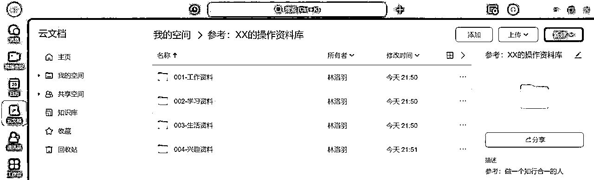

至此，飞书云空间的资料库基建就完成了！

第三步：有序归档资料

💡

章节纲要

基建搭建好了之后，就是往里面有序存放资料。具体每个目录或者文件夹里需要存什么资料，得看自己目前有什么资料，或者之后想要收集什么资料。

对于已有资料的有序归档，也有不同的操作方法。本章节我们收集到了五种不同的资料整理方法：

✅方法一：人生资料库分类|命名法（承接上面“整体性”和“专项性”管理模式）；

✅方法二：FBBMS 富爸爸模式（包括了“分类+编码+标签+命名”）；

✅方法三：打标签建立索引（通过标签体系建立内容结构）；

✅方法四：使用多维表格（属于细分方法，用表格建立内容结构）；

✅方法五：使用思维导图（属于细分方法，用导图建立内容结构）；

这些方法有的自成体系，有的可以综合使用，大家可以根据自己的实际情况来。

可能有很多伙伴在归档的时候，对于不同资料应该归属于哪个库以及哪个目录不清楚，这里我给大家做一个类目说明：

1）认知资料库类目说明

上面我们已经说过，认知所对应的资料类别是：人类对于事物的理解和判断。基于不同类型认知所能解释事物的广度和深度，将人类思维分为四个层级：

本能性认知

经验性认知所以大家对于本能性认知模块不用太关注，可以把自己日常收录到的、和人性动物性相关的零碎信息，统一归档到这个地方。

所以大家对于本能性认知模块不用太关注，可以把自己日常收录到的、和人性动物性相关的零碎信息，统一归档到这个地方。

② 哪些属于经验性认知？

我们日常看到的几乎所有文章和书籍，基本都算作是他人的经验沉淀。人类现有的资料，80% 以上也都属于经验性资料。

根据《中国图书馆分类法》，可以将所有经验性资料分为五大类共 22 个小类，这是针对经验性资料比较通用的划分方法，大家去到任何一家图书馆，都可以基于上述分类逻辑去寻找资料。

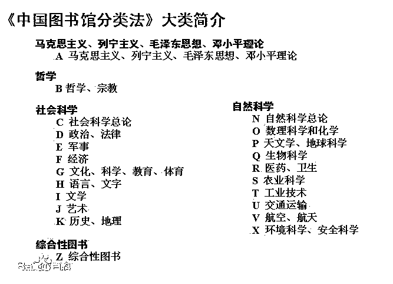

然而，对于大多数普通人来说，我们对于资料收集和学习的需求，可能并不是想要成为“行走的百科全书”，所以经验部分，多关注和自己工作、学习、生活和兴趣相关的领域即可。

然而，对于大多数普通人来说，我们对于资料收集和学习的需求，可能并不是想要成为“行走的百科全书”，所以经验部分，多关注和自己工作、学习、生活和兴趣相关的领域即可。

③ 哪些属于哲科性认知？

哲科性认知，算是人类前 20% 的知识类别了。所谓科学，是一个建立在可检验的解释和对客观事物的形式、组织等进行预测的有序的知识体系，是已经系统化和公式化了的知识。具备相关认知和能力的人，几乎可以算作是各行各业的“高人”。这类资料的收集和整理，比较适用于学术型和科研型人员，如本硕博学生、各专业老师教授、各领域科学家等。

对于哲科领域的资料分类，目前世界上没有完全统一的说法，有的说是社会科学和自然科学，有的还加上了抽象概念的形式科学（如逻辑、数学、计算机科学等），现在甚至还有复杂性科学（如人工智能、机器识别等）。

大家如果对哲科领域的资料管理感兴趣，可以研究一下中国的学科门类分类知识。2011 年 3 月，国务院学位委员会和教育部颁布修订的《学位授予和人才培养学科目录（2011 年）》，规定我国分为哲学、经济学、法学、教育学、文学、历史学、理学、工学、农学、医学、军事学、管理学、艺术学、交叉学科 14 个学科门类 。

不同于《学位授予和人才培养学科目录》 14 个学位学科门类，另一种版本是《中华人民共和国国家标准学科分类与代码》 5 个学术门类（ A 自然科学，代码为 110～190 ；B 农业科学，代码为 210～240 ；C 医药科学，代码为 310～360 ；D 工程与技术科学，代码为 410～630 ；E 人文与社会科学，代码为 710～910 ）。

二者分类目的、依据有很大区别；前者用于高校学位授予与人才培养，后者用于国家宏观管理和科技统计。

④ 哪些属于智慧性认知？

智慧性认知，属于哲科性认知都无法触及的宇宙顶尖智慧。

本能性认知是人和动物的本性，经验是人类实践后的方法论沉淀，哲科是已经被系统化和公式化了的知识。那那些不属于人和动物、人类没有实践过、无法被系统化和公式化，甚至无法用语言和文字描述出来的东西呢？到哪里去了呢？

针对这个问题，哲学上有“可知论”和“不可知论”的派别划分，感兴趣的朋友可以自行研究，我们这里不做过多展开。我给大家把智慧性认知类别展示出来，目的不是让大家去深入研究这个领域，这是一个高维世界，我们知道即可，无需太过于关注。

对我自己的认知研究而言，我会把一些偏宗教、灵修、临在觉察相关的资料存放在这个地方，作为闲暇时候的读物。

好了，以上就是认知类资料的类别说明。相信大部分人看完之后，会发现自己可能只有“经验性认知”里面的少部分资料，而且还是不成体系的碎片信息，完全构不成知识系统。

说实话，这挺正常的，毕竟从古至今，也没有出现过多少“全才”。另外，这还只是认知类资料的类别，下面还有决策类资料和操作类资料，我们也接着来看看！

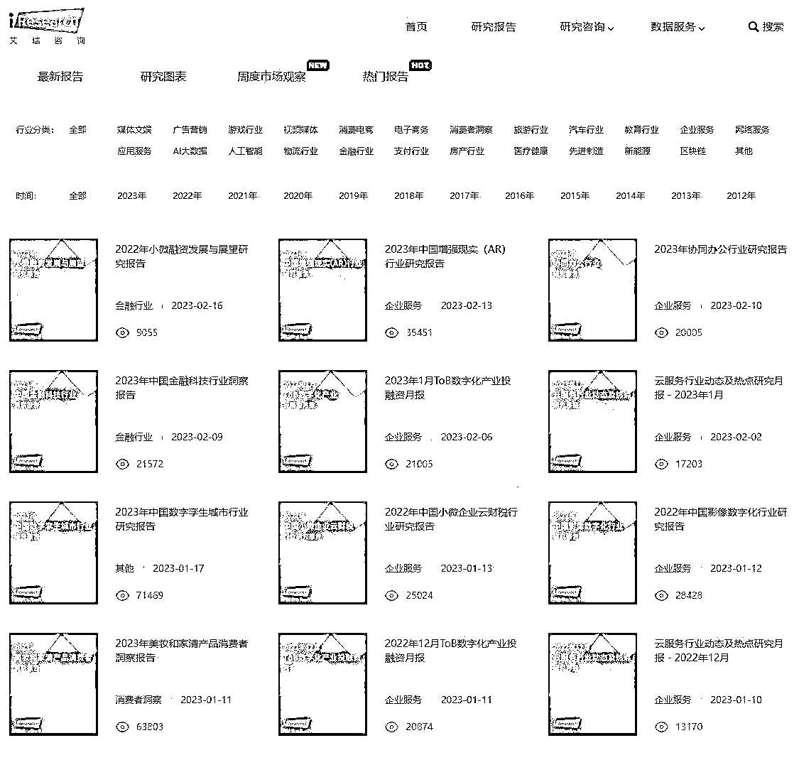

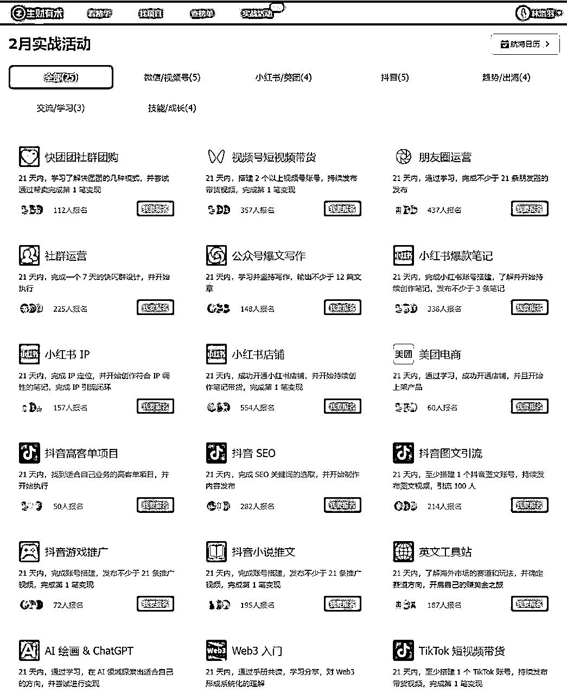

我把这个资料库分为了四大类：工作、学习、生活、兴趣。

我把这个资料库分为了四大类：工作、学习、生活、兴趣。

所谓工作资料，包括了每一份实习、全职、主业、副业等沉淀下的个人信息、脱敏资料、职场经验和重要方法论等。

以我自己为例，我有主业工作，有过副业工作，也有过创业经验，所有资料全部按顺序进行了归档，方便及时提取：

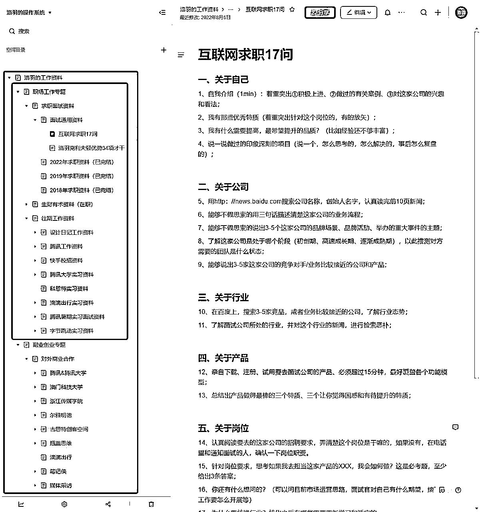

关于这个板块的归档操作，我分了长期资料和短期资料。长期资料有常用信息、目标管理、人际管理等；短期资料主要是按年月日来记录和复盘：

关于这个板块的归档操作，我分了长期资料和短期资料。长期资料有常用信息、目标管理、人际管理等；短期资料主要是按年月日来记录和复盘：

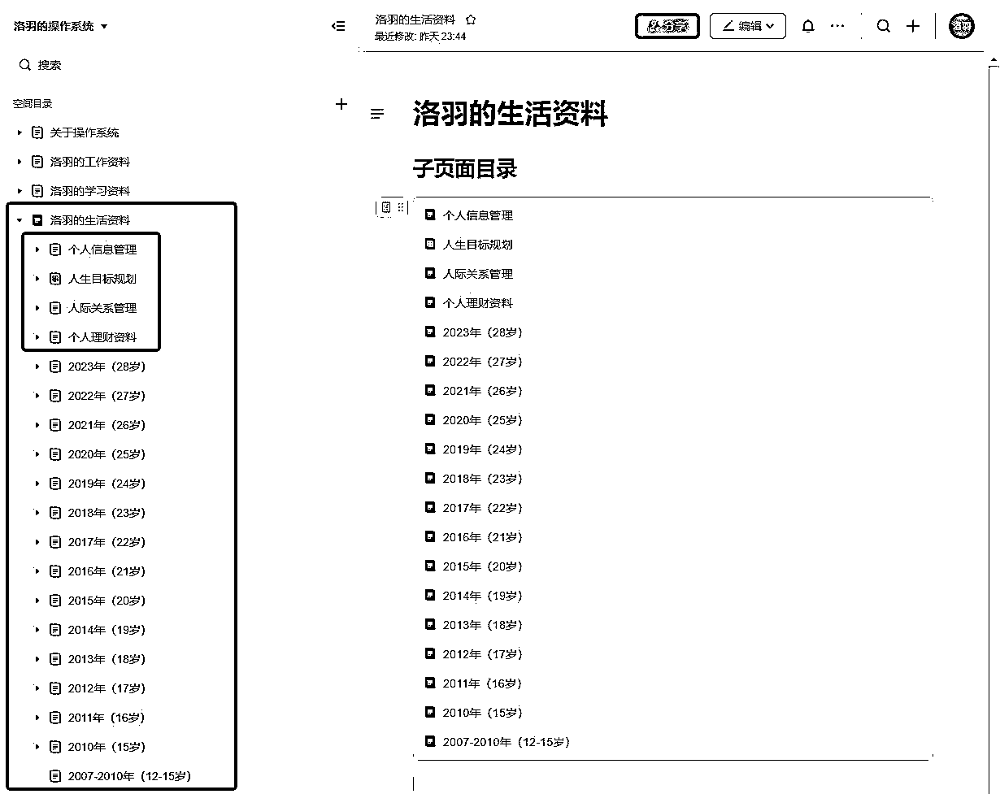

所谓兴趣资料，根据自己的实际情况整理即可。由于我个人把兴趣融入和工作、学习和生活，所以就没有单独再开一个模块。

以上，就是关于认知资料库、决策资料库和操作资料库的细分类别说明，相信大家看完上述内容，应该比较清楚，不同的资料，应该存放在哪个库的哪个模块了吧。

知道存放在哪里，这还不够，为了便于快速识别资料，我们还得学会给这些资料进行统一命名。

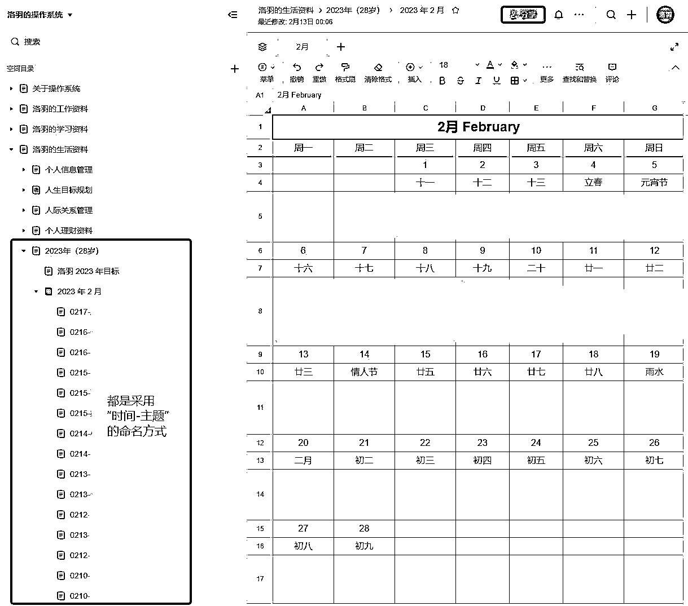

再比如，这是我的“智慧性认知”部分资料，重点是主题，不是时间，所以命名为：

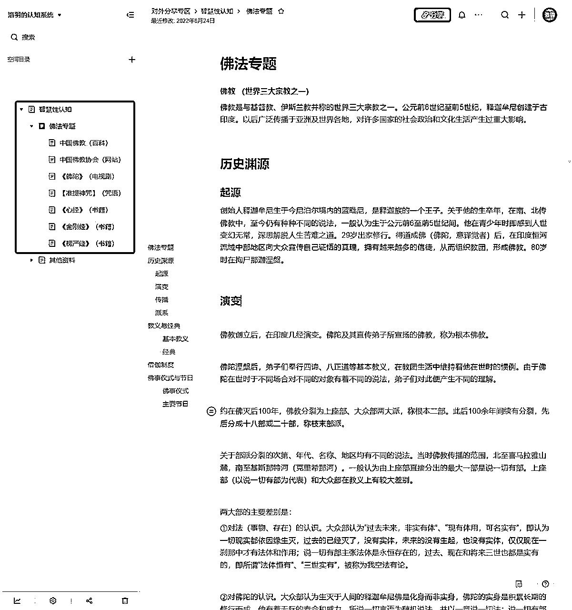

备注：由于我已经归档的资料非常非常多，所以把认知资料库、决策资料库和操作资料库拆成了三大库。

方法二：FBBMS 富爸爸模式 @七小

这里先来讲一个通用的整理思路，可以把它用来管理任何文件资料，无论是电脑本地文件，或是电子云笔记。

给它取了一个好记的名字：FBBMS 富爸爸模式归档法。

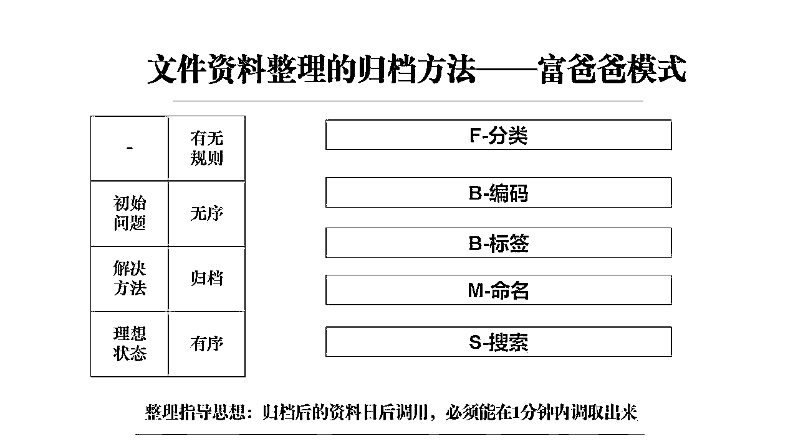

FBBMS，是「富爸爸模式」的拼音首字母的组合，这些字母的本意是：

F：fenlei 分类规则

B：bianma 编码规则

B：biaoqian 标签规则

M：mingming 命名规则

S：sousuo 搜索工具

强调一下：在不同的软件里，以及对不同的使用者来说，这 5 个要素的重要性是不一样的！

如果分类做的特别好，不打标签也可以

如果标签打得好，不做分类也可以

如果命名做得好，不分类和打标签也可以

有些软件标签筛选功能强大，分类就没那么重要了

做资料管理，目的是能在 1 分钟之内找到归档过的任何资料，这 5 个要素只是帮助查找资料的手段，手段是多样的，只要能实现目的就行，不要本末倒置。

1、分类规则

把文件分别装到不同文件夹里，这个动作即为「分类」。分类之前，一定需要明确「分类规则」，没有清晰的规则，文件就无法分类。

常见的分类规则：

① 完成情况

通常可以分为：已完成、正在进行、待启动、取消、延后 ，这五种情况。

比较适用于工作中，做了这样的分类后，精力就会聚焦在正在进行和待启动的事情上面

② 时间、地点、对象

时间： 可以是年月日分期，也可以是人生中的某个阶段，比如：

复盘整理——2021.5 月度复盘， 2021.6 月度复盘

相册分类——初中、高中、大学

工作资料打包——19 年实习项目、20 年实习项目地点：一般地点也是和时期绑定的，比如：

地点：一般地点也是和时期绑定的，比如：

日记整理——在深圳时期的日记、在广州时期的日记

对象：可以是人，也可以组织，比如：

微信聊天文件—— 朋友 A 文件夹，复盘群文件夹，公司通知群文件夹

③ 已有规则

书籍、课程、资料等已有分类，直接复制现有的分类即可

④ 自定义规则

自定义需要自己去创造规则。文件夹可以是「学习」「工作」「生活」三个大类，也可以是「修身」「治国」「齐家」「平天下」。

我自己的规则主要是 「学习」 「人」「事」「财」， 细分下去。

学习：思维模型，知识体系搭建方法，阅读方法，信息整理

人：性格心理学、两性心理学、自我探索、社交策略

事：目标管理、时间管理、精力管理、做事工具

财：保险、股票、基金、债券、互联网项目「数字」 比如杜威十进制：

「数字」 比如杜威十进制：

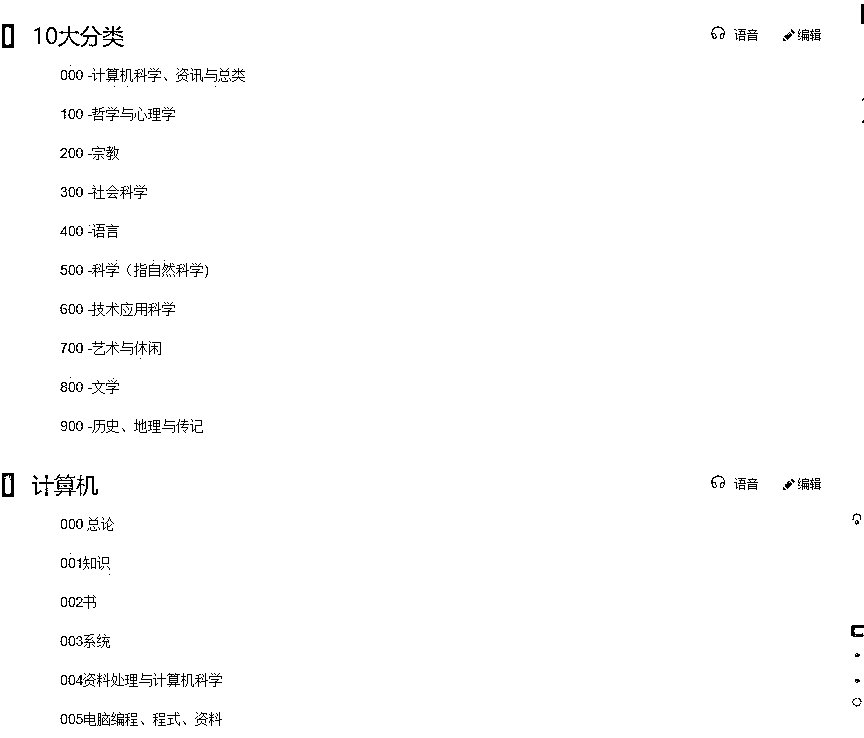

我用的是「字母+数字」，比如： A 学习 ，B 人，C 事，D 财。

A1 思维框架 ，A2 知识体系 ，A3 阅读方法 ...

编码什么时候用，什么时候不用？

低级编码，纯数字排序，一个作用是美观，另一个作用是记忆搜索点，比如第一次查文档查的是标题，然后看到它的编号是 66，那你下次找的时候搜 66 就可以了。

高级编码，体现分类。 如果要做一个复杂的研究，从很多的主题里各挑一两篇文章，混在一起，编码 A1，B2，C3 ，更容易清楚这个资料的来源，如果只有标题，数量多了可能会忘记。

如果你很少有把不同主题的资料大量混在一起的情况，可以不用高级编码。只用低级编码排序标号即可。

3、标签规则

标签规则指的是 「符号+含义」，特别适用于写字的文档， 标签放到标题或正文都可以，做好这些标记后，找文件只需要记得关键词

如果想精细的区分不同类型的标签，那可以参考： #关键词 ，@相关人 ，T：时间 P：地点

如果觉得不需要非常细分， 用# 也是可以的， #关键词 #相关人 #时间 #地点

如果怕在关键时刻想不起来标签，那在最初归档整理的时候，就多打一些标签，哪怕打了十几个标签都行。

甚至可以写一个标签 #想不起来 ，来标记经常忘记的文件。

4、命名规则我建议的命名规则是：「一眼能看懂的内容概括标题」+「关键词：时间、地点、相关人、其他内容记忆点」

我建议的命名规则是：「一眼能看懂的内容概括标题」+「关键词：时间、地点、相关人、其他内容记忆点」

比如：

打造知识体系的矩阵 #L 先生#九宫格

知识体系四步法 #七小 #学习金字塔 #55 字口诀

命名的核心原则是：一看名字，就能想起来里面大概是什么内容。

下面这类命名是大忌！ 如果你经常这样做，一定要改：

草稿

待处理

1

新建文件资料

资料

# 2021 年 7 月 31 日今日心得

这种你看了标题都不知道是写什么的，就是不合格的标题。

内容来源：3 月 8 日《资料管理的整理规则与工具》@七小

方法三：打标签建立索引 @乔帮主

1、规范概要

打标签建立索引是一种最为常用的方法，而打标签建立索引需要遵循一定的规范。通过实践，以下是我总结的一些打标签的规范概要：

1）设计一套合理的标签体系：在打标签之前，需要设计一套合理的标签体系。标签的种类和数量要尽量简洁明了标签之间的关联和层级要清晰明确，这样可以让我们在查找和使用素材库时更加方便。

2）统一标签规范：对于相同的内容，应该尽量使用相同的标签，这样可以保证标签的规范性和统一性。在打标签时，应该遵循一定的规范，例如标签的大小写、单复数、缩写等

3）标签不宜过多：标签不宜过多，应该尽量减少标签的数量。过多的标签不仅会增加打标签的工作量，还会让标签体系变得复杂，使我们在查找和使用素材库时变得困难

4）标签要具体：标签要尽量具体，避免使用模糊的标签。例如，如果是关于电影的素材，不要使用“娱乐”、“影视等过于泛泛的标签，而是应该使用更具体的标签，如“动作电影”、“科幻电影”等。

5）定期检查标签库：标签库应该定期进行检查和维护，保证标签的正确性和完整性。如果发现有标签错误或者遗漏，应该及时进行修正

6）采用自动标注技术：为了提高效率和准确性，可以采用自动标注技术。例如，可以利用机器学习、自然语言处理等技术来自动抽取关键词，并将其作为标签进行打标签。

2、打标签的方法技巧有哪些

我们可以根据分类体系打标签：建立一个分类体系，将资料素材按照不同的类别进行分类，例如：行业分类、内容类型分类等。然后，对每个资料素材打上相应的标签，标记出所属的分类。

我们也可以使用关键字打标签：对于资料素材库中的内容，提炼一些关键字进行描述。这些关键字可以帮助我们更快地查找所需资料素材。使用关键字打标签，是最为常用，也是我最为喜欢的方式。

我们也可以打上描述性的标签：例如：概念、颜色、方向、时间、地点等。这些标签可以根据资料素材的属性特点进行设置。

我们也可以使用工具辅助打标签：例如：Evernote、Onenote、Zotero 等，可以自动提取资料素材的标签信息，可以更好帮助我们进行打标签。

3、通过关键字来打标签的实践

有时候当你脑海里灵光一现，有了一个好的想法，其实本质也就是提取关键字，然后去搜索检索对应素材内容，进一步将自己的灵感想法进行落地。

关键字提取，是我们常用建立标签的策略，同时也是我们阅读的重要技巧。以及我们现在热门的 AI 绘画&ChatGPT 等技术，你想要用好这些技术，底层逻辑都是关键字。即你懂得搜集整理关键字，向它们提问及训练它们为你所用。

很多人阅读很慢，喜欢咬文嚼字。而很多人一目十行，好像能做到过目不忘一样，这里面核心的阅读技巧就是提取关键字的能力。

从阅读/写作角度，具有关键字的提取能力的话，它有以下几个核心用途：了解文章主题：通过提取文章的关键字，可以帮助读者快速了解文章的主题和重点，有助于阅读理解。

了解文章主题：通过提取文章的关键字，可以帮助读者快速了解文章的主题和重点，有助于阅读理解。

建立知识框架：提取关键字可以帮助读者将文章中的信息有条理地组织起来，建立知识框架，便于记忆和复习。

快速检索信息：当需要查找某个特定的信息时，可以通过关键字快速定位文章中的相关内容，这也能快速让你联想到你曾经看到的内容。

有效笔记：将提取的关键字作为笔记，可以使笔记更加精炼、有针对性，也更容易在以后的阅读中回忆起文章内容。

辅助写作：在写作过程中，通过提取关键字可以帮助梳理思路、明确论点，提高写作效率和质量。

那怎么提取内容中的关键字，来为内容打上标签呢？我们可以按照以下步骤进行：

通读内容，梳理文章中的核心概念和关键词。

选择最能表达文章主旨和核心内容的关键词作为标签。

选择文章提及多次的关键字作为标签。

比如我公众号和为知笔记中，用的常用标签如下：


另外在实际操作中，可以考虑使用一些分词工具来帮助提取关键词，如自然语言处理工具 NLTK、jieba 分词、词云分词工具等。这些工具可以对文章进行分词、词性标注等处理，从而提取出文章中的关键词。

4、没有标签功能的平台怎么建立索引

常用的印象笔记、为知笔记等笔记软件平台，都是有标签功能的。但我们的飞书平台就没有标签功能，还有我们在本地磁盘存储的文件内容，也是没有标签功能。

那这时候我们要怎么通过提取的关键字，来建立索引呢？这时候我们一般通过文件夹分类 + 文件命名 + 文件描述来建立索引。

按照书籍来解释的话，文件夹分类就相对于书籍目录中的章，文件命名就等同于书籍目录中的节，文件描述等同于书籍中具体对应的内容。

我们要做的就是把我们提取的关键字，体现在文件夹分类、文件命名、文件内容描述中。这样我们后面直接使用对应“关键字”，直接使用搜索功能，非常方便高效的让我读取相应内容。

值得注意的是，从技术角度，我们本地磁盘文件系统、飞书的内容系统，为什么不使用标签这个功能。主要原因是他们内容存储技术，使用的是全文索引方式。所以只要你整理好对应关键字，本地磁盘、飞书系统里，就能高效直接搜索链接到你想链接的内容。

的内容。

具体实践中，我们可以通过在文件夹名、文件名中包含关键词+特殊字符来建立索引。一种常见的方法是在文件名中使用特定的标记或者关键词。

例如，你可以使用项目名称、主题、文件类型等作为关键词，并在文件名中使用特殊字符来表示它们。例如，使用下划线（_）或连字符（-）来分隔关键词，或者使用方括号（[ ]）或大括号（{ }）来将关键词括起来。

另外，你如果是本地磁盘文件，也可以使用文件管理器或者专业的文件索引软件来实现。文件管理器中通常都有搜索功能，你可以使用关键词搜索文件，也可以使用标签或者属性筛选文件。

如果你需要更加高级的索引功能，可以考虑使用专业的文件索引软件，如 Everything、Agent Ransack 等。这些软件可以快速搜索你的硬盘，同时支持多种搜索条件和高级筛选。

最后，我们关键字可以进一步体现在我们文件内容描述中（通常指文本，图片、音视频这种是不可编辑的）。这个操作的核心意义主要是为了标记文件，方便后面我们搜索读取。

如果你的文件内容中已经有关键字覆盖了，这个可以不用再去编辑添加。如果没有关键字覆盖的，可以在文首和文尾加入标签进行标记即可。

1）多维表格怎么创建

多维表格有两种创建方式，

直接创建多维表格


先创建普通电子表格，在普通电子表格里创建多维表格


如果是要给别人看的，就是用来专门管理某件事情的资料的，那么就用第一种创建方法。

如果是要给别人看的，就是用来专门管理某件事情的资料的，那么就用第一种创建方法。

2）飞书多维表格功能介绍

做资料管理，我们主要会用到以下功能：


多行文本：标题，文档简介，备注，会用到这个部分多选：用于打标签使用，建议把文档里的重要关键词，以及时间、地点、相关人写在上面，方便以后检索

多选：用于打标签使用，建议把文档里的重要关键词，以及时间、地点、相关人写在上面，方便以后检索

多维表格里有【筛选】功能，筛选标签，就可以调取出有该标签的所有资料了，可以筛选多个标签

单选：用于表格信息大类分组使用，可以自上而下，选用人生书架规则来做；或是自下而上，把资料归类分组，提取出一个概括词。

如果使用多选标签就可以很方便的找到资料，就可以不使用该部分

超链接：用于在文档中添加网址使用， 多行文本里也能直接复制链接，所以该部分可自愿使用

附件：用于存放图片、视频、word/ppt/excel 等文件，建议存放小文件为主，上百 M 的文件建议网盘，可以复制网盘的链接到表格中

时间：可以写上这份资料创建或者录入的时间，根据自己习惯使用即可


3）适用情况与注意事项

适用情况：

适合放资料合集，比如我们课程的导航页，以及参加其他社群、训练营的资料合集

适合不容易归类的资料，可以先把资料链接放到表格里，打上标签，把资料位置挪到【杂物堆】的文件夹，然后就可以从表格里来找资料适合整理比较乱的文件夹，如果一个电子笔记里的资料，主题资料偏多，已经乱七八糟，与其把这些资料分别挪到对应的文件夹里，不如把这些资料用表格打标签来整理，以后就只从表格打开它，而不打开文件夹。

适合整理比较乱的文件夹，如果一个电子笔记里的资料，主题资料偏多，已经乱七八糟，与其把这些资料分别挪到对应的文件夹里，不如把这些资料用表格打标签来整理，以后就只从表格打开它，而不打开文件夹。

如果你觉得电子笔记自带的文件夹不好用，没法满足自己的需求，就可以创建多维表格来当目录。（比如飞书云文档的文件夹就不好用，很传统；知识库的页面树就很好用）

强调：

做资料整理是以快速调用为目的，对资料进行分类、标签、编码、命名、搜索的处理，使之从无序状态，转变为相对有序，或者说乱中有序的状态。

注意，乱中有序，而非完全有序！

资料完全无序，调用效率极低；

资料完全有序，比如把所有资料全部都归档到表格里，或是文件夹非常整齐有序，没有未归类的文档，那整理的成本就非常高

做到乱中有序即可， 分类、标签、编号命名搜索 混用，哪个好用用哪个，这才是效率最高，成本最低的整理方法。

内容来源：3 月 8 日《资料管理的整理规则与工具》@七小

方法五：使用思维导图 @熊孩子不差

1）XMind 是什么

Xmind 就是一个画思维导图的工具，普及度高、功能强大，国内大部分思维导图产品功能都是由它延伸的。

包含逻辑图、组织结构图、时间轴、鱼骨图、树形图、表格图等 10 种思维结构，在一张导图中可以灵活使用多种结构，这是它最大亮点

以下是思维导图的 8 种常用结构，方便我们制图的时候选择适合内容的框架，快速梳理成你心中想要的思维导图结构。

1.平衡图：适用于头脑风暴或者收集创意点子的会议中

2.逻辑图：适用于表达总分或者分总关系

3.组织结构图：适用于表达上下级关系，比如公司人员组织架构

4.树形图：表达事物之间的层级关系，适合一路往纵深挖掘

5.时间轴：表示事情发生的先后顺序或先后逻辑


官网：https://xmind.cn/


2）Xmind 特点

Xmind 含有丰富的思维结构，思维结构之间可以灵活搭配，不管是哪种使用场景都能快速找到适合的结构，抛弃了单一传统导图的无趣，让每一个想法都清晰可见，也让我们更愿意思考。

Xmind 做完导图后可以一键切换进入演讲者模式，搭配好看的转场动画和实用布局，体验沉浸式演讲；

Xmind 丰富的线条和贴纸，我们可以在重点地方用不同的记号重点标出，让阅读者快速抓住并记忆重点内容；

Xmind 用智能配色方案，帮助我们花更少的时间做更好的配色；

Xmind 可支持导出 PNG、EXCEL、WORD、PDF 等格式。


顶部有些重要功能的快捷操作

右侧主要是美化版式，美化颜色、字体的地方


③ 炼-提炼关键词和关键要素


④ 增-新增子主题和具体内容


完整案例图：


内容来源：3 月 18 日《如何用 XMind 助力资料整理并打造第二职业曲线？》@熊孩子不差！5 月 25 日《如何用思维导图做小红书》@熊孩子不差！

### 3.3.2 多个基本点：各子资料库

#### 3.3.2.1 云盘类工具的配合使用 @洛羽

由于飞书个人账号的云储存空间有限（ 10 G），如果有些伙伴的本地图片和文件特别多，飞书现有内存不够用的话，也可以选移动端的中转站，我比较推荐的是和微信打通的 flomo 浮墨笔记。当发现一些内容不错，或者自己突然有一些灵感或者想法的时候，可以快速转存在 flomo 笔记里，然后晚上或者有时间的时候，再把这些内容归档到飞书知识库。

移动端的中转站，我比较推荐的是和微信打通的 flomo 浮墨笔记。当发现一些内容不错，或者自己突然有一些灵感或者想法的时候，可以快速转存在 flomo 笔记里，然后晚上或者有时间的时候，再把这些内容归档到飞书知识库。

#### 3.3.2.3 本地文件夹的配合使用 @洛羽

虽然我非常倡导大家把所有本地文件都归档到云端知识库，但有一些常用的本地资料，还是可以用本地文件夹备份着。这样的话，就不用每次在需要的时候，都跑到云盘或者知识库进行下载了。

我个人一般会在桌面留 1-2 个文件夹，里面只留常用资料，其他的要么及时归档，要么及时删除，随时保持桌面简洁清爽：


# 四、如何高效搜索和获取资料

💡

章节纲要

前面我和大家分享了资料管理的底层逻辑、资料管理的工具，以及如何搭建一个终身受用的资料库。相信大家通过上述方法，已经可以将已有的资料进行有序归档了。

然而，当我们在对资料库进行整理的时候，以及我们在日常的工作、学习和生活中，可能会发现自己缺少某些领域的资料和知识。这时，我们就需要针对特定领域，进行资料的“专项性管理”了。

本章节我们主要就来说说：如何高效搜索和获取资料。

## 4.1 专业向资料获取 @洛羽

渠道一：专业教材书籍

要想快速构建出一个领域的知识和资料体系，最高效快捷的方法，是阅读相关的专业教材和书籍。因为这些内容已经是被高度结构化整理的成果，几乎每一本书，就是一个领域的知识体系。


现在大部分资料都数字化了，检索起来还是比较方便的。要是想查找的资料比较珍贵和稀少，网上都没有找到相关资料的话，可能得去线下比较大的图书馆才能获取。

渠道二：专业学术研究

中国知网：https://www.cnki.net/

维普网：http://www.cqvip.com/

万方数据知识服务平台：www.wanfangdata.com.cn/index.html

百度学术：https://xueshu.baidu.com/

全国图书馆参考咨询联盟：http://www.ucdrs.superlib.net/

超星发现：http://chaoxing.com


慕课网：https://www.icourse163.org/

慕课网：https://www.icourse163.org/

学堂在线：https://www.xuetangx.com/

网易公开课：https://open.163.com/

国家智慧教育公共服务平台：https://www.smartedu.cn/


渠道四：国家政策法规

在构建决策资料库的时候，需要查找比较和国家地方政府相关的会议、新闻、政策、文件、报告、规定，这里我也给大家推荐一些权威的渠道。

1）国家级资料

中国共产党（中共中央）：http://cpc.people.com.cn/

中华人民共和国中央人民政府（国务院）：http://www.gov.cn/

全国人民代表大会（全国人大）：http://www.npc.gov.cn/

中国人民政治协商会议全国委员会（全国政协）：http://www.cppcc.gov.cn/2）地方性资料

2）地方性资料

地方政府服务窗口：http://gjzwfw.www.gov.cn/col/col486/index.html


渠道五：权威数据平台

在构建决策资料库的时候，也需要用到很多和国家、行业、平台相关的数据资料，这里也给大家推荐一些权威渠道。


2）行业 / 平台级数据

艾瑞数据 ：http://data.iresearch.com.cn/

易观智库：http://www.analysys.cn/

极光大数据：https://www.jiguang.cn/

艾媒网 ：http://www.iimedia.cn/

360 营销学院 ：http://yingxiao.360.cn/

199it : http://www.199it.com/

36kr: http://36kr.com/

TalkingData（移动观象台）：http://www.talkingdata.com/

Questmobile : http://www.questmobile.com.cn/

ASO100（七麦数据）：https://www.qimai.cn/

App Annie : https://www.appannie.com/cn/

网站流量全球综合排名：http://www.alexa.cn/

微博微指数：http://data.weibo.com/index（微博动态）

新浪微舆情：http://wyq.sina.com/login.shtml


## 4.2 通用向资料获取 @洛羽

渠道一：寻找同行获取

如果我们能找到一些比较优秀的同行，他们可能会有很多资料获取渠道，甚至有很多已经整理好的资料。

可以的话，请他们推荐一些行业类常用信息平台，或者付费获取一些比较优质的信息，这算是一种非常高效的资料获取方式。

下面我们就让 GPT 来教我们如何使用它来进行资料整理。

## 1\. 向 ChatGPT 提问：它如何协助我们高效资料整理？

我先给大家展示我的思路，比如说，我可以这样问：

指令：ChatGPT 如何协助我更高效的进行资料管理呢？

ChatGPT 回答如下：


从上面这里可以看出，资料整理的动作，主要是将资料进行分类、整理、归档。将纸质的资料数字化方便调用。以及将本地的基于它上面的回答内容，我询问了它所说的资料管理的工具。并且尝试让他给我推荐一些好用的工具。

基于它上面的回答内容，我询问了它所说的资料管理的工具。并且尝试让他给我推荐一些好用的工具。


第 1 次我用一种很宽泛的提问，问它有什么常用的资料管理工具推荐。然后他给我推的基本上都是网盘相关的工具。而且基本上都是国外的软件。


第 2 次我让它给我推荐一些中国的资料管理软件，然后它推的还是跟网盘相关的。看来他会默认资料管理是和网盘高度相关的，没有理解，我们所说的资料管理跟笔记软件有很大的关联。

不过可能因为我用的是 GPT 的插件版本，应该是 GPT3，所以他并没有回答出现在我们常用的 flomo，飞书等工具，如果你用的是官网版本的 GPT 或者是 GPT4，那答案质量应该会好很多。


在这里我还尝试换了一种身份和用途，然后让他再给我推荐工具，这次因为我说的是要围绕创作的素材做资料管理，所以它给我推荐的都是素材相关的软件。

所以总的来说，如果你想要 GPT 给你推荐合适的工具，那么你要去跟它表明你的职业身份是什么，你平时的工作场景笔记软件的用途是什么？把这些给描述清楚之后，它给你的答案会更加的有质量且对你有用。

2）资料管理的【方法】

说完了工具我们再来说一说资料管理的方法，这次还是让 GPT 来教我们。

我们来向他提问：资料管理的方法有哪些？

ChatGPT 回答如下：


相信大家看到这里，对于资料管理的方法步骤工具都有一定的了解了，咱们对资料管理这个课题也算是有一个初步的、整体性的认识了。

上面我举的这些案例，一方面是帮助大家增加对资料管理的认识，另一方面，上面我问的三个方向工具方法步骤，这是任何领域的通用提问方式，不光用于资料整理，你还可以把它换做别的技能领域，比如：广告投放、运营、写作... 这些大家都可以用这些提问方式，挑你感兴趣的技能，问一次试试看。

## 2\. 实战表现

上面的 GPT 问答图片里说了资料管理的步骤，在我看来，资料整理的两个核心步骤是【信息的收集】【信息的分类/打标签】。 ChatGPT 在这两个环节也能给我们提供一些帮助，比如下面这样用。

1）信息的高效收集（直接版）

这里就不得不和和大家说一下我曾经的使用场景，让大家感受一下几个小时快速入门一个现实场景的效率～之前和朋友去汽车城的时候，我这人对汽车那是一窍不通，之前从来不关注四轮汽车相关的东西。（只钟爱我的两轮小电驴）然后朋友下午给我讲，保时捷，法拉利，兰博基尼，宝马，奥迪... 相关的东西。虽然他讲的很专业，但是东西太多了，又没有体系化的那种讲解搞得，我还是有点懵懵的。于是我就边逛汽车城，边自己使用 AI 来帮助了解汽车相关的知识。我跟我的 AI 说：保时捷相关的车型都有哪些？不同的车型分别有哪些特点？价格区间大概是多少？

然后朋友下午给我讲，保时捷，法拉利，兰博基尼，宝马，奥迪... 相关的东西。虽然他讲的很专业，但是东西太多了，又没有体系化的那种讲解搞得，我还是有点懵懵的。于是我就边逛汽车城，边自己使用 AI 来帮助了解汽车相关的知识。我跟我的 AI 说：保时捷相关的车型都有哪些？不同的车型分别有哪些特点？价格区间大概是多少？


除此之外，我还问了它买汽车都有哪些专业名词是需要了解的？如果是买二手车的话，有哪些注意事项是需要特别重视防止踩坑的？...在场了解学习某个东西，碰到什么不懂的问题直接向 GPT 提问，哪里不懂点哪里。这个学习效率真的是太高了。不夸张的说，用这种方式自学作的话，在任何领域一个，下午的时间都能有一个入门级的了解。而且是比找个老师傅带你的效率都要更高的。

2）信息的高效收集（间接版）

通过 GPT 来收集信息，最大的好处就是很快，它能够直接给你现成的知识，而不是还需要再次加工处理的信息。但是也会有一个问题，就是它提供的信息有时不一定那么准确，并且它的解释是更偏抽象概括性的，无法深入到很真实的细节当中。

指令：你是一名在汽车领域深耕多年的专家，我是一名汽车小白，目前完成需要了解汽车领域的知识，请为我推荐一些优质信息源，并给我对应的，可跳转的网页链接。

ChatGPT 回答如下：


用上面的直接提问和跳转到垂直网站这两种方式，我们就可以高效的去收集信息了。

3）信息的分类打标签的实际运用

回到高效资料整理的板块，我的提问思路如下：指令 1：

指令 1：


指令 2：


这些标签可以根据具体需求放入不同的笔记中，例如归档、知识管理等标签可放在“资料归档”笔记中，而照片管理标签则可放在一个名为“照片整理”的单独笔记中。


渠道四：内容平台获取

渠道四：内容平台获取

有一些关于新闻媒体、行业信息、细分领域的内容产品，也可以提供比较好的内容资讯。

新闻媒体客户端：央视新闻、人民日报、新华网、凤凰新闻、澎湃新闻、新华社等；

行业资讯客户端：经济学人、哈佛商业评论、36 氪、虎嗅、钛媒体、即刻等。


渠道五：电商平台购买

上面我们讲了，可以在电商平台购买专业书籍，其实也可以在电商平台购买通用性的各类资料包。比如万能的淘宝、低价的拼多多，还有很多小众的资料购买渠道，这个就得大家自己去发现了。

直接付费购买，效率也不错，可以减少很多自己整理的时间，但也同样需要注意甄别资料正误。


渠道七：各类垂直社群我们完全可以通过加入各类垂直领域的社群 / 社区，获取对应的知识和资料。有不太明白的地方，还可以在社群里向高手请教。

我们完全可以通过加入各类垂直领域的社群 / 社区，获取对应的知识和资料。有不太明白的地方，还可以在社群里向高手请教。


以上就是专业向和通用向资料获取的渠道，一共给大家推荐了 12 种，希望对大家有用。

## 4.3 平台向信息获取（仅限 windows） @乔帮主

平台一：公众号文章采集

1、公众号文章批量搜集-免费版

下载地址：https://pan.baidu.com/s/1D8dcntsBgxMaNTbOWPcuBg?pwd=kjtr


1）注意点

使用此工具，需要微信客户端的版本为 2.8.0。此公众号下载工具不支持最新的微信客户端，使用本工具需要卸载已经安装好的微信客户端，然后安装安装包中配套的微信客户端版本。


备注：wetool 破解的版本（授权码在某宝上几十块左右）均限制微信客户端 2.8.0 版本

使用 2.8.0 的低版本微信过程中，可能出现低版本无法登陆的情况，然后使用低版本修复器来解决即可


2）配置及使用

使用前，建议先看下视频教程


4）下载文章

4）下载文章

在微信客户端，公众号里选择需要下载的目标公众号，比如我这里选择“点金乔帮主”，


下载完成，可以去下载目录确认下载的内容明细：

下载完成，可以去下载目录确认下载的内容明细：


注意：每个微信号一天能下载 1000-2000 篇文章就会触发微信风控（提示操作频繁），想下载更多内容，可以用多个微信换着登录下载。或者把时间线拉长，今天提示操作频繁了，明天再来继续下载即可。

5）缺点说明

只能使用老的 2.8.0 版本微信

不支持获取文章阅读数、在看数、评论数

2）核心功能简介

2）核心功能简介

进入到软件主页面后，点击头像位置用微信进行登录，然后软件主要三个核心功能：

文章搜索（针对公众号全网搜索）、号内采集（针对某个公众号采集）、本地搜索（针对已下载的内容搜索和导出）


3）针对某个公众号的采集配置

路径：号内采集 > 获取历史文章链接 > 复制你需求采集的公众号中任意一篇文章链接到下发编辑框 > 复制成功后，粘贴发给任


文章列表导出 Excel，可以清晰的看出每篇文章的阅读数、评论数、在看数，对于分析同行公众号运营数据具有一定的参考价值。


2、主页视频提取

【电脑端】复制视频链接

浏览器进入 https://www.douyin.com/抖音官网，然后搜索找到目标账号进入其主页，然后再进入想下载的单个视频的详情页：


在粘贴主页链接，点击新增项目


在实操过程中，要采集的目标账号的视频量会很大，所以这里需要花费一定的时间


一定要留意软件界面下面的功能文字提醒（这些是作者的功能彩蛋和重要提示）

双击「类别」列显示项目信息

双击「名称」列打开保存位置

双击「采集状态」列单独采集

双击「作者昵称」列打开保存位置

双击「作品文案」列查看作品或显示封面

双击「时长」列网页查看作品操作简单，只可以下载单独视频，支持网址链接地址

操作简单，只可以下载单独视频，支持网址链接地址


5、单个视频批量下载

运行程序：抖音无水印解析（可批量但不支持主页）> 抖音无水印直链解析下载。exe

设置好视频保存目录

复制视频下载链接地址，点击“开始解析”

媒关系地址：http://cs.pdfwx.com/

在线的提取文案的付费工具（年费是 99，半年是 58）


除了视频文案提取外，还有视频去水印、配音助手、旧照片修复、图片去水印、文档转换器等功能，根据自身需求选择。

如果提取多个视频，在浏览器中用多个页面打开以上链接地址，来同时批量提取即可。

平台三：小红书内容采集

小红书批量笔记下载地址： https://pan.baidu.com/s/16SuOCxzf9SFMMqUsBTyvbg?pwd=nacu 运行程序，并更新至最新版本：

运行程序，并更新至最新版本：


可能会影响浏览器的代理设置，如果浏览器访问网络有问题的话，确认下代理服务器这块配置并关闭


2）软件配置

关于软件 > 微信账号登录（扫码登录）

AuthorId 配置（让小红书软件和微信客户端中的小红书小程序中的接口关联起来）搜索关键字：“小红书 app” 并点击进入：

搜索关键字：“小红书 app” 并点击进入：


出现以下提示说明配置成功：

用户 ID 号配置

需要采集指定小红书账号的时需要此项配置。如果采集单个链接、或者采集关键字搜索的内容，则跳过本项配置。

首先进入小红书 APP，点账号主页右上角“...”获取需要采集的账号主页链接地址（跟前面获取抖音账号主页链接是一样的方法）。

案例：


3）图片文案提取

地址：https://web.baimiaoapp.com/


采集完成后，点击“开始下载”，完成下载后，在软件程序的主目录上会多出一个“乔帮主的朋友圈数据”：


默认导出的是 html 格式，也可以转换为 doc 文档导出


更多帮助说明，可以参考安装包目录中的官网链接地址

然后在软件中设置好下载位置目录，再把链接直接贴到软件中，直接点击“开始下载”：

最终可以看到目录中下载的文章内容明细（默认 html 格式，支持 word、pdf 格式）：

最终可以看到目录中下载的文章内容明细（默认 html 格式，支持 word、pdf 格式）：


内容来源：《资料搜集｜5 个热门平台的内容批量下载》@乔帮主

# 五、如何快速提取资料

💡

章节纲要

通过上面的内容，我们已经了解了资料的分类、搭建和获取方法，本章节我们主要来看看，如何快速提取这些资料。

一共有两个方法：

通过分类快速查找

通过检索关键词搜素

通过搜索工具查找


## 5.2 通过检索关键词查找 @洛羽

通过关键词就更简单了，如果大家统一了自己对于资料的命名，而且也记得某一篇资料的关键词，马上就可以通过飞书搜索栏，找到对应内容。

比如上面那篇随笔，直接搜索关键词就找到了：


## 5.3 通过搜索工具查找 @七小 @Jerry

1、有哪些常见的搜索工具？@七小

这里专门讲搜索工具，讲的是用来搜索电脑本地资料的工具。

本地的资料归档完成，命名完成，但是用电脑磁盘的搜索很慢，不符合我们说的「快速调用」

所以，要用更好的搜索工具去达到「快速调用」的目的 2、有哪些好用的搜索指令？@Jerry

2、有哪些好用的搜索指令？@Jerry

搜索指令有很多，不用全部记下来，下面分享几条最常用搜索指令，可以大大提升搜索效率。


filetype:：搜索限定某种指定类型的文件，非常适合用来搜索专业文档资料，baidu 和 Google 均支持该指令

filetype:：搜索限定某种指定类型的文件，非常适合用来搜索专业文档资料，baidu 和 Google 均支持该指令

例：filetype:pdf（可替换为任意文件格式后缀，如 doc，jpg），搜索来就都是文件。

intitle: 表示限定搜索标题的内容，即标题必须包括限定的关键词，这样搜出来的东西更切合主题。

例： intitle:资料整理，baidu 和 Google 均支持该指令。


时间 1..时间 2：表示限定搜索结果的时间范围关键词+空格 +20xx+..+20xx

如，我们想搜索 2022 年的研究报告，那就可以用：报告 2022..2022

注意：

在搜索信息的时候，为求精准快速，要尽可能避免口语化的描述。

内容来源：3 月 13 日《信息超载时代，如何高效搜索并解决问题？》@Jerry

# 六、如何对资料库进行维护 @洛羽

💡

章节纲要

知道怎么搭建资料库，也知道怎么获取所需资料后，比较头疼的一个问题就是：怎样才能对资料库进行长期维护呢？怎样才能不让资料整理，成为一件一时兴起的事情呢？

本章节给大家提供了 3 个小技巧：

建立中转站

定期处理

及时迭代和清理

资料整理是一项长期工作，要把管理和维护资料库这件事，变成自己的习惯！

## 6.1 建立中转站

资料库使用得比较熟练，或者大脑里有分类模型的话，可以直接用资料库收录；新手的话可以先建立一个中转站，比如 flomo 和微信文件传输助手。

中转站的作用就像是“收件箱”，不用来一个资料就收录一个到资料库，毕竟收录进资料库的过程，还是挺费时间的，我们平时除了整理资料，还有很多其他事情要做。

设置“收件箱”，就可以做到：当资料来哐哐哐疯狂高频“敲门”的时候，我们先告诉它一声，我知道你很急，但你先别急，你先到“收件箱”里等一下，我下班后再来统一拿。

## 6.2 定期处理

放到“收件箱”中转站的那些资料，我们下班后千万别忘了去拿呀，不然过期了很多东西就坏了。

我一般是每天睡前，对当天需要处理的资料进行分类归档，如果每天抽不出时间，就每周抽时间对资料进行统一处理。

可能有人会问，每天处理需要多少时间呀？其实只要我们的资料库搭建好了，分类收录一下只需要一个小时左右，但如果是很久不处理，后续需要规整的时间就很多了。

## 6.3 及时迭代和清理

在进行日常归档的时候，如果发现新资料无法归类，说明之前的分类方式不够好，需要进一步思考更好的分类方式，不断对资料库进行完善。

如果发现新资料比原有的资料更好，可以考虑把之前的内容替换掉，尽可能保证资料库的东西都是最新最好的。大家一定要记住，资料不在于多，在于实用。

内容来源：3 月 3 日《做好资料管理，实现人生三倍速增长》@洛羽

# 七、资料整理 30 个小技巧 @张达达

💡

章节纲要

本章节是圈友在实践了资料整理之后，整理出来的一些经验之谈，一共有 30 条。

里面有很多值得参考的点，大家可以看看，提前规避一些坑。

航海中看到很多人是跟以前的自己一样，陷于形式了，过度追求依葫芦画瓢，但知识管理的目的其实是让自己方便，所以并不是说有一个标准答案。

我总结的这 30 个技巧，更多的是根据观察到的问题，部分也借鉴了群友的讨论，希望对大家有帮助。

1）遇到暂时难以归类的资料或者文章，可以新建一个文件夹，取名“杂学”，统一放进里面，然后每周整理归类一次，积攒多了自然知道放哪；2）如果一个文件可以去多个分类，那就用好标签和关联功能，同时关联到几个文件夹中；

2）如果一个文件可以去多个分类，那就用好标签和关联功能，同时关联到几个文件夹中；

3）遵循知识输入，加工，输出，归档的过程，写得好的自然要归档到相应分类中；

4）对于某一学科的知识，一种是书本的输入，一种是通过这种输入的实操经验所得，不要分开放，知识整理是为了方便自己，不要过于追求形式；

5）照片整理可以用各种云软件，比如 icloud、谷歌云、腾讯百度阿里云，有个软件叫 billfish 据说很好用：

6）可以参考别人的架构，但不要照搬，因为只有你自己最知道自己需要什么信息；

7）信息整理不是为了好看，也不是为了满足自己的虚荣心，而是为了使用方便；

8）平时整理信息如果会摘抄金句，有时候涉及多个方面，那就用标签，多方面就用多个标签，然后定期整理；

9）信息和知识整理最后都是为了用，而不是为了收。打标签是为了更方便地使用，而定期规整能够让你集合相似信息，同时也能让自己更新内化，如果不整理，下次遇到类似的东西，可能你还会再收一次。不断重复：

10）我们该记录什么信息呢？有个方法是看看你现在遇到什么问题，那么围绕着这个问题去寻找知识，而不是总是等灵感：11）大部分资料可能并不需要收集，因为时效性会有点强，这时候需要去看本源是什么？把本源概念搞懂，放到知识库中即可，有点像种树，不要关注叶子，而是要看树干和树枝；:

11）大部分资料可能并不需要收集，因为时效性会有点强，这时候需要去看本源是什么？把本源概念搞懂，放到知识库中即可，有点像种树，不要关注叶子，而是要看树干和树枝；:

12）不要纠结于用一种工具，而是多个工具结合不同的用处，用飞书或者印象笔记或者 notion 可以沉淀内容，用 flomo 可以随想随记，用云盘可以储存大量视频文件；

13）工具不重要，想好自己要解决什么问题才重要；

14）桌面有一大堆文件，整理前要先想好分类和框架，把常用的先筛出来，剩下的慢慢放到相应分类去；

15）沉淀一个学科的知识，要从初阶、进阶、高阶分阶段进行学习和记录，还有实践。

16）知识整理过后并不属于你，只有通过回顾、记忆、实践、输出才能慢慢转化成你自己的知识：

17）不是一定要把工作的资料归工作，学习的归学习，而是该问自己，在你的知识结构中，这份资料该沉淀到哪里：

18）All in one 可能很美，但如果做不到，可以在多个平台都建分类即可：

19）很多以前的资料现在整理很痛苦，这个免不了的，但建议越早越好。最好的捷径就是在整理的过程中，断舍离一些不需要的内容 首先新的资料统一用一个平台，其次把其他平台资料按优先级排列，放优先级最高的且自己会常用到的。其他就放在原平台上。这就至少 50%的内容不用动了。然后平时偶尔想起来，可以去搜搜，有用的就搬过来，每周固定整理一个文件夹。过段时间，你会发现以前很多收藏的东西，有用的都搬走了，剩下的都是边角料，不动也罢，不信你看看你的微信收藏夹三年前的内容：

的内容 首先新的资料统一用一个平台，其次把其他平台资料按优先级排列，放优先级最高的且自己会常用到的。其他就放在原平台上。这就至少 50%的内容不用动了。然后平时偶尔想起来，可以去搜搜，有用的就搬过来，每周固定整理一个文件夹。过段时间，你会发现以前很多收藏的东西，有用的都搬走了，剩下的都是边角料，不动也罢，不信你看看你的微信收藏夹三年前的内容：

20）恰当的知识管理的过程，也是自我进化的过程：

21）群聊的信息想收藏的，可以另外建一个专门的微信群，然后把各群信息转发过去，每天整理一次：

22）如果一份资料可以放多个分类，这想放那也想放，那就用打多个标签来解决，或者直接放一旁，先整理别的；

23）在听书或者听播客时，听到不错的知识点，可以先用手机录音，再用飞书转成文字；

24）Flomo 可以记随想，定时回顾，要用时取用即可；

25）一篇资料很长，想要放进知识库，不要全部复制放进去，可以挑一个对你最有启发的，总结以下再放进去，长文可以放个链接；

26）一个分区工具：直接在微信或者百度搜“电脑分区桌面壁纸”，可以找到分区工具：27）觉得微信收藏不好用的可以直接用 cubox，用过就知道香，可以把各大平台的收藏转到这集中处理。

27）觉得微信收藏不好用的可以直接用 cubox，用过就知道香，可以把各大平台的收藏转到这集中处理。

28）越是信息爆炸，越要学会舍弃，敢于断舍离；

29）不用担心错过重要信息，实在重要它迟早也会再出现的，如果没有出现，可能也是不那么重要；

30）知识整理的最终目的，是让人过得更好。

内容来源：《30 个知识管理技巧》

# 八、如何通过资料进行引流 @洛羽

💡

章节纲要

本次资料管理航海实战，我们除了要教会大家搭建自己的资料库，还会教大家如何通过资料进行引流。

关于资料引流，我们首先要确定引流平台，目前比较常见的平台有：抖音、视频号、小红书、B 站等。基于平台调性和实际引流效果的考量，我比较推荐大家选择小红书。当然，你们也可以根据自己实际情况，选择喜欢的平台。

接下来，我会以小红书平台为例，和大家介绍资料引流的具体操作方法。

考虑到我们之前已经有非常详细且完整的小红书资料引流手册，为减少大家的阅读和学习压力，我们将不对原手册的内容进行二次汇编。

已经搭建好自己的资料库，想通过小红书平台进行引流变现的同学，可以直接跳转到 11 月航海 | 小红书资料引流 | 实战手册 学习。

# 九、资料整理优质案例汇总

💡章节纲要

诚如最开始提到的，每一个擅长资料管理的人，其实都有自己的一套方法。

上面给大家呈现的，主要是基于“整体性资料管理+飞书资料总库”的模式，除了这种模式，还有很多其他的方法。

本章节，我们给大家整理了几位资料整理高手的实战案例。他们有的在方法论上就自成体系，有的是借助资料管理航海，搭建出了自己感兴趣的细分领域知识体系。

海，搭建出了自己感兴趣的细分领域知识体系。

做资料管理，不用在方法论上贪多，要知道我们最终的目标，是通过管理资料实现商业变现，或者让整个人生更有序。千万不要本末倒置！

### 案例一：用知识体系搭建个人生财认知 @闻小聪

1、背景介绍

大家好，我是闻小聪，本职是一名互联网产品经理，职业要求让自己成为了一名重度知识付费者。在累计花费了 5 位数后，意识到成人学习并不在量多，关键是要形成个人知识框架。2020 年加入了生财有术，看了很多大佬分享的精华帖后，也开始反思并实践如何将这些生财知识内化到自己的知识管理体系中。

1）我为什么开始知识管理

正式开始讲方法前，想和大家介绍下我为什么要进行知识管理，以及知识管理给我带来的益处。任何的方法、工具都存在适用边界，了解出发点，是一个很好的鉴别这个方法或工具是否适合自己的好办法。

下面这几条是我还没有开始知识管理时经常遇到的问题：每天至少 2 个小时以上，在各类微信公众号、知乎等渠道上获取信息，一天不看，就会觉得自己落伍，生怕错过最新信息，自己逐渐地变得“知识焦虑”

每天至少 2 个小时以上，在各类微信公众号、知乎等渠道上获取信息，一天不看，就会觉得自己落伍，生怕错过最新信息，自己逐渐地变得“知识焦虑”

每天看起来都有大量输入，但到晚上反思自己今天的收获时，却没有一点思路，并没有内化为自己的东西

看过=忘记，收藏了大量精品文章，但到真正需要使用时，依旧找不到，没有发挥它们真正的价值

后来，一次偶然的机会，接触到了“知识管理”、“卡片式创作”的理论，发现原先自己对于知识的误区就在于“囤积”，而忽视了“消化”。明白这个道理后，我开始踏上了知识管理之路。

2）知识管理后取得的成果

经过一年的时间，目前积累了 900+精华文章，横跨 10 多个领域，主要使用“印象笔记”作为第二大脑图书馆，利用笔记本+标签的形式搭建起了整个知识框架。好处就在于看到某篇看起来很新奇的内容时，会马上意识到这块属于自己知识体系中的哪一块，与哪些知识是有关联性的，这样就不会陷入“信息恐慌”中。

比如：这张图是我的印象笔记标签截图，可以清楚的看到我的专业知识涉猎领域主要在需求调研、产品设计、交互设计，学科上以关注经济、管理、心理学为主，个人兴趣涉及手账、音影、家居、旅行。


借助知识体系，让我了解了自己主要关注的信息方向。也正因为如此，我意识到了自己在理财、金融方面的信息渠道和关注点是不够的，如此就能知道自己下一步要如何行动了。是不是很神奇～

2、知识管理的误区

俗话说，不破不立。切入正题前，需要先正确的认识知识管理这个事情。

在知乎上很常见的一个问题「如何记笔记？」. 在这个问题下面有超级多人回答了各种方法，还有搭配各类精美的笔记截图。却没有人问为什么要记笔记。之前就在明白老师的知识星球里也看到有圈友问如何记学习笔记，明白老师的回答只问了 2 个问题「为啥要记笔记？」「为啥要获取主要信息？」

很多时候，九年义务教育让我们对于学习的理解就停留在了「记录」上，而忽视了「记录」的作用。记录是为了更好的忘却。在有用时，能快速找到，这个才是真正的目的。

很多人会认为知识管理就是文档管理，将收集到的资料通过文件夹的方式，分门别类的分类整理。但这个恰恰是最大的误区。对知识管理来说，知识整理是最初级的，最终目的是为了在有需要时，能帮助我们实现快速的「知识调用」，这个才是管理的最大价值。

最大价值。

3、如何搭建个人知识体系

我们将接收到的信息按照一定方式组织起来，这个「方式」就是知识体系。每个人的知识体系都不一样，这与个人的兴趣、偏好都有关系。要形成自己的知识体系，对知识进行处理非常关键。在不断的处理中，会逐渐形成个人知识体系。

知识的处理流程主要包括 4 个部分：

信息处理：利用笔记本体系处理信息流

信息整理：利用标签+标题，对核心信息进行提炼与分类，便于在需要时进行快捷的信息调用

信息加工：这里的加工是指对于输入的内容经过自己的思考后，沉淀卡片式的思考记录

信息输出：将相同内容的卡片思考，组合成完成的文章后输出，与他人分享

1）信息处理


可以看到，2019 年之前，我的笔记本有 9 个大类，根据文章内容进行分类，而且是树状方式。2019 年后，则是根据“收集-处理-归档”处理流程，更改为 4 个大文件夹，分别是：

收集箱：用于存放所有收集到的认为不错的，但还未整理过信息

沉淀：这里存放的都是对输入的信息进行过个人加工的笔记，也就是“加工品”

项目与归档：这 2 个文件夹都是对应“归档”流程，因为项目是还在进行中的，所以单独拎了一个文件夹进行区分，方便查找；归档中的笔记都是已经经过处理加工的。

主文件数减少到 4 个以内，对笔记进行整理时会更加快捷，不需要再去纠结到底放在哪个分类中，而对笔记分类的重任就交给了标签体系。这样做的理由会在 2.3 中给大家详述。


2019 年版本的标签体系


来源标签。这个标签主要是给各类信息标注我是从哪里获取到这个信息的。这样我就可以很清楚的看到我的信息获取渠道有哪些，哪些渠道对我来说是值得重点投入时间的高质量信息渠道。

行业。行业属性也是一个很有辨识性的分类。比如，同样是讲小红书的运营，美妆类的内容和家居生活类的内容在需要掌握的知识、技能和能力上相同，在具体细节实施上会有细微区别。这个就是行业的属性。


我在整理标签和文件体系时的手绘草稿

3）信息加工

有了原材料后，就要进行切菜准备了。信息加工就是从收集到的内容中摘录出对自己有启发、有帮助的部分，并增加自己的思考，形成卡片。

卡片的概念，来自于德国社会学家尼克拉斯·卢曼。据说他一生积累了 9,0000 多个知识卡片。他曾说过他的很多研究灵感，重要的论文和著作，都是来源于这些平时收集的卡片。


当然，你如果愿意，也可以在印象笔记中添加 flomo 的链接，这样点击后就可以直接看到 flomo 中的笔记了。


利用 flomo 整理文章框架


在印象笔记中搜索相关引用内容

4、实操：外卖 CPS 项目

前面讲的比较理论一点，似乎是更适合作家来进行的知识管理。就作为一个普通的圈友，如何用这套体系来更好的使用生财有术星球内的知识呢？

比如，我作为一个新手想尝试外卖 CPS 的项目。生财有术上有很多此类文章，但看多了就眼花缭乱，没有头绪。采用前面提到的信息加工方式，是可以在短时间内让我们对这个项目所要具备的东西有个框架认知，甚至能输出 SOP 开始执行。下面就简单实操一下。

1）搭建框架

就像沐文老师说的，写内容前一定要先搭框架。同样，从一个陌生领域切入时，也一定要先搭建起个人知识框架。

这里提供一个我个人用的屡试不爽的方法：找目录。比如，我们看一本书之前，通过目录就能简单了解整本书要讲的内容以及作者的大致思路。所以，反推到“外卖 CPS”项目，我们也可以找这类有关键性目录的文章。这个时候就不得不夸一下生财有数的运营团队，项目库真的是一个好东西。我就直接在项目库中找到了一篇《外卖 cps 资料整理汇总，方便大家系统性、针对性的学习，不在小航海也能扬帆起航！》汇总文，非常清晰的梳理了整个框架，包括：市场前景、前期准备、工具准备、推广运营。

当然，你也可以多参考几篇文章，结合起来丰富自己的框架。

通过这篇汇总文，反推到我自己的知识体系中，我清楚发现运作这个项目要具备的知识包括运营、推广、营销、自媒体，在我原来搭建的标签体系中已有涉及。所以，我只需要在“来源”的标签下增加生财有术的来源，在“行业”标签中增加广告媒体就可以了。其他的标签都不需要添加。这恰恰也说明，选择这个项目作为副业的正确性，基本都能使用我原来已有的技能即可。

2）阅读文章

接下来就是广泛阅读生财有术中与外卖 CPS 相关的所有文章。主要目的就是搜集所有有用信息，以便于后期的加工处理。

时间安排上，我一般会采用碎片时间来阅读，看到不错的文章通读一遍后就收藏进印象笔记，待下一步的整理加工。为了最大化的时间利用率，推荐先阅读精华文章，再去阅读热门文章，最后是其他的。混在生财有术中，最好的一点就是已经有大佬帮我们把精华信息都提取出来了，没错，就是要重点看精华文！！！！


觉得不够多？那就衍生阅读有涉及相关技能类的文章，比如地推、营销、公众号转化，都可以在生财有术中直接搜索查找。

这一步，建议是找个悠闲的午后，需要静下心来将收藏的文章进行二次精读。这次阅读，会需要一边看一边将你觉得重要的信息记录下来。可以直接在文章中标记，也可以用 flomo 摘录。摘录后，一定要加上自己的感想。如果有觉得相关性比较高的文章，可以用超链接关联起来。最重要的是记录下自己的感想，以及对自己重要的信息。

也可以汇总多篇文章，整理出自己的 SOP 流程。在各个小流程节点，附上自己认为这个步骤写得最好的文章链接。这样能清晰知道接下来自己要如何开始执行，以及每一步执行中需要注意的点。有需要时，也能方便的检索到。


总的来说，收集和加工是不断重复的。整理完一次，再吸收新知识，再用新知识完善原来的信息。而且，我们星球上的文章逻辑都是很清晰的，整理起来是非常简单的。

4）信息输出

经历过 N 轮收集+处理后，终于对外卖 CPS 的整体操作方法有大概认知了。现在就可以根据 SOP，再拆解具体完成的时间点，规划里程碑，然后每日执行和定期复盘了。

点，规划里程碑，然后每日执行和定期复盘了。

当然，也可以将整理好的内容重新梳理，加上自己的感想，分分种就可以输出一篇龙珠文。

相比较传统的看一篇文章，这种方式下来，是可以在短时间内就建立一个全局认知的，真正操作时更能做到心中有数，能清楚知道自己在哪个大框架中的哪一步。

以上仅是我个人的知识管理体系方法，也依然在不断结合自己的工作、生活状态进行调整。如果这篇文章对各位圈友有所帮助，就是我的小荣幸了。也欢迎各位一起交流心得。我始终相信，这是一个对于终身学习者最好的时代。

内容来源：《如何用知识体系搭建个人生财认知》

### 案例二：用精华帖建立赚钱知识体系 @七小

各位生财圈友好呀，我是七小。99 年深圳小伙，自由职业者，2021 年毕业后是教人高效学习的学习博主，2022 年逐步向互联网创业博主转型。

来到生财之后，我就在想：在生财有术这个圈子里，我要从中收获什么？我又要给大家贡献些什么呢？


偶然看到曹大的帖子，【拼图游戏】这个词启发到我了，结合我自身的特长，我想到了：既然我这么擅长知识整理，并且也非常想弄明白【赚钱到底是怎么一回事】，那我要不，先看 100+生财的精华帖，然后结合自己过往的经历，对知识提炼整合，拼出一套赚钱的知识体系出来？

这样既满足了自己的求知欲，给自己的搞钱能力打下了坚实的基础；同时也能降低其他新人圈友的学习成本，帮助其他圈友更高效的吸收生财里的精华。一举两得呀。

编辑备注：

由于文章内容较多，且涉及很多星球帖的整编，受限于手册篇幅，大家可以跳转原文阅读：《看了 100+精华帖后，我梳理了一套赚钱的知识体系（超全新人指南！) 》

### 案例三：用精华帖建立项目知识体系 @七小

各位生财圈友好呀，我是七小。

刚进生财的时候，我写了第一篇文章：看了 100+精华帖后，我梳理了一套赚钱的知识体系（超全新人指南！)

写完这篇文章之后，我想到：既然有【赚钱知识体系】的文章，那我能不能写一篇【项目知识体系】的文章？于是有了写这篇文章的想法。

文章目录：一、项目地图：项目有什么？二、项目公式：205 个项目命名有什么规律？三、生财风向标：为什么风向标是赚钱密码？四、项目变迁：用【虚拟资料项目】带你看历史规律五、收入方式：都是赚钱，兼职、副业、创业项目有何区别？六、蓝海挖掘：如何挖掘一个蓝海项目？七、项目挖掘：如何通过关键词来挖掘项目？八、项目挑选：怎么找到一个适合自己的项目？九、项目判断：怎么判断项目行不行？十、项目验证：怎么做项目的 MVP？十一、项目执行：如何把精华帖中的项目落实下来？十二、项目放弃：我们是如何错失赚钱项目的？

编辑备注：生财有术 2 月航海，一共有 25 个选题，其中需要制作手册的有 21 个。面对下面 20 多个选题，如果是大家来做手册，你们会怎么思考和操作？

### 案例四：用星球帖制作航海实战手册 @洛羽

生财有术 2 月航海，一共有 25 个选题，其中需要制作手册的有 21 个。面对下面 20 多个选题，如果是大家来做手册，你们会怎么思考和操作？


以我主创的资料整理选题为例，它算不算是一个专项性内容？

要把一个专项性内容讲清楚讲明白，让看的同学觉得逻辑清晰，能明白背后的逻辑，也能亲自上手实操，其实还挺不容易的对吧。

这个时候，我们就可以采用“道-法-术-器-用”的模型啦！

“道”主要包括了概念、定义、理念和目的。它主要承担的作用是讲清楚该细分领域到底“是什么”，我们研究它到底是“为了什么”，该领域存在的意义和价值在哪里。

么”，该领域存在的意义和价值在哪里。

那我们是不是应该讲讲资料整理是什么、为什么要做资料整理、它的好处和价值在哪里呢？

“法”是在探求“道”的过程中，经过实践思考、总结归纳出的规则体系和方法原则（比具体方法更抽象化），属于高度提炼总结的规律。

那我们是不是应该讲讲资料整理的底层逻辑是什么，有什么需要注意的核心原则和定律呢？

“术”是具体的操作方法，指的是我们为了研究这个领域，采用了什么步骤、途径、手段、技术。

那我们是不是应该讲讲资料整理的具体方法和步骤是什么，怎么找内容，怎么搭建资料库，怎么查找和使用呢？

“器”是在验证“法”和追求“道”的过程中，为了能够让“术”得到落地实施，所采用的一系列工具。

那我们是不是应该讲讲，资料整理可能用到的工具有哪些，怎么使用等？

“用”是一些实际的使用场景，还有可以参考的各种案例。

那我们是不是应该讲讲，针对一个细分领域的资料整理，大家已经跑通了的案例有哪些，具体是怎么思考怎么做的？


以上就是资料的整体性和专项性分类管理方法。

内容来源：3 月 3 日《做好资料管理，实现人生三倍速增长》@洛羽

### 案例五：SEO 从 0 到 1 知识体系 @薄荷 SEO

受到「2 月航海 | 资料整理 | 实战手册」相关启发，按照「道-法-术-器-用」的模型，整理完成了「SEO」主题的知识库。目前已经更新完成 10 万字内容，基本涵盖「SEO」从 0 到 1 所有问题。适用对象：SEO 新手，完成技能从 0 到 1，有整个体系的支撑，避免弯路。

SEO 新手，完成技能从 0 到 1，有整个体系的支撑，避免弯路。

SEO 大佬，无需重复整理资料，完成新人培训。

内容来源：《「SEO」主题的知识库 》

### 案例六：运营必备工具资料库 @乔帮主

大家好，我是乔帮主。

在日常运营工作中，切勿投入过多体力劳动。任何重复的工作、批量的工作，大多都是能找到对应工具和技术来解决。建议大家多研究下工具、多使用工具，这是我们提升效率，提升核心竞争力非常有效的手段！

自己平时比较关注技术工具（主要提升效率），加上自己做内容日常工作的需要，于是收集整理了 4T（四千多 G）的工具包，此工具箱是我花了三年时间在网络各平台搜集整理，里面的工具基本能解决大家日常运营工作常见需求。

资料库链接：http://dianjin.qiaobangzhu.cn 内容来源：《运营必备工具大集合｜3 年搜集整理的 4000G 工具箱分享》

内容来源：《运营必备工具大集合｜3 年搜集整理的 4000G 工具箱分享》

### 案例七：让框架为你工作，让体系帮你变现 @我安了个安安

大家好，我是安了个安安，追溯我与知识框架的渊源，应该能到我高中自建全科笔记吧，但这个不重要，毕竟当你步入社会之后，职场学习已经与学生时代大有不同，所以严格来说，我的知识框架打造经历大概是从 2015 年开始的，那时候我做记者，需要整理很多的素材资料，于是开始有了资料整理的需求。

但真正形成我自己的知识打造体系，是从 7 年前开始的。自此之后，知识框架就成了我最好的合作伙伴

知识框架帮助我三年从文案小妹做到运营总监

知识框架帮我 8 年跨 8 个行业，无痛迁移

知识框架帮助我一周打造一门课，在 2018 年就赚到了第一笔知识付费变现的钱这一步就是定目标，以工作为例，不是说当前的岗位你应该会什么，基本上你会在这个岗位，你的能力基本就八九不离十了，所以我们要确定的是下一级的目标，也就是写下你想要拿下的是哪个职位，然后按照能胜任这个职位的情况去搭建能力树，只有为了这个应用目标构建出的职业能力树，才能真的帮助你升职。

这一步就是定目标，以工作为例，不是说当前的岗位你应该会什么，基本上你会在这个岗位，你的能力基本就八九不离十了，所以我们要确定的是下一级的目标，也就是写下你想要拿下的是哪个职位，然后按照能胜任这个职位的情况去搭建能力树，只有为了这个应用目标构建出的职业能力树，才能真的帮助你升职。

同样的，想做副业也一样，比如你现在想成为一个小红书博主，那你就可以以这个主线为你的应用目标来搭建你的能力树。


这样做的好处：

这样做的好处：

沉淀已有的方法论，落到纸面上，让经验显化

明确自己当前的不足，找到改进的发力点

1）打造框架

有的人可能没有办法直接从这个框架角度去完善，那就可以考虑先做流程化的梳理，再将流程中的各个部分嵌套进框架之中。我最开始做自媒体的时候也是先做流程梳理，再将每个部分从中拆分出来搭建成框架的

如果是岗位的能力树的话，还可以去求职网站找相对应的岗位要求来提示自己，可以多找几个同岗位的，然后整合起来，就成了一个大概的能力树。

还是以小红书博主这个能力树为例

要做一个博主，首先要学会定位你做什么垂类的博主，这个垂类的知识有哪些，这就属于行业知识的部分

然后要定自己如何变现，每个变现方式下需要什么能力，就属于专业技能这部分的，比如要知识变现就要学会做课，要直播带货还要学会直播，控场，带货能力，讲解能力之类的

还要产出笔记，选题，就需要了解用户心理，文案技巧，做封面就需要做图能力，审美能力，拍视频也要学习构图，剪辑之类的


在框架之下，主题系统性学习，有意识的碎片化信息萃取，寻找积木，填充进去逐步完善能力树

2）打造文件系统

打造出来框架以后，就可以按框架去打造一个文件系统。

我是直接在幕布里做的，我基本整个体系都是在幕布中完成的，大概的形式就是这样，但是有些工具型的东西需要用外链形式来呈现，这是它的弊端。


这里就涉及到选择资料收集工具如何选择，这个我没有特别的推荐的东西，只要符合：你用起来舒服方便，可以多平台同步，方便搜索提取，这几点就够了。

我之前用过挺多的，有道云，印象笔记，marginnote，OneNote，语雀，flomo 之类的，用下来还是觉得幕布最符合我自己的习惯和逻辑，目前为止用了 7 年左右，所以大家选择自己用起来最舒服最顺的工具就好。

3）主题性学习

确定学习 list，比如相关领域权威书籍或课程等

找权威领域的基本书籍，这些你可以去知乎，豆瓣之类的地方找行业书单，多次再版，重叠推荐的基本上就是好书，列出书单，同样相关领域的高手也可以用这个方法去找。

在主题式学习过程中，遇到问题的时候，就需要用到搜商，如何精准搜索也是一门学问。我记得高手分享里是有这部分的内容的，可以去看看。

要想发挥主题性学习的最大功效，不能像之前那样做大而全的读书笔记，不要追求完美，资料整理的目的是为了使用，让资料为我们所用，你要做的是摄取里面的增量信息，切碎书籍，打散，用你方便的使用的方式重组，分配，存档，方便随时提取。

为我们所用，你要做的是摄取里面的增量信息，切碎书籍，打散，用你方便的使用的方式重组，分配，存档，方便随时提取。

具体的学习步骤（这个方式比较适合你有比较大块的时间去做学习的时候用）

1、打散：切碎你看到的文章，书籍之类的

2、增量：筛选对你有价值的增量知识

3、记录：思考这个知识属于哪个部分，存到相对应的位置，记录下出处

4、划重点：给重点内容标粗，如果有自己的感受想法也可以写下来

5、延伸：有些知识如果你能当下想到什么例子或者使用场景，也建议写下来，这对后续你的输出很有帮助

6、形成框架：这样长久积累下来，你的逻辑框架就逐步形成了

7、删减整理：然后定期去整理，同类信息合并，留下最优的部分

8、输出：尝试主题性输出，并且发布出来，我比较喜欢用视觉笔记和手帐之类的方法去呈现，发朋友圈或者小红书内容来源：5 月 30 日《让知识为你所用，让框架为你工作，让体系帮你变现》@我安了个安安

内容来源：5 月 30 日《让知识为你所用，让框架为你工作，让体系帮你变现》@我安了个安安

