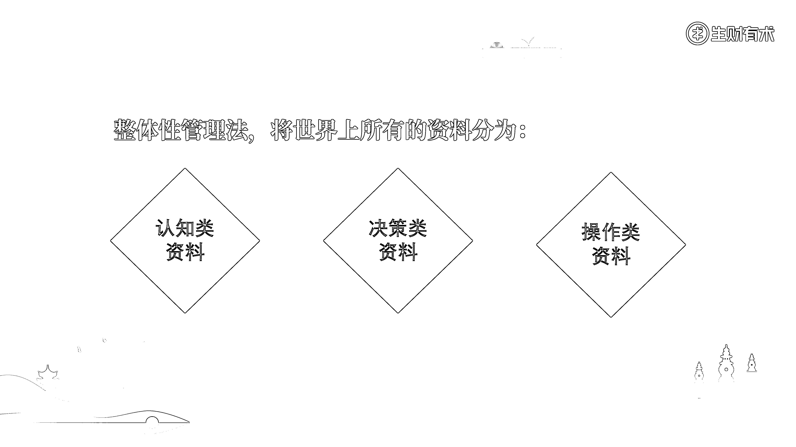

# 2.2.2 如何进行“整体性管理”

采用“整体性管理”方法，我总结了一下，大概会经历三个阶段：

•第一阶段：什么资料、工具、方法论都想要•第二阶段：想清楚了目标，开始精简操作•第三阶段：找到整体性管理方法，可以综合使用灵活运用；

1）第一阶段，什么都想要

什么都想要的人，最常见的操作就是：

•朋友圈或社群里，看到别人分享了一个网站、一个工具、一本书、一篇文章、一个资料包，觉得很好，立马就收藏起来；

•在刷社交媒体的时候，看到一个好的视频、好的音乐、好的创意点、好的活动玩法，也立马就收藏起来；

•看到身边的人最近在做什么，感觉什么不错，就想跟着一起做；

•……

接着，发现资料混乱、信息爆炸、知识不成体系、人际关系复杂、看不清楚事物运转的原理。之所以会出现这样的问题，是因为在这类人的大脑当中，对资料、信息、知识、人事就没有什么概念，也不知道它们之间的关系如何。因此对它们几乎没有掌控力，只能是别人看什么就看什么，别人学什么就学什么，别人做什么就做什么。

他们完全不知道关注、收集和处理这些东西的目的，即便给他们再多的资料管理方法，最终还是会陷入细节里，成为工具、方法、内容和人事的“奴隶”。

我最开始做资料管理，也很痴迷于对工具、方法和内容本身的研究。

那段时间，我就像是一个工具测评博主一样，会去刷市面上比较好的资料管理工具，然后看不同人对工具的使用方法，自己也会经常上手实操。但工具多了，也会产生烦恼，资料这里存一点那里存一点，和之前没有做资料管理相比，并没有什么明显的效果。

同时，我也像是一个小松鼠（松鼠有“囤积症”）一样，觉得什么资料管理方法都可以学学，毕竟都有人尝试过且拿到了结果；也觉得什么资料都可以收藏起来，相信未来总有一天，它们会派得上用场。

不知道在看手册的朋友们，有没有过上述情况？如果有的话，相信大家看完接下来的内容，就可以直接跳过我踩过的坑，进入到资料管理的高阶段位。

2）第二阶段，想清楚目标，开始精简操作

想要通过管理资料让自己变得更强大，想让世界上所有的资料都为自己所用，需要先深刻理解一个点：外部东西是如何被我们使用，并让我们发生改变的？

能够把这个问题思考清楚，我们对这些资料就有了一个底层的分类概念。

我自己也是在看了很多书，听了很多课程之后，终于找到了一个答案，即“认知影响决策，决策影响操作”。

如何理解这句话？展开来讲就是，所有外部的东西，做到极致也就是都被我们收集到位并了解一遍，它们对我们的影响路径是：首先影响我们对于一件事情的分析和判断，继而影响我们的操作和行动，最后影响了我们是否能拿到结果。

要想从外部资料的无意识关注、收集和整理，做到资料能被我们使用，并让我们发生改变，核心点就是要“知行合一”。这是哲学上的“世界观决定方法论”，也是王阳明苦苦觉察悟出来的终极真理。

“认知影响决策，决策影响操作”，这是我在对资料进行整体性管理时采用的顶层分类方法，即把世界上所有的资料分为三类：认知类资料、决策类资料、操作类资料。

通过这样的分类方法，就可以精简大脑思路，从更高维度对所有资料进行掌控。

3）第三阶段：用整体性管理方法，掌控所有资料

第二阶段，我们已经将所有资料分为了三大类。第三阶段，我们继续对这三大类进行更为细致的划分，逐渐会发现，我们混乱的思绪慢慢变得清晰，所有的资料也开始有了系统性的脉络。

下面，我们具体来拆解一下各大类——