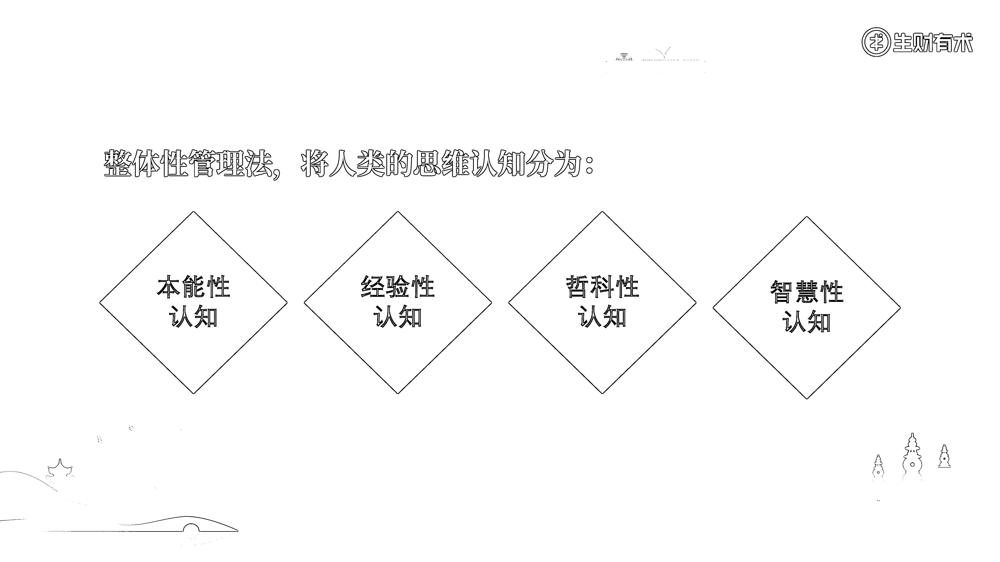

# 2.2.2.1 认知类资料

认知类资料，是我们的第一大类资料。它所对应的资料类别是：人类对于事物的理解和判断。

人类对于事物的理解和判断，经过上千年沉淀，有着海量的资料。我基于不同类型认知所能解释事物的广度和深度，对人类思维进行了进一步分类，主要分为四个层级：

•本能性认知

•经验性认知

•哲科性认知

•智慧性认知

以上四个认知类别，越往后走越高深，所解释问题的广度和深度也越强。

所谓“本能性认知”，这是最底层的人类认知维度。这是根植于人性深处的、无需通过任何实践和教化就能具备的东西。通常来说，人类偏本能的感觉、观念和想法，都属于这个类别。

所谓“经验性认知”，这是最常见的人类认知维度。人类通过实践所掌握的一切理论、方法和经验，都属于这个类别。这个经验，可以是别人所沉淀下的经验，也可以是自己通过实践，所沉淀下来的个人经验。

所谓“哲科性认知”，这是比较高维的人类认知维度。它和“经验性认知”最大的区别在于，这是通过数理逻辑实证过的，对更大数据样本进行系统性总结后的经验。通常来说，各类学科性知识和资料，都属于“哲科性认知”。

所谓“智慧性认知”，这是最高的人类认知维度。我们人类存在的时间有限，思维能力有限，因此这个世界上还有很多知识，是我们目前无法触及和理解的。通常来说，各种宗教、灵修和冥想等资料，都属于“智慧性认知”。