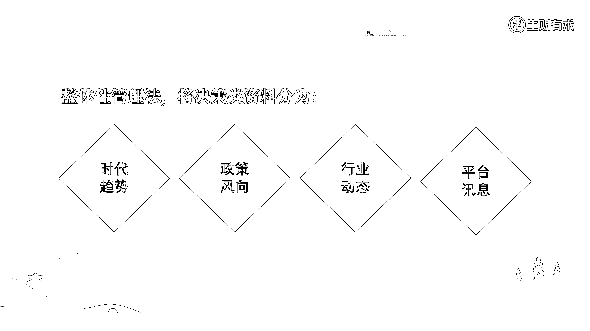

# 2.2.2.2 决策类资料

决策类资料，是我们的第二大类资料。它所对应的资料类别是：辅助和影响我们做战略决策的依据。

通过长期的学习和实践，我们拥有了属于自己的思维认知，认知可以辅助我们做战略决策，而且大概率上它们是比较稳定的。然而，还有另外一部分不稳定的东西，也会影响我们做决策和判断。

这部分不稳定的因素，主要有时代趋势、国家大势（政策风向）、行业动态、平台讯息等。如果我们平时能多关注和收集整理相关的资料，在做战略决策的时候就有了可参考的东西，甚至有可能吃到信息差红利，实现变道超车。

