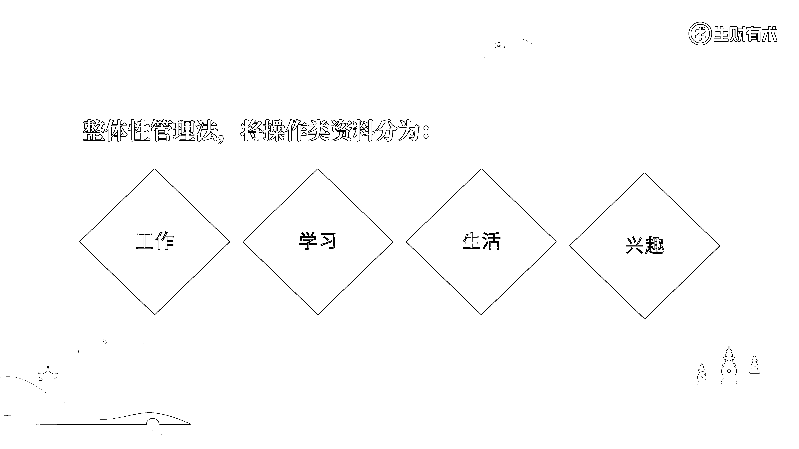
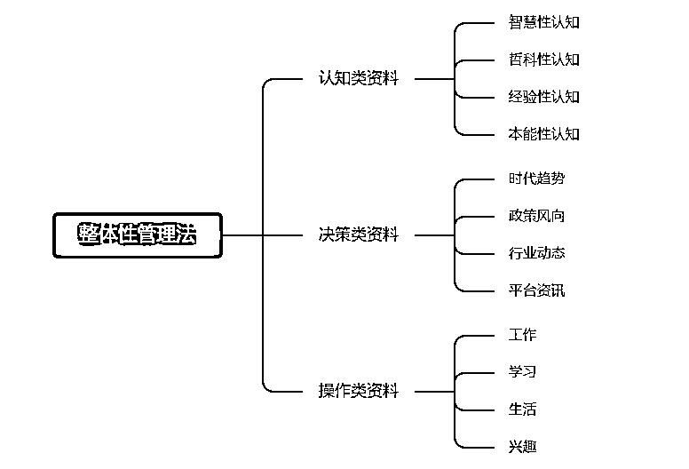

# 2.2.2.3 操作类资料

操作类资料，是我们的第三大类资料。它所对应的资料类别是：我们在认知影响下，决策制定后，所进行的一系列行为的资料存档。

通常情况下，我们的操作会涉及各个方面，但最主要的还是这四大板块：工作、学习、生活和兴趣。我也是基于这几大模块，对操作类资料进行分类管理。

总结一下，“整体性管理法”最大的目标和需求，是希望世界上所有的东西，都能为自己所用。

为此，我们对世界上所有的资料进行了综合分类：

