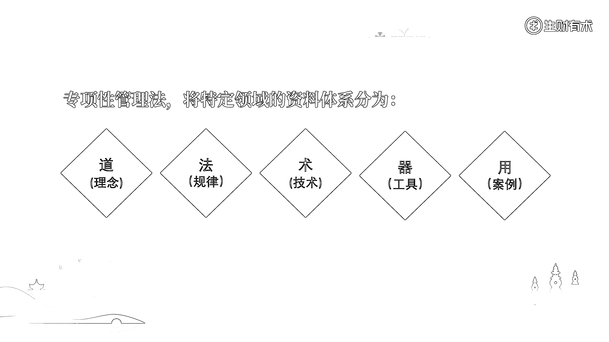

# 2.3.2 如何进行“专项性管理”

对于一个特定领域来说，哪些资料是重要的呢？这些资料又是如何构建出一个领域的资料体系的呢？如果不了解这些问题，后续可能花费了很多时间和精力，结果收集起来的资料，对于学习和商业化毫无帮助。

在这里，我给大家推荐一个分类模型——道 - 法 - 术 - 器 - 用。其中的“道法术器”来自《道德经》，“用”来自一线实操。通过这个模型，大家可以快速搭建出细分领域的资料体系。

所谓“道”，主要包括了概念、定义、理念、规律和目的。它主要承担的作用，就是讲清楚该细分领域到底“是什么”，我们研究它到底是“为了什么”，该领域存在的意义和价值在哪里。

所谓“法”，主要就是在探求“道”的过程中，经过实践思考、总结归纳出的规则体系和方法原则（比具体方法更抽象化），属于高度提炼总结的规律。

所谓“术”，主要就是具体的操作方法，指的是我们为了研究这个领域，采用了什么步骤、途径、手段、技术。如果是再细分一点的说，还包括了所研究领域的问题描述、基本假设以及适用边界等。

所谓“器”，主要就是在验证“法”和追求“道”的过程中，能够让“术”得到落地实施，所采用的一系列工具。

所谓“用”，主要就是一些实际的使用场景，还有可以参考的各种案例。

按照上述方法做细分领域的资料收集和整理，往深了说，可以写出详细且专业的学术论文和科研报告；往浅了说，哪怕任何一个维度下的任何一个模块，稍微打包打包，就可以实现商业引流或者变现。

