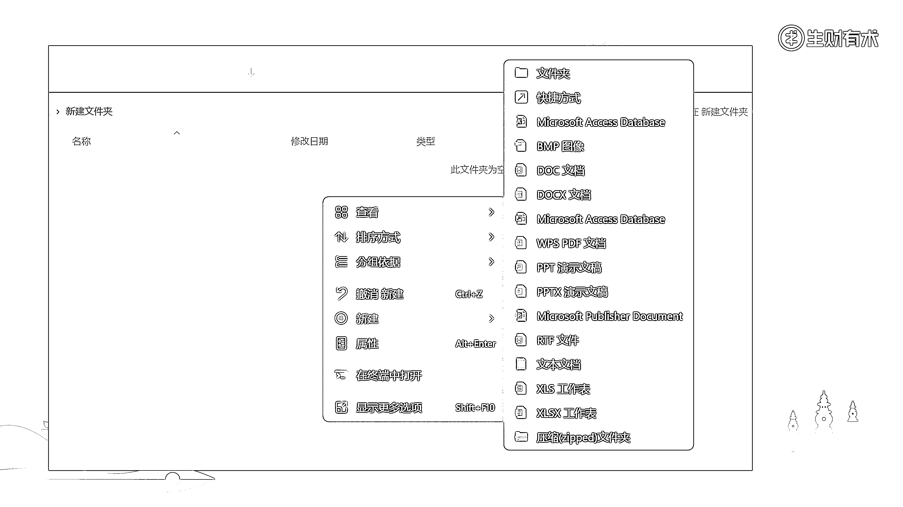
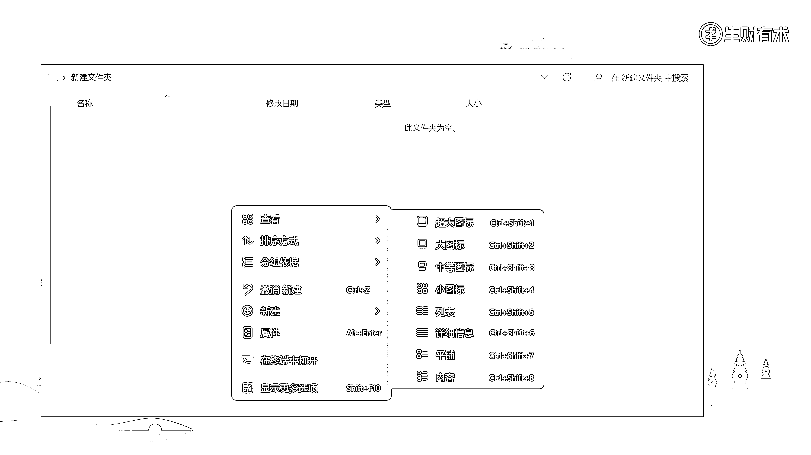
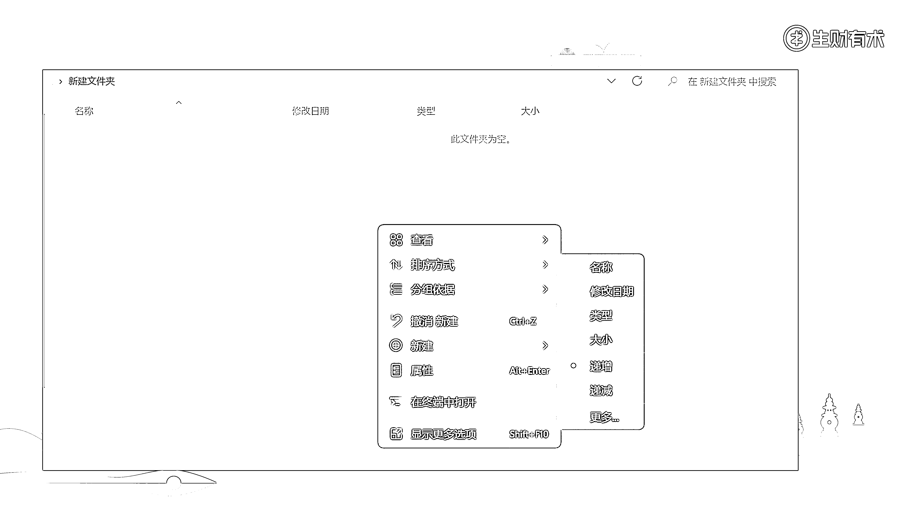
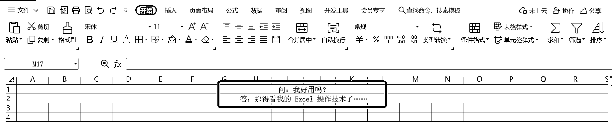
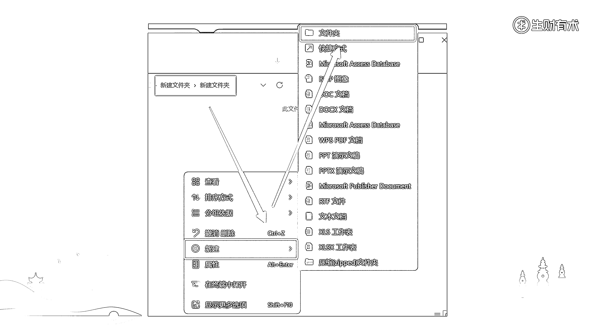
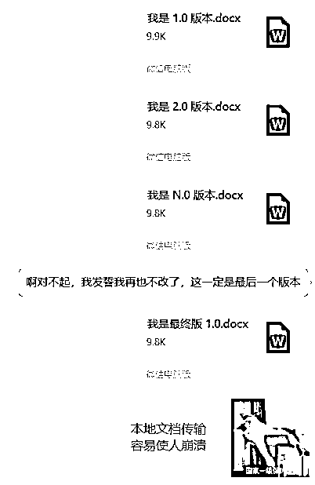

# 3.2.1 本地文件夹 ★

这个大家应该比较熟悉，每台电脑都配置有本地文件夹功能，可以算是资料管理的最简单工具。

我对于本地文件夹做资料管理的综合判断是：

💡工具评分：40 分（满分 100 分）使用建议：PC 端高频使用的本地资料管理

下面是详细分析：

1）资料收集方面

•图片类、文档类和音像类资料，可以直接下载或存放到对应文件夹；

•文字类资料得先建一个本地文档，把内容复制进去，形成本地文档后，再存放到对应文件夹；

•总的来说，不是特别灵活快捷。

2）资料呈现方面

•从可存档的资料来说，本地文件夹能管理各类文档、图片、音像、压缩包等资料；

•从资料的展示形式来说，有列表和图标两种；排序上有按名称、修改日期、类型、大小等。

•总的来说，如果这些功能运用得好的话，还是有可能实现井井有条的。

样式上：

排序上：

3）资料编辑方面

•想要编辑本地文件夹中的资料，需要逐一打开文件夹>>子文件夹>>对应文件，然后对其进行编辑；

•对于各类资料的编辑，与软件本身的功能有关。由于本地文件夹常与 Word、Excel、PPT 等 office 办公软件高度关联，人们对于这些软件的熟练程度，决定了资料编辑的效能（大部分人还是比较基础的）；

•总的来说，本地文件夹中的资料编辑不算灵活高效。

4）结构化功能方面

•文件夹的结构化管理功能，主要体现在文件夹的层级上。我们可以在文件夹中创建子文件夹，一层一层进行管理；

•总的来说，如果能够做好文件夹分类，是可以实现井井有条的。

5）内存方面

•文件夹的内存，和电脑本身的内存强相关，因为大多数电脑的内存够用，所以我们默认为文件夹的内存也够用。

•这里需要考虑一件事，就是如果电脑的内存占用过多的话，会导致运转速度变慢，所以我们不太建议在本地存储太多占用内存的资料。

•总的来说，本地文件夹内存够用，但是不建议在资料上占用过多内存。

6）搜索和查找方面

•搜索和查找文件，常用的方式是逻辑查找（知道自己放在哪里，一层层点击进去）；以及关键词查找（搜索关键词，定位对应文件）；

•高效搜索和查找的关键，不在工具本身，在于我们对资料的分类和命名；

•总的来说，如果“分类”和“命名”做好了的话，本地文件夹的查找功能还是比较方便的。

7）多平台协同方面

•本地文件夹，核心存储地是 PC 本地空间，“无法多平台协同”，可以算作是这类工具最大的痛点。

8）资料共享方面

•本地文件可以传输给别人，但是不可以“共享”（这里的“共享”，指的是可以看到最新版本，以及协同编辑）；

•通常情况下，本地资料如果后续有修改，只能通过一遍又一遍传输，不仅麻烦，而且很占空间。

综上，用本地文件夹做资料管理，优势是资料呈现形式多样、有结构化的资料管理功能、搜索和查找方便快捷，劣势是资料收集不够方便快捷、资料编辑不够灵活高效、占用较多内存、不可以多平台协同、共享给其他人不方便。

因此：

•工具评分：40 分（满分 100 分）

•使用建议：适用于 PC 端高频使用的本地资料管理

