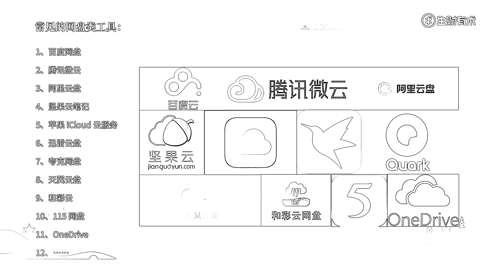
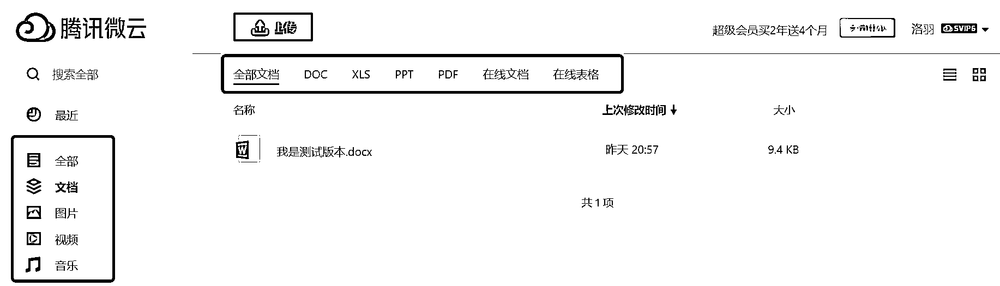
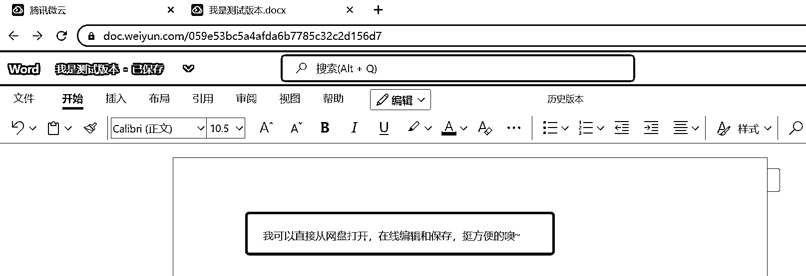
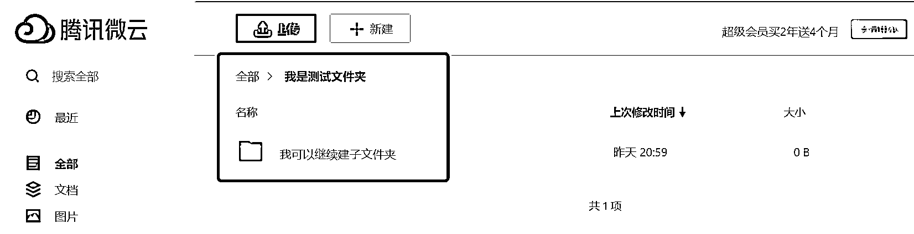
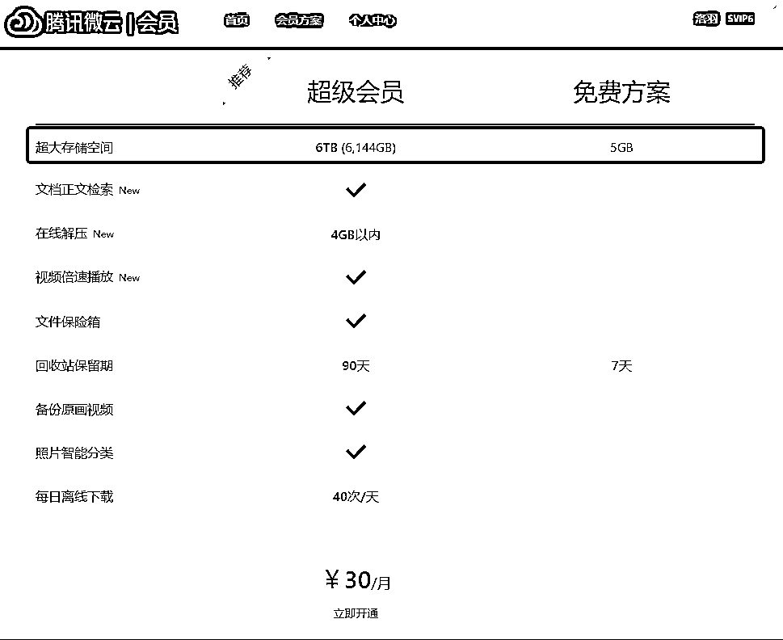
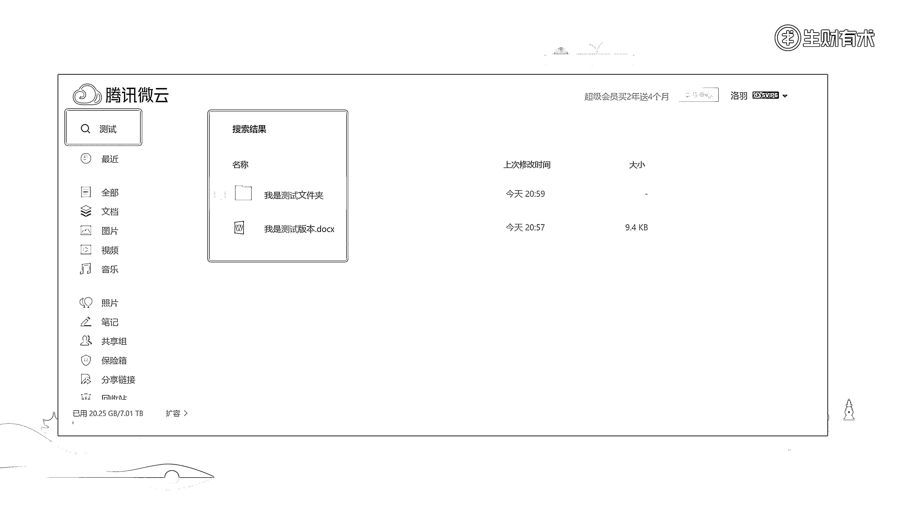
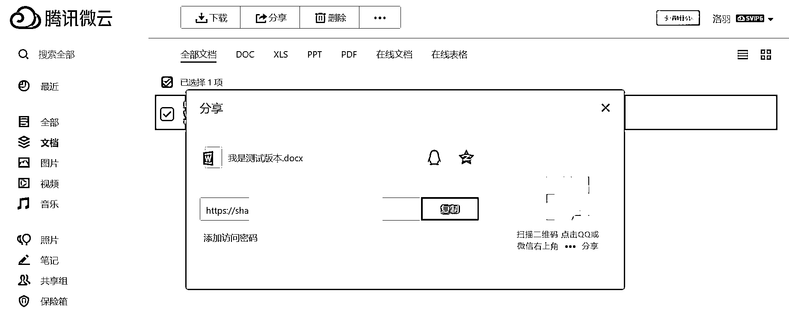

# 3.2.2 网盘类工具 ★★★

网盘类工具，市面上还是比较多的，比如百度网盘、腾讯微云、阿里云盘、坚果云笔记等。

我对于网盘类工具做资料管理的综合判断是：

💡工具评分：70 分（满分 100 分）使用建议：本地文件云端备份 + 大文件存储地

所有网盘的功能其实都差不多，我这里就不逐一介绍了。大家感兴趣的话，可以去对应官网获取。

以下是网盘类工具的使用体验，以腾讯微云为案例进行说明：

1）资料收集方面

•网盘类工具，一方面相当于本地文件夹的云端备份，另一方面相当于接受外部资料的中转站；

•作为云端的本地文件夹，除了相册资料可以自动同步外，其他文档资料可能都需要手动上传；

•作为外部资料的中转站，除了百度网盘是比较通用的传输中介外，其他的网盘都比较小众和私人。需要先用百度云接收资料，然后下载到本地，再然后上传到云端；

•总的来说，用网盘做资料收集，整体路径比较长，不算方便快捷。

2）资料呈现方面

•从可存档的资料来说，网盘和本地文件夹一样，能管理各类文档、图片、音像、压缩包等资料；

•从资料的展示形式来说，有列表和缩略图两种；排序上有按名称和修改时间；

•总的来说，如果这些功能运用得好得话，还是有可能实现井井有条的。

3）资料编辑方面

•想要编辑网盘里面的资料，可以逐一打开目录，或者直接搜索关键词，然后对其进行编辑；

•现在的网盘工具，基本都可以实现一边在线编辑一边自动保存，无需下载到本地编辑后再上传；

•对于各类资料的编辑，也是和软件本身的功能有关，这里就不展开描述了；

•总的来说，网盘资料的编辑和本地文件夹类似，也不算特别灵活高效。

4）结构化功能方面

•和本地文件夹一样，网盘的结构化管理功能，主要体现在文件夹的层级上。我们可以在文件夹中创建子文件夹，一层一层进行管理；

•总的来说，如果能够做好文件夹分类，是可以实现井井有条的。

5）内存方面

•这个得看自己的资料管理需求，如果不够用的话，还可以付费扩容。

6）搜索和查找方面

•同样的，高效搜索和查找的关键，不在工具本身，在于我们对资料的分类和命名。

•总的来说，如果“分类”和“命名”做好了的话，网盘的查找功能还是比较方便的。

7）多平台协同方面

•网盘支持网页登录，也支持客户端登录。只要在同一个账号下，内容都是互通的，这点很方便。

8）资料共享方面

•网盘类工具，可以将一个文件夹或者单个文件，用链接的方式分享给其他人，分享的时候还可以设置密码，这点是很方便的；

•但这种“共享”，更多是单向分享，不能实现协同操作。

总结一下，用网盘类工具做资料管理，优势是资料呈现形式多样、资料编辑灵活高效、有结构化的资料管理功能、搜索和查找方便快捷、不会占用本地较多内容，线上内存可以扩容，可以多平台协同，也可以共享给他人。缺点主要是资料收集和下载不太方便。

因此：

•工具评分：70 分（满分 100 分）

•使用建议：本地文件云端备份 + 大文件存储地

