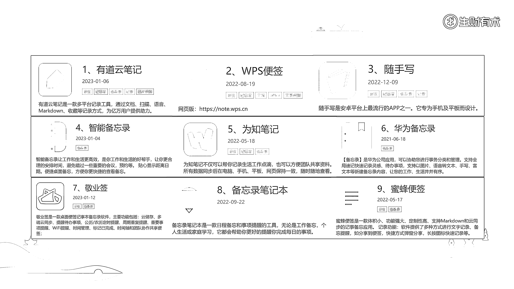
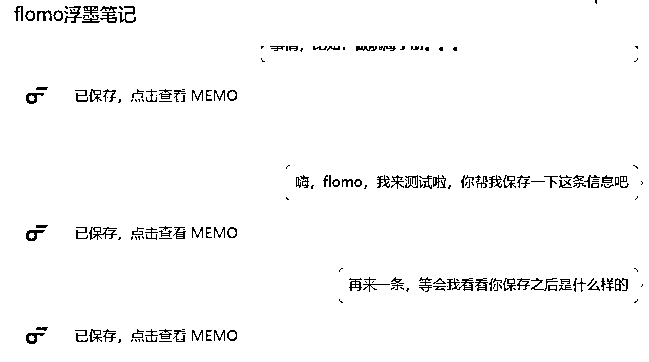
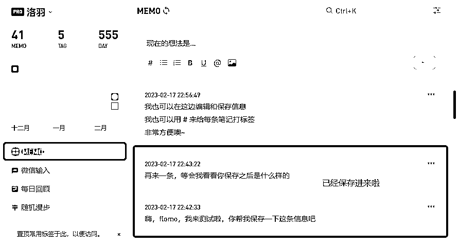
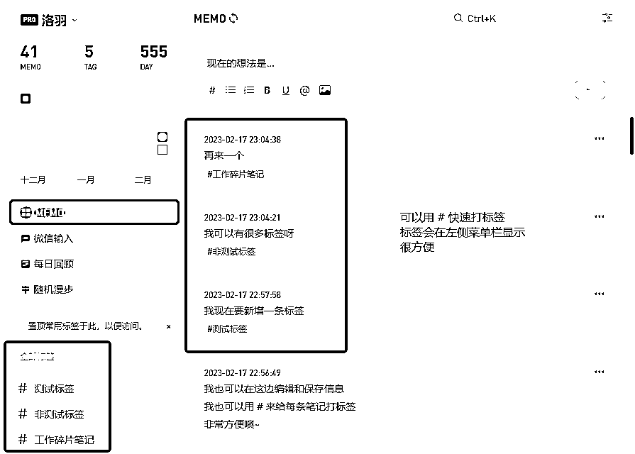
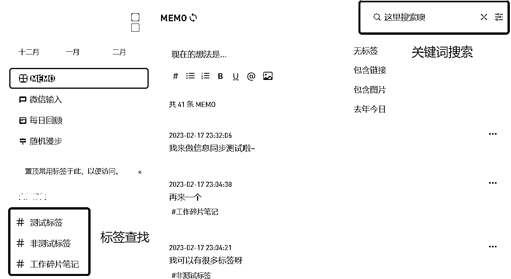

# 3.2.3 笔记类工具 ★★★

笔记类工具，市面上也是很多的，比如有道云笔记、WPS 便签、随手写、智能备忘录、为知笔记、华为备忘录、敬业签、白网路笔记本、蜜蜂便签等。

我对于笔记类工具做资料管理的综合判断是：

💡工具评分：70 分（满分 100 分）使用建议：碎片文字收件篮 + 需要结合其他工具使用

笔记类工具，功能其实都差不多，包括了“快速收集 + 打标签 + 对外分享”等，这里我就不展开介绍了，大家感兴趣的话，可以去对应官网获取。

本章节，我主要和大家分享一个近两年比较热门的笔记类工具—— flomo 浮墨笔记。

用一句话介绍 flomo ，它是一款全平台的卡片笔记，主打点是“聚焦记录想法和灵感”。这个工具和微信是打通的，我们可以像发资料给自己一样，随手发给 flomo，它会在后台一条一条沉淀出来。

详细介绍，大家可以前往官网查看（[`help.flomoapp.com/`](https://help.flomoapp.com/)）。

下面是我对笔记类工具的使用体验，以 flomo 为案例进行说明：

1）资料收集方面

•笔记类工具，最大的作用就是快速收集文字和个人想法，不适用于收集其他格式的资料， flomo 也是如此；

•相比于其他笔记类工具，flomo 在收集资料方面的一大优势是和微信打通。它的传输接口就在微信聊天界面上，我们可以把平时发给自己的资料发给 flomo ，它会在后端自动收录；

•总的来说，对于文字类资料的收集，flomo 是很方便的。

2）资料呈现方面

•flomo 目前只针对文字资料做管理，方式也主要是标签化；

•总的来说，呈现形式是比较单一的，也可以说比较简洁。

3）资料编辑方面

•在 flomo 里面，可以随时新增内容，也可以随时对文字内容进行修改调整；

•总的来说，编辑起来还是比较方便的。

4）结构化功能方面

•flomo 的结构化管理，主要是通过标签进行分类，都是并列顺序，没有更多层级：

5）内存方面

•flomo 主要是用来收集和整理文字资料，内存是够用的；

6）搜索和查找方面

•flomo 的入口，可以通过在微信界面搜索，也可以通过微信聊天栏打开，这个是比较方便的；

•想要在 flomo 里面搜索笔记资料，可以通过搜索标签和关键词；

•总的来说，如果“分类”和“命名”做好了的话，flomo 的查找功能还是比较方便的；

7）多平台协同方面

•flomo 是和微信绑定的，只要能够登录微信，就可以查找到存档的内容。

8）资料共享方面

•flomo 可以通过链接和图片的形式共享资料；

•和网盘资料一样，这种“共享”，更多是单向分享，不能实现协同操作；

总结一下，用笔记类工具做资料管理，优势是收集文字类资料方便快捷、资料编辑灵活高效、搜索和查找方便、不会占用较多本地空间，可以多平台协同。缺点就是不适合收集整理其他类型的资料。它就像是一个私人笔记本，零零碎碎地记录个人的所见所闻，所思所想。

因此：

•工具评分：70 分（满分 100 分）

•使用建议：碎片文字收件篮 + 需要结合其他工具使用

