# 3.2.4 知识库工具 ★★★★

知识库是我最喜欢的资料管理工具，也是截止到目前运用得最得心应手的工具。

其中一个比较重要的原因，是我对资料、知识和信息有比较结构化的认知，并且在知识库中搭建好了整体框架。所以在接触到各类资料、知识和信息的时候，可以快速反应出来，它们应该属于知识库的哪个模块，然后马上转存到对应位置。

我对于知识库工具做资料管理的综合判断是：

💡工具评分：85 分（满分 100 分）使用建议：资料总库 + 所有资料线索汇总地 + 一次搭建终身受用

市面上的知识库工具很多，比如印象笔记、notion、语雀、飞书等。

我是 2020 年开始使用印象笔记的，因为平时比较爱搜集爱记录爱思考，一年时间大概整理了 4000 多条笔记。后来接触了飞书，发现它的空间和知识库功能对于资料的结构化管理更方便，于是在 2022 年，逐渐将资料管理的主阵地，从印象笔记迁移至飞书。

关于印象笔记和飞书的整体介绍，感兴趣的同学可以去官网获取（印象笔记官网：[`www.yinxiang.com/`](https://www.yinxiang.com/)）（飞书官网：[`www.feishu.cn/`](https://www.feishu.cn/)）

接下来，我主要和大家介绍一下印象笔记和飞书的使用体验：

1）资料收集方面

① 印象笔记

•在这方面，印象笔记和 flomo 有点类似，和微信还有各大浏览器打通了；

•我们可以通过微信聊天界面，直接将想要收集的文章和资料传输给“我的印象笔记”，它会自动同步到后端；

•也可以为常用的浏览器安装印象笔记剪藏插件，看到好的内容，可以一件转存；

•印象笔记可以收集文字、图片、文档、音视频等各类资料；

•总的来说，是比较方便的。

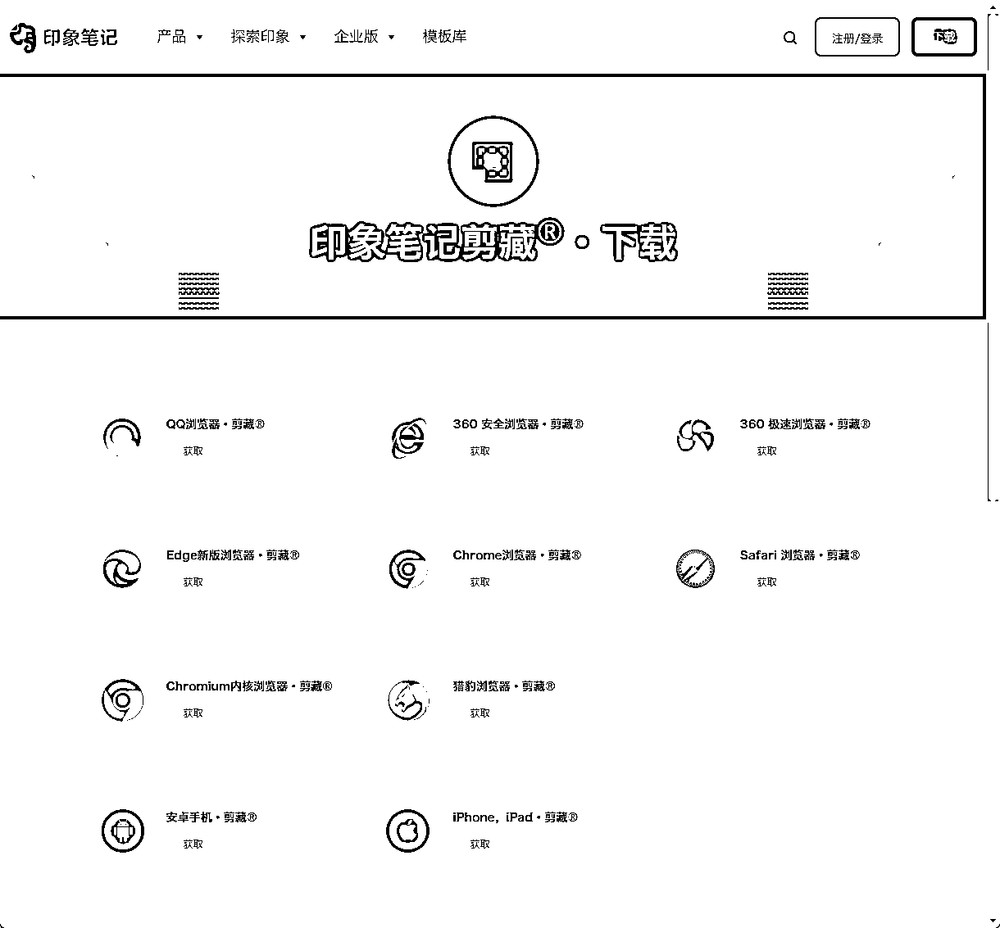

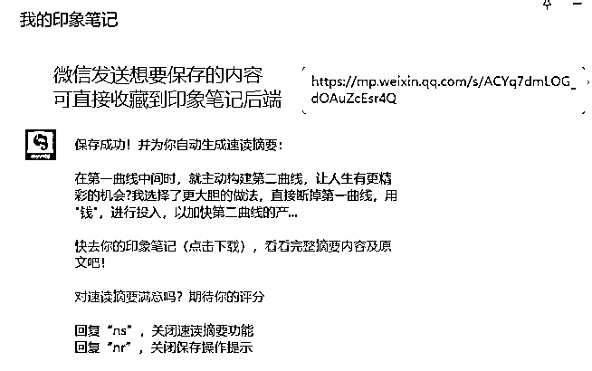

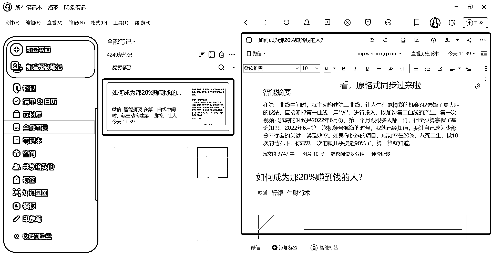

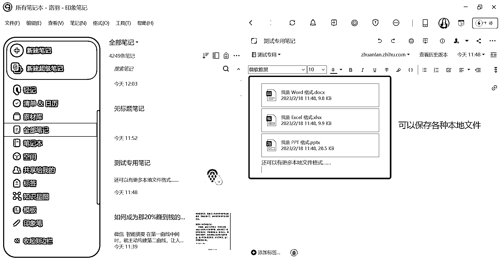

② 飞书（云空间 & 知识库）

•用飞书做资料收集，一是可以采用云空间，二是可以采用知识库；

•飞书云空间的功能类似云盘。总的来说，路径比较长，不算方便快捷；

•知识库的功能类似印象笔记，但是需要自己手动复制和上传，也不算方便快捷。

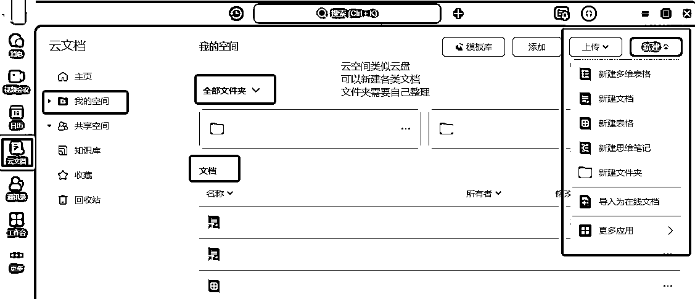

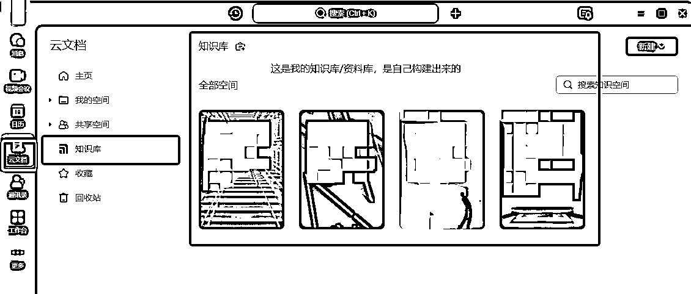

2）资料呈现方面

① 印象笔记

•从可存档的资料来说，印象笔记能管理各类文档、图片、音像、压缩包等；

•从资料的展示形式上说，主要是三级笔记结构，从左至右打开，具体内容得看归档时是什么形式；

•从资料的排列顺序上说，有创建时间、更新时间、标题、来源网址、大小、位置、作者等；

•总的来说是比较多样化的，可以满足不同的需求。

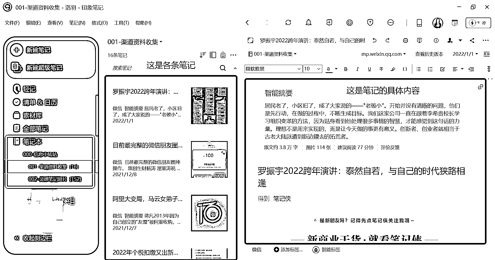

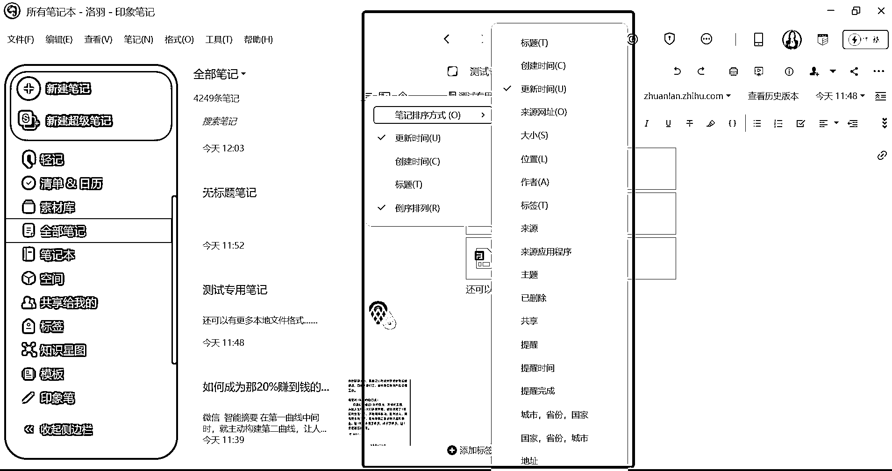

② 飞书（云空间 & 知识库）

•从可存档的资料来说，飞书也能管理各类文档、图片、音像、压缩包等；

•从资料的展示形式上说，飞书云空间和云盘类似，飞书知识库和印象笔记类似，这里就不展开介绍了；

•但飞书知识库有一个很强大的功能，就是可以将文档、表格、PPT 、思维导图等综合起来呈现，这一点印象笔记做不到。

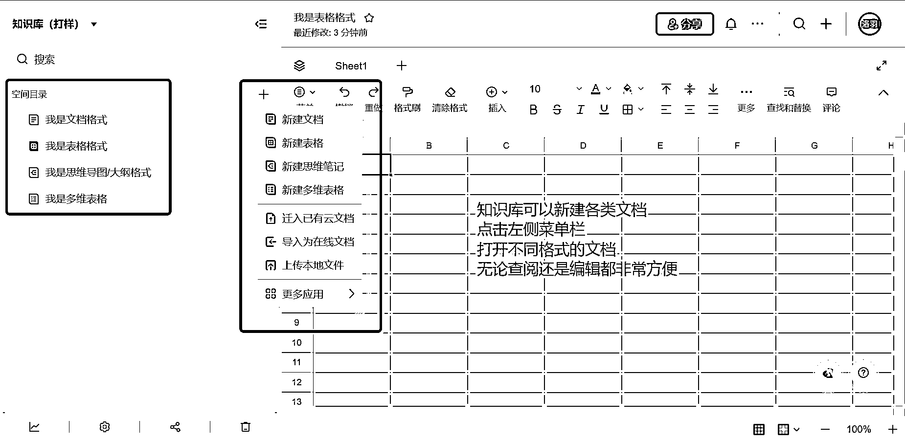

3）资料编辑方面

① 印象笔记

•按照“笔记本组-各条笔记-笔记具体内容”的界面呈现，对于资料的查找和编辑是比较方便的；

•“新建笔记”的编辑界面，不是特别好用，因为功能不够齐全；

•印象笔记后来新增了“新建超级笔记”功能，整体编辑体验会好很多，多了模板、智能表格、大纲、列表等；

•总的来说，现在印象笔记的编辑功能已经比较齐全，但是依旧不如飞书文档，飞书文档的编辑功能真的是 yyds ，谁用谁知道。

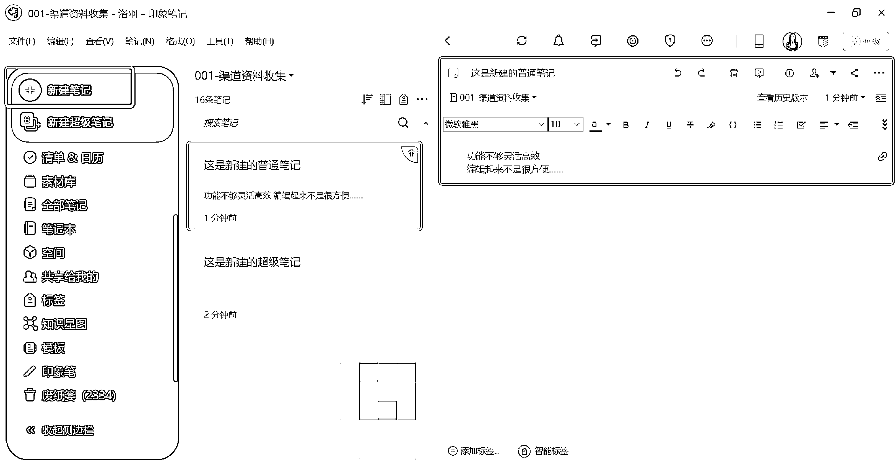

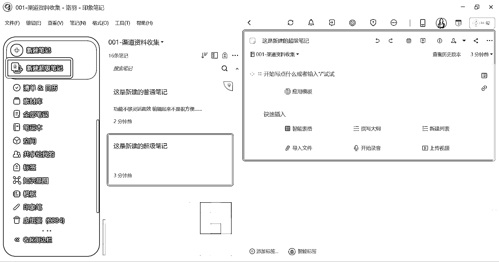

② 飞书（云空间 & 知识库）

•想要编辑飞书云空间或知识库里面的资料，可以逐一打开目录，或者直接搜索关键词，然后对其进行编辑；

•这里需要特别提示的是，飞书云空间和知识库里的大部分资料，都是飞书云文档，而飞书云文档的编辑，是我所有体验过的文档编辑器中，最好用的，没有之一。

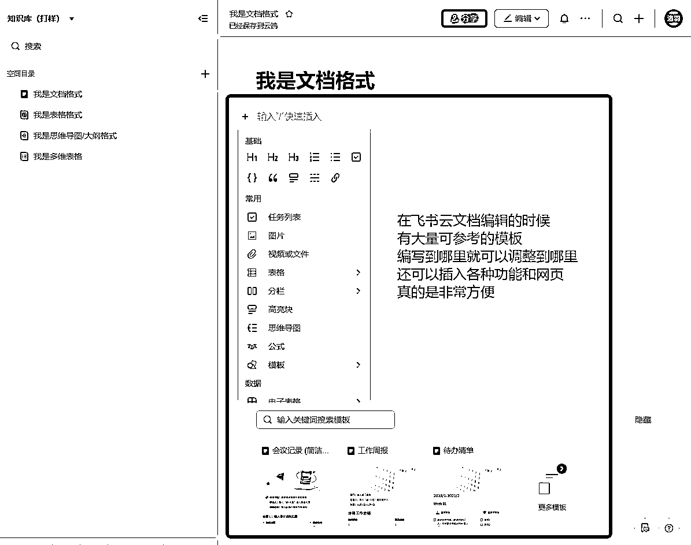

4）结构化功能方面

① 印象笔记

•印象笔记的横向结构化功能，主要是“笔记本组-笔记本-单条笔记-详细笔记”的三级结构 + 详细展示，它主打的就是要精简层级。对于资料管理来说，其实三级结构是够用的，但这要求使用工具的人能够精简分类，有一定难度；

•印象笔记的纵向结构化功能，主要是“清单&日历、素材库、全部笔记、笔记本、空间、标签、知识星图、模板”等。通常情况下，我们用不到这么多功能，能够把“笔记本+标签”功能用好，就已经很不错了；

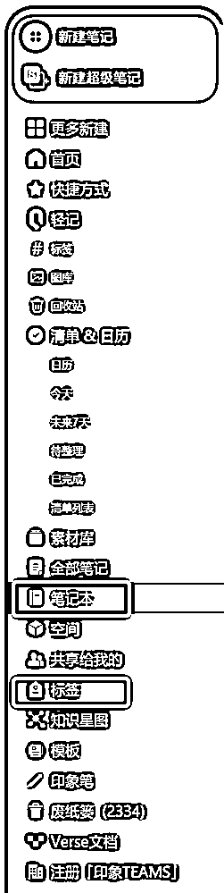

② 飞书（云空间 & 知识库）

•飞书云空间的结构化功能，主要体现在文件夹的层级上。我们可以在文件夹中创建子文件夹，一层一层进行管理；

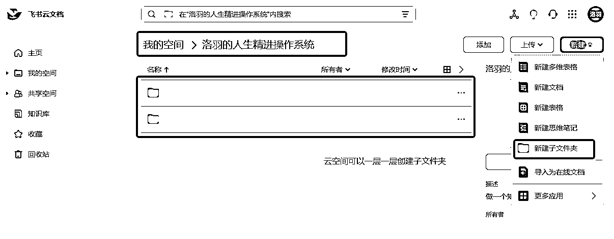

•飞书知识库的结构化功能，和印象笔记一样，分为横向结构化和纵向结构化；

•横向结构化主要是“目录-子目录-文档”，具体有多少层级，可以根据自己的需求设定（这点和印象笔记的三级结构不一样）；

•纵向结构化和印象笔记不一样，没有多余的功能，整个知识库都需要自己建立分类（我个人觉得这样挺方便的）；

•总的来说，飞书的结构化功能是最简约，也是最好用的。

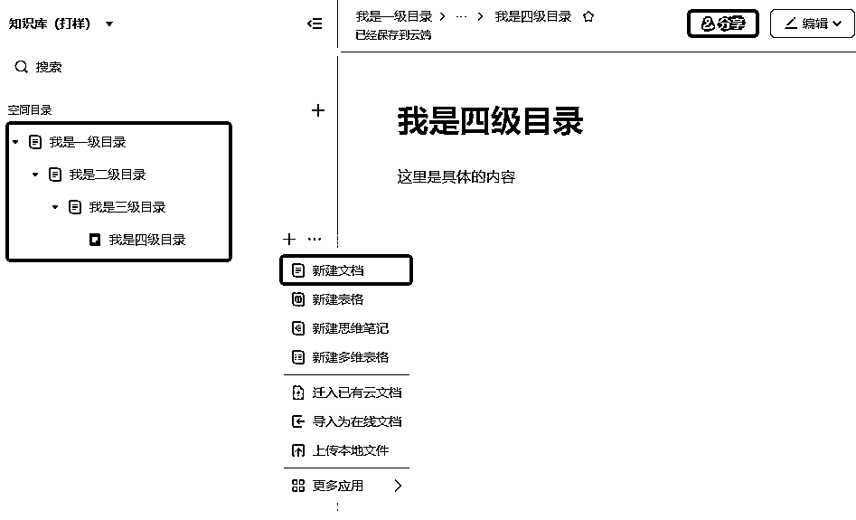

5）内存方面

•印象笔记作为老牌知识管理工具，早就已经商业化了，如果内存不够用，可以付费扩容；

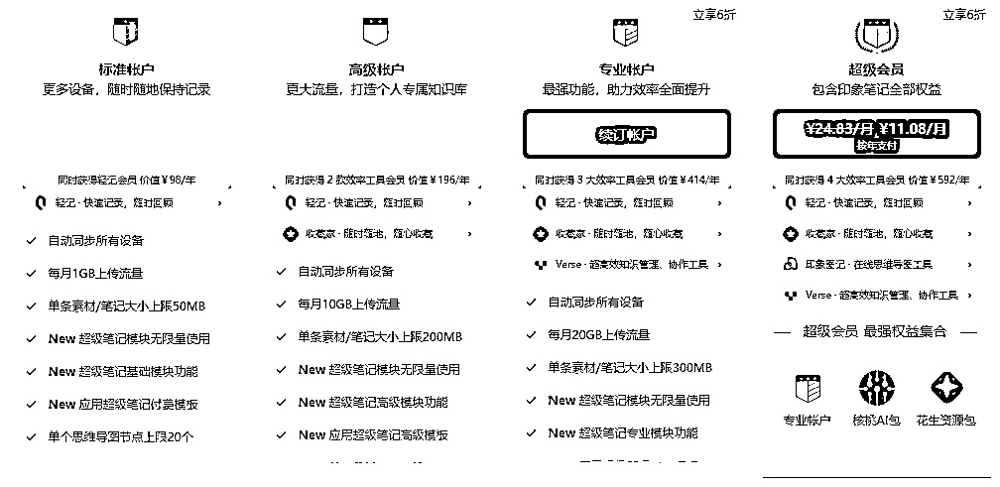

•个人账号的飞书云空间和知识库，内存一共有 10G，暂时不能扩容。这里有一个点需要说明，飞书只有在存档图片和本地文件时才算占用内存，新建云文档和在云文档中储存文字资料，无论多少都是不占用内存的。所以如果不是要储存的资料特别多的话，飞书云空间还是够用的；

•企业账号的飞书云空间和知识库，如果不够用的话，可以付费扩容。但是为了资料的私密性和减少后期迁移的成本，我不建议大家用企业账号做个人资料管理。

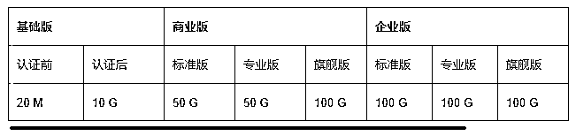

6）搜索和查找方面

① 印象笔记

•如上所述，高效搜索和查找的关键，不在工具本身，在于我们对资料的分类和命名。

•如果“分类”和“命名”做好了的话，印象笔记的查找功能还是比较方便的。

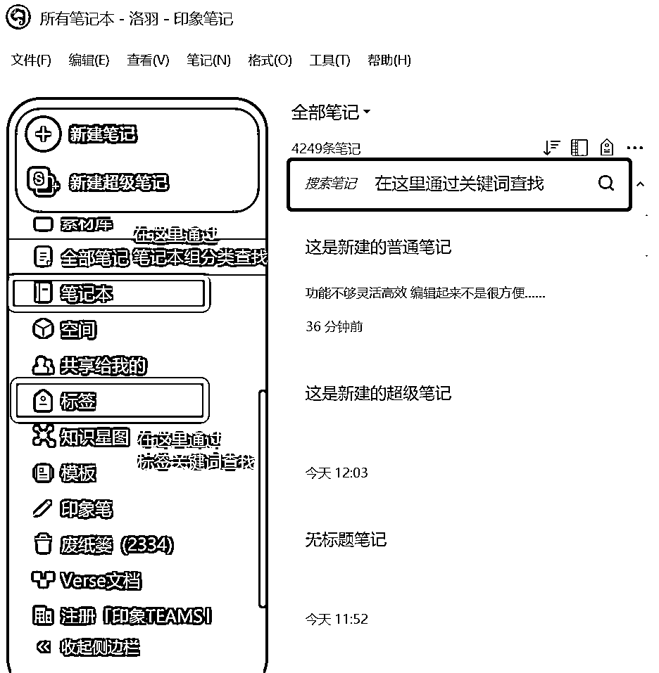

② 飞书（云空间 & 知识库）

•在飞书上查找资料，一是可以通过云空间和知识库的分类逐层查找，二是通过关键词查找；

•通过关键词查找，只要是飞书里面的资料，什么都能定位，包括：消息、云文档、文档中的内容等；

•总的来说，飞书的查找功能非常强大。

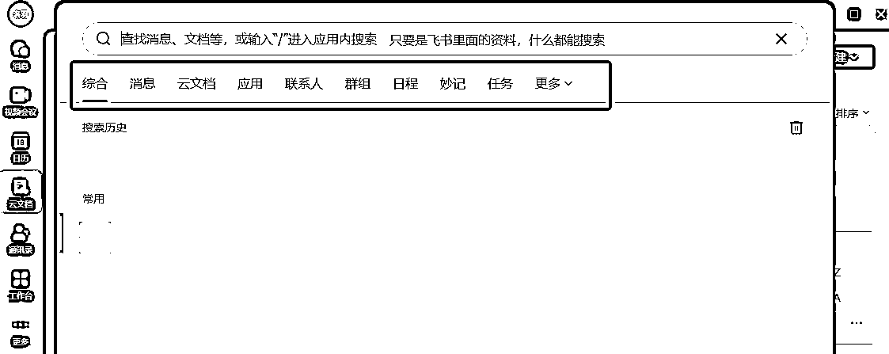

7）多平台协同方面

•印象笔记可以共享资料，也可以协同处理资料。但操作起来稍微有些复杂，有时候链接分享不出去，有时候共享出去的内容，对方不知道怎么配合；

印象笔记分享流程：

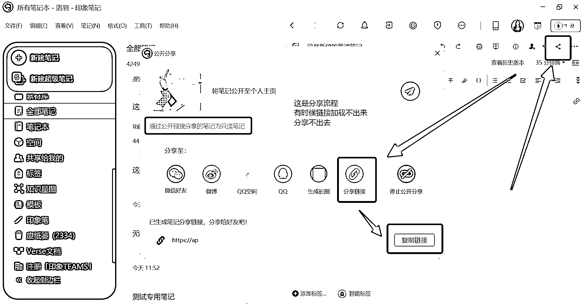

印象笔记协作流程：

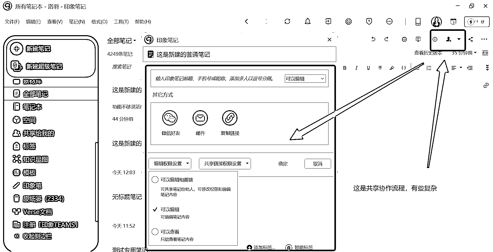

•飞书的共享和协同处理，也可以说是所有协同办公软件中最强大的。我们现在很多工作资料对接，都用的是飞书文档；

•这里需要说明的是，如果是需要对外分享和协作的文档，最好单独创建，然后归档到云空间或知识库。在云空间或知识库创建的文章，想要对外的话，需要特别注意父子级页面的权限设置。

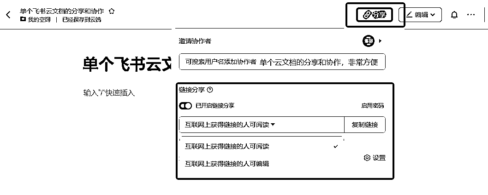

总结一下，关于知识库工具，印象笔记属于比较老牌的知识管理工具，但功能稍微有些死板，不够灵活。飞书软件的云空间对标云盘，知识库对标印象笔记，整体功能建立在办公软件的基础上，非常灵活高效。

如果大家要选择一个知识库工具，我个人比较推荐飞书知识库。虽然在收集上稍微逊色于印象笔记，但在结构化、查找、共享等方面，可以说是目前各类空间和文档中最好用的。

综上：

•知识库工具评分：85 分（满分 100 分）

•使用建议：优先选择飞书软件（自带云盘和知识库），并在飞书软件上搭建出一个强大的资料管理总库，把其他所有零散的资料及相关线索，都汇总在飞书资料库上。一次搭建，终身受用。

