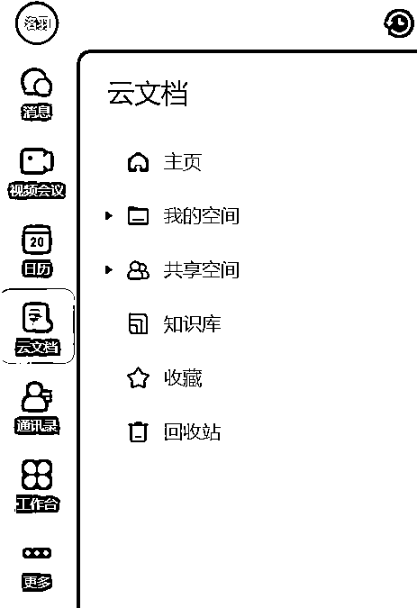

# 3.3.1 一个中心：飞书资料总库 @洛羽

结合资料管理的底层逻辑、工具选择的基本原则，以及不同类型资料管理工具的优劣势，我最终选择用飞书平台，来作为我的“总资料库”，它既是我的“线索汇总地”，也是我的“资料汇总地”。

为什么选择飞书？因为它同时具备了云空间和知识库功能，方便做资料的“整体性管理”：

我非常建议大家在做资料管理的时候，优先采用“整体性管理”的方法，最重要的一个原因就是：“整体性资料管理”方法是一次搭建终身受用，它和“专项性资料管理”是包含与被包含的关系，选择管理范围更广的方法，可以有效减少后续返工的成本。

以下是我在飞书上进行资料整体性管理的操作步骤：