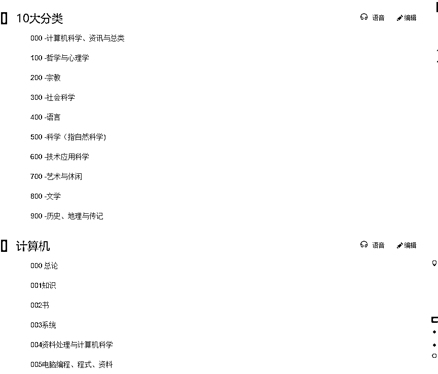

# 方法二：FBBMS 富爸爸模式 @七小

这里先来讲一个通用的整理思路，可以把它用来管理任何文件资料，无论是电脑本地文件，或是电子云笔记。

给它取了一个好记的名字：FBBMS 富爸爸模式归档法。

FBBMS，是「富爸爸模式」的拼音首字母的组合，这些字母的本意是：

F：fenlei 分类规则

B：bianma 编码规则

B：biaoqian 标签规则

M：mingming 命名规则

S：sousuo 搜索工具

强调一下：在不同的软件里，以及对不同的使用者来说，这 5 个要素的重要性是不一样的！

如果分类做的特别好，不打标签也可以

如果标签打得好，不做分类也可以

如果命名做得好，不分类和打标签也可以

有些软件标签筛选功能强大，分类就没那么重要了

做资料管理，目的是能在 1 分钟之内找到归档过的任何资料，这 5 个要素只是帮助查找资料的手段，手段是多样的，只要能实现目的就行，不要本末倒置。

1、分类规则

把文件分别装到不同文件夹里，这个动作即为「分类」。分类之前，一定需要明确「分类规则」，没有清晰的规则，文件就无法分类。

常见的分类规则：

① 完成情况

通常可以分为：已完成、正在进行、待启动、取消、延后 ，这五种情况。

比较适用于工作中，做了这样的分类后，精力就会聚焦在正在进行和待启动的事情上面

② 时间、地点、对象

•时间： 可以是年月日分期，也可以是人生中的某个阶段，比如：

复盘整理——2021.5 月度复盘， 2021.6 月度复盘

相册分类——初中、高中、大学

工作资料打包——19 年实习项目、20 年实习项目

•地点：一般地点也是和时期绑定的，比如：

日记整理——在深圳时期的日记、在广州时期的日记

•对象：可以是人，也可以组织，比如：

微信聊天文件—— 朋友 A 文件夹，复盘群文件夹，公司通知群文件夹

③ 已有规则

书籍、课程、资料等已有分类，直接复制现有的分类即可

④ 自定义规则

自定义需要自己去创造规则。文件夹可以是「学习」「工作」「生活」三个大类，也可以是「修身」「治国」「齐家」「平天下」。

我自己的规则主要是 「学习」 「人」「事」「财」， 细分下去。

学习：思维模型，知识体系搭建方法，阅读方法，信息整理人：性格心理学、两性心理学、自我探索、社交策略事：目标管理、时间管理、精力管理、做事工具 财：保险、股票、基金、债券、互联网项目

以上的规则没有固定的模版，仅作参考，需要自己找到最合适自己的方法。

2、编码规则

最简单的编码规则，就是顺序数字。 文章用 01、02、03、...、99，依次排列。

二级分类可以是：1）2）3）4），依次排列；也可以是：1。 1.1 1.1.1\. 2\. 2.1 2.1.1，依次排列。

编码最常用的方法是「数字」或「字母+数字」。

「数字」 比如杜威十进制：

我用的是「字母+数字」，比如： A 学习 ，B 人，C 事，D 财。

A1 思维框架 ，A2 知识体系 ，A3 阅读方法 ...

编码什么时候用，什么时候不用？

低级编码，纯数字排序，一个作用是美观，另一个作用是记忆搜索点，比如第一次查文档查的是标题，然后看到它的编号是 66，那你下次找的时候搜 66 就可以了。

高级编码，体现分类。 如果要做一个复杂的研究，从很多的主题里各挑一两篇文章，混在一起，编码 A1，B2，C3 ，更容易清楚这个资料的来源，如果只有标题，数量多了可能会忘记。

如果你很少有把不同主题的资料大量混在一起的情况，可以不用高级编码。只用低级编码排序标号即可。

3、标签规则

标签规则指的是 「符号+含义」，特别适用于写字的文档， 标签放到标题或正文都可以，做好这些标记后，找文件只需要记得关键词

如果想精细的区分不同类型的标签，那可以参考： #关键词 ，@相关人 ，T：时间 P：地点

如果觉得不需要非常细分， 用# 也是可以的， #关键词 #相关人 #时间 #地点

如果怕在关键时刻想不起来标签，那在最初归档整理的时候，就多打一些标签，哪怕打了十几个标签都行。

甚至可以写一个标签 #想不起来 ，来标记经常忘记的文件。

4、命名规则

我建议的命名规则是：「一眼能看懂的内容概括标题」+「关键词：时间、地点、相关人、其他内容记忆点」

比如：

•打造知识体系的矩阵 #L 先生#九宫格

•知识体系四步法 #七小 #学习金字塔 #55 字口诀

命名的核心原则是：一看名字，就能想起来里面大概是什么内容。

下面这类命名是大忌！ 如果你经常这样做，一定要改：

•草稿

•待处理

•1

•新建文件

•资料

•2021 年 7 月 31 日今日心得

这种你看了标题都不知道是写什么的，就是不合格的标题。

内容来源：《资料管理的整理规则与工具》

