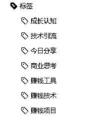

# 方法三：打标签建立索引 @乔帮主

1、规范概要

打标签建立索引是一种最为常用的方法，而打标签建立索引需要遵循一定的规范。通过实践，以下是我总结的一些打标签的规范概要：

1）设计一套合理的标签体系：在打标签之前，需要设计一套合理的标签体系。标签的种类和数量要尽量简洁明了标签之间的关联和层级要清晰明确，这样可以让我们在查找和使用素材库时更加方便。

2）统一标签规范：对于相同的内容，应该尽量使用相同的标签，这样可以保证标签的规范性和统一性。在打标签时，应该遵循一定的规范，例如标签的大小写、单复数、缩写等

3）标签不宜过多：标签不宜过多，应该尽量减少标签的数量。过多的标签不仅会增加打标签的工作量，还会让标签体系变得复杂，使我们在查找和使用素材库时变得困难

4）标签要具体：标签要尽量具体，避免使用模糊的标签。例如，如果是关于电影的素材，不要使用“娱乐”、“影视等过于泛泛的标签，而是应该使用更具体的标签，如“动作电影”、“科幻电影”等。

5）定期检查标签库：标签库应该定期进行检查和维护，保证标签的正确性和完整性。如果发现有标签错误或者遗漏，应该及时进行修正

6）采用自动标注技术：为了提高效率和准确性，可以采用自动标注技术。例如，可以利用机器学习、自然语言处理等技术来自动抽取关键词，并将其作为标签进行打标签。

2、打标签的方法技巧有哪些

我们可以根据分类体系打标签：建立一个分类体系，将资料素材按照不同的类别进行分类，例如：行业分类、内容类型分类等。然后，对每个资料素材打上相应的标签，标记出所属的分类。​

​

我们也可以使用关键字打标签：对于资料素材库中的内容，提炼一些关键字进行描述。这些关键字可以帮助我们更快地查找所需资料素材。使用关键字打标签，是最为常用，也是我最为喜欢的方式。​

​

我们也可以打上描述性的标签：例如：概念、颜色、方向、时间、地点等。这些标签可以根据资料素材的属性特点进行设置。​

​

我们也可以使用工具辅助打标签：例如：Evernote、Onenote、Zotero 等，可以自动提取资料素材的标签信息，可以更好帮助我们进行打标签。

3、通过关键字来打标签的实践

有时候当你脑海里灵光一现，有了一个好的想法，其实本质也就是提取关键字，然后去搜索检索对应素材内容，进一步将自己的灵感想法进行落地。​

​

关键字提取，是我们常用建立标签的策略，同时也是我们阅读的重要技巧。以及我们现在热门的 AI 绘画&ChatGPT 等技术，你想要用好这些技术，底层逻辑都是关键字。即你懂得搜集整理关键字，向它们提问及训练它们为你所用。​

​

很多人阅读很慢，喜欢咬文嚼字。而很多人一目十行，好像能做到过目不忘一样，这里面核心的阅读技巧就是提取关键字的能力。​

​

从阅读/写作角度，具有关键字的提取能力的话，它有以下几个核心用途：​

•了解文章主题：通过提取文章的关键字，可以帮助读者快速了解文章的主题和重点，有助于阅读理解。​

•建立知识框架：提取关键字可以帮助读者将文章中的信息有条理地组织起来，建立知识框架，便于记忆和复习。​

•快速检索信息：当需要查找某个特定的信息时，可以通过关键字快速定位文章中的相关内容，这也能快速让你联想到你曾经看到的内容。​

•有效笔记：将提取的关键字作为笔记，可以使笔记更加精炼、有针对性，也更容易在以后的阅读中回忆起文章内容。​

•辅助写作：在写作过程中，通过提取关键字可以帮助梳理思路、明确论点，提高写作效率和质量。

那怎么提取内容中的关键字，来为内容打上标签呢？我们可以按照以下步骤进行：​

•通读内容，梳理文章中的核心概念和关键词。​

•选择最能表达文章主旨和核心内容的关键词作为标签。​

•选择文章提及多次的关键字作为标签。​

​

比如我公众号和为知笔记中，用的常用标签如下：

另外在实际操作中，可以考虑使用一些分词工具来帮助提取关键词，如自然语言处理工具 NLTK、jieba 分词、词云分词工具等。这些工具可以对文章进行分词、词性标注等处理，从而提取出文章中的关键词。

4、没有标签功能的平台怎么建立索引

常用的印象笔记、为知笔记等笔记软件平台，都是有标签功能的。但我们的飞书平台就没有标签功能，还有我们在本地磁盘存储的文件内容，也是没有标签功能。​

​

那这时候我们要怎么通过提取的关键字，来建立索引呢？这时候我们一般通过文件夹分类 + 文件命名 + 文件描述来建立索引。​

​

按照书籍来解释的话，文件夹分类就相对于书籍目录中的章，文件命名就等同于书籍目录中的节，文件描述等同于书籍中具体对应的内容。​

​

我们要做的就是把我们提取的关键字，体现在文件夹分类、文件命名、文件内容描述中。这样我们后面直接使用对应“关键字”，直接使用搜索功能，非常方便高效的让我读取相应内容。​

​

值得注意的是，从技术角度，我们本地磁盘文件系统、飞书的内容系统，为什么不使用标签这个功能。主要原因是他们内容存储技术，使用的是全文索引方式。所以只要你整理好对应关键字，本地磁盘、飞书系统里，就能高效直接搜索链接到你想链接的内容。​

​

具体实践中，我们可以通过在文件夹名、文件名中包含关键词+特殊字符来建立索引。一种常见的方法是在文件名中使用特定的标记或者关键词。​

​

例如，你可以使用项目名称、主题、文件类型等作为关键词，并在文件名中使用特殊字符来表示它们。例如，使用下划线（_）或连字符（-）来分隔关键词，或者使用方括号（[ ]）或大括号（{ }）来将关键词括起来。​

​

另外，你如果是本地磁盘文件，也可以使用文件管理器或者专业的文件索引软件来实现。文件管理器中通常都有搜索功能，你可以使用关键词搜索文件，也可以使用标签或者属性筛选文件。

如果你需要更加高级的索引功能，可以考虑使用专业的文件索引软件，如 Everything、Agent Ransack 等。这些软件可以快速搜索你的硬盘，同时支持多种搜索条件和高级筛选。​

​

最后，我们关键字可以进一步体现在我们文件内容描述中（通常指文本，图片、音视频这种是不可编辑的）。这个操作的核心意义主要是为了标记文件，方便后面我们搜索读取。​

​

如果你的文件内容中已经有关键字覆盖了，这个可以不用再去编辑添加。如果没有关键字覆盖的，可以在文首和文尾加入标签进行标记即可。​

​

无论采用哪种方法，建立索引的关键是在文件内容管理上投入足够的时间和精力，确保每个文件都被正确分类和标记。这样可以大大提高文件检索和使用的效率，可以跟你的内容创造持续提供猛烈的火力输出！

内容来源：《利用技术思维，高效打造资料&素材军火库，持续提升你的内容输出火力》

