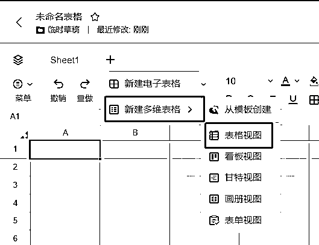
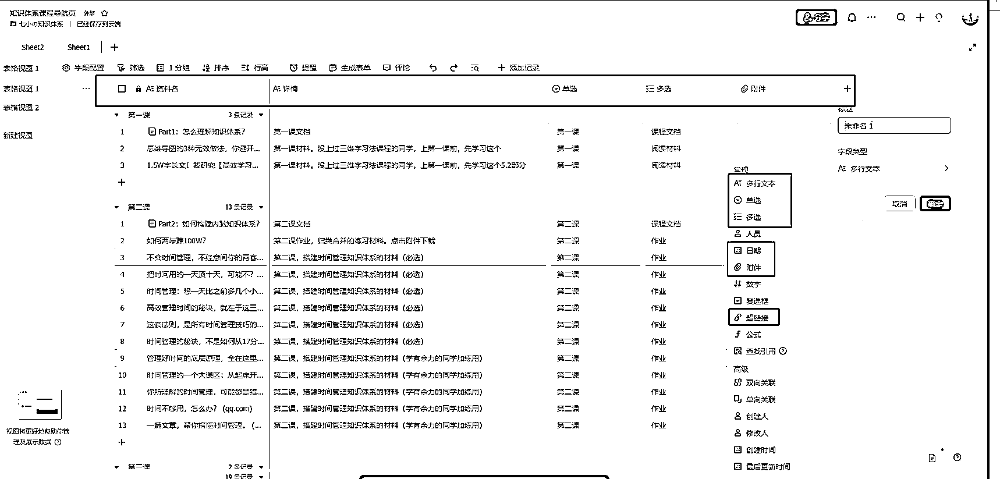
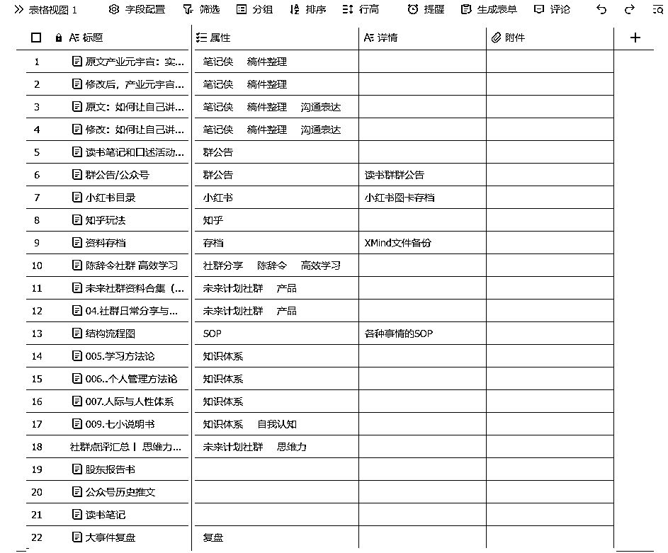
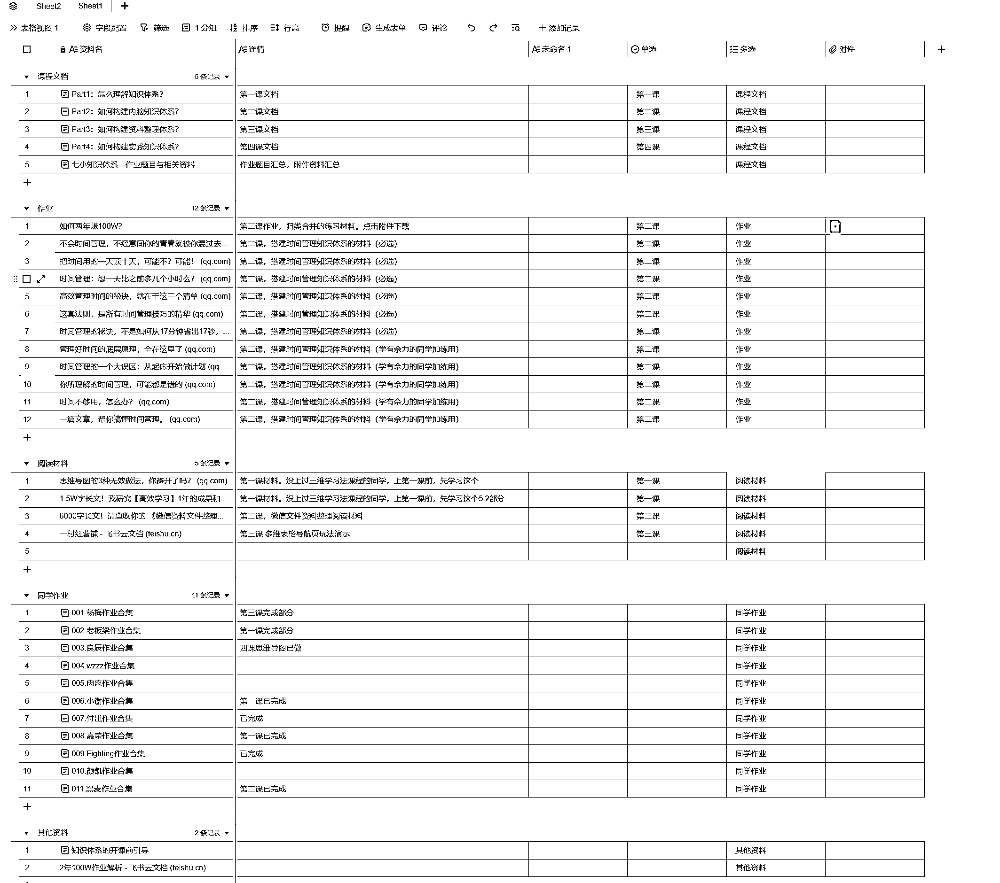

# 方法四：使用多维表格 @七小

1）多维表格怎么创建

多维表格有两种创建方式，

•直接创建多维表格

•先创建普通电子表格，在普通电子表格里创建多维表格

这种表格的好处是，你可以在一个电子表格里，创建多个 sheet，来创建多个多维表格（可以写不同内容）。

比如你可以：公司的资料单独一份表，自己的学习资料单独一份，自己的输出资料单独一份...

第一种直接创建多维表格则不行，直接创建的话只能写一份内容。

所以要进行个人资料管理，所有资料都放到一起，我们推荐第二种做法。如果是要给别人看的，就是用来专门管理某件事情的资料的，那么就用第一种创建方法。

要进行个人资料管理，所有资料都放到一起，我们推荐第二种做法。

如果是要给别人看的，就是用来专门管理某件事情的资料的，那么就用第一种创建方法。

2）飞书多维表格功能介绍

做资料管理，我们主要会用到以下功能：

•多行文本：标题，文档简介，备注，会用到这个部分

•多选：用于打标签使用，建议把文档里的重要关键词，以及时间、地点、相关人写在上面，方便以后检索•多维表格里有【筛选】功能，筛选标签，就可以调取出有该标签的所有资料了，可以筛选多个标签

•单选：用于表格信息大类分组使用，可以自上而下，选用人生书架规则来做；或是自下而上，把资料归类分组，提取出一个概括词。•如果使用多选标签就可以很方便的找到资料，就可以不使用该部分

•超链接：用于在文档中添加网址使用， 多行文本里也能直接复制链接，所以该部分可自愿使用

•附件：用于存放图片、视频、word/ppt/excel 等文件，建议存放小文件为主，上百 M 的文件建议网盘，可以复制网盘的链接到表格中

•时间：可以写上这份资料创建或者录入的时间，根据自己习惯使用即可

•效果展示

资料管理表：

训练营目录页：

3）适用情况与注意事项

适用情况：

•适合放资料合集，比如我们课程的导航页，以及参加其他社群、训练营的资料合集

•适合不容易归类的资料，可以先把资料链接放到表格里，打上标签，把资料位置挪到【杂物堆】的文件夹，然后就可以从表格里来找资料

•适合整理比较乱的文件夹，如果一个电子笔记里的资料，主题资料偏多，已经乱七八糟，与其把这些资料分别挪到对应的文件夹里，不如把这些资料用表格打标签来整理，以后就只从表格打开它，而不打开文件夹。

•如果你觉得电子笔记自带的文件夹不好用，没法满足自己的需求，就可以创建多维表格来当目录。（比如飞书云文档的文件夹就不好用，很传统；知识库的页面树就很好用）

强调：

做资料整理是以快速调用为目的，对资料进行分类、标签、编码、命名、搜索的处理，使之从无序状态，转变为相对有序，或者说乱中有序的状态。

注意，乱中有序，而非完全有序！

资料完全无序，调用效率极低；

资料完全有序，比如把所有资料全部都归档到表格里，或是文件夹非常整齐有序，没有未归类的文档，那整理的成本就非常高

做到乱中有序即可， 分类、标签、编号命名搜索 混用，哪个好用用哪个，这才是效率最高，成本最低的整理方法。

内容来源：《资料管理的整理规则与工具》

