# 方法五：使用思维导图 @熊孩子不差

1）XMind 是什么

Xmind 就是一个画思维导图的工具，普及度高、功能强大，国内大部分思维导图产品功能都是由它延伸的。

包含逻辑图、组织结构图、时间轴、鱼骨图、树形图、表格图等 10 种思维结构，在一张导图中可以灵活使用多种结构，这是它最大亮点

官网：[`xmind.cn/`](https://xmind.cn/)

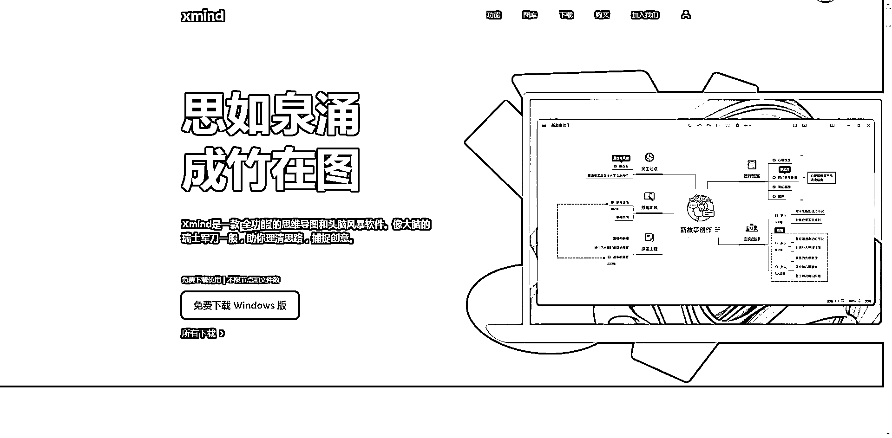

2）Xmind 特点

Xmind 含有丰富的思维结构，思维结构之间可以灵活搭配，不管是哪种使用场景都能快速找到适合的结构，抛弃了单一传统导图的无趣，让每一个想法都清晰可见，也让我们更愿意思考。

Xmind 做完导图后可以一键切换进入演讲者模式，搭配好看的转场动画和实用布局，体验沉浸式演讲；

Xmind 丰富的线条和贴纸，我们可以在重点地方用不同的记号重点标出，让阅读者快速抓住并记忆重点内容；

Xmind 用智能配色方案，帮助我们花更少的时间做更好的配色；

Xmind 可支持导出 PNG、EXCEL、WORD、PDF 等格式。

初期刚使用可以不用充值会员，现在软件越做越好，免费版本足够用了

3）XMind 功能介绍

① 官网下载好软件，打开软件后，就会看到这样的界面。

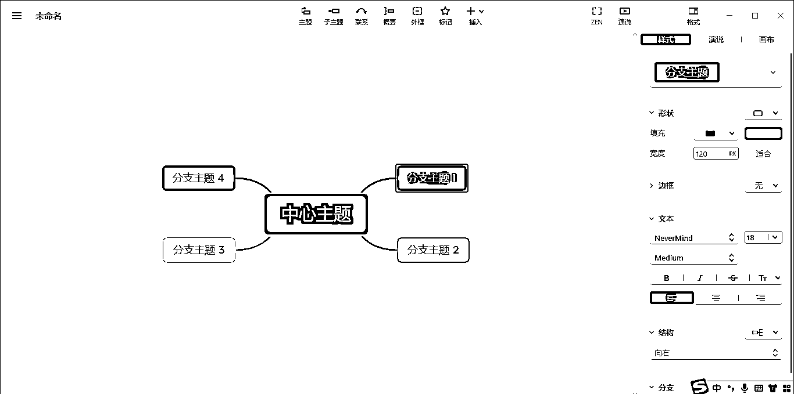

② 进去界面后，要开始对一些基本的操作按键进行了解

•左上角的三横线，是操作一些基础功能的重要区域

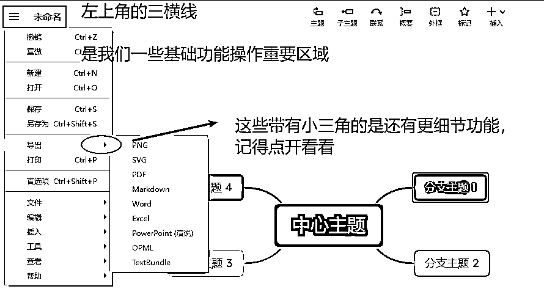

•顶部有些重要功能的快捷操作

•右侧主要是美化版式，美化颜色、字体的地方

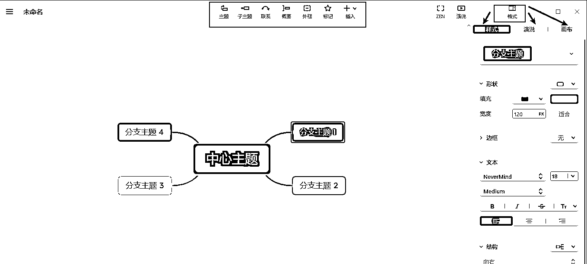

•快捷键•常用的快捷键分享

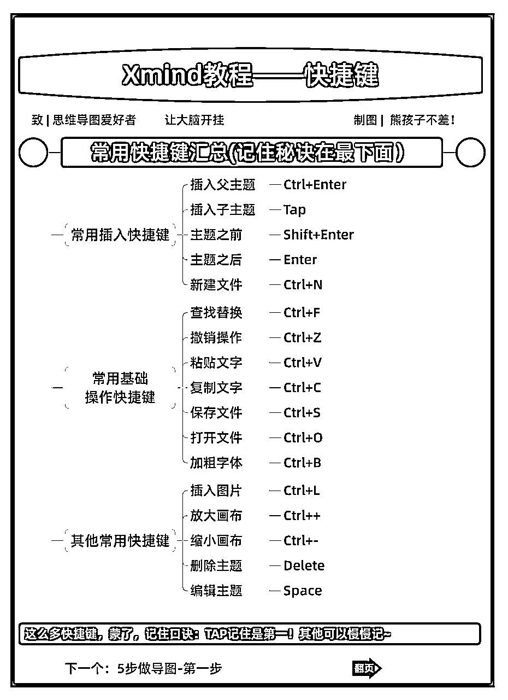

这么多快捷键，记住口诀：Tab 记住是第一！其他可以慢慢记，给谁增加子主题，就选中谁，再按 Tab 键

4）XMind 操作步骤

① 建-新建主题

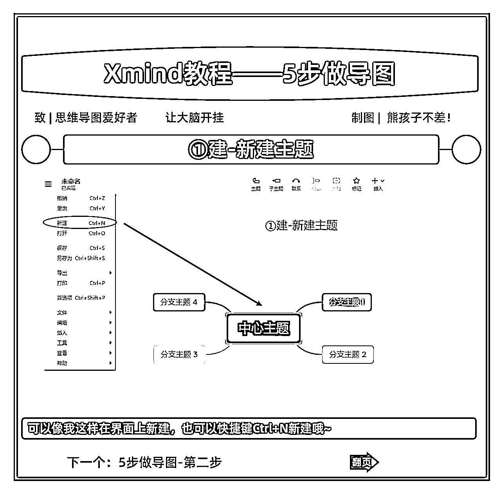

② 调-调整结构

从 9 大结构中选择喜欢的结构

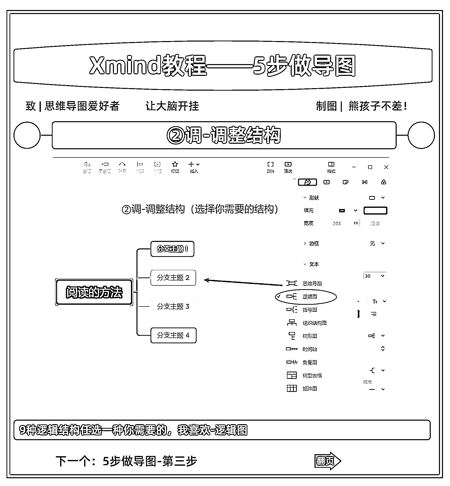

③ 炼-提炼关键词和关键要素

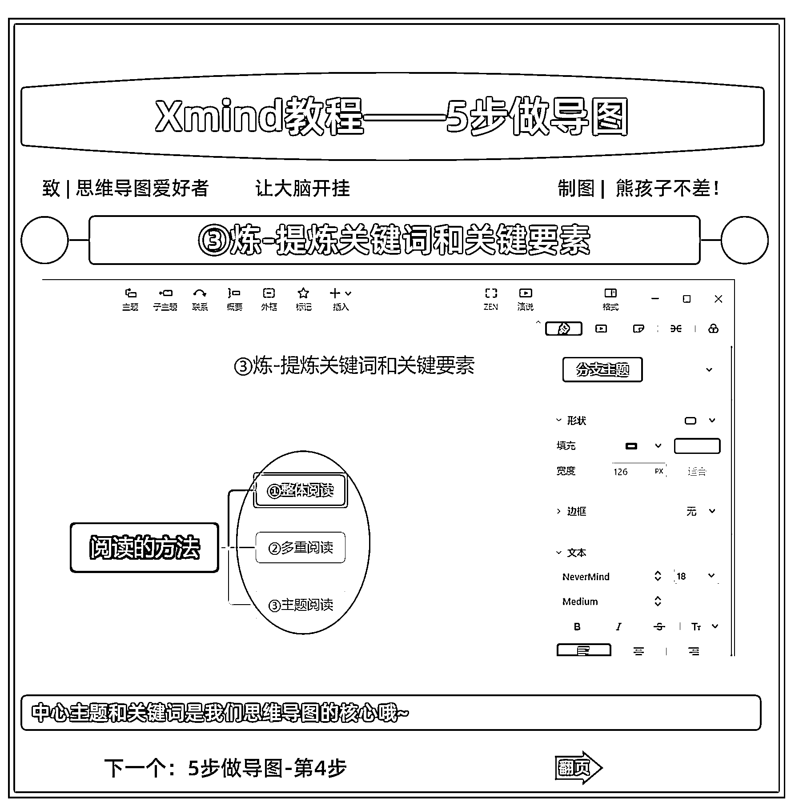

④ 增-新增子主题和具体内容

Tab 键增加子主题以及完善子主题里面的具体内容

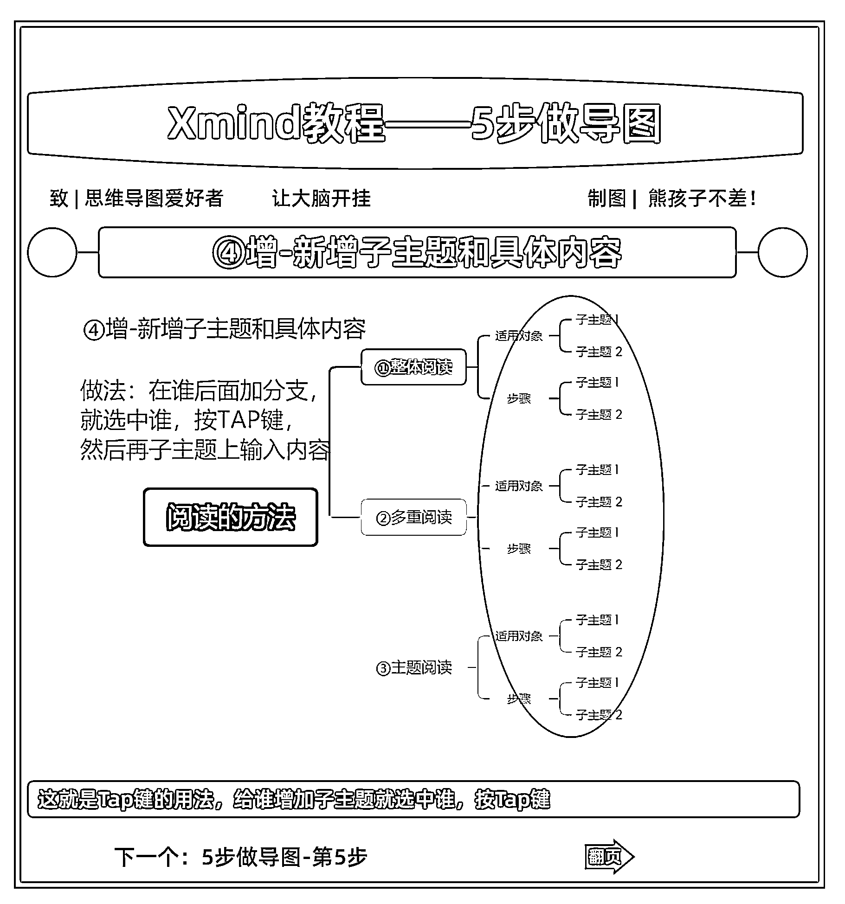

⑤ 美-美化导图

配色、文字、字号等美化

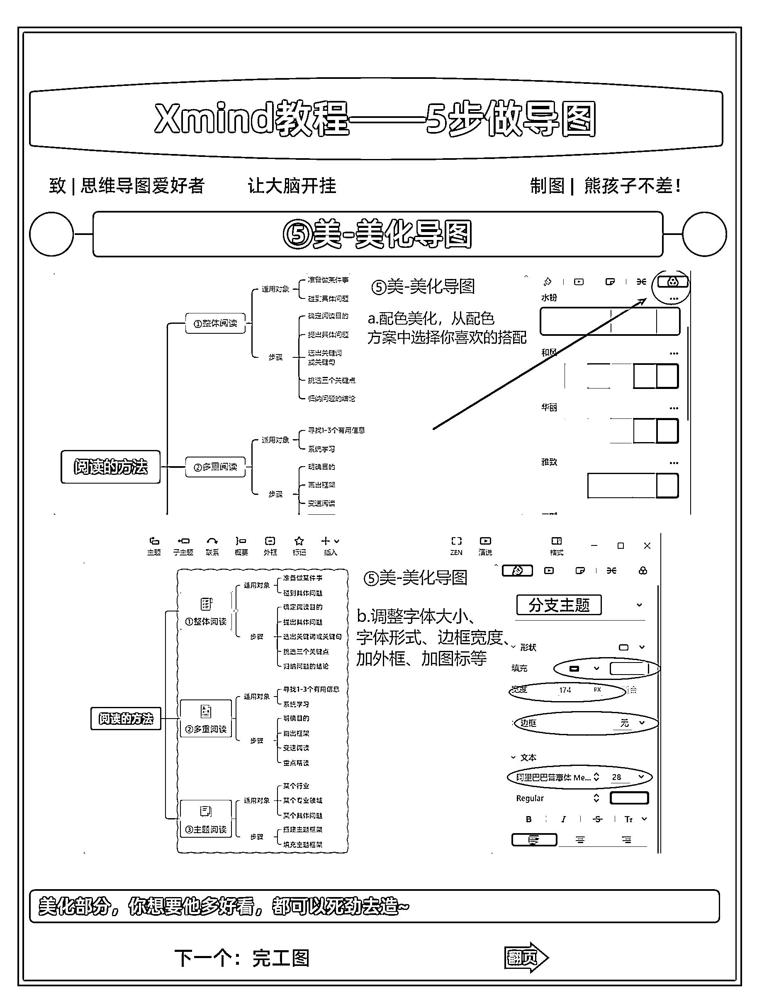

完整案例图：

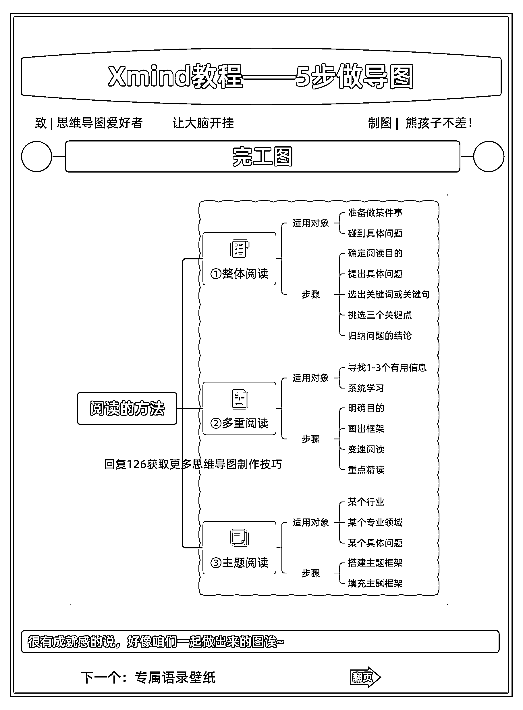

内容来源：《如何用 XMind 助力资料整理并打造第二职业曲线？》

