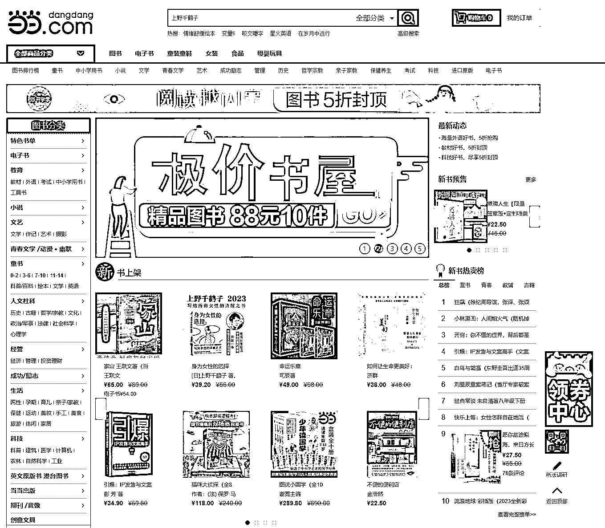
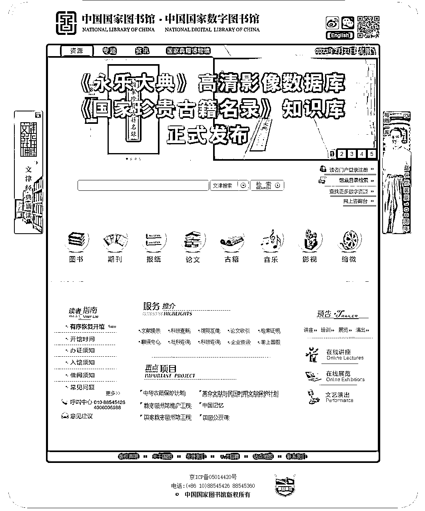

# 渠道一：专业教材书籍

要想快速构建出一个领域的知识和资料体系，最高效快捷的方法，是阅读相关的专业教材和书籍。因为这些内容已经是被高度结构化整理的成果，几乎每一本书，就是一个领域的知识体系。

想要实体书资料的话，可以通过京东、当当、淘宝、闲鱼、八爪鱼二手书、孔夫子二手书等 APP 或小程序购买；也可以前往线下图书馆阅读。

想要电子书资料的话，可以通过微信读书官网（地址：[`weread.qq.com/`](https://weread.qq.com/) ）或者客户端学习；也可以前往线上图书馆网站学习（如中国国家图书馆：[`www.nlc.cn/`](http://www.nlc.cn/) ）。

现在大部分资料都数字化了，检索起来还是比较方便的。要是想查找的资料比较珍贵和稀少，网上都没有找到相关资料的话，可能得去线下比较大的图书馆才能获取。