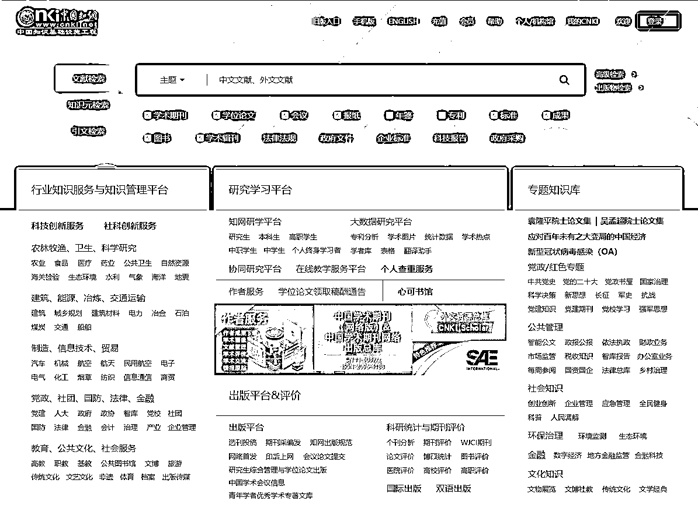
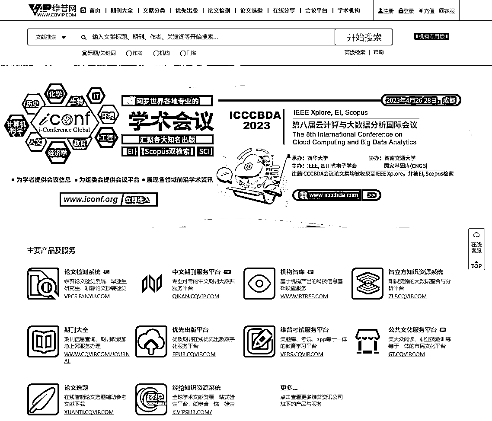

# 渠道二：专业学术研究

无论教材还是书籍，因为高度结构化，所以很多内容可能比较早期，缺少一些最新的研究和数据。这个时候，我们就可以通过阅读专业学术期刊、杂志、论文、报告等，获取相关领域最新的学术成果。

这里给大家推荐几个渠道，算是国内比较常用的学术资料获取平台：

•中国知网：[`www.cnki.net/`](https://www.cnki.net/)•维普网：[`www.cqvip.com/`](http://www.cqvip.com/)•万方数据知识服务平台：www.wanfangdata.com.cn/index.html•百度学术：[`xueshu.baidu.com/`](https://xueshu.baidu.com/)•全国图书馆参考咨询联盟：[`www.ucdrs.superlib.net/`](http://www.ucdrs.superlib.net/)•超星发现：[`chaoxing.com`](http://chaoxing.com/)

