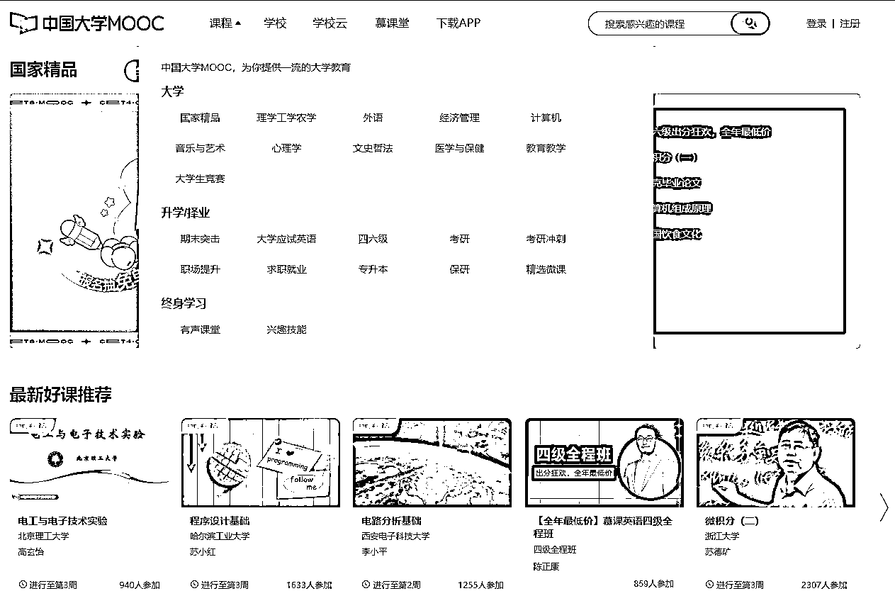
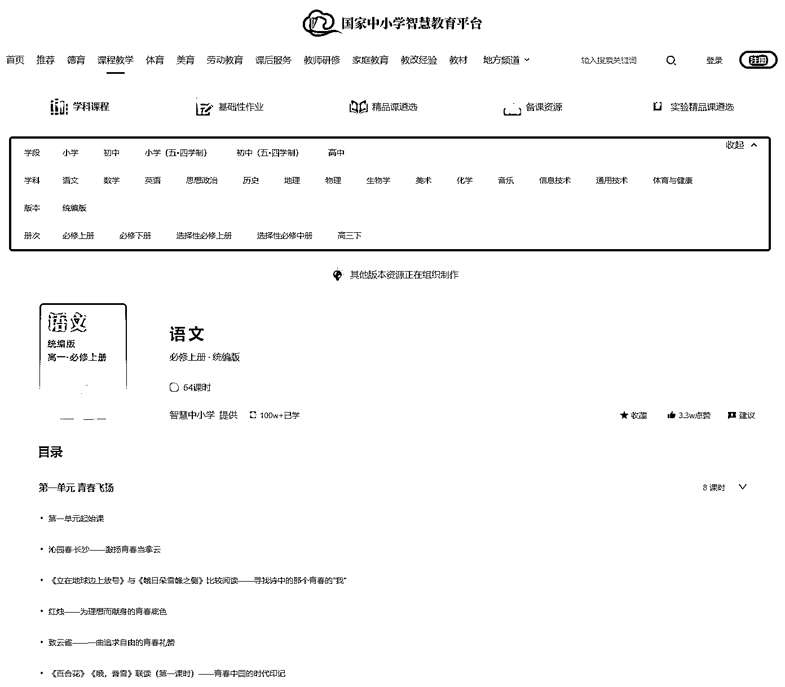
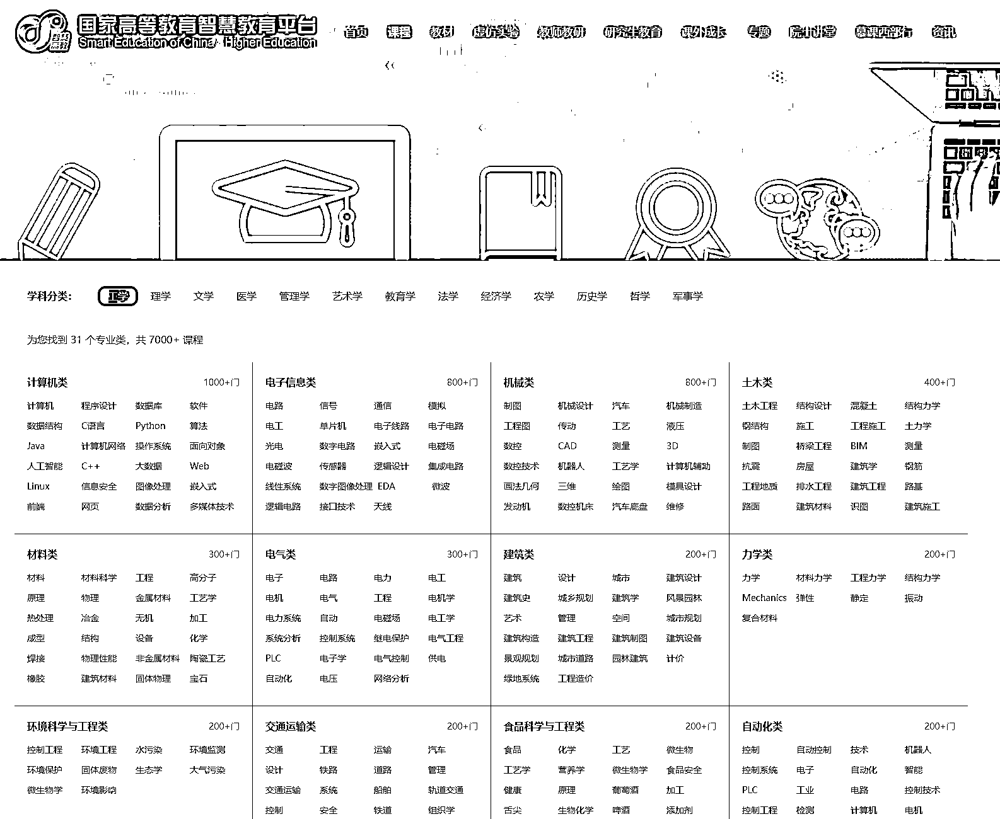

# 渠道三：专业课程平台

很早的时候，我在想一个问题，为什么明明有教材了，还需要有老师和学校呢？

后来才知道，读书这件事并非适用于每个人，可能有的人更喜欢音视频类的学习方式，也有的人光靠看书是学不懂的，需要有人解读和答疑。这个时候，老师和课程就起到了重要的作用。

这里我也给大家推荐一些比较好的课程学习渠道，包括了 K12 科目学习、高校专业学习，以及各种商科和跨学科学习：

•慕课网：[`www.icourse163.org/`](https://www.icourse163.org/)•学堂在线：[`www.xuetangx.com/`](https://www.xuetangx.com/)•网易公开课：[`open.163.com/`](https://open.163.com/)•国家智慧教育公共服务平台：[`www.smartedu.cn/`](https://www.smartedu.cn/)

