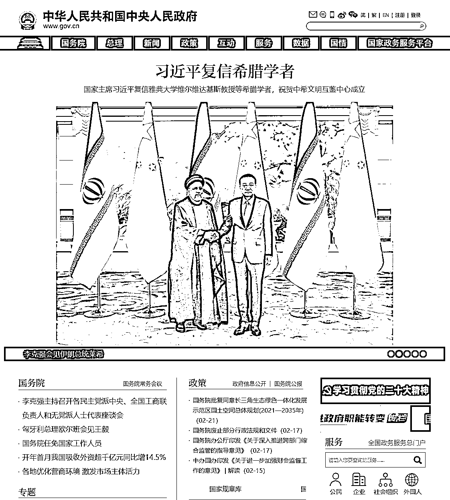
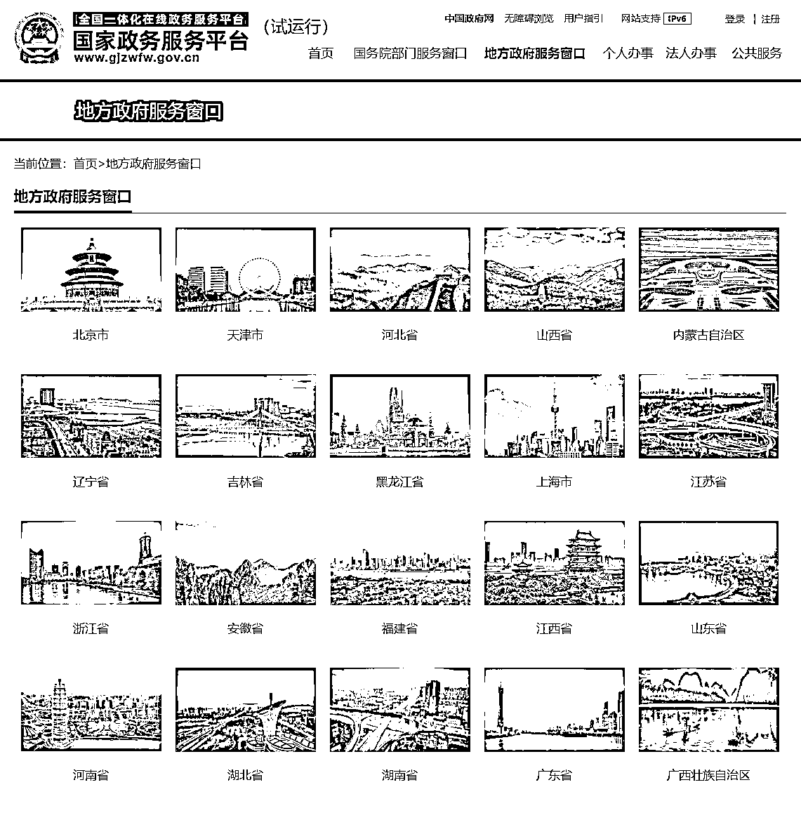

# 渠道四：国家政策法规

在构建决策资料库的时候，需要查找比较和国家地方政府相关的会议、新闻、政策、文件、报告、规定，这里我也给大家推荐一些权威的渠道。

1）国家级资料

•中国共产党（中共中央）：[`cpc.people.com.cn/`](http://cpc.people.com.cn/)•中华人民共和国中央人民政府（国务院）：[`www.gov.cn/`](http://www.gov.cn/)•全国人民代表大会（全国人大）：[`www.npc.gov.cn/`](http://www.npc.gov.cn/)•中国人民政治协商会议全国委员会（全国政协）：[`www.cppcc.gov.cn/`](http://www.cppcc.gov.cn/)•中华人民共和国国防部（中央军委）：[`www.mod.gov.cn/`](http://www.mod.gov.cn/)•中华人民共和国最高人民法院（最高法）：[`www.court.gov.cn/`](http://www.court.gov.cn/)•中华人民共和国最高人民检察院（最高检）：[`www.spp.gov.cn/`](https://www.spp.gov.cn/)

2）地方性资料

•地方政府服务窗口：[`gjzwfw.www.gov.cn/col/col486/index.html`](http://gjzwfw.www.gov.cn/col/col486/index.html)

