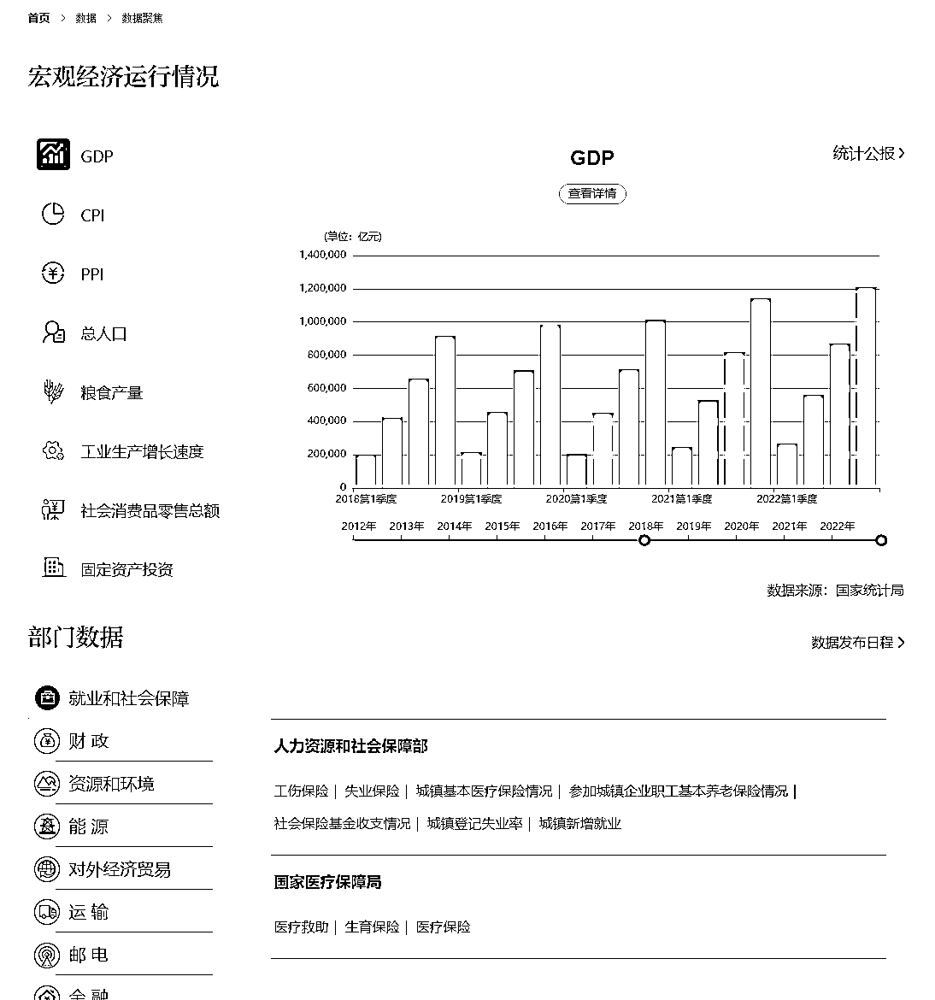
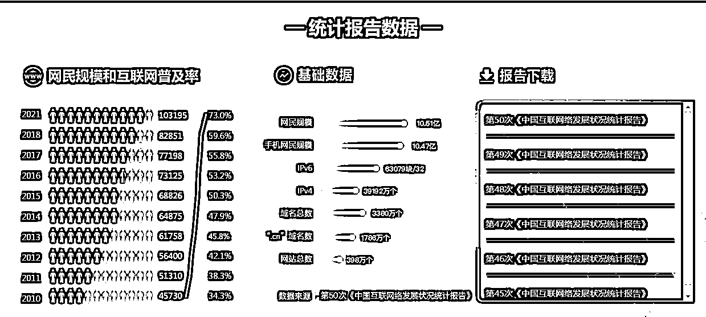
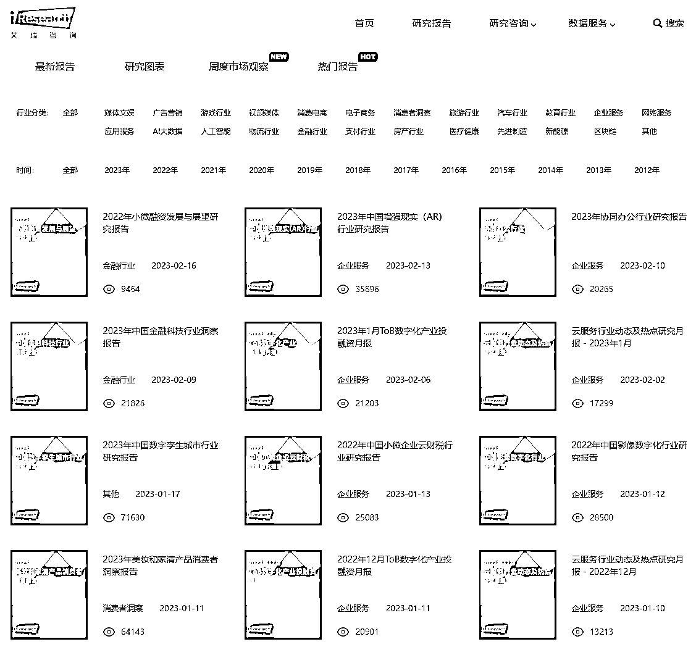
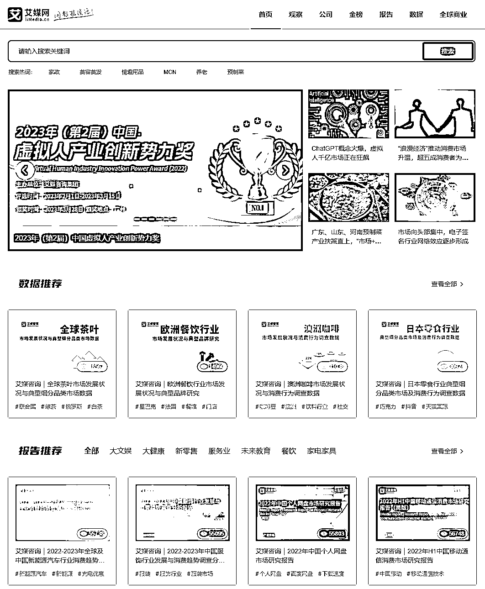
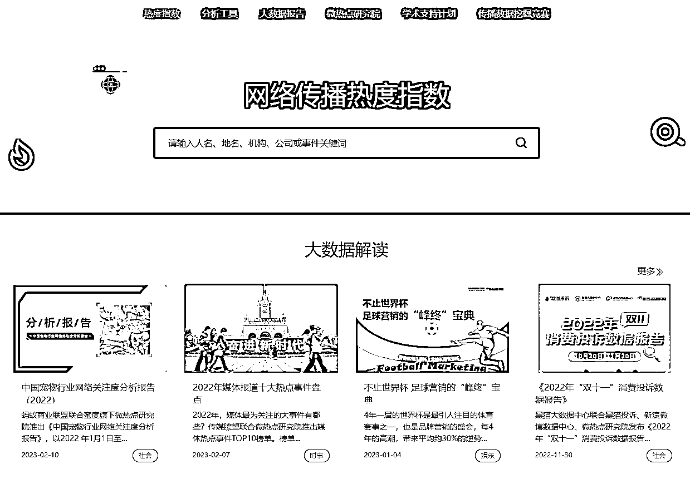

# 渠道五：权威数据平台

在构建决策资料库的时候，也需要用到很多和国家、行业、平台相关的数据资料，这里也给大家推荐一些权威渠道。

1）国家级数据

•国务院-宏观经济运行情况： [`www.gov.cn/shuju/chaxun/index.htm`](http://www.gov.cn/shuju/chaxun/index.htm)•国家统计局：[`www.stats.gov.cn/`](http://www.stats.gov.cn/)•中国互联网络信息中心：[`www.cnnic.net.cn/`](http://www.cnnic.net.cn/)

2）行业 / 平台级数据

•艾瑞数据 ：[`data.iresearch.com.cn/`](http://data.iresearch.com.cn/)•易观智库：[`www.analysys.cn/`](http://www.analysys.cn/)•极光大数据：[`www.jiguang.cn/`](https://www.jiguang.cn/)•艾媒网 ：[`www.iimedia.cn/`](http://www.iimedia.cn/)•360 营销学院 ：[`yingxiao.360.cn/`](http://yingxiao.360.cn/)•199it : [`www.199it.com/`](http://www.199it.com/)•36kr: [`36kr.com/`](http://36kr.com/)•TalkingData（移动观象台）：[`www.talkingdata.com/`](http://www.talkingdata.com/)•Questmobile : [`www.questmobile.com.cn/`](http://www.questmobile.com.cn/)•ASO100（七麦数据）：[`www.qimai.cn/`](https://www.qimai.cn/)•App Annie : [`www.appannie.com/cn/`](https://www.appannie.com/cn/)•网站流量全球综合排名：[`www.alexa.cn/`](http://www.alexa.cn/)•微博微指数：[`data.weibo.com/index`](http://data.weibo.com/index)（微博动态）•新浪微舆情：[`wyq.sina.com/login.shtml`](http://wyq.sina.com/login.shtml)•百度指数：[`index.baidu.com/`](https://index.baidu.com/)•阿里数据：[`dt.alibaba.com/alizs.htm`](https://dt.alibaba.com/alizs.htm)•林克舆情分析：[`yq.linkip.cn/user/login.do`](http://yq.linkip.cn/user/login.do)

