# 平台一：公众号文章采集

1、公众号文章批量搜集-免费版

下载地址：[`pan.baidu.com/s/1D8dcntsBgxMaNTbOWPcuBg?pwd=kjtr`](https://pan.baidu.com/s/1D8dcntsBgxMaNTbOWPcuBg?pwd=kjtr)

这款工具在 2020 年已停止更新，是市面上仅存的一款免费工具

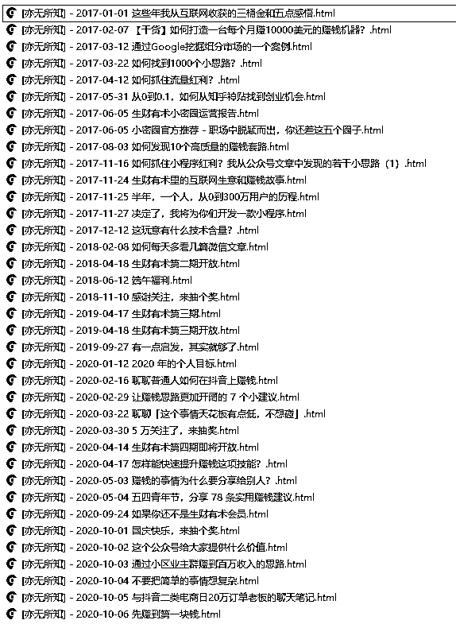

1）注意点

•使用此工具，需要微信客户端的版本为 2.8.0。此公众号下载工具不支持最新的微信客户端，使用本工具需要卸载已经安装好的微信客户端，然后安装安装包中配套的微信客户端版本。

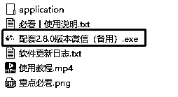

备注：wetool 破解的版本（授权码在某宝上几十块左右）均限制微信客户端 2.8.0 版本

•使用 2.8.0 的低版本微信过程中，可能出现低版本无法登陆的情况，然后使用低版本修复器来解决即可

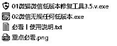

2）配置及使用

•使用前，建议先看下视频教程

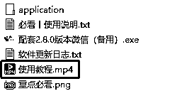

•运行程序

运行 application/WechatDownload.exe，会自动打开浏览器跳转到 [`i.ijrou.com/`](http://i.ijrou.com/) 的页面，是因为工具很久没维护了，工具内嵌的一个广告异常页面，直接关掉即可。

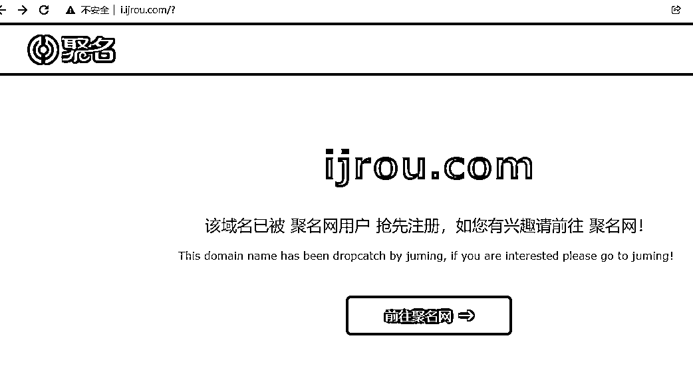

3）配置软件

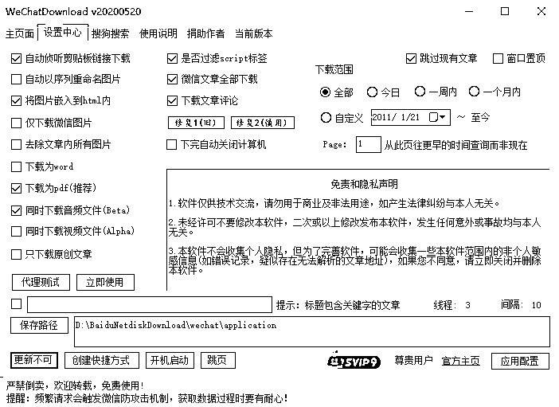

•勾选“跳过现有文章”可以避免重复下载。

•勾选“侦听剪贴板链接下载”我们复制微信文章链接，就自动下载。

•设置好“保存路径”即下载的文章保存在哪里（软件默认采用的我本机的目录地址，需要重新设置下）。

•其他设置，根据自身需求来选择。

4）下载文章

在微信客户端，公众号里选择需要下载的目标公众号，比如我这里选择“点金乔帮主”，

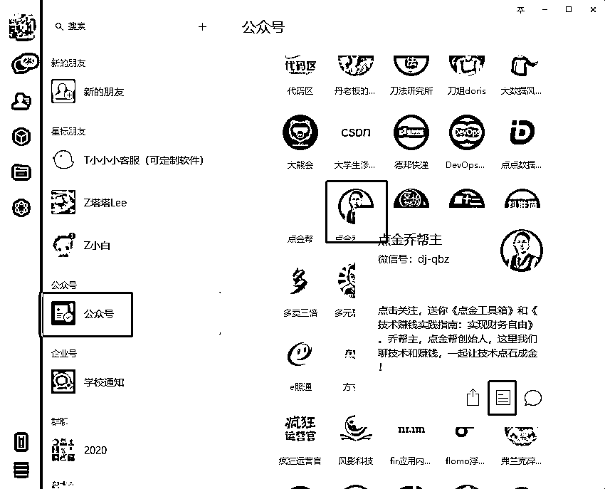

然后点“查看历史记录”，进入公众号的历史页面，

这时候工具自动获得了历史下载页面，会开启自动下载模式：

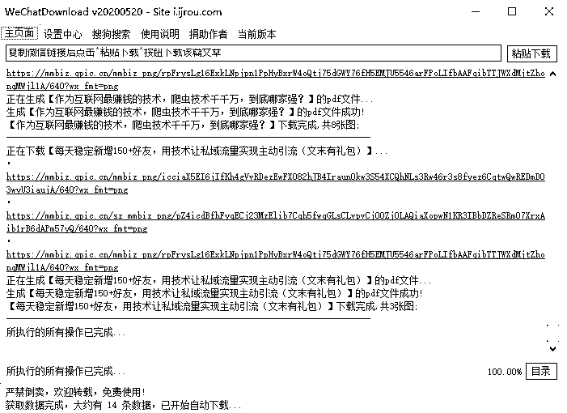

下载完成，可以去下载目录确认下载的内容明细：

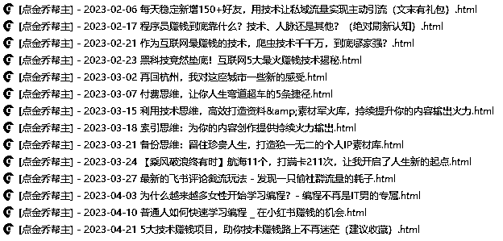

注意：每个微信号一天能下载 1000-2000 篇文章就会触发微信风控（提示操作频繁），想下载更多内容，可以用多个微信换着登录下载。或者把时间线拉长，今天提示操作频繁了，明天再来继续下载即可。

5）缺点说明

•只能使用老的 2.8.0 版本微信

•不支持获取文章阅读数、在看数、评论数

2、公众号文章批量搜集-付费版

下载地址： [`pan.baidu.com/s/1AUOpoeCuYlBKnQu_cqQBhA?pwd=nfie`](https://pan.baidu.com/s/1AUOpoeCuYlBKnQu_cqQBhA?pwd=nfie)

相对于免费版，付费版的功能更加强大及好用，付费版也没有免费版的相关缺点。

付费版费用是年卡会员 49.9，永久会员卡 299.9，阅读数/在看数/评论数的下载是在会员费基础上按次收费（1000 篇文章 25 元），根据自身需要，自行购买

1）配置及使用

软件更新：最新的版本是 2023 年 4 月 1 日更新的 1.6.5 版本，运行主程序后，更新到最新的版本即可。

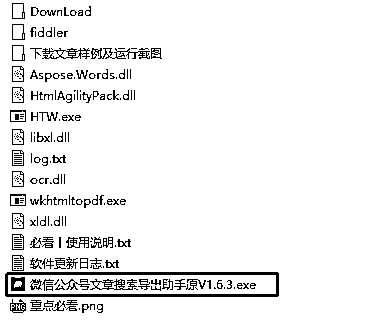

2）核心功能简介

进入到软件主页面后，点击头像位置用微信进行登录，然后软件主要三个核心功能：

文章搜索（针对公众号全网搜索）、号内采集（针对某个公众号采集）、本地搜索（针对已下载的内容搜索和导出）

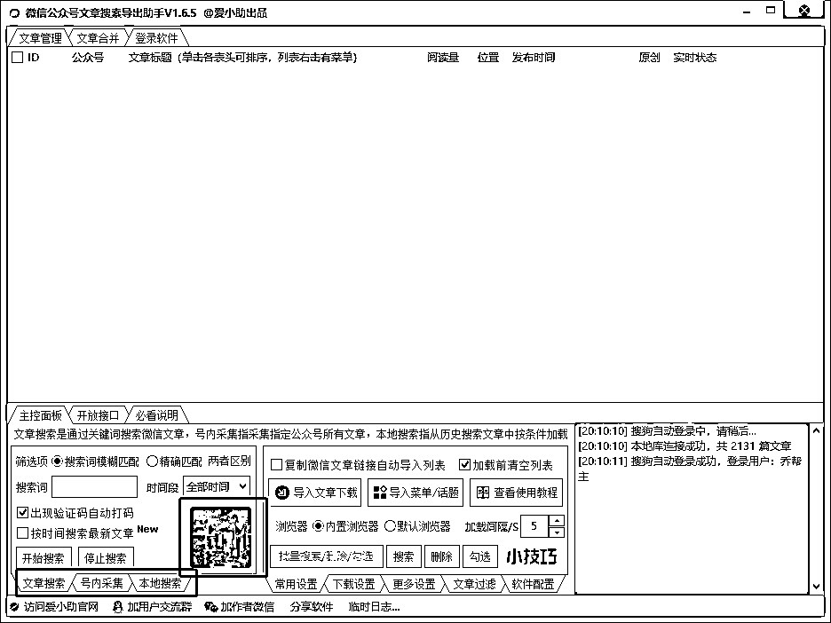

3）针对某个公众号的采集配置

路径：号内采集 > 获取历史文章链接 > 复制你需求采集的公众号中任意一篇文章链接到下发编辑框 > 复制成功后，粘贴发给任意好友打开链接 > 开始采集

（更多配置的明细，可以直接点击软件界面上“务必点我查看自动抓取教程”）

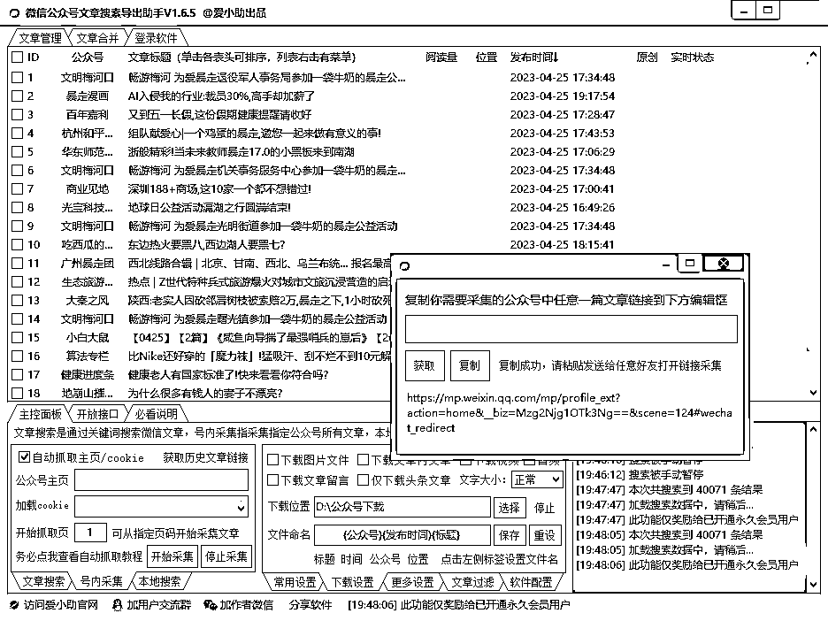

等待采集完成：

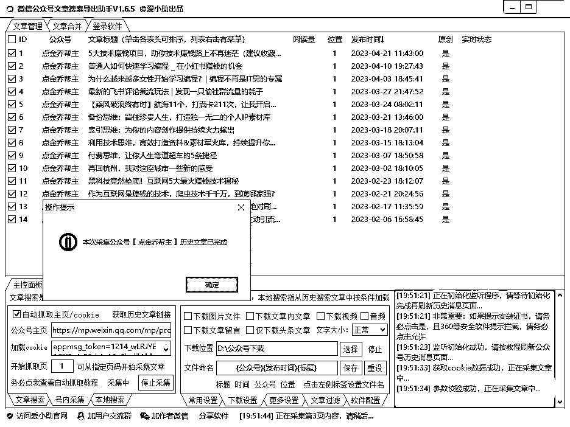

勾选需要导出的文章，导出的内容格式可以自行选择。

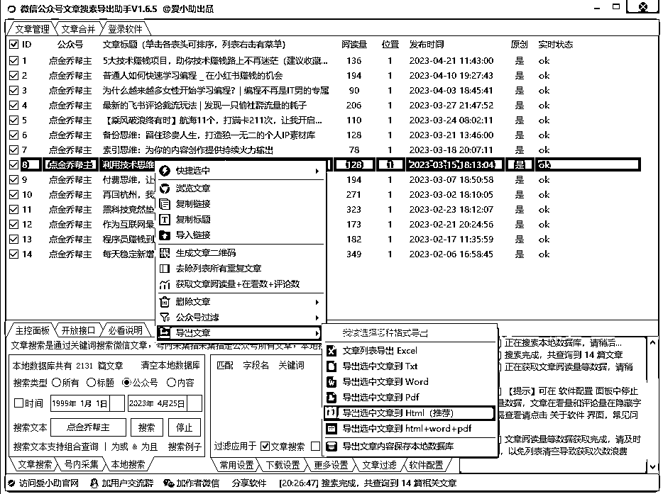

4）获取文章阅读数量+在看数+评论数

软件调取的第三方的付费接口，这功能在会员费的基础上需要单独付费，1000 篇文章的获取，需要 25 元

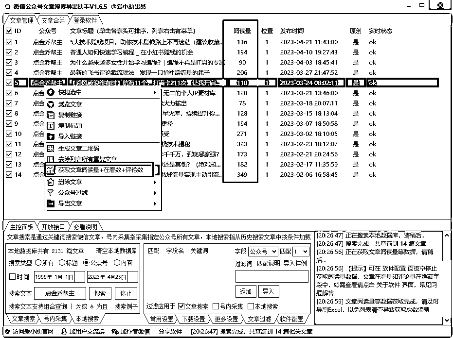

文章列表导出 Excel，可以清晰的看出每篇文章的阅读数、评论数、在看数，对于分析同行公众号运营数据具有一定的参考价值。

