# 平台二：抖音短视频采集

下载地址：[`pan.baidu.com/s/1l8XVonD7ebLN8bIVCTD7MQ?pwd=2fd7`](https://pan.baidu.com/s/1l8XVonD7ebLN8bIVCTD7MQ?pwd=2fd7)

使用前须知：使用工具前，需要把下载的主页链接，或者单个视频的链接地址找到，再复制进工具中批量下载

1）主页链接提取

【电脑端】复制主页链接

浏览器进入 https://www.douyin.com/抖音官网，然后搜索找到目标账号（这里以“点金乔帮主”为例，为了写本文教程，还特意在抖音拍了几个视频）进入其主页：

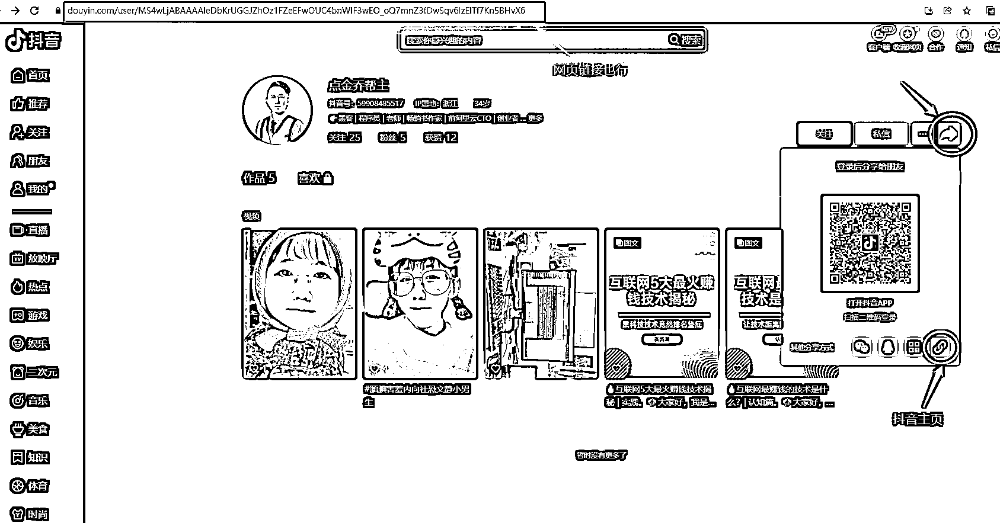

【手机端】复制主页链接

手机进入抖音 APP，然后搜索找到目标账号进入其主页：

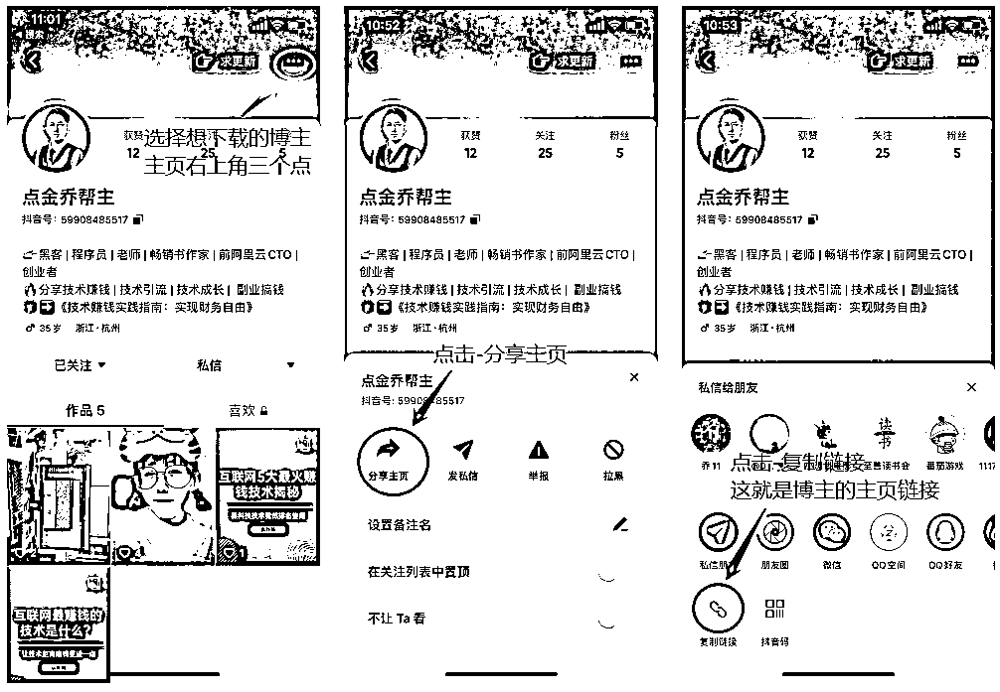

2、主页视频提取

【电脑端】复制视频链接

浏览器进入 https://www.douyin.com/抖音官网，然后搜索找到目标账号进入其主页，然后再进入想下载的单个视频的详情页：

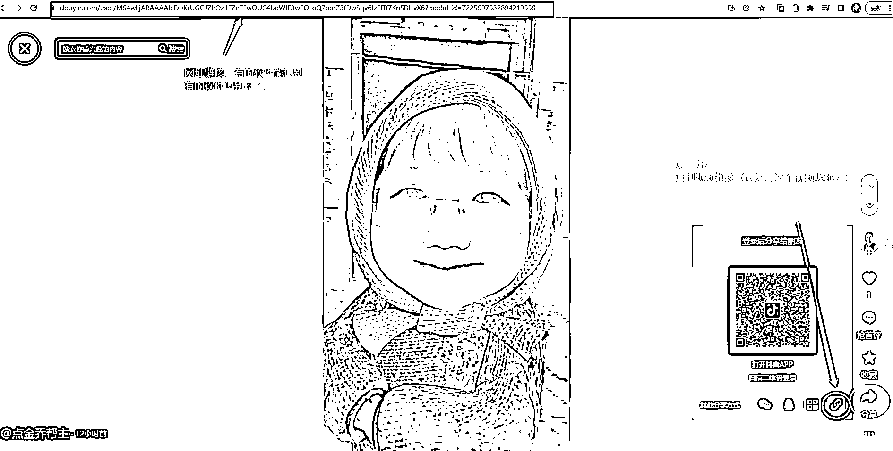

【手机端】复制视频链接

手机进入抖音 APP，然后搜索找到目标账号进入其主页，然后再进入想下载的单个视频的详情页：

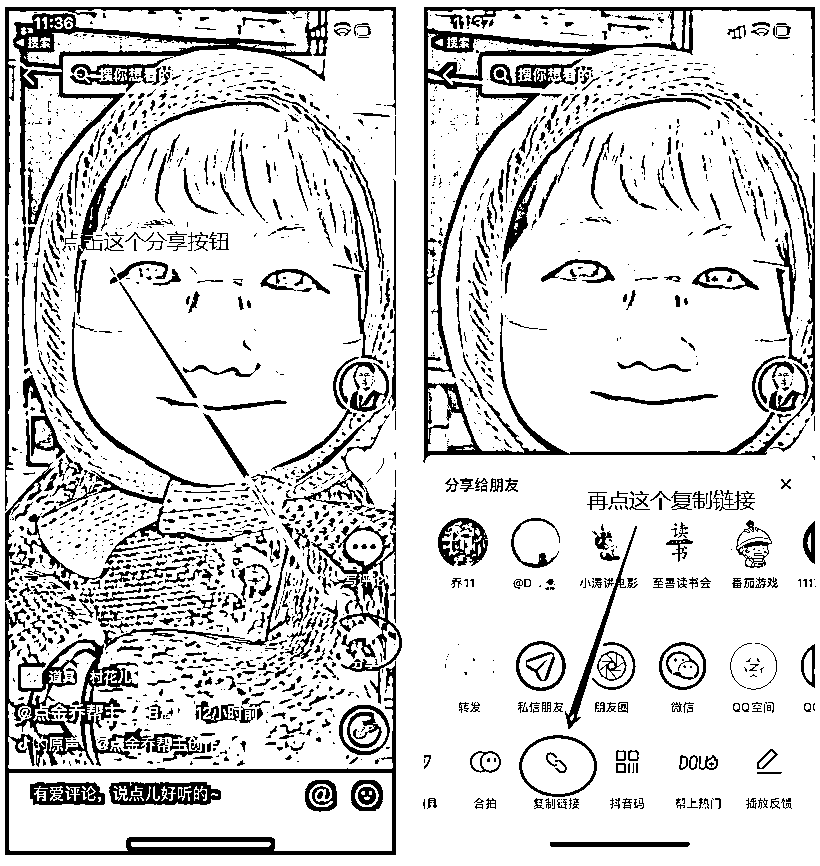

3、账号主页批量下载

路径：抖音批量采集+直播录制二合一神器（不要更新） > 抖音工具 _x64_20230322.exe

该免费版软件主要支持某账号主页视频的批量下载，不支持单个视频下载，并且支持直播录制的功能。

注意：运行后跳出来软件更新的提升，忽悠掉，不要更新。

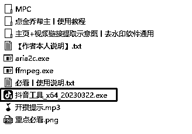

1）配置账号主页采集

获取账号主页链接，然后进入项目管理

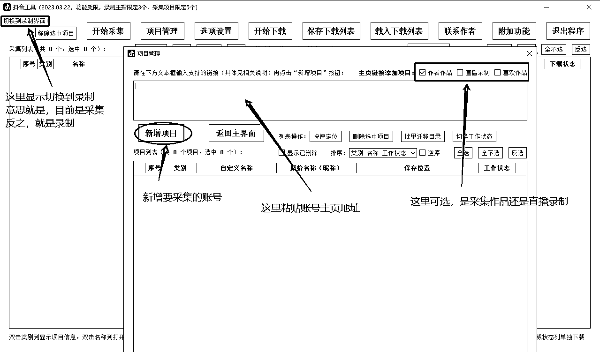

在粘贴主页链接，点击新增项目

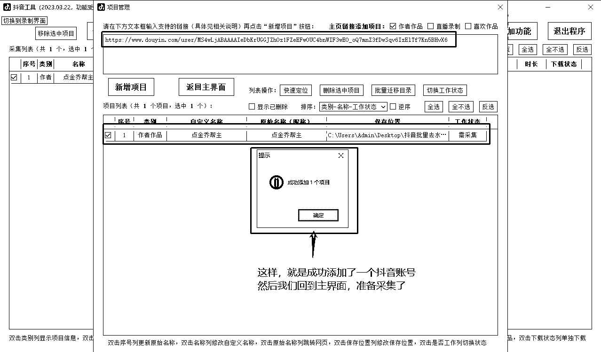

2）开始采集

勾选要采集的项目，点击开始采集

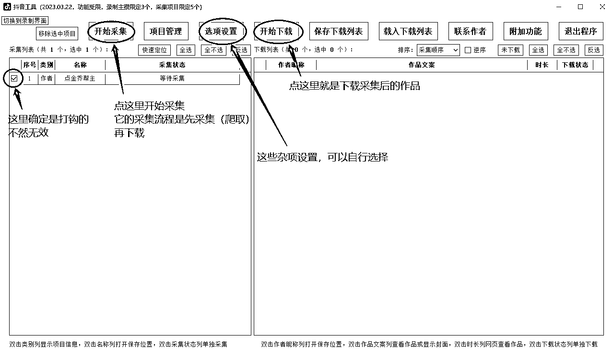

在实操过程中，要采集的目标账号的视频量会很大，所以这里需要花费一定的时间

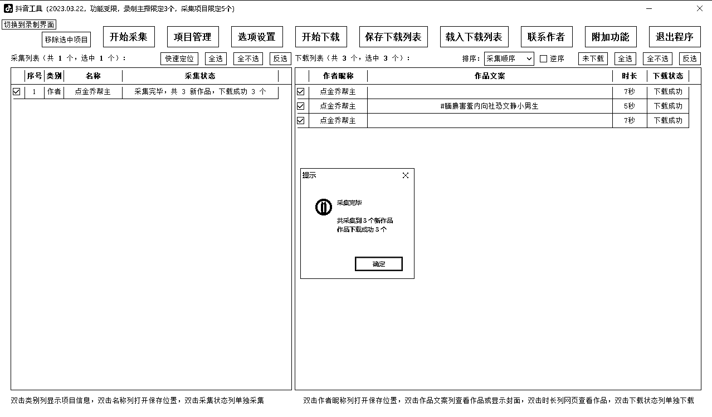

一定要留意软件界面下面的功能文字提醒（这些是作者的功能彩蛋和重要提示）

•双击「类别」列显示项目信息

•双击「名称」列打开保存位置

•双击「采集状态」列单独采集

•双击「作者昵称」列打开保存位置

•双击「作品文案」列查看作品或显示封面

•双击「时长」列网页查看作品

•双击「下载状态」列单独下载

采集完成后，会在主目录默认生成一个作品列表，里面有非常详细的作品信息

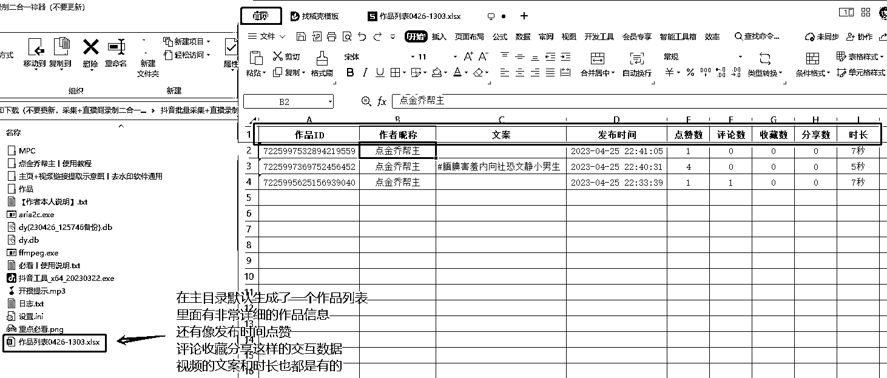

4、单个视频下载

操作简单，只可以下载单独视频，支持网址链接地址

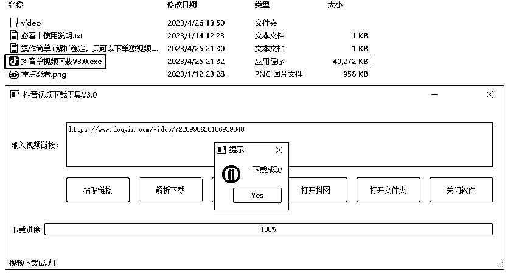

5、单个视频批量下载

•运行程序：抖音无水印解析（可批量但不支持主页）> 抖音无水印直链解析下载。exe

•设置好视频保存目录

•复制视频下载链接地址，点击“开始解析”

•勾选选中要下载的视频，点击“下载选中”开始下载

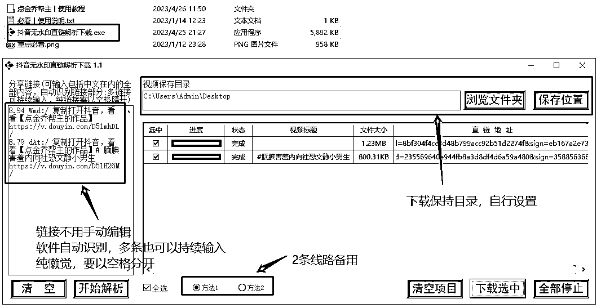

6、短视频文案提取

地址：http://cs.pdfwx.com/

在线的提取文案的付费工具（年费是 99，半年是 58）

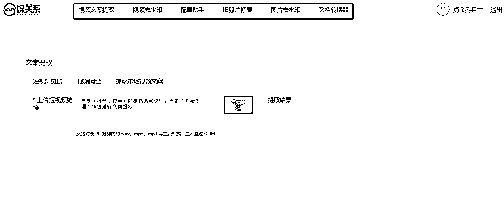

除了视频文案提取外，还有视频去水印、配音助手、旧照片修复、图片去水印、文档转换器等功能，根据自身需求选择。

如果提取多个视频，在浏览器中用多个页面打开以上链接地址，来同时批量提取即可。

