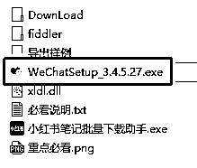
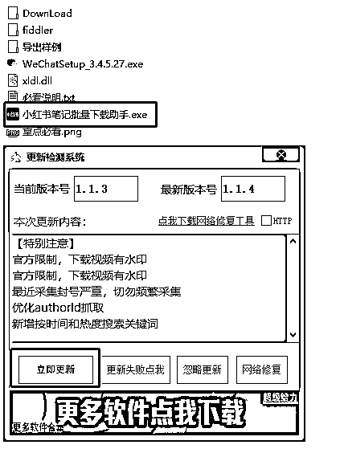
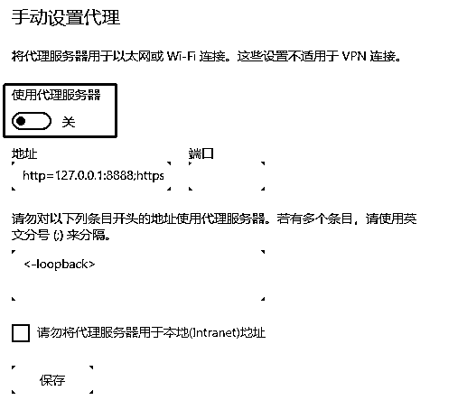
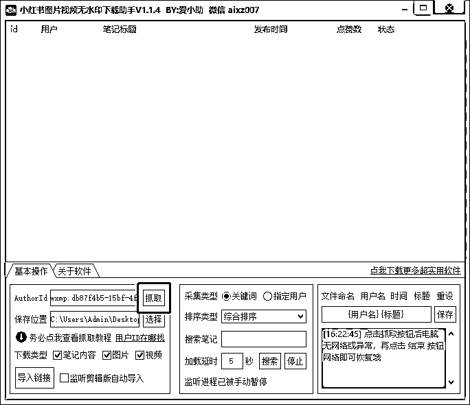
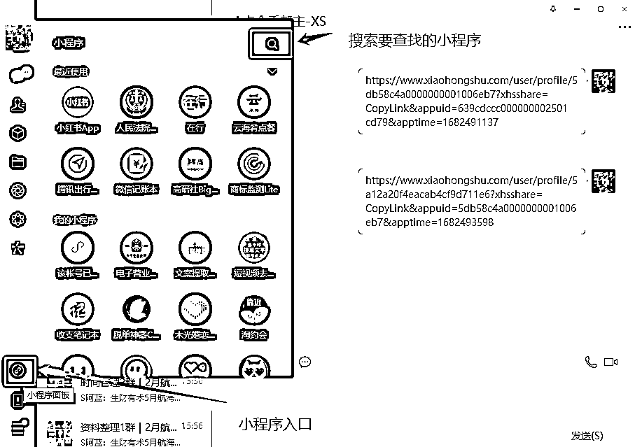
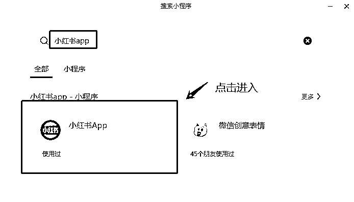
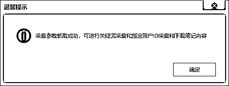
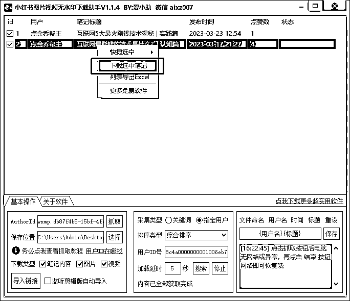
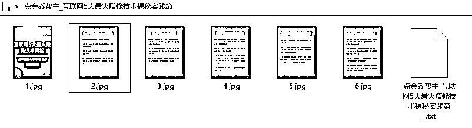
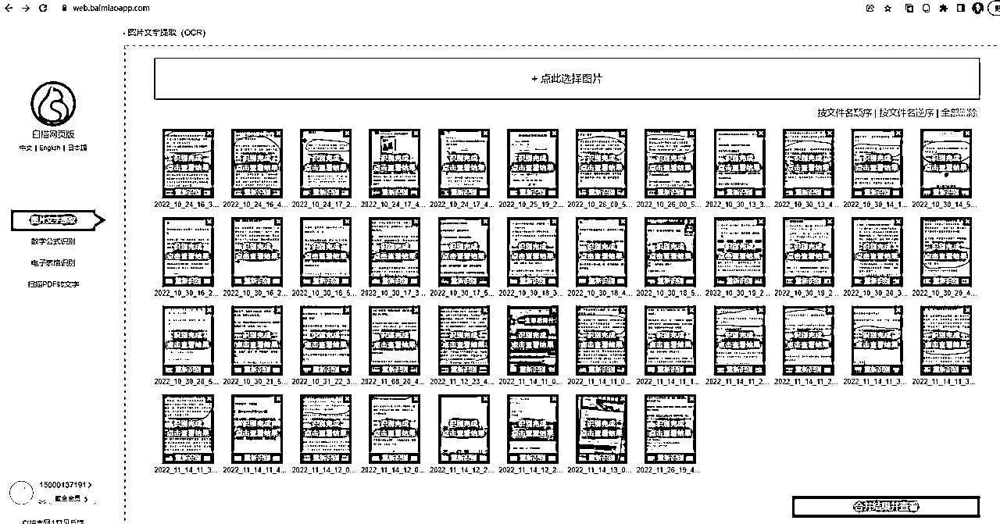

# 平台三：小红书内容采集

下载地址： [`pan.baidu.com/s/16SuOCxzf9SFMMqUsBTyvbg?pwd=nacu`](https://pan.baidu.com/s/16SuOCxzf9SFMMqUsBTyvbg?pwd=nacu)

注意：微信客户端版本要求

小红书下载软件是通过微信客户端中的小红书小程序接口去采集数据，所以下载软件需要结合微信客户端来使用。

另外由于微信小程序的升级，高版本的微信客户端抓不到我们采集小红书所需要的参数，所以需要使用安装包中配套的 3.4.5.27 版本微信。

1）程序运行

运行程序，并更新至最新版本：

可能会影响浏览器的代理设置，如果浏览器访问网络有问题的话，确认下代理服务器这块配置并关闭

2）软件配置

•关于软件 > 微信账号登录（扫码登录）

•AuthorId 配置（让小红书软件和微信客户端中的小红书小程序中的接口关联起来）先点击基本操作 > AuthorId 这一行右边的“抓取”

然后在微信客户端通过小程序面板进入，然后点击放大器搜索图标

搜索关键字：“小红书 app” 并点击进入：

出现以下提示说明配置成功：

•用户 ID 号配置

需要采集指定小红书账号的时需要此项配置。如果采集单个链接、或者采集关键字搜索的内容，则跳过本项配置。

首先进入小红书 APP，点账号主页右上角“...”获取需要采集的账号主页链接地址（跟前面获取抖音账号主页链接是一样的方法）。

案例：

[`www.xiaohongshu.com/user/profile/`](https://www.xiaohongshu.com/user/profile/)5db58c4a0000000001006eb7?xhsshare=CopyLink&appuid=639cdccc000000002501cd79&apptime=1682491137

其中问号前面的红色部分就是用户 ID，拿到小红书的用户 id 后，输入到软件里面，点“搜索”就可以导出这个用户所有的小红书笔记、图片和视频进行采集。

采集完成后，对采集的结果进行下载（付费功能）

最终在对应的目录里可以看到下载的明细（无水印）

3）图片文案提取

地址：[`web.baimiaoapp.com/`](https://web.baimiaoapp.com/)

