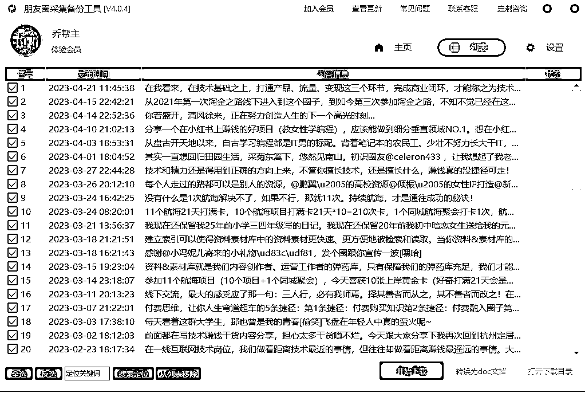
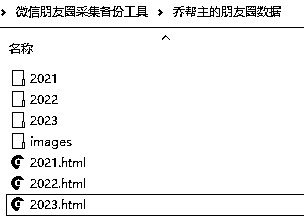
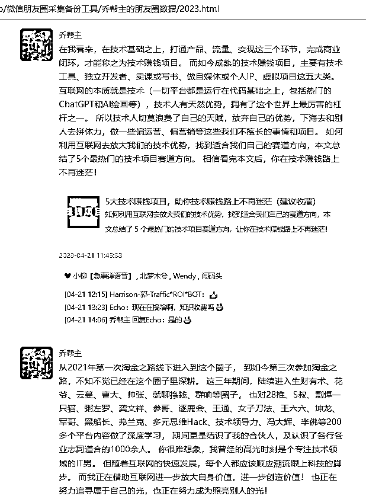

# 平台四：微信朋友圈搜集

下载地址： [`pan.baidu.com/s/1fLxAHhxDBNiA60_DSfeTLg?pwd=9kbx`](https://pan.baidu.com/s/1fLxAHhxDBNiA60_DSfeTLg?pwd=9kbx)

软件使用须知：

•运行软件并微信扫码登录：微信朋友圈采集备份工具 > 朋友圈采集备份工具 V4.0.4.exe

•登录后，可以自行选择采集自己发布的朋友圈，或采集指定好友 的朋友圈等，

采集完成后，点击“开始下载”，完成下载后，在软件程序的主目录上会多出一个“乔帮主的朋友圈数据”：

默认导出的是 html 格式，也可以转换为 doc 文档导出

更多帮助说明，可以参考安装包目录中的官网链接地址