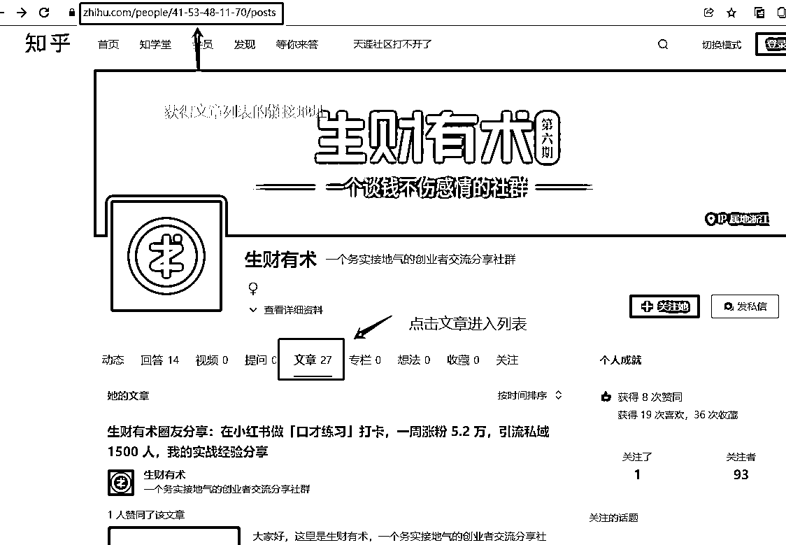
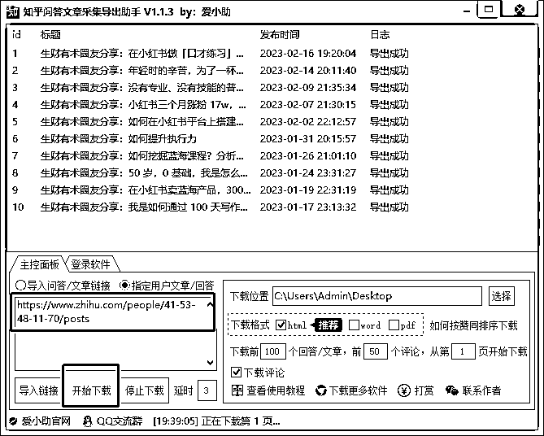

# 平台五：知乎文章搜集

下载地址： [`pan.baidu.com/s/1vys07HYQiSm0b0C-orIyyQ?pwd=4mhw`](https://pan.baidu.com/s/1vys07HYQiSm0b0C-orIyyQ?pwd=4mhw)

使用前须知：

•该软件是付费软件（季卡 29.9、年卡 49.9、永久卡 299.9），使用也是比较方便，没有相应繁琐配置。下载的数量，也是取决于知乎的风控机制

•软件支持问答和文章链接导入下载、以及采集指定用户主页下面的所有文章，其他的类型的链接暂时不支持

•运行软件并微信扫码登录：知乎文章采集导出助手 > 知乎文章采集导出助手。exe

接下来演示如何采集指定用户主页下面的所有文章，以知乎中“生财有术”用户为例，先是获得这个用户的文章列表

然后在软件中设置好下载位置目录，再把链接直接贴到软件中，直接点击“开始下载”：

最终可以看到目录中下载的文章内容明细（默认 html 格式，支持 word、pdf 格式）：

内容来源：《资料搜集|5 个热门平台的内容批量下载》

